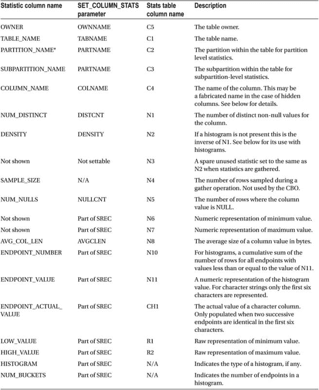

# 列统计信息

最后我们来讨论列统计信息。列统计信息与操作的成本无关，而与操作返回的行的大小和操作的基数有关。与表和索引统计信息一样，表 9-4 列出了各个列统计信息，并提供了统计视图和导出表中的相关标识符。表 9-4 还提供了 `DBMS_STATS.SET_COLUMN_STATS` 的参数名称。

### 表 9-4. 表统计信息描述

尽管列统计信息可以独立于表统计信息设置和导出，但列统计信息只能与表一起收集。`DBMS_STATS` 收集过程的 `METHOD_OPT` 参数控制收集哪些列统计信息以及是否为这些列生成直方图。

让我首先描述在没有直方图的情况下如何使用列统计信息，然后解释直方图如何改变情况。

