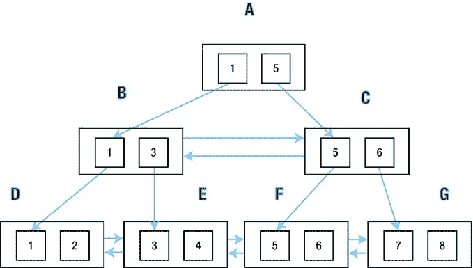

# 第 10 章


## 访问方法


在本章中，我们将探讨运行时引擎用于访问数据库中数据的主要方法。对于每种方法，我们将提供所用算法的基本细节、执行计划操作名称，以及可用于显式指定访问方法的提示。我将首先讨论 `ROWID` 是什么，以及使用它访问表的各种方式。这将自然地引出两个章节，分别讨论使用 B 树索引和位图索引来生成 ROWID 的各种方式。本章最后三节将讨论备受非议的全表扫描、鲜为人知的 `TABLE` 和 `XMLTABLE` 操作符，以及为了完整性而涵盖的簇访问——后者大多数人永远不需要使用。

### 通过 ROWID 访问

访问表中行的最有效方法是指定 `ROWID`。`ROWID` 有许多不同类型，我将在给出如何使用 `ROWID` 的示例之前，解释它们是什么以及它们如何与索引操作相关联。

### ROWID 概念

`ROWID` 是寻址表中行的基本方式。`ROWID` 有几种格式：

*   受限 `ROWID`（小文件表空间）
*   受限 `ROWID`（大文件表空间）
*   扩展 `ROWID`（小文件表空间）
*   扩展 `ROWID`（大文件表空间）
*   通用 `ROWID`（物理）
*   通用 `ROWID`（逻辑）
*   通用 `ROWID`（外部表）

最常用的 `ROWID` 格式是小文件表空间的受限 `ROWID`。它包含以下部分：

*   相对文件号（10 位）
*   块号（22 位）
*   行号（16 位）

总共 48 位，即 6 字节。前 32 位通常统称为 `相对数据块地址（RDBA）`，因为 `RDBA` 标识了表空间中的一个块。

当包含被寻址行的段可以被明确确定时，会使用受限 `ROWID`，例如在行片指针中，用于非分区表的 B 树索引，以及分区表的本地索引。这种 `ROWID` 格式意味着：

*   一个表、分区或子分区段最多可以有 4,294,967,296 (2³²) 个块
*   每个块最多可以容纳 65,536 (2¹⁶) 行

受限 `ROWID` 格式的一个变体用于 `大文件表空间`。大文件表空间只有一个数据文件，因此 `ROWID` 的整个前 32 位都可以用于块号，这一个数据文件可以拥有 4,294,967,296 个块！但请注意，大文件和小文件表空间的最大块数是相同的。大文件表空间的主要目的实际上是处理那些可能达到 65,535 个数据文件限制的巨型数据库。然而，大文件表空间也可以简化管理，因为你不必持续为增长的表空间添加数据文件。大文件表空间还可以减少进程需要保持打开的文件描述符数量，这在巨型数据库上可能是一个潜在的严重问题。

当被引用的段存在歧义时，使用扩展 `ROWID` 格式。它们出现在分区表的全局索引中。扩展 `ROWID` 额外包含了四个字节，用于表示被引用的表、分区或子分区的数据对象 ID。

通用 `ROWID` 是一个伞状类型，用于描述以下三种尚未涵盖的情况：

*   逻辑 `ROWID` 包含索引组织表中行的主键及其位置的“猜测”。
*   外部 `ROWID` 包含用于访问非 Oracle 厂商数据库中数据的网关特定信息。
*   物理 `ROWID` 就是表示为通用 `ROWID` 的扩展 `ROWID`。

通用 `ROWID` 的物理表示以一个指示适用上述哪种类型的字节开始。请记住以下几点：

*   任何类型为 `ROWID` 的列、表达式或变量都是扩展 `ROWID`。
*   任何类型为 `UROWID` 的列、表达式或变量都是通用 `ROWID`。
*   `ROWID` 伪列对于堆表或簇组织表是扩展 `ROWID`，对于索引组织表则是通用 `ROWID`。

既然我们知道了 `ROWID` 是什么，就可以开始讨论如何使用它们来访问表数据了。

### 通过 ROWID 访问

有五种方式可以使用 `ROWID` 来访问表；它们列在表 10-1 中，随后将进行更详细的讨论。

**表 10-1. 用于表访问的四种 ROWID 方法**

| 执行计划操作 | 提示 |
| --- | --- |
| `TABLE ACCESS BY USER ROWID` | `ROWID` |
| `TABLE ACCESS BY ROWID RANGE` | `ROWID` |
| `TABLE ACCESS BY INDEX ROWID` | 不适用 |
| `TABLE ACCESS BY GLOBAL INDEX ROWID` | 不适用 |
| `TABLE ACCESS BY LOCAL INDEX ROWID` | 不适用 |

当使用调用者提供的一或多个 `ROWID` 或 `UROWID` 变量访问表，或涉及 `ROWID` 伪列的使用时，执行计划中会出现 `TABLE ACCESS BY USER ROWID` 或 `TABLE ACCESS BY ROWID RANGE` 操作。但是，当运行时引擎通过使用一个或多个索引自行识别 `ROWID` 时，则以下情况成立：

*   `TABLE ACCESS BY INDEX ROWID` 表示使用从一个或多个索引获取的受限 `ROWID` 访问非分区表。
*   `TABLE ACCESS BY LOCAL INDEX ROWID` 表示使用从一个或多个本地索引获取的受限 `ROWID` 访问分区或子分区。
*   `TABLE ACCESS BY GLOBAL INDEX ROWID` 表示使用从一个或多个全局索引获取的扩展 `ROWID` 访问分区或子分区。

因为优化器在访问一个或多个索引之后才访问表，所以这三个操作没有提示。你可以提示索引访问，但如果需要表访问，它不可避免地会随之发生。

#### 批量行访问

`TABLE ACCESS BY [LOCAL|GLOBAL] INDEX ROWID` 操作的一个变体出现在 12cR1 中。这个变体的表现是操作名称末尾出现了 `BATCHED` 这个词，大概是一种优化。然而，大多数评论者观察到，无论是否使用批量处理，运行时引擎可以应用于索引访问的各种优化都适用。关键字 `BATCHED` 仅在特定情况下出现，并且可以使用 `BATCH_TABLE_ACCESS_BY_ROWID` 和 `NO_BATCH_TABLE_ACCESS_BY_ROWID` 提示来强制或抑制。

我将在介绍索引操作本身时提供通过索引进行 `ROWID` 访问的示例，但我将首先展示涉及直接 `ROWID` 访问的两个操作。我将从清单 10-1 开始，该清单涉及将单个 `ROWID` 传递给语句。

**清单 10-1. 通过指定单个 ROWID 访问表**

```sql
CREATE TABLE t1
(
   c1   NOT NULL
  ,c2   NOT NULL
  ,c3   NOT NULL
  ,c4   NOT NULL
  ,c5   NOT NULL
  ,c6   NOT NULL
)
AS
       SELECT ROWNUM
             ,ROWNUM
             ,ROWNUM
             ,ROWNUM
             ,ROWNUM
             ,ROWNUM
         FROM DUAL
   CONNECT BY LEVEL < 100;

CREATE BITMAP INDEX t1_bix2
   ON t1 (c4);

BEGIN
   FOR r IN (SELECT t1.*, ORA_ROWSCN oscn, ROWID rid
               FROM t1
              WHERE c1 = 1)
   LOOP
      LOOP
         UPDATE /*+ TAG1 */
               t1
            SET c3 = r.c3 + 1
          WHERE ROWID = r.rid AND ORA_ROWSCN = r.oscn;

         IF SQL%ROWCOUNT > 0 -- 更新成功
         THEN
            EXIT;
         END IF;
         -- 显示某种错误信息
      END LOOP;
   END LOOP;
END;
/

SELECT p.*
  FROM v$sql s
      ,TABLE (
          DBMS_XPLAN.display_cursor (sql_id => s.sql_id, format => 'BASIC')) p
 WHERE sql_text LIKE 'UPDATE%TAG1%';
```

| Id | 操作 | 名称 |
| --- | --- | --- |


## B 树索引访问

本节讨论 B 树索引可用于访问表数据的各种方法，下一节将讨论位图索引。表 10-2 列举了各种 B 树访问方法。

### 表 10-2. B 树索引访问方法

| 执行计划操作 | 提示 | 替代提示 |
| --- | --- | --- |
| `INDEX FULL SCAN` | `INDEX` |  |
| `INDEX FULL SCAN (MIN/MAX)` | `INDEX` |  |
| `INDEX FULL SCAN DESCENDING` | `INDEX_DESC` |  |
| `INDEX RANGE SCAN` | `INDEX` | `INDEX_RS_ASC` |
| `INDEX RANGE SCAN DESCENDING` | `INDEX_DESC` | `INDEX_RS_DESC` |
| `INDEX RANGE SCAN (MIN/MAX)` | `INDEX` |  |
| `INDEX SKIP SCAN` | `INDEX_SS` | `INDEX_SS_ASC` |
| `INDEX SKIP SCAN DESCENDING` | `INDEX_SS_DESC` |  |
| `INDEX UNIQUE SCAN` | `INDEX` | `INDEX_RS_ASC` |
| `INDEX FAST FULL SCAN` | `INDEX_FFS` |  |
| `INDEX SAMPLE FAST FULL SCAN` | `INDEX_FFS` |  |
| `HASH JOIN` | `INDEX_JOIN` |  |
| `AND-EQUAL` | `AND_EQUAL` |  |

访问 B 树索引的方式似乎多得令人眼花缭乱，但我认为我已经在上面全部列出了。让我们从详细分析顶部的 `INDEX FULL SCAN` 开始，然后快速地逐一探讨。

### INDEX FULL SCAN

图 10-1 提供了一个简化视图的索引，我们将以此作为指引。



图 10-1. B 树索引的简化视图

图 10-1 描绘了一个索引根块 `A`，两个分支块 `B` 和 `C`，以及四个叶块 `D`、`E`、`F` 和 `G`。我在每个块中只画了两个索引条目。在实际中，可能有数百个条目。因此，如果每个块有 200 个条目，那么可能有一个根块，200 个分支块，40,000 个叶块，以及这些叶块中的 8,000,000 个索引条目。

一次 `INDEX FULL SCAN` 从索引的根部开始：即图 10-1 中的块 `A`。我们使用块中的指针沿着索引结构的左侧向下遍历，直到获得包含前导索引列最小值的块，即块 `D`。然后，我们沿着叶节点上的前向指针进行访问，依次访问 `E`、`F` 和 `G`。

索引扫描创建一个中间结果集，其中包含索引中的所有列以及 `ROWID`。当然，如果我们的 `WHERE` 子句中有选择谓词（或者在 `FROM` 列表中可以被视为选择谓词的谓词），那么我们可以在扫描过程中过滤掉行。同样明显的是，我们可以丢弃任何不需要的列，并根据选择列表中的表达式创建新列。

代码清单 10-1 创建了一个表和一个关联的索引，然后执行一个 PL/SQL 块，该块演示了所谓的`乐观锁定`中所涉及的基本技术，用于交互式应用程序。其思想是，当数据显示给用户时（未显示），会保存 `ROWID` 和 `ORA_ROWSCN` 伪列。如果用户决定更新显示的行，则通过指定先前保存的 `ROWID` 来直接更新。在行显示后和更新前之间，如果其他用户更改了该行，将反映在 `ORA_ROWSCN` 伪列的变化中。更新语句中的谓词 `ORA_ROWSCN = r.oscn` 用于确保没有发生此类更改。

请注意，我应用了两个我最喜欢的技巧：第一，使用返回单行的游标以避免声明 PL/SQL 变量；第二，通过横向连接和 PL/SQL 代码中类似提示的标签来提取嵌入式 `UPDATE` 语句的执行计划。这与我在代码清单 8-9 中使用的方法相同。

代码清单 10-1 涵盖了使用 `ROWID` 访问单行。也可以使用 `ROWID` 来指定一个物理行范围。这种机制最常见的用途是手动并行化查询或更新。代码清单 10-2 展示了如何更新 `T1` 中的第二组十行。

代码清单 10-2. 更新表中间范围的一组行

```
MERGE /*+ rowid(t1)leading(q) use_nl(t1) */
     INTO  t1
     USING (WITH q1
                 AS (  SELECT /*+ leading(a) use_nl(b) */  ROWID rid, ROWNUM rn
                         FROM t1
                     ORDER BY ROWID)
            SELECT a.rid min_rid, b.rid max_rid
              FROM q1 a, q1 b
             WHERE a.rn = 11 AND b.rn = 20) q
        ON (t1.ROWID BETWEEN q.min_rid AND q.max_rid)
WHEN MATCHED
THEN
   UPDATE SET c3 = c3 + 1;
```

```
| Id  | Operation                            | Name                        |
|   0 | MERGE STATEMENT                      |                             |
|   1 |  MERGE                               | T1                          |
|   2 |   VIEW                               |                             |
|   3 |    NESTED LOOPS                      |                             |
|   4 |     VIEW                             |                             |
|   5 |      TEMP TABLE TRANSFORMATION       |                             |
|   6 |       LOAD AS SELECT                 | SYS_TEMP_0FD9D6626_47CA26D6 |
|   7 |        SORT ORDER BY                 |                             |
|   8 |         COUNT                        |                             |
|   9 |          BITMAP CONVERSION TO ROWIDS |                             |
|  10 |           BITMAP INDEX FAST FULL SCAN| T1_BIX2                     |
|  11 |       NESTED LOOPS                   |                             |
|  12 |        VIEW                          |                             |
|  13 |         TABLE ACCESS FULL            | SYS_TEMP_0FD9D6626_47CA26D6 |
|  14 |        VIEW                          |                             |
|  15 |         TABLE ACCESS FULL            | SYS_TEMP_0FD9D6626_47CA26D6 |
|  16 |     TABLE ACCESS BY ROWID RANGE      | T1                          |
```

试着想象 `T1` 中有 100,000,000 行而不是 100 行。想象有十个线程，每个线程对 1,000,000 行执行一些复杂操作，而不是如代码清单 10-2 所示，对 100 行中的第二组十行执行微不足道的操作。

代码清单 10-2 中 `MERGE` 语句的子查询确定了表中的第十一个和第二十个 `ROWID`，然后用它们来指示要更新的表的物理部分。由于表 `T1` 非常小，需要使用一些提示，包括 `ROWID` 提示，来演示 `TABLE ACCESS BY ROWID RANGE` 操作，否则 CBO 会相当正确地认为该操作效率低下。

当然，代码清单 10-2 是高度人工构造的。这个示例的几个问题之一是我编写它的方式暗示了识别 `ROWID` 范围的工作被假想的十个线程中的每一个复制了。更好的方法是利用数据字典视图 `DBA_EXTENTS` 中的信息，一次性为所有线程完成 `ROWID` 范围的识别。实际上，有一个包——`DBMS_PARALLEL_EXECUTE`——可以为你完成这项工作。更多详细信息，请参阅 PL/SQL 包和类型参考手册。


如果我们只需要该表中位于索引中的列，则无需执行更多操作。至此已完成。然而，大多数情况下，我们会使用 `ROWID` 通过 `TABLE ACCESS BY [LOCAL|GLOBAL] INDEX ROWID` 操作来访问关联的表、表分区或表子分区。

请注意以下几点：

*   图中块的布局纯粹是逻辑顺序。磁盘上的顺序可能大不相同。
*   因此，我们必须使用单块读取并遵循指针。这可能会降低速度。
*   `INDEX FULL SCAN` 返回的行会自动按索引列排序，因此这种访问方法可能避免排序。这可以加快速度。

Listing 10-3 是一个使用 `INDEX` 提示强制进行 `INDEX FULL SCAN` 的示例：

Listing 10-3. INDEX FULL SCAN 操作

```
CREATE INDEX t1_i1
   ON t1 (c1, c2);

SELECT /*+ index(t1 (c1,c2)) */ * FROM t1;

| Id  | Operation                   | Name  |

|   0 | SELECT STATEMENT            |       |
|   1 |  TABLE ACCESS BY INDEX ROWID| T1    |
|   2 |   INDEX FULL SCAN           | T1_I1 |
```

Listing 10-3 在 `T1` 上创建了一个多列索引。SELECT 语句包含一个指定使用该索引的提示。

 **注意** 请注意，提示中并未使用索引的名称。合法且实际上是推荐的做法是，在括号中指定要使用的索引列，而不是索引名称本身。这是为了确保如果有人重命名索引，提示不会失效。执行计划 `OUTLINE` 部分中显示的所有索引提示都使用此方法。

在某些情况下，优化器可以在此处做出巨大改进，并在所谓的 `INDEX FULL SCAN` 掩护下执行完全不同的操作。Listing 10-4 展示了在索引列上使用的聚合操作：

Listing 10-4. 带 MIN/MAX 优化的 INDEX FULL SCAN

```
 SELECT /*+ index(t1 (c1,c2)) */
            MAX (c1) FROM t1;

| Id  | Operation                  | Name  |

|   0 | SELECT STATEMENT           |       |
|   1 |  SORT AGGREGATE            |       |
|   2 |   INDEX FULL SCAN (MIN/MAX)| T1_I1 |
```

在 Listing 10-4 中实际发生的是，我们使用树的后沿从索引的根块向下移动。在本例中，后沿是 `A`、`C` 和 `G`。我们可以直接确定 `C1` 的最大值，而无需扫描整个索引。不必担心 `SORT AGGREGATE`。正如我在第 3 章中解释的那样，`SORT AGGREGATE` 操作从不排序。

我在 2009 年 9 月的博客中研究了 Oracle Database 10g 的许多限制和特殊情况，见此处：

```
http://tonyhasler.wordpress.com/2009/09/08/index-full-scan-minmax/
```

我怀疑这是一个不断变化的目标，我那时说的很多内容可能在 Oracle Database 的后续版本中不再适用，因此如果您正在寻找此操作却无法使其工作，可能只需稍微调整一下您的谓词。

还有一个 `INDEX FULL SCAN DESCENDING` 操作。它从最大值开始，并使用向后指针在索引中回溯。区别在于行以降序返回，这可以避免排序，如 Listing 10-5 所示。

Listing 10-5. `INDEX FULL SCAN DESCENDING`

```
 SELECT /*+ index_desc(t1 (c1,c2)) */
        *
    FROM t1
ORDER BY c1 DESC, c2 DESC;

| Id  | Operation                   | Name  |

|   0 | SELECT STATEMENT            |       |
|   1 |  TABLE ACCESS BY INDEX ROWID| T1    |
|   2 |   INDEX FULL SCAN DESCENDING| T1_I1 |
```

请注意，尽管存在 `ORDER BY` 子句，但没有排序操作。现在，让我们继续讨论列表中的下一个访问方法。

## INDEX RANGE SCAN

`INDEX RANGE SCAN` 与 `INDEX FULL SCAN` 非常相似。事实上，它们如此相似，以至于使用了相同的提示来选择它。区别在于，当查询块中存在对索引的一个或多个前导列的合适谓词时，我们可能能够从中间某处开始和/或在中间某处停止扫描叶子块。在上面的图中，谓词 `C1 BETWEEN 3 AND 5` 将使我们能够从根块 `A` 下到 `B`，读取 `E` 和 `F`，然后停止。Listing 10-6 演示了这一点：

Listing 10-6. INDEX RANGE SCAN

```
 SELECT /*+ index(t1 (c1,c2)) */
            *
        FROM t1
       WHERE c1 BETWEEN 3 AND 5;

| Id  | Operation                   | Name  |

|   0 | SELECT STATEMENT            |       |
|   1 |  TABLE ACCESS BY INDEX ROWID| T1    |
|   2 |   INDEX RANGE SCAN          | T1_I1 |
```

当 `INDEX RANGE SCAN` 可用时，执行 `INDEX FULL SCAN` 是没有意义的，优化器永远不会选择它。我猜这就是为什么 `INDEX RANGE SCAN` 的单独提示没有被记录的原因。

有些人会推荐使用替代的、未记录在案的 `INDEX_RS_ASC` 提示，因为它更具体。就我个人而言，我对使用未记录在案的提示毫无顾虑，但当存在一个已记录的提示时，我看不出这样做的意义！

我关于 `INDEX FULL SCANS` 的评论同样适用于 `INDEX RANGE SCANS`。

*   我们必须使用单块读取并遵循指针。这可能会降低速度。
*   `INDEX RANGE SCAN` 返回的行会自动按索引列排序，因此这种访问方法可能避免排序。这可以加快速度。

`INDEX RANGE SCAN DESCENDING` 是 `INDEX RANGE SCAN` 的降序变体，在 Listing 10-7 中展示。

Listing 10-7. `INDEX RANGE SCAN DESCENDING`

```
 SELECT /*+ index_desc(t1 (c1,c2)) */
              *
          FROM t1
         WHERE c1 BETWEEN 3 AND 5
      ORDER BY c1 DESC;

| Id  | Operation                    | Name  |

|   0 | SELECT STATEMENT             |       |
|   1 |  TABLE ACCESS BY INDEX ROWID | T1    |
|   2 |   INDEX RANGE SCAN DESCENDING| T1_I1 |
```

Listing 10-8 显示，`MIN/MAX` 优化可以像用于 `INDEX FULL SCAN` 一样用于范围扫描。

Listing 10-8. 带 MIN/MAX 优化的 INDEX RANGE SCAN

```
 SELECT /*+ index(t1 (c1,c2)) */
              MIN (c2)
          FROM t1
         WHERE c1 = 3
      ORDER BY c1 DESC;

| Id  | Operation                    | Name  |

|   0 | SELECT STATEMENT             |       |
|   1 |  SORT AGGREGATE              |       |
|   2 |   FIRST ROW                  |       |
|   3 |    INDEX RANGE SCAN (MIN/MAX)| T1_I1 |
```

请注意突然出现了一个额外的操作——`FIRST ROW`。当使用 `MIN/MAX` 优化时，它有时会出现。我还没弄清楚它的含义，我建议您直接忽略它。

`INDEX RANGE SCAN` 要求在索引的前导列上存在合适的谓词。如果存在一个或多个非前导列上的谓词但没有前导列上的谓词，会发生什么？`INDEX SKIP SCAN` 就是这种情况下的一个选项。

## INDEX SKIP SCAN

如果前导列的唯一值数量很少，那么一系列范围扫描（前导列的每个值一个）可能比 `INDEX FULL SCAN` 更高效。当前导列的值改变时，`INDEX SKIP SCAN` 操作会回溯 B-tree，然后再次下降以查找与新前导列值相关的范围。Listing 10-9 演示了这个操作。


### 索引跳跃扫描

```
SELECT /*+ index_ss(t1 (c1,c2)) */
              *
          FROM t1
         WHERE c2 = 3
      ORDER BY c1, c2;

| Id  | Operation                   | Name  |

|   0 | SELECT STATEMENT            |       |
|   1 |  TABLE ACCESS BY INDEX ROWID| T1    |
|   2 |   INDEX SKIP SCAN           | T1_I1 |
```

Listing 10-10 展示了其降序变体。

### 索引跳跃扫描降序

```
SELECT /*+ index_ss_desc(t1 (c1,c2)) */
              *
          FROM t1
         WHERE c2 = 3
      ORDER BY c1 DESC, c2 DESC;

| Id  | Operation                   | Name  |

|   0 | SELECT STATEMENT            |       |
|   1 |  TABLE ACCESS BY INDEX ROWID| T1    |
|   2 |   INDEX SKIP SCAN DESCENDING| T1_I1 |
```

顺便提一下，在 Oracle Database 10g 中，无法同时请求使用某个索引 **并且** 指定不使用 `INDEX SKIP SCAN`。但现在这已不再是限制。只需使用 `INDEX` 提示，你就会得到一个 `INDEX FULL SCAN`。

### 索引唯一扫描

当从唯一索引中最多访问一行时，会使用 `INDEX UNIQUE SCAN`。这是一个单独的操作，因为它的实现方式比从非唯一索引中读取恰好只有一行的数据更高效。Listing 10-11 创建了一个唯一索引，然后展示了该操作。

### 索引唯一扫描

```
CREATE UNIQUE INDEX t1_i2
   ON t1 (c2);

SELECT /*+ index(t1 (c2)) */
            *
        FROM t1
       WHERE c2 = 1;

| Id  | Operation                   | Name  |

|   0 | SELECT STATEMENT            |       |
|   1 |  TABLE ACCESS BY INDEX ROWID| T1    |
|   2 |   INDEX UNIQUE SCAN         | T1_I2 |
```

请注意，此执行计划没有“降序”变体，因为我们只检索单行数据。

### 索引快速全扫描

下一种索引访问方法是 `INDEX FAST FULL SCAN`。嗯，我们都喜欢 *快* 这个词，不是吗？显而易见的问题是：如果有一个快速的（全扫描），为什么我们还需要那个慢的？事实是，`INDEX FAST FULL SCAN` 有一个很大的限制，并且并不总是比常规的 `INDEX FULL SCAN` 更快。

`INDEX FAST FULL SCAN` 通过多块读取来读取整个索引。忘掉那些烦人的指针吧。直接把整个索引吸进来！

当然，多块读取始终是读取大量数据时比单块读取更快的方式。但是：

*   我们读取的是索引中的 **所有** 数据——而不仅仅是我们需要的叶块。
*   数据是按物理顺序提供的，而不是逻辑顺序。

关于第一点，这并不太重要。索引中几乎所有的块都是叶块，所以我们只是丢弃了很小一部分。至于第二点，我们可能并不关心顺序。即使关心顺序，将 `INDEX FAST FULL SCAN` 与显式排序相结合，也可能比其他访问方法成本更低。

关于 `INDEX FAST FULL SCAN` 真正令人失望的是，与迄今为止讨论的所有其他索引访问方法不同，我们不能使用 ROWID 来访问表。至于为什么开发人员施加了这个限制，我也不知道。

如果你是因为刚刚接到性能问题的电话，怀疑使用 `INDEX FAST FULL SCAN` 随后进行表访问会有所帮助才阅读本文，请直接跳到 第 19 章，我在那里记录了一种解决方法。

Listing 10-12 展示了该操作。

### 索引快速全扫描

```
SELECT /*+ index_ffs(t1 (c1, c2)) */
            c1, c2
        FROM t1
       WHERE c2 = 1;

| Id  | Operation            | Name  |

|   0 | SELECT STATEMENT     |       |
|   1 |  INDEX FAST FULL SCAN| T1_I1 |
```

这个例子表明，我们不一定需要索引中的所有行才能使用 `INDEX FAST FULL SCAN`；我们的 `WHERE` 子句可以自由地过滤掉其中一些行。当然，如果你想使用索引但不希望使用快速全扫描，请使用 `INDEX` 或 `INDEX_DESC` 提示。

### 索引采样快速全扫描

最后一种仅使用单个 B 树索引的访问方法，可能最常被 `DBMS_STATS` 包在收集索引统计信息时使用。它仅在与快速全扫描结合进行采样时使用。Listing 10-13 进行了演示。

### 索引采样快速全扫描

```
SELECT /*+ index_ffs(t1 (c1, c2)) */
            c1, c2
        FROM t1 SAMPLE (5);

| Id  | Operation                   | Name  |

|   0 | SELECT STATEMENT            |       |
|   1 |  INDEX SAMPLE FAST FULL SCAN| T1_I1 |
```

迄今为止讨论的所有访问方法都只涉及单个 B 树索引。Oracle 数据库的所有版本中都提供两种允许组合 B 树索引的访问方法。现在让我们看看第一种。

## 索引连接

Listing 10-14 展示了一个使用 `HR` 示例模式中的表的 `INDEX JOIN` 示例。

### 索引连接示例

```
SELECT
      e.first_name
  FROM hr.employees e
 WHERE e.manager_id >=100 AND e.last_name LIKE '%ran%';

| Id  | Operation              | Name             |

|   0 | SELECT STATEMENT       |                  |
|*  1 |  VIEW                  | index$_join$_001 |
|*  2 |   HASH JOIN            |                  |
|*  3 |    INDEX RANGE SCAN    | EMP_MANAGER_IX   |
|*  4 |    INDEX FAST FULL SCAN| EMP_NAME_IX      |
```

Listing 10-14 将 `EMPLOYEES` 表上的两个索引像表本身一样进行连接。连接的列是表的 ROWID。实际上发生的是，Listing 10-14 被转换成了 Listing 10-15。

### 手动转换的索引连接

```
WITH q1
     AS (SELECT /*+ no_merge */ first_name, ROWID r1
           FROM hr.employees
          WHERE last_name LIKE '%ran%')
    ,q2
     AS (SELECT /*+ no_merge */ ROWID r2
           FROM hr.employees
          WHERE manager_id >=100)
SELECT first_name
  FROM q1, q2
 WHERE r1 = r2;
```

Listing 10-15 中的子查询 `Q1` 可以通过对 `EMP_NAME_IX` 索引的范围扫描来满足，无需访问表本身，因为我们选择的列都来自索引。子查询 `Q2` 同样可以将其访问限制在 `EMP_MANAGER_IX` 索引上。主查询然后使用来自两个索引的 ROWID 来连接两个子查询的结果。

请注意，索引连接只有在从被连接索引所属的表中所需的列都存在于索引中时才可能实现。然而，在某些情况下，可以将索引连接与常规的表连接结合使用，如 Listing 10-16 所示。

### 复杂的 INDEX JOIN 示例

```
SELECT /*+ leading(e) index_join(e) */
            e.first_name, m.last_name
        FROM hr.employees e, hr.employees m
       WHERE     m.last_name = 'Mourgos'
             AND e.manager_id = m.employee_id
             AND e.last_name = 'Grant'
             AND e.department_id = 50;

| Id  | Operation                    | Name              |
```


