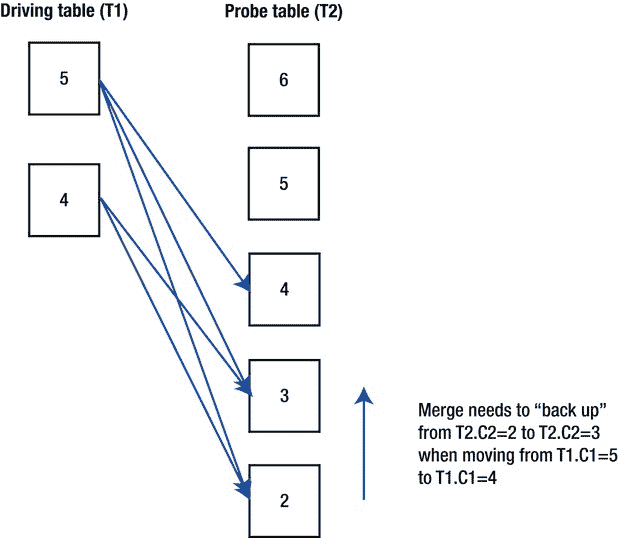
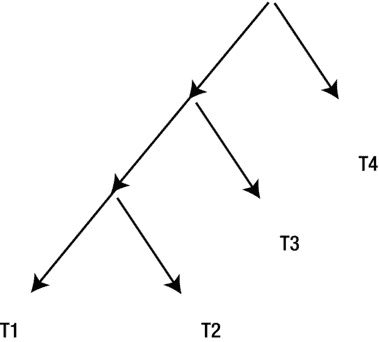

# 第 11 章


连接


每个 SQL 查询或子查询都有一个 `FROM` 子句，该子句标识一个或多个`行源`。这些行源可以是表、数据字典视图、内联视图、因子化子查询，或是涉及 `TABLE` 或 `XMLTABLE` 运算符的表达式。如果存在多个行源，则需要将这些行源产生的行进行`连接`，连接操作的数量比行源数量少一个。在第 1 章中，我介绍了连接的各种不同语法结构。这些结构包括内连接、左外连接、右外连接、全外连接和分区外连接。我还解释了哪些类型的连接可以用传统语法构建，哪些需要 ANSI 连接语法。

在本章中，我将探讨运行时引擎可用于实现任何类型连接的不同方法、行源连接顺序的相关规则，以及如何在连接中使用并行执行。我还将讨论两种类型的`子查询解嵌套`：半连接和反连接。子查询解嵌套是一种`优化器转换`，用于构建原始查询 `FROM` 子句中不存在的附加行源和连接。但首先，让我回顾一下四种连接方法。

## 连接方法

运行时引擎有四种方法可用于实现任何连接。这四种方法是`嵌套循环`、`哈希连接`、`合并连接`和`笛卡尔连接`。笛卡尔连接只是合并连接的一种简化形式，因此从某种意义上说，只有三种半连接方法。

当通过 `DBMS_XPLAN` 显示执行计划时，连接操作的两个操作数会在同一缩进级别上下排列显示。在第 1 章中，我引入了术语`驱动行源`来指代显示中顶部的行源，以及`探测行源`来指代底部的行源。正如我们即将看到的，这个术语对于嵌套循环、合并连接和笛卡尔连接是恰当的。为避免混淆，我也会将哈希连接的顶部行源称为驱动行源，将底部操作数称为探测源，尽管，正如稍后将阐明的，这些术语对于哈希连接来说并不完全贴切。

第 1 章还引入了描述连接顺序的一些语法。语法 `(T1  T2)  T3` 描述了我将称之为涉及两个连接的`连接树`。首先发生的是 `T1` 和 `T2` 之间的连接，其中 `T1` 是驱动行源，`T2` 是探测行源。此连接产生一个`中间结果集`，该结果集成为第二个连接操作的驱动行源，`T3` 作为探测行源。在本章中，我将继续使用相同的术语。现在让我们看看四种连接方法中的第一种，嵌套循环。

## 嵌套循环

嵌套循环连接方法，并且只有嵌套循环连接方法，可以通过左横向连接来支持`相关行源`。我将很快讨论左横向连接，但让我首先看看我称之为传统嵌套循环的方法，它实现的是非相关行源之间的连接。

### 传统嵌套循环

列表 11-1 连接了来自最著名示例数据库模式的两张最著名的 Oracle 数据库表。

**列表 11-1. 使用嵌套循环连接 EMP 和 DEPT (10.2.0.5)**

```sql
SELECT  /*+
gather_plan_statistics
optimizer_features_enable('10.2.0.5')
leading(e)
use_nl(d)
index(d)
*/
      e.*, d.loc
  FROM scott.emp e, scott.dept d
 WHERE hiredate > DATE '1980-12-17' AND e.deptno = d.deptno;

SET LINES 200 PAGES 0

SELECT * FROM TABLE (DBMS_XPLAN.display_cursor (format=>
                              'BASIC +IOSTATS LAST -BYTES -ROWS +PREDICATE'));

| Id  | Operation                    | Name    | Starts | A-Rows |

|   0 | SELECT STATEMENT             |         |      1 |     13 |
|   1 |  NESTED LOOPS                |         |      1 |     13 | -- 额外的列
|*  2 |   TABLE ACCESS FULL          | EMP     |      1 |     13 | -- 已移除
|   3 |   TABLE ACCESS BY INDEX ROWID| DEPT    |     13 |     13 |
|*  4 |    INDEX UNIQUE SCAN         | PK_DEPT |     13 |     13 |

谓词信息 (由操作标识):

2 - filter("HIREDATE">TO_DATE(' 1980-12-17 00:00:00', 'syyyy-mm-dd
              hh24:mi:ss'))
   4 - access("E"."DEPTNO"="D"."DEPTNO")
```

列表 11-1 连接了示例 `SCOTT` 模式中的 `EMP` 和 `DEPT` 表。我再次使用提示来生成我希望讨论的执行计划，否则 CBO 会选择更高效的计划。我使用了 `LEADING` 提示来指定驱动行源是 `EMP` 表，并使用了 `INDEX` 提示，以便通过索引访问 `DEPT`。为了能分阶段解释嵌套循环的不同方面，我还使用了 `OPTIMIZER_FEATURES_ENABLE` 提示，以便使用 10.2.0.5 的实现。`GATHER_PLAN_STATISTICS` 提示用于从 `DBMS_XPLAN.DISPLAY_CURSOR` 获取运行时数据。

第 1 行的 `NESTED LOOPS` 操作首先访问驱动表 `EMP`。内连接的语义意味着逻辑上所有 `WHERE` 子句中的谓词都在连接操作之后处理。然而，实际上，谓词 `hiredate > DATE '1980-12-17'` 是特定于 `EMP` 表的，CBO 会尽可能早地消除不符合此过滤条件的行，正如列表 11-1 执行计划的谓词部分所证实的，该部分显示过滤条件由操作 2 应用。当找到 `EMP` 中 13 个符合雇佣日期条件的行时，会识别并返回 `DEPT` 中符合连接谓词 `e.deptno = d.deptno` 的行。

尽管在 `EMP` 中有三个匹配的行 `DEPTNO` 为 10，五个为 20，十三行中有五个 `DEPTNO` 值为 30，但仍然可以使用 `DEPT.DEPTNO` 上的索引。伪代码大致如下：

```
对于 EMP 子集中的每一行
循环
        对于 DEPT 中每个匹配的行
       循环
        <返回行>
        结束循环
结束循环
```

因此称为`嵌套循环`。你可以从 `DBMS_XPLAN.DISPLAY_CURSOR` 结果的 `STARTS` 列中看到，第 4 行对 `PK_DEPT` 的索引查找和第 3 行对 `DEPT` 表的访问执行了 13 次，对应 `EMP` 中每个匹配的行各一次。

 **提示**  嵌套循环操作的探测行源的 `STARTS` 列通常与驱动行源的 `A-ROWS` 列相匹配。这个提示同样适用于 `V$STATISTICS_PLAN_ALL` 中的 `LAST_STARTS` 和 `LAST_OUTPUT_ROWS`。`半连接`和`反连接`是此规则的例外，因为它们利用了标量子查询缓存。我将很快讨论半连接和反连接。

列表 11-2 让我们看到当我们将 `OPTIMIZER_FEATURES_ENABLE` 提示更改为启用某些 11gR1 功能时会发生什么。

**列表 11-2. 使用嵌套循环连接 EMP 和 DEPT (11.2.0.1)**

```sql
SELECT  /*+
gather_plan_statistics
optimizer_features_enable('11.2.0.1')
leading(e)
use_nl(d)
index(d)
no_nlj_batching(d)
*/
      e.*, d.loc
  FROM scott.emp e, scott.dept d
WHERE hiredate > DATE '1980-12-17' AND e.deptno = d.deptno;

SET LINES 200 PAGES 0

SELECT * FROM TABLE (DBMS_XPLAN.display_cursor (format=>
                              'BASIC +IOSTATS LAST -BYTES -ROWS +PREDICATE'));

| Id  | Operation                   | Name    | Starts | E-Rows | A-Rows |
```


## 执行计划分析

```
|   0 | SELECT STATEMENT            |         |      0 |        |      0 |
|   1 |  TABLE ACCESS BY INDEX ROWID| DEPT    |      1 |      1 |     13 |
|   2 |   NESTED LOOPS              |         |      1 |     13 |     27 |
|*  3 |    TABLE ACCESS FULL        | EMP     |      1 |     13 |     13 |
|*  4 |    INDEX UNIQUE SCAN        | PK_DEPT |     13 |      1 |     13 |
```

`谓词信息（由操作 ID 标识）：`

*   3 - 过滤(`"HIREDATE">TO_DATE(' 1980-12-17 00:00:00', 'syyyy-mm-dd hh24:mi:ss')`)
*   4 - 访问(`"E"."DEPTNO"="D"."DEPTNO"`)

除了 `OPTIMIZER_FEATURES_ENABLE` 参数的更改外，清单 11-2 还通过使用 `NO_NLJ_BATCHING` 提示禁用了 11gR1 的一项新功能。清单 11-2 中的执行计划与 清单 11-1 中的不同之处在于，连接操作是操作 1（`TABLE ACCESS BY INDEX ROWID`）的子操作。这种方法称为嵌套循环预取，在 9i 中可用于 `INDEX RANGE SCAN`，但直到 11gR1 才可用于 `INDEX UNIQUE SCAN`。嵌套循环预取允许操作 1 在决定下一步操作之前，从其第 2 行的子操作中获取一定数量的 ROWID。如果返回的 ROWID 位于连续的数据块中，且这些块都不在缓冲区高速缓存中，则操作 1 可以通过进行一次多块读取来替代多次单块读取，从而获得一定的性能提升。注意，在 清单 11-1 中，第 3 行的 `TABLE ACCESS BY INDEX ROWID` 操作在 STARTS 列中的值为 13，而 清单 11-2 中的操作 1 显示的值为 1。在后一种情况下，调用一次操作 1 就足够了，因为所有的 ROWID 都是从第 2 行的子操作中获取的。

清单 11-3 展示了当我们从 清单 11-2 中移除两个加粗的提示后会发生什么。

## 嵌套循环连接批处理

清单 11-3

```sql
SELECT  /*+
        gather_plan_statistics
        leading(e)
        use_nl(d)
        index(d)
        */
        e.*, d.loc
    FROM scott.emp e, scott.dept d
  WHERE hiredate > DATE '1980-12-17' AND e.deptno = d.deptno;

SET LINES 200 PAGES 0

SELECT *
    FROM TABLE (
            DBMS_XPLAN.display_cursor (
               format   => 'BASIC +IOSTATS LAST -BYTES +PREDICATE'));
```

```
| Id  | Operation                    | Name    | Starts | E-Rows | A-Rows |
|   0 | SELECT STATEMENT             |         |      1 |        |     13 |
|   1 |  NESTED LOOPS                |         |      1 |        |     13 |
|   2 |   NESTED LOOPS               |         |      1 |     13 |     13 |
|*  3 |    TABLE ACCESS FULL         | EMP     |      1 |     13 |     13 |
|*  4 |    INDEX UNIQUE SCAN         | PK_DEPT |     13 |      1 |     13 |
|   5 |   TABLE ACCESS BY INDEX ROWID| DEPT    |     13 |      1 |     13 |
```

这里我们采用了一种称为 *嵌套循环批处理* 的优化。我们现在为一个连接执行了两个 `NESTED LOOPS` 操作。尽管嵌套循环批处理在官方上并不是一个优化器转换，但 CBO 实际上已将原始查询转换为 清单 11-4 中所示的形式。

## 模拟 10g 中的 11g 嵌套循环

清单 11-4

```sql
SELECT  /*+ leading(e d1)
        use_nl(d)
        index(d)
        rowid(d)
        optimizer_features_enable('10.2.0.5') */
        e.*, d.loc
    FROM scott.emp e, scott.dept d1, scott.dept d
   WHERE     e.hiredate > DATE '1980-12-17'
         AND e.deptno = d1.deptno
         AND d.ROWID = d1.ROWID;
```

```
| Id  | Operation                   | Name    |
|   0 | SELECT STATEMENT            |         |
|   1 |  NESTED LOOPS               |         |
|   2 |   NESTED LOOPS              |         |
|   3 |    TABLE ACCESS FULL        | EMP     |
|   4 |    INDEX UNIQUE SCAN        | PK_DEPT |
|   5 |   TABLE ACCESS BY USER ROWID| DEPT    |
```


清单 11-4 中的执行计划与清单 11-3 中的执行计划非常相似，尽管 `OPTIMIZER_FEATURES_ENABLE` 提示禁用了所有 11g 特性。清单 11-4 中的查询包含两个 `DEPT` 副本和一个 `EMP` 副本，总共三个行源，因此需要两次连接。清单 11-3 和清单 11-4 中执行计划的一个区别在于：由于我们在清单 11-4 中指定了自己的 ROWID，因此对表的访问是通过 `TABLE ACCESS BY USER ROWID` 操作进行的，而不是通过清单 11-3 中的 `TABLE ACCESS BY INDEX ROWID` 操作。

从 `DBMS_XPLAN` 的显示中，嵌套循环批处理的性能优势并不明显：在清单 11-3 中，操作 4 和 5 的 `STARTS` 列仍然显示针对 13 行数据进行了 13 次探测，但在某些情况下，物理和逻辑 I/O 操作可能仍然会减少。

 **提示** 你会在清单 11-3 中注意到，执行计划操作 4 和 5 的 `E-ROWS` 列（估计行数）显示值为 1，而 `A-ROWS` 列（实际行数）显示值为 13。这不是 CBO 的基数错误。对于 `NESTED LOOPS`，估计行数是循环每次迭代的行数，而实际行数是循环所有迭代的总行数。

嵌套循环具有一个理想的特性，即它们通常呈线性扩展。我的意思是，如果 `EMP` 和 `DEPT` 的大小翻倍，嵌套循环所需的时间也会翻倍（而不是增加更多）。

然而，嵌套循环有两个不理想的性能特性：

*   除非探测表是哈希集群的一部分（哎呀！我说过不会再提哈希集群了）或者非常小，否则需要在连接列（在本例中是 `DEPT.DEPTNO`）上建立索引。如果这样的索引不存在，那么对于 `EMP` 中的每一行，我们可能需要访问 `DEPT` 中的每一行。这不仅本身通常非常耗时，还会破坏连接的可扩展性：如果我们将 `EMP` 和 `DEPT` 的大小翻倍，那么循环所需的时间将变为四倍，因为 `EMP` 变大导致我们访问 `DEPT` 的次数翻倍，同时 `DEPT` 变大导致每次扫描所需的时间也翻倍。请注意，如果嵌套循环的探测行源是子查询或内联视图，通常无法建立索引。因此，当使用嵌套循环连接表与子查询或内联视图时，探测行源几乎总是那个表。
*   当探测行源是一个表时，被探测表中的数据块可能会被访问多次，每次挑选出不同的行。

## 左外连接

在 12cR1 版本之前，左外连接只能与我们在第 10 章中介绍的 `TABLE` 和 `XMLTABLE` 操作符一起使用。我在清单 8-9 中展示了一个涉及 `DBMS_XPLAN.DISPLAY` 的连接示例。在 12cR1 版本中，这个有用的特性通过 `LATERAL` 关键字变得更容易使用。清单 11-5 展示了它的用法示例。

清单 11-5。左外连接

```
SELECT e1.*, e3.avg_sal
  FROM scott.emp e1
      ,LATERAL (SELECT AVG (e2.sal) avg_sal
                  FROM scott.emp e2
                 WHERE e1.deptno != e2.deptno) e3;

| Id  | Operation            | Name            |

|   0 | SELECT STATEMENT     |                 |
|   1 |  NESTED LOOPS        |                 |
|   2 |   TABLE ACCESS FULL  | EMP             |
|   3 |   VIEW               | VW_LAT_A18161FF |
|   4 |    SORT AGGREGATE    |                 |
|*  5 |     TABLE ACCESS FULL| EMP             |

Predicate Information (identified by operation id):

5 - filter("E1"."DEPTNO"<>"E2"."DEPTNO")
```

清单 11-5 列出了每个员工的详细信息以及所有非其所在部门员工的平均工资。

左外连接总是通过嵌套循环实现，并且前面带有 `LATERAL` 的内联视图总是探测行源。外连接的关键优势在于，可以在内联视图中使用源自驱动行源列的谓词。当我在第 17 章中研究优化排序时，将会非常有效地使用外连接。

可以通过在内联视图后放置 `(+)` 字符来执行左外连接，但正如我在第 1 章中解释的那样，我更喜欢对外连接使用 ANSI 语法。ANSI 语法使用关键字 `CROSS APPLY` 表示内左外连接，使用 `OUTER APPLY` 表示外左外连接；当我介绍第 13 章中的优化器转换时，我将提供这两种变体的示例。

### 哈希连接

根据连接输入是否交换，哈希连接有两种变体。我们先讨论不交换连接输入的标准哈希连接，然后在本章后面更广泛地讨论连接顺序时，再考虑将交换连接输入作为一部分的变体。

让我们从查看清单 11-6 开始，它修改了清单 11-3 中的提示，指定使用哈希连接而不是嵌套循环。

清单 11-6。哈希连接

```
SELECT /*+ gather_plan_statistics
leading(e)
use_hash(d)
*/
      e.*, d.loc
  FROM scott.emp e, scott.dept d
 WHERE hiredate > DATE '1980-12-17' AND e.deptno = d.deptno;

SELECT *
  FROM TABLE (DBMS_XPLAN.display_cursor (format => 'BASIC +IOSTATS LAST'));

| Id  | Operation          | Name | Starts | E-Rows | A-Rows |

|   0 | SELECT STATEMENT   |      |      1 |        |     13 |
|*  1 |  HASH JOIN         |      |      1 |     13 |     13 |
|*  2 |   TABLE ACCESS FULL| EMP  |      1 |     13 |     13 |
|   3 |   TABLE ACCESS FULL| DEPT |      1 |      4 |      4 |

Predicate Information (identified by operation id):

1 - access("E"."DEPTNO"="D"."DEPTNO")
   2 - filter("HIREDATE">TO_DATE(' 1980-12-17 00:00:00', 'syyyy-mm-dd
              hh24:mi:ss'))
```

哈希连接的操作方式是：将来自 `EMP` 的 13 行符合选择谓词的数据放入一个工作区，该工作区包含一个以内存中哈希集群（键为 `EMP.DEPTNO`）组织的数据。然后，哈希连接对探测表 `DEPT` 进行单次遍历，对于每一行，我们对 `D.DEPTNO` 应用哈希函数并在 `EMP` 中查找任何匹配的行。

在这方面，哈希连接类似于嵌套循环连接，其中 `DEPT` 是驱动行源，存储在内存哈希集群中的 `EMP` 表副本是探测行源。然而，为了保持一致性，在我们的连接中我将继续将 `EMP` 称为驱动行源。当探测行源是一个表时，哈希连接相比嵌套循环具有以下优势：

*   探测表中的每个数据块最多只被访问一次，而不会像嵌套循环那样可能被访问多次。
*   探测表中的连接列不需要索引。
*   如果对探测表的访问使用了全表扫描（或快速全索引扫描），则可以使用多块读取，这比通过索引进行单块读取高效得多。
*   连接输入可以交换。我们很快就会讨论哈希连接输入交换。

然而，哈希连接也有以下缺点：


### 哈希连接注意事项

*   即使探测表中的某个数据块不包含与驱动行源中任何行匹配的行，它仍可能被访问。因此，例如，如果探测表大小为 1TB，没有选择谓词，并且只有两行满足连接谓词，我们仍会扫描整个 1TB 的表，而不是通过索引挑选出这两行。
*   当两个连接操作数都很小时，哈希连接会像嵌套循环一样线性扩展。然而，如果驱动行源过大，哈希表会溢出到磁盘，从而破坏线性的性能特性。
*   哈希连接只能用于等值连接谓词。

当探测行源上存在索引时，嵌套循环连接可能会多次访问某些数据块，而某些数据块则完全不访问。在带有索引的嵌套循环连接（可能多次访问块）与通过全表扫描恰好访问所有块一次的哈希连接之间做决定可能很困难。优化器会利用连接谓词的选择性与索引的聚簇因子相结合来帮助确定正确的行动方案，正如我们在第 9 章中讨论的那样。

### 合并连接

合并连接与归并排序非常相似。驱动和探测行源在开始时都被排序并放入进程私有的工作区中。然后我们以类似于嵌套循环连接的方式进行：对于驱动行源中的每一行，我们在探测行源中查找所有与该驱动行匹配的行。对于像`T1.C1=T2.C2`这样的等值连接谓词，我们可以同步遍历两个已排序的集合。然而，合并连接也可以利用*基于范围的连接谓词*，例如`T1.C1 < T2.C2`。在这种情况下，随着我们在驱动行源中前进，可能需要“回退”检查排序后探测行源的指针。

考虑清单 11-7，其中包含一个基于范围的连接谓词。

清单 11-7. 包含基于范围的连接谓词的查询

```sql
CREATE TABLE t1
AS
   SELECT ROWNUM c1
     FROM all_objects
    WHERE ROWNUM <= 100;

CREATE TABLE t2
AS
   SELECT c1 + 1 c2 FROM t1;

CREATE TABLE t3
AS
   SELECT c2 + 1 c3 FROM t2;

CREATE TABLE t4
AS
   SELECT c3 + 1 c4 FROM t3;

SELECT /*+ leading (t1) use_merge(t2)*/
       *
  FROM t1, t2
 WHERE t1.c1 > 3 AND t2.c2 < t1.c1;

| Id  | Operation           | Name |

|   0 | SELECT STATEMENT    |      |
|   1 |  MERGE JOIN         |      |
|   2 |   SORT JOIN         |      |
|   3 |    TABLE ACCESS FULL| T1   |
|   4 |   SORT JOIN         |      |
|   5 |    TABLE ACCESS FULL| T2   |
```

图 11-1 展示了由`T1`驱动的合并连接是如何实现的：



图 11-1. 合并连接

请注意：

*   由于`"<"`谓词，`T1`和`T2`都按降序排序。如果谓词是`"="`、`">"`或`">="`，则两个表都会按升序排序。
*   由于选择谓词，`T1`的工作区只包含两行。

如今，合并连接是一种相对少见的连接机制选择，但在满足以下一个或多个条件时可能很有用：

*   第一个行源已经排序，避免了合并连接通常执行的两次排序中的第一次排序。请注意，即使第二个行源初始已排序，它也总是会被再次排序！
*   要求行源按连接列排序（例如，因为有`ORDER BY`子句）。由于连接的结果生成时已经排好序，因此避免了额外的排序步骤。
*   连接列上没有索引和/或选择性/聚簇因子较弱（使得嵌套循环缺乏吸引力）。
*   连接谓词是范围谓词（排除了哈希连接）。
*   两个连接的行源都太大，以至于无法在内存中构建哈希表（使得哈希连接缺乏吸引力）。请注意，合并连接也可能溢出到磁盘，但其影响可能不如哈希连接溢出到磁盘那么严重。

### 笛卡尔连接

笛卡尔连接与合并连接非常相似（在执行计划中显示为`MERGE JOIN CARTESIAN`）。这是最后的连接方法，几乎只在没有可用的连接谓词时使用（除非你使用未文档化且可能无用的`USE_MERGE_CARTESIAN`提示）。这种连接方法的操作类似于合并连接，只是由于驱动行源中的每一行都匹配探测行源中的每一行，因此不进行排序。你可能会看到一个`BUFFER SORT`操作，但这具有误导性——它只是缓冲，并不排序。如果驱动行源有`m`行，探测行源有`n`行，那么连接将返回`m x n`行。只要`m x n`很小和/或`m`或`n`为零，笛卡尔连接就不应该成为性能问题。清单 11-8 展示了一个笛卡尔连接。

清单 11-8. 笛卡尔连接

```sql
SELECT /*+ leading (t1) use_merge_cartesian(t2)*/
       *
  FROM t1, t2;

| Id  | Operation            | Name |

|   0 | SELECT STATEMENT     |      |
|   1 |  MERGE JOIN CARTESIAN|      |
|   2 |   TABLE ACCESS FULL  | T1   |
|   3 |   BUFFER SORT        |      |
|   4 |    TABLE ACCESS FULL | T2   |
```

再次强调，`BUFFER SORT`操作是缓冲而非排序。

### 连接顺序

哈希连接输入交换是一种生成额外连接顺序的机制，否则这些顺序对 CBO 不可用。不过，在我们深入探讨哈希连接输入交换之前，让我们先确保理解在没有哈希连接输入交换的情况下可用的合法连接顺序。

#### 无哈希连接输入交换的连接顺序

在实现哈希连接输入交换之前，连接顺序适用以下限制：

*   第一次连接发生在来自`FROM`子句的两个行源之间，生成一个中间结果集。
*   第二次及所有后续的连接将使用前一次连接产生的中间结果集作为驱动行源，并使用来自`FROM`子句的另一个行源作为探测行源。

让我举个例子。如果我们连接在清单 1-18 中创建的四个表`T1`、`T2`、`T3`和`T4`，进行内连接，那么一个可能的连接树是`((T1  T2)  T3)  T4`。你可以重新排列这些表。第一个表有四种选择，第二个表有三种选择，第三个表有两种选择，第四个表只有一种选择，从而生成 24 种可能的合法连接顺序。这种连接顺序类型会导致所谓的*左深连接树*。其原因在图 11-2 中绘制连接时很清楚。



图 11-2. 左深连接树


