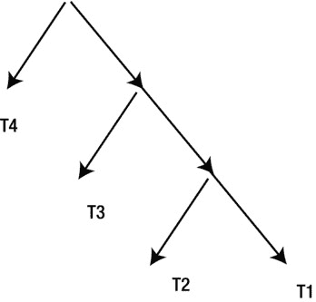
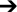

# 具有哈希连接输入交换的连接顺序

对于哈希连接（且仅限于哈希连接），优化器可以在不需要内联视图的情况下交换连接的输入。例如，假设我们开始时的连接顺序是 `((T1  T2)  T3)  T4`，然后我们交换了与 `T4` 的最终连接的输入。我们最终得到 `T4  ((T1  T2)  T3)`。我们第一次得到了一个连接，其探测行源是一个中间结果集。让我们继续这个过程，交换与 `T3` 的第二次连接的输入。这产生 `T4  (T3  (T1  T2))`。我们还可以选择交换与 `T2` 的连接。交换 `T1` 和 `T2` 的连接的输入结果为 `(T4  (T3  (T2  T1)))`。交换 `T1` 和 `T2` 的连接的输入看起来毫无意义：我们本可以直接更改连接顺序。但我们不要分心。我很快就会向你展示为什么交换第一个连接的输入可能很有用。清单 11-10 展示了我们如何以不同方式提示 清单 11-9 中的查询以控制连接输入交换。

## 清单 11-10. 一个比较交换和未交换连接输入的简单示例

```sql
SELECT /*+                                   SELECT /*+
leading (t1 t2 t3 t4)                        leading (t1 t2 t3 t4)
use_hash(t2)                                 use_hash(t2)
use_hash(t3)                                 use_hash(t3)
use_hash(t4)                                 use_hash(t4)
no_swap_join_inputs(t2)                             swap_join_inputs(t2)
no_swap_join_inputs(t3)                             swap_join_inputs(t3)
no_swap_join_inputs(t4)                             swap_join_inputs(t4)
*/                                           */
       *                                            *
  FROM t1                                      FROM t1
      ,t2                                          ,t2
      ,t3                                          ,t3
      ,t4                                          ,t4
 WHERE t1.c1 = t2.c2                         WHERE t1.c1 = t2.c2
   AND t2.c2 = t3.c3                           AND t2.c2 = t3.c3
   AND t3.c3 = t4.c4;                          AND t3.c3 = t4.c4;

----------------------------------------  --------------------------------------
| Id  | Operation               | Name |  | Id  | Operation             | Name |
----------------------------------------  --------------------------------------
|   0 | SELECT STATEMENT        |      |  |   0 | SELECT STATEMENT      |      |
|   1 |  HASH JOIN              |      |  |   1 |  HASH JOIN            |      |
|   2 |   |HASH JOIN            |      |  |   2 |   |TABLE ACCESS FULL  | T4   |
|   3 |   | |HASH JOIN          |      |  |   3 |   |HASH JOIN          |      |
|   4 |   | | |TABLE ACCESS FULL| T1   |  |   4 |    |TABLE ACCESS FULL | T3   |
|   5 |   | | |TABLE ACCESS FULL| T2   |  |   5 |    |HASH JOIN         |      |
|   6 |   | |TABLE ACCESS FULL  | T3   |  |   6 |     |TABLE ACCESS FULL| T2   |
|   7 |   |TABLE ACCESS FULL    | T4   |  |   7 |     |TABLE ACCESS FULL| T1   |
----------------------------------------  --------------------------------------
```

清单 11-10 的左侧显示了传统的左深连接树，没有交换任何连接输入。这是通过使用 `NO_SWAP_JOIN_INPUTS` 提示来实现的。你会注意到，第 3 行连接产生的中间结果集被用作第 2 行连接的驱动行源（第 3 行在垂直方向上位于第 6 行之上），并且第 2 行连接产生的中间结果集是第 1 行连接的驱动行源（第 2 行在垂直方向上位于第 7 行之上）。我在 `DBMS_XPLAN` 输出中添加了一些行以使对齐更清晰。

另一方面，清单 11-10 的右侧通过 `SWAP_JOIN_INPUTS` 提示交换了所有连接输入。现在你可以看到，由第 5 行连接形成的中间结果集是第 3 行连接的探测行源（第 5 行在垂直方向上位于第 4 行之下），并且由第 3 行连接形成的中间结果集是第 1 行连接的探测行源（第 3 行在垂直方向上位于第 2 行之下）。交换所有连接输入的结果被称为右深连接树，并在 图 11-3 中以图示方式描绘。



## 图 11-3. 右深连接树

 **注意**  如果查询中的某些连接交换了输入而另一些没有，则生成的连接树被称为 *zigzag* 树。诸如 `(T1  T2)  (T3  T4)` 的连接树被称为 *bushy* 连接，但 CBO 永远不会考虑 bushy 连接。


既然 CBO（基于成本的优化器）已经创建了这个右深连接树，运行时引擎会如何使用它呢？尽管 `LEADING` 提示声称我们从表 `T1` 开始，但运行时引擎实际上首先将从 `T4` 中选出的行放入工作区的一个内存哈希簇中。然后，它将 `T3` 的内容放入第二个工作区，将 `T2` 的内容放入第三个工作区。接着发生的是，扫描 `T1` 并将来自 `T1` 的行与 `T2` 进行匹配。`T1` 和 `T2` 匹配的结果再与来自 `T3` 的行进行匹配。最后，来自 `T1`、`T2` 和 `T3` 连接的匹配行再与来自 `T4` 的行进行匹配。

右深连接树的好处可能不会立即显现。乍一看，左深连接树似乎比右深连接树更节省内存。在左深连接树中，运行时引擎通过将 `T1` 放入工作区，开始处理 Listing 11-10 中第 3 行的连接操作。随着扫描 `T2` 并找到匹配项，连接后的行被放入与第 2 行连接相关的第二个工作区。当 `T2` 扫描结束时，包含 `T1` 的工作区不再需要，在创建操作 1 用于接收与 `T3` 连接结果所需的新工作区之前就被丢弃了。因此，一个左深连接树最多只会有两个工作区。另一方面，一个具有 `n` 个连接的右深连接树则需要 `n` 个并发工作区。

理解右深连接树好处的最佳方式是看一个来自数据仓库的例子。Listing 11-11 使用了`SH`示例模式中的表。

Listing 11-11. 在数据仓库环境中交换哈希连接输入

```
SELECT *                                  SELECT /*+
  FROM sh.sales                                      leading (sales customers products)
       JOIN sh.products                              use_hash(customers)
          USING (prod_id)                    use_hash(products)
       LEFT JOIN sh.customers                no_swap_join_inputs(customers)
          USING (cust_id);                   swap_join_inputs(products)
                                                */ *
                                           FROM sh.sales
                                             JOIN sh.products USING (prod_id)
                                             LEFT JOIN sh.customers USING (cust_id);

------------------------------------------  -----------------------------------------
| Id| Operation              | Name      |  | Id| Operation             | Name      |
------------------------------------------  -----------------------------------------
| 0 | SELECT STATEMENT       |           |  | 0 | SELECT STATEMENT      |           |
| 1 |  HASH JOIN             |           |  | 1 |  HASH JOIN            |           |
| 2 |   TABLE ACCESS FULL    | PRODUCTS  |  | 2 |   TABLE ACCESS FULL   | PRODUCTS  |
| 3 |   HASH JOIN RIGHT OUTER|           |  | 3 |   HASH JOIN OUTER     |           |
| 4 |    TABLE ACCESS FULL   | CUSTOMERS |  | 4 |    PARTITION RANGE ALL|           |
| 5 |    PARTITION RANGE ALL |           |  | 5 |     TABLE ACCESS FULL | SALES     |
| 6 |     TABLE ACCESS FULL  | SALES     |  | 6 |    TABLE ACCESS FULL  | CUSTOMERS |
------------------------------------------  -----------------------------------------
```

Listing 11-11 将`SALES`表与`CUSTOMERS`和`PRODUCTS`表连接起来，分别使用了提示和不使用提示。实际的`SALES`数据总是为每笔销售指定了一个客户，但为了演示目的，我想防止`SALES`表中的`CUST_ID`字段可能为`NULL`的情况，因此我将使用外连接来确保`SALES`中的行不会丢失。

Listing 2-9 中最大的表是`SALES`，有 918,843 行，因此我们希望最后读取该表，以避免构建可能无法放入内存的巨大哈希簇。`PRODUCTS`表有 72 行，`CUSTOMERS`表有 55,500 行，但不幸的是，没有用于连接`PRODUCTS`和`CUSTOMERS`表的谓词，将它们用笛卡尔连接的结果将产生一个包含 3,996,000 行（72 x 55,500）的中间结果。让我们看看 CBO 如何解决这个问题。

如果你仔细观察，你会发现未使用提示的查询的连接顺序是 PRODUCTS  (CUSTOMERS  SALES)——一个右深连接树。我们没有将`PRODUCTS`和`CUSTOMERS`用笛卡尔连接起来（生成一个巨大的工作区），而是创建了一个包含 72 行的工作区和另一个包含 55,500 行的工作区。然后扫描`SALES`表一次，查询返回`SALES`中与`CUSTOMERS`和`PRODUCTS`表都匹配的行。这就是答案。当将一个大表与多个小表连接时，可以使用右深连接树，方法是创建多个小工作区，而不是一个或多个大工作区。

关于 Listing 11-11 中未使用提示的执行计划，还有一个有趣的观察：第 3 行外连接中的保留行源是探测行源。

Listing 11-11 中的`HASH JOIN RIGHT OUTER`操作工作方式如下：

*   来自`CUSTOMERS`表的行被放入一个哈希簇。
*   扫描`SALES`的所有分区。来自`SALES`的每一行都与`CUSTOMERS`进行匹配，任何匹配项都被传递到与`PRODUCTS`的连接。
*   如果来自`SALES`的行在`CUSTOMERS`中没有匹配项，那么该行仍然会传递到与`PRODUCTS`的连接。

Listing 11-11 的右侧使用了提示来抑制`SALES`和`CUSTOMERS`表的输入交换，但在其他方面与左侧相同。`HASH JOIN OUTER`操作的工作方式完全不同：

*   `SALES`表被放入内存哈希簇（这次对性能不利）。
*   扫描`CUSTOMERS`表，在`SALES`中找到的任何匹配项都被传递到与`PRODUCTS`的连接。
*   当找到匹配项时，`SALES`内存哈希簇中的条目会被标记。
*   在`CUSTOMERS`扫描结束时，`SALES`哈希簇中任何未被标记的条目都被传递到与`PRODUCTS`的连接。

**外连接操作**

有许多操作支持不同形式的外连接。这些包括 `NESTED LOOPS OUTER`、`HASH JOIN OUTER`、`HASH JOIN RIGHT OUTER`、`HASH JOIN FULL OUTER`、`MERGE JOIN OUTER` 和 `MERGE JOIN PARTITION OUTER`。

*   只有哈希连接机制直接支持完全外连接。
*   出于某种原因，`HASH JOIN FULL OUTER`操作的第一个操作数必须是写在`FULL`一词左边的行源，但连接输入可以被交换。
*   你不能通过改变连接顺序来获得`HASH JOIN RIGHT OUTER`操作。你需要交换连接输入。
*   除了`HASH JOIN RIGHT OUTER`操作，驱动行源是保留的，而探测行源是可选的。
*   只有嵌套循环和合并连接支持分区外连接。

虽然我们现在已经介绍了所有显式编写的连接操作的实现，但 CBO 可以生成未以这种方式编写的额外连接。让我们继续讨论半连接，这是 CBO 可以制造的两种连接类型中的第一种。

