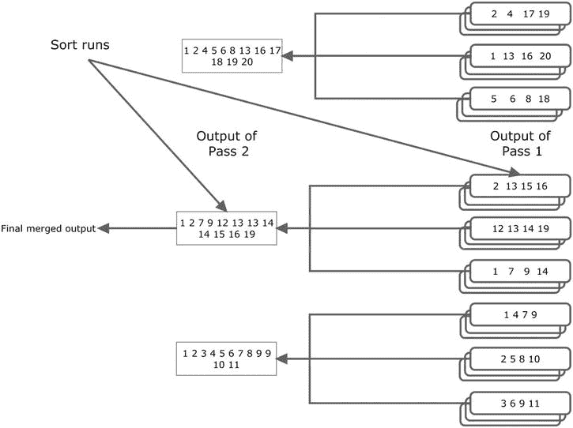

# 第 17 章：优化排序

## 总结

我们可以看到，只需简单地连接两个表并执行一个 `GROUP BY`，我们就能获得聚合值，而无需进行全表扫描的复制。

本章提供了一些许多人称之为编写糟糕的 SQL 的示例。然而，我们需要记住，今天易于阅读但性能不佳的代码，当成本优化器实现其下一个查询转换时，明天可能表现得非常完美。尽管如此，性能不佳的 SQL 几乎总是要么做了不需要做的工作，然后丢弃结果；要么需要做的工作重复了多次。本章仅提供了 CBO 在查询被重写之前无法生成最优计划的一些更常见场景的示例。如果你看到一条重要的 SQL 语句似乎做了冗余或重复的工作，你应该考虑重写它。

本章的示例都没有涉及数据排序。我发现，在过去的几年里，我花了大量时间试图避免烦人的排序带来的性能问题。我们故事的下一部分将完全聚焦于排序这个主题。


## 优化排序

我推测在 20 世纪 80 年代和 90 年代，SQL 性能问题的最大来源可能是糟糕的连接顺序。如果你选择了错误的表来开始连接，你很可能会陷入困境。如今，我们拥有相当成熟 CBO 和复杂的运行时引擎，它们共同支持右深连接树、星型转换以及其他许多高级特性。一方面，这些改进意味着对于我们这些使用 Oracle 数据库的人来说，连接顺序已远不如过去那样是个大问题。另一方面，我似乎现在花了很多时间在解决排序问题上。一条 SQL 语句经常看似挂起，吞噬所有临时表空间，导致整个数据库戛然而止。本章将完全致力于优化排序这一重要主题，并且主要关注如何高效地编写或重写 SQL。

排序优化几乎完全围绕一件事：阻止排序溢出到磁盘。如果你无法阻止排序溢出到磁盘，那么你需要尽量减少发生的磁盘活动量。实现这个目标实际上只有四种方法：

*   根本不排序。或者减少排序次数。最高效的排序就是你根本不做的排序。
*   排序更少的列。更少的列意味着更少的内存需求。
*   排序更少的行。更少的行意味着更少的内存需求以及更少的比较次数。
*   为排序获取更多内存。

这些概念很容易理解，但实现它们通常相当困难。在我们开始优化之前，让我们先回顾一下 Oracle 用于对大量数据进行排序的基本机制。

## 排序机制

当我们想到排序时，大多数人本能地想到 `ORDER BY` 子句。但排序也发生在许多其他地方。排序合并连接、聚合函数、分析函数、集合操作、模型子句、层次查询、索引的创建和重建，以及任何我忘记提及的操作都涉及排序。所有这些排序需求都是通过相同基本排序机制的变体来满足的。

如果你能在内存中对所有行进行排序，则称为最优排序。但是，如果你尝试对数据进行排序，而数据在不超出运行时引擎设定的限制的情况下无法放入内存，会发生什么？在某些时候，你的排序将溢出到磁盘。在本节中，我想讨论当排序无法完全在内存中完成时会发生什么。但首先让我简要谈谈内存分配限制是如何设置的。

### 排序的内存限制

排序最初在内存中的工作区执行。此工作区大小的上限主要由四个初始化参数间接控制：`MEMORY_TARGET`、`PGA_AGGREGATE_TARGET`、`WORKAREA_SIZE_POLICY` 和 `SORT_AREA_SIZE`。这四个参数中的最后两个可以在会话级别设置。

如果 `WORKAREA_SIZE_POLICY` 设置为 `AUTO`，那么 `PGA_AGGREGATE_TARGET`（如果设置了，则是 `MEMORY_TARGET`）会间接地尝试调节程序全局区（PGA）的内存分配，包括工作区：随着实例中会话分配的内存增多，分配给新工作区的内存就会减少。如果你将 `WORKAREA_SIZE_POLICY` 设置为 `MANUAL`（并且你可以在会话级别这样做），你就完全控制了工作区分配的限制。通常，最好将 `WORKAREA_SIZE_POLICY` 保留为 `AUTO`。但是，当你有一个关键的批处理进程，你知道它将在一天（或夜晚）的安静时段运行，并且需要分配大量可用内存时，你应该将 `WORKAREA_SIZE_POLICY` 设置为 `MANUAL`。

计算工作区内存大小的算法因版本而异，但以下陈述至少适用于 11gR2：

*   当 `WORKAREA_SIZE_POLICY` 设置为默认值 `AUTO` 时，可以分配给一个工作区的最大内存量是 1GB，无论 `PGA_AGGREGATE_TARGET` 有多大。
*   当你将 `WORKAREA_SIZE_POLICY` 设置为 `MANUAL` 时，可以分配给一个工作区的最大内存量略低于 2GB。
*   你可以通过使用并行查询为排序分配更多内存，因为每个并行查询服务进程都有自己的工作区。但是，一旦你有超过六个并行查询服务进程，分配给每个并行查询服务进程的内存量就会减少，以防止分配给特定排序的内存量变得更大。这意味着无论你做什么，你都无法为任何一个排序分配超过 12GB 的内存。

当然，这些高数值并不总能实现。一方面，一条 SQL 语句可能同时有多个活动的工作区，并且存在各种未文档化的限制，这些限制因版本而异，它们限制了某个进程一次可以分配给所有工作区的总内存量。现在让我来讨论当你的排序无法获得足够内存时会发生什么。

### 基于磁盘的排序

当行被添加到内存工作区时，它们以排序顺序维护。当内存工作区满时，一些已排序的行会被写入指定的临时表空间。这个基于磁盘的区域被称为一个排序运行。一旦排序运行被写入磁盘，内存就被释放出来用于更多的行。这个过程可以重复多次，直到所有行都被处理完毕。图 17-1 说明了其工作原理：



图 17-1. 两趟排序

```sql
 SELECT p.prod_id
        ,p.prod_name
        ,p.prod_category
        ,SUM (amount_sold) sum_amount_sold
        ,SUM (quantity_sold) sum_quantity_sold
    FROM sh.sales s, sh.products p
   WHERE s.prod_id = p.prod_id
GROUP BY p.prod_id, p.prod_name, p.prod_category;
```

| Id  | Operation               | Name     | Cost (%CPU)|
| --- | ----------------------- | -------- | ---------- |
|   0 | SELECT STATEMENT        |          |   541   (6)|
|   1 |  HASH GROUP BY          |          |   541   (6)|
|   2 |   HASH JOIN             |          |   541   (6)|
|   3 |    VIEW                 | VW_GBC_5 |   538   (6)|
|   4 |     HASH GROUP BY       |          |   538   (6)|
|   5 |      PARTITION RANGE ALL|          |   517   (2)|
|   6 |       TABLE ACCESS FULL | SALES    |   517   (2)|
|   7 |    TABLE ACCESS FULL    | PRODUCTS |     3   (0)|


