# Oracle 分页查询优化

## 分页问题

我们都遇到过这种情况。我们使用浏览器列出一个排序后的长列表。在 Google 上搜索 SQL 会产生多页结果。当你选择第 2 页时会发生什么？

假设你的浏览器会话最终导致对 Oracle 表的查询，并且每个浏览器页面显示 20 个项目，那么数据库查询必须从排序列表中选取第 21 到 40 行。由于查询来自无状态的 Web 浏览器界面，我们无法保持游标打开，因为绝大多数用户永远不会选择第二页。清单 17-14 修改了清单 17-12 中的查询以选取第二组 20 行。

## 清单 17-14. 分页问题的解决方案

```sql
WITH q1
     AS (  SELECT /*+ cardinality(s1 1e9) */
                  ROWID rid
             FROM sh.sales s1
         ORDER BY cust_id)
    ,q2
     AS (SELECT ROWNUM rn, rid
           FROM q1
          WHERE ROWNUM <= 40)
    ,q3
     AS (SELECT rid
           FROM q2
          WHERE rn > 20)
SELECT /*+ cardinality(s2 1e9) leading(q2 s2 c p)
           use_nl(s2)
           rowid(s2)
           use_nl(c) index(c)
           use_nl(p) index(p)
           */
       *
  FROM q3
       JOIN sh.sales s2 ON s2.ROWID = q3.rid
       JOIN sh.customers c USING (cust_id)
       JOIN sh.products p USING (prod_id);

| Id  | Operation                             | Name           | Rows  | Bytes |TempSpc|

|   0 | SELECT STATEMENT                      |                | 43533 |    17M|       |
|   1 |  NESTED LOOPS                         |                |       |       |       |
|   2 |   NESTED LOOPS                        |                | 43533 |    17M|       |
|   3 |    NESTED LOOPS                       |                | 43533 |    10M|       |
|   4 |     NESTED LOOPS                      |                | 43533 |  2295K|       |
|*  5 |      VIEW                             |                |    40 |  1000 |       |
|*  6 |       COUNT STOPKEY                   |                |       |       |       |
|   7 |        VIEW                           |                |  1000M|    11G|       |
|*  8 |         SORT ORDER BY STOPKEY         |                |  1000M|    15G|    26G|
|   9 |          PARTITION RANGE ALL          |                |  1000M|    15G|       |
|  10 |           BITMAP CONVERSION TO ROWIDS |                |  1000M|    15G|       |
|  11 |            BITMAP INDEX FAST FULL SCAN| SALES_CUST_BIX |       |       |       |
|  12 |      TABLE ACCESS BY USER ROWID       | SALES          |  1088 | 31552 |       |
|  13 |     TABLE ACCESS BY INDEX ROWID       | CUSTOMERS      |     1 |   189 |       |
|* 14 |      INDEX UNIQUE SCAN                | CUSTOMERS_PK   |     1 |       |       |
|* 15 |    INDEX UNIQUE SCAN                  | PRODUCTS_PK    |     1 |       |       |
|  16 |   TABLE ACCESS BY INDEX ROWID         | PRODUCTS       |     1 |   173 |       |

Predicate Information (identified by operation id):

5 - filter("RN">20)
   6 - filter(ROWNUM<=40)
   8 - filter(ROWNUM<=40)
  14 - access("S2"."CUST_ID"="C"."CUST_ID")
  15 - access("S2"."PROD_ID"="P"."PROD_ID")
```

清单 17-14 对清单 17-12 做了两处改动。第一处改动是增加了两个带有因子的子查询`Q2`和`Q3`，确保我们只从排序列表中获取第二组 20 行。第二处改动是使用嵌套循环来访问维度表，因为我们现在只从`SH.SALES`获取 20 行。当然，在实际生活中，数字 21 和 40 将是绑定变量。

## 是否需要 ORDER BY 子句？

Oracle 在这个话题上有相当多的政治姿态。理论上，除非你提供`ORDER BY`子句，否则 Oracle 不会保证数据库会按正确的顺序返回行。官方立场是，除非你提供`ORDER BY`子句，否则 Oracle 不能保证清单 17-12 和 17-14 中的查询在未来的版本中会产生正确顺序的结果。

Oracle 采取这种立场有充分的理由。当 10gR1 发布时，许多依赖于`SORT GROUP BY`排序的查询在执行计划被更改为使用新引入的、更高效的`HASH GROUP BY`操作时崩溃了。一些客户因此不公平地批评了 Oracle 破坏客户代码。Oracle 不想被视为纵容任何可能被解释为先例的行为，也不想传递`ORDER BY`子句不必要的信息。

然而，当你像我在清单 17-12 和 17-14 中那样对子句进行重度暗示时，代码在将来版本中崩溃的风险很小，即使崩溃了，也一定会有解决方法。让我反过来论证一下。事实证明，如果你避免 ANSI 语法，你可以给清单 17-14 添加`ORDER BY`子句，而不会发生额外的排序。我不会为了政治正确而那样做，因为如果你升级到更高版本，存在额外排序可能悄悄潜入的风险！

如果你想在下班后争论 Oracle 政治，你总是可以提起排序哈希集群这个话题。排序哈希集群是集群的一个晦涩变体，在 10gR1 中作为优化排序的一种方式被引入。但是这个优化只有在你*不*包含显式的`ORDER BY`子句时才有效！

实际上，这些都是无稽之谈。业务需求是让关键查询运行得快，所以做需要做的事，把风险记录在你的风险登记册中留给后人，然后继续你的生活。

## 减少排序的行数

我们花了相当长的篇幅讨论了通过减少排序的列数来减少排序数据量的各种方法。另一种减少排序数据量的方法是排序更少的行，这种方法也有可能通过避免比较来减少 CPU。减少排序中的行数有时说起来容易做起来难。让我们从一个相对简单的案例开始：向带有分析函数的查询中添加谓词。

## 使用分析函数添加额外的谓词

几年前，我与一位客户合作——我称他为 John——他在一家投资银行的风险管理团队工作。John 需要他的 Oracle 数据库做一些花哨的分析——至少对我这个非数学家来说似乎很花哨。John 不仅需要看到移动平均值，还需要看到移动标准差、移动中值和许多其他移动指标。通常移动的时间窗口相当小。让我用`SH.SALES`表来转述 John 的一个问题。看看清单 17-15，它实现了一个移动平均。

## 清单 17-15. 移动平均的首次尝试


## SQL 查询优化示例

### 初始查询及其执行计划

```sql
WITH q1
     AS (SELECT s.*
               ,AVG (
                   amount_sold)
                OVER (
                   PARTITION BY cust_id
                   ORDER BY time_id
                   RANGE BETWEEN INTERVAL '6' DAY PRECEDING AND CURRENT ROW)
                   avg_weekly_amount
           FROM sh.sales s)
SELECT *
  FROM q1
 WHERE time_id = DATE '2001-10-18';
```

| Id  | Operation             | Name  | Rows  | Bytes |TempSpc| Cost |
| --- | --------------------- | ----- | ----- | ----- | ----- | ---- |
|   0 | SELECT STATEMENT      |       |   918K|    87M|       |  7810|
|*  1 |  VIEW                 |       |   918K|    87M|       |  7810|
|   2 |   WINDOW SORT         |       |   918K|    25M|    42M|  7810|
|   3 |    PARTITION RANGE ALL|       |   918K|    25M|       |   440|
|   4 |     TABLE ACCESS FULL | SALES |   918K|    25M|       |   440|

Predicate Information (identified by operation id):
1 - filter("TIME_ID"=TO_DATE(' 2001-10-18 00:00:00', 'syyyy-mm-dd hh24:mi:ss'))

代码清单 17-15 列出了发生在 2001 年 10 月 18 日的所有来自`SH.SALES`的数据。添加了一个额外的列`AVG_WEEKLY_AMOUNT`，它列出了当前客户在截至当前日期的七天内交易的平均值。

 **注意** 正如我在第 7 章中解释的那样，当指定`RANGE`时，SQL 术语`CURRENT ROW`实际上意味着当前值，因此即使当前行中出现后续行，也会包含当天的所有销售记录。

这个查询效率非常低下。效率低下的原因是我们先对整个`SH.SALES`表进行排序，然后才选择我们需要的行——你可以看到过滤谓词是由第 1 行的操作应用的。我们无法将谓词推送到视图中，因为我们需要一周的数据来计算分析函数。我们可以通过添加第二个不同的、在调用分析函数之前应用的谓词来轻松改进此查询的性能。代码清单 17-16 展示了这种方法。

### 性能优化方法

代码清单 17-16。添加额外谓词以优化分析性能

```sql
WITH q1
     AS (SELECT s.*
               ,AVG (
                   amount_sold)
                OVER (
                   PARTITION BY cust_id
                   ORDER BY time_id
                   RANGE BETWEEN INTERVAL '6' DAY PRECEDING AND CURRENT ROW)
                   avg_weekly_amount
           FROM sh.sales s
          WHERE time_id >=DATE '2001-10-12' AND time_id <= DATE '2001-10-18')
SELECT *
  FROM q1
 WHERE time_id = DATE '2001-10-18';
```

| Id  | Operation                | Name  | Rows  | Bytes | Cost |
| --- | ------------------------ | ----- | ----- | ----- | ---- |
|   0 | SELECT STATEMENT         |       |  7918 |   773K|    38|
|*  1 |  VIEW                    |       |  7918 |   773K|    38|
|   2 |   WINDOW SORT            |       |  7918 |   224K|    38|
|   3 |    PARTITION RANGE SINGLE|       |  7918 |   224K|    37|
|*  4 |     TABLE ACCESS FULL    | SALES |  7918 |   224K|    37|

Predicate Information (identified by operation id):
1 - filter("TIME_ID"=TO_DATE(' 2001-10-18 00:00:00', 'syyyy-mm-dd hh24:mi:ss'))
4 - filter("TIME_ID"<=TO_DATE(' 2001-10-18 00:00:00', 'syyyy-mm-dd hh24:mi:ss') AND "TIME_ID">=TO_DATE(' 2001-10-12 00:00:00', 'syyyy-mm-dd hh24:mi:ss'))

代码清单 17-16 添加了第二个谓词，将排序的数据限制为仅需要的七天，从而在性能上取得了巨大成功。

现在这并不太难，对吧？不幸的是，现实生活远没有这么简单。让我们看看一些推广我们解决方案的方法。

### 使用 Lateral Joins 的视图实现

事实证明，John 并不是使用 SQL*Plus 来运行他的 SQL。他实际上使用了一个复杂的可视化软件来为外部客户准备报告。它结合了来自多个品牌的数据库、电子表格和许多其他来源的数据。这个可视化软件对分析函数一无所知，所以所有这些复杂的逻辑都必须隐藏在视图中。代码清单 17-17 展示了定义和使用一个名为`SALES_ANALYTICS`的视图的第一种方法。

代码清单 17-17。SALES_ANALYTICS 的一个低效实现

```sql
CREATE OR REPLACE VIEW sales_analytics
AS
   SELECT s.*
         ,AVG (
             amount_sold)
          OVER (PARTITION BY cust_id
                ORDER BY time_id
                RANGE BETWEEN INTERVAL '6' DAY PRECEDING AND CURRENT ROW)
             avg_weekly_amount
     FROM sh.sales s;

SELECT *
  FROM sales_analytics
 WHERE time_id = DATE '2001-10-18';
```

| Id  | Operation             | Name            | Rows  | Bytes |TempSpc| Cost |
| --- | --------------------- | --------------- | ----- | ----- | ----- | ---- |
|   0 | SELECT STATEMENT      |                 |   918K|    87M|       |  7810|
|*  1 |  VIEW                 | SALES_ANALYTICS |   918K|    87M|       |  7810|
|   2 |   WINDOW SORT         |                 |   918K|    25M|    42M|  7810|
|   3 |    PARTITION RANGE ALL|                 |   918K|    25M|       |   440|
|   4 |     TABLE ACCESS FULL | SALES           |   918K|    25M|       |   440|

Predicate Information (identified by operation id):
1 - filter("TIME_ID"=TO_DATE(' 2001-10-18 00:00:00', 'syyyy-mm-dd hh24:mi:ss'))

`SALES_ANALYTICS`的定义无法以我们在代码清单 17-16 中使用的方式包含第二个日期谓词，而不进行日期范围的硬编码。代码清单 17-18 展示了一种解决此问题的方法，它使用了 12cR1 中引入的 lateral join 语法。

代码清单 17-18。在视图中使用带有单个维度表的 Lateral Joins

```sql
CREATE OR REPLACE VIEW sales_analytics
AS
   SELECT s2.prod_id
         ,s2.cust_id
         ,t.time_id
         ,s2.channel_id
         ,s2.promo_id
         ,s2.quantity_sold s2
         ,s2.amount_sold
         ,s2.avg_weekly_amount
     FROM sh.times t
         ,LATERAL(
             SELECT s.*
                   ,AVG (
                       amount_sold)
                    OVER (
                       PARTITION BY cust_id
                       ORDER BY s.time_id
                       RANGE BETWEEN INTERVAL '6' DAY PRECEDING
                             AND     CURRENT ROW)
                       avg_weekly_amount
               FROM sh.sales s
              WHERE s.time_id BETWEEN t.time_id - 6 AND t.time_id) s2
              WHERE s2.time_id = t.time_id;
```

```sql
SELECT *
  FROM sales_analytics
 WHERE time_id = DATE '2001-10-18';
```

| Id  | Operation                   | Name            | Rows  | Bytes |TempSpc| Cost |
| --- | --------------------------- | --------------- | ----- | ----- | ----- | ---- |
|   0 | SELECT STATEMENT            |                 | 27588 |  2667K|       |   772|
|   1 |  NESTED LOOPS               |                 | 27588 |  2667K|       |   772|
|*  2 |   INDEX UNIQUE SCAN         | TIMES_PK        |     1 |     8 |       |     0|
|*  3 |   VIEW                      | VW_LAT_4DB60E85 | 27588 |  2451K|       |   772|
|   4 |    WINDOW SORT              |                 | 27588 |   862K|  1416K|   772|
|   5 |     PARTITION RANGE ITERATOR|                 | 27588 |   862K|       |   530|
|*  6 |      TABLE ACCESS FULL      | SALES           | 27588 |   862K|       |   530|

Predicate Information (identified by operation id):
2 - access("T"."TIME_ID"=TO_DATE(' 2001-10-18 00:00:00', 'syyyy-mm-dd hh24:mi:ss'))
3 - filter("S2"."TIME_ID"=TO_DATE(' 2001-10-18 00:00:00', 'syyyy-mm-dd hh24:mi:ss'))
6 - filter("S"."TIME_ID"<="T"."TIME_ID" AND "S"."TIME_ID">=INTERNAL_FUNCTION("T"."TIME_ID")-6)


## 理解横向连接与视图合并

参考清单 17-18，其中使用了横向连接（lateral join）和`SH.TIMES`维度表的组合，从而包含了一个初始的过滤谓词而无需硬编码日期。现在当我们执行查询时，谓词*可以*被推入视图，因为它可以无需修改地应用于`SH.TIMES`维度表。嗯，严格来说谓词并没有被“推入”。视图被合并了，但效果是相同的：只从`SH.TIMES`表中选择了一行。

这非常巧妙，但如果我们想查看一个日期范围呢？我们可以通过在视图定义中添加几个额外的列来实现。清单 17-19 向我们展示了如何做。

### 在视图中使用带有两个维度表的横向连接 (清单 17-19)

```sql
CREATE OR REPLACE VIEW sales_analytics
AS
   SELECT t1.time_id min_time, t2.time_id max_time, s2.*
     FROM sh.times t1
         ,sh.times t2
         ,LATERAL (
             SELECT s.*
                   ,AVG (
                       amount_sold)
                    OVER (
                       PARTITION BY cust_id
                       ORDER BY s.time_id
                       RANGE BETWEEN INTERVAL '6' DAY PRECEDING
                             AND     CURRENT ROW)
                       avg_weekly_amount
               FROM sh.sales s
              WHERE s.time_id BETWEEN t1.time_id - 6 AND t2.time_id) s2
              WHERE s2.time_id >= t1.time_id;
```

```sql
 SELECT *
    FROM sales_analytics
   WHERE min_time = DATE '2001-10-01' AND max_time = DATE '2002-01-01';
```

执行计划输出：

```
| Id  | Operation                   | Name            | Rows  | Bytes |TempSpc| Cost |
|---|---|---|---|---|---|---|
|   0 | SELECT STATEMENT            |                 | 27588 |  3125K|       |   772|
|   1 |  NESTED LOOPS               |                 | 27588 |  3125K|       |   772|
|   2 |   NESTED LOOPS              |                 |     1 |    16 |       |     0|
|*  3 |    INDEX UNIQUE SCAN        | TIMES_PK        |     1 |     8 |       |     0|
|*  4 |    INDEX UNIQUE SCAN        | TIMES_PK        |     1 |     8 |       |     0|
|*  5 |   VIEW                      | VW_LAT_4DB60E85 | 27588 |  2694K|       |   772|
|   6 |    WINDOW SORT              |                 | 27588 |   862K|  1416K|   772|
|   7 |     PARTITION RANGE ITERATOR|                 | 27588 |   862K|       |   530|
|*  8 |      TABLE ACCESS FULL      | SALES           | 27588 |   862K|       |   530|
```

谓词信息：

```
3 - access("T2"."TIME_ID"=TO_DATE(' 2002-01-01 00:00:00', 'syyyy-mm-dd hh24:mi:ss'))
   4 - access("T1"."TIME_ID"=TO_DATE(' 2001-10-01 00:00:00', 'syyyy-mm-dd hh24:mi:ss'))
   5 - filter("S2"."TIME_ID">="T1"."TIME_ID" AND
              "S2"."TIME_ID">=TO_DATE(' 2001-10-01 00:00:00', 'syyyy-mm-dd hh24:mi:ss'))
   8 - filter("S"."TIME_ID"<="T2"."TIME_ID" AND
              "S"."TIME_ID">=INTERNAL_FUNCTION("T1"."TIME_ID")-6)
```

清单 17-19 在我们的视图定义中添加了两列`MIN_TIME`和`MAX_TIME`，可以在调用查询中使用它们来指定所需的日期范围。我们将维度表连接了两次，这样我们就有两个值可以被嵌入的谓词使用。

### 在早期版本中使用横向连接 (清单 17-20)

这很好。但如果你必须处理像 John 那样的 12c 之前的数据库怎么办？嗯，事实证明横向连接在 Oracle 数据库中实际上已经可用很长时间了。然而，要在旧版本中使用它们，你需要定义几个数据字典类型，如清单 17-20 所示。

#### 使用数据字典类型的横向连接 (清单 17-20)

```sql
CREATE OR REPLACE TYPE sales_analytics_ot
   FORCE AS OBJECT
(
   prod_id NUMBER
  ,cust_id NUMBER
  ,time_id DATE
  ,channel_id NUMBER
  ,promo_id NUMBER
  ,quantity_sold NUMBER (10, 2)
  ,amount_sold NUMBER (10, 2)
  ,avg_weekly_amount NUMBER (10, 2)
);

CREATE OR REPLACE TYPE sales_analytics_tt AS TABLE OF sales_analytics_ot;

CREATE OR REPLACE VIEW sales_analytics
AS
   SELECT t1.time_id min_time, t2.time_id max_time, s2.*
     FROM sh.times t1
         ,sh.times t2
         ,TABLE (
             CAST (
                MULTISET (
                   SELECT s.*
                         ,AVG (
                             amount_sold)
                          OVER (
                             PARTITION BY cust_id
                             ORDER BY time_id
                             RANGE BETWEEN INTERVAL '6' DAY PRECEDING
                                   AND     CURRENT ROW)
                             avg_weekly_amount
                     FROM sh.sales s
                    WHERE s.time_id BETWEEN t1.time_id - 6 AND t2.time_id)
                          AS sales_analytics_tt))s2
                    WHERE s2.time_id >= t1.time_id;

SELECT *
    FROM sales_analytics
   WHERE min_time = DATE '2001-10-01' AND max_time = DATE '2002-01-01';
```

执行计划输出：

```
| Id  | Operation                                      | Name           | Rows  | Bytes | Cost |
|---|---|---|---|---|---|
|   0 | SELECT STATEMENT                               |                |  8168 |   143K|    29|
|   1 |  NESTED LOOPS                                  |                |  8168 |   143K|    29|
|   2 |   NESTED LOOPS                                 |                |     1 |    16 |     0|
|*  3 |    INDEX UNIQUE SCAN                           | TIMES_PK       |     1 |     8 |     0|
|*  4 |    INDEX UNIQUE SCAN                           | TIMES_PK       |     1 |     8 |     0|
|   5 |   COLLECTION ITERATOR SUBQUERY FETCH           |                |  8168 | 16336 |    29|
|*  6 |    WINDOW SORT                                 |                |  2297 | 73504 |   275|
|*  7 |     FILTER                                     |                |       |       |      |
|   8 |      PARTITION RANGE ITERATOR                  |                |  2297 | 73504 |   275|
|   9 |       TABLE ACCESS BY LOCAL INDEX ROWID BATCHED| SALES          |  2297 | 73504 |   275|
|  10 |        BITMAP CONVERSION TO ROWIDS             |                |       |       |      |
|* 11 |         BITMAP INDEX RANGE SCAN                | SALES_TIME_BIX |       |       |      |
```

谓词信息：

```
3 - access("T2"."TIME_ID"=TO_DATE(' 2002-01-01 00:00:00', 'syyyy-mm-dd hh24:mi:ss'))
   4 - access("T1"."TIME_ID"=TO_DATE(' 2001-10-01 00:00:00', 'syyyy-mm-dd hh24:mi:ss'))
   6 - filter("T1"."TIME_ID"<=SYS_OP_ATG(VALUE(KOKBF$),3,4,2) AND
              SYS_OP_ATG(VALUE(KOKBF$),3,4,2)>=TO_DATE(' 2001-10-01 00:00:00',
              'syyyy-mm-dd hh24:mi:ss'))
   7 - filter(:B1>=:B2-6)
  11 - access("S"."TIME_ID">=:B1-6 AND "S"."TIME_ID"<=:B2)
```

清单 17-20 中的执行计划看起来有些不同，基数估算对于`COLLECTION ITERATOR`操作是一个相当知名的固定值（对于 8k 块大小总是 8168！），但其效果基本上与新的横向连接语法相同。

## 避免数据密集化

有一天，我的客户 John 找到我，不是因为性能问题，而是功能性问题。再次转述一下，他想计算特定客户在特定日期的销售总额。然后他想计算所有此类总和在之前一周的移动平均日金额和移动标准差日金额。John 是一个相当称职的 SQL 程序员。他了解所有分析函数。不幸的是，他自己的代码没有产生正确的结果。他解释了这个问题。


假设星期一有两行`AMOUNT_SOLD`为 75 的记录，对应的`CUST_ID`是 99；星期五也有两行`AMOUNT_SOLD`为 30 的记录，`CUST_ID`同样是 99。这样，星期一的总销售额是 150，星期五是 60。John 期望的日均销售额是 30（210 除以 7），这反映了该周其他五天没有销售记录的事实。然而，他的查询结果却是 105（210 除以 2）。John 明白了为什么得到这个答案，但不知道如何修改查询以生成正确的结果。

我睿智地向 John 点了点头。我解释说，他的问题很好理解，其解决方案被称为**数据密集化**。我最初尝试解决问题时，直接采用了教科书式的数据密集化方案，如我在清单 1-26 中展示的那样。清单 17-21 展示了它的样子。

清单 17-21. 用于分析的教科书式密集化解决方案

```sql
WITH q1
     AS (  SELECT cust_id
                 ,time_id
                 ,SUM (amount_sold) todays_sales
                 ,AVG (
                     NVL (SUM (amount_sold), 0))
                  OVER (
                     PARTITION BY cust_id
                     ORDER BY time_id
                     RANGE BETWEEN INTERVAL '6' DAY PRECEDING AND CURRENT ROW)
                     avg_daily_sales
                 ,STDDEV (
                     NVL (SUM (amount_sold), 0))
                  OVER (
                     PARTITION BY cust_id
                     ORDER BY time_id
                     RANGE BETWEEN INTERVAL '6' DAY PRECEDING AND CURRENT ROW)
                     stddev_daily_sales
             FROM sh.times t
                  LEFT JOIN sh.sales s PARTITION BY (cust_id) USING (time_id)
         GROUP BY cust_id, time_id)
SELECT *
  FROM q1
 WHERE todays_sales > 0 AND time_id >=DATE '1998-01-07';
```

清单 17-21 中的查询生成了所需的移动平均值和移动标准差。请注意，由于记录不会早于 1998 年 1 月 1 日，我们无法为前六天获取有意义的数据。不幸的是，清单 17-21 在我的笔记本电脑上运行了超过两分钟！问题在于数据密集化将 917,177 行数据膨胀到了 12,889,734 行！John 的实际数据量要大得多，因此他的实际查询耗时超过了 30 分钟。我深吸一口气，告诉 John 我会回头再找他。这需要一些思考。

思考了几分钟后，我意识到我知道如何在不进行数据密集化的情况下计算所需的移动平均值。我所需要做的就是取移动总和再除以 7！那么移动标准差怎么办呢？我决定做几次谷歌搜索，到第二天，我得到了清单 17-22 中的查询。

清单 17-22. 避免用于分析的数据密集化

```sql
WITH q1
     AS (  SELECT cust_id
                 ,time_id
                 ,SUM (amount_sold) todays_sales
                 ,  SUM (
                       NVL (SUM (amount_sold), 0))
                    OVER (
                       PARTITION BY cust_id
                       ORDER BY time_id
                       RANGE BETWEEN INTERVAL '6' DAY PRECEDING AND CURRENT ROW)
                  / 7
                     avg_daily_sales
                 ,AVG (
                     NVL (SUM (amount_sold), 0))
                  OVER (
                     PARTITION BY cust_id
                     ORDER BY time_id
                     RANGE BETWEEN INTERVAL '6' DAY PRECEDING AND CURRENT ROW)
                     avg_daily_sales_orig
                 ,VAR_POP (
                     NVL (SUM (amount_sold), 0))
                  OVER (
                     PARTITION BY cust_id
                     ORDER BY time_id
                     RANGE BETWEEN INTERVAL '6' DAY PRECEDING AND CURRENT ROW)
                     variance_daily_sales_orig
                 ,COUNT (
                     time_id)
                  OVER (
                     PARTITION BY cust_id
                     ORDER BY time_id
                     RANGE BETWEEN INTERVAL '6' DAY PRECEDING AND CURRENT ROW)
                     count_distinct
             FROM sh.sales
         GROUP BY cust_id, time_id)
SELECT cust_id
      ,time_id
      ,todays_sales
      ,avg_daily_sales
      ,SQRT (
            (  (  count_distinct
                * (  variance_daily_sales_orig
                   + POWER (avg_daily_sales_orig - avg_daily_sales, 2)))
             + ( (7 - count_distinct) * POWER (avg_daily_sales, 2)))
          / 6)
          stddev_daily_sales
  FROM q1
 WHERE time_id >=DATE '1998-01-07';
```

让我们从分析子查询`q1`的`SELECT`列表开始研究清单 17-22。我们从`sh.sales`中获取`cust_id`和`time_id`列，并计算`todays_sales`，即当天的总销售额。然后，我们计算前一周的日均销售额`avg_daily_sales`，方法是将这些销售额的总和除以 7。之后，我们生成了更多列，以帮助主查询在不进行密集化的情况下计算出正确的标准差值。

除了超过 30 位小数后的舍入差异，清单 17-22 中的查询生成的结果与清单 17-21 完全相同，但只需几秒钟就能完成！事实证明，尽管文档说明数据密集化主要针对分析场景，但大多数分析函数（包括中位数和半标准差）都可以通过一些开发努力，在不进行密集化的情况下以更高的效率实现。

## 标准差计算的数学基础

对于感兴趣的读者，我将描述清单 17-22 中标准差计算的基础。让我首先向您展示如何计算总体方差。快速的谷歌搜索会找到一些参考资料，介绍计算两组观测值合并后总体方差的标准技术。如果 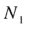、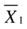 和 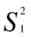 是一组观测值的数量、均值和总体方差，而 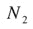、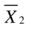 和 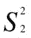 是另一组观测值的数量、均值和总体方差，那么合并后观测值组的数量、均值和总体方差 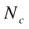、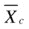 和 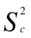 可由以下公式给出：

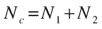

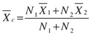

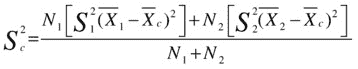


当我们进行数据密集化时，我们有两组观测值。第一组观测值是表中的行集合，第二组是我们理论上添加的零值集合。因此 ``、`` 和 `` 分别对应 ``、0 和 0。将这些值代入通用公式，我们得到：

``

要得到样本方差，我们只需除以 6 而不是 7；而要得到样本标准差，我们则对样本方差取平方根。

## 并行排序

通过并行执行排序操作，可以提升其性能。您不仅可以并行执行排序，如果系统内存充足，您还有可能利用更多内存。但别高兴得太早。这里存在几个潜在的陷阱。让我们从清单 17-23 开始，它展示了一个并行排序。

清单 17-23. 一个并行排序

```
BEGIN
   FOR c IN (  SELECT /*+ parallel(s 4) */
                      *
                 FROM sh.sales s
             ORDER BY time_id)
   LOOP
      NULL;
   END LOOP;
END;
/

| Id  | Operation               | Name     | Rows  | Bytes |TempSpc| Cost |

|   0 | SELECT STATEMENT        |          |   918K|    28M|       |   149|
|   1 |  PX COORDINATOR         |          |       |       |       |      |
|   2 |   PX SEND QC (ORDER)    | :TQ10001 |   918K|    28M|       |   149|
|   3 |    SORT ORDER BY        |          |   918K|    28M|    45M|   149|
|   4 |     PX RECEIVE          |          |   918K|    28M|       |   143|
|   5 |      PX SEND RANGE      | :TQ10000 |   918K|    28M|       |   143|
|   6 |       PX BLOCK ITERATOR |          |   918K|    28M|       |   143|
|   7 |        TABLE ACCESS FULL| SALES    |   918K|    28M|       |   143|

SELECT dfo_number dfo
        ,tq_id
        ,server_type
        ,process
        ,num_rows
        ,ROUND (
              ratio_to_report (num_rows)
                 OVER (PARTITION BY dfo_number, tq_id, server_type)
            * 100)
            AS "%"
    FROM v$pq_tqstat
ORDER BY dfo_number, tq_id, server_type DESC;

DFO      TQ_ID SERVER_TYPE PROCESS   NUM_ROWS          %
---------- ---------- ----------- ------- ---------- ----------
         1          0 Ranger      QC              12        100
         1          0 Producer    P005        260279         28
         1          0 Producer    P007        208354         23
         1          0 Producer    P006        188905         21
         1          0 Producer    P004        261319         28
         1          0 Consumer    P003        357207         39
         1          0 Consumer    P002        203968         22
         1          0 Consumer    P001         35524          4
         1          0 Consumer    P000        322144         35
         1          1 Producer    P003        357207         39
         1          1 Producer    P002        203968         22
         1          1 Producer    P001         35524          4
         1          1 Producer    P000        322144         35
         1          1 Consumer    QC          918843        100
```

清单 17-23 展示了一个嵌入在 PL/SQL 块中的查询，这样运行时不会产生大量输出。执行计划取自嵌入的 SQL。查询运行后，我们可以查看 `V$PQ_TQSTAT` 来了解排序的效果如何。

排序的工作方式是，查询协调器会查看每个并行查询从属进程的少量行。在 Oracle 数据库的早期版本中，每个从属进程大约 93 行，但在 12cR1 中，从 `V$PQ_TQSTAT` 输出可以看到查询协调器总共只抽样了 12 行。抽样是为了确定每个排序并行查询服务器处理的数值范围，但这在执行计划中不可见。

清单 17-22 中接下来发生的是，一组并行查询从属进程并行扫描 `SH.SALES` 中的块。它们是 `:TQ10000` 的行生产者，在执行计划的第 5、6、7 行显示。读取的每一行都会被发送到第二组并行查询从属进程中的一个，该从属进程将对落在特定范围内的行执行排序，该范围先前由范围进程确定。这第二组并行查询服务器是 `:TQ10000` 的消费者，也是 `:TQ10001` 的生产者。执行计划中的操作显示在第 2、3、4 行。

此时，第二组从属进程的每个成员（`V$PQ_TQSTAT` 中的 `P000`、`P001`、`P002` 和 `P003`）都将拥有 `SH.SALES` 中已排序的一部分行。然后，每个并行查询服务器将结果输出依次发送给查询协调器，以获得最终结果集。

那么，陷阱是什么？第一个问题是抽样的小范围行可能不具有代表性，有时几乎所有的行都可能被发送到一个并行查询从属进程。从 `V$PQ_TQSTAT` 的高亮部分可以看到，`P001` 只排序了 4% 的行，但其余行相当均匀地分配给了另外三个排序并行查询服务器。第二个陷阱特指按表分区列进行排序的情况。清单 17-6 显示串行排序可以单独排序 28 个分区中的每一个。清单 17-23 显示四个并发排序进程一次性对所有分区的所有数据进行排序。这意味着每个并行查询从属进程将需要比查询串行运行时*更大*的工作区。

鉴于这些陷阱，我建议您仅在排序优化的其他所有选项都已用尽时，才诉诸并行处理。

## 本章小结

本章深入探讨了可以优化排序的各种方法。有时您可以消除排序，或用更高效的替代方案替换它。有时您可以减少排序中的列数或行数，主要目标是减少内存消耗，次要目标是通过减少比较次数来节省 CPU。

最后的优化技术是并行处理。行分配到排序从属进程时可能出现偏斜，这可能导致性能不稳定，有时内存需求实际上可能会增加。然而，当排序运行时内存和 CPU 资源充足，并行排序在减少 elapsed time 方面有时能带来巨大好处。

__________________

¹根据 HelloDBA 网站上的文章 `http://www.hellodba.com/reader.php?ID=185&lang=en`

