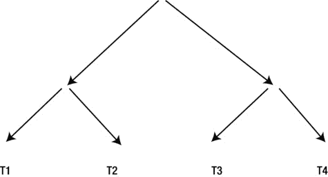

# 前言：从哲学到技术细节

我想我已经就哲学说得够多了；现在是时候回归详细的技术内容，看看我们可用的不同类型的提示。

## 提示的类型

在前面的段落中，我有时泛泛地谈论提示，有时则具体讨论优化器提示。这两者是有区别的，因为有一些提示根本不是针对优化器的。此外，优化器提示本身也有几种不同的类型。让我先简要谈谈那些不针对优化器的提示。

### 基于版本重定义的提示

基于版本重定义（EBR）可能是 11gR2 中最受关注的新特性，对于想要进行应用滚动升级的客户来说是必需的。我使用术语“应用滚动升级”意味着在不关闭应用程序的情况下更改应用代码和 DDL 规范。EBR 的一个组成部分是一组三个提示，它们会改变 SQL 语句的语义。这些提示是：

*   `IGNORE_ROW_ON_DUPKEY_INDEX`
*   `CHANGE_DUPKEY_ERROR_INDEX`
*   `RETRY_ON_ROW_CHANGE`

让我强调一下，这些提示*改变 SQL 语句的作用*，在这方面它们与绝大多数优化器提示截然不同；优化器提示通常旨在影响语句的性能，而不是其他。

SQL 语言参考手册中关于 EBR 提示的文档特意指出，通常关于潜在性能崩溃的严重警告并不适用于这种特殊类型的提示；如果您正在使用 EBR，鼓励您使用，事实上您别无选择，只能使用这些特殊提示。

详细讨论 EBR 超出了本书的范围，但如果您有兴趣了解更多，高级应用开发指南中有一个专门讨论该主题的章节。

现在几乎是时候将注意力转向优化器提示了，但对 EBR 的讨论促使我简要讨论一个有点不寻常的话题。

### 导致错误的提示

如果您有使用提示的经验，您会知道，除非存在错误，否则如果提示使用不当，它不会导致相关的 SQL 语句失败；SQL 语句只会忽略该提示。但您是否知道，如果提示*有效*，它*可能*导致语句失败，或者可能防止它失败？我遇到过三个这样的例子。其中两个例子与 EBR 相关，一个与物化视图重写相关。请看 Listing 18-1 中的示例。

**Listing 18-1. 导致错误的提示**

```sql
CREATE TABLE t1
AS
   SELECT 1 c1, 1 c2 FROM DUAL;

CREATE UNIQUE INDEX t1_i1
   ON t1 (c1);

CREATE UNIQUE INDEX t1_i2
   ON t1 (c2);

INSERT /*+ change_dupkey_error_index(t1 (c1)) */
      INTO  t1
   SELECT 2, 1 FROM DUAL;

ORA- 00001: unique constraint (BOOK. T1_I2) violated

INSERT /*+ change_dupkey_error_index(t1 (c1)) */
      INTO  t1
   SELECT 1, 2 FROM DUAL;
ORA- 38911: unique constraint (BOOK. T1_I1) violated

INSERT /*+ ignore_row_on_dupkey_index(t1 (c1)) */
      INTO  t1
       SELECT ROWNUM + 1, 1
         FROM DUAL
   CONNECT BY LEVEL <= 3;
ORA- 00001: unique constraint (BOOK. T1_I2) violated

INSERT /*+ ignore_row_on_dupkey_index(t1 (c1)) */
      INTO  t1
       SELECT ROWNUM, ROWNUM + 1
         FROM DUAL
   CONNECT BY LEVEL <= 3;
2 rows created

ALTER SESSION SET query_rewrite_integrity=enforced;

SELECT /*+ rewrite_or_error */
        t.calendar_month_desc, SUM (s.amount_sold) AS dollars
    FROM sh.sales s, sh.times t
   WHERE s.time_id = t.time_id
GROUP BY t.calendar_month_desc;
ORA-30393: a query block in the statement did not rewrite
```

Listing 18-1 首先创建了一个表`T1`，该表有一行和两个列`C1`和`C2`。该行中`C1`和`C2`的值都是 1。现在我们创建两个索引`T1_I1`和`T1_I2`，分别确保`C1`和`C2`的值保持唯一。

那么，当我们尝试向`T1`插入违反这些完整性约束的行时会发生什么？第一次插入尝试生成`C2`的重复值，违反了`T1_C2`强制执行的约束。正如我们所料，我们得到了 ORA-00001 错误。但当我们尝试第二次插入，试图复制`C1`的值，违反`T1_C1`强制执行的完整性约束时，我们得到了一个不同的错误：ORA-38911！这种差异是因为`CHANGE_DUPKEY_ERROR_INDEX`提示指定了`C1`列（并隐式指定了`T1_C1`索引强制执行的约束），从而导致了一个不同的错误，该错误可以由 EBR 相关的异常处理器以特殊方式处理。

Listing 18-1 中的第三次插入尝试向`T1`插入三行，其中一行是`C1`的重复值。这一次，有问题的行被忽略，我们无错误地插入了剩余的两行。这种行为是`IGNORE_ROW_ON_DUPKEY_INDEX`提示的结果，该提示再次指定应忽略完整性约束。

Listing 18-1 中的最后一个 SQL 语句与 EBR 无关，但也导致了语句失败。`SH.SALES`中`TIME_ID`列的引用完整性约束未被强制执行，这意味着当`QUERY_REWRITE_INTEGRITY`为`ENFORCED`时，Listing 18-1 中的最终查询无法重写以使用物化视图`CAL_MONTH_SALES_MV`。通常，查询只会针对基表运行，但由于`REWRITE_OR_ERROR`提示，该语句失败了。指定该查询的`EXPLAIN PLAN`语句也因 ORA-30393 错误而失败。

我希望您觉得这个插曲有趣，但现在是时候回归与性能相关的事务了。不过，我们还没有准备好讨论优化器提示。我们需要先看看运行时引擎提示。

## 运行时引擎提示

有一两个提示会影响 SQL 语句在运行时的行为，但与 CBO 在转换和最终状态优化方面所做的决策无关，包括以下内容：

*   我们在第 4 章以及本章中讨论了`GATHER_PLAN_STATISTICS`提示。此提示导致运行时引擎在运行时收集实际性能统计信息，但对执行计划没有影响。
*   我们在第 9 章讨论了`NO_GATHER_OPTIMIZER_STATISTICS`提示。此提示及其对应提示`GATHER_OPTIMIZER_STATISTICS`控制是否将`OPTIMIZER STATISTICS GATHERING`操作添加到直接路径加载的执行中。
*   `MONITOR`提示可用于强制收集可通过`DBMS_SQLTUNE.REPORT_SQL_MONITOR`函数引用的数据。默认情况下，对于运行时间少于五秒的语句，不收集此类数据。`NO_MONITOR`提示可用于禁止为运行时间超过五秒的语句收集数据。与`GATHER_PLAN_STATISTICS`、`(NO_)GATHER_OPTIMIZER_STATISTICS`和`(NO_)MONITOR`提示一样，它们对 CBO 生成的执行计划没有影响。
*   `DRIVING_SITE`提示可用于改变分布式查询的运行方式。尽管`DRIVING_SITE`提示确实改变了 CBO 生成的执行计划，但它是以一种独立于 CBO 所做的基于成本或启发式决策的方式来实现的。我稍后将给出`DRIVING_SITE`提示合法使用的一个例子。
*   与`DRIVING_SITE`提示类似，`APPEND`和`APPEND_VALUES`提示改变了 CBO 生成的执行计划的外观，但与优化过程无关；但与`DRIVING_SITE`提示不同，`APPEND`和`APPEND_VALUES`提示影响语句的语义，我稍后将进行演示。


代码清单 18-2 利用了我们在代码清单 8-1 中创建的环回链路，以演示`DRIVING_SITE`提示。

## 代码清单 18-2. DRIVING_SITE 提示

```
 SELECT /*+ driving_site(s) */
        cust_id
        ,c.cust_first_name
        ,c.cust_last_name
        ,SUM (s.amount_sold) sum_sales
    FROM sh.customers c JOIN sh.sales@loopback s USING (cust_id)
GROUP BY cust_id, c.cust_first_name, c.cust_last_name;

| Id  | Operation              | Name      | Rows  | Pstart| Pstop |

|   0 | SELECT STATEMENT REMOTE|           |   918K|       |       |
|   1 |  HASH GROUP BY         |           |   918K|       |       |
|*  2 |   HASH JOIN            |           |   918K|       |       |
|   3 |    REMOTE              | CUSTOMERS| 55500 |       |       |
|   4 |    PARTITION RANGE ALL |           |   918K|     1 |    28 |
|   5 |     TABLE ACCESS FULL  | SALES     |   918K|     1 |    28 |

Predicate Information (identified by operation id):

2 - access("A2"."CUST_ID"="A1"."CUST_ID")

Note

- fully remote statement
   - this is an adaptive plan
```

代码清单 18-2 中的查询将本地的`SH.CUSTOMERS`表与通过数据库链接访问的`SH.SALES`表连接起来。如果没有`DRIVING_SITE`提示，`SH.SALES`表中的所有 918,843 行数据都将通过链路拉取过来，以便在本地与`SH.CUSTOMERS`表进行连接。由于使用了`DRIVING_SITE`提示，查询实际上在远程站点执行；因此，不再是 918,843 行的`SH.SALES`数据被拉取过来，而是 55,500 行的`SH.CUSTOMERS`数据被推送过去。使用该提示后，连接和聚合操作在远程站点执行，最终结果集中的 7,059 行数据从远程端返回到本地端。

使用`DRIVING_SITE`提示减少了通过数据库链接传输的数据量，这是一种完全合理的做法。但截至目前，对于未加提示的查询，CBO 甚至不会考虑这种方式。未加提示的查询仅在*所有*行源都位于该站点时，才会从远程站点运行——换句话说，当查询根本不是分布式的时候。

当然，一个查询可能引用多个远程位置。正因为如此，`DRIVING_SITE`提示接受一个参数，用于指定预期驱动查询的远程站点所关联的行源。

关于`DRIVING_SITE`就介绍到这里——现在让我们转向`APPEND`和`APPEND_VALUES`。并行 DML 语句通常会导致直接路径写入，但在试图为串行`INSERT`语句触发直接路径加载时，需要使用`APPEND`和`APPEND_VALUES`语句。

`APPEND`提示已存在多年，但当提供`VALUES`子句时，该提示一直是非法的。然而，`VALUES`子句可用于插入大量记录，现在可用的`APPEND_VALUES`提示解决了这个问题，如代码清单 18-3 所示。

## 代码清单 18-3. APPEND_VALUES 提示的使用

```
CREATE /*+ NO_GATHER_OPTIMIZER_STATISTICS  */
      TABLE t2
AS
   SELECT *
     FROM all_objects
    WHERE 1 = 0;

DECLARE
   TYPE obj_table_type IS TABLE OF all_objects%ROWTYPE;

obj_table   obj_table_type;
BEGIN
   SELECT *
     BULK COLLECT INTO obj_table
     FROM all_objects;

FORALL i IN 1 .. obj_table.COUNT
      INSERT /*+ TAGAV append_values */
            INTO  t2
           VALUES obj_table (i);

COMMIT;
END;
/

SET LINES 200 PAGES 0

SELECT p.*
  FROM v$sql s
      ,TABLE (DBMS_XPLAN.display_cursor (s.sql_id, s.child_number, 'BASIC')) p
WHERE s.sql_text LIKE 'INSERT /*+ TAGAV%';

INSERT /*+ TAGAV append_values */ INTO T2 VALUES (:B1 ,:B2 ,:B3 ,:B4
,:B5 ,:B6 ,:B7 ,:B8 ,:B9 ,:B10 ,:B11 ,:B12 ,:B13 ,:B14 ,:B15 ,:B16
,:B17 ,:B18 )

Plan hash value: 3581094869

| Id  | Operation        | Name |

|   0 | INSERT STATEMENT |      |
|   1 |  LOAD AS SELECT  |      |
|   2 |   BULK BINDS GET |      |

```

除非我特别关注运行时统计信息，否则本书使用`EXPLAIN PLAN`语句和`DBMS_XPLAN.DISPLAY`函数来获取语句的执行计划，并且我通常不会展示调用过程。但在代码清单 18-3 中，待分析的 SQL 语句嵌入在 PL/SQL 块内，通过标记 SQL 语句结合横向连接（lateral join）使用`DBMS_XPLAN.DISPLAY_CURSOR`来获取执行计划更为方便，正如我所展示的那样。

代码清单 18-3 中的`LOAD AS SELECT`操作表示使用了直接路径插入。与并行直接路径插入类似，串行直接路径插入也会导致——在这种情况下是略有误导性的——`ORA-12838: 无法在并行修改后读取/修改对象`错误信息，如果在`COMMIT`语句之前尝试访问该对象的话。

代码清单 18-3 中或许有点令人惊讶的是，执行计划中没有可见的`OPTIMIZER STATISTICS GATHERING`操作，并且`INSERT ... VALUES`语句没有像在提供`APPEND`提示的`INSERT ... SELECT`语句中那样收集对象统计信息。这种行为无法通过使用任何`GATHER_OPTIMIZER_STATISTICS`提示来改变。

顺便提一下，`GATHER_OPTIMIZER_STATISTICS`提示在某种程度上类似于我们在第 13 章中讨论的`NO_SET_TO_JOIN`提示。因为两个提示都指定了默认行为，所以在正常情况下这两个提示都没有任何效果。然而，正如在将`"_convert_set_to_join"`设置为`TRUE`时，`NO_SET_TO_JOIN`提示可用于禁用集合到连接的转换一样，如果将`"_optimizer_gather_stats_on_load"`设置为`FALSE`，`GATHER_OPTIMIZER_STATISTICS`也可以用于强制收集统计信息！

与三个 EBR 提示不同，`GATHER_PLAN_STATISTICS`、`(NO_)MONITOR`、`(NO_)GATHER_OPTIMIZER_STATISTICS`、`DRIVING_SITE`、`APPEND`和`APPEND_VALUES`提示并未免除 SQL 语言参考手册中的健康警告。然而，您应该以与看待三个 EBR 提示相同的方式来看待这八个提示，即将其视为 SQL 语言的扩展，允许您表达想要做什么，而不是表达应该如何做。

就像我们将在本章讨论的大多数优化器提示一样，三个 EBR 提示和这里描述的八个提示更像是指令而非提示：它们的应用没有商量余地。但您不应将所有优化器提示都视为指令。现在让我们来看一些真正是提示而非指令的优化器提示。

## 真正是提示的优化器提示

大多数优化器提示应被正确地视为指令，因为它们告诉 CBO 必须做某事或禁止做某事。当然，这些指令本质上是条件性的。例如，`USE_HASH` (T) 提示表示：“假设`T`不是连接树中的前导行源，并且假设`T`未被连接消除转换消除，或未经历其他使该指令失效的转换，那么使用哈希连接连接`T`。” 类似地，`PARALLEL (T)` 提示表示：“假设您通过全表扫描访问`T`，那么并行执行该扫描。”

然而，有一两个优化器提示不包含规定性组件，它们真正是提示。让我们从`OPT_PARAM`开始看看这些提示。

## OPT_PARAM


我们刚刚讨论了两个隐藏参数——`_convert_set_to_join` 和 `_optimizer_gather_stats_on_load`，它们允许启用、禁用或强制启用 CBO 的特定功能。实际上，有**数十个**这样的隐藏参数控制着优化器行为，而官方上，你需要获得 Oracle 支持的许可才能修改其中任何一个。此外，也有一些非隐藏的、有文档记录的参数会影响优化器行为，例如 `OPTIMIZER_INDEX_COST_ADJ`。无论是否有文档记录，我都要重申我的建议：除非你有真正令人信服的理由使用非默认值，否则除了我在第 9 章中提到的少数几个参数外，请让所有与优化器相关的初始化参数**保持原样**。

## 使用 OPT_PARAM

如果你只是想为单个语句覆盖默认的 CBO 行为，那么你可以选择使用 `OPT_PARAM` 提示作为替代方案，而不是为整个会话更改初始化参数。`OPT_PARAM` 提示由来已久，但在 12cR1 中首次被正式记录。正如你可能预料的那样，`OPT_PARAM` 的文档仅授权覆盖有文档记录的初始化参数，例如 `OPTIMIZER_INDEX_COST_ADJ`。代码清单 18-4 展示了 `OPT_PARAM` 提示的实际应用。

### 代码清单 18-4. OPT_PARAM 提示

```sql
ALTER SESSION SET star_transformation_enabled=temp_disable;

SELECT /*+ opt_param('_optimizer_adaptive_plans','false')
           opt_param('_optimizer_gather_feedback','false')
        */
      * FROM t2;

| Id  | Operation         | Name | Rows  | Bytes | Cost (%CPU)| Time     |

|   0 | SELECT STATEMENT  |      |   100K|    35M|   426   (1)| 00:00:01 |
|   1 |  TABLE ACCESS FULL| T2   |   100K|    35M|   426   (1)| 00:00:01 |

Query Block Name / Object Alias (identified by operation id):

1 - SEL$1 / T2@SEL$1

Outline Data

/*+
      BEGIN_OUTLINE_DATA
      FULL(@"SEL$1" "T2"@"SEL$1")
      OUTLINE_LEAF(@"SEL$1")
      ALL_ROWS
      OPT_PARAM('star_transformation_enabled' 'temp_disable')
      OPT_PARAM('_optimizer_gather_feedback' 'false')
      OPT_PARAM('_optimizer_adaptive_plans' 'false')
      DB_VERSION('12.1.0.1')
      OPTIMIZER_FEATURES_ENABLE('12.1.0.1')
      IGNORE_OPTIM_EMBEDDED_HINTS
      END_OUTLINE_DATA
  */
```

代码清单 18-4 在运行查询之前，在会话级别设置了一个初始化参数。该查询包含两个 `OPT_PARAM` 提示，用于关闭默认的 CBO 功能。有趣的是，所显示执行计划中的概要数据部分包含了一个针对非默认会话级参数的 `OPT_PARAM` 提示。这样做是必要的，因为默认情况下，`OPTIMIZER_FEATURES_ENABLE ('12.1.0.1')` 提示（它本身是一个非指令性提示）会隐式地将大多数优化器参数的值重置为指定版本的默认值。由于原始查询中没有出现 `OPTIMIZER_FEATURES_ENABLE ('12.1.0.1')` 提示，因此会为任何非默认的会话级设置添加 `OPT_PARAM` 提示到概要数据中，以覆盖 `OPTIMIZER_FEATURES_ENABLE ('12.1.0.1')` 提示。

`OPT_PARAM` 提示可用于启用或禁用某些优化器功能，当这样使用时，`OPT_PARAM` 可以被视为一个**指令**。然而，当覆盖像 `OPTIMIZER_INDEX_COST_ADJ` 这样的参数时，CBO 并没有被明确告知要做什么或不做什么。它只是获得了一些额外的信息来输入到它的考量中。

顺便提一下，初始化参数 `OPTIMIZER_DYNAMIC_SAMPLING` 可以在语句级别通过 `OPT_PARAM` 提示或 `DYNAMIC_SAMPLING` 提示来控制。我们 Oracle 社区的许多人都对 12cR1 中 `OPTIMIZER_DYNAMIC_SAMPLING` 的最大值从 10 增加到 11 感到非常有趣。有一部老电影叫《**This is Spinal Tap**》，如果你在 YouTube 上观看名为 `spinal tap: these go to eleven` 的片段，你就会明白为什么我们许多人在了解到 `OPTIMIZER_DYNAMIC_SAMPLING` 的新值时会像孩子一样咯咯地笑！

## FIRST_ROWS 和 ALL_ROWS

从 12cR1 开始，初始化参数 `OPTIMIZER_MODE` 的有效值为 `FIRST_ROWS_1`、`FIRST_ROWS_10`、`FIRST_ROWS_100`、`FIRST_ROWS_1000` 或 `ALL_ROWS`。最后一个实际上就是 `FIRST_ROWS_INFINITY`，并且是默认值。

当 `OPTIMIZER_MODE` 为非默认值时，可以通过使用 `ALL_ROWS` 提示在语句级别获得默认的 CBO 行为。`FIRST_ROWS` 提示比初始化参数设置更灵活，因为你可以指定任何正整数作为参数。代码清单 18-5 演示了这一点。

### 代码清单 18-5. FIRST_ROWS 提示

```sql
 SELECT /*+ first_rows(2000) */
         *
    FROM sh.sales s JOIN sh.customers c USING (cust_id)
ORDER BY cust_id;

| Id  | Operation                          | Name           |

|   0 | SELECT STATEMENT                   |                |
|   1 |  NESTED LOOPS                      |                |
|   2 |   NESTED LOOPS                     |                |
|   3 |    TABLE ACCESS BY INDEX ROWID     | CUSTOMERS      |
|   4 |     INDEX FULL SCAN                | CUSTOMERS_PK   |
|   5 |    PARTITION RANGE ALL             |                |
|   6 |     BITMAP CONVERSION TO ROWIDS    |                |
|*  7 |      BITMAP INDEX SINGLE VALUE     | SALES_CUST_BIX |
|   8 |   TABLE ACCESS BY LOCAL INDEX ROWID| SALES          |

Predicate Information (identified by operation id):

7 - access("S"."CUST_ID"="C"."CUST_ID")

SELECT /*+ first_rows(3000) */
         *
    FROM sh.sales s JOIN sh.customers c USING (cust_id)
ORDER BY cust_id;

| Id  | Operation             | Name      |

|   0 | SELECT STATEMENT      |           |
|   1 |  MERGE JOIN           |           |
|   2 |   SORT JOIN           |           |
|   3 |    PARTITION RANGE ALL|           |
|   4 |     TABLE ACCESS FULL | SALES     |
|*  5 |   SORT JOIN           |           |
|   6 |    TABLE ACCESS FULL  | CUSTOMERS |

Predicate Information (identified by operation id):

5 - access("S"."CUST_ID"="C"."CUST_ID")
       filter("S"."CUST_ID"="C"."CUST_ID")
```

传递给 `FIRST_ROWS` 提示的参数的两个不同值导致了完全不同的执行计划。当我们向提示提供 3000 的值时，我们是在要求 CBO 设计一个计划，以**尽可能快**地交付前 3000 行输出，即使查询返回所有行的总时间可能会延长。CBO 选择了使用 `CUSTOMERS_PK` 索引上的 `INDEX FULL SCAN` 进行 `NESTED LOOPS` 连接，这意味着行将按顺序交付，无需排序。查询几乎会立即开始生成行。

当我们将提示参数的值增加到 4000 时，执行计划变为使用 `MERGE JOIN`。此操作要求先对来自两个表的行进行排序，这意味着在返回任何行之前会有一些延迟。然而，一旦来自两个表的数据被读取并排序，行从查询中交付的速度比 `NESTED LOOPS` 连接**快得多**；CBO 认为，到交付 4000 行时，`MERGE JOIN` 将已经超越 `NESTED LOOPS` 方法。

## CARDINALITY 和 OPT_ESTIMATE 提示


正如我在第 14 章中所解释的，CBO（基于成本的优化器）在基数估算上经常出错。`CARDINALITY`（基数）和`OPT_ESTIMATE`（优化器估算）提示对于理解问题出在哪里非常有用。`CARDINALITY`提示存在已久，其知名度远高于`OPT_ESTIMATE`提示，后者首次出现于 10gR1 版本，供 SQL Profile 内部使用。`CARDINALITY`和`OPT_ESTIMATE`两种提示都允许你覆盖 CBO 的基数估算。尽管后者比前者灵活得多，但让我们从`CARDINALITY`提示开始，其示例如代码清单 18-6 所示。

代码清单 18-6. CARDINALITY 提示的两个示例

```sql
SELECT /*+ cardinality(s 918) */
       *
  FROM sh.sales s
 WHERE amount_sold > 100
       AND prod_id IN (SELECT /*+ no_unnest */
                              prod_id
                         FROM sh.products p
                        WHERE prod_category = 'Hardware');

| Id  | Operation                    | Name        | Rows  |
-----------------------------------------------------------
|   0 | SELECT STATEMENT             |             |    13 |
|*  1 |  FILTER                      |             |       |
|   2 |   PARTITION RANGE ALL        |             |   918 |
|*  3 |    TABLE ACCESS FULL         | SALES       |   918 |
|*  4 |   TABLE ACCESS BY INDEX ROWID| PRODUCTS    |     1 |
|*  5 |    INDEX UNIQUE SCAN         | PRODUCTS_PK |     1 |

Predicate Information (identified by operation id):

1 - filter( EXISTS (SELECT /*+ NO_UNNEST */ 0 FROM "SH"."PRODUCTS"
              "P" WHERE "PROD_ID"=:B1 AND "PROD_CATEGORY"='Hardware'))
   3 - filter("AMOUNT_SOLD">100)
   4 - filter("PROD_CATEGORY"='Hardware')
   5 - access("PROD_ID"=:B1)

SELECT /*+ cardinality(s 918) */
       *
  FROM sh.sales s
 WHERE amount_sold > 100
       AND prod_id IN (SELECT /*+ no_unnest push_subq */
                              prod_id
                         FROM sh.products p
                        WHERE prod_category = 'Hardware');

| Id  | Operation                     | Name        | Rows  |
-----------------------------------------------------------
|   0 | SELECT STATEMENT              |             |   918 |
|   1 |  PARTITION RANGE ALL          |             |   918 |
|*  2 |   TABLE ACCESS FULL           | SALES       |   918 |
|*  3 |    TABLE ACCESS BY INDEX ROWID| PRODUCTS    |     1 |
|*  4 |     INDEX UNIQUE SCAN         | PRODUCTS_PK |     1 |

Predicate Information (identified by operation id):

2 - filter("AMOUNT_SOLD">100 AND  EXISTS (SELECT /*+ PUSH_SUBQ
              NO_UNNEST */ 0 FROM "SH"."PRODUCTS" "P" WHERE "PROD_ID"=:B1 AND
              "PROD_CATEGORY"='Hardware'))
   3 - filter("PROD_CATEGORY"='Hardware')
   4 - access("PROD_ID"=:B1)
```

代码清单 18-6 中的两个查询都包含一个未被解嵌套的子查询。我本可以使用一个复杂的子查询来说明我的观点，但为了避免不必要的复杂性，我保持了子查询的简单性，并包含了一个`NO_UNNEST`提示。

`CARDINALITY`提示将行源的名称作为第一个参数，将预期从访问该行源的操作返回的行数作为第二个参数。需要明确的是，基数估算表示的是在应用谓词之后、但在任何连接、聚合或过滤结果之前，从行源返回的行数。`SH.SALES`表中有 918,843 行，但代码清单 18-6 中的`CARDINALITY`提示指定的值仅为 918。请注意，在代码清单 18-6 所示的第一个执行计划中，918 的基数估算是在应用`AMOUNT_SOLD > 100`谓词之后、但在应用作为单独步骤执行的子查询过滤之前应用的。代码清单 18-6 中的第二条语句与第一条的区别仅在于存在一个`PUSH_SUBQ`提示，该提示导致子查询过滤成为全表扫描本身的一部分。这样做的结果是，基数估算是*在* `AMOUNT_SOLD > 100`过滤器和子查询过滤器都应用之后才应用的。你可以看到，在前一种情况下，该语句预计返回 13 行，在后一种情况下返回 918 行。

关于`CARDINALITY`提示含义的困惑不仅限于子查询过滤器的应用。请看代码清单 18-7，它展示了在`NESTED LOOPS`连接的探测表上使用的`CARDINALITY`提示。

代码清单 18-7. 用于 NESTED LOOPS 连接的 CARDINALITY 提示

```sql
SELECT /*+ cardinality(c 46000)leading(co) use_nl(c) */
       *
  FROM sh.countries co JOIN sh.customers c USING (country_id);

| Id  | Operation          | Name      | Rows  |
------------------------------------------------
|   0 | SELECT STATEMENT   |           | 46000 |
|   1 |  NESTED LOOPS      |           | 46000 |
|   2 |   TABLE ACCESS FULL| COUNTRIES |    23 |
|*  3 |   TABLE ACCESS FULL| CUSTOMERS |  2000 |

Predicate Information (identified by operation id):

3 - filter("CO"."COUNTRY_ID"="C"."COUNTRY_ID")

SELECT /*+ cardinality(c 46000)leading(co) use_nl(c) */
       *
  FROM sh.countries co JOIN sh.customers c USING (country_id)
 WHERE country_region = 'Asia';

| Id  | Operation          | Name      | Rows  |
------------------------------------------------
|   0 | SELECT STATEMENT   |           |  9281 |
|   1 |  NESTED LOOPS      |           |  9281 |
|*  2 |   TABLE ACCESS FULL| COUNTRIES |     4 |
|*  3 |   TABLE ACCESS FULL| CUSTOMERS |  2421 |

Predicate Information (identified by operation id):

2 - filter("CO"."COUNTRY_REGION"='Asia')
   3 - filter("CO"."COUNTRY_ID"="C"."COUNTRY_ID")
```

代码清单 18-7 中的两个查询都将`SH.COUNTRIES`与`SH.CUSTOMERS`连接，我们使用提示来强制进行`NESTED LOOPS`连接以作演示。

在代码清单 18-7 的第一个查询中，被连接的两个表上都没有过滤谓词。我们指定了一个`CARDINALITY`提示，告诉 CBO 假定`SH.CUSTOMERS`有 46,000 行，而`SH.COUNTRIES`表的统计信息告诉 CBO 假定该表有 23 行，每行具有不同的`COUNTRY_ID`值。当我们使用`NESTED LOOPS`连接从`SH.COUNTRIES`连接到`SH.CUSTOMERS`时，CBO 报告它预计 23 次探测中的每一次平均返回 2,000 行，总计 46,000 行。


那个例子可能只是有点令人困惑，但当我们在 `SH.COUNTRIES` 上添加一个过滤条件时，情况就变得复杂了，就像我们在 代码清单 18-7 的第二个查询中所做的那样。由于 `SH.COUNTRIES` 中的 `COUNTRY_REGION` 有六个值，CBO（基于成本的优化器）现在预计 `SH.COUNTRIES` 中 23 行数据只有六分之一会匹配 `COUNTRY_REGION` 上的过滤谓词，结果集也将相应减少。但请记住，`CARDINALITY` 提示指定了从 `SH.CUSTOMERS` 返回的行数，这是在任何连接条件之前。为什么每个国家的基数估计值会增加？原因是 `SH.CUSTOMERS` 表 `COUNTRY_ID` 列上的列统计信息表明，实际上只有 19 个国家有客户，因此循环每次迭代的基数估计被确定为 46,000/19，即 2,421！连接后的估计基数是 9,281，计算公式为 (46,000/19) x (23/6)，因为 CBO 假设四个没有客户的国家都不在亚洲！

 **注意** 如果你重新收集 `SH` 模式的统计信息，可能会发现为 `SH.COUNTRIES` 的 `COUNTRY_REGION` 列创建了直方图。如果发生这种情况，CBO 将估计亚洲有五个国家。

到这个时候，你可能会意识到 `CARDINALITY` 提示的语义并不是那么直接。这就是为什么，尽管 `CARDINALITY` 提示对于研究具有不可估量的价值，但我个人从未在生产代码中使用过 `CARDINALITY` 提示。

虽然 `CARDINALITY` 提示对于研究非常有用，但 `OPT_ESTIMATE` 提示更加灵活。代码清单 18-8 展示了这个提示的灵活性。

### 代码清单 18-8. OPT_ESTIMATE 提示

```sql
SELECT /*+ opt_estimate(table c rows=46000)leading(co) use_nl(c) */
       *
  FROM sh.countries co JOIN sh.customers c USING (country_id)
 WHERE country_region = 'Asia';

| Id  | Operation          | Name      | Rows  |

|   0 | SELECT STATEMENT   |           |  9281 |
|   1 |  NESTED LOOPS      |           |  9281 |
|*  2 |   TABLE ACCESS FULL| COUNTRIES |     4 |
|*  3 |   TABLE ACCESS FULL| CUSTOMERS |  2421 |

Predicate Information (identified by operation id):

2 - filter("CO"."COUNTRY_REGION"='Asia')
   3 - filter("CO"."COUNTRY_ID"="C"."COUNTRY_ID")

SELECT /*+ opt_estimate(join (co, c) rows=20000)leading(co) use_nl(c) */
       *
  FROM sh.countries co JOIN sh.customers c USING (country_id)
 WHERE country_region = 'Asia';

| Id  | Operation          | Name      | Rows  |

|   0 | SELECT STATEMENT   |           | 20000 |
|   1 |  NESTED LOOPS      |           | 20000 |
|*  2 |   TABLE ACCESS FULL| COUNTRIES |     4 |
|*  3 |   TABLE ACCESS FULL| CUSTOMERS |  5217 |

Predicate Information (identified by operation id):

2 - filter("CO"."COUNTRY_REGION"='Asia')
   3 - filter("CO"."COUNTRY_ID"="C"."COUNTRY_ID")

SELECT /*+ index(c (cust_id))
           opt_estimate(index_scan c customers_pk scale_rows=0.1)
           */
       *
  FROM sh.customers c;

| Id  | Operation                           | Name         | Rows  |

|   0 | SELECT STATEMENT                    |              | 55500 |
|   1 |  TABLE ACCESS BY INDEX ROWID BATCHED| CUSTOMERS    | 55500 |
|   2 |   INDEX FULL SCAN                   | CUSTOMERS_PK |  5550 |
```

`OPT_ESTIMATE` 提示最初是为了支持 SQL 配置文件而发明的，并非用于 SQL 调优，但实际上对于该目的相当有用。代码清单 18-8 中的第一个查询使用了 `OPT_ESTIMATE` 提示的 `TABLE` 变体，其行为与 `CARDINALITY` 提示完全相同。第二个变体允许我们指定两个表连接后返回的行数。最后一个变体允许我们指定从 `INDEX SCAN` 返回的行数。最后一个选项对我们来说不是特别有用，因为它不影响从表本身返回的行数，但我为了全面起见还是包含了它。

`INDEX SCAN` 示例展示了 `OPT_ESTIMATE` 的另一个特性——你不必指定确切的基数。通过使用 `SCALE_ROWS`，你可以将 CBO 本会使用的基数乘以一个指定的系数，本例中是 0.1。

### 对象统计信息提示

如果你正在研究对象统计信息对 CBO 行为的影响，可以使用对象统计信息提示来临时覆盖对象统计信息的值。例如，代码清单 18-9 展示了我如何验证我的假设：是 `SH.SALES` 中 `COUNTRY_ID` 的不同值数量影响了 代码清单 18-7 第二个查询中的基数估计。

### 代码清单 18-9. COLUMN_STATS 提示的用法

```sql
SELECT /*+ cardinality(c 46000) leading(co) use_nl(c)
           column_stats(sh.customers, country_id, scale, distinct=23)
           index_stats(sh.customers, customers_pk, scale,
                      clustering_factor=1, index_rows=1 blocks=1000)
           table_stats(sh.customers, scale, blocks=100 rows=46000)
          */
       *
  FROM sh.countries co JOIN sh.customers c USING (country_id)
 WHERE country_region = 'Asia';

| Id  | Operation          | Name      | Rows  |

|   0 | SELECT STATEMENT   |           |  7667 |
|   1 |  NESTED LOOPS      |           |  7667 |
|*  2 |   TABLE ACCESS FULL| COUNTRIES |     4 |
|*  3 |   TABLE ACCESS FULL| CUSTOMERS |  2000 |

Predicate Information (identified by operation id):

2 - filter("CO"."COUNTRY_REGION"='Asia')
   3 - filter("CO"."COUNTRY_ID"="C"."COUNTRY_ID")
```

代码清单 18-9 显示，当 CBO 相信 `SH.CUSTOMERS` 表中存在 23 个不同的 `COUNTRY_ID` 值，并且整个表有 46,000 行时，每个国家的行数如预期是 2,000。CBO 并没有估计连接会返回 8,000 行，因为估计的国家数是 23/6，而不是显示的取整值 4。

代码清单 18-9 也展示了 `INDEX_STATS` 和 `TABLE_STATS` 提示的语法，但在本例中，它们对执行计划细节没有实质性影响。

 **注意** 特别是在版本 12.1.0.1 中，`TABLE_STATS` 提示似乎会强制动态采样。由于这个缺陷，`TABLE_STATS` 提示在该版本中无法用于 SQL 调优。

### 关于那些"提示"型提示的总结

那些非规定性的、仅仅调整 CBO 在其计算中所用数据的提示，对于调查执行计划性能不佳的原因以及设计替代方案极为有用。然而，如果没有非常具体的原因，我不会在生产系统中使用它们。


尽管有些人可能会认为，让 `CBO` 自行其是以产生“新鲜的解决方案”是个好主意，正如本章开头引用的健康警告所言，但我对此不敢苟同。`CBO` 的核心意义恰恰在于，你通常无需自己制定执行计划。当你已经完成了充分的分析，并得出确实需要提示的结论时，你可能已经想好了自己想要的执行计划。如果你随后决定在生产环境中为代码添加提示，应该使用**指令性提示**，即那些真正充当指令的提示。现在让我们来关注这类提示。

## 生产环境提示案例研究

假设你已经完成了对一条有问题的 SQL 语句的分析，理解了其最初性能如此糟糕的原因，并且已经成功完成了修复方案的性能测试。然而，由于你只能通过提示来获得所需的执行计划，你可能不确定自己是否遗漏了什么。这里有几个案例研究，或许能帮助你进行思考。

### 丛林连接

我在图 11-3 底部写了一条简短的说明，指出 `CBO` 永远不会考虑 `丛林连接`。我必须说，自从我在 Christian Antognini 的著作《Troubleshooting Oracle Performance》第一版中读到 `丛林连接` 的概念以来，我就对它一直很着迷。这个概念对人类来说非常容易理解，也很好地展示了提示的必要性。然而，在现实中，对 `丛林连接` 的需求极其罕见，甚至很难用示例模式想出一个合理的 SQL 语句。不过，代码清单 18-10 重新审视了代码清单 2-3，后者使用了在代码清单 1-21 中创建的完全人工的表。

代码清单 18-10. 被遗漏的丛林连接

```sql
SELECT *
  FROM (t1 JOIN t2 ON t1.c1 = t2.c2)
       JOIN (t3 JOIN t4 ON t3.c3 = t4.c4) ON t1.c1 + t2.c2 = t3.c3 + t4.c4;

| Id  | Operation             | Name | Rows  | Cost (%CPU)|

|   0 | SELECT STATEMENT      |      |     1 |     9   (0)|
|*  1 |  HASH JOIN            |      |     1 |     9   (0)|
|   2 |   MERGE JOIN CARTESIAN|      |    25 |     7   (0)|
|*  3 |    HASH JOIN          |      |     5 |     4   (0)|
|   4 |     TABLE ACCESS FULL | T1   |     5 |     2   (0)|
|   5 |     TABLE ACCESS FULL | T2   |     5 |     2   (0)|
|   6 |    BUFFER SORT        |      |     5 |     5   (0)|
|   7 |     TABLE ACCESS FULL | T3   |     5 |     1   (0)|
|   8 |   TABLE ACCESS FULL   | T4   |     5 |     2   (0)|

Predicate Information (identified by operation id):

1 - access("T3"."C3"="T4"."C4")
       filter("T1"."C1"+"T2"."C2"="T3"."C3"+"T4"."C4")
   3 - access("T1"."C1"="T2"."C2")
```

代码清单 18-10 中 `ANSI 连接语法` 的使用暗示了一个特定的连接树。使用第 11 章的语法，这个连接树是：(T1  T2)  (T3  T4)。换句话说，我们连接 `T1` 和 `T2`，产生一个中间结果集，连接 `T3` 和 `T4`，产生第二个中间结果集，最后连接这两个中间结果集。

我们可以用下图来展示一个丛林连接：

你可能会想将图 18-1 与图 11-3（展示了右深连接树）以及图 11-2（展示了左深连接树，即 `CBO` 为代码清单 18-10 中的查询生成的 (T1  T2)  (T3  T4)）进行比较。对于人类来说，如何操作是很清楚的，但我们需要**同时**重写代码**和**添加提示，以引导 `CBO` 得到一个不涉及笛卡尔连接的执行计划。代码清单 18-11 展示了我们需要做的事情。



图 18-1. 丛林连接

代码清单 18-11. 带有提示的丛林连接

```sql
WITH t1_t2
     AS (SELECT /*+ no_merge */
                *
           FROM t1 JOIN t2 ON t1.c1 = t2.c2)
    ,t3_t4
     AS (SELECT /*+ no_merge */
                *
           FROM t3 JOIN t4 ON t3.c3 = t4.c4)
SELECT /*+ use_hash(t1_t2) use_hash(t3_t4) */
       *
  FROM t1_t2 JOIN t3_t4 ON t1_t2.c1 + t1_t2.c2 = t3_t4.c3 + t3_t4.c4;

| Id  | Operation            | Name | Rows  | Cost (%CPU)|

|   0 | SELECT STATEMENT     |      |     1 |     8   (0)|
|*  1 |  HASH JOIN           |      |     1 |     8   (0)|
|   2 |   VIEW               |      |     5 |     4   (0)|
|*  3 |    HASH JOIN         |      |     5 |     4   (0)|
|   4 |     TABLE ACCESS FULL| T1   |     5 |     2   (0)|
|   5 |     TABLE ACCESS FULL| T2   |     5 |     2   (0)|
|   6 |   VIEW               |      |     5 |     4   (0)|
|*  7 |    HASH JOIN         |      |     5 |     4   (0)|
|   8 |     TABLE ACCESS FULL| T3   |     5 |     2   (0)|
|   9 |     TABLE ACCESS FULL| T4   |     5 |     2   (0)|

Predicate Information (identified by operation id):

1 - access("T1_T2"."C1"+"T1_T2"."C2"="T3_T4"."C3"+"T3_T4"."C4")
   3 - access("T1"."C1"="T2"."C2")
   7 - access("T3"."C3"="T4"."C4")
```

如果没有 `NO_MERGE` 提示，`CBO` 会对代码清单 18-11 中重写的查询简单地应用简单的视图合并转换，从而重现代码清单 18-10 中的原始查询，进而无法得出最优计划！

在这种情况下提示之所以必要，是因为简单的视图合并是一种*启发式*转换。正如我在第 13 章中解释的，启发式转换的应用完全不考虑它们是否会加速查询。在现实中，简单视图合并几乎总是有益的或者无害的，但在那些极其罕见、真正需要 `丛林连接` 的情况下，你将不得不使用提示来获得正确的计划。

尽管丛林连接可能是一生难得一见的体验，但我的下一个例子则要常见得多。

### 因式子查询的物化

与简单的视图合并类似，因式子查询物化也是一种启发式转换。当因式子查询被引用多次时，就会应用此转换。代码清单 18-12 展示了一个使用 `INLINE` 提示来防止 `CBO` 不恰当地应用此转换的例子。

代码清单 18-12. 不恰当的因式子查询物化


WITH q1
     AS (  SELECT /*+ inline */
                 `time_id`
                 ,`cust_id`
                 ,MIN (`amount_sold`) `min_as`
                 ,MAX (`amount_sold`) `max_as`
                 ,SUM (`amount_sold`) `sum_as`
                 , 100
                  * ratio_to_report (SUM (`amount_sold`))
                       OVER (PARTITION BY `time_id`)
                     `pct_total`
             FROM `sh.sales`
         GROUP BY `time_id`, `cust_id`)
SELECT *
  FROM q1
 WHERE `time_id` = DATE '1999-12-31' AND `min_as` < 100
UNION ALL
SELECT *
  FROM q1
 WHERE `time_id` = DATE '2000-01-01' AND `max_as` > 100;

-- 无提示的执行计划

| ID  | 操作                       | 名称                        | 行数  |TempSpc| 代价 (%CPU)|

|   0 | SELECT 语句                 |                           |  1837K|       |  1233  (51)|
|   1 |  临时表转换                 |                           |       |       |            |
|   2 |   作为 SELECT 加载            | SYS_TEMP_0FD9D664A_64B671 |       |       |            |
|   3 |    分区范围 全部             |                           |   918K|       |  5745   (1)|
|   4 |     窗口缓冲区              |                           |   918K|       |  5745   (1)|
|   5 |      排序 分组              |                           |   918K|    24M|  5745   (1)|
|   6 |       表 访问 全表扫描       | SALES                     |   918K|       |   517   (2)|
|   7 |   UNION-ALL                |                           |       |       |            |
|*  8 |    视图                     |                           |   918K|       |   616   (1)|
|   9 |     表 访问 全表扫描        | SYS_TEMP_0FD9D664A_64B671 |   918K|       |   616   (1)|
|* 10 |    视图                     |                           |   918K|       |   616   (1)|
|  11 |     表 访问 全表扫描        | SYS_TEMP_0FD9D664A_64B671 |   918K|       |   616   (1)|

谓词信息 (由操作 ID 标识):

8 - filter("TIME_ID"=TO_DATE(' 1999-12-31 00:00:00', 'syyyy-mm-dd
              hh24:mi:ss') AND "MIN_AS"<100)
  10 - filter("TIME_ID"=TO_DATE(' 2000-01-01 00:00:00', 'syyyy-mm-dd
              hh24:mi:ss') AND "MAX_AS">100)

-- 带提示的执行计划

| ID  | 操作                                            | 名称           | 行数  | 代价 (%CPU)|

|   0 | SELECT 语句                                      |                |   312 |    43  (45)|
|   1 |  UNION-ALL                                     |                |       |            |
|*  2 |   视图                                          |                |   207 |    24   (0)|
|   3 |    窗口缓冲区                                   |                |   207 |    24   (0)|
|   4 |     排序 分组                                   |                |   207 |    24   (0)|
|   5 |      分区范围 单个                              |                |   310 |    24   (0)|
|   6 |       表 访问 通过本地索引 ROWID 批量处理       | SALES          |   310 |    24   (0)|
|   7 |        位图转换 为 ROWIDS                       |                |       |            |
|*  8 |         位图索引 单值                           | SALES_TIME_BIX |       |            |
|*  9 |   视图                                          |                |   105 |    19   (0)|
|  10 |    窗口缓冲区                                   |                |   105 |    19   (0)|
|  11 |     排序 分组                                   |                |   105 |    19   (0)|
|  12 |      分区范围 单个                              |                |   153 |    19   (0)|
|  13 |       表 访问 通过本地索引 ROWID 批量处理       | SALES          |   153 |    19   (0)|
|  14 |        位图转换 为 ROWIDS                       |                |       |            |
|*  15 |         位图索引 单值                           | SALES_TIME_BIX |       |            |

谓词信息(由操作 ID 标识):

2 - filter("MIN_AS"<100)
   8 - access("TIME_ID"=TO_DATE(' 1999-12-31 00:00:00', 'syyyy-mm-dd hh24:mi:ss'))
   9 - filter("MAX_AS">100)
  15 - access("TIME_ID"=TO_DATE(' 2000-01-01 00:00:00', 'syyyy-mm-dd hh24:mi:ss'))

清单 18-12 中的因子化子查询对来自按 `TIME_ID` 和 `CUST_ID` 聚合的 `SH.SALES` 表的数据执行了多项计算。计算的具体细节并非特别重要；只需意识到你肯定不想把它们输入两次。

主查询列出了 20 世纪最后一天和 21 世纪第一天这些分析结果的一个子集。

如果没有 `INLINE` 提示，因子化子查询将被物化，并且由于没有通用的谓词可以推入视图，`SH.SALES` *所有*分区中 *所有* `TIME_ID` 值的数据都会被聚合。当我们添加 `INLINE` 提示后，查询的预估代价不仅从 1,233 降低到 43，实际经过时间也减少了。原因在于，当因子化子查询被分别合并到 `UNION-ALL` 操作的两个分支中时，不仅可以发生分区消除，而且对单个分区的索引访问也变得可能。

可以设计其他方法来抑制因子化子查询物化，避免使用未文档化的提示。例如，你可以从因子化子查询中剪切并粘贴代码来创建一个重复的因子化子查询，或者可以改用内联视图。仅仅为了避开使用提示而以这种方式重写代码是一种不良实践。它不仅会降低代码的可读性，还会引入在升级时出现问题的风险：未来版本的 CBO 可能会识别代码重复并“优化”掉重复部分，从而重新创建出原始代码！最具可维护性的解决方案，也许有些反直觉，是使用这个未文档化的提示；考虑到其在现有客户代码库中广泛且合法的使用，Oracle 不可能在未来版本中停止 `INLINE` 提示的工作。

## 抑制 ORDER BY 消除和子查询非嵌套

下一个例子将需要你发挥一点想象力，因为它远非理想。让我们假设我们希望列出 `SH.SALES` 中 21 世纪第一个月的所有行，并附带一列 `COUNTRY_SALES_TOTAL`，该列包含相关国家 *所有* 日期的 `AMOUNT_SOLD` 总和。我们希望按 `COUNTRY_SALES_TOTAL` 对结果排序。想象一下，`SH.SALES` 表拥有比实际多得多的列和行，并且世界上的国家也比实际多很多。

既然如此，你可能会发现，在尝试了上一章的所有技巧后，你仍然找不到一种方法，能在不遇到临时表空间和严重时间问题的情况下，一次性对所有国家的 `AMOUNT_SOLD` 求和。于是你制定了如下计划：

*   你意识到 2000 年 1 月并非所有国家都有销售数据，于是你决定只为实际需要的国家聚合数据。即便如此，你仍然遇到临时表空间问题。
*   你决定一次只聚合一个已识别国家子集的数据，从而避免此时任何排序的需要。理论上这可能耗时更长，但你几乎不需要那么多临时表空间。
*   你决定采用清单 17-12 中的思路，只对来自 `SH.SALES` 的 `ROWID` 以及来自 `SH.CUSTOMERS` 的关联 `COUNTRY_ID` 列进行排序。

带着这些想法，你设计出了清单 18-13 中的 SQL：

清单 18-13。分批聚合数据


