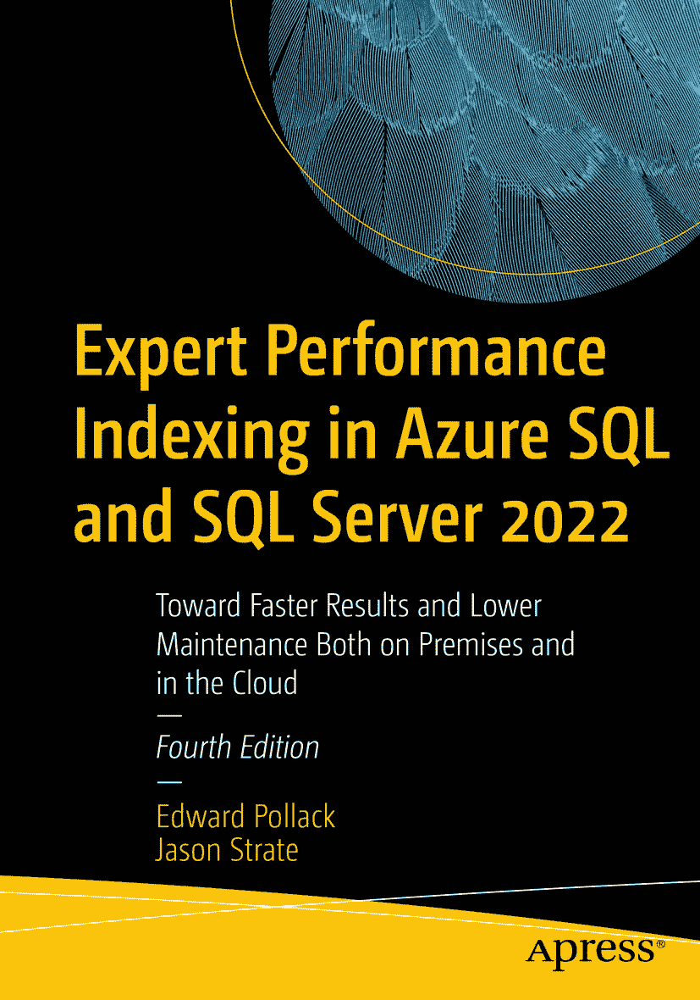

ISBN 978-1-4842-9214-3 e-ISBN 978-1-4842-9215-0 [`doi.org/10.1007/978-1-4842-9215-0`](https://doi.org/10.1007/978-1-4842-9215-0) © Edward Pollack and Jason Strate 2015, 2019, 2023 本作品受版权保护。出版者持有所有权利，无论涉及材料的全部或部分，特别是翻译、转载、图表 reuse、朗诵、广播、缩微胶片或其他任何物理方式的复制，以及信息存储与检索、电子改编、计算机软件，或当前已知或未来开发的类似或不同方法的使用权。在本出版物中使用通用描述性名称、注册商标、服务标志等，即使未作特别说明，也不意味着这些名称可免于相关保护性法律法规的约束而可供自由使用。出版者、作者和编辑可以安全地假定本书中的建议和信息在出版时是真实准确的。出版者、作者或编辑均不就本书所含材料或其中可能存在的任何错误或遗漏提供任何明示或暗示的保证。出版者对出版地图中的管辖权主张和机构附属关系保持中立。

本书由 Springer Nature 旗下注册公司 APress Media, LLC 出版。

注册公司地址为：1 New York Plaza, New York, NY 10004, U.S.A.

*献给我美好的家人：Theresa、Nolan 和 Oliver。没有你们，就没有我。*

## 引言

索引是数据库开发中永恒相关的部分。即使技术不断进步，更多自动化流程被开发出来以协助性能调优和管理，但随着数据和查询在规模与复杂性上的增长，理解有效的索引将始终是一项关键技能。

## 本书内容是什么？

本书从各个角度讨论索引，涵盖入门和高级内容，描述索引如何用于提升 SQL Server 中多种类型数据的性能。全面理解索引能够帮助数据库专业人员和开发人员设计高效的数据结构并编写高效的代码。这直接带来更快的查询速度、更少的计算资源消耗，并最终节省时间和金钱。

*《Azure SQL 与 SQL Server 2022 专家级性能索引》*整体上分为三个部分：

*   *第* *1**章至第* *3**章*：索引和索引结构基础
*   *第* *4**章至第* *9**章*：不同类型数据的索引入门
*   *第* *9**章至第* *17**章*：创建、维护和微调索引的有效策略

本书旨在提供足够信息，使任何级别的数据库专业人员都能熟悉 SQL Server 2022 提供的索引功能，并能够利用这些功能来提升数据库性能。每章讨论 SQL Server 索引中一个关键组成部分，提供足够的高层信息，以便能够快速做出调整以应对常见的数据挑战。

此外，本书还讨论了高级功能，以更全面地理解索引在 SQL Server 中的存储和使用方式。这使得管理针对更大、更复杂数据的性能成为可能，包括列存储索引、内存优化数据和空间数据。

## 致谢

衷心感谢多年来支持和指导我的众多组织者、演讲者、同事和志愿者，是你们为我提供了个人和专业成长的机会。

感谢你们在我年轻、仍在世间摸索时，给予我写作、演讲和分享观点与知识的机会。那些第一次（以及第二次……第三次……）的机会是无价之宝！

致所有帮助我走到今天的各位（你们知道是谁），谢谢你们！

## 关于作者 关于技术审校

