# 2. 索引存储基础

上一章讨论了索引的逻辑设计和语法，本章将重点讨论索引的物理实现。理解索引如何存储以及如何与 SQL Server 和存储引擎交互，是更好地理解索引优势以及如何更有效地利用它们的关键。

本讨论将从 SQL Server 中数据存储的基础知识开始，包括数据页、它们的格式以及如何管理它们。然后，此信息将被扩展到不同索引类型的基本结构以及每种类型在 SQL Server 中的实现方式。

## 存储基础

数据库中使用多种结构来存储和组织数据。本章将重点关注那些与表和索引直接相关的结构。此讨论将从页和区开始，然后更深入地探讨 SQL Server 中可用的不同类型的页以及它们如何与索引相关联。

### 页

SQL Server 中数据的基本存储单元是页。页用于存储从表中的行到在最低层映射索引结构的所有内容。

当空间分配给数据库数据文件时，空间被划分为页。在分配期间，每个页被创建为使用 8 KB（8,192 字节）的空间，并且页从 0 开始编号，每分配一个页递增 1。当 SQL Server 与数据库文件交互时，可以发生输入/输出（I/O）操作的最小单位是页级别。例如，使用 `STATISTICS IO` 时，读取和写入的计数以页为单位进行度量。

一个页有三个主要组成部分：页头、其记录和偏移数组，如图 2-1 所示。所有页都以页头开始。页头为 96 字节，包含有关页的元数据，例如页号、其所属对象以及页类型。如果要在页上存储行（例如数据和索引页），页的末尾将包含一个偏移数组。偏移数组为 36 字节，提供指向页上行起始位置的指针。在这两个区域之间是 8,060 字节，用于存储记录和其他页面数据。

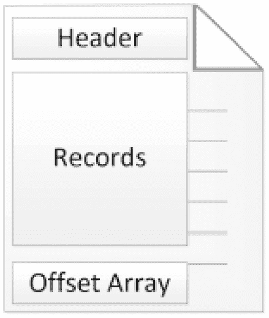

一个带有三个自上而下标签的狗耳文件图标，分别是：header、records 和 offset array。

**图 2-1**

页结构

如果页包含偏移数组，则它从页的末尾开始。随着行被添加到页，每一行都被添加到页面记录区域的第一个可用位置。接下来，该行的起始位置存储在偏移数组的最后一个可用位置。对于添加的每一行，行的数据存储在离页起始位置更远的地方，而偏移量则存储在离页末尾更远的地方，如图 2-2 所示。从页的末尾向后读取，偏移量可用于识别页上每一行（有时称为`槽`）的起始位置。

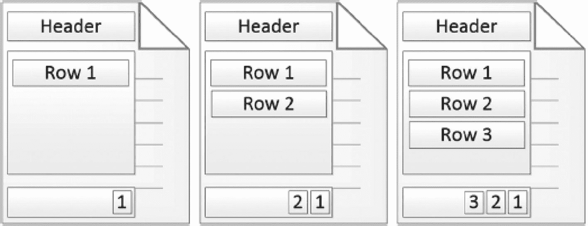

三个狗耳文件图标，页头下方的两个部分有不同的标签。三个图标中分别列出了“行 1 和 1”、“行 1、行 2、2 和 1”以及“行 1、行 2、行 3、3、2 和 1”，分别对应记录和偏移数组部分。

**图 2-2**

行放置和偏移数组

虽然页的基础知识是相同的，但页的使用方式有所不同。这些用途包括存储数据页、索引结构和大对象。这些用例的每一个细节以及它们如何与 SQL Server 数据库交互，将在本章后面讨论。

### 区

从*页*向上移动，下一个基本的数据存储结构是*区*。区是数据文件中八个物理上连续的页的组。所有页必须属于一个区，并且一个区不能少于或多于八个页。SQL Server 数据库使用两种类型的区：*混合区*和*统一区*。

一个混合区包含分配给多个对象的页。例如，当一个表首次创建且分配的页少于八个时，它将构建为一个混合区。只要表的总大小小于八个页，该表就会使用混合区，如图 2-3 所示。通过使用混合区，数据库可以减少分配给小表的空间量。

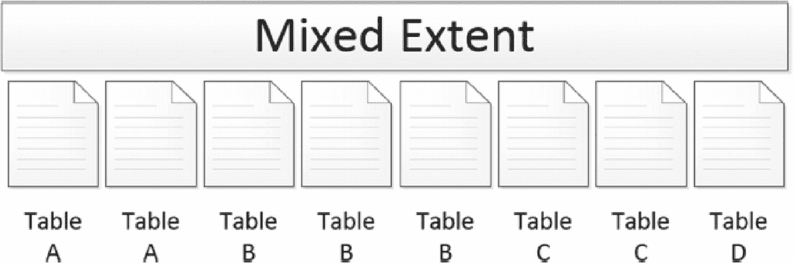

一个示意图，展示了在标有“混合区”的水平条下，八个标有表 A、A、B、B、B、C、C 和 D 的狗耳文件图标。

**图 2-3**

混合区

一旦表中的页数超过八个，它将开始使用统一区。在统一区中，该区中的所有页都分配给数据库中的单个对象（参见图 2-4）。因此，一个对象的页将是连续的，这增加了可以在单个读取操作中读取的对象页数。有关连续读取好处的更多信息，请参见第 6 章。

一个示意图，展示了在标有“统一区”的水平条下，八个都标有表 A 的狗耳文件图标。

**图 2-4**

统一区

自 SQL Server 2016 以来，使用统一区已成为所有数据库中所有区分配的默认行为。可以使用 `MIXED_PAGE_ALLOCATION` 数据库选项修改此行为，该选项会将默认分配设置为使用混合区。在 SQL Server 2014 及更早版本中，此行为相反，默认分配混合区。可以使用跟踪标志 `1118` 在那些版本中修改此行为，该标志指示 SQL Server 使用统一区，就像当前的默认行为一样。这些配置考虑的关键在于，SQL Server 默认使用统一区，这缓解了大量的页分配争用问题。

## 页类型

一个页可以在 SQL Server 中服务于多种用途。对于每种用途，都有一个与页关联的类型，定义了它的使用方式。SQL Server 数据库中可用的页类型包括：

*   `文件头页`
*   `引导页`
*   `页自由空间 (PFS) 页`
*   `全局分配映射 (GAM) 页`
*   `共享全局分配映射 (SGAM) 页`
*   `差异更改映射 (DIFF) 页`
*   `最小记录 (ML) 页`
*   `索引分配映射 (IAM) 页`
*   `数据页`
*   `索引页`
*   `大对象（文本和图像）页`

接下来的几节将详细阐述页类型并解释它们的使用方式。虽然并非所有页类型都直接涉及索引，但每种类型都将被定义和解释，以帮助提供对数据存储的整体理解。对于每个数据库，页面的布局方式有相似之处。例如，在每个数据库的第一个文件中，页面的布局如图 2-5 所示。可用的页类型比图中显示的更多，但正如对每种页类型的考察将显示的那样，只有前几页是固定的。许多其他页类型以由数据库中的数据决定的模式出现。

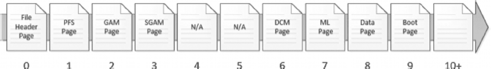

一个示意图，展示了在向右箭头上方，10 个标有“file header page”、“P F S page”、“G A M page”、“S G A M page”、“N A”、“N A”、“D C M page”、“M L page”、“data page”和“boot page”的狗耳文件图标。图标编号从 0 到 9，而第十一个图标没有标签，编号为 10+。

**图 2-5**

数据文件页

> **注意**
>
> 数据库日志文件不使用页架构。页结构仅适用于数据库数据文件。日志文件架构的讨论超出了本书的范围。

### 文件头页

任何数据库数据文件中的第一页都是文件头页，如图 2-5 所示。由于这是数据文件的第一页，其编号为 `0`。文件头页包含有关数据库文件的元数据，包括：

*   `文件 ID`
*   `文件组 ID`
*   `文件的当前大小`
*   `最大文件大小`
*   `扇区大小`
*   `LSN 信息`

文件头页上存储的其他各种细节将不再进一步讨论，因为它们超出了索引讨论的范围。

### 启动页

启动页类似于文件头页，它提供重要的元数据。不过，此页面提供的是关于数据库本身的信息，而非数据文件的信息。每个数据库有一个启动页，它位于数据库第一个数据文件的`第 9 页`（参见图 2-5）。启动页上的一些信息包括：

*   数据库版本
*   创建日期
*   数据库名称
*   数据库 ID
*   兼容性级别

启动页上的一个重要属性是 `dbi_dbccLastKnownGood`。此属性提供了已知最后一次 `DBCC CHECKDB` 成功完成的日期。虽然数据库维护不在本书讨论范围内，但定期对数据库进行一致性检查对于确保高可用性至关重要。

### 页空间页

为了跟踪页面是否有空间可用于插入行，每个数据文件都包含页空间页。这些页面是数据文件的第二页（参见图 2-5），之后每隔 `8,088` 页出现一个，用于跟踪数据库中的空闲空间量。PFS 页上的每个字节代表数据文件中的一个后续页面，并提供有关该页面的基本分配信息。这包括页面上大约的空闲空间量。

当数据库引擎需要存储 LOB 数据或堆数据时，它必须找到下一个可用页面并确定当前已分配页面的使用程度。此功能由 PFS 页面提供。每个字节内的位标识当前已使用的空间量。`位 0–2` 确定页面是否处于以下空闲空间状态之一：

*   页面为空。
*   已使用 `1–50`%。
*   已使用 `51–80`%。
*   已使用 `81–95`%。
*   已使用 `96–100`%。

除了空闲空间，PFS 页面还包含位来标识页面的其他几种信息类型。例如，`位 3` 确定页面上是否存在幽灵记录。`位 4` 标识页面是否是索引分配映射的一部分（本章稍后描述）。`位 5` 指示页面是否属于混合区。`位 6` 标识页面是否已分配。

通过这些附加位，SQL Server 可以在较高层面确定页面的当前使用情况。这包括页面是否已分配。如果尚未分配，是否可用于 LOB 或堆数据？如果已分配，则 PFS 页面提供如本节前面所述的详细信息。

最后，当幽灵清理进程运行时，它无需检查数据库中的每个页面是否有记录需要清理。相反，可以检查 PFS 页面，只需要管理那些包含幽灵记录的页面。

> 注意
>
> 索引本身处理非 LOB 数据和索引的空闲空间及页面分配。这些结构的页面分配由结构的定义决定。

### 全局分配映射页

与 PFS 页面类似的是全局分配映射页。此页面确定一个区是否已被指定用作统一区，以及该区是否空闲且可用于分配。

每个 GAM 页提供其 GAM 间隔内所有后续区的映射。一个 GAM 间隔由 GAM 页之后的 `64,000` 个区（`4 GB`）组成。GAM 页上的每个位代表 GAM 页之后的一个区。第一个 GAM 页位于数据库文件的`第 2 页`（参见图 2-5）。

为了确定一个区是否已分配为统一区，SQL Server 检查 GAM 页上代表该区的位。如果该区已分配，则该位设置为 `0`；否则，设置为 `1`，表示该区空闲且可用于其他目的。

### 共享全局分配映射页

与 GAM 页几乎相同的是共享全局分配映射页。页面之间的主要区别在于，SGAM 页确定一个区是否被分配为混合区。与 GAM 页一样，SGAM 页也用于确定页面是否可用于分配。

每个 SGAM 页提供每个 SGAM 间隔内所有后续区的映射。一个 SGAM 间隔由 SGAM 页之后的 `64,000` 个区（即 `4 GB`）组成。SGAM 页上的每个位代表 SGAM 页之后的一个区。第一个 SGAM 页位于 GAM 页之后，数据库文件的`第 3 页`（参见图 2-5）。

SGAM 页确定一个区何时被分配用作混合区。如果该区为此目的而分配并且有可用页面，则该位设置为 `1`。当设置为 `0` 时，表示该区未用作混合区，或者是所有页面都在使用的混合区。

### 差异更改映射页

下一页是差异更改映射页。此页面用于确定 GAM 间隔中的某个区是否已更改。当一个区发生变化时，一个位值从 `0` 更改为 `1`。这些位存储在 DCM 页的一个位图行中，每个位代表一个区。

DCM 页用于跟踪在完整数据库备份之间哪些区发生了更改。每当进行完整数据库备份时，DCM 页上的所有位都会重置为 `0`。然后，当关联的区中发生更改时，该位会更改回 `1`。

DCM 页的主要用途是为差异备份提供已修改区的列表。这比检查数据库中的每个页面或区以查看其是否已更改要高效得多。相反，DCM 页提供了需要备份的区的列表。

第一个 DCM 页位于数据文件的`第 6 页`。后续的 DCM 页对应数据文件中的每个 GAM 间隔出现。

### 最小日志页

DCM 页之后是最小日志页，以前称为批量更改映射页。ML 页用于指示 GAM 间隔中的某个区是否已被最小日志操作修改。任何受最小日志操作影响的区，其位值将设置为 `1`，未受影响的则设置为 `0`。这些位存储在 ML 页的一个位图行中，每个位代表 GAM 间隔中的一个区。

正如 ML 页的旧名称（批量更改映射）所暗示的，这些页面与 `BULK_LOGGED` 恢复模型结合使用。当数据库使用此恢复模型时，ML 页用于标识自上次事务日志备份以来通过最小日志操作修改的区。当事务日志备份完成时，ML 页上的位将重置为 `0`。

第一个 ML 页位于数据文件的`第 7 页`。后续的 ML 页对应数据文件中的每个 GAM 间隔出现。

请注意，虽然在 SQL Server 中还有其他方法可以执行最小日志操作（例如 `BCP` 或批量列存储索引插入），但最小日志页仅跟踪与 `bulk_logged` 恢复模型相关联的那些操作。

### 索引分配映射页

目前为止讨论的大多数页面，都提供了关于它们所覆盖页面上是否存在数据的信息。除了了解一个页面是否开放可用之外，SQL Server 还需要知道页面上的信息是否与特定的表或索引关联。提供此信息的页面就是索引分配映射（IAM）页。

每个表或索引都首先从一个 IAM 页开始。此页指示在一个 GAM 间隔内，哪些区与该表或索引相关联。如果一个表或索引跨越多个 GAM 间隔，则该表或索引将有多个 IAM 页。

一个 IAM 页将一个表或索引与四种类型的页面关联起来。这些类型是数据页、索引页、大型对象页和小大型对象页。IAM 页上使用一个位图行将页面与表或索引关联。

IAM 页上还定位有一个 IAM 头行。IAM 头提供了一个表或索引的 IAM 页序列号、该 IAM 页所关联的 GAM 间隔的起始页面，以及一个单页分配数组。当分配给一个表或索引的空间少于一个完整区时，会使用这个数组。

IAM 页提供了一个映射，通过它，一个表或索引的所有页面汇集在一起。当需要定位一个表或索引的所有区时，就会使用此页。

### 数据页

数据页是任何数据库中最普遍的页面类型，用于存储数据库表中的数据。除 LOB 数据类型外，一条记录的所有数据都位于数据页上。LOB 数据类型存储在大型对象页上，这将在本节稍后讨论。

### 索引页

与数据页类似的是索引页。这些页面提供有关索引结构以及数据页位置的信息。对于聚集索引，索引页构建了一个页面层次结构，用于导航聚集索引的二叉树结构。对于非聚集索引，索引页执行相同的功能，但也用于存储构成索引的键值。

为了构建索引内的页面层次结构，索引页中包含的数据提供了键值和页面地址的映射。键值是子表中第一个排序行所包含的索引键值，而页面地址则标识了此数据的所在位置。

索引页的构造与其他页面类型相似，它们都有一个页面头部，包含所有标准信息，如页面类型、分配单元、分区 ID 和分配状态。行偏移数组包含指向索引数据行在页面上位置的指针。索引数据行包含两部分信息：键值和一个页面地址。

索引页提供了索引中所有数据页如何链接在一起的映射，因此在理解 SQL Server 中的数据存储方面扮演着至关重要的角色。

### 大型对象页

单个页面上数据的限制是 8 KB。然而，某些数据类型的大小可能高达 2 GB。因此，对于这些数据类型，需要另一种存储机制来存储它们：大型对象页类型。

可以利用 LOB 页的数据类型包括 `text`、`ntext`、`image`、`nvarchar(max)`、`varchar(max)`、`varbinary(max)` 和 `xml`。当这些数据类型之一的数据存储在数据页上时，如果行的大小超过 8 KB，将使用 LOB 页。在这些情况下，列将包含对数据所需 LOB 页的引用，并将数据存储在 LOB 页上（参见图 2-6）。

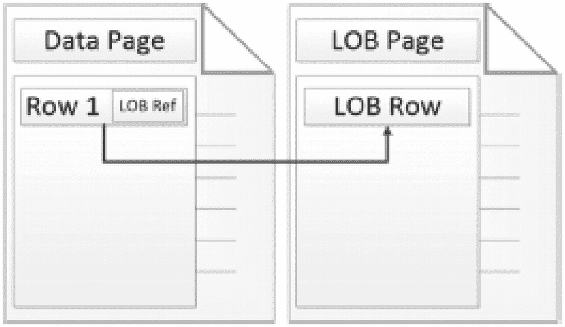

一个图表，显示了两个标有“数据页”和“L OB 页”的折角文件图标，位于头部部分。前者的唯一记录在第 1 行中标有“L O B ref”，链接到后者的唯一记录“L O B row”。

图 2-6

数据页链接到 LOB 页

注意

SQL Server 2022 包含了“系统页闩锁并发增强功能”，该功能允许 GAM 和 SGAM 并发更新，这将大大减少在工作负载对 GAM 或 SGAM 页产生大量更新时出现的争用情况。

### 组织页面

至此，已经回顾了构成索引内部结构的底层组件。虽然构成索引内部结构的底层结构很重要，但它们的上下文只有在应用于数据库内数据的组织和存储时才有意义。

SQL Server 中的组织结构是

*   堆

*   B 树

*   列存储

这些结构映射到本章稍后将讨论的特定索引类型。在本节中，将考察组织页面的方式，以便建立这种理解。

注意

在组织索引的结构中，包含索引页的索引级别被视为 `非叶` 级别。当引用包含数据页的级别时，这些级别称为 `叶级`。

### 堆结构

组织页面的默认结构称为 `堆`。当不使用 B 树结构（下一节讨论）来组织表中的数据页时，就会形成堆。从概念上讲，可以想象堆是一堆无特定顺序的数据页，如图 2-7 所示。在这个例子中，检索所有“Madison”记录的唯一方法是检查每个页面，查看“Madison”是否在页面上。

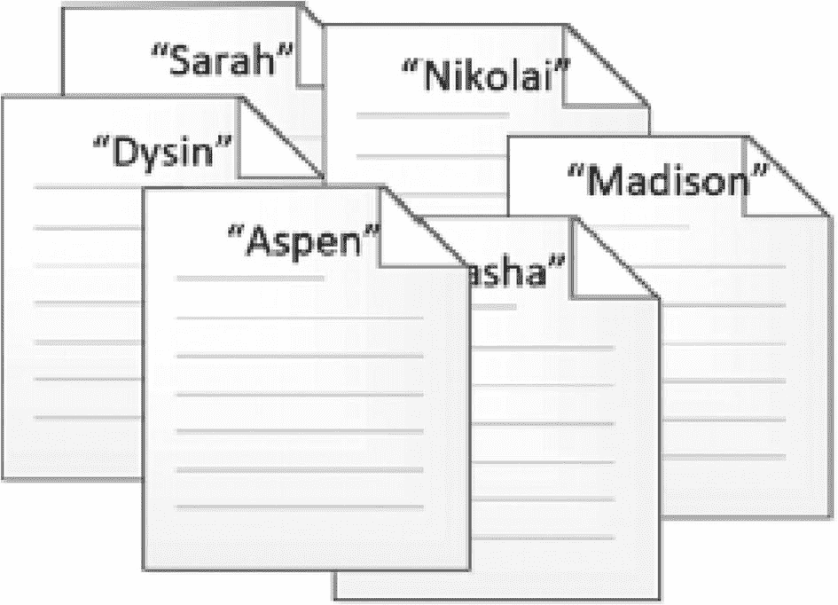

一个图表，显示了一叠六个折角文件图标。每个图标的标题都有一个不同的带引号的名称。标注的名称是 Sarah、Nikolai、Dysin、Aspen 和 Madison。

图 2-7

堆叠示例

然而，从内部结构来看，堆不仅仅是页面的堆砌。虽然未排序，但堆有一些关键组件来组织页面以便轻松访问。所有堆都从一个 IAM 页开始，如图 2-8 所示。IAM 页映射出在一个 GAM 间隔内，哪些区和单页分配与一个索引相关联。对于堆，IAM 页是将数据页和区与堆关联起来的唯一机制。堆结构不对与堆关联的页面强加任何排序。堆中第一个可用的页面是在数据库文件中找到的该堆的第一个页面。

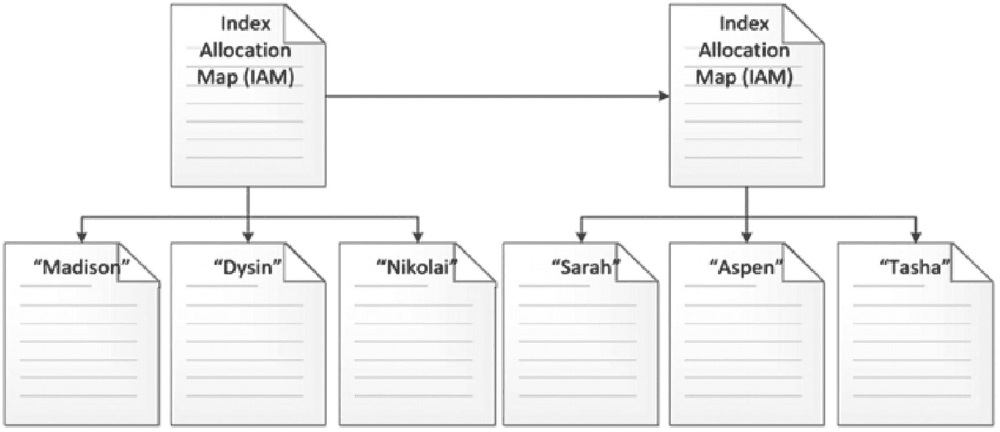

一个分支图，显示了一个标有 I A M 的折角文件图标下有三个标有 Madison、Dysin 和 Nikolai 的折角文件图标，该图标连接到另一个标有 I A M 的折角文件图标，其分支为三个标有 Sarah、Aspen 和 Tasha 的折角文件图标。

图 2-8

堆结构

IAM 页列出了与堆关联的所有数据页。堆的数据页存储表的行，根据需要使用 LOB 页。当 IAM 页在其 GAM 间隔内没有更多页面可供分配时，会为堆分配一个新的 IAM 页，并将下一组页面及其相应的行添加到堆中，如图 2-1 所示。在此图中，堆结构是扁平的。从 IAM 页到结构的数据页，始终只有一层。

虽然堆提供了一种组织页面的机制，但它与索引类型无关。当表没有聚集索引时，会使用堆结构。当堆存储表中的行时，行的插入没有强制顺序。因此，堆不保证行将以任何特定顺序返回，代码也不应假设任何顺序，即使是任意顺序。

### B 树结构

可用于索引的第二种可用结构是 `B 树`。B 树常被称为平衡树或二叉树，但其创建者从未为 B 树中的“B”提供正式的权威定义。这是 SQL Server 中最常用的组织索引的结构，聚簇索引和非聚簇索引都使用它。

在 B 树中，页面以分层树状结构组织，如图 2-9 所示。在该结构中，页面经过排序以优化在结构内搜索信息。除了排序之外，页面之间的关系也得到维护，以允许跨索引级别的页面顺序访问。

与堆类似，B 树从一个 IAM 页开始，该页标识 B 树的第一页在 GAM 间隔内的位置。B 树的第一页是一个索引页，通常被称为索引的 `根级别`。作为索引页，根级别包含键值和索引中下一页的页面地址。根据索引的大小，索引的下一级别可能是数据页或其他索引页。

如果排序数据页上所有行所需的索引行数超过了可用空间，则根页后面将跟随另一个级别的索引页。B 树中额外的索引页级别称为 `中间级别`。大多数使用 B 树结构构建的索引不需要超过一两个中间级别。即使索引键很宽，只需几个级别也可以对数百万到数十亿行进行排序。

索引的根级别和中间级别之下的下一级页面，称为 `非叶级别`，即 `叶级别`（参见图 2-9）。叶级别包含索引的所有数据页。数据页是存储行的键值和非键值的位置。非键值不存储在索引页上。

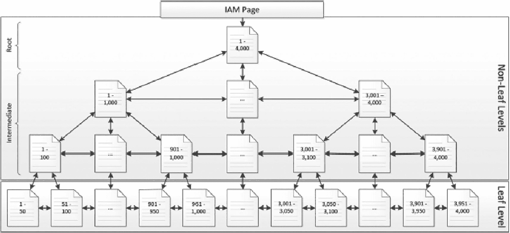

一个分支图，显示了从一个标记为 1 到 4000 的折角图标代表的 IAM 页产生的多个后代，作为根节点，以及由此产生的互连网络作为非叶级别的中间节点。叶级别中最远的后代也表现出互连关系。

图 2-9

B 树结构

堆和 B 树的另一个区别在于索引级别内执行顺序页读取的能力。页面在其页面头中包含指向前一页和下一页的链接。对于索引页和数据页，这些属性会被填充，并可用于遍历 B 树以从 B 树中找到下一个请求的行，而无需返回到索引的根级别并重复遍历 B 树。为了说明这一点，考虑一个情况：从图 2-9 所示的索引中请求键值在 925 和 3,025 之间的行。通过 B 树，可以通过遍历 B 树到键值 925（如图 2-10 所示）来完成此操作。之后，可以通过顺序访问第一页之后的页面来检索直到键值 3,025 的所有行，当遇到最后一个键值时完成操作。

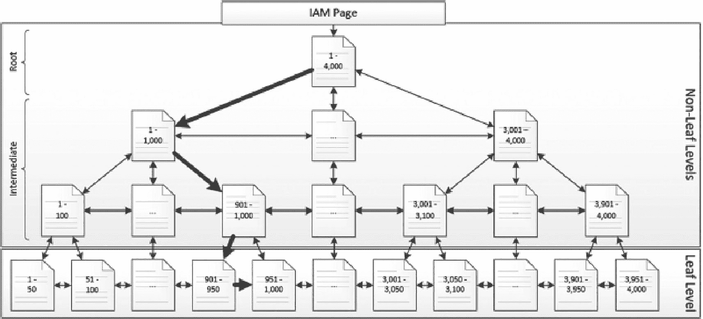

一个分支图，显示了非叶级别和叶级别中 IAM 页的互连后代。粗体箭头创建了一条从 1 到 4000、1 到 1000、901 到 1000、901 到 950 以及 951 到 1000 的路径。

图 2-10

B 树顺序读取

表和索引的一个可用选项是能够对它们进行分区。分区改变了索引的物理实现以及索引和数据页的组织方式。从 B 树结构的角度来看，索引的每个分区都有自己的 B 树。如果一个表被划分为三个不同的分区，那么该索引将会有三个 B 树结构。

### 列存储结构

列存储结构专门用于聚集和非聚集列存储索引类型。列存储结构与传统的行式存储和索引数据方法不同，它采用列式格式。这意味着，列数据不是按行顺序存储每一列的值，而是将列数据分组在一起，并独立于表中其他列的数据进行存储。例如，在图 2-11 的示例中，没有将四行数据依次存储在一页上，而是存储了三个列“组”。

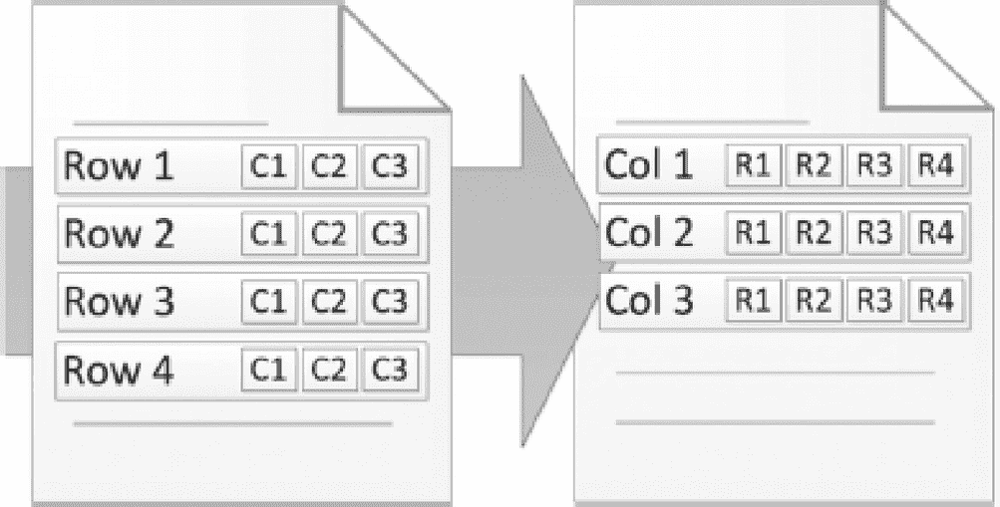

一张示意图，展示了两个折角文件图标。每个图标分别有 C 1 到 C 3 项（对应行 1 到 4）以及 R 1 到 R 4 项（对应列 1 到 3）作为各自的记录。在第一个图标的后面和第二个图标的左侧可以看到一个向右的箭头。

**图 2-11** 行式存储与列式存储

列存储结构的物理实现并未引入任何新的页面类型，完全依赖于现有页面类型。一个列存储始于一个 `IAM` 页面，如图 2-12 所示。从 `IAM` 页面延伸出包含列存储信息的 `LOB` 页面。对于存储在列存储中的每一列，都有一个或多个 `segment`。`segment` 包含其所代表列的最多约一百万行数据。一个 `LOB` 页面可以包含一个或多个 `segment`，并且 `segment` 可以跨多个 `LOB` 页面。

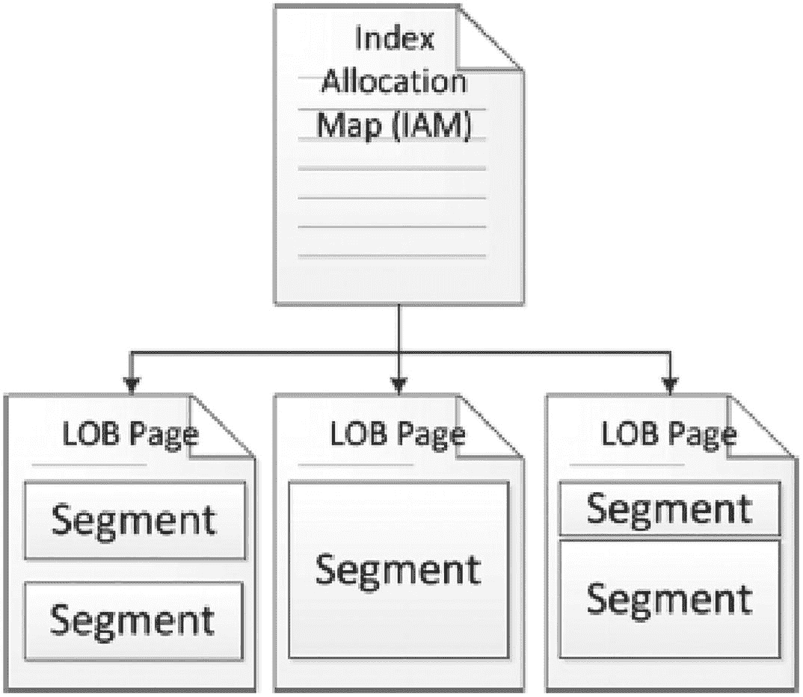

一个分支图，展示了一个标有 I A M 的折角文件图标下方有三个带标签的折角图标。每个图标的头部都标为 L O B 页面，其中第一个和第三个图标的两侧各有 2 个独立的段标签块作为其记录，而第二个图标则只有一个段标签块。

**图 2-12** 列存储结构

在每个 `segment` 内部，都有一个 `hash dictionary`，用于映射构成该列存储 `segment` 的数据。`hash dictionary` 还包含 `segment` 中数据的最小值和最大值。此信息由 SQL Server 在查询执行期间用于在执行过程中排除 `segment`。

列存储结构的优势之一是其能够利用压缩。由于列存储结构的每个 `segment` 包含相同类型的数据，SQL Server 有效压缩该数据的可能性更高。

按列使用 `dictionary encoding` 将相似值压缩到字典中，然后索引对字典的引用。在每个 `segment` 内部，行会被重新排序（即通过 `Vertipaq` 优化进行优化）。最后，使用类似于 `page compression` 的经典压缩算法来减少重复数据模式的大小。

`row/page compression` 与列存储压缩之间有几个显著差异：

1.  虽然 `row` 和 `page` 压缩对于行存储表是可选的，但 `columnstore index compression` 对于所有列存储索引都是必需的。
2.  `Columnstore compression` 应用于每个可以跨多个页面的 `segment`，这不同于仅限于单个页面的 `page compression`。

列存储的另一个优点是只返回从列存储请求的列。在堆和聚集 B 树索引中，一行中的每个列值存储在一起。这允许高效访问少量行中的多个列，但对于分析查询来说效率不高，因为分析查询模式通常请求少量列但多行列。列存储索引通过仅从磁盘读取请求的列（`segment`）并将该数据移入内存来解决此问题。因此，如果一个列存储表有二十列，但查询只需要三列，则其余列无需读入内存。

还有一些特定于列存储索引的额外结构和过程值得简要概述。

## 最小日志记录大容量加载数据

当在单次插入操作中向列存储索引插入超过 102,400 行时，将使用最小日志记录大容量加载过程来比标准插入操作更高效地插入行。这大大减少了写操作所需的计算量。大容量加载对于 OLAP 表来说是理想的，因为写入通常由不频繁但大型的数据加载过程组成。

虽然大容量加载无法完全检查插入操作的细节，但它允许插入操作执行得更快，并且使用时对事务日志的影响显著减小。因此，由于事务日志增长较小，事务日志备份也较小。

## Delta 存储

写入列存储索引的代价很高，因为每次更改都需要解压 `segment`、写入更改，然后重新压缩那些 `segment`。当无法进行大容量加载时，写入操作将针对 `deltastore` 中的 delta `rowgroup` 进行。这些是聚集 B 树，非常适合小批量的插入或更新操作。当从列存储索引读取数据时，`deltastore` 的内容将与压缩的 `segment` 一起读取，并将结果无缝返回给 SQL Server。

一个称为 `tuple-mover` 的异步系统进程将定期将 `deltastore` 中的行合并到压缩的 `segment` 中。虽然此过程是自动的且无需用户干预，但可以使用索引维护来影响其行为。

## 删除位图

与需要 `deltastore` 来允许高效插入操作的原因相同，也必须有一种机制来确保删除操作不会导致不必要的等待、锁定或资源消耗。

当从列存储索引中删除数据时，它会在一个称为 `delete bitmap` 的聚集 B 树结构中被标记为已删除。这种软删除的数据保留在列存储索引中，直到索引维护协助清理它。

当从包含已删除行的列存储索引中读取数据时，`delete bitmap` 用于识别它们并将其从结果集中排除。

## 索引特征

本章第一部分讨论了用于存储索引的物理结构。这里并未明确定义可用索引类型与这些结构之间的清晰界限。本节将讨论 SQL Server 的主要索引类型，以及它们使用的索引结构。对于每种类型，将提供与索引相关的要求和限制。

### 堆

要讨论的第一种索引类型是堆。堆实际上不是一种索引类型。它更像是表上缺乏聚集索引的结果。堆，顾名思义，将使用堆结构来组织表中的页面。

创建具有堆的表只有一个要求：表上尚未创建聚集索引。如果存在聚集索引，则不会使用堆。堆和聚集索引是互斥的。只要没有聚集索引，一个表上只能有一个堆。堆用于存储索引的数据页，并且只执行一次。

使用堆时的主要关注点是堆中的数据是无序的。没有列决定其页面上数据的排序顺序。其结果是，如果没有其他支持性的非聚集索引，查询将总是被迫扫描表中的信息。

### 聚簇索引

第二种索引类型是**聚簇索引**。聚簇索引利用 B 树结构来存储数据。实际上，聚簇索引可以说是堆表的对立面。当在表上构建聚簇索引时，堆结构会被替换为 B 树结构，并按照聚簇索引的键列对数据页进行组织。聚簇索引的 B 树包含了存储表中所有行数据的数据页。

在考虑索引列时，聚簇索引有一些限制。第一个限制是键列的总长度不能超过 900 字节。其次，聚簇索引中的聚簇键应该是唯一的。如果聚簇键中的列不唯一，SQL Server 在存储行时会为该行添加一个隐藏的唯一标识符列。这个唯一标识符是一个 4 字节的数字值，会被添加到非唯一的聚簇键中以强制实现唯一性。唯一标识符的大小不计入 900 字节的限制。虽然聚簇索引键不需要是唯一的，但如果其本身具有唯一性，则可以省去因添加唯一标识符而带来的资源开销。

每个表只能有一个聚簇索引。因为聚簇索引是按聚簇键的顺序存储的，且行数据与键存储在一起，所以无法再按其他顺序对表进行替代排序。当在已有堆表上构建聚簇索引时，请确保有足够的可用空间来容纳数据的第二份副本。在索引构建完成之前，两份数据副本都将存在。

正如后续章节将讨论的，通常更倾向于在所有表上创建聚簇索引。这种偏好并非绝对，在极少数情况下聚簇索引并不适用。虽然需要通过研究来确定哪种结构最合适，但在几乎所有用例中，默认选择使用聚簇索引（而不是堆）都是正确的。那些更适合使用堆的场景是例外情况，应具体问题具体分析。

### 非聚簇索引

**非聚簇索引**与聚簇索引类似。它们也使用 B 树结构来存储数据。对于 SQL Server 2016 及更高版本，键列限制为 1,700 字节；对于之前的所有 SQL Server 版本，则限制为 900 字节。

除了与聚簇索引的相似之处，它们也存在一些差异。首先，一个表上可以有多个非聚簇索引。一个表上最多可以有 999 个非聚簇索引，每个索引不超过 16 列。虽然非聚簇索引的数量限制相当大，但通常最佳实践是仅在需要时创建索引，并且不要维护未使用或使用率低的索引，因为它们会消耗内存和存储资源。此外，随着表上索引数量的增加，写操作所需的时间也会变长，因为一个写操作必须等待所有索引更新完成后才能完成。

在非聚簇索引的 B 树中，叶子级存储的不是数据本身，而是指向表中堆或聚簇索引中数据所在位置的页引用。检索那些不在非聚簇索引内、但位于聚簇索引中的列所需的过程称为**键查找**。

### 列存储索引

顾名思义，**列存储索引**使用列存储结构，并且可以是聚簇的或非聚簇的。

两种类型的列存储索引都有一些限制需要考虑。首先，并非所有数据类型都可用于列存储索引。随着新版本 SQL Server 的发布，受限制的数据类型列表已经缩小。以下列表按版本概述了哪些数据类型不允许在**聚簇列存储索引**中使用：

*所有版本（截至 SQL Server 2022）*：`ntext`、`text`、`image`、`rowversion`、`timestamp`、`sql_variant`、`hierarchyid`、`spatial`、`XML`

*SQL Server 2016 及更早版本*：`nvarchar(max)`、`varchar(max)`、`varbinary(max)`

*SQL Server 2012*：`uniqueidentifier`

请注意，**非聚簇列存储索引**允许使用相同的数据类型，只有一个重要例外：在任何版本的 SQL Server 中都不允许使用 `varchar(max)`、`nvarchar(max)` 和 `varbinary(max)`。

列存储索引限制为 1,024 列。这意味着无法在超过 1,024 列的表上创建列存储索引。由于列存储索引不强制数据顺序，因此它们不能是唯一的或有序的，也不能包含包含列。每个表只能有一个列存储索引。这个限制通常不是问题，因为聚簇列存储索引会自动包含所有列，而非聚簇列存储索引可以包含满足其用例所需的任意数量（或多或少）的列。

对于包含多年数据的表，分区可能是一种有价值的方法，可以通过分区切换或分区截断轻松地将旧数据移出表。

使用列存储索引时，SQL Server 中有一些功能无法与其结合使用。由于列存储使用其自身的压缩技术，因此无法与行压缩或页压缩结合使用。复制和文件流也可能无法与列存储索引一起使用。在 SQL Server 2017 之前，计算列不允许在列存储索引中使用。在 SQL Server 2017 及更高版本中，聚簇列存储索引只能包含非持久化计算列。持久化计算列不允许在列存储索引上使用，并且计算列也不允许在非聚簇列存储索引中使用。

最后，SQL Server 2014 引入了可写的聚簇列存储索引。非聚簇列存储索引在此版本中仍然是只读的。因此，有一些特定于 SQL Server 2014 的限制值得注意，以防使用此版本：

*   更改跟踪无法与列存储索引结合使用。
*   更改数据捕获无法与列存储索引结合使用。SQL Server 2016 及更高版本仅允许其与非聚簇列存储索引一起使用。
*   在 AlwaysOn 可用性组的可读辅助副本中，聚簇列存储索引不可访问。
*   多个活动结果集 (MARS)。
*   无法在视图上创建非聚簇列存储索引。

请注意，这些限制仅适用于 SQL Server 2014。

## 本章小结

本章详细讨论了用作索引构建块的组件。这为创建具有可预测行为的索引提供了必要的基础。

本次讨论详细介绍了 SQL Server 用于在数据库中存储数据的不同类型页面，以及这些页面如何组合在一起形成区。同时详细阐述了用于将页面组织成逻辑存储的结构，以及 SQL Server 中每种索引类型组织方式的基础知识。

