# 3. 检查索引内容

在理解了索引在物理和逻辑级别的存储方式后，可以通过更仔细地查看索引的详细信息和内容，对索引存储获得更深入的认识。

这次深入探讨将涉及一组在日常工作中很少使用的命令，因此将提供既具有挑战性又有趣的内容供学习和测试。

**警告**

本节使用的工具是未文档化且不受支持的。它们不会出现在联机丛书中，并且其功能可能在不通知的情况下发生更改。这些工具已存在很长时间，并且有许多博客文章描述了它们的行为。在使用较旧版本的 SQL Server 时，理解这些工具很重要，因为某些动态管理函数 (DMF) 可能不可用。务必先在非生产数据上测试这些工具，并确保在测试前备份重要数据。


## 审查页面

上一章的第一部分概述了 SQL Server 数据库中页面的类型。此外，还回顾了可用于组织和管理数据库内页面关系的结构。在下一节中，将使用动态管理函数和 DBCC 命令来检查数据库中的页面。对于当前版本的 SQL Server，可以使用 `DMF`，但在较旧的版本上，则需要使用 `DBCC` 命令。

通过使用这些工具，将为本章及本书其余部分深入探讨索引行为奠定基础。同时，这也提供了在任何数据库中详尽探索索引的工具。

## 动态管理函数

有两个动态管理函数将用于检查 SQL Server 数据库中的页面。它们是：

*   `sys.dm_db_database_page_allocations`
*   `sys.dm_db_page_info`

### sys.dm_db_database_page_allocations

动态管理函数 (`DMF`) `sys.dm_db_database_page_allocations` 提供有关数据库内页面分配的信息。该函数可用于调查索引及其关联的页面。它还可用于识别区的分配方式以及使用的区是混合区还是统一区。

该动态管理函数提供的数据类似于稍后描述的 `DBCC EXTENTINFO` 和 `DBCC IND`。使用动态管理函数的一个优势是结果可以被过滤并与其他动态管理函数合并。此外，它还提供了分配给索引的所有页面的详细信息，即使这些页面中没有数据。其输出的一个限制是它只返回与数据分配相关的页面，例如数据页、索引页和 `IAM` 页。

清单 3-1 展示了使用 `sys.dm_db_database_page_allocations` 的语法。执行需要五个参数，这些参数在表 3-1 中定义。

**表 3-1**  
`sys.dm_db_database_page_allocations` 的参数

| **参数** | **描述** |
| --- | --- |
| `@DatabaseId` | 要从中返回表和索引页面列表的数据库。此参数是必需的，接受使用 `DB_ID()` 函数。 |
| `@TableId` | 要从中返回页面列表的表的 `Object_id`。此参数是必需的，接受使用 `OBJECT_ID()` 函数。也可以使用 `NULL` 来返回所有表。 |
| `@IndexId` | 页面列表所属表的 `Index_id`。此参数是必需的，接受使用 `NULL` 来返回所有索引的信息。 |
| `@PartitionId` | 页面列表要返回的分区的 ID。此参数是必需的，接受使用 `NULL` 来返回所有索引的信息。 |
| `@Mode` | 定义返回数据的模式。选项为 `DETAILED` 和 `LIMITED`。使用 `LIMITED` 模式时，仅返回页面元数据，例如页面分配和关系信息。使用 `DETAILED` 模式时，会提供额外信息，如页面类型和页面间关系链。 |

```
SELECT * FROM sys.dm_db_database_page_allocations ({database_id},
{TableId | NULL}, {IndexId | NULL}, { PartitionId | NULL },
{DETAILED | LIMITED})
```
*清单 3-1*  
`sys.dm_db_database_page_allocations` 语法

执行 `sys.dm_db_database_page_allocations` 时，结果包括表 3-2 中定义的列。每个页面分配在结果中都会对应一行。

**表 3-2**  
`sys.dm_db_database_page_allocations` 的列

| **DMF 列名** | **描述** |
| --- | --- |
| `database_id` | 数据库的 ID |
| `object_id` | 表或视图的对象 ID |
| `index_id` | 索引的 ID |
| `partition_id` | 索引的分区号 |
| `rowset_id` | 索引的分区 ID |
| `allocation_unit_id` | 分配单元的 ID |
| `allocation_unit_type` | 分配单元的类型 |
| `allocation_unit_type_desc` | 分配单元的描述 |
| `extent_file_id` | 区的文件 ID |
| `extent_page_id` | 区的页面 ID |
| `allocated_page_iam_file_id` | 与该页面关联的索引分配映射页的文件 ID |
| `allocated_page_iam_page_id` | 与该页面关联的索引分配映射页的页面 ID |
| `allocated_page_file_id` | 已分配页面的文件 ID |
| `allocated_page_page_id` | 已分配页面的页面 ID |
| `is_allocated` | 指示页面是否已分配 |
| `is_iam_page` | 指示页面是否是索引分配映射页 |
| `is_mixed_page_allocation` | 指示页面是否分配到混合区 |
| `page_free_space_percent` | 页面上的可用空间百分比 |
| `page_type` | 已分配页面的页面类型 ID |
| `page_type_desc` | 页面类型的描述 |
| `page_level` | 页面在 B 树索引中的级别 |
| `next_page_file_id` | 下一页的文件 ID |
| `next_page_page_id` | 下一页的页面 ID |
| `previous_page_file_id` | 上一页的文件 ID |
| `previous_page_page_id` | 上一页的页面 ID |
| `is_page_compressed` | 指示页面是否被压缩 |
| `has_ghost_records` | 指示页面是否含有幽灵记录 |

使用此动态管理函数，可以研究几个用例，以帮助演示如何利用 `sys.dm_db_database_page_allocations`。首先，将创建一个数据库、一个表和少量数据，如清单 3-2 所示。

```
USE master;
GO
CREATE DATABASE Chapter2Internals;
GO
USE Chapter2Internals;
GO
CREATE TABLE dbo.IndexInternalsOne
(
RowID INT IDENTITY(1, 1),
FillerData CHAR(8000)
);
GO
INSERT INTO dbo.IndexInternalsOne
DEFAULT VALUES;
GO 12
```
*清单 3-2*  
创建包含 12 行的 `dbo.IndexInternalsOne` 的脚本

创建表后，将使用清单 3-3 中的脚本来说明 SQL Server 如何存储表中的行以及如何使用 `sys.dm_db_database_page_allocations` 来检查它们。如图 3-1 所示，为该表分配了一个索引分配映射页，该页位于一个混合页分配中。这意味着多个索引可以使用该区来分配这些页面。索引的第一个数据页区分配了八个页面，起始页为 312；另一个区分配了四个页面，起始页为 320。此外，在起始页为 320 的区上，有四个页面已分配但未指定页面类型。存在一个索引分配映射以及分配给该映射的带有数据页的区。

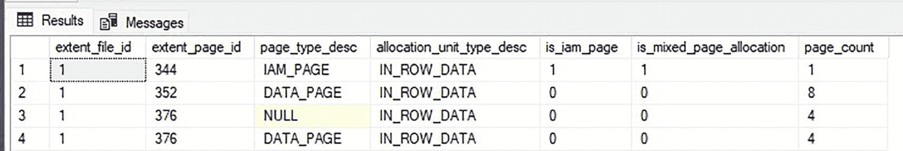

**图 3-1**  
`dbo.IndexInternalsOne` 的区分配结果

```
SELECT DPA.extent_file_id,
DPA.extent_page_id,
DPA.page_type_desc,
DPA.allocation_unit_type_desc,
DPA.is_iam_page,
DPA.is_mixed_page_allocation,
COUNT(*) AS page_count
FROM sys.dm_db_database_page_allocations(DB_ID(), OBJECT_ID('dbo.IndexInternalsOne'), NULL, NULL, 'DETAILED') DPA
GROUP BY DPA.extent_file_id,
DPA.extent_page_id,
DPA.page_type_desc,
DPA.allocation_unit_type_desc,
DPA.is_iam_page,
DPA.is_mixed_page_allocation
ORDER BY DPA.extent_page_id,
DPA.page_type_desc;
```
*清单 3-3*  
使用 `sys.dm_db_database_page_allocations` 查看区分配


索引分配映射页始终是混合区的一部分，因为其分配决定了多个表的索引映射。为演示这一点，可以运行清单 3-4 中的脚本，该脚本创建了第二个表，该表通过主键包含一个聚集索引。查看图 3-2 中的结果，六行数据被添加到从第 328 页开始的一个区中，绕过了之前表中已分配但未使用的四个页。索引分配映射页与 `dbo.IndexInternalsOne` 属于同一个区，该区从第 232 页开始，这表明该区确实是混合的。此外，还为该表分配了一个索引页以支持聚集索引的 B 树结构。

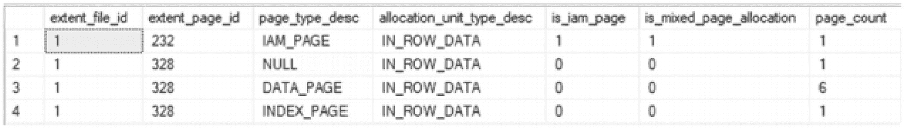

一个包含 4 行数据的查询表结果截图。7 个列标题分别是：区文件 ID、区页 ID、页类型描述、分配单元类型描述、是否索引分配映射页、是否混合页分配、页计数。

**图 3-2**
`dbo.IndexInternalsTwo` 的区分配结果

```
USE Chapter2Internals;
GO
CREATE TABLE dbo.IndexInternalsTwo
(
    RowID INT IDENTITY(1, 1) PRIMARY KEY,
    FillerData CHAR(8000)
);
GO
INSERT INTO dbo.IndexInternalsTwo
DEFAULT VALUES;
GO 6
SELECT DPA.extent_file_id,
       DPA.extent_page_id,
       DPA.page_type_desc,
       DPA.allocation_unit_type_desc,
       DPA.is_iam_page,
       DPA.is_mixed_page_allocation,
       COUNT(*) AS page_count
FROM sys.dm_db_database_page_allocations(DB_ID(), OBJECT_ID('dbo.IndexInternalsTwo'), NULL, NULL, 'DETAILED') DPA
GROUP BY DPA.extent_file_id,
         DPA.extent_page_id,
         DPA.page_type_desc,
         DPA.allocation_unit_type_desc,
         DPA.is_iam_page,
         DPA.is_mixed_page_allocation
ORDER BY DPA.extent_page_id,
         DPA.page_type_desc;
```
**清单 3-4**
创建 `dbo.IndexInternalsTwo` 并插入 12 行数据的脚本

除了区级别的详细信息，此动态管理视图函数还可用于在页面级别调查索引，以了解分配给表的所有页面及其与索引中其他页面的关系。使用清单 3-5 中的脚本，可以看到从第 232 页开始的区包含了索引分配映射的已分配页 235 和 236，如图 3-3 所示。从第 312 页开始的区包括页 312、313 等，这与从第 328 页开始的区类似，该区包括页 328、329 等。此外，还可以查看每个页面在 B 树中的级别以及页面之间的连接，从而验证在索引中上下移动以及通过数据页在页面之间移动的能力。

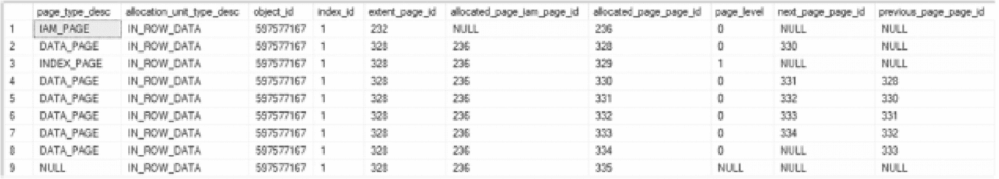

一个包含 9 行数据的查询表结果截图。10 个列标题分别是：页类型描述、分配单元类型描述、对象 ID、索引 ID、区页 ID、已分配页的索引分配映射页 ID、已分配页页 ID、页级别、下一页页 ID、上一页页 ID。

**图 3-3**
用于查看所有已分配页的区分配结果

```
USE Chapter2Internals;
GO
SELECT DPA.page_type_desc,
       DPA.allocation_unit_type_desc,
       DPA.object_id,
       DPA.index_id,
       DPA.extent_page_id,
       DPA.allocated_page_iam_page_id,
       DPA.allocated_page_page_id,
       DPA.page_level,
       DPA.next_page_page_id,
       DPA.previous_page_page_id
FROM sys.dm_db_database_page_allocations(DB_ID(), OBJECT_ID('dbo.IndexInternalsTwo'), NULL, NULL, 'DETAILED') DPA
```
**清单 3-5**
用于查看所有已分配页的脚本

### sys.dm_db_page_info

另一个有助于理解索引运作方式的动态管理函数是 `sys.dm_db_page_info`。与 `sys.dm_db_database_page_allocations` 不同，此 DMF 有 Microsoft 文档记录并受其支持。它提供数据库页的页头行信息。此信息包括槽数、可用字节、最小日志记录状态、幽灵记录以及页面链接详细信息。

清单 3-6 展示了使用 `sys.dm_db_page_info` 的语法。执行需要四个参数，定义见表 3-3。注意，虽然参数允许 `NULL`，但如果任何一个参数设置为 `NULL`，函数将返回错误。

**表 3-3**
`sys.dm_db_page_info` 的参数

| 参数 | 描述 |
| --- | --- |
| `@DatabaseId` | 要返回页头信息的数据库。 |
| `@FileId` | 将要返回的页面的 `文件` `ID`。 |
| `@PageId` | 将要返回的页面的 `页` `ID`。 |
| `@Mode` | 定义返回数据的模式。选项为 `DETAILED`（详细）和 `LIMITED`（有限）。使用 `LIMITED` 模式时，仅返回页面元数据。在 `DETAILED` 模式下，页面描述性列将被填充。 |

```
SELECT * FROM sys.dm_db_database_page_allocations ({database_id},
{FileId}, {PageId}, {DETAILED | LIMITED})
```
**清单 3-6**
`sys.dm_db_page_info` 语法

当从 `sys.dm_db_page_info` 返回数据时，结果包含表 3-4 中定义的列。对于每个请求的页面，结果中将有一行页头信息。

**表 3-4**
`sys.dm_db_page_info` 的列


## 页面信息表

| `列名` | `描述` |
| --- | --- |
| `database_id` | 数据库 ID |
| `file_id` | 数据文件 ID |
| `page_id` | 页面 ID |
| `page_header_version` | 页面头版本 |
| `page_type` | 页面类型 ID |
| `page_type_desc` | 页面类型的文本描述 |
| `page_type_flag_bits` | 页面头中的类型标志位 |
| `page_type_flag_bits_desc` | 页面头中类型标志位的描述 |
| `page_flag_bits` | 页面头中的标志位 |
| `page_flag_bits_desc` | 页面头中标志位的文本描述 |
| `page_lsn` | 与最后一次页面修改关联的日志序列号 |
| `page_level` | 页面在索引中的层级 |
| `object_id` | 与页面关联的对象 ID |
| `index_id` | 索引 ID |
| `partition_id` | 分区 ID |
| `alloc_unit_id` | 分配单元 ID |
| `is_encrypted` | 指示页面是否加密 |
| `has_checksum` | 指示页面是否具有校验和值 |
| `checksum` | 页面的校验和值 |
| `is_iam_page` | 指示页面是否为索引分配映射页面 |
| `is_mixed_extent` | 指示页面是否为混合区的一部分 |
| `has_ghost_records` | 指示页面是否包含幽灵记录 |
| `has_version_records` | 指示页面是否包含版本记录 |
| `has_persisted_version_records` | 指示页面是否包含持久化版本记录 |
| `pfs_page_id` | 与此页面关联的 PFS 页面的页面 ID |
| `pfs_is_allocated` | 指示 PFS 页面是否已分配此页面 |
| `pfs_alloc_percent` | PFS 页面指示的分配百分比 |
| `pfs_status` | PFS 状态的位值 |
| `pfs_status_desc` | PFS 状态的文本描述 |
| `gam_page_id` | 与此页面关联的 GAM 页面的页面 ID |
| `gam_status` | 指示此页面 GAM 状态的 ID 值 |
| `gam_status_desc` | 此页面 GAM 状态的文本描述 |
| `sgam_page_id` | 与此页面关联的 SGAM 页面的页面 ID |
| `sgam_status` | 指示此页面 SGAM 状态的 ID 值 |
| `sgam_status_desc` | 此页面 SGAM 状态的文本描述 |
| `diff_map_page_id` | 与此页面关联的差异映射页面的页面 ID |
| `diff_status` | 指示此页面差异映射状态的 ID 值 |
| `diff_status_desc` | 此页面差异映射状态的文本描述 |
| `ml_map_page_id` | 与此页面关联的最小化日志页面的页面 ID |
| `ml_status` | 指示此页面最小化日志页面状态的 ID 值 |
| `ml_status_desc` | 此页面最小化日志页面状态的文本描述 |
| `prev_page_file_id` | 前一页面的文件 ID |
| `prev_page_page_id` | 前一页面的页面 ID |
| `next_page_file_id` | 下一页面的文件 ID |
| `next_page_page_id` | 下一页面的页面 ID |
| `fixed_length` | 未知 |
| `slot_count` | 已使用和未使用槽的总数 |
| `ghost_rec_count` | 页面上标记为幽灵的记录数 |
| `free_bytes` | 页面上的空闲字节数 |
| `free_bytes_offset` | 数据区域末尾空闲空间的偏移量 |
| `reserved_bytes` | 页面上保留的字节数 |
| `reserved_bytes_by_xdes_id` | 由 `m_xdesID` 贡献给 `m_reservedCnt` 的空间 |
| `xdes_id` | 由 `m_reserved` 贡献的最新事务 |

此头信息相当广泛，可用于识别不同结构（如 PFS 页面）之间页面的相互关联方式，或用于检查页面以验证校验和、槽数或空闲空间。清单 3-7 中的代码检索先前创建的两个表的所有页面分配，包括所有已分配页面的页面头信息。

## 代码示例

```
USE Chapter2Internals;
GO
SELECT T.name,
DPA.page_type_desc,
DPI.page_id,
DPI.pfs_page_id,
DPI.gam_page_id,
DPI.sgam_page_id,
DPI.diff_map_page_id,
DPI.ml_map_page_id,
DPI.prev_page_page_id,
DPI.next_page_page_id,
DPI.fixed_length,
DPI.slot_count,
DPI.free_bytes
FROM sys.dm_db_database_page_allocations(DB_ID(), NULL, NULL, NULL, 'DETAILED') DPA
INNER JOIN sys.tables T ON T.object_id = DPA.object_id
CROSS APPLY sys.dm_db_page_info(DPA.database_id, DPA.allocated_page_file_id, DPA.allocated_page_page_id, DEFAULT) DPI;
```

**清单 3-7**  
使用 `sys.dm_db_page_info` 的查询

## 执行结果

执行后，将返回类似于图 3-4 中的结果。结果显示了 `dbo.IndexInternalsTwo` 相同的前一和后一页连接，但没有列出 `dbo.IndexInternalsOne` 的页面 ID。此外，还识别了两个表的 PFS、GAM、SGAM、DIFF 和 ML 页面，这些页面是相同的，因为数据库小于拥有多个此类页面类型所需的阈值。还显示了每个页面的槽数、长度和空闲字节数。值得注意的是页面 329，它是 `dbo.IndexInternalsTwo` 的索引页，有六个槽，每个槽对应索引页在聚集索引中管理的一页。

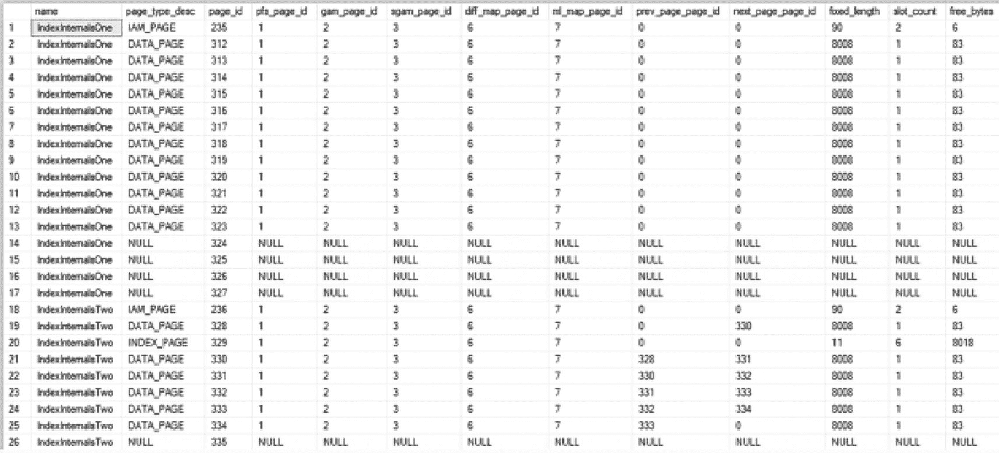

一个包含 26 行数据的页面头查询表结果的截图。列标题为：name、page type d e s c、page i d、p f s page i d、g a m page i d、a g a m page id、d i f f map page i d、m l map page i d、p r e v page page i d、next page page i d、alloc count 和 free byte。

**图 3-4**  
来自 `sys.dm_db_page_info` 的页面头结果

## DBCC 命令

虽然可以使用动态管理函数探索数据结构，但在某些情况下可能需要进一步研究。要在 SQL Server 中实现这一点，可以使用以下 DBCC 命令：

- `DBCC EXTENTINFO`
- `DBCC IND`
- `DBCC PAGE`


### DBCC EXTENTINFO

与 `sys.dm_db_database_page_allocations` 类似，`DBCC EXTENTINFO` 提供数据库内区分配的相关信息。此命令用于识别区的分配方式，以及所使用的区是混合区还是统一区。清单 3-8 展示了使用 `DBCC EXTENTINFO` 的语法。使用该命令时，可以填充四个参数，其定义见表 3-5。

表 3-5
DBCC EXTENTINFO 参数

| **参数** | **描述** |
| --- | --- |
| `database_name | database_id` | 指定要检索页面的数据库名称或数据库 ID。如果未提供此参数或其值为零，则默认为当前数据库。 |
| `table_name | table_object_id` | 通过提供表名或表的 `object_ID` 来指定输出中要返回哪个表。如果未提供值，输出将包含所有表的结果。 |
| `index_name | index_id` | 通过提供索引名称或 `index_ID` 来指定输出中要返回哪个索引。如果值为 -1 或未提供，则输出将包含表上所有索引的结果。 |
| `partition_id` | 通过提供分区号来指定输出中要返回索引的哪个分区。如果值为 0 或未提供，则输出将包含索引上所有分区的结果。 |

```
DBCC EXTENTINFO ( {database_name | database_id | 0}
, {table_name | table_object_id}, { index_name | index_id | -1}
, { partition_id | 0}
```

清单 3-8
DBCC EXTENTINFO 语法

执行 `DBCC EXTENTINFO` 时，会返回一个数据集，其中包含表 3-6 中定义的列。每个区分配在结果中对应一行。由于一个区由八个页面组成，当存在单页分配时（例如使用混合区时），一个区最多可以有八个分配。当使用统一区时，每个区将只有一个分配，并返回一行。

表 3-6
DBCC EXTENTINFO 输出列

| **参数** | **描述** |
| --- | --- |
| `file_id` | 页面所在文件的编号。 |
| `page_id` | 页面的编号。 |
| `pg_alloc` | 从区分配给对象的页面数。 |
| `ext_size` | 区的大小。 |
| `object_id` | 表的对象 ID。 |
| `index_id` | 与堆或索引关联的索引 ID。 |
| `partition_number` | 堆或索引的分区号。 |
| `partition_id` | 堆或索引的分区 ID。 |
| `iam_chain_type` | 该区所用于的 IAM 链类型。值可以是行内数据、LOB 数据和溢出数据。 |
| `pfs_bytes` | 字节数组，用于标识可用空间量、是否存在幽灵记录、页面是否为 IAM 页面、是否已分配以及是否属于混合区。 |

为演示此命令的工作原理，将提供一个示例来说明区的分配方式。在清单 3-9 所示的示例中，将重用上一节中的 `dbo.IndexInternalsOne`。

```
USE Chapter2Internals
GO
DBCC EXTENTINFO(0, IndexInternalsOne, -1)
```

清单 3-9
DBCC EXTENTINFO dbo.IndexInternalsOne

如图 3-5 所示，`DBCC` 命令的结果显示共有 13 个页面分配给了该表。结果中值得关注的是 `pg_alloc` 和 `ext_size` 列。第一行中，分配了 9 个页面，包括索引分配映射页面和该区的 8 个页面。第二行中，分配了 4 个页面，这是插入表中的 12 条记录的剩余部分。两行的区大小都应为 8，因为分配的是统一区。

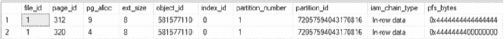

一张查询表结果的截图，显示 2 行数据。列标题为 file i d、page i d、page allocation、e x t size、object i d、index i d、partition number、partition i d、i am chain type 和 p f s bytes。表中的页面分配数为 9 和 4。

图 3-5
针对 dbo.IndexInternalsOne 中页面的 DBCC EXTENTINFO

在 SQL Server 2016 之前的版本中，行为会有很大不同，因为它会对每个事务使用单页分配，直到填满第一个区。此行为变更是因为跟踪标志 1118 的行为已成为 SQL Server 的默认行为。

尽管 `DBCC EXTENTINFO` 提供的详细信息不如 `sys.dm_db_database_page_allocations` 多，但它对于识别分配给表的区非常有用，尤其是在使用 SQL Server 2012 之前的版本时。


### DBCC IND

下一个可用于调查索引及其关联页的命令是 `DBCC IND`。该命令返回与请求对象相关的所有页的列表，其范围可以限定在数据库、表或索引级别，类似于 `sys.dm_db_database_page_allocations`。清单 3-10 显示了使用 `DBCC IND` 的语法。使用此命令时，可以填充三个参数，每个参数的描述见表 3-7。

#### 表 3-7: DBCC IND 参数

| **参数** | **描述** |
| --- | --- |
| `database_name | database_id` | 指定要检索页列表的数据库名称或数据库 ID。如果未提供此参数或其值使用零，则默认为当前数据库。 |
| `table_name | table_object_id` | 通过提供表名称或表的 `object_ID` 来指定在输出中返回哪个表。如果未提供值，输出将包含所有表的结果。 |
| `index_name | index_id` | 通过提供索引名称或 `index_ID` 来指定在输出中返回哪个索引。如果提供 -1 或未提供值，输出将包含表上所有索引的结果。 |

```
DBCC IND ( {'dbname' | dbid}, {'table_name' | table_object_id},
{'index_name' | index_id | -1})
清单 3-10
DBCC IAM 语法
```

对于分配给请求对象的每一页，`DBCC IND` 在结果数据集中每页返回一行；列的定义见表 38。与 `DBCC EXTENTINFO` 不同，`DBCC IND` 会在结果中明确返回 IAM 页。

#### 表 3-8: DBCC IND 输出列

| **列** | **描述** |
| --- | --- |
| `PageFID` | 页所在的文件号。 |
| `PagePID` | 该页的页码。 |
| `IAMFID` | IAM 页所在的文件 ID。 |
| `IAMPID` | 数据文件中该页的页 ID。 |
| `ObjectID` | 关联表的对象 ID。 |
| `IndexID` | 与堆或索引关联的索引 ID。 |
| `PartitionNumber` | 堆或索引的分区号。 |
| `PartitionID` | 堆或索引的分区 ID。 |
| `iam_chain_type` | 该区用于的 IAM 链类型。值可以是行内数据、LOB 数据和溢出数据。 |
| `PageType` | 标识页类型的编号。这些类型列在表 3-9 中。 |
| `IndexLevel` | 页在页组织结构中所处的级别。级别从 0 到 N 组织，其中 0 是索引的最低级别，N 是索引根级别。 |
| `NextPageFID` | 该索引级别上下一页所在的文件号。 |
| `NextPagePID` | 该索引级别上下一页的页码。 |
| `PrevPageFID` | 该索引级别上上一页所在的文件号。 |
| `PrevPagePID` | 该索引级别上上一页的页码。 |

在 `DBCC IND` 的结果中，`PageType` 列返回页的类型，可以包括数据页、索引页、GAM 或上一章讨论的任何其他页类型。表 3-9 显示了不同页类型及其对应 ID 值的完整列表。

#### 表 3-9: 页类型映射

| **页类型** | **描述** |
| --- | --- |
| 1 | 数据页 |
| 2 | 索引页 |
| 3 | 大型对象页 |
| 4 | 大型对象页 |
| 8 | 全局分配映射页 |
| 9 | 共享全局分配映射页 |
| 10 | 索引分配映射页 |
| 11 | 页可用空间页 |
| 13 | 引导页 |
| 15 | 文件头页 |
| 16 | 差异更改映射页 |
| 17 | 最小日志记录页 |

使用 `DBCC IND` 的主要优点是，它提供了表或索引的所有页的列表及其在数据库中的位置。这可用于帮助调查索引的行为以及页的位置。将提供几个示例来说明如何获取和使用这些数据。

### DBCC IND 示例

在第一个示例中，将重新审视上一节中创建的表，检查每个表的输出，并将其与 `DBCC EXTENTINFO` 的输出进行比较。此代码示例包含针对 `IndexInternalsOne` 和 `IndexInternalsTwo` 的 `DBCC IND` 命令，如清单 3-11 所示。传入的数据库 ID 为 0（表示当前数据库），索引 ID 设置为 -1 以返回所有索引的页。

```
USE Chapter2Internals;
GO
DBCC IND (0, 'IndexInternalsOne',-1);
清单 3-11
DBCC IND 示例
```

在 `DBCC EXTENTINFO` 示例中，表 `IndexInternalsOne` 有两个区分配，如图 3-5 所示。这些结果显示有 13 个页分配给了该表。如图 3-6 所示的 `DBCC IND` 结果，详细列出了构成两个区分配的所有页。

在这些结果中，有一个 IAM 页和 12 个分配给该表的数据页。`DBCC EXTENTINFO` 提供了区分配开始的页 312，包含九个页，但仅凭这些有限信息无法确定 IAM 页的位置。它在结果未列出的另一个区中，而 `DBCC IND` 的结果将其标识为页 235。使用 `DBCC IND` 列出索引页的好处是，它提供了确切的页码，无需任何猜测。还要注意，结果中的索引级别返回为第 0 级，没有中间级别。堆结构是扁平的，因此页的排列没有特定顺序。


*图 3-6: dbo.IndexInternalsOne 的 DBCC IND 结果*

### DBCC IND 聚集索引示例

上一个示例中的表是以堆结构组织的。在下一个示例中，将检查具有聚集索引的表的 `DBCC IND` 输出。在清单 3-12 中，创建了表 `dbo.IndexInternalsThree`，并在 `RowID` 列上有一个聚集索引。然后插入四行，之后使用 `DBCC IND`。

```
USE Chapter2Internals
GO
CREATE TABLE dbo.IndexInternalsThree
(
RowID INT IDENTITY(1,1)
,FillerData CHAR(8000)
,CONSTRAINT PK_IndexInternalsThree  PRIMARY KEY CLUSTERED (RowID)
)
GO
INSERT INTO dbo.IndexInternalsThree DEFAULT VALUES
GO 4
DBCC IND (0, 'IndexInternalsThree',-1)
清单 3-12
DBCC IND 聚集索引示例
```

图 3-7 显示了此示例的结果。请注意与之前示例（见图 3-6）相比，`IndexLevel` 的返回方式发生了变化。


*图 3-7: dbo.IndexInternalsThree 的 DBCC IND 结果*


Here, the third row in the result set has an `IndexLevel` of 1 and a `PageType` of 2, which is an index page. With these results, there is enough information to rebuild the B-tree structure for the index, as shown in Figure 3-8. The B-tree starts with the IAM page, which is page number 1:237. This page is linked to page 1:361, which is an index page at index level 1. Following that, pages 1:360, 1:362, 1:363, and 1:364 are at index level 0 and doubly linked to each other.

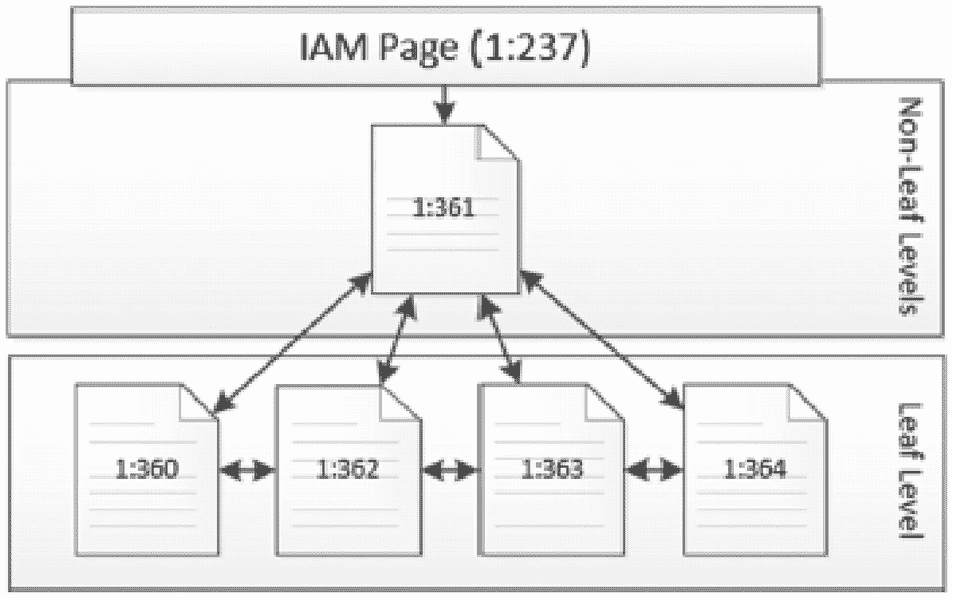
B-tree 结构框架，其 IAM 页为 1:237。它链接到非叶级别的页 1:361。进一步链接到叶级别的页 1:360、1:362、1:363 和 1:364。
图 3-8

#### 针对 dbo.IndexInternalsThree 的 DBCC IND

在上述两个示例中，`DBCC IND` 被用于调查堆或聚集索引关联的页。此 DBCC 命令提供表或索引所有页的信息，包括 IAM 页。这些页包含页号，用于标识它们在数据文件中的位置。页之间的关系也被包含在内，例如用于在 B-tree 中导航到相邻页的下一个和上一个页号。

`sys.dm_db_database_page_allocations` 可以提供相同的信息（甚至更多）。为了演示这一点，清单 3-13 展示了如何从 `sys.dm_db_database_page_allocations` 获取 `DBCC IND` 信息。如果比较输出，可以注意到它们几乎完全相同，仅在少数情况下 `NULL` 和 0 的返回方式不同。考虑到工具的选择，应优先使用 DMF 而非 DBCC 命令。

```sql
USE Chapter2Internals;
GO
SELECT
    allocated_page_file_id AS PageFID
    ,allocated_page_page_id AS PagePID
    ,allocated_page_iam_file_id AS IAMFID
    ,allocated_page_iam_page_id AS IAMPID
    ,object_id AS ObjectID
    ,index_id AS IndexID
    ,partition_id AS PartitionNumber
    ,rowset_id AS PartitionID
    ,allocation_unit_type_desc AS iam_chain_type
    ,page_type AS PageType
    ,page_level AS IndexLevel
    ,next_page_file_id AS NextPageFID
    ,next_page_page_id AS NextPagePID
    ,previous_page_file_id AS PrevPageFID
    ,previous_page_page_id AS PrevPagePID
FROM sys.dm_db_database_page_allocations(DB_ID(), OBJECT_ID('dbo.IndexInternalsTwo'), 1, NULL, 'DETAILED')
WHERE is_allocated = 1;
GO
DBCC IND (0,'dbo.IndexInternalsTwo',1)
```
清单 3-13
通过 sys.dm_db_database_page_allocations 获取的 DBCC IND 输出

### DBCC PAGE

最后一个用于检查页的命令是 `DBCC PAGE`。虽然其他两个命令提供关于页以及它们与表和索引关系的信息，但 `DBCC PAGE` 的输出则提供了页的实际内容。清单 3-14 展示了使用 `DBCC PAGE` 的语法。

```sql
DBCC PAGE ( { database_name | database_id | 0}, file_number, page_number
    [,print_option ={0|1|2|3} ])
```
清单 3-14
DBCC PAGE 语法

`DBCC PAGE` 命令接受多个参数。通过这些参数，它能够确定要检索的数据库和具体页，然后以请求的格式在结果集中返回。表 3-10 详细说明了 `DBCC PAGE` 的参数。

表 3-10
DBCC PAGE 参数

| **参数** | **描述** |
| --- | --- |
| `database_name | database_id` | 指定从中检索页的数据库名称或数据库 ID。如果未提供此参数或其值为零，则默认为当前数据库。 |
| `file_number` | 指定要从中检索页的数据文件在数据库中的文件编号。 |
| `page_number` | 指定要检索的页在数据库文件中的页号。 |
| `print_option` | 指定输出应如何返回。有四种打印选项可用：<br>*0—仅页头*：仅返回页头信息。<br>*1—十六进制行*：返回页头信息、页上的所有行以及偏移数组。在此输出中，每一行单独返回。<br>*2—十六进制数据*：返回页头信息、页上的所有行以及偏移数组。与选项 1 不同，输出将所有行显示为单个数据块。<br>*3—数据行*：返回页头信息、页上的所有行以及偏移数组。此选项与其他选项的不同之处在于，行中列的数据会按其列名列表进行转换。<br>此参数是可选的，如果未选择任何选项，则默认使用 0。 |

**注意：** 默认情况下，`DBCC PAGE` 命令将其消息输出到 SQL Server 事件日志。在大多数情况下，这不是理想的输出机制。跟踪标志 3604 允许你修改此行为。利用此跟踪标志，`DBCC` 语句的输出将返回到 SQL Server Management Studio (SSMS) 的“消息”选项卡中。

通过 `DBCC PAGE` 及其打印选项，可以检索页上的所有内容。深入研究页的详细内容有何价值？查看索引或数据页可以帮助理解意外的索引行为（例如性能不佳）。可以深入了解行内数据的结构方式，例如为什么行可能比预期更大。行的大小确实对索引的行为有重要影响，因为当一行变大时，存储索引所需的页数会增加。索引需要更多页将导致需要更多内存来缓存它，最终导致更高的资源消耗和更长的查询等待时间。更大的索引大小可能会改变查询优化器所做的决策，最终改变使用该索引的查询的执行计划和性能。

使用 `DBCC PAGE` 的另一个原因是观察在发生各种操作时数据页的变化情况。正如本章后面的示例将说明的，`DBCC PAGE` 可用于揭示在页拆分和转发达记录操作期间发生的情况。


为了演示如何使用 `DBCC PAGE`，我们将使用清单 3-15 中的代码展示几个带有不同打印选项的示例。该代码使用 `sys.dm_db_database_page_allocations` 来确定示例的页码。对于每个示例，将说明不同页面类型之间结果可能存在的差异。虽然每个数据库中的页码可能略有不同，但这些演示基于一个 IAM 页（238）、一个索引页（377）以及两个数据页（376 和 378），如图 3-9 所示。

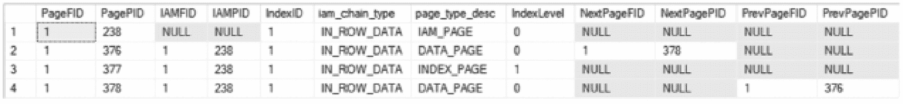

一张显示页面分配的查询结果表截图，包含 4 行数据。列标题为：page F I D、page P I D、I A M F I D、I A M P I D、object I D、index I D、partition number、partition I D、I A M chain type、page type、index level、next page F I D、next page P I D、p r e v page F I D 和 p r e v page P I D。表中各行的页面类型各不相同。

图 3-9 dbo.IndexInternalsFour 的页面分配情况

```sql
USE [Chapter2Internals];
GO
CREATE TABLE dbo.IndexInternalsFour (
RowID INT IDENTITY(1, 1) NOT NULL,
FillerData VARCHAR(2000) NULL,
CONSTRAINT PK_IndexInternalsFour
PRIMARY KEY CLUSTERED ([RowID] ASC));
INSERT INTO dbo.IndexInternalsFour (FillerData)
VALUES (REPLICATE(1, 2000)),
(REPLICATE(2, 2000)), (REPLICATE(3, 2000)),
(REPLICATE(4, 2000)), (REPLICATE(5, 25));
SELECT allocated_page_file_id AS PageFID,
allocated_page_page_id AS PagePID,
allocated_page_iam_file_id AS IAMFID,
allocated_page_iam_page_id AS IAMPID,
index_id AS IndexID,
allocation_unit_type_desc AS iam_chain_type,
page_type_desc,
page_level AS IndexLevel,
next_page_file_id AS NextPageFID,
next_page_page_id AS NextPagePID,
previous_page_file_id AS PrevPageFID,
previous_page_page_id AS PrevPagePID
FROM sys.dm_db_database_page_allocations(DB_ID(), OBJECT_ID('dbo.IndexInternalsFour'), 1, NULL, 'DETAILED')
WHERE is_allocated = 1;
```
**清单 3-15** 用于 DBCC PAGE 示例的 DBCC IND 查询

#### 仅打印页面头选项

`DBCC PAGE` 的第一个可用打印选项仅返回页面头，此时 `print_option` 等于 0（默认值）。页面头随所有 `DBCC PAGE` 请求一同返回；使用此选项将结果限制为仅包含页面头。页面头作为一部分返回两个章节。

返回的第一部分是缓冲区信息。缓冲区提供页面当前在 SQL Server 内存中位置的信息。要读取页面，必须先从磁盘读取该页面并写入内存。本节提供了可用于查找页面当前内存位置的地址。

第二部分是页面头本身。页面头包含描述页面及其内容的属性。并非所有属性当前都由 SQL Server 使用，但有许多值得进一步讨论。这些关键属性在表 3-11 中详述。

**表 3-11** 页面头关键属性定义

| 属性 | 定义 |
| --- | --- |
| `m_pageId` | 页面的文件 ID 和页码。 |
| `m_type` | 返回的页面类型；参见表 3-9 中的页面类型列表。 |
| `Metadata: AllocUnitId` | 映射自目录视图 `sys.allocation_units` 的分配单元 ID。 |
| `Metadata: PartitionId` | 表或索引的分区 ID。这映射到目录视图 `sys.partitions` 中的 `partition_ID`。 |
| `Metadata: ObjectId` | 表的对象 ID。这映射到目录视图 `sys.tables` 中的 `object_ID`。 |
| `Metadata: IndexId` | 表或索引的索引 ID。这映射到目录视图 `sys.indexes` 中的 `index_ID`。 |
| `m_prevPage` | 索引结构中的上一页。用于 B 树索引中，以便沿索引级别顺序读取页面。 |
| `m_nextPage` | 索引结构中的下一页。用于 B 树索引中，以便沿索引级别顺序读取页面。 |
| `m_slotCnt` | 页面上的槽数，即行数。 |
| `Allocation Status` | 列出所请求页面的 GAM、SGAM、PFS、DIFF（或 DCM）和 ML（或 BCM）页的位置。它还包括从这些元数据页面获取的每个页面的状态。 |

要演示使用 `DBCC PAGE` 的仅打印页面头选项，可以使用清单 3-16 中的代码。结果应与图 3-10 中的类似。在此场景中，页码显示在页面顶部，表明它是页面 1:377。`m_type` 为 2，这意味着它是一个索引页。`m_slotCnt` 显示页面上有两行。参考图 3-10，行数将对应于将数据页 1:376 和 1:378 映射到索引所需的两个索引记录。最后，分配状态显示该页面已在 GAM 页面上分配，其填满率为 0%（根据 PFS 页面），并且该页面自上次完整备份以来已被更改（根据 DCM 页面）。

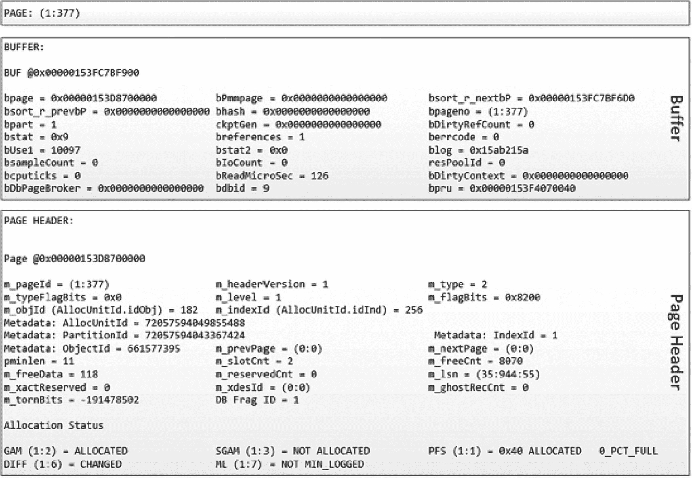

一张 D B C C page 输出的截图。它由 3 个数据框组成。1. 显示页面 1:377。2. 缓冲区页面。3. 显示页面头，其中包含 G A M、S G A M、P F F、D I F F 和 M L 的分配状态。输出中显示 G A M 已分配。

图 3-10 仅打印页面头选项的 DBCC PAGE 输出

```sql
DBCC TRACEON(3604)
DBCC PAGE(0,1,377,0)
```
**清单 3-16** 使用仅打印页面头选项的 DBCC PAGE

仅打印页面头选项显示页面头中有大量有用信息。它提供了足够的信息来设想此页面如何与索引中的其他页面及其占据的区相关联。此信息类似于 `sys.dm_db_page_info`，但一般来说，`DBCC PAGE` 提供的信息比 DMF 更多。


##### 十六进制行打印选项

`DBCC PAGE` 的下一个可用打印选项是十六进制行打印选项，其中 `print_option` 等于 1。此选项在前一选项的基础上进行了扩展，在输出中添加了页面上每个槽位的条目，以及描述页面上每个槽位位置的偏移数组。

页面的数据部分会针对页面上的每一行重复出现，并包含该行的所有元数据和关联数据。对于元数据，行包括槽位号、页面偏移量、记录类型和记录属性。这些信息有助于定义行以及影响行大小的因素（除了数据大小）。在槽位的末尾是行的内存转储。内存转储以十六进制格式显示行，虽然不易于人类阅读，但包含了行的所有数据。有关属性及其定义的更多信息，请参见表 3-12。

偏移数组是包含在十六进制行选项结果中的最后一个信息部分。偏移数组包含表中每一行的两个重要细节。第一个是带有其十六进制表示的槽位号。第二个是该槽位在页面上的字节位置。利用这两条信息，可以定位并返回页面上的任何行。

表 3-12

十六进制行关键属性定义

| **属性** | **定义** |
| --- | --- |
| 槽位 | 行在页面上的位置。计数从 0 开始，紧接在页面头部之后。 |
| 偏移量 | 行在页面上的物理字节位置。 |
| 长度 | 行在页面上的长度。 |
| 记录类型 | 行的类型。一些可能的值包括 `INDEX_RECORD` 和 `PRIMARY_RECORD`。 |
| 记录属性 | 行上影响行大小的属性列表。这些可以包括 `NULL_BITMAP` 和 `VARIABLE_COLUMNS` 数组。 |
| 记录大小 | 行在页面上的大小。 |
| 内存转储 | 页面上数据的内存位置。对于十六进制行选项，它仅限于该槽位中的信息。提供内存地址，之后是存储在槽位中的数据的十六进制转储。 |

对于十六进制行示例，将对上一节研究的索引页 (1:279) 进行进一步检查。这次将使用十六进制行打印选项，即在 `DBCC PAGE` 中设置 `print_option` 为 1，如清单 3-17 所示。

`DBCC PAGE` 命令的结果将比之前的执行更长，因为它们包含了带有页面头部的行数据。为了专注于新信息，示例输出（图 3-11）中排除了缓冲区和页面头部的结果。在数据部分，显示了两个槽位：槽位 0 和槽位 1。这些槽位对应于页面上的两个索引行，可以通过每行的记录类型 `INDEX_RECORD` 来验证。行的十六进制数据包含索引记录的页面和范围信息，但此打印选项不会翻译这些信息。最后一部分包含偏移表，其中有表中两行的槽位信息。请注意，偏移量以 0 结尾并从底部开始计数。行在头部之后开始并递增向上，而偏移数组从页面末尾开始并反向递增。通过这种方式，可以向表中添加新行而无需重新组织页面。

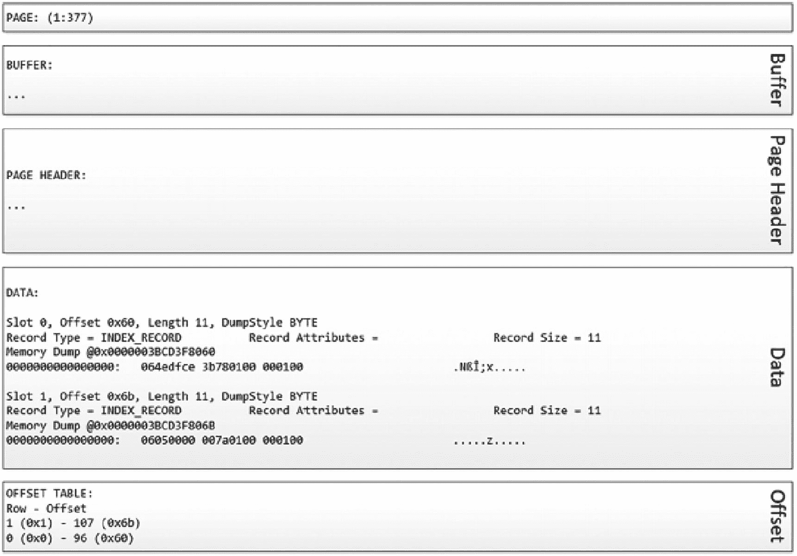

D B C C 页面输出的截图。它由 5 个数据框组成。1. 显示页面 1:377。2 和 3. 2 个空的缓冲区和页面头部框。4. 槽位 0 和 1 的数据输出。5. 显示一个偏移表，其中行是偏移量。

图 3-11

十六进制行打印选项的 DBCC PAGE 输出

```
DBCC TRACEON(3604)
DBCC PAGE(0,1,377,1)
清单 3-17
使用十六进制行打印选项的 DBCC PAGE
```

十六进制行打印选项包含页面头部信息，并在此基础上进行了扩展，以提供对页面上实际行的深入了解。当试图了解页面上行的大小及其可能比预期更大的原因时，此信息可能非常有价值。

##### 十六进制数据打印选项

`DBCC PAGE` 的第三个打印选项是十六进制数据打印选项，其中 `print_option` 等于 2。此打印选项与前一个类似，以仅打印页面头部的选项输出开始，并在此基础上添加内容。通过此选项添加的信息包括页面数据部分的十六进制输出和偏移数组。对于数据部分，细节以未格式化的形式输出——正如其出现在实际页面上的那样。当需要查看页面的原始形式时，这种格式的输出可能很有用。

为了演示十六进制数据打印选项，将使用清单 3-18 中的脚本。其中，`DBCC PAGE` 命令用于从 `dbo.IndexInternalsFour` 中检索包含最后一行的页面。该行在 `FillerData` 列中包含 25 个数字 5。

```
USE Chapter2Internals
GO
DBCC TRACEON(3604)
DBCC PAGE(0,1,377,2)
清单 3-18
使用十六进制数据打印选项的 DBCC PAGE
```

在结果中（如图 3-12 所示），输出在数据部分包含一大块字符。该块包含三个组成部分。最左边是页面地址信息，例如 `0x0000003BCEBF8000`。页面地址标识了页面上信息的位置。中间部分包含页面该部分中的十六进制数据。字符块的右侧包含十六进制数据的字符表示。在大多数情况下，这些数据是难以辨认的，除非存储的是字符数据类型（如 `char` 和 `nchar`）的字符数据。

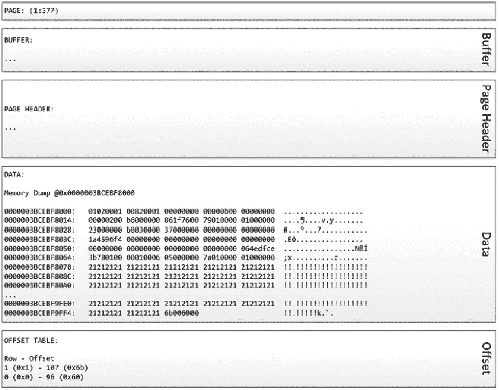

D B C C 页面输出的截图。它由 5 个数据框组成。1. 显示页面 1:377。2 和 3. 2 个空的缓冲区和页面头部框。4. 字母数字形式的内存转储数据输出。5. 显示一个偏移表，其中行是偏移量。

图 3-12

十六进制数据打印选项的 DBCC PAGE 输出

最初，十六进制数据打印选项可能看起来不如其他打印选项有用，而且在许多情况下确实如此。此打印选项的真正价值在于 `DBCC PAGE` 不会尝试为您解释页面，它按原样显示页面。使用其他打印选项时，输出有时会重新排序以符合预期的槽位顺序；第 10 章中演示了这样一个例子。


#### 行数据打印选项

`DBCC PAGE` 的最后一个打印选项是行数据打印选项，其中 `print_option` 等于 3。此打印选项的输出可能会根据所请求的页面类型而变化。对于大多数页面，返回的基本信息与十六进制行打印选项相同：数据按行以十六进制格式拆分。不过，数据页面和索引页面的输出有所不同。对于这些页面类型，此选项提供了关于页面的一些极其有用的信息。

> **注意**
> 您可以在 `DBCC PAGE` 中使用 `WITH TABLERESULTS` 选项，将命令的结果输出到结果集而不是消息中。当您想将 `DBCC` 命令返回的结果插入到表中时，此选项非常有用。

为了展示数据页面和索引页面输出之间的差异，让我们来看另一个示例。此示例将使用在代码清单 3-15 中创建的表 `dbo.IndexInternalsFour`。在此打印选项的演示中（如代码清单 3-19 所示），您将对表的数据页面和索引页面之一执行 `DBCC PAGE`。

```sql
USE Chapter2Internals
GO
DBCC TRACEON(3604)
DBCC PAGE(0,1,378,3) -- Data page
DBCC PAGE(0,1,377,3) -- Index page
```
*代码清单 3-19 使用行数据打印选项的 DBCC PAGE*

将数据页面的结果（如图 3-13 所示）与十六进制数据打印选项的输出（如图 3-12 所示）进行比较，有一个主要区别。在插槽的十六进制内存转储下方，行中的所有列详细信息都被解码并以易读的格式呈现。它从插槽 0 列 1 开始，该列包含 `RowID` 列，显示其值为 5。下一列（第 2 列）是 `FillerData` 列，包含 25 个 5。对于这些列中的每一列，都会注明物理长度以及值在行内的偏移量。页面数据部分提供的最后一个值是 `KeyHashValue`。此值并未存储在页面上，相反，它是页面放入内存时根据页面上的键创建的一个哈希值。此值显示在 SQL Server 用于向最终用户报告页面信息的工具中。任何在调查死锁时见过此值的人都可能会熟悉它。

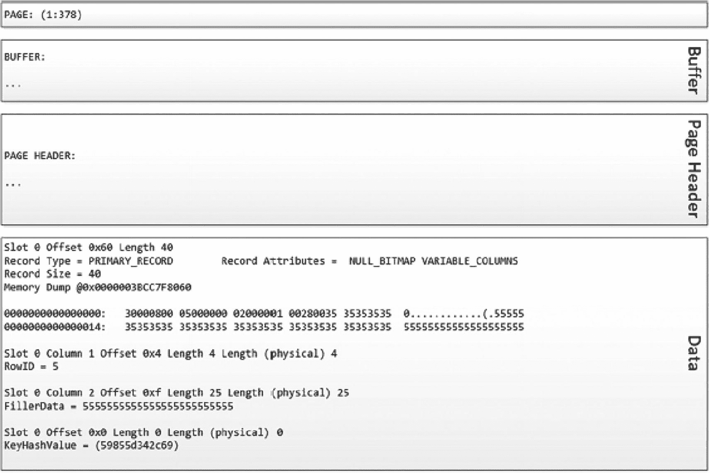
*图 3-13 数据页面的行数据打印选项的 DBCC PAGE 输出*

对于索引页面，消息输出与其他页面类型相比没有变化。不同之处在于结果集。它不仅提供消息输出，还返回一个表。该表为页面上的每一行索引包含一行。查看索引页面的输出（如图 3-14 所示），返回了两行。第一行表示页面 `1:376` 是索引页面的子页面。它还显示索引的键值是 `RowID`，对于第一个索引行它是 `NULL`。这表明这是索引的开始，没有值限制子页面上的第一行。第二行映射到页面 `1:378`，键值为 5。在这种情况下，键值表明子页面上的第一行的 `RowID` 为 5。由于键值可能因索引而异，因此使用这些选项的 `DBCC PAGE` 命令的结果也会随之改变。对于每个索引变体，输出将返回该索引的相关值。

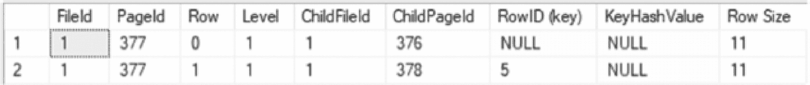
*图 3-14 索引页面的行数据打印选项的 DBCC PAGE 输出*

行数据打印选项是 `DBCC PAGE` 命令最有用的选项之一。对于数据页面，它提供了对页面上存储的数据、所占用空间及其位置的全面洞察。这为理解为何只有某些行能放在页面上，以及为何例如发生页面拆分提供了直接依据。索引页面输出的结果集同样有用。将索引行映射到页面并返回键值的能力，可以深入了解索引的组织方式以及页面的布局方式。

## 摘要

在本章中，提供了一些工具，允许直接在 SQL Server 中查看索引数据的存储细节。尽管是记录最少的工具，`DBCC PAGE` 和 `DBCC IND` 允许从索引中收集大量知识，否则这些知识将难以获得。

谨慎使用，这些工具对于管理员或架构师来说是一个宝贵的资产，他们希望深入了解索引结构及其存储。

