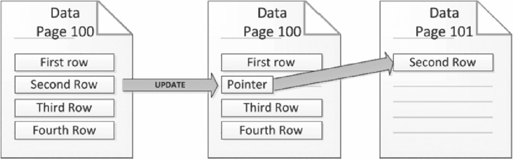
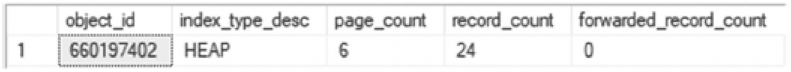
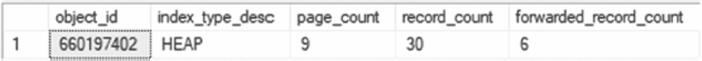
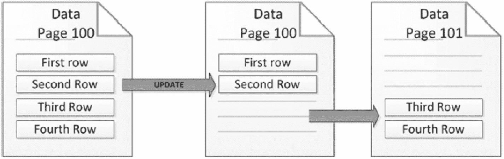
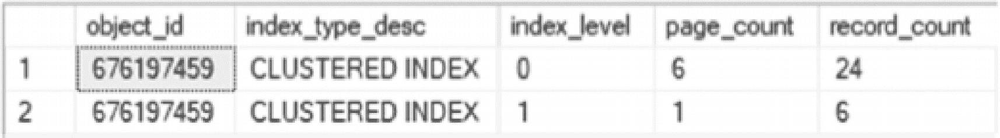
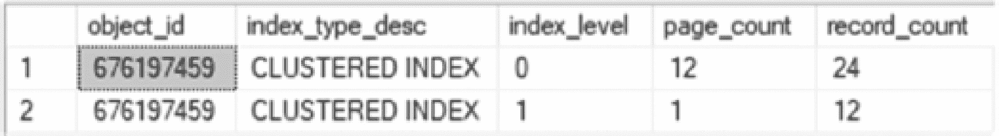

# 4. 碎片化

对索引内部结构的讨论也必须涉及碎片化对存储和性能的影响。本章概述了碎片化、其对数据存储的影响以及它如何损害性能。

## 页面碎片化

SQL Server 将数据库中的信息存储在 8 KB 的页面上。通常，表中的行被限制在该大小内；如果它们小于 8 KB，SQL Server 会在一个页面上存储多行。在一个页面上存储多行所面临的挑战之一是处理页面上所有行的总大小超过 8 KB 空间的情况。在这些情况下，SQL Server 必须更改页面上行的存储方式。根据页面的组织方式，SQL Server 将通过两种方式处理这些情况：转发行和页面拆分。

> **注意**
> 此讨论不考虑单个记录可能大于页面的两种情况。这两种情况是行溢出和大型对象。对于行溢出，在某些情况下，SQL Server 允许页面上的单个记录超过 8 KB。此外，当大型对象值超过 8 KB 大小时，它们使用 LOB 页面而不是数据页面。这些对本节讨论的页面碎片没有直接影响。


### 转发记录

当记录大小超出数据页时，管理记录的第一种方法是使用转发记录。此方法仅适用于使用堆结构的情况。通过转发记录，当某行数据被更新后不再适合当前数据页时，SQL Server 会将该记录移动到堆中的一个新数据页，并在两个位置之间添加指针。第一个指针标识记录当前所在的数据页，通常称为*转发记录指针*。第二个指针位于新数据页上，指回转发记录原始所在的数据页；它被称为*反向指针*。

以下是转发操作如何进行的逻辑示例。考虑一个编号为 100 的数据页，它存在于一个使用堆的表上（见图 4-1）。该页上有四行，每行大小约为 2 KB，总共使用了 8 KB 的空间。如果第二行被更新，现在需要占用 2.5 KB，那么它将不再适合该数据页。SQL Server 会从堆中选择另一个数据页，或在需要时分配一个新数据页（本例中是编号为 101 的数据页）。然后，第二行被写入该页，并且指向新数据页的指针会替换掉第 100 页上该行的原始位置。



一个数据流图有 3 个数据页，其中 2 个编号为 100，各有 4 行，1 个编号为 101。数据从第 100 页的第二行转发至第 101 页的第一行，第 100 页上的第二行更新为指针。

**图 4-1**
转发记录过程图

接下来要考虑的是如何检查表上的记录转发情况。例如，创建一个名为 `dbo.HeapForwardedRecords` 的表，如代码清单 4-1 所示。为了表示此逻辑示例中的行，将使用 `sys.objects` 向 `dbo.HeapForwardedRecords` 添加 24 行。这些行中的每一行都有一个 `RowID` 来标识它，以及 2,000 个字符，导致表中每页有四行。可以使用 `sys.dm_db_index_physical_stats` 来验证（见图 4-2）表中共有六页，总计 24 行。



一个表格有 5 列和一行数据。第 1 至第 5 列标题分别为：对象 i d、索引类型描述、页数、记录数和转发记录数。选中了对象 i d 660197402，各列内容依次为 HEAP、6、24 和 0。

**图 4-2**
引入转发记录前 `dbo.HeapForwardedRecords` 的物理状态

```
USE AdventureWorks2017
GO
CREATE TABLE dbo.HeapForwardedRecords
(
RowId INT IDENTITY(1,1)
,FillerData VARCHAR(2500)
);
INSERT INTO dbo.HeapForwardedRecords (FillerData)
SELECT TOP 24 REPLICATE('X',2000)
FROM sys.objects;
DECLARE @ObjectID INT = OBJECT_ID('dbo.HeapForwardedRecords');
SELECT object_id, index_type_desc, page_count, record_count, forwarded_record_count
FROM sys.dm_db_index_physical_stats (DB_ID(), @ObjectID, NULL, NULL, 'DETAILED');
```
**代码清单 4-1** 转发记录场景

此演示的下一步是在表中创建转发记录。为此，将更新表中每隔一行，将 `FillerData` 的值从 2,000 个字符扩展到 2,500 个字符，如代码清单 4-2 所示。结果，其中两行将因过大而无法容纳在其所在数据页的剩余空间中。原本要写入 8 KB 页的数据量将增加到大约 9 KB。

因此，SQL Server 需要将记录移出数据页才能完成更新。由于将其中一行移出数据页将为第二行留出足够空间，因此只有一条记录会被转发。`sys.dm_db_index_physical_stats` 的输出（见图 4-3）证实了这一点。页数增加到九页，并且有六条记录被记录为已转发。一个特别值得关注的项目是记录数。虽然表中的行数没有增加，但现在表中多了六条额外的记录。这是因为该行的原始记录仍然保留在其原始位置，并带有一个指向其他位置包含该行数据的另一条记录的指针。



一个表格有 5 列和一行数据。第 1 至第 5 列标题分别为：对象 i d、索引类型描述、页数、记录数和转发记录数。它有 1 条记录，对象 i d 660197402 被选中，后面各列依次是 HEAP、9、30 和 6。

**图 4-3** 引入转发记录后 `dbo.HeapForwardedRecords` 的物理状态

```
USE AdventureWorks2017
GO
UPDATE dbo.HeapForwardedRecords
SET FillerData = REPLICATE('X',2500)
WHERE RowId % 2 = 0;
DECLARE @ObjectID INT = OBJECT_ID('dbo.HeapForwardedRecords');
SELECT object_id, index_type_desc, page_count, record_count, forwarded_record_count
FROM sys.dm_db_index_physical_stats (DB_ID(), @ObjectID, NULL, NULL, 'DETAILED');
```
**代码清单 4-2** 引起转发记录的脚本

转发记录带来的挑战是，它们导致表中的行需要在两个位置被引用，从而在从表中检索数据和向表中写入数据时增加了所需的 I/O 量。表越大，存在的转发记录越多，转发记录对性能产生负面影响的可能性就越大。


## 页面分裂

处理页面上行数据大小超出页面容量的第二种方法是执行页面分裂。页面分裂适用于任何基于 B 树索引结构实现的索引，这包括聚集索引和非聚集索引。在进行页面分裂时，如果某一行被更新到其大小不再适合当前所在的数据页面，`SQL Server` 会将该页面上的一半行数据移至一个新页面。然后，`SQL Server` 会尝试再次将该行的数据写入页面。如果此时数据能放入页面，则该页面将被写入。如果不能，该过程将重复进行，直到数据能放入页面为止。

为了说明页面分裂如何运作，我们将探讨一个导致页面分裂的更新操作。与上一节类似，考虑一个页面编号为 100 的表（见图 4-4）。页面 100 上存储了四行数据，每行大约 2 KB 大小。假设其中一行（例如第二行）被更新，大小增至 2.5 KB。该页面的数据总量将达到 8.5 KB，超过了可用空间，从而引发页面分裂。为了分裂页面，系统会分配一个编号为 101 的新页面，并将原页面上的一半行（第三行和第四行）写入新页面。此时，由于页面上有 4 KB 的可用空间，第二行数据就可以写入原页面了。



该图展示了如何将数据页 100 中第二行的数据更新到另一个数据页 100 中的第二行。第二行的值被加载到数据页 101 的第三行和第四行中。

图 4-4：页面分裂过程示意图

以下是一个关于页面分裂如何在表中发生的示例，我们将逐步演示一个强制表上发生页面分裂的场景。首先，将创建表 `dbo.ClusteredPageSplits`，如代码清单 4-3 所示。将向此表插入 24 行数据，每行长度约为 2 KB。这将导致每页存放四行，为该表分配六个数据页。考虑索引级别 0（即叶级）的信息。由于该表通过聚集索引使用 B 树，因此还会有一个额外的页面用于索引树结构。在索引级别 1 上有六条记录，引用索引中的六个页面。此信息可从图 4-5 中确认。



该表有 5 列和 2 行。第 1 至 5 列的标题分别是：object i d、index type description、index level、page count 和 record count。表中有 2 条记录，第一行中的 object i d 676197459 被选中。

图 4-5：页面分裂前 `dbo.ClusteredPageSplits` 的物理状态

```sql
USE AdventureWorks2017
GO
CREATE TABLE dbo.ClusteredPageSplits
(
RowId INT IDENTITY(1,1)
,FillerData VARCHAR(2500)
,CONSTRAINT PK_ClusteredPageSplits PRIMARY KEY CLUSTERED (RowId)
);
INSERT INTO dbo.ClusteredPageSplits (FillerData)
SELECT TOP 24 REPLICATE('X',2000)
FROM sys.objects;
DECLARE @ObjectID INT = OBJECT_ID('dbo.ClusteredPageSplits');
SELECT object_id, index_type_desc, index_level, page_count, record_count
FROM sys.dm_db_index_physical_stats (DB_ID(), @ObjectID, NULL, NULL, 'DETAILED');
```
代码清单 4-3：页面分裂场景

通过更新某些记录使其大小超过页面容量，可以引发表上的页面分裂。这将通过执行一个 `UPDATE` 语句来实现，该语句使用代码清单 4-4 中的脚本，将每隔一行的 `FillerData` 列长度从 2000 个字符增加到 2500 个字符。每页上结果行的大小将达到 9 KB，与之前的例子一样，这超过了可用的页面大小，从而导致 `SQL Server` 使用页面分裂来释放页面上的空间。

调查页面分裂发生后的结果（图 4-6）显示了页面分裂对表的影响。首先，在索引的叶级，页面数量从 6 个增加到了 12 个（索引级别 0）。如前所述，当发生页面分裂时，页面会被对半分裂，并添加一个新页面。由于表中的所有数据页都被更新，所有页面都进行了分裂，导致叶级页面数量翻倍。索引级别 1 唯一的变化是增加了六个页面来引用索引中的新页面。



该表有 5 列和 2 行。列标题依次为：object i d, index type description, index level, page count, 和 record count。第一行中的 object i d 676197459 被选中。

图 4-6：页面分裂后的物理状态

```sql
USE AdventureWorks2017
GO
UPDATE dbo.ClusteredPageSplits
SET FillerData = REPLICATE('X',2500)
WHERE RowId % 2 = 0;
DECLARE @ObjectID INT = OBJECT_ID('dbo.ClusteredPageSplits');
SELECT object_id, index_type_desc, index_level, page_count, record_count
FROM sys.dm_db_index_physical_stats (DB_ID(), @ObjectID, NULL, NULL, 'DETAILED');
```
代码清单 4-4：引发页面分裂的脚本

页面分裂和转寄记录之间有两个值得关注的区别。首先，当页面分裂发生时，数据页上的记录数量并未增加。页面分裂只是移动了记录的位置，以便为逻辑索引顺序中的记录腾出空间。其次是页面分裂不会增加记录数。由于页面分裂已经为记录腾出了空间，因此不需要额外的记录来指向数据存储的位置。

页面分裂可能导致与转寄记录类似的性能问题。这些性能问题既发生在页面分裂进行时，也发生在其之后。在页面分裂过程中，被分裂的页面在记录被分配到两个页面时需要被独占锁定。这会导致当页面分裂发生时，其他人需要访问除正在更新的行以外的行时产生争用。页面分裂后，索引中数据页的物理顺序通常不再符合其在索引中的逻辑顺序。这会阻碍 `SQL Server` 执行连续读取的能力，从而减少单次操作可读取的数据量。此外，与使用较少页面获得相同结果相比，查询执行时需要读入内存的页面越多，查询性能就越慢。

## 总结

本章详细地介绍、演示和描述了索引碎片。理解了碎片对索引存储和性能的影响后，第 11 章将探讨解决碎片的问题。在该章中，将提供更深入的方法来识别和解决索引碎片问题。


