# 5. 索引元数据与统计信息

在理解了索引的逻辑和物理基础之后，现在可以讨论描述索引运作方式的元数据。这些统计信息有助于深入了解 SQL Server 如何管理和使用索引。它还提供了所需的信息，用于确定一个索引可能被选择或不被选择的原因，以及它的运行状况。本章将更深入地介绍这些信息在何处以及如何被收集。还将介绍 SQL Server 提供的一些附加 `DBCC` 命令和动态管理对象（DMO），以及这些信息是如何生成和使用的。

本章涵盖的统计信息将涉及四个信息领域。第一个领域是列级统计信息。它为查询优化器提供列（以及索引）中数据分布情况的信息。接下来是索引使用统计信息。这里的信息有助于了解一个索引是否被使用以及如何被使用。第三个是操作统计信息，它提供了索引使用方式的详细信息。最后一个信息领域是物理统计信息，它提供了索引物理特征及其在数据库内分布情况的洞察。

此外，本章还将回顾列存储索引可用的元数据和统计信息，以及收集到的信息。这些信息有助于理解存储在列存储索引中的内容，以及这可能如何影响针对这些索引的查询性能。

## 列级统计信息

列级统计信息是 SQL Server 中与索引相关的最重要领域之一。这些统计信息提供了值在索引的键列上如何分布的信息。SQL Server 利用它来确定索引中值的预期频率和分布；这被称为 `基数`。

通过 `基数`，查询优化器开发一系列基于成本的执行计划，以找到执行已提交请求的最佳执行计划。如果索引的统计信息不正确或不再代表索引中的数据，那么所创建的计划就不太可能是最优的。理解并与统计信息进行交互非常重要，以确保环境中的索引不仅存在，而且能提供其预期的效益。

> 注意
>
> 通常，当为“修复”性能问题而重建索引时，碎片通常不是问题的原因或直接解决方案。重建时，索引会获得新的统计信息，并且与这些索引相关的执行计划需要重新编译，这两者中的任何一个都可能是性能问题的原因，而不是索引碎片。

在 SQL Server 中，有许多与统计信息交互的方法。接下来的章节将回顾一些最常见的机制。对于每种方法，都将讨论其是什么、提供什么以及使用每种方法的价值。

### DBCC SHOW_STATISTICS

与统计信息交互的第一种，也可能是最熟悉的方式是通过 `DBCC` 命令 `SHOW_STATISTICS`。此命令将返回所请求数据库对象（表或索引视图）的统计信息。返回的信息是一个统计对象，包含三个不同的组成部分：头信息、直方图和密度向量。每个部分都为 SQL Server 提供了对索引中可用数据的理解。

可以使用清单 5-1 中的 `DBCC` 语法返回统计对象。此语法接受表或索引视图的名称作为统计信息的来源，然后返回目标信息。目标可以是索引的名称，也可以是创建的列级统计信息的名称。

```sql
DBCC SHOW_STATISTICS ( table_or_indexed_view_name , target )
[ WITH [  ]
```

清单 5-1 `DBCC SHOW_STATISTICS` 语法

`DBCC` 命令可以包含四个选项：`NO_INFOMSGS`、`STAT_HEADER`、`DENSITY_VECTOR` 和 `HISTOGRAM`。这些选项中的任何一个或全部都可以包含在逗号分隔的列表中。

选项 `NO_INFOMSGS` 会在执行 `DBCC` 命令时抑制所有信息性消息。这些是严重级别从 0 到 10 的错误消息，其中 10 为最高严重级别。在大多数情况下，由于这些错误消息是信息性的，在使用此 `DBCC` 语句时它们没有价值。

选项 `STAT_HEADER`、`DENSITY_VECTOR` 和 `HISTOGRAM` 会限制 `DBCC` 命令的输出。如果包含一个或多个选项，则仅返回所包含项的统计信息组件。如果未选择其中任何一个，则包含所有组件。还有一个 `STATS_STREAM` 选项，这里不作讨论，因为它已弃用，并且可能不会包含在 SQL Server 的未来版本中。

定义了此 `DBCC` 命令后，可以更详细地讨论其统计信息组件。将对每个组件进行定义，然后我们将探讨来自 AdventureWorks2017 数据库的内容示例。清单 5-2 提供了本次回顾所需的结果。

```sql
USE AdventureWorks2017
GO
DBCC SHOW_STATISTICS ( 'Sales.SalesOrderDetail'
, PK_SalesOrderDetail_SalesOrderID_SalesOrderDetailID )
```

清单 5-2 针对 `Sales.SalesOrderDetail` 表上索引的 `DBCC SHOW_STATISTICS`


#### 统计头信息

统计头信息是统计对象的元数据部分。表 5-1 中列出的这些列主要是信息性的。它们提供了在构建统计信息时考虑的行数，以及这些行是如何通过筛选确定的。表 5-1 还包含了统计信息最后更新时间的信息，这对于调查统计信息质量方面的潜在问题很有用。

表 5-1：`DBCC SHOW_STATISTICS` 中的统计头信息列

| 列名 | 描述 |
| --- | --- |
| `Name` | 统计对象的名称。对于索引统计信息，此名称与索引名称相同。 |
| `Updated` | 统计信息最后更新的日期和时间。 |
| `Rows` | 统计信息最后更新时，表或索引视图中的总行数。对于筛选的统计信息或索引，此计数指的是符合筛选条件的行数。 |
| `Rows Sampled` | 为统计计算采样的行数。当 `Rows Sampled` 的值小于 `Rows` 中的值时，直方图和密度值是估计值。 |
| `Steps` | 直方图中的步数。每个步跨越一个列值范围，后跟一个上限列值。直方图步是在统计信息的第一个关键列上定义的。最大步数为 200。 |
| `Density` | 计算为 1/*唯一值数量*，适用于统计对象第一个关键列中的所有值，不包括直方图边界值。从 SQL Server 2008 开始，查询优化器不再使用此值，但出于信息和向后兼容性目的仍提供。 |
| `Average Key Length` | 统计对象中所有关键列每个值的平均字节数。 |
| `String Index` | 指示统计对象是否包含字符串摘要统计信息，以改进使用 `LIKE` 运算符的查询谓词的基数估计。 |
| `Filter Expression` | 如果已填充，则是包含在统计对象中的表行子集的谓词。 |
| `Unfiltered Rows` | 应用筛选表达式之前表中的总行数。如果 `Filter Expression` 为 `NULL`，则 `Unfiltered Rows` 等于 `Rows`。 |
| `Persisted Sample Percent` | 在 SQL Server 2016 中新增，显示用于更新统计信息的样本百分比。如果为零，则表示没有为统计信息设置样本百分比。 |

查看图 5-1 所示的 `Sales.SalesOrderDetail` 表上 `PK_SalesOrderDetail_SalesOrderID_SalesOrderDetailID` 的统计头信息，可以发现一些值得注意的项目。由于 `Rows` 和 `Rows Sampled` 的值相同，这些统计信息并非基于估计。统计信息最后更新于 2017 年 10 月 27 日（尽管在另一个数据库副本中此值可能不同）。统计直方图中有 163 步，最大可达 200 步。步数等于范围数。在本例中，163 步意味着有 163 个值范围，每个范围在统计信息中提供了上限值。上限值定义了该范围内的最大值。如果第 1 步的上限值为 42，那么第 1 步将涵盖值 0–42。下一步则从 43 开始，并包含直至其上限的值。注意缺少筛选表达式和未筛选行数；索引和统计信息都没有筛选掉行。最后，`Persisted Sample Percent` 设置为 0，这意味着所有行都用于统计信息的采样，这可以通过比较 `Rows` 和 `Rows Sampled` 来确认。


图 5-1：`Sales.SalesOrderDetail` 表上索引的统计头信息

#### 密度向量

统计对象的下一个组件是密度向量。密度向量描述了统计对象内部的列。统计或索引对象中的每个关键值都对应一行。例如，如果一个索引中有两列，分别名为 `SaleOrderID` 和 `SalesOrderDetailID`，密度向量中将有两行。密度向量将为 `SaleOrderID` 和 `SaleOrderID` 与 `SalesOrderDetailID` 各有一行，如图 5-2 所示。密度向量有三部分信息可用：密度、平均长度和向量中包含的列（列名详见表 5-2）。

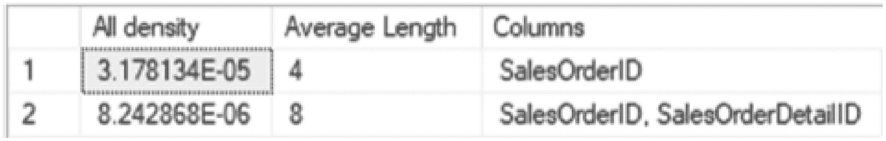

图 5-2：`Sales.SalesOrderDetail` 表上索引的密度向量示例

密度向量的价值在于它有助于查询优化器调整多列统计对象的基数。如下一节所述，直方图中的范围仅基于统计对象的第一列，而密度则在执行单列或多列查询之间提供调整。虽然更新统计信息的重点通常在于直方图的变化，但密度向量提供了一种有价值的方法，用于调整直方图中的范围，以校正超出索引第一列的数据分布差异。

表 5-2：`DBCC SHOW_STATISTICS` 中的密度向量列

| 列名 | 描述 |
| --- | --- |
| `All Density` | 返回统计对象中每个列前缀的密度，每个密度一行。密度计算为 1/*唯一列值数量*。密度越接近 1，列中的值越均匀。 |
| `Average Length` | 存储密度向量中每一级的列值的平均长度（字节）。 |
| `Columns` | 每个密度向量级别的列名。 |


#### 直方图

`DBCC SHOW_STATISTICS` 输出的最后一个组件是直方图。直方图提供了查询优化器用于确定基数的统计对象的详细信息。在构建直方图时，SQL Server 会计算一系列聚合值，这些值基于统计样本或表或视图中的所有行。这些聚合值衡量值出现的频率，并将值分组为不超过 200 个*步骤*。对于每个步骤，都会计算统计列的分布，包括步骤中的行数、步骤的上限值、与上限值匹配的行数、步骤中的唯一行数以及步骤中重复值的平均数量。表 5-3 列出了与这些聚合值对应的列。有了这些信息，查询优化器就能够估计索引中值范围返回的行数，从而使其能够计算与检索行相关的成本。

**表 5-3**
来自 `DBCC SHOW_STATISTICS` 的直方图列

| 列名 | 描述 |
| --- | --- |
| `RANGE_HI_KEY` | 直方图步骤的上限列值。此列值也称为 `键值`。 |
| `RANGE_ROWS` | 估计列值落在直方图步骤内（不包括上限）的行数。 |
| `EQ_ROWS` | 估计列值等于直方图步骤上限的行数。 |
| `DISTINCT_RANGE_ROWS` | 估计直方图步骤内（不包括上限）具有唯一列值的行数。 |
| `AVG_RANGE_ROWS` | 直方图步骤内（不包括上限）具有重复列值的行的平均数量（当 `DISTINCT_RANGE_ROWS` > 0 时为 `RANGE_ROWS/DISTINCT_RANGE_ROWS`）。 |

本示例中的直方图有 163 个步骤。图 5-3（包含直方图中的一些行）展示了 `Sales.SalesOrderDetail` 表中部分步骤的聚合方式。图 5-3 中的第二项显示 `RANGE_HI_KEY` 值为 43692，这意味着 43660 到 43692 之间的所有 `SalesOrderID` 值都包含在这些估算值中。根据 `RANGE_ROWS` 值，此系列中有 282 行，其中包含 32 个唯一行。将这些数字转换到 `SalesOrderDetail` 表，意味着有 32 个不同的 `SalesOrderID` 值，它们之间共有 282 个 `SalesOrderDetailID` 项。最后，对于 `SalesOrderID` 43692，有 28 个 `SalesOrderDetailID` 项。

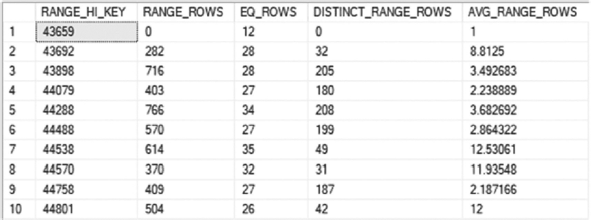
*一张包含 10 行 5 列的查询表销售订单详情的截图。表头列分别是 range H I key, range rows, E Q rows, distinct range rows 和 A V G range row。10 个 H I key 的范围是 43659 到 44801。*

**图 5-3**
`Sales.SalesOrderDetail` 表上索引的直方图示例

`AVG_RANGE_ROWS` 列中的值非常重要，当统计信息过时时，它可能是导致性能问题的原因。它说明了当检索索引中的任何一个值或值范围时，可以预期有多少行。要检查范围平均值的准确性，请执行清单 5-3 中的查询，该查询将聚合第二步中的一些值。完成后，结果（如图 5-4 所示）将显示平均值与平均范围行值 8.8125 非常接近。

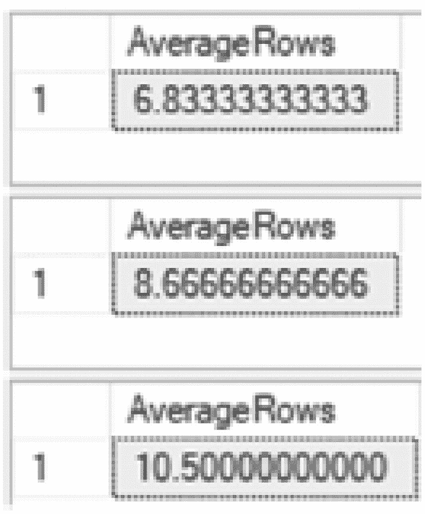
*一张显示 3 种条件下平均行数的表格输出截图。*

**图 5-4**
`AVG_RANGE_ROWS` 估算验证结果

```
USE AdventureWorks2017
GO
SELECT (COUNT(*)*1.)/COUNT(DISTINCT SalesOrderID) AS AverageRows
FROM Sales.SalesOrderDetail
WHERE SalesOrderID BETWEEN 43672 AND 43677;
SELECT (COUNT(*)*1.)/COUNT(DISTINCT SalesOrderID) AS AverageRows
FROM Sales.SalesOrderDetail
WHERE SalesOrderID BETWEEN 43675 AND 43677;
SELECT (COUNT(*)*1.)/COUNT(DISTINCT SalesOrderID) AS AverageRows
FROM Sales.SalesOrderDetail
WHERE SalesOrderID BETWEEN 43675 AND 43680;
```
**清单 5-3**
用于检查 `AVG_RANGE_ROWS` 估算的查询

当索引的统计信息受到质疑时，此直方图是一个非常有价值的工具。如果需要确定为什么查询性能不如预期，或者为什么查询计划错误地估计行数，可以使用直方图来验证这些行为和结果。

### 目录视图

使用 `DBCC SHOW_STATISTICS` 可以提供有关查询优化统计信息的最详细信息。然而，它依赖于用户知道统计信息的存在。虽然默认情况下，每个索引都会为其创建统计信息，但列级统计信息需要通过其他方法来发现。这通过两个目录视图来完成：`sys.stats` 和 `sys.stats_columns`。

#### sys.stats

目录视图 `sys.stats` 为数据库中存在的每个统计信息对象返回一行，无论统计信息是基于索引还是列创建的。表 5-4 提供了 `sys.stats` 中列的详细信息。

**表 5-4**
`sys.stats` 的列

| 列名 | 数据类型 | 描述 |
| --- | --- | --- |
| `object_id` | `int` | 这些统计信息所属对象的 ID。 |
| `name` | `sysname` | 统计信息的名称。此值对于每个 `object_id` 必须是唯一的。 |
| `stats_id` | `int` | 统计信息的 ID（在对象内唯一）。 |
| `auto_created` | `bit` | 指示统计信息是否由查询处理器自动创建。 |
| `user_created` | `bit` | 指示统计信息是否由用户显式创建。 |
| `no_recompute` | `bit` | 指示统计信息创建时是否使用了 `NORECOMPUTE` 选项。 |
| `has_filter` | `bit` | 指示统计信息是否基于筛选或行子集聚合。 |
| `filter_definition` | `nvarchar(max)` | 包含在筛选统计信息中的行子集的表达式。 |
| `is_temporary` | `bit` | 指示统计信息是否为临时。  SQL Server 2012 中添加。 |
| `is_incremental` | `bit` | 指示统计信息是否为增量。  SQL Server 2014 中添加。 |
| `has_persisted_sample` | `bit` | 指示统计信息是否具有持久化的采样率。  SQL Server 2019 中添加。 |
| `stats_generation_method` | `int` | 标识统计信息生成方法的标志。 SQL Server 2019 中添加。 |
| `stats_generattion_method_desc` | `varchar(80)` | 标识统计信息生成方法的文本描述。 SQL Server 2019 中添加。 |

#### sys.stats_columns

作为 `sys.stats` 的配套视图，目录视图 `sys.stats_columns` 为统计信息对象中的每一列提供一行。表 5-5 列出了 `sys.stats_columns` 中的列。

**表 5-5**
`sys.stats_columns` 的列

| 列名 | 数据类型 | 描述 |
| --- | --- | --- |
| `object_id` | int | 此列所属对象的 ID |
| `stats_id` | int | 此列所属统计信息的 ID |
| `stats_column_id` | int | 在统计信息列集合中的基于 1 的序号 |
| `column_id` | int | 来自 `sys.columns` 的列的 ID |


### STATS_DATE

在评估统计信息准确性时，一个重要的考量因素是统计信息是否已过时。判断统计信息是否过时的常用方法是使用 `STATS_DATE` 函数。该函数提供了统计信息最近一次更新的日期。如清单 5-4 所示，该函数的语法接受一个 `object_id` 和一个 `stats_id`。对于索引而言，`stats_id` 与 `index_id` 的值相同。

```
STATS_DATE ( object_id , stats_id )
Listing 5-4
STATS_DATE 语法
```

虽然 `STATS_DATE` 函数常用于识别过时的统计信息，但这种方法对于此任务并不有效。统计信息的最后更新日期并不一定能反映数据变化的速率。一个数据数年未更新、统计信息是数月前的表，其统计信息可能并未过时；而一个频繁进行插入、更新和删除操作、但其统计信息在前一天更新的表，其统计信息可能已经无法代表索引中的实际值。尽管对于统计信息变化缓慢的索引，该函数可以作为一个通用的检查工具，但鉴于上述例子，使用时应谨慎。

### sys.dm_db_stats_properties

识别统计信息变化率的更好方法是使用 `sys.dm_db_stats_properties` DMO，它提供了一个能反映数据变化情况的指标。这个 DMO 在 SQL Server 2008 中引入，提供了自上次更新统计信息以来已更改行数的详细信息。如清单 5-5 所示，`sys.dm_db_stats_properties` 的语法接受一个 `object_id` 和一个 `stats_id`。与 `STATS_DATE` 一样，`stats_id` 与 `index_id` 值相同。表 5-6 列出了 `sys.dm_db_stats_properties` 中的列。

表 5-6

sys.dm_db_stats_properties 的列

| 列名 | 数据类型 | 描述 |
| --- | --- | --- |
| `object_id` | `int` | 相关对象的 ID。 |
| `stats_id` | `int` | 统计信息的 ID。对于索引，该 ID 与索引 ID 匹配。 |
| `last_updated` | `datetime2(7)` | 统计信息最后一次更新的日期和时间。 |
| `rows` | `bigint` | 统计信息最后一次更新时，表或索引视图中的总行数。对于筛选统计信息或索引，该计数指的是符合筛选条件的行数。 |
| `rows_sampled` | `bigint` | 用于统计信息计算的采样行总数。当 `rows_sampled` 的值小于 `rows` 中的值时，直方图和密度值是估计值。 |
| `steps` | `int` | 直方图中的步数。每一步跨越一系列列值，后跟一个上限列值。直方图步长在统计信息的第一个键列上定义。最大步数为 200。 |
| `unfiltered_rows` | `bigint` | 应用筛选表达式之前表中的总行数。如果 `Filter Expression` 为 `NULL`，则 `unfiltered_rows` 等于 `rows`。 |
| `modification_counter` | `bigint` | 自上次更新表统计信息以来，插入、删除或更新的行总数。 |
| `persisted_sample_percent` | `Float` | 用于未显式指定样本百分比的统计信息更新的样本百分比。值为零表示此统计信息没有保留的样本百分比。在 SQL Server 2016 中新增。 |

```
sys.dm_db_stats_properties (object_id, stats_id)
Listing 5-5
sys.dm_db_stats_properties 的语法
```

由于 `sys.dm_db_stats_properties` 提供了更好地理解统计信息是否过时的机会，其输出可以显示表中值的变化如何影响 `modification_counter` 列。为此，将创建一个包含一些索引的表 `dbo.SalesOrderHeaderStats`，如清单 5-6 所示。为了研究 `modification_counter`，将使用清单 5-7 中的查询来查看该列的变化。图 5-5 显示该表中有 20,000 行数据，每个列出的索引和统计信息的当前 `modification_counter` 值均为 0。

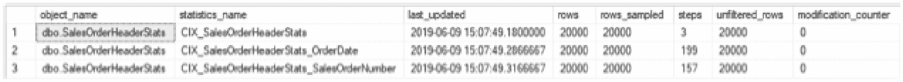

一个包含 3 行 8 列的查询表截图。列标题为：对象名称、统计信息名称、上次更新时间、行数、采样行数、步数、未筛选行数和修改计数器。

图 5-5

在 dbo.SalesOrderHeaderStats 上执行 sys.dm_db_stats_properties 的查询结果

```
USE AdventureWorks2017
GO
SELECT
OBJECT_SCHEMA_NAME(s.object_id)
+'.'+OBJECT_NAME(s.object_id) AS object_name
,s.name as statistics_name
,x.last_updated
,x.rows
,x.rows_sampled
,x.steps
,x.unfiltered_rows
,x.modification_counter
FROM sys.stats s
CROSS APPLY sys.dm_db_stats_properties(s.object_id, s.stats_id) x
WHERE s.object_id = OBJECT_ID('dbo.SalesOrderHeaderStats')
Listing 5-7
用于 dbo.SalesOrderHeaderStats 的 sys.dm_db_stats_properties 查询
```


#### 准备用于 `sys.dm_db_stats_properties` 审查的表

`USE AdventureWorks2017`
`GO`
`DROP TABLE IF EXISTS dbo.SalesOrderHeaderStats;`
`SELECT SalesOrderID`
`,OrderDate`
`,SalesOrderNumber`
`INTO dbo.SalesOrderHeaderStats`
`FROM Sales.SalesOrderHeader`
`WHERE SalesOrderID <= 63658`
`CREATE CLUSTERED INDEX CIX_SalesOrderHeaderStats`
`ON dbo.SalesOrderHeaderStats(SalesOrderID)`
`CREATE INDEX CIX_SalesOrderHeaderStats_OrderDate`
`ON dbo.SalesOrderHeaderStats(OrderDate)`
`CREATE INDEX CIX_SalesOrderHeaderStats_SalesOrderNumber`
`ON dbo.SalesOrderHeaderStats(SalesOrderNumber)`

有了可操作的表后，就可以更改表中的数据，并观察这些更改对统计信息的影响。在示例中，将使用五个不同的查询，如代码清单 5-8 所示。第一个查询更新了 `OrderDate` 列，导致 40 行数据被更改。第二个查询更新了 50 行，其中 `SalesOrderNumber` 被设置为其当前值。第三个查询再次更新 `SalesOrderNumber` 列，但对相同的 50 行数据进行了值反转。第四个查询向表中插入了 11,465 条记录。最后一个查询从表中删除了前 20,000 条记录。在每个查询之间，执行代码清单 5-7 中的代码；这样做将提供统计信息详情，如图 5-6 的输出所示。

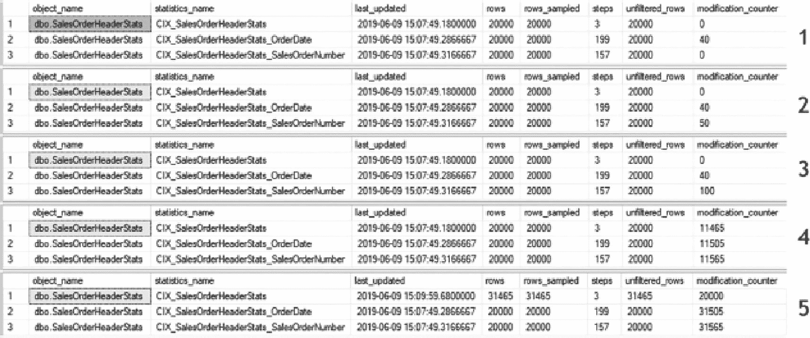

**图 5-6** 针对 `dbo.SalesOrderHeaderStats` 上的示例查询，`sys.dm_db_stats_properties` 的查询结果

#### 在 dbo.SalesOrderHeaderStats 上的示例 DML 查询

```sql
USE AdventureWorks2017
GO
UPDATE dbo.SalesOrderHeaderStats
set OrderDate = GETDATE()
WHERE SalesOrderID % 500 = 1
--执行代码清单 5-7 中的代码
UPDATE dbo.SalesOrderHeaderStats
SET SalesOrderNumber = SalesOrderNumber
WHERE SalesOrderID % 400 = 1
--执行代码清单 5-7 中的代码
UPDATE dbo.SalesOrderHeaderStats
SET SalesOrderNumber = REVERSE(SalesOrderNumber)
WHERE SalesOrderID % 400 = 1
--执行代码清单 5-7 中的代码
SET IDENTITY_INSERT dbo.SalesOrderHeaderStats ON
INSERT INTO dbo.SalesOrderHeaderStats (SalesOrderID
,OrderDate
,SalesOrderNumber)
SELECT SalesOrderID
,OrderDate
,SalesOrderNumber
FROM Sales.SalesOrderHeader
WHERE SalesOrderID > 63658
SET IDENTITY_INSERT dbo.SalesOrderHeaderStats OFF
--执行代码清单 5-7 中的代码
DELETE FROM dbo.SalesOrderHeaderStats
WHERE SalesOrderID <= 63658
--执行代码清单 5-7 中的代码
```

回顾图 5-6 中的结果，可以深入了解 `modification_counter` 列是如何填充的。任何插入、更新或删除操作都被视为对索引和统计信息的一次更改。查看查询 1 的结果，更改的 40 行导致 `CIX_SalesOrderHeaderStats_OrderDate` 的 `modification_counter` 值增加到 40。类似地，当查询 2 和 3 中更改了 `SalesOrderNumber` 时，每个查询都导致 `modification_counter` 增加了 50，无论值是否实际发生了变化。增加记录数导致所有三个索引的 `modification_counter` 值都增加了 11,465，这与插入的记录数一致。最后，在查询 5 的结果中，删除了 20,000 条记录。有趣的是，在最后一个查询的结果中，`CIX_SalesOrderHeaderStats` 的统计信息被更新，以更好地反映索引中值的变化。

虽然 `sys.dm_db_stats_properties` 不提供表中所有不同记录的列表及其对统计信息可能产生的影响，但它确实提供了详细信息，可用于识别索引及其支持统计信息的变化量。当试图确定索引的统计信息是否可能过时时，这个 DMO 非常有用。

### sys.dm_db_stats_histogram

虽然可以使用 `DBCC SHOW_STATISTICS` 获取统计信息的直方图，但 SQL Server 2016 引入了 DMO 函数 `sys.dm_db_stats_histogram`。该函数返回与 `DBCC` 命令类似的输出，其额外优点是可以与其他 DMO 连接，以提高数据的可用性。该函数的语法如代码清单 5-9 所示，它接受一个 `object_id` 和 `stats_id`，输出中返回的列如表 5-7 所列。

#### 表 5-7
`sys.dm_db_stats_histogram` 的列

| 列名 | 数据类型 | 描述 |
| --- | --- | --- |
| `object_id` | `int` | 统计信息所属基础对象的 ID。 |
| `stats_id` | `int` | 统计信息的 ID。对于索引，此 ID 与索引 ID 匹配。 |
| `step_number` | `int` | 直方图中的步骤编号。最大值为 200。 |
| `range_high_key` | `sql_variant` | 直方图步骤的上限列值。该列值也称为 *键值*。 |
| `range_rows` | `real` | 列值落在直方图步骤范围内（不包括上限）的估计行数。 |
| `equal_rows` | `real` | 列值等于直方图步骤上限的估计行数。 |
| `distinct_range_rows` | `bigint` | 在直方图步骤范围内（不包括上限）具有不同列值的估计行数。 |
| `average_range_rows` | `real` | 在直方图步骤范围内（不包括上限）具有重复列值的平均行数（当 `distinct_range_rows > 0` 时为 `range_rows/distinct_range_rows`）。 |

#### 代码清单 5-9
`sys.dm_db_stats_histogram` 的语法

```sql
sys.dm_db_stats_histogram (object_id, stats_id)
```

如果将 `sys.stats` 与 `sys.dm_db_stats_histogram` 结合使用，如代码清单 5-10 所示，则可以检索 `Sales.SalesOrderDetail` 上所有统计信息的直方图。这提供了所有步骤及其范围值的信息。滚动浏览如图 5-7 所示的结果，到第 163 和 164 行，可以看到 `range_high_key` 值从数字数据变为字符数据，这与统计信息和步骤之间的变化相对应。

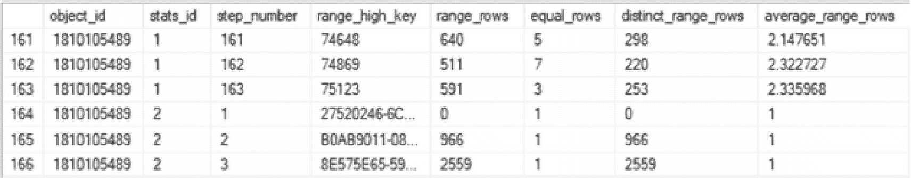

**图 5-7** 在 `Sales.SalesOrderDetail` 上查询 `sys.dm_db_stats_histogram` 的结果

#### 代码清单 5-10
针对 `Sales.SalesOrderDetail` 的 `sys.dm_db_stats_histogram` 查询

```sql
USE AdventureWorks2017;
GO
SELECT h.object_id,
h.stats_id,
h.step_number,
h.range_high_key,
h.range_rows,
h.equal_rows,
h.distinct_range_rows,
h.average_range_rows
FROM sys.stats s
CROSS APPLY sys.dm_db_stats_histogram(s.object_id, s.stats_id) h
WHERE s.object_id = OBJECT_ID('Sales.SalesOrderDetail');
```

这个新函数是查看和检查直方图的绝佳工具。例如，如果一个列上有多个索引和统计信息，可以编写一个查询，仅包含这些统计信息，并筛选 `range_high_key` 以仅包含匹配所需记录的步骤。此时，`average_range_rows` 是可用的，并有助于理解为什么 SQL Server 可能选择一个索引而非另一个。


### `sys.dm_db_incremental_stats_properties`

关于增量索引维护（将在第 9 章讨论），统计信息需要能够支持增量更新以及描述它们所需的元数据。作为`sys.dm_db_stats_properties`的配套函数，`sys.dm_db_incremental_stats_properties`函数提供了对增量统计信息和索引的统计属性的可见性。如清单 5-11 所示，`sys.dm_db_incremental_stats_properties`的语法包含与其他函数相同的参数：`object_id`和`stats_id`。其返回的列与表 5-6 中的列相同，只是此函数包含一个`partition_number`列，用于提供增量统计信息所在的分区。

```
sys.dm_db_incremental_stats_properties (object_id, stats_id)
```

清单 5-11
`sys.dm_db_incremental_stats_properties`的语法

## 统计信息 DDL

本节主要讨论了索引级别的统计信息。这些统计信息在创建索引时自动创建，并在索引被删除时删除。统计信息也可以在非索引列上创建，并能提供显著的价值。当在未索引列上手动创建或删除统计信息时，可以使用两个 DDL 语句来完成：`CREATE`和`DROP STATISTICS`。由于它们超出了本书的范围，此处将不作讨论。第三个 DDL 语句`UPDATE STATISTICS`适用于所有统计信息，包括索引级统计信息。由于`UPDATE STATISTICS`主要与索引维护相关，将在第 9 章讨论。

### 列级统计信息总结

查询优化统计信息是索引的重要组成部分。它们提供了查询优化器为了构建基于成本的查询计划所需的信息。通过这个过程，SQL Server 可以通过计算的成本来识别高质量的计划。本节回顾了统计信息及其存储方式，以及充分理解其细节及其与索引关系所需的工具。

请注意，所有缺失索引动态管理对象在 SQL Server 服务重启时都会重置。因此，必须定期采样这些数据，才能使其发挥最大效用。这对于因例行维护而定期重启的 SQL Server 尤其重要。

### 索引使用统计信息

接下来要讨论的信息领域是索引使用统计信息。这些统计信息通过 DMO `sys.dm_db_index_usage_stats`累积，该视图返回不同类型索引操作的计数以及这些操作最后一次执行的时间。这有助于了解索引的使用频率以及最近的使用情况。

`sys.dm_db_index_usage_stats`是一个动态管理视图（DMV）。因此，它不需要任何参数。它可以通过任何`JOIN`运算符与其他表或视图进行联接。索引在第一次被使用后或自统计信息重置以来，会出现在该 DMV 中。

注意
除了重启 SQL Server 服务外，关闭或分离数据库也会重置`sys.dm_db_index_usage_stats`中为索引累积的所有统计信息。

在 DMV `sys.dm_db_index_usage_stats`中，提供了三种类型的数据：标题列、用户统计信息和系统统计信息。接下来的几个小节将分别探讨这些数据，以了解它们所包含的信息及其使用方法。

### 标题列

DMV 的标题列提供了参考信息，可用于确定统计信息是为哪个索引累积的。表 5-8 列出了这些列。这些列主要用于将 DMV 与系统目录视图和其他 DMO 进行联接。

表 5-8
`sys.dm_db_index_usage_stats`中的标题列

| 列名 | 数据类型 | 描述 |
| --- | --- | --- |
| `database_id` | `smallint` | 定义表或视图的数据库 ID |
| `object_id` | `int` | 定义索引的表或视图的 ID |
| `index_id` | `int` | 索引的 ID |

使用`sys.dm_db_index_usage_stats`首先可以做的事情之一，就是检查自上次重置 DMV 中的统计信息以来，某个索引是否已被使用。类似于清单 5-12 中的 T-SQL 语句，标题列可以提供一个未被使用的索引列表。如果使用的是 AdventureWorks2017 数据库，结果将类似于图 5-8。这些结果中返回的是未被使用的索引。

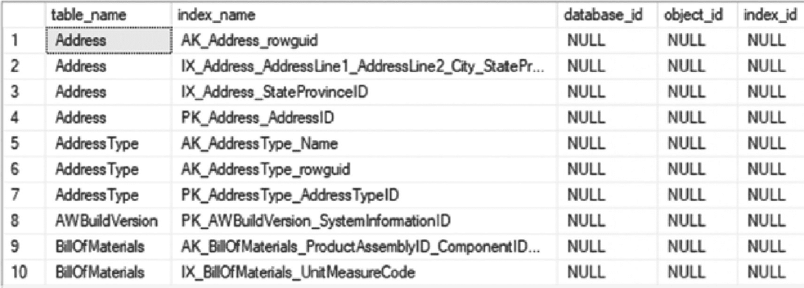
一个包含 10 行 5 列数据的表格截图。列标题为表名、索引名、数据库 ID、对象 ID 和索引 ID。所有 ID 数据均为 NULL。
图 5-8
`sys.dm_db_index_usage_stats`标题列查询结果

```
USE AdventureWorks2017
GO
SELECT TOP 10 OBJECT_NAME(i.object_id) AS table_name
,i.name AS index_name
,ius.database_id
,ius.object_id
,ius.index_id
FROM sys.indexes i
LEFT JOIN sys.dm_db_index_usage_stats ius
ON i.object_id = ius.object_id
AND i.index_id = ius.index_id
AND ius.database_id = DB_ID()
WHERE ius.index_id IS NULL
AND OBJECTPROPERTY(i.object_id, 'IsUserTable') = 1
ORDER BY table_name, index_name
```

清单 5-12
`sys.dm_db_index_usage_stats`标题列查询

这类信息对于管理数据库中的索引非常有用。它是一个极好的资源，可以快速识别一段时间内未被使用的索引。这种索引管理策略将在后续章节中进一步讨论。


### 用户列

DMV `sys.dm_db_index_usage_stats` 中的下一组列是用户列。用户列提供了有关索引如何在查询计划中被使用的洞察。这些列列于表 5-9 中，包含了关于每个操作发生了多少次（以及最近一次发生时间）的统计信息。

表 5-9

`sys.dm_db_index_usage_stats` 中的用户列

| 列名 | 数据类型 | 描述 |
| --- | --- | --- |
| `user_seeks` | `bigint` | 由用户查询执行的查找操作的总计数 |
| `user_scans` | `bigint` | 由用户查询执行的扫描操作的总计数 |
| `user_lookups` | `bigint` | 由用户查询执行的书签/键查找操作的总计数 |
| `user_updates` | `bigint` | 由用户查询执行的更新操作的总计数 |
| `last_user_seek` | `datetime` | 上次用户查找的日期和时间 |
| `last_user_scan` | `datetime` | 上次用户扫描的日期和时间 |
| `last_user_lookup` | `datetime` | 上次用户查找的日期和时间 |
| `last_user_update` | `datetime` | 上次用户更新的日期和时间 |

`sys.dm_db_index_usage_stats` 监视四种类型的索引操作。这些操作通过列 `user_seeks`、`user_scans`、`user_lookups` 和 `user_updates` 来表示。

#### user_seeks

第一个索引使用列是 `user_seeks`。当查询执行并返回一个它拥有直接访问路径的单行或行范围时，就会发生此列对应的操作。例如，如果一个查询执行并检索单个订单或一小批订单的所有销售详情，类似于清单 5-13 中的查询，则这些查询的查询计划将使用查找操作（参见图 5-9）。

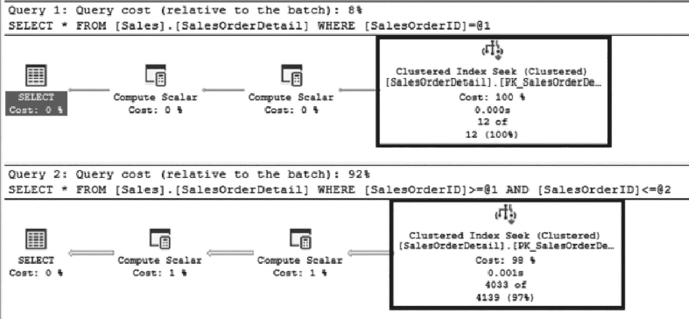

图 5-9：查找查询的查询计划

```
USE AdventureWorks2017
GO
SELECT * FROM Sales.SalesOrderDetail
WHERE SalesOrderID = 43659;
SELECT * FROM Sales.SalesOrderDetail
WHERE SalesOrderID BETWEEN 43659 AND 44659;
清单 5-13：索引查找查询
```

运行清单 5-13 中的查询后，DMV `sys.dm_db_index_usage_stats` 中的计数将被计入 `user_seeks` 列。清单 5-14 提供了一个用于调查此情况的查询。图 5-10 中的结果显示 `user_seeks` 列中的值为 5，这与清单 5-13 中的操作计数相符。基于此，有两个查询使用了索引执行，并且两者都能够使用索引直接定位到请求的行。

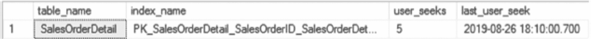

图 5-10：`sys.dm_db_index_usage_stats` 中 `user_seeks` 的查询结果

```
USE AdventureWorks2017
GO
SELECT TOP 10
OBJECT_NAME(i.object_id) AS table_name
,i.name AS index_name
,ius.user_seeks
,ius.last_user_seek
FROM sys.indexes i
INNER JOIN sys.dm_db_index_usage_stats ius
ON i.object_id = ius.object_id
AND i.index_id = ius.index_id
AND ius.database_id = DB_ID()
WHERE ius.object_id = OBJECT_ID('Sales.SalesOrderDetail');
清单 5-14：查询 `sys.dm_db_index_usage_stats` 中的 `user_seeks`
```

#### user_scans

下一个使用列是 `user_scans`。每当查询执行并必须扫描索引中的每一行时，此列的值就会增加。例如，考虑一个对销售详情的未过滤查询，它必须返回所有记录，或者一个对未索引列进行过滤的查询。清单 5-15 中显示的这两个查询，都是要求 SQL Server 返回表中所有内容，或者返回它没有定位信息的少数几行。满足此请求的唯一方法是扫描 `SalesOrderDetail` 表。图 5-11 显示了这两个查询的执行计划。

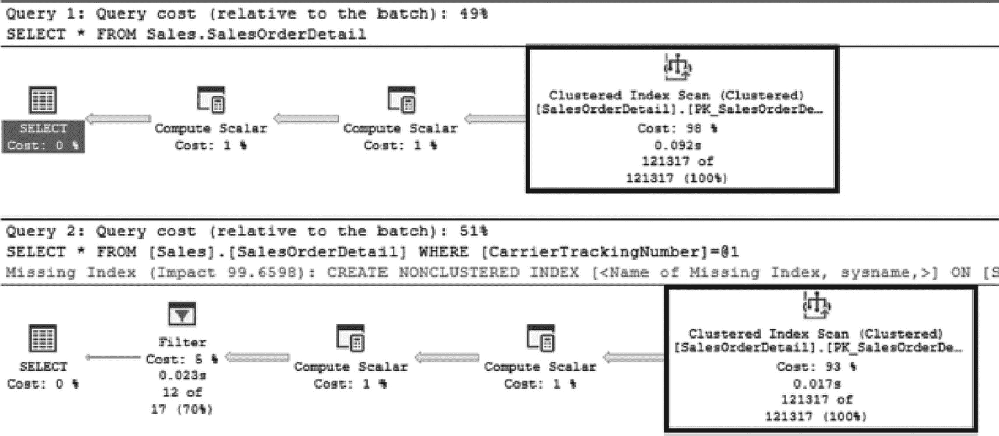

图 5-11：来自 `sys.dm_db_index_usage_stats` 的扫描查询的查询计划

```
USE AdventureWorks2017
GO
SELECT * FROM  Sales.SalesOrderDetail;
SELECT * FROM  Sales.SalesOrderDetail
WHERE CarrierTrackingNumber = '4911-403C-98';
清单 5-15：索引扫描查询
```

当发生索引扫描时，可以在 `sys.dm_db_index_usage_stats` 中看到它们。清单 5-16 中的查询提供了来自 DMV 的详细信息，显示了扫描计数。由于有两次扫描，分别对应两个查询，图 5-12 中的结果显示在 `user_scans` 下有两次操作。在尝试对表上存在大量扫描的情况进行故障排除时，此信息可能很有用。通过查看这些详细信息，可以找到扫描次数高的索引，然后研究使用这些索引的查询为何选择扫描而不是查找。

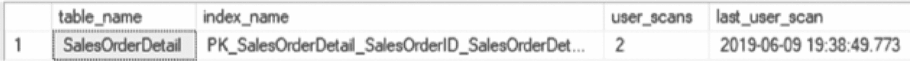

图 5-12：`sys.dm_db_index_usage_stats` 中 `user_scans` 的查询结果

```
USE AdventureWorks2017
GO
SELECT TOP 10
OBJECT_NAME(i.object_id) AS table_name
,i.name AS index_name
,ius.user_scans
,ius.last_user_scan
FROM sys.indexes i
INNER JOIN sys.dm_db_index_usage_stats ius
ON i.object_id = ius.object_id
AND i.index_id = ius.index_id
AND ius.database_id = DB_ID()
WHERE ius.object_id = OBJECT_ID('Sales.SalesOrderDetail');
清单 5-16：查询 `sys.dm_db_index_usage_stats` 中的 `user_scans`
```

#### user_lookups

DMV 中的第三列是 `user_lookups`。当在非聚集索引上执行查找，但该索引不包含满足查询所需的所有列时，就会发生用户查找。发生这种情况时，查询必须从聚集索引中查找这些列。一个例子是针对 `SalesOrderDetail` 表的查询，它返回 `ProductID` 和 `CarrierTrackingNumber` 列，并根据 `ProductID` 进行过滤；清单 5-17 显示了此查询。图 5-13 显示了查询计划，其中包括对非聚集索引的查找和对聚集索引的键查找。

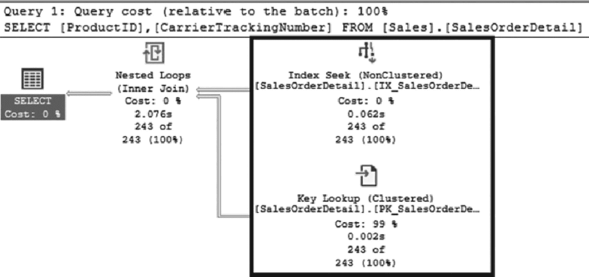

图 5-13：查找和键查找的查询计划

```
USE AdventureWorks2017
GO
SELECT ProductID, CarrierTrackingNumber
FROM Sales.SalesOrderDetail
WHERE ProductID = 778
GO
清单 5-17：索引查找查询
```


### 使用 `sys.dm_db_index_usage_stats` 监控索引活动

在 `sys.dm_db_index_usage_stats` 中，`user_seeks` 和 `user_lookups` 的计数都会增加一。要查看这些值，可以使用清单 5-18，它将返回如图 5-14 所示的结果。这些列之间的模式有助于确定合适的聚集索引键，或识别何时需要修改索引以避免键查找。键查找本身不一定有问题，但如果过度使用且不加控制，可能会成为性能瓶颈。本书后续将更深入地讨论键查找的有效管理。

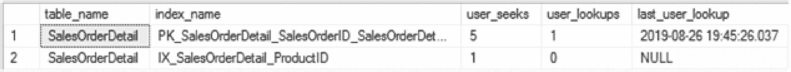

图 5-14：`sys.dm_db_index_usage_stats` 中 `user_lookups` 的查询结果

```sql
SELECT TOP 10
    OBJECT_NAME(i.object_id) AS table_name
    ,i.name AS index_name
    ,ius.user_seeks
    ,ius.user_lookups
    ,ius.last_user_lookup
FROM sys.indexes i
INNER JOIN sys.dm_db_index_usage_stats ius
    ON i.object_id = ius.object_id
    AND i.index_id = ius.index_id
    AND ius.database_id = DB_ID()
WHERE ius.object_id = OBJECT_ID('Sales.SalesOrderDetail');
```
清单 5-18：查询 `sys.dm_db_index_usage_stats` 中的 `user_lookups`

最后的索引操作是 `user_updates`。`user_updates` 列不仅限于更新操作，它涵盖了表上发生的所有 `INSERT`、`UPDATE` 和 `DELETE` 操作。为了演示这一点，可以执行清单 5-19 中的 T-SQL 代码。此代码将向 `SalesOrderDetail` 表插入一条记录，更新该记录，然后将其从表中删除。由于这些操作涉及许多外键关系，其执行计划较为复杂，本示例中未包含。

```sql
USE AdventureWorks2017
GO

INSERT INTO Sales.SalesOrderDetail
    (SalesOrderID, CarrierTrackingNumber, OrderQty, ProductID, SpecialOfferID, UnitPrice, UnitPriceDiscount, ModifiedDate)
SELECT SalesOrderID, CarrierTrackingNumber, OrderQty, ProductID, SpecialOfferID, UnitPrice, UnitPriceDiscount, GETDATE() AS ModifiedDate
FROM Sales.SalesOrderDetail
WHERE SalesOrderDetailID = 1;

UPDATE Sales.SalesOrderDetail
SET CarrierTrackingNumber = '999-99-9999'
WHERE ModifiedDate > DATEADD(d, -1, GETDATE());

DELETE FROM Sales.SalesOrderDetail
WHERE ModifiedDate > DATEADD(d, -1, GETDATE());
```
清单 5-19：索引更新查询

在代码清单执行完毕后，表上共发生了三个操作。对于这些操作中的每一个，`sys.dm_db_index_usage_stats` 都会在 `user_updates` 列中累积一次计数。执行清单 5-20 中的代码以查看索引上发生的活动。结果将与图 5-15 中的类似。除了对 `SalesOrderDetail` 的聚集索引所做的更改外，对非聚集索引所做的更新也包括在内。能够查看插入、更新或删除操作对表产生的全面影响，有助于更好地理解执行写入操作时发生的所有 I/O。

```sql
USE AdventureWorks2017
GO

SELECT TOP 10
    OBJECT_NAME(i.object_id) AS table_name
    ,i.name AS index_name
    ,ius.user_updates
    ,ius.last_user_update
FROM sys.indexes i
INNER JOIN sys.dm_db_index_usage_stats ius
    ON i.object_id = ius.object_id
    AND i.index_id = ius.index_id
    AND ius.database_id = DB_ID()
WHERE ius.object_id = OBJECT_ID('Sales.SalesOrderDetail');
```
清单 5-20：查询 `sys.dm_db_index_usage_stats` 中的 `user_updates`

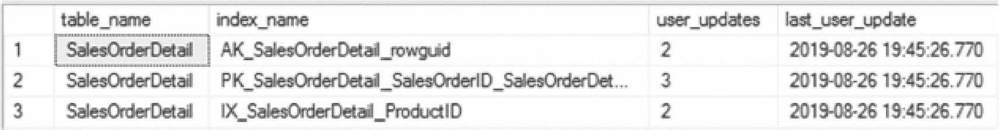

图 5-15：`sys.dm_db_index_usage_stats` 中 `user_updates` 的查询结果


### 系统列

`sys.dm_db_index_usage_stats` 中的最后一列组是系统列。系统列返回的信息与用户列大致相同，但仅包括与后台进程相关的活动。每当 SQL Server 中触发一个非用户进程时（例如自动统计信息更新），该活动都将通过这些列进行跟踪。表 5-10 列出了这些系统列。

表 5-10

`sys.dm_db_index_usage_stats` 中的系统列

| 列名 | 数据类型 | 描述 |
| --- | --- | --- |
| `system_seeks` | `bigint` | 系统查询执行的查找次数 |
| `system_scans` | `bigint` | 系统查询执行的扫描次数 |
| `system_lookups` | `bigint` | 系统查询执行的查找次数 |
| `system_updates` | `bigint` | 系统查询执行的更新次数 |
| `last_system_seek` | `datetime` | 上次系统查找的时间 |
| `last_system_scan` | `datetime` | 上次系统扫描的时间 |
| `last_system_lookup` | `datetime` | 上次系统查找的时间 |
| `last_system_update` | `datetime` | 上次系统更新的时间 |

对于大多数常见用法，这些列可以忽略。然而，理解它们的聚合方式是有价值的。要查看示例，请执行清单 5-21 中的代码，该代码可能运行长达 1 分钟。这将更改 `SalesOrderDetail` 表中的大部分行。由于超过 20% 的行已更改，将触发自动统计信息更新。统计信息更新与用户活动没有直接关系，而是后台（即系统）进程。

```
USE AdventureWorks2017
GO
UPDATE Sales.SalesOrderDetail
SET UnitPriceDiscount = 0.01
WHERE UnitPriceDiscount = 0.00;
Listing 5-21
Update for Sales.SalesOrderDetail
```

更新完成后，运行清单 5-22 中的 T-SQL 语句。这将从 `sys.stats` 和 `sys.dm_db_index_usage_stats` 的系统列返回结果，如图 5-16 所示。其中包含 `system_scans` 列，该列显示 `Sales.SalesOrderDetail` 上已发生三次系统扫描。这些扫描与统计信息更新有关，其中一次发生在 `UnitPriceDiscount` 列上。查看统计信息创建的时间可以显示更新顺序：先是 `CarrierTrackingNumber`，然后是 `SalesOrderDetailId`，接着是 `ModifiedDate`，最后是 `UnitPriceDiscount`。

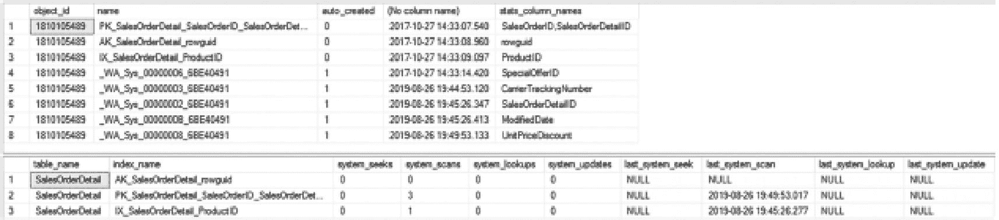

两个查询表结果的截图。1. 8 行 5 列。列标题为 object i d、name、auto created、no column name 和 stats column names。2. 3 行 10 列。列标题为 table name、index name、system seeks、system scans、system lookups、system updates、last system seek、last system scan、last system lookup 和 last system update。

图 5-16

`sys.stats` 和 `sys.dm_db_index_usage_stats` 系统列查询结果

```
USE AdventureWorks2017
GO
SELECT S.object_id,
S.name,
S.auto_created,
STATS_DATE(S.object_id, S.stats_id),
X.stats_column_names
FROM sys.stats S
CROSS APPLY
(
SELECT STRING_AGG(C.name, ',') AS stats_column_names
FROM sys.stats_columns SC
INNER JOIN sys.columns C
ON C.object_id = SC.object_id
AND C.column_id = SC.column_id
WHERE S.object_id = SC.object_id
AND S.stats_id = SC.stats_id
) X
WHERE S.object_id = OBJECT_ID('Sales.SalesOrderDetail');
SELECT OBJECT_NAME(i.object_id) AS table_name
,i.name AS index_name
,ius.system_seeks
,ius.system_scans
,ius.system_lookups
,ius.system_updates
,ius.last_system_seek
,ius.last_system_scan
,ius.last_system_lookup
,ius.last_system_update
FROM sys.indexes i
INNER JOIN sys.dm_db_index_usage_stats ius
ON i.object_id = ius.object_id
AND i.index_id = ius.index_id
AND ius.database_id = DB_ID()
WHERE ius.object_id = OBJECT_ID('Sales.SalesOrderDetail');
Listing 5-22
Query for System Columns in sys.dm_db_index_usage_stats
```

从实用性的角度来看，这些列对于用户应用程序通常并不重要，但确实有助于更全面地了解所有 SQL Server 函数的索引使用情况。

### 索引使用统计信息摘要

本节讨论了在 DMV `sys.dm_db_index_usage_stats` 中找到的统计信息。此 DMV 提供了关于数据库中索引如何以及是否正在使用的极其有用的统计信息。通过长期监视这些统计信息，可以了解哪些索引提供了最大的价值。使用这些列来改进索引性能的策略将在第 9 章讨论。

### 索引操作统计信息

第三个需要考虑的统计信息区域是索引操作统计信息。这些统计信息通过 DMO `sys.dm_db_index_operational_stats` 提供给用户。从高层次来看，此 DMO 提供了有关索引上发生的 I/O、锁定、闩锁和访问方法的详细信息。通过这些信息，可以识别可能遇到性能问题的索引。一旦识别出来，就有可能了解导致这些性能问题的原因。本节旨在帮助理解 DMO 中提供的统计信息以及如何使用这些统计信息调查索引。

与 `sys.dm_db_index_usage_stats` 不同，`sys.dm_db_index_operational_stats` 是一个动态管理函数（DMF）。因此，它在使用时需要提供参数。表 5-11 详细说明了此 DMF 的参数。

表 5-11

`sys.dm_db_index_operational_stats` 的参数

| 参数名 | 数据类型 | 描述 |
| --- | --- | --- |
| `database_id` | `smallint` | 索引所在数据库的 ID。提供值 `0`、`NULL` 或 `DEFAULT` 将返回所有数据库的索引信息。可以在此参数中使用函数 `DB_ID`。 |
| `object_id` | `int` | 应为其返回信息的表或视图的对象 ID。提供值 `0`、`NULL` 或 `DEFAULT` 将返回数据库中所有表或视图的索引详细信息。 |
| `index_id` | `int` | 应为其返回信息的索引的索引 ID。提供值 `-1`、`NULL` 或 `DEFAULT` 将返回表或视图上所有索引的详细信息。 |
| `partition_number` | `int` | 应为其返回索引信息的分区号。提供值 `0`、`NULL` 或 `DEFAULT` 将返回所有分区的详细信息。 |

通过这些参数，可以广泛或窄地聚焦于索引统计信息。这种灵活性很有用，因为 `sys.dm_db_index_operational_stats` 不允许使用 `CROSS APPLY` 或 `OUTER APPLY` 运算符。将参数传递给 DMF 时，其语法如清单 5-23 所定义。

```
sys.dm_db_index_operational_stats (
{ database_id | NULL | 0 | DEFAULT }
, { object_id | NULL | 0 | DEFAULT }
, { index_id | 0 | NULL | -1 | DEFAULT }
, { partition_number | NULL | 0 | DEFAULT }
)
Listing 5-23
Index Operational Stats Syntax
```

注意

DMF `sys.dm_db_index_operational_stats` 可以接受使用 Transact-SQL 函数 `DB_ID()` 和 `OBJECT_ID()`。这些函数可分别用于参数 `database_id` 和 `object_id`。


#### 头列

对于通过动态管理函数返回的每一行，都会包含 `database_id`、`object_id`、`index_id` 和 `partition_number`。这些列在表 5-12 中有进一步定义。正如 `partition_number` 所暗示的，此函数返回结果的粒度是分区级别。对于非分区索引，分区号将为 1。

表 5-12

`sys.dm_db_index_operational_stats` 中的头列

| 列名 | 数据类型 | 描述 |
| --- | --- | --- |
| `database_id` | `smallint` | 定义表或视图所在的数据库 ID |
| `object_id` | `int` | 定义索引所在的表或视图的 ID |
| `index_id` | `int` | 索引的 ID |
| `partition_number` | `int` | 索引或堆内的分区号（从 1 开始） |
| `hobt_id` | `bigint` | 用于标识与索引分区关联的堆或 B 树（hobt）的 ID。自 SQL Server 2016 起新增 |

头列为理解统计信息所适用的索引提供了基础。这将有助于理解返回信息的上下文。此外，它们可用于与目录视图（如 `sys.indexes`）进行联接，以提供索引的名称。

此函数中的有用信息来自该函数返回的其余列。可以返回的信息提供了对 DML 活动、页面分配周期、数据访问模式、索引争用和磁盘活动的洞察。在以下部分中，将回顾该函数返回的每一列，以及它们如何提供关于索引使用情况的洞察。

#### DML 活动

了解索引上的 DML 活动是开始分析索引使用统计信息的理想起点。表 5-13 列出了代表此活动的列。它们提供了受 DML 操作影响的行数的计数。接下来的统计信息与 `sys.dm_db_index_usage_stats` 中的类似，但在视角上存在一些差异，接下来将讨论这些差异。

表 5-13

`sys.dm_db_index_operational_stats` 中的 DML 活动列

| 列名 | 数据类型 | 描述 |
| --- | --- | --- |
| `leaf_insert_count` | `bigint` | 插入到叶级的行的累积计数。 |
| `leaf_delete_count` | `bigint` | 从叶级删除的行的累积计数。 |
| `leaf_update_count` | `bigint` | 在叶级更新的行的累积计数。 |
| `leaf_ghost_count` | `bigint` | 在叶级被标记为删除但尚未移除的行的累积计数。 |
| `nonleaf_insert_count` | `bigint` | 叶级以上的插入操作的累积计数。对于堆，此值始终为 `0`。 |
| `nonleaf_delete_count` | `bigint` | 叶级以上的删除操作的累积计数。对于堆，此值始终为 `0`。 |
| `nonleaf_update_count` | `bigint` | 叶级以上的更新操作的累积计数。对于堆，此值始终为 `0`。 |

在 `sys.dm_db_index_operational_stats` 内部，可以跟踪 DML 活动的两个区域：叶级和非叶级。有关叶级和非叶级页面上 DML 活动的更多信息，请参见第 4 章。

这两种数据更改类型之间的区别对于识别索引更改是直接通过 DML 活动发生，还是作为内部索引更改的结果非常重要。当叶级活动导致索引结构发生变化时，就会发生非叶级 DML 活动，这不是可以通过 `INSERT`、`UPDATE` 或 `DELETE` 语句直接影响的。

叶级和非叶级的 DML 活动都根据已发生的 DML 操作类型被分解为统计信息。如前所述，DML 活动监视 `INSERT`、`UPDATE` 和 `DELETE` 活动。对于这些操作中的每一个，`sys.dm_db_index_operational_stats` 中都有一个对应的列。此外，还有一个列用于统计已从叶级 DML 活动中“虚化”掉的记录。

在 `DELETE` 操作期间，受语句影响的行会通过两阶段操作被删除。最初，记录被标记为删除。当这种情况发生时，这些记录被称为被 *虚化*；处于此状态的行被计入 `leaf_ghost_count`。SQL Server 会以固定的时间间隔运行一个清理线程，遍历并执行对标记为虚化的行的实际删除操作。那时，这些记录将被计入 `leaf_delete_count`。此过程提高了删除操作的性能，因为行的实际删除发生在事务提交之后。如果发生事务回滚，则只需回滚行上的虚化标志，而不必尝试在表中重新创建该行。此活动仅发生在叶级；当与页面关联的所有行都被删除或以其他方式移除时，非叶级页面会被删除。


### 理解和分析 `sys.dm_db_index_operational_stats`

虽然此动态管理函数 (DMF) 的活动与在 `sys.dm_db_index_usage_stats` 中发现的相似，但存在一些显著差异。首先，`sys.dm_db_index_operational_stats` 中的信息比 `sys.dm_db_index_usage_stats` 中的更细粒度。操作统计信息会报告到叶级和非叶级，而使用统计信息则不会。除了粒度之外，计数统计方式也有所不同。使用统计信息为在索引上执行该操作的每个计划计数一次，无论影响了多少行。操作统计信息的不同之处在于，每对行执行一次 DML 操作，计数就会增加一次。总而言之，使用统计信息在索引被使用时进行汇总，而操作统计信息则根据索引被使用的程度进行汇总。

#### DML 活动

清单 5-24 中的代码说明了操作统计信息是如何统计的。在清单中，79 行被添加到 `dbo.Karaoke` 表中。然后从该表中删除了 44 行。接着更新了表中的 35 行。最后一个查询返回基于 DML 活动的操作统计信息。图 5-17 显示了最终查询的结果。

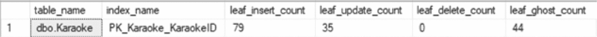

查询表结果的屏幕截图，包含一行数据。列标题和值分别是：表名、索引名、叶级插入计数 79、叶级更新计数 35、叶级删除计数 0 和叶级幽灵计数 44。

**图 5-17** DML 活动查询结果（结果在您的系统上可能有所不同）

```sql
USE AdventureWorks2017
GO
IF OBJECT_ID('dbo.Karaoke') IS NOT NULL
DROP TABLE dbo.Karaoke;
CREATE TABLE dbo.Karaoke
(
KaraokeID INT
,Duet BIT
,CONSTRAINT PK_Karaoke_KaraokeID PRIMARY KEY CLUSTERED (KaraokeID)
);
INSERT INTO dbo.Karaoke
SELECT ROW_NUMBER() OVER (ORDER BY t.object_id)
,t.object_id % 2
FROM sys.tables t;
DELETE FROM dbo.Karaoke
WHERE  Duet = 0;
UPDATE dbo.Karaoke
SET    Duet = 0
WHERE  Duet = 1;
SELECT OBJECT_SCHEMA_NAME(ios.object_id) + '.' + OBJECT_NAME(ios.object_id) AS table_name
,i.name AS index_name
,ios.leaf_insert_count
,ios.leaf_update_count
,ios.leaf_delete_count
,ios.leaf_ghost_count
FROM sys.dm_db_index_operational_stats(DB_ID(),NULL,NULL,NULL) ios
INNER JOIN sys.indexes i
ON i.object_id = ios.object_id
AND i.index_id = ios.index_id
WHERE ios.object_id = OBJECT_ID('dbo.Karaoke')
ORDER BY ios.range_scan_count DESC;
```
**清单 5-24** DML 活动脚本

查看索引中的 DML 活动的价值在于帮助详细了解索引中数据的情况。例如，如果一个非聚集索引经常被更新，那么查看索引中的列以确定列的易变性是否与索引的益处相匹配可能会有益。检查具有大量 DML 活动的索引并考虑该活动是否符合对数据库平台的理解是很好的做法。一个经常被写入但很少（或从未）被读取的索引是考虑移除的好候选对象。

#### SELECT 活动

在 DML 活动之后，下一个可以评估的信息领域是有关 `SELECT` 活动的信息。`SELECT` 活动列（如表 5-14 所示）标识了查询执行时使用的物理操作类型。SQL Server 收集信息的访问类型有三种：范围扫描、单例查找和转递记录。

**表 5-14** `sys.dm_db_index_operational_stats` 中的访问模式列

| 列名 | 数据类型 | 描述 |
| --- | --- | --- |
| `range_scan_count` | bigint | 对索引或堆执行的范围和表扫描的累计计数。 |
| `singleton_lookup_count` | bigint | 从索引或堆中检索单行的累计计数。 |
| `forwarded_fetch_count` | bigint | 通过转递记录获取的行计数。 |

##### 范围扫描

每当使用行范围或表扫描来访问数据时，就会发生范围扫描。在考虑行范围时，范围可以是 1 到 1000 行或更多行。范围中的行数对于 SQL Server 访问数据的方式并不重要。对于表扫描，行数也不重要，但假定它包含索引中的所有记录。在 `sys.dm_db_index_operational_stats` 中，这些值存储在 `range_scan_count` 列中。

要查看在 `range_scan_count` 中收集的此信息，请执行上一节中的清单 5-13 和 5-15 中的代码。在此之前，请先将 AdventureWorks2017 数据库脱机，然后再将其联机。这将重置从 DMO 返回的统计信息。在这两个代码示例中，将执行四个查询。前两个将导致查询计划中的索引查找，如图 5-9 所示。后两个查询导致索引扫描，如图 5-11 中的执行计划所示。运行清单 5-25 中的代码将显示，如图 5-18 所示，所有四个查询都使用范围扫描从表中检索数据。

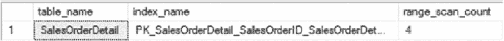

范围扫描计数查询表结果的屏幕截图，包含一行数据。列标题是表名、索引名和范围扫描计数。范围扫描计数数据为 4。

**图 5-18** `range_scan_count` 的查询结果

```sql
USE AdventureWorks2017
GO
SELECT OBJECT_NAME(ios.object_id) AS table_name
,i.name AS index_name
,ios.range_scan_count
FROM sys.dm_db_index_operational_stats(DB_ID(),OBJECT_ID('Sales.SalesOrderDetail'),NULL,NULL) ios
INNER JOIN sys.indexes i
ON i.object_id = ios.object_id
AND i.index_id = ios.index_id
ORDER BY ios.range_scan_count DESC;
```
**清单 5-25** 从 `sys.dm_db_index_operational_stats` 查询 `range_scan_count` 的脚本


##### 单例查找

`SELECT` 活动收集的下一个统计列是 `singleton_lookup_count`。该列中的值会在使用键查找（以前称为书签查找）时增加。一般来说，这与在 `sys.dm_db_index_usage_stats` 的 `user_lookups` 列中收集的信息类型相同。然而，`user_lookups` 和 `singleton_lookup_count` 之间有一个显著的区别。当使用键查找时，`user_lookups` 会增加一，表示索引操作已被使用。而对于 `singleton_lookup_count`，使用键查找操作的每一行都会被计入此列。

例如，运行清单 5-17 中的代码将导致键查找。这可以通过检查执行计划（如图 5-13 所示）来验证。此操作产生的统计数据已在前面讨论过，并显示在图 5-19 中。可以通过运行清单 5-26 中的 T-SQL 语句来调查新信息。这显示 `singleton_lookup_count` 的值为 243。这是该列的一个重要区别。该统计信息不仅表明发生了键查找，还提供了查找操作规模的信息。考虑单例查找与范围扫描的比率很高的情况。这可能表明存在其他索引替代方案需要考虑。

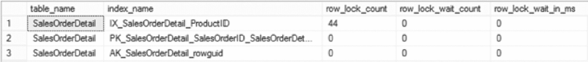

显示单例查找计数的查询表结果的屏幕截图，包含 3 行数据。列标题为表名、索引名称、行锁计数、行锁等待计数和行锁等待毫秒数。

**图 5-19**

`singleton_lookup_count` 的查询结果

```sql
USE AdventureWorks2017
GO
SELECT OBJECT_NAME(ios.object_id) AS table_name
,i.name AS index_name
,ios.singleton_lookup_count
FROM sys.dm_db_index_operational_stats(DB_ID(),OBJECT_ID('Sales.SalesOrderDetail'),NULL,NULL) ios
INNER JOIN sys.indexes i
ON i.object_id = ios.object_id
AND i.index_id = ios.index_id
ORDER BY ios. singleton_lookup_count DESC;
-- 清单 5-26
-- 从 sys.dm_db_index_operational_stats 查询 singleton_lookup_count
```

##### 转发获取

`SELECT` 活动收集的最后一个统计列是 `forwarded_fetch_count`。转发记录发生在堆中，当一行大小增加并且无法再容纳在当前所在的页面上时。每次发生记录转发操作时，`forwarded_fetch_count` 列就会增加一。

为了演示，清单 5-27 中的代码构建了一个包含堆的表并填充了值。然后，一个 `UPDATE` 语句将每三行的大小增加。新行的大小将超过页面上的可用空间，从而导致转发记录。

```sql
USE AdventureWorks2017
GO
CREATE TABLE dbo.ForwardedRecords
(
ID INT IDENTITY(1,1)
,VALUE VARCHAR(8000)
);
INSERT INTO dbo.ForwardedRecords (VALUE)
SELECT REPLICATE(type, 500)
FROM sys.objects;
UPDATE dbo.ForwardedRecords
SET VALUE = REPLICATE(VALUE, 16)
WHERE ID%3 = 1;
-- 清单 5-27
-- 用于生成转发记录的 T-SQL 脚本
```

脚本完成后，可以使用清单 5-28 中的 `sys.dm_db_index_operational_stats` 脚本来查看转发记录被获取的次数。在本例中，222 条被转发的记录转换为 222 的 `forwarded_fetch_count`，如图 5-20 所示。在调查性能计数器“转发记录/秒”时，此列非常有用。查看此列将有助于识别哪个堆是导致该计数器活动的源头，从而为调查特定表提供重点。

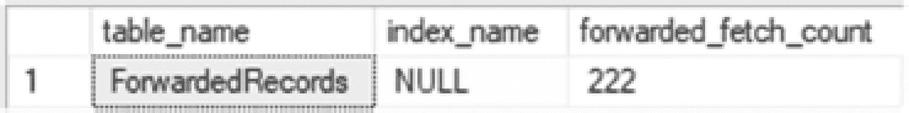

显示转发获取计数的查询表结果的屏幕截图，包含一行数据。列标题和值分别为：表名“转发记录”，索引名称“null”，以及转发获取计数 222。

**图 5-20**

`forwarded_fetch_count` 的查询结果

```sql
USE AdventureWorks2017
GO
SELECT OBJECT_NAME(ios.object_id) AS table_name
,i.name AS index_name
,ios.forwarded_fetch_count
FROM sys.dm_db_index_operational_stats(DB_ID(),OBJECT_ID('dbo.ForwardedRecords'),NULL,NULL) ios
INNER JOIN sys.indexes i
ON i.object_id = ios.object_id
AND i.index_id = ios.index_id
ORDER BY ios.forwarded_fetch_count DESC
-- 清单 5-28
-- 从 sys.dm_db_index_operational_stats 查询 forwarded_fetch_count
```

##### 锁争用

在 SQL Server 数据库中读取或写入数据时，会对数据进行锁定，以在其他操作尝试使用它时提供一致性。有时，一个用户的锁定会干扰另一个用户的请求。`sys.dm_db_index_operational_stats` 提供了详细说明锁计数和等待锁解决所花费时间的列。表 5-15 列出了与 `sys.dm_db_index_operational_stats` 中跟踪的三类锁相关的三组列，以提供对锁争用的洞察：行锁、页锁和索引锁升级。

**表 5-15**

`sys.dm_db_index_operational_stats` 中的索引争用列

| 列名 | 数据类型 | 描述 |
| --- | --- | --- |
| `row_lock_count` | `bigint` | 已请求的行锁累计数量 |
| `row_lock_wait_count` | `bigint` | 数据库引擎等待行锁的累计次数 |
| `row_lock_wait_in_ms` | `bigint` | 数据库引擎等待行锁的总毫秒数 |
| `page_lock_count` | `bigint` | 已请求的页锁累计数量 |
| `page_lock_wait_count` | `bigint` | 数据库引擎等待页锁的累计次数 |
| `page_lock_wait_in_ms` | `bigint` | 数据库引擎等待页锁的总毫秒数 |
| `index_lock_promotion_attempt_count` | `bigint` | 数据库引擎尝试升级锁的累计次数 |
| `index_lock_promotion_count` | `bigint` | 数据库引擎成功升级锁的累计次数 |


###### 行锁

第一组列由行锁列组成。这些列包括 `row_lock_count`、`row_lock_wait_count` 和 `row_lock_wait_in_ms`。通过这些列，可以衡量在行上发生的锁的数量，以及在获取行锁时是否存在争用。行锁争用通常可以通过其对事务性能的影响（如阻塞和死锁）来观察。

为了演示如何收集这些信息，请执行清单 5-29 中的代码。在此脚本中，根据 `ProductID` 从 `Sales.SalesOrderDetail` 表中检索行。在 `AdventureWorks2017` 数据库中，该查询检索到 44 行。

```sql
USE AdventureWorks2017
GO
ALTER INDEX ALL ON Sales.SalesOrderDetail REBUILD;
SELECT SalesOrderID
,SalesOrderDetailID
,CarrierTrackingNumber
,OrderQty
FROM Sales.SalesOrderDetail
WHERE ProductID = 710;
Listing 5-29
用于生成行锁的 T-SQL 脚本
```

要观察查询获取的行锁，请使用清单 5-30 提供的查询中的行锁列。在这些结果中，对于查询 `Sales.SalesOrderDetail` 所返回的每一行，在 `sys.dm_db_index_operational_stats` 的结果中都有一把锁，如图 5-21 所示。因此，在索引 `IX_SalesOrderDetail_ProductID` 上总共放置了 44 把行锁。

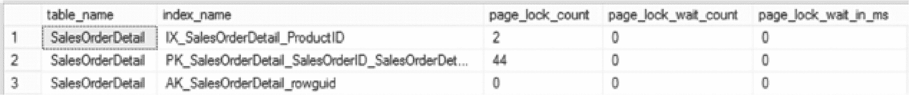

一个显示行锁查询表结果的截图，包含 3 行数据。列标题为表名、索引名、页锁计数、页锁等待计数和页锁等待毫秒数。

图 5-21

行锁的查询结果

请注意，`row_lock_wait_count` 和 `row_lock_wait_in_ms` 列没有返回任何信息。这是因为该脚本未被任何其他查询阻塞。如果清单 5-29 中的查询被另一个事务阻塞，那么这些列中的值将会相应调整以反映该阻塞。

```sql
USE AdventureWorks2017
GO
SELECT OBJECT_NAME(ios.object_id) AS table_name
,i.name AS index_name
,ios.row_lock_count
,ios.row_lock_wait_count
,ios.row_lock_wait_in_ms
FROM sys.dm_db_index_operational_stats(DB_ID(),OBJECT_ID('Sales.SalesOrderDetail'),NULL,NULL) ios
INNER JOIN sys.indexes i
ON i.object_id = ios.object_id
AND i.index_id = ios.index_id
ORDER BY ios.range_scan_count DESC;
Listing 5-30
查询 sys.dm_db_index_operational_stats 中的行锁
```

###### 页锁

下一组列是页锁列。这组列具有与行锁列相似的特征，不同之处在于它们的作用范围是页级别而非行级别。对于访问的行所涉及的每一个页，都会获取一把页锁。这些列是 `page_lock_count`、`page_lock_wait_count` 和 `page_lock_wait_in_ms`。在监控索引上的锁争用时，同时查看页级别和行级别非常重要，以确定争用是发生在被访问的各个行上，还是发生在同一页上的不同行上。

为了查看差异，请继续使用清单 5-29 的查询，并检索该查询在 `sys.dm_db_index_operational_stats` 中收集到的页锁统计信息。此信息可使用清单 5-31 中的脚本获取。结果与行锁的结果略有不同。对于页锁，请参见图 5-22；在索引 `IX_SalesOrderDetail_ProductID` 上只有两把页锁。此外，在 `PK_SalesOrderDetail_SalesOrderID_SalesOrderDetailID` 上有 44 把页锁，该索引并未遇到任何行锁。

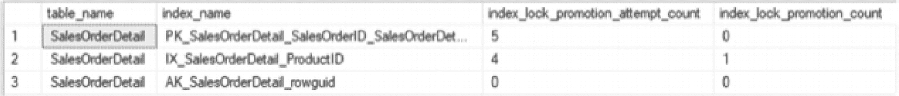

一个显示页锁查询表结果的截图，包含 3 行数据。列标题为表名、索引名、索引锁升级尝试计数和索引锁升级计数。

图 5-22

页锁的查询结果

```sql
USE AdventureWorks2017
GO
SELECT OBJECT_NAME(ios.object_id) AS table_name
,i.name AS index_name
,ios.page_lock_count
,ios.page_lock_wait_count
,ios.page_lock_wait_in_ms
FROM sys.dm_db_index_operational_stats(DB_ID(),OBJECT_ID('Sales.SalesOrderDetail'),NULL,NULL) ios
INNER JOIN sys.indexes i
ON i.object_id = ios.object_id
AND i.index_id = ios.index_id
ORDER BY ios.range_scan_count DESC;
Listing 5-31
查询 sys.dm_db_index_operational_stats 中的页锁
```

锁行为的统计信息起初可能不太容易理解，直到考虑查询（来自清单 5-29）执行时发生的活动。查询执行时，它使用了索引查找和键查找（执行计划见图 5-23）。在 `IX_SalesOrderDetail_ProductID` 上的索引查找解释了那 2 把页锁和 44 把行锁。有 44 行符合查询的谓词条件，并且它们分布在 2 个页上。在 `PK_SalesOrderDetail_SalesOrderID_SalesOrderDetailID` 上的 44 把页锁是对 `IX_SalesOrderDetail_ProductID` 中所有行进行键查找操作的结果。行锁和页锁列共同帮助描述了发生的活动。

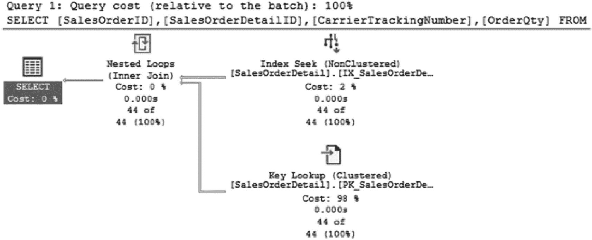

一个 SELECT 查询计划执行的流程图。执行一个查询。执行成本为 2% 的查找和成本为 98% 的键查找条件。它流向成本为 0% 的嵌套循环和成本为 0% 的 SELECT 以进行显示。

图 5-23

SELECT 查询的执行计划

虽然行锁和页锁对于识别是否存在争用很有用，但锁有一个方面它并未提供：正在放置的锁的类型。这些锁可能是共享锁，也可能是排他锁。锁等待计数提供了关于表上不兼容锁的频率和这些锁持续时间的范围信息，但锁本身的细节并未被识别出来。


###### 锁升级

关于锁争用需要讨论的最后一部分是数据库中发生的锁升级数量。当一个事务获取的锁数量超过 SQL Server 实例上的锁阈值时，锁将升级到下一个更高级别。这种升级可能发生在页、分区和表级别。数据库上发生锁升级的原因有很多。一是锁需要内存，因此锁越多，所需的内存越多，管理锁所需的资源也越多。另一个原因是，许多单独的低级别锁为阻塞升级为死锁提供了机会。由于这些原因，锁升级对于考虑对象争用非常重要。

为了帮助理解锁升级，之前的一个演示查询将被稍作修改。将不再选择 44 行，而是更新所有 `ProductID` 小于或等于 712 的行（参见清单 5-32）。更新会将 `ProductID` 更改为当前值，因此实际上不更改任何数据值，但仍会引发更新操作。

```
USE AdventureWorks2017
GO
UPDATE Sales.SalesOrderDetail
SET ProductID = ProductID
WHERE ProductID <= 712
清单 5-32
用于生成锁升级的 T-SQL 脚本
```

清单 5-33 中的脚本可用于检查 `sys.dm_db_index_operational_stats` 中的统计信息，以查看是否发生过任何锁升级。如脚本输出所示（图 5-24），列 `index_lock_promotion_attempt_count` 为 `PK_SalesOrderDetail_SalesOrderID_SalesOrderDetailID` 和 `IX_SalesOrderDetail_ProductID` 记录了四个事件。因此，触发了四次锁升级的机会。列 `index_lock_promotion_count` 显示 `IX_SalesOrderDetail_ProductID` 上有一次锁升级。对于这两个索引，SQL Server 考虑锁升级是否适用于该查询的情况发生了四次。在第四次检查 `IX_SalesOrderDetail_ProductID` 时，SQL Server 确定需要锁升级，于是锁被升级。


一张包含 3 行数据的锁升级查询结果表截图。列标题为表名、索引名、索引锁升级尝试次数、索引锁升级次数。

图 5-24

锁升级查询结果

```
USE AdventureWorks2017
GO
SELECT OBJECT_NAME(ios.object_id) AS table_name
,i.name AS index_name
,ios.index_lock_promotion_attempt_count
,ios.index_lock_promotion_count
FROM sys.dm_db_index_operational_stats(DB_ID(),OBJECT_ID('Sales.SalesOrderDetail'),NULL,NULL) ios
INNER JOIN sys.indexes i
ON i.object_id = ios.object_id
AND i.index_id = ios.index_id
ORDER BY ios.range_scan_count DESC;
清单 5-33
查询 sys.dm_db_index_operational_stats 中的锁升级
```

监控锁升级与监控行和页锁是相辅相成的。当行和页锁争用增加时（无论是通过增加频率还是锁等待持续时间），评估锁升级有助于识别 SQL Server 考虑升级锁的次数以及这些锁何时被升级。在某些表索引不当的情况下，锁升级可能更频繁地发生，并导致阻塞和死锁增加。

##### 闩锁争用

除了锁，索引中也可能发生闩锁争用。闩锁是短的、轻量级的数据同步控制。从高层看，闩锁允许在活动执行时对内存对象进行隔离。闩锁的一个例子是将数据从磁盘传输到内存时。如果在此过程中存在磁盘瓶颈，闩锁等待会在磁盘传输完成时累积。这些信息的价值在于，当发生闩锁等待时，表 5-16 中显示的列提供了一种机制，可以将等待跟踪到特定索引，从而允许在索引作为其管理的一部分存储的位置上进行重点优化。

表 5-16

sys.dm_db_index_operational_stats 中的闩锁活动列

| 列名 | 数据类型 | 描述 |
| --- | --- | --- |
| `page_latch_wait_count` | `bigint` | 因闩锁争用导致数据库引擎等待的累计次数。 |
| `page_latch_wait_in_ms` | `bigint` | 因闩锁争用导致数据库引擎等待的累计毫秒数。 |
| `page_io_latch_wait_count` | `bigint` | 数据库引擎在 I/O 页闩锁上等待的累计次数。 |
| `page_io_latch_wait_in_ms` | `bigint` | 数据库引擎在页 I/O 闩锁上等待的累计毫秒数。 |
| `tree_page_latch_wait_count` | `bigint` | 仅包含上层 B 树页的 `page_latch_wait_count` 子集。对于堆始终为 0。 |
| `tree_page_latch_wait_in_ms` | `bigint` | 仅包含上层 B 树页的 `page_latch_wait_in_ms` 子集。对于堆始终为 0。 |
| `tree_page_io_latch_wait_count` | `bigint` | 仅包含上层 B 树页的 `page_io_latch_wait_count` 子集。对于堆始终为 0。 |
| `tree_page_io_latch_wait_in_ms` | `bigint` | 仅包含上层 B 树页的 `page_io_latch_wait_in_ms` 子集。对于堆始终为 0。 |


###### Page I/O Latch

关于页面 I/O 闩锁，收集了两组与闩锁相关的数据：页面级闩锁和树页面闩锁。当需要检索索引叶子级别（数据页面）的数据页面时，会发生页面级闩锁。这与树页面闩锁不同，后者发生在索引的所有其他级别。这两个统计数据都是衡量在将数据移入缓冲区时创建的闩锁数量以及任何与延迟相关的时间的指标。每当时间在`page_io_latch_wait_in_ms`或`tree_page_io_latch_wait_in_ms`中累积时，都对应于`PAGEIOLATCH_*`等待类型的等待时间增加。

为了更好地理解页面 I/O 闩锁如何发生以及如何收集这些统计数据，将回顾一个会导致这些等待发生的示例。在此演示中，将通过清单[5-34]中的脚本从`Sales.SalesOrderDetail`、`Sales.SalesOrderHeader`和`Production.Product`返回所有数据。在执行脚本之前，将清除缓冲区缓存以强制 SQL Server 从磁盘检索这些页面的数据。请确保仅在清除缓冲区缓存不会影响其他进程的非生产服务器上使用此脚本。

```sql
USE AdventureWorks2017
GO
DBCC DROPCLEANBUFFERS
GO
SELECT *
FROM Sales.SalesOrderDetail sod
INNER JOIN Sales.SalesOrderHeader soh ON sod.SalesOrderID = soh.SalesOrderID
INNER JOIN Production.Product p ON sod.ProductID = p.ProductID;
```
**清单 5-34** 生成页面 I/O 闩锁的 T-SQL 脚本

查询完成后，将表和索引的页面复制到缓冲区缓存的过程中会发生许多页面 I/O 闩锁。要查看页面 I/O 闩锁，请使用清单[5-35]中的脚本查询`sys.dm_db_index_operational_stats`中的页面 I/O 闩锁列。结果显示在图[5-25]中，表明示例查询中的所有三个表都存在页面 I/O 闩锁等待，包括在`Sales.SalesOrderHeader`上发生的整整 1 毫秒的等待。此处的结果高度依赖于底层存储。因此，这些数字会因数据库使用的存储基础设施而有很大差异，但在相同硬件上重新测试时应保持一致。

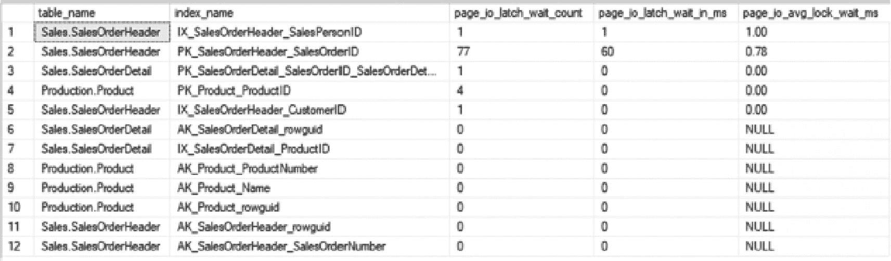

*图 5-25 页面 I/O 闩锁的查询结果。一个包含 12 行数据的查询表结果的截图。列标题为表名、索引名、页面 I/O 闩锁等待计数、页面 I/O 闩锁等待毫秒数和页面 I/O 平均锁等待毫秒数。*

```sql
USE AdventureWorks2017
GO
SELECT OBJECT_SCHEMA_NAME(ios.object_id) + '.' + OBJECT_NAME(ios.object_id) as table_name
,i.name as index_name
,page_io_latch_wait_count
,page_io_latch_wait_in_ms
,CAST(1. * page_io_latch_wait_in_ms
/ NULLIF(page_io_latch_wait_count ,0) AS decimal(12,2)) AS page_io_avg_lock_wait_ms
FROM sys.dm_db_index_operational_stats (DB_ID(), NULL, NULL, NULL) ios
INNER JOIN sys.indexes i ON i.object_id = ios.object_id AND i.index_id = ios.index_id
WHERE i.object_id = OBJECT_ID('Sales.SalesOrderHeader')
OR i.object_id = OBJECT_ID('Sales.SalesOrderDetail')
OR i.object_id = OBJECT_ID('Production.Product')
ORDER BY 5 DESC;
```
**清单 5-35** 在`sys.dm_db_index_operational_stats`中查询页面 I/O 闩锁统计信息

###### Page Latch

数据库中可能发生的另一种与索引相关的闩锁是页面闩锁。页面闩锁涵盖发生在非数据页面上的任何闩锁。页面闩锁包括 GAM 和 SGAM 页面的分配以及`DBCC`和备份活动。当页面被不同资源分配时，可能会发生争用，监控页面闩锁可以揭示这种活动。

对于索引，页面闩锁可能发生的一种常见情况是，由于频繁插入或页面分配，在索引上形成“热点”。为了演示此场景，将在清单 536 中创建表`dbo.PageLatchDemo`。接下来，使用首选的负载生成工具，执行清单[5-37]中的代码五个会话。为了生成此示例的负载，在 SQL Server Management Studio 中打开五个查询窗口，每个窗口运行一个负载查询的副本。通过此示例，数百行数据将快速插入到同一系列页面中，并且将进行大量页面分配。由于这些插入操作非常接近，将形成“热点”，从而导致页面闩锁争用。

```sql
USE AdventureWorks2017
GO
INSERT INTO dbo.PageLatchDemo
(FillerData)
SELECT  t.object_id % 2
FROM sys.tables t;
GO 5000
```
**清单 5-37** 生成页面闩锁负载的 T-SQL 脚本

```sql
USE AdventureWorks2017
GO
IF OBJECT_ID('dbo.PageLatchDemo') IS NOT NULL
DROP TABLE dbo.PageLatchDemo;
CREATE TABLE dbo.PageLatchDemo
(
PageLatchDemoID INT IDENTITY (1,1)
,FillerData  bit
,CONSTRAINT PK_PageLatchDemo_PageLatchDemoID PRIMARY KEY CLUSTERED  (PageLatchDemoID)
);
```
**清单 5-36** 生成页面闩锁场景的 T-SQL 脚本

要验证页面闩锁争用是否确实发生，请使用清单[5-38]中提供的脚本。结果如图[5-26]所示，显示存在大量页面闩锁及其相关的延迟。在此示例中，每个页面闩锁的延迟超过 20 毫秒。在更关键的情况下，这些值会高得多，并有助于识别索引何时干扰对表的访问或写入数据。

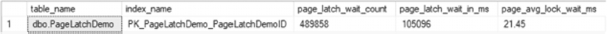

*图 5-26 页面闩锁的查询结果。一个包含一行数据的查询表结果的截图。列标题为表名、索引名、页面闩锁等待计数、页面闩锁等待毫秒数和页面平均锁等待毫秒数。*

```sql
USE AdventureWorks2017
GO
SELECT OBJECT_SCHEMA_NAME(ios.object_id) + '.' + OBJECT_NAME(ios.object_id) as table_name
,i.name as index_name
,page_latch_wait_count
,page_latch_wait_in_ms
,CAST(100. * page_latch_wait_in_ms
/ NULLIF(page_latch_wait_count ,0) AS decimal(12,2)) AS page_avg_lock_wait_ms
FROM sys.dm_db_index_operational_stats (DB_ID(), NULL, NULL, NULL) ios
INNER JOIN sys.indexes i ON i.object_id = ios.object_id AND i.index_id = ios.index_id
WHERE i.object_id = OBJECT_ID('dbo.PageLatchDemo');
```
**清单 5-38** 在`sys.dm_db_index_operational_stats`中查询页面闩锁统计信息

> **注意**
> 页面 I/O 和页面闩锁争用高度依赖于硬件。本节中的演示查询结果不会与所示结果完全匹配。

##### 页面分配周期

由于 DML 活动，叶子与非叶子页面会不时地从索引中分配或释放。监控页面分配是监控索引的重要部分（相关选项参见表 5-17）。通过此监控，可以掌握索引在维护窗口之间是如何“呼吸”的。这种活动体现了通过插入和页面拆分分配给索引的页面与通过删除移除（或合并）的页面之间的关系。通过监控此类活动，可以了解何时调整索引的`FILLFACTOR`值可能有益，从而更好地维护索引。

**表 5-17** `sys.dm_db_index_operational_stats`中的页面分配周期列

| 列名 | 数据类型 | 描述 |
| --- | --- | --- |
| `leaf_allocation_count` | `bigint` | 索引或堆中叶子级别页面分配的累计计数 |
| `nonleaf_allocation_count` | `bigint` | 由叶子级别以上的页面拆分引起的页面分配的累计计数 |
| `leaf_page_merge_count` | `bigint` | 叶子级别页面合并的累计计数 |
| `nonleaf_page_merge_count` | `bigint` | 叶子级别以上页面合并的累计计数 |

以表上如何发生页面分配为例，执行清单 5-39 中的脚本。此脚本创建了表`dbo.AllocationCycle`，随后向表中插入了 100,000 行数据。由于这是一个新表，页面分配上没有争用，数据得以有序添加。此时，页面已分配给表，且这些分配专门与这些插入操作相关。此脚本将运行一分钟或更长时间。执行时请确保未启用“包括实际执行计划”，因为生成大量可视化计划信息会大大减慢执行速度。

**清单 5-39** 生成页面分配的 T-SQL 脚本
```sql
USE AdventureWorks2017;
GO
SET NOCOUNT ON
DROP TABLE IF EXISTS dbo.AllocationCycle;
CREATE TABLE dbo.AllocationCycle (
ID INT IDENTITY,
FillerData VARCHAR(1000),
CreateDate DATETIME,
CONSTRAINT PK_AllocationCycle PRIMARY KEY CLUSTERED (ID)
);
GO
INSERT INTO dbo.AllocationCycle (FillerData, CreateDate)
VALUES (NEWID(), GETDATE());
GO 100000
```

要验证分配情况，可以检查`sys.dm_db_index_operational_stats`中的叶子与非叶子分配列`leaf_allocation_count`和`nonleaf_allocation_count`。清单 5-40 中的脚本显示叶子级别有 758 次分配，非叶子级别有 3 次（见图 5-27）。使用这些列时考虑此细节很重要：分配的一部分页面可能与插入操作相关。


*包含一行数据的插入页面分配查询表结果截图。列标题和值分别为：表名、索引名、叶子分配计数 758、非叶子分配计数 3、叶子页面合并计数 0、非叶子页面合并计数 0。*

**图 5-27** `sys.dm_db_index_operational_stats`中插入页面分配统计的查询结果

**清单 5-40** 查询`sys.dm_db_index_operational_stats`中的页面分配统计
```sql
USE AdventureWorks2017
GO
SELECT OBJECT_SCHEMA_NAME(ios.object_id) + '.' + OBJECT_NAME(ios.object_id) as table_name
,i.name as index_name
,ios.leaf_allocation_count
,ios.nonleaf_allocation_count
,ios.leaf_page_merge_count
,ios.nonleaf_page_merge_count
FROM sys.dm_db_index_operational_stats(DB_ID(), OBJECT_ID('dbo.AllocationCycle'), NULL,NULL) ios
INNER JOIN sys.indexes i ON i.object_id = ios.object_id AND i.index_id = ios.index_id;
```

> 注意：在 SQL Server 2014 之后，这些列的行为发生了变化，对于批量插入，`leaf_allocation_count`仅记录一个页面。

有了索引元数据的基础，可以继续讨论使用页面分配来监控页面拆分，并确定在何处修改填充因子可能有益。为此，将在`dbo.AllocationCycle`表上生成页面拆分。清单 5-41 中的脚本可用于实现此目的。该脚本将每第三行的`FillerData`列长度增加到 1000 个字符。

**清单 5-41** 增加页面分配的 T-SQL 脚本
```sql
USE AdventureWorks2017;
GO
UPDATE  dbo.AllocationCycle
SET     FillerData = REPLICATE('x',1000)
WHERE   ID % 3 = 1;
```

数据修改后，执行清单 5-40 中`sys.dm_db_index_operational_stats`查询的结果发生巨大变化。随着行大小的扩展，分配的页面数跃升至 9,849 个，非叶子页面总数达到 35 个（图 5-28）。由于行的顺序未改变，此活动与因行大小扩展导致的页面拆分有关。通过监控这些统计信息，可以识别受此类活动模式影响的索引。

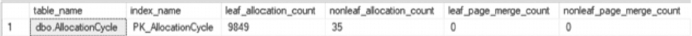
*包含一行数据的更新页面分配查询表结果截图。列标题和值分别为：表名、索引名、叶子分配计数 9849、非叶子分配计数 35、叶子页面合并计数 0、非叶子页面合并计数 0。*

**图 5-28** 更新页面分配的查询结果


##### 压缩

`sys.dm_db_index_operational_stats` 中有两列用于监控压缩。如表 5-18 所列，这两列分别记录了尝试压缩页面的次数以及成功压缩的次数。这些列的主要价值在于提供关于 `PAGE` 级别压缩的反馈。压缩失败可能导致决定移除压缩，因为在压缩失败率高的情况下启用压缩通常不切实际。

**表 5-18**
**`sys.dm_db_index_operational_stats` 中的压缩列**

| 列名 | 数据类型 | 描述 |
| --- | --- | --- |
| `page_compression_attempt_count` | `bigint` | 为表、索引或索引视图的特定分区评估 `PAGE` 级别压缩的页面数。包括因无法实现显著节省而未被压缩的页面。 |
| `page_compression_success_count` | `bigint` | 对表、索引或索引视图的特定分区使用 `PAGE` 级别压缩压缩的数据页数。 |

当压缩数据的成本超过以后解压缩该数据的价值时，页面压缩可能会失败。这通常出现在重复数据模式较少的数据中，例如图像。压缩图像数据时，通常无法获得足够的压缩效益，SQL Server 就不会将页面存储为压缩页面。为了演示这一点，请执行清单 5-42 中的代码，该代码创建一个启用了页面压缩的表，并向其中插入多张图像。

```sql
USE AdventureWorks2017
GO
IF OBJECT_ID('dbo.PageCompression') IS NOT NULL
DROP TABLE dbo.PageCompression;
CREATE TABLE dbo.PageCompression(
ProductPhotoID int NOT NULL,
ThumbNailPhoto varbinary(max) NULL,
LargePhoto varbinary(max) NULL,
CONSTRAINT PK_PageCompression PRIMARY KEY CLUSTERED (ProductPhotoID))
WITH (DATA_COMPRESSION = PAGE);
INSERT INTO dbo.PageCompression
SELECT ProductPhotoID
,ThumbNailPhoto
,LargePhoto
FROM Production.ProductPhoto;
```
清单 5-42
创建带页面压缩的表的 T-SQL 脚本

插入表的操作没有失败，但所有页面都被压缩了吗？要找出答案，请执行清单 5-43 中的脚本；它返回 `page_compression_attempt_count` 和 `page_compression_success_count` 列。图 5-29 中的结果显示，有 7 个页面成功压缩，但有 46 个页面压缩失败。根据这个页面压缩的成功与失败比例，可以很容易看出页面压缩在 `dbo.PageCompression` 聚集索引上的价值很低。

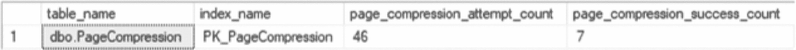
**图 5-29**
压缩查询结果

```sql
USE AdventureWorks2017
GO
SELECT OBJECT_SCHEMA_NAME(ios.object_id) + '.' + OBJECT_NAME(ios.object_id) as table_name
,i.name as index_name
,page_compression_attempt_count
,page_compression_success_count
FROM sys.dm_db_index_operational_stats (DB_ID(), OBJECT_ID('dbo.PageCompression'), NULL, NULL) ios
INNER JOIN sys.indexes i ON i.object_id = ios.object_id AND i.index_id = ios.index_id;
```
清单 5-43
在 `sys.dm_db_index_operational_stats` 中查询页面压缩尝试情况

##### LOB 访问

`sys.dm_db_index_operational_stats` 中的下一组列涉及大型对象（LOB）。它们提供了有关提取的页面数量及其大小的信息。还有一些列用于衡量被推出行和被拉入行的 LOB 数据量。表 5-19 列出了该组中的所有这些列以及其他列。

**表 5-19**
**`sys.dm_db_index_operational_stats` 中的 LOB 访问列**

| 列名 | 数据类型 | 描述 |
| --- | --- | --- |
| `lob_fetch_in_pages` | `bigint` | 从 `LOB_DATA` 分配单元检索的 LOB 页面的累计计数。这些页面包含存储在 `text`、`ntext`、`image`、`varchar(max)`、`nvarchar(max)`、`varbinary(max)` 和 `xml` 类型列中的数据。 |
| `lob_fetch_in_bytes` | `bigint` | 检索的 LOB 数据字节的累计计数。 |
| `lob_orphan_create_count` | `bigint` | 为批量操作创建的孤立 LOB 值的累计计数。 |
| `lob_orphan_insert_count` | `bigint` | 在批量操作期间插入的孤立 LOB 值的累计计数。 |
| `row_overflow_fetch_in_pages` | `bigint` | 从 `ROW_OVERFLOW_DATA` 分配单元检索的行溢出数据页的累计计数。 |
| `row_overflow_fetch_in_bytes` | `bigint` | 检索的行溢出数据字节的累计计数。 |
| `column_value_push_off_row_count` | `bigint` | 为使插入或更新的行能放入页面，将 LOB 数据和行溢出数据的列值推出行的累计计数。 |
| `column_value_pull_in_row_count` | `bigint` | 将 LOB 数据和行溢出数据的列值拉入行的累计计数。当更新操作释放了记录中的空间，并有机会将一个或多个来自 `LOB_DATA` 或 `ROW_OVERFLOW_DATA` 分配单元的行外值拉入 `IN_ROW_DATA` 分配单元时，就会发生这种情况。 |

LOB 访问列可用于确定大型对象活动的量以及数据何时可能从大型对象存储移动到行溢出存储。这在遇到与检索或更新 LOB 数据相关的性能问题时很有用。例如，`lob_fetch_in_bytes` 列衡量 SQL Server 为索引检索的 LOB 列的字节数。

清单 5-44 中的脚本可用于演示 LOB 活动。这并不代表所有可能的活动，但涵盖了基础内容。脚本开头创建了表 `dbo.LOBAccess`，其中包含使用大型对象数据类型的列 `LOBValue`。对表的第一个操作插入了十个足够窄的行，使得 `LOBValue` 值可以与行一起存储在数据页上。第二个操作增大了 `LOBValue` 列的大小，迫使它超出数据行 8 KB 的最大限制。最后一个操作从表中检索所有行。

```sql
USE AdventureWorks2017
GO
IF OBJECT_ID('dbo.LOBAccess') IS NOT NULL
DROP TABLE dbo.LOBAccess;
CREATE TABLE dbo.LOBAccess
(
ID INT IDENTITY(1,1) PRIMARY KEY CLUSTERED
,LOBValue VARCHAR(MAX)
,FillerData CHAR(2000) DEFAULT(REPLICATE('X',2000))
,FillerDate DATETIME DEFAULT(GETDATE())
);
INSERT INTO dbo.LOBAccess (LOBValue)
SELECT TOP 10 'Short Value'
FROM Production.ProductPhoto;
UPDATE dbo.LOBAccess
SET LOBValue = REPLICATE('Long Value',8000);
SELECT * FROM dbo.LOBAccess;
```
清单 5-44
创建带 LOB 数据的表的 T-SQL 脚本


利用表 5-19 中列出的 LOB 访问列，可以通过清单 5-45 中的脚本观察结果。正如图 5-30 中的输出所示，`column_value_push_off_row_count`列追踪了索引上的十次行操作，这些操作将行内数据移出到大对象存储中。该操作与增加行长度的更新操作时间吻合。另外两个累积的统计信息`lob_fetch_in_pages`和`lob_fetch_in_bytes`，详细说明了通过`SELECT`语句检索的数据页数和数据大小。正如这些统计信息所示，LOB 访问列提供了对 LOB 活动的细粒度追踪。


一个查询表 LOB 访问的截图，显示一行数据和 10 个头部。列值推挤出的行计数值为 10。

图 5-30: LOB 访问的查询结果

```
USE AdventureWorks2017
GO
SELECT OBJECT_SCHEMA_NAME(ios.object_id) + '.' + OBJECT_NAME(ios.object_id) as table_name
,i.name as index_name
,lob_fetch_in_pages
,lob_fetch_in_bytes
,lob_orphan_create_count
,lob_orphan_insert_count
,row_overflow_fetch_in_pages
,row_overflow_fetch_in_bytes
,column_value_push_off_row_count
,column_value_pull_in_row_count
FROM sys.dm_db_index_operational_stats (DB_ID(), OBJECT_ID('dbo.LOBAccess'), NULL, NULL) ios
INNER JOIN sys.indexes i ON i.object_id = ios.object_id AND i.index_id = ios.index_id;
```

清单 5-45: 查询`sys.dm_db_index_operational_stats`中的 LOB 访问

##### 行版本

`sys.dm_db_index_operational_stats`中的最后一组列报告了由于快照隔离列而在索引中产生的版本计数。这些列是在 SQL Server 2019 中引入的。虽然本书不会演示它们在快照隔离级别中的使用，但为了完整性，这里仍将它们包含进来。

表 5-20: `sys.dm_db_index_operational_stats`中的行版本列

| 列名 | 数据类型 | 描述 |
| --- | --- | --- |
| `version_generated_inrow` | `bigint` | 快照隔离事务保留的行内版本记录数。 |
| `version_generated_offrow` | `bigint` | 快照隔离事务保留的行外版本记录数。 |
| `ghost_version_inrow` | `bigint` | 快照隔离事务保留的行内幽灵版本记录数。 |
| `ghost_version_offrow` | `bigint` | 快照隔离事务保留的行外幽灵版本记录数。 |
| `insert_over_ghost_version_inrow` | `bigint` | 快照隔离事务保留的、在幽灵版本记录之上执行的行内插入次数。 |
| `insert_over_ghost_version_offrow` | `bigint` | 快照隔离事务保留的、在幽灵版本记录之上执行的行外插入次数。 |

### 索引操作统计信息摘要

本节讨论了在 DMO `sys.dm_db_index_operational_stats`中可用的统计信息。虽然它不是一个被广泛使用的 DMO，但它确实提供了有关索引的广泛低级细节，可用于更深入地挖掘索引行为。从关于 DML 和`SELECT`活动的列，到锁争用，再到压缩，该 DMO 中的列提供了丰富的信息。

### 索引物理统计信息

SQL Server 收集的最后一个统计信息领域是索引物理统计信息。这些统计信息报告有关索引当前结构的信息，以及插入、更新和删除操作对索引产生的物理影响。这些统计信息在 DMO `sys.dm_db_index_physical_stats`中收集。

与`sys.dm_db_index_operational_stats`类似，`sys.dm_db_index_physical_stats`是一个动态管理函数。要使用此 DMF，在使用时需要提供参数。清单 5-46 详细说明了此 DMF 的参数。

```
sys.dm_db_index_physical_stats (
{ database_id | NULL | 0 | DEFAULT }
, { object_id | NULL | 0 | DEFAULT }
, { index_id | NULL | 0 | -1 | DEFAULT }
, { partition_number | NULL | 0 | DEFAULT }
, { mode | NULL | DEFAULT }
)
```

清单 5-46: `sys.dm_db_index_physical_stats`的参数

`sys.dm_db_index_physical_stats`的`mode`参数接受五个值之一：`DEFAULT`、`NULL`、`LIMITED`、`SAMPLED`或`DETAILED`。`DEFAULT`、`NULL`和`LIMITED`实际上是同一个值，将一并描述。表 5-21 列出了这些参数值。

注意

DMF `sys.dm_db_index_physical_stats`可以接受使用 Transact-SQL 函数`DB_ID()`和`OBJECT_ID()`。这些函数可分别用于`database_id`和`object_id`参数。

表 5-21: `sys.dm_db_index_physical_stats`中`mode`参数的值

| 值名称 | 描述 |
| --- | --- |
| LIMITED | 最快的模式，扫描的页数最少。对于索引，只扫描 B 树的父级页。对于堆，只检查相关的 PFS 和 IAM 页。 |
| SAMPLED | 此模式基于索引或堆中所有页的 1%样本返回统计信息。如果索引或堆少于 10000 页，则使用 DETAILED 模式代替 SAMPLED。 |
| DETAILED | 此模式扫描索引的所有页（叶级和非叶级），并返回所有统计信息。 |

执行时，该 DMF 会报告三类信息：头部列、行统计信息和碎片统计信息。需要提醒的是：此 DMF 在执行时收集它所报告的信息。如果系统使用率很高，此 DMF 可能会干扰生产工作负载。

### 头部列

从`sys.dm_db_index_physical_stats`返回的第一组列是头部列。这些列提供了围绕该行结果中包含的信息类型的元数据和描述性信息。头部列列于表 5-22 中。查看头部列时，最重要的信息是`alloc_unit_type_desc`和`index_level`。这两列提供了关于正在报告的数据类型以及统计信息在索引中来源位置的信息。

表 5-22: `sys.dm_db_index_physical_stats`的头部列

| 列名 | 数据类型 | 描述 |
| --- | --- | --- |
| `database_id` | `smallint` | 表或视图的数据库 ID |
| `object_id` | `int` | 索引所属表或视图的对象 ID |
| `index_id` | `int` | 索引的索引 ID |
| `partition_number` | `int` | 所属对象（表、视图或索引）内基于 1 的分区号 |
| `index_type_desc` | `nvarchar(60)` | 索引类型的描述 |
| `hobt_id` | `bigint` | 索引或分区的堆或 B 树 ID |
| `alloc_unit_type_desc` | `nvarchar(60)` | 分配单元类型的描述 |
| `index_depth` | `tinyint` | 索引级别数 |
| `index_level` | `tinyint` | 索引的当前级别 |


### 行统计信息

`sys.dm_db_index_physical_stats` 的第二组列是行统计信息列。这些列提供了索引中包含的行的详细信息，如表 5-23 所示。

表 5-23

sys.dm_db_index_physical_stats 的行统计信息列

| 列名 | 数据类型 | 描述 |
| --- | --- | --- |
| `page_count` | `bigint` | 索引或数据页的总数 |
| `record_count` | `bigint` | 记录总数 |
| `ghost_record_count` | `bigint` | 在分配单元中准备由后台清理任务移除的幽灵记录数 |
| `version_ghost_record_count` | `bigint` | 在分配单元中由未完成的快照隔离事务保留的幽灵记录数 |
| `min_record_size_in_bytes` | `int` | 最小记录大小（以字节为单位） |
| `max_record_size_in_bytes` | `int` | 最大记录大小（以字节为单位） |
| `avg_record_size_in_bytes` | `float` | 平均记录大小（以字节为单位） |
| `forwarded_record_count` | `bigint` | 堆中指向另一个数据位置的前向指针记录数 |
| `compressed_page_count` | `bigint` | 压缩页的数量 |

首先值得关注的列是 `ghost_record_count` 和 `version_ghost_record_count`。这些列提供了在 `sys.dm_db_index_operational_stats` 中找到的 `ghost_record_count` 的细分信息。

接下来要检查的列是 `forwarded_record_count`。该列提供了堆中前向记录的数量统计。这也在 `sys.dm_db_index_operational_stats` 中通过 `forwarded_fetch_count` 列被引用过。在那个 DMF 中，该计数提供了访问前向记录的次数。而在 `sys.dm_db_index_physical_stats` 中，该计数指的是表中存在的前向记录的数量。

最后要查看的列是 `compressed_page_count`。压缩页计数提供了索引中所有已被压缩的页的数量。这有助于衡量通过 `PAGE` 级压缩来压缩页的价值。

### 碎片统计信息

该 DMF 中最后一组统计信息是碎片统计信息。毫无疑问，碎片详细信息是大多数人使用 `sys.dm_db_index_physical_stats` 的原因。当在索引中插入或修改行，导致该行不再适合其本应所在的页面时，索引中就会发生碎片。当这种情况发生时，页面会分裂，将一半的数据从一页移动到另一页。由于在分裂的页面之后通常没有连续的可用页面，这些数据会被移动到一个可用的空闲页面。这导致了索引中页面预期连续的位置出现间隙，阻碍了 SQL Server 在磁盘上读取索引时完成顺序读取。

有四个列（如表 5-24 所示）提供了分析索引中碎片状态所需的信息。这些列各自有助于提供碎片程度的视图，并帮助确定如何缓解碎片。

表 5-24

sys.dm_db_index_physical_stats 的碎片统计信息列

| 列名 | 数据类型 | 描述 |
| --- | --- | --- |
| `avg_fragmentation_in_percent` | `float` | 索引的逻辑碎片或堆在 `IN_ROW_DATA` 分配单元中的范围碎片 |
| `fragment_count` | `bigint` | `IN_ROW_DATA` 分配单元叶级中的片段数量 |
| `avg_fragment_size_in_pages` | `float` | `IN_ROW_DATA` 分配单元叶级中每个片段的平均页数 |
| `avg_page_space_used_in_percent` | `float` | 所有页面中已用可用数据存储空间的平均百分比 |

第一个碎片列是 `avg_fragmentation_in_percent`。该列提供了索引的碎片百分比。随着碎片增加，SQL Server 从索引中检索数据所需的物理 I/O 操作量可能会增加。利用该列，可以构建一个通过重建或重组索引来缓解碎片的流程。碎片非常严重（30% 或更多）的索引可能受益于重建，而碎片较少的索引可能受益于重组。在设计索引维护流程时，考虑表的目的和使用情况非常重要，因为没有可以盲目应用于所有索引的规则。这将在第 9 章中进一步讨论。

下一列 `fragment_count` 提供了索引中所有片段的计数。对于索引中创建的每个片段，该列将汇总其页面的计数。

第三列是 `avg_fragment_size_in_pages`。该列代表每个片段中的平均页数。该值越高，且越接近 `page_count`，SQL Server 读取数据所需的 I/O 就越少。

最后一列是 `avg_page_space_used_in_percent`。该列提供了页面上可用空间的使用量。DML 活动少的索引应尽可能接近 100%。如果索引上没有预期的更新，目标应该是使索引尽可能紧凑。

### 索引物理统计信息摘要

查看 `sys.dm_db_index_physical_stats` 的主要目的是帮助指导索引维护。通过此 DMF，可以分析索引各个级别的统计信息。利用这些信息，可以确定索引每个级别所需进行的维护量。无论是需要对索引进行碎片整理、修改填充因子，还是填充索引，`sys.dm_db_index_physical_stats` 中的信息都可以指导此活动。

### 列存储统计信息

列存储索引使用的结构与典型的 B 树或堆（也称为行存储）截然不同。因此，针对这些索引收集的统计信息存在一些差异，这些差异与底层架构及其访问方式有关。为了提供这些不同方面的可见性，有两个 DMO 专注于列存储统计信息的物理和操作统计信息。

#### 列存储物理统计信息

首先要考虑的元数据是列存储索引上收集的物理统计信息。这些信息可以通过 DMO `sys.dm_db_column_store_row_group_physical_stats` 访问。该 DMO 在列存储索引中的每个行组对应一行。如果表已分区，则每个分区中的每个行组将有一行。

##### 标头列

由于每个行组对应一行，每行将包含 `object_id`、`index_id`、`partition_number`、`row_group_id` 和 `delta_store_hobt_id`。这些列在表 5-25 中有进一步定义。与其他索引类似，`partition_number` 验证了列存储索引可以被分区。对于未分区的列存储索引，分区号将为 1。

表 5-25

sys.dm_db_column_store_row_group_physical_stats 中的 Header Columns

| 列名 | 数据类型 | 描述 |
| --- | --- | --- |
| `object_id` | `int` | 定义索引的表或视图的 ID。 |
| `index_id` | `int` | 索引的 ID。 |
| `partition_number` | `int` | 索引或堆中的基于 1 的分区号。 |
| `row_group_id` | `bigint` | 行组的 ID。 |
| `delta_store_hobt_id` | `bigint` | 行组 deltastore 的 hobt_id。如果为 NULL，则该行组没有关联的 deltastore。 |


