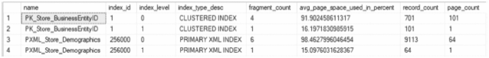
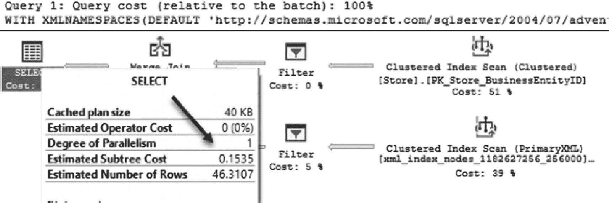
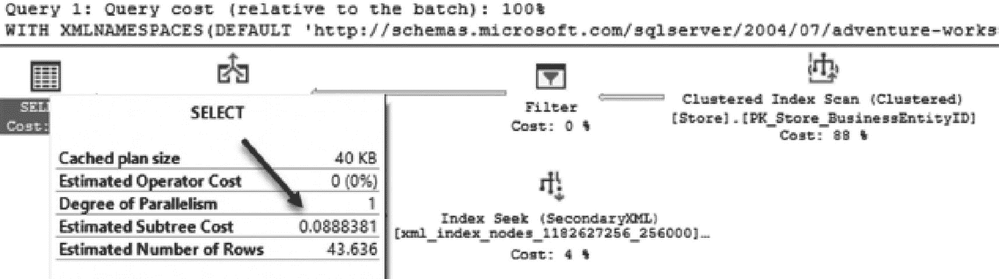
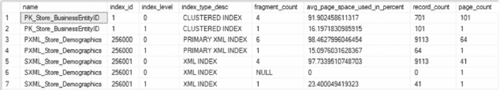
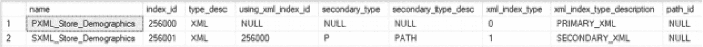
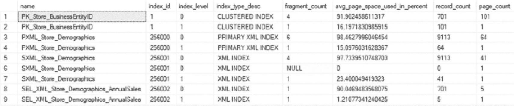
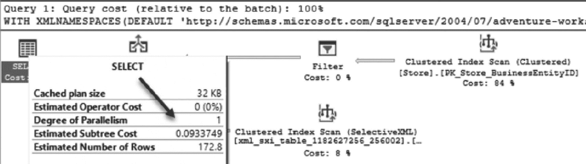

# 第 6 章 XML 索引

过去几章重点介绍了对通常称为*结构化数据*的索引，其中数据及其存储具有通用的模式和组织。在本章和接下来的几章中，索引的重点将转向非结构化和半结构化数据。对于结构化和非结构化数据，索引的任务都是为了获得检索和操作数据的最佳效率，但表示这些类型的数据的数据类型在数据库中的存储方式存在差异。这些差异决定了索引的实现方式以及查询优化器如何使用索引。

SQL Server 有一个专门的数据类型来存储最常见的非结构化和半结构化数据类型——XML。本章探讨 SQL Server 为优化 XML 数据提供的索引类型。本章还将展示这些索引对可针对 XML 数据编写的查询类型的影响（使用 XQuery），以及对优化器所做选择的影响。

## XML 数据

可扩展标记语言（XML）在 20 世纪 90 年代开发，并于 1998 年 2 月被万维网联盟采纳为标准。多年来，XML 数据一直存储在数据库中，但在 SQL Server 2005 之前，它没有专门的数据类型或访问方法。当引入时，XML 数据类型扩展了 SQL Server 的功能，以适当地管理这种不同的数据结构。随着 XML 的接受，SQL Server 数据库中 XML 内容的使用和总量有所增长。这种增长是由 XML 为应用程序开发人员提供的优势所推动的。


### 优势

引入 `XML` 数据类型使得在 `SQL Server` 数据库中能够充分发挥 `XML` 存储的能力。这包括能够根据针对 `XML` 本身编写的查询来检索 `XML` 内容。`XML` 为开发者提供的最强大支持在于它既是基于文本的，同时从本质上讲也是**自描述的**。基于文本意味着 `XML` 可以轻松地从一个应用程序传递到另一个应用程序，不受底层操作系统或编程语言的限制。`XML` 的自描述特性意味着，它不需要像数据库中定义列和表那样预先定义结构。相反，`XML` 的元素和属性会描述它们自身。`XML` 被称为**半结构化**数据，因为通常会有一个模板来定义预期的结构，以帮助验证任何给定的 `XML` 集合是否**格式良好**。

在使用 `SQL Server` 处理大量 `XML` 时，对 `XML` 建立索引可能是有益的。`XML` 索引的最大好处体现在存储了大量 `XML` 数据但只需要检索其中一小部分子集的场景中。在这些情况下，`XML` 索引可以确保快速读取一小部分 `XML` 数据，而无需缓慢地扫描整个文档。

#### 注意事项

尽管 `XML` 数据类型听起来是每种 `XML` 实例的完美选择，但在设计 `SQL Server` 中用于存储 `XML` 的列时，仍需评估一些注意事项。最关键的一点是 `XML` 内容应该是**格式良好**的。这确保了 `XML` 数据类型以及为最有效利用数据而提供的功能能够充分发挥优势。`XML` 列以二进制大对象（更常见的名称是 `BLOB`）的形式存储。这种存储方式意味着在大多数情况下，对该内容进行运行时查询是资源密集型且缓慢的。对于任何涉及数据检索的任务，检索的效率都是需要关注的问题。在 `SQL Server` 中，索引对于效率的高低至关重要。完全缺乏索引或索引过多都会影响任何数据操作任务。`XML` 数据类型也不例外。`XML` 索引与 `SQL Server` 中的其他索引方法相比是独特的。

## XML 索引

`XML` 索引主要分为两大类：主/辅助 `XML` 索引和选择性 `XML` 索引。这些索引类型之间的主要区别在于索引中包含的 `XML` 数据量。对于主/辅助索引，所有路径、节点和值都包含在索引中。当不清楚 `XML` 的哪些部分会被最频繁访问时，这种方式很有效。反之，如果只会访问 `XML` 的有限部分，那么选择性 `XML` 索引可以提供更好的性能，因为被索引的数据量减少了。接下来的两节将全面探讨这两类 `XML` 索引。

### 主/辅助 XML 索引

顾名思义，主/辅助 `XML` 索引下包含两种索引类型：主索引和辅助索引。这两种索引类型在 `XML` 文档内提供的索引关系类似于聚集索引和非聚集索引之间的关系。在实现 `XML` 索引时，一些基本规则适用于每种类型：

*   一个列上只能存在一个主 `XML` 索引，但一个表上可以存在多个主 `XML` 索引。
*   主 `XML` 索引不能存在于没有聚集索引的表的主键上（该表包含 `XML` 列）。此聚集索引是表分区所必需的，而 `XML` 索引可以使用相同的分区方案和功能。
*   主 `XML` 索引包含 `XML` 内容的所有路径、标签和值。
*   没有主 `XML` 索引，就无法存在辅助 `XML` 索引。
*   辅助 `XML` 索引扩展了主索引，包含了路径、值和属性。

为了演示主/辅助 `XML` 索引，将使用 `AdventureWorks2017` 数据库中的 `[Sales].[Store]` 表。该表在 `[Demographics]` 列上已存在一个主 `XML` 索引，需要使用清单 6-1 中的代码将其删除。

```sql
USE AdventureWorks2017;
GO
DROP INDEX IF EXISTS [PXML_Store_Demographics] ON [Sales].[Store]
```

清单 6-1
删除 [Sales].[Store] 上现有的主 XML 索引

首先对针对该表的示例查询进行成本基准测试是有用的。在清单 6-2 的查询中，将在 `[Sales].[Store]` 表中查询年销售额等于 1,500,000 美元的商店。对于一个返回不到 200 条记录的查询，其成本为 12.751（如图 6-1 所示），这是相当高的。这是由于 `XML` Reader 带有 `XPath` 过滤器，它必须为所有行解构整个 `XML` 文档以查找请求的记录，这是一个缓慢且资源密集型的过程。

```
A X M L query page. The records requested in the query, returns a set of data. Cached plan size is 32 kilobytes. The degree of parallelism is 1\. Estimated subtree cost is 12.751\. Estimated number of rows is 630.9.
```

图 6-1
无 XML 索引时的 XML 查询成本

```sql
USE AdventureWorks2017;
GO
WITH XMLNAMESPACES
(DEFAULT 'http://schemas.microsoft.com/sqlserver/2004/07/adventure-works/StoreSurvey')
SELECT BusinessEntityID, Name, Demographics
FROM [Sales].[Store]
WHERE Demographics.exist('/StoreSurvey/AnnualSales[.=1500000]') = 1;
```

清单 6-2
针对年销售额查询 [Sales].[Store]

**注意**
本章将使用估计子树成本与逻辑读取的比较来展示 `XML` 索引的价值。虽然本书中的大多数分析都侧重于通过使用索引来减少 I/O，但解析 `XML` 通常是一个计算成本高昂的操作，因此重点关注查询成本。也可以使用统计时间来大致比较 CPU 测量值。

这种查询方法成本高昂，但在表中数据量较少时是高效的。然而，在现实生活中，表可能会变得非常大，超过扫描多个 `XML` 文档仍然高效的临界点。例如，想象一个销售点系统，它将每次销售的收据信息存储为 `XML` 文档。面对这样的数据量，性能将很快开始下降。


#### 主 XML 索引

既然我们已经了解了在没有任何 XML 索引的情况下示例查询的成本，现在让我们看看当添加主 XML 索引时会发生什么。使用清单 6-3 中的 `CREATE INDEX` 代码创建主 XML 索引。有关语法的更多信息请参见第 1 童。这将在 `Demographics` 列上创建一个主 XML 索引。

```sql
USE AdventureWorks2017;
GO
CREATE PRIMARY XML INDEX [PXML_Store_Demographics] ON [Sales].[Store]
([Demographics])
```
清单 6-3
在 `[Sales].[Store]` 上创建主 XML 索引

创建主 XML 索引后，所有路径、标签和节点都会被索引。对于这些项目中的每一项，都会在 XML 索引中创建一条记录，其中包含该项目、该项目在 XML 文档中的出现方式信息以及与该记录关联的表中的行。这一点很重要，因为 XML 索引通常会显著增加底层表的存储空间占用。为了演示，运行清单 6-4 中的代码以查看每个索引的记录数和页数。如图 6-2 所示的结果所示，主 XML 索引中的记录数大大超过了表中的记录数，达到了 13 倍。


图 6-2
创建主 XML 索引后的物理统计信息

```sql
USE AdventureWorks2017;
GO
SELECT [i].[name]
,[i].[index_id]
,[IPS].[index_level]
,[IPS].[index_type_desc]
,[IPS].[fragment_count]
,[IPS].[avg_page_space_used_in_percent]
,[IPS].[record_count]
,[IPS].[page_count]
FROM [sys].dm_db_index_physical_stats, OBJECT_ID(N'Sales.Store'), NULL, NULL, 'DETAILED') AS [IPS]
INNER JOIN [sys].[indexes] AS [i]
ON [i].[object_id] = [IPS].[object_id]
AND [i].[index_id] = [IPS].[index_id]
WHERE [IPS].[index_type_desc] <> 'NONCLUSTERED INDEX'
ORDER BY [i].[index_id]
,[IPS].[index_level];
```
清单 6-4
`[Sales].[Store]` 上的主 XML 索引详细信息

主 XML 索引就位后，可以执行清单 6-2 中的代码来演示新索引的性能。回顾执行计划，可以清楚地看到执行计划呈现出一种截然不同的模式，如图 6-3 所示。估计子树成本从超过 12 降低到 0.1535，带有 XPath 过滤器的 XML Reader 被替换为主 XML 索引的聚集索引扫描。在底层，查询仍然在扫描表，但这样做所需的工作量要小得多。对于更大的表，这种索引更改将显著缩短查询的持续时间。


图 6-3
使用主 XML 索引的 XML 查询成本

使用主 XML 索引，优化器可以做出更均衡的选择。`Sales.Store` 表的 `聚集索引扫描` 的估计成本与针对最近创建的 XML 索引的 `聚集索引查找` 一样高。查询引擎中工作发生位置的这种转变将带来性能的提升。

**注意**
当删除主 XML 索引时，所有辅助 XML 索引也将被删除，因为它们依赖于主索引。此操作不会给出警告。

#### 辅助 XML 索引

辅助 XML 索引提供了进一步改善 XML 数据查询的能力。使用辅助 XML 索引时，在构建索引时需要在 `PATH`、`VALUE` 和 `PROPERTY` 类型之间做出选择。这些选项决定了主 XML 索引中的哪些元素将包含在辅助 XML 索引中，并根据经常针对 XML 文档运行的查询类型提供性能改进。例如，如果更多查询访问的是属性元素，那么辅助 XML 索引的 `PROPERTY` 类型将是有益的。

回到清单 6-2 中的示例查询，现有的函数调用同时使用了路径和值。由于此查询首先搜索路径以检查值，并且没有访问其他路径，因此将使用 `PATH` 创建辅助 XML 索引。`CREATE INDEX` 语句的语法如清单 6-5 所示。请注意，`CREATE INDEX` 语法现在包含一个 `USING` 语句，该语句引用主 XML 索引，并带有 `FOR PATH` 子句。

```sql
USE AdventureWorks2017;
GO
CREATE XML INDEX [SXML_Store_Demographics] ON [Sales].[Store] (Demographics)
USING XML INDEX [PXML_Store_Demographics]
FOR PATH;
```
清单 6-5
创建辅助索引

创建辅助 XML 索引后，将再次测试清单 6-2 中的示例查询，以查看执行计划如何变化。如图 6-4 所示，执行计划得到了显著改进。估计子树成本从 0.1535 减少了一半左右，降至 0.0888，并且主 XML 索引上的聚集索引扫描被替换为辅助 XML 索引上的索引查找。现在查询中成本最高的项目是表聚集索引上的聚集索引扫描。使用辅助 XML 索引几乎消除了访问 XML 数据相关的开销。


图 6-4
使用辅助 XML 索引的 XML 查询成本

请注意，辅助 XML 索引有时可能几乎与主 XML 索引一样大。通过运行清单 6-4 中的代码可以证明这一点，如图 6-5 所示，主 XML 索引和辅助 XML 索引中存在相同数量的记录。在这种情况下，这是意料之中的，因为 XML 文档中的所有数据都是 XML 路径上的值。在这种情况下，辅助 XML 索引的优势在于基于这些路径的排序，这使得 XML 索引更具选择性。


图 6-5
创建辅助 XML 索引后的物理统计信息

尽管 `sys.dm_db_index_physical_stats` 对于查找维护所有索引（包括 XML 索引）所需的信息很有用，但有一个专门用于 XML 索引的系统视图：`sys.xml_indexes`。此视图显示已应用于 XML 索引的所有选项。通过了解索引的类型和其他设置，此视图返回的信息对于进一步维护索引很有用。此视图继承自 `sys.indexes`，并返回 `sys.indexes` 中提供的列。如图 6-6 所示，还存在以下附加列：




一个包含 2 行 9 列数据的数据库表。列标题为 `name`、`index_id`、`type_desc`、`using_xml_index_id`、`secondary_type`、`secondary_type_desc`、`xml_index_type`、`xml_index_type_description` 和 `path_id`。表中存在一个主 XML 索引和一个辅助 XML 索引。

图 6-6

`sys.xml_indexes` 查询结果

*   `using_xml_index_id`：辅助索引所基于的父索引。如前所述，创建辅助索引前需要存在主索引。对于主 XML 索引，此列为 `NULL`，仅用于辅助索引。

*   `secondary_type`：指定辅助索引所基于类型的标志。每个辅助索引基于特定类型（`V` = `VALUE`，`P` = `PATH`，`R` = `PROPERTY`）。对于主 XML 索引，此列为 `NULL`。

*   `secondary_type_desc`：辅助索引类型的描述。描述值对应于 `secondary_type` 列中所述的值。

考虑主 XML 索引和辅助 XML 索引的存储影响非常重要，因为表中数据越多、数据修改越频繁，这些索引对写入操作的影响就越大。使用辅助 XML 索引带来的性能提升需要与其维护所需的时间进行权衡，以决定是否创建该索引。在构建主 XML 索引和辅助 XML 索引时，努力在硬件资源、存储空间、索引实用性、创建的索引数量以及索引实际可能被需要的次数之间取得平衡。

### 选择性 XML 索引

SQL Server 2012 引入了选择性 XML 索引，以解决主/辅助 XML 索引的一个重大问题。XML 文档可能非常大。对整个文档创建索引会对索引的创建和随时间的维护产生重大的性能影响。此外，这些过大的索引也会加剧组织内常见的存储困境。当索引变得很大时，其功能可能不如较小时那么好。基于这些原因，引入了选择性 XML 索引。

选择性 XML 索引允许仅在 XML 文档的一个子集上创建索引。这使得索引更小、更灵活，并针对 XML 中的特定路径。创建索引时，会解析文档并分解 XML。分解后的值存储在数据库中的标准关系存储中。除了选择性 XML 索引本身，还可以基于定义选择性 XML 索引的路径内的节点添加辅助索引。

当通常只需要元素的子集时，选择性 XML 索引相比标准 XML 索引可以实现显著的性能优势。然而，如果对 XML 列的查询大多是即席查询，可能请求 XML 文档中的任何元素，那么标准 XML 索引可能更有用。同样，具有大量节点路径的 XML 文档可能从标准 XML 索引中获益更多，而非选择性 XML 索引。

要创建选择性 XML 索引，必须遵循以下条件：

*   表必须在主键上定义聚集索引。
*   主键大小限制为 128 字节。
*   聚集索引键列在与选择性 XML 索引一起使用时限制为 15 列。

选择性 XML 索引不会用于 XQuery 语句中的 `query()` 或 `modify()` 方法。它将支持 `exist()`、`value()` 和 `nodes()`。如果同时使用 `query()` 和 `modify()`，它将仅辅助节点查找。

清单 6-6 中的脚本在选择性 XML 索引中创建路径。由于文档中仅访问年度销售额，因此选择性 XML 索引可以仅限于该 XML 路径。

```
USE AdventureWorks2017;
GO
CREATE SELECTIVE XML INDEX [SEL_XML_Store_Demographics_AnnualSales]
ON [Sales].[Store] (Demographics)
WITH XMLNAMESPACES
(DEFAULT 'http://schemas.microsoft.com/sqlserver/2004/07/adventure-works/StoreSurvey')
FOR (AnnualSales = '/StoreSurvey/AnnualSales');
```

清单 6-6
创建选择性 XML 索引的脚本

创建选择性 XML 索引后，将重新审视清单 6-2 中的示例查询，以查看其对执行计划的影响。如图 6-7 所示，估计子树成本与使用辅助 XML 索引时相当，但使用选择性 XML 索引时成本略高。要理解 SQL Server 为何做出此选择，可以执行清单 6-4 中的代码以查看存储空间占用情况。如图 6-8 所示，选择性 XML 索引明显小于辅助 XML 索引。选择性 XML 索引仅限于 5 页上的 701 条记录，而不是可能访问 41 页和 9,113 条记录，这证明了在选择性 XML 索引上进行聚集索引扫描的额外成本是合理的。



一个包含 9 行 8 列数据的数据库表。列标题为 `name`、`index_id`、`index_level`、`index_type_desc`、`fragment_count`、`avg_page_space_used_in_percent`、`record_count` 和 `page_count`。表中存在 2 个选择性 XML 索引。

图 6-8

创建选择性 XML 索引后的物理统计信息




