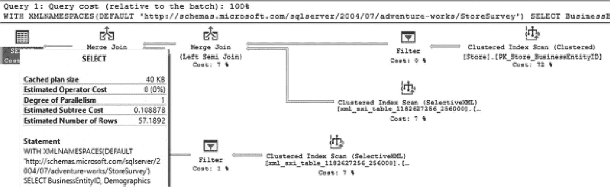
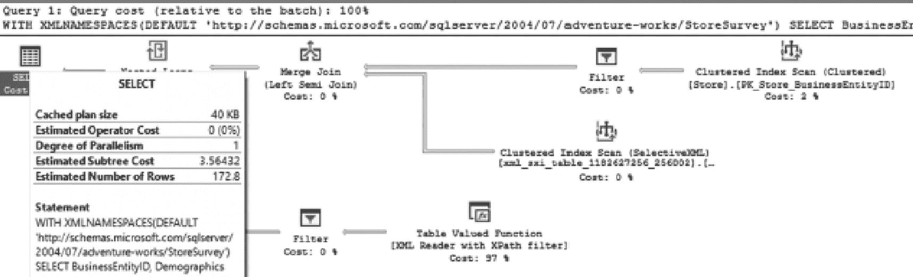
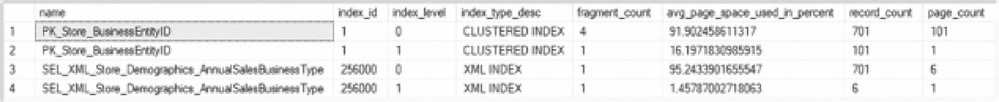

# 第 6 章 选择性 XML 索引

XML 查询页面查询成本为 100%。请求的选择性 XML 索引成本为 8%，返回一组数据。缓存的计划大小为 32 千字节。估计运算符成本为 0。并行度为 1。估计子树成本为 0.0933749。估计行数为 172.8。

**图 6-7**
使用选择性 XML 索引的 XML 查询成本

虽然这为 XML 索引提供了一个显著改善的机会，但有一个重要的限制需要考虑。如果查询随着时间的推移而演变，以至于选择性 XML 索引不再覆盖它们，那么性能将会下降。这与典型的聚集索引和非聚集索引不同，后者索引的是列中每个值的全部内容，而不是每个值的选择性部分。

为了演示此场景，将在查询中添加另一个 XML 元素以按 `BusinessType` 进行筛选。`Exist()` 将被添加到 `WHERE` 子句中，如**清单 6-7** 所示，同时删除先前创建的主/辅助 XML 索引以防止它们干扰输出。一般来说，当使用选择性 XML 索引时，不会同时使用主/辅助 XML 索引。

```sql
USE AdventureWorks2017;
GO
DROP INDEX IF EXISTS [SXML_Store_Demographics] ON [Sales].[Store];
DROP INDEX IF EXISTS [PXML_Store_Demographics] ON [Sales].[Store];
WITH XMLNAMESPACES
(DEFAULT 'http://schemas.microsoft.com/sqlserver/2004/07/adventure-works/StoreSurvey')
SELECT BusinessEntityID, Demographics
FROM [Sales].[Store]
WHERE Demographics.exist('/StoreSurvey/AnnualSales[.=1500000]') = 1
AND Demographics.exist('/StoreSurvey/BusinessType[.="OS"]') = 1
```

**清单 6-7**
在 `[Sales].[Store]` 上查询 `AnnualSales` 和 `BusinessType`

运行**清单 6-7** 中的代码后，可以看到查询性能已大幅下降。其原因是包含了带有 `XPath` 筛选器的 `XML Reader`，这增加了估计子树成本，如**图 6-9** 所示。其表现不像首次执行此查询时那么差，因为选择性 XML 索引仍在协助减少需要使用函数扫描整个 XML 文档的记录数。但这确实是一种性能下降，对于大表来说，这可能会导致显著的性能挑战。



XML 查询页面查询成本为 100%。请求的选择性 XML 索引成本为 7%，返回一组数据。缓存的计划大小为 40 千字节。估计运算符成本为 0。并行度为 1。估计子树成本为 00.108878。估计行数为 57.1892。附有带网站链接的语句。

**图 6-9**
使用选择性 XML 索引但未包含 XML 元素的 XML 查询成本

幸运的是，选择性 XML 索引提供了灵活性来调整此类问题。具体来说，如**清单 6-8** 所示的 `FOR` 子句可以扩展以包含多个 XML 节点和路径。在此场景中，`BusinessType` 被添加到索引中。正如预期且如**图 6-10** 所示，索引中的此项更改通过将估计子树成本降至 0.108 来提高了查询性能。这是在选择性 XML 索引上添加第二个聚集索引扫描操作的直接结果。



XML 查询页面查询成本为 100%。请求的选择性 XML 索引成本为 0%，返回一组数据。缓存的计划大小为 40 千字节。估计运算符成本为 0。并行度为 1。估计子树成本为 3.56432。估计行数为 172.8。附有带网页链接的语句。

**图 6-10**
在两个元素上建立选择性 XML 索引的 XML 查询成本

```sql
USE AdventureWorks2017;
GO
DROP INDEX IF EXISTS [SEL_XML_Store_Demographics_AnnualSales] ON [Sales].[Store];
CREATE SELECTIVE XML INDEX [SEL_XML_Store_Demographics_AnnualSalesBusinessType]
ON [Sales].[Store] (Demographics)
WITH XMLNAMESPACES
(DEFAULT 'http://schemas.microsoft.com/sqlserver/2004/07/adventure-works/StoreSurvey')
FOR (AnnualSales = '/StoreSurvey/AnnualSales',
BusinessType = '/StoreSurvey/BusinessType');
```

**清单 6-8**
创建选择性 XML 索引的脚本

再次，通过运行**清单 6-4** 中的脚本来检查扩展索引的存储影响。**图 6-11** 显示，即使增加了索引中的元素数量，索引的存储占用空间也没有发生显著变化。记录数为 701，分布在 6 个页面上，而不是 5 个。



一个 4 行 8 列的数据库表。列标题为 `name`、`index I D`、`index level`、`index type descending order`、`fragment count`、`average page space used in percent`、`record count` 和 `page count`。行中存在 2 个选择性 XML 索引。

**图 6-11**
在两个元素上创建选择性 XML 索引后的物理统计信息

虽然选择性 XML 索引是优化对 XML 文档读取的一种更复杂的方式，但入门的学习曲线并不显著。选择性 XML 索引支持比本章提供的示例更复杂的 XQuery，允许更精确地指定 XML 文档的哪些部分将被索引。

## 本章小结

本章介绍了对存储在 SQL Server 中的非结构化和半结构化数据进行搜索和索引的需求。XML 索引为开发人员和数据库管理员提供了改进 XML 文档搜索性能的选项。这对于通过筛选数据和检索数据以进行显示的查询都有益。选择性 XML 索引提供了一种更精细和详细的方法来进行 XML 索引。XML 索引可能需要大量的存储空间；因此，应提前相应地规划容纳它们所需的空间。

