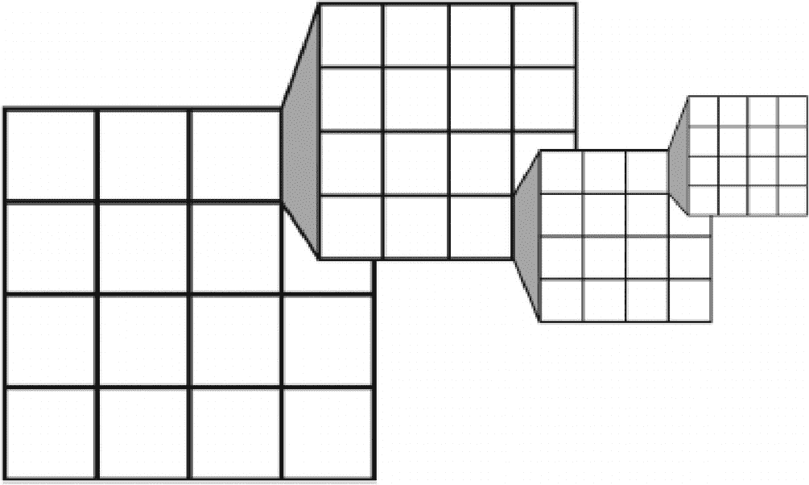
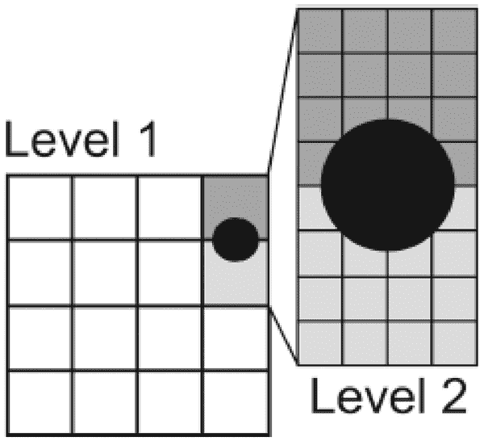
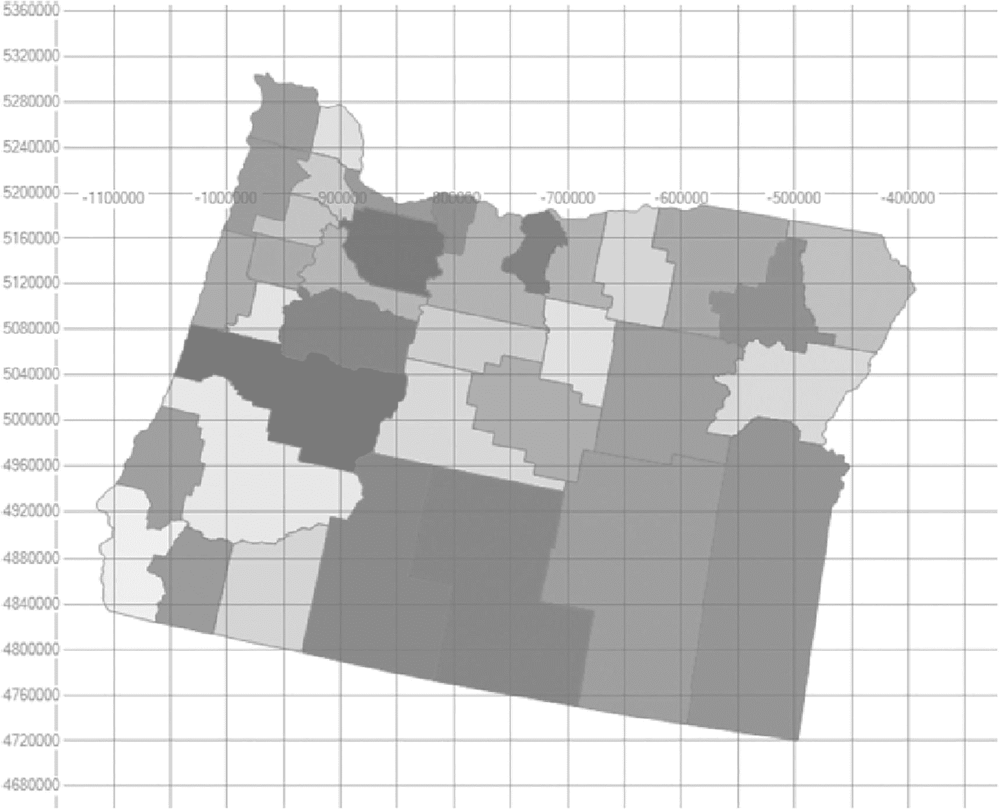

# 7. 空间索引

空间数据类型提升了 SQL Server 的存储能力，允许存储定义形状和位置信息的数据。在这些增强功能出现之前，空间数据通常存储为字符串或数值，在数据库中没有隐含的意义。这需要繁琐的转换和计算才能将信息解析为有意义的见解。

作为空间数据支持的一部分，SQL Server 引入了 `GEOMETRY` 和 `GEOGRAPHY` 数据类型。这些类型分别支持平面和测地数据。平面数据包括二维平面上的线、点和多边形，而测地数据包括类似的数据，但定义在测地椭球体上。测地数据描述了在地球地图上识别的数据点。这两种数据类型可以这样描述：`GEOMETRY` 是所描述形状的平面表示，而 `GEOGRAPHY` 则包含一个圆形的全球表示。

空间数据索引在创建和解释方式上是独特的。每个索引由一组网格组成。这些网格由一组单元组成，布局类似于方形电子表格。网格最大可达 16 × 16，最小可达 4 × 4。网格内的单元包含定义所存储空间数据对象的值。`GEOGRAPHY` 和 `GEOMETRY` 数据类型在此类索引中存在明显区别。`GEOMETRY` 数据类型需要一个边界框，这是对索引定义区域大小的限制。`GEOGRAPHY` 数据类型没有边界框，因为它受行星大小的限制。

本章将探讨空间索引、其行为及其在查询中的使用，以增强空间数据的性能。

## 空间数据如何被索引

构成空间索引的网格是相互嵌套的。在顶层，即第 1 级，可以有一个例如 4 × 4 的网格。该第 1 级网格内的每个单元格随后又包含另一个网格，该网格由为该级别定义的单元格数量组成，在本例中为 4 × 4。这第二个网格定义了第 2 级。第 2 级的每个单元格都有一个定义第 3 级的网格，而那里的单元格包含另一个网格，即第 4 级。图 7-1 展示了一个 `GEOMETRY` 索引如何由这四个级别组成。索引则由这四个网格构成，每个网格由一系列单元格组成。这种分层和网格层次结构，称为`分解`，是在创建索引时创建的。



一张图表展示了来自第 1 级的 4 乘 4 网格中的单元格如何被索引到单元格内的 4 乘 4 网格的三个不同层级中。

图 7-1

`GEOMETRY` 索引存储和单元格的网格存储表示

如图 7-1 所示，最多可以有 40 亿个单元格。这在创建索引以及确定创建时使用的密度时非常重要。每一层或每一级都可以有一个指定的密度。密度分为三个级别 (`低 = 4 × 4`，`中 = 8 × 8`，`高 = 16 × 16`)。如果在创建索引时省略密度，则默认为 `中`。调整密度最常用于优化索引的存储空间。并非所有层都需要高密度。通过不使用超出需要的密度来节省空间。

这个背景知识是必要的，因为存储这些网格内信息的实际格式与存储标准索引所用的 `B-树` 格式相同。然而，它们在存储中的定义以及这些定义的检索方式在空间索引中与标准索引截然不同。为了将此信息转换为 `B-树` 格式，需要在网格之上进行额外的处理。

SQL Server 在索引过程中执行的下一步是细分。`细分`是将对象放入从第 1 层开始的网格层次结构中的过程。此过程可能只需要网格的第一层，但也可能根据所涉及的对象需要所有四层。细分本质上是获取来自空间列的所有数据，并将其放入网格的单元格中，同时保留所有被触及的单元格。然后，在评估请求时，索引使用 `B-树` 精确知道如何在每个网格中找到单元格。

然而，拥有网格存储和细分过程中的单元格在理论上并不完全有效，因为基于要保留的被触及单元格的极大数量，存在单元格被滥用或未有效使用的漏洞。对于 `GEOMETRY` 数据类型及其上创建的索引，需要边界框，因为 SQL Server 需要一个有限的空间。创建这样一个框是通过使用坐标 `xmin, xmax` 和 `ymin, ymax` 来完成的。结果可以可视化为一个正方形，其左下角有 x 坐标和 y 坐标，右上角有 x 坐标和 y 坐标。在确定 `GEOMETRY` 数据类型索引的边界框时，最关键的是确保所有对象都落在边界框内。此决策还需要避免使边界框过大，导致出现大量空单元格。因此，需要取得一种平衡，边界框需要足够大以容纳任何包含的数据，但也不能太大以致浪费过多空间。索引仅对边界框内的对象或形状有效。边界框内不包含对象可能会严重影响空间查询的性能。

为了在细分过程中保留有效使用索引的能力，应用了规则。这些规则如下：



一张图表展示了一个深色圆圈覆盖了第 1 级 4 乘 4 网格中的两个单元格，而在第 2 级，该圆圈覆盖了许多单元格。

图 7-2

对象在网格层级中覆盖多少个单元格的视觉表示

*   `覆盖规则`：覆盖规则是细分中应用的最基本规则。这与术语 *覆盖索引* 无关。该规则规定，任何被完全覆盖的单元格都不会为该对象单独记录。被覆盖的单元格会被计入该对象。不存储被覆盖单元格的详细信息可节省处理时间和数据存储空间。
*   `每对象单元格规则`：每对象单元格规则是一个更深入的规则，它对特定对象可以计数的单元格数量应用了一个限制。在图 7-2 中，所示圆圈在第 1 级覆盖了 2 个单元格，在第 2 级覆盖了 12 个。由于每对象单元格的默认值为 16，该圆圈被细分到第二层。如果该圆圈在第 2 级确实覆盖了超过 16 个单元格，细分将不会继续到第 2 级。由于该对象在第 3 级将覆盖远超过 16 个单元格，细分在此停止。调整每对象单元格数可以增强索引的准确性。根据存储的数据调整此值可能非常有效。鉴于每对象单元格规则的重要性，该设置在一个动态管理视图 `sys.spatial_index_tessellations` 中公开。本章稍后将回顾此设置。
*   `最深单元格规则`：细分过程的最后一条规则是最深单元格规则。每一层网格及其内的单元格都在更深层中被引用。在图 7-2 中，第 2 级中定义的单元格是唯一需要用来完全引用任何其他层级的单元格，在本例中是第 1 级。此规则内置于优化器如何从索引检索数据的处理过程中。

对于 `GEOGRAPHY` 类型，还存在通过细分过程将形态投影为扁平化表示的额外挑战。此过程首先将 `GEOGRAPHY` 网格划分为两个半球。每个半球被投影到四棱锥的各个面上并压平，然后两者合并到一个非欧几里得平面中。此过程完成后，该平面被分解为前述的网格层次结构。

## 创建空间索引

`创建空间索引`语句具有与普通聚集或非聚集索引大部分相同的选项。然而，此索引类型需要特定的选项，如表 7-1 所列。

表 7-1：空间索引选项

| 选项名称 | 描述 |
| --- | --- |
| `USING` | `USING` 子句指定空间数据类型。这必须是 `GEOMETRY_GRID` 或 `GEOGRAPHY_GRID`，且是必需的。 |
| `WITH GEOMETRY_GRID, GEOGRAPHY_GRID` | `WITH` 选项包括基于列数据类型为 `GEOMETRY_GRID` 或 `GEOGRAPHY_GRID` 设置细分方案。 |
| `BOUNDING_BOX` | `BOUNDING_BOX` 用于 `GEOMETRY` 数据类型，以定义单元的边框。此选项没有默认值，在 `GEOMETRY` 数据类型上创建索引时必须指定。清单 7-2 中的 `CREATE SPATIAL INDEX IDX_CITY_GEOM` 展示了此选项的语法。设置 `BOUNDING_BOX` 是通过设置 `xmin` 和 `ymin` 以及 `xmax` 和 `ymax` 坐标来完成的，如下所示：`BOUNDING_BOX = (XMIN = xmin, YMIN = ymin, XMAX = xmax, YMAX = ymax)`。 |
| `GRIDS` | `GRIDS` 选项用于更改每个网格层的密度。所有层的默认值为中等密度，但可以更改为低或高，以进一步调整空间索引和密度设置。 |

以清单 7-1 中的 `CREATE TABLE` 语句为例。

```
USE AdventureWorks2017
GO
CREATE TABLE CITY_MAPS (
ID BIGINT PRIMARY KEY
IDENTITY(1, 1),
CITYNAME NVARCHAR(150),
CITY_GEOM GEOMETRY
);
GO
Listing 7-1
CREATE TABLE with a GEOMETRY Data Type
```

该表将包含主键、城市名称，然后是一个 `GEOMETRY` 列，用于存储城市本身的地图数据。城市的密度可能会影响调整细分中每个对象的单元规则以及网格层次结构中每层的密度。

要为 `CITY_GEOM` 列创建索引，将使用清单 7-2 中的 `CREATE` 语句，其中前两层的网格层密度为 `LOW`，第三层和第四层分别为 `MEDIUM` 和 `HIGH`。这种密度更改允许调整索引中的对象和覆盖的单元，因为层在网格中越深入。每个对象的单元设置是对象可以覆盖的最大 24 个单元。边框坐标也已设置。

```
USE AdventureWorks2017
GO
CREATE SPATIAL INDEX IDX_CITY_GEOM
ON CITY_MAPS (CITY_GEOM)
USING GEOMETRY_GRID
WITH (
BOUNDING_BOX = ( xmin=-50, ymin=-50, xmax=500, ymax=500 ),
GRIDS = (LOW, LOW, MEDIUM, HIGH),
CELLS_PER_OBJECT = 24,
PAD_INDEX  = ON );
Listing 7-2
Definition of a Spatial Index on a GEOMETRY Column
```

要利用和测试创建的索引，需要检查预估和实际执行计划，以确定索引是否已被使用。对于空间数据，审查查询将产生的实际结果也是有益的。SQL Server Management Studio 有一个内置的空间数据查看器，可用于查看空间数据。

清单 7-3 创建了一个可受益于空间索引的表。该表用于存储来自美国人口普查局的邮政编码和其他数据。此表将在 `AdventureWorks2017` 数据库中创建。

```
USE AdventureWorks2017
GO
CREATE TABLE dbo.tl_2021_us_county (
STATEFP CHAR(2) NULL,
COUNTYFP CHAR(3) NULL,
COUNTYNS CHAR(8) NULL,
GEOID CHAR(5) NULL,
NAME CHAR(100) NULL,
NAMELSAD CHAR(100) NULL,
LSAD CHAR(2) NULL,
CLASSFP CHAR(2) NULL,
MTFCC CHAR(5) NULL,
CSAFP CHAR(3) NULL,
CBSAFP CHAR(5) NULL,
METDIVFP CHAR(5) NULL,
FUNCSTAT CHAR(1) NULL,
ALAND FLOAT NULL,
AWATER FLOAT NULL,
INTPTLAT CHAR(11) NULL,
INTPTLON CHAR(12) NULL,
GEOM GEOMETRY NULL
);
Listing 7-3
Creating a Table to Hold GEOMETRY-Related Data
```

`GEOM` 列将存储 `GEOMETRY` 数据。此列将用于从 SQL Server Management Studio 查询数据，以显示可以从其他应用程序完成的成像。

> **注意**
> 对于本章的示例，需要一个 shape 文件和工具 OGR2OGR。shape 文件来自 [TIGER/Line Shapefile, 2021, nation, US, Current County and Equivalent National Shapefile](http://www2.census.gov/geo/tiger/TIGER2021/COUNTY/tl_2021_us_county.zip)。OGR2OGR 可从 [OSGeo4W](http://download.osgeo.org/osgeo4w/osgeo4w-setup-v2.exe) 获取。安装应用程序时，仅安装 GDAL 包。安装后，运行 PowerShell 命令 `[Environment]::SetEnvironmentVariable(“GDAL_DATA”, “C:\OSGeo4W64\share\gdal”, “Machine”)` 以设置环境变量。最后，从提取地理文件的目录，运行命令 `C:\OSGeo4W64\bin\ogr2ogr -f “MSSQLSpatial” MSSQL:“server=localhost;database=AdventureWorks2017;trusted_connection=yes;” -nln “tl_2021_us_county” -a_srs “ESPG:4269” -lco “GEOM_TYPE=geography” -lco “GEOM_NAME=geog4269” “tl_2021_us_county.shp” -s_srs EPSG:4269 -t_srs EPSG:26713`。

在 SSMS 的普通网格和表格结果集中查看 `GEOMETRY` 数据类型列的查询的实际数据并不有用。要利用空间数据功能，使用 SSMS 中的“空间结果”选项卡要有效得多。给定清单 7-3 中的表，可以对 `GEOM` 列执行 `SELECT`，`SELECT` 语句的结果将自动生成“空间结果”选项卡。例如，清单 7-4 中的查询将生成华盛顿州的图像，每个县区域用不同的颜色编码。

```
USE AdventureWorks2017
GO
SELECT  *
FROM    dbo.tl_2021_us_county AS tuc
WHERE   tuc.STATEFP = '41';
Listing 7-4
Initial Query for Pulling Back Spatial Data
```

单击 SSMS 结果窗口中的“空间结果”选项卡，以显示查询生成的图像。结果应类似于图 7-3 中的图像。



图 7-3：针对县数据的空间查询输出
网格图显示了位置的输出，其中有多个县区域以不同的阴影表示。

清单 7-4 中的查询使用了标准列 `STATEFP` 来过滤信息，以便一次只查看特定州内的县。但在使用此数据之前，最好确保 `GEOM` 列中只包含有效的形状。可能会存储不正确的数据，因此可能需要清理数据。为此，可以使用方法 `MakeValid()` 来修改任何 `GEOMETRY` 实例，使其有效。根据 Microsoft 的文档，使用该函数可能会导致形状“轻微移动”，但它对你控制的形状可能产生的影响程度尚不清楚。执行清单 7-5 将更新 `GEOM` 列中任何无效的 `GEOMETRY` 实例。

```
USE AdventureWorks2017
GO
UPDATE  dbo.tl_2021_us_county
SET     GEOM = GEOM.MakeValid();
Listing 7-5
Using MakeValid() to Correct Any Invalid GEOMETRY Instances
```

`MakeValid()` 方法应谨慎使用，并且在生产环境中应审查发现的所有无效 `GEOMETRY` 实例。使用 `MakeValid()` 函数后，应仔细审查形状，因为它可能会修改这些形状。


