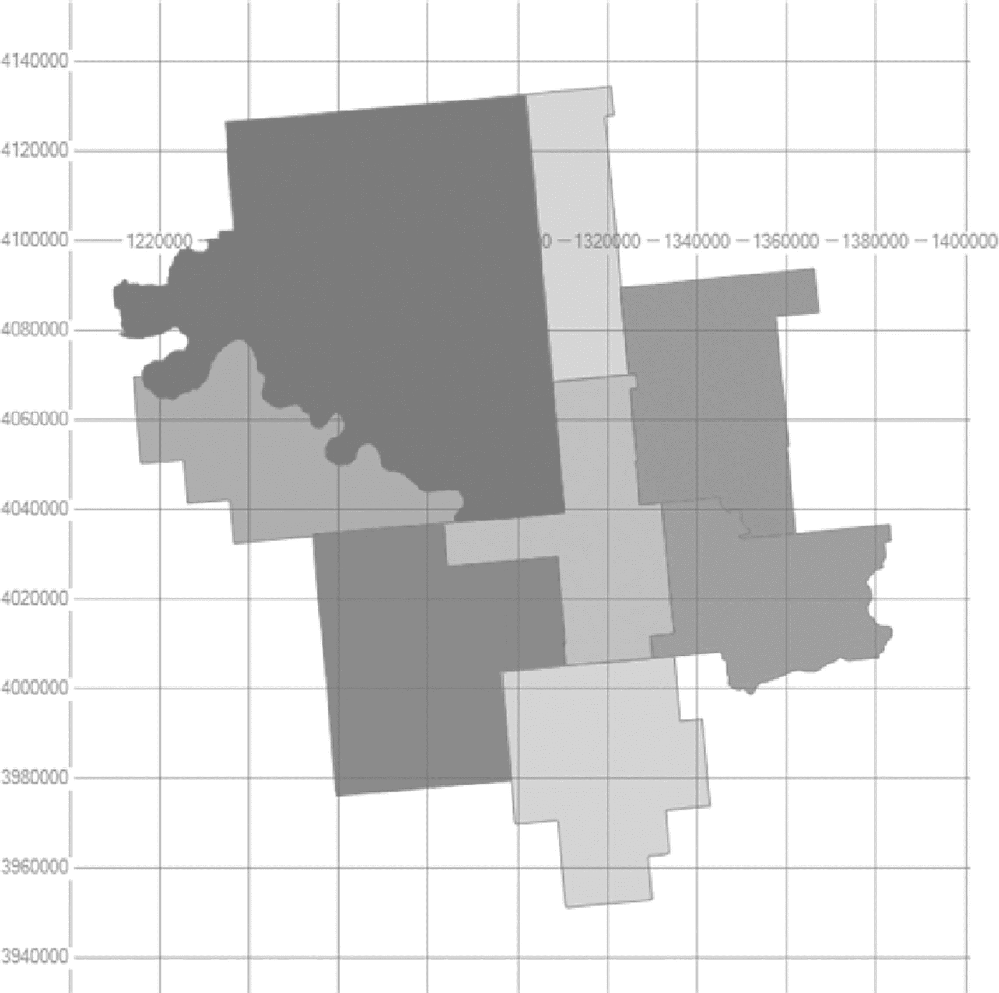
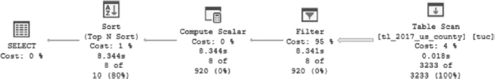
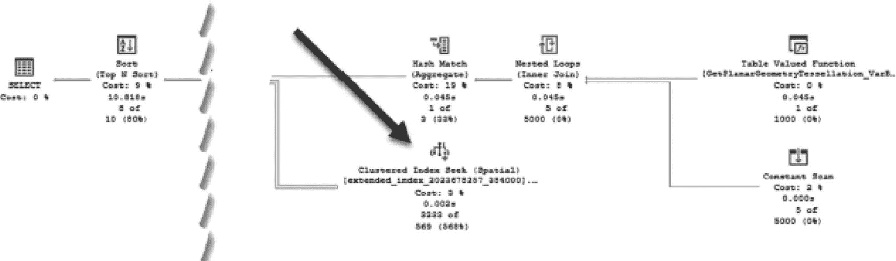
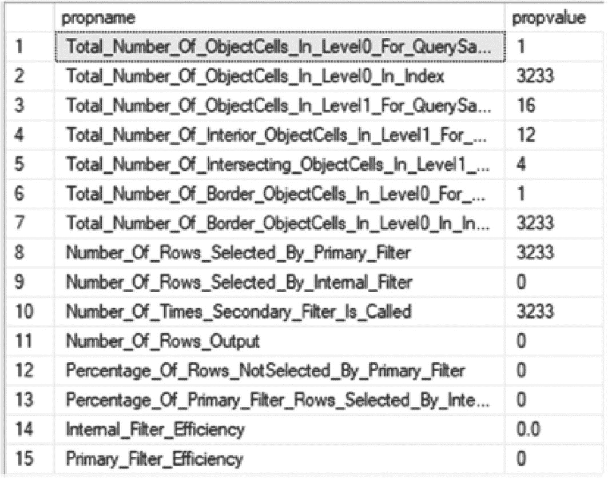

# 空间列也可用于根据位置和距离的行为过滤返回的数据。

清单 7-6 展示了一个示例，演示了如何调用一个已定义的用于处理空间信息的特殊方法。该查询返回距离俄克拉荷马州塔尔萨县最近的十个县（参见图 7-4）。



一个网格图展示了俄克拉荷马州的输出结果，该州有多个县区域，并以不同的阴影表示。

图 7-4

使用 `STDistance()` 缩小邮政编码数据的查询结果

```sql
USE AdventureWorks2017
GO
DECLARE @polygon GEOMETRY;
SELECT  @polygon = tuc.GEOM
FROM    dbo.tl_2021_us_county AS tuc
WHERE   tuc.NAME = 'Tulsa';
SELECT TOP 10
tuc.GEOM,
tuc.GEOM.STDistance(@polygon),
tuc.NAME
FROM    dbo.tl_2021_us_county AS tuc
WHERE   tuc.GEOM.STDistance(@polygon) IS NOT NULL
AND tuc.GEOM.STDistance(@polygon) < 1
ORDER BY tuc.GEOM.STDistance(@polygon);
```
清单 7-6
查询距离给定点最近的十个邮政编码

来自清单 7-6 的查询生成了如图 7-5 所示的执行计划。



一个流程图描绘了执行计划：表扫描成本 4%，筛选成本 95%，计算标量成本 0%，排序成本 1%，选择表成本 0%。

图 7-5

由 `STDistance()` 生成的、未使用索引的执行计划

查看“空间结果”选项卡显示了俄克拉荷马州的东北角，其中包含了那十个县的样子，如图 7-4 所示。然而，图 7-5 中所示的查询执行计划并不理想，它包含了表扫描和高成本的 `筛选` 操作。由于使用了 `STDistance` 谓词，该查询适合在 `GEOMETRY` 列上使用索引，因此可以并且应该添加索引。

## 使用索引支持方法

对于 `GEOMETRY` 和 `GEOGRAPHY` 数据类型，只有某些方法支持使用空间索引。`STDistance()` 方法将支持索引，这对清单 7-6 中显示的查询有益。在深入探讨为查询建立索引之前，应先指出那些确实支持索引的方法。这些方法的谓词编写有特定的规则。以下是 `GEOMETRY` 类型支持的方法列表：

*   `GEOMETRY.STContains() = 1`
*   `GEOMETRY.STDistance() < number`
*   `GEOMETRY.STDistance() <= number`
*   `GEOMETRY.STEquals() = 1`
*   `GEOMETRY.STIntersects() = 1`
*   `GEOMETRY.STOverlaps() = 1`
*   `GEOMETRY.STTouches() = 1`
*   `GEOMETRY.STWithin() = 1`

以下是 `GEOGRAPHY` 类型支持的方法：

*   `GEOGRAPHY.STIntersects() = 1`
*   `GEOGRAPHY.STEquals() = 1`
*   `GEOGRAPHY.STDistance() < number`
*   `GEOGRAPHY.STDistance() <= number`

对于 `GEOMETRY` 和 `GEOGRAPHY`，要返回任何非空结果，第一个参数和第二个参数必须具有相同的空间参考标识符 (`SRID`)，这是一种基于特定椭球体的空间参考系统，用于将地球展平或视为球体。

回想一下，图 7-6 中用于返回塔尔萨周围县的查询在表达式 `STDistance(@polygon) < 1` 中使用了 `STDistance()` 方法。根据支持的方法并分析空间索引的选项和 `CREATE` 语法，可以使用清单 7-7 中所示的 `INDEX CREATE` 语句来尝试优化该查询。



一个执行计划的流程图展示了表值函数，以及通过嵌套循环、数学匹配、聚集索引查找、排序和选择执行的扫描。

图 7-6

使用空间数据调优后的执行计划的优化详情

```sql
USE AdventureWorks2017
GO
CREATE SPATIAL INDEX IDX_COUNTY_GEOM ON dbo.tl_2021_us_county
(
GEOM
) USING  GEOMETRY_GRID
WITH (
BOUNDING_BOX =(-91.513079, -87.496494, 36.970298, 36.970298),
GRIDS =(LEVEL_1 = LOW,LEVEL_2 = MEDIUM,LEVEL_3 = MEDIUM,LEVEL_4 = HIGH),
CELLS_PER_OBJECT = 16,
PAD_INDEX  = OFF, SORT_IN_TEMPDB = OFF, DROP_EXISTING = OFF,
ALLOW_ROW_LOCKS  = ON, ALLOW_PAGE_LOCKS  = ON) ON [PRIMARY];
GO
```
清单 7-7
空间索引的 `CREATE` 语句

执行清单 7-7 中的查询会得到一个截然不同的执行计划，如图 7-6 所示。它导致执行和返回结果的持续时间更短，并且还有空间结果。执行计划中最大的不同是使用了索引 `IDX_COUNTY_GEOM`。

通过创建空间索引，整体上得到了一个更优的执行计划，从而带来了改进。索引和执行计划是好的，但不应跳过通过检查执行时间来验证实际改进的步骤。通过使用扩展事件捕获执行时间，可以检索到该语句执行的整体情况。对于搜索塔尔萨附近县的查询，在有索引的情况下返回结果耗时 500 毫秒。删除索引并执行相同的查询，总执行时间为 1,500 毫秒。这个测试非常基础，但它是一个坚实的基础，可以在此基础上构建策略，为现有的空间数据建立索引以提高整体性能。

## 理解统计信息、属性和信息

一般来说，索引有许多数据管理视图和函数，使它们的管理比手动收集指标更容易、更高效。对于空间索引，还有一些额外包含的目录视图，有助于对它们进行独特的设置和管理。除了这些视图，还可以调用内置的存储过程来获取有关空间索引的信息。


### 视图

有两个目录视图与空间索引相关：`sys.spatial_indexes` 和 `sys.spatial_index_tessellations`。`sys.spatial_indexes` 视图提供了空间索引的类型、细分方案以及基本信息。`sys.spatial_indexes` 返回的 `spatial_index_type` 列，对 `GEOMETRY` 索引返回 1，对 `GEOGRAPHY` 索引返回 2。清单 7-8 是查询该视图的示例，图 7-7 展示了结果。


一个表格有 5 列和一行数据。列标题分别为 name, type descending, spatial index type, spatial index type descending, 和 tessellation scheme。其中 spatial index type descending 显示为 geometry。

图 7-7

查询 `sys.spatial_indexes` 及结果显示了 IDX_WIZIP_GEOM 索引

```
USE AdventureWorks2017
GO
SELECT  name,
        type_desc,
        spatial_index_type,
        spatial_index_type_desc,
        tessellation_scheme
FROM    sys.spatial_indexes;
```
清单 7-8
检索空间索引元数据的查询

现在可以查询 `sys.spatial_index_tessellations` 来查看索引的参数和细分方案。清单 7-9 是查询语句，图 7-8 展示了结果。


一个表格有 5 列和一行数据。列标题分别为 tessellation scheme, bounding box x max, bounding box x min, bounding box y max, bounding box y min, level 1 grid descending, level 4 grid descending, 和 cells per object。

图 7-8

查询 `sys.spatial_index_tessellations` 及部分结果

```
USE AdventureWorks2017
GO
SELECT  tessellation_scheme,
        bounding_box_xmax,
        bounding_box_xmin,
        bounding_box_ymax,
        bounding_box_ymin,
        level_1_grid_desc,
        level_2_grid_desc,
        level_3_grid_desc,
        level_4_grid_desc,
        cells_per_object
FROM    sys.spatial_index_tessellations;
```
清单 7-9
检索细分信息的查询

这两个目录视图都可以通过 `object_id` 进行连接，对于调优和维护任务非常有用。有时，根据空间数据的相关需求来操作并重建索引可能是有效的。

##### 存储过程

除了目录视图之外，还提供了四个内部存储过程，用于进一步分析空间索引。这些存储过程返回索引上设置的所有属性的完整列表。这四个过程及其参数如下：

```
sp_help_spatial_GEOMETRY_index [ @tabname =] 'tabname'
    [ , [ @indexname = ] 'indexname' ]
    [ , [ @verboseoutput = ] 'verboseoutput'
    [ , [ @query_sample = ] 'query_sample']
sp_help_spatial_GEOMETRY_index_xml [ @tabname =] 'tabname'
    [ , [ @indexname = ] 'indexname' ]
    [ , [ @verboseoutput = ]'{ 0 | 1 }]
    [ , [ @query_sample = ] 'query_sample' ]
    [ ,.[ @xml_output = ] 'xml_output' ]
sp_help_spatial_GEOGRAPHY_index [ @tabname =] 'tabname'
    [ , [ @indexname = ] 'indexname' ]
    [ , [ @verboseoutput = ] 'verboseoutput' ]
    [ , [ @query_sample = ] 'query_sample' ]
sp_help_spatial_GEOGRAPHY_index_xml [@tabname = 'tabname'
    [ , [ @indexname = ] 'indexname' ]
    [ , [ @verboseoutput = ] 'verboseoutput' ]
    [ , [ @query_sample = ] 'query_sample' ]
    [ ,.[ @xml_output = ] 'xml_output' ]
```

清单 7-10 展示了如何执行这些存储过程。该示例返回关于 `GEOMETRY` 索引 `IDX_COUNTY_GEOM` 的信息，该索引在清单 7-7 中创建。图 7-9 展示了结果。



一个表格有 2 列和 15 行。列标题为 prop name 和 prop value，并选择了查询中第 0 级的对象单元总数。

图 7-9

`sp_help_spatial_GEOMETRY_index` 示例及结果（结果可能有所不同）

```
USE AdventureWorks2017
GO
DECLARE @Sample GEOMETRY
    = 'POLYGON((-90.0 -180.0, -90.0 180.0, 90.0 180.0, 90.0 -180.0, -90.0 -180.0))';
EXEC sp_help_spatial_GEOMETRY_index 'dbo.tl_2017_us_county', 'IDX_COUNTY_GEOM', 0, @Sample;
```
清单 7-10
调查几何索引

这些信息对于调整索引以使其更好地工作非常有用。这些细节类似于标准索引可用的统计信息。其中包括索引的每个级别中有多少对象可用。此外，还会返回与提供的查询样本匹配的数据。看到特定数量的相交对象与查询样本匹配，表明给定对象是否会被索引返回。通过将索引中的对象与匹配的对象进行比较，还可以检索索引中未被查询样本返回的对象百分比。所有这些都有助于理解索引满足空间查询要求的程度。


## 调优空间索引

如代码清单 7-7 所示，创建空间索引时，有多种选项可用。通过调整这些选项，可以调整空间索引的行为。为了获得索引的最佳行为，需要尝试一些不同的选项组合。执行计划与查询性能指标相结合，有助于确定一组有效的选项。

对于一个`GEOMETRY`类型的列，可以向索引中添加一个边界框。这限制了索引覆盖的区域，从而可以创建一个比更通用的索引更能满足特定查询条件的索引。例如，如果更改边界框并重建索引，如代码清单 7-11 所示，执行时间大约减少了 10%。

```
USE AdventureWorks2017
GO
CREATE SPATIAL INDEX IDX_COUNTY_GEOM ON dbo.tl_2017_us_county
(
GEOM
)USING  GEOMETRY_GRID
WITH (
BOUNDING_BOX =(-96.9, -95.3, 36.4, 36.6),
GRIDS =(LEVEL_1 = LOW,LEVEL_2 = MEDIUM,LEVEL_3 = MEDIUM,LEVEL_4 = HIGH),
CELLS_PER_OBJECT = 16,
PAD_INDEX  = OFF, SORT_IN_TEMPDB = OFF, DROP_EXISTING = ON,
ALLOW_ROW_LOCKS  = ON, ALLOW_PAGE_LOCKS  = ON) ON [PRIMARY];
GO
代码清单 7-11
调整空间索引的边界框
```

通过更改边界框，一些对象被排除在索引之外。根据索引中使用的数据和参数，过滤掉更多项目并不一定能提高性能。由于空间索引的这种复杂性，在调整和测试索引时，进行测试和验证以确保达到预期的性能改进非常重要。为一组县改进查询性能的调整，可能会导致美国其他县的查询性能下降。因此，可能并不总是存在一个无需额外调整和验证即可实施的简单解决方案。

另一个可以进行的调整是更改索引的网格。到目前为止的示例中所做的选择是一个标准选择，如果不确定数据分布情况以及任何一次查询可能获得多少匹配项。如果某个特定查询包含的结果比例较高，不同的网格分布可能会带来更高的速度。这主要是一个实验的问题。但是，就像边界框一样，为一个数据集更改网格分布可能会损害另一个数据集。需要进行严格的测试，以确保空间索引对于常见的数据配置文件是最优的。

使用相同的示例，如果将第 1 级网格调整为`HIGH`详细网格，性能将降低 10%，使查询运行更慢。将其更改为`MEDIUM`既不会有益也不会损害执行时间。在这种情况下，调整任何组合的网格级别都没有显著提高速度，但在网格的第 1 级或第 2 级使用`HIGH`详细级别会对性能产生负面影响。实验完成后，在此实例中选择保留默认网格是合理的。

## 空间索引的限制

空间索引提供了一些独特的功能，同时也带来了一系列限制。以下是空间索引限制的完整列表：

*   空间索引要求已存在聚集索引。
*   空间索引只能在类型为`GEOMETRY`或`GEOGRAPHY`的列上创建。
*   空间索引只能在具有主键的表上定义。表上主键列的最大数量为 15。
*   索引键记录的最大大小为 895 字节。更大的大小会引发错误。
*   不支持使用数据库引擎优化顾问（DTA）。
*   无法执行空间索引的联机重建。空间索引重建是离线操作，在重建期间索引不可用。如果需要重建，请在索引不太可能被使用的非工作时间进行。
*   不能在索引视图上指定空间索引。
*   在支持的表中，任何空间列上最多只能创建 249 个空间索引。在同一空间列上创建多个空间索引可能很有用，例如，可以在单个列中索引不同的镶嵌参数。
*   空间数据的索引构建无法使用可用的进程并行性。

## 总结

空间数据的索引是一种复杂的数据存储和操作形式。本章介绍了空间数据处理和存储的关键组成部分，以帮助管理和审查数据库中空间数据类型的实现。

空间索引提供了快速确定点是否位于区域内或区域是否与其他区域重叠的能力。空间索引无需完全渲染每个空间要素，而是允许查询快速计算空间函数的结果。确保最佳性能的关键在于检查执行计划，并验证空间索引是否被使用以及查询持续时间是否可接受。

