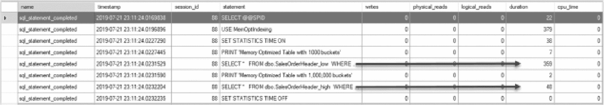
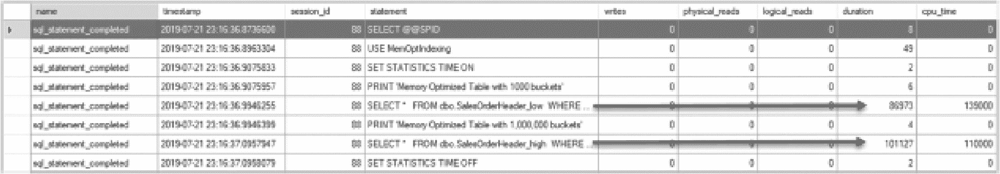
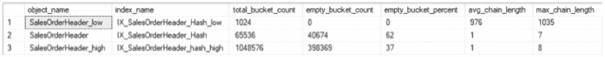
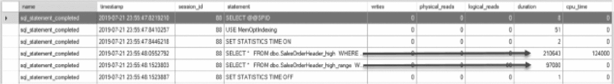
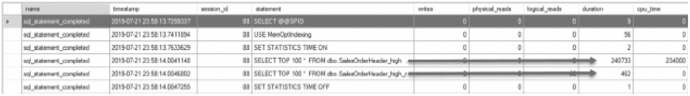

# 8. 索引内存优化表

前几章重点介绍了 SQL Server 中特殊数据类型的索引。内存优化表也可用，它们允许模式和/或数据持久保存在内存中，而不是存储在磁盘上。这些表于 SQL Server 2014 中引入，在 SQL Server 运行时完全驻留在内存中，依赖于基于磁盘的结构以根据需要持久保存模式/数据。

由于内存优化表主要基于内存，这对表及其索引的传统结构有重大影响。本章将回顾内存优化表，重点介绍这些表与更熟悉的基于磁盘的表之间的差异。此外，还将提供关于如何在内存优化表上创建理想索引的指导。

注意

根据来源和 SQL Server 版本，内存优化表也被称为内存中 OLTP 和 Hekaton。本书将使用术语`内存优化表`，因为它与 Microsoft 联机丛书中使用的术语一致。

## 内存优化表概述

### 概述

在深入探讨内存优化表的索引选项之前，有必要回顾一下内存优化表的基础知识。内存优化表是 SQL Server 2014 引入的一种表类型。与传统的表及其索引不同，内存优化表完全驻留在内存中。它们通过磁盘结构得到支持，但不依赖这些结构进行事务处理。这与传统表形成对比，传统表基于磁盘存储，在任何给定时间，通常只有一部分表及其索引驻留在缓冲池中。

内存优化表提供的价值在于其为高度事务性工作负载带来的性能提升。通过将整个表管理在内存中，事务无需等待数据写入缓冲池。此外，内存优化表消除了锁定和闩锁，通过消除传统表所面临的经典争用问题，从而改善了 OLTP 工作负载。

内存优化表的实现导致在 SQL Server 中设计表的方式发生了一些变化。由于表现在是内存驻留的，它们被构建成一种对访问内存中数据最优的结构，这与从磁盘检索数据子集的方式不同。因此，内存优化表使用哈希索引和范围索引来存储数据，而不是 B 树。此外，这些表不需要像传统表那样将数据从磁盘读取到缓冲池，从而消除了磁盘和内存结构之间对闩锁的需求。

### 创建前提条件

要在数据库中创建内存优化表，需要在数据库内准备好一些先决条件。首先，需要向数据库添加一个专门用于内存优化数据的文件组，并包含一个支持内存优化表的文件。此外，数据库应启用属性 `MEMORY_OPTIMIZED_ELEVATE_TO_SNAPSHOT`。此属性确保针对内存优化表的事务在 SNAPSHOT 隔离级别下执行。在清单 [8-1] 中，数据库 `MemOptIndexing` 使用这些设置进行准备。

```sql
USE master
GO
IF EXISTS(SELECT * FROM sys.databases WHERE name = 'MemOptIndexing')
DROP DATABASE MemOptIndexing
GO
CREATE DATABASE MemOptIndexing
GO
ALTER DATABASE MemOptIndexing
ADD FILEGROUP memoryOptimizedFG CONTAINS MEMORY_OPTIMIZED_DATA
--This file location may change in your environment
ALTER DATABASE MemOptIndexing
ADD FILE (name='memoryOptimizedData',
filename= 'C:\Program Files\Microsoft SQL Server\MSSQL15.MSSQLSERVER\MSSQL\DATA\memoryOptimizedData')
TO FILEGROUP memoryOptimizedFG
ALTER DATABASE MemOptIndexing SET MEMORY_OPTIMIZED_ELEVATE_TO_SNAPSHOT=ON
GO
```
清单 8-1
为内存优化表准备数据库

> 注意
> 清单 [8-1] 中所示的文件流的文件位置可能需要根据具体环境进行更改。

### 创建表示例

清单 [8-2] 中的代码展示了如何创建一个内存优化表。在此代码示例中，创建了表 `dbo.SalesOrderHeader`。表结构中有两点值得注意。首先，将表创建为内存优化表的选项是 `MEMORY_OPTIMIZED=ON` 选项。其次，表中包含一个 `NONCLUSTERED HASH` 索引，用于索引内存中的数据。除此之外，该表与 SQL Server 中创建的其他表非常相似。

```sql
USE MemOptIndexing
GO
IF OBJECT_ID('dbo.SalesOrderHeader') IS NOT NULL
DROP TABLE dbo.SalesOrderHeader
CREATE TABLE dbo.SalesOrderHeader(
SalesOrderID int NOT NULL,
OrderDate datetime,
DueDate datetime,
ShipDate datetime,
[Status] tinyint,
CONSTRAINT IX_SalesOrderHeader_Hash PRIMARY KEY
NONCLUSTERED HASH (SalesOrderID)
WITH (BUCKET_COUNT = 35000))
WITH (MEMORY_OPTIMIZED = ON)
IF  OBJECT_ID('tempdb..#tempHeader') IS NOT NULL
DROP TABLE #tempHeader
SELECT SalesOrderID
,OrderDate
,DueDate
,ShipDate
,[Status]
INTO #tempHeader
FROM AdventureWorks2017.sales.SalesOrderHeader
INSERT INTO dbo.SalesOrderHeader
SELECT SalesOrderID
,OrderDate
,DueDate
,ShipDate
,[Status]
FROM #tempHeader
SET STATISTICS IO ON
SET STATISTICS TIME ON
PRINT 'Memory Optimized Table'
SELECT *
FROM dbo.SalesOrderHeader
ORDER BY SalesOrderID
PRINT 'Traditional Table'
SELECT *
FROM AdventureWorks2017.sales.SalesOrderHeader
ORDER BY SalesOrderID
SET STATISTICS IO OFF
SET STATISTICS TIME OFF
```
清单 8-2
创建内存优化表

### 性能对比

清单 [8-2] 中的附加代码将数据插入到 `MemOptIndexing.dbo.SalesOrderHeader` 中，并查询相同的数据。为了演示查询内存优化表数据的影响，代码中还包含了一个针对 `AdventureWorks2017.sales.SalesOrderHeader` 的类似查询。检查清单 [8-3] 中显示的结果，可以对内存优化表获得一些见解。内存优化表没有 I/O 影响。虽然 `AdventureWorks2017.sales.SalesOrderHeader` 查询需要 689 次读取，但 `MemOptIndexing.dbo.SalesOrderHeader` 没有任何读取。此外，`MemOptIndexing.dbo.SalesOrderHeader` 的 CPU 时间要低得多，为 16 毫秒，而针对 `AdventureWorks2017.sales.SalesOrderHeader` 查询的 CPU 时间为 78 毫秒。

```text
(31465 row(s) affected)
(31465 row(s) affected)
Memory Optimized Table
SQL Server Execution Times:
CPU time = 0 ms,  elapsed time = 0 ms.
SQL Server parse and compile time:
CPU time = 0 ms, elapsed time = 0 ms.
(31465 row(s) affected)
SQL Server Execution Times:
CPU time = 16 ms,  elapsed time = 310 ms.
Traditional Table
SQL Server Execution Times:
CPU time = 0 ms,  elapsed time = 0 ms.
(31465 row(s) affected)
Table 'SalesOrderHeader'. Scan count 1, logical reads 689, physical reads 0, read-ahead reads 0, lob logical reads 0, lob physical reads 0, lob read-ahead reads 0.
SQL Server Execution Times:
CPU time = 78 ms,  elapsed time = 785 ms.
SQL Server Execution Times:
CPU time = 0 ms,  elapsed time = 0 ms.
```
清单 8-3
创建和查询内存优化表的输出

### 索引概述

虽然可以讨论内存优化表的更多细节，但本概述旨在提供其中一些最基本的方面。本章的其余部分将探讨内存优化表的索引。虽然内存优化表完全位于内存中，但仍然需要索引。内存驻留并不能阻止查找特定数据或筛选结果集的需要。索引提供了一种通向数据的路径机制，无论数据驻留在何处。

为了支持内存优化表的索引，SQL Server 支持两种索引选项：哈希索引和范围索引。每个内存优化表最多可以支持八个索引。如果定义了主键，它将由两种索引类型之一支持，并成为允许的索引之一。如果未定义主键，则必须在创建表时至少定义一个索引。此外，内存优化表不允许在创建后更改索引。因此，对于内存优化表，所有索引都需要在创建时预先定义。

本章的剩余部分将重点介绍哈希索引和范围索引，并考虑如何以及何时在内存优化表上构建每种索引。

> 注意
> 内存优化表的索引操作是非日志记录活动，因为它们仅发生在内存中，对存储在表中的数据状态没有影响。


### 哈希索引

可用于内存优化数据的一种索引类型是哈希索引。哈希索引将表中的数据分隔成固定数量的**存储桶**。插入表中的行随后使用哈希函数分配到可用的存储桶中。这些存储桶使得查询能够基于点查找操作返回特定的行。哈希索引专为需要检索表中单个行的查询工作负载而设计。

创建哈希索引时，要创建的存储桶数量是索引列预期值数量的函数。如果一个列或一组列具有较高的**基数**，则需要更大的存储桶计数。理想情况下，存储桶计数应恰好等于索引列的不同值的数量。实际上，该数字会更高，以便为未来的增长留出一些空间。

这是在内存优化表上创建和调整哈希索引的重要组成部分。随着每个存储桶中行数的增加，由于哈希冲突，检索数据所需的时间也会增加。

最优的哈希索引需要有足够的存储桶来应对未来的增长（并避免哈希冲突），同时不能有过多的存储桶（从而浪费空间）。

为了演示存储桶大小的影响，代码清单 8-4 创建了两个内存优化表。两个表都有 1,000,000 行数据，第一个表有 1,000 个存储桶，第二个表有 1,000,000 个存储桶。在此配置下，第一个表每个存储桶大约有 1,000 行，第二个表每个存储桶有 1 行。由于索引的是一个标识列，因此每行的 `SalesOrderID` 值都是唯一的。

```sql
USE MemOptIndexing
GO
IF OBJECT_ID('dbo.SalesOrderHeader_low') IS NOT NULL
DROP TABLE dbo.SalesOrderHeader_low
CREATE TABLE dbo.SalesOrderHeader_low(
SalesOrderID int NOT NULL
,Column1 uniqueidentifier
,CONSTRAINT IX_SalesOrderHeader_Hash_low PRIMARY KEY
NONCLUSTERED HASH (SalesOrderID)
WITH (BUCKET_COUNT = 1000))
WITH (MEMORY_OPTIMIZED = ON);
WITH L1(z) AS (SELECT 0 UNION ALL SELECT 0)
, L2(z) AS (SELECT 0 FROM L1 a CROSS JOIN L1 b)
, L3(z) AS (SELECT 0 FROM L2 a CROSS JOIN L2 b)
, L4(z) AS (SELECT 0 FROM L3 a CROSS JOIN L3 b)
, L5(z) AS (SELECT 0 FROM L4 a CROSS JOIN L4 b)
, L6(z) AS (SELECT TOP 1000000 0 FROM L5 a CROSS JOIN L5 b)
INSERT INTO dbo.SalesOrderHeader_low
SELECT ROW_NUMBER() OVER (ORDER BY z) AS RowID, NEWID()
FROM L6;
GO
IF OBJECT_ID('dbo.SalesOrderHeader_high') IS NOT NULL
DROP TABLE dbo.SalesOrderHeader_high
CREATE TABLE dbo.SalesOrderHeader_high(
SalesOrderID int NOT NULL
,Column1 uniqueidentifier
,CONSTRAINT IX_SalesOrderHeader_hash_high PRIMARY KEY
NONCLUSTERED HASH (SalesOrderID)
WITH (BUCKET_COUNT = 1000000))
WITH (MEMORY_OPTIMIZED = ON);
WITH L1(z) AS (SELECT 0 UNION ALL SELECT 0)
, L2(z) AS (SELECT 0 FROM L1 a CROSS JOIN L1 b)
, L3(z) AS (SELECT 0 FROM L2 a CROSS JOIN L2 b)
, L4(z) AS (SELECT 0 FROM L3 a CROSS JOIN L3 b)
, L5(z) AS (SELECT 0 FROM L4 a CROSS JOIN L4 b)
, L6(z) AS (SELECT TOP 1000000 0 FROM L5 a CROSS JOIN L5 b)
INSERT INTO dbo.SalesOrderHeader_high
SELECT ROW_NUMBER() OVER (ORDER BY z) AS RowID, NEWID()
FROM L6;
```
代码清单 8-4 创建带有哈希索引的内存优化表

**警告**

代码清单 8-4 中的代码可能需要长达 5 分钟才能执行完毕。

在执行此演示的下一部分代码之前，请基于**查询详细信息跟踪模板**创建一个扩展事件会话。该会话应使用默认配置创建，然后启动到扩展事件实时数据查看器。将列 `session_id`、`statement`、`writes`、`physical_reads`、`logical_reads`、`duration` 和 `cpu_time` 添加到实时查看器窗口。最后，根据代码清单 8-5 和 8-6 中的 `session_id` 值以及事件名称 `sql_statement_completed`，对输出中的 `session_id` 进行筛选。

当如代码清单 8-5 所示对两个表执行查询以返回相同的行时，可以观察到两者之间存在略微不同的性能。在此示例中，第一个查询的执行时间为 359 微秒，而第二个查询为 48 微秒，如图 8-1 所示。虽然总持续时间上的这个差异很小，但它们之间的相对差异却很显著。在将使用内存优化表来检索结果的解决方案中，这种性能差异可能很重要，尤其是在查询频繁执行的情况下。



一个表格查询的屏幕截图，包含 9 列 8 行。表项提供了每个查询持续时间的详细信息。以 WHERE 结尾的查询的持续时间分别为 359 和 48。

图 8-1 带有哈希索引的内存优化表查询的持续时间——单行

```sql
USE MemOptIndexing
GO
SET STATISTICS TIME ON
PRINT 'Memory Optimized Table with 1000 buckets'
SELECT *
FROM dbo.SalesOrderHeader_low
WHERE SalesOrderID = 42
ORDER BY SalesOrderID
PRINT 'Memory Optimized Table with 1,000,000 buckets'
SELECT *
FROM dbo.SalesOrderHeader_high
WHERE SalesOrderID = 42
ORDER BY SalesOrderID
SET STATISTICS TIME OFF
```
代码清单 8-5 查询带有哈希索引的内存优化表——单行

重要的是，不要将上一个脚本的结果解读为指示存储桶与值的 1:1 比例是最佳实践。如果运行另一组查询，检索多于单行，例如如代码清单 8-6 所示返回第 42 到 420 行，那么性能概况就会发生变化。在这种情况下，性能优势转向了拥有更多值的存储桶。现在的结果是，第一个表的查询为 86,973 微秒，而第二个表的查询为 101,127 微秒，如图 8-2 所示。



一个包含 8 行 9 列的表格屏幕截图。它提供了每个查询的持续时间和 CPU 时间的详细信息。以 WHERE 结尾的两个查询的持续时间和 CPU 时间分别给出为 86973 和 135000，以及 101127 和 110000。

图 8-2 带有哈希索引的内存优化表查询的持续时间——多行

```sql
USE MemOptIndexing
GO
SET STATISTICS TIME ON
PRINT 'Memory Optimized Table with 1000 buckets'
SELECT *
FROM dbo.SalesOrderHeader_low
WHERE SalesOrderID BETWEEN 42 AND 420
ORDER BY SalesOrderID
PRINT 'Memory Optimized Table with 1,000,000 buckets'
SELECT *
FROM dbo.SalesOrderHeader_high
WHERE SalesOrderID BETWEEN 42 AND 420
ORDER BY SalesOrderID
SET STATISTICS TIME OFF
```
代码清单 8-6 查询带有哈希索引的内存优化表——多行

使用哈希索引时，了解 SQL Server 如何使用哈希中的存储桶非常重要。需要注意的一个关键点是，即使有足够的存储桶让每个值都拥有自己的存储桶，也并不意味着每个值都会获得自己的存储桶。要查看本章创建的哈希索引的统计信息，请运行代码清单 8-7 中的查询，该查询访问动态管理视图 `sys.dm_db_xtp_hash_index_stats`。此 DMV 提供了有关存储桶数量以及这些存储桶填充情况的信息。


```
USE MemOptIndexing
GO
SELECT OBJECT_NAME(hs.object_id) AS object_name
,i.name as index_name
,hs.total_bucket_count
,hs.empty_bucket_count
,FLOOR((CAST(empty_bucket_count as float)/total_bucket_count) * 100) AS empty_bucket_percent
,hs.avg_chain_length
,hs.max_chain_length
FROM sys.dm_db_xtp_hash_index_stats AS hs
INNER JOIN sys.indexes AS i ON hs.object_id=i.object_id AND hs.index_id=i.index_id
```

`代码清单 8-7`
`用于查看哈希索引统计信息的查询`

查看 `代码清单 8-7` 的结果（如图 `8-3` 所示），可以揭示几个关键指标。第一个指定了 1,000 个存储桶的索引 (`SalesOrderHeader_low`) 实际上有 1,024 个索引存储桶。这是因为存储桶是按照二的幂次对齐进行分配创建的。这也是为什么在 `SalesOrderHeader_high` 上为 1,000,000 行创建的索引有 1,048,576 个存储桶的原因。下一个值得注意的属性是 `SalesOrderHeader_high` 上哈希索引的空存储桶数量。虽然有 1,000,000 行数据和超过一百万个存储桶，但仍有 37% 的存储桶是空的。这种情况发生的原因是，在使用确定性的哈希函数时，在所有的存储桶被利用完之前，一些被哈希的值可能在值范围内重复了。这是在构建哈希索引时需要考虑的一点，特别是当目标是实现存储桶与行数 1:1 比例时。



图 8-3
哈希存储桶统计信息查询的输出

注意
查询性能详情是使用基于“Query Detail Tracking”模板的扩展事件会话捕获的，该会话包含了一个针对演示查询的筛选器。有关构建会话的更多信息，请参见此处：`https://docs.microsoft.com/en-us/sql/relational-databases/extended-events/quick-start-extended-events-in-sql-server?view=sql-server-ver16`。

当查询需要在任何给定时间从索引中检索单个或少量值时，内存优化表上的哈希索引是理想的索引选择。在创建表和哈希索引时，应着重将存储桶数量设置为一个合理的大小，使其呈现出合理的值与存储桶比例，同时考虑通过典型查询将检索到的值的数量。

### 范围索引

内存优化表支持的第二种索引类型是范围索引。范围索引用于支持数据的范围扫描和有序扫描。它们利用了 B 树的一种变体，微软称之为 Bw-tree。这两种结构之间的关键区别在于 Bw-tree 中节点之间的引用，它引用的是内存位置而非物理页面位置。在确定是否要在内存优化表上包含范围索引时，主要的考虑因素将是是否需要扫描值范围或是否需要支持 `ORDER BY` 语句。

注意
您可以在 `http://research.microsoft.com/pubs/178758/bw-tree-icde2013-final.pdf` 找到关于 Bw-tree 的更多信息。

要在内存优化表上创建范围索引，需要在表的架构中声明索引，通过指定 `NONCLUSTERED` 索引及其键值。如 `代码清单 8-8` 所示，索引 `IX_SalesOrderHeader` 是在 `SalesOrderID` 列上的范围索引。与哈希索引不同，范围索引没有其他属性需要考虑。因此，存储桶计数与范围索引无关。

```
USE MemOptIndexing
GO
IF OBJECT_ID('dbo.SalesOrderHeader_high_range') IS NOT NULL
DROP TABLE dbo.SalesOrderHeader_high_range
CREATE TABLE dbo.SalesOrderHeader_high_range(
SalesOrderID int NOT NULL
,Column1 uniqueidentifier
,CONSTRAINT IX_SalesOrderHeader_hash_high_range PRIMARY KEY
NONCLUSTERED HASH (SalesOrderID)
WITH (BUCKET_COUNT = 1000000)
,INDEX IX_SalesOrderHeader NONCLUSTERED (SalesOrderID)
)
WITH (MEMORY_OPTIMIZED = ON);
WITH L1(z) AS (SELECT 0 UNION ALL SELECT 0)
, L2(z) AS (SELECT 0 FROM L1 a CROSS JOIN L1 b)
, L3(z) AS (SELECT 0 FROM L2 a CROSS JOIN L2 b)
, L4(z) AS (SELECT 0 FROM L3 a CROSS JOIN L3 b)
, L5(z) AS (SELECT 0 FROM L4 a CROSS JOIN L4 b)
, L6(z) AS (SELECT TOP 1000000 0 FROM L5 a CROSS JOIN L5 b)
INSERT INTO dbo.SalesOrderHeader_high_range
SELECT ROW_NUMBER() OVER (ORDER BY z) AS RowID, NEWID()
FROM L6;
```

`代码清单 8-8`
`创建包含范围索引的表`

为了演示内存优化表上范围索引的价值，将使用 `代码清单 8-8` 中创建的表，并运行利用范围扫描的查询。考虑 `代码清单 8-9`，它查询新表 (`dbo.SalesOrderHeader_high_range`) 和之前创建的带有哈希索引的表 (`dbo.SalesOrderHeader_high`)。通过对两个表执行查询，检索 `SalesOrderID` 在 100 到 10,000 之间的行，可以观察到执行时间的显著差异。针对哈希索引的查询运行时间为 216 毫秒（见图 `8-4`），而针对范围索引的查询运行时间为 97 毫秒。在这种场景下，范围索引提供了显著的性能提升。



图 8-4
使用范围扫描的内存优化表查询的持续时间

```
USE MemOptIndexing
GO
SET STATISTICS TIME ON
SELECT *
FROM dbo.SalesOrderHeader_high
WHERE SalesOrderID BETWEEN 100 AND 10000
ORDER BY SalesOrderID
SELECT *
FROM dbo.SalesOrderHeader_high_range
WHERE SalesOrderID BETWEEN 100 AND 10000
ORDER BY SalesOrderID
SET STATISTICS TIME OFF
```

`代码清单 8-9`
`使用范围扫描查询内存优化表`

类似地，当内存优化表上存在范围索引时，`ORDER BY` 语句的性能也会得到极大提升。使用 `代码清单 8-10` 中的代码，对上一个演示中的两个表执行两个查询。在此场景下，图 `8-5` 的输出显示，范围扫描耗时 462 微秒，而哈希索引则需要 240,733 微秒。这说明了使用范围索引带来的显著性能提升。



图 8-5
使用 TOP 子句和 ORDER BY 的内存优化表查询的持续时间

```
USE MemOptIndexing
GO
SET STATISTICS TIME ON
SELECT TOP 100 *
FROM dbo.SalesOrderHeader_high
ORDER BY SalesOrderID
SELECT TOP 100 *
FROM dbo.SalesOrderHeader_high_range
ORDER BY SalesOrderID
SET STATISTICS TIME OFF
```

`代码清单 8-10`
`使用 ORDER BY 语句查询内存优化表`

与哈希索引类似，范围索引在创建内存优化表时提供了一个宝贵的性能提升机会。执行范围扫描和排序结果的需求在许多应用中都很常见。通过使用范围索引，这些操作的性能可以得到极大的改善。


## 本章总结

本章介绍了可用于内存优化表的索引类型。这些选项包括哈希索引和范围索引，它们是内存优化表能够提供卓越性能的动力所在。如文所示，每种索引类型都对应不同的查询模式。理解这些模式对于为内存优化表及其支持的工作负载构建最优索引至关重要。

