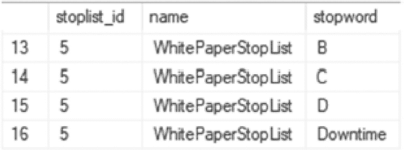
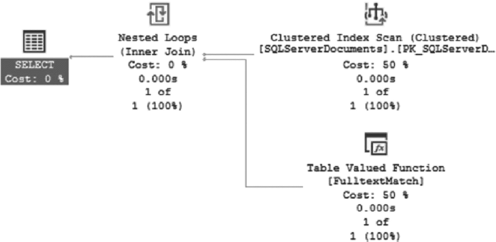
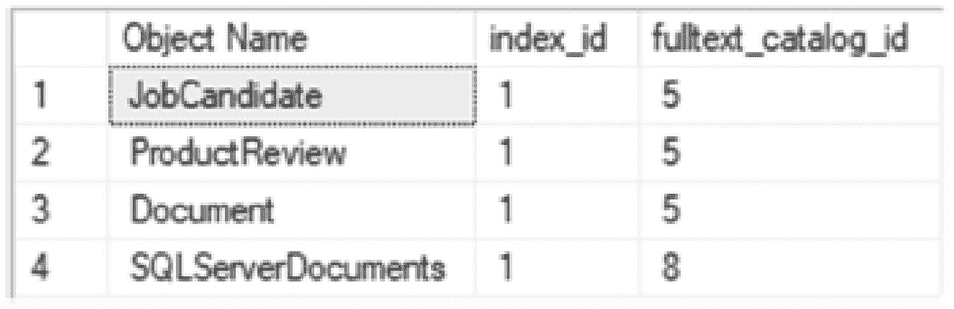

# 9. 全文索引

SQL Server 支持用于存储大量非结构化文本信息的机制。自 SQL Server 2008 起，其中一种机制便是与可变长度字符数据类型 `VARCHAR` 和 `NVARCHAR` 一起使用的 `MAX` 长度。这意味着你可以在单个列中存储最多 2 GB 的字符信息。虽然 SQL Server 可以存储此类信息，但非聚集索引的 1,700 字节限制和聚集索引的 900 字节限制使得通过传统方式进行索引成为一个挑战。幸运的是，SQL Server 提供了另一种索引机制用于在这些大型数据类型中进行搜索：全文索引。

## 全文索引

全文索引是 SQL Server 中另一项索引功能，它超出了常规的索引方法和对象。本章将简要描述全文搜索（FTS）的架构、存储和索引，以实现最佳性能。

全文搜索（FTS）允许存储和高效搜索大量基于文本的内容。此内容可以包含许多不同的格式，例如 Word 文档（`.docx`）文件。此类存储位于 BLOB（二进制大对象）列中，而非纯文本数据中。存储和搜索非结构化性质的内容的能力，为数据库管理系统提供了许多技术机遇。

文档留存就是这样一个机遇，它允许以低得多的成本长期存储文档。其搜索能力使得能够针对各种需求查询这些内容。想象一家航运公司，它根据纯文本模板生成了数千份运输单据。为了确保日后能够跟踪货物运输情况，这些文档的留存构成了一个庞大的任务。存储仓库房间的维护需要成本。当需要研究特定货物运输的任务出现时，除非能够自动化，否则完成该任务所需的工时是相当可观的。

如果这家航运公司使用 `FTS` 功能和索引结构，那么文档会被扫描到系统中，系统读取文本后再将其插入 SQL Server 数据库。这允许对特定的账号、运输发票以及日后审查所需的文档中任何独特文本进行全文搜索。可以创建一个类似书籍索引的索引，使查找特定文档变得更快。更进一步，`FTS` 可以在文档本身内部查找特定内容。如果请求是查找由特定货运公司在特定拖车上发送的所有运输文档，`FTS` 功能允许在几分之一的时间内检索到信息，与手动流程或未索引的文本搜索相比。

### 创建全文索引示例

既然已经介绍了 `FTS` 的概念，现在可以讨论索引策略了。全文索引是搜索和查询非结构化文本数据的支柱。这些数据可以是多种数据类型，包括 `char`、`varchar`、`nchar`、`nvarchar`、`xml` 和 `varbinary`。虽然可以使用 `text`、`ntext` 和 `image`，但最好避免使用它们，因为它们在 SQL Server 中已弃用。数据类型 `varchar`、`nvarchar` 和 `varbinary` 分别提供了等效的类型。

在本节关于全文索引的剩余部分，Joseph Sack 的白皮书“Optimizing Your Query Plans with the SQL Server 2014 Cardinality Estimator”的内容已使用清单 9-1 中的脚本插入到示例表中。该文档将用于演示全文索引，可以在联机丛书或从 [`http://bit.ly/1II5UfU`](http://bit.ly/1II5UfU) 下载，并放置在目录 `c:\temp` 中。此外，需要安装全文目录功能才能成功运行本章中的代码。全文目录不是默认安装的功能，因此可能需要先安装它。

注意

对于所有版本的 SQL Server，要在 Microsoft Office 文档上构建全文索引，必须安装筛选器包 IFilter。请从 [`https://support.microsoft.com/en-us/help/945934/how-to-register-microsoft-filter-pack-ifilters-with-sql-server`](https://support.microsoft.com/en-us/help/945934/how-to-register-microsoft-filter-pack-ifilters-with-sql-server) 下载并安装 Microsoft Office Filter Packs。请务必遵循额外的步骤来运行 `sp_fulltext_service` 并重新启动 SQL Server 实例。


#### 创建全文目录

以 AdventureWorks2017 为例，我们将准备一个用于全文搜索的表。使用 `varbinary(max)` 数据类型可以导入大多数文档类型和图像。在代码清单 `9-1` 中，`CREATE TABLE` 和 `INSERT` 语句准备了创建全文搜索索引所需的对象。

```
USE AdventureWorks2017
GO
DROP TABLE IF EXISTS dbo.SQLServerDocuments;
CREATE TABLE dbo.SQLServerDocuments (
SQLServerDocumentsID INT IDENTITY(1, 1),
DocType VARCHAR(6),
DOC VARBINARY(MAX),
CONSTRAINT PK_SQLServerDocuments PRIMARY KEY CLUSTERED
(SQLServerDocumentsID)
);
GO
DECLARE @worddoc VARBINARY(MAX);
SELECT  @worddoc = CAST(bulkcolumn AS VARBINARY(MAX))
FROM    OPENROWSET(BULK 'c:\temp\Optimizing Your Query Plans with the SQL Server 2014 Cardinality Estimator.docx', SINGLE_BLOB) AS x;
INSERT  INTO dbo.SQLServerDocuments
(DocType, DOC)
VALUES  ('docx', @worddoc);
GO
代码清单 9-1
用于全文搜索的 CREATE TABLE 和 INSERT 语句
```

在创建 FTS 索引时，必须首先创建一个全文目录。自 SQL Server 2008 起，目录作为定义包含在数据库中。目录本身是一个虚拟对象，通过消除 I/O 瓶颈极大地提升了性能。一个目录包含所有可搜索的属性。

目录是通向全文索引的桥梁。在开始之前，让我们回顾一下 `CREATE FULLTEXT CATALOG` 的语法，如代码清单 `9-2` 所示。

```
USE AdventureWorks2017
GO
CREATE FULLTEXT CATALOG 
WITH 
AS DEFAULT
AUTHORIZATION 
ACCENT_SENSITIVITY = ;
代码清单 9-2
CREATE FULLTEXT CATALOG 语法
```

创建目录时，应首先考虑的选项是 `AS DEFAULT` 设置。通常，人们在创建全文索引时并未考虑其应归属哪个目录。如果在创建索引时省略了目录指定，则会使用已被设为默认值的目录。

授权和重音敏感性在 `CREATE` 命令中是明确指定的。如果省略授权选项，所有权将归属于 `dbo`。对于 SQL Server 中未声明所有权的大多数对象也是如此。建议分配所有权以进行安全管理并将对象分组到适当的区域。当为所有权指定用户时，必须指定一个用户名，该用户名需符合以下条件之一：
*   运行该语句的用户的名称
*   执行该命令的用户拥有模拟权限的用户的名称
*   数据库所有者或系统管理员

重音敏感性决定目录是重音敏感还是不敏感。例如，在重音不敏感的情况下，“piñata”和“pinata”将被视为同一个词。在创建目录之前，请务必研究是否应启用重音敏感性。如果更改此选项，则必须重建目录上的全文索引。

为了在本白皮书中创建全文目录，请执行代码清单 `9-3` 中的语句。对于此目录，语法将使用默认选项，这些选项将重音敏感性设置为表的排序规则。

```
USE AdventureWorks2017
GO
CREATE FULLTEXT CATALOG WhitePaperCatalog AS DEFAULT;
代码清单 9-3
创建新的全文目录
```

#### 创建全文索引

目录已创建，并且已决定如何处理目录、重音敏感性和所有权后，就可以考虑如何配置和创建全文索引了。其中最关键的决策是键索引的要求。

##### 语法

代码清单 `9-4` 中的语法用于创建全文索引。表 `9-1` 描述了可用的不同选项。

表 9-1
全文索引选项

| 选项名称 | 描述 |
| --- | --- |
| `TYPE COLUMN` | 指定用于存储加载到 BLOB 类型（如 `.doc`、`.pdf` 和 `.xls`）中的文档的文档类型的列的名称。此选项仅适用于 `varbinary`、`varbinary(max)` 和 `image` 数据类型。如果在任何其他数据类型上指定此选项，`CREATE FULLTEXT INDEX` 语句将引发错误。 |
| `LANGUAGE` | 更改用于索引的默认语言，具有以下变体和选项：• 可以将语言指定为字符串、整数或十六进制。• 如果指定了语言，则在使用索引运行查询时将使用该语言。• 当语言指定为字符串值时，`syslanguages` 系统表必须与该语言相对应。• 如果使用双字节值，则在创建时将其转换为十六进制。• 必须启用特定语言的断字器和词干分析器，否则将生成 SQL Server 错误。• 包含多种语言的非 BLOB 和非 XML 列应遵循 0 `×` 0 中性语言设置。• 对于 BLOB 和 XML 类型，将使用文档本身中的语言类型。例如，语言类型为俄语或 LCID 为 1049 的 Word 文档将强制在索引中使用相同的设置。使用 `sys.fulltext_languages` 查看所有可用的语言类型和 LCID 编码。 |
| `KEY INDEX` | 每个全文索引都需要指定一个相邻的唯一、单键、非空列。使用此选项在同一个表中指定该列。 |
| `FULLTEXT_CATALOG_NAME` | 如果全文索引不使用默认目录创建，请使用此选项指定目录名称。 |
| `CHANGE_TRACKING` | 确定索引的填充方式和时间。选项为 `MANUAL`、`AUTO` 和 `OFF [NO_POPULATION]`。`MANUAL` 设置需要在填充索引前执行 `ALTER FULLTEXT INDEX ... START UPDATE POPULATION`。`AUTO` 设置在创建时填充索引，并根据后续进行的更改自动更新。如果在 `CREATE` 语句中省略了 `CHANGE_TRACKING`，则此为默认设置。`OFF [NO_POPULATION]` 设置用于完全关闭索引的填充，并且 SQL Server 将不保留更改列表。除非指定了 `NO_POPULATION`，否则索引在创建时会被填充一次。 |
| `STOPLIST` | 指定一个停用词列表，以阻止某些词被索引。可用选项为 `OFF`、`SYSTEM` 和一个自定义停用词列表。`OFF` 设置将不使用停用词列表，并会增加填充索引的性能开销。`SYSTEM` 是已创建的默认停用词列表。用户创建的停用词列表是已创建的、可与给定全文索引关联使用的停用词列表。 |
| `SEARCH PROPERTY LIST` | 指定要与全文索引关联的搜索属性列表。属性列表允许对文档属性（如标题或标签）之间的搜索进行区分，从而提供对全文搜索的更精细控制。 |

```
USE AdventureWorks2017
GO
CREATE FULLTEXT INDEX ON 
()
KEY INDEX 
ON 
WITH 
CHANGE_TRACKING = ;
代码清单 9-4
CREATE FULLTEXT INDEX 语法
```

在大多数其他 `CREATE INDEX` 语句中，基本语法和选项相似，只有细微修改。而对于 FTS 索引创建，则有一套完全不同的选项和考虑因素。最初的 `CREATE FULLTEXT INDEX` 与任何 `CREATE INDEX` 相同，需要指定表以及要索引的列。之后，其他选项就不是普通索引创建中常见的了。


### 全文索引关键配置

#### 键索引

选择键索引是一个相对直接的选择，因为键索引必须是唯一的、单键的且非空的列。主键通常很适合这个任务，如清单 9-1 中 `dbo.SQLServerDocuments` 表所示。然而，应考虑键的大小。理想情况下，推荐使用 6 字节的键，并证明其能最大程度减少 I/O 和 CPU 资源消耗的开销。回顾一下，唯一键的限制之一是其长度不能超过 900 字节。如果达到这个最大限制，填充将会失败。解决此问题可能需要强制创建新索引并修改表本身。对于高使用率的表，这可能会造成昂贵的停机时间。

#### 填充

在创建全文索引时，应仔细权衡全文索引的更改跟踪方式。默认的 `AUTO` 设置可能会在被索引列内容频繁更改时产生影响性能的额外开销。例如，一个存储每月只插入一次且永不更改的货运发票的系统，可能不会受益于 `AUTO` 设置。可以使用 SQL Server Agent 在指定时间运行 `MANUAL` 填充，这取决于表中内容的加载情况。虽然不常见，但有些系统是静态的，只加载一次。这将是使用 `OFF` 设置的理想情况，仅在当时执行初始填充。

填充的最后一个选项是增量填充。增量填充的概念与数据的增量更新相同。随着数据的更改，这些更改会被跟踪。可以将合并复制作为比较。合并复制通过使用触发器以及将插入/更新/删除跟踪行写入合并系统表来保留更改。在给定时间点，数据库管理员可以设置同步计划来处理这些更改并将其复制到订阅者。增量填充的工作方式与此相同。通过在表中使用 `timestamp` 列，可以跟踪更改。只有发现需要更改的行才会被处理。这意味着必须满足表上存在 `timestamp` 列的要求才能执行增量填充。对于更改极其频繁的数据，这可能不是理想的选择。然而，对于随机且很少更改的数据，增量填充可能是理想的。

#### 停止列表

停止列表在管理不进行填充的内容方面极其有用。这可以通过绕过所谓的“干扰词”来提高填充性能。例如，考虑句子 “A dog chewed through the fiber going to the SAN causing the disaster recovery plans to be used for the SQL Server instance.” 在这个句子中，最应该被索引的有用词是 `fiber`、`SAN`、`disaster`、`recovery`、`SQL` 或 `Server`。而 `A`、`the`、`to` 和 `be` 则不是理想的索引词。这些词被认为是干扰词，不属于填充过程的一部分。人们很少搜索介词、副词或其他用于连接想法而非构成想法本身的词语。

使用停止列表对整体填充性能和解析全文索引内容非常有帮助。停止列表的使用也可以特定于语言。例如，法语中的 `la` 会优先于英语中的 `the` 被指定。

要创建自定义停止列表，请使用 `CREATE FULLTEXT STOPLIST` 语句，如清单 9-5 所示。可以使用系统默认的停止列表来预生成所有已被识别为干扰词的词。对于本文档示例，停止列表的名称将是 `WhitePaperStopList`。

```sql
USE AdventureWorks2017
GO
CREATE FULLTEXT STOPLIST WhitePaperStopList FROM SYSTEM STOPLIST;
Listing 9-5
Creating a Full-Text StopList
```

要查看停止列表，请使用系统视图 `sys.fulltext_stoplists` 和 `sys.fulltext_stopwords`。`sys.fulltext_stoplists` 视图将保存与在 SQL Server 实例上创建的停止列表相关的元数据。确定 `stoplist_id` 以连接到 `sys.fulltext_stopwords` 来显示完整的词列表。单独来看，此停止列表并不比系统默认停止列表更好。要向停止列表添加词，请使用 `ALTER FULLTEXT STOPLIST` 语句，如清单 9-6 所示，该语句移除了 `Downtime` 一词作为待索引词。

```sql
USE AdventureWorks2017
GO
ALTER FULLTEXT STOPLIST WhitePaperStopList ADD 'Downtime' LANGUAGE 1033;
Listing 9-6
Modifying a Full-Text StopList
```

要查看停止列表中的词，请运行清单 9-7 所示的查询。

```sql
USE AdventureWorks2017
GO
SELECT  lists.stoplist_id,
        lists.name,
        words.stopword
FROM    sys.fulltext_stoplists AS lists
INNER JOIN    sys.fulltext_stopwords AS words
    ON lists.stoplist_id = words.stoplist_id
WHERE   words.language = 'English'
ORDER BY lists.name;
Listing 9-7
Using sys.fulltext_stoplists to Review StopList Words
```

查询结果如图 9-1 所示；单词 `Downtime` 已成功添加。



一张包含 3 列（stoplist id、name 和 stopword）的表格截图。表格有 4 行，编号从 13 到 16。第 4 行的 stopword 列下显示有条目 "downtime"。

图 9-1
停止列表的查询结果

## 创建和使用全文索引

在目录、停止列表以及清单 9-1 中创建的表上定义的键索引可用之后，可以在该表的 `DOC` 列上创建全文索引。要创建全文索引，请使用 `CREATE FULLTEXT INDEX` 语句（参见清单 9-8）。

```sql
USE AdventureWorks2017
GO
CREATE FULLTEXT INDEX ON dbo.SQLServerDocuments
(
  DOC
  TYPE COLUMN DocType
)
KEY INDEX PK_SQLServerDocuments
ON WhitePaperCatalog
WITH STOPLIST = WhitePaperStopList;
Listing 9-8
CREATE FULLTEXT INDEX Statement
```

一旦索引创建完成，由于没有为 `CHANGE_TRACKING` 添加选项，填充将立即开始。目录状态的监控将在本章后面讨论。根据文档的大小，加载可能需要一段时间，因为默认的 `AUTO` 设置会生效。要查询 `SQLServerDocuments` 表和 `DOC` 列的内容，可以运行 `CONTAINS` 语句来返回特定的词。清单 9-9 展示了此类语句的示例。

```sql
USE AdventureWorks2017
GO
SELECT  ssd.DOC,
        ssd.DocType
FROM    dbo.SQLServerDocuments AS ssd
WHERE   CONTAINS (ssd.DOC, 'statistic');
Listing 9-9
Using CONTAINS to Query for a Specific Word
```

图 9-2 显示了查询的执行计划。



一个包含 4 个组件及其各自成本百分比的流程图：select 和 nested loops 各为 0；Clustered index scan 和 table-valued function 各为 50。

图 9-2
CONTAINS 和全文索引使用的执行计划

通过使用 `CONTAINS`(ssd.DOC,`'statistic')` 进行搜索，图 9-2 中的执行计划显示了在 `FulltextMatch` 上的操作。它还返回文档类型为 `.docx` 的本文档作为此次词搜索的匹配项。


## 全文搜索索引目录视图与属性

SQL Server 提供了大量关于索引的通用信息。性能、配置、使用情况和存储信息均可在目录视图中找到。与其他索引对象一样，全文索引同样需要细致维护并关注其选项设置，以确保它们能持续提升而非阻碍性能。

表 9-2 描述了可用于全文搜索的目录视图。

表 9-2：全文目录视图

| 目录视图名称 | 描述 |
| --- | --- |
| `sys.fulltext_catalogs` | 列出所有全文目录及其高级属性。 |
| `sys.fulltext_document_types` | 返回可用于索引的文档类型完整列表。这些文档类型均已在 SQL Server 实例上注册。 |
| `sys.fulltext_index_column_usages` | |
| `sys.fulltext_index_columns` | 列出所有已索引的列。 |
| `sys.fulltext_index_fragments` | 列出全文索引片段（倒排索引数据的存储）的所有详细信息。 |
| `sys.fulltext_indexes` | 列出每个全文索引及其设置的属性。 |
| `sys.fulltext_languages` | 列出实例上可用于全文索引的所有可用语言。 |
| `sys.fulltext_semantic_language_statistics_database` | 列出已安装的语义语言统计数据库。 |
| `sys.fulltext_semantic_languages` | 列出所有已注册统计模型的语言。 |
| `sys.fulltext_stoplists` | 列出每个已创建的 StopList（停用词列表）。 |
| `sys.fulltext_stopwords` | 列出数据库中的所有 StopWords（停用词）。 |
| `sys.fulltext_system_stopwords` | 列出预加载的系统 StopWords（停用词）。 |

出于信息参考目的，在查看目录、属性和填充状态结果时，可以调用 `FULLTEXTCATALOGPROPERTY` 函数，如代码清单 9-10 所示。

```
USE AdventureWorks2017
GO
FULLTEXTCATALOGPROPERTY ('catalog_name' ,'property')
代码清单 9-10
查询全文索引的属性
```

返回的信息将提供关于目录状态的丰富细节，包括填充状态。`catalog_name` 参数接受任何全文目录，然后可以使用属性列表来返回所需的特定信息。表 9-3 列出了可以传递给该函数的属性。

表 9-3：全文目录属性

| 属性名称 | 描述 |
| --- | --- |
| `AccentSensitivity` | 目录当前的重音敏感性设置。返回 0 表示不敏感，返回 1 表示敏感。 |
| `IndexSize` | 目录的逻辑大小（以 MB 为单位）。 |
| `ItemCount` | 目录中已索引的总项目数。 |
| `LogSize` | 向后兼容属性。返回 0。 |
| `MergeStatus` | 如果正在进行主合并，则返回 1；否则返回 0。 |
| `PopulateCompletionAge` | 自上次索引填充以来经过的时间（以秒为单位），从 1990-01-01 00:00:00 开始计算。如果尚未运行填充，则返回 0。 |
| `PopulateStatus` | `PopulateStatus` 可返回十种不同的值：*0*：空闲。*1*：正在进行完全填充。*2*：已暂停。*3*：填充已被节流。*4*：填充正在恢复。*5*：状态已关闭。*6*：正在进行增量填充。*7*：状态当前正在构建索引。*8*：磁盘已满。*9*：更改跟踪。 |
| `UniqueKeyCount` | 目录中唯一全文索引键的数量。 |
| `ImportStatus` | 当全文目录未在导入时返回 0，正在导入时返回 1。 |

例如，要显示之前使用的 `WhitePaperCatalog` 目录的填充状态，可以使用代码清单 9-11 中的语句。由于索引仅包含单个文档且没有其他查询针对其运行，结果应为 0（空闲）。

```
USE AdventureWorks2017
GO
SELECT FULLTEXTCATALOGPROPERTY('WhitePaperCatalog','PopulateStatus');
代码清单 9-11
使用 FULLTEXTCATALOGPROPERTY 返回目录的填充状态
```

可以通过查询 `sys.fulltext_index_catalog_usages` 来查看目录及其引用的索引。此目录视图返回所有从中引用索引的信息，如代码清单 9-12 所示。

```
USE AdventureWorks2017
GO
SELECT  OBJECT_NAME(ficu.object_id) [对象名称],
        ficu.index_id,
        ficu.fulltext_catalog_id
FROM    sys.fulltext_index_catalog_usages AS ficu;
代码清单 9-12
使用 sys.fulltext_index_catalog_usages
```

图 9-3 展示了结果，显示 `SQLServerDocuments` 正在使用与其自身关联的目录，而 `JobCandidate`、`ProductReview` 和 `Document` 正在使用共享的全文目录。需要注意的是，单个目录可被多个表使用。



图 9-3：sys.fulltext_index_catalog_usages 的结果

要获取所有目录及其当前应用设置的详细信息，可查询 `sys.fulltext_catalogs`。此目录视图有助于确定默认目录以及属性状态指示符，例如显示目录是否正在导入过程中的 `is_importing`。

要详细查看数据库中的全文索引，可以使用视图 `sys.fulltext_indexes` 结合其他目录视图来创建更有意义的结果集。从此目录视图中获取的重要信息包括全文目录名称和属性；更改跟踪属性、爬网类型和状态；以及设置要使用的 StopList。

代码清单 9-13 中的查询返回一个包含所有索引的结果集，其中包括索引的目录和 StopList 信息。

```
USE AdventureWorks2017
GO
SELECT  idx.is_enabled,
        idx.change_tracking_state,
        idx.crawl_type_desc,
        idx.crawl_end_date [上次爬网时间],
        cat.name,
        CASE WHEN cat.is_accent_sensitivity_on = 0 THEN '重音不敏感'
             WHEN cat.is_accent_sensitivity_on = 1 THEN '重音敏感'
        END [重音敏感性],
        lists.name,
        lists.modify_date [StopList 的最后修改日期]
FROM    sys.fulltext_indexes idx
        INNER JOIN sys.fulltext_catalogs cat
            ON idx.fulltext_catalog_id = cat.fulltext_catalog_id
        INNER JOIN sys.fulltext_stoplists lists
            ON idx.stoplist_id = lists.stoplist_id;
代码清单 9-13
使用所有目录视图获取全文索引信息
```

图 9-4 显示了目录视图查询的结果。这在调优全文目录时非常有用。例如，如果索引已过时，可以返回有关其上次更新或爬网时间的详细信息。或者，如果全文索引已通过添加到 StopList 进行调整以消除噪音，了解该更改相对于上次爬网发生的时间有助于识别性能未改善的原因。


图 9-4：全文索引信息的查询结果


### 概述

本章概述了如何创建和查询全文索引。能够对大文档和自由格式文本进行过滤和查询，其重要性不亚于使用传统的结构化索引。通过全文索引，不仅可以检查列的内容，还可以检查列中文件的内容，从而使应用程序能够更好地识别与所提交请求在上下文上匹配的文档和其他工件。

