# 10. 索引的误解与最佳实践

在前几章中，已经介绍了索引及其结构。在接下来的章节中，将讨论构建索引并确保其按预期运行的策略。本章将破除一些常见的误解，同时为创建有效的索引奠定基础。

误解会在尝试构建索引时带来不必要的负担。了解与索引相关的误解可以防止使用适得其反的索引策略。本章讨论的索引误解如下：

*   数据库不需要索引。
*   主键总是聚集的。
*   在线索引操作不会阻塞。
*   任何列都可以在多列索引中进行过滤。
*   聚集索引按物理顺序存储记录。
*   索引总是以相同的顺序输出。
*   填充因子在插入时应用于索引。
*   从堆表中删除会导致无法恢复的空间。
*   每个表都应该是堆表，或者每个表都应该有一个聚集索引。

在审视误解时，也值得一看最佳实践。最佳实践在许多方面看似误解，因为它们是普遍持有的信念。不同之处在于，最佳实践经得起推敲，并且在构建索引时是有用的建议。本章将探讨以下最佳实践：

*   基于当前工作负载进行索引。
*   默认情况下在主键上使用聚集索引。
*   正确设定数据库级别的填充因子。
*   正确设定索引级别的填充因子。
*   如果用于过滤，对唯一键和外键列进行索引。
*   平衡索引数量。

## 索引误解

在构建数据库和索引时遇到的一个问题是处理误解。索引起源于许多不同的地方。有些来自先前版本的 SQL Server 及其工具、功能或限制。其他则来自他人的建议，这些建议基于特定数据库或场景中的条件，但并非普遍适用。

索引误解的麻烦在于，它们混淆了索引策略。在可以构建索引来解决严重性能问题的情况下，误解有时会阻止考虑正确的方法。在接下来的几节中，将讨论一些关于索引的误解，并提供足够的细节来有效地破除它们。

### 误解 1：数据库不需要索引

通常，在开发的应用程序中，会创建一个或多个数据库来存储应用程序的数据。在许多开发过程中，重点是添加新功能，并期望“性能会自行解决”。一个不幸的结果是，许多数据库在开发和部署时没有构建索引，因为人们认为它们不需要。

除此之外，还有一些数据库开发人员认为他们的数据库在某种程度上与其他数据库不同。以下是不时听到的一些原因：

*   “这是一个小数据库，不会有太多数据。”
*   “这只是一个概念验证，不会存在太久。”
*   “这不是一个重要应用，所以性能不关键。”
*   “整个数据库已经可以放入内存；索引只会让它需要更多内存。”
*   “我将只用这个数据库插入数据；永远不会查看结果。”

这些原因中的每一个都很容易反驳。在当今的大数据世界中，即使预期很小的数据库在被采用后也可能开始快速成长。此外，数据库大小的小是相对的，每个人都会以不同的方式定义。一个开发者可能认为 1 GB 很小，而另一个根据其先前经验可能认为 1 TB 很小。任何概念验证或不重要的数据库和应用程序，如果没有人需要或没有人有兴趣为其功能投入资源，就不会被创建。那些提出需求的人很可能期望他们要求的功能能够按预期执行。最后，将数据库放入内存并不意味着它会很快。正如之前讨论的，索引为数据提供了替代访问路径，旨在减少访问数据所需的页面数量。没有这些替代路径，数据访问很可能需要读取和维护内存中表的每一个页面。

任何特定开发者听到的原因可能不完全是这些，但很可能是类似的。围绕这个误解的核心观点是索引不能帮助数据库表现得更好。打破这个借口的最有力方法之一是展示索引在特定场景下的好处。

为了演示，考虑清单 10-1 中的 T-SQL。此代码示例创建了表 `MythOne`。接下来是一个几乎任何应用程序中都类似的查询。在清单 10-2 的查询输出中，显示该查询产生了 1,496 次读取。

```
表 'MythOne'。 扫描计数 1，逻辑读取 1496，物理读取 0，预读 0，
LOB 逻辑读取 0，LOB 物理读取 0，LOB 预读 0。
```
`清单 10-2`
`无索引表的 I/O 统计信息`

```
USE AdventureWorks2017;
GO
SELECT * INTO MythOne
FROM Sales.SalesOrderDetail;
GO
SET STATISTICS IO ON
SET NOCOUNT ON
GO
SELECT SalesOrderID, SalesOrderDetailID, CarrierTrackingNumber, OrderQty, ProductID, SpecialOfferID, UnitPrice, UnitPriceDiscount, LineTotal
FROM MythOne
WHERE CarrierTrackingNumber = '4911-403C-98';
GO
SET STATISTICS IO OFF
GO
```
`清单 10-1`
`无索引的表`

有人可能会争辩说 1,496 次输入/输出（I/O）并不多。考虑到某些数据库的大小和当今世界的数据量，这可能是真的。但查询的 I/O 不应该与世界其他地方的性能相比较；它需要与其潜在的 I/O、应用程序的需求以及部署它的平台进行比较。


改进前一个演示中的查询，就像在 `CarrierTrackingNumber` 列上为表添加索引一样简单。要查看为 `MythOne` 添加索引的效果，请执行代码清单 10-3 中的代码。创建索引后，查询的读取次数从 1,496 次减少到 15 次，如代码清单 10-4 所示。仅通过一个索引，查询的 I/O 就减少了近两个数量级。在这种情况下，索引提供了显著的价值。

```
Table 'MythOne'. Scan count 1, logical reads 15 physical reads 0, read-ahead reads 0, lob logical reads 0, lob physical reads 0, lob read-ahead reads 0.
Listing 10-4
I/O Statistics for the Table with an Index
```

```
USE AdventureWorks2017;
GO
CREATE INDEX IX_CarrierTrackingNumber ON MythOne (CarrierTrackingNumber)
GO
SET STATISTICS IO ON
SET NOCOUNT ON
GO
SELECT SalesOrderID, SalesOrderDetailID, CarrierTrackingNumber, OrderQty, ProductID, SpecialOfferID, UnitPrice, UnitPriceDiscount, LineTotal
FROM MythOne
WHERE CarrierTrackingNumber = '4911-403C-98';
GO
SET STATISTICS IO OFF
GO
Listing 10-3
Adding an Index to MythOne
```

这些示例表明索引能提供切实的好处。如果遇到对在数据库上建立索引感到焦虑的情况，试着剖析出反对的真正原因，并提供一个类似于本节中的例子。在第 13 章中，将讨论可用于确定在数据库中创建哪些索引的策略。

### 迷思 2：主键总是聚集的

下一个相当普遍的迷思是认为主键总是聚集的。虽然在很多情况下确实如此，但不能假设所有主键也都是聚集索引。本书前面已经讨论过，一个表只能有一个聚集索引。如果是在聚集索引建立之后才创建主键，那么主键很可能会被创建为非聚集索引。

为了说明主键的索引行为，将使用一个包含创建两个表的脚本。第一个表名为 `dbo.MythTwo1`，将首先创建；然后在 `RowID` 列上创建主键。对于第二个名为 `dbo.MythTwo2` 的表，脚本将先创建它，并在创建主键之前先建立一个聚集索引。相关代码在代码清单 10-5 中。

```
USE AdventureWorks2017;
GO
CREATE TABLE dbo.MythTwo1
(
RowID int NOT NULL
,Column1 nvarchar(128)
,Column2 nvarchar(128)
);
ALTER TABLE dbo.MythTwo1
ADD CONSTRAINT PK_MythTwo1 PRIMARY KEY (RowID);
GO
CREATE TABLE dbo.MythTwo2
(
RowID int NOT NULL
,Column1 nvarchar(128)
,Column2 nvarchar(128)
);
CREATE CLUSTERED INDEX CL_MythTwo2 ON dbo.MythTwo2 (RowID);
ALTER TABLE dbo.MythTwo2
ADD CONSTRAINT PK_MythTwo2 PRIMARY KEY (RowID);
GO
SELECT OBJECT_NAME(object_id) AS table_name
,name
,index_id
,type
,type_desc
,is_unique
,is_primary_key
FROM sys.indexes
WHERE object_id IN (OBJECT_ID('dbo.MythTwo1'),OBJECT_ID('dbo.MythTwo2'));
Listing 10-5
Two Ways to Create Primary Keys
```

运行代码段后，最终的查询将返回如图 10-1 所示的结果。该图显示，第一个表上的主键 `PK_MythTwo1` 被创建为聚集索引。然后在第二个表上，`PK_MythTwo2` 被创建为非聚集索引。

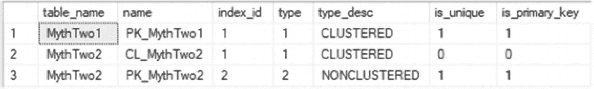

A table has 3 rows and 7 columns labeled table name, name, index i d, type, type description, is unique, and is primary key. The row 1 entry, Myth Two 1 of table name is highlighted.

图 10-1
主键 `sys.indexes` 输出

在创建主键和聚集索引时，记住本节讨论的行为很重要。如果存在需要将它们分离的情况，则需要在聚集索引之后定义主键，或者将其定义为 `NONCLUSTERED` 索引。

主键定义了表中唯一性的真相来源，而聚集索引则为存储目的提供了逻辑排序顺序。理解各自的用例，可以在聚集索引和主键不在同一列上的场景中实现有效的索引。

### 迷思 3：联机索引操作不会阻塞

SQL Server 企业版的优势之一是能够联机建立索引。在联机索引建立期间，正在创建索引的表仍然可用于查询和数据修改。当数据库需要被访问且维护窗口很短或不存在时，此功能非常有用。

关于联机索引重建的一个常见迷思是它们不会引起任何阻塞。像任何迷思一样，这是错误的。使用联机索引操作时，在构建的主要部分，表上会持有一个意向共享锁。在结束时，为了交换进更新的索引，会短暂地持有一个共享锁（用于非聚集索引）或一个架构修改锁（用于聚集索引）。这与离线索引构建不同，后者在整个索引构建期间都会持有共享锁或架构修改锁。

为了观察此行为的实际效果，将创建一个表，并使用扩展事件来监视在创建索引时应用到该表上的锁，包括使用和不使用 `ONLINE` 选项的情况。要开始此演示，请执行代码清单 10-6 中的代码。此脚本创建表 `dbo.MythThree` 并用 1000 万条记录填充它。它返回的最后一项是表的 `object_id`，这是演示后续部分所需要的。对于此示例，`dbo.MythThree` 的 `object_id` 是 624721278。

**注意**
此迷思的所有演示都需要 SQL Server 企业版或开发者版。

```
USE AdventureWorks2017
GO
CREATE TABLE dbo.MythThree
(
RowID int NOT NULL
,Column1 uniqueidentifier
);
WITH L1(z) AS (SELECT 0 UNION ALL SELECT 0)
, L2(z) AS (SELECT 0 FROM L1 a CROSS JOIN L1 b)
, L3(z) AS (SELECT 0 FROM L2 a CROSS JOIN L2 b)
, L4(z) AS (SELECT 0 FROM L3 a CROSS JOIN L3 b)
, L5(z) AS (SELECT 0 FROM L4 a CROSS JOIN L4 b)
, L6(z) AS (SELECT TOP 10000000 0 FROM L5 a CROSS JOIN L5 b)
INSERT INTO dbo.MythThree
SELECT ROW_NUMBER() OVER (ORDER BY z) AS RowID, NEWID()
FROM L6;
GO
SELECT OBJECT_ID('dbo.MythThree')
GO
Listing 10-6
MythThree Table Create Script
```

为了在此场景中监视这些事件，将使用扩展事件来捕获在索引创建期间触发的 `lock_acquired` 和 `lock_released` 事件。在 SSMS 中为代码清单 10-7 和代码清单 10-8 的代码打开新查询窗口。运行前，将代码清单 10-8 中的 `session_id` 更新为代码清单 10-7 中使用的 `session_id`；在此场景中，`session_id` 是 `42`。对 `object_id` 也进行相同的更新。在扩展事件会话开始运行后，可以使用实时视图来监视发生的锁。

```
USE AdventureWorks2017;
GO
IF EXISTS(SELECT * FROM sys.server_event_sessions WHERE name = 'MythThreeXevents')
DROP EVENT SESSION [MythThreeXevents] ON SERVER
GO
CREATE EVENT SESSION [MythThreeXevents] ON SERVER
ADD EVENT sqlserver.lock_acquired(SET collect_database_name=(1)
ACTION(sqlserver.sql_text)
WHERE [sqlserver].[session_id]=(42) AND [object_id]=(624721278)),
ADD EVENT sqlserver.lock_released(
ACTION(sqlserver.sql_text)
WHERE [sqlserver].[session_id]=(42) AND [object_id]=(624721278))
ADD TARGET package0.ring_buffer
GO
ALTER EVENT SESSION [MythThreeXevents] ON SERVER STATE = START
GO
Listing 10-7
Extended Events Session for Lock Acquired and Released
```


在清单 10-8 的示例中，创建了两个索引，一个以 ONLINE 方式构建，另一个使用默认选项（离线）。要查看获取和释放了哪些锁，请在实时查看器中观察锁行为。默认情况下，实时查看器中只显示名称和时间戳。实时查看器允许自定义显示的列。在图 10-2 中，在默认的 `name` 和 `timestamp` 列基础上，添加了 `object_id`、`mode`、`resource_type` 和 `sql_text` 列。要添加其他列，请右键单击列标题并选择“选择列”。

```sql
USE AdventureWorks2017
GO
CREATE INDEX IX_MythThree_ONLINE ON MythThree (Column1) WITH (ONLINE = ON);
GO
CREATE INDEX IX_MythThree ON MythThree (Column1);
GO
```
清单 10-8
在非聚集索引创建时进行联机索引操作

当使用 ONLINE 选项创建索引时，请注意在图 10-2 中，`SCH_S` (`Schema_Shared`) 和 `S` (`Shared`) 锁在毫秒级的时间内被获取和释放。由于这些锁在整个索引创建过程中被获取和释放，其他事务可以继续对该表进行操作。`SCH_S` 锁确保表的架构不发生更改，而 `S` 锁则阻止来自插入、更新和删除操作的页面。因为这些锁的持有时间非常短，它们使得表在整个索引创建过程中保持可用状态。

注意
如果你在扩展事件会话中看不到任何结果，这很可能是由于 `MythThree` 的 `object_id` 与扩展事件会话中跟踪的 `object_id` 不匹配所致。

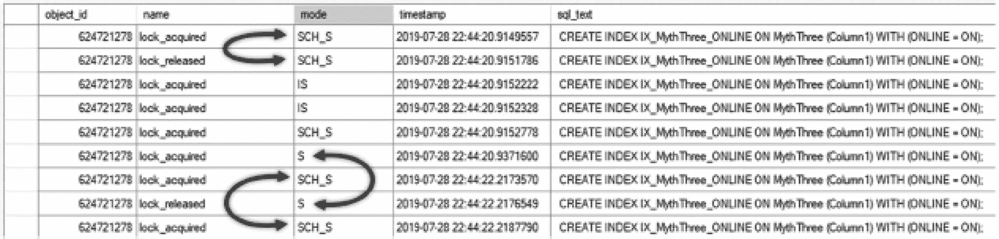

一张表有 5 列，标签为 object id、name、mode、timestamp 和 sql text，共 9 行。三个弯曲的双头箭头分别指向两对 SCH_S、S 和 SCH_S 模式的条目，表示锁的获取和释放。

图 10-2
使用 ONLINE 选项创建索引

对于默认的索引创建（不使用 `ONLINE` 选项），`S` 锁在整个索引构建期间都保持。如图 10-3 所示，`S` 锁在 `SCH_S` 锁之前被获取，并且直到索引构建完成后才释放。结果是在索引构建期间索引不可用。

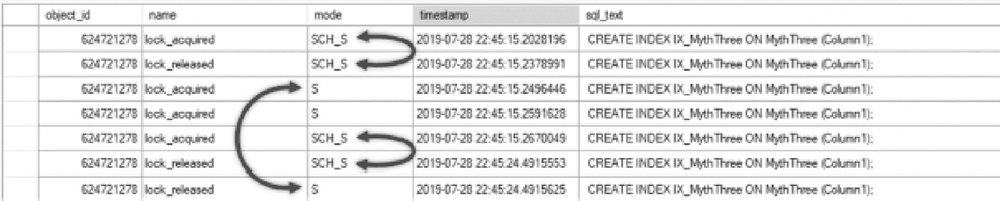

一张表有 5 列，标签为 object id、name、mode、timestamp 和 sql text，共 7 行。三个弯曲的双头箭头分别指向两对 SCH_S、S（其变量间距更大）和 SCH_S 模式的条目，表示锁的获取和释放。

图 10-3
不使用 ONLINE 选项创建索引

### 误区 4：在多列索引中，任何列都可以被过滤

关于索引的下一个常见误区是，无论列在索引中的位置如何，索引都可以在有序搜索中使用该列来过滤表中的数据。与本章到目前为止讨论的其他误区一样，这个也是不正确的。索引不一定需要使用索引中的所有列。但是，在执行有序搜索时，它需要从索引中最左边的列开始，并按从左到右的顺序使用索引中的列。这就是为什么索引中列的顺序至关重要。

为了演示这个误区，将展示几个例子，如清单 10-9 所示。在脚本中，基于 `Sales.SalesOrderHeader` 创建一个表，其主键为 `SalesOrderID`。为了测试通过多列索引搜索所有列的误区，创建了一个包含 `OrderDate`、`DueDate` 和 `ShipDate` 列的索引。

```sql
USE AdventureWorks2017
GO
IF OBJECT_ID('dbo.MythFour') IS NOT NULL
DROP TABLE dbo.MythFour
GO
SELECT SalesOrderID, OrderDate, DueDate, ShipDate
INTO dbo.MythFour
FROM Sales.SalesOrderHeader;
GO
ALTER TABLE dbo.MythFour
ADD CONSTRAINT PK_MythFour PRIMARY KEY CLUSTERED (SalesOrderID);
GO
CREATE NONCLUSTERED INDEX IX_MythFour ON dbo.MythFour (OrderDate, DueDate, ShipDate);
GO
```
清单 10-9
多列索引误区

测试对象就位后，接下来要观察的是可能使用该非聚集索引的查询行为。首先，将测试一个使用索引中最左列的查询。清单 10-10 给出了该代码。如图 10-4 所示，通过对最左列进行筛选，查询在 `IX_MythFour` 上使用了 seek 操作。

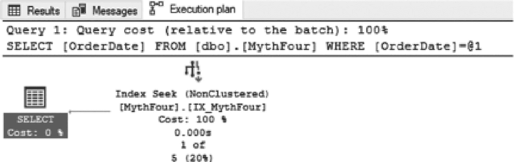

一个打开的执行计划选项卡面板包含 2 行关于 order date 的文本，位于查询 1 下，查询成本（相对于批处理）为 100%。下方是一个流程图，将 index seek, nonclustered, myth four（成本 100%）连接到 select（成本 0%）。

图 10-4
在索引的最左列上过滤时的执行计划

```sql
USE AdventureWorks2017
GO
SELECT OrderDate FROM dbo.MythFour
WHERE OrderDate = '2011-07-17 00:00:00.000'
```
清单 10-10
在索引的最左列上过滤的查询

接下来，考虑当过滤其他索引键列时会发生什么。在清单 10-11 中，查询在索引的最右列上过滤结果。该查询的执行计划如图 10-5 所示，在 `IX_MythFour` 上使用了 scan 操作。查询无法直接定位到匹配 `OrderDate` 的记录，而是需要检查所有记录以确定哪些匹配过滤条件。虽然使用了索引，但它无法根据索引内的排序来过滤行。

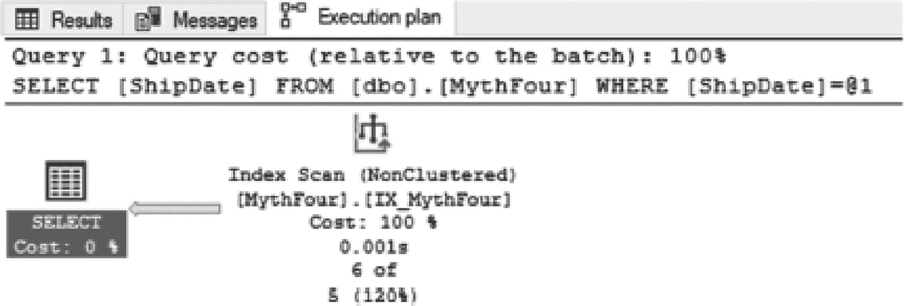

一个打开的执行计划选项卡面板包含 2 行关于 ship date 的文本，位于查询 1 下，查询成本（相对于批处理）为 100%。下方是一个流程图，将 index scan, nonclustered, myth four（成本 100%）连接到 select（成本 0%）。

图 10-5
在索引的最右列上过滤时的执行计划

```sql
USE AdventureWorks2017
GO
SELECT ShipDate FROM dbo.MythFour
WHERE ShipDate = '2011-07-17 00:00:00.000'
```
清单 10-11
在索引的最右列上过滤的查询


这些示例已经表明，最左列可用于过滤，而对最右列进行过滤时虽能使用索引，但无法通过查找操作来最优地使用索引。最后的验证是检查索引中既不位于左侧也不位于右侧的列的行为。

在清单 10-12 中，包含了一个使用索引 `IX_MythFour` 中间列的查询。与之前的示例一样，图 10-6 显示的针对中间列查询的执行计划虽然使用了索引，但也使用了扫描操作。该查询能够使用索引，但由于无法对索引应用有序过滤器，因此无法以最优方式执行。

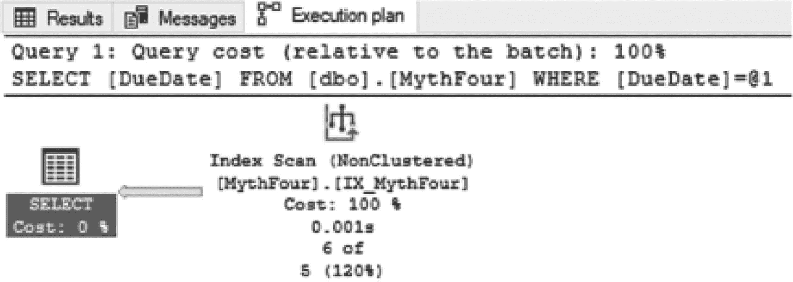

一个已打开的执行计划选项卡面板，在查询 1 下包含 2 行关于到期日的文本，其查询成本（相对于批处理）为 100%。下方是一个流程图，将索引扫描（非聚集，myth four，成本 100%）连接到选择操作（成本 0%）。

**图 10-6**

索引中间列的执行计划

```sql
USE AdventureWorks2017
GO
SELECT DueDate FROM dbo.MythFour
WHERE DueDate = '2011-07-17 00:00:00.000'
```

**清单 10-12**

使用索引中中间列的查询

关于多列索引中的列如何被使用的迷思有时可能令人困惑。正如这些示例所示，无论过滤索引的哪一列，查询都可以读取索引，但无法像这样有效地使用索引。要实现这一目标，过滤必须从索引最左侧的列开始。当这不是典型的使用场景时，要么重新排序索引的列，要么在它们对数据库性能至关重要时创建额外的索引。

### 迷思 5：聚集索引按物理顺序存储记录

一个更为普遍存在的迷思是认为聚集索引在磁盘上按物理顺序存储表中的记录。这个迷思似乎主要是由于混淆了存储在页面上的内容与记录在这些页面上的存储位置而产生的。正如第 2 章所讨论的，数据页和记录之间是有区别的。下面将提供一个演示来消除这个迷思。

要开始此示例，请执行清单 10-13 中的代码。此代码将创建一个名为 `dbo.MythFive` 的表。然后，它将向该表添加三条记录。脚本的最后部分将使用 `sys.dm_db_database_page_allocations` 输出该表的页面位置。在此示例中，插入到 `dbo.MythFive` 中的记录所在的页面是页面 59624，如图 10-7 所示。

> **注意**
>
> 动态管理函数 `sys.dm_db_database_page_allocations` 是 `DBCC IND` 的替代品。此函数在 SQL Server 2012 中引入，与之前的 DBCC 命令相比，它提供了一个改进的接口来检查数据库中对象的页面分配。

```sql
USE AdventureWorks2017
GO
IF OBJECT_ID('dbo.MythFive') IS NOT NULL
DROP TABLE dbo.MythFive
CREATE TABLE dbo.MythFive
(
RowID int PRIMARY KEY CLUSTERED
,TestValue varchar(20) NOT NULL
);
GO
INSERT INTO dbo.MythFive (RowID, TestValue) VALUES (1, 'FirstRecordAdded');
INSERT INTO dbo.MythFive (RowID, TestValue) VALUES (3, 'SecondRecordAdded');
INSERT INTO dbo.MythFive (RowID, TestValue) VALUES (2, 'ThirdRecordAdded');
GO
SELECT database_id, object_id, index_id, extent_page_id, allocated_page_page_id, page_type_desc
FROM sys.dm_db_database_page_allocations(DB_ID(), OBJECT_ID('dbo.MythFive'), 1, NULL, 'DETAILED')
WHERE page_type_desc IS NOT NULL
GO
```

**清单 10-13**

创建并填充 `MythFive` 表

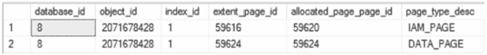

一个表格有 6 列，分别标记为 database i d、object i d、index i d、extent page i d、allocated page page i d 和 page type description，以及 2 行，标记为 1 和 2。

**图 10-7**

`sys.dm_db_database_page_allocations` 的输出

消除这一迷思的证据可以通过 `DBCC PAGE` 命令揭示出来。为此，请使用清单 10-13 中识别的、`page_type_desc` 为 `DATA_PAGE` 的 `PagePID`。由于此表只有一个数据页，数据将位于该页上。（有关 DBCC 命令的更多信息，请参见第 2 章。）

在此示例中，清单 10-14 显示了直接查看表中数据所需的 T-SQL。此命令输出大量信息，其中包括一些在此示例中无用的头信息。需要的部分在末尾，即页面的内存转储，如图 10-8 所示。在内存转储中，记录按其放置在页面上的顺序显示。如从最右列读取的转储所示，记录是按照它们添加到表中的顺序排列的，而不是它们在聚集索引中出现的顺序。

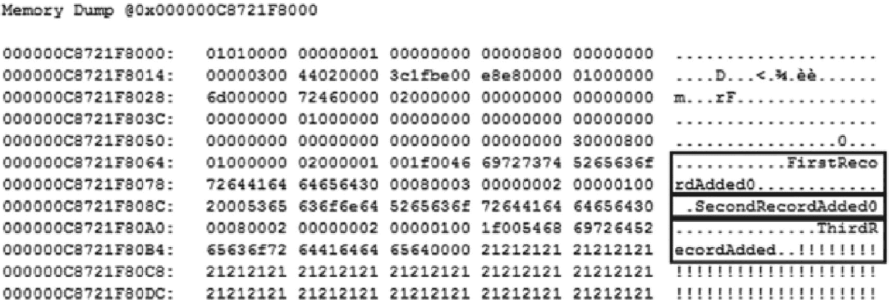

内存转储下的输出展示了一个有 6 列和 12 行条目的表格中的各种数字序列。最后几列中，标记为 first record added 0 的第六和第七行、second record added 0 的第八行以及 third record added 的第九和第十行的条目被高亮显示。

**图 10-8**

`DBCC PAGE` 输出的页面内容部分

```sql
DBCC TRACEON (3604);
GO
DBCC PAGE (AdventureWorks2017, 1, 59624, 2);
GO
```

**清单 10-14**

查看 `MythFive` 表中的数据

基于此证据，很容易辨别聚集索引并不按索引的物理顺序存储记录。如果扩展此示例，将会明显看出页面是按物理顺序排列的，但页面上的行则不是。


### 误区六：索引总是以相同顺序输出行

关于索引，一个比较常见的误区是它们保证了查询结果的输出顺序。这是不正确的，更糟糕的是，它为编写不准确的查询提供了无效的依据。正如本书前面所述，索引的目的是为数据提供高效的访问路径。这个目的并不能保证数据返回的顺序。这个误区的麻烦之处在于，在类似条件下执行查询时，SQL Server 通常会*看似*维持了顺序，但当这些条件改变时，执行计划就会变化，结果会按照数据处理的顺序返回，而不是最终用户所期望的顺序。

为了探究这个误区，有必要看看在使用聚集索引的查询上，条件如何变化。在清单 10-15 中，有一个查询被执行了两次，针对 `Sales.SalesOrderHeader` 和 `Sales.SalesOrderDetail` 表执行一个简单的聚合。这种查询可能会出现在 SQL Server 的多种查询类型中。

```sql
USE AdventureWorks2017
GO
SELECT soh.SalesOrderID, COUNT(*) AS DetailRows
FROM Sales.SalesOrderHeader soh
INNER JOIN Sales.SalesOrderDetail sod ON soh.SalesOrderID = sod.SalesOrderID
GROUP BY soh.SalesOrderID;
GO
DBCC FREEPROCCACHE
DBCC SETCPUWEIGHT(1000)
GO
SELECT soh.SalesOrderID, COUNT(*) AS DetailRows
FROM Sales.SalesOrderHeader soh
INNER JOIN Sales.SalesOrderDetail sod ON soh.SalesOrderID = sod.SalesOrderID
GROUP BY soh.SalesOrderID;
GO
DBCC FREEPROCCACHE
DBCC SETCPUWEIGHT(1)
GO
```
清单 10-15
使用聚集索引时的无序结果

这两个查询的执行条件略有不同。第一个查询运行在标准的 SQL Server 成本模型下，生成一个执行计划，执行两次索引扫描和一次流聚合来返回结果，如图 10-9 所示。该查询的结果如图 10-10 所示，这支持了如果用户希望按 `SaleOrderID` 列排序，SQL Server 就会按期望的输出顺序返回数据的观点。

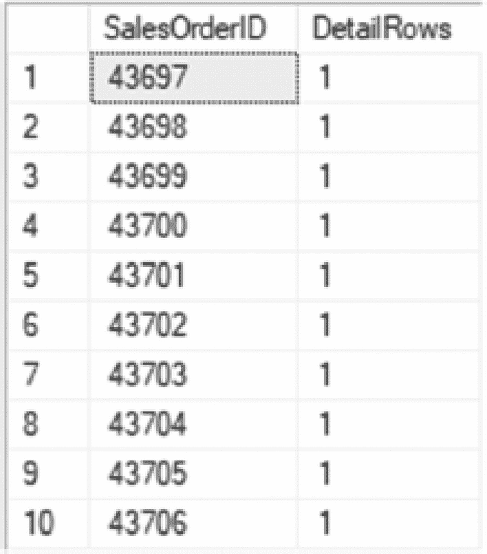

一个包含两列（标记为 sales order i d 和 detail rows）和 10 行（标记为 1 到 10）的表格。第一行第一列的条目 43697 被高亮显示，而第二列的所有条目均为 1。

图 10-10
默认聚合执行计划的结果

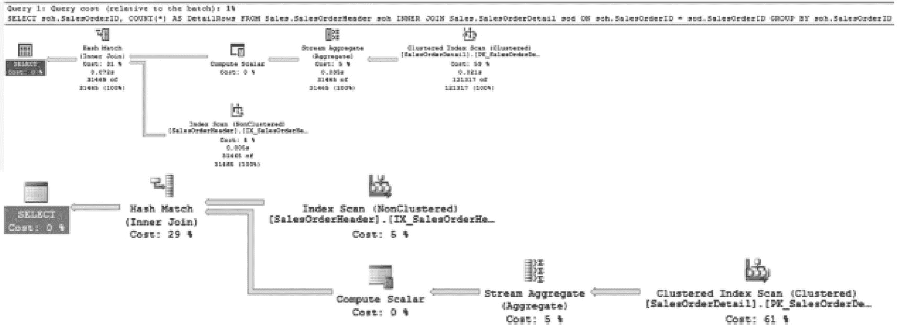

一个面板，显示查询 1 下与销售订单相关的两行文本项，查询成本相对于批处理为 1%。下方是两个流程图，展示了从成本较高的聚集索引扫描到成本均为 0% 的标记为 select 的终点的路径。

图 10-9
默认聚合执行计划

但是，如果 SQL Server 的条件发生了变化，而期望的业务规则没有变，会发生什么？在清单 10-15 中执行的第二个查询是同一个查询，但条件发生了变化。在这个例子中，利用 `DBCC` 命令 `SETCPUWEIGHT` 来改变执行计划的成本。这种成本变化导致使用了并行执行计划，如图 10-11 所示。并行计划的一个副作用是查询结果的返回顺序发生了变化，如图 10-12 所示。虽然结果看起来仍然是有序的，查询的逻辑也没有改变，但返回的第一条记录是不同的。这是因为其中一个并行线程比其他线程更快地返回了结果。

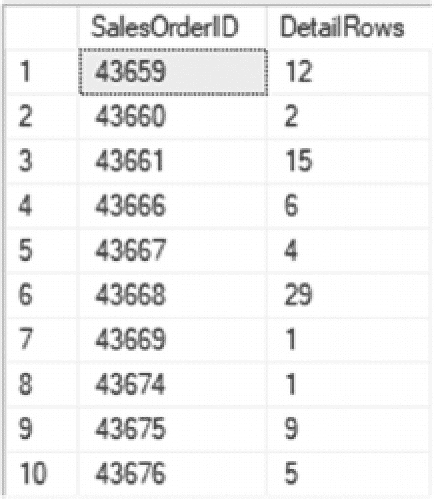

一个包含 10 行和两列（标记为 sales order i d 和 detail rows）的表格。第一行第一列的条目 43659 被高亮显示。

图 10-12
使用并行的聚合执行计划结果

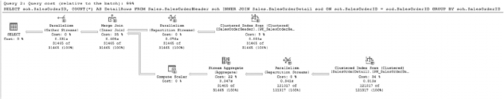

一个面板，显示查询 1 下与销售订单相关的两行文本项，查询成本相对于批处理难以辨别。下方是一个流程图，展示了从成本较高的聚集索引扫描到成本为 0% 的标记为 select 的终点的两条路径。

图 10-11
使用并行的聚合执行计划

**警告**

切勿在生产代码中使用 `DBCC SETCPUWEIGHT` 来控制并行性或出于任何其他原因。此 `DBCC` 命令仅严格用于在 SQL Server 中控制环境变量以测试和验证执行计划。

需要考虑的第二个条件是当查询的业务规则发生变化时。例如，也许一组结果最初没有被过滤，但在应用程序更改后，查询可能会改用不同的索引集。这也可能导致结果顺序的变化，例如当查询从使用聚集索引更改为使用非聚集索引时。

为了演示这种行为变化，请执行清单 10-16 中的代码。此代码运行两个查询。两个查询都返回 `SalesOrderID`、`CustomerID` 和 `Status`。出于本例的目的，业务规则规定结果必须按 `SalesOrderID` 排序。在这种情况下，第一个查询的结果如业务规则所述进行排序，显示在图 10-13 的顶部。但在第二个查询中，当逻辑更改为通过添加筛选器来请求更少的行时，结果不再有序，显示在图 10-13 的底部。变化的原因来自于 SQL Server 用于执行查询的索引发生了变化。索引的变化驱动了结果的处理方式，以及它们按照这些索引排序数据的方式进行排序。

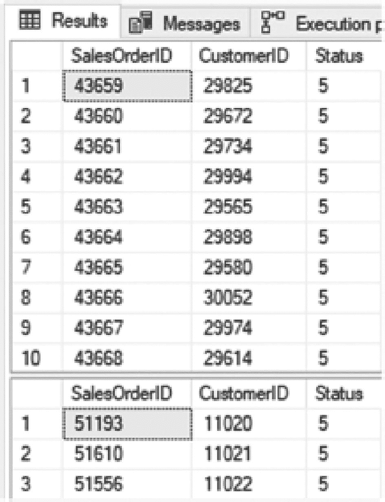

“结果”选项卡下的两个表格，分别包含 3 列（标记为 sales order i d, customer i d, 和 status）和可观察到的 10 行与 3 行。两个表格中第一列的第一条目，即 43659 和 51193，被高亮显示。

图 10-13
演示筛选对排序影响的查询结果

```sql
USE AdventureWorks2017
GO
SELECT SalesOrderID, CustomerID, Status
FROM Sales.SalesOrderHeader soh
GO
SELECT SalesOrderID, CustomerID, Status
FROM Sales.SalesOrderHeader soh
WHERE CustomerID IN (11020, 11021, 11022)
GO
```
清单 10-16
使用非聚集索引时的无序结果

在这些例子中，我们回顾了几种不同的 SQL Server 条件可能改变查询结果返回方式的情景。虽然这次索引可能提供了按期望顺序排列的查询结果，但并不能保证这种情况不会改变。重要的是不要依赖索引来强制排序。如果结果集需要有序，请始终使用 `ORDER BY` 子句来确保对给定的结果集应用正确的顺序。

### 误区 7：填充因子会在插入数据时应用于索引

当为索引设置填充因子时，它会在索引被创建、重建或重组时应用。不幸的是，关于这个误区，常有人误以为填充因子会在记录插入表时生效。本节将探讨并证实这种观点是不正确的。

为了拆解这个误区，我们将直接检验其前提。该误区认为，如果在向表中添加行时指定了填充因子，那么插入操作过程中就会使用该填充因子。为了破除这部分误解，请执行清单 10-17 中的代码。在此脚本中，创建了一个名为 `dbo.MythSeven` 的表，其聚集索引的填充因子设为 50%。这意味着索引中每个数据页应留出 50% 的空闲空间。表创建后，会向其中插入记录。最后，使用 `sys.dm_db_index_physical_stats` DMV 检查每个数据页的平均可用空间。查看脚本的结果，如图 10-14 所示，索引实际使用了每个数据页 95% 的空间，而非创建聚集索引时指定的 50%。

```
USE AdventureWorks2017
GO
IF OBJECT_ID('dbo.MythSeven') IS NOT NULL
DROP TABLE dbo.MythSeven;
GO
CREATE TABLE dbo.MythSeven
(
RowID int NOT NULL
,Column1 varchar(500)
);
GO
ALTER TABLE dbo.MythSeven ADD CONSTRAINT
PK_MythSeven PRIMARY KEY CLUSTERED (RowID) WITH(FILLFACTOR = 50);
GO
WITH L1(z) AS (SELECT 0 UNION ALL SELECT 0)
, L2(z) AS (SELECT 0 FROM L1 a CROSS JOIN L1 b)
, L3(z) AS (SELECT 0 FROM L2 a CROSS JOIN L2 b)
, L4(z) AS (SELECT 0 FROM L3 a CROSS JOIN L3 b)
, L5(z) AS (SELECT 0 FROM L4 a CROSS JOIN L4 b)
, L6(z) AS (SELECT TOP 1000 0 FROM L5 a CROSS JOIN L5 b)
INSERT INTO dbo.MythSeven
SELECT ROW_NUMBER() OVER (ORDER BY z) AS RowID, REPLICATE('X', 500)
FROM L6;
GO
SELECT object_id, index_id, avg_page_space_used_in_percent
FROM sys.dm_db_index_physical_stats(DB_ID(),OBJECT_ID('dbo.MythSeven'),NULL,NULL,'DETAILED')
WHERE index_level = 0;
```
清单 10-17：创建并填充 MythSeven 表

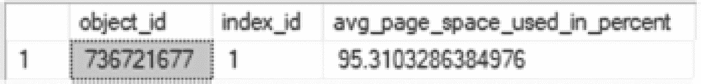
图 10-14：插入数据时的填充因子误区

有时，当这个误区被澄清后，人们的观念又会走向另一个极端，认为填充因子是损坏的或不起作用的。这同样不正确。填充因子并非在数据修改期间应用于索引。它是在索引被创建、重建或重组时应用的。为了证明这一点，可以使用清单 10-18 中包含的脚本来重建 `dbo.MythSeven` 上的聚集索引。

```
USE AdventureWorks2017
GO
ALTER INDEX PK_MythSeven ON dbo.MythSeven REBUILD
SELECT object_id, index_id, avg_page_space_used_in_percent
FROM sys.dm_db_index_physical_stats(DB_ID(),OBJECT_ID('dbo.MythSeven'),NULL,NULL,'DETAILED')
WHERE index_level = 0
```
清单 10-18：重建 MythSeven 表上的聚集索引

重建聚集索引后，索引将具有指定的填充因子，或至少接近指定的值，如图 10-15 所示。重建后，表上的平均空间使用率从 95% 变为了 51%。这一变化与为索引指定的填充因子是一致的。


图 10-15：索引重建后的填充因子误区

关于填充因子，围绕这一索引属性存在许多误区。理解填充因子的关键在于记住它何时以及如何被应用。它不是在索引使用过程中强制实施的属性。相反，它是一个在索引创建或重建时，用于安排索引内数据分布的属性。


### 误区 8：从堆中删除数据会导致空间无法恢复

堆是 SQL Server 中一种有趣的结构。在第二章中，曾简要提及它更像是一组用于存储数据的页面集合，而非严格意义上的索引。下一章将涉及的一项索引维护任务是从堆表中回收空间。正如将在下一章深入讨论的，当行从堆中删除时，与这些行关联的页面并不会被移除。这通常被称为堆内的 `bloat`（膨胀）。

关于堆膨胀概念的一个有趣的副作用是，人们误以为膨胀的空间永远不会被重用。这种空间会一直保留在堆中，除非重建堆，否则无法回收。幸运的是，对于堆和数据库管理员来说，情况并非如此。当数据从堆中移除后，该数据原先占用的空间会被释放，可供表未来的插入操作使用。

为了演示其工作原理，我们将使用清单 10-19 中的代码构建一个表。此演示创建一个名为 `MythEight` 的堆，并插入 400 条记录，这产生了 100 个数据页。此页数可以通过图 10-16 中第一个结果集的 `page_count` 列进行验证。脚本的下一部分会删除先前插入堆中的每隔一行。通常，这应使每页保留的行数减半，如图 10-16 中第二个结果集所示。脚本的最后一部分向 `MythEight` 表插入 200 行，使行数恢复到 400 条，并重用了那些先前已被删除数据的页面。图 10-16 最后一个结果集中页数略有增长，但大多数新行都适应了已分配的空间。

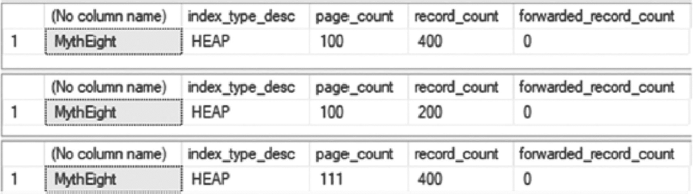
*三个表，每表 5 列，列名分别为：无列名、索引类型描述、页数、记录数、转发记录数，以及一行标记为 1。这三个表在第一、第二和第五列下有相同的值（MythEight 被高亮显示、HEAP、0），但在第三列和第四列下的条目不同。*

图 10-16 堆重用查询结果

```
USE AdventureWorks2017
GO
IF OBJECT_ID('dbo.MythEight') IS NOT NULL
DROP TABLE dbo.MythEight;
CREATE TABLE dbo.MythEight
(
RowId INT IDENTITY(1,1)
,FillerData VARCHAR(2500)
);
INSERT INTO dbo.MythEight (FillerData)
SELECT TOP 400 REPLICATE('X',2000)
FROM sys.objects;
SELECT OBJECT_NAME(object_id), index_type_desc, page_count, record_count, forwarded_record_count
FROM sys.dm_db_index_physical_stats (DB_ID(), OBJECT_ID('dbo.MythEight'), NULL, NULL, 'DETAILED');
DELETE FROM dbo.MythEight
WHERE RowId % 2 = 0;
SELECT OBJECT_NAME(object_id), index_type_desc, page_count, record_count, forwarded_record_count
FROM sys.dm_db_index_physical_stats (DB_ID(), OBJECT_ID('dbo.MythEight'), NULL, NULL, 'DETAILED');
INSERT INTO dbo.MythEight (FillerData)
SELECT TOP 200 REPLICATE('X',2000)
FROM sys.objects;
SELECT OBJECT_NAME(object_id), index_type_desc, page_count, record_count, forwarded_record_count
FROM sys.dm_db_index_physical_stats (DB_ID(), OBJECT_ID('dbo.MythEight'), NULL, NULL, 'DETAILED');
```
清单 10-19 重用 `MythEight` 堆中已分配的空间

正如该误区的演示所示，堆中先前保存数据的空间会被释放，供表重新使用。对于有大量数据持续写入的堆，没有必要特别监控页面重用的情况，因此该误区可以被认为是不准确的。而对于那些删除了大量数据且无意替换的堆，可以使用 `ALTER TABLE ... REBUILD` 来回收空间。该语句的语法和影响将在下一章讨论。

### 误区 9：每个表都应该使用堆/聚集索引

最后一个误区涉及两个方面。一方面，有些人会建议所有表都应该建为堆。另一方面，另一些人则会建议在所有表上创建聚集索引。问题在于，这种观点忽略了每种结构为表带来的潜在益处。它脱离了实际存储的数据及其使用方式，仅仅围绕数据库中数据存储方式，进行一种教条式的争论。

反对使用聚集索引的一些论点如下：

*   碎片化通过额外的 I/O 操作对性能产生负面影响。
*   当触发页拆分时，修改单条记录可能会影响聚集索引中的多条记录。
*   过多的键查找会通过额外的 I/O 操作对性能产生负面影响。

当然，也存在一些反对使用堆的常见论点：

*   过多的转发记录会通过额外的 I/O 操作对性能产生负面影响。
*   移除转发记录需要重建整个表。
*   需要非聚集索引来实现高效的筛选数据访问。
*   当数据被移除时，堆不会自动释放页面。

在决定使用聚集索引还是堆时，两者各自的负面影响并非唯一需要考虑的因素。在特定情况下，其中一种的表现会优于另一种。

例如，在以下情况下，聚集索引表现最佳：

*   表具有唯一的、单调递增的键列。
*   查询将访问表中的数据范围。
*   表中的记录将被高速插入和删除。

另一方面，堆在以下一些情况中是理想选择：

*   表中的数据仅会使用有限的时间，其中索引创建时间超过了对数据的查询时间。
*   键值会频繁更改，这反过来会改变记录在索引中的位置。
*   大量记录正在被插入到暂存表中。
*   主键是非升序值，例如唯一标识符。

尽管本节并未包含证明该误区为何错误的演示，但重要的是要记住，堆和聚集索引都是可用的，并且应该被恰当地使用。选择哪种类型的索引是一个测试问题，而不是一个教条问题。

对于那些属于“聚集索引万能派”的人，可以参考《Fast Track Data Warehouse Architecture》白皮书 (`https://msdn.microsoft.com/en-us/library/hh918452.aspx`)。该白皮书阐述了堆可能带来的一些显著性能提升，以及这些提升效果消失的临界点。它有助于展示 I/O 系统技术（如闪存和基于缓存的设备）的变化如何改变关于堆和聚集索引的模式与实践。这有助于提倡不时验证误区和最佳实践的观点。请注意，前述文章是为 SQL Server 2012 编写的，并强调了最佳实践是如何随时间演变的。


## 索引最佳实践

索引的最佳实践与迷思类似。当缺乏足够信息来验证其他方向时，最佳实践可被视为默认推荐方案。最佳实践并非唯一选项，而是处理任何技术时的一个起点。

当使用他人提供的最佳实践（例如本章中出现的这些）时，重要的是首先根据你的数据工作负载进行验证。务必对它们持审慎态度。最佳实践值得信赖，能够提供有价值的指导，但在选择和微调解决方案时可能需要考虑细节。例外情况总会存在。虽然解决方案绝不应仅基于例外情况来架构，但理解例外偶尔会出现，有助于在接受最佳实践和构建数据结构以处理非常规用例之间取得平衡。

鉴于前述注意事项，在处理索引时，有几项最佳实践可供考虑。本节将回顾这些最佳实践，并讨论它们是什么以及意味着什么。

### 为当前工作负载建立索引

为数据库建立索引最重要的方面是基于该数据库当前的工作负载来建立索引。在评估定义工作负载的变量时，请考虑读取、写入、可用性和争用。首先关注当前的数据库使用情况，然后是未来的增长。过去的使用情况可以提供有用的指导，但不要假设未来的性能总是会模仿过去的性能。

为今天构建的索引很可能不是未来数据库所需的索引。因此，第一项最佳实践是定期审查、分析并实施对环境中索引的更改。要认识到，无论两个数据库多么相似，如果数据库中的数据和用户不同，那么这两个数据库的索引可能需要不同。关于监控和索引使用模式的详细分析，请参见第 15 章和第 16 章。

### 默认在主键上使用聚集索引

一项可靠的最佳实践是默认在主键上使用聚集索引。这似乎与本章提出的第九个迷思相悖。迷思 9 讨论了选择聚集索引还是堆是一个原则问题。无论数据库是基于其中一种还是另一种构建的，该迷思会让你相信，如果你的表设计与该迷思不符，那么无论情况如何都应该更改。这项最佳实践建议将主键上使用聚集索引作为起点。

通过默认对表的主键进行聚集，索引选择更适合该表的可能性会增加。如本章前面所述，聚集索引控制表中数据的逻辑存储方式。主键通常建立在利用标识属性的列上，该属性会随着每条新记录添加到表而递增。那些非标识列的主键通常设置在数值型、递增且可预测的列上。为主键选择聚集索引将提供访问此类数据的最有效方法。

如果具有聚集主键的表性能欠佳，则需要对该表进行更详细的审查，以确定原因。这可能是该规则的一个例外，也可能是另一个问题的表现，例如：

*   当前工作负载可能受益于非聚集索引。
*   该表存储分析数据，可能受益于列存储索引，而非行存储索引。
*   统计信息已过时。

### 指定填充因子

填充因子控制索引构建或碎片整理后，索引数据页上保留的空闲空间量。此空闲空间用于允许页面上的记录扩展，从而降低记录大小变化可能导致页拆分的风险。这是索引维护中非常有用的属性。修改填充因子可以降低碎片化的风险。关于填充因子的更深入讨论见第 8 章。就本最佳实践而言，主要关注点是能够根据需要在数据库和索引级别设置填充因子。

#### 数据库级填充因子

`SQL Server` 中的数据库属性之一是设置索引默认填充因子的选项。此设置是 `SQL Server` 级别的设置，可以在 `SQL Server` 属性的“数据库属性”页面上更改。默认情况下，此值设置为零，相当于 100。请勿将默认填充因子修改为 0 或 100 以外的值（这两者效果相同）。这样做会将数据库中每个索引的填充因子更改为新值。下次创建、重建或重新组织索引时，这会为所有索引添加指定数量的空闲空间。

表面上看，这似乎是个好主意，但这会盲目地将所有索引的大小增加指定的量。索引大小的增加将需要更多的 I/O 来完成与更改前相同的工作。此外，重建索引时将消耗存储空间。对于许多索引来说，进行此更改会导致资源的不必要浪费。

#### 索引级填充因子

在索引级别，应对频繁出现严重碎片化的索引修改填充因子。降低填充因子将增加索引中的空闲空间量，并提供额外空间来补偿导致碎片化的记录长度变化。在索引级别管理填充因子是合适的，因为它提供了根据数据库需求精确调整索引的能力。

可能需要进行一些试验才能有信心调整索引的填充因子，但随着时间的推移，可以在调整填充因子与减少碎片化频率之间建立直接关联。


