# 11. 索引维护

如同生活中的任何事物一样，索引也需要维护。随着时间的推移，索引带来的性能效益可能会减弱，或者由于数据修改，其大小和底层统计信息可能发生变化并膨胀。为了防止这些问题，必须对索引进行维护。这样做将有助于确保数据库保持为一台精简、高效的查询运行机器！

关于维护，有五个方面需要考虑：

- 索引碎片
- 堆膨胀与转发
- 列存储碎片
- 统计信息
- 内存中统计信息

每一个都在维护正确索引和性能良好的数据库中扮演着关键角色。

本章将探讨所有这些方面。讨论将包括因不维护索引而产生的问题，以及对实施索引维护过程策略的回顾。为了说明碎片如何产生，会有一些简单的演示。关于统计信息的讨论将扩展第 3 章中讨论的内容，并阐述如何更新统计信息以保持其准确性。

## 总结

本章探讨了一些围绕索引的迷思以及一些最佳实践。对于这两个方面，我们研究了一些普遍持有的观点，并围绕每个观点提供了详细信息。

通过这些迷思，展示了那些普遍相信的关于索引的观点被证明是不真实的。这些迷思涵盖了聚集索引、填充因子、索引的列组成等等。如何看待任何可能属于迷思的、关于索引的观点，其关键在于亲自去测试它。

最佳实践也得到了定义和讨论。本章提供的最佳实践应该是构建索引的基础。当不确定如何为表或工作负载建立索引时，首先遵循最佳实践。如果将来需要调整，那么偏离最佳实践以应对变化是一个合理的响应。

## 为外键列创建索引

当在表上创建外键时，该表中的外键列应该被索引。这对于辅助外键确定父表中的哪些记录受到引用表中每条记录的约束是必要的。这一点在对引用表进行更改时很重要。引用表中的更改可能需要检查所有与父表中记录匹配的行。如果不存在索引，则会发生对该列的扫描。在大型父表上，这可能导致大量的 I/O，并可能引发一些并发问题。

一个关于此问题的例子是州表和地址表。地址表中可能有数千或数百万条记录，而州表中可能只有大约一百条记录。地址表会包含一个被州表引用的列。设想一下，如果州表中的一条记录需要被删除。如果地址表中的外键列上没有索引，那么地址表将如何识别那些会因删除州记录而受到影响的行？没有索引的话，SQL Server 将不得不检查地址表中的每一条记录。如果该列有索引，SQL Server 将能够执行范围扫描，定位到与州表中被删除值匹配的记录。

通过对您的外键列创建索引，可以避免诸如本节所述的性能问题。对于外键的最佳实践是为其列创建索引。如果将来确定某个应用程序不再需要外键列上的索引，可以放心地将其删除。第 13 章包含了关于此最佳实践的更多细节和一个代码示例。

## 平衡索引数量

索引在访问特定行的信息时对提高性能极为有用。然而，索引并非没有成本。拥有索引的成本超出了数据库内的空间。构建索引时，请考虑以下各项：

- 行插入或删除的频率如何？
- 键列更新的频率如何？
- 索引的使用频率如何？
- 索引支持哪些进程？
- 表上还有多少其他索引？

这些只是构建索引时需要考虑的一些首要因素。索引构建之后，更新和维护索引将花费多少时间？索引被修改的频率是否会高于它用于返回查询结果的频率？表中有多少列？索引数量是否超过了列的数量？

平衡表上索引数量的难题在于，没有一个可以推荐的精确数字。索引可以提高能使用该索引的查询的性能，但会消耗资源，包括：

- 数据文件（MDF 或 NDF）中的存储空间
- 备份大小（维护索引的备份）
- 写入速度（维护索引中的数据）

如果工作负载恰好同时写入不同的索引，从而导致锁或阻塞，索引有时会引入争用。以最简洁的方式总结，索引在提高查询读取速度的同时，会减慢写入操作。

一个表上合理的索引数量是一个针对每个表单独决定的问题。索引过少可能导致过度扫描聚集索引或堆来返回常见查询的结果。表上的索引也不应过多，以至于用于维护索引的时间超过了返回结果的时间。虽然没有关于表应有多少索引的黄金法则，但当表上的索引数量超过十个时，保持谨慎是有价值的。

同样重要的是，要能区分服务于频繁或关键查询的索引和很少使用的索引。一个月执行一次的表扫描可能比一个整天每时每刻都在维护的索引更可取。或者，如果那个月度查询是一个关键的财务报告，那么那个专门的索引可能 100%值得其成本。

## 索引碎片

可能导致索引性能下降的第一个维护问题是索引碎片。当索引中的页不再物理上连续时，就会发生碎片。

虽然索引碎片在早期版本的 SQL Server 和较旧的存储系统中引发了更大的关注，但在 SQL Server 中它仍然值得关注。碎片带来的主要挑战是，由于页被拆分并留下半空状态，存储索引所需的空间量增加。这种额外的空间影响了数据库在磁盘上消耗的空间量、在内存中的占用，以及 CPU 处理数据时的开销。

在 SQL Server 中，有一些事件可能导致索引碎片：

- `INSERT` 操作
- `UPDATE` 操作
- `DELETE` 操作
- `DBCC SHRINKDATABASE` 操作

除了从数据库中选择数据，任何写入操作都可能导致碎片。除非数据库是只读的，否则碎片是一个需要在成为问题之前解决的相关问题。


### 碎片整理操作

理解碎片的最佳方式是观察其实际发生。在第 3 章中，我们回顾了动态管理对象 (DMO) `sys.dm_index_physical_stats` 所返回的信息。本节将检视多个会导致碎片的脚本，并使用该 DMO 来调查已发生的碎片量。

当索引内的物理页不连续时，就会发生碎片。当执行插入操作，且新行未被放置在索引页的末尾时，该新行将被放置到已包含其他行的页面上。如果该页面上没有足够空间容纳新行，则会发生页面拆分，从而导致索引碎片。碎片是索引中页面拆分的物理结果。

#### 插入操作

第一个可能导致索引碎片的操作是 `INSERT` 操作。这通常不被认为是导致碎片的最可能操作，但某些数据库设计模式确实会导致碎片产生。`INSERT` 操作导致碎片的情况有两种：聚集索引和非聚集索引。

设计聚集索引最常见的模式是将索引建立在一个值始终递增的单列上。这通常通过数值数据类型和 `IDENTITY` 属性，或一个始终递增的数值键来实现。遵循此模式时，插入过程中发生碎片的可能性相对较低。不幸的是，这并非唯一的聚集索引设计模式，其他一些模式可能导致大量碎片。例如，使用无序的业务键或 `uniqueidentifier` 数据类型就常常引起碎片。

使用 `uniqueidentifier` 数据类型值的聚集索引通常利用 `NEWID()` 函数生成一个随机的唯一值作为聚集键。此值唯一，但并非始终递增。最后生成的值可能出现在前一个值之前或之后。因此，当向聚集索引插入新行时，它很可能被放置在索引中许多现有行之间。如果索引中没有足够空间，就会发生碎片。

为了演示使用 `uniqueidentifier` 作为聚集索引导致的碎片，请执行代码清单 11-1 中的代码。此代码创建了一个名为 `dbo.UsingUniqueidentifier` 的表，使用 `sys.columns` 的数据填充它，然后添加一个聚集索引。此时，索引中的所有页在物理上是连续的。运行代码清单 11-2 中的代码以查看图 11-1 所示的结果；这些结果显示索引的平均碎片为 0.00%。

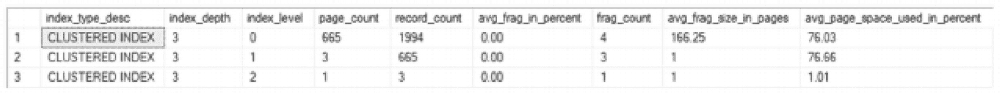

一个表格有 9 列和 3 行。列标题为：索引类型描述、索引深度、索引级别、页数、记录数、平均碎片百分比、碎片数、平均碎片大小（以页计）和平均页空间使用率百分比。所有 3 个索引的平均碎片均为 0.00%。

图 11-1

初始碎片结果（结果可能有所不同）

```
USE AdventureWorks2017
GO
SELECT index_type_desc
,index_depth
,index_level
,page_count
,record_count
,CAST(avg_fragmentation_in_percent as DECIMAL(6,2)) as avg_frag_in_percent
,fragment_count AS frag_count
,avg_fragment_size_in_pages AS avg_frag_size_in_pages
,CAST(avg_page_space_used_in_percent as DECIMAL(6,2)) as avg_page_space_used_in_percent
FROM sys.dm_db_index_physical_stats(DB_ID(),OBJECT_ID('dbo.UsingUniqueidentifier'),NULL,NULL,'DETAILED')
```

代码清单 11-2

查看 INSERT 操作导致的索引碎片

```
USE AdventureWorks2017
GO
IF OBJECT_ID('dbo.UsingUniqueidentifier') IS NOT NULL
DROP TABLE dbo.UsingUniqueidentifier;
CREATE TABLE dbo.UsingUniqueidentifier
(
RowID uniqueidentifier CONSTRAINT DF_GUIDValue DEFAULT NEWID()
,Name sysname
,JunkValue varchar(2000)
);
INSERT INTO dbo.UsingUniqueidentifier (Name, JunkValue)
SELECT name, REPLICATE('X', 2000)
FROM sys.columns
CREATE CLUSTERED INDEX CLUS_UsingUniqueidentifier ON dbo.UsingUniqueidentifier(RowID);
```

代码清单 11-1

填充一个 Uniqueidentifier 表


#### 使用唯一标识符作为聚集索引键对碎片的影响

基于 `uniqueidentifier` 列构建带有聚集索引的表后，可以执行 `INSERT` 操作来观察其对索引的影响。为了演示，请使用清单 11-3 中的代码，将 `sys.objects` 中的所有行插入到 `dbo.UsingUniqueidentifier` 中。插入后，可以使用清单 11-2 中的 T-SQL 查询索引的碎片情况。结果应与图 11-2 所示相似，该图显示在向表中添加 689 行后，聚集索引在索引级别 0 的碎片率超过 70%。

```sql
USE AdventureWorks2017
GO
INSERT INTO dbo.UsingUniqueidentifier (Name, JunkValue)
SELECT name, REPLICATE('X', 2000)
FROM sys.objects
-- 清单 11-3
-- 向唯一标识符表执行 INSERT
```

正如这段代码示例所展示的，基于非递增值的聚集索引会导致碎片。这种行为最典型的例子就是使用 `uniqueidentifier`。当聚集键是计算值或基于无序的业务键时，也可能发生这种情况。在查看业务键时，如果为订单分配了一个随机的采购订单号，那么该值的行为可能类似于 `uniqueidentifier` 数据类型值。

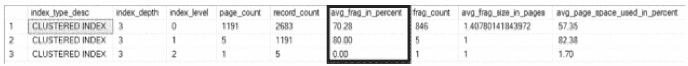

一个包含 9 列 3 行的表格。列标题为：索引类型降序、索引深度、索引级别、页数、记录数、平均碎片百分比、碎片数、平均碎片大小（页）、平均页空间使用率百分比。所有 3 个索引的“平均碎片百分比”分别为 70.28、80.00 和 0.00，这些值被高亮显示。

图 11-2

INSERT 后的碎片结果（百分比结果可能有所不同）

`INSERT` 操作影响碎片的另一种方式是作用于非聚集索引。虽然聚集索引值可能是递增的，但非聚集索引中的列值不一定具有相同的特性。一个很好的例子是在非聚集索引中对产品名称进行索引。插入到表中的下一条记录可能以字母 *M* 开头，需要放置在非聚集索引的中间位置。如果该位置没有空间，则会发生页拆分，从而导致碎片。

为了演示这种行为，请向之前演示中使用的表 `dbo.UsingUniqueidentifier` 添加一个非聚集索引。清单 11-4 显示了新索引的模式。在插入更多记录以查看插入非聚集索引的效果之前，请再次运行清单 11-2。结果将与图 11-3 相似。

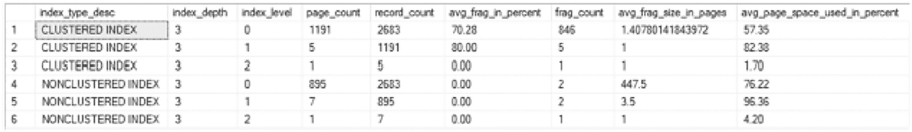

一个包含 9 列 6 行的表格。列标题为：索引类型降序、索引深度、索引级别、页数、记录数、平均碎片百分比、碎片数、平均碎片大小（页）、平均页空间使用率百分比。包含了 3 个非聚集索引。

图 11-3

非聚集索引的碎片结果

```sql
USE AdventureWorks2017
GO
CREATE NONCLUSTERED INDEX IX_Name ON dbo.UsingUniqueidentifier(Name) INCLUDE (JunkValue);
-- 清单 11-4
-- 创建非聚集索引
```

此时，需要向 `dbo.UsingUniqueidentifier` 插入更多行。再次执行清单 11-3 中的 T-SQL 以插入更多记录到表中，然后使用清单 11-2 查看非聚集索引中的碎片状态。完成此操作后，非聚集索引的碎片率现已超过 40%，如图 11-4 所示。

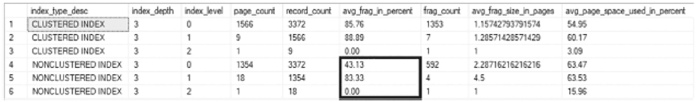

一个包含 9 列 6 行的表格。列标题为：索引类型降序、索引深度、索引级别、页数、记录数、平均碎片百分比、碎片数、平均碎片大小（页）、平均页空间使用率百分比。非聚集索引的“平均碎片百分比”数据被高亮显示。

图 11-4

非聚集索引 INSERT 后的碎片结果

每当执行 `INSERT` 操作时，总是存在发生碎片的可能性。这将同时发生在聚集索引和非聚集索引上。为聚集索引选择递增的键列将减少插入相关碎片的影响。


#### UPDATE 操作

另一个可能导致碎片化的操作是 `UPDATE` 操作。`UPDATE` 操作导致碎片化主要有两种方式。首先，记录中的数据不再适合它当前所在的页面。其次，索引的键值发生变化，并且新键值的索引位置不在同一页上，或者不适合该记录所在的目标页面。在这两种情况下，都会发生页面拆分，从而导致碎片化。

为了演示这些情况如何导致碎片化，请考虑在更新中增加记录大小如何导致碎片化。为此，将创建一个新表，并向其中插入一些记录。然后向该表添加一个聚集索引。相关代码见清单 11-5。使用清单 11-6 中的脚本，可以看到聚集索引上没有碎片，如图 11-5 所示。关于这些碎片化结果需要注意的一点是，平均页面空间使用率接近 90%。因此，记录大小的任何显著增长都可能填满页面上的可用空间。

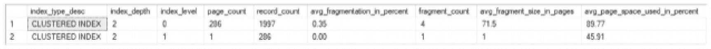

图 11-5

初始 UPDATE 碎片化结果

```sql
USE AdventureWorks2017
GO
SELECT index_type_desc
,index_depth
,index_level
,page_count
,record_count
,CAST(avg_fragmentation_in_percent as DECIMAL(6,2)) as avg_fragmentation_in_percent
,fragment_count
,avg_fragment_size_in_pages
,CAST(avg_page_space_used_in_percent as DECIMAL(6,2)) as avg_page_space_used_in_percent
FROM sys.dm_db_index_physical_stats(DB_ID(),OBJECT_ID('dbo.UpdateOperations'),NULL,NULL,'DETAILED');
```

清单 11-6

查看 UPDATE 索引碎片化

```sql
USE AdventureWorks2017
GO
IF OBJECT_ID('dbo.UpdateOperations') IS NOT NULL
DROP TABLE dbo.UpdateOperations;
CREATE TABLE dbo.UpdateOperations
(
RowID int IDENTITY(1,1)
,Name sysname
,JunkValue varchar(2000)
);
INSERT INTO dbo.UpdateOperations (Name, JunkValue)
SELECT name, REPLICATE('X', 1000)
FROM sys.columns
CREATE CLUSTERED INDEX CLUS_UsingUniqueidentifier ON dbo.UpdateOperations(RowID);
```

清单 11-5

为 UPDATE 操作创建表

现在增加索引中某些行的大小。为此，执行清单 11-7 中的代码。此代码将每五行的 `JunkValue` 列从 1000 个字符的值更新为 2000 个字符的值。使用清单 11-6 查看当前索引碎片化情况，通过图 11-6 中的结果可以看到，聚集索引现在碎片化率超过 99%，平均页面空间使用率降至约 50%。正如这段代码所示，当一行在 `UPDATE` 操作期间大小增加时，存在显著碎片化的可能性。

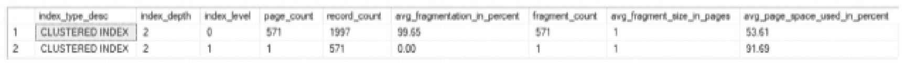

图 11-6

记录长度增加后的 UPDATE 碎片化结果

```sql
USE AdventureWorks2017
GO
UPDATE dbo.UpdateOperations
SET JunkValue = REPLICATE('X', 2000)
WHERE RowID % 5 = 1
```

清单 11-7

导致碎片化的 UPDATE 操作

索引可能产生碎片化的第二种方式是通过更改索引的键值。当索引的键值更改时，记录可能需要更改其在索引中的位置。例如，如果索引是基于产品名称构建的，那么将名称从 Acme Mop 更改为 XYZ Mop 将改变产品名称在索引排序中的位置。更改记录在索引中的位置可能会将其放置在不同的页面上，如果新页面上没有足够的空间，则会发生页面拆分和碎片化。

为了演示这个概念，请执行清单 11-8，然后使用清单 11-6 获取图 11-7 所示的结果。对于新的非聚集索引，目前没有碎片。

注意

如果聚集索引的键值经常更改，这可能表明为聚集索引选择的键值不合适。

```sql
USE AdventureWorks2017
GO
CREATE NONCLUSTERED INDEX IX_Name ON dbo.UpdateOperations(Name) INCLUDE (JunkValue);
```

清单 11-8

为 UPDATE 操作创建非聚集索引

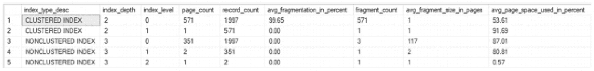

图 11-7

添加非聚集索引后的 UPDATE 碎片化结果

此时，需要修改一些键值。使用清单 11-9，对表执行 `UPDATE` 操作，每九行更新一行。为了模拟更改键值，`UPDATE` 语句反转了列中的字符。这么少量的活动足以导致大量的碎片化。如图 11-8 的结果所示，非聚集索引从没有碎片变成了超过 30% 的碎片。

需要注意的一点是，聚集索引上的碎片没有随着这些更新而改变。并非所有更新都会导致碎片化。只有那些因为记录当前存储的页面上空间不足而导致数据移动的更新才会产生碎片化。

```sql
USE AdventureWorks2017
GO
UPDATE dbo.UpdateOperations
SET Name = REVERSE(Name)
WHERE RowID % 9 = 1
```

清单 11-9

用于更改索引键值的 UPDATE 操作

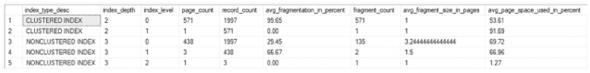

图 11-8

更改索引键值后的 UPDATE 碎片化结果

#### 删除操作

导致碎片化的第三种操作类型是 `DELETE` 操作。删除操作在性质上有些不同，因为它是在数据库内部产生碎片化。它不是因为页拆分而重定位页，而是可能导致页从索引中被移除。随后，索引页的物理序列中就会出现间隙。由于页不再物理连续，它们就被认为是碎片化的。这一点很重要，因为一旦页从索引中被释放，它们就可以被重新分配给其他索引，从而构成一种更传统的碎片化形式。

为了演示这种行为，请创建一个表，填充一些记录，然后添加一个聚集索引。完成这些任务的脚本如代码清单 11-10 所示。运行该脚本，然后运行代码清单 11-11 的脚本来获取聚集索引当前的碎片化情况。结果应与图 11-9 中的匹配。平均碎片化（百分比）列 (`avg_fragmentation_in_percent`) 显示当前索引中没有碎片化。

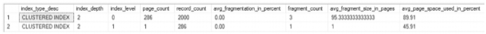

*一个表格有 9 列和 2 行。列标题为：索引类型描述、索引深度、索引级别、页数、记录数、平均碎片百分比、碎片数、平均碎片大小（页）、平均页空间使用率百分比。两个聚集索引的平均碎片化均为 0。*

**图 11-9** DELETE 操作前的碎片化结果

```sql
代码清单 11-11 查看 DELETE 索引碎片化情况
USE AdventureWorks2017
GO
SELECT index_type_desc
,index_depth
,index_level
,page_count
,record_count
,CAST(avg_fragmentation_in_percent as DECIMAL(6,2)) as avg_fragmentation_in_percent
,fragment_count
,avg_fragment_size_in_pages
,CAST(avg_page_space_used_in_percent as DECIMAL(6,2)) as avg_page_space_used_in_percent
FROM sys.dm_db_index_physical_stats(DB_ID(),OBJECT_ID('dbo.DeleteOperations'),NULL,NULL,'DETAILED')
```

```sql
代码清单 11-10 创建用于 DELETE 操作的表
USE AdventureWorks2017
GO
IF OBJECT_ID('dbo.DeleteOperations') IS NOT NULL
DROP TABLE dbo.DeleteOperations;
CREATE TABLE dbo.DeleteOperations
(
RowID int IDENTITY(1,1)
,Name sysname
,JunkValue varchar(2000)
);
INSERT INTO dbo.DeleteOperations (Name, JunkValue)
SELECT name, REPLICATE('X', 1000)
FROM sys.columns
CREATE CLUSTERED INDEX CLUS_UsingUniqueidentifier ON dbo.DeleteOperations(RowID);
```

为了演示由 `DELETE` 操作引起的碎片化，将使用代码清单 11-12 中的代码删除表中每隔 50 条记录。和之前一样，将使用代码清单 11-11 来查看索引中碎片化的状态。结果如图 11-10 所示，表明 `DELETE` 操作导致了大约 13% 的碎片化。对于 `DELETE` 操作，碎片化的产生速度通常不会太快。此外，由于碎片化不是页拆分的结果，页的顺序在物理上不会变得无序。相反，在连续的页之间会出现间隙。但是，留空的页可能会在未来的 `INSERT` 和 `UPDATE` 事务中被重用，这可能导致页在物理上变得无序。

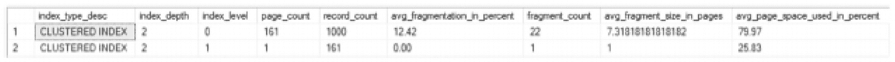

*一个表格有 9 列和 2 行。列标题为：索引类型描述、索引深度、索引级别、页数、记录数、平均碎片百分比、碎片数、平均碎片大小（页）、平均页空间使用率百分比。平均碎片化为 12.42%。*

**图 11-10** DELETE 操作后的碎片化结果

```sql
代码清单 11-12 执行 DELETE 操作
USE AdventureWorks2017
GO
DELETE dbo.DeleteOperations
WHERE RowID % 100 BETWEEN 1 AND 50
```

请注意，由删除操作产生的碎片化可能不会在执行 `DELETE` 操作后立即显现。当记录要被删除时，它们首先被标记为删除，然后才实际删除记录本身。在标记为删除期间，该记录被视为幽灵记录。在此阶段，记录在逻辑上已被删除，但在物理上仍存在于索引中。在未来的某个时间点，在事务提交并完成 `CHECKPOINT` 之后，清除幽灵记录进程将物理删除该行。此时，索引中的碎片化将变得可见。


## 收缩操作

最后一种可能导致碎片化的操作是收缩数据库。可以使用 `DBCC SHRINKDATABASE` 或 `DBCC SHRINKFILE` 来收缩数据库。这些操作用于收缩数据库或其文件的大小。使用它们时，数据文件末尾的页面会被重新定位到数据文件的开头。就其预期目的而言，收缩操作可以是有效的工具。

不幸的是，这些收缩操作并不考虑被移动数据页面的性质。对于收缩操作来说，一个数据页面就是一个数据页面。该操作的优先级是让数据文件末尾的页面在文件开头找到位置。如前所述，当索引的页面在物理上未按顺序存储时，索引就被认为是碎片化的。

为了演示收缩操作可能导致的碎片化损害，将创建一个数据库并对其执行收缩操作。相关代码见代码清单 11-13。在此示例中，有两个表：`FirstTable` 和 `SecondTable`。将向每个表插入一些记录。插入操作将交替进行，向 `FirstTable` 插入三条，再向 `SecondTable` 插入两条。通过这些插入操作，分配给两个表的页面将形成交替的条带。接下来，将删除 `SecondTable`，这将导致在 `FirstTable` 的每个页面条带之间出现未分配的数据页面。使用代码清单 11-14 将显示 `FirstTable` 上存在少量碎片，如图 11-11 所示。

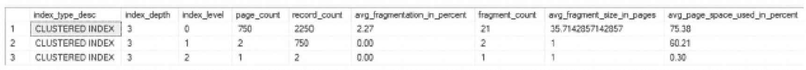

图 11-11：插入操作后 FirstTable 的碎片化情况

```
Use Fragmentation
GO
SELECT index_type_desc
,index_depth
,index_level
,page_count
,record_count
,CAST(avg_fragmentation_in_percent as DECIMAL(6,2)) as avg_fragmentation_in_percent
,fragment_count
,avg_fragment_size_in_pages
,CAST(avg_page_space_used_in_percent as DECIMAL(6,2)) as avg_page_space_used_in_percent
FROM sys.dm_db_index_physical_stats(DB_ID(),OBJECT_ID('dbo.FirstTable'),NULL,NULL,'DETAILED')
```

代码清单 11-14：查看由收缩导致的索引碎片化

```
USE master
GO
IF EXISTS (SELECT * FROM sys.databases WHERE name = 'Fragmentation')
DROP DATABASE Fragmentation
GO
CREATE DATABASE Fragmentation
GO
Use Fragmentation
GO
IF OBJECT_ID('dbo.FirstTable') IS NOT NULL
DROP TABLE dbo.FirstTable;
CREATE TABLE dbo.FirstTable
(
RowID int IDENTITY(1,1)
,Name sysname
,JunkValue varchar(2000)
,CONSTRAINT PK_FirstTable PRIMARY KEY CLUSTERED (RowID)
);
INSERT INTO dbo.FirstTable (Name, JunkValue)
SELECT TOP 750 name, REPLICATE('X', 2000)
FROM sys.columns
IF OBJECT_ID('dbo.SecondTable') IS NOT NULL
DROP TABLE dbo.SecondTable;
CREATE TABLE dbo.SecondTable
(
RowID int IDENTITY(1,1)
,Name sysname
,JunkValue varchar(2000)
,CONSTRAINT PK_SecondTable PRIMARY KEY CLUSTERED (RowID)
);
INSERT INTO dbo.SecondTable (Name, JunkValue)
SELECT TOP 750 name, REPLICATE('X', 2000)
FROM sys.columns
GO
INSERT INTO dbo.FirstTable (Name, JunkValue)
SELECT TOP 750 name, REPLICATE('X', 2000)
FROM sys.columns
GO
INSERT INTO dbo.SecondTable (Name, JunkValue)
SELECT TOP 750 name, REPLICATE('X', 2000)
FROM sys.columns
GO
INSERT INTO dbo.FirstTable (Name, JunkValue)
SELECT TOP 750 name, REPLICATE('X', 2000)
FROM sys.columns
GO
IF OBJECT_ID('dbo.SecondTable') IS NOT NULL
DROP TABLE dbo.SecondTable;
GO
```

代码清单 11-13：收缩操作数据库准备

数据库准备好后，下一步是收缩数据库。目的是回收原本分配给 `SecondTable` 的空间，并将数据库大小缩减到仅需的大小。要执行收缩操作，请使用代码清单 11-15 中的代码。当 `SHRINKDATABASE` 操作完成时，图 11-12 将显示，运行代码清单 11-14 中的代码会使索引的碎片化从略高于 2%增加到超过 35%。这是一个仅包含单个表的数据库上碎片化程度的显著变化。试想一下，对一个拥有几十个、几百个或几千个索引的数据库执行收缩操作的影响。

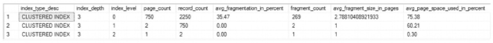

图 11-12：收缩操作后 FirstTable 的碎片化情况

```
DBCC SHRINKDATABASE (Fragmentation)
```

代码清单 11-15：收缩操作

这只是一个关于收缩操作可能对索引造成碎片化损害的简单示例。即使在这个例子中也很明显，收缩操作导致了大量碎片。大多数 SQL Server 数据库管理员都会同意，收缩操作在任何数据库上都应该是极其罕见的操作。一些数据库管理员认为，出于任何原因都不应在任何数据库上使用此操作。最常被推荐的准则是，在执行数据库收缩操作时要极其谨慎。最危险的模式是采用一种循环：收缩数据库以回收空间 -> 导致碎片化 -> 然后通过碎片整理索引来扩展数据库。这构成了对时间和资源的浪费，而这些资源本可以更好地用于解决实际的性能和维护问题。

关于收缩操作的另一个重要注意事项是，大多数繁忙的生产表会随着时间的推移而增长。如果是这种情况，那么收缩数据库只能为未来的必然增长提供暂时的缓解。因此，收缩操作应仅用于回收的空间量远大于其可能导致的任何碎片的场景。

## 碎片化的变体

传统上，在讨论索引碎片时，主要关注的是聚集索引或非聚集索引内部的碎片化。在评估索引碎片化时，这并不是唯一需要考虑的因素。考虑表或索引是否存在臃肿、转发或分段也是有价值的，这些都是索引碎片化概念的变体。在本节中，将回顾表上可能需要进行碎片化类型维护的另外两个领域：

*   堆表臃肿与转发

*   列存储碎片化


### 堆膨胀与记录转发

#### 堆膨胀

如第 3 章所述，堆是无序页面的集合，用于存储表的数据。随着新行添加到表中，堆会随着新页的分配而增长。插入和更新操作可能导致堆发生变化，从而需要对表进行维护。

首先，我们将回顾堆内部的膨胀现象。对于堆而言，当记录从堆中删除且未被新记录重用时，就会发生膨胀。如第 10 章所讨论的，这并非记录移动到新页面的问题，而是表中记录总数的下降。页面会被重用，但当它们未被重用时，页面会保持分配状态，这可能对性能产生影响。

为了演示这一活动，将使用代码清单 11-16 中的脚本。此脚本从一个已插入 400 条记录的堆表开始。接着，删除一半的记录，表中剩余 200 条。如图 11-13 所示，表的记录数反映了这些变化，但在两种情况下，DMV 结果都显示与该表关联的页面有 100 个。这是因为除非维护活动强制执行，否则页面不会从堆中移除。通过使用`REBUILD`选项对`dbo.HeapTable`执行`ALTER TABLE`语句，表被重建，多余的页面被清除。

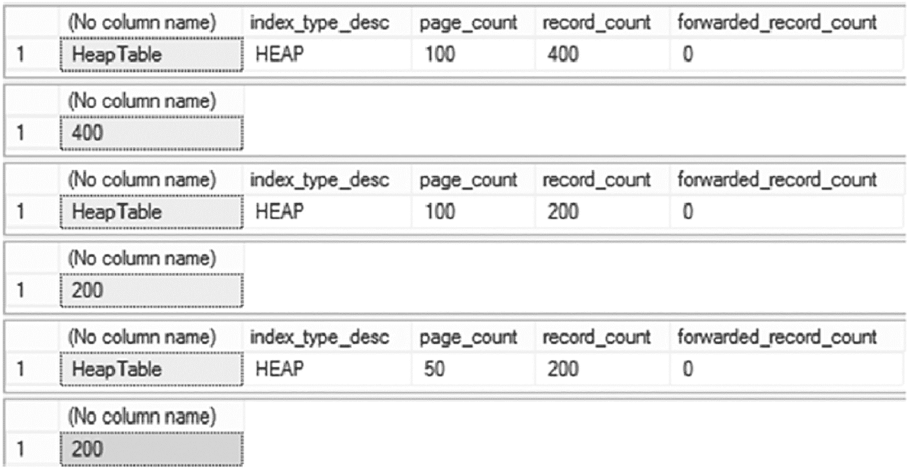

3 个具有 5 列表头的表格。表头分别为：无列名、索引类型降序、页数、记录数和转递记录数，及其在 6 行中的对应值。3 个表的记录数分别为 400、200 和 200。

图 11-13

从堆中删除操作的结果

```sql
USE AdventureWorks2017
GO
IF OBJECT_ID('dbo.HeapTable') IS NOT NULL
DROP TABLE dbo.HeapTable;
CREATE TABLE dbo.HeapTable
(
RowId INT IDENTITY(1,1)
,FillerData VARCHAR(2500)
);
INSERT INTO dbo.HeapTable (FillerData)
SELECT TOP 400 REPLICATE('X',2000)
FROM sys.objects;
SELECT OBJECT_NAME(object_id), index_type_desc, page_count, record_count, forwarded_record_count
FROM sys.dm_db_index_physical_stats (DB_ID(),OBJECT_ID('dbo.HeapTable'),NULL,NULL,'DETAILED');
SET STATISTICS IO ON;
SELECT COUNT(*) FROM dbo.HeapTable;
SET STATISTICS IO OFF;
DELETE FROM dbo.HeapTable
WHERE RowId % 2 = 0;
SELECT OBJECT_NAME(object_id), index_type_desc, page_count, record_count, forwarded_record_count
FROM sys.dm_db_index_physical_stats (DB_ID(),OBJECT_ID('dbo.HeapTable'),NULL,NULL,'DETAILED');
SET STATISTICS IO ON;
SELECT COUNT(*) FROM dbo.HeapTable;
SET STATISTICS IO OFF;
ALTER TABLE dbo.HeapTable REBUILD;
SELECT OBJECT_NAME(object_id), index_type_desc, page_count, record_count, forwarded_record_count
FROM sys.dm_db_index_physical_stats (DB_ID(),OBJECT_ID('dbo.HeapTable'),NULL,NULL,'DETAILED');
SET STATISTICS IO ON;
SELECT COUNT(*) FROM dbo.HeapTable;
SET STATISTICS IO OFF;
```

代码清单 11-16
删除操作对堆页面分配的影响

为了强调页面仍在表中，图 11-14 展示了在计算表中所有行时读取的页面，进一步证明了有 100 个页面正在被访问。在考虑删除操作后对堆性能的影响时，堆中页面数量相对于数据量过多，会增加 SQL Server 执行针对其的查询所需的工作量。在此演示案例中，`COUNT(*)`查询处理的数据量是实际所需数据量的两倍。

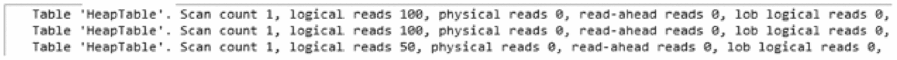

一个输入输出页面，包含 3 行数据。每行有一个表、堆表、扫描计数 1、逻辑读取 100、物理读取 0、预读取 0 和大对象逻辑读取 0，但第 3 行的逻辑读取为 50。

图 11-14

删除操作对堆的 I/O 影响

#### 记录转发

堆维护的另一个考虑领域是表中的转递记录数量。转递记录在第 3 章中讨论过，指的是堆中不再适合其最初添加位置的记录。为了适应记录大小的变化，该记录被存储在另一个页面上，并且之前的记录位置包含一个指向新位置的指针。

这种变化的影响是增加了堆中的页面数量，因为为现有记录添加了新页面，并且在查找记录时，需要额外的一次 I/O 操作从第一页跳转到转递页。虽然这看起来可能不是一个严重问题，但累积起来，转递记录的累积影响增加了系统的 I/O 量，并增加了查询执行的延迟。

为了演示转递记录对查询的影响，请执行代码清单 11-17 中的代码。此脚本创建一个包含堆的表，运行一系列查询，更新记录以导致堆记录转发发生，然后通过重新执行之前的查询集合来完成。

```sql
USE AdventureWorks2017
GO
SET NOCOUNT ON
IF OBJECT_ID('dbo.ForwardedRecords') IS NOT NULL
DROP TABLE dbo.ForwardedRecords;
CREATE TABLE dbo.ForwardedRecords
(
ID INT IDENTITY(1,1)
,VALUE VARCHAR(8000)
);
CREATE NONCLUSTERED INDEX IX_ForwardedRecords_ID ON dbo.ForwardedRecords(ID);
INSERT INTO dbo.ForwardedRecords (VALUE)
SELECT REPLICATE(type, 500)
FROM sys.objects;
SET STATISTICS IO ON
PRINT '*** No forwarded records'
SELECT * FROM dbo.ForwardedRecords;
SELECT * FROM dbo.ForwardedRecords
WHERE ID = 40;
SELECT * FROM dbo.ForwardedRecords
WHERE ID BETWEEN 40 AND 60;
SET STATISTICS IO OFF
UPDATE dbo.ForwardedRecords
SET VALUE =REPLICATE(VALUE, 16)
WHERE ID%3 = 1;
SET STATISTICS IO ON
PRINT '*** With forwarded records'
SELECT * FROM dbo.ForwardedRecords;
SELECT * FROM dbo.ForwardedRecords
WHERE ID = 40;
SELECT * FROM dbo.ForwardedRecords
WHERE ID BETWEEN 40 AND 60;
SET STATISTICS IO OFF
```

代码清单 11-17
转递记录对查询性能的影响

代码清单 11-17 中包含三个查询，用以演示转递记录对堆的影响：

*   `SELECT *`：用以演示索引扫描的影响
*   带等值谓词的`SELECT *`：用以演示对单例查找的影响
*   带不等值谓词的`SELECT *`：用以演示对范围查找的影响

对于`SELECT *`查询，在堆中存在转递记录之前，查询以 99 次读取执行，如图 11-15 所示。引入转递记录后，读取次数增加到 561 次。这种增加是因为为适应行大小的增加而向堆中添加了新页面。对于第二个查询，单例查找从 3 次读取增长到 4 次读取，这代表了从记录的原始位置跳转到转递位置所需的一次额外读取。在最后一个查询中，带查找的范围查询以 23 次读取执行，但在将转递记录添加到表后，读取次数跃升至 30 次。

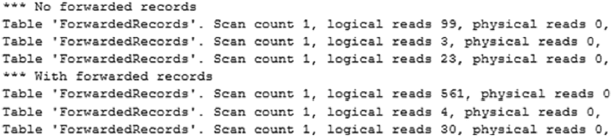

两个输入输出统计页面：无转递记录和有转递记录。每条记录包含三行数据，数据如下：表、转递记录、扫描计数、逻辑读取和物理读取。1. 逻辑读取分别为 99、3、23。2. 逻辑读取分别为 561、4、30。

图 11-15

转递记录查询的 I/O 统计


转发记录的整体效应是增加了读取次数。虽然单次查询的增加可能并不显著，但长期累积的影响不容忽视。包含转发记录的堆扫描需要访问更多页面，而查找操作则需要额外的 I/O。减少堆中转发记录的影响，是维护索引和优化性能的重要一环。

### 列存储碎片化

列存储索引的运作方式与标准行存储索引（聚集、非聚集和堆）大相径庭。列存储索引一个有趣的特点是其段的只读性质。正如第 2 章所讨论的，对列存储索引的小型插入将由 `deltastore` 处理，随后异步合并到压缩后的 `行组` 中。此外，删除操作以软删除方式处理。行被标记为已删除，但不会立即移除，导致段中包含不再属于表的数据。

为了演示这些概念，请执行清单 11-18 中的代码来准备一个包含聚集列存储索引的表。表创建后，插入两组行。第一组包含 1,000 行，索引被重组以强制该行组压缩为列存储格式。第二组包含 105,000 行，超过了 102,400 行的阈值，这会导致行自动直接插入到压缩行组中。图 11-16 显示插入的记录被直接压缩为列存储格式。

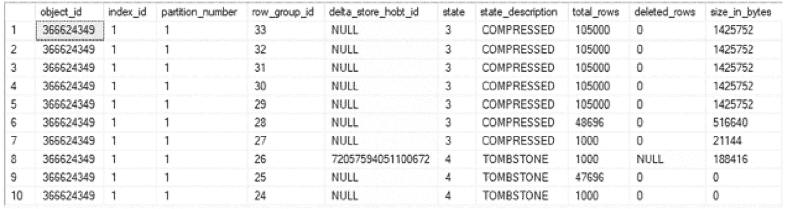

一个表有 10 列和 10 行。列标题为 `object_id`、`index_id`、`partition_number`、`row_group_id`、`delta_store_hobt_id`、`state`、`state_description`、`total_rows`、`deleted_rows` 和 `size_in_bytes`。其中 7 行具有压缩行组。

**图 11-16**  
列存储行组结果集

**注意**  
根据您的环境，清单 11-18 中的脚本可能需要运行一段时间。

```sql
USE ContosoRetailDW
GO
IF OBJECT_ID('dbo.FactOnlineSalesCI') IS NOT NULL
DROP TABLE dbo.FactOnlineSalesCI
CREATE TABLE dbo.FactOnlineSalesCI(
    [OnlineSalesKey] [int] NOT NULL,
    [DateKey] [datetime] NOT NULL,
    [StoreKey] [int] NOT NULL,
    [ProductKey] [int] NOT NULL,
    [PromotionKey] [int] NOT NULL,
    [CurrencyKey] [int] NOT NULL,
    [CustomerKey] [int] NOT NULL,
    [SalesOrderNumber] nvarchar NOT NULL,
    [SalesOrderLineNumber] [int] NULL,
    [SalesQuantity] [int] NOT NULL,
    [SalesAmount] [money] NOT NULL,
    [ReturnQuantity] [int] NOT NULL,
    [ReturnAmount] [money] NULL,
    [DiscountQuantity] [int] NULL,
    [DiscountAmount] [money] NULL,
    [TotalCost] [money] NOT NULL,
    [UnitCost] [money] NULL,
    [UnitPrice] [money] NULL,
    [ETLLoadID] [int] NULL,
    [LoadDate] [datetime] NULL,
    [UpdateDate] [datetime] NULL
)
INSERT INTO dbo.FactOnlineSalesCI
SELECT *
FROM dbo.FactOnlineSales
CREATE CLUSTERED COLUMNSTORE INDEX FactOnlineSalesCI_CCI ON dbo.FactOnlineSalesCI
DECLARE @we int= 1
WHILE @we <= 5
BEGIN
    INSERT INTO dbo.FactOnlineSalesCI
    SELECT TOP 1000 *
    FROM dbo.FactOnlineSales
    ALTER INDEX ALL ON dbo.FactOnlineSalesCI REORGANIZE
    WITH (COMPRESS_ALL_ROW_GROUPS =ON)
    SET @we += 1
END
WHILE @we <= 10
BEGIN
    INSERT INTO dbo.FactOnlineSalesCI
    SELECT TOP 105000 *
    FROM dbo.FactOnlineSales
    SET @we += 1
END
SELECT*
FROM sys.column_store_row_groups
WHERE object_id=OBJECT_ID('dbo.FactOnlineSalesCI')
ORDER BY row_group_id DESC
```

**清单 11-18**  
准备列存储表

此时有趣的一点是，创建的行组远小于行组的最大大小（约 100 万行）。由于它们较小，可能有机会通过增加每个行组的记录数来优化它们使用的页数。这可以通过重建列存储索引来完成。为了说明重建列存储索引的价值，请执行清单 11-19 中的代码。该代码显示，重建前的逻辑读取次数在两次扫描操作中为 83,423，然后在重建后降至 833 次逻辑读取，如图 11-17 所示。这是访问页面数量的大幅下降。在考虑对使用列存储索引的大型事实表进行此类维护的影响时，这种过度的页面分配将极大地影响性能。此外，对比图 11-16 和图 11-18，表的行组数量也从重建列存储索引前的 34 个大幅减少到 14 个。

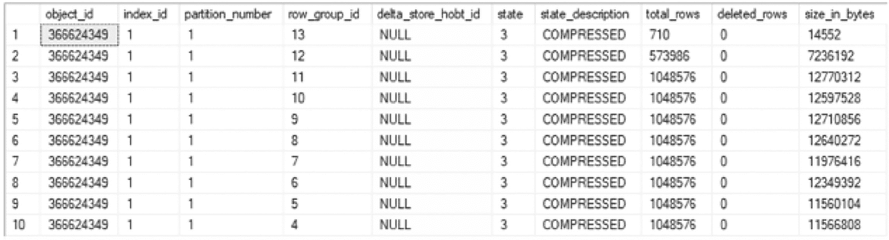

一个表有 10 列和 10 行。列标题为 `object_id`、`index_id`、`partition_number`、`row_group_id`、`delta_store_hobt_id`、`state`、`state_description`、`total_rows`、`deleted_rows` 和 `size_in_bytes`。所有行的增量存储和状态描述分别为 null 和 compressed。

**图 11-18**  
列存储索引重建后的行组统计信息

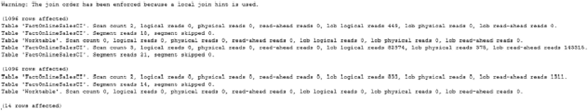

一个输入输出统计信息页面展示了如何重建列存储表，影响了 1096 行数据，并附有警告文本，提示因为使用了本地联接提示，已强制执行联接顺序。`LOB` 逻辑读取从 83423 次下降到 833 次。

**图 11-17**  
列存储表插入操作的 I/O 统计信息

```sql
USE ContosoRetailDW
GO
SET STATISTICS IO ON
SELECT DateKey,COUNT(*)
FROM dbo.FactOnlineSalesCI
GROUP BY DateKey
ALTER INDEX ALL ON dbo.FactOnlineSalesCI REBUILD
SELECT DateKey,COUNT(*)
FROM dbo.FactOnlineSalesCI
GROUP BY DateKey
SET STATISTICS IO OFF
SELECT *
FROM sys.column_store_row_groups
WHERE object_id = OBJECT_ID('dbo.FactOnlineSalesCI')
ORDER BY row_group_id DESC
```

**清单 11-19**  
插入操作对列存储表的影响

列存储索引发生的另一种类型的碎片化是通过删除操作。虽然这被称为 *碎片化*，但当在列存储索引上执行删除时，行并未从索引中移除。相反，它们被标记为已删除，并继续在行组内占用空间。因此，分配给聚集列存储索引的页面，即使其所有记录都被删除，仍然会在索引中保持活动状态。

为了说明列存储索引中软删除行的影响，将使用清单 11-20 中的脚本从表中删除 2007 年的数据。然后，另一条语句将重建列存储索引。在这些操作之间，将执行一个聚合查询，以提供分析操作来衡量删除操作对查询 I/O 的影响。

```sql
USE ContosoRetailDW
GO
SET STATISTICS IO ON
SELECT DateKey,COUNT(*)
FROM dbo.FactOnlineSalesCI
GROUP BY DateKey
DELETE FROM dbo.FactOnlineSalesCI
WHERE DateKey <'2008-01-01'
SELECT DateKey,COUNT(*)
FROM dbo.FactOnlineSalesCI
GROUP BY DateKey
ALTER INDEX ALL ON dbo.FactOnlineSalesCI REBUILD
SELECT DateKey,COUNT(*)
FROM dbo.FactOnlineSalesCI
GROUP BY DateKey
SET STATISTICS IO OFF
```

**清单 11-20**  
对聚集列存储索引的删除操作


运行这些查询并重建索引后，最终的性能数字将显示出相当显著的提升。执行第一个查询时，聚合查询会产生 659 次逻辑读取，如图 11-19 所示。删除一年的数据后，聚合查询需要 79,982 次逻辑读取，这比返回行数减少 365 行的原始查询还要多。这是因为管理已删除行需要额外的页面。重建索引后，I/O 降至仅 444 次逻辑读取。

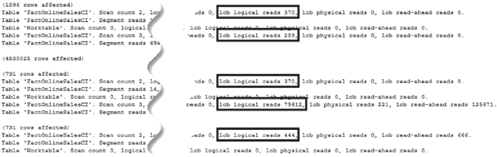

一个输入输出统计页面展示了如何进行删除操作演示，包括受影响的行数数据以及高亮显示的 `lob 逻辑读取` 数据。5 个查询的 `lob 逻辑读取` 分别为 370、289、370、79612 和 444。

图 11-19：删除操作演示的统计 I/O 结果

通过新增行和删除现有行，有理由考虑列存储索引的维护需求。影响这些索引的问题与传统聚集索引的问题不尽相同，但它们同样重要。

### 碎片问题

这些演示展示了许多索引可能产生碎片的方式，但尚未讨论其重要性。索引内部的碎片可能成为问题，有几个重要原因：

*   索引 I/O
*   连续读取

随着索引碎片的增加，这两个方面都会影响索引的性能表现。在某些最坏的情况下，碎片化程度可能非常严重，以至于查询优化器将在查询计划中停止使用该索引。

#### 索引 I/O

I/O 是 SQL Server 中容易出现性能瓶颈的领域。同样，也有多种解决方案可以帮助缓解这些瓶颈。从本章的角度出发，主要关注点将是碎片对 I/O 的影响。

由于页拆分通常是碎片产生的原因，它们为研究碎片对 I/O 影响提供了一个很好的起点。回顾一下，当发生页拆分时，页面上一半的内容会被移出到另一个页面上。如果原始页面是 100%满的，那么得到的两个页面都将大约 50%满。本质上，从存储中读取相同数量的信息现在需要两次 I/O，而在页拆分之前只需要一次 I/O。这种 I/O 的增加会推高读写次数，从而对性能产生负面影响。

为了验证碎片对 I/O 的影响，将提供另一个碎片示例。这次将构建一个表，填充数据，并进行更新以产生页拆分和碎片。代码清单 11-22 将执行这些操作。脚本的最后一部分将查询 `sys.dm_db_partition_stats` 以返回为索引保留的页面数。执行代码清单 11-21 中的碎片脚本。这将显示此时索引的碎片率超过 99%。代码清单 11-21 的结果显示索引使用了 209 个页面。结果见图 11-20。

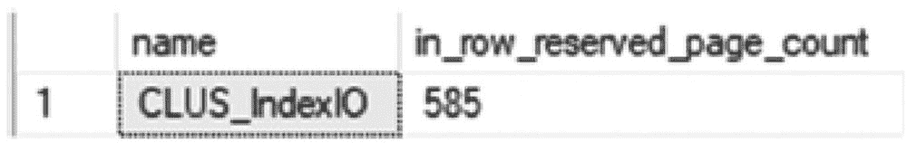

一个表有 2 列和 1 行数据。列标题是 `name` 和 `in_row_reserved_page_count`。行数据是 `CLUS_IndexIO` 和 585。

图 11-20：`CLUS_IndexIO` 的碎片情况

```
USE AdventureWorks2017
GO
IF OBJECT_ID('dbo.IndexIO') IS NOT NULL
DROP TABLE dbo.IndexIO;
CREATE TABLE dbo.IndexIO
(
RowID int IDENTITY(1,1)
,Name sysname
,JunkValue varchar(2000)
);
INSERT INTO dbo.IndexIO (Name, JunkValue)
SELECT name, REPLICATE('X', 1000)
FROM sys.columns
CREATE CLUSTERED INDEX CLUS_IndexIO ON dbo.IndexIO(RowID);
UPDATE dbo.IndexIO
SET JunkValue = REPLICATE('X', 2000)
WHERE RowID % 5 = 1
SELECT we.name, ps.in_row_reserved_page_count
FROM sys.indexes we
INNER JOIN sys.dm_db_partition_stats ps ON we.object_id = ps.object_id AND we.index_id = ps.index_id
WHERE we.name = 'CLUS_IndexIO'
```
代码清单 11-22：构建索引 I/O 示例的脚本

```
SELECT index_type_desc
,index_depth
,index_level
,page_count
,record_count
,CAST(avg_fragmentation_in_percent as DECIMAL(6,2)) as avg_fragmentation_in_percent
,fragment_count
,avg_fragment_size_in_pages
,CAST(avg_page_space_used_in_percent as DECIMAL(6,2)) as avg_page_space_used_in_percent
FROM sys.dm_db_index_physical_stats(DB_ID(),OBJECT_ID('dbo.IndexIO'),NULL,NULL,'DETAILED')
```
代码清单 11-21：查看 I/O 示例的索引碎片

从索引中移除碎片会对索引的页面数量产生显著影响吗？正如这个演示将要展示的，减少碎片确实会产生影响。

此演示的下一步是从索引中移除碎片。为此，执行代码清单 11-23 中的 `ALTER INDEX` 语句，它将消除碎片。在本章的剩余部分，将讨论从索引中移除碎片的机制。此命令的效果是索引中的所有碎片都被移除了。图 11-21 显示了代码清单 11-23 的结果。它们显示索引使用的页面数从 585 个减少到 417 个。移除碎片的效果令人印象深刻，索引页面数量减少了近 30%。

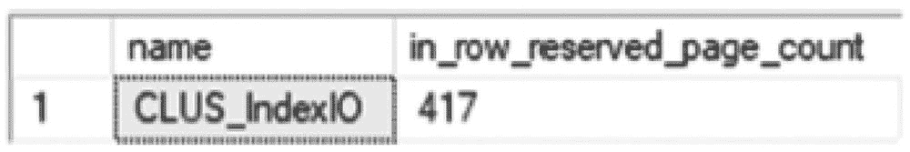

一个表有 2 列标题：`name` 和 `in_row_reserved_page_count`，以及其对应的一行数据：`CLUS_IndexIO` 和 417。

图 11-21：重建操作导致的页面数量

```
USE AdventureWorks2017
GO
ALTER INDEX CLUS_IndexIO ON dbo.IndexIO REBUILD
SELECT we.name, ps.in_row_reserved_page_count
FROM sys.indexes we
INNER JOIN sys.dm_db_partition_stats ps ON we.object_id = ps.object_id AND we.index_id = ps.index_id
WHERE we.name = 'CLUS_IndexIO'
```
代码清单 11-23：重建索引以移除碎片的脚本

这证明了碎片会影响索引中的页面数量。索引中的页面越多，为了获取查询所需的数据就需要读取更多的页面。减少页面数量有助于让 SQL Server 数据库在相同的读取次数内处理更多数据，从而提高它们在更少的页面上读取相同信息的速度。

#### 连续读取

碎片对性能的另一个负面影响与连续读取有关。在 SQL Server 中，连续读取影响其利用预读操作的能力。预读允许 SQL Server 将预计会使用的页面请求到内存中。SQL Server 无需等待为页面生成 I/O 请求，而是可以将大块页面读入内存，预期这些数据页将来会被查询使用。

如前所述，索引内的碎片是由于索引中物理数据页的连续性中断造成的。每次物理页面出现中断时，I/O 操作都必须改变从 SQL Server 读取数据的位置。这就是碎片如何对连续读取造成阻碍的。

## 碎片整理选项

SQL Server 提供了多种方法来移除或缓解索引中的碎片。每种方法都有其优缺点。在本节中，将回顾这些选项以及使用每种选项的原因。


