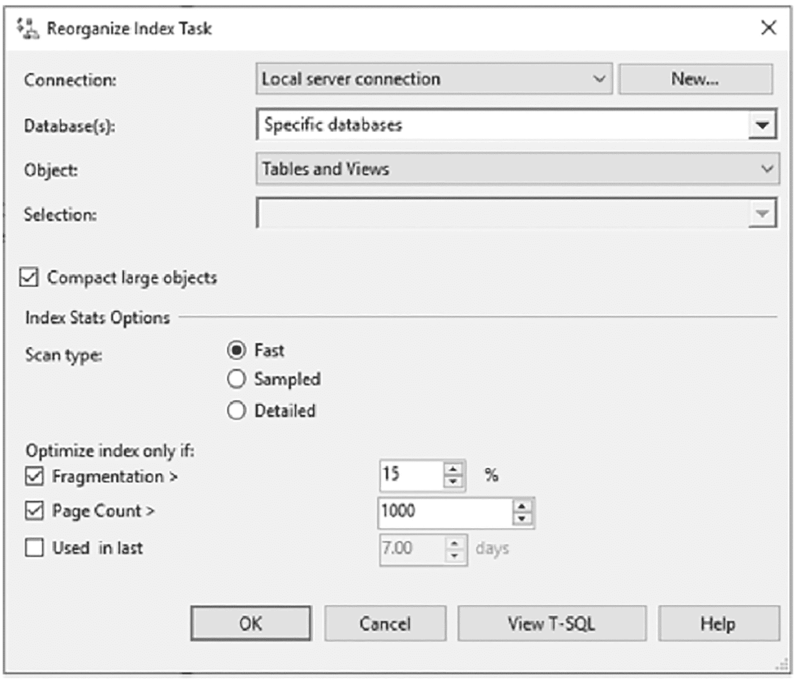
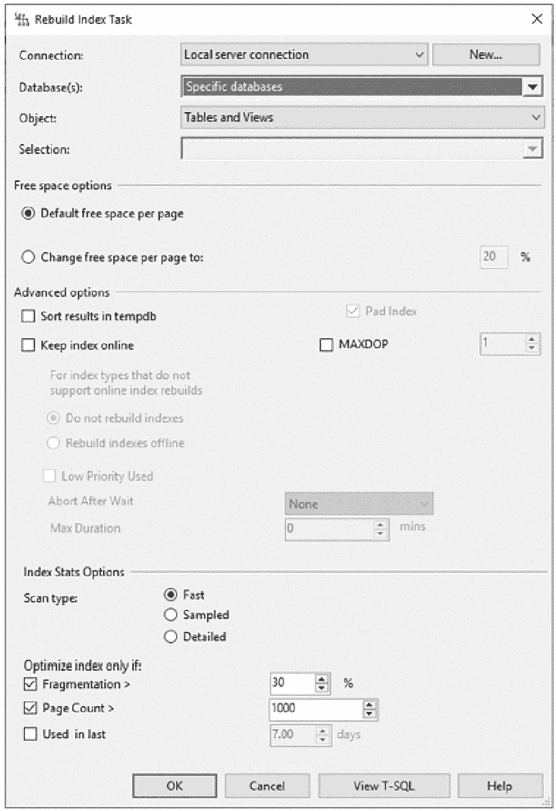
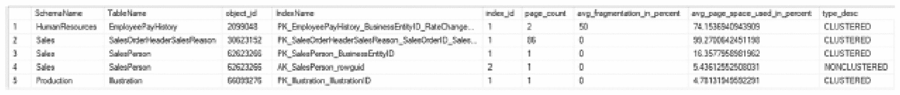
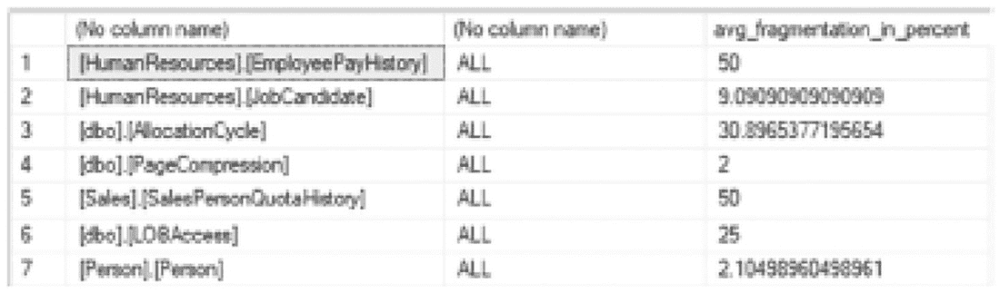
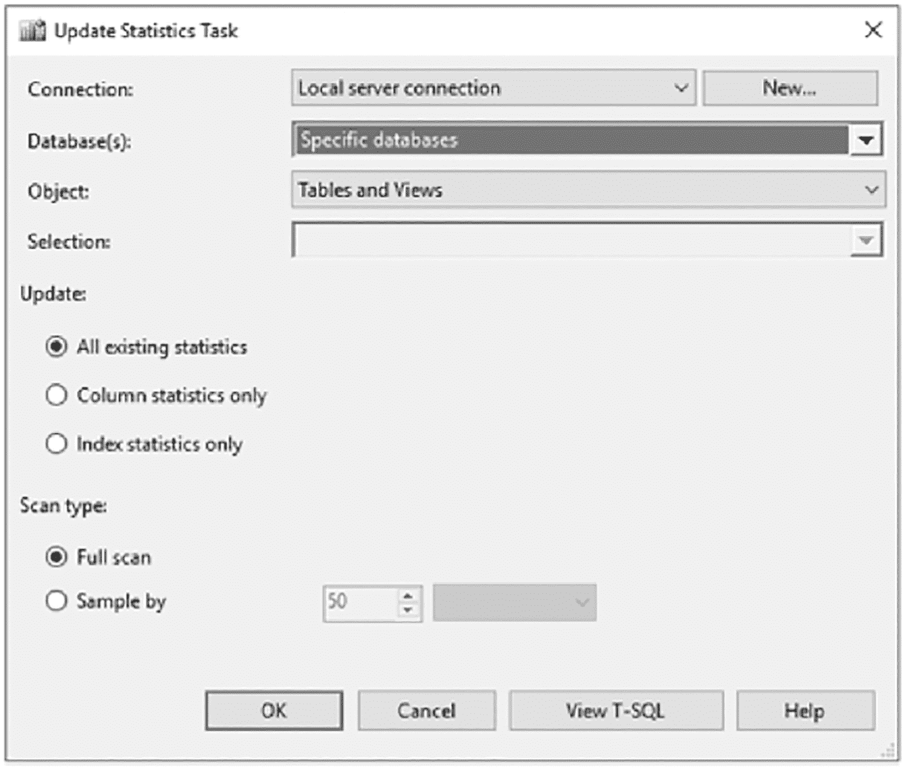

# 索引维护

### 索引重建

从索引中清除碎片的第一种方法是重建索引。重建索引会创建索引的一个新的、连续副本。当新索引完成后，现有的索引将被删除。索引重建操作通过 `CREATE INDEX` 或 `ALTER INDEX` 语句完成。通常，碎片率超过 30% 的索引被认为是重建的良好候选者。请注意，在大多数数据库中，30% 及以下的碎片水平不会对性能产生大的负面影响。虽然 30% 的碎片是一个很好的起点，但每个数据库和索引都应根据实际情况进行评估，如果性能在低于 30% 的碎片时就显示出更明显的负面影响，则应进行调整。

执行索引重建的主要好处是，生成的新索引具有连续的页面。当索引高度碎片化时，有时解决碎片问题的最好方法就是简单地重新开始并重建索引。重建索引的另一个好处是可以在重建过程中修改索引选项。最后，对于大多数索引，在重建期间可以保持在线状态。

> **注意**
>
> 自 SQL Server 2012 起，包含 `varchar(max)`、`nvarchar(max)`、`varbinary(max)` 和 `XML` 数据类型的聚集索引可以在线重建。当聚集索引包含以下数据类型时，仍然无法在线重建：`image`、`ntext` 或 `text`。在线重建仅限于 SQL Server 企业版、开发版和评估版。此外，在线重建需要索引的两倍空间，因为重建完成需要同时存在索引的旧版本和新版本，这对于大表来说可能是个问题。

重建索引的第一个选项是使用 `CREATE INDEX` 语句，如代码清单 11-24 所示。这是通过 `DROP_EXISTING` 索引选项完成的。选择 `CREATE INDEX` 选项而不是 `ALTER INDEX` 有几个原因：

*   需要更改索引定义，例如需要添加或删除列，或者需要更改列的顺序。
*   需要将索引从一个文件组移动到另一个文件组。
*   需要修改索引分区。

```sql
CREATE [ UNIQUE ] [ CLUSTERED | NONCLUSTERED ] INDEX index_name
ON  ( column [ ASC | DESC ] [ ,...n ] )
[ INCLUDE ( column_name [ ,...n ] ) ]
[ WHERE  ]
[ WITH (  [ ,...n ] ) ]
[ ON { partition_scheme_name ( column_name )
| filegroup_name
| default
}
]
[ FILESTREAM_ON { filestream_filegroup_name | partition_scheme_name | "NULL" } ]
[ ; ]
 ::=
DROP_EXISTING = { ON | OFF }
| ONLINE = { ON | OFF }
| RESUMABLE = {ON | OF }
| MAX_DURATION =  [MINUTES]
```
代码清单 11-24
使用 `CREATE INDEX` 重建索引

另一个选项是 `ALTER INDEX` 语句，如代码清单 11-25 所示。此选项在语法中使用 `REBUILD` 选项。从概念上讲，这与 `CREATE INDEX` 语句完成相同的事情，但有以下好处：

*   可以在单条语句中重建表上的多个索引。
*   可以重建索引的单个分区。

```sql
ALTER INDEX { index_name | ALL }
ON 
{ REBUILD
[ [PARTITION = ALL]
[ WITH (  [ ,...n ] ) ]
| [ PARTITION = partition_number
[ WITH ( 
[ ,...n ] )
]
]
]
```
代码清单 11-25
使用 `ALTER INDEX` 重建索引

索引重建的主要缺点是在重建操作期间索引所需的空间量。数据库中至少应有当前索引大小 120% 的可用空间用于重建后的索引。原因是当前索引在重建完成之前不会被删除。在短时间内，索引将在数据库中存在两次。

有两种方法可以减少重建期间索引所需的部分空间。首先，可以使用 `SORT_IN_TEMPDB` 索引选项来减少中间结果所需的空间量。数据库中仍然需要两个索引副本的空间，但不再需要 20% 的缓冲空间。第二种减少空间需求的方法是在重建之前禁用索引。禁用索引会从索引中删除索引和数据页，同时保留索引元数据。这将允许在索引先前占用的空间内重建索引。请注意，禁用选项仅适用于非聚集索引。

从 SQL Server 2019 开始的一个选项是能够恢复索引构建。在线构建索引时，可以将 `RESUMABLE` 选项设置为 `ON`，并将 `MAX_DURATION` 设置为索引构建将运行直到应停止的分钟数。当索引重建停止时，旧索引保持可用，并且重建已完成的部分将被存储，直到重新启动时。此外，如果索引重建在 `RESUMABLE` 选项设置为 `ON` 时失败，这将允许重新启动索引重建。如果事务日志空间不足或索引重建被维护或服务重启中断，这可能非常有用。

在发出重建命令之前，务必考虑索引的大小，因为较大的索引需要更多时间和资源来重建。同时确定索引是否自然是写入密集型的，并且无论对其执行多少维护，都注定会严重碎片化。队列、会话数据或中间数据存储表通常会因频繁的写入操作而严重碎片化。如果这些表的大小有限，那么对它们进行重建将带来很少或没有好处。被识别为符合此使用模式的表可以从索引重建过程中排除，从而将维护资源留给其他能从重建操作中受益更多的表。

### 索引重组

索引重建的替代方法是重组索引。这种类型的碎片整理正如其名。索引中的数据页在已分配给索引的页面之间重新排序。重组完成后，索引中页面的物理顺序与页面的逻辑顺序相匹配。当索引碎片不严重时，应重组索引。通常，碎片少于 30% 的索引是重组的候选者。与所有最佳实践一样，30% 是一个提供坚实维护起点的指导原则。现实世界的用例将存在需要根据表的类型、使用情况和大小来调整此指导原则的情况。

要重组索引，使用 `ALTER INDEX` 语法（见代码清单 11-26）和 `REORGANIZE` 选项。如果需要，重组选项允许一次重组一个分区。

```sql
ALTER INDEX { index_name | ALL }
ON 
| REORGANIZE
[ PARTITION =partition_number ]
[ WITH ( LOB_COMPACTION = { ON | OFF } ) ]
```
代码清单 11-26
使用 `ALTER INDEX` 进行索引重组

使用 `REORGANIZE` 选项有几个好处。首先，在重组期间，索引保持在线或可供优化器在新执行计划或缓存的执行计划中使用。其次，该过程设计为资源使用最少，这显著降低了在事务期间发生锁定和阻塞问题的机会。

索引重组的缺点是重组只使用已分配给索引的数据页。存在碎片时，分配给一个索引的区段常常与其他索引分配的区段交织在一起。重新排序数据页不会使数据页比当前更连续，但会确保已分配的页面按与数据本身相同的顺序排序。


#### 删除并重新创建

索引碎片整理的第三种方法是简单地删除索引并重新创建。包含此选项是为了保证完整性，但请注意它并未被广泛实践或推荐。有几个原因可以说明为什么删除并创建索引可能是个坏主意。

如果索引是聚集索引，那么在删除聚集索引时，所有其他索引都将需要重建。聚集索引和堆使用不同的结构来标识行和存储数据。表上的非聚集索引需要记录位置信息，因此需要重新创建以获取此信息。

如果索引是主键或唯一索引，则很可能存在对该索引的其他依赖关系。例如，该索引可能被外键引用。该索引可能与业务规则（如唯一性）相关联，即使在维护窗口中也无法从表中移除。

避免此方法的第三个原因是，它需要了解索引上的所有属性。使用其他策略时，索引会保留所有现有的索引属性。而通过重新创建索引，存在某个属性未在索引的 DDL 中保留的风险，从而导致索引的重要方面丢失。

索引从该表中删除后，它就无法再被使用。这应该是一个显而易见的问题，但在考虑此选项时常常被忽视。索引的目的通常是它带来的性能提升；将其从表中移除也就带走了这些提升。

### 碎片整理策略

本章至此主要讨论了碎片的产生原因、为何它是个问题以及如何从索引中消除碎片。将这些知识应用到任何给定数据库中的索引上是很重要的。在本节中，将提供两种索引碎片整理的方法。

#### 维护计划

第一个可用的自动化选项是通过维护计划进行碎片整理，这提供了快速创建和安排索引维护的机会，这些维护将对索引进行重组或重建。对于每种索引碎片整理类型，维护计划中都有一个可用的任务。

创建维护计划有几种方式。为简洁起见，将假定用户熟悉 SQL Server 中的维护计划，因此本节将重点介绍与碎片整理索引相关的具体任务。

##### 重组索引任务

第一个可用的任务是重组索引任务。此任务提供了上一节中 `ALTER INDEX REORGANIZE` 语法的封装。配置后，此任务将重组所有符合任务条件的索引。

使用重组索引任务时，需要配置几个属性（参见图 11-22）：



重组索引任务的属性窗口截图，包含连接、数据库、对象、选择、索引统计信息选项，以及仅优化具有选定碎片和页数的索引。

图 11-22

重组索引任务的属性窗口

*   `Connection`: 任务执行时将连接到的 SQL Server 实例。
*   `Database(s)`: 任务将连接到以进行重组的数据库。此属性的选项有：
    *   所有数据库。
    *   所有系统数据库。
    *   所有用户数据库。
    *   这些特定数据库（包含可用数据库列表，必须选择一个）。
    *   忽略状态不是联机的数据库。
*   `Object`: 确定重组是针对表、视图，还是表和视图。
*   `Selection`: 指定此任务影响的表或索引。当在“对象”框中选择“表和视图”时，此选项不可用。
*   `Compact large objects`: 确定重组是否使用选项 `ALTER INDEX LOB_COMPACTION = ON`。
*   `Scan type`: 指示你希望 SQL Server 如何收集剩余选项的统计信息。可用选项为“快速”、“采样”或“详细”。
*   `Optimize index only if`: 提供通过碎片百分比、页数以及索引在过去 7 天内是否被使用来限制重组的能力。

索引统计信息选项在 SQL Server 2016 中引入，是对此功能的一个有益补充。在没有数据库管理员主动管理服务器内索引的环境中，这是确保索引得到维护的一个绝佳选项。

##### 重建索引任务

另一个可用的任务是重建索引任务。这提供了 `ALTER INDEX REBUILD` 语法的封装。配置后，此任务将重建所有符合任务条件的索引。

与重组索引任务类似，重建索引任务在使用前也需要配置多个属性（参见图 11-23）：



重建索引任务的属性窗口截图，包含连接、数据库、对象、选择、可用空间选项、高级选项、索引统计信息选项以及仅优化索引选项。

图 11-23

重建索引任务的属性窗口

*   `Connection`: 任务执行时将连接到的 SQL Server 实例。
*   `Database(s)`: 任务将连接到以进行重建的数据库。此属性的选项有：
    *   所有数据库。
    *   所有系统数据库。
    *   所有用户数据库。
    *   这些特定数据库（包含可用数据库列表，必须选择一个）。
    *   忽略状态不是联机的数据库。
*   `Object`: 确定重建是针对表、视图，还是表和视图。
*   `Selection`: 指定此任务影响的表或索引。当在“对象”框中选择“表和视图”时，此选项不可用。
*   `Default free space per page`: 指定重建是否应使用索引上当前的填充因子。
*   `Change free space per page to`: 允许重建在索引重建时指定新的填充因子。
*   `Sort results in tempdb`: 确定重建是否使用选项 `ALTER INDEX SORT_IN_TEMPDB = ON`。
*   `MAXDOP`: 确定重建的最大并行度，这决定了 SQL Server 可用于重建索引的最大 CPU 线程数。
*   `Keep index online while re-indexing`: 确定重建是否使用选项 `ALTER INDEX ONLINE = ON`。对于无法在线重建的索引，有一个选项可确定是跳过索引还是脱机重建索引。此外，你可以设置“低优先级使用”，以确定阻塞是否会取消索引重建，以及它是自行取消还是取消阻塞者，以及在多长时间后取消。
*   `Scan type`: 指示你希望 SQL Server 如何收集剩余选项的统计信息。可用选项为“快速”、“采样”或“详细”。
*   `Optimize index only if`: 提供通过碎片百分比、页数以及索引在过去 7 天内是否被使用来限制重建的能力。

与重组任务一样，索引统计信息选项是在 SQL Server 2016 中添加的。类似地，这些更改使重建任务成为没有专用数据库管理资源的环境，或需要保持索引维护简单并避免使用自定义代码来管理此过程的环境的可行选择。


#### 维护计划摘要

维护计划提供了一种可以立即开始着手消除索引碎片的方法。这些任务可以在几分钟内配置并安排好。自 SQL Server 2016 增强功能加入以来，它们已成为管理索引维护的绝佳选择。使用其他选项（例如 T-SQL 脚本）的主要原因是在需要额外功能时，例如自定义日志记录或恢复操作的逻辑。

#### T-SQL 脚本

另一种对数据库进行碎片整理的方法是使用 T-SQL 脚本来智能地整理索引。本节将逐步介绍整理单个数据库中所有索引所需的步骤。此方法的主要优点在于能够将所有内容保持在一个精炼的流程中。该脚本将选择最能从碎片整理中受益的索引，确定是重建还是重新组织，并忽略那些收益很小或没有收益的索引。此外，它允许根据业务规则或其他超出维护计划范围的逻辑来自定义维护操作。

为了实现筛选，将应用一些碎片整理最佳实践，以帮助确定是否应对索引进行碎片整理以及应采用何种方法。将使用的指导原则如下：

*   对碎片率低于 30% 的索引进行重新组织。
*   对碎片率达到或超过 30% 的索引进行重建。
*   忽略页数少于 1,000 的索引。
*   如果使用企业版，并且在维护期间需要访问数据，请使用在线重建。
*   如果正在重建聚集索引，请重建表中的所有索引。

**注意** 索引存在碎片并不意味着总是需要对其进行碎片整理。对于小表的索引，进行碎片整理的收益不大。例如，页数少于 8 页的索引将放入一个区中，因此从减少 I/O 的角度来看，对此类索引进行碎片整理没有好处。一些 Microsoft 文档和 SQL Server 专家建议不要对页数少于 1,000 的表进行碎片整理。该值是否适合您的数据库取决于您的具体情况，但它可以作为制定索引维护策略的起点。

碎片整理脚本将执行几个步骤来智能地整理索引：

1.  收集碎片数据。
2.  确定要整理的索引。
3.  构建碎片整理语句。

在开始碎片整理步骤之前，需要一个索引维护脚本的模板。如清单 11-27 所示，该模板声明了多个变量，并使用 `CURSOR` 循环遍历每个索引并执行必要的索引维护。变量在 `DECLARE` 语句中设置，阈值在本节开头定义。模板中还有一个 `table` 变量，用于存储数据库中碎片状态的中间结果。

```sql
DECLARE @MaxFragmentation TINYINT=30
,@MinimumPages SMALLINT=1000
,@SQL nvarchar(max)
,@ObjectName NVARCHAR(300)
,@IndexName NVARCHAR(300)
,@CurrentFragmentation DECIMAL(9, 6)
DECLARE @FragmentationState TABLE
(
SchemaName SYSNAME
,TableName SYSNAME
,object_id INT
,IndexName SYSNAME
,index_id INT
,page_count BIGINT
,avg_fragmentation_in_percent FLOAT
,avg_page_space_used_in_percent FLOAT
,type_desc VARCHAR(255)
)
INSERT INTO @FragmentationState

DECLARE INDEX_CURSE CURSOR LOCAL FAST_FORWARD FOR

OPEN INDEX_CURSE
WHILE 1=1
BEGIN
FETCH NEXT FROM INDEX_CURSE INTO @ObjectName, @IndexName
,@CurrentFragmentation
IF @@FETCH_STATUS  0
BREAK

EXEC sp_ExecuteSQL @SQL
END
CLOSE INDEX_CURSE
DEALLOCATE INDEX_CURSE
```

清单 11-27 索引碎片整理脚本模板

首先，需要收集有关索引的碎片数据并填充到 `table` 变量中。在清单 11-28 的脚本中，使用了 DMF `sys.dm_db_index_physical_stats` 并指定了 `SAMPLED` 选项。使用此选项是为了最小化执行 DMF 对数据库的影响。结果中包含架构、表和索引名称以标识正在报告的索引，以及 `object_id` 和 `index_id`。来自 DMF 的关于索引碎片的统计列包含在 `page_count`、`avg_fragmentation_in_percent` 和 `avg_page_space_used_in_percent` 列中。结果中的最后一列是 `has_LOB_column`。此列是关联子查询的结果，用于确定索引中的任何列是否为 LOB 类型，LOB 类型不允许在线索引重建。

```sql
SELECT
s.name as SchemaName
,t.name as TableName
,t.object_id
,we.name as IndexName
,we.index_id
,x.page_count
,x.avg_fragmentation_in_percent
,x.avg_page_space_used_in_percent
,we.type_desc
FROM sys.dm_db_index_physical_stats(db_id(), NULL, NULL, NULL, 'SAMPLED') x
INNER JOIN sys.tables t ON x.object_id = t.object_id
INNER JOIN sys.schemas s ON t.schema_id = s.schema_id
INNER JOIN sys.indexes we ON x.object_id = we.object_id AND x.index_id = we.index_id
WHERE x.index_id > 0
AND x.avg_fragmentation_in_percent > 0
AND alloc_unit_type_desc = 'IN_ROW_DATA'
```

清单 11-28 收集碎片数据的脚本

清单 11-28 中查询的结果会因每个读者而异。通常，结果应类似于图 11-24 中的结果，其中包含了 `AdventureWorks2017` 数据库中的聚集索引、非聚集索引和 XML 索引。



一个包含 9 列 5 行的表。列标题为：架构名、表名、对象 i d、索引名、索引 id、页数、平均碎片百分比、平均页面空间使用百分比、类型降序。它包括聚集和非聚集索引。

图 11-24 表碎片数据查询结果

碎片整理脚本的下一步是构建需要整理的索引列表。通过清单 11-29 创建的索引列表用于填充游标。然后游标循环遍历每个索引以执行碎片整理。脚本中一个值得注意的点是，对于聚集索引，将重建所有底层索引。这不是碎片整理索引时的必需操作，但应考虑此选项。当表上只有少数索引时，这可能是一种值得采用的管理方式。随着索引数量的增加，这种方法可能变得不那么有吸引力。此查询的结果应类似于图 11-25 中的结果。



一个包含三列的表。表头为：无列名、无列名、平均碎片百分比。人力资源员工薪资历史记录被高亮显示。

图 11-25 用于重建/重新组织操作的索引

```sql
SELECT  QUOTENAME(x.SchemaName)+'.'+QUOTENAME(x.TableName)
,CASE WHEN x.type_desc = 'CLUSTERED' THEN 'ALL'
ELSE QUOTENAME(x.IndexName) END
,x.avg_fragmentation_in_percent
FROM    @FragmentationState x
LEFT OUTER JOIN @FragmentationState y ON x.object_id = y.object_id AND y.index_id = 1
WHERE   (
x.type_desc = 'CLUSTERED'
AND y.type_desc = 'CLUSTERED'
)
OR y.index_id IS NULL
ORDER BY x.object_id
,x.index_id
```

清单 11-29 用于识别碎片化索引的脚本


模板的最后一部分是魔法生效之处。代码清单 11-30 中的脚本用于构建 `ALTER INDEX` 语句，以进行索引碎片整理。此时，会检查碎片级别以确定是执行 `REBUILD`（重建）还是 `REORGANIZATION`（重组）。对于支持 `ONLINE`（在线）索引重建的索引，会使用 `CASE` 语句添加相应的语法。

```
SET @SQL = CONCAT('ALTER INDEX ', @IndexName,' ON ',@ObjectName,
CASE WHEN @CurrentFragmentation <= 30 THEN ' REORGANIZE;'
ELSE ' REBUILD' END,
CASE WHEN CONVERT(VARCHAR(100), SERVERPROPERTY('Edition')) LIKE 'Enterprise%'
OR CONVERT(VARCHAR(100), SERVERPROPERTY('Edition')) LIKE 'Developer%'
THEN ' WITH (ONLINE=ON, SORT_IN_TEMPDB=ON) ' END, ';');
代码清单 11-30
构建索引碎片整理语句的脚本
```

**注意**

SQL Server 2017 企业版的一项改进是，当索引包含大型对象（LOB）数据类型的列时，能够执行在线索引重建。

将所有部分与本节开头的模板结合起来，创建一个索引碎片整理脚本，其提供的功能与维护计划任务类似。通过能够设置发生碎片整理的大小和碎片级别，此脚本仅对真正需要处理的索引消除碎片，而不是对数据库中的每个索引进行碎片整理。在 `AdventureWorks2017` 上使用 Extended Events 追踪脚本输出，显示先前查询结果的 `ALTER INDEX` 语法与代码清单 11-31 中的语法类似。

```
ALTER INDEX ALL ON [HumanResources].[EmployeePayHistory] REBUILD WITH (ONLINE=ON, SORT_IN_TEMPDB=ON) ;
ALTER INDEX ALL ON [HumanResources].[JobCandidate] REORGANIZE; WITH (ONLINE=ON, SORT_IN_TEMPDB=ON) ;
ALTER INDEX ALL ON [dbo].[AllocationCycle] REBUILD WITH (ONLINE=ON, SORT_IN_TEMPDB=ON) ;
ALTER INDEX ALL ON [dbo].[PageCompression] REORGANIZE; WITH (ONLINE=ON, SORT_IN_TEMPDB=ON) ;
ALTER INDEX ALL ON [Sales].[SalesPersonQuotaHistory] REBUILD WITH (ONLINE=ON, SORT_IN_TEMPDB=ON) ;
代码清单 11-31
索引碎片整理语句
```

正如本节代码所演示的，使用 T-SQL 脚本可能比使用维护计划任务复杂得多。这种复杂性的优点在于，一旦脚本完成，它可以被包装在存储过程中，并在任何 SQL Server 实例上使用。此脚本旨在作为使用 T-SQL 脚本实现自动化碎片整理的第一步。它没有考虑分区表，也没有在重建或重组索引之前检查索引是否正在被使用。优点在于，脚本化解决方案可以智能地决定如何及何时整理索引碎片，而不是像“开卡车”一样粗放地对一组数据库进行重新索引。

此外，自定义 T-SQL 解决方案可以允许对数据库、表或索引进行自定义的维护或忽略。当管理员对应用程序的工作方式有深入了解，并且知道哪些索引需要特殊维护（或根本不需要）时，这非常有帮助。

**注意**

有关完整的索引碎片整理解决方案，请查看 Ola Hallengren 的索引维护脚本：`https://ola.hallengren.com`。

## 防止碎片化

索引内的碎片化并非总是不可避免。可以采用一些方法来减缓碎片化的发生速率。当存在经常受碎片化影响的索引时，建议调查碎片化发生的原因。

这项研究可能会发现应用程序、服务器或维护方面的问题，这些问题可以通过与索引维护无关的其他方式解决。因此，了解应用程序及其基础架构的运行方式，可以为查询或使用模式中的次优情况提供宝贵的见解。例如，一个应用程序更新表的频率可能远超所需。这些更新可能导致意外的碎片化。对于此类问题，解决应用程序错误也能减少碎片化，而无需实施任何额外的索引或维护选项。

有几种策略可以帮助减轻碎片化；它们是填充因子、数据类型和默认值。

### 填充因子

填充因子是构建或重建索引时可以使用的一个选项。此属性用于确定索引首次创建或下次重建时，每个数据页中应保留多少可用空间。例如，填充因子为 75 时，每个数据页大约 25% 的空间会保持为空。

如果一个索引遇到显著或频繁的碎片化，调整填充因子以减轻碎片化是值得的。通过这样做，导致碎片化活动的影响应该会减小，从而降低索引需要进行碎片整理的频率。

默认情况下，SQL Server 创建所有索引时填充因子为 0。这是服务器和数据库级别的推荐值。并非所有索引都是一样的，填充因子应根据需要应用，而不是作为一项一刀切的保险策略。此外，填充因子为 0 等同于填充因子为 100。

填充因子的一个缺点是，在数据页中保留可用空间意味着索引将需要更多的数据页来容纳所有记录。更多的页面意味着使用更多的存储空间、更多的 I/O，并且如果有其他索引可供选择，索引的利用率可能更低。

### 数据类型

避免碎片化的另一种方法是通过适当的数据类型选择。此策略适用于长度可能因其包含的数据而改变的数据类型。这些数据类型包括 `VARCHAR` 和 `NVARCHAR`，它们的长度可能随时间变化。

在许多情况下，可变长度数据类型非常适合表中的列。当数据的变动性很高且数据长度也具有变动性时，问题就会出现。随着数据长度的变化，可能会发生页拆分，从而导致碎片化。如果长度变动发生在索引的很大一部分上，那么也可能有大量页拆分，从而导致碎片化。

一个关于不良数据类型的例子来自我参与的第一个数据仓库的经验。许多表的原始设计包括一个数据类型为 `VARCHAR(10)` 的列。该列填充了格式为 `yyyymmdd` 的日期，值类似于 20191011。作为导入过程的一部分，日期值被更新为 `yyyy-mm-dd` 格式。当导入移到生产环境，并且一次处理数百万行时，列长度从八个字符增加到十个字符，由于页拆分导致了惊人的碎片化水平。解决问题的办法很简单，就是将列的数据类型从 `VARCHAR(10)` 更改为 `CHAR(10)`。

如此简单的解决方案可以应用于许多数据库。这需要对碎片化发生的原因进行一些调查，但通过逐步跟踪写入操作，可以确定碎片化发生的时间，并能够制定相应的应对措施。


### 默认值

合理应用默认值看似与防止碎片化无关，但在某些场景下，它能对碎片化产生显著影响。此类优化最典型的案例是数据库使用 `uniqueidentifier` 数据类型时。

大多数情况下，`uniqueidentifier` 值是通过 `NEWID()` 函数生成的。此函数创建一个全局唯一标识符（GUID），理论上在整个地球上都应是唯一的。这对于为行生成唯一标识很有用，但其作用域可能超出了数据库的需求。很多时候，唯一值可能只需要在服务器或表级别保持唯一即可。

`NEWID()` 函数的主要问题在于，生成 GUID 并非一个顺序过程。如本章开头所示，使用此函数为聚集索引键生成值会导致严重的碎片化。

`NEWID()` 函数的一个替代方案是 `NEWSEQUENTIALID()` 函数。该函数同样返回 GUID，但其生成值的方式有几点不同。首先，在服务器上由该函数生成的每个 GUID 都与前一个值顺序相关。第二个区别是，生成的 GUID 值仅在生成它的服务器上是唯一的。如果另一个 SQL Server 实例对同一个表使用此函数生成 GUID，则可能产生重复值，并且由于作用域是服务器级别，这些值也不会是顺序的。

考虑到这些限制，如果一个表必须使用 `uniqueidentifier` 数据类型，那么 `NEWSEQUENTIALID()` 函数是 `NEWID()` 函数的一个绝佳替代方案。它生成的值将是顺序的，所遇到的碎片量将大大减少，频率也更低。

## 索引统计信息维护

在第 3 章中，讨论了收集索引统计信息的相关内容。这些统计信息为查询优化器提供了关键信息，用于编译查询的执行计划。当此信息过时或不准确时，数据库将提供次优或不正确的查询计划。

在大多数情况下，索引统计信息不需要大量维护。本节将回顾 SQL Server 中可用于创建和更新统计信息的内部流程。同时也会讨论在自动化流程跟不上索引内数据变化速率时，维护统计信息的方法。

需要注意的是，SQL Server 中的统计信息是对表中数据基数（行数）和值频率的估计。它们并非实时维护，因为实时维护的成本过高。

### 自动维护统计信息

在 SQL Server 中构建和维护统计信息最简单的方法是让 SQL Server 自动完成。有三个数据库属性控制 SQL Server 是否自动构建和维护统计信息：

*   `AUTO_CREATE_STATISTICS`
*   `AUTO_UPDATE_STATISTICS`
*   `AUTO_UPDATE_STATISTICS_ASYNC`

默认情况下，前两个属性在数据库中是启用的。最后一个选项默认是禁用的。在大多数场景下，这三个属性都应启用。

#### 自动创建

第一个数据库属性是 `AUTO_CREATE_STATISTICS`。此属性指导 SQL Server 自动在没有统计信息的列上创建单列统计信息。从索引的角度看，此属性没有影响。创建索引时，会为索引创建一个统计信息对象。

#### 自动更新

接下来的两个属性是 `AUTO_UPDATE_STATISTICS` 和 `AUTO_UPDATE_STATISTICS_ASYNC`。从高层次来看，这两个属性非常相似。当超过一个内部阈值时，SQL Server 将启动统计信息对象的更新。更新操作旨在使统计信息对象中的值与表中数据的实际基数保持同步。

触发统计信息更新的阈值可能因表而异。该阈值基于与已更改行数相关的几个计算。对于空表，当向表中添加超过 500 行时，将触发统计信息更新。如果表已有超过 500 行，那么当修改的行数达到 500 行加上表中总行数的 20% 时，统计信息将被更新。此时，SQL Server 将安排更新统计信息。随着表中行数的增加，20% 的阈值会相应降低，以适应表中数据量更大时需要更频繁更新统计信息的需求。大约在 50 万行时，该百分比降至约 5%，而对于超过 10 亿行的表，则降至不到 1%。此行为类似于之前通过跟踪标志 2371 实现的功能，该标志自 SQL Server 2016 起默认开启。

当统计信息更新发生时，有两种模式：同步和异步。默认情况下，统计信息是同步更新的。这意味着当统计信息被判定为过时并需要更新时，查询优化器会等待统计信息更新完成后，再编译查询的执行计划。这对于数据易变的表非常有用。例如，`TRUNCATE TABLE` 操作前后的表统计信息会大不相同。也可以选择通过启用 `AUTO_UPDATE_STATISTICS_ASYNC` 属性来异步更新统计信息。这改变了查询优化器在触发更新统计信息事件时的反应方式。查询优化器不再等待统计信息更新完成，而是基于现有统计信息编译执行计划，并在更新完成后为后续查询使用更新后的统计信息。对于查询量高、数据吞吐量大的数据库，这通常是更新统计信息的首选方式。它避免了事务吞吐量出现偶尔的停顿，查询能够顺畅执行，执行计划在获得改进的信息后随之更新。

对于之前在旧版 SQL Server 中禁用了 `AUTO_UPDATE_STATISTICS` 的环境，现在考虑启用它并配合 `AUTO_UPDATE_STATISTICS_ASYNC` 是值得的。过去禁用 `AUTO_UPDATE_STATISTICS` 的最主要原因是担心更新统计信息导致的延迟。有了启用 `AUTO_UPDATE_STATISTICS_ASYNC` 的选项，这些性能顾虑很可能得以缓解。除非有充分的理由并经过彻底论证，否则不应禁用统计信息的自动更新。


#### 防止自动更新

根据表上的索引情况，有时自动更新索引统计信息弊大于利。例如，对大型表执行自动统计信息更新可能会在统计信息对象更新期间导致性能问题。在这种情况下，现有的统计信息对象可能足够好用，直到下一个维护窗口。同样，通过受控数据加载过程经历大量数据更新的表，最好在数据加载过程结束时更新统计信息，而不是自动进行。

有多种方法可以禁用单个统计信息对象上的 `AUTO_UPDATE_STATISTICS`，而不是在整个数据库范围内禁用：

*   对统计信息对象执行 `sp_autostats` 系统存储过程

*   在 `UPDATE STATISTICS` 或 `CREATE STATISTICS` 语句上使用 `NORECOMPUTE` 选项

*   在 `CREATE INDEX` 语句上使用 `STATISTICS_NORECOMPUTE`

这些选项都可用于禁用或启用索引上的 `AUTO_UPDATE_STATISTICS` 选项。在禁用此功能之前，请务必验证统计信息更新是否真正必要。

#### 内存优化表统计信息

在考虑统计信息时，内存优化表是一个统计信息创建和使用方式略有不同的领域。重要的是要理解，无法在内存优化表上自动生成统计信息，并且始终需要完整扫描。此外，内存优化表上的本机编译存储过程仅在存储过程编译或 SQL Server 重启时检索统计信息。这意味着在考虑统计信息对索引的影响时，内存优化表在安排统计信息对象的维护时机方面需要格外小心。

### 手动维护统计信息

有时，用于维护统计信息的自动化流程可能不够好。这通常与数据正在发生变化但不足以触发统计信息更新的情况有关。发生这种情况的一个例子是更新语句改变了表的基数但未影响大量行。例如，如果表中 10% 的数据从多个值更改为单个值，那么查询数据的执行计划最终可能不是最优的。在这种情况下，能够手动更新统计信息是有价值的。与索引碎片整理一样，有两种手动维护统计信息的方法：

*   维护计划

*   T-SQL 脚本

在接下来的部分中，将解释每种方法，并提供如何实现它们的演练。

#### 维护计划

在维护计划中，有一个允许进行统计信息维护的任务：更新统计信息任务。使用此任务时，可以配置许多属性来控制其行为（参见图 11-26）：



更新统计信息任务属性窗口的屏幕截图，包含连接、数据库、对象、选择、更新和扫描类型。

图 11-26

更新统计信息任务的属性窗口

*   *连接*：任务执行时将连接到的 SQL Server 实例。

*   *数据库*：任务将连接到以进行维护过程的数据库。此属性的选项包括：
    *   所有数据库。

    *   所有系统数据库。

    *   所有用户数据库。

    *   这些特定数据库（包含可用数据库列表，必须选择一个）。

    *   忽略状态不为在线的数据库。

*   *对象*：确定重建是针对表、视图，还是表和视图。

*   *选择*：指定此任务影响的表或索引。当在“对象”框中选择“表和视图”时，此选项不可用。

*   *更新*：对于每个表，确定是更新所有现有统计信息、仅列统计信息（使用 `WITH COLUMN` 子句），还是仅索引统计信息（使用 `WITH INDEX` 子句）。

*   *扫描类型*：在完整扫描索引的所有叶级页面与“抽样”之间进行选择，后者将扫描一定百分比或数量的行来构建统计信息对象。

与之前讨论的维护计划不同，更新统计信息任务没有更深入的控制来帮助确定是否应更新统计信息。一个有用的选项是将统计信息更新限制在指定的日期范围内，这将减少每次执行期间更新的统计信息数量。在大多数情况下，缺少该选项不会造成问题。统计信息更新不像索引更新那样每次更新都需要足够的空间来重建整个索引。然而，能够保留当前的抽样扫描类型会很好，因为这可能会影响性能，并且采用一刀切的方法可能无法达到预期的性能效果。

#### T-SQL 脚本

通过 T-SQL，有几种替代方法可用于更新统计信息：使用存储过程或使用 DDL 语句。每种方法都有其优缺点。在接下来的部分中，将讨论每种方法以及它可能成为一种有价值方法的原因。

##### 存储过程

在 `master` 数据库中，有一个名为 `sp_updatestats` 的系统存储过程，可用于更新数据库中的所有统计信息。由于它是一个系统存储过程，因此可以从任何数据库调用它，以更新调用该过程的数据库中的统计信息。

当执行 `sp_updatestats` 时，它会使用 `ALL` 选项运行 `UPDATE STATISTICS` 语句（下一节将描述）。该存储过程接受一个名为 `resample` 的参数，如清单 11-32 所示。`resample` 参数仅接受值 `resample`。如果提供了此值，则存储过程使用 `UPDATE STATISTICS` 的 `RESAMPLE` 选项。否则，存储过程使用 SQL Server 中的默认抽样算法。

```
sp_updatestats [ [ @resample = ] 'resample']
```
清单 11-32
`sp_updatestats` 语法

使用 `sp_updatestats` 的一个好处是，它只会更新那些数据已发生修改的项目的统计信息。会检查用于触发自动统计信息更新的内部计数器，以确保仅更新已更改的统计信息。此外，`resample` 选项使用统计信息最近使用的抽样率。

在需要更新统计信息的情况下，`sp_updatestats` 是一个很好的工具，它仅更新那些自上次更新以来可能已过时的统计信息。如果说更新统计信息任务是一张覆盖整个数据库的巨大毯子，那么 `sp_updatestats` 就是一张恰到好处地覆盖关键部位的被子。

