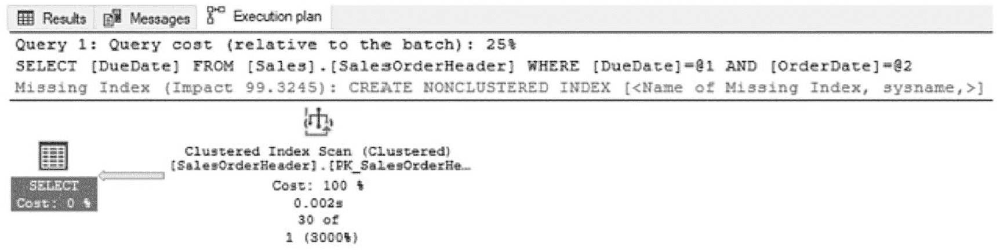
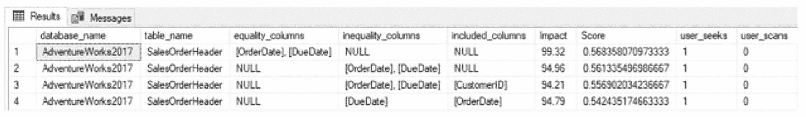
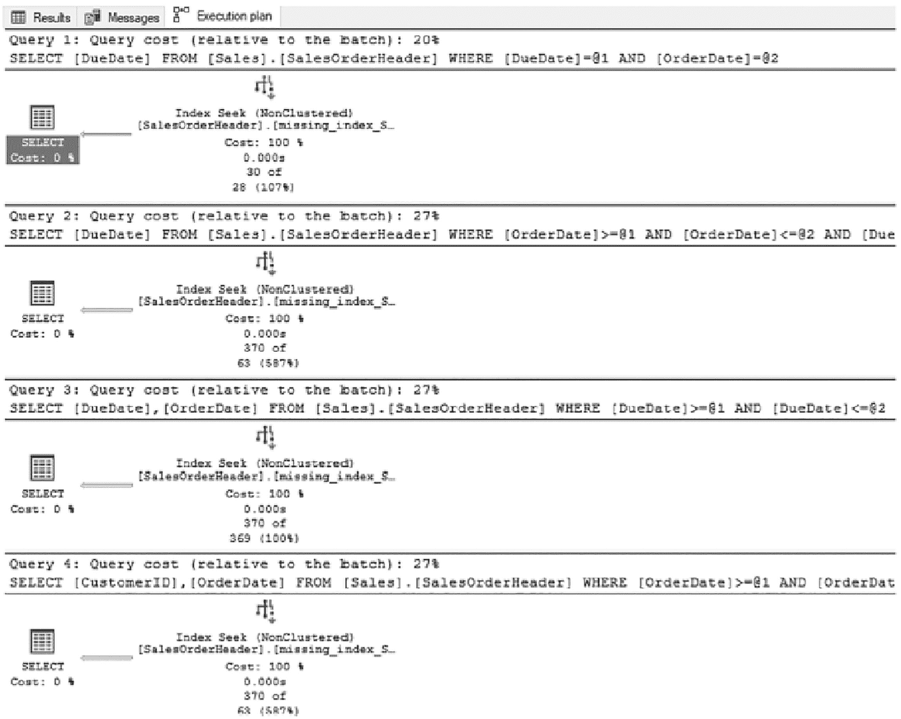
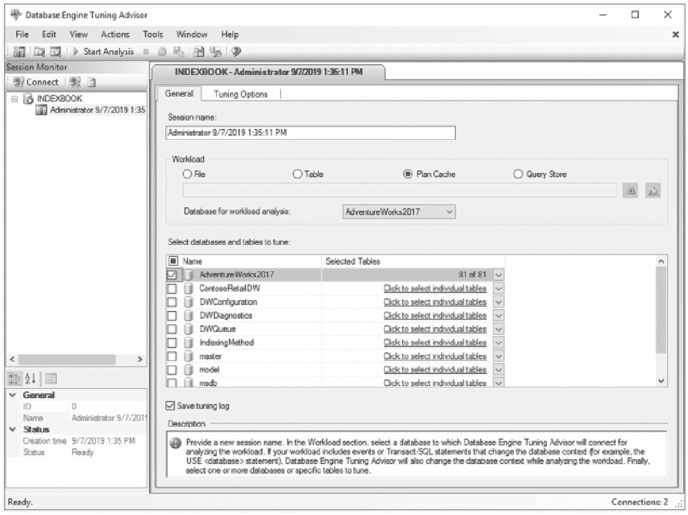
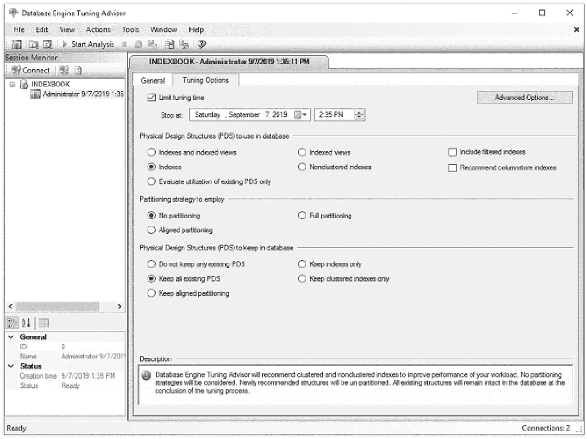
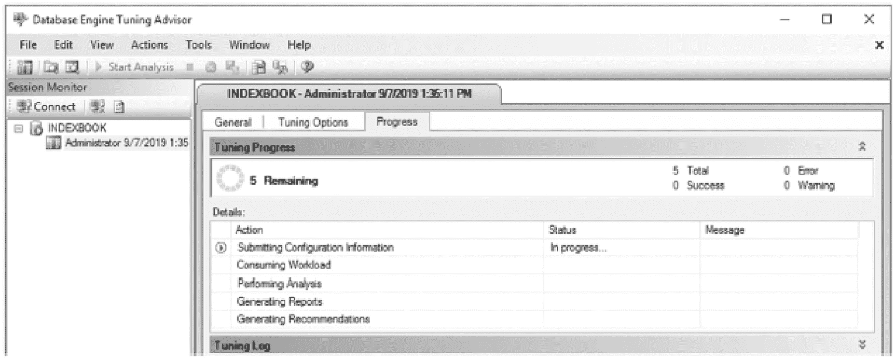
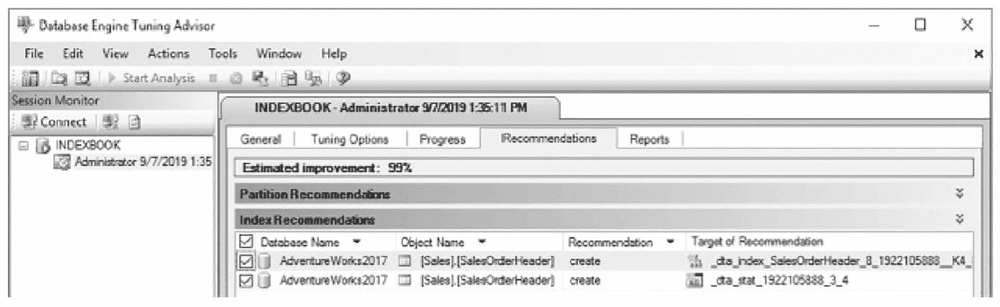
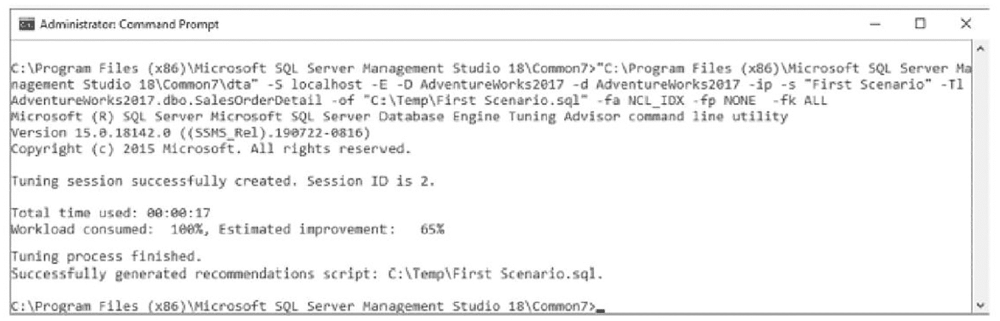
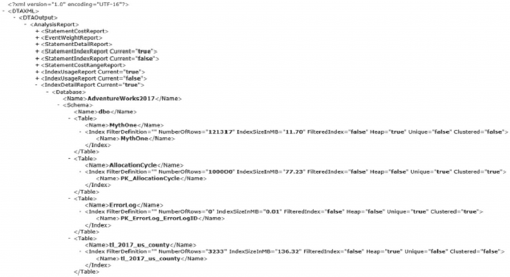

# 12. 索引工具

## 概要

本章介绍了多种影响表索引的维护考量因素，这些因素对于确保最佳查询性能至关重要。它们可归结为管理索引碎片和管理其统计数据。对于索引碎片，讨论了索引可能碎片化的方式、其成为问题的原因以及消除碎片的策略。这些维护任务对于确保 SQL Server 能够最大限度地利用索引至关重要。除了维护活动外，索引的统计数据也必须得到维护。过时或不准确的统计数据可能导致执行计划与表中的数据不匹配。如果没有正确的执行计划，无论索引是否存在，性能都会受到影响。

### DDL 命令

更新统计信息的另一个选项是通过 DDL 命令 `UPDATE STATISTICS`，如清单 11-33 所示。`UPDATE STATISTICS` 语句允许对每个统计信息进行精细调整的更新，并提供了多种用于收集和构建统计信息的选项。

```sql
UPDATE STATISTICS table_or_indexed_view_name
[
{
{ index_or_statistics_name }
| ( { index_or_statistics_name } [ ,...n ] )
}
]
[    WITH
[
FULLSCAN
[ [ , ] PERSIST_SAMPLE_PERCENT = { ON | OFF } ]
| SAMPLE number { PERCENT | ROWS }
[ [ , ] PERSIST_SAMPLE_PERCENT = { ON | OFF } ]
| RESAMPLE
[ ON PARTITIONS ( { <partition_number> | <range> } [, ...n] ) ] ]
[ [ , ] [ ALL | COLUMNS | INDEX ]
[ [ , ] NORECOMPUTE ]
[ [ , ] INCREMENTAL = { ON | OFF } ]
[ [ , ] MAXDOP = max_degree_of_parallelism ]
] ;
```

清单 11-33. `UPDATE STATISTICS` 语法

使用 `UPDATE STATISTICS` 时，第一个设置的参数是 `table_or_indexed_view_name`。此参数引用将要更新统计信息的表。使用 `UPDATE STATISTICS` 命令，一次只能更新一个表或视图的统计信息。

下一个参数是 `index_or_statistics_name`。此参数用于确定是更新单个统计信息、统计信息列表还是表上的所有统计信息。要更新单个统计信息，请在表名或视图名后包含统计信息对象的名称。对于统计信息列表，统计信息名称应包含在括号内的逗号分隔列表中。如果未指定任何统计信息，则将考虑更新所有统计信息。

设置好参数后，需要将相应的选项添加到 `UPDATE STATISTICS` 命令中。这正是此语法强大和灵活之处所在。这些参数允许根据统计信息中的可用数据对其进行精细调整，以便为正确的表和正确的索引获取合适的统计信息：

*   `FULLSCAN`：构建统计信息对象时，扫描表或视图中的所有行和页。对于大型表，在创建统计信息对象时会影响性能。这等同于执行 `SAMPLE 100 PERCENT` 操作。
*   `SAMPLE`：使用表或视图中行的计数或百分比样本来创建统计信息对象。如果未选择采样率，SQL Server 将根据表中的行数确定合适的采样率。
*   `RESAMPLE`：使用上次更新统计信息时的采样率进行更新。例如，如果上次更新使用了 `FULLSCAN`，那么 `RESAMPLE` 也将导致 `FULLSCAN`。
*   `PERSIST_SAMPLE_PERCENT`：确定定义的采样率是否应持久化到统计信息中，作为未来未指定默认值时的默认值。
*   `ALL | COLUMNS | INDEX`：确定应更新列统计信息、索引统计信息还是两者都更新。
*   `NORECOMPUTE`：禁用查询优化器请求自动更新统计信息的选项。这对于锁定不应更改或使用当前采样率是最优的统计信息非常有用。在频繁修改数据的表上使用此选项时需谨慎，并确保有其他机制在需要时更新统计信息。
*   `INCREMENTAL`：启用时，统计信息将创建为按分区统计信息，这允许使用 `ON PARTITIONS` 子句按分区更新统计信息。
*   `MAXDOP`：确定统计信息更新操作的最大并行度，并覆盖服务器的最大并行度配置。

此列表中的前三个选项是互斥的。只能选择其中一个选项。选择多个选项将产生错误。

由于 `UPDATE STATISTICS` 是 DDL 命令，它可以很容易地实现自动化，类似于索引碎片整理的自动化。为简洁起见，未包含示例脚本，但可以以索引碎片维护模板为起点。`sp_updatestats` 在底层使用了 `UPDATE STATISTICS`。这个 DDL 命令是一种强大的方式，可以按需更新数据库中的统计信息，而无需执行超出必要的操作。延续上一节的类比，使用 `UPDATE STATISTICS` 相当于用一件手工定制的、合身的毛衣替代了通用的毯子和被子。

关于索引，Microsoft 在 SQL Server 中内置了两个工具，可用于帮助识别可以改善数据库性能的索引。它们是缺失索引动态管理对象（DMO）和数据库引擎优化顾问（DTA）。这两个工具都有助于索引数据库，并且在调整数据库时可以提供有价值的输入。

此外，Azure SQL Database 包含一个名为“自动索引管理”的功能。此功能根据使用情况自动创建和删除索引，旨在用于没有开发人员或管理员可用以监视和管理索引的环境。

本章深入探讨了这些工具，描述了如何使用它们以及各自的优点。本章分为两节，分别描述每个工具的功能，并简要讨论自动索引管理。


## 缺失索引

缺失索引动态管理对象（DMOs）是一组管理对象，它们提供来自查询优化器的索引反馈。当查询优化器编译执行计划时，它可以识别出将一组列的统计信息物化为物理索引是否将提升性能。在这些情况下，查询优化器将编译结果并将信息存储在缺失索引 DMOs 中。

缺失索引 DMOs 提供了几点好处。首先，缺失索引信息是从查询优化器收集的，无需您执行任何操作。与 `Extended Events` 和其他性能监控工具不同，无需对其进行配置和启用即可收集信息。另一个考虑是，缺失索引信息是基于在 SQL Server 实例上实际发生的活动。索引建议并非基于您认为可能在生产环境中发生的测试负载，而是基于生产负载本身。随着数据库中数据使用模式的变化，缺失索引的建议也会随之改变。

尽管缺失索引 DMOs 提供了诸多好处，但在使用它们时，考虑几个注意事项非常重要。缺失索引 DMOs 的局限性可以总结为以下几个类别：

*   队列大小

*   分析深度

*   准确性

*   索引类型

缺失索引的队列大小是一个容易被忽视的限制。无论 SQL Server 实例上有多少个数据库，最多只能有 600 个缺失索引组。一旦识别出 600 个缺失索引组，查询优化器将停止报告新的缺失索引建议。它不会去判断一个新的可能缺失索引是否比已报告的项目质量更高；相关信息根本不会被收集。当这种情况发生时，微软建议处理现有的索引建议，以帮助缓解此限制。

> **注意**
>
> 与其他动态管理对象一样，缺失索引 DMOs 中的信息在 SQL Server 重启时会重置，并且每当数据库离线时，该数据库的信息也会被删除。

在考虑缺失索引的信息时，分析深度是每次审查建议时都需要考虑的一个限制。查询优化器只考虑当前的执行计划以及缺失索引是否会对该执行计划有益。有时，将缺失索引添加到数据库中会导致一个新的执行计划，而这个新计划又会带来新的缺失索引建议。这些建议只是提升执行计划性能的第一步。此限制的另一半是，缺失索引详情不包括测试来确定建议的缺失索引中的列顺序是否最优。在查看缺失索引建议时，需要进行测试以确定正确的列顺序。

缺失索引建议的第三个限制是其返回统计信息的准确性。关于这个限制，有两点需要考虑。当查询使用不等式谓词时，其成本信息不如使用等式谓词返回的信息有效。此外，可能会返回具有不同成本估算的同一缺失索引建议。如何以及在何处利用缺失索引可能会改变所计算的成本估算。对于每个成本估算，都会记录一个缺失索引建议。

最后，缺失索引工具在它可以建议的索引类型方面存在限制。主要限制是索引类型，即缺失索引无法建议聚集索引、XML 索引、空间索引或列存储索引。这些建议也不会包含关于何时创建过滤索引的信息。同样地，建议有时可能只包含 `INCLUDED` 列。当这种情况发生时，需要将其中一个 `INCLUDED` 列指定为键列。

> **注意**
>
> 每当对表进行元数据操作时，该表的缺失索引信息将被删除。例如，当向表中添加一列时，缺失索引信息将被删除。一个不太明显的例子是当表上的索引发生变化时。在这种情况下，缺失索引信息也会被删除。

正如本书其他地方提到的，仔细权衡一个新索引是否足够有价值以保证其创建，始终是很重要的。盲目遵循这些 DMOs 中的每一个索引建议，将很快导致表被过度索引。在介绍这些 DMOs 时请牢记这一点，因为它有助于强调一个事实：并非所有索引都是平等的。有些能提供卓越的价值，而另一些的维护成本可能超过其带来的价值。

### 解读 DMOs

有四个 DMOs 可用于返回有关缺失索引的信息。每个 DMO 提供了构建索引所需的部分信息，查询优化器可使用这些索引来提升查询性能。缺失索引相关的 DMOs 如下：

*   `sys.dm_db_missing_index_details`
*   `sys.dm_db_missing_index_columns`
*   `sys.dm_db_missing_index_group_stats`
*   `sys.dm_db_missing_index_groups`

在接下来的四个小节中，将逐一审视每个动态管理对象，并详细介绍它们如何提供有关如何识别缺失索引的信息。


### sys.dm_db_missing_index_details

动态管理对象 (DMO) `sys.dm_db_missing_index_details` 是一个动态管理视图 (DMV)，用于返回缺失索引的建议列表。该视图中的每一行都提供了一个单独的缺失索引建议。表 12-1 中的列提供了有关数据库和要创建索引的表的信息，还包括了应构成索引键的列以及索引的包含列。

表 12-1

`sys.dm_db_missing_index_details` 中的列

| 列名 | 数据类型 | 描述 |
| --- | --- | --- |
| `index_handle` | `int` | 每个缺失索引建议的唯一标识符。这是此 DMV 的键值。 |
| `database_id` | `smallint` | 标识存在缺失索引的表所在的数据库。 |
| `object_id` | `int` | 标识缺失索引的表。 |
| `equality_columns` | `nvarchar(4000)` | 逗号分隔的列列表，这些列参与了相等谓词。 |
| `inequality_columns` | `nvarchar(4000)` | 逗号分隔的列列表，这些列参与了不等谓词。 |
| `included_columns` | `nvarchar(4000)` | 逗号分隔的列列表，这些列是查询所需的覆盖列。 |
| `statement` | `nvarchar(4000)` | 缺失索引的表的名称。 |

`sys.dm_db_missing_index_details` 中有两个列用于标识缺失索引建议中的键列：`equality_columns` 和 `inequality_columns`。当查询计划中存在直接相等比较时，会生成 `equality_columns`。例如，当查询的过滤条件是 `ColumnA = @Parameter` 时，这就是一个相等谓词。当查询计划中使用任何不等过滤条件时，会生成 `inequality_columns` 的详细信息，例如使用大于、小于或 `NOT IN` 比较时。

关于 `included_columns` 信息，当存在不属于过滤条件但可用于允许索引通过单个索引覆盖查询请求的列时，会生成此信息。包含列在第 10 章中有更深入的介绍。使用包含列有助于防止如果创建了缺失索引，查询计划在执行计划中不得不使用键查找。也就是说，首先测试不包含包含列的新索引并衡量由此产生的性能改进是有价值的。缺失索引建议通常包含包含列，但这些额外的包含列（及其相关的维护）可能并非实现足够性能提升所必需的。

### sys.dm_db_missing_index_columns

下一个 DMO 是 `sys.dm_db_missing_index_columns`，它是一个动态管理函数 (DMF)。此函数为 `sys.dm_db_missing_index_details` 中列出的每个缺失索引返回一个列列表。要使用此 DMF，需要将一个 `index_handle` 作为参数传递给该函数。结果集中的每一行代表 `sys.dm_db_missing_index_details` 中缺失索引建议的一个列，并重复了 `equality_columns`、`inequality_columns` 和 `included_columns` 中的信息。表 12-2 列出了 `sys.dm_db_missing_index_columns` 的输出。

表 12-2

`sys.dm_db_missing_index_columns` 中的列

| 列名 | 数据类型 | 描述 |
| --- | --- | --- |
| `column_id` | `int` | 列的 ID |
| `column_name` | `sysname` | 表列的名称 |
| `column_usage` | `varchar(20)` | 描述列在索引中的使用方式 |

此 DMF 中的主要信息是 `column_usage` 列。对于每一行，此列将返回以下值之一：`EQUALITY`、`INEQUALITY` 或 `INCLUDE`。这些值对应于 `sys.dm_db_missing_index_details` 中的 `equality_columns`、`inequality_columns` 和 `included_columns`。根据前者 DMV 中的使用类型，此 DMF 中的使用方式将相同。

### sys.dm_db_missing_index_groups

DMV `sys.dm_db_missing_index_groups` 是下一个缺失索引 DMO。此 DMV 返回一个缺失索引组与缺失索引建议配对的列表。表 12-3 列出了 `sys.dm_db_missing_index_groups` 的列。尽管此 DMV 支持在缺失索引建议中存在多对多关系的能力，但它们总是以一对一的关系建立。

表 12-3

`sys.dm_db_missing_index_groups` 中的列

| 列名 | 数据类型 | 描述 |
| --- | --- | --- |
| `index_group_handle` | `int` | 标识一个缺失索引组。此值连接到 `sys.dm_db_missing_index_group_stats` 中的 `group_handle`。 |
| `index_handle` | `int` | 标识一个缺失索引句柄。此值连接到 `sys.dm_db_missing_index_details` 中的 `index_handle`。 |

### sys.dm_db_missing_index_group_stats

最后一个缺失索引 DMO 是 DMV `sys.dm_db_missing_index_group_stats`。此 DMV 中的信息包含有关查询优化器预期如何使用缺失索引（如果已构建）的统计信息。由此，使用表 12-4 中的列，可以确定哪些缺失索引将提供最大的收益以及索引将被使用的范围。这些信息非常有用，并提供了各种指标，有助于更好地理解为何建议某个索引以及如果实施它可能对性能产生的潜在影响。

表 12-4

`sys.dm_db_missing_index_group_stats` 中的列

| 列名 | 数据类型 | 描述 |
| --- | --- | --- |
| `group_handle` | `int` | 每个缺失索引组的唯一标识符。这是此 DMV 的键值。所有将从使用该缺失索引组中受益的查询都包含在此组中。 |
| `unique_compiles` | `bigint` | 将从此缺失索引组受益的执行计划编译和重编译的计数。 |
| `user_seeks` | `bigint` | 如果缺失索引已构建，用户查询中将发生的查找操作计数。 |
| `user_scans` | `bigint` | 如果缺失索引已构建，用户查询中将发生的扫描操作计数。 |
| `last_user_seek` | `datetime` | 如果缺失索引已构建，来自用户查询的最近一次用户查找的日期和时间。 |
| `last_user_scan` | `datetime` | 如果缺失索引已构建，来自用户查询的最近一次用户扫描的日期和时间。 |
| `avg_total_user_cost` | `float` | 该组中索引可以降低的用户查询的平均成本。 |
| `avg_user_impact` | `float` | 如果实施了此缺失索引组，用户查询可能获得的平均百分比收益。 |
| `system_seeks` | `bigint` | 如果缺失索引已构建，系统查询中将发生的查找操作计数。 |
| `system_scans` | `bigint` | 如果缺失索引已构建，系统查询中将发生的扫描操作计数。 |
| `last_system_seek` | `datetime` | 如果缺失索引已构建，来自系统查询的最近一次系统查找的日期和时间。 |
| `last_system_scan` | `datetime` | 如果缺失索引已构建，来自系统查询的最近一次系统扫描的日期和时间。 |
| `avg_total_system_cost` | `float` | 该组中索引可以降低的系统查询的平均成本。 |
| `avg_system_impact` | `float` | 如果实施了此缺失索引组，系统查询可能获得的平均百分比收益。 |


### 使用 DMO

既然已经解释了缺失索引 DMO，现在是时候看看如何将它们结合起来使用以提供缺失索引建议了。缺失索引 DMO 的结果被称为“建议”而非“推荐”。这种措辞上的变化不仅是刻意的，而且至关重要。通常，当有人收到同事的索引推荐时，该推荐是经过深思熟虑、可以立即实施的。但对于缺失索引 DMO 来说则不然；因此，它们被称为“建议”。

缺失索引 DMO 提供的建议是一个起点，从中可以开始审视和构建新的索引。在查看缺失索引建议时，有两点需要考虑。首先，每个缺失索引建议的变体可能会在结果中多次出现。不建议实现每个变体。应该找出建议中的常见模式。一个能覆盖少数几个建议的索引通常是理想的。其次，当建议涉及多个列时，需要测试列的顺序以确定哪种是最优的。

为了帮助解释缺失索引 DMO 的工作原理及其相互关系，将提供一个包含几个 SQL 语句的示例。如清单 12-1 所示，这些语句在 `AdventureWorks2017` 数据库的 `SalesOrderHeader` 表上执行查询。对于每个查询，过滤条件都基于 `DueDate` 或 `OrderDate` 列，或者两者兼有。

```sql
USE AdventureWorks2017
GO
SELECT DueDate FROM Sales.SalesOrderHeader
WHERE DueDate = '2014-07-01 00:00:00.000'
AND OrderDate = '2014-06-19 00:00:00.000'
GO
SELECT DueDate FROM Sales.SalesOrderHeader
WHERE OrderDate Between '20140601' AND '20140630'
AND DueDate Between '20140701' AND '20140731'
GO
SELECT DueDate, OrderDate FROM Sales.SalesOrderHeader
WHERE DueDate Between '20140701' AND '20140731'
GO
SELECT CustomerID, OrderDate FROM Sales.SalesOrderHeader
WHERE OrderDate Between '20140601' AND '20140630'
AND DueDate Between '20140701' AND '20140731'
GO
```

清单 12-1
用于生成缺失索引建议的 SQL 语句

检查任一示例查询的执行计划都会发现，它们都使用聚集索引扫描来满足查询。图 12-1 显示了第一个查询的执行计划。在此执行计划中，存在针对表聚集索引的索引扫描，以及一个可能有助于消除索引扫描的缺失索引建议。



图 12-1
清单 12-1 中第一个查询的执行计划

要查看此缺失索引建议的更多详细信息，可以双击它以生成索引创建语句。虽然这有帮助，但它并未提供该建议背后的详细信息。这些细节能让人更好地理解为何提供此索引建议，以及描述其潜在影响的详细度量指标。要了解这些细节，需要查看缺失索引 DMO。查询缺失索引 DMO 的语句将类似于清单 12-2。该查询包含了前面描述的等值列、不等值列和包含列信息。它还包含了之前未描述的两个计算字段：`Impact` 和 `Score`。

`Impact` 计算有助于识别那些在多次查询执行中具有最高总体影响的缺失索引建议。它是基于平均影响，将缺失索引上潜在的查找和扫描次数相加来计算的；所得值代表所有可能使用该索引的查询所能带来的总体改进。该值越高，索引能提供的改进就越大。

`Score` 计算同样有助于识别能提高查询性能的缺失索引建议。`Score` 与 `Impact` 的区别在于包含了平均总用户成本。对于 `Score` 计算，平均总用户成本乘以 `Impact` 分数再除以 100。在决定是否考虑该缺失索引时，成本值的加入有助于区分昂贵和不昂贵的查询。例如，一个为平均成本值为 1,000 的查询提供 80% 改进的缺失索引建议，其回报可能优于为一个平均成本值为 1 的查询提供 90% 改进的建议。

在审查索引建议时，始终要考虑该索引所针对的查询的频率及其查询成本。如果一个查询每月运行一次，可以提升 100,000 倍，这值得吗？同样，如果一个查询每秒运行一次，可以提升 10%，这值得吗？了解这些查询相关联的工作负载有助于确定答案。

```sql
SELECT
DB_NAME(database_id) AS database_name
,OBJECT_NAME(object_id, database_id) AS table_name
,mid.equality_columns
,mid.inequality_columns
,mid.included_columns
,(migs.user_seeks + migs.user_scans) * migs.avg_user_impact AS Impact
,migs.avg_total_user_cost * (migs.avg_user_impact / 100.0) * (migs.user_seeks + migs.user_scans) AS Score
,migs.user_seeks
,migs.user_scans
FROM sys.dm_db_missing_index_details mid
INNER JOIN sys.dm_db_missing_index_groups mig ON mid.index_handle = mig.index_handle
INNER JOIN sys.dm_db_missing_index_group_stats migs ON mig.index_group_handle = migs.group_handle
WHERE DB_NAME(database_id) = 'AdventureWorks2017'
ORDER BY migs.avg_total_user_cost * (migs.avg_user_impact / 100.0) * (migs.user_seeks + migs.user_scans) DESC
```

清单 12-2
查询缺失索引 DMO

图 12-2 显示了执行此查询的一些结果。



图 12-2
缺失索引查询的结果

根据图 12-2 所示的缺失索引查询结果，有几点需要考虑。首先，这些建议之间有很多相似之处。除了一个缺失索引外，每个建议的谓词列都包含 `OrderDate` 和 `DueDate`。由于列顺序尚未测试，最优列顺序尚不明确。为了满足缺失索引建议，一个可能的索引可以将键列设为 `DueDate` 后跟 `OrderDate`。这种配置将创建一个能满足所有四个缺失索引项的索引。


接下来要查看的是 `included_columns`。在四个建议中的两个，列出了 `included_columns` 值。在第四个缺失索引建议中，它建议包含 `OrderDate` 列。由于它将成为索引的关键列之一，因此无需被包含。另一个列来自第三个缺失索引建议，即 `CustomerID` 列。虽然只有一个索引需要此列作为包含列，但添加此列的影响可能微乎其微，因为它是一个窄列。将此列添加到索引中会有价值，尽管对于实现查询的预期性能可能并非必需。

在查看了这些结果并考虑了四个缺失索引建议后，我们能够提出一个单一索引建议，该索引可以覆盖所有四个缺失索引项。如果使用类似于代码清单 12-3 中的 DDL 语句构建索引，其结果将是一个解决了这些缺失索引问题的索引。如果再次执行代码清单 12-1 中的查询，执行计划输出将显示所有查询现在都使用针对新索引的索引查找，如图 12-3 所示。



图 12-3。创建缺失索引后的查询执行计划

```
USE AdventureWorks2017
GO
CREATE NONCLUSTERED INDEX missing_index_SalesOrderHeader
ON Sales.SalesOrderHeader([DueDate], [OrderDate])
INCLUDE ([CustomerID])
```

`注意`：关于 `数据库引擎优化顾问` 的价值存在许多负面意见。该工具有其适用场景，如果为其提供足够代表性的工作负载，它将返回有价值的建议。这些建议为调优数据库提供了一个比毫无头绪更好的起点。

## 数据库引擎优化顾问

SQL Server 中可用的另一个索引工具是 `数据库引擎优化顾问`。该工具允许 SQL Server 分析来自文件、表、计划缓存或查询存储的工作负载。`DTA` 的输出可以为工作负载的索引和分区配置提供建议。使用该工具的主要好处是，它不需要深入理解底层数据库即可提出建议。

无论是处理单个查询还是全天的工作负载，`DTA` 都为以下类型的对象提供索引建议：

*   用于聚集和非聚集索引的行存储表和列存储表
*   对齐或非对齐分区
*   可以支持索引的视图

通过 `DTA` 中的会话，可以真正将建议重点放在特定环境（无论是事务型还是分析型）的预期上，并同时关注读和写操作，从而提供与这些需求相符的索引建议。还可以修改环境，以查找因磁盘空间变化而产生的索引建议。

分析完成后，`DTA` 会提供多个报告和输出。这些信息允许审查建议并了解其对数据库的影响。

尽管 `DTA` 功能相当强大，但该工具也存在一些限制。以下是一些限制：

*   无法在系统表上推荐索引。
*   无法添加或删除唯一索引或强制执行主键或唯一约束的索引。
*   在某些工作负载上可能提供不同的建议。`DTA` 在执行时会采样数据，这将影响建议。
*   无法对远程服务器上的跟踪表进行调优。
*   如果调优会话超出限制，对调优工作负载施加的限制可能对建议产生负面影响。

`注意`：作为一种索引工具，`DTA` 很容易被滥用。这通常是由于未提供代表性工作负载或未经适当测试就采纳建议所致。使用该工具时，请务必验证所建议的任何更改，并在将其应用于生产环境之前彻底测试这些更改。


### 解释 DTA

用户可以通过图形用户界面（GUI）和命令行实用程序两种方式与数据库引擎优化顾问（DTA）进行交互。这两种方法提供了大部分相同的功能。根据用户的熟练程度，两种方式都可以有效使用。

GUI 工具为 DTA 提供了一个包装器，本章大部分内容将使用它。它允许选择可用的选项，并能够查看先前执行的调优会话。对于查看调优结果，GUI 非常适合此任务。可以通过 GUI 配置和执行调优会话。

命令行实用程序在配置和执行会话方面提供了与 GUI 相同的功能。命令行实用程序可以通过开关或 XML 配置文件进行配置。这两种选项都允许数据库管理员（DBA）和开发人员构建流程来自动执行调优活动，以审查和分析工作负载，并构建一个索引调优流程，使 DBA 能够直接处理结果。将 DTA 实用程序集成到性能调优方法中将在第 17 章中讨论。

对于这两种工具，都需要进行两个一般领域的配置。第一个确定调优会话将如何与物理设计结构（PDS）交互并提出建议。第二个确定 DTA 在尝试调优数据库时应采用何种分区策略。

关于如何生成物理设计结构建议的选项有两个部分。第一个要配置的选项是调优中使用哪种类型的 PDS。物理设计结构可以扩展到包括考虑筛选索引和列存储索引。物理设计结构使用的选项如下：
*   索引和索引视图。
*   索引（默认选项）。
*   仅评估现有 PDS 的利用情况。
*   索引视图。
*   非聚集索引。

下一个 PDS 选项是索引调优中要考虑的分区。DTA 提供使用无分区、对齐分区或完全分区。使用完全分区时，建议将考虑表是否应包含已分区和未分区的索引。

最后一个 PDS 选项确定要在数据库中保留哪些对象。此选项有助于确保提供的建议不会对先前测试和部署的调优产生不利影响。以下是要在数据库中保留的 PDS 项目的选项：
*   不保留任何现有 PDS。
*   保留所有现有 PDS（默认选项）。
*   保留对齐分区。
*   仅保留索引。
*   仅保留聚集索引。

除了这些选项之外，还有几个其他选项可以配置。这些选项确定调优会话将运行多长时间，如果需要分析大量数据库，这可能至关重要。同样，对于大型工作负载，可能需要防止其运行时间过长。此外，可以定义建议的最大磁盘空间和每个索引的最大列数。最后一个设置选项指示索引建议是否可以或必须能够在线部署。

**注意**
在继续下一节之前，请运行清单 12-1 中的代码。如果清单 12-3 中的索引已创建，请使用清单 12-4 中提供的 `DROP INDEX` 语句删除该索引。
```
USE AdventureWorks2017
GO
DROP INDEX IF EXISTS Sales.SalesOrderHeader.missing_index_SalesOrderHeader;
Listing 12-4
DDL Statement to Drop Index missing_index_SalesOrderHeader
```

### 使用 DTA GUI

如本章前面所述，与 DTA 交互的一种方式是通过 GUI。在本节中，将提供一个场景来演示如何使用 DTA 进行索引调优。有几种启动该工具的方法。第一个选项在 SQL Server Management Studio（SSMS）中。在 SSMS 中，导航到菜单栏的“工具”➤“数据库引擎优化顾问”。另一个选项是从“开始”菜单的“Microsoft SQL Server 工具”中打开“数据库引擎优化顾问”。

启动 DTA 后，系统将提示连接到 SQL Server 实例。连接后，该工具将打开一个新的调优会话以供配置。图 12-4 显示了一个 DTA 会话。



数据库引擎优化顾问窗口有一个标签页，左侧“会话监视器”下标记为“索引书管理员”。从打开的“常规”选项卡中显示了会话名称和负载等信息。

**图 12-4**
数据库引擎优化顾问的常规配置屏幕

在“常规”选项卡的会话启动屏幕中，最初有一些需要配置的内容。首先是会话名称，可以是任何值。默认值包括用户名以及日期和时间。接下来，选择将使用的工作负载类型。工作负载有四个选项：
*   `文件`：包含 SQL 跟踪输出、XML 配置或 SQL 脚本的文件。
*   `表`：包含 SQL 跟踪输出的 SQL Server 数据库表。使用表之前，请确保填充它的跟踪已完成。
*   `计划缓存`：调优会话所连接到的 SQL Server 的计划缓存。此功能在 SQL Server 2012 中引入，提供了一个强大的机制来调优 SQL Server 环境中正在使用的执行计划。
*   `查询存储`：调优会话所连接到的选定数据库的查询存储。此选项在 SQL Server 2016 中引入，与计划缓存类似，为调优实际工作负载提供了极好的机制，且工作量最小。

每种工作负载都可以用于提供建议。通过这些工作负载来源中的每一种，都有机会调优所需的任何类型的工作负载。出于本练习的目的，请选择“计划缓存”选项。

下一步是选择要调优的数据库和表。对于大型数据库，仅选择属于需要索引建议的工作负载一部分的表至关重要。当 DTA 执行时，它将根据表中的信息生成统计信息，需要考虑的表越少，调优会话完成得越快。在继续之前，在“选择要调优的数据库和表”部分中选中 `AdventureWorks2017` 数据库旁边的复选框。

**注意**
请勿在生产 SQL Server 环境中使用 DTA。该工具使用强力策略来识别索引建议并创建假设索引以支持此工作。在生产环境中运行该工具可能会对服务器上的其他工作负载性能产生不利影响。考虑从命令行运行 DTA 并在远程 SQL Server 上分析生产数据库。本章稍后将演示此技术，并在第 17 章中进一步讨论。

配置好“常规”选项后，下一步是配置“调优选项”设置。在图 12-5 所示的屏幕上，取消选中“限制调优时间”选项。对于其他选项，请保留其默认选择。这些应该如下所示：



数据库引擎调优顾问的一个窗口中，在会话监视器下方的左侧面板中，有一个标签为**索引书管理器**的选项卡。从打开的调优选项选项卡中，会显示诸如要使用并保留在数据库中的`PDS`（物理设计结构）等信息片段。

**图 12-5**
数据库引擎调优顾问的调优选项配置屏幕

*   *要在数据库中使用的物理设计结构 (`PDS`)*：索引
*   *要采用的分区策略*：不分区
*   *要保留在数据库中的物理设计结构 (`PDS`)*：保留所有现有 `PDS`

下一步是启动数据库引擎调优顾问。这可以通过工具栏或菜单完成，选择 `操作` ➤ `开始分析`。启动`DTA`后，“进度”选项卡将打开，如图 12-6 所示。



**图 12-6**
数据库引擎调优顾问的进度屏幕

数据库引擎调优顾问的一个窗口中，在会话监视器下方的左侧面板中，有一个标签为**索引书管理器**的选项卡。从打开的进度选项卡中，会显示调优进度和调优日志。

几分钟后，调优会话将完成，不过所需时间完全取决于给定计算机的工作负载。使用清单 12-1 中的索引，结果应与图 12-7 中的类似。在这些结果中，有两条建议。虽然名称在不同环境中会有所不同，但建议应如下所示：



**图 12-7**
数据库引擎调优顾问的建议

数据库引擎调优顾问的一个窗口中，在会话监视器下方的左侧面板中，有一个标签为**索引书管理器**的选项卡。从打开的建议选项卡中，会显示分区建议部分下方的索引建议部分中的几个复选框。

*   在 `OrderDate` 和 `DueDate` 上建立索引，并包含 `CustomerID`
*   在 `OrderDate` 和 `DueDate` 上建立统计信息

此索引与之前使用缺失索引 `DMO`（动态管理对象）找到的建议相似。在提供多条建议的情况下，有必要考虑与审查来自缺失索引 `DMO` 的建议时相同的因素，例如“这些建议能否合并？”此外，当建议创建统计信息时，它们是否与将要创建的索引足够匹配，以至于该索引能够提供查询所需的统计信息？要从建议列表中删除任何项目，请取消选中其复选框，这样它就不会包含在任何建议输出中。

此时，有几种选项可用于应用索引：

*   *应用索引*：要应用索引，请在菜单栏中选择 `操作`，然后选择 `应用建议`。在出现的 `应用建议` 窗口中，保留默认选项 `立即应用` 被选中，然后单击确定。
*   *将来应用索引*：要将来应用索引，请在菜单栏中选择 `操作`，然后选择 `应用建议`。在出现的 `应用建议` 窗口中，选择“计划稍后执行”。根据需要修改计划的日期，然后单击确定。这将创建一个 `SQL Server 代理` 作业。请确保 `SQL Server 代理` 正在运行，并且代理服务帐户具有应用索引所需的权限。
*   *保存建议*：要保存建议，请单击菜单栏中的 `保存建议` 图标，然后按组合键 `Ctrl+S`，或在菜单栏中选择 `操作` ➤ `保存建议`。

如果保存建议，它们将生成一个类似于清单 12-5 中的脚本。在应用来自 `DTA` 的索引之前，建议将索引名称更改为符合您组织索引命名标准。同样重要的是要考虑是否对索引应用压缩。至于统计信息，添加这些就不那么重要了，原因有几个。首先，`SQL Server` 会在后台根据需要自动创建统计信息，无需手动创建自定义统计信息。其次，索引本身就包含统计信息，通常能提供所需的内容。

```sql
use AdventureWorks2017;
go
CREATE NONCLUSTERED INDEX [_dta_index_SalesOrderHeader_8_1922105888__K4_K3_11] ON [Sales].[SalesOrderHeader]
(
[DueDate] ASC,
[OrderDate] ASC
)
INCLUDE([CustomerID]) WITH (SORT_IN_TEMPDB = OFF, DROP_EXISTING = OFF, ONLINE = OFF) ON [PRIMARY]
go
```
**清单 12-5**
数据库引擎调优顾问索引建议

通过其 `GUI`（图形用户界面）使用 `DTA`，可以快速优化工作负载。返回的建议提供了比使用缺失索引 `DMO` 更高层次的索引调优。本质上，它们提供了一种强力的索引实践，可以在不改进代码的情况下提升性能。这样，就无需花费大量时间调优那些只需添加几个新索引就能解决的问题，而是可以将时间和精力集中在比仅仅添加索引更复杂的性能调优问题上。

**注意**
如果 `DTA` 在处理过程中被终止，有时会留下一些假设索引，这些索引是它在调查可能改善环境的索引时使用的。假设索引是仅包含统计信息而不包含数据的索引。可以通过 `sys.indexes` 中的 `is_hypothetical` 列来识别这些索引。如果它们存在于您的环境中，应始终将其删除。

### 使用 `DTA` 实用工具

`GUI` 并不是在 `SQL Server` 环境中使用 `DTA` 的唯一方式。另一种方式是通过命令行使用 `DTA` 实用工具。`DTA` 实用工具虽然缺乏交互式界面，但它通过可以在脚本和自动化中灵活利用该实用工具来弥补这一不足。

使用 `DTA` 实用工具的语法如清单 12-6 所示，包含多个参数。这些参数在表 12-5 中定义，它们使得 `DTA` 实用工具具有与 `GUI` 相同的功能和灵活性。配置信息是通过这些参数传入的，而不是通过点击多个屏幕。

**表 12-5**
DTA 实用工具参数


#### DTA 参数说明

| 参数 | 描述 |
| --- | --- |
| `-?` | 返回帮助信息，包括所有参数的列表。 |
| `-A` | 提供时间限制（以分钟为单位），指定 DTA 实用程序优化工作负载的时间上限。默认时间限制为 8 小时，即 640 分钟。将限制设置为 0 将导致无限制的优化会话。 |
| `-a` | 在工作负载优化后，无需进一步提示即可应用推荐。 |
| `-B` | 指定推荐索引可以消耗的最大大小（以兆字节为单位）。默认情况下，该值设置为当前原始数据大小的三倍，或附加磁盘驱动器的可用空间加上原始数据大小，以两者中较小者为准。 |
| `-c` | DTA 在索引中推荐的键列的最大数量。此值默认为 `16`。此限制不包括 `INCLUDED` 列。 |
| `-C` | DTA 在索引中推荐的列的最大数量。该值默认为 `16`，但可以提高到 `1024`（索引允许的最大列数）。 |
| `-d` | 标识 DTA 会话开始时连接到的数据库。此参数只能指定单个数据库。 |
| `-D` | 标识 DTA 会话将针对其优化工作负载的数据库。此参数可以指定一个或多个数据库。要将会话添加多个数据库，可以在一个参数中以逗号分隔的列表包含所有数据库名称，或者每个数据库添加一个参数。 |
| `-e` | 标识日志表或文件的名称，DTA 会话将输出无法优化的事件。指定表名时，请使用三部分命名约定 `[database_name].[schema_name].[table_name]`。对于输出文件，文件的扩展名应为 `.xml`。 |
| `-E` | 使用可信连接设置数据库连接。未使用必需参数 `-U` 时需要。 |
| `-F` | 授予 DTA 权限以覆盖已存在的输出文件。 |
| `-fa` | 标识 DTA 会话可以在推荐中包含的物理设计结构的类型。此参数的默认值为 `IDX`。可用值如下：<br>• `IDX_IV`：索引和索引视图<br>• `IDX`：仅索引<br>• `IX`：仅索引视图<br>• `NCL_IDX`：仅非聚集索引 |
| `-fi` | 允许 DTA 会话包含对筛选索引的推荐。 |
| `-fc` | 允许 DTA 会话包含对列存储索引的推荐。 |
| `-fk` | 设置 DTA 会话可以在推荐中修改的现有物理设计结构的限制。可用值如下：<br>• `NONE`：无现有结构<br>• `ALL`：所有现有结构<br>• `ALIGNED`：所有分区对齐的结构<br>• `CL_IDX`：表上的所有聚集索引<br>• `IDX`：表上的所有聚集和非聚集索引 |
| `-fp` | 确定是否可以将分区推荐包含在 DTA 会话推荐中。此参数的默认值为 `NONE`。可用值如下：<br>• `NONE`：无分区<br>• `FULL`：完整分区<br>• `ALIGNED`：对齐分区 |
| `-fx` | 限制 DTA 会话仅包含删除现有物理设计结构的推荐。评估会话中使用不频繁的索引，并提供删除它们的推荐。此参数不能与参数 `-fa`、`-fp` 和 `-fk ALL` 一起使用。 |
| `-ID` | 为 DTA 会话设置数字标识符。必须指定此参数或 `-s`。 |
| `-ip` | 将 DTA 会话的工作负载源设置为计划缓存。分析使用 `-D` 参数指定的数据库的前 `–n` 个计划缓存事件。 |
| `-ipf` | 将 DTA 会话的工作负载源设置为计划缓存。分析所有数据库的前 `–n` 个计划缓存事件。 |
| `-if` | 将 DTA 会话的工作负载源设置为文件源。路径和文件名通过此参数传递。文件必须是 SQL Server Profiler 跟踪文件 (`.trc`)、SQL 文件 (`.sql`) 或 SQL Server 跟踪文件 (`.log`)。 |
| `-it` | 将 DTA 会话的工作负载源设置为表。指定表名时，请使用三部分命名约定 `[database_name].dbo.[table_name]`。表的架构必须是 `dbo`。 |
| `-ix` | 标识包含 DTA 会话配置信息的 XML 文件。XML 文件必须符合 `DTASchema.xsd`（位于 [`http://schemas.microsoft.com/sqlserver/2004/07/dta/dtaschema.xsd`](http://schemas.microsoft.com/sqlserver/2004/07/dta/dtaschema.xsd)）。 |
| `-m` | 设置推荐必须提供的最小改进百分比。 |
| `-n` | 设置 DTA 会话应优化的工作负载中的事件数量。为跟踪文件指定时，所选事件的顺序基于持续时间的降序。 |
| `-N` | 确定物理设计结构是联机还是脱机创建。可用值如下：<br>• `OFF`：不联机创建任何对象。<br>• `ON`：所有对象联机创建。<br>• `MIXED`：尽可能创建对象。 |
| `-of` | 配置 DTA 会话以 T-SQL 格式输出推荐到指定的路径和文件。 |
| `-or` | 配置 DTA 会话将推荐输出为 XML 格式的报告。未提供文件名时，将使用基于会话 (`-s`) 名称的文件名。 |
| `-ox` | 配置 DTA 会话以 XML 格式输出推荐到指定的路径和文件。 |
| `-P` | 设置数据库连接中 SQL 登录使用的密码。 |
| `-q` | 将 DTA 会话设置为以静默模式执行。 |
| `-rl` | 配置 DTA 会话将生成的报告。可以在逗号分隔的列表中选择一个或多个报告。可用值如下：<br>• `ALL`：所有分析报告<br>• `STMT_COST`：语句成本报告<br>• `EVT_FREQ`：事件频率报告<br>• `STMT_DET`：语句详细信息报告<br>• `CUR_STMT_IDX`：语句-索引关系报告（当前配置）<br>• `REC_STMT_IDX`：语句-索引关系报告（推荐配置）<br>• `STMT_COSTRANGE`：语句成本范围报告<br>• `CUR_IDX_USAGE`：索引使用情况报告（当前配置）<br>• `REC_IDX_USAGE`：索引使用情况报告（推荐配置）<br>• `CUR_IDX_DET`：索引详细信息报告（当前配置）<br>• `REC_IDX_DET`：索引详细信息报告（推荐配置）<br>• `VIW_TAB`：视图-表关系报告<br>• `WKLD_ANL`：工作负载分析报告<br>• `DB_ACCESS`：数据库访问报告<br>• `TAB_ACCESS`：表访问报告<br>• `COL_ACCESS`：列访问报告 |
| `-S` | 设置 DTA 会话要使用的 SQL Server 实例。 |
| `-s` | 设置 DTA 会话的名称。 |
| `-Tf` | 标识包含用于优化的表列表的路径和文件的名称。该文件应包含使用三部分命名约定的每行一个表。在每个表名之后，可以指定行数以针对该表的缩放版本优化工作负载。如果省略 `-Tf` 和 `-Tl`，DTA 会话将默认使用所有表。 |
| `-Tl` | 设置用于优化的表列表。每个表应使用三部分命名约定列出，每个表名用逗号分隔。如果省略 `-Tf` 和 `-Tl`，DTA 会话将默认使用所有表。 |
| `-U` | 设置数据库连接中 SQL 登录使用的用户名。未使用必需参数 `-E` 时需要。 |
| `-u` | 启动 DTA 的 GUI 界面，其中包含为 DTA 实用程序指定的所有配置值。 |
| `-x` | 启动 DTA 会话并在完成后退出。 |


```
dta
[ -? ] |
[
[ -S 服务器名[ \实例名 ] ]
{ { -U 登录 ID [-P 密码 ] } | –E  }
{ -D 数据库名 [ ,...n ] }
[ -d 数据库名 ]
[ -Tl 表列表 | -Tf 表列表文件 ]
{ -if 工作负载文件 | -it 工作负载跟踪表名  | -ip | -ipf }
{ -s 会话名 | -ID 会话 ID }
[ -F ]
[ -of 输出脚本文件名 ]
[ -or 输出 XML 报告文件名 ]
[ -ox 输出 XML 文件名 ]
[ -rl 分析报告列表 [ ,...n ] ]
[ -ix 输入 XML 文件名 ]
[ -A 调优时间（分钟） ]
[ -n 事件数量 ]
[ -m 最小改进百分比 ]
[ -fa 要添加的物理设计结构 ]
[ -fi 筛选索引]
[ -fc 列存储索引]
[ -fp 分区策略 ]
[ -fk 保留现有选项 ]
[ -fx 仅删除模式 ]
[ -B 存储大小 ]
[ -c 索引中最大键列数 ]
[ -C 索引中最大列数 ]
[ -e | -e 调优日志名 ]
[ -N 在线选项]
[ -q ]
[ -u ]
[ -x ]
[ -a ]
]
清单 12-6
DTA 实用程序语法
```

使用 `DTA` 实用程序很简单。将提供两种使用该工具的场景，这两种场景会产生不同的结果。在第一种场景中，将使用 `DTA` 实用程序通过仅允许非聚集索引更改来推荐索引改进。在第二种场景中，`DTA` 将被配置为推荐任何可以提高工作负载性能的索引更改。在这两种场景中，`SQL Server` 计划缓存都将用作工作负载源。要填充计划缓存，请执行清单 12-7 中的脚本。

```
USE AdventureWorks2017
GO
IF OBJECT_ID('dbo.SalesOrderDetail') IS NOT NULL
DROP TABLE dbo.SalesOrderDetail;
SELECT SalesOrderID, SalesOrderDetailID, CarrierTrackingNumber, OrderQty, ProductID, SpecialOfferID, UnitPrice, UnitPriceDiscount, LineTotal, rowguid, ModifiedDate
INTO dbo.SalesOrderDetail
FROM Sales.SalesOrderDetail;
CREATE CLUSTERED INDEX CL_SalesOrderDetail ON dbo.SalesOrderDetail(SalesOrderDetailID);
CREATE NONCLUSTERED INDEX IX_SalesOrderDetail ON dbo.SalesOrderDetail(SalesOrderID);
GO
SELECT SalesOrderID, CarrierTrackingNumber
INTO #temp
FROM dbo.SalesOrderDetail
WHERE SalesOrderID = 43660;
DROP TABLE #temp;
GO 1000
SELECT SalesOrderID, OrderQty
INTO #temp
FROM dbo.SalesOrderDetail
WHERE SalesOrderID = 43661;
DROP TABLE #temp;
GO 1000
清单 12-7
场景设置
```

对于第一个场景，将构建一个类似于清单 12-8 中所示的命令行脚本。在您的环境中，服务器名称（`-S`）会有所不同。但其余部分将是相同的。数据库（`-D` 和 `–d` 参数）将是 `AdventureWorks2017`。工作负载的来源将是计划缓存（`-ip` 参数）。会话名称（`-s` 参数）是 `"First Scenario"`。

```
"C:\Program Files (x86)\Microsoft SQL Server Management Studio 18\Common7\dta"
-S localhost -E
-D AdventureWorks2017
-d AdventureWorks2017
-ip
-s "First Scenario"
-Tl AdventureWorks2017.dbo.SalesOrderDetail
-of "C:\Temp\First Scenario.sql"
-fa NCL_IDX
-fp NONE
-fk ALL
清单 12-8
第一个场景 DTA 实用程序语法
```

准备好 `DTA` 实用程序语法后，下一步是通过命令提示符窗口执行脚本。根据您的 `SQL Server` 实例和计划缓存中的信息量，此执行可能需要几分钟。完成后，命令提示符窗口中的输出将类似于图 12-8 所示的输出。此输出表明文件 `C:\Temp\First Scenario.sql` 包含了针对清单 12-7 中查询的调优建议。



管理命令提示符窗口中有几个文本块。其中显示了成功创建调优会话及其完成所用的总时间、消耗的工作负载和估计的改进。

图 12-8

第一个场景的命令提示符窗口

根据传递给 `DTA` 实用程序的参数和当前工作负载，第一个场景调优会话的建议包括创建两个非聚集索引和两个列上的统计信息，如清单 12-9 所示。这些索引作为清单 12-7 中查询的覆盖索引；因此，键查找不再作为执行计划的一部分被需要。统计信息提供了 `SQL Server` 可用于为查询中使用的列构建良好计划的信息。

注意

清单 12-9 创建了 `dbo.SalesOrderDetail` 表。

```
use [AdventureWorks2017]
go
CREATE NONCLUSTERED INDEX [_dta_index_SalesOrderDetail_8_2119678599__K1_K2_3] ON [dbo].[SalesOrderDetail]
(
[SalesOrderID] ASC,
[SalesOrderDetailID] ASC
)
INCLUDE([CarrierTrackingNumber]) WITH (SORT_IN_TEMPDB = OFF, DROP_EXISTING = OFF, ONLINE = OFF) ON [PRIMARY]
go
CREATE NONCLUSTERED INDEX [_dta_index_SalesOrderDetail_8_2119678599__K1_K2_4] ON [dbo].[SalesOrderDetail]
(
[SalesOrderID] ASC,
[SalesOrderDetailID] ASC
)
INCLUDE([OrderQty]) WITH (SORT_IN_TEMPDB = OFF, DROP_EXISTING = OFF, ONLINE = OFF) ON [PRIMARY]
go
CREATE STATISTICS [_dta_stat_2119678599_2_1] ON [dbo].SalesOrderDetail
go
清单 12-9
第一个场景 DTA 实用程序输出
```

第一个场景中选择的参数的缺点是没有包含任何有助于确定添加此索引和统计信息价值的信息。对于下一个场景，将获得该信息，同时更深入地提供关于数据库物理结构的建议。

要开始下一个场景，将使用相同的数据库和查询。不过，参数将稍作修改以适应新目标，如清单 12-10 所示。首先，您需要将会话名称（`-s`）更改为 `"Second Scenario"`。接下来，将允许的物理结构更改（参数 `–fa`）从仅限非聚集索引（`NCL_IDX`）更改为索引和索引视图（`IDX_IV`）。最后，对于报告输出，是在脚本中添加报告列表（参数 `–rl`）和全部分析报告（`ALL`）选项。

```
"C:\Program Files (x86)\Microsoft SQL Server Management Studio 18\Common7\dta"
-S localhost
-D AdventureWorks2017
-d AdventureWorks2017
-ip
-s "Second Scenario"
-Tl AdventureWorks2017.dbo.SalesOrderDetail
-of "C:\Temp\Second Scenario.sql"
-fa IDX_IV
-fp NONE
-fk ALL
-rl ALL
清单 12-10
第二个场景 DTA 实用程序语法
```

使用第二个场景执行 `DTA` 实用程序会产生与第一个场景完全不同的结果。第二个场景不是推荐非聚集索引，而是建议更改聚集键列。通过此解决方案，`DTA` 会话将 `SalesOrderID` 列识别为经常用于访问数据的列，并建议将其作为聚集索引。清单 12-11 显示了这些建议。

```
use [AdventureWorks2017]
go
CREATE NONCLUSTERED INDEX [_dta_index_SalesOrderDetail_8_2119678599__K1_K2_3] ON [dbo].[SalesOrderDetail]
(
[SalesOrderID] ASC,
[SalesOrderDetailID] ASC
)
INCLUDE([CarrierTrackingNumber]) WITH (SORT_IN_TEMPDB = OFF, DROP_EXISTING = OFF, ONLINE = OFF) ON [PRIMARY]
go
CREATE NONCLUSTERED INDEX [_dta_index_SalesOrderDetail_8_2119678599__K1_K2_4] ON [dbo].[SalesOrderDetail]
(
[SalesOrderID] ASC,
[SalesOrderDetailID] ASC
)
INCLUDE([OrderQty]) WITH (SORT_IN_TEMPDB = OFF, DROP_EXISTING = OFF, ONLINE = OFF) ON [PRIMARY]
go
CREATE STATISTICS [_dta_stat_2119678599_2_1] ON [dbo].SalesOrderDetail
go
清单 12-11
第二个场景 DTA 实用程序输出
```


第二种场景的另一个区别是创建了 XML 报告文件。该会话对 `–rl` 参数使用了 `ALL` 选项，这包含了表 12-5 中为该参数列出的所有报告。这些报告提供了有关已调优的语句、与语句相关的成本、建议所提供的改进幅度等信息（图 12-9）。通过这些报告，可以获得决定将哪些建议应用到数据库所需的所有信息。



一份包含 41 行文本的报告输出，列出了诸如语句成本、事件权重和分析报告下的语句详情等报告。以下是 Adventure Works 2017 下的各种条目。

图 12-9

`DTA` 实用程序的示例报告输出

关于最后两个场景需要记住的一点是，被调优的表和查询是在一个孤立的环境中进行的。表上没有需要考虑的约束或外键关系。在现实世界中，数据库的设计不会是这样，外键关系会影响建议的提供方式。此外，这些场景的负载仅包含两个查询。在构建测试工作负载时，请务必使用能代表环境及其典型查询的样本。

通过本节提供的 `DTA` 场景，我们为使用索引调优活动的工具奠定了基础。`DTA` 不仅可以识别缺失的索引，而且在给定工作负载的情况下，它还可以帮助确定聚集索引和分区可以在哪些方面辅助性能。当需要快速解决数据库中的性能问题时，`DTA` 可以提供的物理更改可能极其有用：

[自动调优 - SQL Server | Microsoft Learn](https://docs.microsoft.com/en-us/sql/relational-databases/automatic-tuning/automatic-tuning%253Fview%253Dsql-server-ver16)

[启用自动调优 - Azure SQL 数据库 | Microsoft Learn](https://docs.microsoft.com/en-us/azure/azure-sql/database/automatic-tuning-enable%253Fview%253Dazuresql)

## 总结

本章介绍了如何使用 SQL Server 中内置的索引工具。这些工具中的每一个都可以成为你 SQL Server 工具箱的绝佳补充。它们允许快速、高效地做出明智的索引决策，而无需耗费大量的时间和资源。

关于缺失索引 DMO，索引建议是基于 SQL Server 实例上的现有活动。这些都是真实世界的应用，代表了可以快速、有效地在生产环境中识别、测试和实施性能改进的领域。

`DTA` 虽然不像缺失索引 DMO 那样容易获取，但它允许以最小的努力对从单个查询到完整工作负载的索引进行调优。调优计划缓存内容的选项允许利用环境中当前正在执行的工作来构建建议，而无需创建测试工作负载。

