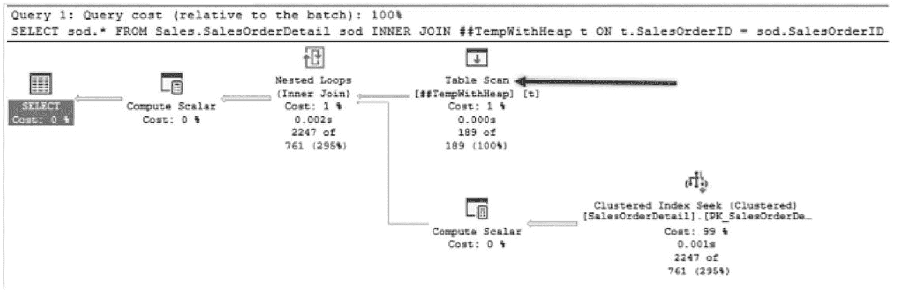
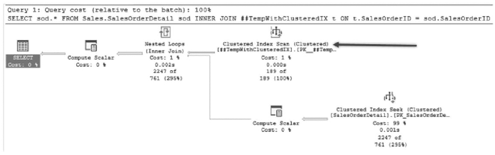
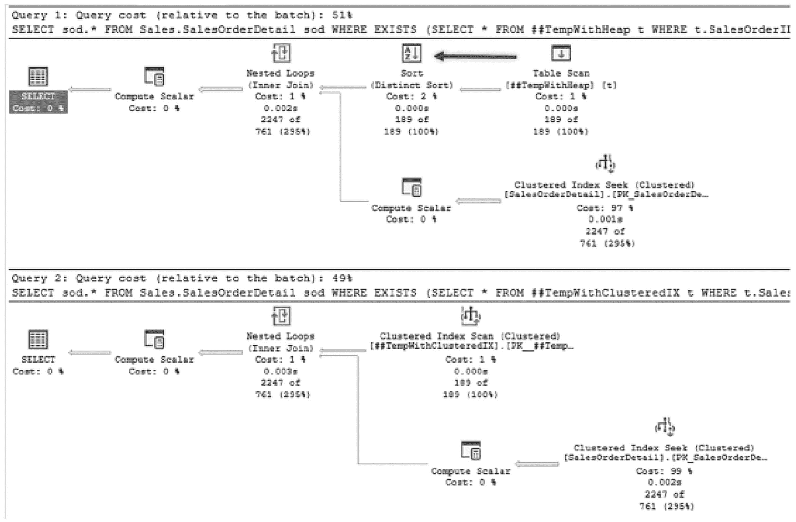
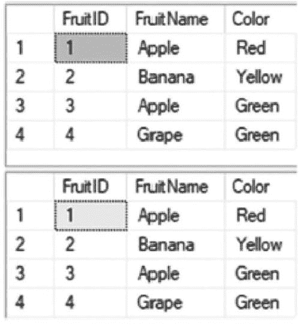
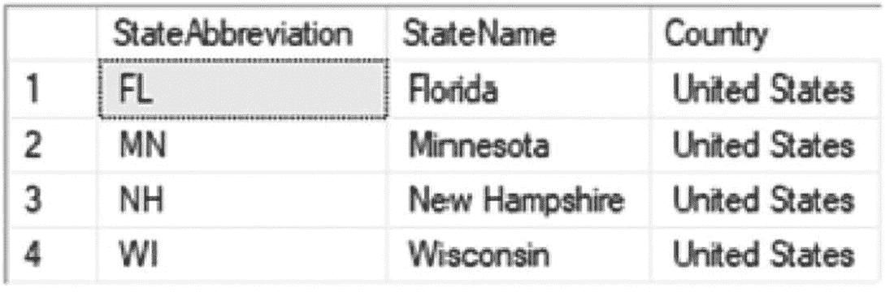

# 13. 索引策略

为数据库建立索引通常被认为是一门艺术，数据库是画布，索引是颜料，共同构成了存储和性能的美丽挂毯。这里添一点色彩，那里加一抹色调，画作便逐渐成形。同样地，在表上建立一个聚集索引，然后再添加几个非聚集索引，就能带来如杰作般出色且极快的性能。索引做得过于抽象或极简可能感觉不错，但由此产生的性能会提醒你，这可能并不实用。

尽管这个类比色彩丰富，但在设计和应用索引背后，科学多于艺术。仅仅因为几个列可能组合得很好就将它们拉到一起构建索引，其效益往往不如基于成熟模式构建的索引。那些基于久经考验的实践的索引通常是最佳的解决方案。在本章中，将讨论几种常见的索引模式，以帮助识别潜在有用的索引。

## 堆表

在数据库中使用堆表的有效案例很少。对于大多数 DBA 来说，经验法则是数据库中的所有表都应使用聚集索引构建，而不是堆表。虽然这种做法在大多数情况下是正确的，但也存在一些孤立的用例，其中使用堆表是可接受且首选的。本节将探讨其中一个场景，并对其他场景进行概括性讨论。之所以概括，是因为很难对何时使用堆表代替聚集索引做出一概而论的陈述（本节稍后将进行更多解释）。


### 临时对象

堆（Heap）最适用的场景之一是临时对象，例如临时表和表变量。使用这些对象时，往往在创建时并未考虑为其构建聚集索引。结果就是，临时对象经常被用作堆。

回想一下你上次创建表变量或临时表的场景。创建对象的语法是否明确创建了`CLUSTERED`索引或具有默认配置的`PRIMARY KEY`？如果没有，那么该临时对象就是作为堆创建的。这本身并不是问题。这在大多数工作负载中很常见，尽管不一定需要改变编码习惯。正如本节后续示例将演示的，使用堆和聚集索引的临时对象在性能上可能没有实质区别。

本例将介绍一个临时表的简单用例。示例使用`Sales.SalesOrderHeader`表，根据`SalesPersonID`检索若干行。然后将这些行插入一个临时表。该临时表将用于返回所有与临时表中结果匹配的`Sales.SalesOrderDetail`行。将使用两个版本的示例来演示在临时表上使用堆或聚集索引是否改变查询执行计划。

在第一个示例版本（如清单 13-1 所示）中，临时表使用堆构建。这是创建临时对象最常用的方法。如图 13-1 中的执行计划所示，当访问临时表（由箭头标识）时，使用表扫描来访问对象中的行。对于堆，此行为是预期的。由于行未排序，无法在不先检查所有行的情况下访问特定行。为了在`Sales.SalesOrderDetail`中找到与临时表中匹配的所有行，执行计划使用了带有索引查找的嵌套循环。



**图 13-1**
堆临时对象的执行计划

```
USE AdventureWorks2017
GO
IF OBJECT_ID('tempdb..##TempWithHeap') IS NOT NULL
DROP TABLE ##TempWithHeap
CREATE TABLE ##TempWithHeap
(
SalesOrderID INT
);
INSERT INTO ##TempWithHeap
SELECT SalesOrderID
FROM Sales.SalesOrderHeader
WHERE SalesPersonID = 283;
SELECT sod.* FROM Sales.SalesOrderDetail sod
INNER JOIN ##TempWithHeap t ON t.SalesOrderID = sod.SalesOrderID;
GO
```
**清单 13-1**
使用堆的临时对象

在脚本的第二个版本（如清单 13-2 所示）中，临时表改为在`SalesOrderID`列上创建聚集索引。该索引是两个脚本之间的唯一区别。此差异导致执行计划略有变化。图 13-2 显示了聚集索引版本的执行计划。两个计划的区别在于，临时表上的操作从表扫描变成了聚集索引扫描。虽然操作不同，但两者完成的工作本质上是相同的。在查询执行期间，访问临时对象中的所有行，并将它们与`Sales.SalesOrderDetail`中的行进行连接。



**图 13-2**
聚集索引临时对象的执行计划

```
USE AdventureWorks2017
GO
IF OBJECT_ID('tempdb..##TempWithClusteredIX') IS NOT NULL
DROP TABLE ##TempWithClusteredIX
CREATE TABLE ##TempWithClusteredIX
(
SalesOrderID INT PRIMARY KEY CLUSTERED
)
INSERT INTO ##TempWithClusteredIX
SELECT SalesOrderID
FROM Sales.SalesOrderHeader
WHERE SalesPersonID = 283
SELECT sod.* FROM Sales.SalesOrderDetail sod
INNER JOIN ##TempWithClusteredIX t ON t.SalesOrderID = sod.SalesOrderID
GO
```
**清单 13-2**
使用聚集索引的临时对象

> **注意**
> 自 SQL Server 2014 起，表变量可以同时拥有聚集和非聚集索引。要求是在声明变量时创建索引。表变量定义后不允许进行 DDL 操作。

在本节示例类似的查询中，使用堆和聚集索引的临时表的执行计划几乎相同。如同所有规则，也可能存在性能不同的例外情况。一个使用堆可能影响性能的好例子是任何利用其执行中排序的 T-SQL 语法。清单 13-3 显示了一个在`WHERE`子句中使用`EXISTS`的具体示例。图 13-3 显示了该查询的执行计划。在解决`EXISTS`谓词的嵌套循环连接之前，数据必须先排序。在这种情况下，堆的使用阻碍了查询性能，因为堆表强制了排序操作。



**图 13-3**
`EXISTS` 示例执行计划

对于小数据集，性能差异可能可以忽略。随着数据集大小的增加，看似微小的变化（例如包含排序操作）可能会降低这些查询的性能。

```
USE AdventureWorks2017
GO
SELECT sod.* FROM Sales.SalesOrderDetail sod
WHERE EXISTS (SELECT * FROM ##TempWithHeap t WHERE t.SalesOrderID = sod.SalesOrderID);
GO
SELECT sod.* FROM Sales.SalesOrderDetail sod
WHERE EXISTS (SELECT * FROM ##TempWithClusteredIX t WHERE t.SalesOrderID = sod.SalesOrderID);
```
**清单 13-3**
`EXISTS` 示例


### 其他堆表场景

通常，其他适合使用堆表的场景相对较少且罕见。使用临时对象之所以合理，是因为与其相比，创建有组织的结构（如聚集索引）来支持性能所需的时间，数据被访问的频率较低。此场景也可应用于暂存表，因为数据在移动到最终目的地之前可能被多次插入和修改。

在高插入量的环境中，使用堆表以避免维护 B 树的开销看似合理。此场景的问题在于，插入带来的收益会被访问数据的需求所抵消——访问数据需要其他非聚集索引，而这些索引又需要维护其排序顺序。

当面临需要在任何表上使用堆表的情况时，首先应考虑能否证明聚集索引是数据存储的负担，然后再决定是否使用它们。在考虑堆表之前，也应考虑更新的索引结构（如聚集列存储索引或内存优化表）是否能提供所需的性能。最后，要确保特定更改带来的性能提升是有意义的。研究、测试和实施仅带来 1%性能提升的索引更改，在极少数情况下才是值得的。

本节的要点在于强调，堆表在现实世界中的使用比通常意识到的更为频繁。尽管大多数最佳实践都反对使用它们，但在某些情况下它们是合适的选择，而在其他情况下，它们是否存在并不重要。随着讨论深入到聚集索引，将会清楚为何通常默认使用聚集索引是好主意，而仅在无关紧要（例如大多数临时对象的用例）或堆表性能优于聚集索引的情况下才使用堆表。

### 聚集索引

本书通篇讨论了使用聚集索引作为表数据页组织结构的价值和偏好。聚集索引根据其键列组织表中的数据。索引的所有数据页都根据键列逻辑存储。这样做的好处是通过键列实现对数据的最优访问。

新表几乎总是应该建立聚集索引。不过，在构建表时，问题是应为聚集索引的键列选择什么。通常，定义良好的聚集索引具备以下几个特征：

*   静态
*   窄
*   唯一
*   递增

这些属性中的每一个都有助于创建有效的聚集索引，原因如下。

### 静态

首先，聚集索引应该是静态的。为聚集索引定义的键列应在行的生命周期内保持静态。使用静态值时，行在索引中的位置在行更新时不会改变。当使用非静态键列时，行在聚集索引中的位置可能会改变，这可能需要将行插入到不同的页面上。此外，所有非聚集索引都需要修改以更改其中存储的键列值，因为聚集索引键列包含在非聚集索引中。这些问题共同导致表上聚集索引和非聚集索引存在大量碎片的可能性。

### 窄

聚集索引应具备的下一个属性是窄。理想情况下，聚集索引键应只包含单个列。该列应使用针对表中存储数据而言合理且最小的数据类型。窄的聚集索引很重要，因为每行的聚集索引键都包含在与该表关联的所有非聚集索引中。聚集索引键越宽，所有非聚集索引就越宽，它们所需的页面就越多。正如其他章节所讨论的，索引中的页面越多，使用它所需的资源就越多。这可能会影响该表上的查询性能。

### 唯一

聚集索引也应该是唯一的。聚集索引在索引中的特定位置存储单行；对于聚集索引键列中的重复行，需要一个唯一值来提供行所需的唯一性。当向行添加唯一值时，它会扩展 4 个字节，这会改变聚集索引的宽度，并导致与非窄聚集索引相关的相同问题。关于唯一值的更多信息可以在第 2 章中找到。

### 递增

最后，定义良好的聚集索引将基于一个递增的值。使用递增的聚集键会使新行添加到聚集索引的末尾。将新行放置在 B 树的末尾，可以减少如果行插入到聚集索引中间可能发生的碎片。

### 访问路径

选择聚集索引键列时的另一个考虑是，它们应代表经常用于访问行的列。是否有特定的列或值最常用于从表中检索行？如果有，这些列是聚集索引键的良好候选。最终，当查询能够通过阻力最小的路径访问数据时，其性能将达到最佳。同样，当行可以快速写入索引末尾而无需立即执行额外的后台任务时，写操作将最有效且干扰最小。

### 聚集索引模式

在考虑上述选择聚集索引策略的指南时，有一些模式可用于识别和建模聚集索引。聚集索引模式包括：

*   标识序列
*   自然键
*   外键
*   多列
*   全局唯一标识符

在本节的剩余部分，将逐一介绍这些模式，描述每种模式以及如何识别何时使用该模式。


#### 身份序列

构建聚集索引最常见的模式是将其与表中配置为始终递增的列配对，该列可以通过使用 `IDENTITY` 属性或 `SEQUENCE` 对象来实现。在此模式中，`IDENTITY` 列通常也是表的 `PRIMARY KEY`。数据类型通常为整数，包括 `tinyint`、`smallint`、`int` 和 `bigint`。此模式的主要好处在于它实现（并强制）了一个定义良好的聚集索引的所有属性。它是静态的、窄的、唯一的，并且始终递增。在考虑如何访问表中的数据时，大多数情况下，键值将最常用于访问表中的行。

身份序列模式的一个特点是，用于聚集索引键的列与行中的数据之间没有关系。要实现此模式，要么在表定义中包含具有 `IDENTITY` 属性的列，要么向表中添加一个使用 `SEQUENCE` 值的列。然后，将此列设置为聚集索引键，并且通常也设置为 `PRIMARY KEY`。

几乎在所有数据库中都可以找到此模式的示例。使用此模式创建表类似于代码清单 13-4 中的 `CREATE TABLE` 语句。两个表都用于存放水果：插入了两行苹果、一行香蕉和一行葡萄。`Color` 列本不应是良好的聚簇键，因为它无法标识表中的行。`FruitName` 列本可以标识表中的行，但它在表中不是唯一的，这将需要唯一标识符并导致更大的聚簇键。按照身份序列模式对表进行索引，创建了一个 `FruitID` 列。

```sql
USE AdventureWorks2017
GO
IF OBJECT_ID('IndexStrategiesFruit_Identity') IS NOT NULL
DROP TABLE IndexStrategiesFruit_Identity
CREATE TABLE dbo.IndexStrategiesFruit_Identity
(
FruitID int IDENTITY(1,1)
,FruitName varchar(25)
,Color varchar(10)
,CONSTRAINT PK_Fruit_FruitID_Idnt PRIMARY KEY CLUSTERED (FruitID)
);
INSERT INTO dbo.IndexStrategiesFruit_Identity(FruitName, Color)
VALUES('Apple','Red'),('Banana','Yellow'),('Apple','Green'),('Grape','Green');
SELECT FruitID, FruitName, Color
FROM dbo.IndexStrategiesFruit_Identity;
IF OBJECT_ID('IndexStrategiesFruit_Sequence') IS NOT NULL
DROP TABLE IndexStrategiesFruit_Sequence
IF OBJECT_ID('FruitSequence') IS NOT NULL
DROP SEQUENCE FruitSequence
CREATE SEQUENCE FruitSequence AS INTEGER
START WITH 1;
CREATE TABLE dbo.IndexStrategiesFruit_Sequence
(
FruitID int DEFAULT NEXT VALUE FOR FruitSequence
,FruitName varchar(25)
,Color varchar(10)
,CONSTRAINT PK_Fruit_FruitID_Seq PRIMARY KEY CLUSTERED (FruitID)
);
INSERT INTO dbo.IndexStrategiesFruit_Sequence(FruitName, Color)
VALUES('Apple','Red'),('Banana','Yellow'),('Apple','Green'),('Grape','Green');
SELECT FruitID, FruitName, Color
FROM dbo.IndexStrategiesFruit_Sequence;
```
代码清单 13-4: 为身份序列模式创建和填充表

使用身份序列模式的效果之一是，聚簇键列的值与其所代表的信息无关。在代码清单 13-4 的查询输出中，如图 13-4 所示，值 1 被分配给两个结果集中插入的第一行。然后，值 2 被分配给下一行，依此类推。随着更多行的添加，`FruitID` 列会递增，并且不需要记录中的任何单条信息来指定信息实例。


图 13-4: 身份序列模式的结果

注意

`SEQUENCE` 是在 `SQL Server 2012` 中引入的。通过序列，可以生成升序或降序的数值范围。序列不与任何特定表关联。当数字 `primary key` 需要跨多个表设定范围或需要自定义时，序列提供了独特的优势。关于序列的详细讨论超出了本书的范围。

#### 自然键

在某些情况下，将数据中的自然键用作聚集键，与向表中添加一个标识列来使用“标识序列”模式一样有效。自然键是数据集中能够唯一标识一行与其他所有行不同的列。当数据中存在一个满足明确定义的聚集键属性的自然键时，就可以认定使用自然键是有效的。当使用自然键作为聚集键时，它们不太可能永远递增，但仍然应该是唯一的、窄的且静态的。

一个常见的例子是，当查看那些包含其所代表信息的单字符或双字符缩写的表时，可能会使用自然键而不是标识列。这些缩写可能代表订单状态、产品尺寸，或者州/省列表。与在“标识列”模式中使用 4 字节的`int`类型相比，在“自然键”模式中使用`char(1)`或`char(2)`数据类型会产生一个比前者更窄的聚集键。另一个例子是在日期表上使用`yyyymmdd`或时间戳格式的日期。同样，一个数据集可能已经包含了一个标识列，例如发票 ID、采购订单号或账号。像这样的列是唯一的，并且已经由应用程序生成，如果它们是唯一的、窄的、静态的并且（可能）递增的，就可以有效地用作聚集索引列。

“自然键”模式还有一个额外的好处，就是提供了更易于解读的键值。当使用“标识序列”模式时，聚集键的值为`1`或`7`并没有内在含义。这些值是（有意地）无意义的。而在“自然键”模式中，例如，缩写`O`和`C`代表真实信息（分别是“已开启”和“已关闭”）。

作为“自然键”模式的一个简单示例，考虑一个包含州及其缩写的表。表中还包括了这些州所在的国家名称。清单 13-5 展示了创建和填充该表的 SQL。该表有一个`StateAbbreviation`列，其数据类型是`char(2)`。由于对于每个州来说，这是一个窄的、唯一的、静态的值，因此在该列上创建了聚集索引。接下来，为这个虚构数据库所需的四个州向表中添加了几行数据。

```sql
USE AdventureWorks2017
GO
CREATE TABLE dbo.IndexStrategiesNatural
(
StateAbbreviation char(2)
,StateName varchar(25)
,Country varchar(25)
,CONSTRAINT PK_State_StateAbbreviation PRIMARY KEY CLUSTERED (StateAbbreviation)
);
INSERT INTO dbo.IndexStrategiesNatural(StateAbbreviation, StateName, Country)
VALUES('MN','Minnesota','United States')
,('FL','Florida','United States')
,('WI','Wisconsin','United States')
,('NH','New Hampshire','United States');
SELECT StateAbbreviation, StateName, Country
FROM dbo.IndexStrategiesNatural;
```

清单 13-5
为“自然键”模式创建和填充表

在自然键匹配“自然键”模式的情况下，清单 13-5 中的技术可以是选择聚集键列的一个有用方法。回顾`dbo.IndexStrategiesNatural`的内容（如图 13-5 所示），表中存在四行数据，在另一个表中使用`StateAbbreviation`作为外键值会很有用，因为值`MN`具有一些固有的含义。



一个表有 3 列，分别标记为州缩写、州名和国家，以及 4 行标记为 1 到 4。第一列、第二列和第三列分别有条目：FL、MN、NH 和 WI；Florida、Minnesota、New Hampshire 和 Wisconsin；以及 United States。

图 13-5
“自然键”模式的结果

这种模式可能看起来很理想，比“标识列”模式更有价值——特别是因为聚集键的值有助于描述数据。然而，使用这种模式也有一些缺点，这与那些能使其成为明确定义的聚集键的属性相关。

首先，考虑聚集键的唯一性。假设数据库和表的使用场景永不改变，我们可以相信这些值将保持唯一。但是，当数据库需要在国际环境中使用时会发生什么？如果需要包含其他国家（如荷兰）的州，就存在很大的数据问题风险。在荷兰，`FL`是弗莱福兰省的缩写，`NH`是北荷兰省的缩写。将一个本该发往弗莱福兰省的订单发送到佛罗里达州可能会产生严重的业务后果。为了保持唯一性，就需要在自然键和聚集键中添加除双字符缩写之外的其他信息。

更改自然键会影响到聚集键的“窄度”。有两种方法可以解决这个问题。第一个选项是向自然键添加另一列，例如国家或其他位置标识符。第二个选项是增加州缩写的大小，以便在同一列中包含国家缩写。无论采用哪种解决方案，聚集键的大小都将超过 4 字节，而通过使用`int`数据类型和“标识列”模式来保持聚集键的窄度只需要 4 字节。

此外，要始终考虑自然键是否真正静态。州缩写可能会改变。虽然这种情况不常发生，但历史上确实发生过。美国最后一次此类更改发生在 1987 年，当时所有州缩写都被标准化了。几乎所有的自然键类型都会偶尔发生类似的变化。一个例子是南斯拉夫及其六个共和国，每个共和国后来都成为了独立的国家。另一个是苏联，它演变成俄罗斯联邦，导致许多其他国家的形成。尽管像州和国家缩写这样的值看起来是静态的，但在更大的范围内存在着变化。此外，从应用程序的角度来看，代表工作流状态的状态代码今天可能是准确的，但未来可能会有新的、不同的含义。

最后，有时表面的自然键可能由不应广泛分发的数据组成。多年来，政府标识符，如社会安全号码，经常被用作数据库中的自然键，尤其是在医疗和教育系统中。虽然这在识别个人方面做得很好，但这绝对不是应该轻易提供给数据库用户的信息。在大多数现代数据库中，政府标识符现在需要加密，当这类自然键被用作聚集索引并可能作为主键时，会引起巨大的问题。

为索引选择列而采用的“自然键”模式是设计聚集索引的一种有效模式。正如示例所示，它可以是唯一的、窄的且静态的。在将自然键用于聚集索引之前，请仔细检查表的当前和未来应用，以确保它不会受到未来变更的影响。


### 外键

创建聚集索引时最常被忽视的模式之一，是在表的聚集键中使用外键列。外键模式并非适用于所有外键，但它在设计表头信息与相关明细信息之间存在一对多关系时确实有其用途。外键模式包含了构成明确定义的聚集索引键的所有属性。不过，对于其中的一些属性，有几点需要注意。

实现此模式的方式与标识列模式类似。该模式包含两个表，它们的列都设置了 `IDENTITY` 属性。代码清单 13-6 展示了一个例子。在该示例中，创建了三个表。第一个是表头表，名为 `dbo.IndexStrategiesHeader`，其聚集索引建立在 `HeaderID` 列上。第二个表是明细表的第一个版本，名为 `dbo.IndexStrategiesDetail_ICP`。该表被设计为表头表的子表，聚集索引使用标识列模式构建，并在 `HeaderID` 列上建立了一个索引以提高性能。第三个表也是明细表，名为 `dbo.IndexStrategiesDetail_FKP`；此表使用外键模式设计。它没有在具有 `IDENTITY` 属性的列上建立聚集索引，而是将两列包含在聚集索引中。第一列来自父表 `HeaderID`，第二列是此表的主键 `DetailID`。为了提供示例数据，使用了 `sys.indexes` 和 `sys.index_columns` 来填充所有表。

```sql
USE AdventureWorks2017
GO
CREATE TABLE dbo.IndexStrategiesHeader
(
HeaderID int IDENTITY(1,1)
,FillerData char(250)
,CONSTRAINT PK_Header_HeaderID PRIMARY KEY CLUSTERED (HeaderID)
);
CREATE TABLE dbo.IndexStrategiesDetail_ICP
(
DetailID int IDENTITY(1,1)
,HeaderID int
,FillerData char(500)
,CONSTRAINT PK_Detail_ICP_DetailID PRIMARY KEY CLUSTERED (DetailID)
,CONSTRAINT FK_Detail_ICP_HeaderID FOREIGN KEY (HeaderID) REFERENCES IndexStrategiesHeader(HeaderID)
);
CREATE INDEX IX_Detail_ICP_HeaderID ON dbo.IndexStrategiesDetail_ICP (HeaderID)
CREATE TABLE dbo.IndexStrategiesDetail_FKP
(
DetailID int IDENTITY(1,1)
,HeaderID int
,FillerData char(500)
,CONSTRAINT PK_Detail_FKP_DetailID PRIMARY KEY NONCLUSTERED (DetailID)
,CONSTRAINT CLUS_Detail_FKP_HeaderIDDetailID UNIQUE CLUSTERED (HeaderID, DetailID)
,CONSTRAINT FK_Detail_FKP_HeaderID FOREIGN KEY (HeaderID) REFERENCES IndexStrategiesHeader(HeaderID)
);
GO
INSERT INTO dbo.IndexStrategiesHeader(FillerData)
SELECT CONVERT(varchar,object_id)+name
FROM sys.indexes
INSERT INTO dbo.IndexStrategiesDetail_ICP
SELECT ish.HeaderID, CONVERT(varchar,ic.index_column_id)+'-'+FillerData
FROM dbo.IndexStrategiesHeader ish
INNER JOIN sys.indexes i ON ish.FillerData = CONVERT(varchar,i.object_id)+i.name
INNER JOIN sys.index_columns ic ON i.object_id = ic.object_id AND i.index_id = ic.index_id
INSERT INTO dbo.IndexStrategiesDetail_FKP
SELECT ish.HeaderID, CONVERT(varchar,ic.index_column_id)+'-'+FillerData
FROM dbo.IndexStrategiesHeader ish
INNER JOIN sys.indexes i ON ish.FillerData = CONVERT(varchar,i.object_id)+i.name
INNER JOIN sys.index_columns ic ON i.object_id = ic.object_id AND i.index_id = ic.index_id
```

代码清单 13-6：为外键模式创建并填充表

至此，我们使用两种聚集索引模式（标识序列和外键）设计了三个表。此模式的关键在于设计表结构，使其在常见的使用模式下，数据能以最高效的方式返回。在此类场景中，有两种常见的用例。第一种是返回表头以及对应一个表头行的所有明细行。第二种是返回表头中的多行以及明细表中所有相关的行。


