# 第十三章：聚簇索引设计模式

##### 外键模式

首先，我们将检查从头表返回一行及其所有相关明细行的性能差异。清单 13-7 中的代码使用两种聚簇索引模式实现了此用例。正如预期，两个查询返回的数据集是相同的。差异在于两个查询的统计信息和查询计划。请检查在第一个用例中使用 `STATISTICS IO` 时的统计信息输出，如图 13-6 所示。身份列模式的读取显示为四次读取，而外键模式为两次读取。虽然这些数字很低，但这是一个两倍的差异，如果这些是高度使用的查询，可能会对数据库产生显著影响。然而，通过查看两个查询的执行计划（图 13-7），可以看到执行上的巨大差异。对于第一个查询，需要对明细表执行索引查找、键查找和嵌套循环。将其与第二个查询进行比较，后者使用聚簇索引查找获取相同的信息。此示例清楚地表明，外键模式能够比身份列模式执行得更好。

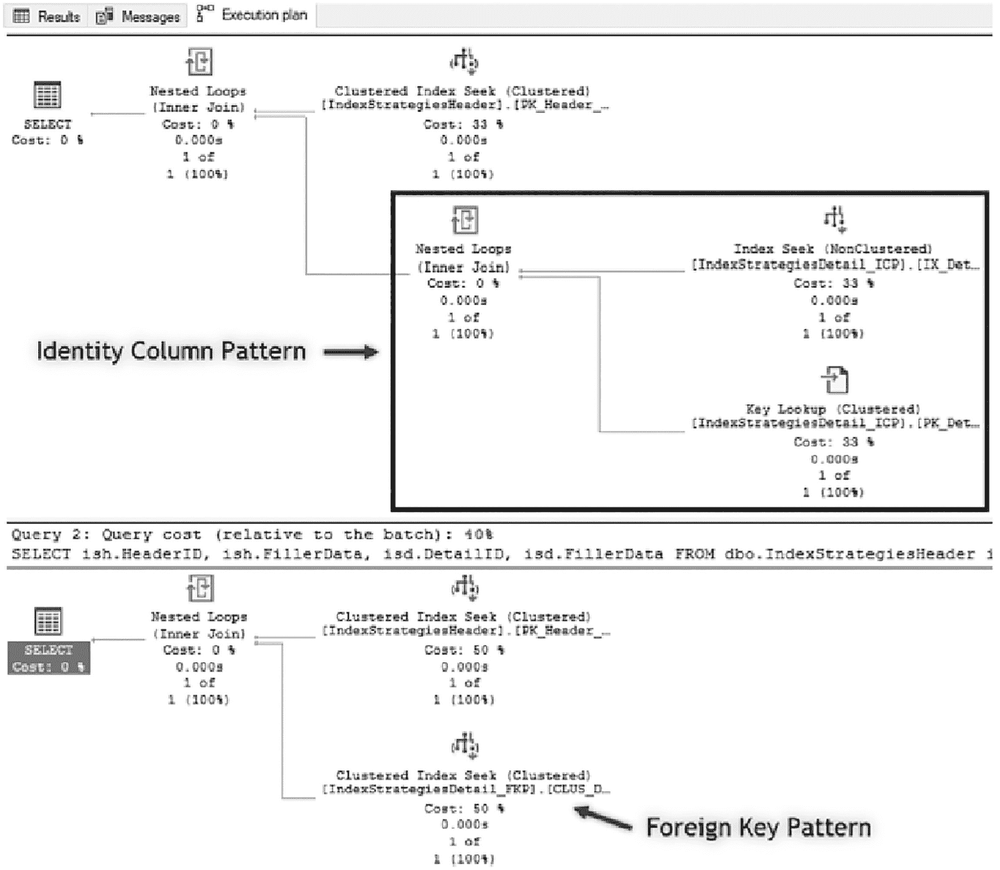
*一个面板，其中打开了执行计划选项卡，流程图中突出显示了索引查找、键查找和嵌套循环作为身份列模式的组成部分。下方是一个两行文本的查询 2 的流程图，占批处理的 40% 成本，其中两个聚簇索引查找项中的一个（占 50% 成本）标记为外键模式。*
**图 13-7 外键模式下针对单个头行的执行计划**

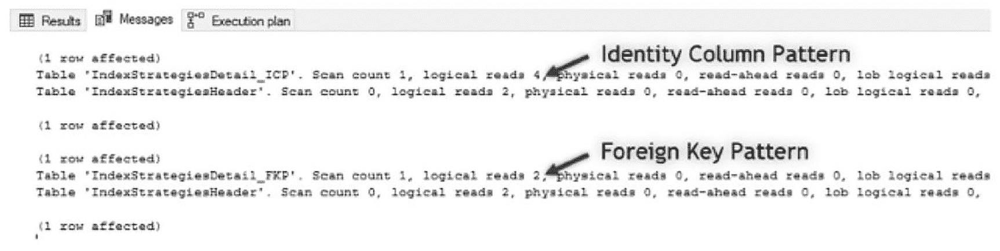
*一个面板，其中打开了消息选项卡，在“影响了 1 行”标签下显示文本块。所示文本块中的逻辑读取 4 和逻辑读取 2 分别标记为身份列模式和外键模式。*
**图 13-6 外键模式下针对单个头行的结果**

```sql
Use AdventureWorks2017
GO
SET STATISTICS IO ON
SELECT  ish.HeaderID, ish.FillerData, isd.DetailID, isd.FillerData
FROM dbo.IndexStrategiesHeader ish
INNER JOIN dbo.IndexStrategiesDetail_ICP isd ON ish.HeaderID = isd.HeaderID
WHERE ish.HeaderID = 10
SELECT  ish.HeaderID, ish.FillerData, isd.DetailID, isd.FillerData
FROM dbo.IndexStrategiesHeader ish
INNER JOIN dbo.IndexStrategiesDetail_FKP isd ON ish.HeaderID = isd.HeaderID
WHERE ish.HeaderID = 10
```
*清单 13-7 外键模式下针对单个头行*

随着第一个用例的成功，现在可以检查第二个用例。在此示例中（如清单 13-8 所示），查询将从头表中检索多行，并从明细表中检索与头行中 `HeaderID` 匹配的数据。同样，使用两种聚簇索引模式的查询返回的数据是相同的，并且两次执行之间存在性能差异。第一个差异体现在 `STATISTICS IO` 输出中，如图 13-8 所示。在第一次执行中，头表有 158 次读取，明细表有 44 次读取。将它们与外键模式下的头表四次读取和明细表八次读取进行比较，很明显外键模式表现更好。外键模式的读取比身份列模式低一个数量级！性能差异的原因可以通过图 13-9 所示的执行计划来解释。在执行计划中，第一个查询需要在明细表上执行 `clustered index scan` 以返回明细行。而使用外键模式的第二个查询不需要此操作，并使用聚簇索引查找。

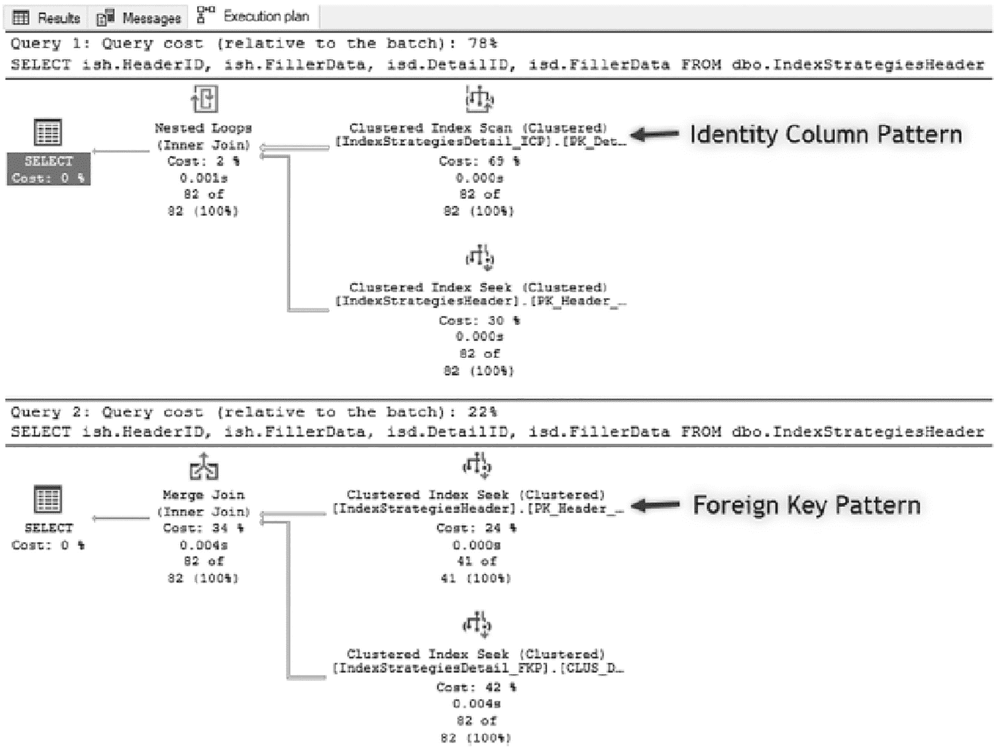
*一个面板，其中打开了执行计划选项卡，查询 1 和查询 2 的流程图分别占批处理的 78% 和 22% 成本。聚簇索引扫描（聚集，索引策略详情 I C P）占 69% 成本，聚簇索引查找（聚集，索引策略头表）占 24% 成本，分别标记为身份列和外键模式。*
**图 13-9 外键模式下针对多个头行的执行计划**

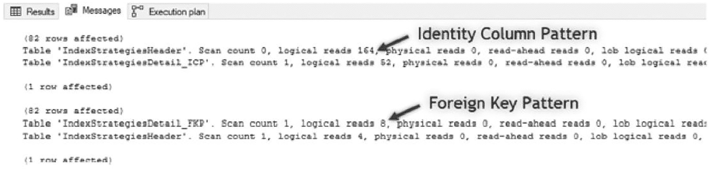
*一个面板，其中打开了消息选项卡，在“影响了 82 行”标签下显示文本块。所示文本块中的逻辑读取 164 和逻辑读取 8 分别标记为身份列模式和外键模式。*
**图 13-8 外键模式下针对多个头行的结果**

```sql
Use AdventureWorks2017
GO
SET STATISTICS IO ON
SELECT ish.HeaderID, ish.FillerData, isd.DetailID, isd.FillerData
FROM dbo.IndexStrategiesHeader ish
INNER JOIN dbo.IndexStrategiesDetail_ICP isd ON ish.HeaderID = isd.HeaderID
WHERE ish.HeaderID BETWEEN 10 AND 50;
SELECT ish.HeaderID, ish.FillerData, isd.DetailID, isd.FillerData
FROM dbo.IndexStrategiesHeader ish
INNER JOIN dbo.IndexStrategiesDetail_FKP isd ON ish.HeaderID = isd.HeaderID
WHERE ish.HeaderID BETWEEN 10 AND 50;
```
*清单 13-8 外键模式下针对多个头行*

##### 实现注意事项

通过本节的两个用例，我们可以看到外键模式如何优于身份列模式。然而，在数据库中实现此模式之前需要考虑一些事项。需要回答的主要问题是：行是否最常通过明细表的主键或其与头表的外键关系来检索。并非所有外键都适合此聚簇索引模式；仅当表之间存在头-明细关系时，它才有效。

在使用外键模式时，对于明确定义的聚簇索引的属性有一些注意事项。关于窄键，此模式不如身份列模式窄。聚簇键由两个基于整数的列组成，而不是单个整数列。当使用 `int` 数据类型时，这将使聚簇键的大小从 4 字节增加到 8 字节。虽然这不是一个非常大的值，但它会影响表上所有非聚簇索引的大小。在大多数情况下，外键模式下的聚簇键是静态的。某些明细行对应的头行可能偶尔需要更改，例如当两个订单被记录并需要合并运输时。因此，外键模式并非完全静态。键可以更改，但不应频繁更改。如果更改频繁，则应重新考虑使用此聚簇索引模式。最后一个具有注意事项的属性是聚簇键是否始终递增。通常，应该是这样。典型的插入模式是创建头记录和明细记录。在这种情况下，头行被顺序创建和插入，然后是其明细记录。如果写入明细记录有延迟，或者稍后向头行添加更多明细记录，键将不会始终递增。结果，可能会产生额外的碎片和与此聚簇索引模式相关的维护。

## 总结

外键模式并非适用于大多数表的聚簇索引模式。然而，当适用时，它非常有益，可以缓解可能不如其他问题明显的性能问题。在设计聚簇索引时，考虑使用此模式并审查其相关的注意事项以确定是否适合非常重要。


##### 多列模式

接下来可用于设计聚集索引的模式是多列模式。在此模式中，两个或更多表与另一个表存在关系，从而允许信息之间存在多对多关系。例如，可能有一个存储员工信息的表和另一个包含职位角色的表。为了表示这种关系，会使用第三个表。通过多列模式，不再使用带有`IDENTITY`属性的新列，而是使用关系列本身作为聚集键。

多列模式与外键模式相似，提供了与先前模式相同的性能增强。在多对多关系表中，通常有一个或另一个列是聚集键的最佳候选。与其他模式一样，此模式也遵循大多数定义良好的聚集索引的属性。该模式是唯一的，且大多是窄和静态的；随着多列模式示例的说明，这些属性将变得明显。

为了演示多列模式，首先定义一些表及其关系。首先，有存储员工和职位角色信息的表，分别命名为`dbo.Employee`和`dbo.JobRole`。在示例关系中，使用名为`dbo.EmployeeJobRole_ICP`和`dbo.EmployeeJobRole_MCP`的表来表示标识列模式和多列模式（参见清单 13-9）。示例脚本包含插入语句以提供一些要使用的示例数据。此外，还创建了表的非聚集索引以提供真实场景。

```
USE AdventureWorks2017
GO
CREATE TABLE dbo.Employee (
EmployeeID int IDENTITY(1,1)
,EmployeeName varchar(100)
,FillerData varchar(1000)
,CONSTRAINT PK_Employee PRIMARY KEY CLUSTERED (EmployeeID));
CREATE INDEX IX_Employee_EmployeeName ON dbo.Employee(EmployeeName);
CREATE TABLE dbo.JobRole (
JobRoleID int IDENTITY(1,1)
,RoleName varchar(25)
,FillerData varchar(200)
,CONSTRAINT PK_JobRole PRIMARY KEY CLUSTERED (JobRoleID));
CREATE INDEX IX_JobRole_RoleName ON dbo.JobRole(RoleName);
CREATE TABLE dbo.EmployeeJobRole_ICP (
EmployeeJobRoleID int IDENTITY(1,1)
,EmployeeID int
,JobRoleID int
,CONSTRAINT PK_EmployeeJobRole_ICP PRIMARY KEY CLUSTERED (EmployeeJobRoleID)
,CONSTRAINT UIX_EmployeeJobRole_ICP UNIQUE (EmployeeID, JobRoleID))
CREATE INDEX IX_EmployeeJobRole_ICP_EmployeeID ON dbo.EmployeeJobRole_ICP(EmployeeID);
CREATE INDEX IX_EmployeeJobRole_ICP_JobRoleID ON dbo.EmployeeJobRole_ICP(JobRoleID);
CREATE TABLE dbo.EmployeeJobRole_MCP (
EmployeeJobRoleID int IDENTITY(1,1)
,EmployeeID int
,JobRoleID int
,CONSTRAINT PK_EmployeeJobRoleID PRIMARY KEY NONCLUSTERED (EmployeeJobRoleID)
,CONSTRAINT CUIX_EmployeeJobRole_ICP UNIQUE CLUSTERED (EmployeeID, JobRoleID));
CREATE INDEX IX_EmployeeJobRole_MCP_JobRoleID ON dbo.EmployeeJobRole_MCP(JobRoleID);
INSERT INTO dbo.Employee (EmployeeName)
SELECT OBJECT_SCHEMA_NAME(object_id)+'|'+name
FROM sys.tables;
INSERT INTO dbo.JobRole (RoleName)
VALUES ('Cook'),('Butcher'),('Candlestick Maker');
INSERT INTO dbo.EmployeeJobRole_ICP (EmployeeID, JobRoleID)
SELECT EmployeeID, 1 FROM dbo.Employee
UNION ALL SELECT EmployeeID, 2 FROM dbo.Employee WHERE EmployeeID / 4 = 1
UNION ALL SELECT EmployeeID, 3 FROM dbo.Employee WHERE EmployeeID / 8 = 1;
INSERT INTO dbo.EmployeeJobRole_MCP (EmployeeID, JobRoleID)
SELECT EmployeeID, 1 FROM dbo.Employee
UNION ALL SELECT EmployeeID, 2 FROM dbo.Employee WHERE EmployeeID / 4 = 1
UNION ALL SELECT EmployeeID, 3 FROM dbo.Employee WHERE EmployeeID / 8 = 1;
Listing 13-9
多列模式脚本
```

针对示例表的第一个测试将查看查询所有三个表以检索员工姓名和职位角色信息。这些查询如清单 13-10 所示，基于`dbo.JobRole`中的`RoleName`检索信息。在代码中，`EmployeeJobRole`表的两个版本使用不同的聚集键创建。这导致执行计划存在巨大差异，如测试查询的结果图 13-10 和 13-11 所示。第一个使用应用了标识列模式的表的执行计划比第二个查询的执行计划更复杂，并且成本比另一个计划高 61%。第二个计划基于多列模式的聚集键，操作更少，占执行成本的 39%。两个计划之间的主要区别在于，使用多列模式允许聚集索引覆盖基于可能经常用于访问表中行的列（本例中是`JobRoleID`列）的表访问。使用其他模式则无法提供此好处，并且代表了一种不太可能使用的数据访问路径，除非可能在需要删除行时。

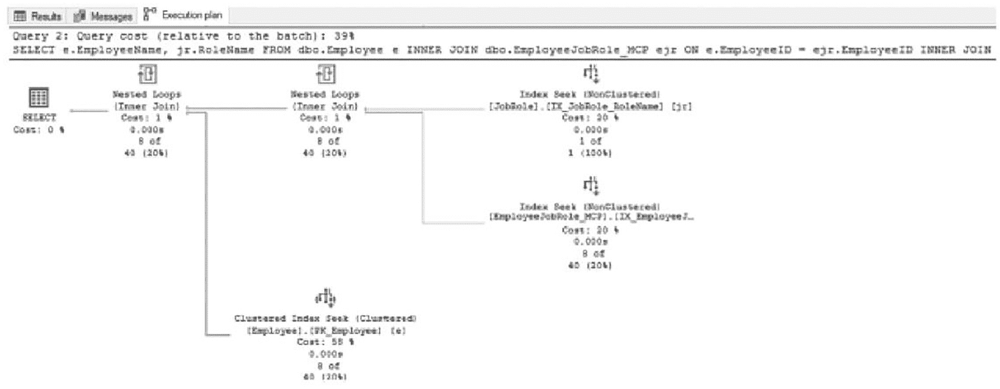

一个面板，其中打开了执行计划选项卡，查询 2 有 2 行文本，占批处理成本的 39%。下方是一个流程图，展示了多条路径，即索引查找、工作角色、索引查找、员工工作角色 I C P 和聚集索引查找、员工，成本分别为 20%、20%和 55%，最终指向成本为 0%的端点 select。

图 13-11
多列模式的执行计划

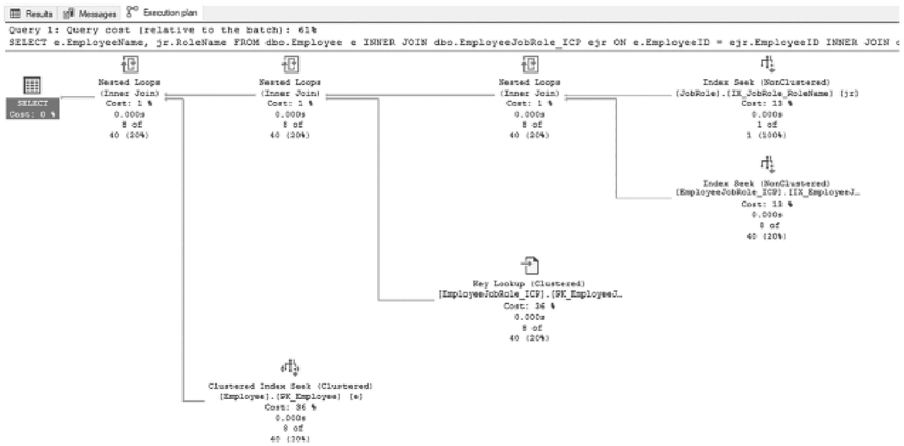

一个面板，其中打开了执行计划选项卡，查询 1 有 2 行文本，占批处理成本的 61%。下方是一个流程图，展示了多条路径，即索引查找、工作角色、索引查找、员工工作角色 I C P、键查找、员工工作角色 I C P 和聚集索引查找、员工，成本分别为 11%、11%、16%和 36%，最终指向成本为 0%的端点 select。

图 13-10
标识列模式的执行计划

```
USE AdventureWorks2017
GO
SELECT e.EmployeeName, jr.RoleName
FROM dbo.Employee e
INNER JOIN dbo.EmployeeJobRole_ICP ejr ON e.EmployeeID = ejr.EmployeeID
INNER JOIN dbo.JobRole jr ON ejr.JobRoleID = jr.JobRoleID
WHERE RoleName = 'Candlestick Maker'
SELECT e.EmployeeName, jr.RoleName
FROM dbo.Employee e
INNER JOIN dbo.EmployeeJobRole_MCP ejr ON e.EmployeeID = ejr.EmployeeID
INNER JOIN dbo.JobRole jr ON ejr.JobRoleID = jr.JobRoleID
WHERE RoleName = 'Candlestick Maker'
Listing 13-10
标识列模式的脚本
```

虽然第一组测试结果的益处显著，但当查看其他可用方法时，益处就不那么令人印象深刻了。例如，如果不使用`RoleName`作为谓词，而是使用`EmployeeName`作为谓词会怎样？清单 13-11 中的脚本演示了此场景。与上一个测试脚本相反，这次的结果对于两种聚集索引设计没有差异（见图 13-12 和 13-13）。计划相同的原因在于决定优化多列模式中的聚集索引键以偏向`JobRoleID`。当使用`EmployeeID`列访问数据时，非聚集索引承担了大部分工作，并为每个查询创建了良好且相似的计划。这第二次测试的结果并未否定多列模式的使用，但它们确实强调，在使用预期工作负载进行测试后，才应选择引导聚集键的列。


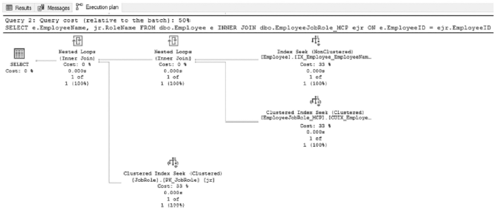

一个面板，其中打开了执行计划选项卡，针对查询 2 显示了两行文本，其成本占批处理的 50%。下方是一个流程图，展示了多条路径，即：索引查找（非聚集，员工）、索引查找（聚集，员工职位 ICP）以及聚集索引查找（聚集，职位），各占 33%、33%和 33%的成本，最终汇聚到标记为“选择”的端点，该端点成本为 0%。

图 13-13

多列模式的执行计划

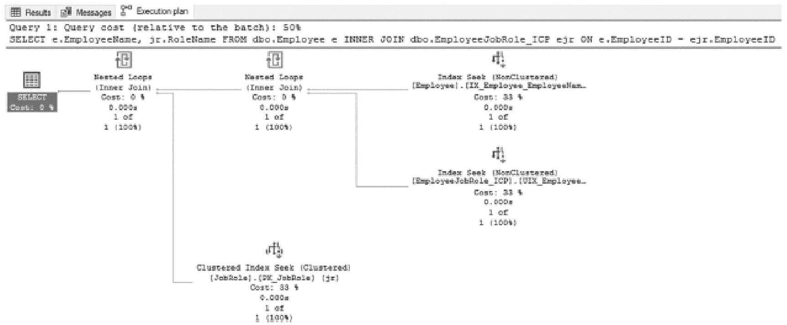

一个面板，其中打开了执行计划选项卡，针对查询 2 显示了两行文本，其成本占批处理的 50%。下方是一个流程图，展示了多条路径，即：索引查找（非聚集，员工）、索引查找（非聚集，员工职位 ICP）以及聚集索引查找（聚集，职位），各占 33%、33%和 33%的成本，最终汇聚到标记为“选择”的端点，该端点成本为 0%。

图 13-12

标识列模式的执行计划

```
USE AdventureWorks2017
GO
SELECT e.EmployeeName, jr.RoleName
FROM dbo.Employee e
INNER JOIN dbo.EmployeeJobRole_ICP ejr ON e.EmployeeID = ejr.EmployeeID
INNER JOIN dbo.JobRole jr ON ejr.JobRoleID = jr.JobRoleID
WHERE EmployeeName = 'Purchasing|ShipMethod'
SELECT e.EmployeeName, jr.RoleName
FROM dbo.Employee e
INNER JOIN dbo.EmployeeJobRole_MCP ejr ON e.EmployeeID = ejr.EmployeeID
INNER JOIN dbo.JobRole jr ON ejr.JobRoleID = jr.JobRoleID
WHERE EmployeeName = 'Purchasing|ShipMethod'
代码清单 13-11
多列模式的脚本
```

多列模式有多种实现方式。聚集索引中的关键列可以反转，这将改变为测试脚本生成的执行计划。虽然这种模式可能有益，但在使用时需谨慎，并在使用前充分了解预期的工作负载。

作为对多列模式的总结，我们将回顾一个定义良好的聚集索引应具备的属性。首先，值是静态的。如果发生更改，很可能是删除一条记录并插入一条新记录。这实际上仍然是一次更新操作。为了降低此风险，应尝试让聚集索引以最不可能更改或变化最少的值开头。第二个属性是聚集键是否窄。在此示例中，键大多是窄的。它由两个 4 字节的列组成。如果使用更大的列或超过两列，则需要仔细考虑这是否是正确的做法。下一个属性是值是否唯一。在此场景中是唯一的，在现实世界的任何场景中也应该如此。如果不唯一，那么此模式自然不合格。与其他非标识列模式一样，此模式不提供单调递增的聚集键。

最后需要注意一点，数据仓库中的事实表常常容易落入使用多列模式的诱惑中。在这些情况下，事实表中的所有维度键都被放入聚集索引中。这样做的目的是对事实行强制实施唯一性。其效果是创建了一个极宽的聚集键，然后该键会被添加到表上的所有非聚集索引中。很可能，聚集键中的每个维度列都会在事实表上拥有一个单独的索引。结果，这些索引浪费了大量空间，并且由于其尺寸，其性能远不如使用非聚集唯一索引来约束事实表上的唯一性那么好。对于数据仓库或其他 OLAP 类型的表，列存储索引可以提供最佳的数据结构。在设计复杂的聚集行存储索引之前，请考虑先测试列存储索引。本章后面将更详细地讨论列存储索引。

##### 全局唯一标识符

最后一种，也毫无疑问是效益最低（且最不流行）的用于选择聚集索引列的模式是使用全局唯一标识符，也称为 GUID。GUID 模式涉及使用唯一生成的值为表中的每一行提供唯一值。该值不是基于整数的，之所以常被选用，是因为它可以在任何位置（在应用程序的拓扑结构内）生成，并保证唯一性。此模式解决的问题是需要能够在与通常控制唯一值列表的源断开连接时生成新的唯一值。不幸的是，GUID 模式常常制造出与它解决的问题一样多的挑战。

生成 GUID 值主要有两种方法。第一种是通过 `NEWID()` 函数。该函数生成一个 16 字节的十六进制值，该值部分基于创建它时计算机的 MAC 地址。每个生成的值都是唯一的，并且可以以 0 到 9 或 a 到 f 中的任何值开头。下一个创建的值在排序中可能位于前一个值之前或之后。无法保证下一个值是单调递增的。生成 GUID 的第二种选择是通过 `NEWSEQUENTIALID()`。该函数也创建一个 16 字节的十六进制值。与另一个函数不同，`NEWSEQUENTIALID()` 创建的新值自计算机上次启动以来始终大于前一个生成的值。最后一点很重要，因为当服务器重新启动时，使用 `NEWSEQUENTIALID()` 生成的新值有可能小于重启前创建的值。`NEWSEQUENTIALID()` 的逻辑仅保证自服务器启动以来的值是顺序的。

如前所述，使用 GUID 模式不能保证提供单调递增的值。无论是 `NEWID()` 还是 `NEWSEQUENTIALID()`，都无法保证下一个值总是大于最后一个值。此外，它不能提供一个窄索引。当将 GUID 存储为 `uniqueidentifier` 时，它需要 16 字节的存储空间。这相当于四个 `int` 或两个 `bigint` 的大小。相比之下，GUID 相当大，而且这个值会用于表上的所有非聚集索引。然而，GUID 模式使用的空间有时可能比这更糟。在某些情况下，如果 GUID 模式实现不当，GUID 值会存储为字符，这需要 36 字节来存储，如果使用 Unicode 数据类型则需要 72 字节。

即使 GUID 模式有这些缺陷，它确实实现了定义良好的聚集键的其他一些属性。首先，该值是唯一的。使用 `NEWID()` 和 `NEWSEQUENTIALID()` 函数生成的 GUID 值都是唯一的。该值也是静态的，因为生成的 GUID 值没有业务含义，因此没有理由更改。

为了演示使用 GUID 模式的影响，将检查其在表上与其他实现的对比。在此场景中，如代码清单 13-12 所示，有三个表。表 `dbo.IndexStrategiesGUID_ICP` 使用标识列模式设计。表 `dbo.IndexStrategiesGUID_UniqueID` 使用 GUID 模式构建，遵循最佳实践采用 `uniqueidentifier`。最后一个脚本包含表 `dbo.IndexStrategiesGUID_String`，它使用 `varchar(36)` 来存储 GUID 值。后一种方法不是实现 GUID 模式的正确方式，分析将有助于突出这一点。在构建好所有三个表后，插入语句将向每个表填充 250,000 行。场景中的最后一条语句检索每个表使用的页数。


###### 清单 13-12 GUID 模式场景的脚本

```
USE AdventureWorks2017
GO
CREATE TABLE dbo.IndexStrategiesGUID_ICP (
RowID int IDENTITY(1,1)
,FillerData varchar(1000)
,CONSTRAINT PK_IndexStrategiesGUID_ICP PRIMARY KEY CLUSTERED (RowID)
);
CREATE TABLE dbo.IndexStrategiesGUID_UniqueID (
RowID uniqueidentifier DEFAULT(NEWSEQUENTIALID())
,FillerData varchar(1000)
,CONSTRAINT PK_IndexStrategiesGUID_UniqueID PRIMARY KEY CLUSTERED (RowID)
);
CREATE TABLE dbo.IndexStrategiesGUID_String (
RowID varchar(36) DEFAULT(NEWID())
,FillerData varchar(1000)
,CONSTRAINT PK_IndexStrategiesGUID_String PRIMARY KEY CLUSTERED (RowID)
);
INSERT INTO dbo.IndexStrategiesGUID_ICP (FillerData)
SELECT TOP (250000) a1.name+a2.name
FROM sys.all_objects a1 CROSS JOIN sys.all_objects a2
INSERT INTO dbo.IndexStrategiesGUID_UniqueID (FillerData)
SELECT TOP (250000) a1.name+a2.name
FROM sys.all_objects a1 CROSS JOIN sys.all_objects a2
INSERT INTO dbo.IndexStrategiesGUID_String (FillerData)
SELECT TOP (250000) a1.name+a2.name
FROM sys.all_objects a1 CROSS JOIN sys.all_objects a2
SELECT OBJECT_NAME(object_ID) as table_name, in_row_used_page_count, in_row_reserved_page_count
FROM sys.dm_db_partition_stats
WHERE object_id IN (OBJECT_ID('dbo.IndexStrategiesGUID_ICP')
,OBJECT_ID('dbo.IndexStrategiesGUID_UniqueID')
,OBJECT_ID('dbo.IndexStrategiesGUID_String'))
ORDER BY 1
```

图 13-14 展示了此查询的一些输出结果。

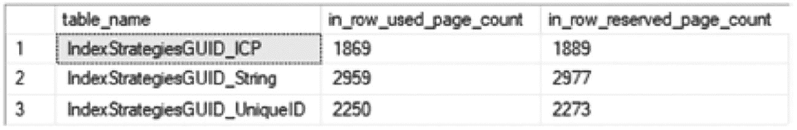

一个表格有 3 列，标签分别为 table name、in row used page count 和 in row reserved page count，以及 3 行，标签为 1 到 3。这 3 行条目，即 index strategies G U I D I C P、string 和 unique i d，分别对应着 1869 和 1889、2959 和 2977，以及 2250 和 2273 的条目。

图 13-14

GUID 模式的页数统计

###### GUID 模式分析

与其他场景不同，GUID 模式的使用与标识列模式相似。主要有两个区别。首先，GUID 模式不提供窄聚簇键。对于使用 `uniqueidentifier` 数据类型的聚簇键，其大小的变化需要多出大约 400 个页面来存储相同的信息（参见图 13-14）。更糟糕的是，当错误地将 GUID 存储在 `varchar` 数据类型中时，表需要多出大约 1100 个页面。毫无疑问，使用 GUID 模式会导致聚簇索引中浪费大量空间，这些空间也会包含在该表的任何非聚集索引中。GUID 模式的第二个挑战与聚簇索引的递增属性相关。GUID 不是以有序方式呈现的。下一个值可以大于或小于前一个值，这会导致行在表内的随机放置，从而产生碎片化。有关 GUID 导致索引碎片化的更多信息，请阅读第 10 章。

关于明确定义的聚簇键的最后两个属性，GUID 模式表现良好。该值是静态的，预计不会随时间变化。该值也是唯一的。事实上，它应该在整个数据库中是唯一的。尽管 GUID 模式确实实现了明确定义的聚簇索引的两个属性，但它们并不能缓解该模式前述的问题。在确定如何为表构建聚簇索引时，GUID 模式应该是最后的手段。

注意

使用新的 `sp_sequence_get_range` 存储过程结合 `SEQUENCE`，可以成为希望从 `uniqueidentifier` 模式迁移到使用标识列模式进行聚簇索引设计的应用程序的一个有效替代方案。

### 非聚集索引

在前两节中，讨论集中在堆和聚簇索引上，它们用于确定存储数据的主要方法。对于堆，数据是未排序存储的。对于聚簇索引，数据基于一组列进行排序。在几乎所有数据库中，都需要其他方法来访问表中与数据存储顺序不一致的数据。这就是非聚集索引的用武之地。非聚集索引提供了除堆或聚簇索引之外的另一种访问表中数据的方法。

在本节中，将回顾一些与非聚集索引相关的模式。这些模式将有助于确定何时何地考虑构建非聚集索引。对于每种模式，将讨论其主要组成部分和可能应用的情况。与聚簇索引模式类似，每种非聚集索引模式都将包含场景以展示该模式的益处。将讨论的非聚集索引模式有：

*   搜索列
*   索引交集
*   多列索引
*   覆盖索引
*   包含列
*   筛选索引
*   外键

在回顾这些模式之前，有一些适用于所有非聚集索引的指南。这些指南与明确定义的聚簇索引的属性不同。对于那些属性，关键目标之一是尽可能遵守它们。而非聚集索引指南则构成了一些考量因素，这些因素有助于加强索引的合理性，但可能不会排除索引的使用。在设计索引时需要考虑的一些最常见因素如下：

*   *非聚集索引键列的更改频率如何？* 数据更改越频繁，非聚集索引中的行可能需要更频繁地更改其在索引中的位置。
*   *该索引能改进哪些频繁执行的查询？* 一个索引能覆盖的查询越多，这些查询执行越频繁，数据库平台的整体运行就越好。
*   *该索引支持哪些业务需求？* 支持关键业务操作但使用不频繁的索引，有时可能比频繁使用的索引更重要。
*   *维护索引的时间成本与查询数据的时间成本相比如何？* 可能存在一个点，超过该点后，从索引中获得的性能增益会被创建和整理索引碎片所花费的时间以及所需的空间所抵消。

正如引言中提到的，索引常常让人感觉像是一门艺术。幸运的是，可以使用科学或统计来证明索引的价值。在回顾每种模式时，我们将考察它们可以应用的场景，并使用一些科学方法（或此处的度量标准）来判断索引是否提供价值。用来评判索引的两个指标将是执行期间的读取操作和执行计划的复杂性。


### 搜索列

设计非聚集索引最基本、最常见的模式是基于已定义或预期的搜索模式来构建它们。搜索列模式应该是最为人所知的模式，但也经常容易被忽视。

如果查询将通过名字搜索包含联系人的表，那么就为名字列建立索引。如果地址表将通过城市或州进行搜索，那么就为这些列建立索引。搜索列模式的主要目标是减少对聚集索引的扫描，并将这些操作转移到一个非聚集索引上，该索引可以提供更直接的数据访问路径。

为了演示搜索列模式，将使用本节提到的第一个场景，一个联系人表。为简单起见，示例将使用一个名为 `dbo.Contacts` 的表，该表包含来自 `AdventureWorks2017` 表 `Person.Person` 的数据（参见清单 13-13）。应该有 19,972 行插入到 `dbo.Contacts` 中，尽管具体数量会根据你的 `AdventureWorks2017` 数据库的新旧程度而有所不同。

```sql
USE AdventureWorks2017;
GO
CREATE TABLE dbo.Contacts (
ContactID INT IDENTITY(1, 1),
FirstName NVARCHAR(50),
LastName NVARCHAR(50),
IsActive BIT,
EmailAddress NVARCHAR(50),
CertificationDate DATETIME,
FillerData CHAR(1000),
CONSTRAINT PK_Contacts PRIMARY KEY CLUSTERED (ContactID));
INSERT INTO dbo.Contacts (
FirstName,
LastName,
IsActive,
EmailAddress,
CertificationDate )
SELECT pp.FirstName,
pp.LastName,
IIF(pp.BusinessEntityID / 10 = 1, 1, 0),
pea.EmailAddress,
IIF(pp.BusinessEntityID / 10 = 1, pp.ModifiedDate, NULL)
FROM Person.Person pp
INNER JOIN Person.EmailAddress pea
ON pp.BusinessEntityID = pea.BusinessEntityID;
Listing 13-13
搜索列模式的设置
```

有了 `dbo.Contacts` 表之后，对它进行的第一次测试是在没有为其构建任何非聚集索引的情况下查询该表。在示例（清单 13-14）中，查询搜索名字为 Catherine 的行。执行查询显示 `dbo.Contacts` 中有 22 行符合标准（参见图 13-15）。为了检索这 22 行，SQL Server 最终读取了 2,866 页，这是表中的所有页面。并且如图 13-16 所示，页面读取是对 `dbo.Contacts` 上的 `PK_Contacts` 进行索引扫描的结果。查询的目标是从超过 19,000 行中检索 22 行，因此检查表中的每一页以查找 `FirstName` 为 Catherine 的行并不是最优的方法，应该避免。

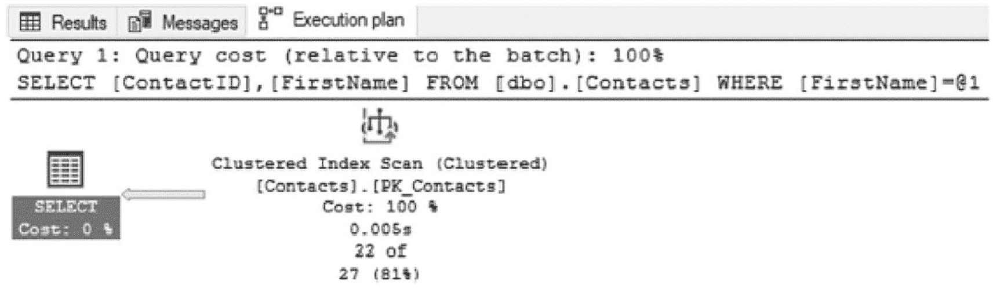
*图 13-16：没有非聚集索引时搜索列模式的执行计划*

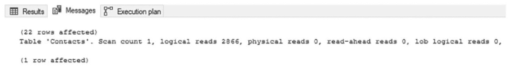
*图 13-15：没有非聚集索引时搜索列模式的 Statistics I/O 结果*

```sql
USE AdventureWorks2017;
GO
SET STATISTICS IO ON;
SELECT ContactID,
FirstName
FROM dbo.Contacts
WHERE FirstName = 'Catherine';
Listing 13-14
没有非聚集索引的搜索列模式
```

通过向 `dbo.Contacts` 添加一个非聚集索引，可以相对简单地实现最优地检索所有 Catherine 行的目标。在下一个脚本（清单 13-15）中，在 `FirstName` 列上创建了一个非聚集索引。除了对 `FirstName` 的过滤外，查询还需要返回 `ContactID`。由于非聚集索引包含聚集索引键，`ContactID` 中的值默认包含在索引中。

执行清单 13-15 中的脚本会带来与在表上添加非聚集索引之前截然不同的性能表现。非聚集索引将查询使用的页数减少到两页（图 13-17），而不是读取表中的每一页。这里的减少是显著的，并突显了使用非聚集索引在聚集索引键之外的列上提供对表中信息更直接访问的能力和价值。执行计划还有一个变化：执行计划不再扫描 `PK_Index`，而是对 `IC_Contacts_FirstName` 使用索引查找，如图 13-18 所示。操作符的改变进一步证明非聚集索引有助于提高查询性能。

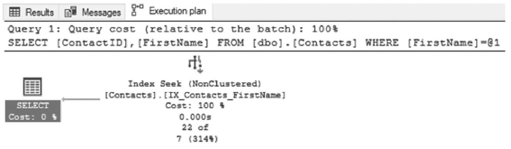
*图 13-18：有非聚集索引时搜索列模式的执行计划*

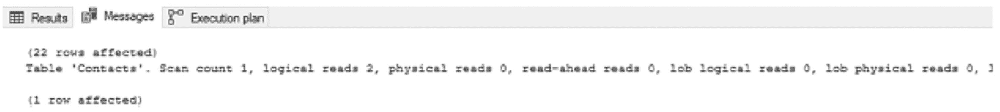
*图 13-17：有非聚集索引时搜索列模式的 Statistics I/O 结果*

```sql
USE AdventureWorks2017;
GO
CREATE INDEX IX_Contacts_FirstName ON dbo.Contacts (FirstName);
SET STATISTICS IO ON;
SELECT ContactID,
FirstName
FROM dbo.Contacts
WHERE FirstName = 'Catherine';
Listing 13-15
有非聚集索引的搜索列模式
```

使用搜索列模式可能是将非聚集索引模式应用于数据库最重要的第一步。它提供了访问数据的替代路径，这可能是从几页与数千页中获取数据的差别。本节中的搜索列示例展示了在单个列上构建索引。接下来的几个模式将以此为基础进行扩展。


### 索引交叉

“搜索列”模式的目标是创建一个索引，以最小化查询的页面读取次数并提升其性能。然而，有时查询会超出前面演示的单列示例。额外的列可能出现在谓词中，或在 `SELECT` 语句中返回。解决此问题的方法之一是创建包含额外列的非聚集索引。当存在可以满足 `WHERE` 子句中每个谓词的索引时，SQL Server 可以使用多个非聚集索引来查找两者之间匹配聚集键的行。此操作称为索引交叉。

为了演示索引交叉模式，我们将回顾当筛选条件扩展到涵盖多列时会发生什么。清单 13-16 中的代码包含了扩展后的 `SELECT` 语句和 `WHERE` 子句，将谓词扩展为包括 `LastName` 为 Cox 的行。

查询的更改导致性能与上一节的结果相比发生了显著变化。由于查询中增加了列，满足查询需要读取 68 个页面，而之前未包含 `LastName` 时只需读取 2 个页面（图 13-19）。页面读取次数的增加是由于执行计划的改变（图 13-20）。在此执行计划中，查询执行增加了两个额外的操作：一个键查找和一个嵌套循环。添加这些运算符是因为索引 `IX_Contacts_FirstName` 无法提供满足查询所需的所有信息。SQL Server 判定使用 `IX_Contacts_FirstName` 并从聚集索引中查找缺失信息仍然比扫描聚集索引成本更低。问题在于，对于非聚集索引匹配的每一行，都必须在聚集索引上进行一次查找。虽然键查找并不总是问题，但它们可能会推高查询的 CPU 和 I/O 成本。

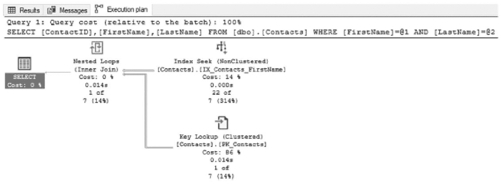
一个面板，打开了执行计划选项卡，包含两行文本，对应查询 1，成本相对于批处理为 100%。下方是一个流程图，展示了多条路径：索引查找，非聚集，Contacts，成本占 14%；键查找，聚集，Contacts，成本占 86%；最后选择操作成本占 0%。
图 13-20
未利用索引交叉模式时的执行计划

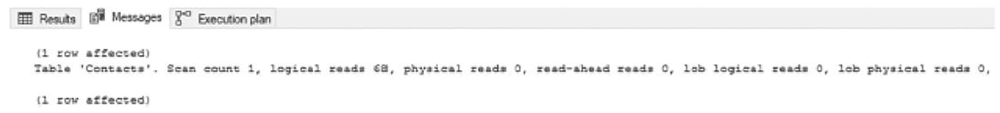
一个面板，打开了消息选项卡，其中有一行条目，内容为：表 'Contacts'，扫描计数 1，逻辑读取 68，物理读取 0，预读 0，LOB 逻辑读取 0，LOB 物理读取 0，在 2 1 行受影响 标签之间。
图 13-19
未利用索引交叉模式时的统计信息 I/O 结果

```
USE AdventureWorks2017;
GO
SET STATISTICS IO ON;
SELECT ContactID,
FirstName,
LastName
FROM dbo.Contacts
WHERE FirstName = 'Catherine'
AND LastName = 'Cox';
```
清单 13-16
未利用索引交叉模式的查询

利用索引交叉模式是提升清单 13-16 中查询性能的少数方法之一。当 SQL Server 可以在同一张表上使用多个非聚集索引来满足查询要求时，就会发生索引交叉。对于清单 13-16 中的查询，查找 `FirstName` 最直接的路径是通过索引 `IX_Contacts_FirstName`。然而，此时为了筛选并返回 `LastName` 列，SQL Server 使用了聚集索引并对每一行执行了一次查找，类似于图 13-21 左侧的图像。另一种情况是，如果存在一个用于 `LastName` 列的索引，SQL Server 本可以将其与 `IX_Contacts_FirstName` 一起使用。本质上，通过索引交叉模式，SQL Server 能够执行类似于在同一张表的索引之间进行联接的操作，以找到两者之间重叠的行，如图 13-21 右侧所示。

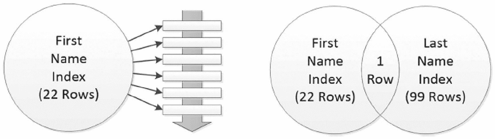
一个图表，左侧是名字索引（22 行），连接到 6 个未标记的水平条，位于一个向下的箭头之上。右侧是一个维恩图，展示了在名字索引（22 行）和姓氏索引（99 行）之间存在 1 行。
图 13-21
带键查找的索引查找 vs. 使用索引交叉模式的两个索引查找

为了演示索引交叉模式并让 SQL Server 使用索引交叉，下一个示例在 `LastName` 列上创建了一个索引（清单 13-17）。创建了索引 `IX_Contacts_LastName` 后，结果与索引未创建时相比发生了显著变化。第一个变化在于读取次数。之前的执行需要读取 68 次，而现在只需读取 5 次（图 13-22）。读取次数减少的原因是 SQL Server 在查询计划中利用了索引交叉（图 13-23）。索引 `IX_Contacts_FirstName` 和 `IX_Contacts_LastName` 被用于满足查询，而无需返回聚集索引检索查询数据。这是因为两个索引一起可以完全满足查询需求。

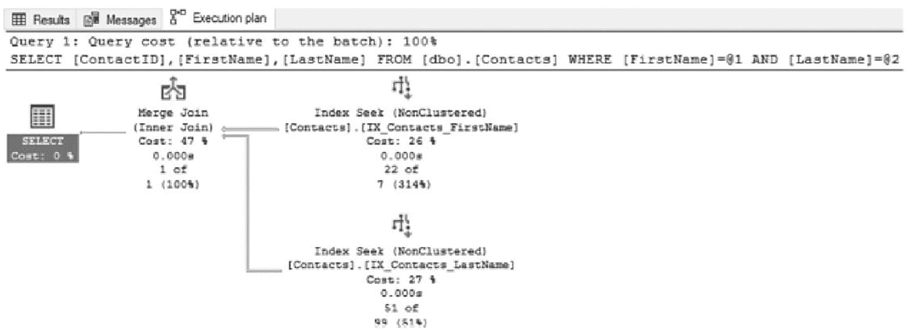
一个面板，打开了执行计划选项卡，包含两行文本，对应查询 1，成本相对于批处理为 100%。下方是一个流程图，展示了多条路径：索引查找，非聚集，Contacts，成本占 26%；索引查找，非聚集，Contacts，成本占 27%；最后选择操作成本占 0%。
图 13-23
索引交叉模式的执行计划

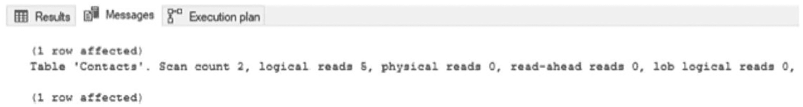
一个面板，打开了消息选项卡，其中有一行条目，内容为：表 'Contacts'，扫描计数 2，逻辑读取 5，物理读取 0，预读 0，LOB 逻辑读取 0，在 2 1 行受影响 标签之间。
图 13-22
索引交叉模式的统计信息 I/O 结果

```
USE AdventureWorks2017;
GO
CREATE INDEX IX_Contacts_LastName ON dbo.Contacts (LastName);
SET STATISTICS IO ON;
SELECT ContactID,
FirstName,
LastName
FROM dbo.Contacts
WHERE FirstName = 'Catherine'
AND LastName = 'Cox';
```
清单 13-17
索引交叉模式

索引交叉是 SQL Server 的一项功能，当同一张表的多个非聚集索引可以为查询提供结果时，它用于更好地满足查询。在为索引交叉设计索引时，目标是拥有基于“搜索列”模式的多个索引，这些索引可以以多种组合方式一起使用，以支持各种筛选条件。关于索引交叉模式需要记住的一个关键点是，SQL Server 无法被指示何时使用索引交叉；它会在每个请求、底层索引及其关联数据合适时选择使用它。

### 多列索引

前两节中的示例都集中于在索引中包含单个键列的索引。而非聚集索引最多可以包含 16 列。虽然“窄”是定义良好的聚集索引的一个属性，但同样的原则并不总是适用于非聚集索引。相反，非聚集索引应包含尽可能多的列，以确保能被尽可能多的查询使用。如果许多查询使用相同的列作为谓词，那么通常将它们全部包含在一个索引中是个好主意。

值得注意的是，仅仅因为一个索引可以包含很多列，并不意味着它就应该包含很多列。如果一两个列具有高选择性，那么即使还需要键查找，这几个列可能也足以确保相当快的索引查找。通常，查询持续时间应该是衡量索引有效性的首要基准，其次是资源消耗。

演示使用多列模式索引的一个简单方法是使用前一节中的相同查询并应用此模式。在该查询中，构建了两个索引，一个在`FirstName`列上，另一个在`LastName`列上。对于多列模式，新索引将同时包含这两个列（代码清单 13-18）。

正如统计数据所示（图 13-24），通过使用多列模式，返回请求结果所需的读取次数有所减少。从索引交集模式的五次读取减少到多列模式的两次读取。此外，执行计划（如图 13-25 所示）也得到了简化。现在只包含一个在索引 `IX_Contacts_FirstNameLastName` 上的索引查找操作。

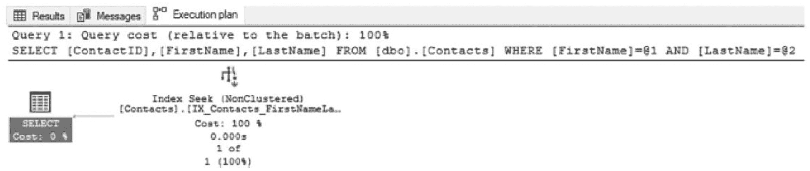
*图 13-25：多列模式的执行计划*


*图 13-24：多列模式的 Statistics I/O 结果*

```sql
USE AdventureWorks2017;
GO
CREATE INDEX IX_Contacts_FirstNameLastName
ON dbo.Contacts (FirstName, LastName);
SET STATISTICS IO ON;
SELECT ContactID,
FirstName,
LastName
FROM dbo.Contacts
WHERE FirstName = 'Catherine'
AND LastName = 'Cox';
```
*代码清单 13-18：多列模式*

在为数据库编制索引时，实现多列模式与搜索列模式同样重要。该模式通过将最常用于谓词的列组合在一起，有助于减少所使用的索引数量。虽然这个模式与索引交集模式的部分价值相矛盾，但关键在于平衡。在某些情况下，对于查询谓词变化很多的表，依赖单列索引上的索引交集将提供最佳性能。而在其他时候，具有特定列顺序的更宽的索引将是有益的。同时也要考虑候选索引是否会在应用程序的其他地方有用。如果是这样，那么利用这些信息在多列索引或多单列索引之间做出明智的决定。

尝试这两种模式，并以提供最佳整体性能的方式应用它们。请记住，如果索引不适用，它们总是可以被删除的。

### 覆盖索引

下一个索引模式是覆盖索引模式。使用覆盖索引模式时，可以将谓词之外的列添加到索引的键列中，以便这些值可以作为查询 `SELECT` 子句的一部分返回。这个模式在 SQL Server 中已经成为标准的索引实践一段时间了。然而，索引创建方式的增强使得这个模式不如过去那么有用了。不过，讨论这个模式还是有价值的，因为许多使用 SQL Server 的人都很熟悉它。

为了开始研究覆盖索引模式，将提供一个示例来定义该索引所解决的问题。为了展示问题，下一个测试查询将在 `SELECT` 列表中包含 `IsActive` 列（代码清单 13-19）。添加此列后，I/O 统计信息再次从两次读取增加到五次读取，如图 13-26 所示。性能的变化与执行计划的变化直接相关（见图 13-27），其中包含了键查找和嵌套循环。与前面的示例一样，当查询中添加了未包含在非聚集索引中的项时，需要从包含表的所有数据的聚集索引中检索它们。

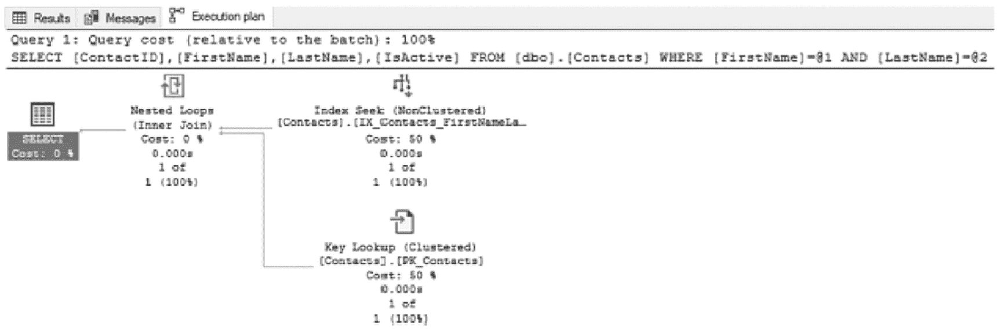
*图 13-27：未利用覆盖索引模式的查询的执行计划*

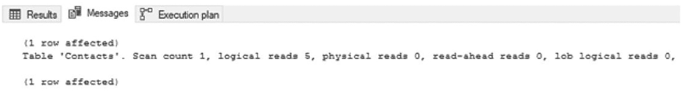
*图 13-26：未利用覆盖索引模式的查询的 Statistics I/O 结果*

```sql
USE AdventureWorks2017;
GO
SET STATISTICS IO ON;
SELECT ContactID,
FirstName,
LastName,
IsActive
FROM dbo.Contacts
WHERE FirstName = 'Catherine'
AND LastName = 'Cox';
```
*代码清单 13-19：未利用覆盖索引模式的查询*

一个理想的索引应该能够处理查询的筛选条件，并返回 `SELECT` 列表中请求的列。覆盖索引模式可以满足这些要求。即使 `IsActive` 不是查询的谓词之一，也可以将其添加到索引中，SQL Server 可以使用该键列来返回查询的列值。为了演示覆盖索引模式，将创建一个以 `FirstName`、`LastName` 和 `IsActive` 作为键列的索引（见代码清单 13-20）。有了索引 `IX_Contacts_FirstNameLastName` 之后，每次执行的读取次数恢复到两次（见图 13-28）。执行计划现在也只使用索引查找（见图 13-29）。

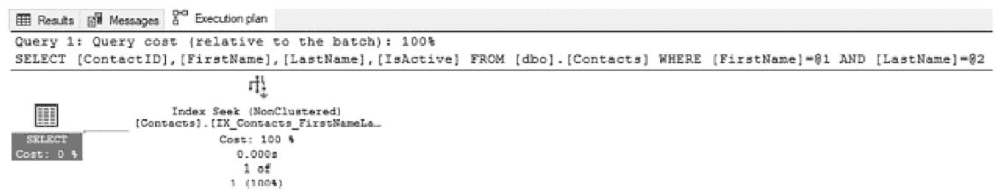
*图 13-29：覆盖索引模式的执行计划*

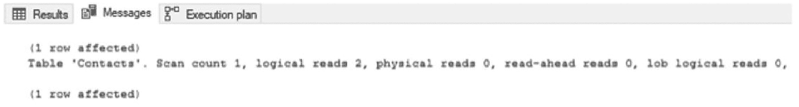
*图 13-28：覆盖索引模式的 Statistics I/O 结果*


#### 覆盖索引模式

```
USE AdventureWorks2017
GO
CREATE INDEX IX_Contacts_FirstNameLastNameIsActive ON dbo.Contacts(FirstName, LastName, IsActive);
SET STATISTICS IO ON;
SELECT ContactID,
FirstName,
LastName,
IsActive
FROM dbo.Contacts
WHERE FirstName = 'Catherine'
AND LastName = 'Cox';
```
**清单 13-20** 覆盖索引模式

覆盖索引模式非常有用，并有潜力在许多方面提升性能。这种方法的缺点是，索引键列中包含的每个列都需要被排序。如果一个列需要被查询返回，但不会用于排序，那么它更适合被设为包含列，而不是键列。

> **注意**
> 有些人认为覆盖索引和带包含列的索引是同一回事。虽然非常相似，但两者之间的关键区别在于列的位置——是作为索引键的一部分，还是作为索引包含的数据。

##### 包含列模式

包含列模式与覆盖索引模式密切相关。包含列模式利用了 `CREATE` 和 `ALTER INDEX` 语法中的 `INCLUDE` 子句。该子句允许将非键列添加到非聚集索引中，类似于非键数据在聚集索引中的存储方式。这是包含列模式与覆盖索引模式的主要区别，后者的额外列是索引上的键列。与聚集索引类似，作为 `INCLUDE` 子句一部分的非键列不会被排序，尽管它们可以在某些查询中用作谓词。

包含列模式的用例源于它所提供的灵活性。它与覆盖索引模式基本相同，有时这两个名称可以互换使用。关键的区别，也是本节将要演示的，在于覆盖索引模式受限于索引中所有列的排序顺序。而包含列模式通过包含非键数据，可以避免这个潜在问题，从而增加了使用的灵活性。

在演示包含列模式的灵活性之前，我们将先检查另一个针对 `dbo.Contacts` 表的索引。在清单 13-21 中，查询筛选 `FirstName` 值为 Catherine，并返回 `ContactID`、`FirstName`、`LastName` 和 `EmailAddress` 列。此查询请求与其他示例不同，因为它现在包含了 `EmailAddress` 列。由于该列未包含在任何其他非聚集索引中，因此没有索引能完全满足该查询。结果，执行计划使用 `IX_Contacts_FirstName` 来识别 Catherine 的行，然后从聚集索引中查找其余数据，如图 13-30 所示。由于需要进行键查找，查询的 I/O 增加到 68 次读取（见图 13-31），这与之前的示例情况相同。

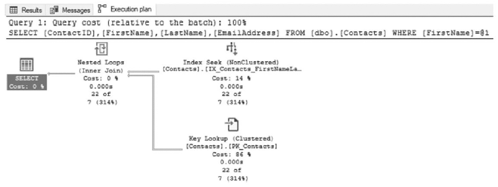
**图 13-31** 使用现有索引的包含列模式的执行计划

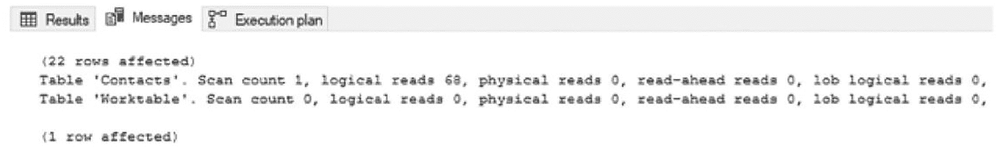
**图 13-30** 使用现有索引的包含列模式的 Statistics I/O 结果

```
USE AdventureWorks2017;
GO
SET STATISTICS IO ON;
SELECT ContactID,
FirstName,
LastName,
EmailAddress
FROM dbo.Contacts
WHERE FirstName = 'Catherine';
```
**清单 13-21** 使用现有索引的包含列模式

为了提高此查询的性能，可以创建基于多列模式或覆盖索引模式的另一个索引。然而，这些选项的问题在于，生成的索引将具有与其能改进的查询相同的限制。相反，我们将创建一个基于包含列模式的新索引。这个新索引（如清单 13-22 所示）以 `FirstName` 作为键列，并包含 `LastName`、`IsActive` 和 `EmailAddress` 作为非键列。尽管 `IsActive` 列未在索引中使用，但仍将其包含在内，以便为该索引提供额外的灵活性，本节后面的示例将使用此灵活性。索引就位后，清单 13-21 中查询的性能显著提升。在此示例中，每次执行的读取次数从之前的 68 次下降到 3 次（见图 13-32）。在执行计划中，不再需要键查找和嵌套循环；取而代之的是索引查找，现在使用的是 `IX_Contacts_FirstNameINC` 索引（见图 13-33）。

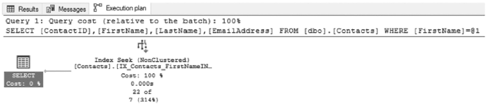
**图 13-33** 使用新索引的包含列模式的执行计划

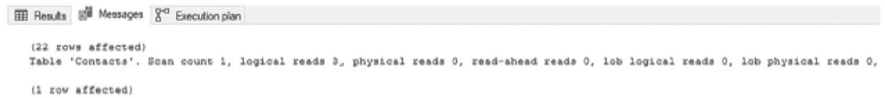
**图 13-32** 使用新索引的包含列模式的 Statistics I/O 结果

```
USE AdventureWorks2017
GO
CREATE INDEX IX_Contacts_FirstNameINC ON dbo.Contacts(FirstName)
INCLUDE (LastName, IsActive, EmailAddress);
SET STATISTICS IO ON;
SELECT ContactID,
FirstName,
LastName,
EmailAddress
FROM dbo.Contacts
WHERE FirstName = 'Catherine';
```
**清单 13-22** 使用新索引的包含列模式

虽然使用包含列模式创建的索引其读取次数略高，但该索引具有的灵活性足以弥补这一差异。在本章的每个示例中，都向 `dbo.Contacts` 表添加了一个新索引。此时，该表上有六个索引，每个索引服务于不同的目的，其中四个以相同的列 `FirstName` 开头。这些索引每个都占用空间，并且在 `dbo.Contacts` 中的数据被修改时需要进行维护。在活跃的表中，过度索引可能对表上的所有活动产生负面影响。

包含列模式可以帮助解决这个问题。在存在多个具有相同前导键列的索引的情况下，可以使用包含列模式将这些索引合并为一个索引，将一些键列作为非键列添加到索引中。为了演示，首先删除所有以 `FirstName` 开头的索引，除了使用包含列模式创建的那个（清单 13-23 提供了脚本）。

```
USE AdventureWorks2017
GO
DROP INDEX IF EXISTS IX_Contacts_FirstNameLastName ON dbo.Contacts
GO
DROP INDEX IF EXISTS IX_Contacts_FirstNameLastNameIsActive ON dbo.Contacts
GO
DROP INDEX IF EXISTS IX_Contacts_FirstName ON dbo.Contacts
GO
```
**清单 13-23** 在包含列模式中删除索引


`dbo.Contact` 表目前仅有三个索引。分别是 `ContactID` 列上的聚集索引、`LastName` 上的非聚集索引，以及一个包含 `LastName`、`IsActive` 和 `EmailAddress` 作为索引数据的 `FirstName` 索引。在这些索引就位后，需要对前文模式中的查询（如清单 13-24 所示）针对该表进行测试。

关于查询在“包含列”模式与其他模式下的性能表现，有两点关键需要注意。首先，所有查询的执行计划（如图 13-35 所示）都使用了索引查找操作。对于仅按 `FirstName` 过滤的查询，使用查找操作是预期的；但当附加了对 `LastName` 的过滤条件时，它仍然可以使用。SQL Server 能够做到这一点，是因为在索引查找之下，它会扫描匹配第一个谓词的行范围，然后移除 `LastName` 值不为 `Cox` 的结果。第二个需要注意的点是每个查询的读取次数，如图 13-34 所示。读取次数从两次增加到了三次。虽然这构成了 50% 的读取增长，但性能变化并不显著，不足以证明在单一索引已能充分提供所需性能的情况下，创建四个索引是合理的。

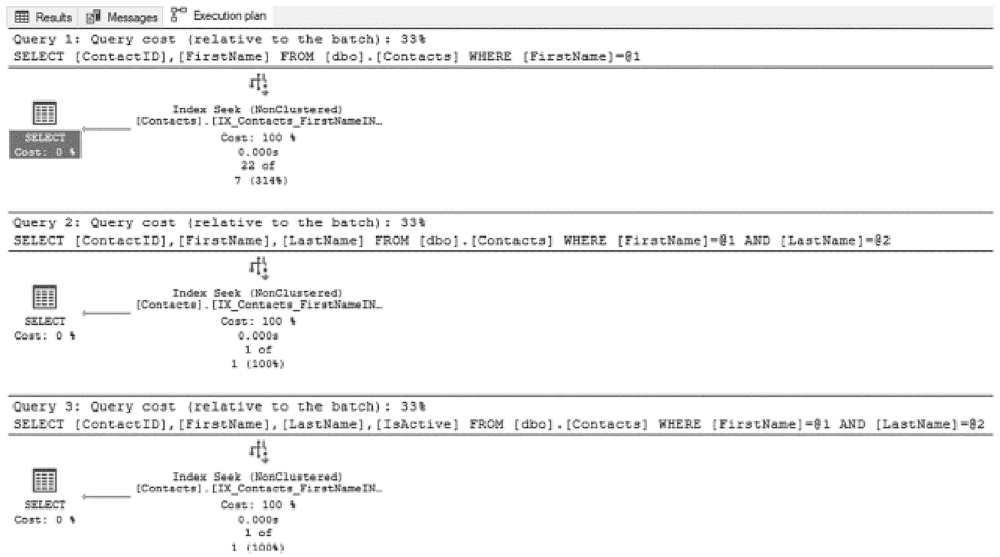

一个面板，其中打开了执行计划选项卡，包含查询 1 到 3 的各 2 行文本，每个查询占批处理成本的 33%。每个查询都有一个流程图，展示了从索引查找（非聚集，Contacts，成本 100%）到选择（成本 0%）的连接。

图 13-35
“包含列”模式的执行计划

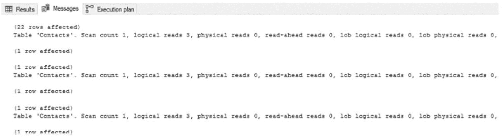

一个面板，其中打开了消息选项卡，包含 Contacts 表的 3 行条目，具有相同的扫描计数 1，逻辑读取 3，物理读取 0，预读取 0，LOB 逻辑读取 0，LOB 物理读取 0，位于“影响了 22 行”标签之下，中间穿插着“影响了 1 行”标签。

图 13-34
“包含列”模式的统计 I/O 结果

```
USE AdventureWorks2017;
GO
SET STATISTICS IO ON;
SELECT ContactID,
FirstName
FROM dbo.Contacts
WHERE FirstName = 'Catherine';
SELECT ContactID,
FirstName,
LastName
FROM dbo.Contacts
WHERE FirstName = 'Catherine'
AND LastName = 'Cox';
SELECT ContactID,
FirstName,
LastName,
IsActive
FROM dbo.Contacts
WHERE FirstName = 'Catherine'
AND LastName = 'Cox';
清单 13-24
针对“包含列”模式的其他查询
```

构建非聚集索引的“包含列”模式是创建索引时使用的重要模式。当与导致查找操作的具体查询结合使用时，它能提升读取和执行性能。它还提供了整合相似索引的机会，从而减少表上的索引总数，同时相比不存在索引的情况仍能提供性能提升。

##### 筛选索引

在某些表中，存在某些具有特定值的行，这些行在应用程序使用数据库时极少或永远不会在结果集中返回。在这些场景中，将这些行作为结果集返回的选项移除可能是有益的。在其他一些情况下，识别表中的数据子集并基于此创建索引可能很有用。通过使用仅覆盖查询需要返回结果的那数百或数千行的索引，而不是扫描表中的数百万或数十亿条记录，可以提升性能。这两种情况都指明了使用“筛选索引”模式有助于提升性能的场景。

“筛选索引”模式，顾名思义，使用了 SQL Server 中的筛选索引功能。使用筛选索引时，会在非聚集索引中添加一个 `WHERE` 子句，以减少索引中包含的行数。通过仅包含匹配 `WHERE` 子囧过滤条件的行，查询引擎在构建执行计划时只需考虑这些行；此外，扫描行范围的成本也低于索引包含所有行的情况。

为了说明使用筛选索引的价值，考虑一个场景：只有表中的一小部分行在被筛选的列中包含值。清单 13-25 考虑了一个查询的不同版本。第一个版本返回 `CertificationDate` 有值的行。第二个版本仅返回 `CertificationDate` 在 2005 年 1 月 1 日至 2005 年 2 月 1 日之间的行。对于这两个查询，表中都没有索引能为执行提供最优计划，并且在执行过程中访问了索引的所有 2,866 个页面（参见图 13-36）。检查两个执行计划（图 13-37）显示，使用了 `dbo.Contacts` 的聚集索引扫描来查找匹配 `CertificationDate` 谓词的行。正如缺失索引提示所建议的，在 `CertificationDate` 列上创建索引可以提升查询性能。

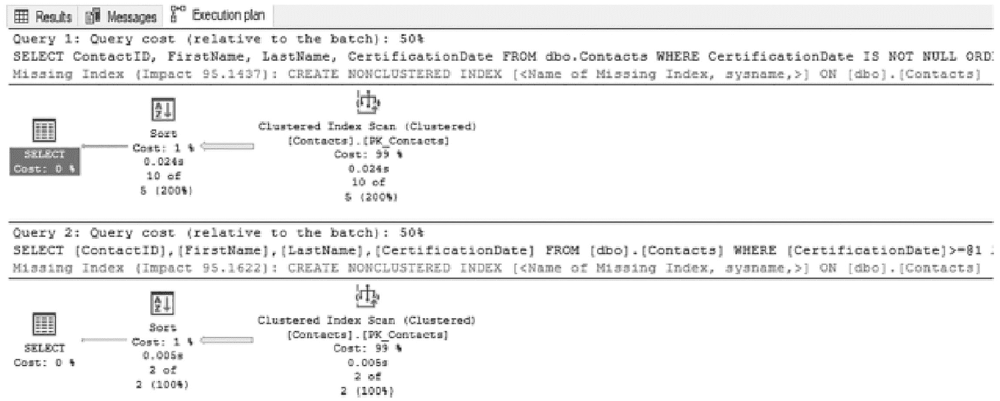

一个面板，其中打开了执行计划选项卡，包含查询 1 和 2 的各 3 行文本，每个查询占批处理成本的 50%。每个查询都有一个流程图，展示了从聚集索引扫描（聚集，Contacts，成本 99%）到选择（成本 0%）的连接。

图 13-37
未使用“筛选索引”模式的查询的执行计划

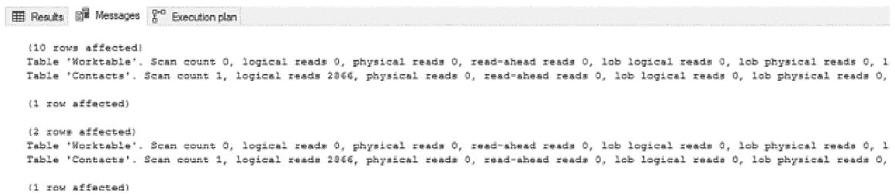

一个面板，其中打开了消息选项卡，包含 worktable 和 contacts 表的 2 组各 2 行条目，具有相同的扫描计数 0 和 1，逻辑读取 0 和 2866，物理读取 0 和 0，预读取 0 和 0，LOB 逻辑读取 0 和 0，LOB 物理读取 0 和 0，位于“影响了 10 行”标签之下，中间穿插着“影响了 1 行”标签。

图 13-36
未使用“筛选索引”模式的查询的统计 I/O 结果

```
USE AdventureWorks2017;
GO
SET STATISTICS IO ON;
SELECT ContactID,
FirstName,
LastName,
CertificationDate
FROM dbo.Contacts
WHERE CertificationDate IS NOT NULL
ORDER BY CertificationDate;
SELECT ContactID,
FirstName,
LastName,
CertificationDate
FROM dbo.Contacts
WHERE CertificationDate
BETWEEN '20110101' AND '20110201'
ORDER BY CertificationDate;
清单 13-25
未使用“筛选索引”模式的查询
```

在应用缺失索引建议之前，请考虑索引在此查询及未来查询中将如何使用。在此场景中，假设永远不会有一个查询在值为 `NULL` 时使用 `CertificationDate`。那么，在索引中为所有 `NULL` 行存储空值有意义吗？基于所述假设，这样做没有意义；这样做会浪费数据库空间，并且如果因扫描读取量足够高而选择了其他索引，导致跳过 `CertificationDate` 上的索引，则可能会导致执行计划不是最优的。

在此场景中，过滤索引中的行是有意义的。为此，索引的创建方式与其他索引相同，只是在其索引创建语句中添加了一个 `WHERE` 子句（参见清单 13-26）。创建过滤索引时，关于 `WHERE` 子句有几点需要注意。首先，`WHERE` 子句必须是确定性的。它不能随着时间推移根据子句内函数的结果而改变。例如，不能使用 `GETDATE()` 函数，因为其返回的值每毫秒都在变化。第二个限制是只允许简单的比较逻辑。这意味着不能使用 `BETWEEN` 和 `LIKE` 比较。有关过滤索引的限制和约束的更多信息，请参阅第 2 章。

执行清单 13-26 中的 `CertificationDate` 查询表明，过滤索引对查询性能有显著影响。关于产生的读取次数，现在只有 2 次读取，而应用索引之前是 2,866 次读取（参见图 13-38）。此外，执行计划现在对两个查询都使用索引查找，而不是聚集索引扫描，如图 13-39 所示。虽然这些结果是预料之中的，但关于该索引的另一个考虑是，新索引仅由两个页组成。如图 13-40 所示，整个索引所需的页数大大少于聚集索引和其他非聚集索引。

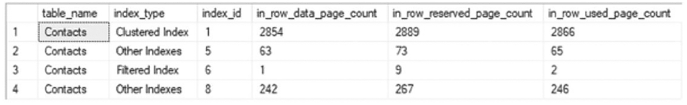

图 13-40 过滤索引的页数比较

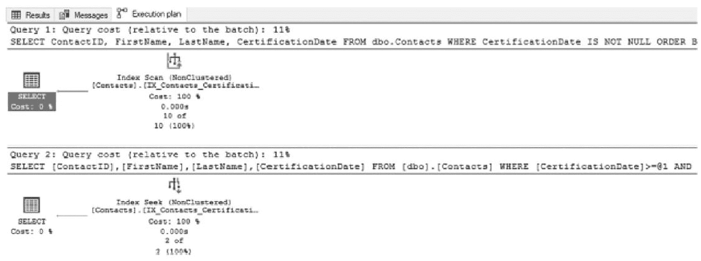

图 13-39 过滤索引模式的执行计划

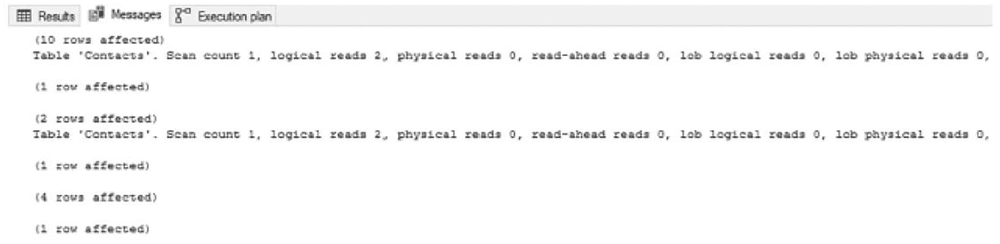

图 13-38 过滤索引模式的统计信息 I/O 结果

```sql
USE AdventureWorks2017
GO
CREATE INDEX IX_Contacts_CertificationDate ON dbo.Contacts(CertificationDate)
INCLUDE (FirstName, LastName)
WHERE CertificationDate IS NOT NULL;
SET STATISTICS IO ON;
SELECT ContactID,
FirstName,
LastName,
CertificationDate
FROM dbo.Contacts
WHERE CertificationDate IS NOT NULL
ORDER BY CertificationDate;
SELECT ContactID,
FirstName,
LastName,
CertificationDate
FROM dbo.Contacts
WHERE CertificationDate
BETWEEN '20110101' AND '20110201'
ORDER BY CertificationDate;
SET STATISTICS IO OFF;
SELECT OBJECT_NAME(object_id) as table_name
,CASE index_id
WHEN INDEXPROPERTY(object_id , 'IX_Contacts_CertificationDate', 'IndexID') THEN 'Filtered Index'
WHEN 1 THEN 'Clustered Index'
ELSE 'Other Indexes' END As index_type
,index_id
,in_row_data_page_count
,in_row_reserved_page_count
,in_row_used_page_count
FROM sys.dm_db_partition_stats
WHERE object_id = OBJECT_ID('dbo.Contacts');
```
清单 13-26 过滤索引模式

仅将表中行的一个子集包含在索引中具有许多优势。一个优势是，由于索引更小，索引中的页更少，这直接转化为数据库的存储需求更低。类似地，如果索引中的页更少，则索引碎片的机会更少，维护索引所需的工作量也更小。过滤索引的最后一个优势与性能和计划质量有关。由于过滤索引中的值是有限的，索引的统计信息也是有限的。由于在过滤索引中需要遍历的页更少，对过滤索引的扫描几乎总是比对聚集索引或堆的扫描性能问题更小。

在创建索引时，有几种情况可以并且应该使用过滤索引模式。第一种情况是当需要在配置为稀疏的列上创建索引时。在这种情况下，预期将具有该值的行数与总行数相比会很小。使用稀疏列的好处之一是避免了在这些列中存储 `NULL` 值所带来的存储成本。通过使用过滤索引，确保这些列上的索引不存储 `NULL` 值。第二种情况是当需要在可以包含多个 `NULL` 值的列上强制唯一性时。创建一个键列不为 `NULL` 的唯一过滤索引，将绕过唯一性限制（该限制只允许列中存在单个 `NULL` 值）。如果一个列包含社会安全号码，有时可能包含 `NULL`，但当不为 `NULL` 时应始终唯一，则可以创建一个唯一过滤索引来强制非 `NULL` 值的唯一性。

最后一种适合过滤索引的情况是，当需要运行的查询不符合表的正常索引配置文件时。在这种情况下，可能有一个用于一次性报告的查询需要从数据库中检索几千行。与其运行报告并处理可能的聚集索引或堆扫描，不如创建模拟查询谓词的过滤索引。这将允许快速执行查询，而无需花费时间构建包含查询永远不会考虑的值的索引。

在值经常更改的列上实现过滤索引时要小心。SQL Server 将需要在每次更改时重新评估更改后的值，以确定是否应将其添加到过滤索引、从中移除或不做更改。对常见写入操作的性能和负载测试是规避此风险的可靠方法。

正如本节详细阐述的，过滤索引模式在各种情况下都很有用。在为大型表编制索引且通常只需要一小部分数据子集时，请务必考虑它。通常，当发现过滤索引的第一个用途时，还会出现其他用途，并且这些情况将通过前面提到的数据选择和修改来识别，这些操作可以受益于过滤索引的使用。


### 外键

最后一个非聚集索引模式是外键模式。这是唯一直接与数据库设计中的对象相关联的模式。外键提供了一种机制，用于将一个表中的值约束为另一个表中的行值。这种关系提供了在大多数数据库部署中至关重要的引用完整性。然而，外键有时会成为数据库中性能问题的根源，而无人意识到它们正在干扰性能。

由于外键对列的可能值提供了约束，因此在需要验证值时会进行一次检查。外键可能涉及两种类型的验证。第一种发生在父表 `dbo.ParentTable` 上，第二种发生在子表 `dbo.ChildTable` 上（见图 13-41）。每当在 `dbo.ChildTable` 中修改行时，就会在 `dbo.ParentTable` 上进行验证。在这些情况下，会通过查找 `dbo.ParentTable` 中的值来验证来自 `dbo.ChildTable` 的 `ParentID` 值。通常，这不会导致性能问题，因为 `dbo.ParentTable` 中的 `ParentID` 将是表的主键，并且通常是表进行聚集的列。另一种验证发生在 `dbo.ParentTable` 被修改时，此时会在 `dbo.ChildTable` 上进行。例如，如果要删除 `dbo.ParentTable` 中的某一行，则需要检查 `dbo.ChildTable` 以查看该 `ParentID` 值是否正在该表中使用。这种验证正是需要应用外键模式的地方。

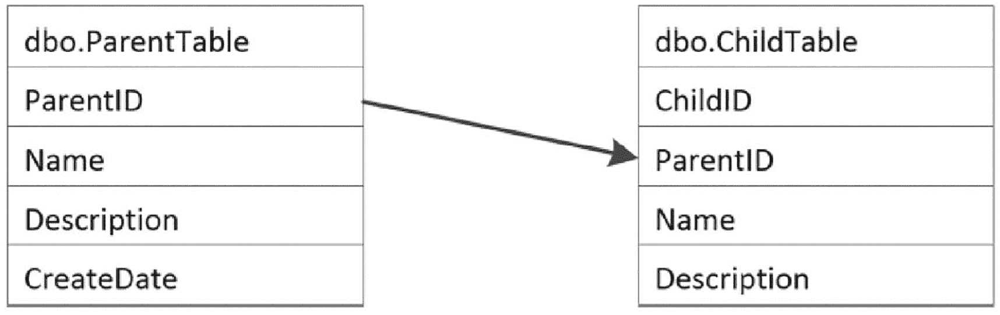

一幅图示包含两个五列的表格，由一个对角线方向的箭头连接。左侧的表格标签为 d b o 点 parent table, parent i d, name, description, 和 create date，右侧的表格标签为 d b o 点 child table, child i d, parent i d, name, 和 description。

图 13-41：外键关系

为了演示外键模式，示例中将需要几个表。清单 13-27 中的代码创建了两个表：`dbo.Customer` 和 `dbo.SalesOrderHeader`。在这两个表之间，在 `CustomerID` 列上存在外键关系。对于每个 `dbo.SalesOrderHeader` 行，都有一个与该行关联的客户。反之，`dbo.Customer` 中的每一行可能与 `dbo.SalesOrderHeader` 中的一个或多个行相关。

```sql
USE AdventureWorks2017
GO
CREATE TABLE dbo.Customer(
CustomerID int
,FillterData char(1000)
,CONSTRAINT PK_Customer_CustomerID PRIMARY KEY CLUSTERED (CustomerID)
);
CREATE TABLE dbo.SalesOrderHeader(
SalesOrderID int
,OrderDate datetime
,DueDate datetime
,CustomerID int
,FillterData char(1000)
,CONSTRAINT PK_SalesOrderHeader_SalesOrderID
PRIMARY KEY CLUSTERED (SalesOrderID)
,CONSTRAINT GK_SalesOrderHeader_CustomerID_FROM_Customer
FOREIGN KEY (CustomerID) REFERENCES dbo.Customer(CustomerID)
);
INSERT INTO dbo.Customer (CustomerID)
SELECT CustomerID
FROM Sales.Customer;
INSERT INTO dbo.SalesOrderHeader
(SalesOrderID, OrderDate, DueDate, CustomerID)
SELECT SalesOrderID, OrderDate, DueDate, CustomerID
FROM Sales.SalesOrderHeader;
```

清单 13-27：外键模式的设置

在此示例中，当 `dbo.Customer` 中的一行被修改时，`dbo.SalesOrderHeader` 中会发生什么？为了演示在 `dbo.Customer` 上的操作，清单 13-28 中的脚本在 `CustomerID` 等于 701 的行上执行 `DELETE`。该行在 `dbo.SalesOrderHeader` 中应该没有对应的行。即便如此，外键仍要求进行检查以确定 `dbo.SalesOrderHeader` 中是否有使用该 `CustomerID` 的行。如果有，SQL Server 将在删除时抛出错误，删除操作将失败。由于 `dbo.SalesOrderHeader` 中没有行，因此可以删除 `dbo.Customer` 中的该行。

执行过程指出了删除操作可能存在的几个性能问题。首先，虽然只删除了一行，但总共产生了 4,516 次读取（见图 13-42）。在这些读取中，有 3 次发生在 `dbo.Customer` 上，而有 4,513 次发生在 `dbo.SalesOrderHeader` 上。造成这种情况的原因是必须在 `dbo.SalesOrderHeader` 上进行 `聚集索引扫描`（如图 13-43 所示）。之所以进行扫描，是因为检查哪些行使用了 `Customer` 等于 701 的唯一方法是扫描表中的所有行。没有索引可以提供更快的路径来验证该值是否被使用。

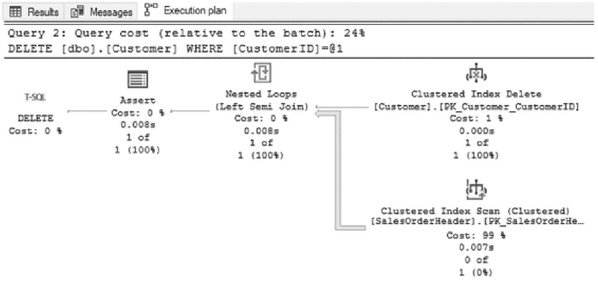

一个面板中打开了执行计划选项卡，包含查询 2 的两行文本，占批处理总成本的 24%。下方是一个流程图，展示了多条路径：聚集索引删除，customer，占成本 1%；聚集索引扫描，clustered，sales order header，占成本 99%；删除占成本 0%。

图 13-43：无索引时外键模式的执行计划

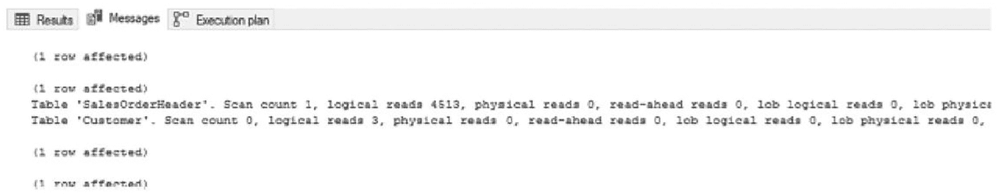

一个面板中打开了消息选项卡，包含 sales order header 和 customer 表的两行条目，扫描计数分别为 1 和 0，逻辑读取分别为 4513 和 3，物理读取分别为 0 和 0，预读取分别为 0 和 0，L O B 逻辑读取分别为 0 和 0，L O B 物理读取大约为 0 和 0，上下各有一行“1 row affected”标签。

图 13-42：无索引时外键模式的统计信息 I/O 结果

```sql
USE AdventureWorks2017
GO
SELECT MAX(c.CustomerID)
FROM dbo.Customer c
LEFT OUTER JOIN dbo.SalesOrderHeader soh ON c.CustomerID = soh.CustomerID
WHERE soh.CustomerID IS NULL;
SET STATISTICS IO ON;
DELETE FROM dbo.Customer
WHERE CustomerID = 701;
```

清单 13-28：无索引的外键模式

通过外键模式可以简单地提高在 `dbo.Customer` 上执行 `DELETE` 的性能。在 `dbo.SalesOrderHeader` 的 `CustomerID` 列上建立一个索引，将为下一次删除操作的验证提供一个参考点（见清单 13-29）。审查带索引情况下的执行情况，结果大不相同。在 `dbo.SalesOrderHeader` 上的读取次数从 4,513 次减少到仅有 2 次（见图 13-44）。这一变化当然是由于在 `CustomerID` 列上创建了索引（见图 13-45）。删除操作不再进行聚集索引扫描，而是可以利用在 `dbo.SalesOrderHeader` 上的索引查找。

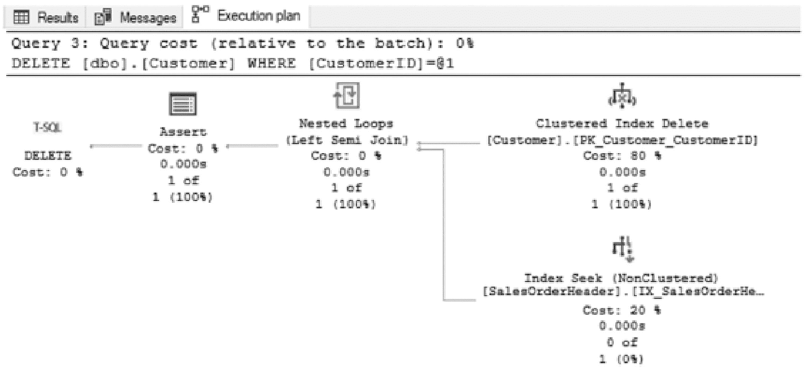

一个面板中打开了执行计划选项卡，包含查询 3 的两行文本，占批处理总成本的 0%。下方是一个流程图，展示了多条路径：聚集索引删除，customer，占成本 80%；索引查找，非聚集，sales order header，占成本 20%；删除占成本 0%。

图 13-45：带索引时外键模式的执行计划

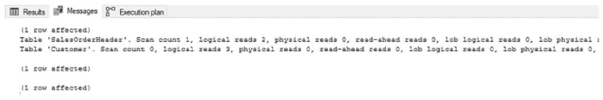

一个面板中打开了消息选项卡，包含 sales order header 和 customer 表的两行条目，扫描计数分别为 1 和 0，逻辑读取分别为 2 和 3，物理读取分别为 0 和 0，预读取分别为 0 和 0，L O B 逻辑读取分别为 0 和 0，L O B 物理读取分别为 0 和 0，上下各有一行“1 row affected”标签。

图 13-44：带索引时外键模式的统计信息 I/O 结果


一个打开了消息选项卡的面板，其中显示了销售订单头表和客户表的 2 行条目，扫描计数分别为 1 和 0，逻辑读取分别为 2 和 3，物理读取分别为 0 和 0，预读取分别为 0 和 0，大对象逻辑读取分别为 0 和 0，大对象物理读取均约为 0 和 0，其上方和下方各有 1 行受影响的标签。

图 13-44
使用了索引的外键模式的统计信息 I/O 结果

```
USE AdventureWorks2017
GO
CREATE INDEX IX_SalesOrderHeader_CustomerID ON dbo.SalesOrderHeader(CustomerID);
SELECT MAX(c.CustomerID)
FROM dbo.Customer c
LEFT OUTER JOIN dbo.SalesOrderHeader soh ON c.CustomerID = soh.CustomerID
WHERE soh.CustomerID IS NULL;
SET STATISTICS IO ON
DELETE FROM dbo.Customer
WHERE CustomerID = 700
```

清单 13-29
使用了索引的外键模式

**外键模式**对于在表之间建立外键关系至关重要。这些关系的目的是验证数据，因此必须确保支持该活动的索引已就位。不要以此模式为借口从数据库中移除验证；相反，应将其视为对繁忙表进行正确索引的机会。如果该列需要被查询以进行数据验证和约束，那么当该数据需要用于其他目的时，它很可能也会被应用程序访问。

### 列存储索引

随着数据库规模的增长，传统聚集和非聚集索引无法为计算结果提供所需性能的情况越来越多。这对于大型数据仓库构成了最大的挑战，为解决此问题，SQL Server 2012 引入了列存储索引。前面的章节讨论了列存储如何利用基于列的存储而非基于行的存储。本节将介绍聚集和非聚集列存储索引的一些指导原则，以及如何识别何时应构建列存储索引。在介绍指导原则之后，将提供一个实现列存储索引的示例。

### 注意

本节中的列存储索引示例使用了 Microsoft Contoso BI Demo Dataset for Retail Industry。该数据库包含一个拥有超过 800 万条记录的事实表。可在 `www.microsoft.com/download/en/details.aspx?displaylang=en&id=18279` 下载。

使用列存储索引的关键在于能够正确识别应应用它们的场景。虽然在某些 OLTP 数据库中使用列存储索引可能有用，但这并非其目标场景。尽管列存储索引的性能在 OLTP 数据库中可能有用，但与此索引类型相关的限制使其难以在事务性工作负载中有意义地使用。列存储索引主要适用于数据仓库，因为那里需要跨大量行进行聚合，并且返回的列较少。凭借基于列的存储和内置压缩，这种索引类型提供了一种尽可能快地访问所需数据的方法，而无需加载不属于查询的列。在数据仓库中，列存储索引更适用于事实表而非维度表。列存储索引在应用于大型表时才能证明其价值。表越大，列存储索引相对于传统索引带来的性能提升就越大。此外，在考虑数据仓库查询时，它们有一个共同特征，即使用可用列的聚合和子集。通过聚合，列存储索引的批处理模式处理提供了更大的性能改进。查询中涉及的列越少，意味着加载到内存中的数据就越少，因为查询上下文中只使用了被访问的列。

当发现适合使用列存储索引的场景时，首先需要考虑几点。由于列存储索引既可以是聚集的，也可以是非聚集的，因此第一个决策是使用哪种类型。聚集列存储索引将表中的所有数据与索引一起存储，这意味着数据库中只出现数据的一份副本。由于是所有数据，表中的所有列都会出现在列存储索引中。对于主要或完全是分析性质的工作负载来说，这很可能是理想的选择。

或者，列存储索引可以是非聚集的。这提供了限制索引中包含的列数的能力。非聚集列存储索引将依赖于表中已有的聚集行存储索引，这意味着非聚集列存储索引会增加表的总体存储占用空间。


非聚集列存储索引在创建时需要考虑更多因素，因此在构建它们时需要遵循若干准则。首先，非聚集列存储索引中列的顺序并不重要。每一列都与其他列分开存储，且彼此之间不存在关系。其次需要记住的是，表中所有将被列存储索引利用的列都必须出现在该列存储索引中。如果查询中的某个列未出现在非聚集列存储索引中，则该索引在其执行过程中将无法被使用。

如果使用 SQL Server 2017 之前的版本，则必须牢记非聚集列存储索引是*只读*的，任何构建了非聚集列存储索引的表或分区都将被置于只读状态。若要修改表，则需要禁用或删除该非聚集列存储索引，待更新完成后再重建或重新创建。此限制不影响聚集列存储索引，并且从 SQL Server 2017 开始，非聚集列存储索引的此项限制已被取消。

非聚集列存储索引非常适用于本质上以事务为主，但同时也需要支持关键分析查询的表。额外的好处是，可以为非聚集列存储索引指定列列表，从而使索引能够专门针对用于重要分析查询的列。

影响两种类型列存储索引的一个限制是创建索引所需的时间长度。在许多情况下，创建列存储索引所需的时间可能是构建聚集或非聚集索引的四到五倍。因此，索引创建应安排在资源充足的时间进行。有关列存储索引的更多信息，请参阅第 2 章。

在展示列存储索引的价值之前，值得先回顾一个使用传统索引针对数据仓库的查询演示。在清单 13-30 中，该查询按 `CalendarQuarter` 和 `ProductCategoryName` 汇总 `SalesQuantity` 值。执行该查询并不需要大量时间；图 13-46 显示耗时为 4,293 毫秒（即 4.2 秒），在 `dbo.FactSales` 上进行了不到 20,000 次读取。对于当前的记录量来说，结果是合理的，但设想一下如果表中的行数增加 10 倍或 100 倍会怎样。在什么情况下，4.2 秒的执行时间会增长到超出可接受的执行时间范围？

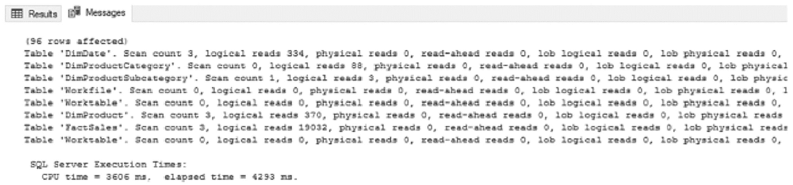

一个面板，其消息选项卡已打开，显示 8 行对应 8 个表，包含不同的扫描计数、逻辑读取、物理读取、预读读取、LOB 逻辑读取和 LOB 物理读取值，标签为“受影响的 96 行”。此外，在 SQL Server 执行信息下还显示了 CPU 时间 3606 毫秒和总耗时 4293 毫秒。

图 13-46
针对事实表上聚集索引的统计 I/O 结果

注意
由于执行计划的尺寸较大，它们未包含在列存储索引示例中。并且由于本节依赖 CPU 时间来演示性能，因此会多次运行查询以确保磁盘到内存的性能不是影响因素。

```
USE ContosoRetailDW
GO
SET STATISTICS IO ON
SET STATISTICS TIME ON
SELECT dd.CalendarQuarter
,dpc.ProductCategoryName
,COUNT(*) As TotalRows
,SUM(SalesQuantity) AS TotalSales
FROM dbo.FactSales fs
INNER JOIN dbo.DimDate dd ON fs.DateKey = dd.Datekey
INNER JOIN dbo.DimProduct dp ON fs.ProductKey = dp.ProductKey
INNER JOIN dbo.DimProductSubcategory dps ON dp.ProductSubcategoryKey = dps.ProductSubcategoryKey
INNER JOIN dbo.DimProductCategory dpc ON dps.ProductCategoryKey = dpc.ProductCategoryKey
GROUP BY dd.CalendarQuarter
,dpc.ProductCategoryName;
```
清单 13-30: 使用传统索引的分析查询

为了测试在 `dbo.FactSales` 上使用非聚集列存储索引的性能，将向该表添加一个新索引。`dbo.FactSales` 中的所有列都被添加到该列存储索引中，如清单 13-31 所示。索引就位后，查询性能发生了显著变化。从时间角度看，查询在 286 毫秒内完成，如图 13-47 所示，相比没有非聚集列存储索引的情况，性能提升了超过 15 倍。此外，I/O 次数从近 20,000 次下降到 2,608 次。

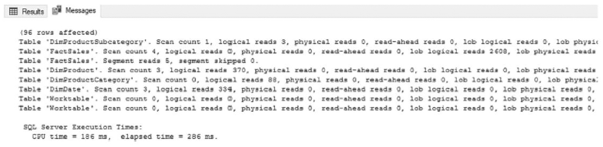

一个面板，其消息选项卡已打开，显示 8 行对应 8 个表，包含不同的扫描计数、逻辑读取、物理读取、预读读取、LOB 逻辑读取和 LOB 物理读取值，标签为“受影响的 96 行”。此外，在 SQL Server 执行信息下还显示了 CPU 时间 168 毫秒和总耗时 286 毫秒。

图 13-47
针对非聚集列存储索引的统计 I/O 结果

```
USE ContosoRetailDW
GO
CREATE NONCLUSTERED COLUMNSTORE INDEX IX_FactSales_CStore ON dbo.FactSales (
SalesKey, DateKey, channelKey, StoreKey, ProductKey, PromotionKey, CurrencyKey, UnitCost, UnitPrice,
SalesQuantity, ReturnQuantity, ReturnAmount, DiscountQuantity, DiscountAmount, TotalCost, SalesAmount,
ETLLoadID, LoadDate, UpdateDate);
SET STATISTICS IO ON;
SET STATISTICS TIME ON;
SELECT dd.CalendarQuarter
,dpc.ProductCategoryName
, COUNT(*) As TotalRows
,SUM(SalesQuantity) AS TotalSales
FROM dbo.FactSales fs
INNER JOIN dbo.DimDate dd ON fs.DateKey = dd.Datekey
INNER JOIN dbo.DimProduct dp ON fs.ProductKey = dp.ProductKey
INNER JOIN dbo.DimProductSubcategory dps ON dp.ProductSubcategoryKey = dps.ProductSubcategoryKey
INNER JOIN dbo.DimProductCategory dpc ON dps.ProductCategoryKey = dpc.ProductCategoryKey
GROUP BY dd.CalendarQuarter
,dpc.ProductCategoryName;
```
清单 13-31: 添加非聚集列存储索引

在测试、分析和优化工作负载时，考虑哪些列属于非聚集列存储索引至关重要。非分析查询目标的列可以省略。这可以节省存储空间，减少执行索引维护的时间，并在插入、更新或删除数据时减少需要更新的段和行组数量，从而缩短写入时间。

接下来，考虑在 `dbo.FactSales` 上使用聚集列存储索引的影响。由于该表上已存在聚集索引，因此将使用清单 13-32 中的脚本创建一个名为 `dbo.FactSales_CCI` 的新表，用 `dbo.FactSales` 中的相同数据填充它，并向其添加聚集列存储索引。

使用与前面示例相同的聚合查询，聚集列存储索引的性能价值显而易见。考虑到执行时间（如图 13-48 所示），它进一步下降到 164 毫秒，这比使用聚集索引的事实表快了超过 26 倍。I/O 也相应减少，执行仅消耗了 1,309 次 I/O。虽然其 I/O 占用与非聚集列存储索引相似，但请记住，聚集列存储索引仅存储一次，并且其中的值可以被修改。


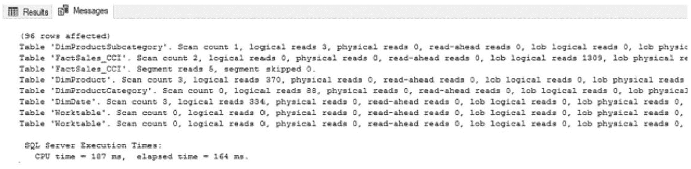

一个面板中打开了“消息”选项卡，显示了 8 行数据，对应 8 个表，包含不同的扫描计数、逻辑读取、物理读取、预读取、LOB 逻辑读取和 LOB 物理读取等值，位于“96 行受影响”标签下。此外，在“SQL Server 执行时间”下还显示了 107 毫秒和 164 毫秒，分别对应 CPU 时间和已用时间。

图 13-48

聚集列存储索引的统计信息 I/O 结果

```sql
USE ContosoRetailDW
GO
IF OBJECT_ID('dbo.FactSales_CCI') IS NOT NULL
DROP TABLE FactSales_CCI
CREATE TABLE dbo.FactSales_CCI(
SalesKey int NOT NULL,
DateKey datetime NOT NULL,
channelKey int NOT NULL,
StoreKey int NOT NULL,
ProductKey int NOT NULL,
PromotionKey int NOT NULL,
CurrencyKey int NOT NULL,
UnitCost money NOT NULL,
UnitPrice money NOT NULL,
SalesQuantity int NOT NULL,
ReturnQuantity int NOT NULL,
ReturnAmount money NULL,
DiscountQuantity int NULL,
DiscountAmount money NULL,
TotalCost money NOT NULL,
SalesAmount money NOT NULL,
ETLLoadID int NULL,
LoadDate datetime NULL,
UpdateDate datetime NULL
)
INSERT INTO dbo.FactSales_CCI
SELECT * FROM dbo.FactSales
CREATE CLUSTERED COLUMNSTORE INDEX FactSales_CStore ON dbo.FactSales_CCI
SET STATISTICS IO ON;
SET STATISTICS TIME ON;
SELECT dd.CalendarQuarter
,dpc.ProductCategoryName
, COUNT(*) As TotalRows
,SUM(SalesQuantity) AS TotalSales
FROM dbo.FactSales_CCI fs
INNER JOIN dbo.DimDate dd ON fs.DateKey = dd.Datekey
INNER JOIN dbo.DimProduct dp ON fs.ProductKey = dp.ProductKey
INNER JOIN dbo.DimProductSubcategory dps ON dp.ProductSubcategoryKey = dps.ProductSubcategoryKey
INNER JOIN dbo.DimProductCategory dpc ON dps.ProductCategoryKey = dpc.ProductCategoryKey
GROUP BY dd.CalendarQuarter
,dpc.ProductCategoryName;
```

清单 13-32
创建带有聚集列存储索引的事实表

虽然聚集列存储索引对于分析工作负载是最优的，但它对于事务性查询的性能表现不佳。如果一个表服务于 OLTP 查询，那么聚集列存储索引很可能是一个错误的选择。同时包含 OLAP 和 OLTP 查询的混合工作负载可能难以优化。如果为这些工作负载创建索引被证明是困难的，请考虑将事务性查询和分析查询及其数据相互分离的方法。事务性和分析性工作负载的混合是数据库管理员和开发人员面临的最复杂挑战之一，因此，解决这个问题的有效方案可能需要除索引之外的额外优化策略。

可以在具有聚集列存储索引的表上创建非聚集的行存储索引。这些索引可以支持那些与表的自然数据顺序不匹配的备选搜索路径。在聚集列存储表上实施非聚集行存储索引之前，请务必在没有额外索引的情况下测试查询性能。通常情况下，压缩、行组消除和其他列存储特性所提供的速度可能足以提供足够的性能，而无需额外的索引。

也可以在内存优化表上创建列存储索引。内存优化表旨在处理高度争用、繁重的 OLTP 工作负载。这使得它们不适合作为列存储索引的候选对象。内存优化表上的列存储索引应进行仔细测试，以确保其不仅性能良好，而且不会消耗过多内存或妨碍 OLTP 性能。

有序列存储索引在 SQL Server 2022 中引入，允许在插入数据时对其进行预排序。这是一个离线操作（按分区进行），使用 TempDB 对新插入的数据进行排序。如果一个表有专门的离线时间段，在此期间可以不受阻碍地执行数据加载，那么这可以是改善数据顺序性，从而提升行组消除效果的有用方法。有关此功能的更多信息，请查阅微软的以下文档：

[`https://docs.microsoft.com/zh-cn/azure/synapse-analytics/sql-data-warehouse/performance-tuning-ordered-cci`](https://docs.microsoft.com/zh-cn/azure/synapse-analytics/sql-data-warehouse/performance-tuning-ordered-cci)

请注意，由于需要在 TempDB 中对数据进行排序，大型的 INSERT 操作可能会导致 TempDB 产生大量 I/O，并消耗系统数据库中的空间。如果使用此选项，请确保 TempDB 有足够的可用空间来支持它。

以下是列存储索引的一些最佳实践简要列表，有助于了解何时使用它们以及如何确保最佳性能：

*   列存储索引应针对每个分区至少有数千万行（或将增长到此规模）的表。
*   以至少 102,400 行或更多的批次将行插入聚集列存储索引，以允许使用最小日志记录的大容量加载过程。
*   有序数据可以实现有效的行组消除。确保数据按最常作为过滤目标的列排序后插入列存储索引。
*   对具有列存储索引的大表进行分区。这允许进行分区消除，并能够针对单个分区执行维护任务（备份、重建、重新组织、截断、分区交换）。
*   避免对列存储索引执行 UPDATE 操作。这些操作表现为 DELETE 加 INSERT，并且会由于删除的数据膨胀而产生碎片。UPDATE 操作还会导致数据无序，降低行组消除的效果。
*   使用列存储索引时，只查询所需的列。这减少了必须读取的段数，从而减少 I/O 和内存使用量，并提高查询速度。
*   仅在满足上述许多或所有标准的表上使用非聚集列存储索引。一个碎片严重的非聚集列存储索引可能不会比经典的行存储覆盖索引提供更多的价值（如果有的话）。

列存储索引是数据仓库索引方式的一个重大改进。随着 SQL Server 每个版本的更新，列存储索引不断改进，成为索引大型分析数据的更高效方式。这些性能改进为数据库的扩展提供了机会，使其能够超越传统索引解决方案所能达到的范围。列存储索引使 OLAP 表能够轻松扩展到数百亿行（或更多）。

注意

下一节使用了 WorldWideImporters 数据库，可从 [`https://github.com/Microsoft/sql-server-samples/releases/tag/wide-world-importers-v1.0`](https://github.com/Microsoft/sql-server-samples/releases/tag/wide-world-importers-v1.0) 下载。


### JSON 索引

SQL Server 2016 引入了在 SQL Server 中处理 JSON（JavaScript 对象表示法）数据的能力。JSON 定义了结构化数据的方法，便于应用程序和人员读写。由于其易用性，它在应用程序开发中变得非常流行。

与 XML 中使用的标签和属性不同，JSON 利用括号、冒号和引号来定义实体-属性关系。例如，清单 13-33 包含一个 XML 文档，定义了 WideWorldImporters 一名员工的额外信息。相同信息用 JSON 表示则显示在清单 13-34 中。两者比较，JSON 比相同数据表示的 XML 容易阅读和理解得多。

```
{
"OtherLanguages": ["Polish","Chinese","Japanese"] ,
"HireDate":"2008-04-19T00:00:00",
"Title":"Team Member",
"PrimarySalesTerritory":"Plains",
"CommissionRate":"0.98"
}
清单 13-34
JSON 示例
```

```
Polish
Chines
Japanese

2008-04-19T00:00:00
Team Member
Plains
0.98

清单 13-33
XML 示例
```

虽然 SQL Server 可以处理 JSON 数据，但 Microsoft 实现 JSON 的方式与 XML 和空间数据的实现方式略有不同。JSON 数据没有专用的数据类型，而是存储在定义为 `varchar(max)` 或 `nvarchar(max)` 数据类型的列中。然后可以使用函数 `JSON_VALUE` 或 `JSON_QUERY` 检索数据中的信息。这种实现方式的优势在于，没有与 JSON 数据关联的特殊索引类型，这就是为什么没有专门章节讨论 JSON 索引。相反，JSON 数据通过利用持久化到索引中的计算列，利用了现有的索引功能。

在深入探讨如何索引 JSON 数据之前，将展示一个示例，说明 JSON 函数的工作原理及其对性能的影响。首先，从 WideWorldImporters 中的 `Application.People` 创建表 `dbo.People`，如清单 13-35 所提供。在该表中，将包含一个用于 `HireDate` 的列，该列从 `CustomFields` 中的 JSON 文档检索 `HireDate`。

```
USE WideWorldImporters;
GO
DROP TABLE IF EXISTS dbo.People;
CREATE TABLE [dbo].[People]
(
[PersonID] [INT] NOT NULL,
[FullName] NVARCHAR NOT NULL,
[CustomFields] NVARCHAR NULL,
[HireDate] AS JSON_VALUE([CustomFields], N'$.HireDate'),
[Junk] VARCHAR NULL,
CONSTRAINT [PK_People]
PRIMARY KEY CLUSTERED ([PersonID])
);
GO
INSERT INTO dbo.People
(
PersonID,
FullName,
CustomFields,
Junk
)
SELECT PersonID,
FullName,
CustomFields,
REPLICATE('x', 4000) AS Junk
FROM Application.People;
GO
清单 13-35
JSON 示例设置
```

当使用清单 13-36 中的代码查询 `dbo.People` 时，将使用计算列从 JSON 数据中返回所需的结果。不幸的是，为了检索这些结果，SQL Server 需要扫描聚集索引，如图 13-50 所示。此扫描的影响是访问了表中的所有 1,111 行，图 13-49 中的统计输出表明了这一点，并导致查询发生 762 次读取。

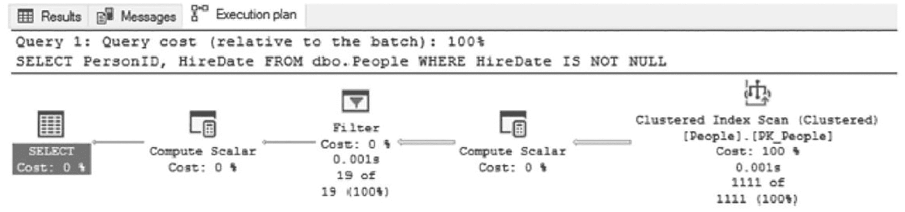
一个面板，其中打开了执行计划选项卡，显示了查询 1 的两行文本，其成本占批处理的 100%。下方是一个流程图，展示了从聚集索引扫描（聚集，people，成本 100%）到选择（成本 0%）的连接。
图 13-50
计算 JSON 列的执行计划


一个面板，其中打开了消息选项卡，显示了一行条目，内容为 `table 'people'，扫描计数 1，逻辑读取 742，物理读取 0，页面服务器读取 0，预读读取 0，页面服务器预读读取 0`，位于“19 行受影响”标签下方和“1 行受影响”标签上方。
图 13-49
计算 JSON 列的统计 I/O 结果

```
USE WideWorldImporters;
GO
SET STATISTICS IO ON;
SELECT PersonID,
HireDate
FROM dbo.People
WHERE HireDate IS NOT NULL;
清单 13-36
查询计算 JSON 列
```

为了减轻计算 JSON 列的性能影响，可以向计算列添加索引，如清单 13-37 所示，然后再次对 `dbo.People` 执行查询。这次性能大大改善。不是 762 次读取，图 13-51 显示只有 3 次读取。此外，图 13-52 中的执行计划表明使用了在添加的索引上进行的索引查找。

```
USE WideWorldImporters;
GO
CREATE INDEX IX_People_HireDate ON dbo.People (HireDate);
GO
SET STATISTICS IO ON;
SELECT PersonID,
HireDate
FROM dbo.People
WHERE HireDate IS NOT NULL
清单 13-37
索引并查询 JSON 计算列
```

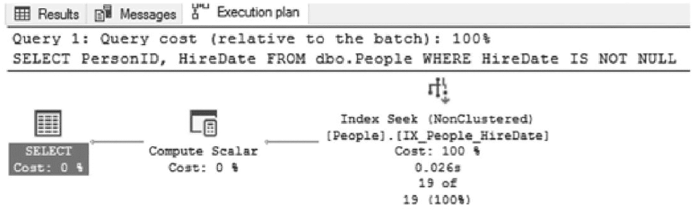
一个面板，其中打开了执行计划选项卡，显示了查询 1 的两行文本，其成本占批处理的 100%。下方是一个流程图，展示了从聚集索引查找（非聚集，people，成本 100%）到选择（成本 0%）的连接。
图 13-52
计算并索引后的 JSON 列的执行计划

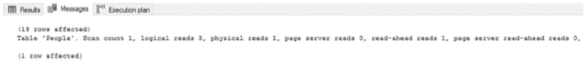
一个面板，其中打开了消息选项卡，显示了一行条目，内容为 `table 'people'，扫描计数 1，逻辑读取 3，物理读取 1，页面服务器读取 0，预读读取 1，页面服务器预读读取 0`，位于“19 行受影响”标签下方和“1 行受影响”标签上方。
图 13-51
计算并索引后的 JSON 列的统计 I/O 结果

通过利用计算列，可以轻松高效地访问表中的 JSON 数据。无需学习新的索引技术来获得这种效率，而是可以利用现有功能。这使得采用和支持 JSON 以及高效查询 JSON 数据变得更加容易。

## 索引存储策略

到目前为止，本章的策略主要侧重于通过索引的键列和非键列设计来提高使用索引的查询性能。在索引设计中，还可以考虑与列选择结合使用的其他选项。这些替代策略都与数据库中索引的存储方式有关。

有两种选项可用于处理索引如何存储其数据。这两种选项的基本前提是，索引越小，包含的页就越少，查询数据时所需的读写操作也就越少。第一个可用选项是行压缩，第二个是页压缩。这两个选项都有可能显著节省存储空间并提高性能。

注意
在 SQL Server 2016 SP1 之前，行和页压缩的使用仅限于 SQL Server 企业版，之后它对所有 SQL Server 版本都可用。


#### 行压缩

减少索引大小的第一种方法是减小索引内行的大小。行压缩通过改变数据在行中的存储方式来实现这一点。行压缩可用于堆、聚集索引和非聚集索引。启用行压缩后，行上会发生一些变化，具体如下：

*   修改行的元数据。
*   定长字符数据以变长格式存储。
*   基于数字的数据类型以变长格式存储。

通过元数据更改，与未启用行压缩的记录相比，为每个列存储的信息通常会减少。行开销中的多余位被移除，信息被精简以减少浪费。不过，这种更改有一个例外：对某些定长数据类型的更改可能会导致更大的行开销，以适应数据长度和偏移值所需的额外信息。

对于定长字符数据，会移除列中值末尾的空白。这些信息并未丢失，且定长数据类型（如 `char` 和 `nchar`）的行为不受影响。区别仅在于数据的存储方式。对于二进制数据，会移除值末尾的零，类似于移除空白。从列中移除的字符信息存储在行开销中。

数字数据类型是行压缩中操作最多的数据类型。这些数据类型以该类型可能的最小形式存储。这意味着一个定义为 `bigint` 数据类型的列，通常需要 8 字节，但如果存储的值介于 0 到 255 之间，则只需 1 字节。当值为 256 时，该列将存储为 2 字节。这个递进过程持续进行，直到需要以 8 字节存储该值。这适用于所有基于数字的数据类型，包括 `smallint`、`int`、`bigint`、`decimal`、`numeric`、`smallmoney`、`money`、`float`、`real`、`datetime`、`datetime2`、`datetimeoffset` 和 `timestamp`。

为了演示，需要一个表来实现压缩，如代码清单 13-38 所示。此脚本创建了两个表：`dbo.NoCompression` 和 `dbo.RowCompression`。这些表用于演示行压缩通过聚集索引对表大小以及对查询性能的影响。

```sql
USE AdventureWorks2017
GO
IF OBJECT_ID('dbo.NoCompression') IS NOT NULL
DROP TABLE dbo.NoCompression;
IF OBJECT_ID('dbo.RowCompression') IS NOT NULL
DROP TABLE dbo.RowCompression;
SELECT SalesOrderID
,SalesOrderDetailID
,CarrierTrackingNumber
,OrderQty
,ProductID
,SpecialOfferID
,UnitPrice
,UnitPriceDiscount
,LineTotal
,rowguid
,ModifiedDate
INTO dbo.NoCompression
FROM Sales.SalesOrderDetail;
SELECT SalesOrderID
,SalesOrderDetailID
,CarrierTrackingNumber
,OrderQty
,ProductID
,SpecialOfferID
,UnitPrice
,UnitPriceDiscount
,LineTotal
,rowguid
,ModifiedDate
INTO dbo.RowCompression
FROM Sales.SalesOrderDetail;
```

*代码清单 13-38*  
*行压缩的设置*

行压缩的实现依赖于在 `CREATE` 或 `ALTER INDEX` 语句中使用 `DATA_COMPRESSION` 索引选项。压缩可用于聚集索引或非聚集索引。对于行压缩，`ROW` 选项如代码清单 13-39 所示。在此示例中，向两个示例表都添加了一个聚集索引。在此表上使用行压缩的影响令人印象深刻；聚集索引所需的页数减少了超过 35%（见图 13-53）。

```sql
USE AdventureWorks2017
GO
CREATE CLUSTERED INDEX CLIX_NoCompression ON dbo.NoCompression
(SalesOrderID, SalesOrderDetailID);
CREATE CLUSTERED INDEX CLIX_RowCompression ON dbo.RowCompression
(SalesOrderID, SalesOrderDetailID)
WITH (DATA_COMPRESSION = ROW);
SELECT OBJECT_NAME(object_id) AS table_name
,in_row_reserved_page_count
FROM sys.dm_db_partition_stats
WHERE object_id IN (OBJECT_ID('dbo.NoCompression'),OBJECT_ID('dbo.RowCompression'));
```

*代码清单 13-39*  
*实现行压缩*

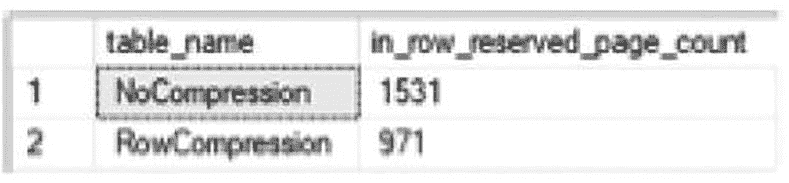

*图 13-53*  
*行压缩输出结果*

存储并非使用行压缩后唯一得到改善的地方；查询性能也有所提升。为了证明这一优势，请执行代码清单 13-40 中的代码。在此脚本中，针对上一个示例中的表执行了两个查询。虽然查询的业务规则相同，但启用了行压缩的表在页读取方面减少了超过 36%。将索引存储在更少的页上意味着在检索行执行查询时，需要读入内存的页更少。通过向索引添加压缩，查询所需的资源减少，性能得到提升，而无需更改查询设计，如图 13-54 所示。

```sql
USE AdventureWorks2017
GO
SET STATISTICS IO, TIME ON
SELECT SalesOrderID, SalesOrderDetailID, CarrierTrackingNumber
FROM dbo.NoCompression
WHERE SalesOrderID BETWEEN 51500 AND 52000;
SELECT SalesOrderID, SalesOrderDetailID, CarrierTrackingNumber
FROM dbo.RowCompression
WHERE SalesOrderID BETWEEN 51500 AND 52000;
```

*代码清单 13-40*  
*行压缩查询*

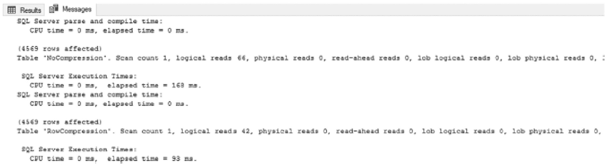

*图 13-54*  
*行压缩查询统计信息*

在索引上实现行压缩时需要考虑许多因素。首先，任何压缩使用所实现的压缩量将因所使用的数据类型和存储的数据而异。这种改进会且应该因表而异，并随时间而变化。如果行的最大可能大小超过 8,060 字节（包括数据大小和行开销），则无法启用压缩。非聚集索引不会继承聚集索引或堆的压缩设置；这必须在创建索引时指定。但是，如果未指定，聚集索引将继承其所在的堆的压缩设置。

行压缩是一种用于更改索引存储方式的有用机制。它减小了行的大小，这具有提高查询性能和减少索引存储需求的双重好处。实现行压缩时的主要关注点是与之相关的额外开销；这种开销表现为 CPU 利用率略有增加。这通常被处理查询所需的 I/O 减少所抵消，如图 13-54 所示。

对于包含许多数字数据类型以及倾向于包含空白字符的字符串/二进制数据的 OLTP 工作负载，行压缩是一种有效的索引方式。因为每行都是单独压缩的，`UPDATE` 操作的成本不会显著增加，因为对于 `UPDATE` 查询更新的每一行，只需要更新该行的数据。


#### 页面压缩

#### 行压缩

#### 前缀压缩

#### 字典压缩

页面压缩的行压缩组件与行压缩选项相同。在压缩一个页面之前，该页面上的每一行会首先被压缩。

页面压缩的下一步是通过前缀压缩完成的。前缀压缩扫描每一列，移除相似的值并将它们分组到页面头中。例如，如果一列中有多个值以 `"`abc`"` 开头，则该值被放置在页面头中，并且该列中的值被替换为指向前缀的指针。如果另一行包含值 `"`abcd`"`，则会包含对页面头中 `abc` 值的引用，将该列值更改为 `0d`。这个过程对所有值持续进行，以移除最常见的模式并减少每行列存储的信息。前缀压缩对每一列单独进行评估。因此，不同列中的相似值无法共享前缀。

页面压缩的最后一步是字典压缩。通过字典压缩，检查所有列中的值是否存在重复值。延续前面的例子，如果多行中两列的值与 `0d` 值匹配，则该值会被放置在页面头中，并在那些列中存储对该值的引用。这在整个页面范围内完成，减少了重复的前缀压缩值。

#### 演示

为了演示页面压缩的好处，将在行压缩部分的示例基础上进行扩展。首先，执行清单 13-41 中的脚本。这会创建一个类似于前面示例中表的 `dbo.PageCompression` 表。

```sql
USE AdventureWorks2017
GO
IF OBJECT_ID('dbo.PageCompression') IS NOT NULL
DROP TABLE dbo.PageCompression;
SELECT SalesOrderID
,SalesOrderDetailID
,CarrierTrackingNumber
,OrderQty
,ProductID
,SpecialOfferID
,UnitPrice
,UnitPriceDiscount
,LineTotal
,rowguid
,ModifiedDate
INTO dbo.PageCompression
FROM Sales.SalesOrderDetail;
Listing 13-41
页面压缩设置
```

实现页面压缩与实现行压缩非常相似。两者都使用 `DATA_COMPRESSION` 选项，但页面压缩使用 `PAGE` 选项。为了观察页面压缩对表的影响，执行清单 13-42 中的代码。在此示例中，页面压缩对表的影响比行压缩观察到的要显著得多。这一次，表使用的页面数量减少了 55%，如图 13-55 所示。

```sql
USE AdventureWorks2017
GO
CREATE CLUSTERED INDEX CLIX_PageCompression ON dbo.PageCompression
(SalesOrderID, SalesOrderDetailID)
WITH (DATA_COMPRESSION = PAGE);
SELECT OBJECT_NAME(object_id) AS table_name
,in_row_reserved_page_count
FROM sys.dm_db_partition_stats
WHERE object_id IN (OBJECT_ID('dbo.NoCompression'),OBJECT_ID('dbo.PageCompression'));
Listing 13-42
实现页面压缩
```

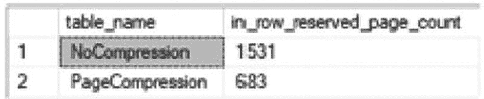
一个包含两列的表格，列名为 table name 和 in row reserved page count，以及两行标记为 1 和 2。第一列下的未压缩和页面压缩条目分别对应第二列下的 1531 和 683 条目。
图 13-55
页面压缩输出

页面压缩的改进不仅限于索引存储。这些改进也延续到对表的查询中。将之前针对 `dbo.NoCompression` 的结果与针对 `dbo.PageCompression` 的结果（清单 13-43）进行比较表明，读取节省的优势在页面压缩中得以延续。在这种情况下，读取次数减少到 29（见图 13-56），这比 55% 的 I/O 成本降低还要多。

```sql
USE AdventureWorks2017
GO
SET STATISTICS IO, TIME ON
SELECT SalesOrderID, SalesOrderDetailID, CarrierTrackingNumber
FROM dbo.PageCompression
WHERE SalesOrderID BETWEEN 51500 AND 52000;
Listing 13-43
页面压缩查询
```

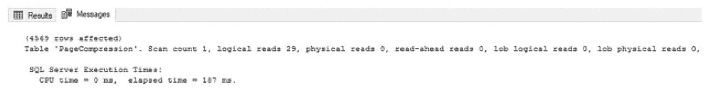
一个面板，打开了消息选项卡，其中有一行条目，内容为：表 "page compression"，扫描计数 1，逻辑读取 29，物理读取 0，预读 0，L O B 逻辑读取 0，L O B 物理读取 0，位于标签 "4569 行受影响" 下方。还显示了 S Q L 服务器执行时间下的 0 和 187 毫秒的 C P U 时间和已用时间。
图 13-56
页面压缩查询统计信息

#### 注意事项

页面压缩的注意事项在本质上与行压缩的注意事项相似，但增加了一些项目。首先，由于页面压缩的实现方式，有时 SQL Server 会判断页面的压缩率不足以证明压缩该页面的成本是合理的。在这些情况下，SQL Server 会尝试压缩页面，但会记录页面压缩失败，并在没有页面压缩相对于行压缩的益处的情况下存储该页面。监控页面压缩尝试未成功的比率非常重要，因为它们可能表明在索引上使用页面压缩的价值很低。这在第 3 章有进一步讨论。

其次，页面压缩的 CPU 成本远高于行压缩或没有压缩。如果没有足够的 CPU 资源可用，这可能会导致其他性能挑战。最后，页面压缩不适用于预期频繁数据修改的表和索引。为修改单行而压缩和解压缩一个页面可能会对 CPU 产生显著影响。因此，适合作为页面压缩候选对象的表不应是频繁 `UPDATE` 操作的目标。

## 结论

行压缩和页面压缩都可以为索引解决方案提供显著的成本节约。在设计索引解决方案时，请同时考虑这两种压缩方式。在其他选项可能未产生预期结果的情况下，这样做将提供性能改进。

注
有关压缩的其他注意事项，请参阅在线丛书主题“数据压缩”：`https://docs.microsoft.com/en-us/sql/relational-databases/data-compression/data-compression`。


## 索引视图

在许多情况下，数据库中数据的存储方式并不能完全代表用户需要检索的信息。为了解决这个问题，可以构建查询将用户所需的数据提取到结果集中，以便更轻松地使用。在执行这些活动的过程中，可以对数据进行**聚合**，以提供用户所需详细程度的结果。

例如，用户可能希望看到数据库中某个产品在所有订单中的总销售额，但不包含明细项目的信息。在大多数情况下，检索此信息没有问题。然而，在某些情况下，动态执行该聚合可能会在数据库中造成瓶颈。虽然索引有助于简化聚合，但它们有时无法提供所需的成本改进以达到要求的性能。

解决此问题的一种可能方案是在数据库中的视图上创建索引。可以创建视图来提供所需的摘要和聚合，并使用索引将视图中的信息**具体化**为聚合形式。对视图建立索引时，查询结果的存储方式与任何表的存储方式大致相同。通过提前存储此信息，使用视图中聚合的查询可以获得更快的响应时间。

在了解如何实现索引视图之前，让我们首先演练前面概述的检索产品摘要信息的问题。在此示例中，假设需要在产品子类别级别的所有产品的摘要信息。为此提供的查询，如清单 13-44，需要提供 `LineTotal` 和 `OrderQty` 值的 `SUM` 聚合，以及 `UnitPrice` 的平均值。虽然查询的读取次数看起来并不算特别高（见图 13-57），但对于发布到某些生产环境的查询来说，可能被认为过于显著。如果该查询要非常频繁地执行，情况尤其如此。检查执行计划（见图 13-58）显示，虽然它并不是特别复杂，但该计划包含多个步骤，不能被视为一个简单的计划。

```sql
USE AdventureWorks2017
GO
IF OBJECT_ID('dbo.ProductSubcategorySummary') IS NOT NULL
DROP VIEW dbo.ProductSubcategorySummary;
SET STATISTICS IO ON;
SELECT psc.Name
,SUM(sod.LineTotal) AS SumLineTotal
,SUM(sod.OrderQty) AS SumOrderQty
,AVG(sod.UnitPrice) AS AvgUnitPrice
FROM Sales.SalesOrderDetail sod
INNER JOIN Production.Product p ON sod.ProductID = p.ProductID
INNER JOIN Production.ProductSubcategory psc ON p.ProductSubcategoryID = psc.ProductSubcategoryID
GROUP BY psc.Name
ORDER BY psc.Name;
```
*清单 13-44：昂贵的聚合查询*

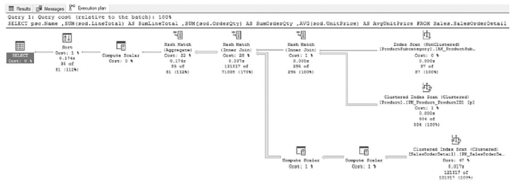
*图 13-58：昂贵聚合查询的执行计划*

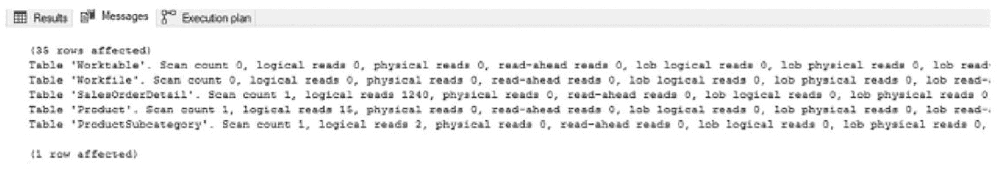
*图 13-57：昂贵聚合查询的 Statistics I/O 结果*

针对此性能问题的解决方案可以通过为清单 13-44 中的查询创建一个视图并向该视图添加索引来找到。向视图添加索引时需要考虑许多事项，例如：

*   视图中的所有列必须是**确定性的**。
*   必须使用 `SCHEMA_BINDING` 视图选项创建视图。
*   必须将聚集索引创建为唯一索引。
*   视图中引用的表必须使用两部分命名法。
*   如果聚合值，则必须包含 `COUNT_BIG()` 函数。
*   某些聚合（例如 `AVG()`）在索引视图中是不允许的。

有关创建索引视图的更多注意事项包含在“联机丛书”主题“创建索引视图”([`https://docs.microsoft.com/en-us/sql/relational-databases/views/create-indexed-views?`](https://docs.microsoft.com/en-us/sql/relational-databases/views/create-indexed-views?)) 中。

创建索引视图的第一步是创建底层视图。根据列出的注意事项，清单 13-44 中的查询不能直接转换为视图。必须更改查询以移除 `AVG` 函数并包含 `COUNT_BIG` 函数。虽然此更改从输出中移除了所需的数据元素之一，但该值可以在对视图建立索引后计算。此外，视图定义必须包含 `WITH SCHEMABINDING` 选项。结果是清单 13-45 中的视图定义。最后一步是使用 `Production.ProductSubcategory` 表中的 `Name` 列在表上创建唯一聚集索引。

```sql
USE AdventureWorks2017
GO
CREATE VIEW dbo.ProductSubcategorySummary
WITH SCHEMABINDING
AS
SELECT psc.Name
,SUM(sod.LineTotal) AS SumLineTotal
,SUM(sod.OrderQty) AS SumOrderQty
,SUM(sod.UnitPrice) AS TotalUnitPrice
,COUNT_BIG(*) AS Occurrences
FROM Sales.SalesOrderDetail sod
INNER JOIN Production.Product p ON sod.ProductID = p.ProductID
INNER JOIN Production.ProductSubcategory psc ON p.ProductSubcategoryID = psc.ProductSubcategoryID
GROUP BY psc.Name;
GO
CREATE UNIQUE CLUSTERED INDEX CLIX_ProductSubcategorySummary
ON dbo.ProductSubcategorySummary(Name)
```
*清单 13-45：索引视图定义*

索引视图就位后，下一步是测试该视图与原始查询相比的性能。在执行清单 13-46 中的代码之前，首先查看第二个查询，该查询使用 `TotalUnitPrice` 和 `Occurrences` 列来生成 `AvgUnitPrice`。虽然 `AVG` 函数不能包含在索引视图的定义中，但可以用最小的努力实现相同的结果。

执行清单 13-46 中的查询后，可以观察到这些查询的性能比清单 13-44 中的示例有显著提升。不再需要超过 1,200 次读取，而只需 2 次读取（见图 13-59），并且执行计划（图 13-60）也简单了不少。计划从许多运算符简化为三个。

```sql
USE AdventureWorks2017;
GO
SET STATISTICS IO ON;
SELECT psc.Name,
SUM(sod.LineTotal) AS SumLineTotal,
SUM(sod.OrderQty) AS SumOrderQty,
AVG(sod.UnitPrice) AS AvgUnitPrice
FROM Sales.SalesOrderDetail sod
INNER JOIN Production.Product p
ON sod.ProductID = p.ProductID
INNER JOIN Production.ProductSubcategory psc
ON p.ProductSubcategoryID = psc.ProductSubcategoryID
GROUP BY psc.Name
ORDER BY psc.Name;
SELECT Name,
SumLineTotal,
SumOrderQty,
TotalUnitPrice / Occurrences AS AvgUnitPrice
FROM dbo.ProductSubcategorySummary
ORDER BY Name;
```
*清单 13-46：使用索引视图的查询*

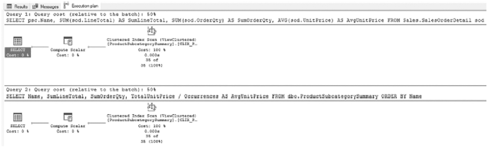


一个面板显示已打开的执行计划选项卡，其中包含查询 1 和查询 2 的两行文本，每个查询相对于批处理的成本各占 50%。每个查询都有一个流程图，展示了从`clustered index scan`、`view clustered`、`product subcategory summary`（成本占 100%）到`select`（成本占 0%）的连接关系。

图 13-60

索引视图模式的执行计划

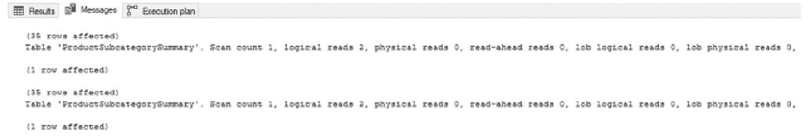

一个面板显示已打开的消息选项卡，其中有两条相似的单行条目，内容为`table "product subcategory summary"`，扫描计数 1，逻辑读取 2，物理读取 0，预读取 0，LOB 逻辑读取 0，LOB 物理读取 0。每条都位于`35 rows affected`和`1 row affected`标签之间。

图 13-59

索引视图模式的统计信息 I/O 结果

在执行过程中还观察到了另一个特殊现象。在实施`indexed view`后，针对基础表的查询和针对视图的查询执行情况完全相同。这是`indexed views`带来的额外好处之一。当`SQL Server`为第一个查询确定执行计划时，它可以推断出存在一个`indexed view`可以覆盖与该查询相同的逻辑，即使平均值列的计算方式并不相同。

请注意，`indexed views`的成本在于维护其索引。每当其源表中的任何基础值发生变化时，索引也需要随之更新。理想的`indexed views`是针对特定用例的，并不试图为整个表重新创建索引。当`indexed views`变得过于复杂或开始包含许多不同的索引时，值得考虑重新构建基础表，以降低需要它们的业务逻辑的复杂性。

当需要将多个表连接到一个单元中以减少运行时连接数据所需的`I/O`时，`Indexed views`是一个极其有用的工具。尽管`indexed views`有一些限制，但它也带来许多好处，包括能够在类似清单 13-46 中的情况下使用。当存在经常使用的、具有相同结构的视图和查询时，可以考虑引入视图是否能提供基础表上的索引所无法提供的好处。

## 总结

本章重点介绍在多种情况下如何以及何时对表应用索引。每个示例都演示了如何将特定的索引模式应用到具体场景中，以通过索引提升性能。本章涵盖了使用堆的有限但有效的实例，接着介绍了构建`clustered indexes`的各种选项和方式。对于`non-clustered indexes`，示例展示了在聚类键之外的列上添加性能的选项，这些选项可添加到`clustered indexes`中。本章还包括了一个实现`columnstore indexes`的示例，并讨论了何时应用此类索引。总的来说，这些模式为识别对不同列类型和工作负载最有用的索引类型奠定了基础，并提供了有意义的比较一种索引解决方案与另一种解决方案的能力。

