# 14. 查询策略

在上一章中，讨论了为各种表识别潜在索引的策略。然而，这通常只是故事的一半。一旦索引创建完成，数据库的性能有望得到提升，从而暴露出下一个瓶颈。不幸的是，编码实践和选择性可能会对索引应用于查询的方式产生负面影响。有时，数据库和表的访问方式会阻碍使用一些最有益的可用索引。

恰当的索引为关键数据提供了一组高效的访问路径。有效的查询对于确保数据按照这些路径进行读写并提供良好性能是必不可少的。

本章涵盖了索引可能无法按预期使用的查询策略。这些场景包括：

*   `LIKE` 比较

*   字符串连接

*   计算列

*   标量函数

*   数据类型转换

对于每种场景，将讨论其相关情况以及它们表现不如预期的原因。针对每个场景，将提供缓解策略以及如何在正确的位置使用正确索引的一些提示。本章将提供所需的工具，以识别阻碍为数据库建立性能优化索引的情况，以及解决这些挑战的策略。


## LIKE 比较

### LIKE 比较基础

在评估查询对索引使用的影响时，最简单直接的起点是 `LIKE` 比较。`LIKE` 比较允许基于任意字符或模式在列中进行搜索。如果需要识别表中所有以字母 `AAA` 或 `BBB` 开头的值，`LIKE` 比较就能提供这种功能。在此类搜索中，查询可以读取索引并找到与字符或模式匹配的值。当在查询中使用此比较来查找包含或以某个字符/模式结尾的值时，可能会出现问题。

在这种情况下，索引变得无关紧要，因为统计信息仅针对字符值最左侧的部分收集。假设是随机分布，字母 `B` 出现在索引第一个值中的概率与其出现在最后一个值中的概率是相等的。要确定表中哪些记录的列中任何位置包含 `B`，则必须检查所有行。没有可用的统计信息来识别字母是否包含在字符串中。由于没有可靠的统计信息可用，SQL Server 将不知道使用哪个索引来满足查询，最终很可能会扫描聚集索引来返回匹配的值。

### 前导通配符的问题

为了理解使用 `LIKE` 比较可能出现的问题，将提供一些演示，展示两种场景及其相关的统计信息。首先，考虑一个场景：查询 `Person.Address` 表中 `AddressLine1` 以“710%”开头的记录（参见清单 14-1）。查看图 14-1 中的 `STATISTICS IO` 输出，该查询需要三次逻辑读取。检查图 14-2 中的执行计划，显示了在非聚集索引上执行了索引查找。

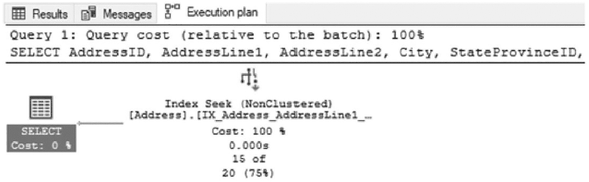

一个输入输出页面的截图，展示了执行计划选项卡下的输出。它显示了查询、地址，以及在非聚集索引上成本为 100% 的索引查找执行，该索引映射到成本为 0% 的选定表。

图 14-2：地址以 710 开头的执行计划

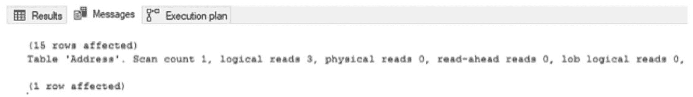

一个输入输出页面的截图，标题包含结果、消息和执行计划选项卡。它展示了消息选项卡下的输出。显示了表地址和受影响行数。逻辑读取数为 3。

图 14-1：地址以 710 开头的 STATISTICS I/O

```sql
USE AdventureWorks2017
GO
SET STATISTICS IO ON;
SELECT AddressID, AddressLine1, AddressLine2, City, StateProvinceID, PostalCode
FROM Person.Address
WHERE AddressLine1 LIKE '710%';
```
清单 14-1：查询地址以 710 开头的语句

在此情况下，`LIKE` 比较工作良好，执行计划、统计信息和 I/O 都适合该请求。因为筛选器检查的是 `AddressLine1` 最左侧的字符，SQL Server 能够使用该列上的索引来有效地筛选该列并返回预期结果。

不幸的是，`LIKE` 比较并非只有这一种用法。它还可以用于在列中查找值。考虑一个需要查找匹配特定街道名称（如“Longbrook”）的所有地址的场景（参见清单 14-2）。对于此查询，执行计划对非聚集索引使用扫描，并需要 216 次逻辑读取，如图 14-3 所示。图 14-4 显示了执行计划。

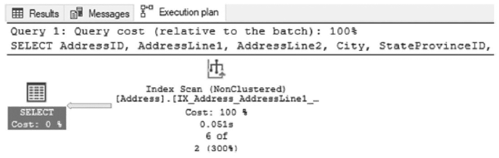

一个输入输出页面的截图，展示了执行计划选项卡下的输出。它显示了查询、地址，以及在非聚集索引上成本为 100% 的索引扫描执行，该索引映射到成本为 0% 的选定表。

图 14-4：地址包含“Longbrook”的执行计划

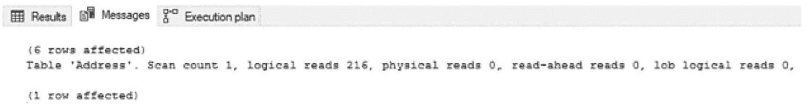

一个输入输出页面的消息选项卡截图。显示了标记为地址的表和受影响的行。逻辑读取数为 216。

图 14-3：地址包含“Longbrook”的 STATISTICS I/O

```sql
USE AdventureWorks2017
GO
SET STATISTICS IO ON;
SELECT AddressID, AddressLine1, AddressLine2, City, StateProvinceID, PostalCode
FROM Person.Address
WHERE AddressLine1 LIKE '%Longbrook%';
```
清单 14-2：查询地址包含“Longbrook”的语句

因为 `AddressLine1` 上的筛选器有一个前导通配符，SQL Server 无法使用该列上的索引来满足筛选条件。相反，它被迫扫描整个索引以确定哪些值符合筛选条件。

在此场景中，表和索引都很小。索引查找和扫描之间的差异并不极端。设想一下，如果这个场景发生在一个表大得多的生产系统中。SQL Server 无法快速筛选出匹配搜索值的记录，而是被迫使用暴力方式遍历所有行。即使所需时间可能只是几十秒，这也为阻塞、锁定和死锁打开了机会，这将进一步减慢环境中的查询速度。当查询执行时，它们在写入或读取行时会锁定资源，锁定时间越长，这些锁定资源影响其他试图访问相同数据的查询的概率就越大。

一种避免这种情况的流行方法是声明绝不允许在搜索的左边缘使用通配符。在某些应用程序中，这是合理的，并且可以在不对 SQL Server 做任何更改的情况下实施。

不幸的是，这可能是一个不切实际的期望。世界上很少会有业务经理同意要求其用户输入所有可能的街道号码组合，以试图查找匹配街道名称搜索的每一个地址。光是阅读这里的解释就让人觉得荒谬。

### 解决方案：全文索引

针对此场景，一个更合适且有用的解决方案（尽管不太流行）是在表上创建全文索引。全文索引不如非聚集索引流行的一个促成因素是其构建和创建方式的差异，这使得大多数人对其不太熟悉。使用全文索引，一个或多个列中的单词及其在表中的位置会被编入目录。这使得查询能够快速搜索列内的离散值，而无需检查索引中的所有记录。

要在 `Person.Address` 表上使用全文索引，首先必须构建全文目录，如清单 14-3 所示。之后，创建全文索引并包含将在查询中被搜索的列。最后，需要修改查询以使用全文谓词函数之一。在此示例中，将使用 `CONTAINS` 函数。

```sql
USE AdventureWorks2017
GO
SET STATISTICS IO ON;
CREATE FULLTEXT CATALOG ftQueryStrategies AS DEFAULT;
CREATE FULLTEXT INDEX ON Person.Address(AddressLine1)
KEY INDEX PK_Address_AddressID;
GO
SELECT AddressID, AddressLine1, AddressLine2, City, StateProvinceID, PostalCode
FROM Person.Address
WHERE CONTAINS (AddressLine1,'Longbrook');
```
清单 14-3：使用 `CONTAINS` 查询地址的语句


在部署了全文索引后，搜索名为 Longbrook 的街道的性能与第一次搜索（查询以 710 开头的地址）相似。在图 14-6 的执行计划中，查询没有扫描非聚集索引，而是使用了聚集索引上的查找操作，并通过表值函数查询全文索引。因此，与使用`LIKE`比较时的 216 次逻辑读取相比，使用全文索引仅需要 12 次逻辑读取（如图 14-5 所示）。读取次数上的差异带来了相比第一次搜索尝试的显著性能提升。

更多关于全文索引的信息，请阅读第 9 章。

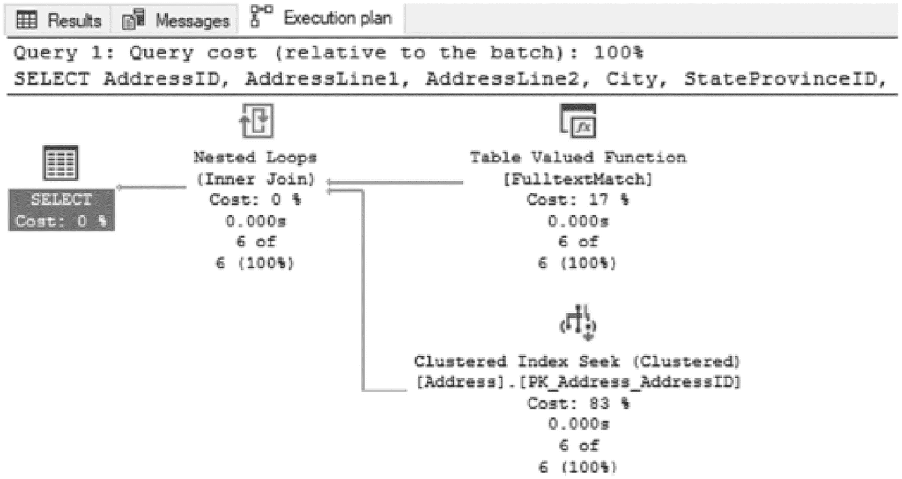

一个页面在执行计划选项卡下展示了输出结果。它显示查询、地址、嵌套循环、成本为 17%的表值函数以及成本为 83%的聚集索引查找被映射到一个成本为 0%的选定表。

图 14-6

使用`CONTAINS`查询地址的执行计划

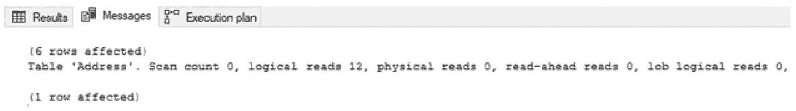

一个消息选项卡的输入输出页面截图。它显示了标记为`address`的表以及受影响的行数。逻辑读取数为 12。

图 14-5

使用`CONTAINS`查询地址时的`STATISTICS I/O`

解决此问题还有其他潜在方案，例如手动创建 N-gram 表来管理字符串列中的离散关键字。当搜索词集合有限且能以某种自动化方式维护时，这可以是定制化字符串搜索解决方案的有效方法。演示这一点超出了本书的范围，但在标准索引和全文索引不足以解决字符串搜索挑战的场景中，值得一提。

## 字符串连接

另一个可能严重破坏索引策略的场景是使用字符串连接。`字符串连接`是指将两个或多个值相互追加在一起。当这种情况发生在`WHERE`子句中时，常常会导致意想不到的性能低下。

为了演示此场景，考虑一个查询名为 Gustavo Achong 的人的请求。搜索这个值需要使用`FirstName`和`LastName`列，这两列之间用空格连接在一起。清单 14-4 显示了这个查询。代码清单中还包含了在这些列上创建索引的脚本。为该查询生成的执行计划如图 14-8 所示，显示使用了新索引，但操作是扫描而非更理想的查找。即使索引的最左侧前缀与连接值的左侧值相匹配，索引也无法确定在哪里可以找到这些值。这导致索引使用了 99 次逻辑读取来返回查询结果，如图 14-7 所示。

```
USE AdventureWorks2017
GO
SET STATISTICS IO ON;
CREATE INDEX IX_PersonContact_FirstNameLastName ON Person.Person (FirstName, LastName)
GO
SELECT BusinessEntityID, FirstName, LastName
FROM Person.Person
WHERE CONCAT(FirstName,' ',LastName) = 'Gustavo Achong'
清单 14-4
使用字符串连接的查询
```

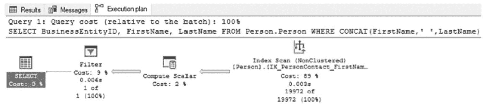

一个页面截图在执行计划选项卡下展示了输出结果。它显示查询、地址、成本为 89%的非聚集索引扫描、成本为 2%的标量计算以及成本为 9%的筛选器被映射到一个选定表。

图 14-8

字符串连接的执行计划

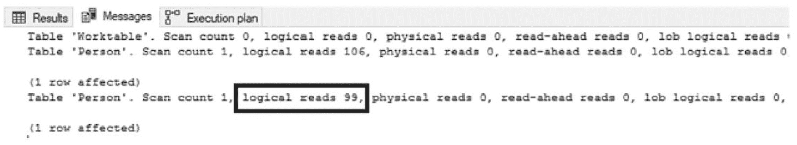

一个页面截图在消息选项卡下展示了输出结果。它显示了表 worktable、person 以及受影响的行数。person 表的逻辑读取数为 99，被高亮显示。

图 14-7

字符串连接时的`STATISTICS I/O`

如前所述，在索引上使用扫描并不一定是坏事。但是，当存在大量并发用户或正在发生数据修改时，使用扫描可能会导致争用和延迟。对于拥有数百万条或更多记录的大型表，这可能会导致数据库缺乏可扩展性。

乍一看，移除名字和姓氏之间的空格似乎是合理的（参见清单 14-5），因为这样它就可以使用我们创建的索引中的两列。但这个解决方案的问题在于它不起作用。如图 14-10 所示的执行计划，它几乎与在连接值中包含空格的情况相同，同样有 99 次读取（如图 14-9 所示）。

```
USE AdventureWorks2017
GO
SET STATISTICS IO ON;
SELECT BusinessEntityID, FirstName, LastName
FROM Person.Person
WHERE CONCAT(FirstName, LastName)= 'GustavoAchong';
清单 14-5
不带空格的字符串连接
```

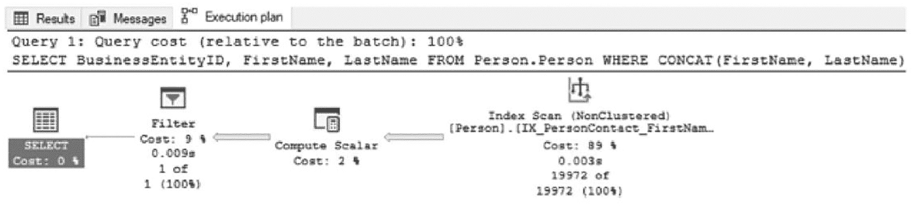

一个页面截图在执行计划选项卡下展示了输出结果。它显示查询、地址、成本为 89%的非聚集索引扫描、成本为 2%的标量计算以及成本为 9%的筛选器被映射到一个选定表。查询中是不带空格的连接。

图 14-10

不带空格的字符串连接的执行计划

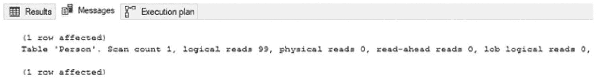

一个消息选项卡的输入输出页面截图。它显示了标记为`person`的表以及受影响的行数。逻辑读取数为 99。

图 14-9

不带空格字符串连接时的`STATISTICS I/O`

修复字符串连接值问题的最佳方法可能是消除连接的需求。不要搜索值`Gustavo Achong`，而是分别搜索名字`Gustavo`和姓氏`Achong`（参见清单 14-6）。做出此更改后，查询就能够使用非聚集索引上的查找操作，并且仅需两次逻辑读取即可返回结果（参见图 14-11）。这些结果相比将值连接在一起时有了显著改善。执行计划参见图 14-12。

```
USE AdventureWorks2017
GO
SET STATISTICS IO ON;
SELECT BusinessEntityID, FirstName, LastName
FROM Person.Person
WHERE FirstName = 'Gustavo'
AND LastName = 'Achong';
清单 14-6
移除字符串连接后的查询
```

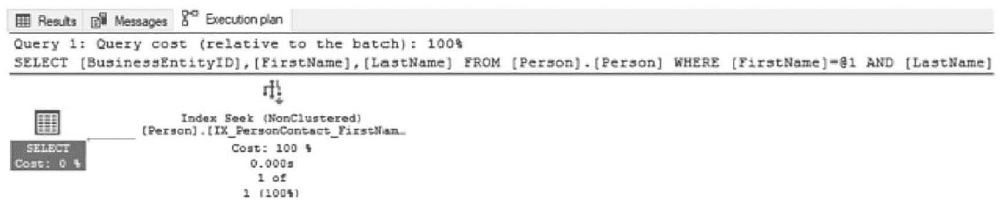

一个输入输出页面截图在执行计划选项卡下展示了输出结果。它显示查询、地址以及成本为 100%的非聚集索引索引查找执行，被映射到一个成本为 0%的选定表。

图 14-12

移除字符串连接后的执行计划

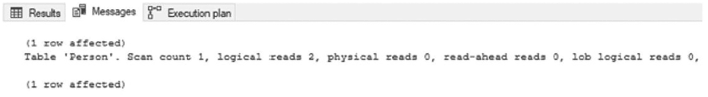

一个消息选项卡的输入输出页面截图。它显示了标记为`person`的表以及受影响的行数。逻辑读取数为 2。

图 14-11

移除字符串连接后的`STATISTICS I/O`

理想的`WHERE`子句由能够轻松解析的简单谓词组成。函数、转换、组合以及其他在尝试筛选数据时动态修改数据的做法，更有可能导致意外的索引扫描、不希望的争用以及运行时间更长的查询。

有时，你可能无法选择从查询中移除字符串连接。在这些场景中，还有另一种解决索引性能问题的方法：可以将连接后的值作为计算列添加到表中。这个解决方案及其面临的一些挑战将在下一节讨论。


## 计算列

有时，表中的一列或多列被定义为表达式。这类列被称为*计算列*。当需要一列来保存函数或计算的结果，且该结果会随表中其他列的变化而改变时，计算列就非常有用。与其耗费 CPU 周期来确保对表的所有修改都包含对所有相关列的更改，不如在查询时更改组件并计算结果。

请注意，计算列无法利用源列上的索引来加速自身。为了演示这一点，请使用代码清单 14-7 向`Person.Person`表添加两个计算列。第一列将把`FirstName`和`LastName`连接起来，就像在上一节中连接它们一样。第二列将把`BusinessEntityID`乘以`EmailPromotion`；虽然这个计算本身没有内在含义，但它将展示如何将此策略用于其他计算类型。

```sql
USE AdventureWorks2017
GO
ALTER TABLE Person.Person
ADD FirstLastName AS (FirstName + ' ' + LastName)
,CalculateValue AS (BusinessEntityID ∗ EmailPromotion);
Listing 14-7
向 Person.Person 添加计算列
```

添加列之后，下一步是测试查询该表。使用代码清单 14-8 执行两个查询。第一个查询类似于上一节中搜索 Gustavo Achong 时使用的名字和姓氏查询。第二个查询将返回所有`CalculateValue`为 198 的记录。

```sql
USE AdventureWorks2017
GO
SET STATISTICS IO ON
SELECT BusinessEntityID, FirstName, LastName, FirstLastName
FROM Person.Person
WHERE FirstLastName = 'Gustavo Achong';
SELECT BusinessEntityID, CalculateValue
FROM Person.Person
WHERE CalculateValue = 198;
Listing 14-8
计算列查询
```

执行两个查询后，图 14-14 中的执行计划显示，两者都使用了扫描操作来返回查询结果。根据本章前面提到的原因，这些结果并不理想，因为它们可能导致阻塞，并且比查询请求所需的 I/O 更多。这里的“更多 I/O”是指两个查询的结果都需要通过扫描整个表来读取 I/O，如图 14-13 所示。

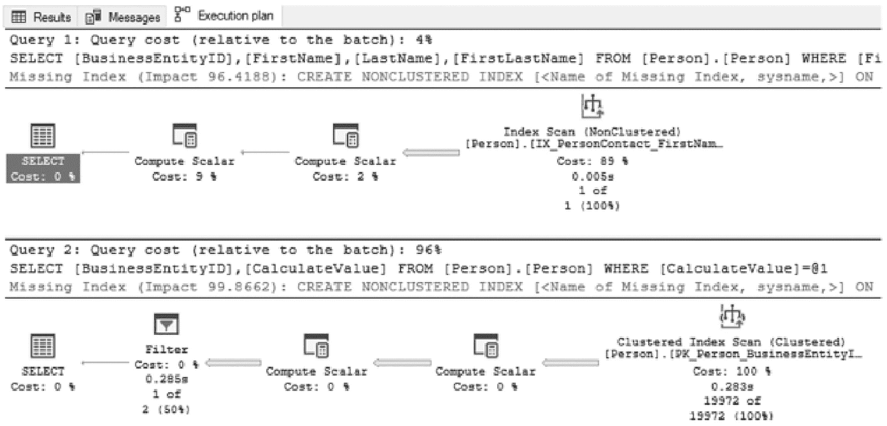
一张页面截图，展示了执行计划选项卡下的输出。它分别读取查询 1 和 2。1. 在非聚集索引上的索引扫描，成本 89%，2 个计算标量操作，成本分别为 2% 和 9%，映射到一个选定的表。2. 聚集索引扫描，成本 100%，2 个计算标量操作，映射到一个选定的表。
图 14-14
计算列执行计划

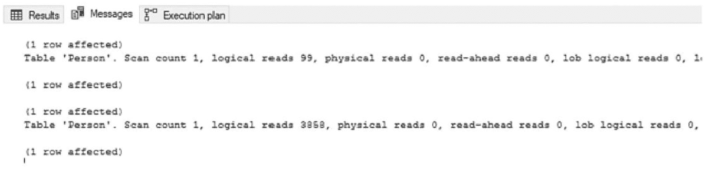
一张消息选项卡的输入输出页面截图。它读取标记为 person 的两个表及其影响的行数。逻辑读取次数分别为 99 和 3858。
图 14-13
计算列的 STATISTICS I/O

计算列的一个索引选项是为计算列本身创建索引，SQL Server 会将其建议为缺失索引，如图 14-14 所示。正如`FirstLastName`的查询所示，该查询可以使用表上的任何索引。限制在于，它不能比查询本身包含计算列表达式时更好地利用这些索引。为计算列创建索引（如代码清单 14-9 所示）提供了必要的分布和记录信息，允许像代码清单 14-8 中的查询那样的查询使用查找而不是扫描。索引具体化了计算列中的值，允许快速访问数据，从而显著减少了 I/O（从 99 次读取减少到 5 次，从 3,878 次减少到 2 次），如图 14-15 所示。图 14-16 显示了执行计划。

**注意**

为计算列创建索引时，该列的表达式必须是确定性的。即每次使用相同变量执行该表达式，都将返回相同的结果。例如，在计算列表达式中使用`GETDATE()`就不是确定性的。

```sql
USE AdventureWorks2017
GO
CREATE INDEX IX_PersonPerson_FirstLastName ON Person.Person(FirstLastName);
CREATE INDEX IX_PersonPerson_CalculateValue ON Person.Person(CalculateValue);
Listing 14-9
计算列索引
```

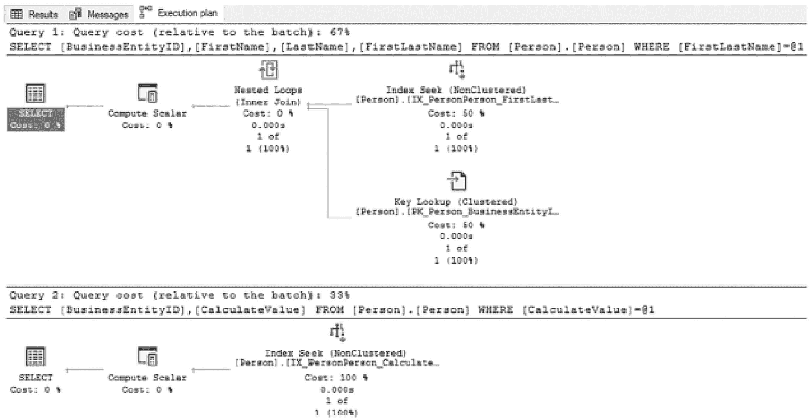
一张页面截图，展示了执行计划选项卡下的输出。它读取查询 1 和 2 及其成本，并在两个查询中都展示了非聚集索引上的索引查找，查询 1 中的聚集索引上的键查找，以及查询 1 中的嵌套循环。每个标量成本都映射到一个选定的表。
图 14-16
已索引的计算列执行计划

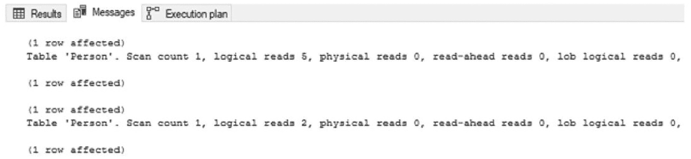
一张消息选项卡的输入输出页面截图。它读取标记为 person 的两个表及其影响的行数。逻辑读取次数分别为 5 和 2。
图 14-15
已索引计算列的 STATISTICS I/O

请注意，为计算列创建索引的成本是，当计算列中使用的任何基础列发生更改时，需要额外进行 I/O 来更新索引。因此，应仅为那些频繁执行（或至关重要）的查询能从中受益的场景保留计算列索引。

如本节所示，当需要通过表达式来定义表中的值时，计算列非常有用。例如，如果一个应用程序只能发送组合了姓和名的搜索条件，那么计算列可以提供应用程序所需格式的数据。这些列可以利用基础索引来返回结果，但通常无法完全利用这些索引中的统计数据和数据的基础排序，因为列定义中存在表达式。通过对计算列创建索引，可以以应用程序所需的精确格式提供数据，从而实现最佳性能，即使涉及多个列或复杂计算也是如此。


## 标量函数

前面几个章节讨论了通过搜索列值或组合跨列的值来过滤查询结果。本节将探讨在查询的 `WHERE` 子句中使用的标量函数的影响。标量函数提供了将值转换为其他值的能力，这些值在查询数据库时可能更有用。

用户定义的标量函数也可以创建并用于 `WHERE` 子句中。系统和用户定义标量函数共同的问题是，如果它们转换了存在索引的列，那么 SQL Server 将无法再有效地使用该索引。因为计算值在运行时才知晓，查询优化器没有统计数据来确定索引中值的频率，或者计算值在索引或表中的位置信息。

为了演示标量函数对查询的影响，考虑清单 14-10 中的两个查询，它们返回来自 `Person.Person` 的信息。两个查询都将返回 `FirstName` 列中值为 `Gustavo` 的所有行。两个查询之间的区别在于，第二个查询将在 `FirstName` 列的 `WHERE` 子句中使用 `RTRIM` 函数。

```
USE AdventureWorks2017
GO
SET STATISTICS IO ON
SELECT BusinessEntityID, FirstName, LastName
FROM Person.Person
WHERE FirstName = 'Gustavo';
SELECT BusinessEntityID, FirstName, LastName
FROM Person.Person
WHERE RTRIM(FirstName) = 'Gustavo';
Listing 14-10
针对名字 Gustavo 的查询
```

如图 14-18 中的第二个执行计划所示，当在 `WHERE` 子句中添加标量函数时，执行计划继续使用与第一个计划相同的索引，但改用了索引扫描而非索引查找。这种变化将 I/O 从 2 增加到 99（如图 14-17 所示），这与其他示例类似。在此场景下，像第一个查询那样排除标量函数，可以提供与包含函数时相同的结果。但这并非适用于所有查询，而允许索引得到最佳使用的方法是，将标量函数从键列移动到查询的参数中。

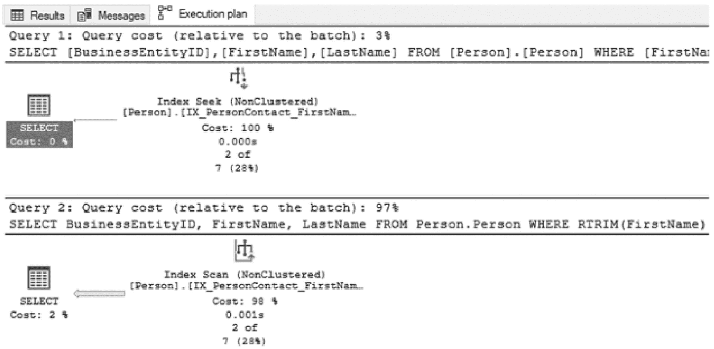

一个页面展示了执行计划选项卡下的输出。它读取了查询 1 和 2 及其成本，并展示了查询 1 中的非聚集索引查找和查询 2 中成本为 98%的非聚集索引扫描。每个都映射到一个选定的表，成本分别为 0%和 2%。
图 14-18
Gustavo 查询的执行计划


消息选项卡输入输出页面的截图。它读取了标有 person 的 2 个表和受影响行数。逻辑读取数分别为 2 和 99。
图 14-17
在 WHERE 子句中使用标量函数时的 STATISTICS I/O

关于如何将标量函数从键列移动到参数中的一个好例子，是当使用 `MONTH` 和 `YEAR` 函数时。假设一个查询需要返回 2001 年 12 月的所有销售订单。这可以通过清单 14-11 中的第一个 `SELECT` 查询来实现。然而，使用 `MONTH` 和 `YEAR` 函数会改变 `OrderDate` 的值，该列上的索引仍然被使用，但使用的是扫描而非查找（见图 14-20 中的第一个执行计划）。可以通过修改查询来避免此问题，方法不是使用函数，而是将筛选条件应用于值的范围，例如清单 14-11 中的第二个 `SELECT` 语句。如第二个执行计划所示，查询可以通过查找而非扫描来返回结果，读取次数显著减少，从 73 次降至 3 次，如图 14-19 所示。这样修复的妙处在于，无需任何有形的成本即可大幅提升性能。

```
USE AdventureWorks2017
GO
CREATE INDEX IX_SalesSalesOrderHeader_OrderDate ON Sales.SalesOrderHeader(OrderDate);
SET STATISTICS IO ON;
SELECT SalesOrderID, OrderDate
FROM Sales.SalesOrderHeader
WHERE MONTH(OrderDate) = 12
AND YEAR(OrderDate) = 2012;
SELECT SalesOrderID, OrderDate
FROM Sales.SalesOrderHeader
WHERE OrderDate BETWEEN '20121201' AND '20121231';
SET STATISTICS IO OFF;
Listing 14-11
在 WHERE 子句中使用值范围而非函数的查询
```

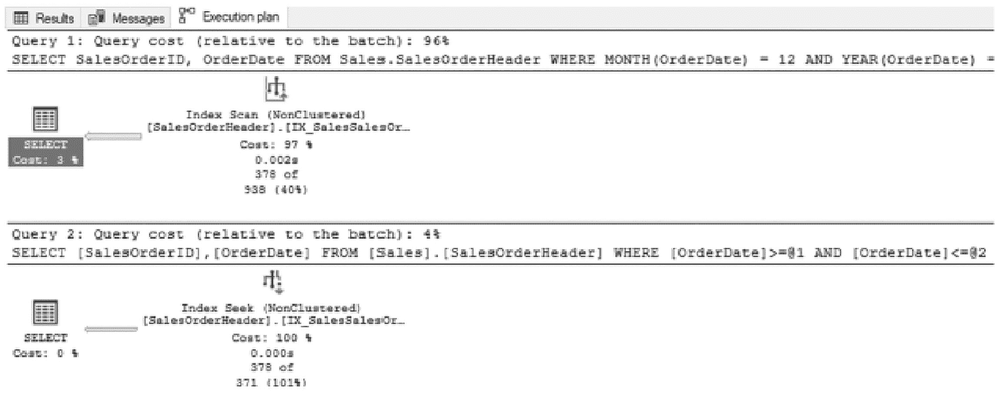

一个页面展示了执行计划选项卡下的输出。它读取了查询 1 和 2 及其成本，并展示了查询 1 中成本为 97%的非聚集索引扫描和查询 2 中的非聚集索引查找。每个都映射到一个选定的表，成本分别为 3%和 0%。
图 14-20
日期查询的执行计划

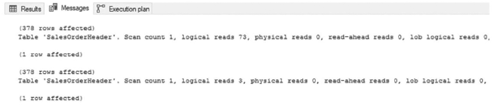

消息选项卡输入输出页面的截图。它读取了标有 sales order header 的 2 个表和受影响行数。逻辑读取数分别为 73 和 3。
图 14-19
在 WHERE 子句中使用值范围而非函数时的 STATISTICS I/O

并非总能将标量函数从查询的 `WHERE` 子句中移除。一个很好的例子是，如果某列不应包含的前导空格被添加，在比较列值与参数时。在这种情况下，需要更具创造性来解决问题。一个可能的解决方案是使用带索引的计算列，如前一节所述。

处理 `WHERE` 子句中的标量函数时，需要记住的重要一点是：如果函数改变了列的值，则该列上的任何索引很可能无法像查询中那样被高效地使用。如果表很小且查询不频繁，这可能不是什么大问题。但对于大型数据库，这可能成为索引扫描次数意外增高的原因，并可能导致阻塞和死锁问题。


## 数据转换

查询可能对索引使用产生负面影响的最后一个领域是，当在 `JOIN` 操作或 `WHERE` 子句中列的数据类型发生变化时。当在上述任一条件中数据类型不匹配时，SQL Server 将需要转换其中一个列中的值以匹配另一个列。如果数据转换没有包含在查询语法中，SQL Server 将在后台尝试进行数据转换。

数据转换可能对查询性能产生负面影响的原因，与标量函数相关的问题类似。如果索引中的一列需要从 `varchar` 转换为 `int`，那么该索引的统计信息将无法用于确定值的频率和位置。例如，数字 `10` 和字符串 `"10"` 在同一索引中会被排序到完全不同的位置。为了说明数据转换对查询可能产生的影响，首先执行清单 14-12 中的代码。

```
USE AdventureWorks2017
GO
SELECT BusinessEntityID
,CAST(FirstName as varchar(50)) as FirstName
,CAST(MiddleName as varchar(50)) as MiddleName
,CAST(LastName as varchar(50)) as LastName
INTO PersonPerson
FROM Person.Person;
CREATE CLUSTERED INDEX IX_PersonPerson_ContactID ON PersonPerson (BusinessEntityID);
CREATE INDEX IX_PersonContact_FirstName ON PersonPerson(FirstName);
Listing 14-12
数据转换设置
```

清单 14-12 将创建一个包含 `varchar` 数据的表。然后，它将向该表添加两个索引，这两个索引将在演示查询中使用。清单 14-13 所示的两个示例查询将用于展示数据转换如何影响索引的性能和利用率。对于这两个查询，都使用了 `RECOMPILE` 选项，以防止意外的参数嗅探。

注意
有关参数嗅探的更多信息，请阅读 Paul White 在 SQLPerformance.com 上的文章《参数嗅探、嵌入和 RECOMPILE 选项》，地址为 [`http://sqlperformance.com/2013/08/t-sql-queries/parameter-sniffing-embedding-and-the-recompile-options`](http://sqlperformance.com/2013/08/t-sql-queries/parameter-%25C2%25ADsniffing-%25C2%25ADembedding-and-the-recompile-options)。

第一个 `SELECT` 查询使用了具有 `nvarchar` 数据类型的 `@FirstName` 变量。此数据类型与表 `PersonContact` 中列的数据类型不匹配，因此必须将表中的列从 `varchar` 转换为 `nvarchar`。该查询的执行计划（图 14-21）显示，查询正在使用非聚集索引上的索引查找来满足查询，并且谓词正在将列中的数据转换为 `nvarchar`，同时对不在非聚集索引中的列在聚集索引上进行键查找。另请注意，第一个查询的成本占整个批处理（即这两个查询）总成本的 `40%`。

```
USE AdventureWorks2017
GO
SET STATISTICS IO ON
DECLARE @FirstName nvarchar(100)
SET @FirstName = 'Gail';
SELECT FirstName, LastName FROM PersonPerson
WHERE FirstName = @FirstName
OPTION (RECOMPILE);
GO
DECLARE @FirstName varchar(100)
SET @FirstName = 'Gail';
SELECT FirstName, LastName FROM PersonPerson
WHERE FirstName = @FirstName
OPTION (RECOMPILE);
Listing 14-13
隐式转换查询
```

注意
执行计划中为运算符显示的附加信息可在 SQL Server Management Studio 的“属性”窗口中找到。“属性”窗口包含了有关用于估计行数和实际行数的列的操作的大量有用信息。

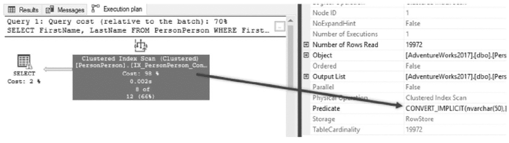

图 14-21：带有隐式数据转换的执行计划

图 14-22 执行计划中需要注意的另一个项目是第一个查询的 `SELECT` 操作上包含的警告。SQL Server 2012 及更高版本在包含隐式转换的执行计划中包含详细的警告消息。警告消息显示为一个带有感叹号的黄色三角形。检查该运算符的属性将包含运算符和警告消息的详细信息。这些消息包含有关正在转换的列以及与该问题相关的问题的信息。在此示例中，问题是 `SeekPlan ConvertIssue`。换句话说，SQL Server 没有关于转换后数据的统计信息来构建一个了解谓词中值频率的执行计划。

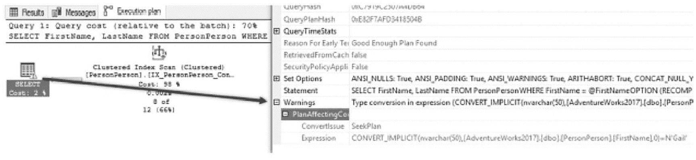

图 14-22：包含隐式转换的警告

清单 14-13 中的第二个 `SELECT` 查询使用了具有 `varchar` 数据类型的变量。由于此数据类型已经与表中列的数据类型匹配，因此可以使用非聚集索引。如图 14-23 的执行计划所示，数据类型匹配时，查询优化器可以构建一个计划，该计划知道索引中行的位置，并可以执行查找来获取它们。

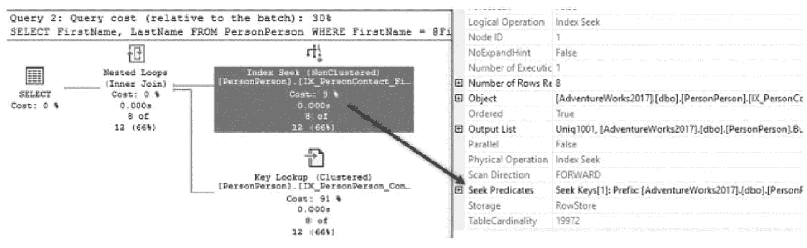

图 14-23：无数据转换的执行计划

乍一看，第二个执行计划可能显得效率较低，因为它的操作更多、复杂度更高，并且涉及键查找，但事实并非如此。通过查看 `STATISTICS IO` 的逻辑读取次数（如图 14-24 所示），可以更清晰地了解性能。对于第一个查询，聚集索引扫描产生了 `89 次逻辑读取`。第二个查询在访问两个索引时仅进行了 `18 次读取`。I/O 的差异归因于扫描聚集索引所需的大量读取，这最终超过了索引查找和键查找的总成本。

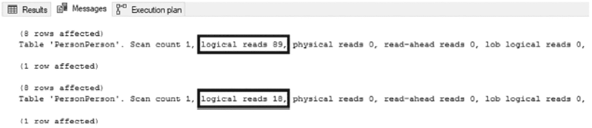

图 14-24：隐式转换查询的 STATISTICS I/O

在本节中，讨论的重点是隐式数据转换及其对查询性能的负面影响。虽然这些转换可能比显式数据转换更隐蔽，但相同的概念和缓解方法同样适用。由于它们更具意图性，因此应该更少发生。即便如此，在执行数据转换时，也要密切关注所涉及的数据类型，因为它们的更改方式将影响查询性能和索引利用率。


## 摘要

本章通过分析查询结构，旨在理解索引何时能被有效利用，以及何时其使用会受到阻碍，从而对性能产生负面影响。有时，特定类型的索引可能并不适用于某些场景，例如在大表中搜索字符串内的值。而在其他情况下，在正确的地方应用正确类型的索引或函数，会对查询能否使用索引产生重大影响。

在本章的许多示例中，通过使用索引扫描（而非索引查找），使有问题的索引使用情况变得清晰明了。在这些场景中，索引查找是理想的索引操作。然而情况并非总是如此，在某些情况下，对索引进行扫描才是最佳操作符，例如当需要读取整个表（或大部分表）时。理解环境所针对的事务类型以及所访问表的大小至关重要。

本章的主要结论是：查询结构往往与索引结构同等重要。在开发数据库代码时所做的选择，可能会完全破坏为正确建立数据库索引所做的努力。务必让索引策略辅以高效的代码，以充分发挥其潜力。

