# 16. 索引分析

## 摘要

在本章中，我们逐步讲解了如何使用各种工具来监控索引。监控索引是通用平台监控的延伸，但也是为确定索引是否合适或进一步调整是否有益提供基础的重要环节。通过监控和索引分析，我们回顾了如何收集动态管理数据和性能计数器。在下一章，这些信息将被用于分析索引是否存在或是否合适。

在上一章中，我们讨论了监控索引时应收集哪些信息。所有这些信息对于索引数据库的下一步流程——即确定要应用哪些索引——都是必需的。在本章中，我们将利用监控期间收集的所有信息，来分析性能状态和现有索引的价值。索引分析的最终目标是构建一个需要创建、修改以及可能从数据库中删除的索引列表。在某些情况下，索引分析似乎近乎于一门艺术。有许多决策将依据过去的性能来预估未来的索引需求。然而，最终，对于提出的每一项变更，在索引解决方案实施前后，都会有支持性的证据，从统计学上确认或反驳索引的价值。这有助于确保，无论索引挑战多么复杂，它都并将始终应该更像科学而非艺术。

索引分析的一般流程分为几个部分。每个部分都包含一个分析过程：从高层次开始以识别需要关注的焦点，然后深入到现有问题。分析部分如下：

*   服务器状态审查
*   模式发现
*   `数据库引擎优化顾问`
*   未使用的索引
*   索引计划使用情况

在开始分析数据库索引的任何练习之前，首先有必要了解当前的部署状态。针对部署中的数据库与已部署到生产环境的数据库，可使用的策略大致相同。然而，在统计信息收集的地点和方式上，两者之间存在显著差异。

对于尚未开发完成的数据库，重点将放在部署后用户预期如何与数据和应用程序交互。针对数据库的测试和工作负载将侧重于验证数据库中的索引是否支持这些活动。为测试选择的活动很可能是基于对用户将如何使用应用程序的估算和预测。确定这些活动将是负责制定应用程序需求的业务分析师的职责。

一旦数据库部署完成，监控的重点就从“活动可能是什么”转变为“活动实际是什么”。用户采用功能的速率以及该活动中数据的分布情况将变得已知。此时，在测试和规划阶段开发的索引可能并不适合实际工作负载。在部署后首次对数据库使用`索引方法`可能会带来重大的索引变更。对已部署数据库进行索引的关键在于，分析需要基于生产环境中的工作负载统计数据。这样做将为实施能为数据库带来最大收益的索引提供必要的指导，并将其与用户正在使用的功能及其使用频率相匹配。

对处于任一部署状态的数据库进行索引分析，将提供一组基于当前已知和理解的数据库情况下的最优索引。当索引被应用后，其效果可能且将会有所不同。一个索引可能为上个月数据库中的某个活动提供了完美的数据访问路径，但随着新版本的发布、新客户端的加入或用户行为的改变，它可能不再是最佳选择。正如常听到的关于股市的说法：过往业绩并不预示未来结果。

幸运的是，通过熟练运用`索引方法`，我们将能够为环境提供所需的索引。在本章中，重点是已部署到生产环境的数据库。如前所述，这些策略对于处于开发和生产两种状态的数据库和服务器都适用——但为简化起见，默认视角和方法将以生产环境为准。

随着我们深入索引分析的每个领域，将逐步制定一个索引列表，用于创建、修改、删除或进一步调查。对于需要进一步调查的索引，将在索引分析过程的后续部分中确定如何处理该索引。

**注意**

在本章中，在创建工作负载的脚本和用于审查统计信息的查询脚本之间，运行来自`第 15 章`的监控脚本将非常重要。根据收集统计信息所使用的计划，可能需要等待数小时才能收集到统计信息，这可能导致查询无法提供预期的结果。

## 服务器状态审查

索引分析的第一步是审查服务器的状态。同时审查主机服务器环境和`SQL Server`实例环境，以识别是否存在表明可能存在索引问题的状况。通过从高层次开始，而不是直接查看表和单个索引，我们可以避免“只见树木，不见森林”。通常，当许多数据库中有数百（或数千）个索引时，很容易过度专注于一个看起来索引不佳的索引或表，结果后来才发现该表只有不到一百行，而数据库中的其他表则有数十亿行。

在分析服务器状态时，将考虑以下三个领域：

*   `性能计数器`
*   `等待统计信息`
*   `缓冲区分配`

这些领域中的每一个都为我们提供了从何处开始聚焦索引分析过程的思路。它们让数据库平台能够确定与索引相关的性能问题可能存在于何处。

### 性能计数器

为索引监控收集的第一组信息包括性能计数器。自然，在执行索引分析时，我们首先会查看这些性能计数器。在监控期内跟踪性能计数器并随时间推移进行观察，并不能就如何处理索引问题提供明确的指导，但它会为发现性能问题提供一个切入点，从而确定从何处着手。

对于每个计数器，我们将讨论一些通用准则。这些准则是一般性指导，应**谨慎看待**。使用它们来初步判断计数器是否超出了可能被视为正常的范围。如果您的平台上计数器值偏高有特定原因，那么维护基线表就能确保在标记异常值之前识别出正常状态。使用对您的环境有效的计数器值，而不是对其他环境效果最佳的值。

性能计数器应通过两种方式分析。第一种是使用 Excel 和/或 Power BI 查看基于性能计数器的图表和趋势线。第二种是通过查询性能计数器表中的信息快照来进行审查。本章采用第二种方法，因为它易于设置和演示。快照查询的指南同样适用于这两种方法。

> 注意
>
> 为简化起见，本节中的快照分析查询将限定在数据库级别。在大多数情况下，需要针对 SQL Server 实例上的每个数据库执行这些查询。实现此目的的方法包括使用 `sp_MSForEachDB` 或一个逐一遍历给定数据库集的流程。

#### 每秒转发票据数

如第 2 章所述，当堆记录被更新且不再适合存储在其原始数据页中时，就会发生记录转发。在这些情况下，会在原始记录中放置一个指向新记录位置的指针。性能计数器 `Forwarded Records/sec`（每秒转发票据数）衡量服务器上访问转发行的速率。通常，`Forwarded Records/sec` 的比率不应超过 `Batch Requests/sec`（每秒批处理请求数）的 10%。这个比率可能存在误导，因为 `Forwarded Records` 代表行级别的数据访问，而 `Batch Requests` 代表更高范围的操作。尽管如此，该比率提供了一个指标，用于判断 `Forwarded Records/sec` 的数值何时可能超过建议水平。

用于转发票据的快照查询（如清单 16-1 所示）提供了 `Forwarded Records/sec` 计数器和比率计算的列。在此查询中，值被聚合为最小值、平均值和最大值。比率是在每组收集的计数器上计算的，并在计算之后进行聚合。最后一列 `PctViolation` 显示 Forward Records 与 `Batch Requests` 的比率超过 10% 准则的次数百分比。

```sql
USE IndexingMethod;
GO
WITH CounterSummary
AS (SELECT create_date,
           server_name,
           MAX(IIF(counter_name = 'Forwarded Records/sec', Calculated_Counter_value, NULL)) AS ForwardedRecords,
           MAX(IIF(counter_name = 'Forwarded Records/sec', Calculated_Counter_value, NULL))
           / (NULLIF(MAX(IIF(counter_name = 'Batch Requests/sec', Calculated_Counter_value, NULL)), 0) * 10) AS ForwardedRecordRatio
    FROM dbo.IndexingCounters
    WHERE counter_name IN ( 'Forwarded Records/sec', 'Batch Requests/sec' )
    GROUP BY create_date,
             server_name)
SELECT server_name,
       MIN(ForwardedRecords) AS MinForwardedRecords,
       AVG(ForwardedRecords) AS AvgForwardedRecords,
       MAX(ForwardedRecords) AS MaxForwardedRecords,
       MIN(ForwardedRecordRatio) AS MinForwardedRecordRatio,
       AVG(ForwardedRecordRatio) AS AvgForwardedRecordRatio,
       MAX(ForwardedRecordRatio) AS MaxForwardedRecordRatio,
       FORMAT(1. * SUM(IIF(ForwardedRecordRatio > 1, 1, NULL)) / COUNT(*), '0.00%') AS PctViolation
FROM CounterSummary
GROUP BY server_name;
```

**清单 16-1**
转发票据计数器分析

在审查快照查询的输出时，需要对返回的信息提出几个问题。首先，审查计数器和比率的最小值和最大值。最小值是否接近或等于零？最大值有多高？与监控期间收集的先前值相比如何？计数器和比率的平均值更接近最小值还是最大值？如果转发票据的数量和峰值在增加，则需要进行进一步分析。接下来，考虑 `PctViolation` 列。百分比是否大于 1%？如果是，则需要对转发票据进行进一步分析。如果需要深入研究 Forward Records，下一步是将分析从服务器级别转移到各个数据库。

为了提供一些转发票据活动的示例，请执行清单 16-2 中的脚本。该脚本将创建一个包含堆的表，向其中插入记录，并更新这些记录，导致某些记录被扩展，从而引发记录转发。最后，一个查询将访问这些转发票据，导致转发票据访问操作。

```sql
USE AdventureWorks2017
GO
DROP TABLE IF EXISTS dbo.HeapExample;
GO
CREATE TABLE dbo.HeapExample (
    ID INT IDENTITY,
    FillerData VARCHAR(2000)
);
INSERT INTO dbo.HeapExample (FillerData)
SELECT REPLICATE('X',100)
FROM sys.all_objects
UPDATE dbo.HeapExample
SET FillerData = REPLICATE('X',2000)
WHERE ID % 5 = 1
GO
SELECT *
FROM dbo.HeapExample
WHERE ID % 3 = 1
GO 2
```

**清单 16-2**
转发票据示例


需要注意的是，只有当数据库中使用了堆表，或者需要识别堆表何时被不当时，才需要进行“转发记录数/秒”的分析。

一旦确定需要对数据库进行转发记录分析，该过程将利用动态管理对象（DMO）中可用的信息。有两个 DMO 有助于确定转发记录问题的范围和程度，它们是 `sys.dm_db_index_physical_stats` 和 `sys.dm_db_index_operational_stats`。在分析中，`sys.dm_db_index_operational_stats` 的信息将来自监控表 `dbo.index_operational_stats_history`。如清单 16-3 所示的分析过程，涉及识别数据库中的所有堆表，然后检查堆表的物理结构。随后，将此信息与收集到 `dbo.index_operational_stats_history` 中的信息进行联接。索引的物理状态是从 `sys.dm_db_index_operational_stats` 中检索的，因为需要该 DMO 的 `DETAILED` 选项才能获取转发记录信息。

```
USE AdventureWorks2017
GO
IF OBJECT_ID('tempdb..#HeapList') IS NOT NULL
DROP TABLE #HeapList
CREATE TABLE #HeapList
(
database_id int
,object_id int
,page_count INT
,avg_page_space_used_in_percent DECIMAL(6,3)
,record_count INT
,forwarded_record_count INT
)
DECLARE HEAP_CURS CURSOR FORWARD_ONLY FOR
SELECT object_id
FROM sys.indexes i
WHERE index_id = 0
DECLARE @IndexID INT
OPEN HEAP_CURS
FETCH NEXT FROM HEAP_CURS INTO @IndexID
WHILE @@FETCH_STATUS = 0
BEGIN
INSERT INTO #HeapList
SELECT
DB_ID()
,object_id
,page_count
,CAST(avg_page_space_used_in_percent AS DECIMAL(6,3))
,record_count
,forwarded_record_count
FROM
sys.dm_db_index_physical_stats(DB_ID(), @IndexID, 0, NULL,'DETAILED') ;
FETCH NEXT FROM HEAP_CURS INTO @IndexID
END
CLOSE HEAP_CURS
DEALLOCATE HEAP_CURS
SELECT
QUOTENAME(DB_NAME(database_id))
,QUOTENAME(OBJECT_SCHEMA_NAME(object_id)) + '.'
+ QUOTENAME(OBJECT_NAME(object_id)) AS ObjectName
,page_count
,avg_page_space_used_in_percent
,record_count
,forwarded_record_count
,x.forwarded_fetch_count
,CAST(100.*forwarded_record_count/record_count AS DECIMAL(6,3)) AS forwarded_record_pct
,CAST(1.*x.forwarded_fetch_count/forwarded_record_count AS DECIMAL(12,3)) AS forwarded_row_ratio
FROM #HeapList h
CROSS APPLY(
SELECT SUM(forwarded_fetch_count) AS forwarded_fetch_count
FROM IndexingMethod.dbo.index_operational_stats_history i
WHERE h.database_id = i.database_id
AND h.object_id = i.OBJECT_ID
AND i.index_id = 0) x
WHERE forwarded_record_count > 0
ORDER BY page_count DESC
Listing 16-3
Forwarded Records Snapshot Query
```
清单 16-3
转发记录快照查询

快照查询的结果（如图 16-1 所示）提供了数据库中所有存在转发记录的堆表信息。通过这些结果，可以识别出存在转发和转发记录问题的堆表。首先要关注的列是 `page_count` 和 `record_count`。拥有大量转发记录问题的行的堆表比行数少的堆表更重要。在调查此计数器时，应重点关注那些通过解决转发记录问题能带来最大收益的表。`forwarded_record_count` 和 `forwarded_fetch_count` 列分别提供了表中已被转发的记录数量以及这些转发记录被访问的次数。这些列定义了问题的规模。最后要查看的列是 `forwarded_record_pct` 和 `forwarded_row_ratio`。这些列详细说明了被转发行的百分比以及每条转发行被访问的次数。

在示例表中，统计信息表明存在转发记录问题。该表有超过 16% 的行被转发。根据 `forwarded_fetch_count`，这些行中的每一行都被访问了三次。从代码样本来看，仅对该表执行了三次查询，这意味着每次进行数据访问时，所有转发行都会被访问。在分析此数据库中的索引时，减轻此表的转发记录问题将是值得的。请特别注意转发记录是否正在被访问。对于具有非常高转发记录数但没有任何转发记录访问的表，减轻其转发记录问题将不值得付出努力，并且对“转发记录数/秒”计数器没有影响。

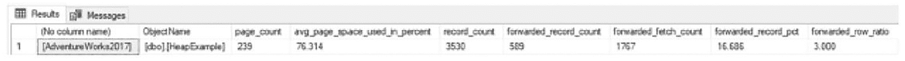

一个包含 9 列和 1 行的表。列标题依次为：无列名、对象名称、页数、平均页空间使用百分比、记录数、转发记录数、转发提取次数、转发记录百分比和转发行比率。

图 16-1
转发记录快照查询结果

当识别出存在转发记录问题的堆表后，通常有两种方法可以缓解转发记录。第一种方法是将可变长度列的数据类型更改为固定长度数据类型。例如，将 `varchar` 数据类型更改为 `char`。这种方法并不总是理想的，因为它可能导致表需要更多空间，而且某些查询可能无法适应字符字段末尾的额外空间，从而可能返回不正确的结果。第二种选择是向表添加聚集索引，这将移除堆作为表中数据存储的组织方法。这种方法的缺点在于确定要聚集表的适当键列。如果表上存在主键，它通常可以作为聚集索引键。还有第三种选择可用：可以重建堆，这将把堆重写回数据库文件并移除所有转发记录（使用清单 16-4 中的脚本）。这通常被认为是解决堆中转发记录问题的较差方法，因为它没有提供有意义的永久修复方案。重要的是要考虑到转发记录不一定就是坏的。然而，当与批处理请求相比，转发记录操作的比例开始增加时，它们确实会带来潜在的性能挑战。

```
USE AdventureWorks2017
GO
ALTER TABLE dbo.HeapExample REBUILD
Listing 16-4
Rebuild Heap Script
```
清单 16-4
重建堆脚本


#### 每秒空闲空间扫描与页面获取次数

性能计数器 `FreeSpace Scans/sec` 是另一个与堆表相关的计数器。此计数器表示当记录被插入到堆表中时发生的活动。在向堆表执行插入操作时，可能会在 `GAM`、`SGAM` 和 `PFS` 页面上产生活动。如果插入速率足够高，这些页面上就可能发生争用。分析 `FreeSpace Scans/sec` 和 `FreeSpace Page Fetches/sec` 计数器的值，提供了一个跟踪此活动并确定活动量何时增加以及堆表何时可能需要进一步分析的机会。结合使用时，`FreeSpace Scans/sec` 和 `FreeSpace Page Fetches/sec` 计数器分别指示了堆表上扫描活动的频率和数量。

与转发改的记录一样，此指标仅适用于堆表，在不使用堆表存储数据的环境中不会提供有用的洞察。

##### 分析 FreeSpace Scans/sec 计数器

清单 16-5 提供了分析 `FreeSpace Scans/sec` 计数器的查询。它提供了 SQL Server 实例上 `FreeSpace Scans` 活动的快照。该查询提供了该计数器的最小值、平均值和最大值聚合。与前一个计数器类似，该计数器也遵循推荐的准则，即每十个 `Batch Requests/sec` 对应一个 `FreeSpace Scans/sec`。`PctViolation` 列衡量了计数器超出准则的时间百分比。

```sql
USE IndexingMethod;
GO
WITH CounterSummary
AS (SELECT create_date,
server_name,
MAX(IIF(counter_name = 'FreeSpace Scans/sec', Calculated_Counter_value, NULL)) FreeSpaceScans,
MAX(IIF(counter_name = 'FreeSpace Page Fetches/sec', Calculated_Counter_value, NULL)) FreeSpacePageFetches,
MAX(IIF(counter_name = 'FreeSpace Scans/sec', Calculated_Counter_value, NULL))
/ (NULLIF(MAX(IIF(counter_name = 'Batch Requests/sec', Calculated_Counter_value, NULL)), 0) * 10) AS ForwardedRecordRatio
FROM dbo.IndexingCounters
WHERE counter_name IN ( 'FreeSpace Scans/sec', 'FreeSpace Page Fetches/sec', 'Batch Requests/sec' )
GROUP BY create_date,
server_name)
SELECT server_name,
MIN(FreeSpaceScans) AS MinFreeSpaceScans,
AVG(FreeSpaceScans) AS AvgFreeSpaceScans,
MAX(FreeSpaceScans) AS MaxFreeSpaceScans,
MIN(FreeSpacePageFetches) AS MinFreeSpacePageFetches,
AVG(FreeSpacePageFetches) AS AvgFreeSpacePageFetches,
MAX(FreeSpacePageFetches) AS MaxFreeSpacePageFetches,
MIN(ForwardedRecordRatio) AS MinForwardedRecordRatio,
AVG(ForwardedRecordRatio) AS AvgForwardedRecordRatio,
MAX(ForwardedRecordRatio) AS MaxForwardedRecordRatio,
FORMAT(1. * SUM(IIF(ForwardedRecordRatio > 1, 1, NULL)) / COUNT(*), '0.00%') AS PctViolation
FROM CounterSummary
GROUP BY server_name;
```

清单 16-5：空闲空间扫描计数器分析

##### 识别具有高插入率的堆表

当 `FreeSpace Scans/sec` 数值较高时，分析将侧重于确定数据库中哪些堆表具有最高的插入速率。要识别堆表上插入最多的表，请使用来自 `sys.dm_db_index_operational_stats` 的监控表中的信息。包含插入信息的列是 `leaf_insert_count`。清单 16-6 中的查询提供了监控表 `dbo.index_operational_stats_history` 中索引最多的堆表列表。

```sql
USE IndexingMethod
GO
SELECT
QUOTENAME(DB_NAME(database_id)) AS database_name
,QUOTENAME(OBJECT_SCHEMA_NAME(object_id, database_id)) + '.'
+ QUOTENAME(OBJECT_NAME(object_id, database_id)) AS ObjectName
, SUM(leaf_insert_count) AS leaf_insert_count
, SUM(leaf_allocation_count) AS leaf_allocation_count
FROM dbo.index_operational_stats_history
WHERE index_id = 0
AND database_id > 4
and QUOTENAME(OBJECT_NAME(object_id, database_id)) IS NOT NULL
GROUP BY object_id, database_id
ORDER BY leaf_insert_count DESC
```

清单 16-6：空闲空间扫描快照查询

##### 示例结果与缓解措施

回顾清单 16-3 演示脚本中的表格并结合 `FreeSpace Scans` 快照查询，得到图 16-2 所示的结果。如本示例所示，对堆表进行了数千次插入。虽然结果中只显示了一个表，但出现在此列表顶部的表将是最常导致 `FreeSpace Scans/sec` 的表。

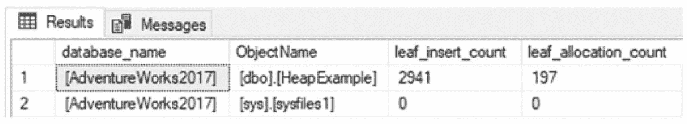

图 16-2：每秒空闲空间扫描快照查询结果

一旦识别出导致问题的堆表，缓解此问题的最佳方法是在插入最多的表上创建聚集索引。由于该计数器基于对 `GAM`、`SGAM` 和 `PFS` 页面上空闲空间的扫描，在堆表上构建聚集索引会将页面分配转移到 `IAM` 页面，这些页面专用于每个聚集索引，而堆表则会与其他堆表竞争页面分配。


### 每秒完整扫描次数

通过性能计数器 `Full Scans/sec`，可以测量在聚集索引、非聚集索引和堆上执行的完整扫描次数。在执行计划中，此计数器在索引扫描和表扫描期间触发。执行完整扫描的速率越高，发生与完整扫描相关的性能问题的可能性就越大。从性能角度来看，这会影响 `Page Life Expectancy` 值，因为数据在内存中被换入换出，并且可能存在 I/O 争用，因为查询需要等待数据被加载到内存中。

使用清单 16-7 中的查询，可以分析当前监控窗口内 `Full Scans/sec` 的状态。与之前的计数器一样，考虑此计数器与 `Batch Requests/sec` 计数器之间的关系非常重要。当 `Full Scans/sec` 与 `Batch Requests/sec` 的比率超过千分之一时，可能存在需要进一步审查的 `Full Scans/sec` 问题。

```sql
USE IndexingMethod;
GO
WITH CounterSummary
AS (SELECT create_date,
           server_name,
           MAX(IIF(counter_name = 'Full Scans/sec', Calculated_Counter_value, NULL)) FullScans,
           MAX(IIF(counter_name = 'Full Scans/sec', Calculated_Counter_value, NULL))
           / (NULLIF(MAX(IIF(counter_name = 'Batch Requests/sec', Calculated_Counter_value, NULL)), 0) * 1000) AS FullRatio
    FROM dbo.IndexingCounters
    WHERE counter_name IN ( 'Full Scans/sec', 'Batch Requests/sec' )
    GROUP BY create_date,
             server_name)
SELECT server_name,
       MIN(FullScans) AS MinFullScans,
       AVG(FullScans) AS AvgFullScans,
       MAX(FullScans) AS MaxFullScans,
       MIN(FullRatio) AS MinFullRatio,
       AVG(FullRatio) AS AvgFullRatio,
       MAX(FullRatio) AS MaxFullRatio,
       FORMAT(1. * SUM(IIF(FullRatio > 1, 1, 0)) / COUNT(*), '0.00%') AS PctViolation
FROM CounterSummary
GROUP BY server_name;
```
清单 16-7 完整扫描计数器分析

在演示如何检查高 `Full Scans/sec` 计数器值的根本原因之前，将设置一些示例统计信息。清单 16-8 将提供大量的完整扫描，这些扫描可以通过前一节详述的监控过程收集。执行示例脚本后，请务必执行收集监控信息的脚本。

```sql
USE AdventureWorks2017
GO
SET NOCOUNT ON
EXEC ('SELECT * INTO #temp FROM Sales.SalesOrderHeader')
GO 1000
```
清单 16-8 完整扫描示例查询

主要目标是识别 `Full Scans/sec` 计数器受哪些索引影响。一旦识别出索引，就需要对其进行分析，以确定它们是否适合该操作，或者是否需要其他性能调整策略来减少在完整扫描操作中使用该索引。用于调查完整扫描的 DMO 是监控表中的 `sys.dm_db_index_usage_stats`；在监控中，这存储在 `dbo.index_usage_stats_history` 表中。

可以使用清单 16-9 中所示的查询来识别索引。快照结果排除了没有任何行的索引。这些索引仍用于完整扫描，但减轻这些索引上的扫描不会对性能产生重大影响。为了对结果排序，索引上的扫描次数乘以表中的行数。通过这种方式排序，输出会侧重于那些可能对降低 `Full Scans/sec` 值影响不大，但将为索引性能提供最大改进的索引。

```sql
USE IndexingMethod;
GO
SELECT QUOTENAME(DB_NAME(uh.database_id)) AS database_name,
       QUOTENAME(OBJECT_SCHEMA_NAME(uh.object_id, uh.database_id)) + '.'
       + QUOTENAME(OBJECT_NAME(uh.object_id, uh.database_id)) AS ObjectName,
       uh.index_id,
       SUM(uh.user_scans) AS user_scans,
       SUM(uh.user_seeks) AS user_seeks,
       x.record_count
FROM dbo.index_usage_stats_history uh
CROSS APPLY (
    SELECT DENSE_RANK() OVER (ORDER BY ph.create_date DESC) AS RankID,
           ph.record_count
    FROM dbo.index_physical_stats_history ph
    WHERE ph.database_id = uh.database_id
          AND ph.object_id = uh.object_id
          AND ph.index_id = uh.index_id
) x
WHERE uh.database_id > 4
      AND uh.database_id <> DB_ID()
      AND OBJECT_NAME(uh.object_id, uh.database_id) IS NOT NULL
      AND x.RankID = 1
GROUP BY uh.database_id,
         uh.object_id,
         uh.index_id,
         x.record_count
ORDER BY SUM(uh.user_scans) * x.record_count DESC;
GO
```
清单 16-9 完整扫描快照查询

完整扫描快照查询的结果将类似于图 16-3 中的输出。有了这个输出，下一步是确定哪些索引需要进一步分析。当前分析的目的是识别出待后续分析的问题索引。一旦识别出来，下一步就是确定它们在哪里被使用，以及如何在这些地方减少完整扫描，这将在本章后面的“索引计划使用”部分进行演示。

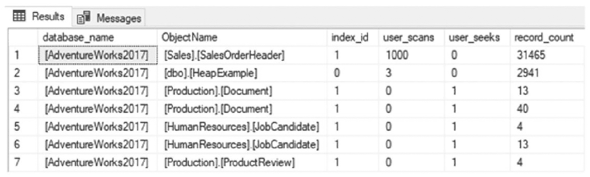

结果选项卡下列出了一个具有 6 列 7 行的表格。列标题为数据库名称、对象名称、索引 ID、用户扫描次数、用户查找次数和记录数。数据库名称下选择了 Adventure Works 2017。

图 16-3 完整扫描快照查询结果


### 每秒索引搜索次数

### 每秒索引搜索次数

与扫描索引相对的替代方法是对索引执行查找操作。性能计数器 `索引搜索/秒` 用于报告 SQL Server 实例上索引查找的速率。这可以包括范围扫描和键查找等操作。在大多数环境中，我们更希望看到较高的 `索引搜索/秒` 计数器值。因此，该性能计数器相对于 `全扫描/秒` 的比值越高越好。

对 `索引搜索/秒` 的分析将从审查一段时间内收集的性能计数器信息开始（如清单 16-10 所示）。`索引搜索/秒` 与 `全扫描/秒` 的比值是可用于评估 `索引搜索/秒` 是否表明存在潜在索引问题的指标之一。评估这两个计数器之间比值的指导原则是，每出现 1 次 `全扫描/秒`，应寻找 1,000 次 `索引搜索/秒`。分析查询提供了此计算，并通过 `PctViolation` 列确定了计数器值超过此比值的时间量。

```
USE IndexingMethod;
GO
WITH CounterSummary
AS (SELECT create_date,
           server_name,
           MAX(IIF(counter_name = 'Index Searches/sec', Calculated_Counter_value, NULL)) IndexSearches,
           MAX(IIF(counter_name = 'Index Searches/sec', Calculated_Counter_value, NULL))
           / (NULLIF(MAX(IIF(counter_name = 'Full Scans/sec', Calculated_Counter_value, NULL)), 0) * 1000) AS SearchToScanRatio
    FROM dbo.IndexingCounters
    WHERE counter_name IN ( 'Index Searches/sec', 'Full Scans/sec' )
    GROUP BY create_date,
             server_name)
SELECT server_name,
       MIN(IndexSearches) AS MinIndexSearches,
       AVG(IndexSearches) AS AvgIndexSearches,
       MAX(IndexSearches) AS MaxIndexSearches,
       MIN(SearchToScanRatio) AS MinSearchToScanRatio,
       AVG(SearchToScanRatio) AS AvgSearchToScanRatio,
       MAX(SearchToScanRatio) AS MaxSearchToScanRatio,
       FORMAT(1. * SUM(IIF(SearchToScanRatio > 1, 1, NULL)) / COUNT(*), '0.00%') AS PctViolation
FROM CounterSummary
GROUP BY server_name;
```
清单 16-10
索引搜索计数器分析

如果分析表明索引搜索存在问题，下一步是验证是否已完成上一节中关于 `全扫描/秒` 的分析。该分析将提供哪些索引存在大量全扫描的最深入信息，这些全扫描会导致 `索引搜索/秒` 的比值偏高。

为了帮助演示如何检查 `索引搜索/秒` 计数器值，将执行清单 16-11 中的查询。该查询将提供一些可以通过上一节详述的监控过程收集到的全扫描。运行示例脚本后，请务必执行收集监控信息的脚本。

```
USE AdventureWorks2017
GO
SET NOCOUNT ON
EXEC('SELECT SOH.SalesOrderID, SOD.SalesOrderDetailID
      INTO #temp
      FROM Sales.SalesOrderHeader SOH
      INNER JOIN Sales.SalesOrderDetail SOD ON SOH.SalesOrderID = SOD.SalesOrderID
      WHERE SOH.SalesOrderID = 43659')
GO 1000
```
清单 16-11
全扫描示例查询

一旦该分析完成，我们就可以开始识别索引级别上扫描与查找比值存在问题的具体位置。使用清单 16-12 中的查询，可以识别出扫描与查找比值偏高的索引。与每 1 次扫描对应 1,000 次查找的性能计数器指导原则类似，该查询返回那些查找次数与扫描次数之比低于 1,000 的索引结果。由于全扫描问题应该已在上一节中被识别，该分析也排除了没有任何查找的索引。

```
USE IndexingMethod;
GO
SELECT QUOTENAME(DB_NAME(uh.database_id)) AS database_name,
       QUOTENAME(OBJECT_SCHEMA_NAME(uh.object_id, uh.database_id)) + '.'
       + QUOTENAME(OBJECT_NAME(uh.object_id, uh.database_id)) AS ObjectName,
       uh.index_id,
       SUM(uh.user_scans) AS user_scans,
       SUM(uh.user_seeks) AS user_seeks,
       1. * SUM(uh.user_seeks) / NULLIF(SUM(uh.user_scans), 0) AS SeekScanRatio,
       x.record_count
FROM dbo.index_usage_stats_history uh
CROSS APPLY (
    SELECT DENSE_RANK() OVER (ORDER BY ph.create_date DESC) AS RankID,
           ph.record_count
    FROM dbo.index_physical_stats_history ph
    WHERE ph.database_id = uh.database_id
      AND ph.object_id = uh.object_id
      AND ph.index_id = uh.index_id
) x
WHERE uh.database_id > 4
  AND uh.database_id < DB_ID()
  AND x.RankID = 1
  AND x.record_count > 0
GROUP BY uh.database_id,
         uh.object_id,
         uh.index_id,
         x.record_count
HAVING 1. * SUM(uh.user_seeks) / NULLIF(SUM(uh.user_scans), 0) < 1000
   AND 1. * SUM(uh.user_seeks) / NULLIF(SUM(uh.user_scans), 0) > 0
ORDER BY 1. * SUM(uh.user_seeks) / NULLIF(SUM(uh.user_scans), 0) DESC,
         SUM(uh.user_scans) DESC;
GO
```
清单 16-12
索引搜索快照查询

查看快照查询的结果（如图 16-4 所示），只识别出一个索引，其查找与扫描的比值接近 1。出现这种情况是因为在上一节中，大约有 1,000 次扫描是针对 `Sales.SalesOrderHeader` 执行的，而针对 `Sales.SalesOrderDetail` 则没有扫描，尽管在清单 16-11 中访问了这两个表及其索引。将 `索引搜索` 与 `全扫描` 结合考虑的优势在于，它们通过识别更理想活动发生的频率，有助于抵消问题的严重性。

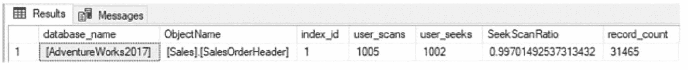

结果选项卡下列出的表格有 7 列和一行数据。列标题分别是数据库名称、对象名称、索引 ID、用户扫描数、用户查找数、查找扫描比和记录数。索引 ID 为 1，用户扫描数为 1005，用户查找数为 1002，查找扫描比为 0.99701。

图 16-4
索引搜索快照查询示例结果

在进行深入分析时，有几点需要考虑，它们可能表明已识别出的索引存在问题。首先是当前索引表现出的查找与扫描行为与之前相比有何新变化；换句话说，这种差异是否一直沿着一个逐渐恶化的共同趋势发展？如果变化是突然的，可能是某个执行计划不再像以前那样使用该索引，也许是由于代码更改或不良的参数嗅探。其次是当变化是渐进性的；查看数据量是否增加，以及数据库中的某个查询或功能是否比以前使用得更频繁。这也可能暗示人们使用数据库及其应用程序的方式发生了变化，这种情况有时是渐进的，直到达到一定程度，导致索引及其支持的性能受到影响。


### 每秒页面拆分数

类似于聚簇索引是堆的“对立面”，页面拆分是转发记录的对立面。关于页面拆分的深入讨论包含在第 2 章中。不过就本章而言，页面拆分发生在聚簇或非聚簇索引需要在索引页的排序中腾出空间，以便将数据放置到其正确位置时。页面拆分可能非常消耗资源，因为单个页面被分成两个或更多页面，并且涉及锁定，以及潜在的阻塞。页面拆分越频繁，索引越容易遭受阻塞，性能也会受到影响。此外，页面拆分引起的碎片会减少单次操作中可以执行的读取大小。

为了开始分析页面拆分的性能计数器，需要使用计数器`Page Splits/sec`。清单 16-13 中的查询提供了一种汇总页面拆分活动的方法。该查询包括性能计数器的最小、最大和平均级别。还包括`Page Splits/sec`与`Batch Requests/sec`的比率。在识别 SQL Server 实例上是否存在页面拆分问题时，经验法则是寻找每 20 个`batch requests/sec`对应超过 1 个`page split/sec`的时间段。与其他计数器一样，需要注意通过`PctViolation`显示的计数器超出阈值的时长。

```
USE IndexingMethod;
GO
WITH CounterSummary
AS (SELECT create_date,
           server_name,
           MAX(IIF(counter_name = 'Page Splits/sec', Calculated_Counter_value, NULL)) PageSplits,
           MAX(IIF(counter_name = 'Page Splits/sec', Calculated_Counter_value, NULL))
           / (NULLIF(MAX(IIF(counter_name = 'Batch Requests/sec', Calculated_Counter_value, NULL)), 0) * 20) AS FullRatio
    FROM dbo.IndexingCounters
    WHERE counter_name IN ( 'Page Splits/sec', 'Batch Requests/sec' )
    GROUP BY create_date,
             server_name)
SELECT server_name,
       MIN(PageSplits) AS MinPageSplits,
       AVG(PageSplits) AS AvgPageSplits,
       MAX(PageSplits) AS MaxPageSplits,
       MIN(FullRatio) AS MinFullRatio,
       AVG(FullRatio) AS AvgFullRatio,
       MAX(FullRatio) AS MaxFullRatio,
       FORMAT(1. * SUM(IIF(FullRatio > 1, 1, 0)) / COUNT(*), '0.00%') AS PctViolation
FROM CounterSummary
GROUP BY server_name;
```
**清单 16-13** 页面拆分计数器分析

为了确定受页面拆分影响的索引，需要考虑几个值。其中一些值来自`sys.dm_db_index_operational_stats`或来自索引监控过程的`dbo.index_operational_stats_history`。这些列报告索引上发生的每次页面分配，无论是来自 B 树末尾的插入还是中间的页面拆分。由于此分析只关心属于页面拆分的操作，因此接下来的两个列提供了是否发生由页面拆分引起的碎片的信息。为了确定碎片，监控表`dbo.index_physical_stats_history`中包含了来自`sys.dm_db_index_physical_stats`的列`avg_fragmentation_in_percent`。对于平均碎片，会返回两个值。第一个是报告给索引的最后一个碎片值；第二个是收集的所有碎片值的平均值。参见清单 16-14。

```
USE IndexingMethod;
GO
SELECT QUOTENAME(DB_NAME(database_id)) AS database_name,
       QUOTENAME(OBJECT_SCHEMA_NAME(object_id, database_id)) + '.' + QUOTENAME(OBJECT_NAME(object_id, database_id)) AS ObjectName,
       SUM(leaf_allocation_count) AS leaf_insert_count,
       SUM(nonleaf_allocation_count) AS nonleaf_allocation_count,
       MAX(IIF(RankID = 1, x.avg_fragmentation_in_percent, NULL)) AS last_fragmenation,
       AVG(x.avg_fragmentation_in_percent) AS average_fragmenation
FROM dbo.index_operational_stats_history oh
CROSS APPLY (SELECT DENSE_RANK() OVER (ORDER BY ph.create_date DESC) AS RankID,
                    CAST(ph.avg_fragmentation_in_percent AS DECIMAL(6, 3)) AS avg_fragmentation_in_percent
             FROM dbo.index_physical_stats_history ph
             WHERE ph.database_id = oh.database_id
               AND ph.object_id = oh.object_id
               AND ph.index_id = oh.index_id
            ) x
WHERE database_id > 4
  AND database_id != DB_ID()
  AND oh.index_id != 0
  AND (
      leaf_allocation_count > 0
      OR nonleaf_allocation_count > 0
     )
GROUP BY object_id,
         database_id
ORDER BY leaf_insert_count DESC;
```
**清单 16-14** 页面拆分快照查询

以这种方式调查页面拆分提供了一种查看分配次数并将该信息与碎片配对的方法。一个具有低碎片和高`leaf_insert_count`的表，例如图 16-5 所示的`dbo.IndexingCounters`表，从页面拆分的角度来看并不令人担忧。另一方面，`dbo.index_operational_stats_history`确实显示了大量的碎片和`leaf_insert_count`。值得进一步研究该索引。虽然清单 16-14 中的脚本通常不会显示`IndexingMethod`数据库的索引结果，但该脚本已根据清单中的内容进行了修改，以提供一些可供检查的结果。

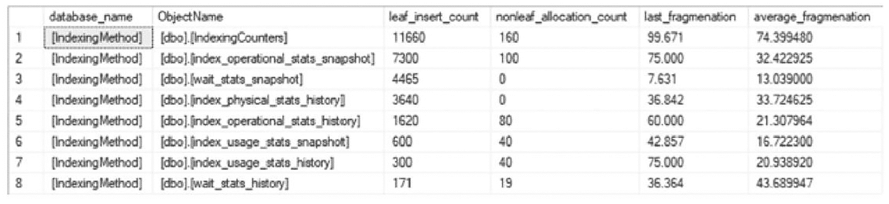

**图 16-5** 页面拆分快照查询示例结果

一个包含 6 列 8 行的表格。列标题为数据库名称、对象名称、叶子插入计数、非叶子分配计数、上次碎片和平均碎片。在数据库名称下选择的是`IndexingMethod`。

在确定了需要进一步分析的索引后，下一步是缓解。有多种方法可以缓解索引上的页面拆分。首先是审查索引的碎片历史。如果需要定期重建索引，首先可以做的就是降低索引上的`fill factor`。降低填充因子会增加重建索引后页面上的剩余空间，这将减少页面拆分的可能性。减少碎片的第二种策略是考虑索引中的列。这些列是否高度易变且值变化剧烈？例如，基于`create_date`的索引不太可能频繁发生页面拆分。但基于`update_date`的索引则容易产生碎片。如果索引的使用率不足以证明其存在是合理的，那么完全删除它可能是值得的。或者，在多列索引中，将易变列移动到索引的右侧或将它们添加为包含列。缓解页面拆分的第三种方法可以是识别索引的使用位置。最后一种缓解索引页面拆分的方法是审查索引使用的数据类型。在某些情况下，可变数据类型可能比固定长度数据类型更合适。


#### 每秒页查找次数

性能计数器 `Page Lookups/sec` 用于衡量在 SQL Server 实例中从缓冲池检索单个数据页的请求数量。当此计数器值较高时，通常意味着查询计划中存在低效问题，这往往可以通过执行计划分析来解决。通常，`Page Lookups/sec` 值过高可归因于每次执行时包含大量页查找和行查找的计划。一般来说，在性能问题方面，`Page Lookups/sec` 的值不应超过每个 `Batch Request/sec` 对应 100 次操作的比率。

对 `Page Lookups/sec` 的初步分析需要同时查看 `Page Lookups/sec` 和 `Batch Request/sec`。首先，使用代码清单 16-15 中所示的查询；该分析将包括监控期间内 `Page Lookups/sec` 值的最小值、最大值和平均值。其次，计算并包含每个时间段内 `Page Lookups/sec` 与 `Batch Request/sec` 的比率的最小值、最大值和平均值，并通过 `PctViolation` 列显示比率违规情况。违规计算用于验证操作比率是否超过 100:1。

```sql
USE IndexingMethod;
GO
WITH CounterSummary
AS (SELECT create_date,
server_name,
MAX(IIF(counter_name = 'Page Lookups/sec', Calculated_Counter_value, NULL)) PageLookups,
MAX(IIF(counter_name = 'Page Lookups/sec', Calculated_Counter_value, NULL))
/ (NULLIF(MAX(IIF(counter_name = 'Batch Requests/sec', Calculated_Counter_value, NULL)), 0) * 100) AS PageLookupRatio
FROM dbo.IndexingCounters
WHERE counter_name IN ( 'Page Lookups/sec', 'Batch Requests/sec' )
GROUP BY create_date,
server_name)
SELECT server_name,
MIN(PageLookups) AS MinPageLookups,
AVG(PageLookups) AS AvgPageLookups,
MAX(PageLookups) AS MaxPageLookups,
MIN(PageLookupRatio) AS MinPageLookupRatio,
AVG(PageLookupRatio) AS AvgPageLookupRatio,
MAX(PageLookupRatio) AS MaxPageLookupRatio,
FORMAT(1\. * SUM(IIF(PageLookupRatio > 1, 1, 0)) / COUNT(*), '0.00%') AS PctViolation
FROM CounterSummary
GROUP BY server_name;
```
代码清单 16-15 页查找计数器分析

与其他计数器一样，当分析表明该计数器存在潜在问题时，下一步就是深入挖掘。有三种方法可以解决 `Page Lookups/sec` 值过高的问题。第一种是查询 `sys.dm_exec_query_stats` 以识别频繁执行且 I/O 开销高的查询；有关此 DMV 的更多信息，请参阅 [`http://msdn.microsoft.com/en-us/library/ms189741.aspx`](http://msdn.microsoft.com/en-us/library/ms189741.aspx)。需要检查这些查询，并判断它们是否占用了过多的 I/O 资源。另一种方法是检查 SQL Server 实例中的数据库是否存在索引缺失问题。第三种方法（本节将详细介绍）是检查聚集索引和堆上的查找操作。

要调查聚集索引和堆上的查找操作，主要信息来源是 DMO `sys.dm_db_index_usage_stats`。得益于前一章实现的监控，此信息已保存在表 `dbo.index_usage_stats_history` 中。要执行分析，请使用代码清单 16-16 中的查询；我们将从用户角度查看发生的 `user lookups`、`user seeks` 和 `user scans`。利用这些值，查询计算 `user lookups` 与 `user seeks` 的比率，并返回所有比率高于 100:1 的记录。

```sql
USE IndexingMethod;
GO
SELECT QUOTENAME(DB_NAME(uh.database_id)) AS database_name,
QUOTENAME(OBJECT_SCHEMA_NAME(uh.object_id, uh.database_id)) + '.'
+ QUOTENAME(OBJECT_NAME(uh.object_id, uh.database_id)) AS ObjectName,
uh.index_id,
SUM(uh.user_lookups) AS user_lookups,
SUM(uh.user_seeks) AS user_seeks,
SUM(uh.user_scans) AS user_scans,
x.record_count,
CAST(1\. * SUM(uh.user_lookups) / IIF(SUM(uh.user_seeks) = 0, 1, SUM(uh.user_seeks)) AS DECIMAL(18, 2)) AS LookupSeekRatio
FROM dbo.index_usage_stats_history uh
CROSS APPLY (
SELECT DENSE_RANK() OVER (ORDER BY ph.create_date DESC) AS RankID,
ph.record_count
FROM dbo.index_physical_stats_history ph
WHERE ph.database_id = uh.database_id
AND ph.object_id = uh.object_id
AND ph.index_id = uh.index_id) x
WHERE uh.database_id > 4
AND x.RankID = 1
AND x.record_count > 0
GROUP BY uh.database_id,
uh.object_id,
uh.index_id,
x.record_count
HAVING CAST(1\. * SUM(uh.user_lookups) / IIF(SUM(uh.user_seeks) = 0, 1, SUM(uh.user_seeks)) AS DECIMAL(18, 2)) > 100
ORDER BY 1\. * SUM(uh.user_lookups) / IIF(SUM(uh.user_seeks) = 0, 1, SUM(uh.user_seeks)) DESC;
GO
```
代码清单 16-16 页查找快照查询

一旦识别出有问题的索引，下一步就是确定索引的使用方式和位置，其流程将在本章后续部分描述。


#### 页面压缩

性能计数器 `Page compression attempts/sec` 和 `Pages compressed/sec` 分别用于度量被压缩的页面数量和尝试压缩的页面数量。当 `Pages compressed/sec` 的速率相对于 `Page compression attempts/sec` 下降时，表明 SQL Server 压缩算法在将数据页保存为压缩状态时出现失败。当存在未压缩存储更高效的数据时，或者解压页面的 CPU 成本超过了压缩数据的价值时，审查压缩对于表或索引是否合适可能是有价值的。这通常发生在看起来随机的数据上，例如图像文件的原始输出。压缩失败的挑战在于，SQL Server 已经花费了时间，特别是 CPU 资源，去尝试压缩页面。通常，当超过 5% 的页面压缩尝试失败时，值得识别并审查发生失败的索引。

为了分析页面压缩是否存在问题，应首先审查页面压缩的计数器。使用清单 16-17 中所示的查询，我们可以查看监测期间 `Page compression attempts/sec` 和 `Pages compressed/sec` 的最小值、最大值和平均值。此外，还包含了 `Pages compressed/sec` 与 `Page compression attempts/sec` 的比率及其最小值、最大值和平均值。`PctViolation` 列让我们知道 5% 阈值被违反的时间百分比。

```sql
USE IndexingMethod;
GO
WITH CounterSummary
AS (SELECT create_date,
        server_name,
        MAX(IIF(counter_name = 'Page compression attempts/sec', Calculated_Counter_value, NULL)) PageCompressionAttempts,
        MAX(IIF(counter_name = 'Pages compressed/sec', Calculated_Counter_value, NULL)) PagesCompressed,
        MAX(IIF(counter_name = 'Page compression attempts/sec', Calculated_Counter_value, NULL))
        / (NULLIF(MAX(IIF(counter_name = 'Pages compressed/sec', Calculated_Counter_value, NULL)), 0) * 100.) AS CompressionRate
    FROM dbo.IndexingCounters
    WHERE counter_name IN ( 'Page compression attempts/sec', 'Pages compressed/sec')
    GROUP BY create_date,
             server_name)
SELECT server_name,
       MIN(PageCompressionAttempts) AS MinPageCompressionAttempts,
       AVG(PageCompressionAttempts) AS AvgPageCompressionAttempts,
       MAX(PageCompressionAttempts) AS MaxPageCompressionAttempts,
       MIN(PagesCompressed) AS MinPagesCompressed,
       AVG(PagesCompressed) AS AvgPagesCompressed,
       MAX(PagesCompressed) AS MaxPagesCompressed,
       MIN(CompressionRate) AS MinCompressionRate,
       AVG(CompressionRate) AS AvgCompressionRate,
       MAX(CompressionRate) AS MaxCompressionRate,
       FORMAT(1. * SUM(IIF(CompressionRate < 95, 1, 0)) / COUNT(*), '0.00%') AS PctViolation
FROM CounterSummary
GROUP BY server_name;
```
**清单 16-17 页面压缩计数器分析**

如果表明页面压缩失败率很高或频率在增加，值得在数据库内部调查以确定哪些表和索引未能进行页面压缩。使用已为索引存储的数据，可以使用清单 16-18 中的查询确定具体哪个索引存在页面压缩失败，或具有最低的页面压缩成功率。结果将类似于图 16-6 中的示例。该索引是使用 `Person.Person` 表中的所有列创建的，其中包括一些 `XML` 和 `varchar(max)` 列。此索引的页面压缩成功率略高于 50%，这是一个次优结果。

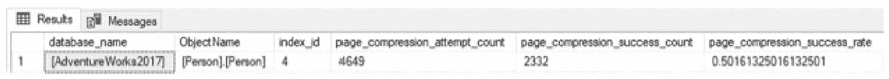

一个表格出现在结果选项卡下。列标题和数据为：数据库名 `adventure works 2017`，对象名 `person person`，索引 `i d 4`，页面压缩尝试计数 `4649`，页面压缩成功计数 `2332`，以及页面压缩成功率 `0.50161`。

**图 16-6 页面压缩快照查询示例结果**

```sql
USE IndexingMethod;
GO
SELECT QUOTENAME(DB_NAME(database_id)) AS database_name,
       QUOTENAME(OBJECT_SCHEMA_NAME(object_id, database_id)) + '.' + QUOTENAME(OBJECT_NAME(object_id, database_id)) AS ObjectName,
       oh.index_id,
       SUM(oh.page_compression_attempt_count) AS page_compression_attempt_count,
       SUM(oh.page_compression_success_count) AS page_compression_success_count,
       SUM(1. * oh.page_compression_success_count / NULLIF(oh.page_compression_attempt_count, 0)) AS page_compression_success_rate
FROM dbo.index_operational_stats_history oh
WHERE database_id > 4
  AND database_id  DB_ID()
  AND oh.page_compression_attempt_count > 0
GROUP BY object_id,
         database_id,
         index_id;
```
**清单 16-18 页面压缩快照查询**

一旦确定了压缩效果不佳的索引，下一步是确定页面压缩是否适用于该索引。包含诸如 `XML` 或 `varchar(max)` 等数据类型的索引是页面压缩的不良候选者，如图 16-6 所示。


### 锁等待时间

某些性能计数器可用于根据其使用情况来确定索引是否存在压力。其中一个计数器是 `锁等待时间 (ms)`。该计数器衡量 SQL Server 为等待对表、索引或页实施锁所花费的时间（以毫秒为单位）。此计数器并没有任何特定的“良好”指导值。一般来说，该值越低越好，但“低”的具体含义完全取决于数据库平台和访问它的应用程序。

由于没有关于 `锁等待时间 (ms)` 值可接受水平的准则，评估该计数器的最佳方法是将其与基线值进行比较。在这种情况下，收集基线对于监控何时发生与 `锁等待时间` 相关的索引性能下降变得极其重要。使用清单 16-19 中的查询，将 `锁等待时间 (ms)` 值与可用的基线值进行比较。对于基线值和监控期的值，都提供了计数器值的最小值、最大值、平均值和标准差的聚合。这些聚合有助于提供计数器状态的概况，以及与基线相比它是增加还是减少了。

#### 清单 16-19
锁等待时间计数器分析

```sql
USE IndexingMethod;
GO
WITH CounterSummary
AS (SELECT create_date,
server_name,
instance_name,
MAX(IIF(counter_name = 'Lock Wait Time (ms)', Calculated_Counter_value, NULL)) / 1000 LockWaitTime
FROM dbo.IndexingCounters
WHERE counter_name = 'Lock Wait Time (ms)'
GROUP BY create_date,
server_name,
instance_name)
SELECT CONVERT(VARCHAR(50), MAX(create_date), 101) AS CounterDate,
server_name,
instance_name,
MIN(LockWaitTime) AS MinLockWaitTime,
AVG(LockWaitTime) AS AvgLockWaitTime,
MAX(LockWaitTime) AS MaxLockWaitTime,
STDEV(LockWaitTime) AS StdDevLockWaitTime
FROM CounterSummary
GROUP BY server_name,
instance_name
UNION ALL
SELECT 'Baseline: ' + CONVERT(VARCHAR(50), start_date, 101) + ' --> ' + CONVERT(VARCHAR(50), end_date, 101),
server_name,
instance_name,
minimum_counter_value / 1000,
maximum_counter_value / 1000,
average_counter_value / 1000,
standard_deviation_counter_value / 1000
FROM dbo.IndexingCountersBaseline
WHERE counter_name = 'Lock Wait Time (ms)'
ORDER BY instance_name,
CounterDate DESC;
```

例如，在图 16-7 中，平均和最大锁等待时间相较于基线值有所下降，这是期望的情况。如果平均锁等待时间相比基线有所增加，则可能需要关注，特别是如果该增加量达到数十毫秒。此外，如果最大值范围有所扩大，这也是需要调查的另一件事。等待获取锁所花费的时间增加得越多，对用户的直接影响就越大。

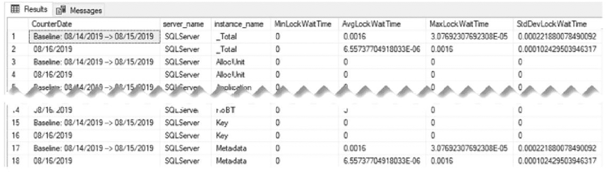

页面在结果选项卡下呈现了一个表格，截取了第 1 到 4 行以及第 15 到 18 行两组。列标题包括计数器日期、服务器名称、实例名称、最小锁等待时间、平均锁等待时间、最大锁等待时间、以及标准差锁等待时间。

**图 16-7**
锁等待时间计数器分析示例结果

在调查 `锁等待时间` 时，使用清单 16-20 中的查询来识别哪些索引产生了最多的 `锁等待时间` 非常重要。该信息可在 DMO `sys.dm_db_index_operational_stats` 或监控表 `dbo.index_operational_stats_history` 中找到。为检查 `锁等待时间` 而需审阅的列是 `row_lock_wait_count`、`row_lock_wait_count`、`row_lock_wait_count` 和 `page_lock_wait_in_ms`。这些列报告了每个索引的等待次数以及这些等待的时间。正如这些列所表明的，锁存在于行级别和页级别；通常，锁类型之间的变化与索引上的查找和扫描操作相关。

#### 清单 16-20
锁等待时间快照查询

```sql
USE IndexingMethod;
GO
SELECT QUOTENAME(DB_NAME(database_id)) AS database_name,
QUOTENAME(OBJECT_SCHEMA_NAME(object_id, database_id)) + '.' + QUOTENAME(OBJECT_NAME(object_id, database_id)) AS ObjectName,
index_id,
SUM(row_lock_wait_count) AS row_lock_wait_count,
SUM(row_lock_wait_in_ms) / 1000. AS row_lock_wait_in_sec,
ISNULL(SUM(row_lock_wait_in_ms) / NULLIF(SUM(row_lock_wait_count), 0) / 1000., 0) AS avg_row_lock_wait_in_sec,
SUM(page_lock_wait_count) AS page_lock_wait_count,
SUM(page_lock_wait_in_ms) / 1000. AS page_lock_wait_in_sec,
ISNULL(SUM(page_lock_wait_in_ms) / NULLIF(SUM(page_lock_wait_count), 0) / 1000., 0) AS avg_page_lock_wait_in_sec
FROM dbo.index_operational_stats_history oh
WHERE database_id > 4
AND database_id <> DB_ID()
AND (
row_lock_wait_in_ms > 0
OR page_lock_wait_in_ms > 0
)
GROUP BY database_id,
object_id,
index_id;
```

观察快照查询的结果（如图 16-8 所示），有几点需要指出。首先，所有锁都发生在表的页上，而不是行级别。这可能导致更大范围的阻塞，因为被锁定的不仅仅是正在访问的行。此外，平均页锁时间约为 7 秒。对于大多数环境来说，这是一个过长的锁定时间。基于这些信息，应该对表 `Sales.SalesOrderDetail` 上的聚集索引（`index_id=1`）进行调查。

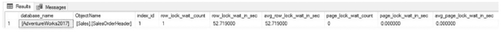

一个包含 9 列和 1 行的表格。列标题包括数据库名称、对象名称、索引 id、行锁等待次数、行锁等待秒数、平均行锁等待秒数、页锁等待次数、页锁等待秒数、以及平均页锁等待秒数。

**图 16-8**
锁等待时间索引分析示例结果

当我们需要更深入地研究一个索引及其用法时，下一步是确定哪些执行计划正在使用该索引。然后优化查询或索引以减少锁定。在某些情况下，如果索引对表不关键，更好的做法可能是移除该索引，让其他索引来满足查询需求。


### 每秒锁等待数

下一个计数器 Lock Waits/sec 的分析方法与 Lock Wait Time (ms) 类似。Lock Waits/sec 计数器测量无法立即满足的锁请求数量。对于这些请求，SQL Server 会等待直到行或页可用于锁定，然后才授予锁。与前一个计数器一样，这个计数器也没有关于什么是“好”值的特定准则。对于这些，我们应该参考基线并与之比较，以确定该计数器何时超出了正常的操作边界。

Lock Waits/sec 的分析包括与 Lock Wait Time (ms) 相同的最小值、最大值、平均值和标准差聚合。这些值针对每个计数器表 `dbo.IndexingCounters` 和基线表 `dbo.IndexingCountersBaseline` 进行聚合，如清单 16-21 所示。图 16-9 显示了查询的结果。

```sql
USE IndexingMethod;
GO
WITH CounterSummary
AS (SELECT create_date,
server_name,
instance_name,
MAX(IIF(counter_name = 'Lock Waits/sec', Calculated_Counter_value, NULL)) LockWaits
FROM dbo.IndexingCounters
WHERE counter_name = 'Lock Waits/sec'
GROUP BY create_date,
server_name,
instance_name)
SELECT CONVERT(VARCHAR(50), MAX(create_date), 101) AS CounterDate,
server_name,
instance_name,
MIN(LockWaits) AS MinLockWait,
AVG(LockWaits) AS AvgLockWait,
MAX(LockWaits) AS MaxLockWait,
STDEV(LockWaits) AS StdDevLockWait
FROM CounterSummary
GROUP BY server_name,
instance_name
UNION ALL
SELECT 'Baseline: ' + CONVERT(VARCHAR(50), start_date, 101) + ' --> ' + CONVERT(VARCHAR(50), end_date, 101),
server_name,
instance_name,
minimum_counter_value / 1000,
maximum_counter_value / 1000,
average_counter_value / 1000,
standard_deviation_counter_value / 1000
FROM dbo.IndexingCountersBaseline
WHERE counter_name = 'Lock Waits/sec'
ORDER BY instance_name,
CounterDate DESC;
```
清单 16-21 Lock Waits 计数器分析

有时，如图 16-9 所包含的情况，Lock Wait/sec 并非问题所在，但 Lock Wait Time(ms) 却存在问题。这些情况指向了长时间的阻塞情况。相反，Lock Wait/sec 对于监控很重要，因为它将指示何时存在大范围的阻塞。阻塞持续时间可能不长，但范围很广；一个长时间的阻塞就可能导致显著的性能问题。

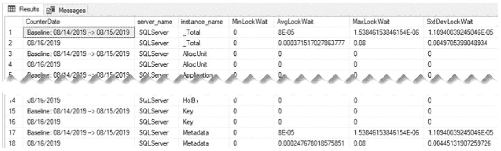

一个页面在结果选项卡下显示了一个表格，被剪切成了两部分。列标题是计数器日期、服务器名称、实例名称、最小锁等待、平均锁等待、最大锁等待时间和标准差锁等待。

图 16-9 Lock Waits 计数器分析示例结果

在大范围阻塞的情况下，如 Lock Wait/sec 值较高所指示的那样，分析将需要使用 DMO `sys.dm_db_index_operational_stats` 来调查索引统计信息。通过监控过程，此信息将存储在表 `dbo.index_operational_stats_history` 中。使用清单 16-22 中的查询，可以确定等待的锁的数量和百分比。与 Lock Wait Time (ms) 一样，此计数器分析也查看行和页级别的统计信息。

```sql
USE IndexingMethod;
GO
SELECT QUOTENAME(DB_NAME(database_id)) AS database_name,
QUOTENAME(OBJECT_SCHEMA_NAME(object_id, database_id)) + '.' + QUOTENAME(OBJECT_NAME(object_id, database_id)) AS ObjectName,
index_id,
SUM(row_lock_count) AS row_lock_count,
SUM(row_lock_wait_count) AS row_lock_wait_count,
ISNULL(SUM(row_lock_wait_count) / NULLIF(SUM(row_lock_count), 0), 0) AS pct_row_lock_wait,
SUM(page_lock_count) AS page_lock_count,
SUM(page_lock_wait_count) AS page_lock_wait_count,
ISNULL(SUM(page_lock_wait_count) / NULLIF(SUM(page_lock_count), 0), 0) AS pct_page_lock_wait
FROM dbo.index_operational_stats_history oh
WHERE database_id > 4
AND (
row_lock_wait_in_ms > 0
OR page_lock_wait_in_ms > 0
)
GROUP BY database_id,
object_id,
index_id;
```
清单 16-22 Lock Waits 快照查询

锁等待百分比高的索引是索引调优的首要目标。通常，当数据库中存在过多的锁等待时，终端用户会感觉到他们的应用程序缓慢，在最坏的情况下，会出现应用程序超时。分析此计数器的目的是识别可以优化的索引，然后调查这些索引被使用的位置。完成此操作后，解决锁产生的原因，并调整索引和查询以减少索引上的锁定。


### 每秒死锁数

在极端情况下，索引性能低下和过多的锁定/阻塞可能导致死锁。死锁发生的情况是：两个或多个事务放置了锁，其中一个事务的锁定顺序因其他事务的锁而被阻止获取和/或释放其锁。如果应用程序不明确重试发生死锁的查询，其结果可能是重要的事务永远无法执行。对于管理重要用户数据的应用程序来说，这可能产生深远的负面影响。有多种方法可以解决死锁问题，其中之一是改进索引。

要确定 SQL Server 实例上是否发生死锁，请检查在监控期间收集的性能计数器。清单 16-23 中的查询提供了在监控窗口期内死锁率的概览。该查询返回服务器上死锁的最小值、平均值、最大值和标准差等聚合值。

```sql
USE IndexingMethod;
GO
WITH CounterSummary
AS (SELECT create_date,
server_name,
Calculated_Counter_value AS NumberDeadlocks
FROM dbo.IndexingCounters
WHERE counter_name = 'Number of Deadlocks/sec')
SELECT server_name,
MIN(NumberDeadlocks) AS MinNumberDeadlocks,
AVG(NumberDeadlocks) AS AvgNumberDeadlocks,
MAX(NumberDeadlocks) AS MaxNumberDeadlocks,
STDEV(NumberDeadlocks) AS StdDevNumberDeadlocks
FROM CounterSummary
GROUP BY server_name;
```
**清单 16-23** 每秒死锁数计数器分析

通常，一个经过良好调优的数据库平台不应发生死锁。当死锁发生时，应对每一次死锁进行调查以确定其根本原因。然而，在检查死锁之前，首先需要检索死锁信息。

有多种方法可以从 SQL Server 收集死锁信息。这些方法包括跟踪标志、SQL Profiler 和事件通知。另一种方法是使用内置的 `system_health` 会话，通过扩展事件。清单 16-24 中的查询返回当前该会话的 `ring_buffer` 中所有死锁的列表。

```sql
USE IndexingMethod;
GO
WITH deadlock
AS (SELECT CAST(target_data AS XML) AS target_data
FROM sys.dm_xe_session_targets st
INNER JOIN sys.dm_xe_sessions s ON s.address = st.event_session_address
WHERE name = 'system_health'
AND target_name = 'ring_buffer')
SELECT c.value('(@timestamp)[1]', 'datetime') AS event_timestamp,
c.query('data/value/deadlock')
FROM deadlock d
CROSS APPLY target_data.nodes('//RingBufferTarget/event') AS t(c)
WHERE c.exist('.[@name = "xml_deadlock_report"]') = 1;
```
**清单 16-24** 系统运行状况死锁查询

当识别出死锁时，它们会以 XML 文档的形式返回。对大多数人来说，阅读 XML 文档并不是检查死锁的自然方式。相反，通常更可取的方法是查看与死锁关联的死锁图，例如图 16-10 中所示的那个。要获取清单 16-22 返回的任何一个死锁的死锁图，请在 SQL Server Management Studio 中打开死锁 XML 文档，然后将文件保存为 `.xdl` 扩展名。当文件重新打开时，它将显示为死锁图，而不是 XML 文档。

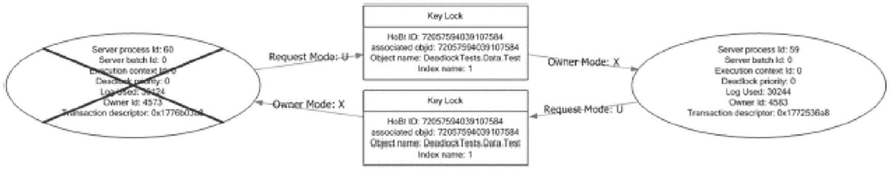

*该图展示了 2 台服务器之间的死锁。服务器 A 以 U（更新）模式向键锁发送请求。该键锁以 X（排他）模式向服务器 B 发送所有者模式。服务器 B 以请求模式向另一个键锁发送请求。它以所有者模式向服务器 A 发送请求。*

**图 16-10** SQL Server Management Studio 中的死锁图

一旦死锁被识别，重要的是确定它们发生的原因以防止其再次发生。导致死锁的一个常见问题是多个事务之间的操作顺序。这个原因通常难以解决，因为它可能需要重写部分应用程序代码。为了解决死锁，最简单的方法之一是减少事务发生的时间。对访问的表进行索引是一种典型方法，在许多情况下可以通过缩小可能产生死锁的时间窗口来解决死锁。

## 等待统计

等待统计的分析过程与性能计数器的分析过程类似。对于这两组数据，信息都指向资源可能正承受压力的区域，识别出这些资源并指出后续步骤。许多适用于性能计数器的流程同样适用于等待统计。这两组信息的一个主要区别在于，等待统计是作为一个整体来审视的，其价值是通过与 SQL Server 实例上的其他等待统计进行比较来确定的。

由于这个区别，在查看等待统计时，分析只需要一个查询。在使用清单 16-25 提供的等待统计分析查询之前，有几个关于等待统计分析的方面应该讨论一下。

首先，正如忽略等待统计列表所显示的那样，有些等待状态无论服务器上的活动如何都会累积。对于这些，调查与其相关的行为没有任何价值，原因要么是它们只是服务器上 CPU 时间的推移，要么是与无法影响的内部操作有关。因此，它们不在索引讨论的范围内。

其次，等待统计的价值在于将其与服务器上经过的时间关联起来审视。虽然一个等待状态高于另一个等待状态很重要，但如果没有知道经过的时间量，就没有衡量该等待状态对服务器造成压力的尺度。为了解决这个问题，监控表中第一组结果中的等待会被忽略，并使用它们与最后一个收集点之间的日期来计算经过的时间。等待状态发生的时长与总时间相比，提供了确定该等待状态对 SQL Server 实例压力所需的数值。

**注意** 如果表 `dbo.wait_stats_history` 中只有一个样本，清单 16-25 结果中的 `pct` 列将为 null。

### 列表 16-25 等待统计信息分析查询

```sql
USE IndexingMethod;
GO
WITH WaitStats
AS (SELECT DENSE_RANK() OVER (ORDER BY w.create_date ASC) AS RankID,
create_date,
wait_type,
waiting_tasks_count,
wait_time_ms,
max_wait_time_ms,
signal_wait_time_ms,
MIN(create_date) OVER () AS min_create_date,
MAX(create_date) OVER () AS max_create_date
FROM dbo.wait_stats_history w
WHERE wait_type NOT IN ( 'BROKER_EVENTHANDLER', 'BROKER_RECEIVE_WAITFOR', 'BROKER_TASK_STOP', 'BROKER_TO_FLUSH', 'BROKER_TRANSMITTER', 'CHECKPOINT_QUEUE', 'CHKPT', 'CLR_AUTO_EVENT', 'CLR_MANUAL_EVENT', 'CLR_SEMAPHORE', 'CXCONSUMER', 'DBMIRROR_DBM_EVENT', 'DBMIRROR_EVENTS_QUEUE', 'DBMIRROR_WORKER_QUEUE', 'DBMIRRORING_CMD', 'DIRTY_PAGE_POLL', 'DISPATCHER_QUEUE_SEMAPHORE', 'EXECSYNC', 'FSAGENT', 'FT_IFTS_SCHEDULER_IDLE_WAIT', 'FT_IFTSHC_MUTEX', 'HADR_CLUSAPI_CALL', 'HADR_FILESTREAM_IOMGR_IOCOMPLETIO,', 'HADR_LOGCAPTURE_WAIT', 'HADR_NOTIFICATION_DEQUEUE', 'HADR_TIMER_TASK', 'HADR_WORK_QUEUE', 'KSOURCE_WAKEUP', 'LAZYWRITER_SLEEP', 'LOGMGR_QUEUE', 'MEMORY_ALLOCATION_EXT', 'ONDEMAND_TASK_QUEUE', 'PARALLEL_REDO_DRAIN_WORKER', 'PARALLEL_REDO_LOG_CACHE', 'PARALLEL_REDO_TRAN_LIST', 'PARALLEL_REDO_WORKER_SYNC', 'PARALLEL_REDO_WORKER_WAIT_WORK', 'PREEMPTIVE_HADR_LEASE_MECHANISM', 'PREEMPTIVE_SP_SERVER_DIAGNOSTICS', 'PREEMPTIVE_OS_LIBRARYOPS', 'PREEMPTIVE_OS_COMOPS', 'PREEMPTIVE_OS_CRYPTOPS', 'PREEMPTIVE_OS_PIPEOPS', 'PREEMPTIVE_OS_AUTHENTICATIONOPS', 'PREEMPTIVE_OS_GENERICOPS', 'PREEMPTIVE_OS_VERIFYTRUST', 'PREEMPTIVE_OS_FILEOPS', 'PREEMPTIVE_OS_DEVICEOPS', 'PREEMPTIVE_OS_QUERYREGISTRY', 'PREEMPTIVE_OS_WRITEFILE', 'PREEMPTIVE_XE_CALLBACKEXECUTE', 'PREEMPTIVE_XE_DISPATCHER', 'PREEMPTIVE_XE_GETTARGETSTATE', 'PREEMPTIVE_XE_SESSIONCOMMIT', 'PREEMPTIVE_XE_TARGETINIT', 'PREEMPTIVE_XE_TARGETFINALIZE', 'PWAIT_ALL_COMPONENTS_INITIALIZED', 'PWAIT_DIRECTLOGCONSUMER_GETNEXT', 'PWAIT_EXTENSIBILITY_CLEANUP_TASK', 'QDS_PERSIST_TASK_MAIN_LOOP_SLEEP', 'QDS_ASYNC_QUEUE', 'QDS_CLEANUP_STALE_QUERIES_TASK_MAIN_LOOP_SLEEP', 'REQUEST_FOR_DEADLOCK_SEARCH', 'RESOURCE_QUEUE', 'SERVER_IDLE_CHECK', 'SLEEP_BPOOL_FLUSH', 'SLEEP_DBSTARTUP', 'SLEEP_DCOMSTARTUP', 'SLEEP_MASTERDBREADY', 'SLEEP_MASTERMDREADY', 'SLEEP_MASTERUPGRADED', 'SLEEP_MSDBSTARTUP', 'SLEEP_SYSTEMTASK', 'SLEEP_TASK', 'SLEEP_TEMPDBSTARTUP', 'SNI_HTTP_ACCEPT', 'SOS_WORK_DISPATCHER', 'SP_SERVER_DIAGNOSTICS_SLEEP', 'SQLTRACE_BUFFER_FLUSH', 'SQLTRACE_INCREMENTAL_FLUSH_SLEEP', 'SQLTRACE_WAIT_ENTRIES', 'STARTUP_DEPENDENCY_MANAGER', 'WAIT_FOR_RESULTS', 'WAITFOR', 'WAITFOR_TASKSHUTDOW', 'WAIT_XTP_HOST_WAIT', 'WAIT_XTP_OFFLINE_CKPT_NEW_LOG', 'WAIT_XTP_CKPT_CLOSE', 'WAIT_XTP_RECOVERY', 'XE_BUFFERMGR_ALLPROCESSED_EVENT', 'XE_DISPATCHER_JOI,', 'XE_DISPATCHER_WAIT', 'XE_LIVE_TARGET_TVF', 'XE_TIMER_EVENT'))
SELECT wait_type,
DATEDIFF(ms, min_create_date, max_create_date) AS total_time_ms,
SUM(waiting_tasks_count) AS waiting_tasks_count,
SUM(wait_time_ms) AS wait_time_ms,
CAST(1. * SUM(wait_time_ms) / NULLIF(SUM(waiting_tasks_count),0) AS DECIMAL(18, 3)) AS avg_wait_time_ms,
CAST(100. * SUM(wait_time_ms) / NULLIF(DATEDIFF(ms, min_create_date, max_create_date),0) AS DECIMAL(18, 3)) AS pct_time_in_wait,
SUM(signal_wait_time_ms) AS signal_wait_time_ms,
CAST(100. * SUM(signal_wait_time_ms) / NULLIF(SUM(wait_time_ms), 0) AS DECIMAL(18, 3)) AS pct_time_runnable
FROM WaitStats
GROUP BY wait_type,
min_create_date,
max_create_date
ORDER BY SUM(wait_time_ms) DESC;
```

该查询包含许多计算，有助于识别特定等待类型何时出现问题。为更好地理解提供的信息，请参见表 16-1 中的定义。这些计算及其定义将有助于聚焦与等待统计信息相关的性能问题。

在查看等待统计信息查询的结果（如图 16-11 所示）时，有两个阈值需要注意。首先，如果任何等待超过总等待时间的`5%`，则可能存在与该等待类型相关的瓶颈，应进行进一步调查。类似地，如果任何等待超过时间的`1%`，应考虑进行进一步分析，但在分析更高等待的项目之后再进行。审查等待统计信息时需要考虑的一点是，如果等待所花费的时间主要是因为`signal_wait_time_ms`，那么首先关注服务器上的`CPU`压力可以更好地解决资源争用问题。

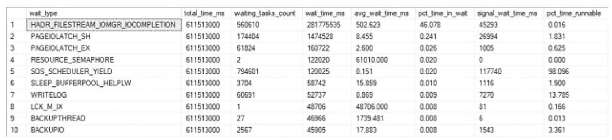

*一个包含 8 列和 10 行的表格。列标题为：等待类型、总时间（毫秒）、等待任务数、等待时间（毫秒）、平均等待时间（毫秒）、等待时间百分比、信号等待时间（毫秒）和可运行时间百分比。*

**图 16-11** 等待统计信息分析输出

**表 16-1** 等待统计信息查询列定义

| 选项名称 | 描述 |
| --- | --- |
| `wait_type` | 引起等待的等待统计信息 |
| `total_time_ms` | 查询测量的总时间（毫秒） |
| `waiting_tasks_count` | 此等待类型的等待次数计数 |
| `wait_time_ms` | 为此等待类型累计的时间（毫秒）。包括 `signal_wait_time_ms` 所花费的时间 |
| `avg_wait_time_ms` | 每种等待类型的平均时间（毫秒） |
| `pct_time_in_wait` | 为此等待类型花费的总时间百分比 |
| `signal_wait_time_ms` | 等待类型可用且不再等待后、在开始运行前累计的时间（毫秒）。这是在 `RUNNABLE` 状态花费的时间 |
| `pct_time_runnable` | 此等待类型在 `RUNNABLE` 状态花费的时间百分比 |

一旦识别出有问题的等待状态，下一步就是审查该等待及建议的应对措施。由于本章重点介绍更偏向索引相关的等待类型，我们将只关注这些定义。要了解其他等待类型，请查阅 `sys.dm_os_wait_stats`（Transact SQL）的联机文档主题。

#### CXPACKET

CXPACKET 等待类型发生在并行查询执行（也称为*并行处理*）出现等待时。并行查询可能遇到 CXPACKET 等待的情况主要有两种。第一种是当并行查询中的某个操作符无法执行，因为其他线程已经在调度器上运行。第二种是当并行线程中的某个线程执行时间比其余线程长，而其他线程需要等待这个较慢的线程完成。第一种原因是并行等待中更常见的原因，但它超出了本书的范围，通常与配置设置和查询调优有关。而第二种原因则可以通过索引来解决。通常，解决了导致 CXPACKET 等待的第二个原因后，第一个并行等待的原因也能得到缓解。

> **注意**
>
> 还有第二种并行等待名为 CXCONSUMER，用于标识与并行操作符等待线程向其发送行相关的等待。这通常不是一个可操作的等待，且不在本书的讨论范围内。

解决 CXPACKET 等待的两种常见方法是调整服务器属性 `max degree of parallelism`（最大并行度）和 `cost threshold for parallelism`（并行的成本阈值）。与并行等待的第一个原因类似，通过这些服务器属性解决并行问题也超出了本书的范围。使用这两个属性有有效的方法，但这里的重点是索引，而不是限制并行的范围和成本。简单来说，`max degree of parallelism` 限制了任何单个查询在并行处理期间可以使用的内核总数。而 `cost threshold for parallelism` 则提高了 SQL Server 判定查询可以使用并行的阈值，但不限制并行的范围。

本书讨论的范围是通过索引来缓解 CXPACKET 等待，并可结合查询调优。要解决并行运行的查询的索引问题，我们首先需要识别正在使用并行的查询。有多种方法可以识别参与并行操作的查询和索引。

第一种方法是检查以前执行中使用了并行的执行计划。通过这种方法，可以查询计划缓存以识别包含并行操作符的已创建执行计划。这提供了一个理想的查询列表，这些查询可以被调优以减少 I/O 消耗或消除对并行的需求。并行查询的需求有时可归因于基础表上的不当索引。例如，在利用扫描的表上执行的并行操作，可以通过一个支持查询中谓词或排序的索引来缓解。清单 16-26 中的查询提供了计划缓存中使用了并行的执行计划列表。

```sql
SET TRANSACTION ISOLATION LEVEL READ UNCOMMITTED;
WITH XMLNAMESPACES (
DEFAULT 'http://schemas.microsoft.com/sqlserver/2004/07/showplan'
)
SELECT COALESCE(
DB_NAME([p].[dbid]),
[p].[query_plan].value[1]', 'nvarchar(128)')
) AS [database_name],
IIF([p].[objectid] <> 0,
CONCAT(
QUOTENAME(DB_NAME([p].[dbid])),
'.',
QUOTENAME(OBJECT_SCHEMA_NAME([p].[objectid], [p].[dbid])),
'.',
QUOTENAME(OBJECT_NAME([p].[objectid], [p].[dbid]))
),
NULL) AS [object_name],
[cp].[objtype],
[p].[query_plan],
[cp].[usecounts] AS [use_counts],
[cp].[plan_handle],
CAST('' AS XML) AS [sql_text]
FROM [sys].[dm_exec_cached_plans] AS [cp]
CROSS APPLY [sys].dm_exec_query_plan AS [p]
CROSS APPLY [sys].dm_exec_sql_text AS [q]
WHERE [cp].[cacheobjtype] = 'Compiled Plan'
AND [p].[query_plan].exist = 1
ORDER BY COALESCE(
DB_NAME([p].[dbid]),
[p].[query_plan].value[1]', 'nvarchar(128)')
),
[cp].[usecounts] DESC;
```
*清单 16-26 计划缓存中使用了并行的执行计划*

> **警告**
>
> 本章包含许多针对计划缓存和查询存储执行的查询。这些是通过动态管理对象（DMO）访问的，它们提供了对 SQL Server 中执行计划的访问，允许调查服务器上当前和最近的执行活动。虽然这些信息非常有用，但在生产系统上执行此代码时请务必小心。对这些视图执行过于昂贵的查询可能会影响 SQL Server 的性能。请务必在非生产环境中监控和测试此类查询，然后再在生产环境中使用。

下一种方法与使用计划缓存类似，但使用的是查询存储。前提是该功能已在数据库上启用，`sys.query_store_plan` 表中有一个列用于标识并行计划。将它与一些其他 DMO 结合使用，可以提供包含并行操作符的 T-SQL 语句列表。清单 16-27 提供了一个从查询存储返回并行查询的查询，其中包含该 T-SQL 语句的执行次数。使用查询存储的一个优势是它将结果限制在单个数据库内。

```sql
SET TRANSACTION ISOLATION LEVEL READ UNCOMMITTED;
SELECT IIF([qsq].[object_id] <> 0,
CONCAT(
QUOTENAME(DB_NAME()),
'.',
QUOTENAME(OBJECT_SCHEMA_NAME([qsq].[object_id])),
'.',
QUOTENAME(OBJECT_NAME([qsq].[object_id]))
),
NULL) AS [object_name],
CAST([qsp].[query_plan] AS XML) AS [query_plan],
[deqs].[execution_count],
CAST('' AS XML) AS [sql_text],
[qsp].[engine_version],
[qsp].[compatibility_level],
[qsq].[query_parameterization_type_desc],
[qsp].[is_forced_plan],
[deqs].[total_worker_time]
FROM [sys].[query_store_plan] AS [qsp]
INNER JOIN [sys].[query_store_query] AS [qsq] ON [qsp].[query_id] = [qsq].[query_id]
INNER JOIN [sys].[query_store_query_text] AS [qsqt] ON [qsq].[query_text_id] = [qsqt].[query_text_id]
INNER JOIN sys.[dm_exec_query_stats] AS deqs ON [last_compile_batch_sql_handle] = [deqs].[sql_handle]
WHERE [qsp].[is_parallel_plan] = 1
ORDER BY [deqs].[execution_count] DESC,
[deqs].[total_worker_time] DESC;
```
*清单 16-27 查询存储中使用了并行的执行计划*

研究并行等待的另一种方法是调查当前正在执行的计划。此信息可在 DMO `sys.dm_os_tasks` 中获得，该视图返回当前正在使用多个工作线程的等待；清单 16-28 提供了一个用于检索此信息的示例查询。此查询提供了一个当前正在执行的并行计划列表。


```sql
WITH executing
AS (SELECT er.session_id,
er.request_id,
MAX(ISNULL(exec_context_id, 0)) AS number_of_workers,
er.sql_handle,
er.statement_start_offset,
er.statement_end_offset,
er.plan_handle
FROM sys.dm_exec_requests er
INNER JOIN sys.dm_os_tasks t ON er.session_id = t.session_id
INNER JOIN sys.dm_exec_sessions es ON er.session_id = es.session_id
WHERE es.is_user_process = 0x1
GROUP BY er.session_id,
er.request_id,
er.sql_handle,
er.statement_start_offset,
er.statement_end_offset,
er.plan_handle)
SELECT QUOTENAME(DB_NAME(st.dbid)) AS database_name,
QUOTENAME(OBJECT_SCHEMA_NAME(st.objectid, st.dbid)) + '.' + QUOTENAME(OBJECT_NAME(st.objectid, st.dbid)) AS object_name,
e.session_id,
e.request_id,
e.number_of_workers,
SUBSTRING(
st.text,
e.statement_start_offset / 2,
(CASE
WHEN e.statement_end_offset = -1 THEN LEN(CONVERT(NVARCHAR(MAX), st.text)) * 2
ELSE e.statement_end_offset END - e.statement_start_offset
) / 2
) AS query_text,
qp.query_plan
FROM executing e
CROSS APPLY sys.dm_exec_sql_text(e.plan_handle) st
CROSS APPLY sys.dm_exec_query_plan(e.plan_handle) qp
WHERE number_of_workers > 0;
```
代码清单 16-28
当前正在执行的并行查询

##### 用于分析并行等待的扩展事件会话

第二种方法是启动一个扩展事件会话，捕获事务信息，然后根据可用的调用堆栈对该信息进行分组。如代码清单 16-29 定义的会话，它会在并行等待发生时检索所有并行等待，并根据其 `T-SQL` 堆栈进行分组。在运行脚本前，请确保 `CXPACKET` 等待类型的值与查询中的值匹配；对于 `SQL Server 2019`，该值为 `265`。`T-SQL` 堆栈包含所有促成最终执行点的 SQL 语句。例如，深入分析执行堆栈可以提供有关正在执行某个函数（该函数又执行单条 `T-SQL` 语句）的存储过程的信息。这提供了可用于跟踪并行等待发生位置的详细信息。这些语句使用 `histogram` 目标进行分组，这使我们能够最小化收集的数据量，并专注于系统中导致最多 `CXPACKET` 等待的项目。

```sql
USE master;
GO
SELECT name,
map_key,
map_value
FROM sys.dm_xe_map_values
WHERE name = 'wait_types'
AND map_value = 'CXPACKET';
GO
IF EXISTS (
SELECT *
FROM sys.server_event_sessions
WHERE name = 'ex_cxpacket'
)
DROP EVENT SESSION ex_cxpacket ON SERVER;
GO
CREATE EVENT SESSION [ex_cxpacket]
ON SERVER
ADD EVENT sqlos.wait_info
(ACTION (
sqlserver.plan_handle,
sqlserver.tsql_stack)
WHERE ([wait_type] = (265)
AND [sqlserver].[is_system] = (0)))
ADD TARGET package0.histogram
(SET filtering_event_name = N'sqlos.wait_info', slots = (2048), source = N'sqlserver.tsql_stack', source_type = (1))
WITH (STARTUP_STATE = ON);
GO
ALTER EVENT SESSION ex_cxpacket ON SERVER STATE = START;
GO
```
代码清单 16-29
用于 `CXPACKET` 的扩展事件会话

一旦扩展事件会话收集了一段时间的数据，就可以更仔细地查看等待最多的会话。代码清单 16-30 提供了所有已收集的 `CXPACKET` 等待及其关联的语句和查询计划的列表。一旦我们知道这些信息，就可以调查正在使用的索引，以确定哪些索引导致了低选择性或意外的扫描。

```sql
WITH XData
AS (SELECT CAST(target_data AS XML) AS TargetData
FROM sys.dm_xe_session_targets st
INNER JOIN sys.dm_xe_sessions s ON s.address = st.event_session_address
WHERE name = 'ex_cxpacket'
AND target_name = 'histogram'),
ParsedEvent
AS (SELECT c.value('(@count)[1]', 'bigint') AS event_count,
c.value('xs:hexBinary(substring((value/frames/frame/@handle)[1],3))', 'varbinary(255)') AS sql_handle,
c.value('(value/frames/frame/@offsetStart)[1]', 'int') AS statement_start_offset,
c.value('(value/frames/frame/@offsetEnd)[1]', 'int') AS statement_end_offset
FROM XData d
CROSS APPLY TargetData.nodes('//Slot') t(c) )
SELECT QUOTENAME(DB_NAME(st.dbid)) AS database_name,
QUOTENAME(OBJECT_SCHEMA_NAME(st.objectid, st.dbid)) + '.' + QUOTENAME(OBJECT_NAME(st.objectid, st.dbid)) AS object_name,
e.event_count,
SUBSTRING(
st.text,
e.statement_start_offset / 2,
(IIF(e.statement_end_offset = -1, LEN(CONVERT(NVARCHAR(MAX), st.text)) * 2, e.statement_end_offset)
- e.statement_start_offset
) / 2
) AS query_text,
qp.query_plan
FROM ParsedEvent e
CROSS APPLY sys.dm_exec_sql_text(e.sql_handle) st
CROSS APPLY (
SELECT plan_handle
FROM sys.dm_exec_query_stats qs
WHERE e.sql_handle = qs.sql_handle
GROUP BY plan_handle
) x
CROSS APPLY sys.dm_exec_query_plan(x.plan_handle) qp
ORDER BY e.event_count DESC;
```
代码清单 16-30
查看 `CXPACKET` 扩展事件会话的查询

##### SQL Server 2022 中的并行度反馈

`SQL Server 2022` 为智能查询处理 (`IQP`) 增加了一项新功能，极大地改进了执行计划中并行度的使用方式：并行度反馈。这是一个数据库作用域的配置更改，允许 `SQL Server` 在查询优化器认为当前 `DOP` 对于重复出现的查询并非最优时，自动为单个查询调整并行度。这是一个强大的增强功能，可以自动调优并行度，对于大量使用并行执行计划的服务器特别有用。代码清单 16-31 中的 `T-SQL` 提供了在 `SQL Server 2022+` 中启用 `DOP Feedback` 的语法。

```sql
ALTER DATABASE SCOPED CONFIGURATION SET DOP_FEEDBACK = ON;
```
代码清单 16-31
启用 `DOP Feedback` 的查询

要验证此功能的当前（及默认）设置，可以使用代码清单 16-32 中的 `T-SQL`。

```sql
SELECT
*
FROM sys.database_scoped_configurations
WHERE database_scoped_configurations.name = 'DOP_FEEDBACK';
```
代码清单 16-32
查看当前 `DOP Feedback` 设置的查询

图 16-12 中的结果验证了 `DOP Feedback` 现已启用，并且 `SQL Server` 默认禁用此功能。

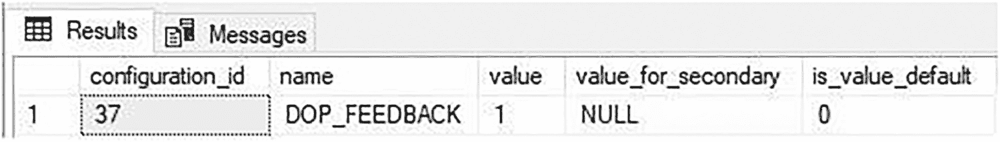

一个页面在“结果”选项卡下呈现了一个包含 5 列和一行的表格。列标题及数据为：configuration i d 37， name D O P feedback， value 1， value for secondary 为 null， value default 0。

图 16-12
`DOP_Feedback` 配置详情。

虽然并行度反馈不能解决所有与并行相关的问题，但它可以帮助自动纠正那些原本会消耗宝贵时间和资源的问题。在并行性挑战没有明确的索引或查询调优解决方案可用的情况下，这尤其有价值。


#### IO_COMPLETION

`IO_COMPLETION` 等待类型发生在 SQL Server 等待非数据页 I/O 操作（例如索引页）完成时。尽管此等待与非数据操作相关，但当此等待在 SQL Server 实例中较高时，仍可采取一些与索引相关的操作。

首先，检查服务器上 `Full Scans/sec` 的状态。如果该性能计数器存在问题，其下的操作可能会波及到用于管理索引的非数据页。如果两者都处于高位，应首先重点分析 `Full Scans/sec` 问题。

我们可以采取的第二个操作是检查 SQL Server 实例中的缺失索引信息。该信息在第 9 章讨论。添加缺失索引可以将数据消耗的压力转移到新结构上，查询可能不再需要等待非数据 I/O 完成，因为它现在利用了不同的索引。

接下来，考虑索引上发生的页拆分数量；页拆分在将页重新分配到新页时会影响非数据页。大量的页拆分活动将导致高非数据页 I/O，这可能是这些等待的根源或与之相关。

最后，如果 `IO_COMPLETION` 问题的原因不明显，请使用扩展事件会话进行调查。这类分析超出了本书的范围，因为这些原因很可能与索引无关。用于调查 `CXPACKET` 的方法可以适用，并将是开始调查的起点。

#### LCK_M_∗

`LCK_M_∗` 等待类型集合指的是在 SQL Server 实例上发生的等待。这些不仅仅是锁的使用，还包括锁有关联等待的时候。`LCK_M_∗` 中的每个等待类型都引用一种特定的锁类型，例如排他锁或共享锁。要解读不同的等待类型，请使用表 16-2。当 `LCK_M_∗` 等待类型增加时，它们总是伴随着锁等待时间（毫秒）和锁等待/秒的增加，因此可以利用这些计数器来调查此等待类型。

在调查性能计数器或不同锁类型的增加时，请参阅表 16-2。结合等待类型和性能计数器来锁定特定问题。例如，当性能计数器指向锁等待时间（毫秒）问题时，查找 `LCK_M_∗` 上的长时间等待。使用 SQL Server Management Studio 中的向导创建“统计查询锁定”会话，并确定是哪些锁以及哪些查询（通过 `query_hash`）导致了问题。类似地，如果问题在于锁等待/秒，请查找锁最多的查询。

**表 16-2 LCK_M_∗ 等待类型**

| 等待类型 | 锁类型 |
| --- | --- |
| `LCK_M_BU` | 批量更新 |
| `LCK_M_IS` | 意向共享 |
| `LCK_M_IU` | 意向更新 |
| `LCK_M_IX` | 意向排他 |
| `LCK_M_RIn_NL` | 在当前键值与前一键值之间插入范围锁，当前键值使用 `NULL` 锁 |
| `LCK_M_RIn_S` | 在当前键值与前一键值之间插入范围锁，当前键值使用共享锁 |
| `LCK_M_RIn_U` | 在当前键值与前一键值之间插入范围锁，当前键值使用更新锁 |
| `LCK_M_RIn_X` | 在当前键值与前一键值之间插入范围锁，当前键值使用排他锁 |
| `LCK_M_RS_S` | 在当前键值与前一键值之间共享范围锁，当前键值使用共享锁 |
| `LCK_M_RS_U` | 在当前键值与前一键值之间共享范围锁，当前键值使用更新锁 |
| `LCK_M_RX_S` | 在当前键值与前一键值之间排他范围锁，当前键值使用共享锁 |
| `LCK_M_RX_U` | 在当前键值与前一键值之间排他范围锁，当前键值使用更新锁 |
| `LCK_M_RX_X` | 在当前键值与前一键值之间排他范围锁，当前键值使用排他锁 |
| `LCK_M_S` | 共享 |
| `LCK_M_SCH_M` | 架构修改 |
| `LCK_M_SCH_S` | 架构共享 |
| `LCK_M_SIU` | 共享，带意向更新 |
| `LCK_M_SIX` | 共享，带意向排他 |
| `LCK_M_U` | 更新 |
| `LCK_M_UIX` | 更新，带意向排他 |
| `LCK_M_X` | 排他 |

表 16-2 中的所有锁都可以带有 `_ABORT_BLOCKERS` 和 `_LOW_PRIORITY` 后缀，这与联机索引和分区切换操作添加的低优先级选项有关。此功能自 SQL Server 2014 起可用。如果看到带有这些后缀的锁，请检查正在发生的索引维护操作。当等待过多时，可能需要调整维护计划。

#### PAGEIOLATCH_∗

最后一个与索引相关的等待是 `PAGEIOLATCH_∗` 等待类型。此等待指的是当 SQL Server 从索引中检索数据页并将其放入内存时发生的等待。SQL Server 使用这些计数器来跟踪查询准备好检索数据页到它们在内存中可用的时间。与 `LCK_M_∗` 等待一样，有许多不同的 `PAGEIOLATCH_∗` 类型，每种类型都在表 16-3 中定义。

首先，监视当前在缓冲区缓存中的索引，以确定哪些索引是可用的。另外，检查页面寿命预期/秒（PLE）计数器，该计数器目前未在监控部分收集。在 PLE 变化前后检查缓冲区中分配给索引的页面，有助于识别哪些索引正在将信息推出内存。然后调查查询计划，并调整查询或索引以减少满足查询所需的数据量。

**表 16-3 PAGEIOLATCH_∗ 等待类型**

| 等待类型 | 锁类型 |
| --- | --- |
| `PAGEIOLATCH_DT` | 以销毁模式挂起 I/O |
| `PAGEIOLATCH_EX` | 以排他模式挂起 I/O |
| `PAGEIOLATCH_KP` | 以保持模式挂起 I/O |
| `PAGEIOLATCH_SH` | 以共享模式挂起 I/O |
| `PAGEIOLATCH_UP` | 以更新模式挂起 I/O |

解决 `PAGEIOLATCH_∗` 的第二个策略是更加强调 `Full Scans/sec` 分析。通常，导致此等待类型增加的索引与数据库中正在使用的全表扫描有关。通过更加强调减少执行计划中对全表扫描的需求，将需要拉入内存的数据减少，从而导致此等待类型下降。

在某些情况下，与 `PAGEIOLATCH_∗` 相关的问题与索引无关。问题可能仅仅是磁盘性能缓慢。要验证是否是这种情况，请监视服务器计数器 `Physical disk: disk seconds/read` 和 `Physical disk: disk seconds/write` 以及 SQL Server 的虚拟文件统计信息。如果这些统计数据持续偏高，则应将调查扩展到索引之外，转向硬件和 I/O 存储层面。除了改善磁盘性能外，增加可用内存也可以减少此等待统计信息，这可以降低数据页被推出内存的可能性。

请注意，较高的 `PAGEIOLATCH` 等待可能表明存在内存压力，需要为 SQL Server 增加内存分配。这应该被视为在所有其他研究和调整选项都已用尽后的最后手段。


### 缓冲区分配

在通过索引确定服务器状态时，最终需要查看的领域是缓冲区缓存中的数据页面。这通常不是在考虑索引时会典型查看的区域，但它提供了关于 SQL Server 正将什么数据加载到内存中的丰富信息。它可以为 SQL Server 实例回答的核心问题是：缓冲区中的数据是否代表了使用该 SQL Server 的应用程序最重要的数据？

回答这个问题的第一部分是查看内存中每个数据库的页面数量。这可能看起来不重要，但不同数据库所使用的内存量有时会令人惊讶。在为 `MSDB` 数据库中的备份表添加索引之前，这些表将所有备份数据推送到内存中的情况并不少见。如果表中的数据不经常被清理，这可能导致大量对业务应用程序并非关键的数据消耗了不必要的资源。

对于问题的第二部分，我们需要联系使用该 SQL Server 实例的应用程序所有者和主题专家。如果这些人的回答与缓冲区中的信息不符，这就为我们提供了一个数据库列表，我们可以专注于对这些数据库进行索引优化。

类似地，许多应用程序都有用于存储错误和处理事件以便日后进行故障排除的日志数据库。当问题出现时，开发人员无需查看日志文件，只需简单地查询数据库并提取他们进行故障排除所需的事件即可。但是，如果这些表没有正确索引或者查询不是 SARGable 会怎样呢？拥有数百万或数十亿行的日志表可能会被推入内存，将来自业务线应用程序的数据挤出内存，从而损害整个 SQL Server 的性能。如果不检查缓冲区中的数据，就无法知道内存中有什么以及它是否有价值。

检查内存中的数据是一项相对简单的任务，它利用了动态管理对象 `sys.dm_os_buffer_descriptors`。此 DMO 列出了内存中的每个数据页面并描述了页面上的信息。通过统计每个数据库的每个页面，可以确定分配给该数据库的页面总数和内存大小。使用清单 16-33 中的查询，我们可以在图 16-13 中看到 `ContosoRetailDW` 数据库在服务器上占用的内存最多，而 `IndexingMethod` 数据库当前使用了 8.84 MB 的空间。

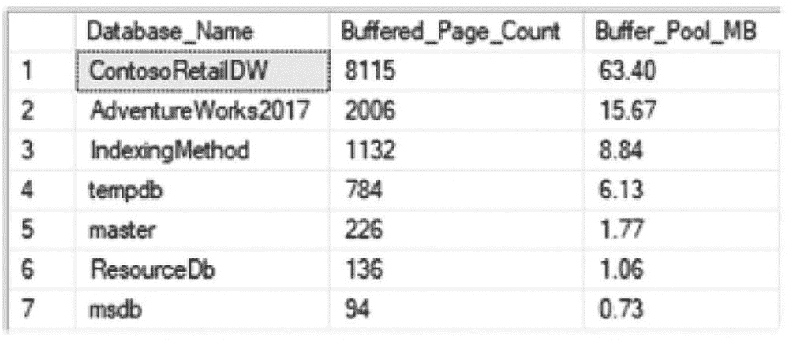
一个包含 3 列 7 行的表格截图。列标题为数据库名称、缓冲页面计数和缓冲池 M B。Contoso 零售 D W 的数据为 8115 和 63.40。

图 16-13
每个数据库查询的缓冲区分配结果

```sql
SELECT LEFT(CASE database_id
WHEN 32767 THEN 'ResourceDb'
ELSE DB_NAME(database_id) END, 20) AS Database_Name,
COUNT(*) AS Buffered_Page_Count,
CAST(COUNT(*) * 8 / 1024.0 AS NUMERIC(10, 2)) AS Buffer_Pool_MB
FROM sys.dm_os_buffer_descriptors
GROUP BY DB_NAME(database_id),
database_id
ORDER BY Buffered_Page_Count DESC;
```
清单 16-33
每个数据库的缓冲区分配

一旦确定了内存中的数据库，确定数据库中的哪些对象在内存中也是有用的。与查看哪些数据库在内存中的原因相同，识别内存中的对象有助于确定在建立索引时需要重点关注的表和索引。检索每个表和索引的内存使用情况同样使用 `sys.dm_os_buffer_descriptors`，但需要将行映射到目录视图 `sys.allocation_units` 和 `sys.partitions` 中的 `allocation_unit_id` 值。

通过清单 16-34 中的查询，可以返回每个用户表和索引使用的内存量。在图 16-14 的结果中，显示表 FactSales 和 FactOnlineSales 占用了大量的内存。如果这出乎意料并且这些事实表并不明显，我们肯定想了解更多为什么它们占用如此多内存的原因。这可以引出其他问题，例如：这些数据是什么？为什么它如此之大？该表占用的空间是否影响了其他数据库使用其索引最佳利用内存的能力？在这些情况下，我们需要调查这些表上的索引，因为消耗内存最多的表应该拥有最优化的索引配置。

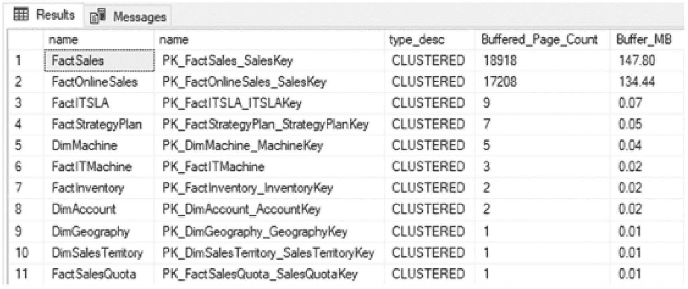
一个包含 11 行 5 列的表格，列在结果选项卡下。列标题为名称、名称、类型描述、缓冲页面计数和缓冲 M B。fact sales 的缓冲页面计数和缓冲 M B 分别为 18918 和 147.80。

图 16-14
每个表/索引查询的缓冲区分配结果

```sql
WITH BufferAllocation
AS (SELECT object_id,
index_id,
allocation_unit_id
FROM sys.allocation_units AS au
INNER JOIN sys.partitions AS p ON au.container_id = p.hobt_id
AND (au.type = 1 OR au.type = 3)
UNION ALL
SELECT object_id,
index_id,
allocation_unit_id
FROM sys.allocation_units AS au
INNER JOIN sys.partitions AS p ON au.container_id = p.hobt_id
AND au.type = 2)
SELECT t.name,
we.name,
we.type_desc,
COUNT(*) AS Buffered_Page_Count,
CAST(COUNT(*) * 8 / 1024.0 AS NUMERIC(10, 2)) AS Buffer_MB
FROM sys.tables t
INNER JOIN BufferAllocation ba ON t.object_id = ba.object_id
LEFT JOIN sys.indexes we ON ba.object_id = we.object_id
AND ba.index_id = we.index_id
INNER JOIN sys.dm_os_buffer_descriptors bd ON ba.allocation_unit_id = bd.allocation_unit_id
WHERE bd.database_id = DB_ID()
GROUP BY t.name,
we.index_id,
we.name,
we.type_desc
ORDER BY Buffered_Page_Count DESC;
```
清单 16-34
按表/索引的缓冲区分配

## 模式发现

在调查了服务器状态及其索引需求之后，索引分析过程的下一步是研究数据库的模式，以确定是否存在可以解决的与模式相关的索引问题。对于这些问题，主要关注点将放在可以通过目录视图发现的一些关键细节上。


### 模式问题：堆表与重复索引

#### 识别堆表

通常，在表上使用聚集索引比将表存储为堆表更为理想。当堆表更可取时，应是在已证明使用聚集索引会对性能产生负面影响，而非堆表的情况下。调查堆表时，最好考虑行数以及堆表的利用率。当堆表的行数很少或未被使用时，费心为其表创建聚集索引可能对性能影响甚微或毫无影响。

要识别堆表，请使用目录视图 `sys.indexes` 和 `sys.partitions`。性能信息可在表 `dbo.index_usage_stats_history` 中获得。可以结合使用来形成清单 16-35 中的查询，其输出如图 16-15 所示。

结果显示 `dbo.DatabaseLog` 有很多行。下一步是审查该表的模式。如果表上已存在主键，那它就是聚集索引键的良好候选。如果没有，则检查其他键列，例如业务键。如果没有键列，可能值得向表中添加一个代理键。

```sql
SELECT QUOTENAME(DB_NAME()) AS database_name,
QUOTENAME(OBJECT_SCHEMA_NAME(we.object_id)) + '.' + QUOTENAME(OBJECT_NAME(we.object_id)) AS object_name,
we.index_id,
p.rows,
SUM(h.user_seeks) AS user_seeks,
SUM(h.user_scans) AS user_scans,
SUM(h.user_lookups) AS user_lookups,
SUM(h.user_updates) AS user_updates
FROM sys.indexes we
INNER JOIN sys.partitions p ON we.index_id = p.index_id
AND we.object_id = p.object_id
LEFT OUTER JOIN IndexingMethod.dbo.index_usage_stats_history h ON p.object_id = h.object_id
AND p.index_id = h.index_id
WHERE type_desc = 'HEAP'
GROUP BY we.index_id,
p.rows,
we.object_id
ORDER BY p.rows DESC;
```
**清单 16-35**
识别堆表的查询

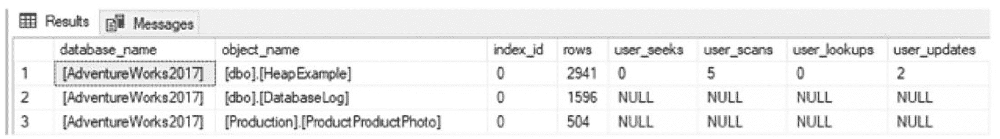
**图 16-15**
识别堆表查询的输出

#### 重复索引

下一个要审查的模式问题是重复索引。除了极少数边缘情况外，数据库中无需存在重复索引。它们浪费空间并消耗资源进行维护，却未提供任何好处。要确定一个索引是否是另一个的重复项，请审查索引的键列和包含列。如果这些值匹配，则认为该索引是重复的。

要找出重复索引，需结合使用 `sys.indexes` 视图和 `sys.index_columns` 目录视图。使用清单 16-36 中的代码将这些视图相互比较，将提供重复索引的列表。查询结果如图 16-16 所示，显示在 `AdventureWorks2017` 数据库中，索引 `AK_Document_rowguid` 和 `UQ__Document__F73921F7C5112C2E` 是重复的。

发现重复项后，应从数据库中移除两个索引中的一个。虽然其中一个索引会有索引活动，但移除任一索引都会将活动从一个转移到另一个。在移除任一索引前，请审查索引的非列属性，以确保不会丢失索引的重要方面。例如，如果其中一个索引被指定为唯一，请确保保留的索引仍具有该属性。

```sql
USE AdventureWorks2017;
GO
WITH IndexSchema
AS (SELECT we.object_id,
we.index_id,
we.name,
ISNULL(we.filter_definition, '') AS filter_definition,
we.is_unique,
(
SELECT QUOTENAME(CAST(ic.column_id AS VARCHAR(10)) + CASE
WHEN ic.is_descending_key = 1 THEN '-'
ELSE '+' END,
'('
)
FROM sys.index_columns ic
INNER JOIN sys.columns c ON ic.object_id = c.object_id
AND ic.column_id = c.column_id
WHERE we.object_id = ic.object_id
AND we.index_id = ic.index_id
AND is_included_column = 0
ORDER BY key_ordinal ASC
FOR XML PATH('')
) + COALESCE((
SELECT QUOTENAME(CAST(ic.column_id AS VARCHAR(10)) + CASE
WHEN ic.is_descending_key = 1 THEN '-'
ELSE '+' END,
'('
)
FROM sys.index_columns ic
INNER JOIN sys.columns c ON ic.object_id = c.object_id
AND ic.column_id = c.column_id
LEFT OUTER JOIN sys.index_columns ic_key ON c.object_id = ic_key.object_id
AND c.column_id = ic_key.column_id
AND we.index_id = ic_key.index_id
AND ic_key.is_included_column = 0
WHERE we.object_id = ic.object_id
AND ic.index_id = 1
AND ic.is_included_column = 0
AND ic_key.index_id IS NULL
ORDER BY ic.key_ordinal ASC
FOR XML PATH('')
),
''
) + CASE
WHEN we.is_unique = 1 THEN 'U'
ELSE '' END AS index_columns_keys_ids,
CASE
WHEN we.index_id IN ( 0, 1 ) THEN 'ALL-COLUMNS'
ELSE COALESCE((
SELECT QUOTENAME(ic.column_id, '(')
FROM sys.index_columns ic
INNER JOIN sys.columns c ON ic.object_id = c.object_id
AND ic.column_id = c.column_id
LEFT OUTER JOIN sys.index_columns ic_key ON c.object_id = ic_key.object_id
AND c.column_id = ic_key.column_id
AND ic_key.index_id = 1
WHERE we.object_id = ic.object_id
AND we.index_id = ic.index_id
AND ic.is_included_column = 1
AND ic_key.index_id IS NULL
ORDER BY ic.key_ordinal ASC
FOR XML PATH('')
),
SPACE(0)
) END AS included_columns_ids
FROM sys.tables t
INNER JOIN sys.indexes we ON t.object_id = we.object_id
INNER JOIN sys.data_spaces ds ON we.data_space_id = ds.data_space_id
INNER JOIN sys.dm_db_partition_stats ps ON we.object_id = ps.object_id
AND we.index_id = ps.index_id)
SELECT QUOTENAME(DB_NAME()) AS database_name,
QUOTENAME(OBJECT_SCHEMA_NAME(is1.object_id)) + '.' + QUOTENAME(OBJECT_NAME(is1.object_id)) AS object_name,
is1.name AS index_name,
is2.name AS duplicate_index_name
FROM IndexSchema is1
INNER JOIN IndexSchema is2 ON is1.object_id = is2.object_id
AND is1.index_id <> is2.index_id
AND is1.index_columns_keys_ids = is2.index_columns_keys_ids
AND is1.included_columns_ids = is2.included_columns_ids
AND is1.filter_definition = is2.filter_definition
AND is1.is_unique = is2.is_unique;
```
**清单 16-36**
识别重复索引的查询

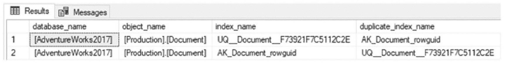
**图 16-16**
识别重复索引查询的输出

注意
重叠索引查询的最初灵感来自 Paul Nielsen 发布在 `http://sqlblog.com/blogs/paul_nielsen/archive/2008/06/25/find-duplicate-indexes.aspx` 的博客文章。


#### 重叠索引

在识别了重复索引之后，下一步是查找重叠索引。当一个索引的键列完全或部分构成了另一个索引的键列时，该索引就被认为是与另一个索引重叠。在检查列重叠时，不考虑包含列；此评估的重点仅在于键列。

要识别重叠索引，需要使用相同的目录视图 `sys.indexes` 和 `sys.index_columns`。对于每个索引，将使用 `LIKE` 运算符和通配符将其键列与表上其他索引的键列进行比较。当匹配时，它将被标记为重叠索引。此检查的查询如代码清单 16-37 所示，在 `AdventureWorks2017` 数据库上执行的结果如图 16-17 所示。

处理重叠索引的决策不如处理重复索引那样简单。为了帮助说明重叠索引，在 `DocumentNode` 列上创建了索引 `IX_SameAsPK`。这与用作 `Production.Document` 表聚簇索引键的列相同。然而，这个例子表明，非聚簇索引也可以被视为聚簇索引的重叠索引。在某些情况下，移除重叠的非聚簇索引可能是可取的。实际上，聚簇索引具有相同的键，并且页面以相同的方式排序。我们可以在两者中找到相同的值。当考虑聚簇索引中行的大小时，就出现了灰色地带。如果行足够宽，并且仅查询聚簇键，那么使用非聚簇索引有时会更有益。这样的话，就需要花费更多时间来分析索引，以确定重叠索引是否具有任何效用。同样的灰色地带也适用于两个非聚簇索引之间的比较。

在审查重叠索引时，还有几点需要注意。务必保留索引属性，例如索引是否唯一。同时，要密切关注包含列。包含列不参与重叠比较。两个索引之间可能存在唯一的包含列集。请注意这一点，并酌情合并包含列。同样，检查筛选器或其他索引属性，这些可能有助于理解特定索引存在的原因以及如何优化它们。

```sql
WITH IndexSchema
AS (SELECT we.object_id,
we.index_id,
we.name,
(
SELECT CASE key_ordinal
WHEN 0 THEN NULL
ELSE QUOTENAME(column_id, '(') END
FROM sys.index_columns ic
WHERE ic.object_id = we.object_id
AND ic.index_id = we.index_id
ORDER BY key_ordinal,
column_id
FOR XML PATH('')
) AS index_columns_keys
FROM sys.tables t
INNER JOIN sys.indexes we ON t.object_id = we.object_id
WHERE we.type_desc IN ( 'CLUSTERED', 'NONCLUSTERED', 'HEAP' ))
SELECT QUOTENAME(DB_NAME()) AS database_name,
QUOTENAME(OBJECT_SCHEMA_NAME(is1.object_id)) + '.' + QUOTENAME(OBJECT_NAME(is1.object_id)) AS object_name,
STUFF((
SELECT ', ' + c.name
FROM sys.index_columns ic
INNER JOIN sys.columns c ON ic.object_id = c.object_id
AND ic.column_id = c.column_id
WHERE ic.object_id = is1.object_id
AND ic.index_id = is1.index_id
ORDER BY ic.key_ordinal,
ic.column_id
FOR XML PATH('')
),
1,
2,
''
) AS index_columns,
STUFF((
SELECT ', ' + c.name
FROM sys.index_columns ic
INNER JOIN sys.columns c ON ic.object_id = c.object_id
AND ic.column_id = c.column_id
WHERE ic.object_id = is1.object_id
AND ic.index_id = is1.index_id
AND ic.is_included_column = 1
ORDER BY ic.column_id
FOR XML PATH('')
),
1,
2,
''
) AS included_columns,
is1.name AS index_name,
SUM(CASE
WHEN is1.index_id = h.index_id THEN
ISNULL(h.user_seeks, 0) + ISNULL(h.user_scans, 0) + ISNULL(h.user_lookups, 0)
+ ISNULL(h.user_updates, 0) END
) index_activity,
is2.name AS duplicate_index_name,
SUM(CASE
WHEN is2.index_id = h.index_id THEN
ISNULL(h.user_seeks, 0) + ISNULL(h.user_scans, 0) + ISNULL(h.user_lookups, 0)
+ ISNULL(h.user_updates, 0) END
) duplicate_index_activity
FROM IndexSchema is1
INNER JOIN IndexSchema is2 ON is1.object_id = is2.object_id
AND is1.index_id > is2.index_id
AND (
is1.index_columns_keys LIKE is2.index_columns_keys + '%'
AND is2.index_columns_keys LIKE is2.index_columns_keys + '%'
)
LEFT OUTER JOIN IndexingMethod.dbo.index_usage_stats_history h ON is1.object_id = h.object_id
GROUP BY is1.object_id,
is1.name,
is2.name,
is1.index_id;
```
代码清单 16-37
识别重叠索引的查询

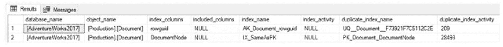
页面在结果选项卡下显示一个表格。列标题为数据库名称、对象名称、索引列、包含列、索引名称、索引活动、重复索引名称和重复索引活动。
图 16-17
识别重叠索引的查询输出

#### 未索引的外键

外键对于在数据库中实施约束非常有用。当表之间存在父子关系时，外键提供了一种机制，用于验证子表没有引用不存在的父值。同样，外键确保父值在子值仍在使用时不能被移除（假设没有 `ON DELETE` 属性）。为了支持这些验证，表之间父值和子值的列需要建立索引。如果其中一方未被索引，SQL Server 就无法通过 Seek 操作来优化该操作，而被迫使用 Scan 操作来验证值是否存在于相关表中。类似地，如果删除了父行，则需要检查子表中的所有行，以确定是否有行依赖于该值。

验证外键是否被索引涉及一个与重复索引和重叠索引类似的过程。除了 `sys.indexes` 和 `sys.index_columns` 目录视图外，还使用 `sys.foreign_key_columns` 视图来提供外键将依赖的索引模板。这些信息在代码清单 16-38 的查询中汇集在一起，在 `AdventureWorks2017` 数据库上的结果如图 16-18 所示。

常见的最佳实践是，每个外键都应该被索引。然而，并非每个外键都总是如此。在添加索引之前需要考虑几点。首先，子表中有多少行？如果行数较少，添加索引可能不会带来性能提升。如果列的唯一性相当低，统计信息可能证明扫描每一行是合理的，而不管索引如何。在这些情况下，可以认为如果表的大小很小，索引的成本也很小，添加索引没有什么损失。另一个考虑因素是是否会从表中删除数据，以及需要验证外键的活动何时会发生。对于具有大量列和外键的大表，性能可能会因为需要在表上维护又一个索引而受到影响。这个索引可能很有价值，但它是否足够有价值来证明创建它是合理的？

虽然这些是为外键创建索引时的良好考虑因素，但在大多数情况下，我们默认会希望为外键创建索引。类似于对聚簇表的建议，为外键创建索引，除非我们有性能文档表明为外键创建索引会对性能产生负面影响。

#### 清单 16-38
用于识别未索引外键的查询

```sql
WITH cIndexes
AS (SELECT we.object_id,
we.name,
(
SELECT QUOTENAME(ic.column_id, '(')
FROM sys.index_columns ic
WHERE we.object_id = ic.object_id
AND we.index_id = ic.index_id
AND is_included_column = 0
ORDER BY key_ordinal ASC
FOR XML PATH('')
) AS indexed_compare
FROM sys.indexes we),
cForeignKeys
AS (SELECT fk.name AS foreign_key_name,
'PARENT' AS foreign_key_type,
fkc.parent_object_id AS object_id,
STUFF((
SELECT ', ' + QUOTENAME(c.name)
FROM sys.foreign_key_columns ifkc
INNER JOIN sys.columns c ON ifkc.parent_object_id = c.object_id
AND ifkc.parent_column_id = c.column_id
WHERE fk.object_id = ifkc.constraint_object_id
ORDER BY ifkc.constraint_column_id
FOR XML PATH('')
),
1,
2,
''
) AS fk_columns,
(
SELECT QUOTENAME(ifkc.parent_column_id, '(')
FROM sys.foreign_key_columns ifkc
WHERE fk.object_id = ifkc.constraint_object_id
ORDER BY ifkc.constraint_column_id
FOR XML PATH('')
) AS fk_columns_compare
FROM sys.foreign_keys fk
INNER JOIN sys.foreign_key_columns fkc ON fk.object_id = fkc.constraint_object_id
WHERE fkc.constraint_column_id = 1),
cRowCount
AS (SELECT object_id,
SUM(row_count) AS row_count
FROM sys.dm_db_partition_stats ps
WHERE index_id IN ( 1, 0 )
GROUP BY object_id)
SELECT QUOTENAME(DB_NAME()),
QUOTENAME(OBJECT_SCHEMA_NAME(fk.object_id)) + '.' + QUOTENAME(OBJECT_NAME(fk.object_id)) AS ObjectName,
fk.foreign_key_name,
fk_columns,
row_count
FROM cForeignKeys fk
INNER JOIN cRowCount rc ON fk.object_id = rc.object_id
LEFT OUTER JOIN cIndexes we ON fk.object_id = we.object_id
AND we.indexed_compare LIKE fk.fk_columns_compare + '%'
WHERE we.name IS NULL
ORDER BY row_count DESC,
OBJECT_NAME(fk.object_id),
fk.fk_columns;
```

#### 图 16-18
用于识别缺失外键索引的查询输出

结果选项卡下呈现一个表格页面。列标题依次为：无列名、对象名称、外键名称、外键列和行数。“无列名”下的 `adventure works 2017` 被选中。

### 未压缩的索引

正如本章前文及本书其他部分所讨论的，通常对索引应用某种程度的压缩是有益的。使用行压缩时，索引通常将定长数据存储为变长数据；而页面压缩则会检查数据并减少重复以进行进一步压缩。在许多情况下，通过压缩可以将数据库大小减少到当前大小的 25%–75%。这种缩减提高了 SQL Server 通过 CPU 可处理的数据量。通常，压缩数据所带来的额外 CPU 成本，远低于处理未压缩数据量所节省的 CPU 开销。

在检查数据库中是否存在未压缩的索引时，清单 16-39 中的查询会为每个数据库提供一份列表，包含每个索引的文件组、分区边界、行数和大小。这些信息特别有用，因为它有助于识别最大的索引，而在这些索引上应用压缩可能带来最显著的收益。请审阅该列表并确定哪些索引值得考虑进行压缩，同时请牢记是否存在诸如 `varchar(max)` 之类的数据类型，它们压缩效果不佳，并可能导致压缩失败，正如本章前面所讨论的。

#### 清单 16-39
用于识别未压缩索引的查询

```sql
WITH partitioning
AS (SELECT dds.data_space_id,
dds.partition_scheme_id,
ds.name,
dds.destination_id AS partition_number,
CASE
WHEN prv.value IS NOT NULL THEN
CONCAT(
IIF(pf.boundary_value_on_right = 1, '小于 ', '大于或等于 '),
CAST(prv.value AS VARCHAR(MAX))
)
WHEN pf.boundary_value_on_right = 1 THEN '大于 MAX 边界'
ELSE '小于 MIN 边界' END AS Boundary
FROM sys.destination_data_spaces AS dds
INNER JOIN sys.partition_schemes AS ps ON ps.data_space_id = dds.partition_scheme_id
INNER JOIN sys.partition_functions AS pf ON pf.function_id = ps.function_id
INNER JOIN sys.data_spaces AS ds ON dds.data_space_id = ds.data_space_id
LEFT OUTER JOIN sys.partition_range_values AS prv ON pf.function_id = prv.function_id
AND prv.boundary_id = dds.destination_id)
SELECT S.name AS schema_name,
T.name AS table_name,
I.name AS index_name,
I.index_id,
P.partition_number,
P.data_compression_desc,
I.type_desc,
IIF(DS.type_desc = 'PARTITION_SCHEME', PS.name, DS.name) AS file_group,
PS.Boundary AS partition_boundary,
DS.type_desc AS data_space_type,
P.rows,
CAST(dps.reserved_page_count * CAST(8 AS FLOAT) / 1024. AS DECIMAL(20, 3)) AS mb_size
FROM sys.tables AS T
INNER JOIN sys.schemas AS S ON S.schema_id = T.schema_id
INNER JOIN sys.indexes AS I ON T.object_id = I.object_id
INNER JOIN sys.partitions AS P ON I.object_id = P.object_id
AND I.index_id = P.index_id
INNER JOIN sys.dm_db_partition_stats AS dps ON P.object_id = dps.object_id
AND P.index_id = dps.index_id
AND P.partition_number = dps.partition_number
LEFT OUTER JOIN partitioning AS PS ON I.data_space_id = PS.partition_scheme_id
AND P.partition_number = PS.partition_number
INNER JOIN sys.data_spaces AS DS ON DS.data_space_id = I.data_space_id
WHERE P.data_compression_desc = 'NONE';
GO
```

### 注意

数据库引擎优化顾问（DTA）是一个用于确定可添加到数据库的有用索引的好工具。虽然手动为数据库设计索引可能更有成就感，但忽略有用的建议并不可取。应将 DTA 作为一个起点，用以发现那些若没有该工具可能需要花费数小时才能确定的索引建议。


## 数据库引擎调优顾问

数据库引擎调优顾问（`DTA`）已在第 9 章中讨论。在那一章里，介绍了使用`DTA`的两种模式：图形界面（GUI）和命令行实用工具。虽然调整查询通常是一个查看统计信息和评估执行计划的过程，但`DTA`提供了一种加速此分析的方法，它利用前一章监控过程中的跟踪文件来识别潜在有用的索引建议。此过程能在对生产环境影响最小的情况下完成调优，因为所有建议都源自非生产环境的分析。

使用`DTA`索引分析的基本过程可以分解为五个不同的步骤，如图 16-19 所示：

1.  收集工作负载。
2.  收集元数据。
3.  执行调优。
4.  考虑建议并进行审查。
5.  部署变更。

通过这个过程，我们可以在索引方面抢占先机，并着手处理与现有性能问题相关的建议。

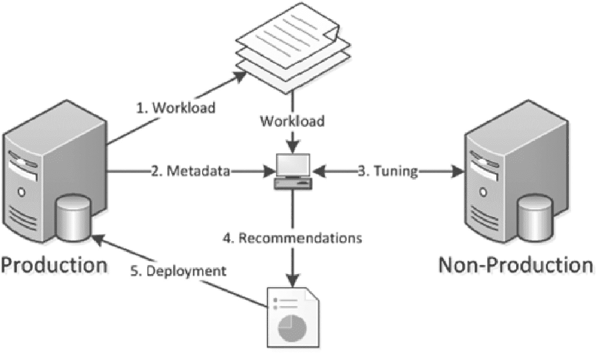

一个流程图定义了来自生产环境的工作负载、元数据和调优通过数据库发送到非生产环境。建议和部署则从数据库发送到生产环境。
图 16-19
使用`DTA`索引分析的步骤

该过程的第一步是收集工作负载。如果我们遵循了前一章索引监控过程中的步骤，那么这些信息应该已经被收集了。工作负载应代表两种标准场景。首先，收集一个代表典型一天的工作负载，因为即使是正常的一天也可能存在潜在的性能问题，调优可以帮助缓解这些问题。其次，收集已知存在性能问题时段的工作负载。这将有助于提供可能通过手动调优实现的建议。

收集工作负载后，下一步是收集必要的元数据以开始调优会话。收集元数据包括两个部分。第一部分是为`DTA`会话创建一个 XML 输入文件。XML 输入文件包含生产服务器和非生产服务器的名称，以及工作负载的位置和要使用的调优选项类型（清单 16-40 展示了一个示例）。有关调优选项的更多信息，请参见第 9 章。此步骤的第二部分是对调优的影响，源自第一部分。当调优发生时，SQL Server 将从生产数据库收集架构和统计信息，并将这些信息移动到非生产服务器。虽然数据库不会有生产数据，但它将拥有做出索引建议所需的信息。

```
STR8-SQL-PRD
AdventureWorks2017
c:\temp\IndexingMethod.trc
STR8-SQL-TEST 
IDX
NONE
NONE
```
清单 16-40
`DTA`的 XML 输入文件示例

注意：我们可以在 SQL Server 联机丛书中找到有关 XML 输入文件配置的更多信息，网址为[`https://learn.microsoft.com/en-us/sql/tools/dta/simple-xml-input-file-sample-dta?view=sql-server-ver16`](https://learn.microsoft.com/en-us/sql/tools/dta/simple-xml-input-file-sample-dta%253Fview%253Dsql-server-ver16)。

下一步是实际执行`DTA`调优会话。要运行会话，请使用`-ix`命令行选项执行`DTA`命令，如清单 16-41 所示。由于会话的所有配置信息都位于 XML 文件中，因此无需添加任何额外参数。

```
dta -ix "c:\temp\SessionConfig.xml"
```
清单 16-41
带有 XML 输入文件的`DTA`命令

调优会话完成后，将会收到一个索引建议列表。这并不是此部分流程的最后一步。在实施`DTA`的任何建议之前，必须对其进行审查。虽然使用此工具将加速索引分析过程，但所有建议都需要经过审查和验证，以确保其合理，并且不会使表上的索引超出 SQL Server 对该工作负载的支持能力。

最后一步是部署索引建议。此步骤从技术上讲超出了索引方法当前阶段的范围。不过，此时我们应该熟悉将要实施的索引变更。将这些变更添加到来自其他分析的现有索引变更列表中，并为实施做好准备，这将在下一章中讨论。


## 未使用的索引

在索引分析过程中，一个必要且可能危险的步骤是确定要删除哪些索引。有些索引会因整合或重复而被移除。通常，这类操作的风险低于直接删除索引。另一类索引则是那些未被使用的索引。

识别未使用索引的最简单方法是，将每个数据库中的索引列表与`IndexingMethod`数据库中的`dbo.index_usage_stats_history`表进行核对。如果数据库中存在任何未使用的索引，清单 16-42 中的查询将会识别出它们。关于未使用索引需要提醒一点：在此分析中，堆表、聚集索引以及任何唯一索引和主键都会被忽略。具有这些属性的索引通常与其他业务规则相关，其删除应基于其他因素考虑。图 16-20 展示了`AdventureWorks2017`数据库中的一个未使用索引示例。

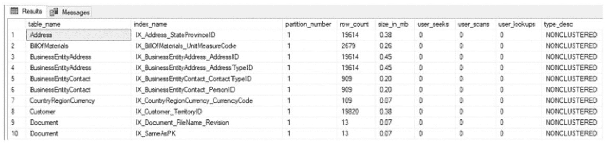

图 16-20: 识别缺失外键索引的查询输出结果

```sql
SELECT OBJECT_NAME(we.object_id) AS table_name,
       COALESCE(we.name, SPACE(0)) AS index_name,
       ps.partition_number,
       ps.row_count,
       CAST((ps.reserved_page_count * 8) / 1024\. AS DECIMAL(12, 2)) AS size_in_mb,
       COALESCE(ius.user_seeks, 0) AS user_seeks,
       COALESCE(ius.user_scans, 0) AS user_scans,
       COALESCE(ius.user_lookups, 0) AS user_lookups,
       we.type_desc
FROM sys.all_objects t
INNER JOIN sys.indexes we ON t.object_id = we.object_id
INNER JOIN sys.dm_db_partition_stats ps ON we.object_id = ps.object_id
                                       AND we.index_id = ps.index_id
LEFT OUTER JOIN sys.dm_db_index_usage_stats ius ON ius.database_id = DB_ID()
                                               AND we.object_id = ius.object_id
                                               AND we.index_id = ius.index_id
WHERE we.type_desc NOT IN ( 'HEAP', 'CLUSTERED' )
  AND we.is_unique = 0
  AND we.is_primary_key = 0
  AND we.is_unique_constraint = 0
  AND COALESCE(ius.user_seeks, 0) <= 0
  AND COALESCE(ius.user_scans, 0) <= 0
  AND COALESCE(ius.user_lookups, 0) <= 0
ORDER BY OBJECT_NAME(we.object_id),
         we.name;
```
清单 16-42: 查询未使用索引

尽管本节未作讨论，但还有两种识别未使用索引的额外情况。它们是极少使用的索引和不再使用的索引。对于这些情况，可以采用类似流程：不是查找从未使用过的索引，而是筛选出使用率低的索引，或者在数周或数月内未使用的索引。但在没有进一步研究和考虑的情况下，不要自动删除这些索引。如果索引使用频率很低，在删除前请核实其使用方式。它可能每天只使用一次，但那一次使用可能与关键流程相关。此外，对于未使用的索引，请核实该索引是否属于季节性流程的一部分。删除与季节性活动相关的索引，在非高峰期可能比维护它们带来更大负担。例如，一份庞大或复杂的月度报告可能依赖某个索引才能在合理时间内完成，或使用可接受的计算资源（或两者兼有）。

## 索引的计划使用情况

本章前面几节讨论了检查计划缓存以分析和调查索引使用情况的概念。虽然统计信息可以显示是否有对索引的查找或扫描操作，但它并未提供足够细节来指示应添加哪些列，或是什么原因导致索引使用扫描而非查找。要收集这些信息，需要查阅执行计划。而数据库执行计划所在的位置就是计划缓存。在本节中，针对索引分析，我们将回顾两个可用于从计划缓存中检索执行计划的查询。

第一个查询用于需要检索特定索引的所有相关计划的情况。假设我们需要确定哪些流程或 T-SQL 语句正在使用某个表上的某个索引，而该索引每天只使用一两次。为此，我们可以使用清单 16-43 中的查询访问计划缓存，检查该查询的计划是否仍在缓存中。使用该查询时，将变量`@IndexName`中的索引名称替换掉，然后执行它以返回使用该索引的计划列表。请注意，如果数据库中有许多同名索引（因为索引名称只需在表内唯一），则需谨慎处理。如果所有索引都命名为`IX_1`和`IX_2`，我们将在搜索中验证表名，以确保识别出正确的索引。

```sql
SET TRANSACTION ISOLATION LEVEL READ UNCOMMITTED;
GO
DECLARE @IndexName sysname = 'PK_SalesOrderHeader_SalesOrderID';
SET @IndexName = QUOTENAME(@IndexName, '[');
WITH XMLNAMESPACES (
    DEFAULT 'http://schemas.microsoft.com/sqlserver/2004/07/showplan'
)
, IndexSearch
AS (SELECT qp.query_plan,
           cp.usecounts,
           ix.query('.') AS StmtSimple
    FROM sys.dm_exec_cached_plans cp
        OUTER APPLY sys.dm_exec_query_plan(cp.plan_handle) qp
        CROSS APPLY qp.query_plan.nodes('//StmtSimple') AS p(ix)
    WHERE query_plan.exist('//Object[@Index = sql:variable ("@IndexName")]') = 1)
SELECT StmtSimple.value('StmtSimple[1]/@StatementText', 'VARCHAR(4000)') AS sql_text,
       obj.value('@Database', 'sysname') AS database_name,
       obj.value('@Schema', 'sysname') AS schema_name,
       obj.value('@Table', 'sysname') AS table_name,
       obj.value('@Index', 'sysname') AS index_name,
       ixs.query_plan
FROM IndexSearch ixs
    CROSS APPLY StmtSimple.nodes('//Object') AS o(obj)
WHERE obj.exist('//Object[@Index = sql:variable("@IndexName")]') = 1;
```
清单 16-43: 查询计划缓存中的索引使用情况

其他时候，仅按索引名称搜索计划缓存范围可能太广。在这些情况下，可以使用清单 16-44 中的查询。该查询在计划缓存搜索中添加了物理运算符名称。例如，假设我们正在调查`Full Scans/sec`，并且我们知道是哪个索引导致了性能计数器的峰值。仅搜索索引可能返回数十个执行计划。或者，我们可以添加对特定运算符（如索引扫描）的搜索，使用提供的查询中的`@op`变量。

```sql
DECLARE @IndexName sysname = 'IX_SalesOrderHeader_SalesPersonID';
DECLARE @op sysname = 'Index Scan';
;WITH XMLNAMESPACES (
    DEFAULT N'http://schemas.microsoft.com/sqlserver/2004/07/showplan'
)
SELECT cp.plan_handle,
       DB_NAME(dbid) + '.' + OBJECT_SCHEMA_NAME(objectid, dbid) + '.' + OBJECT_NAME(objectid, dbid) AS database_object,
       qp.query_plan,
       c1.value('@PhysicalOp', 'nvarchar(50)'),
       c2.value('@Index', 'nvarchar(max)')
FROM sys.dm_exec_cached_plans cp
    CROSS APPLY sys.dm_exec_query_plan(cp.plan_handle) qp
    CROSS APPLY query_plan.nodes('//RelOp') r(c1)
    OUTER APPLY c1.nodes('IndexScan/Object') AS o(c2)
WHERE c2.value('@Index', 'nvarchar(max)') = QUOTENAME(@IndexName, '[')
  AND c1.exist('@PhysicalOp[. = sql:variable("@op")]') = 1;
```
清单 16-44: 查询计划缓存中的索引使用情况和物理操作

这两个查询都提供了机制，用于调查其环境中的索引，并查看 SQL Server 具体如何使用它们。这些信息可以轻松地用于识别问题何时发生及原因，从而为解决索引问题提供途径，而无需像现在许多人所做的那样进行大量猜测。


## 总结

正如本章所示，从监控索引收集的信息可用于分析索引并识别哪些需要进一步研究。此分析的结果有助于确定要修改的索引类型及位置。诸如数据库引擎优化顾问 (`Database Engine Tuning Advisor`) 和缺失索引 `DMO` 之类的索引工具可用于发现“低垂的果实”，为分析提供一个可能无法以其他方式发现的起点。遵循本章概述的索引分析流程，我们可以构建一个稳定、可重复的索引流程，有助于提高数据库平台的性能并随时间推移实现稳定的性能。

如果本章中多种类型的分析都推荐了特定的索引更改，请优先考虑这些更改，因为它们更有可能带来益处并对性能产生更大的积极影响。

