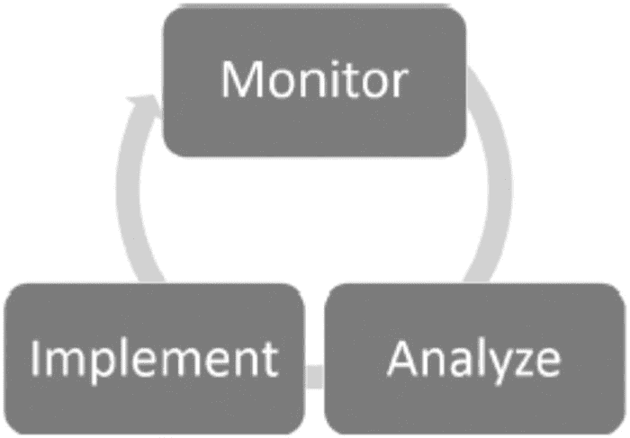

# 17. 索引方法学

在本书中，我们讨论了索引是什么、它们的作用、构建它们的模式，以及确定 `SQL Server` 数据库应如何构建索引的许多其他方面。所有这些信息都是数据库索引最后一块拼图所必需的，即管理索引的方法学。为此，需要一个流程来应用这些知识，以确定最适合某个环境并能带来最大性能提升的索引。

在这最后一章中，将讨论一种可用于构建索引方法学的通用实践。将提供管理索引所需的步骤列表。此方法学可应用于单个数据库、服务器或整个 `SQL Server` 环境。无论数据库支持的操作或业务类型如何，都可以使用相同的索引构建方法学。

## 索引方法

在开始创建和删除索引之前，首先需要一个流程来分析当前和潜在的索引。此流程需要提供一种方式来观察您的数据库并确定适合它们的索引。正如前几章所提到的，索引应该更像科学而非艺术。正确索引数据库所需的信息是可用的；通过一些研究，可以识别出潜在的索引。类似于科学家使用科学方法来证明理论，数据库管理员和开发人员可以使用索引方法 (`Indexing Method`) 来证明数据库需要哪些索引。

本书中使用的索引方法 (`Indexing Method`) 由三个阶段组成：监控 (`Monitor`)、分析 (`Analyze`) 和实施 (`Implement`)（参见图 17-1）。在每个组成部分中都有若干步骤，完成后有助于为数据库提供适当的索引。在实施 (`Implement`) 阶段完成后，索引方法 (`Indexing Method`) 重新启动第一阶段，使索引成为一个持续的迭代过程。

从监控 (`Monitor`) 阶段开始，主要活动是观察索引。观察包括审查索引的性能和行为（即第 15 章描述的索引概念）。`SQL Server` 将使用它认为最有益的可用索引。通过观察这种行为，您可以识别最常使用的索引以及它们是如何使用的。

图 17-1 索引生命周期

观察之后，索引方法 (`Indexing Method`) 的分析 (`Analyze`) 阶段开始。在分析 (`Analyze`) 阶段（第 16 章详述），上一阶段收集的统计数据用于确定哪些索引最适合数据库。目标是识别需要创建、删除和修改的索引。同时，任何索引更改的影响也将被识别出来。

索引方法 (`Indexing Method`) 的最后一个阶段是实施 (`Implementation`) 阶段。在此阶段，上一阶段确定的索引被应用（或部署）到数据库中。对于每个数据库和环境，部署过程可能不同。例如，在第三方数据库上部署索引的过程不同于您公司拥有的应用程序。然而，在此阶段，存在适用于所有环境的核心概念；除了实际构建索引之外，您还需要沟通变更计划及变更可能产生的影响。然后，您需要随时间跟踪变更。实施索引不仅仅是执行一个 `CREATE INDEX` 语句。

最后一个阶段完成后，索引方法 (`Indexing Method`) 重新从第一阶段开始。这样，索引就是一个持续循环的过程。今天提供最佳性能的索引可能不是明天最理想的索引。主要有两个事件导致需要随时间更改索引。首先是数据使用，应用程序的功能和特性可能随时间变化，因此应用程序的用途也可能改变。其次，数据量和分布可能（并且通常会）随时间变化。随着这些变化，索引可能不再被使用，而其他数据访问路径可能成为必需。数据变化并不是导致索引使用变化的唯一原因；未来 `SQL Server` 版本或服务包中对查询优化器的更改也可能调整其使用索引的方式。

现在索引方法 (`Indexing Method`) 的基础知识已经介绍完毕，本章的剩余部分将重点关注实施 (`Implement`) 部分。监控 (`Monitor`) 和分析 (`Analyze`) 阶段的概念分别在第 15 章和第 16 章中介绍。重要的是，随着您对索引了解更多，将会发现可用于识别索引的新模式。随着您对索引和数据库的了解加深，您会找到其他查看性能和使用统计信息的方法，从而提供更多或更明智的指导。利用本书和您学到的信息，继续扩展您的索引方法学。

## 实施

索引方法 (`Indexing Method`) 的最后阶段是实施 (`Implement`) 阶段。此阶段顾名思义：它实施通过分析 (`Analyze`) 阶段确定的必要索引更改。虽然此阶段不太复杂，但在实施 (`Implement`) 阶段需要完成一些重要的步骤，这些步骤将有助于建立一个成功的流程。整个流程的目标是改善数据库环境的性能。基于此目标，在实施过程中需要考虑三个关键点：

*   沟通
*   源代码控制（例如，通过部署脚本）
*   执行

虽然只有最后一步会修改数据库，但其他两点有助于确保变更会被注意到，并且索引方法 (`Indexing Method`) 可以在未来继续使用。

## 沟通

在修改任何数据库上的索引时，首要障碍是需要与管理层和数据库用户沟通您打算更改数据库的意图。对数据库的修改常常会引发警觉，尤其是当这些修改是由数据库所支持的应用程序的所有者之外的人员提出时。在应用程序所有者、数据库管理团队与开发团队之间建立并保持开放的沟通渠道，不仅有助于索引处理过程，也对其他共同关注的领域有益。缺乏这种沟通，团队可能会对索引更改措手不及，而这些更改可能会影响到分析未发现的内容，或影响到已计划但尚未发布的功能。

就沟通而言，基本上有两项内容需要为数据库所有者准备好：索引更改的**影响分析**，以及更改实施后的**状态报告**。这类似于在设计、发布和测试新功能时所遵循的质量保证流程。

### 影响分析

在为数据库索引变更做准备时，强调其对应用程序性能的预期影响非常重要。从历史上看，这有时可能像是一场猜测游戏。当时并没有太多容易获取的信息能够表明索引在何处被使用、如何被使用以及使用频率。

借助`Monitor`阶段所阐述的流程，您能够自信地理解索引使用情况。您可以确定索引上次使用的时间以及包含了哪些操作。同时，也有信息可用于识别索引将不再被使用或使用频率正在增加的趋势。

通过`Analyze`阶段，已阐述了可用于识别使用不同索引的执行计划的步骤。请利用这些步骤来识别索引更改将产生影响的位置，然后在索引更改实施前后，对`T-SQL`语句进行样本执行。

最终，影响分析将对`Implement`阶段内的两个重要角色产生影响。首先，它会向管理者和同事传达索引更改的意图，告知他们所做的变更以供验证，并给予他们反馈的机会。其次，影响分析提供了一份保险策略，以防索引更改产生意外的负面影响。这并不是说糟糕的索引建议就不会带来负面后果，但如果有其他人参与其中且影响被记录在案，则更有可能快速减轻负面影响，甚至可能在该影响在生产环境中显现之前就予以化解。

> 注意
>
> 在我工作过的一个环境中，一些使用频率较低的索引被从数据库中移除了。它们通常每天只被使用一次。但那唯一的一次使用，却是一个无法在没有这些索引的情况下执行的、对业务至关重要的导入过程。如果在移除这些索引之前进行了影响分析，许多棘手的问题本是可以避免的。

### 状态报告

在`Implement`阶段的另一端是状态报告。顾名思义，状态报告是一份向管理者和同事反馈索引实际影响的文档。这份文档无需非常详尽，但需要涵盖一些关键点。状态报告应包含以下信息：

*   所做的所有索引更改
*   变更部署的状态
*   简要的性能评估
*   关于注意到的任何性能回退的信息
*   在部署过程中获得的经验教训
*   遇到问题的摘要

撰写状态报告时，不要过于陷入细节。成功的索引部署将引导未来更多的`Monitor`和`Analyze`阶段。最终，状态报告需要传达两点。首先，它对索引部署的成功与失败提供了诚实的评估。其次，也是最重要的，它列出了索引更改目前正在实现哪些收益。这一点最为重要，因为它是管理者需要看到的投资回报率（`ROI`），以此来证明在索引上投入的时间和精力是合理的。

> 注意
>
> 我作为顾问所做的最成功的事情之一，就是不断向客户更新我所做索引更改的影响。在我协助的一些团队看来，带有前后性能对比的图表常常像是“自我表扬”，但聘请我来的管理层却发现，这在识别聘请顾问的`ROI`，以及向上级沟通为解决业务性能问题所付出的努力方面，都极其有用。

## 部署脚本

`Analyze`阶段的主要可交付成果是为您环境中数据库规划的索引更改列表。在`Implement`阶段，需要对这些索引进行审查并为部署做准备。作为索引部署准备工作的一部分，需要完成三个步骤：

1.  准备模式的部署与回滚。
2.  将索引更改保存到源代码控制中。
3.  将同行评审结果连同影响分析一起分享。

### 准备模式的部署与回滚

通常，在`Analyze`阶段完成时，您将拥有提议的索引更改列表。该列表在阶段结束时通常还不能直接用于部署。从那时点到执行更改之间，需要将索引更改调整至可用于部署的状态。

在构建部署脚本时，请务必遵循“无害”（doing no harm）原则。换句话说，构建的脚本应该足够智能，能够多次执行并产生相同的结果。同时，这意味着应有可用的脚本来撤销任何已进行的索引更改。切勿假设表之前的索引状态已存储在源代码控制中。务必检查以确认现有状态是已知的，并开发脚本以便在需要时能回退到该状态。

部署脚本还需要考虑所使用的`SQL Server`版本。例如，如果您使用的是`Enterprise Edition`，对于需要以新特性重建的索引，请利用`在线索引重建`功能。如果索引适用，`Enterprise Edition`还允许对索引进行压缩，这在许多情况下可以节省空间并提升性能。

同样，请确保部署脚本的编写能最大限度地减少对生产系统的干扰。如果必须进行离线操作，请确保这些操作发生在受影响的应用程序可以接受这种干扰的时间段。对于会锁定表或导致阻塞的操作，也应考虑类似的指导原则。干扰较小的部署不仅对软件应用程序的影响更小，也更不可能对部署脚本所针对的数据库服务器造成运维问题。

#### 将索引更改保存到源代码存储库

表上索引的当前状态应存放在源代码存储库中。如果没有，那么在实施阶段的此次迭代中正是完成此项工作的绝佳机会。源代码存储库为数据库的代码或模式提供了一个存储位置，使组织能够确定索引、表或存储过程模式在特定日期和时间的状态。源代码通常从应用程序角度得到了良好管理。开发者通常会快速选择一种工具并将其用于自己的应用程序。

源代码存储库允许对数据库模式进行时间点恢复。如果组织内有任何开发团队，他们很可能已经有期望的存储库。这可能是一个内部存储库，如 `Perforce`，或是一个外部可用的解决方案，如 `GitHub`。

#### 具有影响分析的同行评审

在执行步骤之前要做的最后一件事是寻求对索引更改的同行评审。最糟糕的情况莫过于闭门造车，不理解针对使用数据库的应用程序所提出的更改的全部影响。很容易陷入只关注索引目标的隧道视野，而忽略了当前部署的业务目标，或者忽略了索引分析中不明显的东西。这种同行评审类似于软件开发团队使用的代码评审流程。如果您的团队已经有评审数据库脚本的同行评审流程，那么这一需求已经得到了满足。

避免这些陷阱的最佳方法是找一位同行来评审索引更改。将索引部署脚本和影响分析带给同行，并一起过一遍这些更改。您的同行不一定需要了解环境的所有细节，只需对索引有基本了解即可。同行评审的目的是解释每一项更改。在这种对话中，当您解释索引需求时，您的同行可以充当共鸣板。这起到了双重作用。首先，您的同行能够对索引更改提供反馈。其次，通过讨论这些更改，您可能会听到自己描述某个索引更改时，觉得解释起来并不正确。

在某些环境中，您可能没有可以求助来评审索引的同行。在这种情况下，可以考虑找您的经理进行同行评审。如果这也不可能，请与您的经理讨论利用您技术网络中的其他人。利用论坛和社交网络找到愿意与您一起评审更改的同行或同行小组。使用像 `Twitter` 这样的社交网络与技术同行联系并评审一些索引更改，远胜于根本没有同行评审。

同行评审完成后，索引就可以进入实施阶段的下一步：将索引应用到数据库的步骤。

注意

在 `SQL Server` 社区中，`Twitter` 是比较活跃的社交网络工具之一。使用标签 `#sql` 和 `#sqlserver` 可以查找关于 `SQL Server` 的常规信息。当寻找有关 `SQL Server` 的具体问题答案时，可以使用标签 `#sqlhelp`。`Twitter` 还允许您通过在推文中包含对方的 Twitter 句柄来将人员加入对话。例如，本书的作者可以通过 Twitter 句柄 `@stratesql` 和 `@edwardpollack` 联系到。

### 执行

实施阶段的最后部分是执行 `T-SQL` 脚本，这些脚本将把索引更改应用到数据库。这些脚本应该已经通过“部署脚本”步骤准备好，并且更改的范围也应通过“沟通”步骤被充分了解。因此，由于准备工作已经完成，“执行”步骤应该相对轻松。

从执行的角度来看，执行的方式完全取决于您组织的变更控制流程。在某些环境中，存在自动化流程，脚本可以加载到部署机制并按计划执行。在其他环境中，管理员只需打开 `SQL Server Management Studio` 并执行每个脚本，直到所有更改完成。无论采用何种机制，关键在于索引得到部署。

随着部署的进行，请务必记录所做的更改以及执行过程中出现的任何问题。注意数据库上意外的阻塞。如果索引是以离线状态部署的，请务必选择数据库维护窗口期间的执行时间窗口。请记住，即使是联机索引操作也可能导致短暂的阻塞。

## 重复

在本章开头，讨论从审视索引方法的三个阶段开始。该过程的示意图（图 17-1）显示了三个阶段形成一个循环，每个阶段导向下一个阶段。这种布局选择是故意的。索引不是一项固定于一点的活动。一旦索引方法的第一轮完成，开始下一轮索引工作就很重要了。

当数据库得到适当调优时，很容易让人想放松索引实践，转而关注其他优先事项。不幸的是，新功能添加到应用程序的频率，往往与新数据添加到数据库的频率一样高。这两类事件都会改变数据库使用索引的方式，以及当前“良好”索引状态的有效性。

为了维持数据库平台的期望性能，必须持续评审索引。这并不是说总是需要分配一个全职资源来监控、分析和实施索引。但是，必须承认，需要在某个时间间隔完成对索引状态的评估。

## 总结

正如本章所示，索引方法与科学方法非常相似。在数据库平台上，可以收集关于索引的统计信息，以识别可能存在索引问题的地方。然后，这些统计信息可进一步用于确定要修改的索引类型和位置。可以利用诸如 `Database Engine Tuning Advisor` 和缺失索引 `DMO` 之类的索引工具来发现“唾手可得的成果”，为分析提供一个可能原本无法找到的开端。通过遵循索引方法中列出的各个阶段，您可以构建一个稳定、可重复的索引流程，帮助提高数据库平台的性能，并随时间推移实现稳定的性能。

