# 索引变体

至此，你已经了解了 SQL Server 中可用的不同类型的索引。这些并不是定义索引的唯一方式。还有一些索引属性可用于创建先前讨论的索引类型的变体。实现这些变体有助于实施与数据相关的业务规则，并可以提高索引的性能。

## 主键

在图书馆的类比中，我提到了所有书籍都有杜威十进制分类号。这个唯一的数字标识了每本书及其在图书馆中的位置。类似地，可以定义表上的一个索引来唯一标识表中的记录。为此，索引被创建为**主键**。杜威十进制分类号和主键之间有一些差异，但从概念上讲，它们是相同的。

主键用于标识表中的记录。因此，表中不能有任何记录具有相同的主键值。通常，主键会在单个列上创建，但它也可以由多个列组成。

使用主键时还需要记住一些其他事项。首先，主键是标识表中每条记录的唯一值。因此，主键中的所有值都必须填充。主键中不允许有 null 值。此外，一个表上只能有一个主键。表中可能有其他标识信息，但只能将单个列或列集标识为主键。最后，虽然不是必需的，但主键通常建立在聚集索引上。默认情况下，主键将是聚集的，但可以覆盖此行为，并且如果已存在聚集索引，则此行为将被忽略。关于为何这样做的更多信息将包含在第 8 章中。

## 唯一索引

如前所述，可能有不止一个列或列集可用于唯一标识表中的记录。这类似于在图书馆中有不止一种方法可以唯一标识一本书。除了杜威十进制分类号，一本书还可以通过其 ISBN 来识别。在数据库中，这类信息可以用 **唯一索引** 来表示。

与主键类似，索引被约束为在索引中只出现一个值。唯一索引与之相似，它提供了一种机制来唯一标识表中的记录，并且也可以跨单个列或多个列创建。

主键和唯一索引之间的一个主要区别是当引入 null 值的可能性时的行为。唯一索引允许被索引的列中包含 null 值。null 值被视为一个离散值，在唯一索引的键列中只允许一种 null 值的组合。

### 包含列

假设你想找到 Douglas Adams 写的所有书，并了解每本书有多少页。你最初可能倾向于先在卡片目录中查找书籍，然后找到每本书并记下页数。这样做会相当耗时。如果你手头就有这些信息，而不是查找每本书，那将更好地利用你的时间。对于卡片目录，你实际上不需要为了页数而找到每本书，因为大多数卡片目录在索引卡上就包含了页数。在索引方面，通过 **包含列** 在索引列之外添加信息。

当构建非聚集索引时，有一个选项可以将包含列添加到索引中。这些列作为未排序的数据存储在索引中的已排序数据内。包含列不能包含已在索引的初始排序列列表中使用的任何列。

在查询方面，允许用户查找排序列之外的信息。如果查询所需的所有信息都在包含列中，则查询不需要访问表的堆或聚集索引来完成结果。与卡片目录示例类似，包含列可以显著提高查询性能。

## 分区索引

涵盖大量数据的书籍可能会相当大。如果你查看字典或莎士比亚全集，这些书通常很厚。书可以变得很大，以至于将它们包含在单个卷中是不切实际的。最好的例子是百科全书。

百科全书很少包含在一本书中。原因很简单——书的大小和装订的宽度将超出几乎任何人的处理能力。此外，在百科全书中查找所有以字母 *S* 开头的主题所需的时间大大减少，因为你可以直接找到 S 卷，而不必翻阅一本巨大的书来找到它们的起始位置。

这个问题不仅限于书籍。表也存在类似的问题。表及其索引可能达到使其难以在合理时间内继续维护索引的程度。此外，如果表有数百万或数十亿行，能够扫描表的有限部分而不是整个表，可以提供显著的性能改进。为了解决表上的这个问题，索引能够被 **分区**。

**分区** 可以发生在聚集和非聚集索引上。它允许索引根据函数提供的值进行拆分。通过这样做，索引中的数据在物理上被分离到多个分区中，而索引本身仍然是一个逻辑对象。

## 筛选索引

默认情况下，非聚集索引为与其关联的表中的每一行包含一条记录。在大多数情况下，这是理想的，并为索引提供了协助列中任何值选择性的机会。

在某些非典型情况下，将表中的所有记录包含在索引中并不理想。例如，最常查询的值集可能只代表表中的少数行。在这种情况下，限制索引中的行数将减少查询需要执行的工作量，从而提高查询性能。另一种情况是，某个值的选择性相对于表中的行数较低。这可能是活动状态或已发货的布尔值；对这些值进行索引不会显著提高性能，但过滤到仅这些记录将为查询改进提供显著的机会。

为了协助这些场景，可以 **筛选** 非聚集索引以减少其包含的记录数。构建索引时，可以定义为基于一个简单的比较来包含或排除记录，从而减少索引的大小。

除了上述性能改进之外，使用筛选索引还有其他好处。第一个改进是降低了存储成本。由于筛选索引中的记录较少，因为过滤，索引中的数据会更少，这需要更少的存储空间。另一个好处是降低了维护成本。类似于存储成本的降低，由于需要维护的数据更少，因此维护索引所需的时间也更少。


## 压缩与索引

如今的图书馆收藏了大量的书籍。随着书籍数量的增加，会达到一个临界点，使得用现有的人员和资源管理图书馆变得越来越困难。因此，图书馆想出了多种方法来存储书籍或其中的信息，以便在不需要增加维护图书馆所需资源的情况下实现更好的管理。例如，书籍可以存储在缩微胶片上，或者仅通过电子方式提供。这样做的好处是减少了存储资料所需的空间，并让图书馆读者能够更快地查看更多书籍。

同样，当索引变得过大时，也会达到难以管理的程度。此外，访问记录所需的时间也可能增加到超出可接受的水平。SQL Server 中提供两种类型的压缩：行级压缩和页面级压缩。

使用 `行级压缩` 时，索引在行级别压缩每条记录。启用行级压缩后，会对每条记录进行多项更改。首先，行的元数据以替代格式存储，这减少了每列存储的信息量，但由于另一项更改，它实际上可能会增加开销的大小。对记录的主要更改包括：将数值数据从固定长度更改为可变长度，并且不存储固定长度字符串数据类型的末尾空白字符。另一项更改是，NULL 或零值不需要任何存储空间。

`页面级压缩` 类似于行级压缩，但它还包括跨一组行的压缩。启用页面级压缩后，会识别并压缩列中字符串值之间的相似性。这将在第 2 章中详细讨论。

无论是行级压缩还是页面级压缩，都需要考虑一些事项。首先，压缩记录需要额外的中央处理器 (CPU) 时间。虽然行将占用更少的空间，但在存储之前，CPU 是处理压缩任务所使用的主要资源。此外，根据表中索引的数据类型，压缩的效果会有所不同。

## 索引数据定义语言

与 SQL Server 中丰富多样的索引类型和变体类似，用于构建索引的数据定义语言 (DDL) 也非常丰富。在本节中，你将研究用于构建索引的 DDL。首先，你将查看 `CREATE` 语句及其选项，并将它们与本章前面讨论的概念配对。

为简洁起见，我不讨论索引 DDL 的向后兼容功能；你可以在 SQL Server 2012 的 SQL 文档中找到有关这些功能的信息。我将在后面的章节中进一步讨论 XML 和空间索引以及全文搜索。

#### 创建索引

在索引可以存在于你的数据库中之前，必须首先创建它。这是通过清单 1-1 所示的 `CREATE INDEX` 语法完成的。如语法所示，之前讨论的大多数索引类型和变体都可以通过基本语法使用。

```sql
CREATE [ UNIQUE ] [ CLUSTERED | NONCLUSTERED ] INDEX index_name
ON <object> ( column [ ASC | DESC ] [ ,...n ] )
[ INCLUDE ( column_name [ ,...n ] ) ]
[ WHERE <filter_predicate> ]
[ WITH ( <relational_index_option> [ ,...n ] ) ]
[ ON { partition_scheme_name ( column_name )
| filegroup_name
| default
}
]
[ FILESTREAM_ON { filestream_filegroup_name | partition_scheme_name | "NULL" } ]
[ ; ]
-- 清单 1-1
-- CREATE INDEX 语法
```

在 `CLUSTERED` 和 `NONCLUSTERED` 索引之间进行选择，决定了索引将构建为这两种基本类型中的哪一种。排除这两种类型中的任何一种都会将索引默认为非聚集索引。

索引的唯一性由 `UNIQUE` 关键字决定；将其包含在 `CREATE INDEX` 语法中将使索引具有唯一性。创建索引作为主键的语法将在本章后面介绍。

`<object>` 选项确定将在其上构建索引的基础对象。该语法允许在表或视图上创建索引。如果需要，对象的指定可以包括数据库名称和模式名称。

指定索引对象后，列出索引的排序列。这些列通常称为 *键列*。每列在索引中只能出现一次。默认情况下，列将在索引中按升序排序，但也可以指定降序排序。一个索引最多可以包含 32 列作为索引键的一部分，总大小不得超过 1,700 字节。在 SQL Server 2016 之前，是 16 列和 900 字节。

作为选项，可以在任何非聚集索引上指定 `included` 列，这些列在索引键列之后添加。由于 `included` 列不参与排序，因此没有升序或降序的选项。在键列和非键列之间，一个索引最多可以包含 1,023 列。键列的大小限制不影响 `included` 列。

如果索引将被筛选，则接下来指定此信息。通过 `WHERE` 子句向索引添加筛选条件。`WHERE` 子句可以使用以下任何比较运算符：`IS`、`IS NOT`、`=`、`<>`、`!=`、`>`、`>=`、`!>`、`<`、`<=` 和 `!<`。此外，筛选索引不能使用对 `computed` 列、用户定义类型 (`UDT`) 列、`spatial` 数据类型列或 `HierarchyID` 数据类型列的比较。

在创建索引时，可以使用多个选项。在清单 1-1 中，有一个用于添加索引选项的部分，由标签 `<relational_index_option>` 标出。这些索引选项既控制索引的创建方式，也控制它们在某些场景下的运行方式。清单 1-2 提供了 `CREATE INDEX` 的可用选项的 DDL。

```sql
PAD_INDEX = { ON | OFF }
| FILLFACTOR = fillfactor
| SORT_IN_TEMPDB = { ON | OFF }
| IGNORE_DUP_KEY = { ON | OFF }
| STATISTICS_NORECOMPUTE = { ON | OFF }
| STATISTICS_INCREMENTAL = { ON | OFF }
| DROP_EXISTING = { ON | OFF }
| ONLINE = { ON | OFF }
| RESUMABLE = { ON | OFF }
| MAX_DURATION = <time> [MINUTES]
| ALLOW_ROW_LOCKS = { ON | OFF }
| ALLOW_PAGE_LOCKS = { ON | OFF }
| MAXDOP = max_degree_of_parallelism
| DATA_COMPRESSION = { NONE | ROW | PAGE}
[ ON PARTITIONS ( { <partition_number> | <range> }
[ , ...n ] ) ]
-- 清单 1-2
-- CREATE INDEX 选项


# SQL Server 索引操作指南

每个选项都允许对索引创建过程进行不同级别的控制。表 1-1 列出了所有可用于 `CREATE INDEX` 的选项。在后面的章节中，我将讨论应用它们的示例和策略。你可以在 SQL Server 的 SQL 文档中找到有关 `CREATE INDEX` 语法及其使用示例的更多信息。

**表 1-1：CREATE INDEX 语法选项**

| 选项名称 | 描述 |
| --- | --- |
| `FILLFACTOR` | 定义索引创建时，其每个数据页中应保留的空白空间量。此选项仅在索引创建或重建时应用。 |
| `PAD_INDEX` | 指定是否应将索引的 `FILLFACTOR` 应用于索引的非叶数据页。当需要缓解导致过度非叶级页拆分的数据操作语言（DML）操作时，使用 `PAD_INDEX` 选项。 |
| `SORT_IN_TEMPDB` | 确定是否在 `tempdb` 数据库中存储构建索引时产生的临时结果。此选项会增加所需的空间量。 |
| `IGNORE_DUP_KEY` | 更改在向表中执行插入操作时遇到重复键时的行为。启用时，违反键约束的行将失败。当默认行为被禁用时，整个插入操作将失败。 |
| `STATISTICS_NORECOMPUTE` | 指定在创建索引时是否应重新创建与该索引相关的任何统计信息。 |
| `STATISTICS_INCREMENTAL` | 指定为索引收集的统计信息是应在整个索引上创建还是在每个分区上创建。 |
| `DROP_EXISTING` | 确定当表中已存在同名索引时的行为。默认情况下，当设置为 `OFF` 时，索引创建将失败。当设置为 `ON` 时，索引创建将覆盖现有索引。 |
| `ONLINE` | 确定在索引操作期间，表及其索引是否可用于查询和数据修改。启用时，锁定最小化，并且在索引创建期间主要持有意向共享锁。禁用时，锁定将在操作期间阻止对索引和基础表的数据修改。`ONLINE` 是仅适用于企业版的功能。 |
| `RESUMABLE` | 标识索引操作是否可恢复。SQL Server 2019 新增功能。 |
| `MAX_DURATION` | 确定可恢复索引操作在暂停前执行的最长时间（分钟）。SQL Server 2019 新增功能。 |
| `ALLOW_ROW_LOCKS` | 确定是否允许在索引上使用行锁。默认情况下，允许。 |
| `ALLOW_PAGE_LOCKS` | 确定是否允许在索引上使用页锁。默认情况下，允许。 |
| `MAXDOP` | 覆盖索引操作期间服务器级别的最大并行度设置。该设置决定了索引操作期间索引可以利用的最大处理器数量。 |
| `DATA_COMPRESSION` | 确定在索引上使用的数据压缩类型。默认情况下，不启用压缩。通过此选项，可以指定页面压缩和行压缩类型。 |

为了演示 `CREATE INDEX` 语法，让我们在 `AdventureWorks2017` 数据库的 `Sales.SalesOrderDetail` 表上构建一个索引。该索引的键列是 `ProductId`，并包含 `OrderQty` 和 `UnitPrice` 作为非键列。此外，该索引将使用 `PAGE` 压缩。清单 1-3 中的代码构建了这个索引。

```
USE AdventureWorks2017;
GO
CREATE INDEX IX_Sales_SalesOrderDetail_ProductId
ON Sales.SalesOrderDetail (ProductID)
INCLUDE (OrderQty, UnitPrice)
WITH (DATA_COMPRESSION = PAGE);
```
**清单 1-3：CREATE INDEX 示例**

## 修改索引

索引创建后，有时需要对其进行修改。修改现有索引的原因有几个。首先，作为持续索引维护的一部分，索引可能需要重建或重新组织。其次，一些索引选项（例如压缩类型）可能需要更改。在这些情况下，可以修改索引，并更改索引的选项。

要修改索引，你需要使用 `ALTER INDEX` 语法。清单 1-4 展示了修改索引的基本语法。

```
ALTER INDEX { index_name | ALL }
ON 
{ REBUILD
[ [PARTITION = ALL] [ WITH ( <rewsoptions> [ ,...n ] ) ]
| [ PARTITION = partition_number [ WITH ( <rowsoptions> [ ,...n ] ) ] ] ]
| DISABLE
| REORGANIZE
[ PARTITION = partition_number ]
[ WITH ( LOB_COMPACTION = { ON | OFF } ) ]
| SET ( <set_index_options> [ ,...n ] )
| RESUME [WITH (<resumable_index_options>[,...n])]
| PAUSE
| ABORT
} [ ; ]
```
**清单 1-4：ALTER INDEX 语法**

当使用 `ALTER INDEX` 语法进行索引维护时，语法中有两个选项可以使用。它们是 `REBUILD` 和 `REORGANIZE`。`REBUILD` 选项使用现有的索引结构和选项重新创建索引。它也可用于启用已禁用的索引。`REORGANIZE` 选项重新排序索引的叶级页。这类似于重新洗牌一副牌，使它们恢复顺序排列。这两个选项都将在第 6 章中更深入地讨论。

此外，`ALTER INDEX` 语法可用于禁用索引。这是通过 `ALTER INDEX` 语法下的 `DISABLE` 选项实现的。禁用的索引将不会被数据库引擎使用或提供。索引被禁用后，只能通过再次使用 `REBUILD` 选项修改索引来重新启用它。

除了这些功能外，许多通过 `CREATE INDEX` 语法可用的索引选项也可用于 `ALTER INDEX` 语法。`ALTER INDEX` 语法可用于修改索引的压缩。它还可用于更改填充因子或填充索引设置。根据索引不断变化的需求，可以使用此语法更改任何可用选项，尽管在选项的使用方式上存在一些限制。当你 `REBUILD ALL` 索引分区时，可以修改与 `CREATE INDEX` 语法相同的选项，如清单 1-5 所示。然而，当你 `REBUILD` 单个分区时，可用的选项列表会大大减少，如清单 1-6 所示。这是因为整个索引没有改变，只是分区，而不可用的选项适用于整个索引。

```
PAD_INDEX = { ON | OFF }
| FILLFACTOR = fillfactor
| SORT_IN_TEMPDB = { ON | OFF }
| IGNORE_DUP_KEY = { ON | OFF }
| STATISTICS_NORECOMPUTE = { ON | OFF }
| STATISTICS_INCREMENTAL = { ON | OFF }
| ONLINE = { ON [ ( <online_options> ) ] | OFF }
| RESUMABLE = { ON | OFF }
| MAX_DURATION = <time> [MINUTES}
| ALLOW_ROW_LOCKS = { ON | OFF }
| ALLOW_PAGE_LOCKS = { ON | OFF }
| MAXDOP = max_degree_of_parallelism
| DATA_COMPRESSION = { NONE | ROW | PAGE }
[ ON PARTITIONS ( { <partition_number> [ TO <partition_number> ] } [ , ...n ] ) ]
```
**清单 1-5：ALTER INDEX 重建选项**

```
SORT_IN_TEMPDB = { ON | OFF }
| MAXDOP = max_degree_of_parallelism
| RESUMABLE = { ON | OFF }
| MAX_DURATION = <time> [MINUTES}
| DATA_COMPRESSION = { NONE | ROW | PAGE } }
| ONLINE = { ON [ ( <online_options> ) ] | OFF }
```
**清单 1-6：ALTER INDEX 单分区重建选项**

对于 `REORGANIZE`，`ALTER INDEX` 的选项仅限于 `LOB_COMPACTION`，如清单 1-7 所示。当 `LOB_COMPACTION` 设置为 `ON` 时，重新组织将尝试压缩大型对象（LOB）页，从而减少和释放与这些页关联的索引中的空间。不激活此选项，重新组织将不会释放这些页。


# ALTER INDEX 与 DROP INDEX 操作详解

#### ALTER INDEX 语法

与 `CREATE INDEX` 语法相似，从 SQL Server 2019 开始，可以恢复已暂停的 `ALTER INDEX` 语句。清单 1-8 显示，对于 `ALTER INDEX` 语法，可用的选项与 `CREATE INDEX` 类似，但包含了下一节将讨论的低优先级锁等待。

```
LOB_COMPACTION = { ON | OFF }
Listing 1-7
ALTER INDEX Reorganize Options
```

```
MAXDOP = max_degree_of_parallelism
| MAX_DURATION = [MINUTES]
| 
Listing 1-8
ALTER INDEX Resumable Options
```

低优先级锁等待为 `ALTER INDEX` 语法提供了预定义行为的能力，使其在被 SCH-M 锁阻止时，按照清单 1-9 所示的方式进行响应。此功能支持 REBUILD、REORGANIZE 和可恢复选项。该选项允许 `ALTER INDEX` 在设定的时间后终止阻碍其操作的自身或其他事务。当有一系列 `ALTER INDEX` 语句等待执行，而其中某个被其他事务阻塞时，此功能非常有用。

```
WAIT_AT_LOW_PRIORITY ( MAX_DURATION =  [ MINUTES ] ,
ABORT_AFTER_WAIT = { NONE | SELF | BLOCKERS } )
Listing 1-9
ALTER INDEX Low Priority Lock Wait Options
```

值得一提的是，有一种索引修改无法通过 `ALTER INDEX` 语法实现。更改索引时，无法修改键列和包含列。要实现此目的，需要使用带有 `DROP_EXISTING` 选项的 `CREATE INDEX` 语法。

作为 `ALTER INDEX` 语法的示例，我们将禁用上一节创建的索引。使用清单 1-10 中的脚本，索引将被禁用，并且如前所述，索引作为元数据仍然存在，但没有底层数据结构。有关 `ALTER INDEX` 语法及其使用示例的更多信息，你可以在 SQL Docs 中搜索。

```
USE AdventureWorks2017;
GO
ALTER INDEX IX_Sales_SalesOrderDetail_ProductId
ON Sales.SalesOrderDetail
DISABLE;
Listing 1-10
ALTER INDEX Example
```

#### 删除索引

有时你将不再需要某个索引。索引可能因为数据库使用模式的改变而变得不必要，或者它可能与另一个索引过于相似，以至于其存在价值不足。

要 *删除*（即移除）一个索引，需使用 `DROP INDEX` 语法。该语法包含索引名称以及索引所基于的表或对象。清单 1-11 展示了删除索引的语法。从 SQL Server 2016 开始，`DROP INDEX` 语法支持 `IF EXISTS` 子句，允许你在不事先检查索引是否存在的情况下进行删除操作。

```
DROP INDEX [ IF EXISTS ]
index_name ON 
[ WITH (  [ ,...n ] ) ]
Listing 1-11
DROP INDEX Syntax
```

除了直接删除索引，你还可以包含一些额外的选项。这些选项主要适用于删除聚集索引。清单 1-12 详细列出了可用于 `DROP INDEX` 操作的选项。

```
MAXDOP = max_degree_of_parallelism
| ONLINE = { ON | OFF }
| MOVE TO { partition_scheme_name ( column_name )
| filegroup_name
| "default"
}
[ FILESTREAM_ON { partition_scheme_name
| filestream_filegroup_name
| "default" } ]
Listing 1-12
DROP INDEX Options
```

当删除聚集索引时，表的基础结构将从聚集变为堆。聚集索引定义了表基础数据的存储位置。当从聚集结构更改为堆结构时，SQL Server 需要知道将堆结构放置在哪里。如果位置不是默认文件组，则必须指定。堆的位置可以是单个文件组，也可以由分区方案定义。此信息通过 `MOVE TO` 选项设置。与数据位置一起，`FILESTREAM` 位置也可能需要通过这些选项来设置。

删除索引操作的性能影响可能是你需要考虑的因素。因此，`DROP INDEX` 语法中包含选项，可用于指定要使用的最大处理器数量，以及操作是否应在线完成。这两个选项的功能与 `CREATE INDEX` 语法中同名选项的功能相似。

要移除前两节中使用的索引，我们可以使用清单 1-13 中的代码来删除它。有关 `DROP INDEX` 语法及其使用示例的更多信息，你可以在 SQL Docs 中搜索。

```
USE AdventureWorks2017;
GO
DROP INDEX IX_Sales_SalesOrderDetail_ProductId ON Sales.SalesOrderDetail;
Listing 1-13
ALTER INDEX Example
```

#### 索引元数据

在深入探讨索引策略之前，了解 SQL Server 中关于索引的可用信息非常重要。当需要了解或知道索引是如何构建时，可以查询目录视图来提供此信息。索引有四个可用的目录视图。用户和系统数据库中都包含这些目录视图，并且只会返回在查询的数据库中特有的特定索引。每个目录视图都为每个索引提供重要详细信息。

##### sys.indexes

`sys.indexes` 目录视图提供数据库中每个索引的信息。对于每个表、索引或表值函数，该目录视图中都有一行。这提供了数据库中所有索引的完整记录。

`sys.indexes` 中的信息在几个方面很有用。首先，该目录视图包含索引的名称。此外，它还标识索引类型，说明索引是聚集的、非聚集的等。同时，该视图还包含索引定义的属性，包括填充因子、筛选器定义、唯一性标志以及其他用于定义索引的项目。

##### sys.index_columns

`sys.index_columns` 目录视图列出了索引中包含的所有列。对于作为索引一部分的每个键列和包含列，该目录视图中都有一行。对于索引中的每一列，该视图包含列的顺序以及列在索引中的排序顺序。

##### sys.index_resumable_operations

`sys.index_resumable_operations` 目录视图列出了可恢复索引重新生成操作的执行状态。对于每个暂停或当前正在执行的索引重新生成，该目录视图中都有一条记录。该视图描述了可恢复索引重新生成操作的 DDL，并提供了一个状态来标识其是正在运行还是已暂停。

##### sys.xml_indexes

目录视图 `sys.xml_indexes` 类似于 `sys.indexes`。该目录视图为数据库中的每个 XML 索引返回一行。该目录视图的主要区别在于它还提供了一些额外信息。该视图包含有关 XML 索引是主 XML 索引还是次级 XML 索引的信息。如果 XML 索引是次级 XML 索引，该目录视图会包含该次级索引的类型。

##### sys.selective_xml_index_paths

`sys.selective_xml_index_paths` 目录视图是 `sys.indexes` 中索引的一个子集，仅包含选择性 XML 索引。每个为 XPath 创建的选择性 XML 索引在该目录视图中都有一条记录。

##### sys.selective_xml_index_namespaces

`sys.selective_xml_index_namespaces` 目录视图标识与选择性 XML 索引关联的命名空间。对于与 XML 索引关联的每个命名空间，该目录视图中都有一条记录，标识该命名空间并说明它是否是默认命名空间。


##### sys.spatial_indexes

`sys.spatial_indexes` 目录视图也与 `sys.indexes` 类似。该目录视图为数据库中的每个空间索引返回一行。该目录视图的主要区别在于它提供了关于空间索引的附加信息。此视图包含有关空间索引是几何索引还是地理索引的信息。

##### sys.spatial_index_tessellations

`sys.spatial_index_tessellations` 目录视图是对 `sys.spatial_indexes` 目录视图的补充。该目录视图详细说明了与空间索引关联的边框和网格。

##### sys.column_store_dictionaries

`sys.column_store_dictionaries` 目录视图支持列存储索引。该目录视图为列存储索引中的每一列返回一行。数据描述了为该列构建的字典的结构和类型。

##### sys.column_store_segments

`sys.column_store_segments` 目录视图通过为列存储索引中的每一列至少返回一行来支持列存储索引。列可以有多个段，每个段大约包含一百万行。目录视图中的行描述了该段的基本信息（例如，该段是否包含空值以及该段的最小和最大数据 ID 是什么）。

##### sys.column_store_row_groups

`sys.column_store_row_groups` 目录视图通过返回每个段的行组详细信息来支持列存储段的维护。该目录视图返回有关行组中行数的信息，以及行组的当前状态及其在数据库中的物理位置。

##### sys.hash_indexes

`sys.hash_indexes` 目录视图与 `sys.indexes` 类似，但包含一个专门针对内存优化表上哈希索引的附加列。该附加列是 `bucket_count`，用于存储为索引创建的存储桶数量。在哈希索引的上下文中，`buckets` 指的是为存储索引中的值而创建的位置数量。存储桶与索引值之间的关系详见第 2 章和第 7 章。

##### sys.fulltext_catalogs

`sys.fulltext_catalogs` 目录视图为数据库中的每个全文目录包含一行。

##### sys.fulltext_indexes

`sys.fulltext_indexes` 目录视图为数据库中的每个全文索引包含一行。该视图描述了索引所属的全文目录，并提供了有关索引状态及其更新方式的详细信息。

##### sys.fulltext_index_columns

`sys.fulltext_index_columns` 目录视图支持 `sys.fulltext_indexes`。它为与全文索引关联的每一列包含一行。

## 本章小结

本章介绍了许多与索引相关的基础知识。您了解了 SQL Server 中可用的索引类型。从堆、非聚集索引到空间索引，您了解了索引的类型，并将其与现实世界中索引的类比——杜威十进制分类法联系起来。这个例子有助于说明每种索引类型如何相互作用，以及在何种场景下一种类型比另一种能提供价值。

接下来，您了解了索引的数据定义语言。索引可以通过 DDL 创建、修改和删除。DDL 有许多选项可用于精细调整索引的结构，以帮助提高其在数据库中的实用性。

本章还包括了关于 SQL Server 中索引的元数据（或目录视图）的信息。每个目录视图都提供了有关索引结构和组成的信息。这些信息可以帮助研究和了解可用的视图。

本章的细节为后续章节将要讨论的内容提供了框架。通过利用这些信息，您将能够更深入地研究您的索引，并开始应用适当的策略来索引您的数据库。

脚注 1

# 2. 索引存储基础

前一章讨论了索引的逻辑设计和语法，本章将重点讨论索引的物理实现。了解索引在实现和存储级别的布局和相互作用方式，将帮助您更好地认识索引提供的优势以及它们为何以特定方式表现。

为了达到这种理解，本章将从数据存储的一些基础知识开始。首先，您将了解数据页及其布局。此次检查将详细说明数据页的组成及其内部包含的内容。同时，您将检查可用于检查索引中页面的动态管理函数和 `DBCC` 命令。

然后，您将了解 SQL Server 中为存储组织页面的三种方式。这些存储方法与堆、聚集索引、非聚集索引和列存储索引相关。对于每种结构类型，您将检查页面在索引中是如何组织的。您还将检查与每种索引类型相关的要求和限制。

完成本章后，您将对索引存储的基础知识有更深入的理解。利用这些信息，您将能够更好地处理、理解并预判数据库中索引的行为。

## 存储基础

SQL Server 使用多种结构在数据库内存储和组织数据。在本章和本书的上下文中，您将了解与表和索引直接相关的存储结构。您将首先关注页面和区，以及它们之间的相互关系。然后，您将了解 SQL Server 中可用的不同类型的页面，并将它们与索引联系起来。


### 页面

最基本的存储区域是页面。SQL Server 使用页面来存储数据库中的所有内容。从表中的行到最低级别用于映射索引的结构，一切都存储在页面上。

当为数据库数据文件分配空间时，所有空间都被划分为页面。在分配期间，每个页面被创建为使用 8 KB（8,192 字节）的空间，页面编号从 0 开始，每分配一个页面递增 1。当 SQL Server 与数据库文件交互时，可以执行输入/输出（I/O）操作的最小单位是页面级别。

一个页面有三个主要组件：页面头、记录和偏移数组，如图 `2-1` 所示。所有页面都以页面头开始。页面头大小为 96 字节，包含有关页面的元信息，例如页面编号、所属对象和页面类型。如果行将存储在页面上（例如数据和索引页面），页面的末尾将包含一个偏移数组。偏移数组大小为 36 字节，提供指向页面上行起始字节位置的指针。在这两个区域之间是 8,060 字节的空间，用于存储记录和其他页面数据。

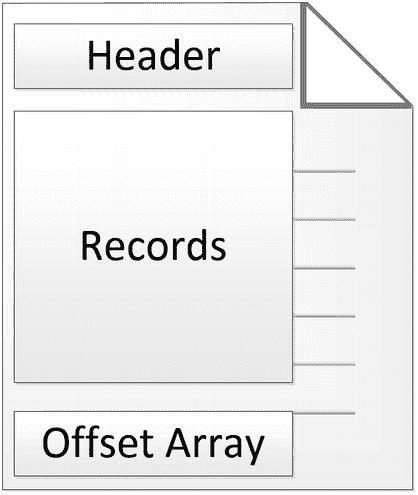

图 2-1：页面结构

如果页面包含偏移数组，则它从页面末尾开始。随着行被添加到页面，该行被添加到页面记录区域的第一个空闲位置。之后，该页面的起始位置存储在偏移数组的最后一个可用位置中。对于添加的每一行，行的数据存储在离页面开头更远的位置，而偏移量存储在离页面末尾更远的位置，如图 `2-2` 所示。从页面末尾向后读取，偏移量可用于识别页面上每一行（有时称为`槽`）的起始位置。

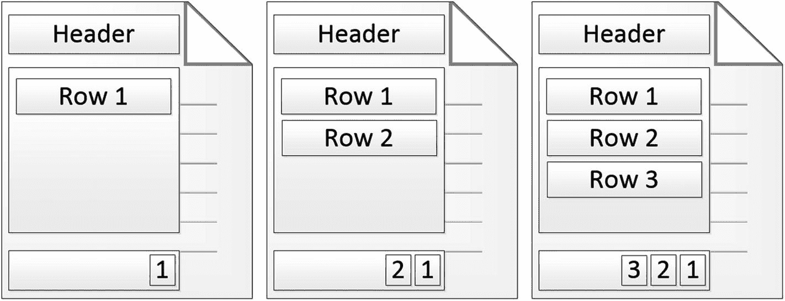

图 2-2：行放置和偏移数组

虽然页面的基本原理相同，但页面有多种使用方式。这些用途包括存储数据页、索引结构和大对象。这些用途以及它们如何与 SQL Server 数据库交互将在本章后面讨论。

### 区

在页面之上，数据库的下一个基本结构是`区`。这些是八个页面的组。一个区就是在数据文件中物理上连续的八个数据页。所有页面都属于一个区，并且一个区不能少于或多于八个页面。SQL Server 数据库使用的区有两种类型：`混合区`和`统一区`。

在混合区中，页面可以分配给多个对象。例如，当一个表首次创建并且分配给该表的页面少于八个时，它将构建为一个混合区。只要表的总大小小于八个页面，该表就会使用混合区，如图 `2-3` 所示。通过使用混合区，数据库可以减少分配给小型表的空间量。

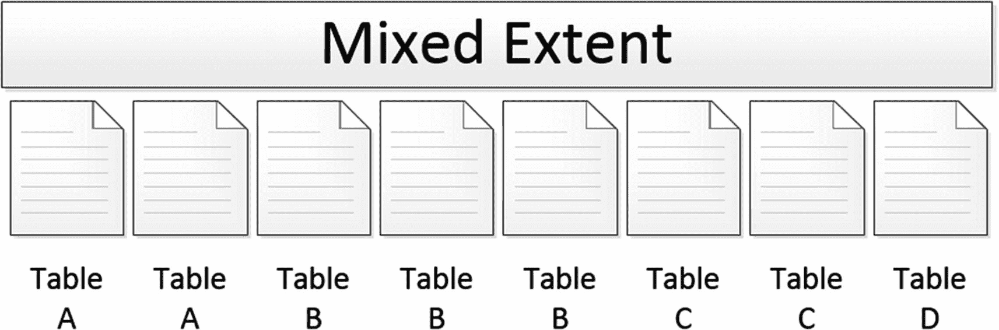

图 2-3：混合区

一旦表中的页面数量超过八个，它将开始使用统一区。在统一区中，该区中的所有页面都分配给数据库中的单个对象（参见图 `2-4`）。因此，对象的页面将是连续的，这增加了可以在一次读取中读取的对象页面数量。关于连续读取的好处的更多信息，请参见第 `6` 章。

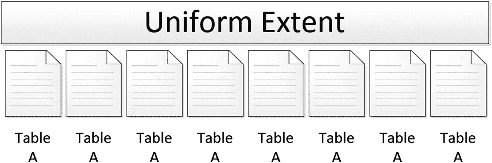

图 2-4：统一区

自 SQL Server 2016 以来，所有数据库的所有区分配都默认使用统一区。可以使用`MIXED_PAGE_ALLOCATION`数据库选项修改此行为，该选项将默认分配使用混合区。在 SQL Server 2014 及更早版本中，行为相反，默认分配混合区。并且可以在这些版本中使用跟踪标志 `1118` 修改此行为，该标志会将 SQL Server 修改为使用统一区，这与当前的默认行为相同。虽然这可能有点令人困惑，但重要的是要记住 SQL Server 默认使用统一区，这缓解了大量的页面分配争用问题。

### 页面类型

在数据库中，页面有多种使用方式。对于每一种用途，都有一个与页面关联的类型，用于定义页面的使用方式。SQL Server 数据库中可用的页面类型有：

*   文件头页
*   引导页
*   页面可用空间（PFS）页
*   全局分配映射（GAM）页
*   共享全局分配映射（SGAM）页
*   差异更改映射（DIFF）页
*   最小日志（ML）页
*   索引分配映射（IAM）页
*   数据页
*   索引页
*   大对象（文本和图像）页

接下来的几节将扩展页面类型并解释它们的使用方式。虽然并非所有页面类型都直接涉及索引，但将定义和解释每一种类型，以帮助提供整体图景。对于每个数据库，页面布局都有相似之处。例如，在每个数据库的第一个文件中，页面布局如图 `2-5` 所示。可用的页面类型比图中显示的要多，但正如对每种页面类型的考察将显示的，只有最初几个页面中的类型是固定的。许多其他类型以由数据库中的数据决定的模式出现。

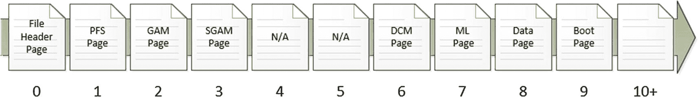

图 2-5：数据文件页面

### 注意

数据库日志文件不使用页面架构。页面结构仅适用于数据库数据文件。日志文件架构的讨论超出了本书的范围。

#### 文件头页

任何数据库数据文件中的第一页是文件头页，如图 `2-5` 所示。由于这是第一页，其编号始终为 `0`。文件头页包含有关数据库文件的元数据信息。此页上的信息包括：

*   文件 ID
*   文件组 ID
*   文件的当前大小
*   最大文件大小
*   扇区大小
*   LSN 信息

文件头页上还有许多关于文件的其他细节，但基本上这些信息对于索引内部结构无关紧要。

#### 引导页

引导页类似于文件头页，因为它提供元数据信息。不过，此页提供的是数据库本身的元数据信息，而不是数据文件的。每个数据库有一个引导页，它位于数据库的第一个数据文件的第 `9` 页（参见图 `2-5`）。引导页上的一些信息包括数据库的当前版本、数据库的创建日期和版本、数据库名称、数据库 ID 和兼容性级别。

引导页上的一个重要属性是 `dbi_dbccLastKnownGood` 属性。此属性提供了上次已知成功完成的 `DBCC CHECKDB` 的日期。虽然数据库维护不在本书的范围内，但定期对数据库进行一致性检查对于验证数据是否保持可用至关重要。


#### 页自由空间页面

为了跟踪页面是否有空间可用于插入行，每个数据文件都包含页自由空间（`PFS`）页面。这些页面是数据文件的第二页（见图 2-5），并在此后每隔 8,088 页出现一次，用于跟踪数据库中的自由空间量。`PFS` 页面上的每个字节代表数据文件中的一个后续页面，并提供有关该页面的一些简单分配信息；即，它确定页面上自由空间的大致数量。

当数据库引擎需要存储 `LOB` 数据或堆的数据时，它需要知道下一个可用页面在哪里，以及当前已分配页面的填充程度。此功能由 `PFS` 页面提供。每个字节内都有标志，用于标识当前已使用的空间量。位 0-2 确定页面是否处于以下自由空间状态之一：

*   页面为空。
*   填充 1-50%。
*   填充 51-80%。
*   填充 81-95%。
*   填充 96-100%。

除了自由空间，`PFS` 页面还包含位来标识页面的其他几种信息类型。例如，位 3 确定页面上是否存在影子记录。位 4 标识页面是否是索引分配映射的一部分（本章稍后描述）。位 5 说明页面是否位于混合区中。最后，位 6 标识页面是否已被分配。

通过这些附加标志或位，`SQL Server` 可以从高级别确定页面的使用内容和方式。它可以确定页面当前是否已分配。如果没有，它是否可用于 `LOB` 或堆数据？如果当前已分配，则 `PFS` 页面就提供本节前面描述的第一个目的。

最后，当影子清理进程运行时，该进程不需要检查数据库中的每个页面以寻找要清理的记录。相反，可以检查 `PFS` 页面，并且只需要访问那些包含影子记录的页面。

### 注意

索引本身处理非 `LOB` 数据和索引的自由空间和页面分配。这些结构的页面分配由结构的定义决定。

#### 全局分配映射页面

与 `PFS` 页面类似的是全局分配映射（`GAM`）页面。该页面确定一个区是否已被指定用作统一区。`GAM` 页面的次要目的是帮助确定该区是否空闲且可用于分配。

每个 `GAM` 页面提供其后续 `GAM` 间隔内所有区的映射。一个 `GAM` 间隔由 `GAM` 页面之后的 64,000 个区或 4 `GB` 组成。`GAM` 页面上的每个位代表 `GAM` 页面后的一个区。第一个 `GAM` 页面位于数据库文件的第 2 页（见图 2-5）。

为了确定一个区是否已分配为统一区，`SQL Server` 会检查 `GAM` 页面中代表该区的位。如果该区已分配，则该位设置为 `0`。当设置为 `1` 时，该区空闲且可用于其他目的。

#### 共享全局分配映射页面

与 `GAM` 页面几乎完全相同的是共享全局分配映射（`SGAM`）页面。页面之间的主要区别在于，`SGAM` 页面确定一个区是否被分配为混合区。与 `GAM` 页面一样，`SGAM` 页面也用于确定页面是否可用于分配。

每个 `SGAM` 页面提供其后续 `SGAM` 间隔内所有区的映射。一个 `SGAM` 间隔由 `SGAM` 页面之后的 64,000 个区或 4 `GB` 组成。`SGAM` 页面上的每个位代表 `SGAM` 页面后的一个区。第一个 `SGAM` 页面位于数据库文件 `GAM` 页面之后的第 3 页（见图 2-5）。

`SGAM` 页面确定一个区何时已被分配用作混合区。如果该区为此目的而分配并且有空闲页面，则该位设置为 `1`。当设置为 `0` 时，表示该区未用作混合区，或者是所有页面都在使用中的混合区。

#### 差异更改映射页面

接下来讨论的是差异更改映射（`DCM`）页面。该页面用于确定 `GAM` 间隔中的一个区是否已更改。当一个区发生更改时，位值从 `0` 更改为 `1`。这些位存储在 `DCM` 页面的位图行中，每个位代表一个区。

`DCM` 页面用于跟踪在完整数据库备份之间哪些区发生了更改。每当进行完整数据库备份时，`DCM` 页面上的所有位都会重置为 `0`。当关联的区内发生更改时，该位会更改回 `1`。

`DCM` 页面的主要用途是为差异备份提供已修改区的列表。无需检查数据库中的每个页面或区以查看其是否已更改，`DCM` 页面提供了要备份的区列表。

第一个 `DCM` 页面位于数据文件的第 6 页。后续的 `DCM` 页面出现在数据文件的每个 `GAM` 间隔中。

#### 最小日志记录页面

在 `DCM` 页面之后的是最小日志记录（`ML`）页面，以前称为大容量更改映射页面。`ML` 页面用于指示 `GAM` 间隔中的一个区何时已被最小日志记录操作修改。任何受最小日志记录操作影响的区，其位值将设置为 `1`，而未受影响的将设置为 `0`。这些位存储在 `ML` 页面的位图行中，每个位代表 `GAM` 间隔中的一个区。

正如 `ML` 页面的前名称（`大容量更改映射`）所暗示的，这些页面与 `BULK_LOGGED` 恢复模型结合使用。当数据库使用此恢复模型时，`ML` 页面用于标识自上次事务日志备份以来通过最小日志记录操作修改的区。当事务日志备份完成时，`ML` 页面上的位将重置为 `0`。

第一个 `ML` 页面位于数据文件的第 7 页。后续的 `ML` 页面出现在数据文件的每个 `GAM` 间隔中。

#### 索引分配映射页面

到目前为止讨论的大多数页面都提供有关它们所覆盖页面上是否有数据的信息。比页面是否开放和可用更重要的是，`SQL Server` 需要知道页面上的信息是否与特定表或索引相关联。提供此信息的页面是索引分配映射（`IAM`）页面。

每个表或索引首先从一个 `IAM` 页面开始。该页面指示先前讨论的 `GAM` 间隔内哪些区与该表或索引相关联。如果一个表或索引跨越多个 `GAM` 间隔，则该表或索引将有多个 `IAM` 页面。

`IAM` 页面将四种类型的页面与表或索引相关联。这些是数据页、索引页、大对象页和小大对象页。`IAM` 页面通过 `IAM` 页面上的位图行实现页面与表或索引的关联。

除了位图行之外，`IAM` 页面上还有一个 `IAM` 头行。`IAM` 头提供表或索引的 `IAM` 页面的序列号。它还包含 `IAM` 页面所关联的 `GAM` 间隔的起始页。最后，该行包含一个单页分配数组。当分配给表或索引的空间少于一个区时使用此数组。

理解 `IAM` 页面的价值在于，它提供了一个映射和根，通过它，表或索引的所有页面汇集在一起。当需要确定表或索引的所有区时，就会使用此页面。


#### 数据页

数据页是任何数据库中最常见的页面类型。数据页用于存储数据库表中行的数据。除少数数据类型外，记录的所有数据都位于数据页上。此规则的例外是存储在 LOB 数据类型中的列。这些信息存储在大对象页中，本节稍后将进行讨论。

理解数据页对于理解索引内部结构非常重要。这种理解之所以重要，是因为在查看索引内部结构时，数据页是最常被查阅的页面。当你深入到索引的最低层级时，总会找到数据页。

#### 索引页

与数据页类似的是索引页。这些页面提供关于索引结构以及数据页位置的信息。对于聚集索引，索引页用于构建用于导航聚集索引的页面层次结构。对于非聚集索引，索引页执行相同的功能，但也用于存储构成索引的键值。

如前所述，索引页用于构建索引内的页面层次结构。为实现这一点，索引页中包含的数据提供了键值和页面地址的映射。键值是子表中第一个排序行所包含的索引中的键值，页面地址则标识了该行的位置。

索引页的构造与其他页面类型类似。页面有一个页面头，其中包含所有标准信息，如页面类型、分配单元、分区 ID 和分配状态。行偏移数组包含指向索引数据行在页面上位置的指针。索引数据行包含两条信息：键值和一个页面地址（如前所述）。

理解索引页很重要，因为它们提供了索引中所有数据页如何连接在一起的映射图。

#### 大对象页

如前所述，单个页面上数据的限制是 `8 KB`。然而，某些数据类型的大小上限可达 `2 GB`。对于这些数据类型，需要另一种存储机制来存储数据。为此，存在大对象页面类型。

可以使用 LOB 页的数据类型包括 `text`、`ntext`、`image`、`nvarchar(max)`、`varchar(max)`、`varbinary(max)` 和 `xml`。当这些数据类型中的一种数据存储在数据页上时，如果行的大小超过 `8 KB`，将使用 LOB 页。在这些情况下，该列将包含对数据所需 LOB 页的引用，并且数据将存储在 LOB 页上（参见图 2-6）。

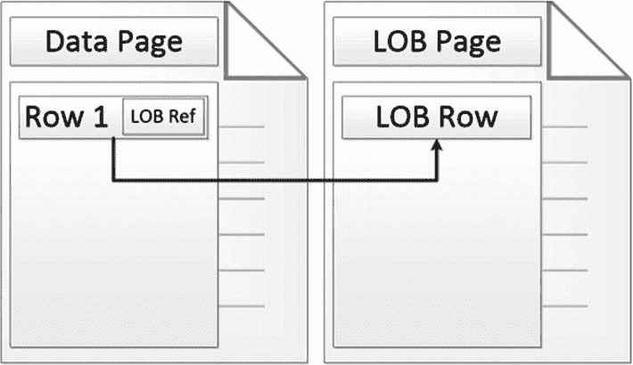

图 2-6
数据页链接到 LOB 页

## 组织页面

到目前为止，你已经了解了构成索引内部结构的低级别组件。虽然这些部分对索引很重要，但组织这些组件的结构才是索引价值的体现。SQL Server 使用多种不同的组织结构在数据库中存储数据。

SQL Server 中的组织结构包括：
```
* 堆 (Heap)
* 平衡树 (B-tree)
* 列存储 (Columnar)
```

这些结构都映射到特定的索引类型，将在本章后面讨论。在本节中，你将研究每种组织页面的方法以建立理解。

### 注意

在组织索引的结构中，包含索引页的索引层级被视为*非叶*级。当指包含数据页的层级时，这些层级被称为*叶级*。

#### 堆结构

组织页面的默认结构称为*堆*。当未使用 B 树结构（下一节将讨论）来组织表中的数据页时，就会形成堆。从概念上讲，可以将堆想象成一堆无特定顺序的数据页，如图 2-7 所示。在该示例中，检索所有“Madison”记录的唯一方法是检查每个页面，查看“Madison”是否在该页面上。

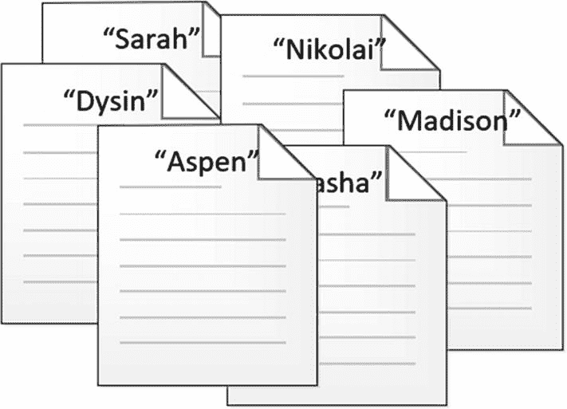

图 2-7
堆示例

然而，从内部结构角度来看，堆不仅仅是一堆页面。虽然未排序，但堆有几个关键组件来组织页面以便于访问。所有堆都以一个 IAM 页开始，如图 2-8 所示。如前所述，IAM 页映射出 GAM 间隔内哪些区和单页分配与索引相关联。对于堆，IAM 页是将数据页和区与堆关联的唯一机制。如前所述，堆结构不对与堆关联的页面强制任何排序顺序。堆中的第一个可用页面是在数据库文件中为该堆找到的第一个页面。

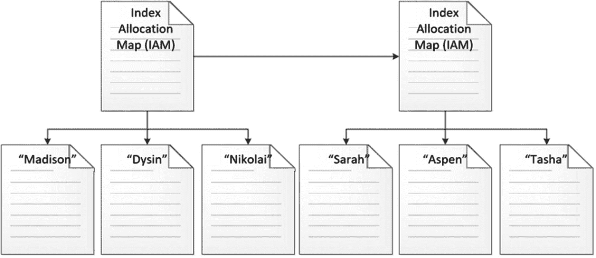

图 2-8
堆结构

IAM 页列出了与堆关联的所有数据页。堆的数据页存储表的行，并根据需要使用 LOB 页。当 IAM 页在 GAM 间隔内没有更多页面可供分配时，会为堆分配一个新的 IAM 页，并将下一组页面及其对应的行添加到堆中，如图 2-1 所示。如图所示，堆结构是扁平的。从上到下，从 IAM 页到结构的数据页始终只有一层。

虽然堆提供了一种组织页面的机制，但它并不对应于索引类型。当表没有聚集索引时，会使用堆结构。当堆存储表中的行时，行是在没有强制顺序的情况下插入的。这是因为，与聚集索引不同，堆上不存在基于特定列的排序顺序。


## B 树结构

第二种可用于索引的结构是平衡树，即 `B 树` 结构。它是 SQL Server 中组织索引最常用的结构，聚集索引和非聚集索引都使用此结构。

在 `B 树` 中，页以层次化树状结构组织，如图 2-9 所示。在此结构内，页经过排序以优化对结构内信息的搜索。除了排序之外，还维护页之间的关系，以允许跨索引层级顺序访问页。

与堆类似，`B 树` 以一个 `IAM` 页开始，该页标识了 `B 树` 的第一页在 `GAM` 区间内的位置。`B 树` 的第一页是一个索引页，通常被称为索引的 `根层级`。作为索引页，`根层级` 包含索引中下一页的键值和页地址。根据索引的大小，索引的下一层级可能是数据页或其他的索引页。

如果对数据页上的所有行进行排序所需的索引行数超出了可用空间，则根页后面将跟随另一个层级的索引页。`B 树` 中额外的索引页层级被称为 `中间层级`。在许多情况下，使用 `B 树` 结构构建的索引不需要超过一两个 `中间层级`。即使索引键很宽，仅用几个层级也可以对数百万到数十亿行进行排序。

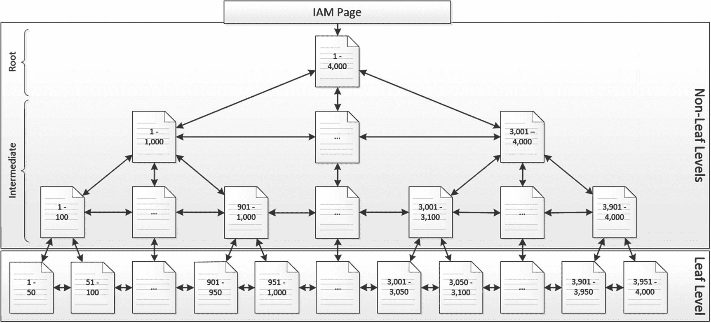
图 2-9：B 树结构

索引的根层级和中间层级下面的下一层页，被称为 `非叶层级`，是 `叶层级`（见图 2-9）。`叶层级` 包含索引的所有数据页。数据页是存储行的所有键值和非键值的地方。非键值从不存储在索引页上。

堆和 `B 树` 的另一个区别在于索引层级内执行顺序页读取的能力。页在页头中包含前一页和后一页属性。对于索引页和数据页，这些属性会被填充，并可用于遍历 `B 树` 以从 `B 树` 中找到下一个请求的行，而无需返回到索引的根层级。为了说明这一点，考虑一种情况，你从图 2-9 所示的索引中请求键值在 925 到 3,025 之间的行。通过 `B 树`，此操作可以通过遍历 `B 树` 直到键值 925 来完成，如图 2-10 所示。之后，可以通过按顺序访问第一页之后的所有页面来检索直至键值 3,025 的行，当遇到最后一个键值时结束操作。

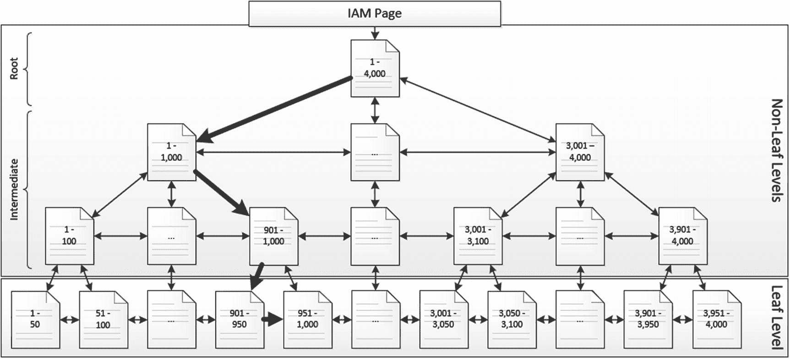
图 2-10：B 树顺序读取

表和索引有一个可用的选项，即能够对这些结构进行分区。分区改变了索引的物理实现以及索引页和数据页的组织方式。从 `B 树` 结构的角度来看，索引中的每个分区都有自己的 `B 树`。如果一个表被分区为三个不同的分区，那么该索引就会有三个 `B 树` 结构。

## 列存储结构

列存储（Columnstore）最早随 SQL Server 2012 引入，它引入了一种新的组织结构，该结构基于 Microsoft 的 Vertipaq 技术。列存储结构被聚集和非聚集列存储索引类型所使用。列存储结构从传统的行式存储和索引数据方法转变为列式格式。这意味着，不是将一行的所有值与该行中的其他所有值存储在一起，而是将值与同一列的值分组存储在一起。例如，在图 2-11 的示例中，页面上存储的不是四个行“组”，而是三个列“组”。

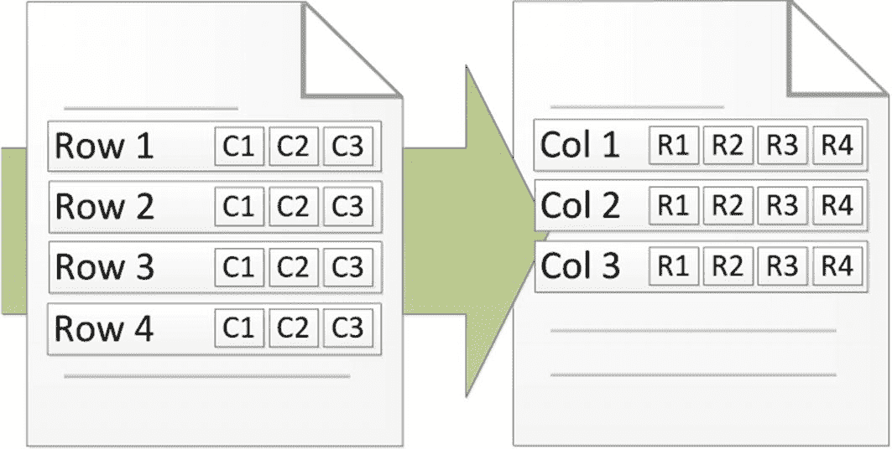
图 2-11：行式存储与列式存储

列存储结构的物理实现并没有引入任何新的页类型；它利用的是现有的页类型。与其他结构一样，列存储以一个 `IAM` 页开始，如图 2-12 所示。从 `IAM` 页开始是 `LOB` 页，这些页包含列存储信息。对于存储在列存储中的每一列，都有一个或多个段。段包含其代表的列最多约 100 万行的数据。一个 `LOB` 页可以包含一个或多个段，并且段可以跨越多个 `LOB` 页。

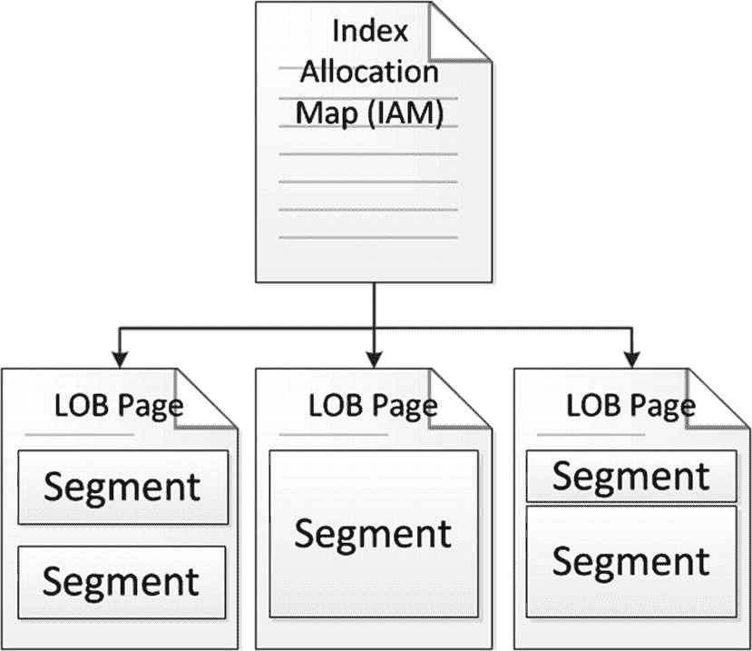
图 2-12：列存储结构

每个段内都有一个哈希字典，用于映射构成该列存储段的数据。该哈希字典还包含段中数据的最小值和最大值。此信息由 SQL Server 在查询执行期间使用，以在查询执行过程中消除段。

列存储结构的优势之一是其利用压缩的能力。由于列存储结构的每个段包含相同类型的数据（无论是从数据类型还是值的角度来看），SQL Server 更有可能对数据使用压缩。列存储使用的压缩类似于页级压缩。它利用字典压缩来消除整个段中的相似值。页压缩和列存储压缩之间有两个主要区别。首先，页压缩是可选的，而列存储压缩是强制性的且无法禁用。其次，页压缩仅限于压缩单个页上的值。而列存储压缩是针对整个段的，该段可能跨越多个页，或者同一页面上可能有多个段。无论页面数量或一个页面上的段数量如何，列存储压缩都仅限于该段内。

列存储的另一个优势是只返回从列存储请求的列。通常建议在编写查询时不要使用 `SELECT *`；相反，最佳实践是只 `SELECT` 需要的列。不幸的是，即使遵循了此实践，基于堆和 `B 树` 的索引也会从磁盘读取行的所有列到内存中。这种实践减少了一些网络流量并简化了执行，但它无助于缓解从磁盘读取数据的瓶颈。列存储索引通过仅从磁盘读取请求的列并将该数据移动到内存中来解决此问题。同样地，根据 Microsoft 的说法，查询通常只访问表中可用列的 10-15%。^² 从列存储结构中检索的列的减少将对性能和 I/O 产生重大影响。


虽然聚簇列存储索引与非聚簇列存储索引的列式结构保持不变，但两者之间存在一些重要区别需要了解。聚簇列存储索引包含一个名为 `deltastore` 的附加结构，用于支持对索引的写操作。虽然两种列存储索引的数据段都是只读的，但 `deltastore` 允许对索引执行插入、更新和删除操作。此外，聚簇列存储索引是数据的基础副本；它不依赖聚簇索引或堆来保存数据的完整副本，所有数据都存储在聚簇列存储索引中。而非聚簇列存储索引则需要基于其使用的数据建立传统的聚簇索引，通常会在数据库中形成数据的副本。

### 警告

下一节中使用的工具未公开且不受支持。它们不会出现在 `SQL Server 联机丛书中`，其功能可能在不通知的情况下发生变化。话虽如此，这些工具已存在相当长的时间，且有许多博客文章描述了它们的行为。您可以在 [`www.sqlskills.com`](http://www.sqlskills.com) 找到使用这些工具的更多资源。当使用旧版本的 `SQL Server` 时，理解这些工具将非常重要，因为之前描述的 `DMF` 可能不可用。

## 检查页面

本章第一部分概述了 `SQL Server` 数据库中的页面类型。在此基础上，您还了解了用于组织和管理数据库内页面关系的结构。下一节中，您将学习如何使用动态管理函数和 `DBCC` 命令来检查数据库中的页面。对于当前版本的 `SQL Server`，您可以使用 `DMF`，但在旧版本上则需要使用 `DBCC` 命令。

通过使用这些工具，您将获得基础，从而能够在本章及本书后续部分研究 `索引` 的行为。同时，这也为您提供了自行探索数据库中 `索引` 和数据的知识。

### 动态管理函数

有两个动态管理函数可用于检查 `SQL Server` 数据库中的页面，分别是：

*   `sys.dm_db_database_page_allocations`
*   `sys.dm_db_page_info`

#### sys.dm_db_database_page_allocations

`DMF sys.dm_db_database_page_allocations` 提供有关数据库中页面分配的信息。该函数可用于调查 `索引` 及其关联的页面，也可用于识别区的分配方式以及所使用的区是混合区还是统一区。

此 `DMF` 提供的数据类似于 `DBCC EXTENTINFO` 和 `DBCC IND`（后文将描述）所提供的数据。使用 `DMF` 的一个优势是结果可以过滤，并可与其他 `DMF` 合并。此外，它还提供分配给 `索引` 的所有页面的详细信息，即使这些页面上没有数据。其输出的一个限制是只返回与数据分配相关的页面，例如数据页、`索引` 页和 `IAM` 页。

清单 2-1 展示了使用 `sys.dm_db_database_page_allocations` 的语法。执行需要五个参数，其定义见表 2-1。

**表 2-1**
**sys.dm_db_database_page_allocations 的参数**

| 参数 | 描述 |
| --- | --- |
| `@DatabaseId` | 要返回其表和索引页面列表的数据库。此参数是必需的，接受 `DB_ID()` 函数的使用。 |
| `@TableId` | 要返回其页面列表的表的 `Object_id`。此参数是必需的，接受 `OBJECT_ID()` 函数的使用。也可使用 `NULL` 来返回所有表。 |
| `@IndexId` | 页面列表来源表的 `Index_id`。此参数是必需的，接受使用 `NULL` 来返回所有索引的信息。 |
| `@PartionId` | 页面列表返回的分区的 ID。此参数是必需的，接受使用 `NULL` 来返回所有索引的信息。 |
| `@Mode` | 定义返回数据的模式。选项为 `DETAILED` 和 `LIMITED`。`LIMITED` 模式下，信息仅限于页面元数据，例如页面分配和关系信息。`DETAILED` 模式下，会提供额外信息，例如页面类型和页面间关系链。 |

```
SELECT * FROM sys.dm_db_database_page_allocations ({database_id},
{TableId | NULL}, {IndexId | NULL}, { PartitionId | NULL },
{DETAILED | LIMITED})
```
清单 2-1
`sys.dm_db_database_page_allocations` 语法

执行 `sys.dm_db_database_page_allocations` 时，结果包含表 2-2 中定义的列。对于每次页面分配，结果中将有一行对应。

**表 2-2**
**sys.dm_db_database_page_allocations 的列**


# DMF 列描述与使用示例

#### DMF 列描述

| DMF 列 | 描述 |
| --- | --- |
| `database_id` | 数据库的 ID。 |
| `object_id` | 表或视图的对象 ID。 |
| `index_id` | 索引的 ID。 |
| `partition_id` | 索引的分区号。 |
| `rowset_id` | 索引的分区 ID。 |
| `allocation_unit_id` | 分配单元的 ID。 |
| `allocation_unit_type` | 分配单元的类型。 |
| `allocation_unit_type_desc` | 分配单元的描述。 |
| `data_clone_id` | 未知。 |
| `clone_state` | 未知。 |
| `clone_state_desc` | 未知。 |
| `extent_file_id` | 区的文件 ID。 |
| `extent_page_id` | 区的页 ID。 |
| `allocated_page_iam_file_id` | 与该页关联的索引分配映射页的文件 ID。 |
| `allocated_page_iam_page_id` | 与该页关联的索引分配映射页的页 ID。 |
| `allocated_page_file_id` | 已分配页的文件 ID。 |
| `allocated_page_page_id` | 已分配页的页 ID。 |
| `is_allocated` | 指示页是否已分配。 |
| `is_iam_page` | 指示页是否是索引分配页。 |
| `is_mixed_page_allocation` | 指示页是否已分配。 |
| `page_free_space_percent` | 页上空闲空间的百分比。 |
| `page_type` | 已分配页的页类型 ID。 |
| `page_type_desc` | 页类型的描述。 |
| `page_level` | B 树索引中页的级别。 |
| `next_page_file_id` | 下一页的文件 ID。 |
| `next_page_page_id` | 下一页的页 ID。 |
| `previous_page_file_id` | 上一页的文件 ID。 |
| `previous_page_page_id` | 上一页的页 ID。 |
| `is_page_compressed` | 指示页是否已压缩。 |
| `has_ghost_records` | 指示页是否包含幽灵记录。 |

#### sys.dm_db_database_page_allocations 的用例

使用这个 DMF，我们可以研究几个用例，以帮助展示如何利用 `sys.dm_db_database_page_allocations`。首先，你需要为此章节创建一个数据库，以及一个包含十二行数据的表，使用清单 2-2 中的脚本。

```sql
USE master;
GO
CREATE DATABASE Chapter2Internals;
GO
USE Chapter2Internals;
GO
CREATE TABLE dbo.IndexInternalsOne
(
RowID INT IDENTITY(1, 1),
FillerData CHAR(8000)
);
GO
INSERT INTO dbo.IndexInternalsOne
DEFAULT VALUES;
GO 12
```

**清单 2-2**
创建包含 12 行的 dbo.IndexInternalsOne 的脚本

创建表之后，你将使用清单 2-3 中的脚本来展示 SQL Server 如何存储表中的记录，以及如何使用 `sys.dm_db_database_page_allocations` 检查它们。如图 2-13 所示，有一个索引分配映射页分配给了该表，该页位于混合页分配中。这意味着多个索引可以使用该区来分配这些页。然后，有八个页分配给了索引的第一个数据页区，起始页码为 312，另外四个页分配自一个起始页码为 320 的区。此外，你还可以看到在起始页码为 320 的区上有四个页已分配但尚未分配页类型。这演示并证实了上一节关于堆结构的讨论。存在一个索引分配映射以及分配给该映射的、包含数据页的区。

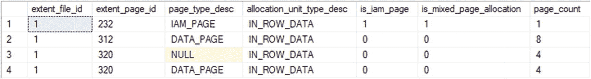

```sql
SELECT DPA.extent_file_id,
       DPA.extent_page_id,
       DPA.page_type_desc,
       DPA.allocation_unit_type_desc,
       DPA.is_iam_page,
       DPA.is_mixed_page_allocation,
       COUNT(*) AS page_count
FROM sys.dm_db_database_page_allocations(DB_ID(), OBJECT_ID('dbo.IndexInternalsOne'), NULL, NULL, 'DETAILED') DPA
GROUP BY DPA.extent_file_id,
         DPA.extent_page_id,
         DPA.page_type_desc,
         DPA.allocation_unit_type_desc,
         DPA.is_iam_page,
         DPA.is_mixed_page_allocation
ORDER BY DPA.extent_page_id,
         DPA.page_type_desc;
```

**清单 2-3**
使用 `sys.dm_db_database_page_allocations` 查看区分配

索引分配映射页总是混合区的一部分，因为该分配决定了多个表的索引映射。为了演示，你可以运行清单 2-4 中的脚本，该脚本创建第二个表，该表包含一个通过主键实现的聚集索引。查看图 2-14 中的结果，六行数据被添加到了一个起始页码为 328 的区，绕过了上一个表中已分配但未使用的四个页。然而，索引分配映射页属于与 `dbo.IndexInternalsOne` 相同的区，该区起始页码为 232，表明这个区确实是混合的。此外，你还会看到为该表分配了一个索引页以支持聚集索引的 B 树结构。

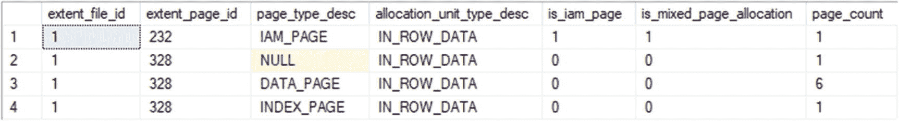

```sql
USE Chapter2Internals;
GO
CREATE TABLE dbo.IndexInternalsTwo
(
RowID INT IDENTITY(1, 1) PRIMARY KEY,
FillerData CHAR(8000)
);
GO
INSERT INTO dbo.IndexInternalsTwo
DEFAULT VALUES;
GO 6

SELECT DPA.extent_file_id,
       DPA.extent_page_id,
       DPA.page_type_desc,
       DPA.allocation_unit_type_desc,
       DPA.is_iam_page,
       DPA.is_mixed_page_allocation,
       COUNT(*) AS page_count
FROM sys.dm_db_database_page_allocations(DB_ID(), OBJECT_ID('dbo.IndexInternalsTwo'), NULL, NULL, 'DETAILED') DPA
GROUP BY DPA.extent_file_id,
         DPA.extent_page_id,
         DPA.page_type_desc,
         DPA.allocation_unit_type_desc,
         DPA.is_iam_page,
         DPA.is_mixed_page_allocation
ORDER BY DPA.extent_page_id,
         DPA.page_type_desc;
```

**清单 2-4**
创建包含 12 行的 `dbo.IndexInternalsTwo` 的脚本

除了区级别的详细信息，你还可以使用这个 DMF 深入到页级别来研究索引，以了解分配给表的所有页以及它们与索引中其他页的关联顺序。使用清单 2-5 中的脚本，你可以在图 2-15 中再次看到，起始页码为 232 的区包含了分配给索引分配映射的页 235 和 236。分配给起始页码为 312 的区的页包括页 312、313 等，这与起始页码为 328 的区类似，后者包括页 328、329 等。除此之外，你还可以查看每个页在 B 树中的页级别以及页之间的连接，从而验证在索引中上下移动以及在数据页之间逐页移动的能力。

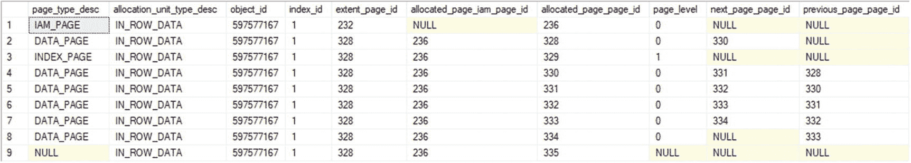

```sql
SELECT DPA.page_type_desc,
       DPA.allocation_unit_type_desc,
       DPA.object_id,
       DPA.index_id,
       DPA.extent_page_id,
       DPA.allocated_page_iam_page_id,
       DPA.allocated_page_page_id,
       DPA.page_level,
       DPA.next_page_page_id,
       DPA.previous_page_page_id
FROM sys.dm_db_database_page_allocations(DB_ID(), OBJECT_ID('dbo.IndexInternalsTwo'), NULL, NULL, 'DETAILED') DPA
```

**清单 2-5**
用于查看所有已分配页的脚本


## sys.dm_db_page_info

另一个帮助我们理解索引如何运作的动态管理函数是`sys.dm_db_page_info`。此 DMF 提供数据库页面的页头行信息。这些信息包括槽数、可用字节、最小日志记录状态、幽灵记录以及页面链接详情。

列表 2-6 展示了使用 `sys.dm_db_page_info` 的语法。执行需要四个参数，定义见表 2-3。虽然微软说明这些参数可以为 NULL，但事实并非如此，当提供 NULL 值时该函数会报错。

表 2-3

`sys.dm_db_page_info` 的参数

| 参数 | 描述 |
| --- | --- |
| `@DatabaseId` | 要返回页面头信息的数据库。 |
| `@FileID` | 要返回页面的 `FileId`。 |
| `@PageId` | 要返回页面的 `Page_id`。 |
| `@Mode` | 定义返回数据的模式。选项有 `DETAILED` 和 `LIMITED`。`LIMITED` 模式下，信息仅限于页面元数据。`DETAILED` 模式下，将填充页面描述列。 |

```
SELECT * FROM sys.dm_db_page_info ({database_id},
{FileId}, {PageId}, {DETAILED | LIMITED})
Listing 2-6
sys.dm_db_page_info 语法
```

执行 `sys.dm_db_page_info` 时，结果包含表 2-4 中定义的列。对于每个请求的页面，结果中都会有一行头信息。

表 2-4

`sys.dm_db_page_info` 的列

| 列名 | 描述 |
| --- | --- |
| database_id | 数据库的 ID。 |
| file_id | 数据文件的 ID。 |
| page_id | 页面的 ID。 |
| page_header_version | 页面头的版本。 |
| page_type | 页面类型的 ID。 |
| page_type_desc | 页面类型的文本描述。 |
| page_type_flag_bits | 页面头中的类型标志位。 |
| page_type_flag_bits_desc | 页面头中类型标志位的描述。 |
| page_flag_bits | 页面头中的标志位。 |
| page_flag_bits_desc | 页面头中标志位的文本描述。 |
| page_lsn | 与上次页面修改关联的日志序列号。 |
| page_level | 页面在索引中的级别。 |
| object_id | 与页面关联的对象的 ID。 |
| index_id | 索引的 ID。 |
| partition_id | 分区的 ID。 |
| alloc_unit_id | 分配单元的 ID。 |
| is_encrypted | 指示页面是否已加密。 |
| has_checksum | 指示页面是否具有校验和值。 |
| checksum | 页面的校验和值。 |
| is_iam_page | 指示页面是否为索引分配映射页面。 |
| is_mixed_extent | 指示页面是否为混合区的一部分。 |
| has_ghost_records | 指示页面是否有幽灵记录。 |
| has_version_records | 指示页面是否有版本记录。 |
| has_persisted_version_records | 指示页面是否有持久化的版本记录。 |
| pfs_page_id | 与此页面关联的 PFS 页面的页面 ID。 |
| pfs_is_allocated | 指示 PFS 页面是否已分配此页面。 |
| pfs_alloc_percent | 由 PFS 页面指示的分配百分比。 |
| pfs_status | PFS 状态的位值。 |
| pfs_status_desc | PFS 状态的文本描述。 |
| gam_page_id | 与此页面关联的 GAM 页面的页面 ID。 |
| gam_status | 指示此页面 GAM 状态的 ID 值。 |
| gam_status_desc | 此页面 GAM 状态的文本描述。 |
| sgam_page_id | 与此页面关联的 SGAM 页面的页面 ID。 |
| sgam_status | 指示此页面 SGAM 状态的 ID 值。 |
| sgam_status_desc | 此页面 SGAM 状态的文本描述。 |
| diff_map_page_id | 与此页面关联的差异映射页面的页面 ID。 |
| diff_status | 指示此页面差异映射状态的 ID 值。 |
| diff_status_desc | 此页面差异映射状态的文本描述。 |
| ml_map_page_id | 与此页面关联的最小日志记录页面的页面 ID。 |
| ml_status | 指示此页面最小日志记录页面状态的 ID 值。 |
| ml_status_desc | 此页面最小日志记录页面状态的文本描述。 |
| prev_page_file_id | 下一个页面的文件 ID。 |
| prev_page_page_id | 下一个页面的页面 ID。 |
| next_page_file_id | 上一个页面的文件 ID。 |
| next_page_page_id | 上一个页面的页面 ID。 |
| fixed_length | 未知。 |
| slot_count | 已使用和未使用的槽的总数。 |
| ghost_rec_count | 页面上标记为幽灵的记录数。 |
| free_bytes | 页面上的可用字节数。 |
| free_bytes_offset | 数据区域末尾可用空间的偏移量。 |
| reserved_bytes | 页面上的保留字节数。 |
| reserved_bytes_by_xdes_id | 由 m_xdesID 贡献给 m_reservedCnt 的空间。 |
| xdes_id | 由 m_reserved 贡献的最新事务。 |

您可以使用此头信息来识别不同结构（如 PFS 页面）之间页面的相互关系，或使用它来检查页面以验证校验和、槽数或可用空间。要演示，请运行列表 2-7 中的代码，该代码检索先前创建的两个表的所有页面分配，并为所有已分配的页面检索页面头信息。

```
SELECT T.name,
DPA.page_type_desc,
DPI.page_id,
DPI.pfs_page_id,
DPI.gam_page_id,
DPI.sgam_page_id,
DPI.diff_map_page_id,
DPI.ml_map_page_id,
DPI.prev_page_page_id,
DPI.next_page_page_id,
DPI.fixed_length,
DPI.slot_count,
DPI.free_bytes
FROM sys.dm_db_database_page_allocations(DB_ID(), NULL, NULL, NULL, 'DETAILED') DPA
INNER JOIN sys.tables T ON T.object_id = DPA.object_id
CROSS APPLY sys.dm_db_page_info(DPA.database_id, DPA.allocated_page_file_id, DPA.allocated_page_page_id, DEFAULT) DPI;
Listing 2-7
使用 sys.dm_db_page_info 的查询
```

执行后，您将获得与图 2-16 类似的结果。在这些结果中，我们看到了 `dbo.IndexInternalsTwo` 相同的前后页面连接，但没有列出 `dbo.IndexInternalsone` 的页面 ID。此外，两个表的 PFS、GAM、SGAM、DIFF 和 ML 页面都被识别出来，它们是相同的，因为数据库小于需要多个此类页面类型的阈值。最后，您将看到每个页面的槽数、长度和可用字节数。值得注意的是，页面 329（即 `dbo.IndexInternalsTwo` 的索引页面）有六个槽，每个槽对应索引页面在聚集索引中管理的一个页面。

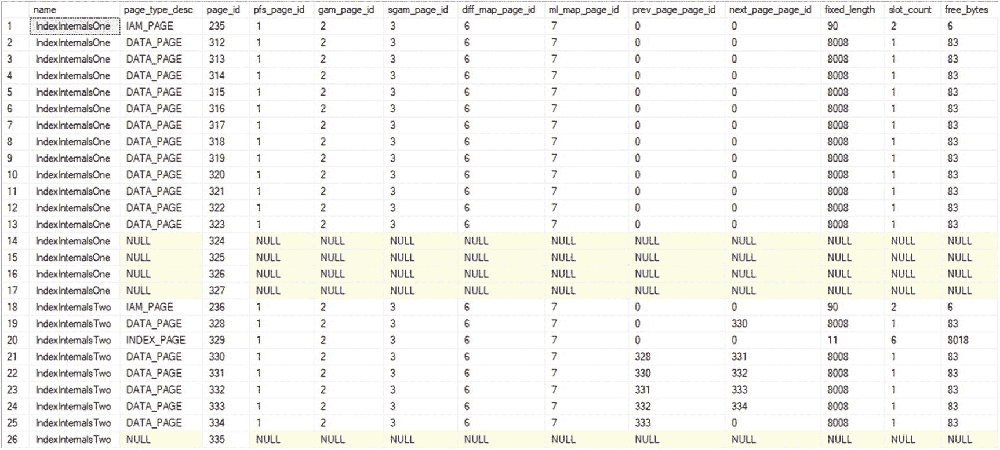

图 2-16

来自 `sys.dm_db_page_info` 的页面头结果

#### DBCC 命令

虽然您可以使用本章前面描述的动态管理函数对数据结构进行大量探索，但有时您会希望深入挖掘。要在 SQL Server 中实现这一点，您可以使用以下 DBCC 命令：

* `DBCC EXTENTINFO`
* `DBCC IND`
* `DBCC PAGE`

在接下来的几节中，我们将探讨这些命令，并回顾一些在数据库中利用它们的示例。


#### DBCC EXTENTINFO

首先要探索的`DBCC`命令是`DBCC EXTENTINFO`。与`sys.dm_db_database_page_allocations`类似，此命令提供有关数据库内区分配的信息。它能识别区如何被分配，以及所使用的区是混合区还是统一区。清单 2-8 展示了使用`DBCC EXTENTINFO`的语法。使用该命令时，有四个可填充的参数；这些参数在表 2-5 中定义。

**表 2-5 DBCC EXTENTINFO 参数**

| 参数 | 描述 |
| --- | --- |
| `database_name | database_id` | 指定将要检索页面的数据库名称或数据库 ID。如果为此参数提供值 0 或未设置参数，则将使用当前数据库。 |
| `table_name | table_object_id` | 通过提供表名或表的`object_ID`来指定输出中返回哪个表。如果未提供值，输出将包含所有表的结果。 |
| `index_name | index_id` | 通过提供索引名称或`index_ID`来指定输出中返回哪个索引。如果提供-1 或未提供值，则输出将包含表上所有索引的结果。 |
| `partition_id` | 通过提供分区号来指定输出中返回索引的哪个分区。如果提供 0 或未提供值，则输出将包含索引上所有分区的结果。 |

```
DBCC EXTENTINFO ( {database_name | database_id | 0}
, {table_name | table_object_id}, { index_name | index_id | -1}
, { partition_id | 0}
Listing 2-8
DBCC EXTENTINFO Syntax
```

执行`DBCC EXTENTINFO`时，会返回一个数据集。结果包含表 2-6 中定义的列。对于每个区分配，结果中会有一行。由于区由八个页面组成，当存在单页分配时（例如使用混合区时），一个区最多可能有八个分配。当使用统一区时，该区将只有一个区分配并返回一行。

**表 2-6 DBCC EXTENTINFO 输出列**

| 参数 | 描述 |
| --- | --- |
| `file_id` | 页面所在的文件号。 |
| `page_id` | 页面的页码。 |
| `pg_alloc` | 从区分配给对象的页数。 |
| `ext_size` | 区的大小。 |
| `object_id` | 表的对象 ID。 |
| `index_id` | 与堆或索引关联的索引 ID。 |
| `partition_number` | 堆或索引的分区号。 |
| `partition_id` | 堆或索引的分区 ID。 |
| `iam_chain_type` | 区所使用的 IAM 链类型。值可以是行内数据、LOB 数据和溢出数据。 |
| `pfs_bytes` | 字节数组，用于标识空闲空间量、是否存在幽灵记录、页面是否为 IAM 页面、是否已分配以及是否是混合区的一部分。 |

为了演示该命令的工作原理，让我们通过几个示例来观察区是如何分配的。在第一个示例（清单 2-9）中，我们将重用上一节的`dbo.IndexInternalsOne`，并针对它运行`DBCC EXTENTINFO`命令。

```
USE Chapter2Internals
GO
DBCC EXTENTINFO(0, IndexInternalsOne, -1)
Listing 2-9
DBCC EXTENTINFO dbo.IndexInternalsOne
```

在`DBCC`命令的结果中（如图 2-17 所示），你可以看到总共有 13 个页面分配给了该表。这些结果中值得关注的是`pg_alloc`和`ext_size`列。在第一行中，分配的页面是 9 个，包括索引分配映射页面和区的 8 个页面。在第二行中，分配了 4 个页面，这是插入表中的 12 条记录的剩余部分。两行的区大小都应为 8，因为分配的是统一区。

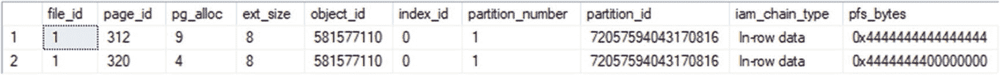

**图 2-17 dbo.IndexInternalsOne 中页面的 DBCC EXTENTINFO 结果**

在 SQL Server 2016 之前的版本中，行为会有很大不同，因为它会在第一个区填满之前，为每个事务利用单页分配。此行为变化是因为跟踪标志 1118 的行为已成为 SQL Server 的默认行为。

尽管`DBCC EXTENTINFO`没有提供像`sys.dm_db_database_page_allocations`那样多的细节，但它对于识别分配给表的区非常有用，尤其是在使用 SQL Server 2012 之前的版本时。


## DBCC IND

下一个可用于调查索引及其关联页面的命令是 `DBCC IND`。该命令返回与请求对象关联的所有页面的列表，可以限定在数据库、表或索引级别，这也类似于 `sys.dm_db_database_page_allocations`。清单 2-10 展示了使用 `DBCC IND` 的语法。使用此命令时，有三个可以填充的参数；这些参数在表 2-7 中定义。

表 2-7
`DBCC IND` 参数

| 参数 | 描述 |
| --- | --- |
| `database_name | database_id` | 指定将检索页面列表的数据库名称或数据库 ID。如果为此参数提供值 0 或未设置参数，则将使用当前数据库。 |
| `table_name | table_object_id` | 通过提供表名或表的 `object_ID` 来指定输出中返回哪个表。如果未提供值，输出将包含所有表的结果。 |
| `index_name | index_id` | 通过提供索引名称或 `index_ID` 来指定输出中返回哪个索引。如果提供 -1 或未提供值，输出将包含该表上所有索引的结果。 |

```
DBCC IND ( {'dbname' | dbid}, {'table_name' | table_object_id},
{'index_name' | index_id | -1})
```
清单 2-10
`DBCC IND` 语法

`DBCC IND` 在执行时返回一个数据集。对于分配给请求对象的每个页面，数据集中都返回一行；列定义在表 2-8 中。与之前的 `DBCC EXTENTINFO` 不同，`DBCC IND` 在结果中显式返回 IAM 页面。

表 2-8
`DBCC IND` 输出列

| 列 | 描述 |
| --- | --- |
| `PageFID` | 页面所在的文件编号。 |
| `PagePID` | 页面的页码。 |
| `IAMFID` | IAM 页面所在的文件 ID。 |
| `IAMPID` | 数据文件中页面的页 ID。 |
| `ObjectID` | 关联表的 object ID。 |
| `IndexID` | 与堆或索引关联的索引 ID。 |
| `PartitionNumber` | 堆或索引的分区号。 |
| `PartitionID` | 堆或索引的分区 ID。 |
| `iam_chain_type` | 区用于的 IAM 链类型。值可以是行内数据、LOB 数据和溢出数据。 |
| `PageType` | 标识页面类型的数字。这些类型在表 2-9 中列出。 |
| `IndexLevel` | 页面在页面组织结构中存在的级别。级别从 0 到 N 组织，其中 0 是索引的最低级别，N 是索引根。 |
| `NextPageFID` | 该索引级别上一个页面所在的文件编号。 |
| `NextPagePID` | 该索引级别上一个页面的页码。 |
| `PrevPageFID` | 该索引级别上上一个页面所在的文件编号。 |
| `PrevPagePID` | 该索引级别上上一个页面的页码。 |

在 `DBCC EXTENTINFO` 的结果中有一个 `PageType` 列。该列标识通过 `DBCC` 命令返回的页面类型。页面类型可以包括数据、索引、GAM 或本章前面讨论的任何其他页面类型。表 2-9 显示了页面类型及其标识值的完整列表。

表 2-9
页面类型映射

| 页面类型 | 描述 |
| --- | --- |
| 1 | 数据页。 |
| 2 | 索引页。 |
| 3 | 大型对象页。 |
| 4 | 大型对象页。 |
| 8 | 全局分配映射页。 |
| 9 | 共享全局分配映射页。 |
| 10 | 索引分配映射页。 |
| 11 | 页面空闲空间页。 |
| 13 | 引导页。 |
| 15 | 文件头页。 |
| 16 | 差异更改映射页。 |
| 17 | 最小日志记录页。 |

使用 `DBCC IND` 的主要好处是它提供了表或索引的所有页面的列表及其在数据库中的位置。你可以使用它来帮助调查索引的行为以及页面最终的位置。为了将这些信息付诸实践，我们将演练几个场景。

对于第一个示例，你将重新查看上一节中创建的表，并检查每个表的输出与 `DBCC EXTENTINFO` 输出的比较。代码示例包含对 `IndexInternalsOne` 和 `IndexInternalsTwo` 的 `DBCC IND` 命令，如清单 2-11 所示。传入的数据库 ID 为 0 表示当前数据库，索引 ID 设置为 -1 以返回所有索引的页面。

```
USE Chapter2Internals;
GO
DBCC IND (0, 'IndexInternalsOne',-1);
```
清单 2-11
`DBCC IND` 示例

在 `DBCC EXTENTINFO` 示例中，表 `IndexInternalsOne` 有两个区分配，如图 2-17 所示。这些结果表明有 13 个页面分配给了该表。`DBCC IND` 的结果如图 2-18 所示，详细列出了属于两个区分配的所有页面。

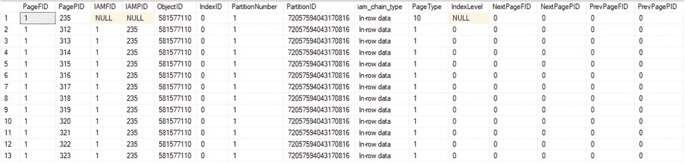
图 2-18
dbo.IndexInternalsOne 的 DBCC IND 结果

在这些结果中，有一个 IAM 页和十二个数据页分配给了该表。虽然 `DBCC EXTENTINFO` 提供了页面 312 作为区分配的开始，包含九个页面，但基于此无法确定 IAM 页在哪里。它实际上位于另一个结果未列出的区中，而 `DBCC IND` 的结果将其识别为位于页面 235。使用 `DBCC IND` 列出索引页面的好处在于，你可以获得确切的页码，而无需做任何猜测。此外，请注意结果中的索引级别返回为第 0 级，没有中间级别。如前所述，堆结构是扁平的，页面没有特定的顺序。

如前所述，前面示例中的表是在堆结构中组织的。对于下一个示例，你将观察在检查具有聚集索引的表时，`DBCC IND` 的输出是什么。在清单 2-12 中，首先创建表 `dbo.IndexInternalsThree`，并在 `RowID` 列上创建聚集索引。然后，你将插入四行。最后，示例在该表上执行 `DBCC IND`。

```
USE Chapter2Internals
GO
CREATE TABLE dbo.IndexInternalsThree
(
RowID INT IDENTITY(1,1)
,FillerData CHAR(8000)
,CONSTRAINT PK_IndexInternalsThree  PRIMARY KEY CLUSTERED (RowID)
)
GO
INSERT INTO dbo.IndexInternalsThree DEFAULT VALUES
GO 4
DBCC IND (0, 'IndexInternalsThree',-1)
```
清单 2-12
`DBCC IND` 聚集索引示例

图 2-19 显示了涉及 `dbo.IndexInternalsThree` 的此示例的结果。注意 `IndexLevel` 的返回方式与之前的示例（图 2-18）相比发生了变化。

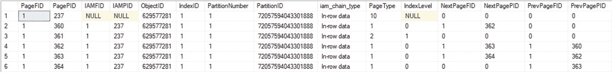
图 2-19
dbo.IndexInternalsThree 的 DBCC IND 结果

在此示例中，结果第三行的索引级别 `IndexLevel` 为 1，且 `PageType` 为 2（索引页）。根据这些结果，有足够的信息来重建索引的 B 树结构，如图 2-20 所示。B 树从 IAM 页开始，即页码 1:237。此页链接到页面 1:361，这是一个位于索引级别 1 的索引页。随后，页面 1:360、1:362、1:363 和 1:364 位于索引级别 0，并彼此双向链接。

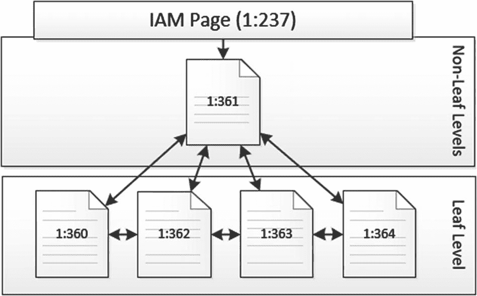
图 2-20


# 针对 dbo.IndexInternalsThree 的 DBCC IND 命令

通过以上两个示例，你已经研究了如何使用 `DBCC IND` 来调查与表或索引关联的数据页。正如示例所示，该命令提供了表或索引所有数据页的信息，包括 IAM 页。这些数据页包含页码以标识它们在数据库中的位置。数据页之间的关系也被包含在内，甚至包括用于遍历 B 树索引的下一页和上一页的页码。

如前所述，`sys.dm_db_database_page_allocations` 可以提供相同的信息甚至更多。为了演示这一点，清单 [2-13] 展示了如何从 `sys.dm_db_database_page_allocations` 获取与 `DBCC IND` 相同的信息。如果你比较输出，会注意到它们几乎相同；只在少数情况下 `NULL` 和 0 的返回值有所不同。有了这个能力，你应该优先使用 DMF（动态管理函数）而不是 `DBCC` 命令。

```
USE Chapter2Internals;
GO
SELECT
allocated_page_file_id AS PageFID
,allocated_page_page_id AS PagePID
,allocated_page_iam_file_id AS IAMFID
,allocated_page_iam_page_id AS IAMPID
,object_id AS ObjectID
,index_id AS IndexID
,partition_id AS PartitionNumber
,rowset_id AS PartitionID
,allocation_unit_type_desc AS iam_chain_type
,page_type AS PageType
,page_level AS IndexLevel
,next_page_file_id AS NextPageFID
,next_page_page_id AS NextPagePID
,previous_page_file_id AS PrevPageFID
,previous_page_page_id AS PrevPagePID
FROM sys.dm_db_database_page_allocations(DB_ID(), OBJECT_ID('dbo.IndexInternalsTwo'), 1, NULL, 'DETAILED')
WHERE is_allocated = 1;
GO
DBCC IND (0,'dbo.IndexInternalsTwo',1)
```
*清单 2-13*
*使用 sys.dm_db_database_page_allocations 获取与 DBCC IND 相同的输出*

## DBCC PAGE

最后一个可用于检查数据页内容的命令是 `DBCC PAGE`。虽然其他两个命令提供与表和索引相关的数据页信息，但 `DBCC PAGE` 的输出提供了查看数据页具体内容的能力。此外，即使使用动态管理函数，你仍然需要使用 `DBCC PAGE`，因为它的许多功能尚未通过 DMF 提供。清单 [2-14] 展示了使用 `DBCC PAGE` 的语法。

```
DBCC PAGE ( { database_name | database_id | 0}, file_number, page_number
[,print_option ={0|1|2|3} ])
```
*清单 2-14*
*DBCC PAGE 语法*

`DBCC PAGE` 命令接受多个参数。通过这些参数，命令能够确定请求的数据库和特定数据页，然后以请求的格式返回。表 [2-10] 详细列出了 `DBCC PAGE` 的参数。

*表 2-10*

*DBCC PAGE 参数*

| 参数 | 描述 |
| --- | --- |
| `database_name` &#124; `database_id` | 指定将要检索数据页的数据库名称或数据库 ID。如果此参数的值为 0 或未设置参数，将使用当前数据库。 |
| `file_number` | 指定将要从中检索数据页的数据库中数据文件的文件号。 |
| `page_number` | 指定数据库文件中将要检索的数据页的页码。 |
| `print_option` | 指定输出应如何返回。有四种打印选项可用：<br>***0 — 仅页头***：仅返回页头信息。<br>***1 — 十六进制行***：返回页头信息、页上的所有行以及偏移数组。在此输出中，每一行都单独返回。<br>***2 — 十六进制数据***：返回页头信息、页上的所有行以及偏移数组。与选项 1 不同，输出将所有行显示为单个数据块。<br>***3 — 数据行***：返回页头信息、页上的所有行以及偏移数组。此选项与其他选项的不同之处在于，行中列的数据按照其列名列出并转换。<br>此参数是可选的，当未选择任何选项时，默认使用 0。 |

### 注意

默认情况下，`DBCC PAGE` 命令将其消息输出到 SQL Server 事件日志。在大多数情况下，这不是理想的输出机制。跟踪标志 3604 允许你修改此行为。通过使用此跟踪标志，`DBCC` 语句的输出将返回到 SQL Server Management Studio (SSMS) 中的“消息”选项卡。

通过 `DBCC PAGE` 及其打印选项，可以检索数据页上的所有内容。你可能希望查看数据页内容的原因有几个。首先，查看索引或数据页可以帮助你理解索引为何以某种方式运行。你可以深入了解行内数据的结构，这可能导致行比预期更大。行的大小对索引的行为有重要影响，因为随着行变大，存储索引所需的数据页数量也会增加。索引数据页数量的增加会增加使用索引所需的资源，从而导致查询时间变长，并且在某些情况下，改变索引的使用方式或选择。使用 `DBCC PAGE` 的另一个原因是观察在某些操作发生时数据页会发生什么变化。正如本章后面的示例所示，`DBCC PAGE` 可用于揭示在页面拆分和转发明文记录操作期间发生的情况。

为了帮助演示如何使用 `DBCC PAGE`，你将使用每种打印选项运行几个演示。这些演示将基于清单 [2-15] 中的代码，该代码使用 `sys.dm_db_database_page_allocations` 来确定示例的页码。对于每个示例，你将查看结果在不同数据页类型之间的差异方式。虽然你的数据库中的页码可能略有不同，但演示基于一个页码为 238 的 IAM 页、一个页码为 377 的索引页，以及页码为 376 和 378 的数据页，如图 [2-21] 所示。

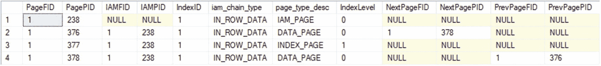

*图 2-21*
*dbo.IndexInternalsFour 的数据页分配*

```
USE [Chapter2Internals];
GO
CREATE TABLE dbo.IndexInternalsFour (
RowID INT IDENTITY(1, 1) NOT NULL,
FillerData VARCHAR(2000) NULL,
CONSTRAINT PK_IndexInternalsFour
PRIMARY KEY CLUSTERED ([RowID] ASC));
INSERT INTO dbo.IndexInternalsFour (FillerData)
VALUES (REPLICATE(1, 2000)),
(REPLICATE(2, 2000)), (REPLICATE(3, 2000)),
(REPLICATE(4, 2000)), (REPLICATE(5, 25));
SELECT allocated_page_file_id AS PageFID,
allocated_page_page_id AS PagePID,
allocated_page_iam_file_id AS IAMFID,
allocated_page_iam_page_id AS IAMPID,
index_id AS IndexID,
allocation_unit_type_desc AS iam_chain_type,
page_type_desc,
page_level AS IndexLevel,
next_page_file_id AS NextPageFID,
next_page_page_id AS NextPagePID,
previous_page_file_id AS PrevPageFID,
previous_page_page_id AS PrevPagePID
FROM sys.dm_db_database_page_allocations(DB_ID(), OBJECT_ID('dbo.IndexInternalsFour'), 1, NULL, 'DETAILED')
WHERE is_allocated = 1;
```
*清单 2-15*
*用于 DBCC PAGE 示例的 DBCC IND 查询*


##### 页面头——仅打印选项

`DBCC PAGE` 的第一个可用打印选项是页面头，其中 `print_option` 等于 0。使用此选项时，`DBCC` 命令的输出中仅返回页面头。所有 `DBCC PAGE` 请求都会返回页面头；使用此选项只是将结果限制为仅包含页面头。页面头包含两个部分。

第一部分是缓冲区信息。缓冲区提供关于页面当前在 SQL Server 内存中位置的信息。要读取页面，必须首先从磁盘检索页面并将其放入内存。此部分提供了可用于查找页面内存地址的地址。

第二部分是实际的页面头。页面头包含许多描述页面及其内容的属性。并非所有属性目前都被 SQL Server 使用，但有许多属性值得了解。这些关键属性在表 2-11 中列出并定义。

表 2-11

页面头关键属性定义

| 属性 | 定义 |
| --- | --- |
| `m_pageId` | 页面的文件 ID 和页码。 |
| `m_type` | 返回的页面类型；参见表 2-5 中的页面类型列表。 |
| `Metadata: AllocUnitId` | 映射自目录视图 `sys.allocation_units` 的分配单元 ID。 |
| `Metadata: PartitionId` | 表或索引的分区 ID。这映射到目录视图 `sys.partitions` 中的 `partition_ID`。 |
| `Metadata: ObjectId` | 表的对象 ID。这映射到目录视图 `sys.tables` 中的 `object_ID`。 |
| `Metadata: IndexId` | 表或索引的索引 ID。这映射到目录视图 `sys.indexes` 中的 `index_ID`。 |
| `m_prevPage` | 索引结构中的前一页。这在 B 树索引中用于允许沿索引级别读取连续页面。 |
| `m_nextPage` | 索引结构中的下一页。这在 B 树索引中用于允许沿索引级别读取连续页面。 |
| `m_slotCnt` | 页面上的槽数或行数。 |
| `Allocation Status` | 列出所请求页面的 GAM、SGAM、PFS、DIFF（或 DCM）和 ML（或 BCM）页面的位置。它还包括来自这些元数据页面中每个页面的状态。 |

为了演示 `DBCC PAGE` 的页面头-仅选项的使用，可以使用清单 2-16 中的代码。你的结果应与图 2-22 中的类似。在这些结果中，你可以在页面顶部看到页码，表明它是页面 1:377。`m_type` 为 2，这对应于索引页。`m_slotCnt` 显示页面上有两行。参考图 2-22，行数应与将数据页 1:376 和 1:378 映射到索引所需的两个索引记录相关。最后，分配状态显示该页面在 GAM 页面上已分配，根据 PFS 页面它已填满 0%，并且根据 DCM 页面，该页面自上次完整备份以来已被更改。

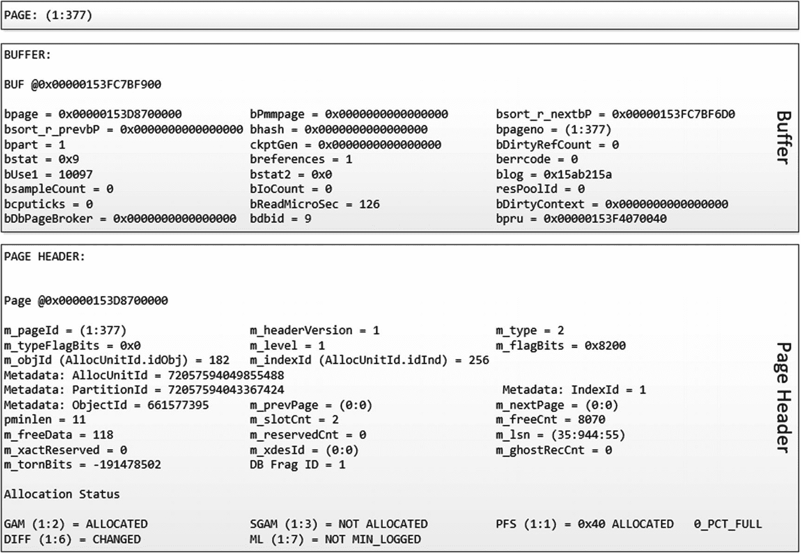

图 2-22

页面头-仅打印选项的 DBCC PAGE 输出

```
DBCC TRACEON(3604)
DBCC PAGE(0,1,377,0)
清单 2-16
使用页面头-仅打印选项的 DBCC PAGE
```

正如页面头-仅选项所示，页面头中有很多有用的信息。实际上，它提供了足够的信息来设想此页面如何与索引中的其他页面及其占用的区相关联。此信息与 `sys.dm_db_page_info` 类似，但从此时起，`DBCC PAGE` 提供的信息比 DMF 更多。

##### 十六进制行打印选项

`DBCC PAGE` 的下一个可用打印选项是十六进制行打印选项，其中 `print_option` 等于 1。此打印选项扩展了前一个选项，在输出中添加了页面上每个槽的条目以及描述页面上每个槽位置的偏移量数组。

页面的数据部分针对页面上的每一行重复，并包含与该行相关的所有元数据和数据。对于元数据，该行包括槽号、页面偏移量、记录类型和记录属性。这些信息有助于定义行以及除了数据大小之外还有什么因素影响行大小。在槽的末尾是该行的内存转储。内存转储以十六进制格式显示该行，虽然人类不易阅读，但包含该行的所有数据。有关属性及其定义的更多信息，请参见表 2-12。

偏移量数组是十六进制行选项结果中包含的最后一部分信息。偏移量数组包含表中每行的两个信息片段。第一个信息是槽号及其十六进制表示。第二个信息是该槽在页面上的字节位置。有了这两个信息片段，就可以定位并返回页面上的任何行。

表 2-12

十六进制行关键属性定义

| 属性 | 定义 |
| --- | --- |
| 槽 | 页面上行的位置。计数从 0 开始，紧接在页面头之后。 |
| 偏移量 | 页面上行的物理字节位置。 |
| 长度 | 页面上行的长度。 |
| 记录类型 | 行的类型。一些可能的值是 `INDEX_RECORD` 和 `PRIMARY_RECORD`。 |
| 记录属性 | 影响行大小的属性列表。这些可以包括 `NULL_BITMAP` 和 `VARIABLE_COLUMNS` 数组。 |
| 记录大小 | 页面上行的长度。 |
| 内存转储 | 页面上数据的内存位置。对于十六进制行选项，它仅限于该槽中的信息。提供内存地址，随后是存储在槽中的数据的十六进制转储。 |

对于十六进制行的示例，你将继续研究上一节中查看的索引页（1:279）。这次，你将使用十六进制行打印选项，即在 `DBCC PAGE` 中使用 `print_option` 为 1，如清单 2-17 所示。

`DBCC PAGE` 命令的结果将比上一次执行更长，因为这次它包含了带有页面头的行数据。为了专注于新信息，缓冲区和页面头结果已在图 2-23 的示例输出中被排除。在数据部分，显示了两个槽，槽 0 和槽 1。这些槽映射到页面上的两个索引行，这可以通过每行的记录类型为 `INDEX_RECORD` 来验证。这些行的十六进制数据包含索引记录的页面和范围信息，但此打印选项不会翻译这些信息。最后一部分是包含表上两行的槽信息的偏移量表。请注意，偏移量以 0 结尾并从底部开始向上计数。这与本章前面描述偏移量数组的方式相匹配。行在头部之后开始递增向上，而偏移量数组从页面末尾开始向后递增。通过这种方式，可以在不重新组织页面的情况下向表添加新行。

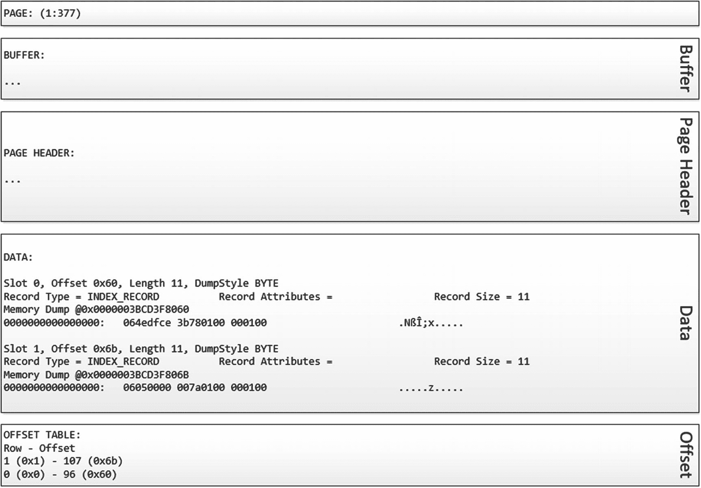

图 2-23

十六进制行打印选项的 DBCC PAGE 输出

```
DBCC TRACEON(3604)
DBCC PAGE(0,1,377,1)
清单 2-17
使用十六进制行打印选项的 DBCC PAGE
```


##### 十六进制行打印选项

十六进制行打印选项比第一个打印选项更为有用。它包含了页面头部信息，并在此基础上进行了扩展，提供了页面上实际行的详细信息。当你需要查看某一行以确定其在页面上的大小以及它为何可能比预期要大时，这些信息将非常有价值。

##### 十六进制数据打印选项

`DBCC PAGE` 的第三个可用打印选项是十六进制数据打印选项，其中 `print_option` 等于 `2`。此打印选项与前一个选项类似，同样以页面头部-仅打印选项的输出开始，并在此基础上进行补充。通过此选项添加的信息包括页面数据部分和偏移量数组的十六进制输出。对于数据部分，页面以其在实际页面上的原始形式完整、未经格式化地输出。当你希望以原始形式查看页面时，这种格式的输出非常有用。

为了演示十六进制数据打印选项，你将使用清单 2-18 中的脚本。其中使用 `DBCC PAGE` 命令从 `dbo.IndexInternalsFour` 中检索包含最后一行的页面。该行在 `FillerData` 列中包含 25 个数字 5。

```sql
USE Chapter2Internals
GO
DBCC TRACEON(3604)
DBCC PAGE(0,1,377,2)
```

清单 2-18 使用十六进制数据打印选项的 DBCC PAGE

结果如图 2-24 所示，输出包含数据部分中的一大块字符。该块包含三个组成部分。最左边是页面地址信息，例如 `0x0000003BCEBF8000`。页面地址标识了信息在页面上的位置。中间部分包含该页面部分中的十六进制数据。字符块的右侧包含十六进制数据的字符表示。在大多数情况下，这些数据是难以辨认的，除非存储的是来自字符数据类型（如 `char` 和 `nchar`）的字符数据。

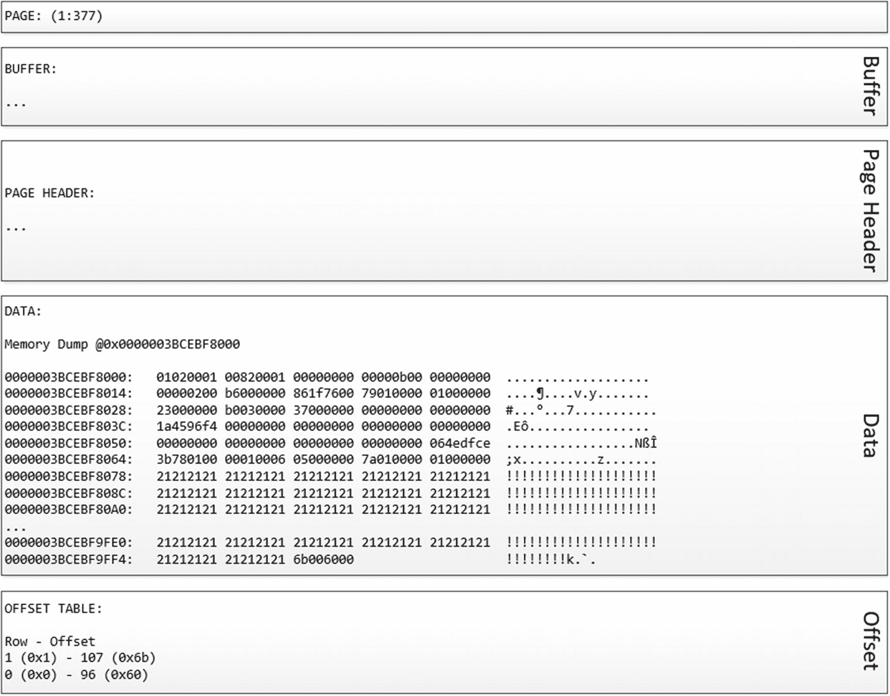

图 2-24 十六进制数据打印选项的 DBCC PAGE 输出

起初，十六进制数据打印选项似乎不如其他打印选项有用。在许多情况下，确实如此。此打印选项的真正价值在于 `DBCC PAGE` 并不试图为你解读页面。它按原样显示页面。使用其他打印选项时，输出有时会重新排序以符合预期的插槽顺序；第 8 章将展示一个这样的例子。

##### 行数据打印选项

`DBCC PAGE` 的最后一个可用打印选项是行数据打印选项，其中 `print_option` 等于 `3`。此打印选项的输出可能会根据所请求的页面类型而变化。对于大多数页面，返回的基本信息与十六进制行打印选项返回的信息相同：即按行分割的十六进制格式数据。然而，当涉及数据页和索引页时，输出就有所不同了。对于这些页面类型，此打印选项提供了一些关于页面的极其有用的信息。

### 注意

你可以将 `WITH TABLERESULTS` 选项与 `DBCC PAGE` 一起使用，以将命令的结果输出到结果集，而不是消息。当你希望将 `DBCC` 命令返回的结果插入表中时，此选项非常有用。

为了展示数据页和索引页输出的差异，让我们逐步分析另一个例子。此示例将使用清单 2-10 中创建的表 `dbo.IndexInternalsFour`。在此打印选项的演示中，如清单 2-19 所示，你将对表的一个数据页和索引页执行 `DBCC PAGE`。

```sql
USE Chapter2Internals
GO
DBCC TRACEON(3604)
DBCC PAGE(0,1,378,3) -- 数据页
DBCC PAGE(0,1,377,3) -- 索引页
```

清单 2-19 使用行数据打印选项的 DBCC PAGE

比较数据页的结果（如图 2-25 所示）与十六进制数据打印选项的输出（如图 2-24 所示），有一个主要区别。在插槽的十六进制内存转储下方，行中的所有列详细信息都被解码并以可读格式呈现。它从插槽 0 列 1 开始，该列包含 `RowID` 列，显示其值为 5。下一列，即第 2 列，是 `FillerData` 列，其中包含 25 个数字 5。对于这些列中的每一列，都注明了物理长度以及该值在行内的偏移量。页面数据部分提供的最后一个值是 `KeyHashValue`。此值实际上并不存储在页面上。相反，它是当页面放入内存时根据页面上的键创建的哈希值。此值显示在 SQL Server 用于向最终用户报告页面信息的工具中；在调查死锁时，你可能之前见过这个值。

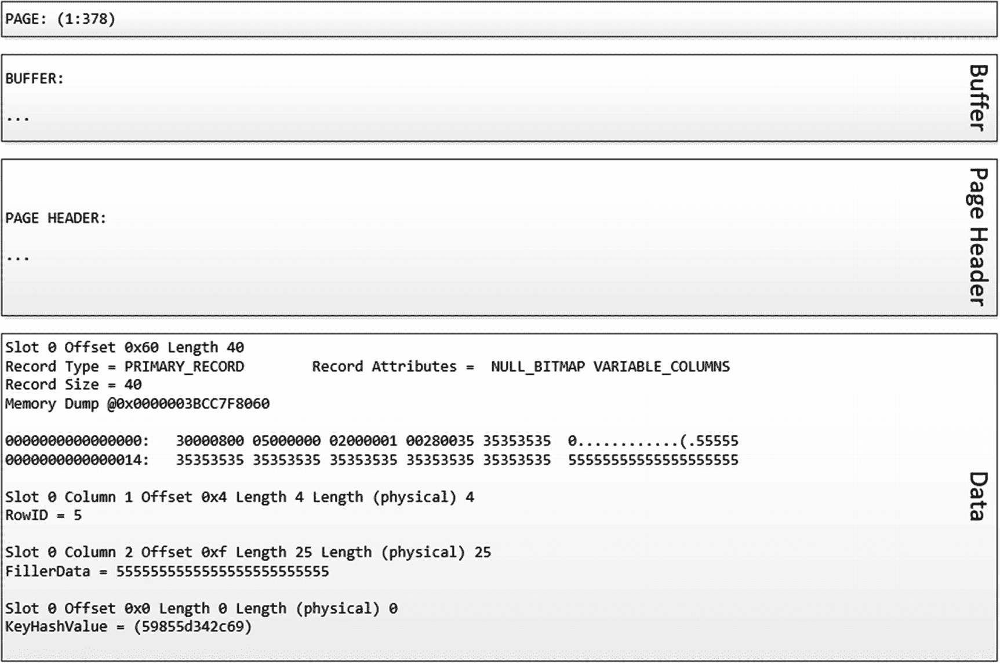

图 2-25 数据页行数据打印选项的 DBCC PAGE 输出

对于索引页，消息输出与其他页面类型没有变化。不同之处在于结果集。它不仅返回消息输出，还返回一个表。该表为页面上的每个索引行返回一行。查看索引页的输出，如图 2-26 所示，返回了两行。第一行表明页面 1:376 是索引页的子页面。它还显示索引的键值是 `RowID`，对于第一个索引行其值为 `NULL`。这意味着这是索引的开始，没有值限制子页面上的第一个值。第二行映射到页面 1:378，键值为 5。在这种情况下，键值表明子页面上的第一行的 `RowID` 为 5。由于键值可能因索引而异，使用这些选项的 `DBCC PAGE` 命令的结果也会相应变化。对于每个索引变体，输出都将返回与该索引相关的值。

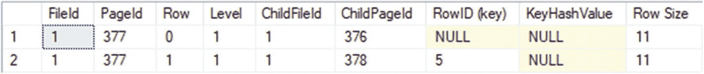

图 2-26 索引页行数据打印选项的 DBCC PAGE 输出

行数据打印选项是 `DBCC PAGE` 命令最有用的选项之一。对于数据页，它提供了对页面上存储的数据、其占用空间及其位置的全面洞察。这让你能直接理解为何只有某些行能放入页面，以及例如为何可能发生了页拆分。来自索引页输出的结果集同样有用。能够将索引行映射到页面并返回键值，可以深入了解索引的组织方式以及页面的布局。

## 页面碎片

正如本章通篇讨论的，SQL Server 将数据库中的信息存储在 8 KB 的页面上。通常，表中的记录限制在该大小内；如果它们小于 8 KB，SQL Server 会在一个页面上存储多条记录。每页存储多条记录的问题之一是处理页面上所有记录的总大小超过 8 KB 空间的情况。在这些情况下，SQL Server 必须改变页面上记录的存储方式。根据页面的组织方式，SQL Server 将通过两种方式来处理这些情况：转发记录和页拆分。


### 注意

本次讨论不考虑单条记录可能大于一个页面的两种情况。这些其他情况是行溢出和大对象。在行溢出的情况下，SQL Server 会在某些情况下允许页面上的单条记录超过 8 KB。此外，当大对象值超过 8 KB 大小时，它们会使用 LOB 页面而非数据页面。这些情况对本节讨论的页面碎片没有直接影响。

#### 转发记录

当记录大小超过数据页面时，管理它们的第一种方法是通过**转发记录**。此方法仅在使用**堆**结构时适用。对于转发记录，当一行被更新且不再适合数据页面时，SQL Server 会将该记录移动到堆中的一个新数据页面，并在两个位置之间添加指针。第一个指针标识记录现在所在的页面，通常称为转发记录指针。第二个指针位于新页面上，指回转发记录原来所在的原始页面；它被称为反向指针。

为了说明其工作原理，让我们逐步了解转发操作的一个逻辑示例。考虑一个使用堆结构的表中的页面，编号为 100（见图 2-27）。此页面上有四行，每行大小约为 2 KB，总共使用了 8 KB 的空间。如果第二行被更新为 2.5 KB 大小，它将无法再容纳在此页面上。SQL Server 会选择堆中的另一个页面，或为堆分配一个新页面，在此案例中是编号为 101 的页面。然后，第二行被写入该页面，并且指向新页面的指针替换了第 100 页上的该行。

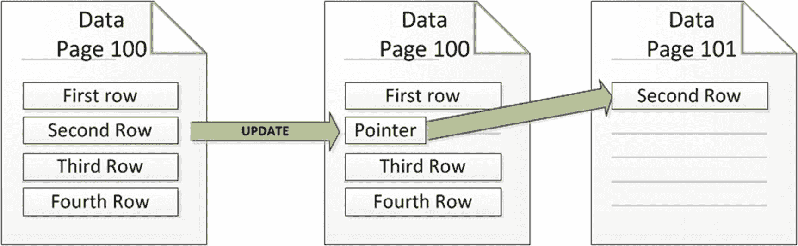

图 2-27

转发记录过程示意图

进一步扩展这个逻辑示例，接下来要做的是检查表中的记录是如何被转发的。例如，创建一个名为 `dbo.HeapForwardedRecords` 的表，如代码清单 2-20 所示。为了表示逻辑示例中的行，你将使用 `sys.objects` 表向 `dbo.HeapForwardedRecords` 添加 24 行。这些行中的每一行都有一个 `RowID` 来标识该行以及 2000 个字符，导致表中每页有四行。使用 `sys.dm_db_index_physical_stats`，你可以验证（见图 2-28）该表有六个页面，总共 24 条记录。


图 2-28

转发记录前 `dbo.HeapForwardedRecords` 的物理状态

```
USE AdventureWorks2017
GO
CREATE TABLE dbo.HeapForwardedRecords
(
RowId INT IDENTITY(1,1)
,FillerData VARCHAR(2500)
);
INSERT INTO dbo.HeapForwardedRecords (FillerData)
SELECT TOP 24 REPLICATE('X',2000)
FROM sys.objects;
DECLARE @ObjectID INT = OBJECT_ID('dbo.HeapForwardedRecords');
SELECT object_id, index_type_desc, page_count, record_count, forwarded_record_count
FROM sys.dm_db_index_physical_stats (DB_ID(), @ObjectID, NULL, NULL, 'DETAILED');
代码清单 2-20
转发记录场景
```

演示的下一步是在表中制造转发记录。为此，你将更新表中的每隔一行，将 `FillerData` 的值从 2000 个字符扩展到 2500 个字符，如代码清单 2-21 所示。结果，其中两行会变得太大，无法容纳在它们所在页面的剩余空间中。将会有大约 9 KB 的数据要写入 8 KB 的页面，而不是 8 KB。

因此，SQL Server 需要将记录移出页面才能完成更新。由于将一条记录移出页面会为页面留下足够空间来容纳第二行，因此只会转发一条记录。`sys.dm_db_index_physical_stats` 的输出（见图 2-29）证实了这一点。页面数增加到九个，并且有六条记录被记录为已转发。一个特别值得关注的项目是记录数。虽然表中的行数没有增加，但现在表中多了六条额外的记录。这是因为行的原始记录仍然在原始位置，带有一个指向其他地方包含该行数据的另一条记录的指针。


图 2-29

转发记录后 `dbo.HeapForwardedRecords` 的物理状态

```
USE AdventureWorks2017
GO
UPDATE dbo.HeapForwardedRecords
SET FillerData = REPLICATE('X',2500)
WHERE RowId % 2 = 0;
DECLARE @ObjectID INT = OBJECT_ID('dbo.HeapForwardedRecords');
SELECT object_id, index_type_desc, page_count, record_count, forwarded_record_count
FROM sys.dm_db_index_physical_stats (DB_ID(), @ObjectID, NULL, NULL, 'DETAILED');
代码清单 2-21
制造转发记录的脚本
```

转发记录的问题在于，它们导致表中的行在两个位置有记录，从而增加了从表中检索数据和向表写入数据时所需的 I/O 活动量。表越大，转发记录数量越多，转发记录对性能产生负面影响的可能性就越大。

## 页面拆分

处理页面上行数据大小超过页面大小的第二种方法是执行页面拆分。页面拆分适用于任何在 B 树索引结构下实现的索引，这包括聚集索引和非聚集索引。通过页面拆分，如果某行被更新到不再适合其当前所在数据页的大小，SQL Server 将获取该页面上一半的记录，并将它们放置到一个新页面上。然后，SQL Server 会再次尝试将该行的数据写入页面。如果此时数据能放入页面，则该页面将被写入。如果不能，则重复此过程直到数据能放入页面。

为了解释页面拆分如何操作，我们来逐步看一个导致页面拆分的更新操作。与上一节类似，考虑一个包含编号为 100 的页面的表（参见图 2-30）。页面 100 上存储了四行数据，每行大约 2KB 大小。假设其中一行，比如第二行，被更新到 2.5KB 大小。页面数据总量将达到 8.5KB，超过了可用空间，从而导致页面拆分发生。为了拆分页面，系统会分配一个新页面，编号为 101，并将原页面上一半的行（第三和第四行）写入新页面。此时，第二行就可以被写入原页面，因为原页面现在有 4KB 的空闲空间。

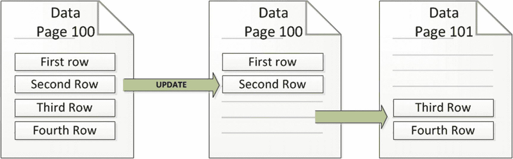

图 2-30：页面拆分过程图

为了演示页面拆分如何在表上发生，我们来看一个与前面描述类似的例子，它会导致表上发生页面拆分。首先，创建表`dbo.ClusteredPageSplits`，如清单 2-22 所示。向此表中插入 24 条长度约为 2KB 的记录。这将导致每页四行，并为该表分配六个数据页。查看索引级别 0（即叶级）的信息。由于该表使用了 B 树，通过聚集索引会有一个额外的页面用于索引树结构。在索引级别 1 上，有六条记录，它们引用了索引中的六个页面。你可以通过图 2-31 确认此信息。

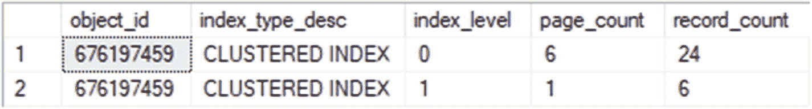

图 2-31：页面拆分前 `dbo.ClusteredPageSplits` 的物理状态

```
USE AdventureWorks2017
GO
CREATE TABLE dbo.ClusteredPageSplits
(
    RowId INT IDENTITY(1,1)
    ,FillerData VARCHAR(2500)
    ,CONSTRAINT PK_ClusteredPageSplits PRIMARY KEY CLUSTERED (RowId)
);
INSERT INTO dbo.ClusteredPageSplits (FillerData)
SELECT TOP 24 REPLICATE('X',2000)
FROM sys.objects;
DECLARE @ObjectID INT = OBJECT_ID('dbo.ClusteredPageSplits');
SELECT object_id, index_type_desc, index_level, page_count, record_count
FROM sys.dm_db_index_physical_stats (DB_ID(), @ObjectID, NULL, NULL, 'DETAILED');
```

清单 2-22：页面拆分场景

可以通过将某些记录更新到超过页面大小来导致表上的页面拆分。我们将通过执行一个`UPDATE`语句来完成此操作，该语句使用清单 2-23 中的脚本，将每隔一行的`FillerData`列长度从 2000 个字符增加到 2500 个字符。结果，每页上的行大小将达到 9KB，如同前面的例子一样，这超过了可用页面大小，从而导致 SQL Server 使用页面拆分来释放页面上的空间。

调查页面拆分发生后的结果（图 2-32）显示了页面拆分对表的影响。首先，在索引的叶级，页面数量不再是 6 个，而是在索引级别 0 上有 12 个页面。如前所述，当发生页面拆分时，页面被对半拆分，并添加一个新页面。由于表中所有数据页都被更新，所有页面都被拆分，导致叶级页面数量翻倍。索引级别 0 上唯一的变化是增加了六个页面来引用索引中的新页面。

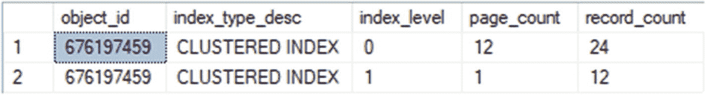

图 2-32：页面拆分后 `dbo.ClusteredPageSplits` 的物理状态

```
USE AdventureWorks2017
GO
UPDATE dbo.ClusteredPageSplits
SET FillerData = REPLICATE('X',2500)
WHERE RowId % 2 = 0;
DECLARE @ObjectID INT = OBJECT_ID('dbo.ClusteredPageSplits');
SELECT object_id, index_type_desc, index_level, page_count, record_count
FROM sys.dm_db_index_physical_stats (DB_ID(), @ObjectID, NULL, NULL, 'DETAILED');
```

清单 2-23：导致页面拆分的脚本

页面拆分和转寄记录之间有两个值得提及的区别。首先，当页面拆分发生时，数据页上的记录数量并未增加。页面拆分移动了记录的位置，以便为逻辑索引顺序内的记录腾出空间。第二，页面拆分不会增加记录计数。由于页面拆分已经为记录腾出了空间，因此不需要额外的记录来指向数据存储的位置。

页面拆分可能导致与转寄记录类似的性能问题。这些性能问题既发生在页面拆分进行时，也发生在拆分完成后。在页面拆分期间，正在被拆分的页面在记录被分割到两个页面之间时需要被独占锁定。这意味着，当页面拆分发生时，如果有人需要访问除正在更新的行之外的行，就可能出现争用。页面拆分后，索引中数据页的物理顺序几乎总是不符合其在索引中的逻辑顺序。这会中断 SQL Server 执行连续读取的能力，降低了单次操作可以读取的数据量。此外，与在较少页面上查询相同结果相比，执行查询需要读入内存的页面越多，查询性能就越慢。

## 索引特性

本章第一部分讨论了用于存储索引的物理结构。在这些部分中，并未明确定义可用索引类型与这些结构之间的界限。本节将讨论 SQL Server 的主要索引类型，以及它们使用的索引结构。对于每种类型，你将了解到与之相关的要求和限制。

#### 堆

第一个要讨论的索引类型是堆。正如本书前面指出的，堆实际上并不是一种索引类型。相反，它是表上缺少聚集索引的结果。堆索引，顾名思义，将使用堆结构来组织表中的页面。

创建具有堆的表只有一个要求。这个要求是：表上不能已经创建了聚集索引。如果存在聚集索引，那么就不会使用堆。堆和聚集索引是互斥的。此外，只要没有聚集索引，一个表上只能有一个堆。堆用于存储索引的数据页，并且这个操作只执行一次。

使用堆时的主要问题是堆中的数据是无序的。没有任何列决定页面上数据的排序结果是，如果没有其他支持的非聚集索引，查询将总是被迫扫描表中的信息。

#### 聚集索引

第二种索引类型是 `聚集索引`。`聚集索引`使用 `B 树` 来存储数据。从所有实际目的来看，`聚集索引` 是 `堆表` 的对立面。当在表上构建 `聚集索引` 时，`堆表` 会被 `B 树` 结构所取代，根据 `聚集索引` 的键列来组织数据页。`聚集索引` 的 `B 树` 包含了表中所有行数据的数据页。

在考虑索引列时，`聚集索引` 有一些限制。第一个限制是键列的总长度不能超过 900 字节。其次，`聚集索引` 中的聚类键必须是唯一的。如果聚类键中的列不唯一，SQL Server 在存储该行时会添加一个隐藏的唯一标识符列。该唯一标识符是一个 4 字节的数值，被添加到非唯一的聚类键中以强制实现唯一性。唯一标识符的大小不计入 900 字节的限制内。

构建 `聚集索引` 时，有几件事需要考虑。首先，每个表只能有一个 `聚集索引`。由于 `聚集索引` 是按照聚类键的顺序存储的，并且行数据与键存储在一起，因此无法在表上再进行第二种方式的排序。此外，在已包含 `堆表` 的现有表上构建 `聚集索引` 时，请确保有足够的空间来存放数据的第二个副本。在索引构建完成之前，两个数据副本都将存在。

正如后续章节将讨论的，通常更倾向于在所有表上创建 `聚集索引`。这种偏好并非绝对，有些情况下 `聚集索引` 并不合适。你需要在自己的数据库中进行调查，以确定哪种结构最佳。只需将此偏好作为一个起点即可。

#### 非聚集索引

接下来要讨论的索引类型是 `非聚集索引`。`非聚集索引` 在几个方面与 `聚集索引` 相似。首先，`非聚集索引` 使用 `B 树` 结构来存储数据。它们的键列同样限制在 900 字节以内。

除了与 `聚集索引` 的相似之处外，它们也有一些区别。首先，一个表上可以有多个 `非聚集索引`。事实上，一个表上最多可以有 999 个 `非聚集索引`，每个索引不超过 16 列。这个上限并非鼓励创建如此多的索引；它只是表明了可以创建的 `非聚集索引` 的总数。然而，借助筛选索引，有时可能值得在表上创建比传统认为合适的数量更多的索引。此外，`非聚集索引` 的叶级并非存储实际数据，而是指向表上 `堆表` 或 `聚集索引` 中数据所在位置的页面引用。

#### 列存储索引

本节讨论的最后一种索引类型是 `列存储索引`。顾名思义，`列存储索引` 使用 `列存储` 结构。`列存储索引` 可以是 `聚集` 类型，也可以是 `非聚集` 类型。

两种类型的 `列存储索引` 都有许多限制需要考虑。首先，并非所有数据类型都可用于 `列存储索引`。不能使用的数据类型包括：`binary`、`varbinary`、`ntext`、`text`、`image`、`nvarchar(max)`、`varchar(max)`、`uniqueidentifier`、`rowversion`、`sql_variant`、`decimal`（精度大于 18 位）、`datetimeoffset`、`xml` 以及基于 CLR 的类型。虽然表中的所有列都应该添加到 `聚集索引` 中，但 `列存储索引` 有 1,024 列的限制。此外，由于 `列存储索引` 的特性，索引不能是唯一的、聚集的、包含包含列，也不能指定升序或降序。同时，一个表上只能有一个 `列存储索引`。这个限制不是问题，因为建议将表中的每个列都包含在 `列存储索引` 中。

另外，对于 `非聚集列存储索引`，还有一些额外的限制。首先，`列存储索引` 是只读的。一旦创建，就不能修改表中的数据。因此，通常值得对基础表进行分区，以减少需要包含在 `列存储索引` 中的数据量，并允许在向表中添加新数据时重建索引。

另一方面，`聚集列存储索引` 拥有一些 `非聚集列存储索引` 所没有的额外功能。`聚集列存储索引` 是可写的，这是通过一个隐藏的 `堆表` —— `增量存储` 实现的，它会在收到新行时存储它们，并随着时间的推移将它们压缩成 `列存储` 行组。`聚集列存储索引` 中的 `聚集` 表示它是表中所有数据的存储结构。这意味着除了 `列存储索引` 之外，没有其他结构（如 `堆表`）包含数据。

使用 `列存储索引` 时，SQL Server 中有一些功能无法与之结合使用。由于 `列存储` 使用其自身的压缩技术，它不能与行压缩或页压缩结合使用。它不能与复制、更改跟踪或更改数据捕获一起使用。这些技术与 `列存储` 结合没有意义，因为它们有助于读写场景，而 `列存储索引` 是只读的。最后的功能限制是 `filestream` 和 `filetable`，它们不能与 `列存储` 一起使用。

## 本章小结

在本章中，你了解了用作索引构建块的组成部分。现在你已具备必要的基础，能够创建出符合你预期和期望行为的索引。回顾一下，你了解了 SQL Server 用于在数据库中存储数据的不同类型页面，以及这些页面如何在区中组合在一起。然后你了解了可用于组织页面的结构，不是为了物理存储，而是以逻辑方式访问这些页面上的数据。接着你了解了通过 `DBCC` 命令调查索引页面和结构的可用工具。本章最后回顾了索引结构与可用索引类型之间的关联。

脚注 1


# 3. 索引元数据与统计信息

既然你已经理解了索引的逻辑和物理基础，接下来应该了解索引统计信息的存储方式。这些统计信息有助于深入了解 SQL Server 如何能够利用以及正在如何利用索引。它们也提供了解读索引可能未被选中及其运行状况所需的信息。本章将让你更深入地理解这些信息在何处以及如何被收集。你将研究一些可用的附加 `DBCC` 命令和动态管理对象（DMO），并了解这些信息是如何产生的。

本章涵盖的统计信息涉及四个信息领域。第一个领域是列级统计信息。这为查询优化器提供列内以及索引内数据分布情况的信息。下一个领域是索引使用情况统计信息。此处的信息有助于深入了解索引是否被使用以及如何被使用。第三个领域是操作统计信息。这些信息与使用情况统计信息类似，但提供了更深入的洞察。最后一个信息领域是物理统计信息，它提供了索引物理特性的洞察，以及索引在数据库内是如何分布的。

此外，在本章中，你将回顾列存储索引可用的元数据和统计信息，并探索所收集的信息。这些信息有助于理解列存储索引存储了什么，以及它可能如何影响针对列存储索引的查询性能。

## 列级统计信息

让我们首先看一下统计信息的第一个领域：列级统计信息。在索引方面，这是 SQL Server 中最重要的领域之一。列级统计信息提供有关数据及其值在索引键列上分布情况的信息。SQL Server 使用这些信息来确定索引内值的预期频率和分布；这被称为 *基数*。

通过基数，查询优化器制定基于成本的执行计划，以找到执行所提交请求的最佳执行计划。如果索引的统计信息不正确或不再代表索引中的数据，则创建的计划很可能效率低下。理解统计信息并能够与之交互非常重要，以确保你环境中的索引不仅存在，而且能提供预期的效益。

### 注意

通常，当重建索引以“修复”性能问题时，碎片通常不是问题的原因或直接解决方案。重建时，索引会获得新的统计信息，并且与这些索引相关的执行计划需要重新编译，这两者中的任何一个都可能是性能问题的原因，而非任何索引碎片。

在 SQL Server 中有许多与统计信息交互的方法。在接下来的章节中，你将回顾一些最常见的机制。对于每种方法，你将了解它是什么、提供什么以及使用每种方法的价值。

### DBCC SHOW_STATISTICS

第一种，也可能是最熟悉的，与统计信息交互的方式是通过 `DBCC` 命令 `SHOW_STATISTICS`。此命令将返回所请求的数据库对象（表或索引视图）的统计信息。返回的信息是一个统计信息对象，包含三个不同的组件：头信息、直方图和密度向量。这些组件都为 SQL Server 提供了索引中可用数据的理解。

可以使用清单 3-1 中的 `DBCC` 语法返回统计信息对象。此语法接受表或索引视图的名称作为统计信息的来源，然后返回目标。目标可以是索引的名称，也可以是创建的列级统计信息。

```
DBCC SHOW_STATISTICS ( table_or_indexed_view_name , target )
[ WITH [  ]
清单 3-1
DBCC SHOW_STATISTICS 语法
```

`DBCC` 命令可以包含四个选项：`NO_INFOMSGS`、`STAT_HEADER`、`DENSITY_VECTOR`、`HISTOGRAM`。这些选项中的任何一个或全部都可以包含在逗号分隔的列表中。

`NO_INFOMSGS` 选项会在 `DBCC` 命令执行时抑制所有信息性消息。这些是严重级别从 0 到 10 的错误消息，其中 10 是最高严重级别的错误。在大多数情况下，由于这些错误消息是信息性的，在使用此 `DBCC` 语句时它们没有价值。

`STAT_HEADER`、`DENSITY_VECTOR`、`HISTOGRAM` 选项限制了 `DBCC` 命令的输出。如果包含了一个或多个选项，则只返回所包含项对应的统计信息组件。如果这些选项都没有被选中，则包含所有组件。还有一个 `STATS_STREAM` 选项，这里不讨论，因为它不受支持，并且在未来版本中可能不再包含。

定义了 `DBCC` 命令后，让我们逐一介绍每个统计信息组件。每个组件都将被定义，然后将探索来自 AdventureWorks2017 数据库的内容示例。你将要查看的结果可以通过清单 3-2 创建。

```
USE AdventureWorks2017
GO
DBCC SHOW_STATISTICS ( 'Sales.SalesOrderDetail'
, PK_SalesOrderDetail_SalesOrderID_SalesOrderDetailID )
清单 3-2
针对 Sales.SalesOrderDetail 表上索引的 DBCC SHOW_STATISTICS
```

## 统计信息头

统计信息头是统计信息对象的元数据部分。这些列（列于表 3-1 中）主要是信息性的。它们告知在构建统计信息时考虑了多少行，以及这些行是如何通过筛选选定的。表 3-1 还包含了统计信息上次更新的时间信息，这在调查统计信息质量的潜在问题时非常有用。

表 3-1：`DBCC SHOW_STATISTICS` 的统计信息头列

| 列名 | 描述 |
| --- | --- |
| `Name` | 统计信息对象的名称。对于索引统计信息，这与索引名称相同。 |
| `Updated` | 统计信息上次更新的日期和时间。 |
| `Rows` | 统计信息上次更新时，表或索引视图中的总行数。对于筛选的统计信息或索引，计数指的是符合筛选条件的行数。 |
| `Rows Sampled` | 用于统计信息计算的抽样行总数。当 `Rows Sampled` 的值小于 `Rows` 中的值时，直方图和密度值是估计值。 |
| `Steps` | 直方图中的步数。每个步长跨越一个列值范围，后跟一个上限列值。直方图步长在统计信息的第一个关键列上定义。最大步数为 200。 |
| `Density` | 计算为 1/*唯一值数量*，针对统计信息对象第一个关键列中的所有值，不包括直方图边界值。从 SQL Server 2008 开始，SQL Server 不再使用此值。 |
| `Average Key Length` | 统计信息对象中所有关键列的每个值的平均字节数。 |
| `String Index` | 指示统计信息对象是否包含字符串摘要统计信息，以改进使用 `LIKE` 运算符的查询谓词的基数估计。 |
| `Filter Expression` | 当填充时，这是包含在统计信息对象中的表行子集的谓词。 |
| `Unfiltered Rows` | 应用筛选表达式之前表中的总行数。如果 `Filter Expression` 为 `NULL`，则 `Unfiltered Rows` 等于 `Rows`。 |
| `Persisted Sample Percent` | 在 SQL Server 2016 中添加，显示用于更新统计信息的抽样百分比。如果为零，则表示没有为统计信息设置抽样百分比。 |

查看 `Sales.SalesOrderDetail` 表上 `PK_SalesOrderDetail_SalesOrderID_SalesOrderDetailID` 的统计信息头信息（如图 3-1 所示），你会看到一些值得关注的项目。首先，由于 `Rows` 和 `Rows Sampled` 值相同，你知道统计信息并非基于估计。其次，统计信息最后更新于 2017 年 10 月 27 日（尽管你数据库中的此值可能不同）。另一个项目是，统计信息直方图中有 163 步，最大可能步数为 200。步数等于范围数。在这种情况下，163 步意味着有 163 个范围，每个范围在统计信息中都有一个上限值。上限值定义了该范围内的最大值。如果第 1 步的上限值是 42，那么第 1 步将覆盖值 0–42。下一步将从 43 开始，并包含直到其上限值的值。请注意缺少筛选表达式和未筛选行数；索引和统计信息都没有筛选掉行。最后，`Persisted Sample Percent` 设置为 0，这意味着所有行都用于统计信息的抽样，这可以通过比较 `Rows` 和 `Rows Sampled` 来确认。


图 3-1：`Sales.SalesOrderDetail` 表上索引的统计信息头

## 密度向量

统计信息组件的下一部分是密度向量。密度向量描述了统计信息对象内的列。对于统计信息或索引对象中的每个关键值，都有一行。例如，如果一个名为 `SaleOrderID` 和 `SalesOrderDetailID` 的索引中有两列，密度向量中将有两行。密度向量将有一行用于 `SaleOrderID`，另一行用于 `SaleOrderID` 和 `SalesOrderDetailID`，如图 3-2 所示。密度向量有三部分信息可用：密度、平均长度以及包含在向量中的列（列名详见表 3-2）。

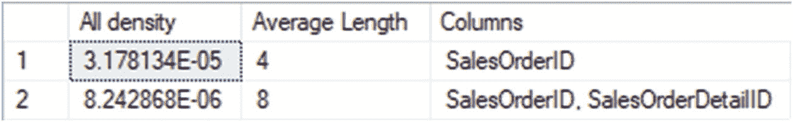

图 3-2：`Sales.SalesOrderDetail` 表上索引的密度向量示例

密度向量的价值在于它帮助查询优化器调整多列统计信息对象的基数。正如我们将在下一节讨论的，直方图中的范围仅基于统计信息对象的第一列，而密度则提供了在执行单列或多列查询时的调整。虽然更新统计信息的重点通常在于直方图的变化，但密度向量提供了一种宝贵的方法，用于调整直方图中的范围，以适应超出索引第一列的数据分布差异。

表 3-2：`DBCC SHOW_STATISTICS` 的密度向量列

| 列名 | 描述 |
| --- | --- |
| `All Density` | 返回统计信息对象中每个列前缀的密度，每密度一行。密度计算为 1/*不同列值数量*。密度越接近 1，列中的值越均匀。 |
| `Average Length` | 存储密度向量每个级别的列值的平均长度（以字节为单位）。 |
| `Columns` | 每个密度向量级别中的列名。 |


#### 直方图

DBCC SHOW_STATISTICS 输出的最后一部分是直方图。直方图提供了查询优化器用于确定基数的统计对象的详细信息。构建直方图时，SQL Server 会基于统计样本或表/视图中的所有行计算一系列聚合值。这些聚合值衡量值出现的频率，并将值分组为不超过 200 个段或*步骤*。对于每个步骤，都会计算统计列的分布，包括步骤中的行数、步骤的上界、匹配上界的行数、步骤中的不同行数以及步骤中重复值的平均数。表 3-3 列出了与这些聚合值对应的列。利用这些信息，查询优化器能够估算索引中值范围返回的行数，从而使其能够计算检索行的相关成本。

**表 3-3**
**DBCC SHOW_STATISTICS 中的直方图列**

| 列名 | 描述 |
| --- | --- |
| `RANGE_HI_KEY` | 直方图步骤的上界列值。该列值也称为*键值*。 |
| `RANGE_ROWS` | 列值落在直方图步骤内（不包括上界）的估计行数。 |
| `EQ_ROWS` | 列值等于直方图步骤上界的估计行数。 |
| `DISTINCT_RANGE_ROWS` | 直方图步骤内（不包括上界）具有不同列值的估计行数。 |
| `AVG_RANGE_ROWS` | 直方图步骤内（不包括上界，计算公式为 `RANGE_ROWS/DISTINCT_RANGE_ROWS`，当 `DISTINCT_RANGE_ROWS > 0` 时）重复列值的平均行数。 |

如第一部分所述，直方图中有 163 个步骤。在图 3-2 中（包含直方图的一些行），您可以看到 `Sales.SalesOrderDetail` 表中的部分步骤是如何聚合的。如果您查看图 3-3 中的第二项，它显示了 `RANGE_HI_KEY` 值为 43692；这意味着 43660 到 43692 之间的所有 `SalesOrderID` 值都包含在这些估算中。基于 `RANGE_ROWS` 值，此系列中有 282 行，其中包含 32 个不同行。将这些数字转换到 `SalesOrderDetail` 表，即有 32 个不同的 `SalesOrderID` 值，其间有 282 个 `SalesOrderDetailID` 项。最后，对于 `SalesOrderID` 43692，有 28 个 `SalesOrderDetailID` 项。

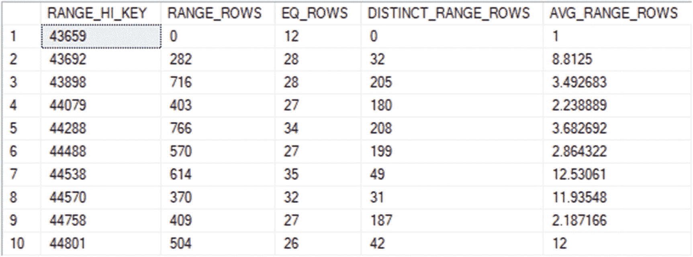
**图 3-3**
**Sales.SalesOrderDetail 表上索引的直方图示例**

最后需要查看的一列是 `AVG_RANGE_ROWS`。该列中的值非常重要，当统计信息过时时可能会导致很多问题。它说明了从统计信息中检索单个值或值范围时预期的行数。要检查范围平均值的准确性，请执行清单 3-3，该查询将聚合第二步骤中的一些值。完成后，结果（如图 3-4 所示）将显示平均值与 8.8125 的平均范围行数值非常接近。

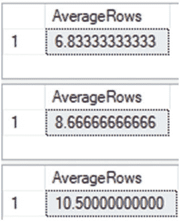
**图 3-4**
**AVG_RANGE_ROWS 估算验证结果**

```
USE AdventureWorks2017
GO
SELECT (COUNT(*)*1.)/COUNT(DISTINCT SalesOrderID) AS AverageRows
FROM Sales.SalesOrderDetail
WHERE SalesOrderID BETWEEN 43672 AND 43677;
SELECT (COUNT(*)*1.)/COUNT(DISTINCT SalesOrderID) AS AverageRows
FROM Sales.SalesOrderDetail
WHERE SalesOrderID BETWEEN 43675 AND 43677;
SELECT (COUNT(*)*1.)/COUNT(DISTINCT SalesOrderID) AS AverageRows
FROM Sales.SalesOrderDetail
WHERE SalesOrderID BETWEEN 43675 AND 43680;
```
**清单 3-3**
**查询以验证 AVG_RANGE_ROWS 估算值**

当索引的统计信息受到质疑时，此直方图是一个宝贵的工具。如果需要确定查询为何以特定方式运行，或者需要检查查询计划为何如此估算行数，则可以使用直方图来验证这些行为和结果。

#### 目录视图

使用 `DBCC SHOW_STATISTICS` 提供了关于查询优化统计信息的最详细信息。但是，它依赖于用户知道统计信息的存在。对于索引统计信息，由于所有索引都有统计信息，因此很容易知道。列级统计信息则需要一种替代方法来发现。这通过两个目录视图完成：`sys.stats` 和 `sys.stats_columns`。

##### sys.stats

目录视图 `sys.stats` 为数据库中存在的每个查询优化统计对象返回一行。无论统计信息是基于索引还是列创建的，该统计对象都会列在视图中。表 3-4 列出了 `sys.stats` 中的列。

**表 3-4**
**sys.stats 的列**

| 列名 | 数据类型 | 描述 |
| --- | --- | --- |
| `object_id` | `int` | 这些统计信息所属对象的 ID。 |
| `name` | `sysname` | 统计信息的名称。对于每个 `object_id`，此值必须唯一。 |
| `stats_id` | `int` | 统计信息的 ID（在对象内唯一）。 |
| `auto_created` | `bit` | 统计信息是由查询处理器自动创建的。 |
| `user_created` | `bit` | 统计信息是由用户显式创建的。 |
| `no_recompute` | `bit` | 统计信息是使用 `NORECOMPUTE` 选项创建的。 |
| `has_filter` | `bit` | 指示统计信息是否基于筛选器或行子集进行聚合。 |
| `filter_definition` | `nvarchar(max)` | 筛选统计信息中包含的行子集的表达式。 |
| `is_temporary` | `bit` | 指示统计信息是否为临时统计信息。在 SQL Server 2012 中添加。 |
| `is_incremental` | `bit` | 指示统计信息是否为增量统计信息。在 SQL Server 2014 中添加。 |
| `has_persisted_sample` | `bit` | 指示统计信息是否具有持久化的采样率。在 SQL Server 2019 中添加。 |
| `stats_generation_method` | `int` | 标识统计信息生成方法的标志。在 SQL Server 2019 中添加。 |
| `stats_generation_method_desc` | `varchar(80)` | 标识统计信息生成方法的文本描述。在 SQL Server 2019 中添加。 |

##### sys.stats_columns

作为 `sys.stats` 的配套视图，目录视图 `sys.stats_columns` 为统计对象中的每一列提供一行。表 3-5 列出了 `sys.stats_columns` 中的列。

**表 3-5**
**sys.stats_columns 的列**

| 列名 | 数据类型 | 描述 |
| --- | --- | --- |
| `object_id` | `int` | 此列所属对象的 ID。 |
| `stats_id` | `int` | 此列所属统计信息的 ID。 |
| `stats_column_id` | `int` | 在一组统计列中的 1 基序号。 |
| `column_id` | `int` | 来自 `sys.columns` 的列 ID。 |


##### STATS_DATE

当谈到统计信息时，一个被问及的最重要问题是这些统计信息是否已过时。判断统计信息是否过时的一种常用方法是使用 `STATS_DATE` 函数。`STATS_DATE` 函数提供了统计信息最近一次更新的日期。该函数的语法如清单 3-4 所示，它接受一个 `object_id` 和一个 `stats_id`。对于索引而言，`stats_id` 与 `index_id` 是同一个值。

```
STATS_DATE ( object_id , stats_id )
```
**清单 3-4**
**STATS_DATE 语法**

虽然 `STATS_DATE` 函数常被用于识别过时的统计信息，但对于此任务来说，这种方法并不有效。统计信息上次更新的日期并不一定反映数据变化的速率。一个数年未更新、统计信息有数月之久的表，其统计信息可能并未过时；而一个持续进行插入、更新和删除操作，其统计信息在昨日刚更新过的表，其统计信息可能已不再能代表索引中的实际值。尽管该函数对于统计信息变化缓慢的索引可能有用，但鉴于上述示例，应谨慎使用。

##### sys.dm_db_stats_properties

一个更好的用于识别统计信息变化率的方法是使用 `sys.dm_db_stats_properties` DMO（动态管理对象），它提供了一个能反映数据变化情况的限定符。这个 DMO 在 SQL Server 2008 中引入，提供了自统计信息上次更新以来发生变化的行数的详细信息。`sys.dm_db_stats_properties` 的语法如清单 3-5 所示，它接受一个 `object_id` 和一个 `stats_id`。与 `STATS_DATE` 一样，`stats_id` 与 `index_id` 是同一个值。表 3-6 列出了 `sys.dm_db_stats_properties` 中的列。

**表 3-6**
**sys.dm_db_stats_properties 的列**

| 列名 | 数据类型 | 描述 |
| --- | --- | --- |
| `object_id` | `int` | 所讨论对象的 ID。 |
| `stats_id` | `int` | 统计信息的 ID。对于索引，此 ID 与索引 ID 匹配。 |
| `last_updated` | `datetime2(7)` | 统计信息上次更新的日期和时间。 |
| `rows` | `bigint` | 统计信息上次更新时，表或索引视图中的总行数。对于筛选统计信息或索引，此计数指的是符合筛选条件的行数。 |
| `rows_sampled` | `bigint` | 用于统计信息计算的采样行总数。当 `rows_sampled` 值小于 `rows` 中的值时，直方图和密度值是估计值。 |
| `steps` | `int` | 直方图中的步数。每个步跨越一个列值范围，后跟一个上限列值。直方图步长基于统计信息中的第一个关键列定义。最大步数为 200。 |
| `unfiltered_rows` | `bigint` | 应用筛选表达式之前表中的总行数。如果 `筛选表达式` 为 `NULL`，则 `unfiltered_rows` 等于 `rows`。 |
| `modification_counter` | `bigint` | 自上次为该表更新统计信息以来，插入、删除或更新的行总数计数。 |
| `persisted_sample_percent` | `Float` | 在 SQL Server 2016 中添加。 |

```
sys.dm_db_stats_properties (object_id, stats_id)
```
**清单 3-5**
**sys.dm_db_stats_properties 的语法**

由于 `sys.dm_db_stats_properties` 提供了更好质量的方式来理解统计信息是否过时，让我们来看一下输出，看看表中的值变化如何影响 `modification_counter` 列。为此，你将首先使用清单 3-6 创建表 `dbo.SalesOrderHeaderStats` 及其一些索引。为了研究 `modification_counter`，你将使用清单 3-7 中的查询来查看该列的变化。从图 3-5 中，你可以看到表中有 20,000 行数据，对于列出的每个索引和统计信息，当前的 `modification_counter` 值均为 0。

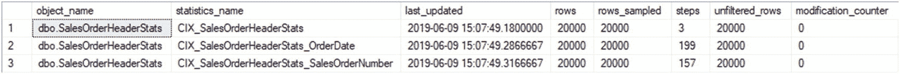
**图 3-5**
**在 dbo.SalesOrderHeaderStats 上执行 sys.dm_db_stats_properties 的查询结果**

```
USE AdventureWorks2017
GO
SELECT
OBJECT_SCHEMA_NAME(s.object_id)
+'.'+OBJECT_NAME(s.object_id) AS object_name
,s.name as statistics_name
,x.last_updated
,x.rows
,x.rows_sampled
,x.steps
,x.unfiltered_rows
,x.modification_counter
FROM sys.stats s
CROSS APPLY sys.dm_db_stats_properties(s.object_id, s.stats_id) x
WHERE s.object_id = OBJECT_ID('dbo.SalesOrderHeaderStats')
```
**清单 3-7**
**用于 dbo.SalesOrderHeaderStats 的 sys.dm_db_stats_properties 查询**


```
USE AdventureWorks2017
GO
DROP TABLE IF EXISTS dbo.SalesOrderHeaderStats;
SELECT SalesOrderID
,OrderDate
,SalesOrderNumber
INTO dbo.SalesOrderHeaderStats
FROM Sales.SalesOrderHeader
WHERE SalesOrderID <= 63658
CREATE CLUSTERED INDEX CIX_SalesOrderHeaderStats
ON dbo.SalesOrderHeaderStats(SalesOrderID)
CREATE INDEX CIX_SalesOrderHeaderStats_OrderDate
ON dbo.SalesOrderHeaderStats(OrderDate)
CREATE INDEX CIX_SalesOrderHeaderStats_SalesOrderNumber
ON dbo.SalesOrderHeaderStats(SalesOrderNumber)
清单 3-6
为 sys.dm_db_stats_properties 审查准备表
```

现在你有了一个可供操作的表，让我们来看看当表中的数据发生变化时会发生什么。在示例中，你将查看五个不同的查询，如清单 3-8 所示。第一个查询更新 `OrderDate` 列，导致 40 行被更改。第二个查询更新了 50 行，其中 `SalesOrderNumber` 被更新为其当前包含的相同值。第三个查询再次更新 `SalesOrderNumber` 列，但为相同的 50 行反转了该值。第四个查询向表中插入了 11,465 条记录。最后一个查询从表中删除了前 20,000 条记录。在每两个查询之间，执行清单 3-7 中的代码；这样做将产生如图 3-6 所示的输出。

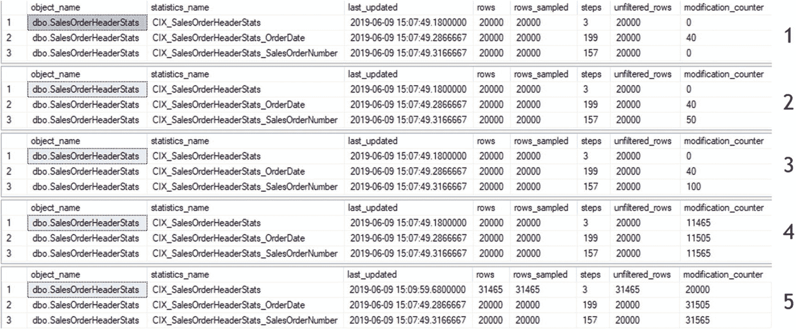
**图 3-6**
针对 `dbo.SalesOrderHeaderStats` 的示例查询，`sys.dm_db_stats_properties` 的查询结果

```
USE AdventureWorks2017
GO
UPDATE dbo.SalesOrderHeaderStats
set OrderDate = GETDATE()
WHERE SalesOrderID % 500 = 1
--执行清单 3-7 中的代码
UPDATE dbo.SalesOrderHeaderStats
SET SalesOrderNumber = SalesOrderNumber
WHERE SalesOrderID % 400 = 1
--执行清单 3-7 中的代码
UPDATE dbo.SalesOrderHeaderStats
SET SalesOrderNumber = REVERSE(SalesOrderNumber)
WHERE SalesOrderID % 400 = 1
--执行清单 3-7 中的代码
SET IDENTITY_INSERT dbo.SalesOrderHeaderStats ON
INSERT INTO dbo.SalesOrderHeaderStats (SalesOrderID
,OrderDate
,SalesOrderNumber)
SELECT SalesOrderID
,OrderDate
,SalesOrderNumber
FROM Sales.SalesOrderHeader
WHERE SalesOrderID > 63658
SET IDENTITY_INSERT dbo.SalesOrderHeaderStats OFF
--执行清单 3-7 中的代码
DELETE FROM dbo.SalesOrderHeaderStats
WHERE SalesOrderID <= 63658
--执行清单 3-7 中的代码
清单 3-8
对 dbo.SalesOrderHeaderStats 的示例 DML 查询
```

审视图 3-6 中的结果，可以深入了解 `modification_counter` 列是如何填充的。总结来说，任何插入、更新或删除操作都被视为对索引和统计信息的一次更改。查看查询 1 的结果，更改的 40 行导致 `CIX_SalesOrderHeaderStats_OrderDate` 的 `modification_counter` 增加到 40。类似地，当查询 2 和 3 中的 `SalesOrderNumber` 被更改时，无论值是否实际发生变化，每个查询都导致 `modification_counter` 增加了 50。增加记录数会导致所有三个索引的 `modification_counter` 值都增加 11,465，这与插入的记录数相符。最后，在查询 5 的结果中，你看到 20,000 条记录被删除。有趣的是，在最后一个查询的结果中，来自 `CIX_SalesOrderHeaderStats` 的统计信息被更新，以更好地反映索引中值的变化。

虽然 `sys.dm_db_stats_properties` 不会提供表中所有不同记录的列表及其可能对统计信息产生的影响，但它确实提供了详细信息，可以识别索引及其支持的统计信息上的变更量。当试图确定索引的统计信息是否可能过时时，这个动态管理对象非常有用。

##### sys.dm_db_stats_histogram

虽然可以通过 `DBCC SHOW_STATISTICS` 获取统计信息的直方图，但 SQL Server 2016 引入了动态管理对象函数 `sys.dm_db_stats_histogram`。该函数返回类似于 `DBCC` 命令的输出，其额外好处是可以与其他动态管理对象联接，以提高这些数据的可用性。该函数的语法如清单 3-9 所示，它接受一个 `object_id` 和 `stats_id`，输出中返回的列如表 3-7 所示。

**表 3-7**
`sys.dm_db_stats_histogram` 的列

| 列名 | 数据类型 | 描述 |
| --- | --- | --- |
| `object_id` | `int` | 相关对象的 ID。 |
| `stats_id` | `int` | 统计信息的 ID。对于索引，此 ID 与索引 ID 匹配。 |
| `step_number` | `int` | 直方图中的步骤编号。最大值 200。 |
| `range_high_key` | `sql_variant` | 直方图步骤的上限列值。该列值也称为 *键值*。 |
| `range_rows` | `real` | 估计的行数，其列值落在直方图步骤内，不包括上限。 |
| `equal_rows` | `real` | 估计的行数，其列值等于直方图步骤的上限。 |
| `distinct_range_rows` | `bigint` | 估计的行数，其列值在直方图步骤内是唯一的，不包括上限。 |
| `average_range_rows` | `real` | 直方图步骤内具有重复列值的行的平均数，不包括上限（当 `distinct_range_rows > 0` 时为 `range_rows/distinct_range_rows`）。 |

```
sys.dm_db_stats_histogram (object_id, stats_id)
清单 3-9
sys.dm_db_stats_histogram 的语法
```

如果你将 `sys.stats` 与 `sys.dm_db_stats_histogram` 结合使用，如清单 3-10 所示，你可以获取 `Sales.SalesOrderDetail` 上所有统计信息的直方图。这提供了有关所有步骤及其范围值的信息。滚动浏览如图 3-7 所示的结果，到第 163 和 164 行；你会看到 `range_high_key` 值从数字数据变为字符数据，这发生在统计信息和步骤变化时。

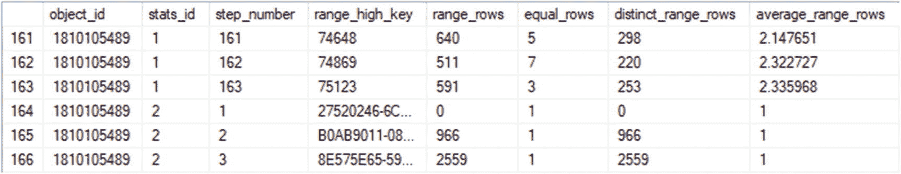
**图 3-7**
在 `Sales.SalesOrderDetail` 上执行 `sys.dm_db_stats_histogram` 的查询结果

```
USE AdventureWorks2017;
GO
SELECT h.object_id,
h.stats_id,
h.step_number,
h.range_high_key,
h.range_rows,
h.equal_rows,
h.distinct_range_rows,
h.average_range_rows
FROM sys.stats s
CROSS APPLY sys.dm_db_stats_histogram(s.object_id, s.stats_id) h
WHERE s.object_id = OBJECT_ID('Sales.SalesOrderDetail');
清单 3-10
针对 Sales.SalesOrderDetail 的 sys.dm_db_stats_histogram 查询
```

这个新函数极大地增强了你查看和检查直方图的能力。例如，如果你在某个列上有多个索引和统计信息，你可以编写一个仅包含这些统计信息的查询，然后筛选 `range_high_key`，只包含与你关注的记录相匹配的步骤。那时，你可以查看 `average_range_rows` 并了解为什么 SQL Server 可能选择了一个索引而不是另一个。


### `sys.dm_db_incremental_stats_properties`

正如第 9 章所讨论的，随着增量索引维护的引入，统计信息也需要支持增量更新的能力以配合该特性。作为 `sys.dm_db_stats_properties` 的配套函数，`sys.dm_db_incremental_stats_properties` 提供了对增量统计信息和索引的统计属性的可见性。`sys.dm_db_incremental_stats_properties` 的语法（如代码清单 3-11 所示）包含与其他函数相同的两个参数：`object_id` 和 `stats_id`。返回的列与表 3-6 中的列相同，只是此函数多了一个 `partition_number` 列，用于指示增量统计信息所属的分区。

```
sys.dm_db_incremental_stats_properties (object_id, stats_id)
代码清单 3-11
sys.dm_db_incremental_stats_properties 的语法
```

##### 统计信息 DDL

本节主要讨论了索引级别的统计信息。索引统计信息在创建索引时自动创建，并在删除索引时自动删除。统计信息也可以在非索引列上创建，并能提供重要价值。在非索引列上手动创建或删除统计信息时，可以使用两条 DDL 语句来完成：`CREATE STATISTICS` 和 `DROP STATISTICS`。由于它们超出了本书的范围，这里将不作讨论。第三条 DDL 语句 `UPDATE STATISTICS` 适用于所有统计信息，包括索引级别的统计信息。由于 `UPDATE STATISTICS` 主要与索引维护相关，它将在第 7 章中讨论。

##### 列级统计信息总结

查询优化统计信息是索引的重要组成部分。它们为查询优化器构建基于成本的查询计划提供了必要的信息。通过这个过程，SQL Server 可以根据计算出的成本识别出高质量的执行计划。在本节中，你了解了统计信息的存储方式，以及可用于调查和开始理解为索引存储的统计信息的工具。

## 索引使用统计信息

下一个要了解的信息领域是索引使用统计信息。索引使用统计信息是通过 DMO `sys.dm_db_index_usage_stats` 累积的。此 DMO 返回不同类型索引操作的计数以及最后一次执行该操作的时间。通过这些信息，你可以判断索引的使用频率以及使用的时效性。

DMO `sys.dm_db_index_usage_stats` 是一个动态管理视图 (DMV)。因此，它不需要任何参数。它可以通过任何 `JOIN` 运算符与其他表或视图进行联接。索引在首次使用后或自统计信息重置以来，会出现在此 DMV 中。

### 注意

除了重启 SQL Server 服务外，关闭或分离数据库也会重置 `sys.dm_db_index_usage_stats` 中为索引累积的所有统计信息。

在 DMV `sys.dm_db_index_usage_stats` 中，提供了三种类型的数据：标题列、用户统计信息和系统统计信息。在接下来的几节中，你将探索每一类数据，以了解它们包含的信息以及如何使用这些信息。

### 标题列

DMV 的标题列提供参考信息，可用于确定统计信息是为哪个索引累积的。表 3-8 列出了这些列。这些列主要用于将 DMV 与系统目录视图和其他 DMO 进行联接。

表 3-8

`sys.dm_db_index_usage_stats` 中的标题列

| 列名 | 数据类型 | 描述 |
| --- | --- | --- |
| `database_id` | `smallint` | 定义表或视图的数据库的 ID。 |
| `object_id` | `int` | 定义索引的表或视图的 ID。 |
| `index_id` | `int` | 索引的 ID。 |

使用 `sys.dm_db_index_usage_stats` 首先可以做的事情之一，就是检查自上次重置 DMV 中的统计信息以来，索引是否已被使用。利用标题列，类似于代码清单 3-12 中的 T-SQL 语句，可以提供未被使用的索引列表。如果你使用的是 AdventureWorks2017 数据库，你的结果将类似于图 3-8。这些结果返回了未被使用的索引。

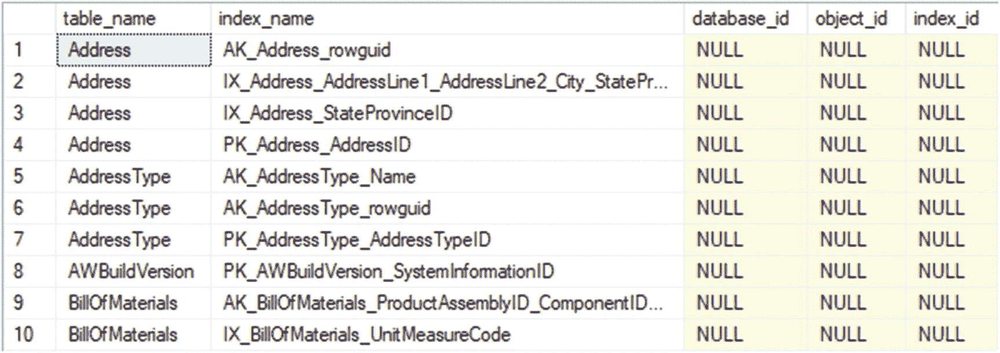

图 3-8

`sys.dm_db_index_usage_stats` 标题列查询结果

```sql
USE AdventureWorks2017
GO
SELECT TOP 10 OBJECT_NAME(i.object_id) AS table_name
,i.name AS index_name
,ius.database_id
,ius.object_id
,ius.index_id
FROM sys.indexes i
LEFT JOIN sys.dm_db_index_usage_stats ius
ON i.object_id = ius.object_id
AND i.index_id = ius.index_id
AND ius.database_id = DB_ID()
WHERE ius.index_id IS NULL
AND OBJECTPROPERTY(i.object_id, 'IsUserTable') = 1
ORDER BY table_name, index_name
代码清单 3-12
查询 sys.dm_db_index_usage_stats 中标题列的语句
```

这类信息对于管理数据库中的索引非常有用。它是识别一段时间内未被使用的索引的绝佳资源。这种索引管理策略将在后续章节中进一步讨论。

## 用户列

`sys.dm_db_index_usage_stats` 中的下一组列是用户列。用户列有助于深入了解索引如何在查询计划中被具体使用。这些列列于表 3-9 中；它们包含每种操作发生次数的统计信息以及最后一次发生的时间。

**表 3-9 sys.dm_db_index_usage_stats 中的用户列**

| 列名 | 数据类型 | 描述 |
| --- | --- | --- |
| `user_seeks` | `bigint` | 用户查询执行查找操作的总次数。 |
| `user_scans` | `bigint` | 用户查询执行扫描操作的总次数。 |
| `user_lookups` | `bigint` | 用户查询执行书签/键查找操作的总次数。 |
| `user_updates` | `bigint` | 用户查询执行更新操作的总次数。 |
| `last_user_seek` | `datetime` | 最后一次用户查找的日期和时间。 |
| `last_user_scan` | `datetime` | 最后一次用户扫描的日期和时间。 |
| `last_user_lookup` | `datetime` | 最后一次用户查找的日期和时间。 |
| `last_user_update` | `datetime` | 最后一次用户更新的日期和时间。 |

`sys.dm_db_index_usage_stats` 监视四种类型的索引操作。这些操作通过 `user_seeks`、`user_scans`、`user_lookups` 和 `user_updates` 列来体现。

第一个索引用法列是 `user_seeks`。每当查询执行并返回单个行或行范围，且该查询具有直接访问路径时，就会发生此列对应的操作。例如，如果查询执行并检索单个订单或一小段订单范围的所有销售明细，类似于清单 3-13 中的查询，则这些查询的查询计划将使用查找操作（参见图 3-9）。

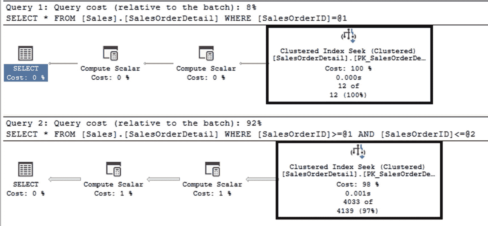
图 3-9 查找查询的查询计划

```
USE AdventureWorks2017
GO
SELECT * FROM Sales.SalesOrderDetail
WHERE SalesOrderID = 43659;
SELECT * FROM Sales.SalesOrderDetail
WHERE SalesOrderID BETWEEN 43659 AND 44659;
清单 3-13 索引查找查询
```

运行清单 3-13 中的查询后，DMV `sys.dm_db_index_usage_stats` 中的 `user_seeks` 列计数将会增加。清单 3-14 提供了一个查询来检查这一点。如果你跟着操作，应该会看到如图 3-10 所示的结果。结果显示，`user_seeks` 列的值为 5，这与清单 3-13 中的操作次数相符。据此，你知道有两个查询使用了索引执行，并且两者都能利用索引直接定位到请求的行。


图 3-10 index_seeks 的查询结果

```
USE AdventureWorks2017
GO
SELECT TOP 10
OBJECT_NAME(i.object_id) AS table_name
,i.name AS index_name
,ius.user_seeks
,ius.last_user_seek
FROM sys.indexes i
INNER JOIN sys.dm_db_index_usage_stats ius
ON i.object_id = ius.object_id
AND i.index_id = ius.index_id
AND ius.database_id = DB_ID()
WHERE ius.object_id = OBJECT_ID('Sales.SalesOrderDetail');
清单 3-14 查询 sys.dm_db_index_usage_stats 中的 index_seeks
```

下一个用法列是 `user_scans`。每当查询执行且必须扫描索引的每一行时，此列的值就会增加。例如，考虑一个对销售明细的、未经过滤的查询，它必须返回所有记录，或者一个在未建索引列上进行过滤的查询。清单 3-15 所示的这两个查询，要么是向 SQL Server 请求表中的所有内容，要么是请求它无法定位的少数几行。满足此请求的唯一方法就是扫描 `SalesOrderDetail` 表。图 3-11 展示了这两个查询的执行计划。

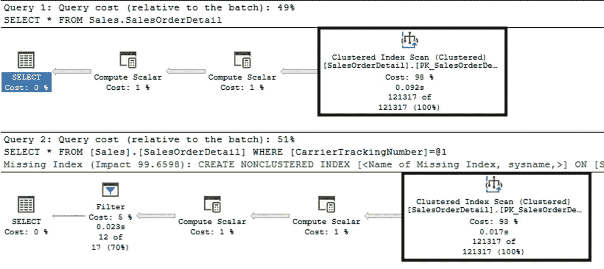
图 3-11 扫描查询的查询计划

```
USE AdventureWorks2017
GO
SELECT * FROM  Sales.SalesOrderDetail;
SELECT * FROM  Sales.SalesOrderDetail
WHERE CarrierTrackingNumber = '4911-403C-98';
清单 3-15 索引扫描查询
```

当发生索引扫描时，可以在 `sys.dm_db_index_usage_stats` 中看到它们。清单 3-16 中的查询提供了一个在 DMV 中查看扫描累积情况的方法。由于有两个扫描，每个查询对应一个，图 3-12 的结果显示在 `user_scans` 下已有两次操作。在尝试排查表上存在大量扫描的情况时，此信息非常有用。通过查看此信息，你能够找到扫描次数高的索引，然后开始研究为什么使用这些索引的查询会采用扫描，而不是更优的操作（如索引查找）。


图 3-12 index_scans 的查询结果

```
USE AdventureWorks2017
GO
SELECT TOP 10
OBJECT_NAME(i.object_id) AS table_name
,i.name AS index_name
,ius.user_scans
,ius.last_user_scan
FROM sys.indexes i
INNER JOIN sys.dm_db_index_usage_stats ius
ON i.object_id = ius.object_id
AND i.index_id = ius.index_id
AND ius.database_id = DB_ID()
WHERE ius.object_id = OBJECT_ID('Sales.SalesOrderDetail');
清单 3-16 查询 sys.dm_db_index_usage_stats 中的 index_scans
```

DMV 中的第三列是 `user_lookups`。当在非聚集索引上发生查找，但该索引不包含满足查询所需的所有列时，就会发生用户查找。发生这种情况时，查询必须从聚集索引中查找这些列。一个例子是对 `SalesOrderDetail` 表的查询，它返回 `ProductID` 和 `CarrierTrackingNumber` 列，并在 `ProductID` 上进行过滤；清单 3-17 显示了此查询。图 3-13 显示了此查询的查询计划。该查询计划显示了在非聚集索引上的查找和在聚集索引上的键查找。

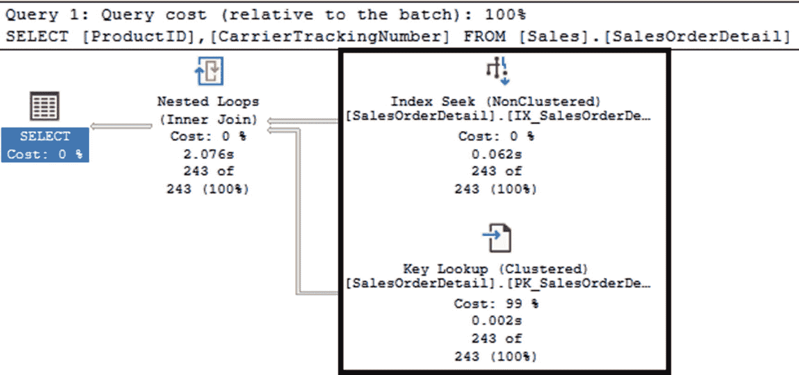
图 3-13 查找和键查找的查询计划

```
USE AdventureWorks2017
GO
SELECT ProductID, CarrierTrackingNumber
FROM Sales.SalesOrderDetail
WHERE ProductID = 778
GO
清单 3-17 索引查找查询
```

在 `sys.dm_db_index_usage_stats` 中，`user_seeks` 和 `user_lookups` 的计数都将增加一。要访问这些值，请使用清单 3-18，它将返回图 3-14 中的结果。这些列之间的模式有助于确定合适的聚簇键，或识别何时需要修改索引以避免键查找。键查找不一定不好，但如果过度使用且不加检查，可能会成为性能瓶颈。关于在 `user_lookups` 方面需要关注什么，我将在后续章节中进一步讨论。


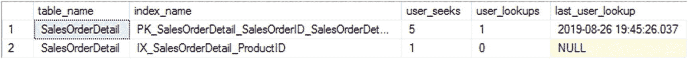

**图 3-14**: `index_lookups` 的查询结果

```sql
SELECT TOP 10
OBJECT_NAME(i.object_id) AS table_name
,i.name AS index_name
,ius.user_seeks
,ius.user_lookups
,ius.last_user_lookup
FROM sys.indexes i
INNER JOIN sys.dm_db_index_usage_stats ius
ON i.object_id = ius.object_id
AND i.index_id = ius.index_id
AND ius.database_id = DB_ID()
WHERE ius.object_id = OBJECT_ID('Sales.SalesOrderDetail');
```

*代码清单 3-18: 查询 `sys.dm_db_index_usage_stats` 中的 `index_lookups`*

## 索引操作与 `user_updates`

最后一个索引操作是 `user_updates`。`user_updates` 列不仅限于表上的更新操作。实际上，它涵盖了在表上发生的所有 `INSERT`、`UPDATE` 和 `DELETE` 操作。为了演示这一点，你可以执行代码清单 3-19 中的代码。这段代码将向 `SalesOrderDetail` 表插入一条记录，然后更新该记录，最后从表中删除该记录。由于外键关系导致这些操作的执行计划比较复杂，本示例中未包含它们。

```sql
USE AdventureWorks2017
GO
INSERT INTO Sales.SalesOrderDetail
(SalesOrderID, CarrierTrackingNumber, OrderQty, ProductID, SpecialOfferID, UnitPrice, UnitPriceDiscount, ModifiedDate)
SELECT SalesOrderID, CarrierTrackingNumber, OrderQty, ProductID, SpecialOfferID, UnitPrice, UnitPriceDiscount, GETDATE() AS ModifiedDate
FROM Sales.SalesOrderDetail
WHERE SalesOrderDetailID = 1;
UPDATE Sales.SalesOrderDetail
SET CarrierTrackingNumber = '999-99-9999'
WHERE ModifiedDate > DATEADD(d, -1, GETDATE());
DELETE FROM Sales.SalesOrderDetail
WHERE ModifiedDate > DATEADD(d, -1, GETDATE());
```

*代码清单 3-19: 索引更新查询*

代码清单执行完成后，表上发生了三个操作。对于每个操作，`sys.dm_db_index_usage_stats` 都在 `user_updates` 列累积了一个计数。执行代码清单 3-20 中的代码，以查看索引上发生的活动。结果将与图 3-15 中的类似。除了对 `SalesOrderDetail` 的聚集索引进行的更改外，对非聚集索引进行的更新也包含在内。能够看到对表进行插入、更新或删除操作的影响，有助于理解用户的影响以及数据的易变性。

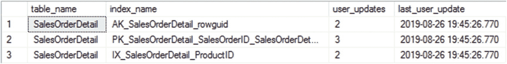

**图 3-15**: `index_updates` 的查询结果

```sql
USE AdventureWorks2017
GO
SELECT TOP 10
OBJECT_NAME(i.object_id) AS table_name
,i.name AS index_name
,ius.user_updates
,ius.last_user_update
FROM sys.indexes i
INNER JOIN sys.dm_db_index_usage_stats ius
ON i.object_id = ius.object_id
AND i.index_id = ius.index_id
AND ius.database_id = DB_ID()
WHERE ius.object_id = OBJECT_ID('Sales.SalesOrderDetail');
```

*代码清单 3-20: 查询 `sys.dm_db_index_usage_stats` 中的 `index_updates`*

#### 系统列

`sys.dm_db_index_usage_stats` 中的最后一组列是系统列。系统列返回与用户列大致相同的信息，只不过这些值是从后台进程的角度来看的。每当 SQL Server 中触发某些操作时，例如触发了统计信息更新，该活动都将通过这些列进行跟踪。表 3-10 列出了系统列。

**表 3-10**: `sys.dm_db_index_usage_stats` 中的系统列

| 列名 | 数据类型 | 描述 |
| --- | --- | --- |
| `system_seeks` | `bigint` | 系统查询的查找次数。 |
| `system_scans` | `bigint` | 系统查询的扫描次数。 |
| `system_lookups` | `bigint` | 系统查询的查找次数。 |
| `system_updates` | `bigint` | 系统查询的更新次数。 |
| `last_system_seek` | `datetime` | 上次系统查找的时间。 |
| `last_system_scan` | `datetime` | 上次系统扫描的时间。 |
| `last_system_lookup` | `datetime` | 上次系统查找的时间。 |
| `last_system_update` | `datetime` | 上次系统更新的时间。 |

在大多数情况下，可以忽略这些列。不过，了解它们的聚合方式是有益的。要查看一个示例，请执行代码清单 3-21 中的代码，这可能需要运行一分钟。这将更改 `SalesOrderDetail` 表中的大部分行。由于更改的行数超过 20%，将触发自动统计信息更新。统计信息更新与用户活动没有直接关系，而是一个后台或系统进程。

```sql
USE AdventureWorks2017
GO
UPDATE Sales.SalesOrderDetail
SET UnitPriceDiscount = 0.01
WHERE UnitPriceDiscount = 0.00;
```

*代码清单 3-21: 更新 `Sales.SalesOrderDetail`*

更新完成后，运行代码清单 3-22 中的 T-SQL 语句。这段代码将从 `sys.stats` 返回结果，并从 `sys.dm_db_index_usage_stats` 返回系统列，如图 3-16 所示。其中包含 `system_scans` 列，该列显示在 `Sales.SalesOrderDetail` 上发生了三次系统扫描。这些与统计信息更新有关，其中一次发生在 `UnitPriceDiscount` 列上。查看统计信息创建的时间，可以看到它们依次是在 `CarrierTrackingNumber`、`SalesOrderDetailId`、`ModifiedDate`，最后是 `UnitPriceDiscount` 上创建的。

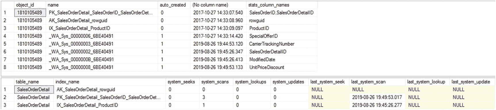

**图 3-16**: `sys.stats` 和 `sys.dm_db_index_usage_stats` 系统列查询结果

```sql
USE AdventureWorks2017
GO
SELECT S.object_id,
S.name,
S.auto_created,
STATS_DATE(S.object_id, S.stats_id),
X.stats_column_names
FROM sys.stats S
CROSS APPLY
(
SELECT STRING_AGG(C.name, ',') AS stats_column_names
FROM sys.stats_columns SC
INNER JOIN sys.columns C
ON C.object_id = SC.object_id
AND C.column_id = SC.column_id
WHERE S.object_id = SC.object_id
AND S.stats_id = SC.stats_id
) X
WHERE S.object_id = OBJECT_ID('Sales.SalesOrderDetail');
SELECT OBJECT_NAME(i.object_id) AS table_name
,i.name AS index_name
,ius.system_seeks
,ius.system_scans
,ius.system_lookups
,ius.system_updates
,ius.last_system_seek
,ius.last_system_scan
,ius.last_system_lookup
,ius.last_system_update
FROM sys.indexes i
INNER JOIN sys.dm_db_index_usage_stats ius
ON i.object_id = ius.object_id
AND i.index_id = ius.index_id
AND ius.database_id = DB_ID()
WHERE ius.object_id = OBJECT_ID('Sales.SalesOrderDetail');
```

*代码清单 3-22: 查询 `sys.dm_db_index_usage_stats` 中的系统列*

从实用性的角度来看，这些列几乎提供不了什么有价值的信息。它们只是后台进程的结果，其存在更多是为了告知后台索引正在发生什么。

#### 索引使用统计摘要

在本节中，我讨论了 DMV `sys.dm_db_index_usage_stats` 中的统计信息。该 DMV 提供了关于数据库中索引如何以及是否被使用的一些极其有用的统计数据。通过长期监控这些统计信息，你将能够理解哪些索引提供了最大的价值。关于如何利用所有这些列来优化索引性能的策略，将在第 8 章中讨论。


### 索引操作统计

需要考虑的第三类统计信息是索引操作统计。这些统计信息通过 DMO `sys.dm_db_index_operational_stats` 呈现给用户。从高层次来看，此 DMO 提供了关于索引上发生的 I/O、锁、闩锁和访问方法的低层级信息。通过这些低层级信息，您可以识别可能遇到性能问题的索引，并开始理解导致这些性能问题的原因。在本节末尾，您将理解此 DMO 提供的统计信息，并了解如何通过这些统计信息来调查索引。

与上一节中的 DMO 不同，`sys.dm_db_index_operational_stats` 是一个动态管理函数（DMF）。因此，此 DMF 在使用时需要提供多个参数。表 3-11 详细说明了此 DMF 的参数。

表 3-11

sys.dm_db_index_operational_stats 的参数

| 参数名称 | 数据类型 | 描述 |
| --- | --- | --- |
| `database_id` | `smallint` | 索引所在数据库的 ID。提供值 `0`、`NULL` 或 `DEFAULT` 将返回所有数据库的索引信息。此参数中可以使用 `DB_ID` 函数。 |
| `object_id` | `int` | 应为其返回统计信息的表或视图的对象 ID。提供值 `0`、`NULL` 或 `DEFAULT` 将返回数据库中所有表或视图的索引信息。 |
| `index_id` | `int` | 应为其返回统计信息的索引的索引 ID。提供值 `-1`、`NULL` 或 `DEFAULT` 将返回表或视图上所有索引的统计信息。 |
| `partition_number` | `int` | 应为其返回统计信息的索引上的分区号。提供值 `0`、`NULL` 或 `DEFAULT` 将返回索引上所有分区的统计信息。 |

通过这些参数，可以按需广泛或精细地聚焦于索引统计信息。这种灵活性非常有用，因为 `sys.dm_db_index_operational_stats` 不允许使用 `CROSS APPLY` 或 `OUTER APPLY` 运算符。将参数传递给 DMF 时，其语法如清单 3-23 所定义。

```
sys.dm_db_index_operational_stats (
{ database_id | NULL | 0 | DEFAULT }
, { object_id | NULL | 0 | DEFAULT }
, { index_id | 0 | NULL | -1 | DEFAULT }
, { partition_number | NULL | 0 | DEFAULT }
)
```

清单 3-23
索引操作统计语法

### 注意

DMF `sys.dm_db_index_operational_stats` 可以接受 Transact SQL 函数 `DB_ID()` 和 `OBJECT_ID()` 的使用。这些函数可分别用于参数 `database_id` 和 `object_id`。

#### 头列

要开始查看统计信息，您需要识别将用于所有结果查询的头列。对于通过 DMF 返回的每一行，都会有一个 `database_id`、`object_id`、`index_id` 和 `partition_number`。这些列在表 3-12 中有进一步定义。正如 `partition_number` 所暗示的，此 DMF 的结果粒度在分区级别。对于非分区索引，分区号将为 1。

表 3-12

sys.dm_db_index_operational_stats 中的头列

| 列名 | 数据类型 | 描述 |
| --- | --- | --- |
| `database_id` | `smallint` | 定义表或视图的数据库的 ID。 |
| `object_id` | `int` | 定义索引的表或视图的 ID。 |
| `index_id` | `int` | 索引的 ID。 |
| `partition_number` | `int` | 索引或堆内的分区号（基于 1）。 |
| `hobt_id` | `bigint` | 用于标识与索引分区关联的堆或 B 树（hobt）的 ID。 自 SQL Server 2016 新增。 |

头列提供了理解统计信息所适用索引的基础。这将有助于理解返回统计信息的上下文。此外，它们可用于连接到目录视图，例如 `sys.indexes`，以提供索引的名称。

此 DMF 中的有用信息来自函数返回的其余列。可返回的信息提供了对 DML 活动、页面分配周期、数据访问模式、索引争用和磁盘活动的深入洞察。在以下部分中，您将研究提供此信息统计的 DMF 列。

### DML 活动

调查索引操作统计的起点是索引上的 DML 活动。表 3-13 列出了代表此活动的列。这些列提供了受 DML 操作影响的行数的计数。接下来的统计信息类似于 `sys.dm_db_index_usage` 中的统计信息，但在视角上有一些差异，接下来将进行讨论。

表 3-13

sys.dm_db_index_operational_stats 中的 DML 活动列

| 列名 | 数据类型 | 描述 |
| --- | --- | --- |
| `leaf_insert_count` | `bigint` | 插入的叶级行的累计计数。 |
| `leaf_delete_count` | `bigint` | 删除的叶级行的累计计数。 |
| `leaf_update_count` | `bigint` | 更新的叶级行的累计计数。 |
| `leaf_ghost_count` | `bigint` | 标记为删除但尚未移除的叶级行的累计计数。 |
| `nonleaf_insert_count` | `bigint` | 叶级以上级别的插入操作累计计数。对于堆，此值始终为 `0`。 |
| `nonleaf_delete_count` | `bigint` | 叶级以上级别的删除操作累计计数。对于堆，此值始终为 `0`。 |
| `nonleaf_update_count` | `bigint` | 叶级以上级别的更新操作累计计数。对于堆，此值始终为 `0`。 |

在 `sys.dm_db_index_operational_stats` 中，有两个区域可以跟踪 DML 活动：叶级和非叶级。这些 DML 活动区域在第 2 章中讨论过；有关叶级和非叶级页面的更多信息，请参阅该章。

理解这两种数据更改之间的区别对于帮助识别更改是否由 DML 操作引起非常重要。这意味着叶级 DML 活动是 `INSERT`、`UPDATE` 和 `DELETE` 语句的直接结果。而非叶级 DML 活动发生在叶级活动导致索引结构发生变化时，并非能通过 `INSERT`、`UPDATE` 或 `DELETE` 语句直接影响的。

叶级和非叶级 DML 活动都根据已发生的 DML 操作类型细分为统计信息。如前所述，DML 活动监控 `INSERT`、`UPDATE` 和 `DELETE` 活动。对于这些操作中的每一个，`sys.dm_db_index_operational_stats` 中都有一个对应的列。此外，还有一个列用于计数已从叶级 DML 活动中“幽灵化”的记录。

在 `DELETE` 操作期间，受语句影响的行通过两阶段操作被删除。最初，记录被标记为删除。发生这种情况时，这些记录被称为已幽灵化；处于此状态的行会计入 `leaf_ghost_count`。在固定的时间间隔，SQL Server 中的一个清理线程将遍历并对标记为幽灵化的行执行实际的删除操作。此时，这些记录将会计入 `leaf_delete_count`。此过程有助于提高删除操作的性能，因为实际的行删除发生在事务提交之后。此外，在事务回滚的情况下，只需要更改行上的幽灵标志，而无需尝试在表中重新创建该行。此活动仅发生在叶级；一旦与非叶页面关联的所有行都被删除或以其他方式移除，非叶页面就会被删除。

如前所述，此数据库文件上的数据操作语言活动与在 `sys.dm_db_index_usage_stats` 中发现的活动相似。虽然相似，但仍存在一些显著差异。第一个差异是 `sys.dm_db_index_operational_stats` 中的信息比 `sys.dm_db_index_usage_stats` 中的信息更加细粒度。操作统计报告到叶级和非叶级；使用统计则不提供此层级。除了粒度不同，计数方式也不同。使用统计为执行索引上操作的每个查询计划计一次数；无论涉及 0 行还是 100 行，统计信息都会被收集。操作统计则不同，其计数为索引上执行了数据操作语言操作的每一行递增。总结差异：使用统计在索引被使用时汇总数据，而操作统计则根据索引被使用的程度汇总数据。

清单 3-24 中的代码说明了操作统计的计算方式。在清单中，向 `dbo.Karaoke` 表添加了 79 行。然后从表中删除了 44 行。接着更新了表中的 35 行。最后一个查询根据数据操作语言活动返回操作统计信息。图 3-17 显示了最终查询的结果。


图 3-17
数据操作语言活动查询结果（结果在您的系统上可能有所不同）

```sql
USE AdventureWorks2017
GO
IF OBJECT_ID('dbo.Karaoke') IS NOT NULL
DROP TABLE dbo.Karaoke;
CREATE TABLE dbo.Karaoke
(
KaraokeID INT
,Duet BIT
,CONSTRAINT PK_Karaoke_KaraokeID PRIMARY KEY CLUSTERED (KaraokeID)
);
INSERT INTO dbo.Karaoke
SELECT ROW_NUMBER() OVER (ORDER BY t.object_id)
,t.object_id % 2
FROM sys.tables t;
DELETE FROM dbo.Karaoke
WHERE  Duet = 0;
UPDATE dbo.Karaoke
SET    Duet = 0
WHERE  Duet = 1;
SELECT OBJECT_SCHEMA_NAME(ios.object_id) + '.' + OBJECT_NAME(ios.object_id) AS table_name
,i.name AS index_name
,ios.leaf_insert_count
,ios.leaf_update_count
,ios.leaf_delete_count
,ios.leaf_ghost_count
FROM sys.dm_db_index_operational_stats(DB_ID(),NULL,NULL,NULL) ios
INNER JOIN sys.indexes i
ON i.object_id = ios.object_id
AND i.index_id = ios.index_id
WHERE ios.object_id = OBJECT_ID('dbo.Karaoke')
ORDER BY ios.range_scan_count DESC;
```
清单 3-24
数据操作语言活动脚本

查看索引中数据操作语言活动的价值在于帮助你了解索引中的数据正在发生什么变化。例如，如果一个非聚集索引经常被更新，检查索引中的列可能有助于确定列的易变性是否与索引带来的好处相匹配。查看具有大量数据操作语言活动的索引，并思考这些活动是否符合你对数据库平台的理解，这是一个很好的做法。

## SELECT 活动

在数据操作语言活动之后，下一个可以查看的信息区域是关于 `SELECT` 活动的信息。`SELECT` 活动列（如表 3-14 所示）标识了查询执行时使用的物理操作类型。SQL Server 收集三种访问类型的信息：范围扫描、单例查找和转送记录。

表 3-14
`sys.dm_db_index_operational_stats` 中的访问模式列

| 列名 | 数据类型 | 描述 |
| --- | --- | --- |
| `range_scan_count` | bigint | 在索引或堆上启动的范围扫描和表扫描的累计计数。 |
| `singleton_lookup_count` | bigint | 从索引或堆中进行单行检索的累计计数。 |
| `forwarded_fetch_count` | bigint | 通过转送记录获取的行数计数。 |

#### 范围扫描

当使用行范围或表扫描来访问数据时，就会发生范围扫描。考虑行范围时，它可能涉及 1 到 1000 行或更多。范围中的行数对于 SQL Server 如何访问数据并不重要。对于表扫描，行数也不重要，但你可能已经假设它包括表中的所有记录。在 `sys.dm_db_index_operational_stats` 中，这些值存储在 `range_scan_count` 列中。

要查看在 `range_scan_count` 中收集的此信息，请执行上一节中的清单 3-13 和清单 3-15 中的代码。在此之前，请先将 AdventureWorks2017 数据库脱机，然后再将其联机，这将重置从动态管理对象返回的统计信息。在这两个代码示例中，将执行四个查询。前两个查询将在查询计划中导致索引查找，如图 3-9 所示。后两个查询将导致索引扫描，如图 3-11 中的执行计划所示。运行清单 3-25 中的代码将显示（如图 3-18 所示），所有四个查询都使用了范围扫描从表中检索数据。


图 3-18
`range_scan_count` 的查询结果

```sql
USE AdventureWorks2017
GO
SELECT OBJECT_NAME(ios.object_id) AS table_name
,i.name AS index_name
,ios.range_scan_count
FROM sys.dm_db_index_operational_stats(DB_ID(),OBJECT_ID('Sales.SalesOrderDetail'),NULL,NULL) ios
INNER JOIN sys.indexes i
ON i.object_id = ios.object_id
AND i.index_id = ios.index_id
ORDER BY ios.range_scan_count DESC;
```
清单 3-25
从 `sys.dm_db_index_operational_stats` 查询 `range_scan_count`

#### 单例查找

在 `SELECT` 活动上收集的下一个统计列是 `singleton_lookup_count`。每当使用键查找（以前称为书签查找）时，此列中的值就会增加。一般来说，这与在 `sys.dm_db_index_usage_stats` 的 `user_lookups` 列中收集的信息类型相同。然而，`user_lookups` 和 `singleton_lookup_count` 之间存在显著差异。当使用键查找时，`user_lookups` 会增加 1，以指示索引操作已被使用。而对于 `singleton_lookup_count`，使用键查找操作的每一行都会导致此列中的值增加 1。

例如，运行清单 3-17 中的代码将导致键查找。这可以通过检查执行计划（如图 3-13 所示）来验证。此操作的统计信息之前已讨论过，并在图 3-19 中显示。可以通过运行清单 3-26 中的 T-SQL 语句来调查新的信息。在结果中，你可以看到 `singleton_lookup_count` 的值不是 1，而是 243。这是该列的一个重要区别。此统计信息不仅告诉你发生了键查找，还提供了查找操作范围的信息。你可以考虑，如果单例查找与范围扫描的比率很高，可能存在其他索引替代方案需要考虑。

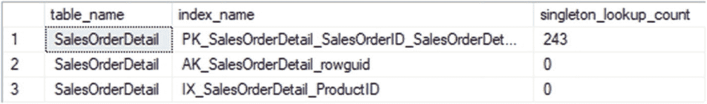

图 3-19
`singleton_lookup_count` 的查询结果

```sql
USE AdventureWorks2017
GO
SELECT OBJECT_NAME(ios.object_id) AS table_name
,i.name AS index_name
,ios.singleton_lookup_count
FROM sys.dm_db_index_operational_stats(DB_ID(),OBJECT_ID('Sales.SalesOrderDetail'),NULL,NULL) ios
INNER JOIN sys.indexes i
ON i.object_id = ios.object_id
AND i.index_id = ios.index_id
ORDER BY ios. singleton_lookup_count DESC;
```
清单 3-26
从 `sys.dm_db_index_operational_stats` 查询 `singleton_lookup_count`


##### 转发获取

`SELECT` 活动统计信息的最后一列是 `forwarded_fetch_count`。正如第 2 章所讨论的，转发出现在堆表中，当记录大小增加且无法再适应当前所在页面时。每当发生一次记录转发操作，`forwarded_fetch_count` 列就会增加一。

为了演示，清单 3-27 中的代码构建了一个带有堆表并填充了一些值。然后，`UPDATE` 语句将每三行的大小增加。新行的大小将超过页面上的可用空间，从而导致转发出的记录。

```sql
USE AdventureWorks2017
GO
CREATE TABLE dbo.ForwardedRecords
(
ID INT IDENTITY(1,1)
,VALUE VARCHAR(8000)
);
INSERT INTO dbo.ForwardedRecords (VALUE)
SELECT REPLICATE(type, 500)
FROM sys.objects;
UPDATE dbo.ForwardedRecords
SET VALUE = REPLICATE(VALUE, 16)
WHERE ID%3 = 1;
```

*清单 3-27 用于转发出记录的 T-SQL 脚本*

脚本完成后，清单 3-28 中的 `sys.dm_db_index_operational_stats` 脚本可用于查看转发出的记录被提取的次数。在这种情况下，转发出的 222 条记录导致 `forwarded_fetch_count` 为 222，如图 3-20 所示。当查看性能计数器 Forwarded Records/sec 时，此列非常有用。查看此列将有助于识别哪个堆表导致了计数器活动，从而将调查重点放在确切的表上。


*图 3-20 forwarded_fetch_count 的查询结果*

```sql
SELECT OBJECT_NAME(ios.object_id) AS table_name
,i.name AS index_name
,ios.forwarded_fetch_count
FROM sys.dm_db_index_operational_stats(DB_ID(),OBJECT_ID('dbo.ForwardedRecords'),NULL,NULL) ios
INNER JOIN sys.indexes i
ON i.object_id = ios.object_id
AND i.index_id = ios.index_id
ORDER BY ios.forwarded_fetch_count DESC
```

*清单 3-28 从 sys.dm_db_index_operational_stats 查询 forwarded_fetch_count*

### 锁争用

当 SQL Server 数据库中的数据被使用时，它会被锁定，以确保用户请求数据的一致性，并防止其他人收到不正确的结果。有时，一个用户的锁定可能会干扰另一个用户。为了最好地监控锁，`sys.dm_db_index_operational_stats` 提供了详细说明锁计数和等待锁发生所花费时间的列。表 3-15 列出了三组列。`sys.dm_db_index_operational_stats` 中跟踪了三种类型的锁，以提供对锁争用的洞察：行锁、页锁和索引锁升级。

*表 3-15 sys.dm_db_index_operational_stats 中的索引争用列*

| 列名 | 数据类型 | 描述 |
| --- | --- | --- |
| `row_lock_count` | `bigint` | 累计请求的行锁数量。 |
| `row_lock_wait_count` | `bigint` | 数据库引擎等待行锁的累计次数。 |
| `row_lock_wait_in_ms` | `bigint` | 数据库引擎等待行锁的总毫秒数。 |
| `page_lock_count` | `bigint` | 累计请求的页锁数量。 |
| `page_lock_wait_count` | `bigint` | 数据库引擎等待页锁的累计次数。 |
| `page_lock_wait_in_ms` | `bigint` | 数据库引擎等待页锁的总毫秒数。 |
| `index_lock_promotion_attempt_count` | `bigint` | 数据库引擎尝试升级锁的累计次数。 |
| `index_lock_promotion_count` | `bigint` | 数据库引擎升级锁的累计次数。 |

#### 行锁

第一组列由行锁列组成。这些列包括 `row_lock_count`、`row_lock_wait_count` 和 `row_lock_wait_in_ms`。通过这些列，你可以衡量发生的行锁数量，以及在获取行锁时是否存在任何争用。行锁争用通常可以通过其对事务性能的影响（如阻塞和死锁）观察到。

为了演示如何收集这些信息，请执行清单 3-29 中的代码。在此脚本中，基于 `ProductID` 从 `Sales.SalesOrderDetail` 表中检索行。在 AdventureWorks2017 数据库中，该查询检索 44 行。

```sql
USE AdventureWorks2017
GO
ALTER INDEX ALL ON Sales.SalesOrderDetail REBUILD;
SELECT SalesOrderID
,SalesOrderDetailID
,CarrierTrackingNumber
,OrderQty
FROM Sales.SalesOrderDetail
WHERE ProductID = 710;
```

*清单 3-29 用于生成行锁的 T-SQL 脚本*

要观察查询获取的行锁，请使用清单 3-30 中提供的查询中的行锁列。在这些结果中，你可以看到针对 `Sales.SalesOrderDetail` 的查询返回的每一行，在 `sys.dm_db_index_operational_stats` 的结果中都包含一个锁，如图 3-21 所示。因此，在索引 `IX_SalesOrderDetail_ProductID` 上放置了 44 个行锁。

请注意，`row_lock_wait_count` 和 `row_lock_wait_in_ms` 列没有返回任何信息。这是因为该脚本没有被任何其他查询阻塞。如果清单 3-29 中的查询被另一个事务阻塞，那么这些列中的值将会增加。

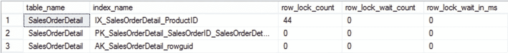

*图 3-21 行锁的查询结果*

```sql
USE AdventureWorks2017
GO
SELECT OBJECT_NAME(ios.object_id) AS table_name
,i.name AS index_name
,ios.row_lock_count
,ios.row_lock_wait_count
,ios.row_lock_wait_in_ms
FROM sys.dm_db_index_operational_stats(DB_ID(),OBJECT_ID('Sales.SalesOrderDetail'),NULL,NULL) ios
INNER JOIN sys.indexes i
ON i.object_id = ios.object_id
AND i.index_id = ios.index_id
ORDER BY ios.range_scan_count DESC;
```

*清单 3-30 从 sys.dm_db_index_operational_stats 查询行锁*


#### 页锁

下一组列是页锁列。这一组中的列具有与行锁列相似的特性，不同之处在于它们的作用域是页级别而不是行级别。对于涉及被访问行的每个页，都会获取一个页锁。这些列是 `page_lock_count`、`page_lock_wait_count` 和 `page_lock_wait_in_ms`。在监控索引上的锁争用时，同时查看页级别和行级别非常重要，以确定争用是发生在被访问的单个行上，还是可能发生在同一页面上被访问的不同行上。

为了回顾差异，让我们继续使用清单 [3-29] 中的查询，但检索为该查询在 `sys.dm_db_index_operational_stats` 中收集的页锁统计信息。此信息可使用清单 [3-31] 中的脚本获取。这次的结果与行锁的结果有些不同。对于页锁，请参见图 [3-22]；索引 `IX_SalesOrderDetail_ProductID` 上只有两个页锁。此外，在 `PK_SalesOrderDetail_SalesOrderID_SalesOrderDetailID` 上有 44 个页锁，而该索引没有遇到任何行锁。

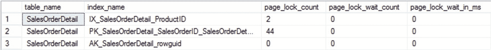
*图 3-22 页锁的查询结果*

```sql
USE AdventureWorks2017
GO
SELECT OBJECT_NAME(ios.object_id) AS table_name
,i.name AS index_name
,ios.page_lock_count
,ios.page_lock_wait_count
,ios.page_lock_wait_in_ms
FROM sys.dm_db_index_operational_stats(DB_ID(),OBJECT_ID('Sales.SalesOrderDetail'),NULL,NULL) ios
INNER JOIN sys.indexes i
ON i.object_id = ios.object_id
AND i.index_id = ios.index_id
ORDER BY ios.range_scan_count DESC;
```
*清单 3-31 查询 `sys.dm_db_index_operational_stats` 中的页锁*

锁行为的统计信息最初可能没有意义，直到你考虑了查询（来自清单 [3-29]）执行时发生的活动。当查询执行时，它使用了索引查找和键查找（参见图 [3-23] 中的执行计划）。在 `IX_SalesOrderDetail_ProductID` 上的索引查找解释了那 2 个页锁和 44 个行锁。有 44 行匹配查询的谓词，它们跨越了 2 个页。在 `PK_SalesOrderDetail_SalesOrderID_SalesOrderDetailID` 上的 44 个页锁是针对来自 `IX_SalesOrderDetail_ProductID` 的所有行执行的键查找操作的结果。行锁列和页锁列共同帮助描述了所发生的活动。

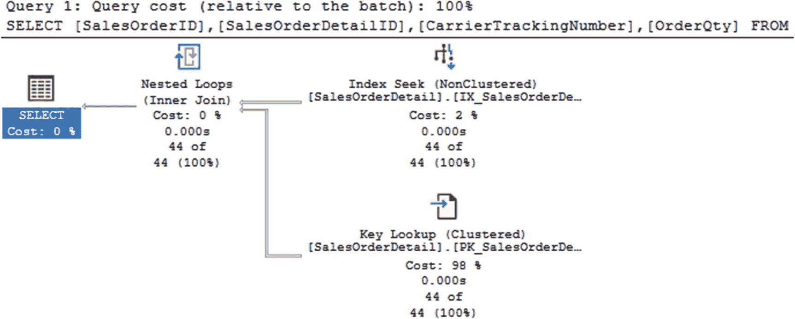
*图 3-23 `SELECT` 查询的执行计划*

虽然行锁和页锁对于识别何时存在争用很有用，但关于锁有一个信息是它们无法提供的。DMO 中没有收集关于正在放置的锁类型的信息。所有锁可能是共享锁，也可能是排他锁。锁等待计数提供了关于表上不兼容锁的频率以及这些锁的持续时间的范围，但锁本身并未被识别。

#### 锁升级

关于锁争用，最后需要注意的一点是数据库中发生的锁升级数量。当为事务获取的锁数量超过 SQL Server 实例上的锁阈值时，锁将升级到更高级别。这种升级可能发生在页、分区和表级别。数据库中发生锁升级的原因有很多。一个原因是锁需要内存，因此锁越多，需要的内存就越多，管理锁所需的资源也就越多。另一个原因是，许多单独的低级别锁为阻塞升级为死锁提供了机会。由于这些原因，关注锁升级非常重要。

为了帮助理解锁升级，让我们使用本节前面演示查询的修改版本。不过，这次不是选择 44 行，而是更新所有 `ProductID` 小于或等于 712 的行（见清单 [3-32]）。更新操作只会将 `ProductID` 更改为当前值，以避免永久更改 AdventureWorks2017 中的数据。

```sql
USE AdventureWorks2017
GO
UPDATE Sales.SalesOrderDetail
SET ProductID = ProductID
WHERE ProductID <= 712
```
*清单 3-32 生成锁提升的 T-SQL 脚本*

现在，通过示例脚本的执行，你需要使用清单 [3-33] 中的脚本查看 `sys.dm_db_index_operational_stats` 中的统计信息，以确定是否发生了任何锁升级。如脚本输出所示（图 [3-24]），列 `index_lock_promotion_attempt_count` 为 `PK_SalesOrderDetail_SalesOrderID_SalesOrderDetailID` 和 `IX_SalesOrderDetail_ProductID` 记录了四次事件。这意味着触发了四次锁升级的机会。查看 `index_lock_promotion_count` 列，`IX_SalesOrderDetail_ProductID` 上发生了一次锁升级。用不太技术的术语解释结果，对于这两个索引，SQL Server 有四次考虑锁升级是否适用于该查询。在对 `IX_SalesOrderDetail_ProductID` 进行第四次检查时，SQL Server 确定需要锁升级，于是锁被升级了。

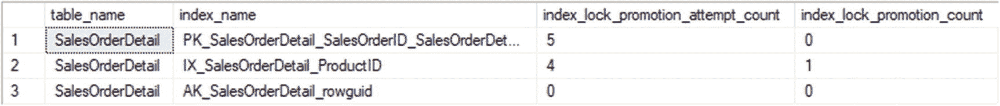
*图 3-24 锁升级的查询结果*

```sql
USE AdventureWorks2017
GO
SELECT OBJECT_NAME(ios.object_id) AS table_name
,i.name AS index_name
,ios.index_lock_promotion_attempt_count
,ios.index_lock_promotion_count
FROM sys.dm_db_index_operational_stats(DB_ID(),OBJECT_ID('Sales.SalesOrderDetail'),NULL,NULL) ios
INNER JOIN sys.indexes i
ON i.object_id = ios.object_id
AND i.index_id = ios.index_id
ORDER BY ios.range_scan_count DESC;
```
*清单 3-33 查询 `sys.dm_db_index_operational_stats` 中的锁升级*

监控锁升级与监控行锁和页锁密不可分。当行锁和页锁争用增加时，无论是通过锁等待频率增加还是持续时间延长，评估锁升级都可以帮助识别 SQL Server 考虑升级锁的次数以及这些锁何时被升级。在某些情况下，如果表索引不当，锁升级可能更频繁地发生，并导致阻塞增加，甚至可能引发死锁。

#### 锁存竞争

锁定并非索引可能遇到的唯一竞争类型。除了锁定，还存在**锁存竞争**。锁存器是短小、轻量的数据同步对象。从高层次看，锁存器在活动执行期间对内存对象提供控制。锁存器的一个例子是将数据从磁盘传输到内存时。如果在此过程中出现磁盘瓶颈，锁存等待会在磁盘传输完成前累积。这些信息的价值在于，当锁存等待发生时，相关列（如表 3-16 所示）提供了一种机制，可将等待追踪到具体的索引，从而使你能够作为索引管理的一部分，重点关注索引的存储位置。

表 3-16

`sys.dm_db_index_operational_stats` 中的锁存活动列

| 列名 | 数据类型 | 描述 |
| --- | --- | --- |
| `page_latch_wait_count` | `bigint` | 因锁存竞争导致数据库引擎等待的累计次数。 |
| `page_latch_wait_in_ms` | `bigint` | 因锁存竞争导致数据库引擎等待的累计毫秒数。 |
| `page_io_latch_wait_count` | `bigint` | 数据库引擎在 I/O 页面锁存上等待的累计次数。 |
| `page_io_latch_wait_in_ms` | `bigint` | 数据库引擎在页面 I/O 锁存上等待的累计毫秒数。 |
| `tree_page_latch_wait_count` | `bigint` | `page_latch_wait_count` 的子集，仅包括高级 B 树页面。对于堆表，此值始终为 0。 |
| `tree_page_latch_wait_in_ms` | `bigint` | `page_latch_wait_in_ms` 的子集，仅包括高级 B 树页面。对于堆表，此值始终为 0。 |
| `tree_page_io_latch_wait_count` | `bigint` | `page_io_latch_wait_count` 的子集，仅包括高级 B 树页面。对于堆表，此值始终为 0。 |
| `tree_page_io_latch_wait_in_ms` | `bigint` | `page_io_latch_wait_in_ms` 的子集，仅包括高级 B 树页面。对于堆表，此值始终为 0。 |

##### 页面 I/O 锁存

当涉及页面 I/O 锁存时，会收集两组数据：页面级锁存和树页面锁存。页面级锁存发生在需要检索索引叶子级别的数据页（即数据页）时（与之相对，树页面锁存发生在索引的所有其他级别）。这两种统计信息都是对将数据移入缓冲区时创建的锁存次数以及任何相关延迟时间的度量。每当 `page_io_latch_wait_in_ms` 或 `tree_page_io_latch_wait_in_ms` 中累积了时间，它就与 `PAGEIOLATCH_* wait` 等待类型的等待时间增加相关。

为了更好地理解页面 I/O 锁存的发生方式以及可收集的统计信息，我们将回顾一个示例，该示例将导致这些等待发生。在这个演示中，你将通过清单 3-34 中的脚本返回 `Sales.SalesOrderDetail`、`Sales.SalesOrderHeader` 和 `Production.Product` 中的所有数据。执行脚本前，将清除缓冲区缓存，以强制 SQL Server 必须从磁盘检索数据页。请确保仅在非生产服务器上使用此脚本，因为清除缓冲区缓存不会影响其他进程。

```
USE AdventureWorks2017
GO
DBCC DROPCLEANBUFFERS
GO
SELECT *
FROM Sales.SalesOrderDetail sod
INNER JOIN Sales.SalesOrderHeader soh ON sod.SalesOrderID = soh.SalesOrderID
INNER JOIN Production.Product p ON sod.ProductID = p.ProductID;
清单 3-34
生成页面 I/O 锁存的 T-SQL 脚本
```

当查询完成时，在将表和索引的页面填充到缓冲区缓存的过程中，会发生许多页面 I/O 锁存。要查看页面 I/O 锁存，请使用清单 3-35 中的脚本，针对 `sys.dm_db_index_operational_stats` 中的页面 I/O 锁存列进行查询。结果如图 3-25 所示，表明示例查询中的所有三个表都发生了页面 I/O 锁存等待，其中 `Sales.SalesOrderHeader` 表上甚至产生了整整 1 毫秒的等待。此处的结果高度依赖于底层存储，因此如果你的数字截然不同，那可能是硬件性能差异，而不是查询问题。如果它们异常高，你可能需要考虑对磁盘系统进行一些分析。

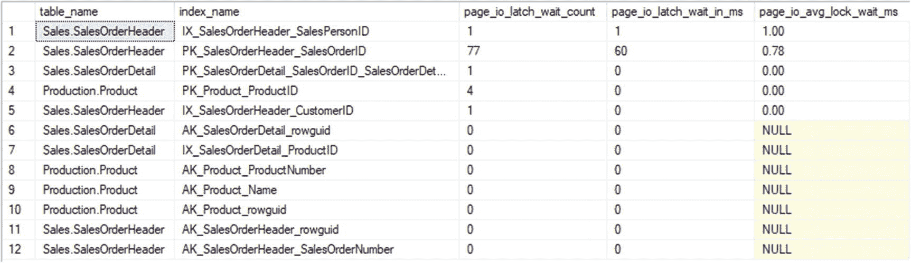

图 3-25

页面 I/O 锁存的查询结果

```
USE AdventureWorks2017
GO
SELECT OBJECT_SCHEMA_NAME(ios.object_id) + '.' + OBJECT_NAME(ios.object_id) as table_name
,i.name as index_name
,page_io_latch_wait_count
,page_io_latch_wait_in_ms
,CAST(1\. * page_io_latch_wait_in_ms
/ NULLIF(page_io_latch_wait_count ,0) AS decimal(12,2)) AS page_io_avg_lock_wait_ms
FROM sys.dm_db_index_operational_stats (DB_ID(), NULL, NULL, NULL) ios
INNER JOIN sys.indexes i ON i.object_id = ios.object_id AND i.index_id = ios.index_id
WHERE i.object_id = OBJECT_ID('Sales.SalesOrderHeader')
OR i.object_id = OBJECT_ID('Sales.SalesOrderDetail')
OR i.object_id = OBJECT_ID('Production.Product')
ORDER BY 5 DESC;
清单 3-35
在 sys.dm_db_index_operational_stats 中查询页面 I/O 锁存统计信息
```


##### 页面锁存

另一种可能发生在数据库中与索引相关的锁存是页面锁存。页面锁存涵盖发生在非数据页上的任何锁存。页面锁存包括 GAM 和 SGAM 页面的分配以及 `DBCC` 和备份活动。随着页面被不同资源分配，可能会发生争用，而监控页面锁存可以揭示这种活动。

对于索引而言，页面锁存可能发生的一种常见场景是，由于频繁的插入或页面分配，索引上出现“热点”。为了演示这个场景，你将在代码清单 3-36 中创建表 `dbo.PageLatchDemo`。接下来，使用你首选的负载生成工具，执行代码清单 3-37 中的代码五次。为了生成本例的负载，在 SQL Server Management Studio 中运行五个查询窗口，每个窗口运行负载查询的一个副本。通过此示例，数百行数据将被快速插入到同一系列的页面中，并进行大量页面分配。由于这些插入非常接近，将产生一个“热点”，从而导致页面锁存争用。

```
USE AdventureWorks2017
GO
INSERT INTO dbo.PageLatchDemo
(FillerData)
SELECT  t.object_id % 2
FROM sys.tables t;
GO 5000
代码清单 3-37
用于生成页面锁存负载的 T-SQL 脚本
```

```
USE AdventureWorks2017
GO
IF OBJECT_ID('dbo.PageLatchDemo') IS NOT NULL
DROP TABLE dbo.PageLatchDemo;
CREATE TABLE dbo.PageLatchDemo
(
PageLatchDemoID INT IDENTITY (1,1)
,FillerData  bit
,CONSTRAINT PK_PageLatchDemo_PageLatchDemoID PRIMARY KEY CLUSTERED  (PageLatchDemoID)
);
代码清单 3-36
用于生成页面锁存场景的 T-SQL 脚本
```

为了验证页面锁存争用确实发生，请使用代码清单 3-38 提供的脚本。图 3-26 中显示的结果表明存在大量的页面锁存及其相关的延迟。在此示例中，每次页面锁存的延迟超过 20 毫秒。在更关键的情况下，这些值会高得多，并将帮助你识别索引何时干扰了对索引数据的访问或写入。


图 3-26

页面锁存的查询结果

```
SELECT OBJECT_SCHEMA_NAME(ios.object_id) + '.' + OBJECT_NAME(ios.object_id) as table_name
,i.name as index_name
,page_latch_wait_count
,page_latch_wait_in_ms
,CAST(100\. * page_latch_wait_in_ms
/ NULLIF(page_latch_wait_count ,0) AS decimal(12,2)) AS page_avg_lock_wait_ms
FROM sys.dm_db_index_operational_stats (DB_ID(), NULL, NULL, NULL) ios
INNER JOIN sys.indexes i ON i.object_id = ios.object_id AND i.index_id = ios.index_id
WHERE i.object_id = OBJECT_ID('dbo.PageLatchDemo');
代码清单 3-38
用于在 sys.dm_db_index_operational_stats 中查询页面锁存统计信息的脚本
```

### 注意

页面 I/O 和页面锁存争用高度依赖于硬件。本节中演示查询的结果不会与显示的结果完全匹配。

### 页面分配周期

由于 DML 活动，叶子和非叶子页面会不时地从索引中分配或释放。监控页面分配是监控索引的重要组成部分（有关选项，请参见表 3-17）。通过此监控，可以了解索引在维护窗口之间的“呼吸”情况。这种呼吸活动是通过插入和页面拆分分配给索引的页面与通过删除移除或合并页面之间的关系。通过监控此活动，你可以更好地维护索引，并了解何时增加索引的 `FILLFACTOR` 值是有用的。

表 3-17

sys.dm_db_index_operational_stats 中的页面分配周期列

| 列名 | 数据类型 | 描述 |
| --- | --- | --- |
| `leaf_allocation_count` | `bigint` | 索引或堆中叶子级别页面分配的累计计数。 |
| `nonleaf_allocation_count` | `bigint` | 由叶子级别以上的页面拆分引起的页面分配的累计计数。 |
| `leaf_page_merge_count` | `bigint` | 叶子级别页面合并的累计计数。 |
| `nonleaf_page_merge_count` | `bigint` | 叶子级别以上页面合并的累计计数。 |

作为表上如何发生页面分配的示例，请执行代码清单 3-39 中的脚本。在此脚本中，创建了表 `dbo.AllocationCycle`。随后，将 100,000 行插入表中。由于这是一个新表，页面分配上没有争用，数据以有序的方式添加。此时，页面已分配给表，并且分配与这些插入直接相关。此脚本将运行一分钟或更长时间。执行此操作时，请确保未启用“包含实际执行计划”。

```
USE AdventureWorks2017;
GO
SET NOCOUNT ON
DROP TABLE IF EXISTS dbo.AllocationCycle;
CREATE TABLE dbo.AllocationCycle (
ID INT IDENTITY,
FillerData VARCHAR(1000),
CreateDate DATETIME,
CONSTRAINT PK_AllocationCycle PRIMARY KEY CLUSTERED (ID)
);
GO
INSERT INTO dbo.AllocationCycle (FillerData, CreateDate)
VALUES (NEWID(), GETDATE());
GO 100000
代码清单 3-39
用于生成页面分配的 T-SQL 脚本
```

要验证分配情况，可以检查 `sys.dm_db_index_operational_stats` 中的叶子和非叶子分配列 `leaf_allocation_count` 和 `nonleaf_allocation_count`。使用代码清单 3-40 中的脚本，你可以看到叶子级别有 758 个分配，非叶子级别有 3 个分配（见图 3-27）。这是使用这些列时要记住的一个重要点：分配的页面中有一部分可能与插入相关。


图 3-27

插入页面分配的查询结果

```
USE AdventureWorks2017
GO
SELECT OBJECT_SCHEMA_NAME(ios.object_id) + '.' + OBJECT_NAME(ios.object_id) as table_name
,i.name as index_name
,ios.leaf_allocation_count
,ios.nonleaf_allocation_count
,ios.leaf_page_merge_count
,ios.nonleaf_page_merge_count
FROM sys.dm_db_index_operational_stats(DB_ID(), OBJECT_ID('dbo.AllocationCycle'), NULL,NULL) ios
INNER JOIN sys.indexes i ON i.object_id = ios.object_id AND i.index_id = ios.index_id;
代码清单 3-40
用于在 sys.dm_db_index_operational_stats 中查询页面锁存统计信息的脚本
```


### 注意

自 SQL Server 2014 之后，这些列的行为发生了变化。在批量插入时，`leaf_allocation_count` 仅记录单个页。

在本节开头，曾提到使用页分配来监视页拆分，并识别在何处修改填充因子可能有用。要理解这一点，您首先需要在 `dbo.AllocationCycle` 表上生成页拆分。您可以使用清单 3-41 中的脚本来实现。此脚本将每第三行的 `FillerData` 列长度增加到 1,000 个字符。

```sql
USE AdventureWorks2017;
GO
UPDATE  dbo.AllocationCycle
SET     FillerData = REPLICATE('x',1000)
WHERE   ID % 3 = 1;
```
**清单 3-41** 用于增加页分配的 T-SQL 脚本

数据修改后，执行清单 3-40 中的 `sys.dm_db_index_operational_stats` 查询的结果会发生巨大变化。随着行大小的扩展，分配的页数激增至 9,849，其中包含 35 个非叶页（图 3-28）。由于行的顺序没有改变，此活动与因行大小扩展而引起的页拆分有关。通过监视这些统计信息，可以识别受此类活动模式影响的索引。


**图 3-28** 更新页分配的查询结果

### 压缩

虽然不是最令人兴奋的一组列，但 `sys.dm_db_index_operational_stats` 中有两个列用于监视压缩。如表 3-18 所示，这些列统计了尝试压缩页的次数以及成功压缩的次数。这些列的主要价值在于提供关于 `PAGE` 级别压缩的反馈。压缩失败可能导致决定移除压缩，因为当压缩失败率很高时启用压缩通常是不切实际的。

**表 3-18** `sys.dm_db_index_operational_stats` 中的压缩列

| 列名 | 数据类型 | 描述 |
| --- | --- | --- |
| `page_compression_attempt_count` | bigint | 针对表、索引或索引视图的特定分区，评估 `PAGE` 级别压缩的页数。包括因无法实现显著节省而未压缩的页。 |
| `page_compression_success_count` | bigint | 针对表、索引或索引视图的特定分区，使用 `PAGE` 级别压缩成功压缩的数据页数。 |

当压缩数据的成本超过日后解压缩数据的价值时，页面压缩可能会失败。这通常发生在重复数据模式较少的数据中，例如图像。当图像数据被压缩时，通常无法从压缩中获得足够的好处，因此 SQL Server 不会将该页存储为压缩页。为了演示这一点，请执行清单 3-42 中的代码，该代码创建了一个启用了页面压缩的表，并向其中插入了若干图像。

```sql
USE AdventureWorks2017
GO
IF OBJECT_ID('dbo.PageCompression') IS NOT NULL
DROP TABLE dbo.PageCompression;
CREATE TABLE dbo.PageCompression(
ProductPhotoID int NOT NULL,
ThumbNailPhoto varbinary(max) NULL,
LargePhoto varbinary(max) NULL,
CONSTRAINT PK_PageCompression PRIMARY KEY CLUSTERED (ProductPhotoID))
WITH (DATA_COMPRESSION = PAGE);
INSERT INTO dbo.PageCompression
SELECT ProductPhotoID
,ThumbNailPhoto
,LargePhoto
FROM Production.ProductPhoto;
```
**清单 3-42** 用于创建带页面压缩的表的 T-SQL 脚本

向表中的插入操作并未失败，但是否所有页面都被压缩了呢？要找出答案，请执行清单 3-43 中的脚本；它返回 `page_compression_attempt_count` 和 `page_compression_success_count` 列。如结果所示（图 3-29），有 7 个页面被成功压缩，但另外有 46 个页面压缩失败。根据页面压缩的成功与失败比例，可以很容易地看出页面压缩对于 `dbo.PageCompression` 上的聚集索引的价值并不高。

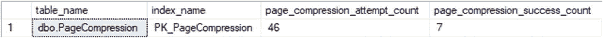
**图 3-29** 压缩的查询结果

```sql
USE AdventureWorks2017
GO
SELECT OBJECT_SCHEMA_NAME(ios.object_id) + '.' + OBJECT_NAME(ios.object_id) as table_name
,i.name as index_name
,page_compression_attempt_count
,page_compression_success_count
FROM sys.dm_db_index_operational_stats (DB_ID(), OBJECT_ID('dbo.PageCompression'), NULL, NULL) ios
INNER JOIN sys.indexes i ON i.object_id = ios.object_id AND i.index_id = ios.index_id;
```
**清单 3-43** 查询 `sys.dm_db_index_operational_stats` 中的页面压缩尝试


### LOB 访问

`sys.dm_db_index_operational_stats` 中的下一组列与大型对象（LOBs）相关。它们提供了关于获取的页数以及这些页大小的信息。此外，还有一些列用于衡量被推离行和拉入行的 LOB 数据量。表 3-19 列出了此组中的所有这些列及其他列。

表 3-19

`sys.dm_db_index_operational_stats` 中的 LOB 访问列

| 列名 | 数据类型 | 描述 |
| --- | --- | --- |
| `lob_fetch_in_pages` | `bigint` | 从 `LOB_DATA` 分配单元中检索的 LOB 页的累计计数。这些页包含存储在类型为 `text`, `ntext`, `image`, `varchar(max)`, `nvarchar(max)`, `varbinary(max)`, 和 `xml` 的列中的数据。 |
| `lob_fetch_in_bytes` | `bigint` | 检索的 LOB 数据字节的累计计数。 |
| `lob_orphan_create_count` | `bigint` | 为批量操作创建的孤立 LOB 值的累计计数。 |
| `lob_orphan_insert_count` | `bigint` | 在批量操作期间插入的孤立 LOB 值的累计计数。 |
| `row_overflow_fetch_in_pages` | `bigint` | 从 `ROW_OVERFLOW_DATA` 分配单元中检索的行溢出数据页的累计计数。 |
| `row_overflow_fetch_in_bytes` | `bigint` | 检索的行溢出数据字节的累计计数。 |
| `column_value_push_off_row_count` | `bigint` | 为使插入或更新的行适应页面而被推离行的 LOB 数据和行溢出数据的列值的累计计数。 |
| `column_value_pull_in_row_count` | `bigint` | 被拉入行的 LOB 数据和行溢出数据的列值的累计计数。这发生在更新操作释放记录中的空间，并提供机会将一个或多个来自 `LOB_DATA` 或 `ROW_OVERFLOW_DATA` 分配单元的离行值拉回到 `IN_ROW_DATA` 分配单元时。 |

LOB 访问列可用于确定大型对象活动的量级，以及数据何时可能从大型对象存储移动到行内溢出存储。当您遇到与检索或更新 LOB 数据相关的性能问题时，这一点很重要。例如，`lob_fetch_in_bytes` 列衡量了 SQL Server 为索引检索的 LOB 列的字节数。

为了演示一些 LOB 活动，运行清单 3-44 中的脚本。此脚本并未涵盖所有可能的活动，但涵盖了基础部分。脚本开始时创建了表 `dbo.LOBAccess`，其中包含使用大型对象数据类型的列 `LOBValue`。针对该表的第一个操作插入了十行足够窄的数据，使得 `LOBValue` 值可以与行一起存储在数据页上。第二个操作增加了 `LOBValue` 列的大小，迫使其扩展到数据行 8 KB 的最大限制之外。最后一个操作从表中检索所有行。

```sql
USE AdventureWorks2017
GO
IF OBJECT_ID('dbo.LOBAccess') IS NOT NULL
DROP TABLE dbo.LOBAccess;
CREATE TABLE dbo.LOBAccess
(
ID INT IDENTITY(1,1) PRIMARY KEY CLUSTERED
,LOBValue VARCHAR(MAX)
,FillerData CHAR(2000) DEFAULT(REPLICATE('X',2000))
,FillerDate DATETIME DEFAULT(GETDATE())
);
INSERT INTO dbo.LOBAccess (LOBValue)
SELECT TOP 10 'Short Value'
FROM Production.ProductPhoto;
UPDATE dbo.LOBAccess
SET LOBValue = REPLICATE('Long Value',8000);
SELECT * FROM dbo.LOBAccess;
```
清单 3-44
用于创建包含 LOB 数据的表的 T-SQL 脚本

使用表 3-20 中列出的 LOB 访问列，您可以观察清单 3-45 中的脚本底层发生的情况。如图 3-30 中的输出所示，`column_value_push_off_row_count` 列跟踪了索引上的十次行操作，其中行将行内数据移动到大型对象存储中。此操作与增加行长度的 `UPDATE` 语句同时发生。累计的另外两个统计信息，`lob_fetch_in_pages` 和 `lob_fetch_in_bytes`，详细说明了在 `SELECT` 语句期间检索的页数和数据大小。正如这些统计信息所示，LOB 访问统计信息提供了 LOB 活动的精细跟踪。

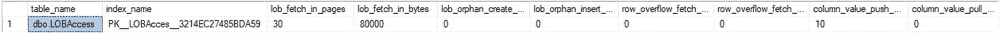

图 3-30

LOB 访问的查询结果

```sql
USE AdventureWorks2017
GO
SELECT OBJECT_SCHEMA_NAME(ios.object_id) + '.' + OBJECT_NAME(ios.object_id) as table_name
,i.name as index_name
,lob_fetch_in_pages
,lob_fetch_in_bytes
,lob_orphan_create_count
,lob_orphan_insert_count
,row_overflow_fetch_in_pages
,row_overflow_fetch_in_bytes
,column_value_push_off_row_count
,column_value_pull_in_row_count
FROM sys.dm_db_index_operational_stats (DB_ID(), OBJECT_ID('dbo.LOBAccess'), NULL, NULL) ios
INNER JOIN sys.indexes i ON i.object_id = ios.object_id AND i.index_id = ios.index_id;
```
清单 3-45
用于查询 `sys.dm_db_index_operational_stats` 中 LOB 访问的脚本

### 行版本

`sys.dm_db_index_operational_stats` 中的最后一组列报告了由于快照隔离列而在索引内产生的版本计数。这些列是 SQL Server 2019 新增的。虽然本书不会演示它们在快照隔离级别中的使用，但为了完整性，它们仍包含在本章中。

表 3-20

`sys.dm_db_index_operational_stats` 中的行版本列

| 列名 | 数据类型 | 描述 |
| --- | --- | --- |
| `version_generated_inrow` | `bigint` | 快照隔离事务保留的行内版本记录数。 |
| `version_generated_offrow` | `bigint` | 快照隔离事务保留的离行版本记录数。 |
| `ghost_version_inrow` | `bigint` | 快照隔离事务保留的行内幻影版本记录数。 |
| `ghost_version_offrow` | `bigint` | 快照隔离事务保留的离行幻影版本记录数。 |
| `insert_over_ghost_version_inrow` | `bigint` | 快照隔离事务保留的在幻影版本记录之上执行的行内插入操作数。 |
| `insert_over_ghost_version_offrow` | `bigint` | 快照隔离事务保留的在幻影版本记录之上执行的离行插入操作数。 |

### 索引操作统计摘要

本节讨论了 DMO `sys.dm_db_index_operational_stats` 中可用的统计信息。虽然它不是一个被广泛使用的 DMO，但它确实提供了大量关于索引的低级细节，可用于深入探究索引的行为方式。从关于 DML 和 `SELECT` 活动的列，到锁争用，再到压缩，此 DMO 中的列提供了丰富的信息。

### 索引物理统计

SQL Server 收集的最后一个领域的统计信息是索引物理统计。这些统计信息报告索引的当前结构信息，以及插入、更新和删除操作对索引产生的物理影响。这些统计信息收集在 DMO `sys.dm_db_index_physical_stats` 中。

与 `sys.dm_db_index_operational_stats` 一样，`sys.dm_db_index_physical_stats` 是一个动态管理函数（DMF）。要使用此 DMF，在使用时需要提供一些参数。清单 3-46 详细说明了此 DMF 的参数。

```sql
sys.dm_db_index_physical_stats (
{ database_id | NULL | 0 | DEFAULT }
, { object_id | NULL | 0 | DEFAULT }
, { index_id | NULL | 0 | -1 | DEFAULT }
, { partition_number | NULL | 0 | DEFAULT }
, { mode | NULL | DEFAULT }
)
```
清单 3-46
`sys.dm_db_index_physical_stats` 的参数

`sys.dm_db_index_physical_stats` 的 `mode` 参数接受以下五个值之一：`DEFAULT`, `NULL`, `LIMITED`, `SAMPLED`, 或 `DETAILED`。`DEFAULT`, `NULL`, 和 `LIMITED` 实际上是相同的值，将一并描述。表 3-21 列出了这些参数。


### 注意

DMF `sys.dm_db_index_physical_stats` 可以接受 Transact SQL 函数 `DB_ID()` 和 `OBJECT_ID()` 的使用。这些函数分别用于参数 `database_id` 和 `object_id`。

**表 3-21**

**sys.dm_db_index_physical_stats 的参数**

| 参数名 | 描述 |
| --- | --- |
| LIMITED | 扫描页面数量最少的最快模式。对于索引，仅扫描 B 树的父级页面。在堆中，仅检查相关的 PFS 和 IAM 页面。 |
| SAMPLED | 此模式基于索引或堆中所有页面的 1% 样本返回统计信息。如果索引或堆少于 10,000 个页面，则使用 DETAILED 模式而非 SAMPLED。 |
| DETAILED | 此模式扫描索引的所有页面（叶级和非叶级）并返回所有统计信息。 |

执行时，DMF 会报告三个领域的信息：头部列、行统计信息和碎片统计信息。需要注意的一点是：此 DMF 在执行时收集它所报告的信息。如果您的系统使用强度很高，此 DMF 可能会干扰生产工作负载。

### 头部列

从 `sys.dm_db_index_physical_stats` 返回的第一组列是头部列。这些列提供元数据和描述性信息，说明结果行中包含的信息类型。头部列如表 3-22 所示。查看头部列时，最重要的信息是 `alloc_unit_type_desc` 和 `index_level`。这两列提供了有关正在报告的数据类型以及统计信息在索引中的来源位置的信息。

**表 3-22**

**sys.dm_db_index_physical_stats 的头部列**

| 列名 | 数据类型 | 描述 |
| --- | --- | --- |
| database_id | `smallint` | 表或视图的数据库 ID。 |
| object_id | `int` | 表或视图的对象 ID。 |
| index_id | `int` | 索引的索引 ID。 |
| partition_number | `int` | 所属对象（表、视图或索引）内的基于 1 的分区号。 |
| index_type_desc | `nvarchar(60)` | 索引类型的描述。 |
| hobt_id | `bigint` | 索引或分区的堆或 B 树 ID。 |
| alloc_unit_type_desc | `nvarchar(60)` | 分配单元类型的描述。 |
| index_depth | `tinyint` | 索引级别数。 |
| index_level | `tinyint` | 索引的当前级别。 |

### 行统计信息

`sys.dm_db_index_physical_stats` 中的第二组列是行统计信息列。这些列提供索引中包含的行的统计信息，如表 3-23 所示。从索引中的页面数到记录计数，这些列提供了一些这方面的通用统计信息。这些列中有几个值得关注的项目非常有用。

**表 3-23**

**sys.dm_db_index_physical_stats 的行统计信息列**

| 列名 | 数据类型 | 描述 |
| --- | --- | --- |
| page_count | `bigint` | 索引或数据页面的总数。 |
| record_count | `bigint` | 记录总数。 |
| ghost_record_count | `bigint` | 分配单元中准备由后台清理任务清除的幽灵记录数。 |
| version_ghost_record_count | `bigint` | 分配单元中由未完成的快照隔离事务保留的幽灵记录数。 |
| min_record_size_in_bytes | `int` | 最小记录大小（字节）。 |
| max_record_size_in_bytes | `int` | 最大记录大小（字节）。 |
| avg_record_size_in_bytes | `float` | 平均记录大小（字节）。 |
| forwarded_record_count | `bigint` | 堆中具有指向另一个数据位置的前向指针的记录数。 |
| compressed_page_count | `bigint` | 压缩页面的数量。 |

第一个值得关注的列是 `ghost_record_count` 和 `version_ghost_record_count`。这些列提供了在 `sys.dm_db_index_operational_stats` 中找到的 `ghost_record_count` 的细分。

下一个要检查的列是 `forwarded_record_count`。此列统计了堆中前向记录的数量。这在 `sys.dm_db_index_operational_stats` 的 `forwarded_fetch_count` 列中有所讨论。在那个 DMF 中，计数是因为前向记录被访问的次数。而在 `sys.dm_db_index_operational_stats` 中，该计数指的是表中存在的前向记录的数量。

最后一个要查看的列是 `compressed_page_count`。压缩页面计数提供了索引中所有已压缩页面的计数。这有助于衡量通过 `PAGE` 级压缩来压缩页面的价值。

### 碎片统计信息

DMF 中的最后一组统计信息是碎片统计信息。在大多数情况下，碎片是人们最常查阅 `sys.dm_db_index_physical_stats` 的原因。当在索引中插入或修改行，导致该行不再适合其应放置的页面时，就会发生索引碎片。此时，页面会拆分，将一半的页面移动到另一个页面。由于拆分后的页面之后通常没有连续的可用页面，该页面会被移动到可用的空闲页面。这会导致索引中出现间隙，页面本应是连续的，从而阻止 SQL Server 在磁盘上读取索引时执行顺序读取。

有四个列提供了分析索引内碎片状态所需的信息，如表 3-24 所示。每一列都有助于查看碎片的程度，并帮助确定如何解决或减轻碎片。

**表 3-24**

**sys.dm_db_index_physical_stats 的碎片统计信息列**

| 列名 | 数据类型 | 描述 |
| --- | --- | --- |
| `avg_fragmentation_in_percent` | `float` | `IN_ROW_DATA` 分配单元中索引的逻辑碎片或堆的范围碎片。 |
| `fragment_count` | `bigint` | `IN_ROW_DATA` 分配单元叶级别中的片段数。 |
| `avg_fragment_size_in_pages` | `float` | `IN_ROW_DATA` 分配单元叶级别中一个片段的平均页面数。 |
| `avg_page_space_used_in_percent` | `float` | 所有页面中已使用的平均可用数据存储空间百分比。 |

第一个碎片列是 `avg_fragmentation_in_percent`。此列提供了索引中碎片数量的百分比计数。随着碎片的增加，SQL Server 可能需要更多的物理 I/O 来从数据库中检索数据。使用此列，您可以通过重建或重新组织索引来制定维护计划以减轻碎片。一般准则是重新组织碎片少于 30% 的索引，并重建碎片超过 30% 的索引。

下一列 `fragment_count` 统计了索引中的所有片段数。索引中创建的每个片段，此列都会汇总其页面计数。

第三列是 `avg_fragment_size_in_pages`。此列代表每个片段中的平均页面数。此值越高，并且越接近 `page_count`，SQL Server 读取数据所需的 I/O 就越少。

最后一列是 `avg_page_space_used_in_percent`。此列提供了页面上可用空间量的信息。DML 活动少的索引应尽可能接近 100%。如果索引上没有预期的更新，目标应该是让索引尽可能紧凑。


### 索引物理统计信息摘要

查看 `sys.dm_db_index_physical_stats` 的主要目的是帮助指导索引维护。通过这个 DMF，可以分析索引每个级别的统计信息。据此，可以确定针对索引每个级别所需的维护量。无论是需要对索引进行碎片整理、修改填充因子，还是填充索引，`sys.dm_db_index_physical_stats` 中的信息都可以帮助指导这些活动。

## 列存储统计信息

如前一章所述，列存储索引使用的结构与典型的 B 树或堆（有时称为行存储）截然不同。由于这些差异，针对这些索引收集的统计信息也存在一些不同，这与其底层架构及访问方式相关。为了呈现这些不同的方面，有两个 DMO 专门关注列存储统计信息的物理和操作统计信息。

### 列存储物理统计信息

首先需要查看的是针对列存储索引收集的物理统计信息。可以通过 DMO `sys.dm_db_column_store_row_group_physical_stats` 访问此信息。此 DMO 为列存储索引中的每个行组返回一行。回顾前一章，表中每列以及每百万条记录最多会有一个行组。

#### 头列

如同之前章节的开头，我们首先介绍此 DMO 的头列。由于是每个行组对应一行，因此每行将包含 `object_id`、`index_id`、`partition_number`、`row_group_id` 和 `delta_store_hobt_id`。这些列在表 3-25 中有进一步定义。与其他索引类似，`partition_number` 验证了列存储索引可以进行分区。对于非分区的列存储索引，分区号将为 1。

表 3-25
`sys.dm_db_column_store_row_group_physical_stats` 中的头列

| 列名 | 数据类型 | 描述 |
| --- | --- | --- |
| `object_id` | `int` | 定义了索引的表或视图的 ID。 |
| `index_id` | `int` | 索引的 ID。 |
| `partition_number` | `int` | 索引或堆内的基于 1 的分区号。 |
| `row_group_id` | `bigint` | 行组的 ID。 |
| `delta_store_hobt_id` | `bigint` | 行组增量存储的 hobt_id。 如果为 NULL，则该行组没有关联的增量存储。 |

#### 统计信息列

`sys.dm_db_column_store_row_group_physical_stats` 的统计信息列提供了大量列存储索引的元数据，有助于理解列存储的构建方式。表 3-26 中定义的统计信息提供了管理列存储索引所必需的洞察。例如，您可以利用 `total_rows` 和 `deleted_rows` 来确定行组中仍处于活动状态的部分。在某些情况下，对行组进行激进的修改可能会导致表中存在空行组。此外，当行组小于一百万行时，`state`、`trim_reason` 和 `transition_to_compressed` 信息可以帮助识别行组的压缩方式。例如，如果有大量因 `BULKLOAD` 而关闭的小行组，那么重建这些行组或修改加载过程以尝试达到包含更多行的行组可能是值得的。

表 3-26
`sys.dm_db_column_store_row_group_physical_stats` 中的统计信息列

| 列名 | 数据类型 | 描述 |
| --- | --- | --- |
| `state` | `tinyint` | 与 `state_description` 关联的 ID 号。 |
| `state_desc` | `nvarchar(60)` | 行组状态的描述，可以是 `INVISIBLE`、`OPEN`、`CLOSED`、`COMPRESSED` 或 `TOMBSTONE`。 |
| `total_rows` | `bigint` | 行组中行的完整计数，包括任何已被标记为删除的行。 |
| `deleted_rows` | `bigint` | 行组中标记为删除的行数。 |
| `size_in_bytes` | `bigint` | 行组的大小（字节）。 |
| `trim_reason` | `tinyint` | 与 `trim_reason_desc` 关联的 ID 号。 |
| `trim_reason_desc` | `nvarchar(60)` | 描述为什么 `COMPRESSED` 行组的行数少于百万行的最大值，可以是 `NO_TRIM`、`BULKLOAD`、`ROERG`、`DICTIONARY SIZE`、`MEMORY LIMITATION`、`RESIDUAL ROW GROUP`、`STATS MISMATCH` 或 `SPILLOVER`。 |
| `transition_to_compressed_state` | `tinyint` | 与 `transition_to_compressed_state_desc` 关联的 ID 号。 |
| `transition_to_compressed_state_desc` | `nvarchar(60)` | 描述行组如何从增量存储转换为行组，包括 `NOT APPLICABLE`、`INDEX BUILD`、`TUPLE MOVER`、`REORG NORMAL`、`REORG FORCED`、`BULKLOAD` 或 `MERGE`。 |
| `has_vertipaq_optimization` | `bit` | 布尔值，标识压缩期间是否使用了 Vertipaq 优化。 当未使用时，压缩效率不如使用时高。 |
| `generation` | `bigint` | 与此行组关联的行组代。 |
| `created_time` | `datetime2` | 创建此行组时的时钟时间。 |
| `closed_time` | `datetime2` | 关闭此行组时的时钟时间。 |

### 列存储操作统计信息

关于列存储索引的另一部分是通过 DMO `sys.dm_db_column_store_row_group_operational_stats` 查看其操作统计信息。此 DMO 同样为列存储索引中的每个行组返回一行。回顾前一章，表中每列以及每百万条记录最多会有一个行组。

#### 头列

`sys.dm_db_column_store_row_group_operational_stats` 的头列与列存储物理统计信息 DMO 类似。不同之处在于它没有增量存储引用，这意味着此 DMO 返回的列是 `object_id`、`index_id`、`partition_number` 和 `row_group_id`。这些列在表 3-27 中定义。

表 3-27
`sys.dm_db_column_store_row_group_operational_stats` 中的头列

| 列名 | 数据类型 | 描述 |
| --- | --- | --- |
| `object_id` | `int` | 定义了索引的表或视图的 ID。 |
| `index_id` | `int` | 索引的 ID。 |
| `partition_number` | `int` | 索引或堆内的基于 1 的分区号。 |
| `row_group_id` | `bigint` | 行组的 ID。 |


#### 统计信息列

`sys.dm_db_column_store_row_group_operational_stats` 中有趣的信息来自统计信息列。在这些列中（定义见表 3-28），包含了有关行组扫描次数、已删除行扫描次数以及列存储分区扫描次数的详细信息。这可以帮助你识别行组及其最小值和最大值对于访问该表的查询有多大用处，并确定何时删除的行数可能因其被过度访问而开始妨碍行组的可用性。此外，你还可以查看是否存在锁和阻塞事务对行组的可访问性产生负面影响，从而帮助你了解是否存在需要处理的潜在 I/O 或事务瓶颈。

### 表 3-28
`sys.dm_db_column_store_row_group_operational_stats` 中的统计信息列

| 列名 | 数据类型 | 描述 |
| --- | --- | --- |
| `scan_count` | int | 自上次 SQL 重启以来，对该行组进行扫描的次数。 |
| `delete_buffer_scan_count` | int | 使用删除缓冲区来确定此行组中已删除行的次数。这包括访问内存中的哈希表和底层的 B 树。 |
| `index_scan_count` | int | 扫描列存储索引分区的次数。此分区中所有行组的此值均相同。 |
| `rowgroup_lock_count` | bigint | 自上次 SQL 重启以来，对此行组的锁请求的累计次数。 |
| `rowgroup_lock_wait_count` | bigint | 自上次 SQL 重启以来，数据库引擎等待此行组锁的累计次数。 |
| `rowgroup_lock_wait_in_ms` | bigint | 自上次 SQL 重启以来，数据库引擎等待此行组锁的累计毫秒数。 |

## 本章小结

在本章中，你了解了 SQL Server 中有关索引的可用统计信息。从基数的统计信息到索引的物理布局，你学习了哪些信息是可用的以及如何获取它们。在很大程度上，这些信息只是冰山一角。在接下来的章节中，你将利用这些信息，通过查看已捕获的统计信息，并借助它们来提高为数据库创建索引的能力。

# 4. XML 索引

过去的几章重点介绍了对通常称为 *结构化数据* 的索引，这类数据有共同的模式和围绕其数据及存储的组织方式。在本章及接下来的几章中，索引的重点将转向非结构化和半结构化数据。无论是结构化还是非结构化数据，索引的任务都是为了获取检索和操作数据的最佳效率，但代表这些类型的数据的数据类型在数据库中的存储方式上存在差异。这些差异决定了索引的实现方式和原因，也决定了查询优化器如何使用这些索引。

SQL Server 有一种专门的数据类型用于存储最常见的非结构化和半结构化数据类型，即 XML。本章探讨 SQL Server 为处理 XML 数据提供的索引类型。本章还将展示这些索引对使用 XQuery 编写的查询类型的影响，以及对优化器决策的影响。

## XML 数据

可扩展标记语言（XML）在 20 世纪 90 年代发展起来，并于 1998 年 2 月被万维网联盟确立为标准。XML 数据在数据库中存储多年，但在 SQL Server 2005 之前一直没有专门的数据类型或访问方法。当引入时，XML 数据类型扩展了 SQL Server 的功能，以适当管理这种不同的数据结构。随着 XML 的普及，SQL Server 数据库中使用的 XML 内容及其总量不断增长。这种增长得益于 XML 为应用程序开发人员提供的优势。

### 优势

XML 数据类型的引入使得在 SQL Server 数据库内部实现完整的 XML 存储能力成为可能。这包括能够基于针对 XML 本身编写的查询来检索 XML 内容。XML 为开发人员提供的最强大支持在于它既是基于文本的，而且从表面上看是自我描述的。基于文本意味着 XML 可以轻松地从一个应用程序传递到另一个应用程序，而不管底层的操作系统或编程语言如何。自我描述的特性意味着你不需要像在数据库中定义列和表那样实际定义一个结构。相反，XML 的元素和属性会告诉你它们是什么。XML 被称为 *半结构化* 数据，因为通常会有一个模板定义预期的结构，以帮助验证任何给定的 XML 是否是格式良好的。

如果你的系统上要进行大量的 XML 处理，那么对 XML 进行索引可能会带来巨大的好处。XML 索引的最大好处在于，当你存储大量 XML 数据但只检索其中一小部分时。XML 索引对这种情况大有裨益。如果你的 XML 上有很多查询，在实施 XML 索引后，你也可能会看到这方面的改进。

#### 注意事项

尽管 XML 数据类型听起来适用于每种 XML 实例，但在设计 SQL Server 中将要存储 XML 的列时，应考虑一些因素。最关键的一点是 XML 内容应该是格式良好的。这确保了 XML 数据类型及其提供的功能（用于最高效地利用数据）能够充分发挥优势。XML 列存储为二进制大对象，更常见的称呼是 BLOB。这种存储意味着在大多数情况下，对内容的运行时查询是资源密集型且缓慢的。对于任何涉及数据检索的任务，其检索效率都是一个需要关注的问题。在 SQL Server 中，索引对于效率的高低至关重要。完全没有索引或索引过多都会影响任何数据操作任务。XML 数据类型也符合这一要求。与其他 SQL Server 索引方法相比，XML 索引是独特的。

## XML 索引

XML 索引主要分为两大类：主/辅助索引和选择性 XML 索引。这些索引类型之间的主要区别在于索引中包含了多少 XML 数据。对于主/辅助索引，所有路径、节点和值都包含在索引中。当不清楚 XML 的哪些部分会被最频繁访问时，这种方式效果很好。或者，如果只访问 XML 的有限部分，那么选择性 XML 索引可以提供更好的性能，因为索引的数据量减少了。接下来的两节将探讨并全面解释这两类 XML 索引。


### 主/次 XML 索引

顾名思义，主/次 XML 索引包含两种类型：主索引和次索引。这两种索引类型在 XML 文档内提供的索引关系类似于聚簇索引和非聚簇索引之间的关系。在实现 XML 索引时，一些基本规则适用于每种类型：

*   虽然一个表上可以存在多个主 XML 索引，但一个列上只能存在一个主 XML 索引。
*   主 XML 索引无法在没有包含 XML 列的表的主键上的聚簇索引的情况下存在。此聚簇索引对于表分区是必需的，并且 XML 索引可以使用相同的分区方案和功能。
*   主 XML 索引包含 XML 内容的所有路径、标签和值。
*   次 XML 索引无法在没有主 XML 索引的情况下存在。
*   次 XML 索引扩展了主索引，包含路径、值和属性。

为了演示主/次 XML 索引，我们将使用 `AdventureWorks2017` 数据库和 `[Sales].[Store]` 表。该表在 `[Demographics]` 上已有一个现有的主 XML 索引，需要使用代码清单 4-1 中的代码将其删除。

```sql
DROP INDEX IF EXISTS [PXML_Store_Demographics] ON [Sales].[Store]
Listing 4-1
删除 [Sales].[Store] 上现有的主 XML 索引
```

使用这个表，我们首先获取执行一个示例查询的成本基准。在代码清单 4-2 的查询中，我们将查询 `[Sales].[Store]` 以查找年度销售额等于 $1,500,000 的商店。对于返回少于 200 条记录的查询，其成本为 12.751，如图 4-1 所示，这是相当昂贵的。这是由于 `XML Reader with XPath filter` 必须为所有行拆分整个 XML 文档以找到请求的记录，这是一个极其缓慢且资源密集的过程。

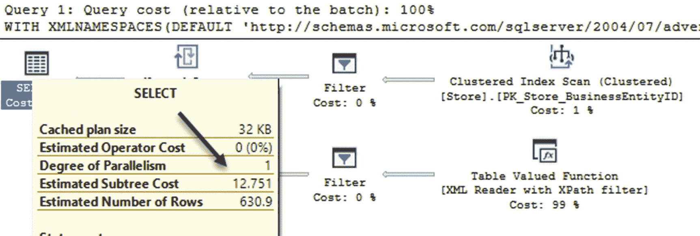

图 4-1

没有 XML 索引时的 XML 查询成本

```sql
WITH XMLNAMESPACES
(DEFAULT 'http://schemas.microsoft.com/sqlserver/2004/07/adventure-works/StoreSurvey')
SELECT BusinessEntityID, Name, Demographics
FROM [Sales].[Store]
WHERE Demographics.exist('/StoreSurvey/AnnualSales[.=1500000]') = 1;
Listing 4-2
在 [Sales].[Store] 上查询 AnnualSales
```

### 注意

本章将使用估计子树成本与逻辑读取的比较来演示 XML 索引的价值。虽然本书中的大多数分析侧重于通过使用索引来减少 I/O，但解析 XML 通常是一个计算成本高昂的操作，这就是为什么我们将重点关注查询成本。你也可以选择查看统计时间来比较 CPU 时间的变化。

这种方法在表中数据量较少时成本高昂但效率尚可。然而，在实际应用中，表可能变得非常大，超过扫描多个 XML 文档的有效点。例如，想象一个销售点系统将收据信息存储在每个销售的 XML 文档中。对于这种数据量，性能将迅速开始受到影响。

#### 主 XML 索引

现在我们知道了在没有任何 XML 索引的情况下示例查询的成本，让我们看看添加主 XML 索引后会发生什么。使用代码清单 4-3 中的 `CREATE INDEX` 代码创建主 XML 索引。有关此语法的更多信息请参见第 1 章。这将在 `Demographic` 列上创建一个主 XML 索引。

```sql
CREATE PRIMARY XML INDEX [PXML_Store_Demographics] ON [Sales].[Store]
([Demographics])
Listing 4-3
在 [Sales].[Store] 上创建主 XML 索引
```

如前所述，当创建主 XML 索引时，所有路径、标签和节点都会被索引。对于这些项目中的每一个，都会在 XML 索引中创建一条记录，其中包含该项目以及有关该项目在 XML 文档中的出现方式和与该项目关联的表中行的信息。理解这一点很重要，因为 XML 索引通常会显著增加基础表的存储占用空间。为了演示这一点，请运行代码清单 4-4 中的代码以查看每个索引的记录数和页数。如图 4-2 中的结果所示，主 XML 索引中的记录数大大超过了表中的记录数，倍数达到 13。

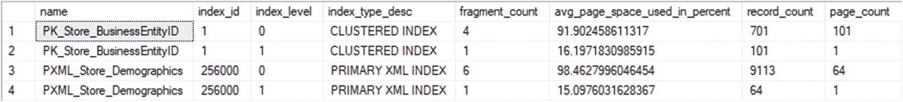

图 4-2

创建主 XML 索引后的物理统计信息

```sql
SELECT [i].[name]
,[i].[index_id]
,[IPS].[index_level]
,[IPS].[index_type_desc]
,[IPS].[fragment_count]
,[IPS].[avg_page_space_used_in_percent]
,[IPS].[record_count]
,[IPS].[page_count]
FROM [sys].dm_db_index_physical_stats, OBJECT_ID(N'Sales.Store'), NULL, NULL, 'DETAILED') AS [IPS]
INNER JOIN [sys].[indexes] AS [i]
ON [i].[object_id] = [IPS].[object_id]
AND [i].[index_id] = [IPS].[index_id]
WHERE [IPS].[index_type_desc] <> 'NONCLUSTERED INDEX'
ORDER BY [i].[index_id]
,[IPS].[index_level];
Listing 4-4
在 [Sales].[Store] 上创建主 XML 索引后的统计信息
```

有了主 XML 索引后，让我们执行来自代码清单 4-2 的代码。检查执行计划，你可以看到执行计划呈现出一个极其不同的模式，如图 4-3 所示。估计子树成本从超过 12 减少到 0.1535；`XML Reader with XPath filter` 被 `主 XML 索引` 上的 `聚簇索引扫描` 取代。在底层，查询仍在扫描表，但它以少得多的工作量完成此操作。对于更大的表，这种索引变化将显著减少查询本身的总持续时间。

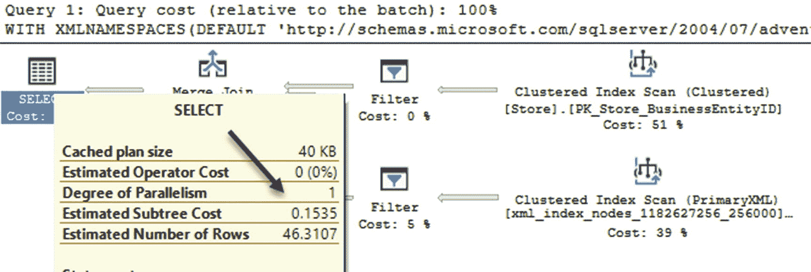

图 4-3

具有主 XML 索引时的 XML 查询成本

你现在可以看到优化器能够做出更均衡的选择。`PointOfSale` 表上的 `聚簇索引扫描` 的估计成本实际上与针对你创建的 XML 索引的 `聚簇索引查找` 一样高。查询引擎中工作位置的这种转变将带来性能的提升。

### 警告

如果你创建然后删除一个主 XML 索引，任何次 XML 索引也将被删除，因为它们依赖于主索引。此操作不会显示警告。


# 辅助 XML 索引

辅助 XML 索引提供了进一步优化 XML 数据查询的能力。构建辅助 XML 索引时，您可以在`PATH`、`VALUE`和`PROPERTY`类型之间进行选择。这些选项决定了主 XML 索引中的哪些元素将被包含在辅助 XML 索引中，从而根据针对 XML 文档经常运行的查询类型来提供性能改进。例如，如果更多的查询正在访问属性元素，那么为辅助 XML 索引选择`PROPERTY`类型将是合适的。

#### 创建辅助 XML 索引

回到我们示例查询（清单 4-2），我们当前使用的函数调用同时涉及路径和值。由于我们首先是搜索路径以检查值，并且没有访问其他路径，因此我们将使用`PATH`创建一个辅助 XML 索引。`CREATE INDEX`语句的语法如清单 4-5 所示。请注意，`CREATE INDEX`语法现在包含一个`USING`语句，该语句引用了主 XML 索引，并带有`FOR PATH`子句。

```sql
CREATE XML INDEX [SXML_Store_Demographics] ON [Sales].[Store] (Demographics)
USING XML INDEX [PXML_Store_Demographics]
FOR PATH;
```

**清单 4-5**  
创建辅助索引

## 执行计划对比

创建辅助 XML 索引后，我们将再次运行清单 4-2 中的示例查询，以查看执行计划如何变化。如图 4-4 所示，执行计划再次得到了显著改善。估计的子树成本从 0.1535 降低到了 0.0888，降幅约一半，并且对主 XML 索引的聚集索引扫描被对辅助 XML 索引的索引查找所取代。现在查询中成本最高的项是对表聚集索引的聚集索引扫描。本质上，通过使用辅助 XML 索引，我们几乎消除了访问 XML 数据所带来的开销。

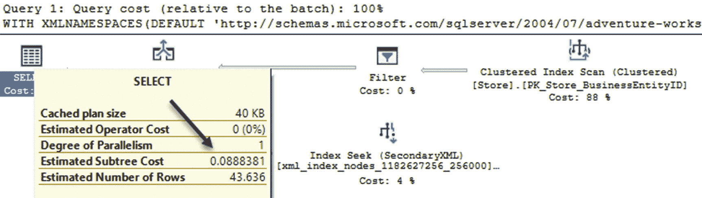

**图 4-4**  
使用辅助 XML 索引的 XML 查询成本

## 索引大小与结构

使用辅助 XML 索引，您会发现它在某些情况下几乎与主 XML 索引一样大。通过运行清单 4-4 中的代码可以证明这一点，如图 4-5 所示，主索引和辅助 XML 索引中的记录数量相同。在这种情况下，这是意料之中的，因为 XML 文档中的所有数据都是 XML 路径上的值。在这种情况下，辅助 XML 索引的优势在于基于这些路径的排序，这使得 XML 索引更具选择性，如前所述。

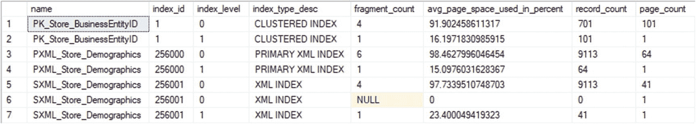

**图 4-5**  
创建辅助 XML 索引后的物理统计信息

## 维护 XML 索引

虽然`sys.dm_db_index_physical_stats`对于查找维护所有索引（包括 XML 索引）所需的信息很有用，但还有一个专门用于 XML 索引的系统视图，名为`sys.xml_indexes`。此系统视图显示已应用于 XML 索引的所有选项。通过了解索引的类型和其他设置，该视图返回的信息对于进一步维护索引非常有用。此视图继承自`sys.indexes`，并返回与`sys.indexes`相同的列和信息。

如图 4-6 所示，还存在以下附加列：

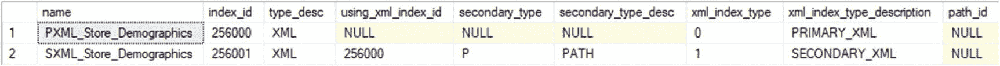

**图 4-6**  
`sys.xml_indexes`查询结果

- `using_xml_index_id`：辅助索引的父索引。如前所述，辅助索引在创建前需要存在一个主索引。此列对于主 XML 索引为`NULL`，并且仅用于辅助索引。
- `secondary_type`：指定辅助索引所基于类型的标志。每个辅助索引都基于特定类型（`V` = `VALUE`, `P` = `PATH`, `R` = `PROPERTY`）。对于主 XML 索引，此列为`NULL`。
- `secondary_type_desc`：辅助索引类型的描述。描述的值映射到`secondary_type`列中描述的值。

## 存储与性能考量

我们需要考虑主索引和辅助 XML 索引的存储影响，因为表中的数据越多，我们对数据执行`INSERT`、`UPDATE`和`DELETE`操作的频率越高，这些索引对这些操作的影响就越大。您需要权衡辅助 XML 索引带来的性能提升与其维护所需的时间，以决定是否创建索引。在构建主索引和辅助 XML 索引时，努力在硬件资源、存储空间、索引实用性、创建的索引数量以及索引实际可能需要的次数之间取得平衡。


## 选择性 XML 索引

选择性 XML 索引在 SQL Server 2012 中引入，旨在解决主/辅助 XML 索引的一个重大问题。XML 文档可能非常庞大。对整个文档应用索引会在创建索引以及长期维护索引时带来显著的性能影响。此外，这些过大的索引也会加剧组织中常见的存储难题。同时，当索引变得过大时，其性能可能不如它较小时那么好。鉴于此，便引入了选择性 XML 索引。

选择性 XML 索引允许您定义想要索引的 XML 文档子集。这使得索引更小、更灵活，并且针对 XML 中的特定路径进行了定向。当索引创建时，文档会被解析，XML 被“分解”。分解后的值随后存储在数据库中的标准关系存储中。除了选择性 XML 索引，您还可以基于定义选择性 XML 索引的路径内的节点添加辅助索引。

选择性 XML 索引相比标准 XML 索引能带来巨大的性能优势。但是，如果您有即席查询，可能会查询 XML 文档中各种不同的元素，那么标准 XML 索引的性能可能会好得多。同样，如果您有大量的节点路径，标准 XML 索引的性能表现也可能更佳。

### 创建选择性 XML 索引

要创建选择性 XML 索引，您必须满足以下条件：

*   表必须具有聚集主键。
*   键大小限制为 128 字节。
*   键列限制为 15 个。

选择性 XML 索引不会用于您 XQuery 语句中的 `query()` 或 `modify()` 方法。它将支持 `exist()`、`value()` 和 `nodes()`。如果您同时使用 `query()` 和 `modify()`，它仅能辅助进行简单的节点查找。

要查看选择性 XML 索引的实际效果，您需要创建一个。清单 4-6 中的脚本在选择性 XML 索引中创建了一个路径。在此例中，由于我们仅访问 XML 文档中的年度销售额，我们将选择性 XML 索引限制在该 XML 路径上。

```sql
CREATE SELECTIVE XML INDEX [SEL_XML_Store_Demographics_AnnualSales]
ON [Sales].[Store] (Demographics)
WITH XMLNAMESPACES
(DEFAULT 'http://schemas.microsoft.com/sqlserver/2004/07/adventure-works/StoreSurvey')
FOR (AnnualSales = '/StoreSurvey/AnnualSales');
```
**清单 4-6** 创建选择性 XML 索引的脚本

创建选择性 XML 索引后，我们将再次回到清单 4-2 中的示例查询，以查看其对执行计划的影响。如图 4-7 所示，估计子树成本与使用辅助 XML 索引时相当，但使用选择性 XML 索引时略高。要理解 SQL Server 为何做出此选择，请运行清单 4-4 中的代码以查看存储占用空间。如图 4-8 所示，选择性 XML 索引明显小于辅助 XML 索引。它没有可能访问 41 个页面和 9,113 条记录，而是限制在跨 5 个页面的 701 条记录，这证明了在选择性 XML 索引上进行聚集索引扫描的额外成本是合理的。

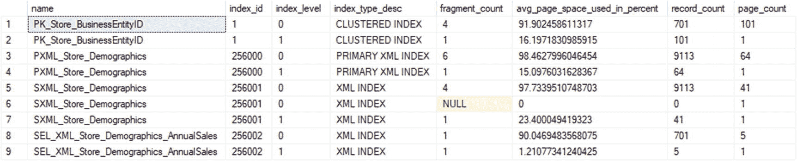
**图 4-8** 创建选择性 XML 索引后的物理统计信息

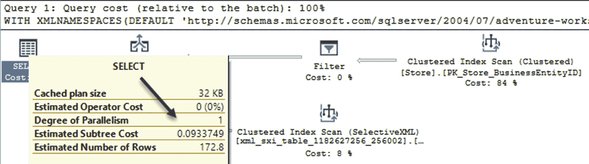
**图 4-9** 使用选择性 XML 索引的 XML 查询成本

虽然这为 XML 索引提供了一个大幅改进的机会，但有一个重要的限制需要考虑。如果您的查询发生变化，导致选择性 XML 索引无法覆盖该查询，那么性能将会下降。虽然这是显而易见的，但我们通常在使用索引时无需考虑这一点，因为传统索引覆盖列中的所有数据。

为了演示此场景，让我们在查询中添加另一个 XML 元素来过滤 `BusinessType`。如清单 4-7 所示，我们将在 `WHERE` 子句中添加 `exist()`，并删除之前创建的主/辅助 XML 索引，以防止它们干扰输出。通常，如果您有选择性 XML 索引，就不会再同时拥有主/辅助 XML 索引。

```sql
DROP INDEX IF EXISTS [SXML_Store_Demographics] ON [Sales].[Store];
DROP INDEX IF EXISTS [PXML_Store_Demographics] ON [Sales].[Store];
WITH XMLNAMESPACES
(DEFAULT 'http://schemas.microsoft.com/sqlserver/2004/07/adventure-works/StoreSurvey')
SELECT BusinessEntityID, Demographics
FROM [Sales].[Store]
WHERE Demographics.exist('/StoreSurvey/AnnualSales[.=1500000]') = 1
AND Demographics.exist('/StoreSurvey/BusinessType[.="OS"]') = 1
```
**清单 4-7** 查询 `[Sales].[Store]` 的 `AnnualSales` 和 `BusinessType`

运行清单 4-7 中的代码后，我们看到查询性能已大幅下降。性能下降的原因是包含了带有 `XPath` 过滤器的 `XML Reader`，这增加了估计子树成本，如图 4-9 所示。这并不像我们第一次迭代该查询时那么糟糕，因为选择性 XML 索引仍在协助减少需要使用函数扫描整个 XML 文档的记录数量。但这确实是一种性能下降，并且对于大表来说，这可能导致严重问题。

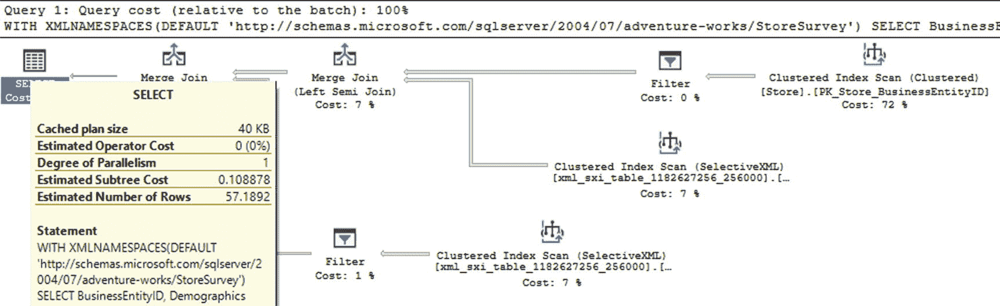
**图 4-9** 使用选择性 XML 索引但未包含 XML 元素的查询成本

### 扩展选择性 XML 索引

幸运的是，选择性 XML 索引提供了灵活性来规避和调整此类问题。具体来说，清单 4-8 中所示的 `FOR` 子句可以扩展以包含多个 XML 节点和路径。在此例中，我们将 `BusinessType` 添加到索引中。正如预期并且如图 4-10 所示，对此索引的更改通过将第二个聚集索引扫描操作添加到选择性 XML 索引，将估计子树成本降至 0.108，从而提高了查询性能。

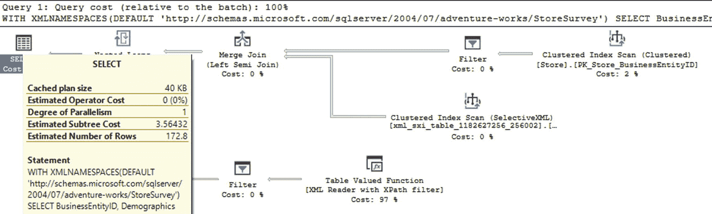
**图 4-10** 在两个元素上使用选择性 XML 索引的查询成本

```sql
DROP INDEX IF EXISTS [SEL_XML_Store_Demographics_AnnualSales] ON [Sales].[Store];
CREATE SELECTIVE XML INDEX [SEL_XML_Store_Demographics_AnnualSalesBusinessType]
ON [Sales].[Store] (Demographics)
WITH XMLNAMESPACES
(DEFAULT 'http://schemas.microsoft.com/sqlserver/2004/07/adventure-works/StoreSurvey')
FOR (AnnualSales = '/StoreSurvey/AnnualSales',
BusinessType = '/StoreSurvey/BusinessType');
```
**清单 4-8** 创建选择性 XML 索引的脚本

正如我们之前所做的，我们将再次通过运行清单 4-4 来检查扩展索引对存储的影响。回顾图 4-11，我们看到即使增加了索引中的元素数量，也并未显著改变索引的存储占用空间。它仍然是跨 6 个（而不是 5 个）页面的 701 条记录。

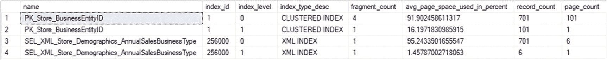
**图 4-11** 在两个元素上创建选择性 XML 索引后的物理统计信息


尽管选择性 XML 索引是 XML 索引中一个更为复杂的方面，但你会发现入门其实并不那么困难。选择性 XML 索引还支持比本章示例更复杂的 XQuery，因此你可以非常精确地指定 XML 文档中哪些部分将被索引。

## 总结

本章介绍了对现在可存储于 SQL Server 中的非结构化和半结构化数据进行搜索和索引的必要性。XML 索引为开发人员和数据库管理员提供了改善 XML 文档搜索性能的选项。这既通过筛选 XML 文档中的数据使查询受益，也通过检索用于显示的数据使查询受益。选择性 XML 索引为你的 XML 索引提供了更精细和详细的方法。只需记住，XML 索引需要相当多的额外磁盘空间，因此你应该相应地规划你的系统。

# 5. 空间索引

接下来我们需要探讨的索引类型是空间索引，它与空间数据类型相关。SQL Server 2008 引入的空间数据类型提升了 SQL Server 的存储能力，允许存储定义形状和位置信息的数据。在这些增强功能出现之前，空间数据通常作为字符串或数值存储，在数据库中没有实际意义，并且需要进行繁琐的转换和计算才能将信息解析为有用的内容。

作为空间数据支持的一部分，SQL Server 引入了`GEOMETRY`和`GEOGRAPHY`数据类型。这些类型分别支持平面数据和大地测量数据。平面数据由二维平面上的线、点和多边形组成，而大地测量数据由相同的元素组成，但在大地测量椭球体上——这是描述地球地图的一个专业术语。简单来说，你可以这样理解这两种数据类型：`GEOMETRY`是所描述形状的平面表示，而`GEOGRAPHY`则包含一个圆形的全球表示。

空间数据索引在创建和解释方式上是独特的。每个索引由一组网格组成。这些网格由一组单元格构成，布局有点像方形的电子表格。网格最大可以是 16 × 16，最小可以是 4 × 4。网格内的单元格包含定义所存储空间数据对象的值。`GEOGRAPHY`和`GEOMETRY`数据类型在这种索引方式中存在明显的区别。`GEOMETRY`数据类型需要一个边界框，这是对索引定义区域大小的限制。`GEOGRAPHY`数据类型没有边界框，因为它基本上是以地球的大小为界的。

本章将探讨空间索引、其行为及其在查询中的使用，以帮助提升你的空间数据的性能。

## 空间数据如何被索引

构成空间索引的网格实际上是相互嵌套的。在顶层，即第 1 层，你可以拥有例如一个 4 × 4 的网格。该第 1 层网格中的每个单元格又包含另一个网格，由为该层定义的单元格数量组成，在本例中是 4 × 4。这第二个网格定义了第 2 层。第 2 层中的每个单元格都有一个定义第 3 层的网格，而那里的单元格包含另一个网格，即第 4 层。图 5-1 展示了`GEOMETRY`索引如何由这四个层级组成。索引随后由这四个网格组成，每个网格都由一系列单元格构成。这种分层和网格层次结构称为`分解`，在索引创建时生成。


图 5-1
GEOMETRY 索引存储和单元格的网格存储表示

如图 5-1 所示，最多可能有 40 亿个单元格。这在创建索引并确定创建时使用的密度非常重要。每一层或级别都可以有指定的密度。有三种密度级别（低=4 × 4，中=8 × 8，高=16 × 16）。如果在创建索引时省略密度，默认为中等。调整密度最常用于优化索引的实际空间。并非所有层都需要高密度。通过不使用超过你需要的密度来节省空间。

所有这些之所以必要，是因为这些网格内信息的实际存储使用的是与存储标准索引相同的 B 树。但存储中的定义，以及显然对这些定义的检索，在空间索引中与标准索引中完全不同。为了将信息放入 B 树，需要在网格之上进行额外的处理。

SQL Server 执行的索引过程的下一步是镶嵌。`镶嵌`是将对象放置或适配到从第 1 层开始的网格层次结构中的过程。根据涉及的对象，此过程可能只需要网格的第一层，但也可能需要所有四层。镶嵌本质上是获取空间列中的所有数据，并将其放置到网格的单元格中，同时保留所接触的每个单元格。然后，当评估请求时，索引确切地知道如何返回查找每个网格中的单元格，使用 B 树。

到目前为止，我已经介绍了网格中的单元格如何填充以及整个镶嵌过程是如何实现的。然而，仅拥有网格存储中的单元格和镶嵌过程在理论上并不理想，因为基于需要保留的极端数量的接触单元格，存在单元格被误用或未被高效使用的可能。对于`GEOMETRY`数据类型及其上创建的索引，需要边界框，因为 SQL Server 需要一个有限的空间。创建这样的框是通过使用坐标`xmin`、`xmax`和`ymin`、`ymax`来完成的。结果可以可视化为一个正方形，其左下角的 x 坐标和 y 坐标以及右上角的 x 坐标和 y 坐标确定。在确定`GEOMETRY`数据类型索引的边界框时，最关键的是确保所有对象都在边界框内，同时不要使边界框过大，导致大量空单元格，这是一个需要平衡的操作。索引仅对边界框内的对象或形状有效。如果边界框内不包含对象，可能会严重影响性能并导致空间查询性能不佳。

此外，为了在镶嵌过程中保持高效使用索引的能力，应用了一些规则。这些规则如下：


# 创建空间索引

### 覆盖规则
覆盖规则是细分（tessellation）过程中应用的最基本的规则。不要与常用术语 `covering index`（覆盖索引）混淆，该规则指出，任何被完全覆盖的单元格不会为该对象单独记录。被覆盖的单元格会为对象进行计数。不存储已覆盖的单元格可节省处理时间和数据存储空间与时间。

### 每对象单元格规则
每对象单元格规则是一个更深入的规则，它对可为特定对象计数的单元格数量施加了限制。在图 5-2 中，显示的圆形在级别 1 覆盖了 2 个单元格，在级别 2 覆盖了 14 个单元格。由于每对象单元格的默认值是 16，因此该圆形被细分到了第二层。如果该圆形在级别 2 确实覆盖了超过 16 个单元格，则细分不会继续到级别 2。由于该对象在级别 3 会覆盖远超过 16 个单元格，细分在此处停止。调整每对象单元格数可以增强索引的准确性。根据存储的数据调整此值可能非常有效。鉴于每对象单元格规则的重要性，该设置可通过动态管理视图 `sys.spatial_index_tessellations` 公开访问。你将在本章后面回顾此设置。


图 5-2：一个对象及其在网格层内覆盖多少个单元格的视觉表示

### 最深单元格规则
细分过程的最后一个规则是最深单元格规则。如前所述，每一层网格及其内部的单元格都在每个更深层中被引用。因此，在图 5-2 中，级别 2 中定义的单元格是有效完全引用任何其他级别（在本例中为级别 1）所需的唯一单元格。此规则不可打破，并且已内置于优化器从索引检索数据的处理过程中。

对于 `GEOGRAPHY` 类型，还有一个额外的挑战，即通过细分过程将形式投影到扁平化的表示中。此过程首先将 `GEOGRAPHY` 网格划分为两个半球。每个半球被投影到一个四棱锥的各个面上并被扁平化，然后两者被连接到一个非欧几里得平面上。此过程完成后，该平面被分解为前述的网格层次结构。

`Create Spatial Index`（创建空间索引）语句具有与普通聚集或非聚集索引相同的大部分选项。但是，此索引类型还需要一些特定选项，如表 5-1 所列。

表 5-1：空间索引选项

| 选项名称 | 描述 |
| --- | --- |
| `USING` | `USING` 子句指定空间数据类型。这将是 `GEOMETRY_GRID` 或 `GEOGRAPHY_GRID`，且不能为 `NULL`。 |
| `WITH GEOMETRY_GRID,` `GEOGRAPHY_GRID` | `WITH` 选项包括根据列数据类型为 `GEOMETRY_GRID` 或 `GEOGRAPHY_GRID` 设置细分架构。 |
| `BOUNDING_BOX` | `BOUNDING_BOX` 用于 `GEOMETRY` 数据类型中，以定义单元格的边界框。此选项没有默认值，在 `GEOMETRY` 数据类型上创建索引时必须指定。清单 5-1 中的 `CREATE SPATIAL INDEX IDX_CITY_GEOM` 展示了此选项的语法。设置 `BOUNDING_BOX` 是通过设置 `xmin`、`ymin`、`xmax` 和 `ymax` 坐标来完成的，如下所示：`BOUNDING_BOX = (XMIN = xmin, YMIN = ymin, XMAX = xmax, YMAX = ymax)`。 |
| `GRIDS` | `GRIDS` 选项用于更改每个网格层的密度。所有层的默认密度为中等，但可以更改为低或高，以进一步调整空间索引和密度设置。 |

以清单 5-1 中的 `CREATE TABLE` 语句为例。

```
USE AdventureWorks2017
GO
CREATE TABLE CITY_MAPS (
ID BIGINT PRIMARY KEY
IDENTITY(1, 1),
CITYNAME NVARCHAR(150),
CITY_GEOM GEOMETRY
);
GO
```

清单 5-1：包含 `GEOMETRY` 数据类型的 `CREATE TABLE`

此表将包含主键、城市名称，然后是一个 `GEOMETRY` 列，用于保存城市本身的地图数据。城市的密度可能会影响细分过程中每对象单元格规则的调整，以及网格层次结构中各层的密度。

要为 `CITY_GEOM` 列创建索引，将使用清单 5-2 中的 `CREATE` 语句，其前两层网格层密度为 `LOW`，第三和第四层为 `MEDIUM` 和 `HIGH`。这种密度变化允许随着网格层级的深入，调整索引中的对象和覆盖单元格。每对象单元格设置表示一个对象最多可覆盖 24 个单元格。边界框坐标也已设置。

```
USE AdventureWorks2017
GO
CREATE SPATIAL INDEX IDX_CITY_GEOM
ON CITY_MAPS (CITY_GEOM)
USING GEOMETRY_GRID
WITH (
BOUNDING_BOX = ( xmin=-50, ymin=-50, xmax=500, ymax=500 ),
GRIDS = (LOW, LOW, MEDIUM, HIGH),
CELLS_PER_OBJECT = 24,
PAD_INDEX  = ON );
```

清单 5-2：在 `GEOMETRY` 列上定义空间索引

要利用和测试创建的索引，你需要查看估计的和实际的执行计划，以确定索引是否已被使用。对于空间数据，查看查询将产生的实际结果也是有益的。SQL Server Management Studio 有一个内置的空间数据查看器，可用于查看空间数据。

清单 5-3 创建了一个可从空间索引中受益的表。该表旨在存储来自美国人口普查局的邮政编码和其他数据。此表将在 `AdventureWorks2014` 数据库中创建。

```
USE AdventureWorks2017
GO
CREATE TABLE dbo.tl_2017_us_county (
STATEFP CHAR(2) NULL,
COUNTYFP CHAR(3) NULL,
COUNTYNS CHAR(8) NULL,
GEOID CHAR(5) NULL,
NAME CHAR(100) NULL,
NAMELSAD CHAR(100) NULL,
LSAD CHAR(2) NULL,
CLASSFP CHAR(2) NULL,
MTFCC CHAR(5) NULL,
CSAFP CHAR(3) NULL,
CBSAFP CHAR(5) NULL,
METDIVFP CHAR(5) NULL,
FUNCSTAT CHAR(1) NULL,
ALAND FLOAT NULL,
AWATER FLOAT NULL,
INTPTLAT CHAR(11) NULL,
INTPTLON CHAR(12) NULL,
GEOM GEOMETRY NULL
);
```

清单 5-3：创建一个用于保存 `GEOMETRY` 相关数据的表

`GEOM` 列将存储 `GEOMETRY` 数据。此列将用于从 SQL Server Management Studio 查询数据，以显示可以从其他应用程序完成的成像。

#### 注意事项

本章的示例需要一个 shape 文件和 `OGR2OGR` 工具。该 shape 文件来自 TIGER/Line Shapefile，2017 年，全国，美国，当前县及同等全国 Shapefile，可从 [`www2.census.gov/geo/tiger/TIGER2017/COUNTY/tl_2017_us_county.zip`](https://www2.census.gov/geo/tiger/TIGER2017/COUNTY/tl_2017_us_county.zip) 获取。而 `OGR2OGR` 可在 `OSGeo4W` 中从 [`http://download.osgeo.org/osgeo4w/osgeo4w-setup-x86_64.exe`](http://download.osgeo.org/osgeo4w/osgeo4w-setup-x86_64.exe) 获取。安装应用程序时，仅需安装 `GDAL` 包。安装完成后，运行 PowerShell 命令 `[Environment]::SetEnvironmentVariable(“GDAL_DATA”, “C:\OSGeo4W64\share\gdal”, “Machine”)` 以设置一个环境变量。最后，从解压地理文件的目录，运行命令 `C:\OSGeo4W64\bin\ogr2ogr -f “MSSQLSpatial” MSSQL:“server=localhost;database=AdventureWorks2017;trusted_connection=yes;” -nln “tl_2017_us_county” -a_srs “ESPG:4269” -lco “GEOM_TYPE=geography” -lco “GEOM_NAME=geog4269” “tl_2017_us_county.shp” -s_srs EPSG:4269 -t_srs EPSG:26713`。

在 `SSMS` 的常规网格和表格结果集中查看查询 `GEOMETRY` 数据类型列的实际数据用处不大。要利用空间数据特性，使用 `SSMS` 中的“空间结果”选项卡则有效得多。给定清单 5-3 中的表，可以对 `GEOM` 列执行一个简单的 `SELECT` 语句，该语句的结果将自动生成“空间结果”选项卡。例如，清单 5-4 中的查询将生成华盛顿州的图像，并为每个县区域使用不同的颜色编码。

```
USE AdventureWorks2017
GO
SELECT  *
FROM    dbo.tl_2017_us_county AS tuc
WHERE   tuc.STATEFP = '41';
清单 5-4
用于检索空间数据的初始查询
```

点击 `SSMS` 结果窗口中的“空间结果”选项卡，以显示查询生成的图像。你应该能看到类似图 5-3 中的内容。

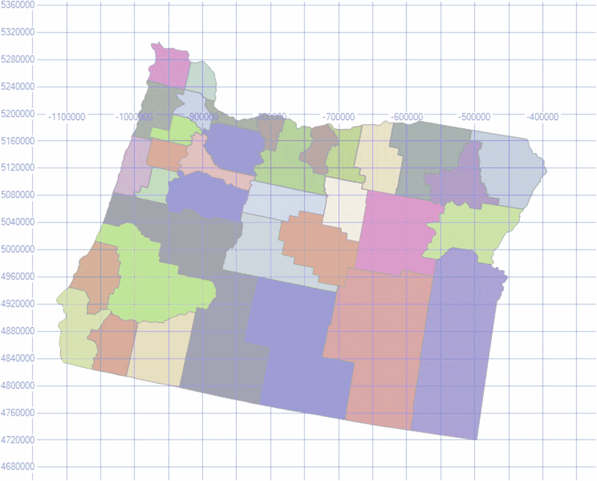
**图 5-3**
针对县数据进行空间查询的输出

清单 5-4 中的查询使用了一个标准列 `STATEFP` 来过滤信息，以便只查看特定州内的县。不过，在使用这些数据之前，最好确保你处理的 `GEOM` 列中的形状都是有效的。数据存储不当的情况是可能存在的，因此可能需要清理你的数据。为此，你可以使用 `MakeValid()` 方法来修改任何 `GEOMETRY` 实例，使其变得有效。根据微软的文档，使用此函数可能导致形状“略微偏移”，但它对形状可能产生的影响程度尚不明确。执行清单 5-5 将更新 `GEOM` 列中任何无效的 `GEOMETRY` 实例。

```
USE AdventureWorks2017
GO
UPDATE  dbo.tl_2017_us_county
SET     GEOM = GEOM.MakeValid();
清单 5-5
使用 MakeValid() 纠正任何无效的 GEOMETRY 实例
```

`MakeValid()` 方法应谨慎使用，并且在生产环境中应审查所有发现的无效 `GEOMETRY` 实例。在使用 `MakeValid()` 函数后，你应该计划审查你的形状，因为它可能会修改这些形状。

你还可以使用空间列，根据位置和距离的行为来过滤返回的数据。清单 5-6 展示了一个调用为处理空间信息而定义的特殊方法之一的示例。该查询返回距离俄克拉荷马州塔尔萨县最近的十个县（参见图 5-4）。

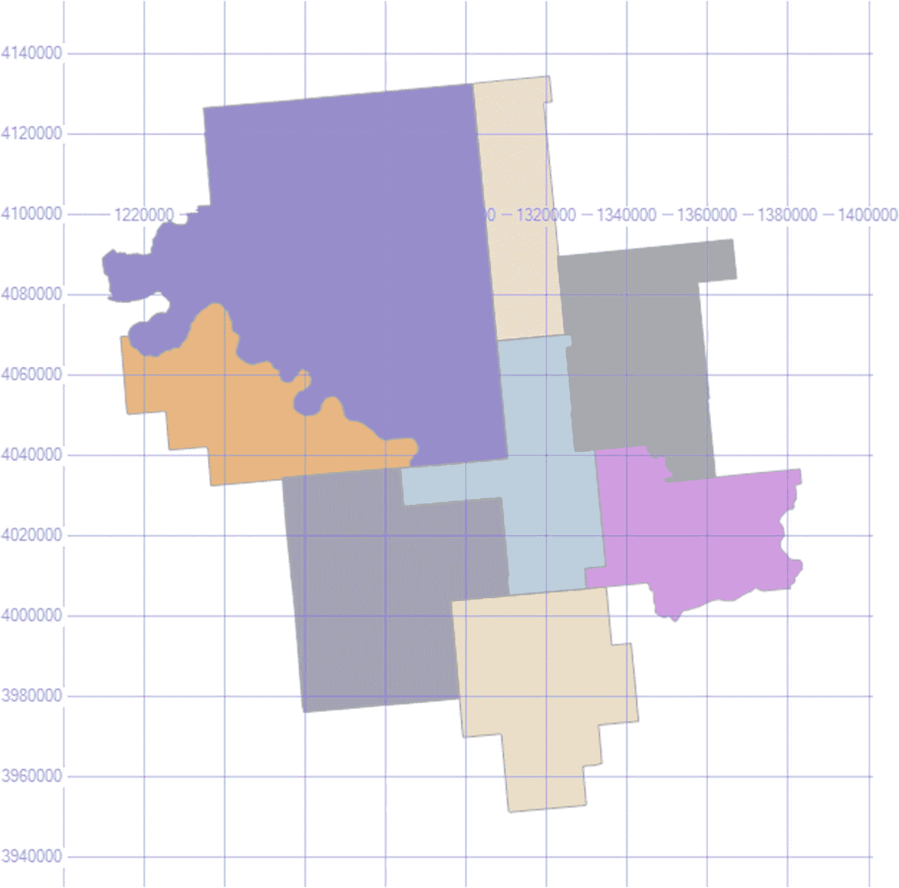
**图 5-4**
使用 `STDistance()` 缩小邮政编码数据的结果

```
USE AdventureWorks2017
GO
DECLARE @polygon GEOMETRY;
SELECT  @polygon = tuc.GEOM
FROM    dbo.tl_2017_us_county AS tuc
WHERE   tuc.NAME = 'Tulsa';
SELECT TOP 10
        tuc.GEOM,
        tuc.GEOM.STDistance(@polygon),
        tuc.NAME
FROM    dbo.tl_2017_us_county AS tuc
WHERE   tuc.GEOM.STDistance(@polygon) IS NOT NULL
        AND tuc.GEOM.STDistance(@polygon) < 1
ORDER BY tuc.GEOM.STDistance(@polygon);
清单 5-6
查询距离给定点最近的前十名邮政编码
```

清单 5-6 中的查询创建了图 5-5 所示的执行计划。

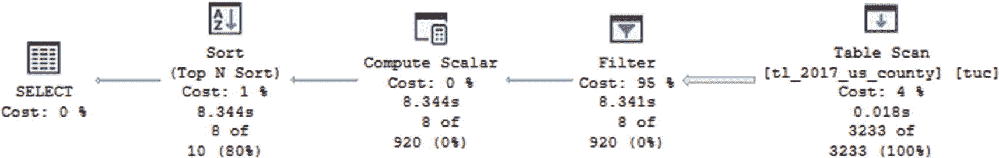
**图 5-5**
使用 `STDistance()` 但未建立索引生成的执行计划

如果你查看“空间结果”选项卡，俄克拉荷马州东北角包含这十个县的区域看起来会像图 5-4。然而，图 5-5 中显示的查询执行计划并不理想，它包含了在主键上创建的聚集索引的索引扫描，以及一个高成本的 `filter` 操作。由于使用了 `STDistance` 谓词，该查询适合在 `GEOMETRY` 列上使用索引，因此应该添加一个索引。

## 使用索引支持的方法

对于 `GEOMETRY` 和 `GEOGRAPHY` 数据类型，只有某些方法在利用索引时得到支持。`STDistance()` 方法将支持索引，这将对清单 `5-6` 所示的查询有益。在深入探讨索引查询之前，应首先指出那些确实支持索引的方法。这些方法在编写各自的谓词时有特定规则。以下是 `GEOMETRY` 类型的支持方法列表：

*   `GEOMETRY.STContains() = 1`
*   `GEOMETRY.STDistance() < number`
*   `GEOMETRY.STDistance() <= number`
*   `GEOMETRY.STEquals() = 1`
*   `GEOMETRY.STIntersects() = 1`
*   `GEOMETRY.STOverlaps() = 1`
*   `GEOMETRY.STTouches() = 1`
*   `GEOMETRY.STWithin() = 1`

以下是 `GEOGRAPHY` 类型的支持方法：

*   `GEOGRAPHY.STIntersects() = 1`
*   `GEOGRAPHY.STEquals() = 1`
*   `GEOGRAPHY.STDistance() < number`
*   `GEOGRAPHY.STDistance() <= number`

对于 `GEOMETRY` 和 `GEOGRAPHY`，要返回任何非空结果，第一个参数和第二个参数必须具有相同的空间参考标识符（SRID），这是一个基于特定椭球体（用于将地球扁平化或圆化）的空间参考系统。

回想一下，图 `5-6` 中用于返回塔尔萨周边县的查询，在表达式 `STDistance(@polygon) < 1` 中使用了 `STDistance()` 方法。基于支持的方法并分析空间索引的选项和 `CREATE` 语法，你可以使用清单 `5-7` 中所示的 `INDEX CREATE` 语句来尝试优化查询。

```sql
USE AdventureWorks2017
GO
CREATE SPATIAL INDEX IDX_COUNTY_GEOM ON dbo.tl_2017_us_county
(
GEOM
) USING  GEOMETRY_GRID
WITH (
BOUNDING_BOX =(-91.513079, -87.496494, 36.970298, 36.970298),
GRIDS =(LEVEL_1 = LOW,LEVEL_2 = MEDIUM,LEVEL_3 = MEDIUM,LEVEL_4 = HIGH),
CELLS_PER_OBJECT = 16,
PAD_INDEX  = OFF, SORT_IN_TEMPDB = OFF, DROP_EXISTING = OFF,
ALLOW_ROW_LOCKS  = ON, ALLOW_PAGE_LOCKS  = ON) ON [PRIMARY];
GO
```
清单 `5-7`
空间索引的 `CREATE` 语句

执行清单 `5-6` 中的查询会产生一个非常不同的执行计划，如图 `5-6` 所示。它导致执行和返回结果的持续时间更短，并且还包含空间结果。执行计划中最大的区别是使用了索引 `IDX_COUNTY_GEOM`。

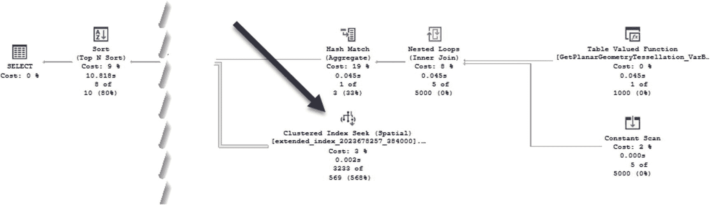
图 5-6
使用空间数据调整后的执行计划的优化细节

你可以看到从空间索引的创建中获得的整体改进和更优的执行计划。索引和最优执行计划固然很好，但不应跳过通过检查整体执行时间持续时间来验证实际改进这一步。使用扩展事件捕获执行时间，可以检索语句执行的整体审查情况。对于搜索塔尔萨附近县的查询案例，有索引时结果返回时间为 500 毫秒。删除索引并执行相同查询，总执行时间为 1500 毫秒。此测试极其基础，但它是一个坚实的基础，你可以在此基础上开始制定为现有空间数据建立索引以提高整体性能的策略。

## 理解统计信息、属性与信息

索引通常有许多数据管理视图和函数，使索引的管理比手动收集统计信息更容易、更高效。对于空间索引，还添加了额外的目录视图来协助其独特的设置和管理。除了视图之外，还有一些可以调用的内置过程来获取有关空间索引的信息。

### 视图

有两个目录视图：`sys.spatial_index` 和 `sys.spatial_index_tessellation`。`sys.spatial_index` 视图提供了类型和细分方案以及每个空间索引的基本信息。`sys.spatial_index` 返回的 `spatial_index_type` 列对于 `GEOMETRY` 索引返回 1，对于 `GEOGRAPHY` 索引返回 2。清单 `5-8` 是一个针对该视图的查询示例，图 `5-7` 显示了结果。


图 5-7
查询 sys.spatial_indexes 并显示 IDX_WIZIP_GEOM 索引的结果

```sql
USE AdventureWorks2017
GO
SELECT  name,
        type_desc,
        spatial_index_type,
        spatial_index_type_desc,
        tessellation_scheme
FROM    sys.spatial_indexes;
```
清单 `5-8`
用于检索空间索引元数据的查询

现在查询 `sys.spatial_index_tessellation` 视图以查看索引的参数和细分方案。清单 `5-9` 是查询，图 `5-8` 显示了结果。


图 5-8
查询 sys.spatial_index_tessellations 及部分结果

```sql
USE AdventureWorks2017
GO
SELECT  tessellation_scheme,
        bounding_box_xmax,
        bounding_box_xmin,
        bounding_box_ymax,
        bounding_box_ymin,
        level_1_grid_desc,
        level_2_grid_desc,
        level_3_grid_desc,
        level_4_grid_desc,
        cells_per_object
FROM    sys.spatial_index_tessellations;
```
清单 `5-9`
用于检索细分信息的查询

这两个目录视图都可以通过 `object_id` 进行联接，对于调整和维护任务非常有用。有时，当空间数据要求时，按需操作和重新创建索引可能被证明是有效的。


## 操作流程

除了目录视图外，还提供了四个内部存储过程，用于进一步分析空间索引。这些过程会返回索引上设置的所有属性的完整列表。这四个存储过程及其参数如下：

```
sp_help_spatial_GEOMETRY_index [ @tabname =] 'tabname'
[ , [ @indexname = ] 'indexname' ]
[ , [ @verboseoutput = ] 'verboseoutput'
[ , [ @query_sample = ] 'query_sample']
sp_help_spatial_GEOMETRY_index_xml [ @tabname =] 'tabname'
[ , [ @indexname = ] 'indexname' ]
[ , [ @verboseoutput = ]'{ 0 | 1 }]
[ , [ @query_sample = ] 'query_sample' ]
[ ,.[ @xml_output = ] 'xml_output' ]
sp_help_spatial_GEOGRAPHY_index [ @tabname =] 'tabname'
[ , [ @indexname = ] 'indexname' ]
[ , [ @verboseoutput = ] 'verboseoutput' ]
[ , [ @query_sample = ] 'query_sample' ]
sp_help_spatial_GEOGRAPHY_index_xml [@tabname = 'tabname'
[ , [ @indexname = ] 'indexname' ]
[ , [ @verboseoutput = ] 'verboseoutput' ]
[ , [ @query_sample = ] 'query_sample' ]
[ ,.[ @xml_output = ] 'xml_output' ]
```

清单 5-10 展示了如何执行这些存储过程的示例。该示例返回了关于清单 5-7 中创建的 `GEOMETRY` 索引 `IDX_COUNTY_GEOM` 的信息。图 5-9 展示了结果。

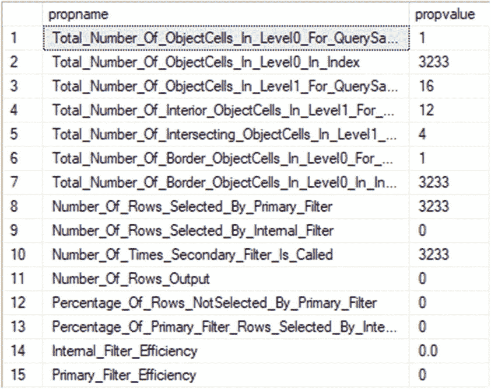

**图 5-9** `sp_help_spatial_GEOMETRY_index` 示例及结果（结果可能有所不同）

```
USE AdventureWorks2017
GO
DECLARE @Sample GEOMETRY
= 'POLYGON((-90.0 -180.0, -90.0 180.0, 90.0 180.0, 90.0 -180.0, -90.0 -180.0))';
EXEC sp_help_spatial_GEOMETRY_index 'dbo.tl_2017_us_county', 'IDX_COUNTY_GEOM', 0, @Sample;
清单 5-10
调查几何索引
```

这些信息对于调整索引以使其运行得更好非常有用。返回的信息其功能类似于索引的统计信息。你可以看到索引的各个层级中有多少对象可用。你还可以看到它如何返回与提供的查询样本匹配的数据。看到特定数量的相交对象与查询样本匹配，可以告诉你索引是否会返回给定对象。通过将索引中的对象与匹配的对象进行比较，你还可以看到索引中有多少百分比的对象未被查询样本返回。所有这些都有助于你了解索引满足查询需求的程度。

## 调整空间索引

正如你在清单 5-7 中看到的，创建空间索引时，你有一些选项。操作这些选项可以让你调整空间索引的行为。需要进行一些实验才能找到一组正确的选项，以使索引达到最佳性能。结合使用执行计划和查询性能指标，就像本章前面所做的那样。

对于 `GEOMETRY` 列，你可以向索引添加一个边界框。这限制了索引覆盖的区域，可以让你创建一个比通用索引更能帮助满足特定查询条件的索引。例如，如果我像清单 5-11 所示更改边界框并重建索引，我看到执行时间减少了大约 10%。

```
USE AdventureWorks2017
GO
CREATE SPATIAL INDEX IDX_COUNTY_GEOM ON dbo.tl_2017_us_county
(
GEOM
)USING  GEOMETRY_GRID
WITH (
BOUNDING_BOX =(-96.9, -95.3, 36.4, 36.6),
GRIDS =(LEVEL_1 = LOW,LEVEL_2 = MEDIUM,LEVEL_3 = MEDIUM,LEVEL_4 = HIGH),
CELLS_PER_OBJECT = 16,
PAD_INDEX  = OFF, SORT_IN_TEMPDB = OFF, DROP_EXISTING = ON,
ALLOW_ROW_LOCKS  = ON, ALLOW_PAGE_LOCKS  = ON) ON [PRIMARY];
GO
清单 5-11
调整空间索引的边界框
```

通过更改边界框，一些对象被排除在索引之外。根据你的数据和索引中使用的参数，过滤掉更多项目可能不会提高性能。由于空间索引的这种复杂性，测试和验证你是否达到了预期的性能改进至关重要。当然，为某些县改进查询的修改可能会导致美国其他县的查询性能下降。可以看出，这里没有简单的答案。

另一个可以进行的调整是更改索引的网格。如果不确定数据分布情况，也不确定任何一次查询可能获得多少匹配项，那么到目前为止示例中的选择是一个相当标准的选择。如果你的查询包含结果的比例较高，不同的网格分布可能会带来更高的速度。这在很大程度上是一个实验的问题。但是，就像边界框一样，为一个数据集更改网格分布可能会损害另一个数据集。你必须进行严格的测试才能正确设置。

使用相同的例子，如果我将第 1 级网格改为 `HIGH` 详细网格，我将损失 10%的性能，使查询运行变慢。将其改为 `MEDIUM` 对执行时间既无益也无害。在这种情况下，以任何组合调整网格级别都没有带来速度的显著提升，但在网格的第 1 级或第 2 级使用 `HIGH` 级别的详细程度会对性能产生负面影响。实验完成后，在此情况下我将选择保持默认网格不变。

## 空间索引的限制

空间索引提供了一些独特的特性和限制。以下是空间索引限制的完整列表：

- 空间索引要求存在聚集索引。
- 空间索引只能创建在类型为 `GEOMETRY` 或 `GEOGRAPHY` 的列上。
- 空间索引只能定义在具有主键的表上。表上主键列的最大数量为 15。
- 索引键记录的最大大小为 895 字节。超过此大小会引发错误。
- 不支持使用数据库引擎优化顾问。
- 无法对空间索引执行联机重建。
- 无法在索引视图上指定空间索引。
- 在支持的表中，每个空间列上最多只能创建 249 个空间索引。在同一空间列上创建多个空间索引可能有用，例如，用于在单个列中索引不同的细分参数。
- 一次只能创建一个空间索引。
- 空间数据的索引构建不能使用可用的进程并行度。

## 总结

为空间数据建立索引是一种复杂的数据存储和操作形式。本章主要介绍了空间数据如何被处理和存储，以帮助管理和审查数据库中空间数据类型的实现。

有了空间索引，你现在能够快速确定点是否位于区域内，或者区域是否与其他区域重叠。空间索引允许查询快速计算空间函数的结果，而无需完全渲染每个空间要素。请记住，务必检查执行计划以确保空间索引确实在使用中。


# 6. 索引内存优化表

过去的几章重点介绍了 SQL Server 中专门用于索引的相关数据类型。SQL Server 还提供了一种驻留在内存中的特殊表，称为内存优化表或内存中表。这些表于 SQL Server 2014 中引入，在 SQL Server 运行时完全驻留在内存中，仅依赖基于磁盘的结构来确保能够从服务重启中恢复。

由于内存优化表主要基于内存，这对表及其索引的传统结构产生了重大影响。在本章中，你将了解内存优化表的变更如何影响你对这些表进行索引的能力，以及如何创建理想的索引。

### 注意
根据来源和对话场景的不同，内存优化表也被称为内存中 OLTP 和 Hekaton。本书将使用术语 `内存优化表`，因为它与 Microsoft 在线手册中使用的术语一致。

## 内存优化表概述
在深入研究内存优化表的索引选项之前，让我们先从内存优化表的基础知识开始。内存优化表是 SQL Server 2014 引入的一种新表类型。与传统表（及其索引）不同，内存优化表完全驻留在内存中。内存优化表通过磁盘结构得到支持，但不依赖这些结构进行事务处理。这与传统表不同，传统表基于磁盘存储，并且通常只有一部分表及其索引位于内存中。

内存优化表提供的价值在于，以这种方式创建表能为数据库带来的性能提升。通过在内存中托管和管理整个表，事务无需等待磁盘将数据加载到内存中即可进行事务处理。

内存优化表的实现导致 SQL Server 中表的架构方式发生了一些变化。首先，由于表现在常驻内存，让它们采用最适合访问内存中数据的结构，而不是从磁盘检索部分数据，这样更有意义。因此，内存优化表使用哈希索引和范围索引，而不是 B 树来存储数据。此外，这些表不像传统表那样同步到磁盘或在内存中移动，从而消除了磁盘和内存结构之间的锁存需求。

要在数据库中创建内存优化表，需要在数据库内准备几项内容。首先，需要向数据库添加一个专用于内存优化数据的文件组，并附带一个文件以支持内存优化表。此外，在大多数场景下，数据库应启用 `MEMORY_OPTIMIZED_ELEVATE_TO_SNAPSHOT` 属性。此属性提示针对内存优化表的所有事务都将隔离级别设置为 `SNAPSHOT`。在代码清单 6-1 中，使用这些设置准备了数据库 `MemOptIndexing`。

```
USE master
GO
IF EXISTS(SELECT * FROM sys.databases WHERE name = 'MemOptIndexing')
DROP DATABASE MemOptIndexing
GO
CREATE DATABASE MemOptIndexing
GO
ALTER DATABASE MemOptIndexing
ADD FILEGROUP memoryOptimizedFG CONTAINS MEMORY_OPTIMIZED_DATA
--此文件位置在您的环境中可能有所不同
ALTER DATABASE MemOptIndexing
ADD FILE (name='memoryOptimizedData',
filename= 'C:\Program Files\Microsoft SQL Server\MSSQL15.MSSQLSERVER\MSSQL\DATA\memoryOptimizedData')
TO FILEGROUP memoryOptimizedFG
ALTER DATABASE MemOptIndexing SET MEMORY_OPTIMIZED_ELEVATE_TO_SNAPSHOT=ON
GO
```

代码清单 6-1 为内存优化表准备数据库


### 注意

清单 6-1 中指示的文件流文件位置可能需要根据您的环境进行更改。

要查看如何创建内存优化表，请查看清单 6-2 中的代码。在此代码示例中，您创建了表 `dbo.SalesOrderHeader`。在表架构中有两点需要注意。首先，将表创建为内存优化表的选项是 `MEMORY_OPTIMIZED=ON` 选项。其次，是在表上包含一个 `NONCLUSTERED HASH` 索引，用于索引内存中的数据。除了这些项，该表与在 SQL Server 中创建的任何其他表基本相同。

```
USE MemOptIndexing
GO
IF OBJECT_ID('dbo.SalesOrderHeader') IS NOT NULL
DROP TABLE dbo.SalesOrderHeader
CREATE TABLE dbo.SalesOrderHeader(
SalesOrderID int NOT NULL,
OrderDate datetime,
DueDate datetime,
ShipDate datetime,
[Status] tinyint,
CONSTRAINT IX_SalesOrderHeader_Hash PRIMARY KEY
NONCLUSTERED HASH (SalesOrderID)
WITH (BUCKET_COUNT = 35000))
WITH (MEMORY_OPTIMIZED = ON)
IF  OBJECT_ID('tempdb..#tempHeader') IS NOT NULL
DROP TABLE #tempHeader
SELECT SalesOrderID
,OrderDate
,DueDate
,ShipDate
,[Status]
INTO #tempHeader
FROM AdventureWorks2017.sales.SalesOrderHeader
INSERT INTO dbo.SalesOrderHeader
SELECT SalesOrderID
,OrderDate
,DueDate
,ShipDate
,[Status]
FROM #tempHeader
SET STATISTICS IO ON
SET STATISTICS TIME ON
PRINT 'Memory Optimized Table'
SELECT *
FROM dbo.SalesOrderHeader
ORDER BY SalesOrderID
PRINT 'Traditional Table'
SELECT *
FROM AdventureWorks2017.sales.SalesOrderHeader
ORDER BY SalesOrderID
SET STATISTICS IO OFF
SET STATISTICS TIME OFF
Listing 6-2
Create Memory-Optimized Table
```

清单 6-2 中的附加代码将数据插入 `MemOptIndexing.dbo.SalesOrderHeader` 并查询相同的数据。为了演示查询内存优化表中数据的影响，还包含了一个针对 `AdventureWorks2017.sales.SalesOrderHeader` 的类似查询。检查清单 6-3 中显示的结果，可以得出一些关于内存优化表的见解。首先，内存优化表没有 I/O 影响。虽然 `AdventureWorks2017.sales.SalesOrderHeader` 查询需要 689 次读取，但 `MemOptIndexing.dbo.SalesOrderHeader` 没有读取。其次，`MemOptIndexing.dbo.SalesOrderHeader` 的 CPU 时间要低得多，为 16 毫秒，而针对 `AdventureWorks2017.sales.SalesOrderHeader` 的查询的 CPU 时间为 78 毫秒。

```
(31465 row(s) affected)
(31465 row(s) affected)
Memory Optimized Table
SQL Server Execution Times:
CPU time = 0 ms,  elapsed time = 0 ms.
SQL Server parse and compile time:
CPU time = 0 ms, elapsed time = 0 ms.
(31465 row(s) affected)
SQL Server Execution Times:
CPU time = 16 ms,  elapsed time = 310 ms.
Traditional Table
SQL Server Execution Times:
CPU time = 0 ms,  elapsed time = 0 ms.
(31465 row(s) affected)
Table 'SalesOrderHeader'. Scan count 1, logical reads 689, physical reads 0, read-ahead reads 0, lob logical reads 0, lob physical reads 0, lob read-ahead reads 0.
SQL Server Execution Times:
CPU time = 78 ms,  elapsed time = 785 ms.
SQL Server Execution Times:
CPU time = 0 ms,  elapsed time = 0 ms.
Listing 6-3
Output from Creating and Querying Memory-Optimized Table
```

虽然可以讨论内存优化表的更多方面，但此概述旨在提供一些最基本的方面。本章的其余部分将研究内存优化表的索引。虽然内存优化表完全在内存中，但仍然需要索引。在内存中并不妨碍查找特定数据或筛选结果集的需要。并且如第 1 章所述，索引提供了访问数据路径的机制。

为了支持内存优化表的索引，SQL Server 支持两种索引选项。即哈希索引和范围索引。每个内存优化表最多可以支持八个索引。如果定义了主键，则将由两种索引类型之一支持，并且是允许的索引之一。如果未定义主键，则表创建时必须至少包含一个索引。此外，内存优化表不允许在创建后更改索引，因此您需要在创建内存优化表时定义所有索引。

本章的其余部分将重点介绍哈希和范围类型的索引，以及在内存优化表上构建每种索引的注意事项。

### 注意

内存优化表的索引操作是非记录的活动，因为它们仅发生在内存中，并且对表中存储的数据状态没有影响。

## 哈希索引

内存优化表的第一种索引类型是哈希索引。哈希索引将表中的数据分离到固定数量的存储桶中。然后插入表的行使用哈希函数将行分配到可用的存储桶中。这些存储桶使查询能够基于点查找操作返回特定行。哈希索引专为需要检索表中单个行的查询工作负载类型而设计。

创建哈希索引时，要创建的存储桶数量是表计划或预期行数的函数。如果行数很大，则需要更大的存储桶计数。这是在内存优化表上创建和调整哈希索引的重要部分。随着每个存储桶中行数的增加，检索数据所需的时间也会增加。行与存储桶的比率是需要仔细考虑的因素。

通常建议过度分配哈希索引的存储桶，建议的存储桶范围在行数的二到五倍之间。虽然这是推荐的做法，但重要的是要考虑如何在您的环境中使用表，并相应地调整存储桶大小。

为了演示存储桶大小的影响，清单 6-4 创建了两个内存优化表。两个表都有 1,000,000 行，第一个表有 1,000 个存储桶，第二个表有 1,000,000 个存储桶。在此配置下，第一个表大约每个存储桶有 1,000 行，第二个表每个存储桶有 1 行。

```
USE MemOptIndexing
GO
IF OBJECT_ID('dbo.SalesOrderHeader_low') IS NOT NULL
DROP TABLE dbo.SalesOrderHeader_low
CREATE TABLE dbo.SalesOrderHeader_low(
SalesOrderID int NOT NULL
,Column1 uniqueidentifier
,CONSTRAINT IX_SalesOrderHeader_Hash_low PRIMARY KEY
NONCLUSTERED HASH (SalesOrderID)
WITH (BUCKET_COUNT = 1000))
WITH (MEMORY_OPTIMIZED = ON);
WITH L1(z) AS (SELECT 0 UNION ALL SELECT 0)
, L2(z) AS (SELECT 0 FROM L1 a CROSS JOIN L1 b)
, L3(z) AS (SELECT 0 FROM L2 a CROSS JOIN L2 b)
, L4(z) AS (SELECT 0 FROM L3 a CROSS JOIN L3 b)
, L5(z) AS (SELECT 0 FROM L4 a CROSS JOIN L4 b)
, L6(z) AS (SELECT TOP 1000000 0 FROM L5 a CROSS JOIN L5 b)
INSERT INTO dbo.SalesOrderHeader_low
SELECT ROW_NUMBER() OVER (ORDER BY z) AS RowID, NEWID()
FROM L6;
GO
IF OBJECT_ID('dbo.SalesOrderHeader_high') IS NOT NULL
DROP TABLE dbo.SalesOrderHeader_high
CREATE TABLE dbo.SalesOrderHeader_high(
SalesOrderID int NOT NULL
,Column1 uniqueidentifier
,CONSTRAINT IX_SalesOrderHeader_hash_high PRIMARY KEY
NONCLUSTERED HASH (SalesOrderID)
WITH (BUCKET_COUNT = 1000000))
WITH (MEMORY_OPTIMIZED = ON);
WITH L1(z) AS (SELECT 0 UNION ALL SELECT 0)
, L2(z) AS (SELECT 0 FROM L1 a CROSS JOIN L1 b)
, L3(z) AS (SELECT 0 FROM L2 a CROSS JOIN L2 b)
, L4(z) AS (SELECT 0 FROM L3 a CROSS JOIN L3 b)
, L5(z) AS (SELECT 0 FROM L4 a CROSS JOIN L4 b)
, L6(z) AS (SELECT TOP 1000000 0 FROM L5 a CROSS JOIN L5 b)
INSERT INTO dbo.SalesOrderHeader_high
SELECT ROW_NUMBER() OVER (ORDER BY z) AS RowID, NEWID()
FROM L6;
Listing 6-4
Create Memory-Optimized Tables with Hash Indexes
```


### 警告

代码清单 6-4 中的代码可能需要执行长达 5 分钟。

在为此演示执行下一段代码之前，请基于 `Query Detail Tracking` 模板创建一个 `Extended Events` 会话。该会话应使用默认配置创建，然后启动到 `Extended Events` 实时数据查看器。将列 `session_id`、`statement`、`writes`、`physical_reads`、`logical_reads`、`duration` 和 `cpu_time` 添加到实时查看器窗口。最后，在输出中，按代码清单 6-5、6-6、6-8 和 6-9 的 `session_id` 值以及事件 `name sql_statement_completed` 对 `session_id` 进行筛选。

当您针对两个表执行查询以返回相同的行时（如代码清单 6-5 所示），您会发现两者之间存在轻微的性能差异。在此示例执行中，第一个查询的执行时间为 `359 μs`，而第二个为 `48 μs`，如图 6-1 所示。虽然总持续时间上的这个差异很小，但相同查询之间的这种差异是显著的。在那些将使用内存优化表来检索结果的解决方案中，这种性能差异可能非常重要。

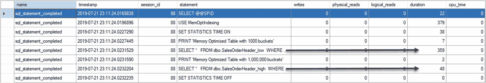

图 6-1
具有哈希索引的内存优化表查询的持续时间

```
USE MemOptIndexing
GO
SET STATISTICS TIME ON
PRINT 'Memory Optimized Table with 1000 buckets'
SELECT *
FROM dbo.SalesOrderHeader_low
WHERE SalesOrderID = 42
ORDER BY SalesOrderID
PRINT 'Memory Optimized Table with 1,000,000 buckets'
SELECT *
FROM dbo.SalesOrderHeader_high
WHERE SalesOrderID = 42
ORDER BY SalesOrderID
SET STATISTICS TIME OFF
代码清单 6-5
查询具有哈希索引的内存优化表
```

重要的是不要将上一个脚本的结果解读为表明桶与行 `1:1` 的比例是最佳实践。如果您运行另一组查询，该查询检索的不是单个行，而是（例如）介于 `42` 和 `420` 之间的行（如代码清单 6-6 所示），性能状况就会改变。在这种情况下，性能优势转向了拥有更多行的桶。现在的结果是：第一个表上的查询耗时 `86,973 μs`，而第二个表上的查询耗时 `101,127 μs`，如图 6-2 所示。

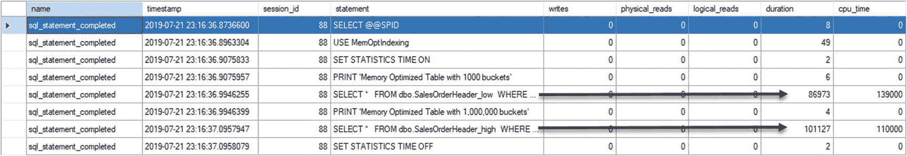

图 6-2
具有哈希索引的内存优化表查询的持续时间

```
USE MemOptIndexing
GO
SET STATISTICS TIME ON
PRINT 'Memory Optimized Table with 1000 buckets'
SELECT *
FROM dbo.SalesOrderHeader_low
WHERE SalesOrderID BETWEEN 42 AND 420
ORDER BY SalesOrderID
PRINT 'Memory Optimized Table with 1,000,000 buckets'
SELECT *
FROM dbo.SalesOrderHeader_high
WHERE SalesOrderID BETWEEN 42 AND 420
ORDER BY SalesOrderID
SET STATISTICS TIME OFF
代码清单 6-6
查询具有哈希索引的内存优化表
```

在使用哈希索引时，理解 `SQL Server` 如何在哈希中使用桶是很重要的。需要注意的一点是，即使有足够的桶让每个表拥有自己的桶，也并不意味着每一行都会获得一个桶。要查看本章中创建的哈希索引的统计信息，请运行代码清单 6-7 中的查询，该查询访问 `DMV` `sys.dm_db_xtp_hash_index_stats`。此 `DMV` 提供了有关桶的数量以及这些桶填充情况的信息。

```
USE MemOptIndexing
GO
SELECT OBJECT_NAME(hs.object_id) AS object_name
,i.name as index_name
,hs.total_bucket_count
,hs.empty_bucket_count
,FLOOR((CAST(empty_bucket_count as float)/total_bucket_count) * 100) AS empty_bucket_percent
,hs.avg_chain_length
,hs.max_chain_length
FROM sys.dm_db_xtp_hash_index_stats AS hs
INNER JOIN sys.indexes AS i ON hs.object_id=i.object_id AND hs.index_id=i.index_id
代码清单 6-7
用于查看哈希索引统计信息的查询
```

回顾代码清单 6-7 的结果（在图 6-3 中提供），您可以看到有几个有趣的项需要注意。首先，指定为 `1,000` 个桶的第一个索引（`SalesOrderHeader_low`）实际上有 `1,024` 个桶。这是因为桶是在与 2 的幂对齐的分配中创建的。这也是为什么 `SalesOrderHeader_high` 上那个 `1,000,000` 个桶的索引有 `1,048,576` 个桶的原因。下一个有趣的部分是 `SalesOrderHeader_high` 上哈希索引中空桶的数量。在有 `1,000,000` 行和超过一百万个桶的情况下，仍然有 `37%` 的桶是空的。这种情况的发生是因为在确定性哈希函数中，在所有桶被使用之前，一些哈希值在值范围内会重复。这是在构建哈希索引时需要考虑的事情，特别是在旨在实现桶与行 `1:1` 比例的情况下。

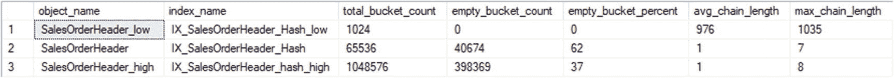

图 6-3
哈希桶统计信息查询的输出

### 注意

查询性能详细信息是使用基于 `Query Detail Tracking` 模板的 `Extended Events` 会话捕获的，该会话包含一个筛选器，用于筛选包含演示查询的会话。您可以在 [`www.simple-talk.com/sql/database-administration/getting-started-with-extended-events-in-sql-server-2012/`](http://www.simple-talk.com/sql/database-administration/getting-started-with-extended-events-in-sql-server-2012/) 找到有关构建会话的更多信息。

内存优化表的哈希索引是一种重要的索引选择，特别是当有许多查询将访问单个行，并且寻求操作将提供最优计划时。在构建表和哈希索引时，请重点将桶的数量设置为一个合理的行与桶的比例大小，同时考虑将通过查询检索的行数。

## 范围索引

内存优化表支持的第二种索引类型是范围索引。范围索引，顾名思义，用于支持数据的范围扫描以及有序扫描。它们利用了一种变体的 `B 树`，微软称之为 `Bw 树`。这两种结构之间的关键区别在于 `Bw 树` 中的节点引用指向的是内存位置而非物理页面位置。在决定是否在内存优化表上包含范围索引时，主要的考虑因素将是该表是否需要支持范围扫描或 `ORDER BY` 语句。

### 注意

关于 Bw-tree 的更多信息，请参见 [`http://research.microsoft.com/pubs/178758/bw-tree-icde2013-final.pdf`](http://research.microsoft.com/pubs/178758/bw-tree-icde2013-final.pdf)。

要在内存优化表上创建范围索引，您需要在表的架构中声明索引，指明一个带有键值的 `NONCLUSTERED` 索引。如清单 6-8 所示，索引 `IX_SalesOrderHeader` 是 `SalesOrderID` 列上的范围索引。与哈希索引不同，范围索引无需考虑其他配置项，创建时也无需考虑任何存储桶。

```sql
USE MemOptIndexing
GO
IF OBJECT_ID('dbo.SalesOrderHeader_high_range') IS NOT NULL
DROP TABLE dbo.SalesOrderHeader_high_range
CREATE TABLE dbo.SalesOrderHeader_high_range(
SalesOrderID int NOT NULL
,Column1 uniqueidentifier
,CONSTRAINT IX_SalesOrderHeader_hash_high_range PRIMARY KEY
NONCLUSTERED HASH (SalesOrderID)
WITH (BUCKET_COUNT = 1000000)
,INDEX IX_SalesOrderHeader NONCLUSTERED (SalesOrderID)
)
WITH (MEMORY_OPTIMIZED = ON);
WITH L1(z) AS (SELECT 0 UNION ALL SELECT 0)
, L2(z) AS (SELECT 0 FROM L1 a CROSS JOIN L1 b)
, L3(z) AS (SELECT 0 FROM L2 a CROSS JOIN L2 b)
, L4(z) AS (SELECT 0 FROM L3 a CROSS JOIN L3 b)
, L5(z) AS (SELECT 0 FROM L4 a CROSS JOIN L4 b)
, L6(z) AS (SELECT TOP 1000000 0 FROM L5 a CROSS JOIN L5 b)
INSERT INTO dbo.SalesOrderHeader_high_range
SELECT ROW_NUMBER() OVER (ORDER BY z) AS RowID, NEWID()
FROM L6;
```
清单 6-8
创建带有范围索引的表

为了展示范围索引在内存优化表上的价值，让我们使用清单 6-8 中创建的表来执行一些将利用范围扫描的查询。为此，您将使用清单 6-9，它查询新表 (`dbo.SalesOrderHeader_high_range`) 和之前仅使用哈希索引创建的表 (`dbo.SalesOrderHeader_high`)。通过对这两个表执行查询 `SalesOrderID BETWEEN 100 AND 10000` 的行，您可以看到执行时间存在巨大差异。仅使用哈希索引的表的查询耗时 216 毫秒（见图 6-4），而对带有范围索引的表的查询耗时 97 毫秒。在这种情况下，范围索引带来了显著的性能提升。

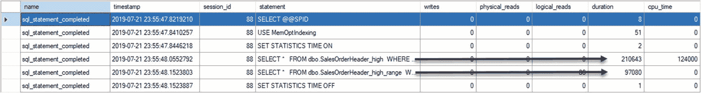

图 6-4
使用范围扫描的内存优化表查询持续时间

```sql
USE MemOptIndexing
GO
SET STATISTICS TIME ON
SELECT *
FROM dbo.SalesOrderHeader_high
WHERE SalesOrderID BETWEEN 100 AND 10000
ORDER BY SalesOrderID
SELECT *
FROM dbo.SalesOrderHeader_high_range
WHERE SalesOrderID BETWEEN 100 AND 10000
ORDER BY SalesOrderID
SET STATISTICS TIME OFF
```
清单 6-9
使用范围扫描查询内存优化表

类似地，当内存优化表上有可用的范围索引时，`ORDER BY` 语句也能得到极大改进。使用清单 6-10 中的代码，您针对与上一个演示相同的表运行两个查询。在此情况下，根据图 6-5 中的输出，您可以看到范围扫描耗时 462 微秒，而哈希索引需要 240,733 微秒。同样，通过使用范围索引，您获得了显著的性能提升。

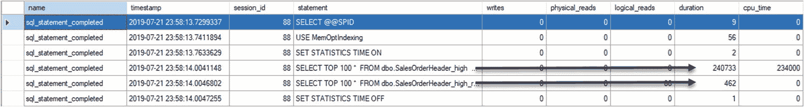

图 6-5
使用 TOP 子句和 ORDER BY 的内存优化表查询持续时间

```sql
USE MemOptIndexing
GO
SET STATISTICS TIME ON
SELECT TOP 100 *
FROM dbo.SalesOrderHeader_high
ORDER BY SalesOrderID
SELECT TOP 100 *
FROM dbo.SalesOrderHeader_high_range
ORDER BY SalesOrderID
SET STATISTICS TIME OFF
```
清单 6-10
使用 ORDER BY 语句查询内存优化表

与哈希索引类似，范围索引在创建内存优化表时提供了显著的性能提升机会。执行范围扫描和排序结果的需求是许多应用程序中的常见场景。这些操作通过使用范围索引得到了极大改善。

## 总结

本章探讨了内存优化表可用的索引类型。这些选项包括 `哈希` 索引和 `范围` 索引，是内存优化表能够提供惊人性能的背后力量。如演示所示，每种索引类型对应于表上不同的查询模式，理解这些模式对于为您的内存优化表及其支持的工作负载构建正确的索引至关重要。

# 7. 全文索引

SQL Server 支持存储大量非结构化文本信息的机制。自 SQL Server 2008 以来，其中一种机制就是与可变长度字符数据类型 `VARCHAR` 和 `NVARCHAR` 一起使用的 `MAX` 长度。这意味着您可以在单个列中存储多达 2 GB 的字符信息。虽然 SQL Server 可以存储此信息，但非聚集索引的 1,700 字节限制和聚集索引的 900 字节限制使得通过传统方式进行索引成为一个挑战。幸运的是，SQL Server 提供了另一种用于在这些大数据类型中进行搜索的索引机制，全文索引由此应运而生。

## 全文索引

全文搜索索引是 SQL Server 中独立于正常索引方法和对象的另一项索引功能。本章将简要描述全文搜索的架构、存储和索引，以实现最佳性能。

全文搜索 (`FTS`) 允许您存储大量基于文本的内容。此内容可以包括多种文档类型，以及 Word 文档 (`.docx`) 文件等格式。这些内容存储在 `BLOB`（二进制大对象）列中，而不是纯文本数据中。搜索和存储非结构化性质内容的能力为数据库管理系统提供了许多机会。

文档保留就是这样一个机会；它允许您以更低的成本长期存储文档。搜索功能允许为各种需求查询这些内容。想象一家航运公司，它根据纯文本模板创建了数千份运输文档。出于保留目的以确保以后需要时能够跟踪货物，这些文档产生了巨大的保留需求。存储仓库房间的维护需要花费资金。当需要研究特定货物时，完成该任务所需的小时数是可观的。

现在想象一下，这家公司正在使用 `FTS` 功能和索引结构。文档被系统扫描，将文本读入系统，然后系统将此数据插入 SQL Server 数据库。这允许对特定的账户号码、运输发票以及文档中以后审查所需的任何不同文本进行全文搜索。可以创建一个类似于书籍索引的索引，使得查找特定文档变得更快。更进一步，`FTS` 允许您在文档本身中搜索特定内容。如果接到一个请求，要求查找由特定货运公司在特定拖车上发送的所有运输文档，`FTS` 功能允许在几分之一的时间内检索信息，与手动流程相比。


该请求因被视为高风险而被拒绝。


# 语法

代码清单 7-4 中的语法用于创建全文索引。表 7-1 描述了可用的不同选项。

```
CREATE FULLTEXT INDEX ON 
()
KEY INDEX 
ON 
WITH 
CHANGE_TRACKING = 
STOPLIST = ;
代码清单 7-4
CREATE FULLTEXT INDEX 语法
```

在大多数其他的 `CREATE INDEX` 语句中，基本语法和选项类似，仅有细微修改。而对于 FTS 索引创建，你会看到一套完全不同的选项和考量。初始的 `CREATE FULLTEXT INDEX` 与任何 `CREATE INDEX` 相同，都需要指定表以及要索引的列。此后，其他选项则与常规索引创建不同。

表 7-1
全文索引选项

| 选项名称 | 描述 |
| --- | --- |
| `TYPE COLUMN` | 指定列的名称，该列保存以 BLOB 类型（如 `.doc`、`.pdf` 和 `.xls`）加载的文档的文档类型。此选项仅用于 `varbinary`、`varbinary(max)` 和 `image` 数据类型。如果在任何其他数据类型上指定了此选项，`CREATE FULLTEXT INDEX` 语句将抛出错误。 |
| `LANGUAGE` | 更改用于索引的默认语言，并包含以下变体和选项：•     语言可以指定为字符串、整数或十六进制。•     如果指定了语言，则在使用该索引运行查询时将使用该语言。•     当语言指定为字符串值时，`syslanguages` 系统表必须与该语言对应。•     如果使用双字节值，它将在创建时转换为十六进制。•     必须启用特定语言的分词器和词干分析器，否则将生成 SQL Server 错误。•     包含多种语言的非 BLOB 和非 XML 列应遵循 0 `×` 0 中性语言设置。•     对于 BLOB 和 XML 类型，将使用文档本身中的语言类型。例如，语言类型为俄语或 LCID 为 1049 的 Word 文档将强制在索引中使用相同的设置。使用 `sys.fulltext_languages` 查看所有可用的语言类型和 LCID 编码。 |
| `KEY INDEX` | 每个全文索引都需要指定一个相邻的唯一、单键、非空列。使用此选项在同一表中指定该列。 |
| `FULLTEXT_CATALOG_NAME` | 如果不使用默认目录创建全文索引，请使用此选项指定目录名称。 |
| `CHANGE_TRACKING` | 确定如何以及何时填充索引。选项为 `MANUAL`、`AUTO` 和 `OFF [NO_POPULATION]`。`MANUAL` 设置需要在填充索引之前执行 `ALTER FULLTEXT INDEX ... START UPDATE POPULATION`。`AUTO` 设置在创建时填充索引，并根据持续进行的更改自动更新。如果在 `CREATE` 语句中省略了 `CHANGE_TRACKING`，这是默认设置。`OFF [NO_POPULATION]` 设置用于完全关闭索引的填充，SQL Server 将不保留更改列表。除非指定了 `NO_POPULATION`，否则索引在创建时会填充一次。 |
| `STOPLIST` | 指定一个停用词列表，该列表本质上会阻止某些词被索引。可用选项有 `OFF`、`SYSTEM` 和自定义停用词列表。`OFF` 设置将不使用停用词列表，并且在填充索引时性能开销更大。`SYSTEM` 是已创建的默认停用词列表。用户创建的停用词列表是已创建的、可与索引关联使用的停用词列表。 |
| `SEARCH PROPERTY LIST` | 指定要与全文索引关联的搜索属性列表。属性列表通过允许区分文档属性（如标题或标签）之间的搜索，提供对全文搜索的更精细控制。 |

# 关键索引

选择关键索引可能是一个直接的选择，因为关键索引必须是唯一、单键且不可为空的列。主键通常很适合此用途，就像代码清单 7-1 中 `dbo.SQLServerDocuments` 表上显示的主键。然而，应考虑关键索引的大小。理想情况下，推荐使用 6 字节的键，并记录为最佳选择，以减少 I/O 和 CPU 资源消耗的开销。回想一下，唯一键的限制之一是它不能超过 900 字节。如果达到此最大限制，填充将失败。解决问题可能需要创建新索引并修改表本身。对于高使用率的表，这可能会造成昂贵的停机时间。

# 填充

创建全文索引时，应仔细权衡全文索引中的更改跟踪。默认设置 `AUTO` 可能会有开销，如果被索引列的内容频繁更改，可能会对性能产生负面影响。例如，一个存储每月仅插入一次且永不更改的运输发票的系统，可能不会从设置为 `AUTO` 中受益。`MANUAL` 填充很可能会基于表中内容的加载情况，使用 SQL Server Agent 在给定时间更好地运行。虽然不常见，但有些系统是静态的且只加载一次。这是使用 `OFF` 设置的理想情况，仅在当时执行初始填充。

填充的最后一个选项是增量填充。它是手动填充的替代方法。增量填充与数据的增量更新概念相同。当你处理数据并进行更改时，这些更改会被跟踪。可以以合并复制作为比较。合并复制通过使用触发器和插入/更新/删除跟踪行到合并系统表来保留更改。在给定的时间点，DBA 可以设置同步计划来处理这些更改并将其复制到订阅者。增量填充的功能方式与此相同。通过在表中使用 `timestamp` 列来跟踪更改。只处理那些被发现需要更改的行。这确实意味着必须满足在表上存在时间戳列的要求才能执行增量填充。对于更改极其频繁的数据，这可能不是理想选择。然而，对于随机且很少更改的数据，增量填充可能适合安装。


## 停用词列表

停用词列表在管理哪些内容**不应**被填充方面极其有用。通过绕过所谓的 `噪声词`，它可以提升填充性能。举个例子，考虑这个句子：“A dog chewed through the fiber going to the SAN causing the disaster and recovery plans to be used for the SQL Server instance.” 在这个句子中，你很可能希望 `fiber`、`SAN`、`disaster`、`recovery` 以及 `SQL` 或 `Server` 被索引。而 `A`、`the`、`to` 和 `be` 这些词就不那么理想。它们被视为噪声词，不属于填充过程的一部分。正如你可以想象的那样，停用词列表的使用对于整体填充性能和内容解析非常有帮助。停用词列表的使用也可以是特定于语言的。例如，法语中的 `la` 会取代英语中的 `the` 被指定。

要创建自定义停用词列表，请使用 `CREATE FULLTEXT STOPLIST` 语句，如代码清单 7-5 所示。系统默认的停用词列表可用于预生成所有已被识别为噪声词的词汇。在本白皮书示例中，该停用词列表将被命名为 `WhitePaperStopList`。

```
CREATE FULLTEXT STOPLIST WhitePaperStopList FROM SYSTEM STOPLIST;
代码清单 7-5
创建全文停用词列表
```

要查看停用词列表，可以使用系统视图 `sys.fulltext_stoplists` 和 `sys.fulltext_stopwords`。`sys.fulltext_stoplists` 视图保存着在 SQL Server 实例上创建的停用词列表相关的元数据。确定 `stoplist_id` 以便与 `sys.fulltext_stopwords` 进行联接，从而显示完整的单词列表。单独来看，这个停用词列表并不比系统默认的更好。要向停用词列表中添加单词，请使用如代码清单 7-6 示例中的 `ALTER FULLTEXT STOPLIST` 语句。该示例移除了 `Downtime` 这个要排除的单词。

```
ALTER FULLTEXT STOPLIST WhitePaperStopList ADD 'Downtime' LANGUAGE 1033;
代码清单 7-6
修改全文停用词列表
```

要查看停用词列表单词，请运行代码清单 7-7 所示的查询。

```
SELECT  lists.stoplist_id,
        lists.name,
        words.stopword
FROM    sys.fulltext_stoplists AS lists
JOIN    sys.fulltext_stopwords AS words
  ON lists.stoplist_id = words.stoplist_id
WHERE   words.language = 'English'
ORDER BY lists.name;
代码清单 7-7
使用 sys.fulltext_stoplists 查看停用词列表单词
```

你可以在图 7-1 中看到查询结果；单词 `Downtime` 已被成功添加。

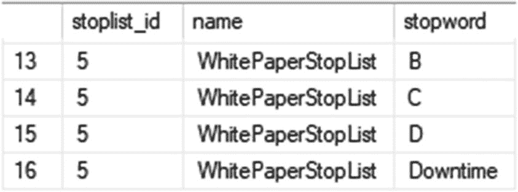

图 7-1
停用词列表的查询结果

有了目录、停用词列表，以及代码清单 7-1 创建的表中主键 `SQLServerDocumentsID` 的可用键索引，你就可以在同一个表的 `DOC` 列上创建全文索引。要创建全文索引，请使用 `CREATE FULLTEXT INDEX` 语句（参见代码清单 7-8）。

```
CREATE FULLTEXT INDEX ON dbo.SQLServerDocuments
(
  DOC
  TYPE COLUMN DocType
)
KEY INDEX PK_SQLServerDocuments
ON WhitePaperCatalog
WITH STOPLIST = WhitePaperStopList;
代码清单 7-8
CREATE FULLTEXT INDEX 语句
```

索引一旦创建，填充就会开始，因为没有为 `CHANGE_TRACKING` 添加选项。本章后面部分，我将展示如何监控目录并查看状态。加载时间可能取决于文档的大小。默认的 `AUTO` 设置生效。要查询 `SQLServerDocuments` 表和 `DOC` 列的内容，你可以运行 `CONTAINS` 语句来返回特定的单词。代码清单 7-9 展示了一个此类语句的示例。

```
SELECT  ssd.DOC,
        ssd.DocType
FROM    dbo.SQLServerDocuments AS ssd
WHERE   CONTAINS (ssd.DOC, 'statistic');
代码清单 7-9
使用 CONTAINS 查询特定单词
```

图 7-2 显示了该查询的执行计划。

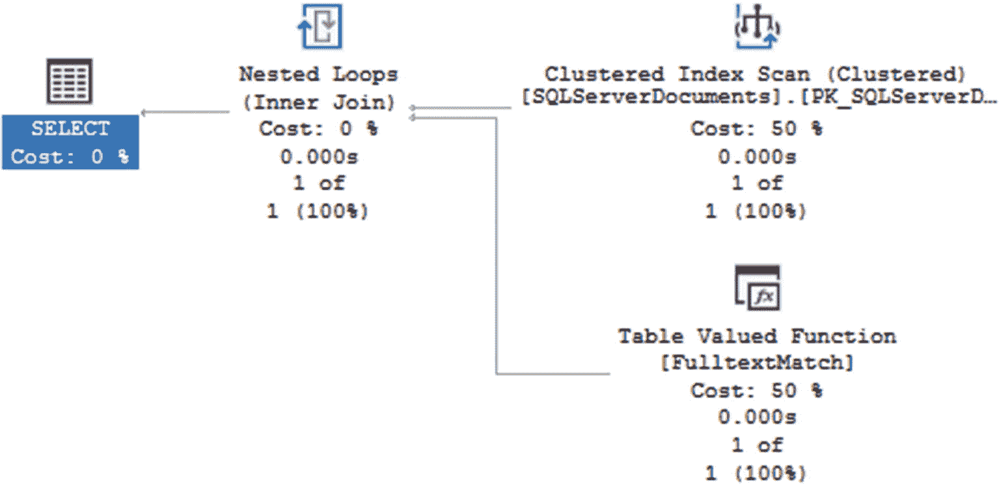

图 7-2
CONTAINS 和 FTS 索引使用的执行计划

通过 `CONTAINS`(ssd.DOC,`'statistic')` 方式进行搜索，图 7-2 中的执行计划显示了对 `FulltextMatch` 的操作。它也将文档类型为 `.docx` 的白皮书作为此单词搜索的匹配项返回。


## 全文搜索索引目录视图与属性

SQL Server 提供了大量关于索引的通用信息。性能、配置、使用情况和存储只是其中几个方面。与普通索引对象一样，全文索引同样需要关注其维护和选项设置，以确保它们始终对整体性能有益，而不是阻碍。

表 7-2 描述了可用于全文搜索的目录视图。

表 7-2：全文目录视图

| 目录视图名称 | 描述 |
| --- | --- |
| `sys.fulltext_catalogs` | 列出所有全文目录及其高级属性。 |
| `sys.fulltext_document_types` | 返回可用于索引的文档类型的完整列表。这些文档类型中的每一个都将在 SQL Server 实例上注册。 |
| `sys.fulltext_index_catalog_usages` | |
| `sys.fulltext_index_columns` | 列出所有已编入索引的列。 |
| `sys.fulltext_index_fragments` | 列出全文索引片段（倒排索引数据的存储）的所有详细信息。 |
| `sys.fulltext_indexes` | 列出每个全文索引及其上设置的属性。 |
| `sys.fulltext_languages` | 列出实例上可用于全文索引的所有可用语言。 |
| `sys.fulltext_semantic_language_statistics_database` | 列出已安装的语义语言统计数据库。 |
| `sys.fulltext_semantic_languages` | 列出所有注册了统计模型的语言。 |
| `sys.fulltext_stoplists` | 列出创建的每个停止列表。 |
| `sys.fulltext_stopwords` | 列出数据库中的所有停用词。 |
| `sys.fulltext_system_stopwords` | 列出预加载的系统停用词。 |

出于信息目的，在检查目录、属性和填充状态结果时，可以调用 `FULLTEXTCATALOGPROPERTY` 函数，如代码清单 7-10 所示。

```sql
FULLTEXTCATALOGPROPERTY ('catalog_name' ,'property')
-- 代码清单 7-10
-- 查询全文索引的属性
```

返回的信息将提供有关目录状态的丰富细节，包括填充状态。`catalog_name` 参数可以接受任何已创建的目录，然后可以通过使用属性列表来返回所需的特定信息。表 7-3 列出了您可以传递的属性。

表 7-3：全文目录属性

| 属性名称 | 描述 |
| --- | --- |
| `AccentSensitivity` | 目录当前的重音敏感性设置。返回 0 表示不敏感，1 表示敏感。 |
| `IndexSize` | 目录的逻辑大小（兆字节）。 |
| `ItemCount` | 已在目录中编入索引的总项目数。 |
| `LogSize` | 向后兼容属性。返回 0。 |
| `MergeStatus` | 如果未进行主合并则返回 0，如果正在进行主合并则返回 1。 |
| `PopulateCompletionAge` | 自上次索引填充以来经过的时间（秒），自 1990-01-01 00:00:00 起算。如果尚未运行填充，则始终返回 0。 |
| `PopulateStatus` | `PopulateStatus` 可以返回十种不同的值：<br>`0`：空闲。<br>`1`：正在进行完全填充。<br>`2`：已暂停。<br>`3`：填充已被限制。<br>`4`：填充正在恢复。<br>`5`：状态为已关闭。<br>`6`：正在进行增量填充。<br>`7`：当前正在构建索引。<br>`8`：磁盘已满。<br>`9`：更改跟踪。 |
| `UniqueKeyCount` | 目录中独立的全文索引键的数量。 |
| `ImportStatus` | 当全文目录未被导入时返回 0，当正在导入时返回 1。 |

例如，要显示前面使用的 `WhitePaperCatalog` 目录的填充状态，您可以使用代码清单 7-11 中的语句。结果应为 0（空闲），因为索引只有一个文档且没有其他查询正在该索引上运行。

```sql
SELECT FULLTEXTCATALOGPROPERTY('WhitePaperCatalog','PopulateStatus');
-- 代码清单 7-11
-- 使用 FULLTEXTCATALOGPROPERTY 返回目录的填充状态
```

可以通过执行 `sys.fulltext_index_catalog_usages` 来查看目录及其引用的索引。此目录视图返回所有引用过它的索引，如代码清单 7-12 所示。

```sql
SELECT  OBJECT_NAME(ficu.object_id) [对象名称],
        ficu.index_id,
        ficu.fulltext_catalog_id
FROM    sys.fulltext_index_catalog_usages AS ficu;
-- 代码清单 7-12
-- 使用 sys.fulltext_index_catalog_usages
```

图 7-3 显示了结果，其中 SQLServerDocuments 正在使用与其自身关联的目录，而 JobCandidate、ProductReview 和 Document 正在使用共享的全文目录。重要的是要注意，您能够跨多个表使用单个目录。

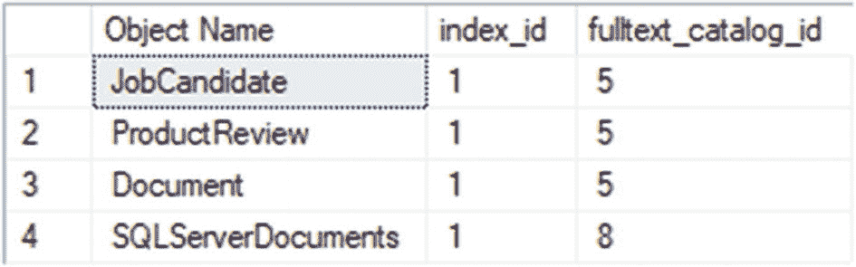
图 7-3：`sys.fulltext_index_catalog_usages` 的查询结果

有关当前应用于所有目录及其设置的详细信息，请查询 `sys.fulltext_catalogs`。此目录视图有助于确定默认目录和属性状态指示器，例如显示目录是否正在导入过程中的 `is_importing`。

要详细查看数据库中的全文索引，您可以使用 `sys.fulltext_indexes` 并连接其他目录视图以创建更有意义的结果集。从此目录视图获取的重要信息包括全文目录名称和属性；更改跟踪属性、爬网类型和状态；以及要使用的停止列表。

代码清单 7-13 中的查询返回所有索引的信息结果集，包括目录和索引的停止列表信息。

```sql
SELECT  idx.is_enabled,
        idx.change_tracking_state,
        idx.crawl_type_desc,
        idx.crawl_end_date [上次爬网时间],
        cat.name,
        CASE WHEN cat.is_accent_sensitivity_on = 0 THEN '重音不敏感'
             WHEN cat.is_accent_sensitivity_on = 1 THEN '重音敏感'
        END [重音敏感性],
        lists.name,
        lists.modify_date [停止列表的最后修改日期]
FROM    sys.fulltext_indexes idx
        INNER JOIN sys.fulltext_catalogs cat
            ON idx.fulltext_catalog_id = cat.fulltext_catalog_id
        INNER JOIN sys.fulltext_stoplists lists
            ON idx.stoplist_id = lists.stoplist_id;
-- 代码清单 7-13
-- 使用所有目录视图获取全文索引信息
```

图 7-4 显示了目录视图查询的结果。这在调整全文目录时非常有用。例如，如果索引已过期，您将能够确定其上次更新或爬网的时间。或者，如果您通过添加到停止列表来调整全文索引以去除噪声，了解该更改相对于上次爬网发生的时间有助于识别为什么性能没有改善。


图 7-4：全文索引信息的查询结果

## 总结

本章概述了如何创建全文索引并从中进行查询。能够对大型文档和自由格式文本进行过滤和查询，与能够使用传统的结构化索引同样重要。利用全文索引，您不仅可以检查列的内容，还可以检查列中文件的内容，从而使应用程序能够更好地识别与所提交请求在上下文中匹配的文档和其他人工制品。


# 8. 索引的误区与最佳实践

在前几章中，我们已经定义了索引并展示了其结构。在接下来的章节中，你将学习构建索引并确保其按预期运行的策略。本章将消除一些常见的误区，并展示如何为创建索引奠定基础。

误区会在尝试构建索引时带来不必要的负担。了解与索引相关的误区可以防止你使用适得其反的索引策略。本章讨论的索引误区如下：

*   数据库不需要索引。
*   主键始终是聚集索引。
*   在线索引操作不会阻塞。
*   在多列索引中，任何列都可以被筛选。
*   聚集索引按物理顺序存储记录。
*   索引总是以相同的顺序输出。
*   在插入时，填充因子应用于索引。
*   从堆中删除会导致不可恢复的空间。
*   每个表都应该是堆或拥有聚集索引。

在审视误区时，看看最佳实践也是一个好主意。最佳实践在许多方面与误区相似，因为它们都是普遍持有的观念。主要的区别在于，最佳实践经得起推敲，并且在构建索引时是有用的建议。本章将探讨以下最佳实践：

*   根据当前工作负载建立索引。
*   默认在主键上使用聚集索引。
*   正确设定数据库级别的填充因子。
*   正确设定索引级别的填充因子。
*   为唯一键和外键列建立索引。
*   平衡索引数量。

## 索引误区

人们在构建数据库和索引时遇到的问题之一就是处理误区。索引起源于许多不同的地方。有些来自 SQL Server 及其工具的早期版本，或者基于以前的功能。另一些则来自他人的建议，这些建议是基于某个特定数据库的条件，而这些条件与其他数据库不匹配。

索引误区的问题在于它们混淆了索引策略的思路。在可以通过构建索引来解决严重性能问题的情况下，误区有时会阻止人们考虑这种方法。在接下来的几个小节中，我们将讨论许多关于索引的误区，我会尽力破除它们。

### 误区 1：数据库不需要索引

通常，在一个正在开发的应用程序中，会创建一个或多个数据库来存储应用程序的数据。在许多开发过程中，重点是添加新功能，并期望“性能问题会自行解决”。一个不幸的结果是，许多数据库在开发和部署时没有构建索引，因为人们认为它们不需要。

除此之外，还有一些数据库开发人员相信他们的数据库与其他数据库有些不同。以下是不时听到的一些原因：

*   “这是一个小型数据库，不会有太多数据。”
*   “这只是一个概念验证，不会长期存在。”
*   “这不是一个重要应用，所以性能不重要。”
*   “整个数据库已经能放入内存；索引只会让它需要更多内存。”
*   “我将只用这个数据库插入数据；我永远不会查看结果。”

这些理由中的每一个都很容易反驳。在当今的大数据世界里，即使是预期很小的数据库，在被采用后也可能快速增长。除此之外，数据库的小巧绝对是相对而言的。任何概念验证或不重要的数据库和应用程序，如果没有人需要或没有人愿意为其功能投入资源，就不会被创建。那些人很可能期望他们要求的功能能够按预期执行。最后，将数据库放入内存并不意味着它会很快。正如前几章所讨论的，索引为数据提供了替代访问路径，旨在减少访问数据所需的页面数量。没有这些替代路径，数据访问很可能需要读取表的每一个页面。

这些原因可能不是你听到的关于你的数据库的理由，但它们很可能类似。围绕这个误区的核心观点是，索引无助于数据库更好地执行。打破这种借口最有力的方法之一，就是通过针对特定场景展示索引的好处。

为了演示，让我们看一下代码清单 8-1。这个代码示例创建了表 `MythOne`。接下来，你会看到一个几乎任何应用程序中都会有的查询。在代码清单 8-2 的查询输出中，查询产生了 1,496 次读取。

```
USE AdventureWorks2017;
GO
SELECT * INTO MythOne
FROM Sales.SalesOrderDetail;
GO
SET STATISTICS IO ON
SET NOCOUNT ON
GO
SELECT SalesOrderID, SalesOrderDetailID, CarrierTrackingNumber, OrderQty, ProductID, SpecialOfferID, UnitPrice, UnitPriceDiscount, LineTotal
FROM MythOne
WHERE CarrierTrackingNumber = '4911-403C-98';
GO
SET STATISTICS IO OFF
GO
```
**代码清单 8-1** 没有索引的表

```
Table 'MythOne'. Scan count 1, logical reads 1496, physical reads 0, read-ahead reads 0,
lob logical reads 0, lob physical reads 0, lob read-ahead reads 0.
```
**代码清单 8-2** 没有索引的表的 I/O 统计信息

可以说 1,496 次读取的输入/输出 (I/O) 并不算多。考虑到当今世界一些数据库的大小和数据量，这可能是真的。但查询的 I/O 不应与世界其他地方的性能进行比较；它需要与其潜在的 I/O、应用程序的需求以及部署它的平台进行比较。

改进上一个演示中的查询，只需在表的 `CarrierTrackingNumber` 列上添加一个索引。要查看为 `MythOne` 添加索引的效果，请执行代码清单 8-3 中的代码。创建索引后，查询的读取次数从 1,496 次减少到 15 次，如代码清单 8-4 所示。仅通过一个索引，查询的 I/O 就降低了近两个数量级。可以说，在这种情况下，索引提供了巨大的价值。

```
CREATE INDEX IX_CarrierTrackingNumber ON MythOne (CarrierTrackingNumber)
GO
SET STATISTICS IO ON
SET NOCOUNT ON
GO
SELECT SalesOrderID, SalesOrderDetailID, CarrierTrackingNumber, OrderQty, ProductID, SpecialOfferID, UnitPrice, UnitPriceDiscount, LineTotal
FROM MythOne
WHERE CarrierTrackingNumber = '4911-403C-98';
GO
SET STATISTICS IO OFF
GO
```
**代码清单 8-3** 为 MythOne 添加索引

```
Table 'MythOne'. Scan count 1, logical reads 15 physical reads 0, read-ahead reads 0, lob logical reads 0, lob physical reads 0, lob read-ahead reads 0.
```
**代码清单 8-4** 有索引的表的 I/O 统计信息

我在这些示例中展示了索引确实能带来好处。如果你遇到对在数据库上构建索引有抵触情绪的情况，试着找出抵触的真正原因，并提供一个类似于本节中的示例。在第 11 章，我们将讨论可用于确定在数据库中创建哪些索引的方法。


### 误解二：主键总是聚集的

下一个相当普遍的误解是认为主键总是聚集的。尽管在许多情况下确实如此，但不能假设所有主键也都是聚集索引。在本书前面，我们讨论过一个表只能有一个聚集索引。如果主键是在聚集索引建立之后创建的，那么主键将被创建为非聚集索引。

为了说明主键的索引行为，我们将使用一个脚本，其中包含构建两个表。我们将构建第一个名为 `dbo.MythTwo1` 的表，然后在 `RowID` 列上创建主键。对于第二个名为 `dbo.MythTwo2` 的表，在创建之后，脚本将在创建主键之前先构建一个聚集索引。相关代码见**代码清单 8-5**。

```sql
USE AdventureWorks2017;
GO
CREATE TABLE dbo.MythTwo1
(
RowID int NOT NULL
,Column1 nvarchar(128)
,Column2 nvarchar(128)
);
ALTER TABLE dbo.MythTwo1
ADD CONSTRAINT PK_MythTwo1 PRIMARY KEY (RowID);
GO
CREATE TABLE dbo.MythTwo2
(
RowID int NOT NULL
,Column1 nvarchar(128)
,Column2 nvarchar(128)
);
CREATE CLUSTERED INDEX CL_MythTwo2 ON dbo.MythTwo2 (RowID);
ALTER TABLE dbo.MythTwo2
ADD CONSTRAINT PK_MythTwo2 PRIMARY KEY (RowID);
GO
SELECT OBJECT_NAME(object_id) AS table_name
,name
,index_id
,type
,type_desc
,is_unique
,is_primary_key
FROM sys.indexes
WHERE object_id IN (OBJECT_ID('dbo.MythTwo1'),OBJECT_ID('dbo.MythTwo2'));
```

**代码清单 8-5**：两种创建主键的方式

运行该代码段后，最终的查询将返回类似**图 8-1** 所示的结果。该图显示，第一个表上的主键 `PK_MythTwo1` 被创建为聚集索引。然后在第二个表上，`PK_MythTwo2` 被创建为非聚集索引。

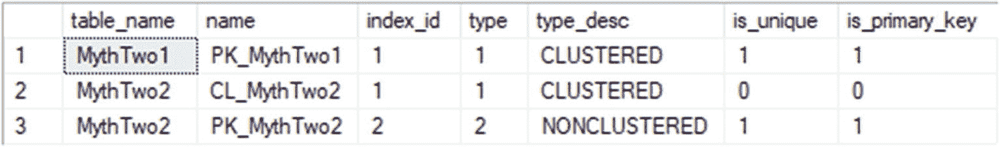

**图 8-1**：主键 sys.indexes 输出结果

在构建主键和聚集索引时，记住本节讨论的行为非常重要。如果遇到需要将它们分开的情况，则需要在聚集索引之后定义主键，或者将其定义为 `NONCLUSTERED` 索引。

### 误解三：在线索引操作不会阻塞

SQL Server 企业版的优势之一是能够在线构建索引。在在线索引构建期间，正在创建索引的表仍可用于查询和数据修改。当数据库需要被访问且维护窗口很短或几乎没有时，此功能非常有用。

关于在线索引重建的一个常见误解是它不会引起任何阻塞。当然，与所有这些误解一样，这个也是错误的。使用在线索引操作时，在构建的主要部分期间，表上会持有意向共享锁。在结束时，会短暂持有共享锁（对于非聚集索引）或架构修改锁（对于聚集索引），以便操作将更新后的索引移入。这与离线索引构建不同，离线构建在整个索引构建期间都会持有共享锁或架构修改锁。

当然，您会希望看到实际效果；为此，您将创建一个表，并使用 Extended Events 来监控在使用和不使用 `ONLINE` 选项创建索引时应用于表的锁。要开始此演示，请执行**代码清单 8-6** 中的代码。此脚本创建表 `dbo.MythThree` 并用 1000 万条记录填充它。它返回的最后一项是表的 `object_id`，这对于演示的后续部分是必需的。在此示例中，`dbo.MythThree` 的 `object_id` 是 `624721278`。

### 注意
本误解的所有演示都需要 SQL Server 企业版或开发者版。

```sql
USE AdventureWorks2017
GO
CREATE TABLE dbo.MythThree
(
RowID int NOT NULL
,Column1 uniqueidentifier
);
WITH L1(z) AS (SELECT 0 UNION ALL SELECT 0)
, L2(z) AS (SELECT 0 FROM L1 a CROSS JOIN L1 b)
, L3(z) AS (SELECT 0 FROM L2 a CROSS JOIN L2 b)
, L4(z) AS (SELECT 0 FROM L3 a CROSS JOIN L3 b)
, L5(z) AS (SELECT 0 FROM L4 a CROSS JOIN L4 b)
, L6(z) AS (SELECT TOP 10000000 0 FROM L5 a CROSS JOIN L5 b)
INSERT INTO dbo.MythThree
SELECT ROW_NUMBER() OVER (ORDER BY z) AS RowID, NEWID()
FROM L6;
GO
SELECT OBJECT_ID('dbo.MythThree')
GO
```

**代码清单 8-6**：MythThree 表创建脚本

为了在此场景中监控这些事件，您将使用 Extended Events 来捕获索引创建期间触发的 `lock_acquired` 和 `lock_released` 事件。在 SSMS 中为**代码清单 8-7** 和 **代码清单 8-8** 的代码打开查询窗口。运行前，请将 **代码清单 8-8** 中的 `session_id` 更新为 **代码清单 8-7** 中的 `session_id`；在此场景中，`session_id` 为 `42`。同样更新 `object_id`。在 Extended Events 会话运行后，您可以使用实时视图来监控锁的发生情况。

```sql
IF EXISTS(SELECT * FROM sys.server_event_sessions WHERE name = 'MythThreeXevents')
DROP EVENT SESSION [MythThreeXevents] ON SERVER
GO
CREATE EVENT SESSION [MythThreeXevents] ON SERVER
ADD EVENT sqlserver.lock_acquired(SET collect_database_name=(1)
ACTION(sqlserver.sql_text)
WHERE [sqlserver].[session_id]=(42) AND [object_id]=(624721278)),
ADD EVENT sqlserver.lock_released(
ACTION(sqlserver.sql_text)
WHERE [sqlserver].[session_id]=(42) AND [object_id]=(624721278))
ADD TARGET package0.ring_buffer
GO
ALTER EVENT SESSION [MythThreeXevents] ON SERVER STATE = START
GO
```

**代码清单 8-7**：用于锁获取和释放的 Extended Events 会话

在**代码清单 8-8** 的示例中，创建了两个索引，一个 `ONLINE` 构建，另一个使用默认选项（即离线）构建。要查看获取和释放了哪些锁，请在实时查看器中观察锁定行为。默认情况下，实时查看器中只显示名称和时间戳。实时查看器允许自定义显示的列。在**图 8-2** 中，除了默认的 `name` 和 `timestamp` 列外，还添加了 `object_id`、`mode`、`resource_type` 和 `sql_text` 列。要添加其他列，请右键单击列标题并选择“选择列”。

```sql
USE AdventureWorks2017
GO
CREATE INDEX IX_MythThree_ONLINE ON MythThree (Column1) WITH (ONLINE = ON);
GO
CREATE INDEX IX_MythThree ON MythThree (Column1);
GO
```

**代码清单 8-8**：非聚集索引创建的在线索引操作

当使用 `ONLINE` 选项创建索引时，请注意在**图 8-2** 中，`SCH_S`（`Schema_Shared`）和 `S`（`Shared`）锁在毫秒级的时间内被获取和释放。因为这些锁在整个索引创建过程中被获取和释放，所以其他事务可以继续对表进行操作。`SCH_S` 锁确保表的架构不发生变化，而 `S` 锁则阻止插入、更新和删除操作的页面。由于这些锁被持有非常短的时间，它们允许表在整个索引创建过程中保持可用。


### 注意

如果从扩展事件会话中没有看到任何结果，很可能是因为 `MythThree` 的 `object_id` 与通过扩展事件会话跟踪的 `object_id` 不匹配。

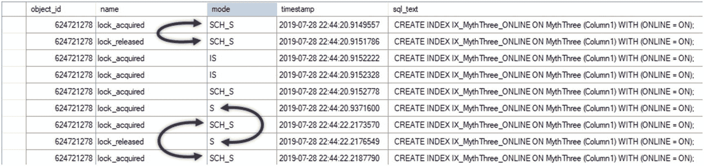
*图 8-2 使用 ONLINE 选项创建索引*

对于不使用 `ONLINE` 选项的默认索引创建，`S` 锁在整个索引构建过程中都会被持有。如图 8-3 所示，`S` 锁在 `SCH_S` 锁之前被获取，并且直到索引构建完成后才会释放。结果是索引在构建期间不可用。

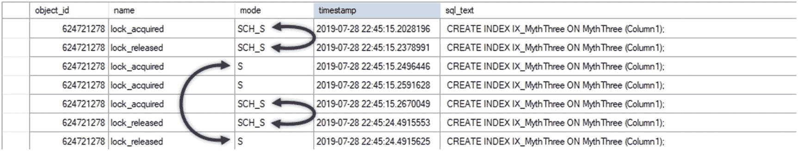
*图 8-3 不使用 ONLINE 选项创建索引*

### 误区 4：多列索引中的任何列都可以用于过滤

关于索引的下一个常见误区是，无论列在索引中的位置如何，索引都可以在该列上进行有序搜索以过滤索引内的数据。与本章迄今为止讨论的其他误区一样，这个说法也是错误的。索引并不需要使用索引中的所有列。然而，在执行有序搜索时，它必须从索引中最左边的列开始，并按照索引中从左到右的顺序使用列。这就是为什么索引中列的顺序如此重要。

为了演示这个误区，我们将运行几个示例，如代码清单 8-9 所示。脚本中创建了一个基于 `Sales.SalesOrderHeader` 的表，其主键为 `SalesOrderID`。为了测试通过多列索引搜索所有列的误区，创建了一个包含 `OrderDate`、`DueDate` 和 `ShipDate` 列的索引。

```sql
USE AdventureWorks2017
GO
IF OBJECT_ID('dbo.MythFour') IS NOT NULL
DROP TABLE dbo.MythFour
GO
SELECT SalesOrderID, OrderDate, DueDate, ShipDate
INTO dbo.MythFour
FROM Sales.SalesOrderHeader;
GO
ALTER TABLE dbo.MythFour
ADD CONSTRAINT PK_MythFour PRIMARY KEY CLUSTERED (SalesOrderID);
GO
CREATE NONCLUSTERED INDEX IX_MythFour ON dbo.MythFour (OrderDate, DueDate, ShipDate);
GO
```
*代码清单 8-9 多列索引误区测试*

测试对象准备就绪后，接下来要检查的是针对可能使用非聚集索引的表的查询行为。首先，我们将运行一个使用索引中最左边列的查询。代码清单 8-10 给出了相应代码。如图 8-4 所示，通过在最左边的列上进行筛选，查询使用了对 `IX_MythFour` 的 seek 操作。

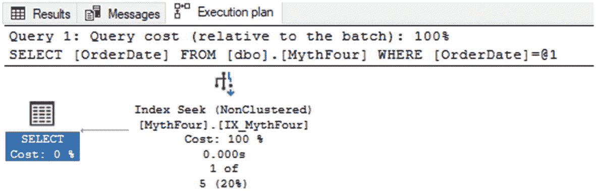
*图 8-4 使用索引中最左边列的执行计划*

```sql
USE AdventureWorks2017
GO
SELECT OrderDate FROM dbo.MythFour
WHERE OrderDate = '2011-07-17 00:00:00.000'
```
*代码清单 8-10 使用索引中最左边列的查询*

接下来，我们将看看当从索引键列的另一侧进行查询时会发生什么。在代码清单 8-11 中，查询在索引最右边的列上过滤结果。该查询的执行计划如图 8-5 所示，在 `IX_MythFour` 上使用了扫描操作。查询无法直接定位到匹配 `OrderDate` 的记录，而是需要检查所有记录以确定哪些匹配过滤条件。虽然使用了索引，但无法基于索引内的排序来筛选行。


*图 8-5 使用索引中最右边列的执行计划*

```sql
USE AdventureWorks2017
GO
SELECT ShipDate FROM dbo.MythFour
WHERE ShipDate = '2011-07-17 00:00:00.000'
```
*代码清单 8-11 使用索引中最右边列的查询*

至此，我们看到最左边的列可以用于过滤，而在最右边的列上进行过滤虽然可以使用索引，但无法通过 seek 操作以最优方式使用。最后一步是检查索引中既不在左侧也不在右侧的列的行为。在代码清单 8-12 中，包含了一个使用索引 `IX_MythFour` 中间列的查询。与任何执行计划一样，中间列查询的执行计划（如图 8-6 所示）使用了索引，但也使用了扫描操作。查询能够使用索引，但并非以最优方式。

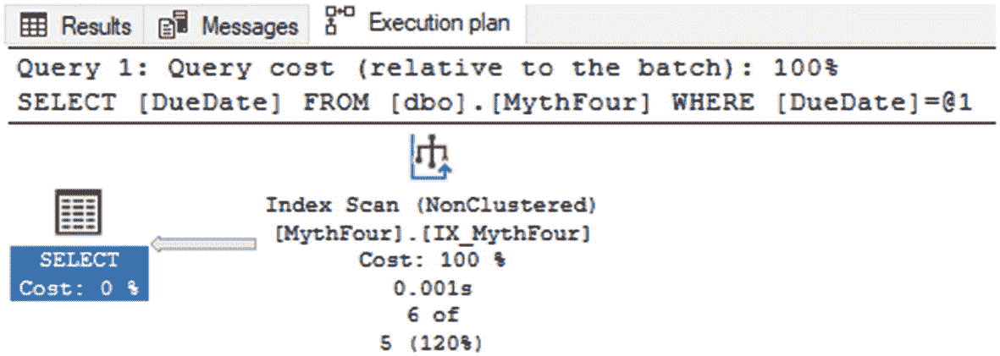
*图 8-6 使用索引中中间列的执行计划*

```sql
USE AdventureWorks2017
GO
SELECT DueDate FROM dbo.MythFour
WHERE DueDate = '2011-07-17 00:00:00.000'
```
*代码清单 8-12 使用索引中中间列的查询*

关于多列索引中的列如何使用的误区有时会让人困惑。正如示例所示，无论过滤索引的哪些列，查询都可以使用索引。关键在于有效地使用索引。要实现这一目标，过滤必须从索引最左边的列开始。如果这不是典型的使用场景，则要么重新排列索引列的顺序，要么创建额外的索引。

### 误区 5：聚集索引按物理顺序存储记录

一个更为普遍存在的误区是，认为聚集索引在磁盘上按物理顺序存储表中的记录。这个误区似乎主要是由于混淆了页面上存储的内容与记录在这些页面上的存储位置。正如第 2 章所讨论的，数据页和记录是有区别的。作为复习，我们将通过一个简单的演示来破除这个误区。

首先，执行代码清单 8-13 中的代码。示例中的代码将创建一个名为 `dbo.MythFive` 的表。然后，它将向该表添加三条记录。脚本的最后一部分将使用 `sys.dm_db_database_page_allocations` 输出该表的页面位置。在此示例中，插入到 `dbo.MythFive` 中的记录所在的页面是页面 59624，如图 8-7 所示。


### 注意

动态管理函数 `sys.dm_db_database_page_allocations` 是 `DBCC IND` 的替代品。该函数在 SQL Server 2012 中引入，相比其 DBCC 前身，为检查数据库中对象的页面分配提供了改进的接口。

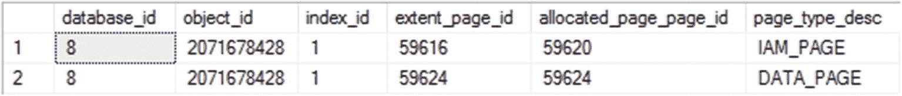

图 8-7

`sys.dm_db_database_page_allocations` 的输出

```sql
USE AdventureWorks2017
GO
IF OBJECT_ID('dbo.MythFive') IS NOT NULL
DROP TABLE dbo.MythFive
CREATE TABLE dbo.MythFive
(
RowID int PRIMARY KEY CLUSTERED
,TestValue varchar(20) NOT NULL
);
GO
INSERT INTO dbo.MythFive (RowID, TestValue) VALUES (1, 'FirstRecordAdded');
INSERT INTO dbo.MythFive (RowID, TestValue) VALUES (3, 'SecondRecordAdded');
INSERT INTO dbo.MythFive (RowID, TestValue) VALUES (2, 'ThirdRecordAdded');
GO
SELECT database_id, object_id, index_id, extent_page_id, allocated_page_page_id, page_type_desc
FROM sys.dm_db_database_page_allocations(DB_ID(), OBJECT_ID('dbo.MythFive'), 1, NULL, 'DETAILED')
WHERE page_type_desc IS NOT NULL
GO
代码清单 8-13
创建并填充 MythFive 表
```

要揭穿这个误解，可以使用 `DBCC PAGE` 命令来揭示证据。为此，请使用在代码清单 8-13 中识别的、`page_type_desc` 为 `DATA_PAGE` 的 `PagePID`。由于该表只有一个数据页，数据就位于该页。（有关 DBCC 命令的更多信息，请参见第 2 章。）

对于本示例，代码清单 8-14 显示了查看表中数据所需的 T-SQL。此命令输出大量信息，其中包含一些在本示例中无用的头信息。你需要的部分位于末尾，包含页面的内存转储，如图 8-8 所示。在内存转储中，记录按它们在页面上的放置顺序显示。如从最右列阅读所示，记录是按添加到表中的顺序排列的，而不是它们在聚集索引中出现的顺序。

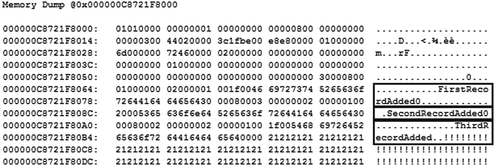

图 8-8

`DBCC PAGE` 输出的页面内容部分

```sql
DBCC TRACEON (3604);
GO
DBCC PAGE (AdventureWorks2017, 1, 59624, 2);
GO
代码清单 8-14
创建并填充 MythFive 表
```

基于此证据，很容易看出聚集索引并不按索引的物理顺序存储记录。如果扩展此示例，你将能够看到页面是按物理顺序排列的，但页面上的行则不是。

# 误解 6：索引总是以相同的顺序输出

关于索引的一个更常见的误解是，它们保证查询结果集的输出顺序。这是不正确的。正如本书前面所述，索引的目的是提供一种高效的数据访问路径。这个目的并不保证数据被访问的顺序。这个误解的问题在于，在某些条件下执行查询时，SQL Server 通常会显得能维持顺序，但当这些条件改变时，执行计划就会改变，结果会按照数据处理的顺序返回，而不是最终用户期望的顺序。

为了探讨这个误解，你将首先查看在使用聚集索引的查询上条件如何变化。在代码清单 8-15 中，有一个针对 `Sales.SalesOrderHeader` 和 `Sales.SalesOrderDetail` 表的简单聚合查询，该查询重复了两次。这可能会出现在 SQL Server 的多种用例中。

```sql
USE AdventureWorks2017
GO
SELECT soh.SalesOrderID, COUNT(*) AS DetailRows
FROM Sales.SalesOrderHeader soh
INNER JOIN Sales.SalesOrderDetail sod ON soh.SalesOrderID = sod.SalesOrderID
GROUP BY soh.SalesOrderID;
GO
DBCC FREEPROCCACHE
DBCC SETCPUWEIGHT(1000)
GO
SELECT soh.SalesOrderID, COUNT(*) AS DetailRows
FROM Sales.SalesOrderHeader soh
INNER JOIN Sales.SalesOrderDetail sod ON soh.SalesOrderID = sod.SalesOrderID
GROUP BY soh.SalesOrderID;
GO
DBCC FREEPROCCACHE
DBCC SETCPUWEIGHT(1)
GO
代码清单 8-15
使用聚集索引的无序结果
```

这两个查询的执行条件略有不同。第一个查询在标准的 SQL Server 成本模型下运行，生成的执行计划执行几次索引扫描和流聚合来返回结果，如图 8-9 所示。该查询的结果（如图 8-10 所示）支持了这样一点：如果 `SaleOrderID` 列是用户希望排序的列，SQL Server 将按期望的输出顺序返回数据。

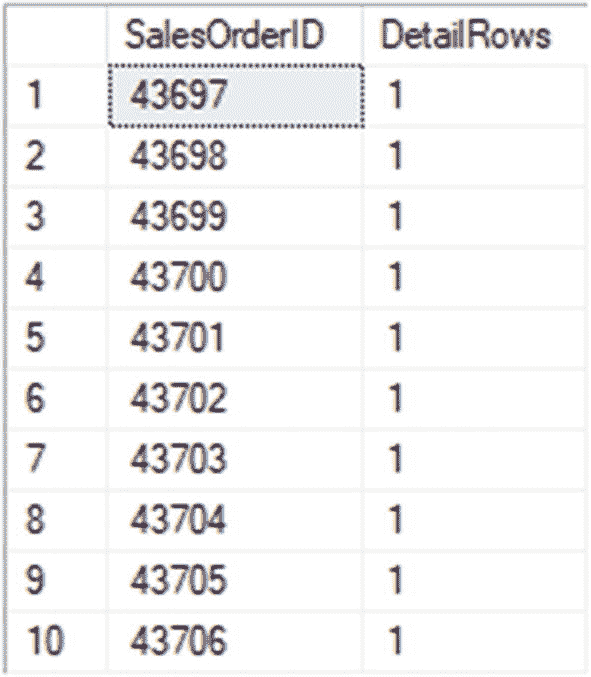

图 8-10

默认聚合执行计划的结果

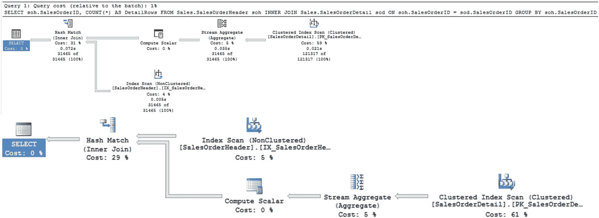

图 8-9

默认聚合执行计划

但是，如果 SQL Server 上的条件改变了，而业务规则没有改变，会发生什么？在代码清单 8-15 中执行的第二个查询是同一个查询，但条件发生了变化。对于本示例，利用了 DBCC 命令 `SETCPUWEIGHT` 来改变执行计划的成本。成本的变化导致使用了并行执行计划，如图 8-11 所示。并行计划的一个副作用是查询结果返回的顺序发生了变化，如图 8-12 所示。虽然结果看起来仍然有序，并且查询的逻辑没有改变，但首先返回的记录不同了。这是因为其中一个并行线程比其他线程更快地返回了其结果。

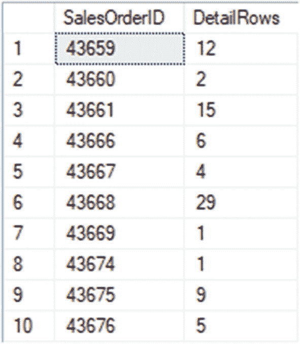

图 8-12

带并行度的聚合执行计划结果

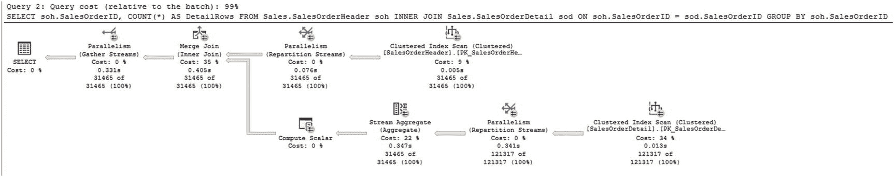

图 8-11

带并行度的聚合执行计划

### 警告

不要在生产代码中使用 `DBCC SETCPUWEIGHT` 来控制并行性或出于任何其他原因。此 `DBCC` 命令严格用于控制 SQL Server 中的环境变量，以测试和验证执行计划。

需要考虑的第二种情况是，当查询的业务规则发生变化时。例如，可能一组结果最初没有被过滤，但在对应用程序进行更改后，查询可能改为使用不同的索引集。这也可能导致结果顺序发生变化，例如当查询从使用聚集索引变为使用非聚集索引时。

为了演示这种行为变化，请执行清单 8-16 中的代码。此代码运行两个查询。两个查询都返回 `SalesOrderID`、`CustomerID` 和 `Status`。出于示例目的，业务规则规定结果必须按 `SalesOrderID` 排序。在这种情况下，第一个查询的结果按照业务规则进行排序，如图 8-13 顶部所示。但在第二个查询中，当逻辑变为通过添加筛选器来请求更少的行时，结果不再有序，如图 8-13 底部所示。变化的原因来自于 SQL Server 用于执行查询的索引发生了变化。索引的变化导致结果以那些索引对数据进行排序的方式被处理和排序。

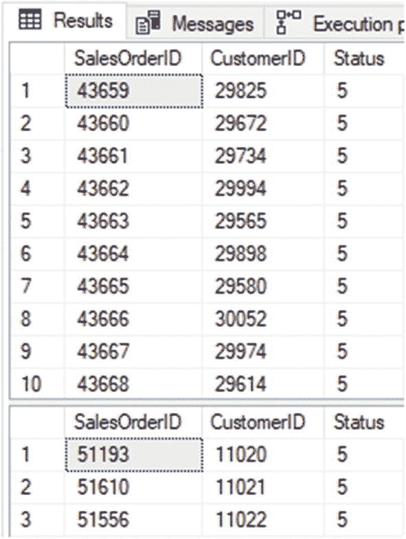

图 8-13 展示筛选对排序影响的查询结果

```
USE AdventureWorks2017
GO
SELECT SalesOrderID, CustomerID, Status
FROM Sales.SalesOrderHeader soh
GO
SELECT SalesOrderID, CustomerID, Status
FROM Sales.SalesOrderHeader soh
WHERE CustomerID IN (11020, 11021, 11022)
GO
```

清单 8-16 使用非聚集索引时的无序结果

在这些示例中，你只看了 SQL Server 如何流式传输查询结果的几个可能变化的条件。虽然索引这次可能提供所需顺序的查询结果，但不能保证这种情况不会改变。不要依赖索引来强制排序。不要依赖*投机取巧*来获得所需顺序的结果。要依赖 `ORDER BY` 子句来获得要求的排序结果。

## 迷思 7：填充因子在插入时应用于索引

当在索引上设置填充因子时，它会在索引构建、重建或重组时应用。不幸的是，关于这个迷思，许多人认为填充因子会在记录插入表时应用。在本节中，我们将研究这个迷思，并看到这是不正确的。

为了开始拆解这个迷思，让我们看看大多数人的想法。在这个迷思中，人们认为如果在向表中添加行时指定了填充因子，那么插入操作中会使用该填充因子。为了破除这部分迷思，请执行清单 8-17 中的代码。在此脚本中，创建了一个表 `dbo.MythSeven`，其聚集索引的填充因子为 50%。这意味着索引中的每个页面应留下 50% 的空间为空。表构建好后，你将向表中插入记录。最后，你将通过 `sys.dm_db_index_physical_stats` DMV 检查每个页面的平均可用空间。查看脚本结果，包含在图 8-14 中，索引使用了每个页面的 95% 的空间，而不是在创建聚集索引时指定的 50%。


图 8-14 关于插入时填充因子的迷思

```
USE AdventureWorks2017
GO
IF OBJECT_ID('dbo.MythSeven') IS NOT NULL
DROP TABLE dbo.MythSeven;
GO
CREATE TABLE dbo.MythSeven
(
RowID int NOT NULL
,Column1 varchar(500)
);
GO
ALTER TABLE dbo.MythSeven ADD CONSTRAINT
PK_MythSeven PRIMARY KEY CLUSTERED (RowID) WITH(FILLFACTOR = 50);
GO
WITH L1(z) AS (SELECT 0 UNION ALL SELECT 0)
, L2(z) AS (SELECT 0 FROM L1 a CROSS JOIN L1 b)
, L3(z) AS (SELECT 0 FROM L2 a CROSS JOIN L2 b)
, L4(z) AS (SELECT 0 FROM L3 a CROSS JOIN L3 b)
, L5(z) AS (SELECT 0 FROM L4 a CROSS JOIN L4 b)
, L6(z) AS (SELECT TOP 1000 0 FROM L5 a CROSS JOIN L5 b)
INSERT INTO dbo.MythSeven
SELECT ROW_NUMBER() OVER (ORDER BY z) AS RowID, REPLICATE('X', 500)
FROM L6;
GO
SELECT object_id, index_id, avg_page_space_used_in_percent
FROM sys.dm_db_index_physical_stats(DB_ID(),OBJECT_ID('dbo.MythSeven'),NULL,NULL,'DETAILED')
WHERE index_level = 0;
```

清单 8-17 创建并填充 MythSeven 表

有时当这个迷思被澄清后，人们的看法会反过来，认为填充因子被破坏了或不起作用。这也不正确。填充因子不会在数据修改期间应用于索引。如前所述，它是在索引被重建、重组或创建时应用的。为了演示这一点，你可以使用清单 8-18 中包含的脚本来重建 `dbo.MythSeven` 上的聚集索引。

```
USE AdventureWorks2017
GO
ALTER INDEX PK_MythSeven ON dbo.MythSeven REBUILD
SELECT object_id, index_id, avg_page_space_used_in_percent
FROM sys.dm_db_index_physical_stats(DB_ID(),OBJECT_ID('dbo.MythSeven'),NULL,NULL,'DETAILED')
WHERE index_level = 0
```

清单 8-18 在 MythSeven 表上重建聚集索引

重建聚集索引后，该索引将具有指定的填充因子，或接近指定的值，如图 8-15 所示。重建后，表上的平均使用空间从 95% 变为 51%。这种变化与为索引指定的填充因子一致。


图 8-15 索引重建后关于填充因子的迷思

当涉及到填充因子时，围绕这个索引属性有许多迷思。理解填充因子的关键是记住它何时以及如何被应用。它不是索引在使用时强制应用的属性。相反，它是一个在索引创建或重建时用于分布数据的属性。


### 误区 8：从堆中删除数据会导致不可恢复的空间

堆在 SQL Server 中是一种有趣的结构。在第 2 章中，你了解到它们并非真正的索引，而只是用于存储数据的页面集合。下一章将涉及的索引维护任务之一，就是从堆表中回收空间。正如将在该章更深入讨论的那样，当从堆中删除行时，与这些行关联的页面并不会从堆中移除。这通常被称为堆内部的膨胀。

关于堆膨胀概念的一个有趣副作用是，存在一个误区，认为这些膨胀的空间永远不会被重用。空间会一直保留在堆中，并且在堆重建之前无法恢复。幸运的是，对于堆和数据库管理员来说，情况并非如此。当数据从堆中移除时，该数据先前占用的空间会被释放出来，供表未来的插入操作使用。

为了演示其工作原理，你将使用清单 8-19 中的代码创建一个表。该演示创建了一个名为 `MythEight` 的堆，然后插入 400 条记录，这将产生 100 个数据页面。可以通过图 8-16 中第一个结果集的 `page_count` 列来验证此页面计数。脚本的下一部分删除插入到堆中的每隔一行。通常，这将使每个页面保留的行数减少为原来的一半，如图 8-16 中的第二个结果集所示。脚本的最后一部分重新向 `MythEight` 表插入 200 行，将行数恢复为 400 条记录，并重用那些已移除数据的先前页面。从图 8-16 中的最后一个结果集可以看到页面计数略有增长，但大多数新行都适配到了已分配的空间中。

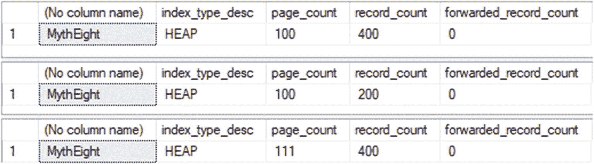

图 8-16：堆重用查询结果

```
USE AdventureWorks2017
GO
IF OBJECT_ID('dbo.MythEight') IS NOT NULL
DROP TABLE dbo.MythEight;
CREATE TABLE dbo.MythEight
(
RowId INT IDENTITY(1,1)
,FillerData VARCHAR(2500)
);
INSERT INTO dbo.MythEight (FillerData)
SELECT TOP 400 REPLICATE('X',2000)
FROM sys.objects;
SELECT OBJECT_NAME(object_id), index_type_desc, page_count, record_count, forwarded_record_count
FROM sys.dm_db_index_physical_stats (DB_ID(), OBJECT_ID('dbo.MythEight'), NULL, NULL, 'DETAILED');
DELETE FROM dbo.MythEight
WHERE RowId % 2 = 0;
SELECT OBJECT_NAME(object_id), index_type_desc, page_count, record_count, forwarded_record_count
FROM sys.dm_db_index_physical_stats (DB_ID(), OBJECT_ID('dbo.MythEight'), NULL, NULL, 'DETAILED');
INSERT INTO dbo.MythEight (FillerData)
SELECT TOP 200 REPLICATE('X',2000)
FROM sys.objects;
SELECT OBJECT_NAME(object_id), index_type_desc, page_count, record_count, forwarded_record_count
FROM sys.dm_db_index_physical_stats (DB_ID(), OBJECT_ID('dbo.MythEight'), NULL, NULL, 'DETAILED');
```

清单 8-19：重用 MythEight 堆中的数据空间

正如针对此误区的演示所示，堆中先前存储数据的空间会被释放，以供表重用。对于有大量数据频繁进出表的堆而言，并没有显著的必要去监控页面重用问题，因此可以认为该误区不准确。对于有大量数据被移除且无意替换数据的堆，你可以使用 `ALTER TABLE ... REBUILD` 来回收空间。该语句的语法和影响将在下一章讨论。

### 误区 9：每个表都应该使用堆/聚集索引

最后一个需要考虑的误区是双重的。一方面，有些人会建议你应该使用堆来构建所有表。另一方面，另一些人会建议你在所有表上创建聚集索引。问题在于，这种观点会排除考虑每种结构能为表带来的好处。这种观点是基于对数据库中存储数据方式的一种近乎教条式的争论，支持或反对某一种方式，却没有考虑实际存储的数据及其使用方式。

一些反对使用聚集索引的论点如下：

*   碎片化会通过额外的 I/O 操作对性能产生负面影响。
*   当触发页拆分时，修改单条记录可能会影响聚集索引中的多条记录。
*   过多的键查找会通过额外的 I/O 操作对性能产生负面影响。

当然，也有一些反对使用堆的论点：

*   过多的转发记录会通过额外的 I/O 操作对性能产生负面影响。
*   移除转发记录需要重建整个表。
*   需要非聚集索引来实现高效的筛选数据访问。
*   堆在数据被移除时不会自动释放页面。

在决定使用聚集索引还是堆时，与两者相关的负面影响并非唯一需要考虑的因素。每种结构都有其优于对方的情况。

例如，聚集索引在以下情况下表现最佳：

*   表的键是唯一的、单调递增的键值。
*   表具有一个唯一性程度高的键列。
*   将通过查询访问表中的数据范围。
*   表中的记录将以高速率插入和删除。

另一方面，堆在以下一些情况下是理想选择：

*   表中的数据仅会使用有限的时间，其中索引创建时间超过数据的查询时间。
*   键值会频繁更改，这反过来会改变记录在索引中的位置。
*   你正在向一个暂存表中插入大量记录。
*   主键是非升序值，例如唯一标识符。

虽然本节没有包含演示为何此误区是错误的，但重要的是要记住，堆和聚集索引都是可用的，并且应该被适当地使用。了解选择哪种索引类型是一个测试的问题，而不是教条的问题。

对于那些属于“为所有表都创建聚集索引阵营”的人，一个很好的参考资料是《Fast Track 数据仓库架构》白皮书（[`https://msdn.microsoft.com/en-us/library/hh918452.aspx`](https://msdn.microsoft.com/en-us/library/hh918452.aspx)）。该白皮书阐述了使用堆可以实现的一些显著性能改进，同时也指出了这些改进效果消失的临界点。它有助于展示 I/O 系统技术（如闪存和基于缓存的设备）的变化如何改变关于堆和聚集索引的模式和实践。这有助于提倡一种观点：应不时地验证那些误区和最佳实践。

## 索引最佳实践

与误区类似的是索引最佳实践。最佳实践应被视为一种默认建议，可以在没有足够信息来验证其他方向时应用。最佳实践并非唯一的选择，而只是在使用任何技术时的一个起点。

当使用他人提供的最佳实践时，例如本章中出现的那些，首先自己进行验证是很重要的。始终对它们持保留态度。你可以相信最佳实践会将你引向正确的方向，但你需要验证遵循该实践是否合适。

鉴于前面的注意事项，在使用索引时可以考虑许多最佳实践。本节将回顾这些最佳实践，并讨论它们是什么以及它们的含义。


### 当前工作负载的索引指南

对数据库进行索引的最重要方面，是依据您**当前**使用数据库的方式，而非过去的方式，也不是基于未来数年的数据预期，而是立足当下。

您为当前需求建立的索引，很可能并非数据库未来所需的索引。因此，第一条最佳实践是：持续审查、分析并实施对环境中索引的更改。请认识到，无论两个数据库多么相似，只要其中的数据和用户群体不同，这两个数据库的索引策略就可能需要有所区别。关于监控和分析索引的详细讨论，请参阅第 13 章和第 14 章。

明确了这一点后，让我们来看看索引的其他最佳实践。

### 默认情况下在主键上使用聚集索引

下一条最佳实践是：默认情况下在`主键`上使用`聚集索引`。这可能看起来与本章提出的第九个误解相悖。第九个误解讨论的是将`聚集索引`还是`堆`作为教条性选择。无论数据库最初采用哪种方式构建，该误解会让你认为，如果你的表设计与此不符，就应该不顾情况地进行更改。此最佳实践建议，将`主键`上使用`聚集索引`作为起点。

默认对表的`主键`进行聚集，会增加索引选择适合该表的可能性。如本章前文所述，`聚集索引`控制着表中数据的存储方式。许多（可能是大多数）`主键`建立在利用`标识属性`的列上，该属性会随着每条新记录添加到表中而递增。为`主键`选择`聚集索引`将提供访问数据的最有效方法。

### 指定填充因子

`填充因子`控制索引构建或碎片整理后，索引数据页上保留的可用空间量。保留此可用空间是为了允许页面上的记录扩展，但存在记录大小变化可能导致`页拆分`的风险。这是用于索引维护的一个极其有用的索引属性。修改`填充因子`可以减轻碎片化的风险。关于`填充因子`的更深入讨论见第 6 章。就最佳实践而言，您需要关注能够在数据库和索引级别设置`填充因子`的能力。

#### 数据库级别的填充因子

如前所述，SQL Server 的特性之一是允许为索引设置默认的`填充因子`。此设置是 SQL Server 范围内的设置，可在 SQL Server 属性的“数据库属性”页面中修改。默认情况下，此值设置为 0，这等同于 100。**不要**将默认`填充因子`修改为 0 或 100 以外的值（0 和 100 效果相同）。这样做会将数据库中每个索引的`填充因子`更改为新值；下次创建、重建或重组索引时，这将为所有索引增加指定数量的可用空间。

表面上看，这似乎是个好主意，但这将盲目地将所有索引的大小增加指定量。索引大小的增加将需要更多的`I/O`来完成与变更前相同的工作。对于许多索引而言，进行此项更改将导致资源不必要的浪费。

#### 索引级别的填充因子

在索引级别，您应修改那些频繁出现严重碎片化的索引的`填充因子`。降低`填充因子`将增加索引中的可用空间量，并提供额外空间以补偿导致碎片化的记录长度变化。在索引级别管理`填充因子`是合适的，因为它提供了根据数据库需求精确调整索引的能力。

### 为外键列创建索引

当在表上创建`外键`时，应为该表中的`外键`列创建索引。这对于辅助`外键`确定父表中哪些记录受约束于被引用表中的每条记录是必要的。这在针对被引用表进行更改时非常重要。被引用表中的更改可能需要检查所有与父表中记录匹配的行。如果不存在索引，则将对该列执行扫描操作。在大型父表上，这可能导致大量的`I/O`操作，并可能引发一些`并发问题`。

此类问题的一个例子是`州`表和`地址`表。`地址`表中可能有数千或数百万条记录，而`州`表中可能有大约一百条记录。`地址`表将包含一个被`州`表引用的列。试想，如果需要删除`州`表中的一条记录。若`地址`表中`外键`列上没有索引，那么`地址`表将如何识别会受删除`州`记录操作影响的行？没有索引，SQL Server 将不得不检查`地址`表中的每一条记录。如果该列有索引，SQL Server 就能够对匹配要从`州`表中删除的值的记录执行`范围扫描`。

通过为`外键`列创建索引，可以避免诸如本节所述的性能问题。`外键`的最佳实践是为其列创建索引。第 11 章包含有关此最佳实践的更多细节和一个代码示例。

### 平衡索引数量

如本书先前所讨论，索引对于提高访问记录中信息的性能极为有用。不幸的是，索引并非没有代价。拥有索引的代价不仅限于数据库内的空间。构建索引时，您需要考虑以下一些因素：

*   记录插入或删除的频率如何？
*   键列更新的频率如何？
*   索引被使用的频率如何？
*   索引支持哪些流程？
*   表上还有多少其他索引？

这些仅是构建索引时需要考虑的首要因素。索引构建后，更新和维护索引将花费多少时间？您修改索引的频率是否会超过索引用于返回查询结果的频率？表中有多少列，索引数量是否超过了列数？

平衡表上索引数量的难点在于，无法推荐一个精确的数字。决定一个表上合理的索引数量是一个**逐表决策**的过程。您不希望索引太少，这可能导致对`聚集索引`或`堆`进行过度扫描以返回结果。同时，表也不应有过多的索引，导致花费在保持索引最新上的时间比回返结果的时间还要多。对于事务处理系统，我的经验法则是：如果一个表上有超过十个索引，那么该表上的索引数量很可能就过多了。


## 总结

本章探讨了围绕索引的一些**常见误解**以及一些**最佳实践**。针对这两个方面，你研究了普遍持有的信念是什么，并了解了围绕每个信念的详细情况。

关于误解，你了解了许多人们普遍相信但事实上并不正确的关于索引的观点。这些误解涵盖了聚集索引、填充因子、索引的列组成等等。如何看待任何可能是误解的关于索引的信念，其关键在于要亲自去**测试**它。

你还了解了最佳实践。本章提供的最佳实践应该是为你数据库构建索引的基础。我定义了什么**是**最佳实践，什么**不是**。然后，我讨论了在为数据库建立索引时可以考虑的若干最佳实践。

# 9. 索引维护

就像生活中的任何事物一样，索引也需要维护。随着时间的推移，索引的性能优势可能会减弱，或者由于数据修改，它们的大小和底层统计信息可能会发生漂移和膨胀。为了防止这些问题，必须对索引进行维护。如果你这样做，你的数据库将保持为一个精简、高效的查询运行机器。

在维护方面，需要考虑五个领域：

- 索引碎片化
- 堆膨胀和转发行
- 列存储索引碎片化
- 统计信息
- 内存中统计信息

每个领域在维护一个索引良好、性能优异的数据库中都扮演着关键角色。

本章将探讨所有这些领域。你将了解不维护索引所带来的问题，并回顾实施维护过程的策略。为了说明碎片化是如何发生的，会提供一些简单的演示。关于统计信息的讨论将扩展第 3 章中讨论的内容，并说明如何更新统计信息以保持其准确性。

## 索引碎片化

第一个可能导致索引性能下降的维护问题是索引碎片化。当索引中的页在物理上不再连续时，就会发生碎片化。

虽然索引碎片化在以前版本的 SQL Server 和旧存储系统中引起过更大的关注，但在 SQL Server 中它仍然值得关注。碎片化导致的主要问题是，由于页被拆分，并且在许多情况下留下一半为空，因此存储索引所需的空间量增加。这种额外的空间会影响数据库在磁盘上使用的空间量、在内存中的占用量，并在 CPU 处理数据时产生影响。

SQL Server 中有几个事件可能导致索引碎片化：

- `INSERT` 操作
- `UPDATE` 操作
- `DELETE` 操作
- `DBCC SHRINKDATABASE` 操作

如你所见，除了从数据库中选择数据之外，几乎你对索引所能做的任何操作都可能导致碎片化。除非你的数据库是只读的，否则你必须注意碎片化问题，并在索引问题变得严重之前解决它。

### 碎片化操作

理解碎片化的最好方式是亲眼看到它发生。在第 3 章中，你研究了动态管理对象 (DMO) `sys.dm_index_physical_stats` 返回的信息。在本节中，你将回顾一些导致碎片化的脚本，然后使用该 DMO 来调查已发生的碎片化程度。

如前所述，当索引中的物理页不连续时，就会发生碎片化。当发生插入操作，并且新行没有放置在索引的末尾时，新行将被放置在一个已经有其他行的页上。如果该页上没有足够的空间容纳新行，那么该页将被拆分——导致索引碎片化。碎片化是索引中页拆分的物理结果。

#### 插入操作

第一个可能导致索引碎片化的操作是 `INSERT` 操作。这通常不被认为是最有可能导致碎片化的操作，但某些数据库设计模式确实会导致碎片化。`INSERT` 操作可能导致碎片化的领域有两个：聚集索引和非聚集索引。

设计聚集索引最常见的模式是将索引放在一个值**始终递增**的单个列上。这通常使用 `int` 数据类型和 `IDENTITY` 属性来实现。当遵循这种模式时，在插入过程中发生碎片化的可能性相对较小。不幸的是，这并不是唯一存在的聚集索引模式，其他模式会导致碎片化。例如，使用业务键或 `uniqueidentifier` 数据类型值通常会导致碎片化。

使用 `uniqueidentifier` 数据类型值的聚集索引通常使用 `NEWID()` 函数来生成一个随机的唯一值作为聚集键。该值是唯一的，但不是始终递增的。最新生成的值可能在前一个值之前，也可能在之后。因此，当将新行插入到聚集索引中时，它很可能被放置在索引中已存在的许多其他行之间。而且，如前所述，如果索引中没有足够的空间，就会发生碎片化。

为了演示使用 `uniqueidentifier` 数据类型值导致的碎片化，请尝试清单 9-1 中的代码。此代码创建一个名为 `dbo.UsingUniqueidentifier` 的表。它用来自 `sys.columns` 的行填充，然后添加一个聚集索引。此时，索引中的所有页在物理上都是连续的。运行清单 9-2 中的代码以查看图 9-1 所示的结果；这些结果显示索引的平均碎片化百分比为 0.00%。

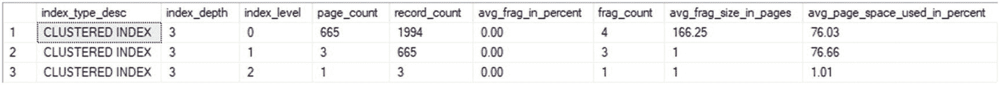
**图 9-1** 初始碎片化结果（结果可能有所不同）

```sql
USE AdventureWorks2017
GO
SELECT index_type_desc
,index_depth
,index_level
,page_count
,record_count
,CAST(avg_fragmentation_in_percent as DECIMAL(6,2)) as avg_frag_in_percent
,fragment_count AS frag_count
,avg_fragment_size_in_pages AS avg_frag_size_in_pages
,CAST(avg_page_space_used_in_percent as DECIMAL(6,2)) as avg_page_space_used_in_percent
FROM sys.dm_db_index_physical_stats(DB_ID(),OBJECT_ID('dbo.UsingUniqueidentifier'),NULL,NULL,'DETAILED')
```
**清单 9-2** 查看插入操作后的索引碎片化

```sql
USE AdventureWorks2017
GO
IF OBJECT_ID('dbo.UsingUniqueidentifier') IS NOT NULL
DROP TABLE dbo.UsingUniqueidentifier;
CREATE TABLE dbo.UsingUniqueidentifier
(
RowID uniqueidentifier CONSTRAINT DF_GUIDValue DEFAULT NEWID()
,Name sysname
,JunkValue varchar(2000)
);
INSERT INTO dbo.UsingUniqueidentifier (Name, JunkValue)
SELECT name, REPLICATE('X', 2000)
FROM sys.columns
CREATE CLUSTERED INDEX CLUS_UsingUniqueidentifier ON dbo.UsingUniqueidentifier(RowID);
```
**清单 9-1** 填充 Uniqueidentifier 表

表构建好并基于 `uniqueidentifier` 数据类型创建聚集索引后，你现在可以向表中执行 `INSERT` 操作，以查看插入对索引的影响。为了演示，使用清单 9-3 中的代码将 `sys.objects` 中的所有行插入到 `dbo.UsingUniqueidentifier` 中。插入之后，你可以使用清单 9-2 再次查看索引的碎片化情况。你的结果应该与图 9-2 所示的类似，该图显示在向表中添加了 689 行之后，索引级别 0 处的聚集索引碎片化超过了 70%。


##### INSERT 操作

```
USE AdventureWorks2017
GO
INSERT INTO dbo.UsingUniqueidentifier (Name, JunkValue)
SELECT name, REPLICATE('X', 2000)
FROM sys.objects
```
**清单 9-3** 向 Uniqueidentifier 表执行 INSERT

正如这个代码示例所示，基于并非始终递增的值建立的聚集索引会导致碎片化。这类行为最典型的例子就是使用 `uniqueidentifier`。当聚集键是计算值或基于业务键时，也可能发生这种情况。在业务键的情况下，如果为订单分配了一个随机的采购订单号，那么该值的行为方式很可能与 `uniqueidentifier` 数据类型值类似。

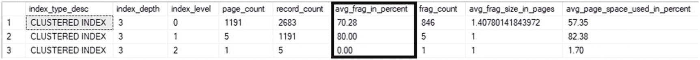

**图 9-2** INSERT 后的碎片化结果（百分比结果可能有所不同）

`INSERT` 操作影响碎片化的另一种方式是通过非聚集索引。虽然聚集索引的值可能是始终递增的，但非聚集索引中的列值不一定具有同样的特性。一个很好的例子是在非聚集索引中为产品名称创建索引。插入表中的下一条记录可能以字母 `M` 开头，因此需要放置到非聚集索引的中间位置。如果该位置没有空间，就会发生页面拆分，从而导致碎片化。

为了演示这种行为，请向你在之前演示中使用的 `dbo.UsingUniqueidentifier` 表添加一个非聚集索引。清单 9-4 显示了新索引的架构。在插入更多记录以查看向非聚集索引插入的影响之前，请再次运行清单 9-2。你的结果应与图 9-3 中的类似。

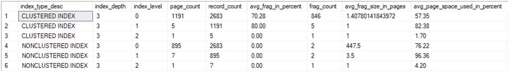

**图 9-3** 非聚集索引碎片化结果

```
USE AdventureWorks2017
GO
CREATE NONCLUSTERED INDEX IX_Name ON dbo.UsingUniqueidentifier(Name) INCLUDE (JunkValue);
```
**清单 9-4** 创建非聚集索引

此时，你需要向 `dbo.UsingUniqueidentifier` 插入更多记录。再次使用清单 9-3 向表中插入更多记录，然后使用清单 9-4 查看非聚集索引中的碎片化状态。完成这些操作后，你的非聚集索引将从没有碎片化变为超过 40% 的碎片化，如图 9-4 所示。

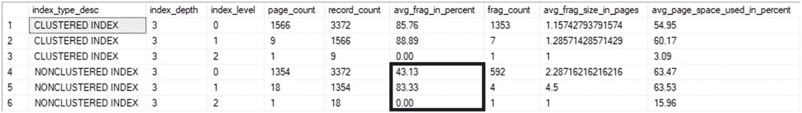

**图 9-4** 非聚集索引在 INSERT 后的碎片化结果

每当执行 `INSERT` 操作时，总有可能以某种方式产生碎片化。这在聚集索引和非聚集索引上都会发生。

##### UPDATE 操作

另一种可能导致碎片化的操作是 `UPDATE` 操作。`UPDATE` 操作主要通过两种方式导致碎片化。首先，记录中的数据不再适合其当前所在的页面。其次，索引的键值发生更改，并且新键值的索引位置不在同一页上，或者不适合记录目标页的空间。在这两种情况下，都会发生页面拆分并产生碎片化。

为了演示这些情况如何导致碎片化，你将首先了解更新时增大记录大小如何导致碎片化。为此，你将创建一个新表并向其中插入多条记录。然后，你将为该表添加一个聚集索引。相关代码如清单 9-5 所示。再次使用清单 9-6 中的脚本，你可以看到聚集索引上没有碎片化，如图 9-5 中的结果所示。关于这些碎片化结果需要注意的一点是，平均页面空间使用率接近 90%。因此，记录大小的任何显著增长都可能填满页面上的可用空间。

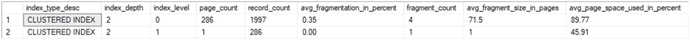

**图 9-5** 初始的 UPDATE 碎片化结果

```
USE AdventureWorks2017
GO
SELECT index_type_desc
,index_depth
,index_level
,page_count
,record_count
,CAST(avg_fragmentation_in_percent as DECIMAL(6,2)) as avg_fragmentation_in_percent
,fragment_count
,avg_fragment_size_in_pages
,CAST(avg_page_space_used_in_percent as DECIMAL(6,2)) as avg_page_space_used_in_percent
FROM sys.dm_db_index_physical_stats(DB_ID(),OBJECT_ID('dbo.UpdateOperations'),NULL,NULL,'DETAILED')
```
**清单 9-6** 查看 UPDATE 操作的索引碎片化

```
USE AdventureWorks2017
GO
IF OBJECT_ID('dbo.UpdateOperations') IS NOT NULL
DROP TABLE dbo.UpdateOperations;
CREATE TABLE dbo.UpdateOperations
(
RowID int IDENTITY(1,1)
,Name sysname
,JunkValue varchar(2000)
);
INSERT INTO dbo.UpdateOperations (Name, JunkValue)
SELECT name, REPLICATE('X', 1000)
FROM sys.columns
CREATE CLUSTERED INDEX CLUS_UsingUniqueidentifier ON dbo.UpdateOperations(RowID);
```
**清单 9-5** 为 UPDATE 操作创建表

现在，增大索引中某些行的大小。为此，请执行清单 9-7 中的代码。这段代码将把每五行记录的 `JunkValue` 列从 1000 个字符的值更新为 2000 个字符的值。使用清单 9-2 查看当前索引碎片化情况，你可以从图 9-6 的结果中看到，聚集索引现在碎片化超过 99%，平均页面空间使用率下降到约 50%。正如这段代码所示，当行在 `UPDATE` 操作期间增大时，可能会产生大量的碎片化。

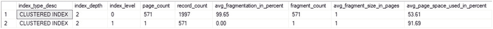

**图 9-6** 记录长度增加后的 UPDATE 碎片化结果

```
USE AdventureWorks2017
GO
UPDATE dbo.UpdateOperations
SET JunkValue = REPLICATE('X', 2000)
WHERE RowID % 5 = 1
```
**清单 9-7** 为 UPDATE 操作创建表

如前所述，索引产生碎片化的第二种方式是更改索引的键值。当索引的键值更改时，记录可能需要更改其在索引中的位置。例如，如果索引是基于产品名称建立的，那么将名称从 "Acme Mop" 更改为 "XYZ Mop" 将改变该产品名称在索引排序中的位置。在索引中更改记录的位置可能会将记录放置在不同的页面上，如果新页面上没有足够的空间，则可能发生页面拆分和碎片化。

为了演示这个概念，请执行清单 9-8，然后使用清单 9-6 获取图 9-7 所示的结果。你将看到，对于新的非聚集索引，没有碎片化。


### 注意

如果聚集索引的关键值经常发生变化，这可能表明所选的聚集索引关键值并不合适。

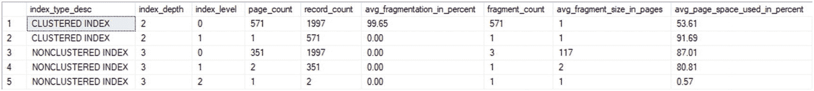

图 9-7：添加非聚集索引后的 UPDATE 碎片化结果

```sql
USE AdventureWorks2017
GO
CREATE NONCLUSTERED INDEX IX_Name ON dbo.UpdateOperations(Name) INCLUDE (JunkValue);
```

代码清单 9-8：为 UPDATE 操作创建非聚集索引

此时，你需要修改一些关键值。使用代码清单 9-9，对表执行 `UPDATE` 操作，并每九行更新一行。为了模拟更改关键值，`UPDATE` 语句会反转列中的字符。这种少量的操作就足以导致大量的碎片化。如图 9-8 所示，非聚集索引从无碎片变成了超过 30% 的碎片。

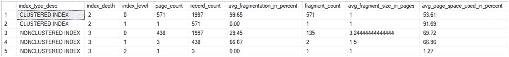

图 9-8：更改索引关键值后的 UPDATE 碎片化结果

需要注意的一点是，聚集索引上的碎片并未因这些更新而改变。并非所有更新都会导致碎片——只有那些因为记录当前所在页面的空间不足而导致数据移动的更新才会如此。

```sql
USE AdventureWorks2017
GO
UPDATE dbo.UpdateOperations
SET Name = REVERSE(Name)
WHERE RowID % 9 = 1
```

代码清单 9-9：用于更改索引关键值的 UPDATE 操作

##### Delete 操作

导致碎片化的第三种操作是 `DELETE` 操作。删除在本质上有点不同，因为它会在数据库内部产生碎片。删除不会因为页面拆分而重新定位页面，但可能导致页面从索引中被移除。这将在索引的页面物理顺序中产生间隙。由于页面不再物理连续，因此被视为碎片——特别是因为一旦页面从索引中释放，它们就可以被重新分配给其他索引，形成一种更传统的碎片形式。

为了演示这种行为，创建一个表，向其填充一些记录，然后添加一个聚集索引。代码清单 9-10 展示了完成这些任务的脚本。运行该脚本，然后运行代码清单 9-11 中的脚本以获取聚集索引当前的碎片情况。你的结果应与图 9-9 中的匹配。从平均碎片百分比列 (`avg_fragmentation_in_percent`) 可以看出，目前索引中没有碎片。

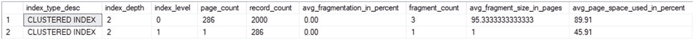

图 9-9：DELETE 操作前的碎片化结果

```sql
USE AdventureWorks2017
GO
SELECT index_type_desc
,index_depth
,index_level
,page_count
,record_count
,CAST(avg_fragmentation_in_percent as DECIMAL(6,2)) as avg_fragmentation_in_percent
,fragment_count
,avg_fragment_size_in_pages
,CAST(avg_page_space_used_in_percent as DECIMAL(6,2)) as avg_page_space_used_in_percent
FROM sys.dm_db_index_physical_stats(DB_ID(),OBJECT_ID('dbo.DeleteOperations'),NULL,NULL,'DETAILED')
```

代码清单 9-11：查看 DELETE 索引碎片

```sql
USE AdventureWorks2017
GO
IF OBJECT_ID('dbo.DeleteOperations') IS NOT NULL
DROP TABLE dbo.DeleteOperations;
CREATE TABLE dbo.DeleteOperations
(
RowID int IDENTITY(1,1)
,Name sysname
,JunkValue varchar(2000)
);
INSERT INTO dbo.DeleteOperations (Name, JunkValue)
SELECT name, REPLICATE('X', 1000)
FROM sys.columns
CREATE CLUSTERED INDEX CLUS_UsingUniqueidentifier ON dbo.DeleteOperations(RowID);
```

代码清单 9-10：为 DELETE 操作创建表

现在，为了演示由 `DELETE` 操作引起的碎片，你将使用代码清单 9-12 中的代码删除表中每隔 50 条记录中的其他 50 条记录。和之前一样，你将使用代码清单 9-11 来查看索引中的碎片状态。如图 9-10 所示的结果表明，`DELETE` 操作导致了大约 13% 的碎片。对于 `DELETE` 操作，碎片产生的速度通常不会太快。此外，由于碎片不是页面拆分的结果，页面的顺序不会在物理上变得无序。相反，是连续页面之间出现了间隙。但是，留下的空页面可能会在未来的 `INSERT` 和 `UPDATE` 事务中被重用，这可能导致这些页面随后在物理上变得无序。

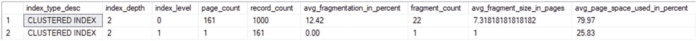

图 9-10：DELETE 后的碎片化结果

```sql
USE AdventureWorks2017
GO
DELETE dbo.DeleteOperations
WHERE RowID % 100 BETWEEN 1 AND 50
```

代码清单 9-12：执行 DELETE 操作

关于 `DELETE` 操作的最后一点注意事项是，碎片可能不会在 `DELETE` 操作后立即显现。当记录要被删除时，它们首先被标记为删除，然后记录本身才被实际删除。在标记为删除期间，该记录被视为幽灵记录。在此阶段，记录在逻辑上已被删除，但在物理上仍然存在于索引中。在未来的某个时间点，在事务提交且 `CHECKPOINT` 完成后，幽灵清理进程将物理删除该行。此时，碎片将显示在索引中。


##### 收缩操作

导致碎片化的最后一类操作是数据库收缩。数据库可以使用 `DBCC SHRINKDATABASE` 或 `DBCC SHRINKFILE` 命令进行收缩。这些操作可用于减小数据库或其数据文件的大小。当执行这些操作时，数据文件末尾的页会被重新定位到文件的起始部分。就其预期目的而言，收缩操作可以是一种有效的工具。

不幸的是，这些收缩操作并未考虑被移动数据页的性质。对于收缩操作来说，数据页就是数据页。该操作的优先级是为数据文件末尾的页在文件开头找到位置。如前所述，当索引的页在物理上未按顺序存储时，该索引就被视为存在碎片化。

为了演示收缩操作可能造成的碎片化损害，你将创建一个数据库并在其上执行收缩操作；相关代码见清单 9-14。在此示例中，有两个表：`FirstTable` 和 `SecondTable`。将向每个表插入一些记录。插入操作将交替进行，先向 `FirstTable` 插入三条记录，再向 `SecondTable` 插入两条记录。通过这些插入操作，将为两个表分配交替的页带。接下来，`SecondTable` 将被删除，这将在 `FirstTable` 的每个页带之间留下未分配的数据页。再次使用清单 9-13 查询将显示 `FirstTable` 上存在少量碎片，如图 9-11 所示。

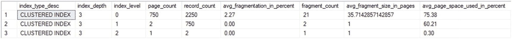

图 9-11
插入操作后 FirstTable 的碎片情况

```
USE master
GO
IF EXISTS (SELECT * FROM sys.databases WHERE name = 'Fragmentation')
DROP DATABASE Fragmentation
GO
CREATE DATABASE Fragmentation
GO
Use Fragmentation
GO
IF OBJECT_ID('dbo.FirstTable') IS NOT NULL
DROP TABLE dbo.FirstTable;
CREATE TABLE dbo.FirstTable
(
RowID int IDENTITY(1,1)
,Name sysname
,JunkValue varchar(2000)
,CONSTRAINT PK_FirstTable PRIMARY KEY CLUSTERED (RowID)
);
INSERT INTO dbo.FirstTable (Name, JunkValue)
SELECT TOP 750 name, REPLICATE('X', 2000)
FROM sys.columns
IF OBJECT_ID('dbo.SecondTable') IS NOT NULL
DROP TABLE dbo.SecondTable;
CREATE TABLE dbo.SecondTable
(
RowID int IDENTITY(1,1)
,Name sysname
,JunkValue varchar(2000)
,CONSTRAINT PK_SecondTable PRIMARY KEY CLUSTERED (RowID)
);
INSERT INTO dbo.SecondTable (Name, JunkValue)
SELECT TOP 750 name, REPLICATE('X', 2000)
FROM sys.columns
GO
INSERT INTO dbo.FirstTable (Name, JunkValue)
SELECT TOP 750 name, REPLICATE('X', 2000)
FROM sys.columns
GO
INSERT INTO dbo.SecondTable (Name, JunkValue)
SELECT TOP 750 name, REPLICATE('X', 2000)
FROM sys.columns
GO
INSERT INTO dbo.FirstTable (Name, JunkValue)
SELECT TOP 750 name, REPLICATE('X', 2000)
FROM sys.columns
GO
IF OBJECT_ID('dbo.SecondTable') IS NOT NULL
DROP TABLE dbo.SecondTable;
GO
清单 9-14
收缩操作数据库准备脚本
```

```
Use Fragmentation
GO
SELECT index_type_desc
,index_depth
,index_level
,page_count
,record_count
,CAST(avg_fragmentation_in_percent as DECIMAL(6,2)) as avg_fragmentation_in_percent
,fragment_count
,avg_fragment_size_in_pages
,CAST(avg_page_space_used_in_percent as DECIMAL(6,2)) as avg_page_space_used_in_percent
FROM sys.dm_db_index_physical_stats(DB_ID(),OBJECT_ID('dbo.FirstTable'),NULL,NULL,'DETAILED')
清单 9-13
查看由收缩操作导致的索引碎片
```

准备好数据库后，下一步是收缩数据库，目的是回收 `SecondTable` 已分配的空间，并将数据库的大小精简到仅需的大小。要执行收缩操作，请使用清单 9-15 中的代码。当 `SHRINKDATABASE` 操作完成后，你可以从图 9-12 中看到，运行清单 9-13 的代码导致索引的碎片率从略高于 2% 增加到超过 35%。对于一个只有一张表的数据库来说，这是一个显著的碎片率变化。试想一下收缩操作对拥有数十个、数百个或数千个索引的数据库的影响。

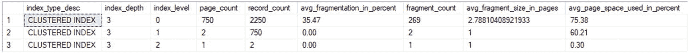

图 9-12
收缩操作后 FirstTable 的碎片情况

```
DBCC SHRINKDATABASE (Fragmentation)
清单 9-15
收缩操作
```

这是一个关于收缩操作可能对索引造成碎片化损害的简单示例。即使在这个示例中也很明显，收缩操作导致了显著的碎片。大多数 SQL Server 数据库管理员会同意，收缩操作应该是任何数据库上极其罕见的操作。许多 DBA 也认为，在任何情况下都不应在任何数据库上使用此操作。最常被推荐的准则是，在执行收缩数据库操作时要极其谨慎。此外，不要陷入这样的循环：收缩数据库以回收空间，导致碎片化，然后通过碎片整理索引来扩展数据库。这只是浪费时间和资源，而这些资源本可以更好地用于解决真正的性能和维护问题。

### 碎片变体

传统上，当人们讨论索引碎片时，主要关注点是聚集索引或非聚集索引内部的碎片。这并不是考虑索引碎片时需要记住的唯一因素。你还需要考虑表或索引是否存在膨胀、转发行或分段，每一种都是索引碎片概念的变体。在本节中，我们将回顾另外两个可能需要在表上进行碎片化维护的领域：

*   堆膨胀与转发行

*   列存储碎片


#### 堆膨胀与转发

我们将要探讨的第一个领域是堆膨胀和转发。如第 3 章所述，堆是无序页面的集合，其中存储着表的数据。随着新行被添加到表中，堆会增长，并分配新的页面。插入和更新操作可能导致堆发生变化，从而可能需要对表进行维护。

首先，我们来看堆内部的膨胀。对于堆，当记录从堆中删除而没有被新记录重用时，就会发生膨胀。如第 8 章所讨论的，这并不是记录转移到新页面的问题，而是表中记录总数的下降。这些页面会被重用，但当它们没有被重用时，页面会保持分配状态，这可能会影响性能。

为了演示这一活动，让我们回顾清单 9-16 中的脚本。脚本开始时，一个堆表中插入了 400 条记录，然后删除了一半的记录，表中剩下 200 条记录。如图 9-13 所示，表的记录数反映了这些变化，但在这两种情况下，DMV 结果都显示有 100 个页面与该表相关联。这是因为除非维护活动强制执行，否则页面不会从堆中移除。通过使用`REBUILD`选项对`dbo.HeapTable`执行`ALTER TABLE`语句，表被重建，多余的页面被清除。

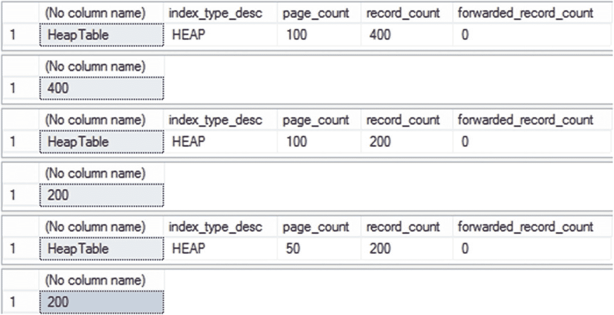

#### 图 9-13

从堆中删除记录的结果

```sql
USE AdventureWorks2017
GO
IF OBJECT_ID('dbo.HeapTable') IS NOT NULL
DROP TABLE dbo.HeapTable;
CREATE TABLE dbo.HeapTable
(
RowId INT IDENTITY(1,1)
,FillerData VARCHAR(2500)
);
INSERT INTO dbo.HeapTable (FillerData)
SELECT TOP 400 REPLICATE('X',2000)
FROM sys.objects;
SELECT OBJECT_NAME(object_id), index_type_desc, page_count, record_count, forwarded_record_count
FROM sys.dm_db_index_physical_stats (DB_ID(),OBJECT_ID('dbo.HeapTable'),NULL,NULL,'DETAILED');
SET STATISTICS IO ON;
SELECT COUNT(*) FROM dbo.HeapTable;
SET STATISTICS IO OFF;
DELETE FROM dbo.HeapTable
WHERE RowId % 2 = 0;
SELECT OBJECT_NAME(object_id), index_type_desc, page_count, record_count, forwarded_record_count
FROM sys.dm_db_index_physical_stats (DB_ID(),OBJECT_ID('dbo.HeapTable'),NULL,NULL,'DETAILED');
SET STATISTICS IO ON;
SELECT COUNT(*) FROM dbo.HeapTable;
SET STATISTICS IO OFF;
ALTER TABLE dbo.HeapTable REBUILD;
SELECT OBJECT_NAME(object_id), index_type_desc, page_count, record_count, forwarded_record_count
FROM sys.dm_db_index_physical_stats (DB_ID(),OBJECT_ID('dbo.HeapTable'),NULL,NULL,'DETAILED');
SET STATISTICS IO ON;
SELECT COUNT(*) FROM dbo.HeapTable;
SET STATISTICS IO OFF;
```

#### 清单 9-16
删除操作对堆页面分配的影响

为了强调这些页面仍然存在于表中，图 9-14 展示了在统计表中所有行时读取的页面，进一步证明有 100 个页面被访问。在考虑删除操作后堆对性能的影响时，如果堆中的页面数量相对于数据量过多，这将增加 SQL Server 执行查询所需的工作量。在这个演示案例中，`COUNT(*)`查询处理的数据量是实际所需数据量的两倍。

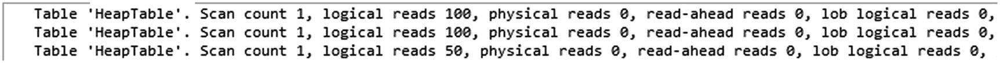

#### 图 9-14

删除操作对堆的 I/O 影响

堆维护的另一个考虑领域是表中转发记录的数量。转发记录（在第 3 章讨论过）是堆中不再适合其最初添加位置的记录。为了适应记录大小的变化，该记录被存储在另一个页面上，而原来的记录位置包含一个指向新位置的指针。

这种变化的影响是增加了堆中的页面数量，因为为现有记录添加了新页面，并且在查找记录时需要额外的 I/O 操作才能从原始页面转到转发页面。虽然这可能看起来不是一个巨大的问题，但总体上，转发记录累积的影响增加了系统的 I/O 量，并增加了查询执行的延迟。

为了演示转发记录对查询的影响，请执行清单 9-17 中的代码。该脚本创建一个带有堆的表，运行一系列查询，更新记录以导致堆记录发生转发，然后通过重新执行之前的一系列查询来完成。

```sql
SET NOCOUNT ON
IF OBJECT_ID('dbo.ForwardedRecords') IS NOT NULL
DROP TABLE dbo.ForwardedRecords;
CREATE TABLE dbo.ForwardedRecords
(
ID INT IDENTITY(1,1)
,VALUE VARCHAR(8000)
);
CREATE NONCLUSTERED INDEX IX_ForwardedRecords_ID ON dbo.ForwardedRecords(ID);
INSERT INTO dbo.ForwardedRecords (VALUE)
SELECT REPLICATE(type, 500)
FROM sys.objects;
SET STATISTICS IO ON
PRINT '*** No forwarded records'
SELECT * FROM dbo.ForwardedRecords;
SELECT * FROM dbo.ForwardedRecords
WHERE ID = 40;
SELECT * FROM dbo.ForwardedRecords
WHERE ID BETWEEN 40 AND 60;
SET STATISTICS IO OFF
UPDATE dbo.ForwardedRecords
SET VALUE =REPLICATE(VALUE, 16)
WHERE ID%3 = 1;
SET STATISTICS IO ON
PRINT '*** With forwarded records'
SELECT * FROM dbo.ForwardedRecords;
SELECT * FROM dbo.ForwardedRecords
WHERE ID = 40;
SELECT * FROM dbo.ForwardedRecords
WHERE ID BETWEEN 40 AND 60;
SET STATISTICS IO OFF
```

#### 清单 9-17
转发记录对查询性能的影响

清单 9-17 中包含三个查询，用以演示转发记录对堆的影响：

*   `SELECT *`：演示索引扫描的影响
*   带等值谓词的`SELECT`：演示单例查找的影响
*   带不等值谓词的`SELECT`：演示范围查找的影响

对于`SELECT *`查询，在转发记录出现在堆中之前，查询执行时读取 99 次，如图 9-15 所示。引入转发记录后，读取次数增加到 561 次。这种增加是由于为适应行大小的增加而向堆中添加了新页面。对于第二个查询，单例查找从三次读取增长到四次读取，这表示需要额外一次读取来从记录的原始位置转到转发位置。在最后一个查询中，带查找的范围查询执行时读取 23 次，但在向表中添加转发记录后，读取次数跃升至 30 次。

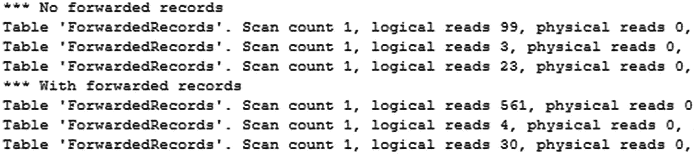

#### 图 9-15

转发记录查询的 I/O 统计信息

转发记录的总体影响是读取次数的增加。虽然单次查询的增加可能不显著，但随着时间的推移，累积的影响会逐渐增大。对带有转发记录的堆进行扫描需要访问更多的页面，而查找则需要额外的 I/O 操作。减少堆中转发记录的影响是维护索引和保持性能的重要组成部分。


# 列存储碎片化

列存储索引是 SQL Server 较新的功能之一。列存储索引的一个有趣特性是其段的只读性质。如第 2 章所述，当新的列存储索引被添加到增量表时，增量表最终会被压缩成列存储格式。此外，由于段是只读的，删除操作不会立即影响段，这导致包含不再属于表中数据的只读段碎片产生。

为了演示这两个概念，请执行代码清单 9-18 中的代码来准备一个具有聚集列存储索引的表。表建立后，将插入两组行。第一组包含 1,000 行，然后重新组织索引以强制行组压缩为列存储格式。第二组包含 105,000 行，超过了自动触发使用列存储格式的 104,000 阈值。如图 9-16 所示，插入的记录全部被压缩为列存储格式。

### 注意

根据你的环境，代码清单 9-18 中的脚本可能需要运行一段时间。

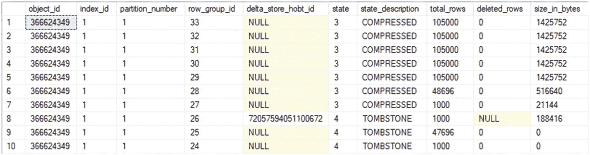

图 9-16 列存储行组结果集

```sql
USE ContosoRetailDW
GO
IF OBJECT_ID('dbo.FactOnlineSalesCI') IS NOT NULL
DROP TABLE dbo.FactOnlineSalesCI
CREATE TABLE dbo.FactOnlineSalesCI(
[OnlineSalesKey] [int] NOT NULL,
[DateKey] [datetime] NOT NULL,
[StoreKey] [int] NOT NULL,
[ProductKey] [int] NOT NULL,
[PromotionKey] [int] NOT NULL,
[CurrencyKey] [int] NOT NULL,
[CustomerKey] [int] NOT NULL,
[SalesOrderNumber] nvarchar NOT NULL,
[SalesOrderLineNumber] [int] NULL,
[SalesQuantity] [int] NOT NULL,
[SalesAmount] [money] NOT NULL,
[ReturnQuantity] [int] NOT NULL,
[ReturnAmount] [money] NULL,
[DiscountQuantity] [int] NULL,
[DiscountAmount] [money] NULL,
[TotalCost] [money] NOT NULL,
[UnitCost] [money] NULL,
[UnitPrice] [money] NULL,
[ETLLoadID] [int] NULL,
[LoadDate] [datetime] NULL,
[UpdateDate] [datetime] NULL
)
INSERT INTO dbo.FactOnlineSalesCI
SELECT *
FROM dbo.FactOnlineSales
CREATE CLUSTERED COLUMNSTORE INDEX FactOnlineSalesCI_CCI ON dbo.FactOnlineSalesCI
DECLARE @we int= 1
WHILE @we <= 5
BEGIN
INSERT INTO dbo.FactOnlineSalesCI
SELECT TOP 1000 *
FROM dbo.FactOnlineSales
ALTER INDEX ALL ON dbo.FactOnlineSalesCI REORGANIZE
WITH (COMPRESS_ALL_ROW_GROUPS =ON)
SET @we += 1
END
WHILE @we <= 10
BEGIN
INSERT INTO dbo.FactOnlineSalesCI
SELECT TOP 105000 *
FROM dbo.FactOnlineSales
SET @we += 1
END
SELECT*
FROM sys.column_store_row_groups
WHERE object_id=OBJECT_ID('dbo.FactOnlineSalesCI')
ORDER BY row_group_id DESC
```
代码清单 9-18 准备列存储表

此时有趣的一点是，创建的行组远小于行组的最大大小（约 1 百万行）。由于它们较小，可能有机会通过增加每个行组的记录数来优化它们使用的页数。这可以通过维护列存储索引并重建它来实现。为了展示重建列存储索引的价值，请执行代码清单 9-19 中的代码。通过这个，你可以看到重建前的逻辑读取在两次扫描操作中为 83,423，然后在重建后下降到 833 次逻辑读取，如图 9-17 所示。这几乎是访问页数减少了 100%。如果你考虑这种类型的维护对使用列存储索引的大型事实表的影响，这类页的过度分配将极大地影响性能。此外，比较图 9-16 和 9-18，表在重建列存储索引后行组也少得多，从 34 个减少到 14 个。

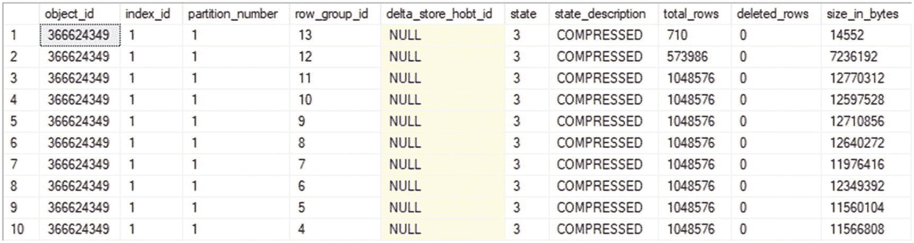

图 9-18 列存储索引重建后的行组统计信息

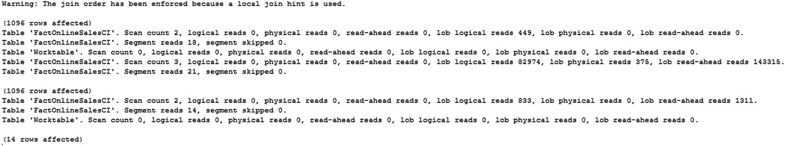

图 9-17 列存储表插入操作的 I/O 统计信息

```sql
USE ContosoRetailDW
GO
SET STATISTICS IO ON
SELECT DateKey,COUNT(*)
FROM dbo.FactOnlineSalesCI
GROUP BY DateKey
ALTER INDEX ALL ON dbo.FactOnlineSalesCI REBUILD
SELECT DateKey,COUNT(*)
FROM dbo.FactOnlineSalesCI
GROUP BY DateKey
SET STATISTICS IO OFF
SELECT *
FROM sys.column_store_row_groups
WHERE object_id = OBJECT_ID('dbo.FactOnlineSalesCI')
ORDER BY row_group_id DESC
```
代码清单 9-19 插入操作对列存储表的影响

列存储索引发生的另一种碎片化类型是通过删除操作。虽然这被称为*碎片化*，但实际上当对列存储索引执行删除时，行并不会从索引中移除；它们只是被标记为已删除。因此，分配给聚集列存储索引的页，如果其所有记录都被删除，仍将在索引中保持活动状态。

为了展示其影响，你将使用代码清单 9-20 中的脚本从表中删除所有 2007 年的数据。然后，另一个语句将重建列存储索引。在这些操作之间，你将运行一个聚合查询，以观察删除操作对查询 I/O 的影响。

```sql
USE ContosoRetailDW
GO
SET STATISTICS IO ON
SELECT DateKey,COUNT(*)
FROM dbo.FactOnlineSalesCI
GROUP BY DateKey
DELETE FROM dbo.FactOnlineSalesCI
WHERE DateKey <'2008-01-01'
SELECT DateKey,COUNT(*)
FROM dbo.FactOnlineSalesCI
GROUP BY DateKey
ALTER INDEX ALL ON dbo.FactOnlineSalesCI REBUILD
SELECT DateKey,COUNT(*)
FROM dbo.FactOnlineSalesCI
GROUP BY DateKey
SET STATISTICS IO OFF
```
代码清单 9-20 对聚集列存储索引的删除操作

运行这些查询并重建索引后，结果相当有趣。如果从第一个查询开始，聚合查询有 659 次逻辑读取，如图 9-19 所示。删除一年的数据后，聚合查询需要 79,982 次逻辑读取，这比返回行数少 365 行的原始查询还要多。这是因为管理已删除行所需的页增加了。重建后，I/O 次数显著下降到 444 次逻辑读取。

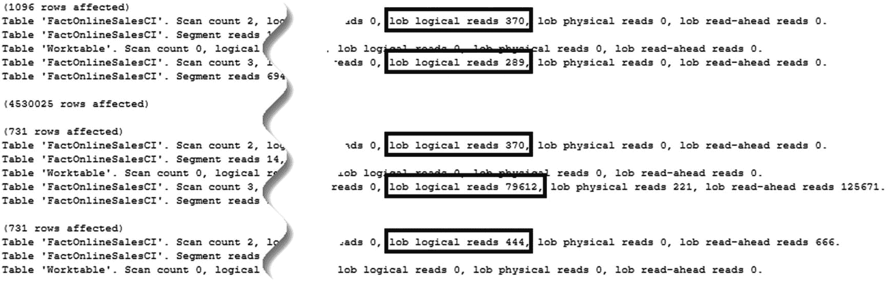

图 9-19 删除操作演示的统计 I/O 结果

通过添加新行和删除现有行，有理由考虑列存储索引的维护需求。影响这些索引的问题与传统聚集索引的不同，但它们同样重要。

### 碎片化问题

你已经看到了索引可能碎片化的多种方式，但还没有讨论为什么这很重要。索引内的碎片化可能成为问题有几个重要原因：

*   索引 I/O

*   连续读取

随着索引碎片化的增加，这两个方面都会影响索引的性能表现。在一些最坏的情况下，碎片化程度可能非常严重，以至于查询优化器将停止在查询计划中使用该索引。


# 索引 I/O

I/O 是 SQL Server 中容易出现性能瓶颈的一个领域；同样，也有多种解决方案可以帮助缓解这些瓶颈。从本章的角度来看，您关注的是碎片化对 I/O 的影响。

由于页拆分通常是导致碎片化的原因，它们为开始研究碎片化对 I/O 的影响提供了一个很好的切入点。回顾一下，当发生页拆分时，页面上一半的内容会被移出该页面并移动到另一个页面上。一般来说，如果原始页面是 100% 满的，那么拆分后的两个页面都会大约 50% 满。本质上，从存储中读取相同数量的信息（在页拆分之前只需一次 I/O）现在将需要两次 I/O。这种 I/O 的增加会推高读取和写入操作，从而可能对性能产生负面影响。

为了验证碎片化对 I/O 的这种影响，让我们逐步分析另一个碎片化示例。这次您将创建一个表，填充一些数据，并执行更新以生成页拆分和碎片化。清单 9-22 中的代码将执行这些操作。该脚本的最后部分将查询 `sys.dm_db_partition_stats` 以返回已为索引保留的页数。执行清单 9-21 中的碎片化脚本。您会看到此时索引的碎片化程度超过 99%，而清单 9-14 的结果显示索引使用了 209 页。结果请参见图 9-20。


图 9-20: `CLUS_IndexIO` 的碎片化情况

```sql
USE AdventureWorks2017
GO
IF OBJECT_ID('dbo.IndexIO') IS NOT NULL
DROP TABLE dbo.IndexIO;
CREATE TABLE dbo.IndexIO
(
RowID int IDENTITY(1,1)
,Name sysname
,JunkValue varchar(2000)
);
INSERT INTO dbo.IndexIO (Name, JunkValue)
SELECT name, REPLICATE('X', 1000)
FROM sys.columns
CREATE CLUSTERED INDEX CLUS_IndexIO ON dbo.IndexIO(RowID);
UPDATE dbo.IndexIO
SET JunkValue = REPLICATE('X', 2000)
WHERE RowID % 5 = 1
SELECT we.name, ps.in_row_reserved_page_count
FROM sys.indexes we
INNER JOIN sys.dm_db_partition_stats ps ON we.object_id = ps.object_id AND we.index_id = ps.index_id
WHERE we.name = 'CLUS_IndexIO'
```

清单 9-22: 构建索引 I/O 示例的脚本

```sql
SELECT index_type_desc
,index_depth
,index_level
,page_count
,record_count
,CAST(avg_fragmentation_in_percent as DECIMAL(6,2)) as avg_fragmentation_in_percent
,fragment_count
,avg_fragment_size_in_pages
,CAST(avg_page_space_used_in_percent as DECIMAL(6,2)) as avg_page_space_used_in_percent
FROM sys.dm_db_index_physical_stats(DB_ID(),OBJECT_ID('dbo.IndexIO'),NULL,NULL,'DETAILED')
```

清单 9-21: 查看索引 I/O 示例的碎片化情况

但是，从索引中移除碎片化会对索引中的页数产生显著影响吗？正如演示将展示的那样，减少碎片化确实会产生影响。

接下来要做的是从索引中移除碎片化。为此，请执行清单 9-23 中的 `ALTER INDEX` 语句以移除碎片化。在本章的剩余部分，我们将讨论从索引中移除碎片化的机制，因此目前暂不解释此语句。该命令的效果是索引中的所有碎片化都已被移除。图 9-21 显示了清单 9-23 的结果。结果显示，索引使用的页数从 585 页减少到了 417 页。移除碎片化的效果是显著的，索引中的页数减少了近 30%。


图 9-21: 重建操作后的页数

```sql
USE AdventureWorks2017
GO
ALTER INDEX CLUS_IndexIO ON dbo.IndexIO REBUILD
SELECT we.name, ps.in_row_reserved_page_count
FROM sys.indexes we
INNER JOIN sys.dm_db_partition_stats ps ON we.object_id = ps.object_id AND we.index_id = ps.index_id
WHERE we.name = 'CLUS_IndexIO'
```

清单 9-23: 重建索引以移除碎片化的脚本

这证明碎片化会对索引中的页数产生影响。索引中的页数越多，获取所需数据所需的读取操作就越多。减少页数有助于让 SQL Server 数据库在相同的读取次数内处理更多数据，或者通过减少页数来提高读取相同信息的速度。

# 连续读取

碎片化对性能的另一个负面影响与连续读取有关。在 SQL Server 中，连续读取会影响其利用预读操作的能力。预读允许 SQL Server 请求预计将会使用的页面进入内存。SQL Server 不必等待为页面生成 I/O 请求，而是可以将大块页面读入内存，预期这些数据页将在未来被查询使用。

回到索引，我们之前讨论过索引内的碎片化是如何因索引中物理数据页连续性的中断而产生的。每当物理页出现中断时，I/O 操作就必须改变从 SQL Server 读取数据的位置。这就是碎片化如何对连续读取造成阻碍的。

## 碎片整理选项

SQL Server 提供了多种方法来移除或缓解索引中的碎片化。每种方法都有其相关的优点和缺点。在本节中，您将了解这些选项以及选择每种选项的原因。

# 索引重建

从索引中移除碎片化的第一种方法是重建索引。重建索引会构建索引的一个新的、连续的副本。当新索引完成后，现有索引会被删除。索引重建操作通过 `CREATE INDEX` 或 `ALTER INDEX` 语句完成。通常，碎片化程度超过 30% 的索引被认为是重建索引的良好候选对象。请注意，在大多数数据库中，碎片化程度在 30% 及以下通常不会对性能产生大的负面影响。使用 30% 是一个很好的起点，但如果性能在索引碎片化低于 30% 时显示出更显著的负面影响，则应审查并调整每个数据库和索引的使用情况。

执行索引重建的主要好处是，最终得到的新索引具有连续的页面。当索引高度碎片化时，有时解决碎片化问题的最佳方法就是简单地从头开始重建索引。重建索引的另一个好处是，可以在重建过程中修改索引选项。最后，对于大多数索引，在重建过程中索引可以保持在线状态。

### 注意

自 SQL Server 2012 起，包含 `varchar(max)`、`nvarchar(max)`、`varbinary(max)` 和 `XML` 数据类型的聚集索引可以在线重建。当聚集索引包含以下数据类型时，仍然无法在线重建：`image`、`ntext` 或 `text`。此外，在线重建仅限于 SQL Server 企业版、开发版和评估版。另外，在线重建需要索引双倍的空间，因为新旧版本的索引都需要存在以完成重建，这对于较大的表可能是个问题。

重建索引的第一种选择是使用 `CREATE INDEX` 语句，如代码清单 9-24 所示。这是通过使用 `DROP_EXISTING` 索引选项实现的。选择 `CREATE INDEX` 选项而非 `ALTER INDEX` 有以下几个原因：

*   需要更改索引定义，例如需要添加或删除列，或者需要更改列的顺序。
*   需要将索引从一个文件组移动到另一个文件组。
*   需要修改索引分区。

```sql
CREATE [ UNIQUE ] [ CLUSTERED | NONCLUSTERED ] INDEX index_name
ON  ( column [ ASC | DESC ] [ ,...n ] )
[ INCLUDE ( column_name [ ,...n ] ) ]
[ WHERE  ]
[ WITH (  [ ,...n ] ) ]
[ ON { partition_scheme_name ( column_name )
| filegroup_name
| default
}
]
[ FILESTREAM_ON { filestream_filegroup_name | partition_scheme_name | "NULL" } ]
[ ; ]
 ::=
DROP_EXISTING = { ON | OFF }
| ONLINE = { ON | OFF }
| RESUMABLE = {ON | OF }
| MAX_DURATION =  [MINUTES]
```
代码清单 9-24：使用 `CREATE INDEX` 重建索引

另一种选择是使用 `ALTER INDEX` 语句，如代码清单 9-25 所示。此选项在语法中使用了 `REBUILD` 选项。从概念上讲，这与 `CREATE INDEX` 语句完成的工作相同，但具有以下优点：

*   可以在单条语句中重建表上的多个索引。
*   可以重建索引的单个分区。

```sql
ALTER INDEX { index_name | ALL }
ON 
{ REBUILD
[ [PARTITION = ALL]
[ WITH (  [ ,...n ] ) ]
| [ PARTITION = partition_number
[ WITH ( 
[ ,...n ] )
]
]
]
```
代码清单 9-25：使用 `ALTER INDEX` 重建索引

索引重建的主要缺点是重建操作期间索引所需的空间量。至少，数据库中应有当前索引大小 120% 的空间可用于重建后的索引。原因是在重建完成之前不会删除当前索引。在短时间内，索引将在数据库中存在两份副本。

有两种方法可以缓解重建期间索引所需的部分空间。首先，可以使用 `SORT_IN_TEMPDB` 索引选项来减少中间结果所需的空间量。你仍然需要在数据库中为索引的两个副本留出空间，但 20% 的缓冲区将不再是必需的。第二种缓解空间的方法是在重建前禁用索引。禁用索引会从索引中删除索引和数据页，同时保留索引元数据。这将允许在索引先前占用的空间中重建索引。请注意，禁用选项仅适用于非聚集索引。

SQL Server 2019 的一个新功能是能够恢复索引构建。当你在线构建索引时，可以将 `RESUMABLE` 选项设置为 `ON`，并将 `MAX_DURATION` 设置为你希望索引运行直到停止的分钟数。当索引重建停止时，旧索引仍然可用，并且重建已完成的部分将被存储，直到重建重新启动。此外，如果索引重建在 `RESUMABLE` 选项设置为 `ON` 的情况下失败，这将允许重新启动索引重建。如果事务日志空间用完或有人终止了索引重建操作，这可能非常有用。

#### 索引重组

索引重建的另一种替代方法是重组索引。这种类型的碎片整理正如其名。索引中的数据页在已分配给索引的页面中重新排序。重组完成后，索引中页面的物理顺序与页面的逻辑顺序相匹配。当索引碎片化不严重时，应对其进行重组。通常，碎片化程度低于 30% 的索引是重组的候选对象。

要重组索引，需使用 `ALTER INDEX` 语法（见代码清单 9-26）和 `REORGANIZE` 选项。除了该选项外，重组允许对单个分区进行重组。`REBUILD` 选项不允许这样做。

```sql
ALTER INDEX { index_name | ALL }
ON 
| REORGANIZE
[ PARTITION =partition_number ]
[ WITH ( LOB_COMPACTION = { ON | OFF } ) ]
```
代码清单 9-26：使用 `ALTER INDEX` 进行索引重组

使用 `REORGANIZE` 选项有几个好处。首先，在重组期间，索引保持在线状态或可供优化器在新执行计划或缓存的执行计划中使用。其次，该过程设计为资源使用最少，这大大降低了事务期间发生锁定和阻塞问题的可能性。

索引重组的缺点是重组仅使用已分配给索引的数据页。存在碎片时，分配给一个索引的区通常可能与分配给其他索引的区交织在一起。重新排序数据页不会使数据页比当前更连续，但会确保分配的页面按照与数据本身相同的顺序排序。

#### 删除和创建

第三种索引碎片整理方法是直接删除索引并重新创建它。我们包含此选项是为了完整性，但请注意它并不被广泛实践或建议。有几个原因说明为什么删除和创建可能是个坏主意。

首先，如果索引是聚集索引，那么在删除聚集索引时，所有其他索引都需要重建。聚集索引和堆使用不同的结构来标识行和存储数据。表上的非聚集索引需要记录位置信息，并且需要重新创建以获取此信息。

其次，如果索引是主键或唯一索引，则很可能有其他依赖项依赖于该索引。例如，该索引可能在外键中被引用。此外，该索引可能与业务规则（如唯一性）相关联，即使在维护窗口也无法从表中移除。

避免此方法的第三个原因是它需要了解索引上的所有属性。使用其他策略时，索引会保留所有现有索引属性。通过必须重新创建索引，存在某些属性可能未在索引的 DDL 中保留的风险，从而可能丢失索引的重要方面。

最后，从表中删除索引后，它就无法使用了。这应该是显而易见的问题，但在考虑此选项时经常被忽视。索引的目的通常是它带来的性能改进；将其从表中移除也带走了这些改进。

### 碎片整理策略

到目前为止，我们已经讨论了碎片如何产生、为何成为问题以及如何从索引中移除它。将这些知识应用到数据库中的索引非常重要。在本节中，你将学习两种可以自动化索引碎片整理的方法。


### 维护计划

第一个可用的自动化选项是通过**维护计划**进行碎片整理，这为你提供了一种快速创建和安排索引维护的方法，该计划将重新组织或重建你的索引。针对每种索引碎片整理类型，维护计划中都有一个对应的任务可用。

创建维护计划有几种方式。为了简洁起见，我们假设你熟悉 SQL Server 中的维护计划，因此将重点介绍与整理索引相关的特定任务。

#### 重新组织索引任务

第一个可用的任务是**重新组织索引任务**。此任务为上一节中的 `ALTER INDEX REORGANIZE` 语法提供了一个封装器。配置完成后，此任务将重新组织所有符合任务条件的索引。

使用重新组织索引任务时，有几个属性需要配置（参见图 9-22）：

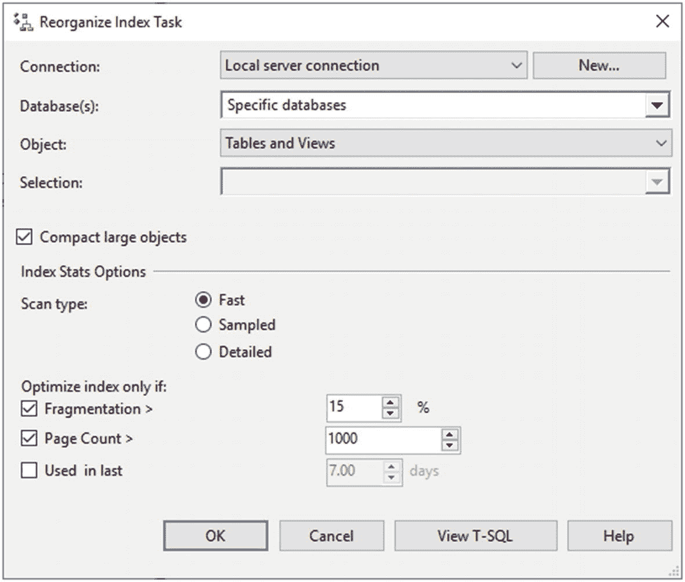

图 9-22：重新组织索引任务的属性窗口

*   `Connection`：任务执行时将连接到的 SQL Server 实例。
*   `Database(s)`：任务将连接以进行重新组织的数据库。此属性的选项有：
    *   所有数据库。
    *   所有系统数据库。
    *   所有用户数据库。
    *   这些特定数据库（包含可用数据库列表，必须选择一个）。
    *   忽略状态不为联机的数据库。
*   `Object`：确定重新组织是针对表、视图，还是表和视图。
*   `Selection`：指定此任务影响的表或索引。当在“对象”框中选择了“表和视图”时，此选项不可用。
*   `Compact large objects`：确定重新组织是否使用选项 `ALTER INDEX LOB_COMPACTION = ON`。
*   `Scan type`：指示你希望 SQL Server 如何收集剩余选项的统计信息。可用选项为 `快速`、`已采样` 或 `详细`。
*   `Optimize index only if`：提供通过碎片百分比、页数以及索引在过去 7 天内是否被使用来限制重新组织的能力。

索引统计信息选项是 SQL Server 2016 新增的，是对该功能的一个极佳补充。在没有 DBA 积极管理服务器内索引的环境中，这是确保索引得到维护的一个绝佳选项。

#### 重建索引任务

另一个可用的任务是**重建索引任务**。此任务为 `ALTER INDEX REBUILD` 语法提供了一个封装器。配置完成后，此任务将重建所有符合任务条件的索引。

与重新组织索引任务类似，重建索引任务在使用前也有许多属性需要配置（参见图 9-23）：

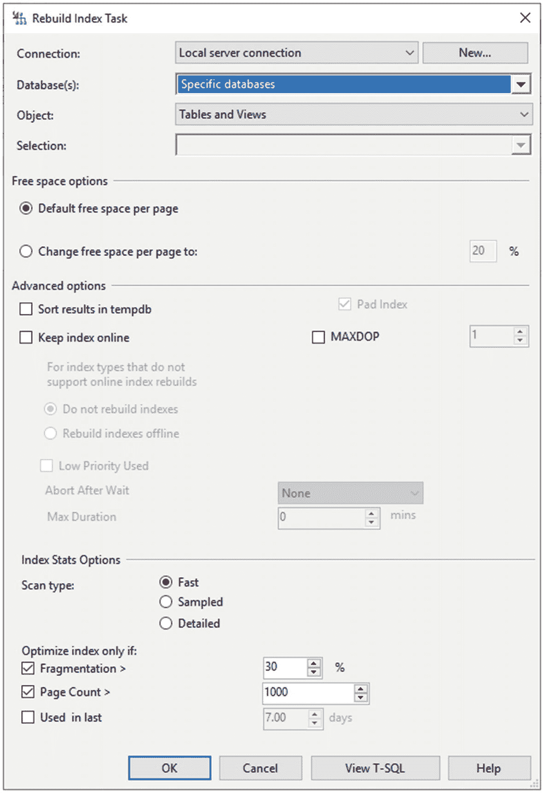

图 9-23：重建索引任务的属性窗口

*   `Connection`：任务执行时将连接到的 SQL Server 实例。
*   `Database(s)`：任务将连接以进行重建的数据库。此属性的选项有：
    *   所有数据库。
    *   所有系统数据库。
    *   所有用户数据库。
    *   这些特定数据库（包含可用数据库列表，必须选择一个）。
    *   忽略状态不为联机的数据库。
*   `Object`：确定重建是针对表、视图，还是表和视图。
*   `Selection`：指定此任务影响的表或索引。当在“对象”框中选择了“表和视图”时，此选项不可用。
*   `Default free space per page`：指定重建是否应使用索引上的当前填充因子。
*   `Change free space per page to`：允许重建在重建索引时指定一个新的填充因子。
*   `Sort results in tempdb`：确定重建是否使用选项 `ALTER INDEX SORT_IN_TEMPDB = ON`。
*   `MAXDOP`：确定重建的最大并行度，这决定了 SQL Server 用于重建索引的最大 CPU 线程数。
*   `Keep index online while re-indexing`：确定重建是否使用选项 `ALTER INDEX ONLINE = ON`。对于无法联机重建的索引，有一个选项可确定是跳过还是离线重建索引。此外，你可以设置 `Low Priority Used` 来确定阻塞是否会取消索引重建，以及它是自行取消还是取消阻塞者，以及在多长时间之后取消。
*   `Scan type`：指示你希望 SQL Server 如何收集剩余选项的统计信息。可用选项为 `快速`、`已采样` 或 `详细`。
*   `Optimize index only if`：提供通过碎片百分比、页数以及索引在过去 7 天内是否被使用来限制重建的能力。

并且与重新组织任务一样，索引统计信息选项是随 SQL Server 2016 添加的。同样地，这些更改使重建任务成为适合那些没有专用数据库管理资源的环境，或者当你希望保持索引维护简单且无需管理过程的自定义代码时的一个可行选择。

#### 维护计划摘要

维护计划提供了一种立即开始消除索引碎片的方法。任务可以在几分钟内配置和安排。自 SQL Server 2016 增强功能加入以来，它们是管理索引维护的一个绝佳选择。使用其他选项（例如 T-SQL 脚本）的唯一真正原因是当你需要额外功能时，如自定义日志记录或自定义恢复逻辑。

### T-SQL 脚本

数据库碎片整理的另一种方法是使用 T-SQL 脚本来智能地整理索引碎片。在本节中，我们将介绍整理单个数据库中所有索引碎片的必要步骤。此选择的主要优点是能够将所有内容保持在单一过程中，并且两个任务不可能同时影响同一个索引。脚本将挑选最能从碎片整理中受益的索引，确定是重建还是重新组织，并忽略那些获益很少或没有获益的索引。

为了实现过滤，你将应用一些碎片整理最佳实践，以帮助确定是否要整理索引碎片以及应采用何种方法。你将使用的指导原则如下：

*   重新组织碎片少于 30% 的索引。
*   重建碎片为 30% 或更高的索引。
*   忽略页数少于 1,000 的索引。
*   如果你拥有企业版，并且在维护期间需要访问数据，请使用联机重建。
*   如果正在重建聚集索引，则重建表中的所有索引。


### 注意

索引存在碎片，并不意味着就应该总是对其进行碎片整理。对于小表的索引，进行碎片整理通常不会有太多益处。例如，少于 8 个页面的索引将适合存储在一个区（extent）中，因此对其进行碎片整理在减少 I/O 方面并无好处。一些微软文档和 SQL Server 专家建议不要对少于 1,000 个页面的表进行碎片整理。该值是否适用于您的数据库取决于您的数据库，但它可以作为构建索引维护策略的起点。

碎片整理脚本将执行几个步骤来智能地整理索引：

1.  收集碎片数据。
2.  确定要整理哪些索引。
3.  构建碎片整理语句。

在开始碎片整理步骤之前，您需要一个索引维护脚本的模板。如清单 9-27 所示的模板声明了多个变量，并使用一个 `CURSOR`（游标）来遍历每个索引并执行必要的索引维护。变量在 `DECLARE`（声明）语句中设置，阈值在本节开头定义。模板中还有一个 `table`（表）变量，用于存储数据库碎片状态的中间结果。

```sql
DECLARE @MaxFragmentation TINYINT=30
,@MinimumPages SMALLINT=1000
,@SQL nvarchar(max)
,@ObjectName NVARCHAR(300)
,@IndexName NVARCHAR(300)
,@CurrentFragmentation DECIMAL(9, 6)
DECLARE @FragmentationState TABLE
(
SchemaName SYSNAME
,TableName SYSNAME
,object_id INT
,IndexName SYSNAME
,index_id INT
,page_count BIGINT
,avg_fragmentation_in_percent FLOAT
,avg_page_space_used_in_percent FLOAT
,type_desc VARCHAR(255)
)
INSERT INTO @FragmentationState

DECLARE INDEX_CURSE CURSOR LOCAL FAST_FORWARD FOR

OPEN INDEX_CURSE
WHILE 1=1
BEGIN
FETCH NEXT FROM INDEX_CURSE INTO @ObjectName, @IndexName
,@CurrentFragmentation
IF @@FETCH_STATUS  0
BREAK

EXEC sp_ExecuteSQL @SQL
END
CLOSE INDEX_CURSE
DEALLOCATE INDEX_CURSE
清单 9-27
索引碎片整理脚本模板
```

首先，您需要收集索引的碎片数据，并将其填充到 `table`（表）变量中。在清单 9-28 的脚本中，使用了 DMF（动态管理函数）`sys.dm_db_index_physical_stats` 并指定了 `SAMPLED`（抽样）选项。此选项用于最小化执行该 DMF 对数据库的影响。结果中包含了架构、表和索引名称，用于标识正在报告的索引，以及 `object_id` 和 `index_id`。来自 DMF 的关于索引碎片的统计列包括在 `page_count`、`avg_fragmentation_in_percent` 和 `avg_page_space_used_in_percent` 列中。结果中的最后一列是 `has_LOB_column`。此列是关联子查询的结果，用于确定索引中的任何列是否为 LOB（大型对象）类型，而 LOB 类型不允许联机索引重建。

```sql
SELECT
s.name as SchemaName
,t.name as TableName
,t.object_id
,we.name as IndexName
,we.index_id
,x.page_count
,x.avg_fragmentation_in_percent
,x.avg_page_space_used_in_percent
,we.type_desc
FROM sys.dm_db_index_physical_stats(db_id(), NULL, NULL, NULL, 'SAMPLED') x
INNER JOIN sys.tables t ON x.object_id = t.object_id
INNER JOIN sys.schemas s ON t.schema_id = s.schema_id
INNER JOIN sys.indexes we ON x.object_id = we.object_id AND x.index_id = we.index_id
WHERE x.index_id > 0
AND x.avg_fragmentation_in_percent > 0
AND alloc_unit_type_desc = 'IN_ROW_DATA'
清单 9-28
收集碎片数据的脚本
```

清单 9-28 的查询结果因每个读者而异。通常，结果应类似于图 9-24，其中包含来自 `AdventureWorks2017` 数据库的聚集索引、非聚集索引和 XML 索引。

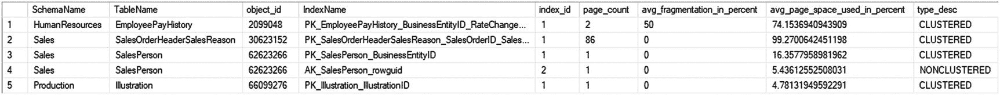

**图 9-24** 表碎片数据的查询结果

碎片整理脚本的下一步是构建需要整理的索引列表。通过清单 9-29 创建的索引列表用于填充游标。然后，游标遍历每个索引以执行碎片整理。脚本中一个值得注意的点是，对于聚集索引，所有底层索引都将被重建。这在整理索引碎片时不是必须的，但可以作为一个考虑选项。当表上只有少数几个索引时，这可能是一种值得采用的管理方式。随着索引数量的增加，这种方法的吸引力可能会降低。此查询的结果应类似于图 9-25 中的结果。

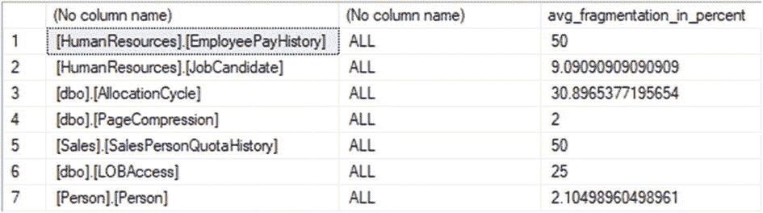

**图 9-25** 用于重建/重组操作的索引

```sql
SELECT  QUOTENAME(x.SchemaName)+'.'+QUOTENAME(x.TableName)
,CASE WHEN x.type_desc = 'CLUSTERED' THEN 'ALL'
ELSE QUOTENAME(x.IndexName) END
,x.avg_fragmentation_in_percent
FROM    @FragmentationState x
LEFT OUTER JOIN @FragmentationState y ON x.object_id = y.object_id AND y.index_id = 1
WHERE   (
x.type_desc = 'CLUSTERED'
AND y.type_desc = 'CLUSTERED'
)
OR y.index_id IS NULL
ORDER BY x.object_id
,x.index_id
清单 9-29
识别碎片化索引的脚本
```

模板的最后一部分是实现核心功能的地方。换句话说，清单 9-30 中的脚本用于构建用于整理索引碎片的 `ALTER INDEX`（修改索引）语句。此时，会检查碎片级别以确定是发出 `REBUILD`（重建）还是 `REORGANIZATION`（重组）命令。对于支持 `ONLINE`（联机）索引重建的索引，`CASE`（情况）语句会添加适当的语法。

```sql
SET @SQL = CONCAT('ALTER INDEX ', @IndexName,' ON ',@ObjectName,
CASE WHEN @CurrentFragmentation <= 30 THEN ' REORGANIZE;'
ELSE ' REBUILD' END,
CASE WHEN CONVERT(VARCHAR(100), SERVERPROPERTY('Edition')) LIKE 'Enterprise%'
OR CONVERT(VARCHAR(100), SERVERPROPERTY('Edition)) LIKE 'Developer%'
THEN ' WITH (ONLINE=ON, SORT_IN_TEMPDB=ON) ' END, ';');
清单 9-30
构建索引碎片整理语句的脚本
```


# 使用 T-SQL 脚本进行索引碎片整理

#### 注意事项

SQL Server 2017 企业版的一项改进是，当索引包含大对象（LOB）数据类型列时，能够执行在线索引重建。

将这些部分全部整合到本节开头的模板中，以创建索引碎片整理脚本，可以提供与维护计划任务类似的功能。通过能够设置发生碎片整理的大小和碎片级别，该脚本只从真正需要执行工作的索引中清除碎片，而不是整理数据库中的每个索引。在 `AdventureWorks2017` 数据库上使用 Extended Events 来跟踪脚本输出，发现之前查询结果的 `ALTER INDEX` 语法与清单 9-31 中的类似。

```sql
ALTER INDEX ALL ON [HumanResources].[EmployeePayHistory] REBUILD WITH (ONLINE=ON, SORT_IN_TEMPDB=ON) ;
ALTER INDEX ALL ON [HumanResources].[JobCandidate] REORGANIZE; WITH (ONLINE=ON, SORT_IN_TEMPDB=ON) ;
ALTER INDEX ALL ON [dbo].[AllocationCycle] REBUILD WITH (ONLINE=ON, SORT_IN_TEMPDB=ON) ;
ALTER INDEX ALL ON [dbo].[PageCompression] REORGANIZE; WITH (ONLINE=ON, SORT_IN_TEMPDB=ON) ;
ALTER INDEX ALL ON [Sales].[SalesPersonQuotaHistory] REBUILD WITH (ONLINE=ON, SORT_IN_TEMPDB=ON) ;
```
*清单 9-31 索引碎片整理语句*

正如本节代码所演示的，使用 T-SQL 脚本可能比仅使用维护计划任务复杂得多。复杂性的优点在于，一旦脚本完成，就可以将其封装在存储过程中，并用于您所有的 SQL Server 实例。该脚本旨在作为使用 T-SQL 脚本自动化碎片整理的第一步。它没有考虑分区表，也没有在重建或重组索引之前检查索引是否正在被使用。好处在于，与对数据库进行“卡车式”的全面重新索引不同，脚本化解决方案可以智能地决定如何以及何时整理索引碎片。

#### 注意事项

要获取完整的索引碎片整理解决方案，请查看 Ola Hallengren 的索引维护脚本：[`https://ola.hallengren.com`](https://ola.hallengren.com)。

## 预防碎片

索引内的碎片并不总是必然发生的。可以利用一些方法来减缓碎片发生的速率。当您拥有经常受到碎片影响的索引时，建议调查碎片产生的原因。有几种策略可以帮助缓解碎片：填充因子、数据类型和默认值。

### 填充因子

填充因子是在构建或重建索引时可以使用的一个选项。此属性用于确定在首次创建索引或下次重建索引时，索引中每个数据页应保留多少可用空间。例如，填充因子为 75 时，每个数据页大约留出 25% 的空白空间。

如果索引遇到大量或频繁的碎片，调整填充因子以缓解碎片是值得的。通过这样做，导致碎片的活动影响应该会减小，从而降低需要整理索引碎片的频率。

默认情况下，SQL Server 创建所有索引时填充因子为 0。这是服务器和数据库级别的推荐值。并非所有索引都是相同的，填充因子应根据需要应用，而不是作为一项全面的保险策略。此外，填充因子 0 与填充因子 100 相同。

填充因子的一个缺点是，在数据页中留出可用空间意味着索引需要更多的数据页来存储所有记录。更多的页面意味着更多的 I/O，并且如果存在可选的备用索引，索引的利用率可能会降低。

### 数据类型

避免碎片的另一种方法是通过适当的数据类型选择。此策略适用于长度可能根据其包含的数据而改变的数据类型。这些数据类型如 `VARCHAR` 和 `NVARCHAR`，它们的长度会随时间变化。

在许多情况下，可变长度数据类型非常适合表中的列。当数据的波动性较高且数据长度也易变时，问题就会出现。随着数据长度的变化，可能会发生页拆分，从而导致碎片。如果长度波动发生在索引的大部分区域，那么页拆分的数量也可能很大，从而导致碎片。

一个关于不良数据类型的绝佳例子来自我使用第一个数据仓库的经验。许多表的原始设计包括一个数据类型为 `VARCHAR(10)` 的列。该列填充了格式为 `yyyymmdd` 的日期，值类似于 `20191011`。作为导入过程的一部分，日期值被更新为 `yyyy-mm-dd` 格式。当导入过程投入生产并一次处理数百万行时，列长度从 8 个字符增加到 10 个字符，由于页拆分，导致了惊人的碎片水平。解决问题的办法很简单，就是将列的数据类型从 `VARCHAR(10)` 改为 `CHAR(10)`。

如此简单的解决方案可以应用于许多数据库。这只需要对碎片产生的原因进行一些调查。

### 默认值

正确应用默认值似乎不能帮助防止碎片，但在某些情况下，它可能对碎片产生显著影响。此类缓解措施的典型代表是数据库使用 `uniqueidentifier` 数据类型时。

在大多数情况下，`uniqueidentifier` 值是使用 `NEWID()` 函数生成的。此函数创建一个全局唯一标识符（GUID），该标识符在整个地球范围内都应该是唯一的。这对于为行生成唯一标识符很有用，但其作用域可能大于您的数据库。在许多情况下，唯一值可能只需要对服务器或仅对表唯一。

`NEWID()` 函数的主要问题是生成 GUID 不是一个顺序过程。正如本章开头所演示的，使用此函数为聚集索引键生成值可能导致严重的碎片。

`NEWID()` 函数的一个替代方案是 `NEWSEQUENTIALID()` 函数。此函数像另一个函数一样返回 GUID，但在值的生成方式上有几个不同之处。首先，在服务器上，该函数生成的每个 GUID 都是前一个值的顺序值。第二个变化是，生成的 GUID 值仅对生成它的服务器是唯一的。如果另一个 SQL Server 实例为同一表使用此函数生成 GUID，则可能会生成重复的值，并且这些值不会是顺序的，因为它们的作用域是服务器级别。

考虑到这些限制，如果一个表必须使用 `uniqueidentifier` 数据类型，`NEWSEQUENTIALID()` 函数是 `NEWID()` 函数的一个极佳替代方案。值将是顺序的，遇到的碎片量将少得多且频率更低。


# 索引统计信息维护

在第 3 章中，我们讨论了在索引上收集的统计信息。这些统计信息为查询优化器提供了至关重要的信息，用于编译查询的执行计划。当这些信息过时或不准确时，数据库将提供次优或不准确的查询计划。

在大多数情况下，索引统计信息不需要太多维护。在本节中，我们将探讨 SQL Server 中可用于创建和更新统计信息的过程。我们还将了解在自动过程跟不上索引内数据变化速度的情况下，如何维护统计信息。

## 自动维护统计信息

在 SQL Server 中构建和维护统计信息最简单的方法就是让 SQL Server 来完成。有三个数据库属性控制着 SQL Server 是否会自动构建和维护统计信息：

*   `AUTO_CREATE_STATISTICS`
*   `AUTO_UPDATE_STATISTICS`
*   `AUTO_UPDATE_STATISTICS_ASYNC`

默认情况下，前两个属性在数据库中是启用的。最后一个选项默认是禁用的。在大多数情况下，这三个属性都应该启用。

#### 自动创建

第一个数据库属性是 `AUTO_CREATE_STATISTICS`。此属性指导 SQL Server 自动为没有统计信息的列创建单列统计信息。从索引的角度来看，此属性没有影响。当创建索引时，会为该索引创建一个统计信息对象。

#### 自动更新

接下来的两个属性是 `AUTO_UPDATE_STATISTICS` 和 `AUTO_UPDATE_STATISTICS_ASYNC`。从高层面上看，这两个属性非常相似。当超过内部阈值时，SQL Server 将启动统计信息对象的更新。进行更新是为了使统计信息对象中的值与表中的基数保持同步。

触发统计信息更新的阈值可能因表而异。该阈值基于几个与已更改行数相关的计算。对于空表，当向表中添加超过 500 行时，将触发统计信息更新。如果表的行数超过 500 行，那么当修改的行数达到 500 行加上最多 20% 的行基数时，统计信息将被更新。此时，SQL Server 将安排更新统计信息。随着表中行数的增加，20% 的阈值会降低，这适应了当表中行数较多时需要更频繁更新统计信息的需求。在大约 50 万行时，百分比降至约 5%，在超过 10 亿行时降至不到 1%。这是以前通过跟踪标志 2371 可实现的行为，自 SQL Server 2016 起该标志默认开启。

当统计信息更新发生时，有两种模式可以完成：同步和异步。默认情况下，统计信息是同步更新的。这意味着当统计信息被认定为过时需要更新时，查询优化器会等待统计信息更新完成后再为查询编译执行计划。这对于数据易变的表非常有用。例如，在 `TRUNCATE TABLE` 操作前后，表的统计信息可能大不相同。可以选择通过启用 `AUTO_UPDATE_STATISTICS_ASYNC` 属性来异步构建统计信息。这改变了查询优化器在触发更新统计信息事件时的反应方式。查询优化器不再等待统计信息更新完成，而是根据现有统计信息编译执行计划，并在更新完成后为未来的查询使用更新后的统计信息。对于查询量大、数据吞吐量高的数据库，这通常是更新统计信息的首选方式。交易吞吐量不会偶尔停顿，查询会畅通无阻地执行，执行计划会在获得改进的信息后更新。

如果您在以前的 SQL Server 版本环境中禁用了 `AUTO_UPDATE_STATISTICS`，现在应考虑启用它并同时启用 `AUTO_UPDATE_STATISTICS_ASYNC`。过去禁用 `AUTO_UPDATE_STATISTICS` 的最常见原因是更新统计信息导致的延迟。有了启用 `AUTO_UPDATE_STATISTICS_ASYNC` 的选项，这些性能问题很可能得到缓解。

#### 防止自动更新

根据表上的索引情况，有时自动更新索引会弊大于利。例如，在大型表上自动更新统计信息可能会在更新统计信息对象时导致性能问题。在这种情况下，现有的统计信息对象可能足够好，可以等到下一个维护窗口。有几种方法可以禁用单个统计信息对象上的 `AUTO_UPDATE_STATISTICS`，而不是在整个数据库上禁用：

*   对统计信息对象执行 `sp_autostats` 系统存储过程
*   在 `UPDATE STATISTICS` 或 `CREATE STATISTICS` 语句中使用 `NORECOMPUTE` 选项
*   在 `CREATE INDEX` 语句中使用 `STATISTICS_NORECOMPUTE`

这些选项中的每一个都可以用来禁用或启用索引上的 `AUTO_UPDATE_STATISTICS` 选项。在禁用此功能之前，请务必验证统计信息更新是否确实必要。

#### 内存中统计信息

在考虑统计信息时，有一个领域对统计信息的创建和使用方式有些不同，那就是内存中表。重要的是要理解，无法自动在内存中表上生成统计信息，并且它们总是需要完全扫描。此外，内存中表上的原生编译存储过程仅在存储过程编译时或 SQL Server 重启时获取统计信息。这意味着在考虑统计信息对索引的影响时，内存中表需要额外注意安排统计信息维护的时机。

## 手动维护统计信息

有时，用于维护统计信息的自动过程可能不够好。这通常与数据正在变化但变化量不足以触发统计信息更新的情况有关。一个很好的例子是，当更新语句改变了表的基数，但影响的行数并不多。例如，如果一个表的 10% 的数据从许多不同的值更改为单个值，那么最终查询数据的执行计划可能不是最优的。在这种情况下，您需要能够手动更新统计信息。与索引碎片整理一样，有两种手动维护统计信息的方法：

*   维护计划
*   T-SQL 脚本

在接下来的部分中，您将了解每种方法，并逐步了解如何实现它们。


### 维护计划

在维护计划中，有一个允许进行统计信息维护的任务。这个任务名为“更新统计信息任务”，其名称恰如其分地说明了它的功能。使用此任务时，可以配置许多属性来控制其行为（参见图 9-26）：

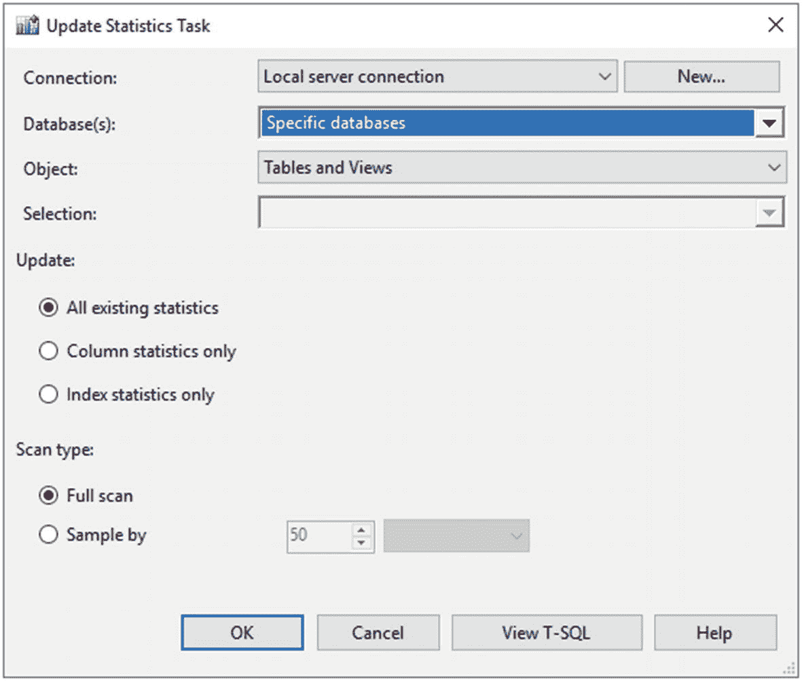

图 9-26
更新统计信息任务的属性窗口

*   `Connection`：任务执行时将连接到的 SQL Server 实例。
*   `Database(s)`：任务将连接到以进行重建的数据库。此属性的选项有：
    *   所有数据库。
    *   所有系统数据库。
    *   所有用户数据库。
    *   这些特定的数据库（包含可用数据库列表，必须选择一个）。
    *   忽略状态不处于联机状态的数据库。
*   `Object`：确定重建是针对表、视图，还是表和视图。
*   `Selection`：指定此任务影响的表或索引。当在 `Object` 框中选择了“表和视图”时，此选项不可用。
*   `Update`：对于每个表，确定是更新所有现有统计信息、仅列统计信息（使用 `WITH COLUMN` 子句），还是仅索引统计信息（使用 `WITH INDEX` 子句）。
*   `Scan type`：在完整扫描索引的所有叶级页与“按...抽样”之间选择，后者将扫描一定百分比或数量的行来构建统计信息对象。

与之前讨论的维护计划不同，“更新统计信息任务”没有更深层次的控件来帮助确定是否应更新统计信息。一个有用的选项是将统计信息更新限制在指定的日期范围内，这将减少每次执行期间更新的统计信息数量。在很大程度上，缺少该选项并不是一个决定性的问题。统计信息更新不像索引那样每次更新都需要足够的空间来重建整个索引。然而，能够保留当前的抽样扫描类型会更好，因为这可能对性能产生影响，并且采用一刀切的方法可能无法带来期望的性能。

### T-SQL 脚本

通过 T-SQL，有几种替代方法可以更新统计信息：使用存储过程或使用 DDL 语句。每种方法都有其优缺点。在接下来的部分中，您将了解每种方法以及为什么它可能是一种有价值的方法。

#### 存储过程

在 `master` 数据库中，有一个名为 `sp_updatestats` 的系统存储过程，可用于更新数据库中的所有统计信息。由于它是一个系统存储过程，因此可以从任何数据库调用它，以更新调用该过程的数据库中的统计信息。

当执行 `sp_updatestats` 时，它会运行下一节将介绍的 `UPDATE STATISTICS` 语句，并使用 `ALL` 选项。该存储过程接受一个名为 `resample` 的参数，如代码清单 9-32 所示。`resample` 参数仅接受值 `resample`。如果提供了此值，则存储过程使用 `UPDATE STATISTICS` 的 `RESAMPLE` 选项。否则，存储过程使用 SQL Server 中的默认采样算法。

```
sp_updatestats [ [ @resample = ] 'resample']
```
代码清单 9-32
`sp_updatestats` 语法

使用 `sp_updatestats` 的一个好处是，它将仅更新那些数据已发生修改的项的统计信息。将检查用于触发自动统计信息更新的内部计数器，以确保只更新已更改的统计信息。此外，`resample` 选项使用统计信息最近使用的采样率。

在需要更新统计信息的情况下，`sp_updatestats` 是一个极好的工具，用于仅更新那些自上次更新以来可能已过时的统计信息。“更新统计信息任务”就像一张覆盖整个数据库的巨大毯子，而 `sp_updatestats` 则像一条恰到好处地覆盖所需之处的被子。


### DDL 命令

更新统计信息的另一种方式是通过 DDL 命令 `UPDATE STATISTICS`，如清单 9-33 所示。`UPDATE STATISTICS` 语句允许对每个统计信息进行精细调优的更新，并提供了多种选项来控制如何收集和构建统计信息。

```
UPDATE STATISTICS table_or_indexed_view_name
[
{
{ index_or_statistics_name }
| ( { index_or_statistics_name } [ ,...n ] )
}
]
[    WITH
[
FULLSCAN
[ [ , ] PERSIST_SAMPLE_PERCENT = { ON | OFF } ]
| SAMPLE number { PERCENT | ROWS }
[ [ , ] PERSIST_SAMPLE_PERCENT = { ON | OFF } ]
| RESAMPLE
[ ON PARTITIONS ( { <partition_number> | <range> } [, ...n] ) ] ]
[ [ , ] [ ALL | COLUMNS | INDEX ]
[ [ , ] NORECOMPUTE ]
[ [ , ] INCREMENTAL = { ON | OFF } ]
[ [ , ] MAXDOP = max_degree_of_parallelism ]
] ;
```
*清单 9-33* `UPDATE STATISTICS` 语法

使用 `UPDATE STATISTICS` 时设置的第一个参数是 `table_or_indexed_view_name`。此参数引用将要更新其统计信息的表。使用 `UPDATE STATISTICS` 命令，一次只能更新一个表或视图的统计信息。

下一个参数是 `index_or_statistics_name`。此参数用于确定是更新单个统计信息、统计信息列表，还是表上的所有统计信息。若要仅更新单个统计信息，请在表或视图名称之后包含该统计信息的名称。对于统计信息列表，统计信息名称包含在括号内的逗号分隔列表中。如果未命名任何统计信息，则所有统计信息都将被视为更新对象。

设置好参数后，就需要向 `UPDATE STATISTICS` 命令添加适用的选项。这正是该语法强大和灵活之处所在。这些参数允许根据统计信息中可用的数据对其进行精细调优，从而为正确的表和正确的索引获取合适的统计信息：

*   `FULLSCAN`：构建统计信息对象时，扫描表或视图中的所有行和页。对于大表，这在创建统计信息时可能会影响性能。基本上，这等同于执行 `SAMPLE 100 PERCENT` 操作。
*   `SAMPLE`：使用表或视图中行的计数或百分比样本来创建统计信息对象。当未选择采样率时，SQL Server 将根据表中的行数确定合适的采样率。
*   `RESAMPLE`：使用上次更新统计信息时的采样率进行更新。例如，如果上次更新使用了 `FULLSCAN`，那么 `RESAMPLE` 也将导致 `FULLSCAN`。
*   `PERSIST_SAMPLE_PERCENT`：确定是否应将定义的采样率持久化到统计信息中，作为未来未指定默认值时的默认值。
*   `ALL | COLUMNS | INDEX`：确定应更新列统计信息、索引统计信息，还是两者都更新。
*   `NORECOMPUTE`：禁用查询优化器请求自动更新统计信息的选项。这对于锁定不应更改或在当前采样下是最优的统计信息很有用。在对频繁修改数据的表使用此选项时需谨慎，并确保有其他机制可以在需要时更新统计信息。
*   `INCREMENTAL`：启用时，统计信息将创建为按分区统计信息，这允许使用 `ON PARTITIONS` 子句按分区更新统计信息。
*   `MAXDOP`：确定统计信息更新操作的最大并行度，并覆盖服务器的最大并行度配置。

此列表中的前三个选项是互斥的。您只能选择其中一个选项。选择多个选项将导致错误。

由于 `UPDATE STATISTICS` 是 DDL 命令，可以很容易地实现自动化，方式类似于对索引进行碎片整理。为简洁起见，未提供示例脚本，但索引碎片维护的模板可以作为一个起点。如前一节所述，`sp_updatestats` 在底层使用了 `UPDATE STATISTICS`。此 DDL 命令是一种强大的方式，可以根据需要更新数据库中的统计信息，而无需执行超出实际必要的操作。延续上一节的类比，使用 `UPDATE STATISTICS` 相当于用一件手工编织的毛毯替换了原来的毯子和羽绒被。

## 总结

在本章中，您了解了表索引编制过程中涉及的一些维护注意事项。这些注意事项可归结为管理索引碎片和管理其统计信息。关于索引碎片，您看到了索引可能产生碎片的方式、为何这是一个问题以及消除碎片的策略。这些维护任务对于确保 SQL Server 能够充分利用索引至关重要。除了维护活动之外，索引上的统计信息也必须进行维护。过时或不准确的统计信息可能导致执行计划与表中的数据不匹配。如果没有合适的执行计划，无论索引如何，性能都会受到影响。

# 10. 索引工具

在索引编制方面，Microsoft 目前在 SQL Server 中内置了两个工具，可用于帮助识别可以改善数据库性能的索引。它们是缺失索引动态管理对象 (DMO) 和数据库引擎优化顾问 (DTA)。这两个工具对于辅助索引数据库都很有用，并且在调优数据库时可以提供有价值的输入。Microsoft 正在开发一个新的自动索引管理工具，目前在 Azure SQL Database 中可用。在撰写本文时，该工具未包含在 SQL Server 2019 中。

本章深入探讨了缺失索引和数据库引擎优化顾问这两种索引工具。本章分为两个部分，分别描述每个工具的功能。然后，我们将逐步介绍如何使用这些工具来提供索引方面的帮助。在整个章节中，您还将了解到使用这些工具各自的优缺点。


## 缺失索引

缺失索引动态管理对象（DMOs）是一组管理对象，用于从查询优化器提供索引反馈。当查询优化器编译执行计划时，它可以识别出将一组列的统计信息物化为物理索引将改善性能的情况。在这些情况下，查询优化器将编译结果并将信息存储在缺失索引 DMOs 中。

缺失索引 DMOs 有几点好处。首先，缺失索引信息是从查询优化器收集的，无需你采取任何操作。与扩展事件和其他性能监控工具不同，你不需要配置和启用它来收集信息。另一个需要考虑的因素是，缺失索引信息是基于 SQL Server 实例上实际发生的活动。索引建议不是基于你认为可能在生产中发生的测试负载，而是基于生产负载本身。随着数据库中数据使用模式的变化，缺失索引建议也会随之改变。

尽管缺失索引 DMOs 提供了诸多好处，但在使用它们时，你必须考虑到一些注意事项。缺失索引 DMOs 的局限性可以总结为以下几个类别：

*   队列大小
*   分析深度
*   准确性
*   索引类型

缺失索引队列的大小是一个容易被忽视的限制。无论 SQL Server 实例上有多少个数据库，缺失索引组的数量最多不能超过 600 个。一旦识别出 600 个缺失索引组，查询优化器将停止报告新的缺失索引建议。它不会判断一个新的可能缺失索引是否比已报告的质量更高；这些信息根本不会被收集。

### 注意

与其他动态管理对象一样，缺失索引 DMOs 中的信息会在 SQL Server 重启时重置，并且在数据库脱机时，该数据库的缺失索引信息也会被清除。

在考虑缺失索引信息时，分析深度是在审查建议时需要考虑的一个限制。查询优化器只考虑当前计划以及缺失索引是否对执行计划有益。有时，将缺失索引添加到数据库中会导致产生新的计划，并伴随一个新的缺失索引建议。这些建议只是针对改进执行计划性能的初步方案。这个限制的另一面是，缺失索引详细信息不包括测试来确定缺失索引建议中的列顺序是否最优。在查看缺失索引建议时，需要通过测试来确定正确的列顺序。

缺失索引建议的第三个限制是返回统计信息的准确性。关于这个限制，有两点需要考虑。首先，当查询使用不等式谓词时，其成本信息不如使用等式谓词返回的信息有效。其次，可能会返回具有多个成本估算的相同缺失索引建议。缺失索引的利用方式和位置可能会改变计算的成本估算。对于每个成本估算，都会记录一个缺失索引建议。

最后，缺失索引工具在建议的索引类型上存在限制。主要的限制是索引类型，以及缺失索引无法建议聚集索引、XML 索引、空间索引或列存储索引。这些建议也不会包含有关何时创建筛选索引的信息。同样地，有时建议可能只包含 `INCLUDE` 列。当这种情况发生时，需要将其中一个 `INCLUDE` 列指定为键列。

### 注意

每当对表进行元数据操作时，该表的缺失索引信息将被清除。例如，当向表添加列时，缺失索引信息将被清除。一个不太明显的例子是当表上的索引发生变化时。在这种情况下，缺失索引信息同样会被清除。

### 解释动态管理对象

有四个 DMOs 可用于返回有关缺失索引的信息。每个 DMO 提供构建索引所需的部分信息，查询优化器可以利用这些索引来提高查询性能。用于缺失索引的 DMOs 如下：

*   `sys.dm_db_missing_index_details`
*   `sys.dm_db_missing_index_columns`
*   `sys.dm_db_missing_index_group_stats`
*   `sys.dm_db_missing_index_group`

在接下来的四个小节中，我将逐一回顾这些动态管理对象，并探讨每个对象如何提供有关如何识别缺失索引的信息。

#### sys.dm_db_missing_index_details

DMO `sys.dm_db_missing_index_details` 是一个动态管理视图，返回缺失索引建议的列表。该动态管理视图（DMV）中的每一行提供一个单独的缺失索引建议。表 10-1 中的列提供了有关数据库和要创建索引的表的信息。它还包括应构成索引键和包含列的列。

表 10-1

`sys.dm_db_missing_index_details` 中的列

| 列名 | 数据类型 | 描述 |
| --- | --- | --- |
| `index_handle` | `int` | 每个缺失索引建议的唯一标识符。这是此 DMV 的键值。 |
| `database_id` | `smallint` | 标识包含缺失索引的表所在的数据库。 |
| `object_id` | `int` | 标识缺少索引的表。 |
| `equality_columns` | `nvarchar(4000)` | 逗号分隔的列列表，这些列参与等式谓词。 |
| `inequality_columns` | `nvarchar(4000)` | 逗号分隔的列列表，这些列参与不等式谓词。 |
| `included_columns` | `nvarchar(4000)` | 逗号分隔的列列表，这些列是查询所需的覆盖列。 |
| `statement` | `nvarchar(4000)` | 缺少索引的表的名称。 |

在 `sys.dm_db_missing_index_details` 中，有两列用于标识缺失索引建议的键列。它们是 `equality_columns` 和 `inequality_columns`。当查询计划中存在直接比较时，会生成 `equality_columns`。例如，当查询的筛选条件是 `ColumnA = @Parameter` 时，这就是一个等式谓词。当在查询计划中使用任何不等于筛选器时，会创建 `inequality_columns` 的详细信息。例如，使用大于、小于或 `NOT IN` 比较的情况。

关于 `included_columns` 信息，当存在不属于筛选条件但允许索引通过单个索引覆盖查询请求的列时，就会生成此信息。包含列在第 8 章中有更深入的介绍。简而言之，如果创建了缺失索引，使用包含列将有助于防止查询计划在执行计划中使用键查找。


#### sys.dm_db_missing_index_columns

下一个 DMO 是 `sys.dm_db_missing_index_columns`，它是一个**动态管理函数**。此函数为 `sys.dm_db_missing_index_details` 中列出的每个缺失索引返回一个列列表。要使用此 DMF，需将一个 `index_handle` 作为参数传入函数。结果集中的每一行都代表来自 `sys.dm_db_missing_index_details` 的缺失索引建议中的一个列，并重复 `equality_columns`、`inequality_columns` 和 `included_columns` 中的信息。表 10-2 列出了 `sys.dm_db_missing_index_columns` 的输出。

**表 10-2**

**sys.dm_db_missing_index_columns 中的列**

| 列名 | 数据类型 | 描述 |
| --- | --- | --- |
| `column_id` | `int` | 列的 ID。 |
| `column_name` | `sysname` | 表列的名称。 |
| `column_usage` | `varchar(20)` | 描述该列在索引中的使用方式。 |

此 DMF 的主要信息是 `column_usage` 列。对于每一行，此列将返回以下值之一：`EQUALITY`、`INEQUALITY` 或 `INCLUDE`。这些值映射到 `sys.dm_db_missing_index_details` 中的 `equality_columns`、`inequality_columns` 和 `included_columns`。根据前一个 DMV 中的使用类型，此 DMF 中的用法将是相同的。

#### sys.dm_db_missing_index_groups

DMV `sys.dm_db_missing_index_groups` 是下一个缺失索引 DMO。此 DMV 返回一个缺失索引组与缺失索引建议配对的列表。表 10-3 列出了 `sys.dm_db_missing_index_groups` 的列。尽管此 DMV 支持在缺失索引建议中建立多对多关系，但它们总是以一对一关系建立。

**表 10-3**

**sys.dm_db_missing_index_groups 中的列**

| 列名 | 数据类型 | 描述 |
| --- | --- | --- |
| `index_group_handle` | `int` | 标识一个缺失索引组。此值连接到 `sys.dm_db_missing_index_group_stats` 中的 `group_handle`。 |
| `index_handle` | `int` | 标识一个缺失索引句柄。此值连接到 `sys.dm_db_missing_index_details` 中的 `index_handle`。 |

#### sys.dm_db_missing_index_group_stats

最后一个缺失索引 DMO 是 DMV `sys.dm_db_missing_index_group_stats`。此 DMV 中的信息包含有关查询优化器期望如何使用缺失索引（如果已构建）的统计信息。由此，使用表 10-4 中的列，您可以确定哪些缺失索引将提供最大收益以及索引将被使用的范围。

**表 10-4**

**sys.dm_db_missing_index_group_stats 中的列**

| 列名 | 数据类型 | 描述 |
| --- | --- | --- |
| `group_handle` | `int` | 每个缺失索引组的唯一标识符。这是此 DMV 的键值。所有将从使用该缺失索引组中受益的查询都包含在此组中。 |
| `unique_compiles` | `bigint` | 将从此缺失索引组受益的执行计划编译和重新编译的计数。 |
| `user_seeks` | `bigint` | 如果缺失索引已构建，用户查询中本应发生的查找次数。 |
| `user_scans` | `bigint` | 如果缺失索引已构建，用户查询中本应发生的扫描次数。 |
| `last_user_seek` | `datetime` | 如果缺失索引已构建，来自用户查询的上次用户查找的日期和时间。 |
| `last_user_scan` | `datetime` | 如果缺失索引已构建，来自用户查询的上次用户扫描的日期和时间。 |
| `avg_total_user_cost` | `float` | 可以由组中的索引降低的用户查询的平均成本。 |
| `avg_user_impact` | `float` | 如果实施此缺失索引组，用户查询可能体验到的平均百分比收益。 |
| `system_seeks` | `bigint` | 如果缺失索引已构建，系统查询中本应发生的查找次数。 |
| `system_scans` | `bigint` | 如果缺失索引已构建，系统查询中本应发生的扫描次数。 |
| `last_system_seek` | `datetime` | 如果缺失索引已构建，来自系统查询的上次系统查找的日期和时间。 |
| `last_system_scan` | `datetime` | 如果缺失索引已构建，来自系统查询的上次系统扫描的日期和时间。 |
| `avg_total_system_cost` | `float` | 可以由组中的索引降低的系统查询的平均成本。 |
| `avg_system_impact` | `float` | 如果实施此缺失索引组，系统查询可能体验到的平均百分比收益。 |


### 使用 DMO

既然已经解释了缺失索引 DMO，现在就来看看如何结合使用它们来提供缺失索引建议。您可能已经注意到，缺失索引 DMO 的结果被称为“建议”而非“推荐”。这种措辞上的差异是故意的。通常，当某人收到一项推荐时，它已经过深思熟虑，随时可以实施。缺失索引 DMO 的情况并非如此；因此，它们被称为建议。

借助缺失索引 DMO 提供的建议，您就有了一个起点，可以开始查看并构建新索引。在查看缺失索引建议时，有两点需要重点考虑。首先，每个缺失索引建议的变体可能会在结果中多次出现。不建议为每个变体都实现索引。应该找出建议中的常见模式。一个能覆盖多个建议的索引通常是理想的。其次，当建议涉及多个列时，需要测试列的顺序以确定哪种顺序最优。

为了解释缺失索引 DMO 如何工作以及它们之间的关系，我将带您看一个包含几条 SQL 语句的示例。这些语句如**清单 10-1**所示，针对`AdventureWorks2017`数据库中的`SalesOrderHeader`表执行了几个查询。每个查询的过滤条件都基于`DueDate`或`OrderDate`列，或同时基于两者。

```
USE AdventureWorks2017
GO
SELECT DueDate FROM Sales.SalesOrderHeader
WHERE DueDate = '2014-07-01 00:00:00.000'
AND OrderDate = '2014-06-19 00:00:00.000'
GO
SELECT DueDate FROM Sales.SalesOrderHeader
WHERE OrderDate Between '20140601' AND '20140630'
AND DueDate Between '20140701' AND '20140731'
GO
SELECT DueDate, OrderDate FROM Sales.SalesOrderHeader
WHERE DueDate Between '20140701' AND '20140731'
GO
SELECT CustomerID, OrderDate FROM Sales.SalesOrderHeader
WHERE OrderDate Between '20140601' AND '20140630'
AND DueDate Between '20140701' AND '20140731'
GO
```
**清单 10-1**
用于生成缺失索引建议的 SQL 语句

如果您检查这些示例查询的执行计划，会发现它们都使用聚集索引扫描来满足查询。**图 10-1**展示了第一个查询的执行计划。在这个执行计划中，有一个提示表明存在一个缺失索引，该索引可能有助于提高查询性能，并且存在一个针对表聚集索引的索引扫描。

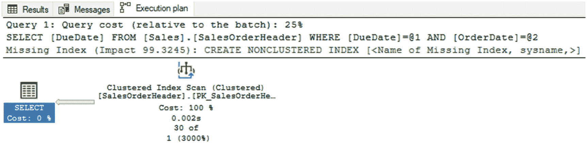

**图 10-1**
来自清单 10-1 的第一个查询的执行计划

要查看此缺失索引建议的更多详细信息，您需要查看缺失索引 DMO。针对缺失索引 DMO 的查询将类似于**清单 10-2**。该查询包含了之前描述的等值列、不等值列和包含列信息。查询中还包含两个之前未描述的计算字段：`Impact`和`Score`。

`Impact`计算有助于识别那些将在多次查询执行中产生最高总体影响的缺失索引建议。其计算方法是：基于平均影响，将缺失索引上可能的查找和扫描次数相加；所得值代表所有可能使用该索引的查询的总体改进程度。该值越高，索引可能提供的改进就越大。

`Score`计算也有助于识别将提高查询性能的缺失索引建议。`Impact`和`Score`之间的区别在于包含了平均总用户成本。对于`Score`计算，平均总用户成本乘以`Impact`分数再除以 100。成本值的纳入有助于在决定是否考虑缺失索引时，区分高成本和低成本的查询。例如，一个在平均成本值为 1000 的查询上提供 80%改进的缺失索引建议，其回报可能优于一个在平均成本值为 1 的查询上提供 90%改进的建议。

```
SELECT
DB_NAME(database_id) AS database_name
,OBJECT_NAME(object_id, database_id) AS table_name
,mid.equality_columns
,mid.inequality_columns
,mid.included_columns
,(migs.user_seeks + migs.user_scans) * migs.avg_user_impact AS Impact
,migs.avg_total_user_cost * (migs.avg_user_impact / 100.0) * (migs.user_seeks + migs.user_scans) AS Score
,migs.user_seeks
,migs.user_scans
FROM sys.dm_db_missing_index_details mid
INNER JOIN sys.dm_db_missing_index_groups mig ON mid.index_handle = mig.index_handle
INNER JOIN sys.dm_db_missing_index_group_stats migs ON mig.index_group_handle = migs.group_handle
WHERE DB_NAME(database_id) = 'AdventureWorks2017'
ORDER BY migs.avg_total_user_cost * (migs.avg_user_impact / 100.0) * (migs.user_seeks + migs.user_scans) DESC
```
**清单 10-2**
查询缺失索引 DMO 的语句

**图 10-2**展示了执行此查询后得到的一些结果。

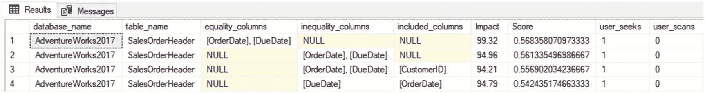

**图 10-2**
缺失索引查询的结果

根据**图 10-2**所示的缺失索引查询结果，有几点需要考虑。首先，这些建议之间存在很多相似之处。除了一个缺失索引外，其他所有建议的谓词列都包含`OrderDate`和`DueDate`。由于列顺序尚未经过测试，最优列顺序可能有两种方式。为了满足缺失索引建议，一个可能的索引可以将键列设为`DueDate`，后跟`OrderDate`。这种配置将创建一个能够满足所有四个缺失索引项的索引。

下一个需要查看的是`included_columns`。对于其中两个建议，列出了`included_columns`的值。在第四个缺失索引建议中，它建议包含`OrderDate`列。由于它将成为索引的键列之一，因此无需额外包含。另一个来自第三个缺失索引建议的列是`CustomerID`列。虽然只有一个索引需要此列作为包含列，但添加该列可能影响甚微，因为它是一个窄列。您可能也希望将此列添加到索引中。

查看这些结果后，您看到了四个缺失索引建议，并最终得到了一个可以覆盖所有四个缺失索引项的索引建议。如果您使用类似于**清单 10-3**中的 DDL 语句创建索引，最终将得到一个解决这些缺失索引的索引。如果我们再次执行**清单 10-1**中的查询，会看到所有查询都使用新索引上的索引查找，如**图 10-3**所示。

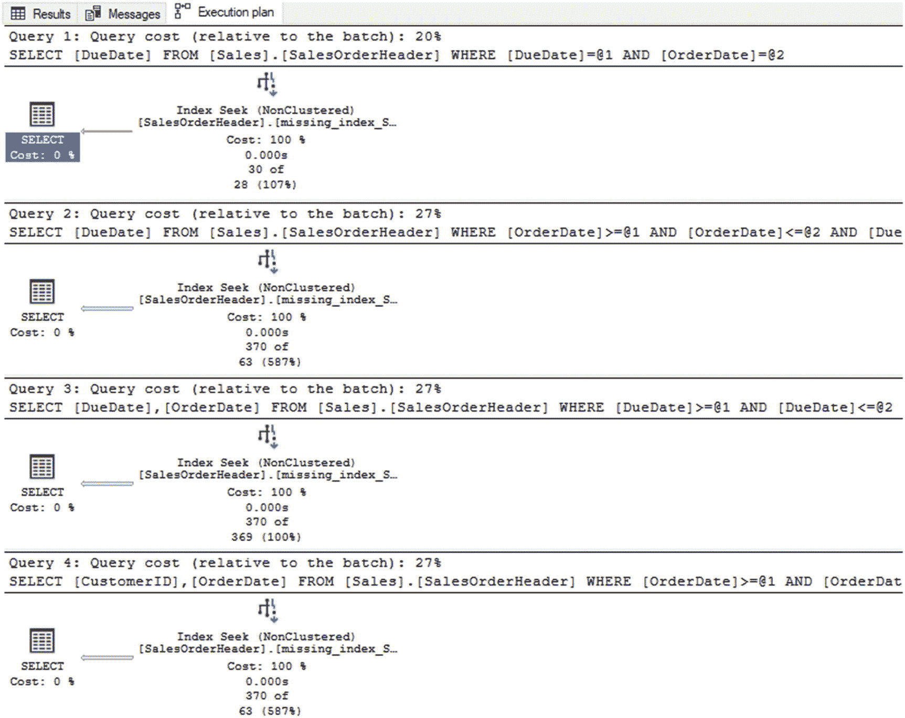

**图 10-3**
创建缺失索引后的查询执行计划

```
CREATE NONCLUSTERED INDEX missing_index_SalesOrderHeader
ON Sales.SalesOrderHeader([DueDate], [OrderDate])
INCLUDE ([CustomerID])
```
**清单 10-3**
基于缺失索引 DMO 创建的索引


### 注意

对于数据库引擎调优顾问的价值存在许多负面看法。在我看来，这个工具填补了一个角色，并且只要为其提供足够的工作负载，它就会返回有价值的建议。这些调优建议为数据库调优提供了一个比从零开始更好的起点。

## 数据库引擎调优顾问

SQL Server 中另一个可用的索引工具是**数据库引擎调优顾问**。该工具允许 SQL Server 分析来自文件、表、计划缓存或查询存储的工作负载。`DTA`的输出可以为工作负载的索引和分区配置提供调优建议。使用该工具的主要好处是，它不需要对底层数据库有深入的理解就能提出建议。

无论是处理单个查询还是完整的一天工作负载，`DTA`都会为以下类型的对象提供索引建议：

-   用于聚集索引和非聚集索引的行存储和列存储表
-   对齐或非对齐分区
-   可支持索引的视图

通过`DTA`中的会话，你可以真正地将建议聚焦于你对环境的期望。你能够根据你的环境（无论是事务型还是分析型）利用工作负载，并将重点放在读取和写入上，从而获得符合你需求的索引建议。你甚至可以修改环境设置，以查找因磁盘空间变化而产生的索引建议。

一旦分析完成，`DTA`会提供多个报告和输出。这些信息使你能够审阅建议，并理解它将对数据库产生的影响。

尽管`DTA`具备相当多的功能，但该工具也存在一些限制。以下列举了其中一部分：

-   无法在系统表上推荐索引。
-   无法添加或删除唯一索引，或强制主键/唯一约束的索引。
-   对于某些工作负载，建议可能会有所变化。`DTA`在执行时会采样数据，这将影响最终的建议。
-   无法对远程服务器上的跟踪表进行调优。
-   对调优工作负载施加的约束如果超出范围，可能会对建议产生负面影响。

### 注意

`DTA`作为一个索引工具常常受到诟病。这主要是由于其他人的滥用和误用造成的。在使用该工具时，请务必验证其推荐的任何更改，并在将其应用于生产环境之前进行彻底的测试。

### 解释 DTA

用户可以通过两种方式与`DTA`交互：图形用户界面（`GUI`）和命令行实用程序。这两种方法提供了大部分相同的功能。根据你的熟练程度，可以选择其中任意一种。

`GUI`工具（我们将在本章大部分内容中使用）为`DTA`提供了一个封装界面。它允许你从可用选项中进行选择，并使你能够查看先前执行的调优会话。如果你想查看调优结果，`GUI`非常适合这项任务。调优会话可以通过`GUI`进行配置和执行。

命令行实用程序在配置和执行会话方面提供了与`GUI`相同的功能。命令行实用程序可以通过命令开关或 XML 配置文件进行配置。这两种选项都允许数据库管理员（`DBA`）和开发人员构建流程，以自动化用于审查和分析工作负载的调优活动，并建立一个索引调优流程，使`DBA`能够处理结果，而无需亲自完成设置和配置调优会话的繁琐过程。在第 15 章中，你将了解更多关于将`DTA`实用程序集成到性能调优方法中的内容。

对于这两种工具，都需要进行两个主要方面的配置。第一个方面决定调优会话将如何与物理设计结构（`PDS`）交互并提出建议。第二个方面决定`DTA`在尝试调优数据库时应采用何种分区策略。

关于如何生成物理设计结构建议的选项包含两个部分。你配置的第一个选项是在调优中使用哪种类型的`PDS`。物理设计结构可以扩展，以包含对筛选索引和列存储索引的考虑。物理设计结构使用的选项如下：

-   索引和索引视图。
-   索引（默认选项）。
-   仅评估现有`PDS`的利用率。
-   索引视图。
-   非聚集索引。

下一个`PDS`选项是在索引调优中要考虑的分区方式。`DTA`提供不使用分区、使用对齐分区或使用完整分区三种选项。使用完整分区时，建议将考虑表是否应包含已分区和未分区的索引。

最后一个`PDS`选项决定哪些对象应保留在数据库中。此选项有助于确保调优建议不会对先前测试和部署的调优产生不利影响。以下是用于保留在数据库中的`PDS`项的选项：

-   不保留任何现有`PDS`。
-   保留所有现有`PDS`（默认选项）。
-   保留对齐分区。
-   仅保留索引。
-   仅保留聚集索引。

除了这些选项之外，还可以配置一些其他选项。这些选项配置调优会话运行的时长，如果你需要运行大量数据库或处理大型工作负载，希望防止其运行过长时间，这一点可能很重要。此外，你可以定义建议的最大磁盘空间和每个索引的最大列数。最后一个设置选项指示索引建议是否可以或必须能够在线部署。

### 注意

在继续下一节之前，请运行清单 10-1 中的代码。如果清单 10-3 中的索引已被创建，请使用清单 10-4 中提供的 `DROP INDEX` 语句删除该索引。

```
DROP INDEX IF EXISTS Sales.SalesOrderHeader.missing_index_SalesOrderHeader;
Listing 10-4
用于删除索引 missing_index_SalesOrderHeader 的 DDL 语句
```


### 使用 DTA GUI

正如本章前面提到的，与 DTA 交互的方式之一是通过 GUI。在本节中，您将通过一个场景了解如何使用 DTA 进行索引调优。有几种启动该工具的方法。第一种选择是在 SQL Server Management Studio (SSMS) 中。在 SSMS 中，您可以从菜单栏选择 **工具** ➤ **数据库引擎调优顾问**。另一种选择是在 **开始** 菜单中打开 **Microsoft SQL Server Tools 18** 下的 **Database Engine Tuning Advisor 18**。

启动 DTA 后，系统会提示您连接到 SQL Server 实例。连接后，该工具将打开一个新的调优会话进行配置。图 10-4 展示了一个 DTA 会话。

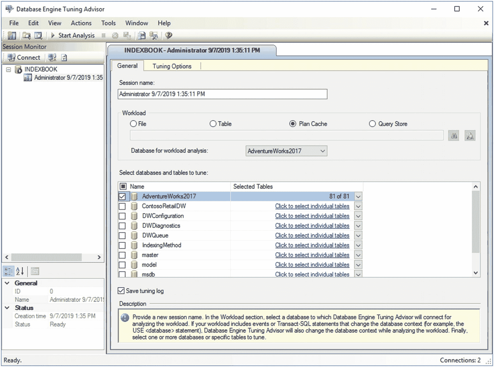
*图 10-4. 数据库引擎调优顾问的常规配置屏幕*

在会话启动屏幕的“常规选项”选项卡上，有几项内容需要初始配置。首先是**会话名称**。会话名称可以是您希望的任何值。默认值包含您的用户名以及日期和时间。接下来，选择将使用的**工作负载类型**。工作负载有四个选项：

*   `文件`：包含 SQL 跟踪输出、XML 配置或 SQL 脚本的文件。
*   `表`：包含 SQL 跟踪输出的 SQL Server 数据库表。在使用该表之前，请确保填充它的跟踪已完成。
*   `计划缓存`：调优会话所连接到的 SQL Server 的计划缓存。此功能在 SQL Server 2012 中引入，提供了一个强大的机制来调优您 SQL Server 环境中正在使用的执行计划。
*   `查询存储`：调优会话所连接到的所选数据库的查询存储。此选项在 SQL Server 2016 中引入，与计划缓存类似，提供了一个出色的机制，以最少的精力调优实际工作负载。

每种工作负载都可以用于提供建议。通过这些工作负载来源中的任何一个，都有机会调优几乎任何需要的工作负载类型。出于本练习的目的，请选择“计划缓存”选项。

下一步是选择要调优的数据库和表。对于大型数据库，只选择属于工作负载且需要索引建议的表至关重要。当 DTA 执行时，它将基于表中的信息生成统计信息，需要考虑的表越少，调优会话就能越快完成。在继续之前，勾选“选择要调优的数据库和表”部分中 `AdventureWorks2017` 数据库旁边的复选框。

### 注意

请不要在您的生产 SQL Server 环境中使用 DTA。该工具使用**穷举策略**来识别索引建议并创建**假设索引**来支持此工作。在生产环境中运行该工具可能会对服务器上的其他工作负载性能产生不利影响。考虑从命令行运行 DTA 并在远程 SQL Server 上分析生产数据库。本章稍后将演示此技术，并在第 15 章中进一步讨论。

配置好常规选项后，下一步是配置“调优选项”设置。在图 10-5 所示的屏幕上，取消选中“限制调优时间”选项。对于其他选项，保留其默认选择。这些选项应如下所示：

*   `要在数据库中使用的物理设计结构 (PDS)`：索引
*   `要采用的分区策略`：不分区
*   `要在数据库中保留的物理设计结构 (PDS)`：保留所有现有 PDS

下一步是启动数据库引擎调优顾问。这可以通过工具栏或菜单完成，方法是选择 **操作** ➤ **开始分析**。启动 DTA 后，“进度”选项卡将打开，如图 10-6 所示。

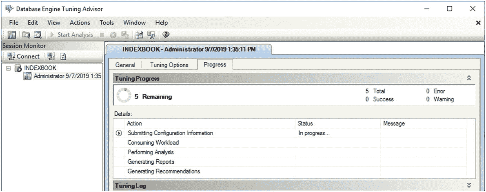
*图 10-6. 数据库引擎调优顾问的进度屏幕*

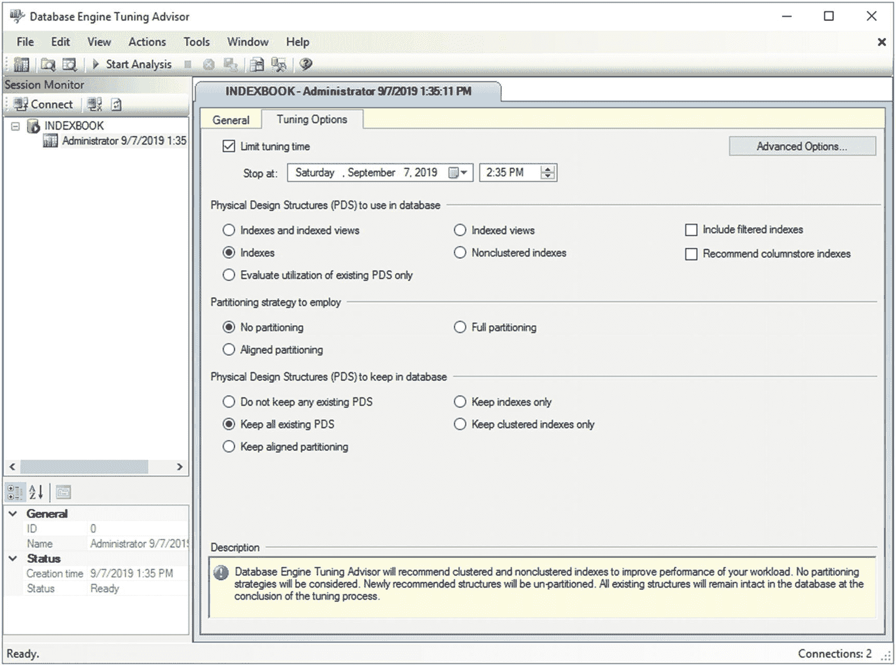
*图 10-5. 数据库引擎调优顾问的调优选项配置屏幕*

几分钟后，调优会话将完成，但这完全取决于您计算机的工作负载。使用清单 10-1 中的索引，结果应与图 10-7 中的类似。在这些结果中，有两项建议。虽然在您环境中的名称会有所不同，但建议应如下：

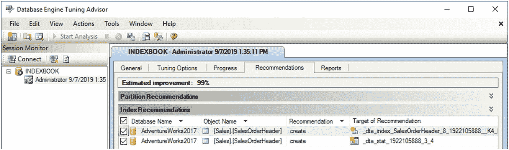
*图 10-7. 来自数据库引擎调优顾问的建议*

*   在 `OrderDate` 和 `DueDate` 上包含 `CustomerID` 的索引
*   在 `OrderDate` 和 `DueDate` 上的统计信息

该索引类似于之前使用缺失索引 DMO 找到的建议。当提供多个建议时，您将需要经历与审查缺失索引 DMO 的建议相同的考虑因素，例如“这些建议可以合并吗？”。此外，当建议创建统计信息时，它们是否与将创建的索引足够匹配，以便该索引能提供查询所需的统计信息？要从建议列表中删除任何项目，只需取消选中其复选框，它就不会包含在任何建议输出中。

此时，有几个选项可用于应用索引：

*   `应用索引`：要应用索引，请在菜单栏中选择 **操作**，然后选择 **应用建议**。在弹出的“应用建议”窗口中，保留默认的“立即应用”选项，然后单击 **确定**。
*   `将来应用索引`：要在将来应用索引，请在菜单栏中选择 **操作**，然后选择 **应用建议**。在弹出的“应用建议”窗口中，选择“计划稍后应用”。根据需要修改计划的日期，然后单击 **确定**。这将创建 SQL Agent 作业。请确保 SQL Agent 正在运行，并且代理服务帐户具有应用索引所需的权限。


### 保存建议

要保存建议，请单击菜单栏中的“保存建议”图标，然后按下组合键 `Ctrl+S`；或者，在菜单栏中选择“操作” ➤ “保存建议”。

如果建议被保存，它们将创建一个类似于清单 10-5 中的脚本。在应用来自 DTA 的索引之前，建议将索引的名称更改为符合您组织索引命名标准的名称。您还需要考虑是否对索引应用压缩；通常，建议这样做。至于统计信息，则不那么重要，原因有二。首先，`SQL Server` 会在后台根据需要创建统计信息，无需您自行构建。其次，索引包含统计信息，通常能提供所需的内容。

```
use [AdventureWorks2017]
go
CREATE NONCLUSTERED INDEX [_dta_index_SalesOrderHeader_8_1922105888__K4_K3_11] ON [Sales].[SalesOrderHeader]
(
[DueDate] ASC,
[OrderDate] ASC
)
INCLUDE([CustomerID]) WITH (SORT_IN_TEMPDB = OFF, DROP_EXISTING = OFF, ONLINE = OFF) ON [PRIMARY]
go
清单 10-5
数据库引擎优化顾问索引建议
```

通过其 `GUI` 使用 `DTA`，您可以快速处理工作负荷。返回的建议提供了比使用缺失索引 `DMO` 更高一级的索引调优。本质上，它们提供了一种强力索引操作来提升性能，而无需改进代码。与其花费数小时进行调优，而这些调优可以通过添加几个新索引来解决，不如将您的时间集中在超出仅仅添加索引范畴的性能调优问题上。

### 注意

当 `DTA` 在处理过程中被终止时，有时会留下假设索引，这些索引是它在调查可能改善环境的索引时使用的。假设索引是一种只包含统计信息而不包含数据的索引。可以通过 `sys.indexes` 中的 `is_hypothetical` 列来识别这些索引。如果它们存在于您的环境中，则应始终将其删除。

### 使用 DTA 实用工具

`GUI` 并不是在 `SQL Server` 环境中使用 `DTA` 的唯一方法。另一种方法是通过命令行使用 `DTA` 实用工具。`DTA` 实用工具虽然缺乏交互式界面，但其灵活性足以在脚本和自动化中运用 `DTA` 实用工具。

使用 `DTA` 实用工具的语法（如清单 10-6 所示）包含多个参数。这些参数（在表 10-5 中定义）使得 `DTA` 实用工具具备与 `GUI` 相同的功能和灵活性。配置信息通过参数传递，而无需点击多个屏幕。

表 10-5
DTA 实用工具参数


### DTA 命令行参数参考

### `-?`
返回帮助信息，包括所有参数的列表。

### `-A`
提供 DTA 工具用于调整工作负载的时间限制（以分钟为单位）。默认时间限制为 8 小时，即 640 分钟。将限制设置为 0 将导致无限制的调整会话。

### `-a`
在工作负载调整完成后，直接应用建议而无需进一步提示。

### `-B`
指定建议的索引可以占用的最大大小（以 MB 为单位）。默认情况下，此值设置为当前原始数据大小的三倍，或附加磁盘驱动器的可用空间加上原始数据大小，取两者中较小的一个。

### `-c`
DTA 在索引中建议的关键列的最大数量。此值默认为 `16`。该限制不包括 `INCLUDED` 列。

### `-C`
DTA 在索引中建议的列的最大数量。该值默认为 `16`，但可以提升至 `1024`（索引中允许的最大列数）。

### `-d`
标识 DTA 会话开始时连接到的数据库。此参数只能指定一个数据库。

### `-D`
标识 DTA 会话将针对其调整工作负载的数据库。可以为此参数指定一个或多个数据库。要将会话添加到多个数据库，可以在一个参数中包含所有数据库名称的逗号分隔列表，或者为每个数据库添加一个参数。

### `-e`
标识 DTA 会话将输出无法调整的事件的日志记录表或文件的名称。指定表名时，请使用三部分命名约定 `[database_name].[schema_name].[table_name]`。对于输出文件，文件的扩展名应为 `.xml`。

### `-E`
使用受信任连接设置数据库连接。不使用必需参数 `-U`。

### `-F`
授予 DTA 覆盖已存在输出文件的权限。

### `-fa`
标识 DTA 会话可以包含在建议中的物理设计结构的类型。此参数的默认值为 `IDX`。可用值如下：
- `IDX_IV`: 索引和索引视图
- `IDX`: 仅索引
- `IX`: 仅索引视图
- `NCL_IDX`: 仅非聚集索引

### `-fi`
允许 DTA 会话包含对筛选索引的建议。

### `-fc`
允许 DTA 会话包含对列存储索引的建议。

### `-fk`
设置 DTA 会话可以在建议中修改的现有物理设计结构的限制。可用值如下：
- `NONE`: 无现有结构
- `ALL`: 所有现有结构
- `ALIGNED`: 所有分区对齐的结构
- `CL_IDX`: 表上所有聚集索引
- `IDX`: 表上所有聚集和非聚集索引

### `-fp`
确定是否可以在 DTA 会话建议中包含分区建议。此参数的默认值为 `NONE`。可用值如下：
- `NONE`: 无分区
- `FULL`: 完整分区
- `ALIGNED`: 对齐分区

### `-fx`
限制 DTA 会话仅包含删除现有物理设计结构的建议。会评估会话中较少使用的索引，并提供删除它们的建议。此参数不能与 `-fa`、`-fp` 和 `-fk ALL` 参数一起使用。

### `-ID`
为 DTA 会话设置数字标识符。必须指定此参数或 `-s`。

### `-ip`
将 DTA 会话的工作负载来源设置为计划缓存。将分析使用参数 `-D` 指定的数据库的前 `–n` 个计划缓存事件。

### `-ipf`
将 DTA 会话的工作负载来源设置为计划缓存。将分析所有数据库的前 `–n` 个计划缓存事件。

### `-if`
将 DTA 会话的工作负载来源设置为文件源。路径和文件名通过此参数传递。文件必须是 SQL Server Profiler 跟踪文件（`.trc`）、SQL 文件（`.sql`）或 SQL Server 跟踪文件（`.log`）。

### `-it`
将 DTA 会话的工作负载来源设置为表。指定表名时，请使用三部分命名约定 `[database_name].dbo.[table_name]`。表的架构必须是 `dbo`。

### `-ix`
标识包含 DTA 会话配置信息的 XML 文件。XML 文件必须符合 `DTASchema.xsd`（位于 [`http://schemas.microsoft.com/sqlserver/2004/07/dta/dtaschema.xsd`](http://schemas.microsoft.com/sqlserver/2004/07/dta/dtaschema.xsd)）。

### `-m`
设置建议必须提供的最小改进百分比。

### `-n`
设置 DTA 会话应调整的工作负载中的事件数量。为跟踪文件指定时，所选事件的顺序基于持续时间的降序。

### `-N`
确定物理设计结构是联机还是脱机创建。可用值如下：
- `OFF`: 无对象联机创建。
- `ON`: 所有对象联机创建。
- `MIXED`: 尽可能创建对象。

### `-of`
配置 DTA 会话以在指定的路径和文件中以 T-SQL 格式输出建议。

### `-or`
配置 DTA 会话以 XML 格式将建议输出到报告中。未提供文件名时，将使用基于会话（`-s`）名称的文件名。

### `-ox`
配置 DTA 会话以在指定的路径和文件中以 XML 格式输出建议。

### `-P`
设置数据库连接中用于 SQL 登录的密码。

### `-q`
将 DTA 会话设置为以安静模式执行。

### `-rl`
配置 DTA 会话将生成的报告。可以选择一个或多个报告，以逗号分隔的列表形式提供。可用值如下：
- `ALL`: 所有分析报告
- `STMT_COST`: 语句成本报告
- `EVT_FREQ`: 事件频率报告
- `STMT_DET`: 语句详细信息报告
- `CUR_STMT_IDX`: 语句-索引关系报告（当前配置）
- `REC_STMT_IDX`: 语句-索引关系报告（建议配置）
- `STMT_COSTRANGE`: 语句成本范围报告
- `CUR_IDX_USAGE`: 索引使用情况报告（当前配置）
- `REC_IDX_USAGE`: 索引使用情况报告（建议配置）
- `CUR_IDX_DET`: 索引详细信息报告（当前配置）
- `REC_IDX_DET`: 索引详细信息报告（建议配置）
- `VIW_TAB`: 视图-表关系报告
- `WKLD_ANL`: 工作负载分析报告
- `DB_ACCESS`: 数据库访问报告
- `TAB_ACCESS`: 表访问报告
- `COL_ACCESS`: 列访问报告

### `-S`
设置用于 DTA 会话的 SQL Server 实例。

### `-s`
设置 DTA 会话的名称。

### `-Tf`
标识包含用于调整的表列表的路径和文件的名称。该文件应每行包含一个表，使用三部分命名约定。在每个表名之后，可以指定行数，以便针对该表的缩放版本调整工作负载。如果省略 `-Tf` 和 `-Tl`，DTA 会话将默认使用所有表。

### `-Tl`
设置用于调整的表列表。每个表应使用三部分命名约定列出，表名之间用逗号分隔。如果省略 `-Tf` 和 `-Tl`，DTA 会话将默认使用所有表。

### `-U`
设置数据库连接中用于 SQL 登录的用户名。不使用必需参数 `-E`。

### `-u`
启动带有所有配置值（已指定给 DTA 工具）的 DTA 图形用户界面。

### `-x`
启动 DTA 会话并在完成后退出。


**清单 10-6**
**DTA 工具语法**

```
dta
[ -? ] |
[
[ -S 服务器名[ \实例名 ] ]
{ { -U 登录名 [-P 密码 ] } | –E  }
{ -D 数据库名 [ ,...n ] }
[ -d 数据库名 ]
[ -Tl 表列表 | -Tf 表列表文件 ]
{ -if 工作负载文件 | -it 工作负载跟踪表名  | -ip | -ipf }
{ -s 会话名 | -ID 会话 _ID }
[ -F ]
[ -of 输出脚本文件名 ]
[ -or 输出 XML 报告文件名 ]
[ -ox 输出 _XML_ 文件名 ]
[ -rl 分析报告列表 [ ,...n ] ]
[ -ix 输入 _XML_ 文件名 ]
[ -A 调优时长（分钟） ]
[ -n 事件数量 ]
[ -m 最小改进度 ]
[ -fa 要添加的物理设计结构 ]
[ -fi 筛选索引 ]
[ -fc 列存储索引 ]
[ -fp 分区策略 ]
[ -fk 保留现有选项 ]
[ -fx 仅删除模式 ]
[ -B 存储大小 ]
[ -c 索引中最大键列数 ]
[ -C 索引中最大列数 ]
[ -e | -e 调优日志名 ]
[ -N 联机选项 ]
[ -q ]
[ -u ]
[ -x ]
[ -a ]
]
```

使用 DTA 工具相当简单。我们将看两个使用该工具的场景，它们会产生不同的结果。在第一个场景中，你将使用 DTA 工具来推荐索引更改，且仅允许非聚簇索引更改。在第二个场景中，DTA 工具将被配置为推荐任何能改善工作负载性能的索引更改。在这两个场景中，你都将使用 SQL Server 的计划缓存作为工作负载源。要填充计划缓存，请执行清单 10-7 中的查询。

```
USE AdventureWorks2017
GO
IF OBJECT_ID('dbo.SalesOrderDetail') IS NOT NULL
DROP TABLE dbo.SalesOrderDetail;
SELECT SalesOrderID, SalesOrderDetailID, CarrierTrackingNumber, OrderQty, ProductID, SpecialOfferID, UnitPrice, UnitPriceDiscount, LineTotal, rowguid, ModifiedDate
INTO dbo.SalesOrderDetail
FROM Sales.SalesOrderDetail;
CREATE CLUSTERED INDEX CL_SalesOrderDetail ON dbo.SalesOrderDetail(SalesOrderDetailID);
CREATE NONCLUSTERED INDEX IX_SalesOrderDetail ON dbo.SalesOrderDetail(SalesOrderID);
GO
SELECT SalesOrderID, CarrierTrackingNumber
INTO #temp
FROM dbo.SalesOrderDetail
WHERE SalesOrderID = 43660;
DROP TABLE #temp;
GO 1000
SELECT SalesOrderID, OrderQty
INTO #temp
FROM dbo.SalesOrderDetail
WHERE SalesOrderID = 43661;
DROP TABLE #temp;
GO 1000
```
**清单 10-7**
**场景设置**

对于第一个场景，你将构建一个类似于清单 10-8 所示的命令行脚本。对于你的环境，服务器名称（`-S`）会不同。然而，其余部分将相同。数据库（`-D` 和 `–d` 参数）将是 `AdventureWorks2017`。工作负载的来源将是计划缓存（`-ip` 参数）。会话的名称（`-s` 参数）是 `"First Scenario"`。

```
"C:\Program Files (x86)\Microsoft SQL Server Management Studio 18\Common7\dta"
-S localhost -E
-D AdventureWorks2017
-d AdventureWorks2017
-ip
-s "First Scenario"
-Tl AdventureWorks2017.dbo.SalesOrderDetail
-of "C:\Temp\First Scenario.sql"
-fa NCL_IDX
-fp NONE
-fk ALL
```
**清单 10-8**
**第一个场景的 DTA 工具语法**

准备好 DTA 工具语法后，下一步是通过命令提示符窗口执行该脚本。根据你的 SQL Server 实例和计划缓存中的信息量，执行可能需要几分钟。当它完成时，命令提示符窗口中的输出将类似于图 10-8 中所示的输出。此输出表明文件 `C:\Temp\First Scenario.sql` 包含了对清单 10-7 中查询进行调优的建议。

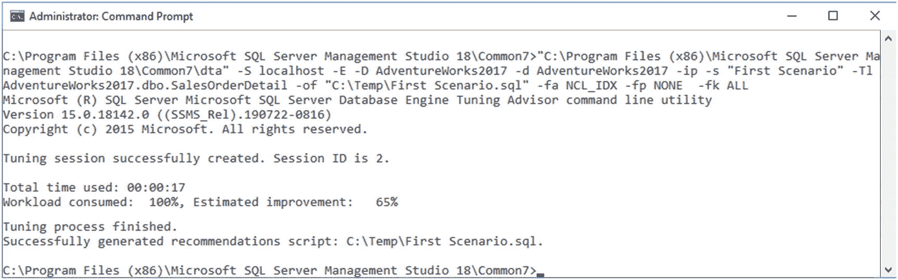

**图 10-8**
**第一个场景的命令提示符窗口**

基于传递给 DTA 工具的参数和当前工作负载，第一个场景调优会话的建议包括创建两个非聚簇索引和在两个列上的统计信息，如清单 10-9 所示。这些索引作为清单 10-7 中查询的覆盖索引发挥作用；因此，作为执行计划一部分的关键查找不再需要。统计信息提供了 SQL Server 可用于在查询中使用的列上构建良好查询计划的信息。


### 注意

清单 10-9 创建了 `dbo.SalesOrderDetail` 表。

```
use [AdventureWorks2017]
go
CREATE NONCLUSTERED INDEX [_dta_index_SalesOrderDetail_8_2119678599__K1_K2_3] ON [dbo].[SalesOrderDetail]
(
[SalesOrderID] ASC,
[SalesOrderDetailID] ASC
)
INCLUDE([CarrierTrackingNumber]) WITH (SORT_IN_TEMPDB = OFF, DROP_EXISTING = OFF, ONLINE = OFF) ON [PRIMARY]
go
CREATE NONCLUSTERED INDEX [_dta_index_SalesOrderDetail_8_2119678599__K1_K2_4] ON [dbo].[SalesOrderDetail]
(
[SalesOrderID] ASC,
[SalesOrderDetailID] ASC
)
INCLUDE([OrderQty]) WITH (SORT_IN_TEMPDB = OFF, DROP_EXISTING = OFF, ONLINE = OFF) ON [PRIMARY]
go
CREATE STATISTICS [_dta_stat_2119678599_2_1] ON [dbo].SalesOrderDetail
go
清单 10-9
第一种场景 DTA 实用工具输出
```

在第一种场景中选择的参数的缺点是，其中没有包含任何有助于确定添加此索引和统计信息的价值的信息。在下一个场景中，你将学习如何获取这些信息，同时更深入地了解如何为你数据库的物理结构提供改进建议。

要开始下一个场景，你将使用相同的数据库和查询。但是，参数会稍作修改以适应新的目标，如清单 10-10 所示。首先，你将更改会话的名称 (`-s`) 为 `"Second Scenario"`。接下来，将允许的物理结构更改（参数 `–fa`）从仅非聚集索引 (`NCL_IDX`) 更改为索引和索引视图 (`IDX_IV`)。最后，对于报告输出，是通过添加报告列表参数 (`–rl`) 到脚本中，并选择所有分析报告 (`ALL`) 选项。

```
"C:\Program Files (x86)\Microsoft SQL Server Management Studio 18\Common7\dta"
-S localhost
-D AdventureWorks2017
-d AdventureWorks2017
-ip
-s "Second Scenario"
-Tl AdventureWorks2017.dbo.SalesOrderDetail
-of "C:\Temp\Second Scenario.sql"
-fa IDX_IV
-fp NONE
-fk ALL
-rl ALL
清单 10-10
第二种场景 DTA 实用工具语法
```

使用第二种场景执行 DTA 实用工具会产生与第一种场景完全不同的结果。它没有推荐非聚集索引，而是建议更改聚集键列。在此解决方案中，DTA 会话确定了 `SalesOrderID` 列是经常用于访问数据的列，并建议将其设为聚集索引。清单 10-11 显示了这些建议。

```
use [AdventureWorks2017]
go
CREATE NONCLUSTERED INDEX [_dta_index_SalesOrderDetail_8_2119678599__K1_K2_3] ON [dbo].[SalesOrderDetail]
(
[SalesOrderID] ASC,
[SalesOrderDetailID] ASC
)
INCLUDE([CarrierTrackingNumber]) WITH (SORT_IN_TEMPDB = OFF, DROP_EXISTING = OFF, ONLINE = OFF) ON [PRIMARY]
go
CREATE NONCLUSTERED INDEX [_dta_index_SalesOrderDetail_8_2119678599__K1_K2_4] ON [dbo].[SalesOrderDetail]
(
[SalesOrderID] ASC,
[SalesOrderDetailID] ASC
)
INCLUDE([OrderQty]) WITH (SORT_IN_TEMPDB = OFF, DROP_EXISTING = OFF, ONLINE = OFF) ON [PRIMARY]
go
CREATE STATISTICS [_dta_stat_2119678599_2_1] ON [dbo].SalesOrderDetail
go
清单 10-11
第二种场景 DTA 实用工具输出
```

第二种场景的另一个不同之处是创建了一个 XML 报告文件。该会话对 `–rl` 参数使用了 `ALL` 选项，这包括了表 10-5 中为该参数列出的所有报告。这些报告提供了有关已优化的语句、与语句相关的成本、建议所提供的改进程度等信息（如图 10-9 所示）。通过这些报告，你获得了所需的信息，以便决定将哪些建议应用到你的数据库。

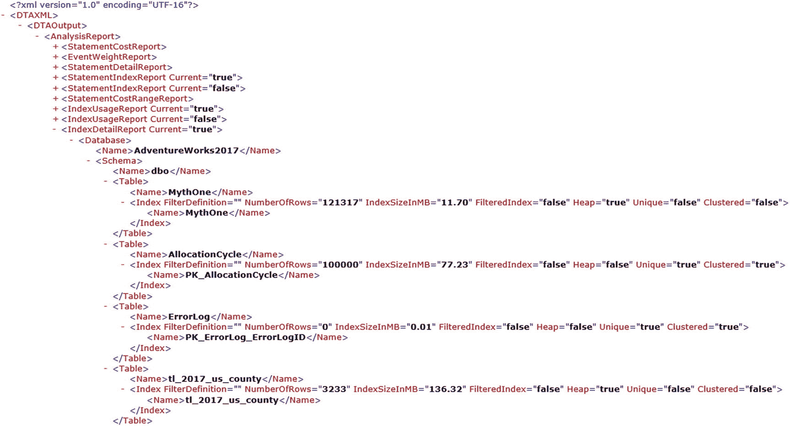

图 10-9：DTA 实用工具的示例报告输出

关于最后两个场景，需要记住的一点是，被优化的表是在一个孤立环境中优化的。表上没有任何需要考虑的约束或外键关系。在现实世界中，你的数据库设计不会是这样的，外键关系将影响建议的提供方式。此外，这些场景的工作负载仅包含两个查询。在构建工作负载时，请务必使用一个能代表你环境特征的样本。

通过本节提供的 DTA 场景，你为在索引优化活动中使用工具奠定了基础。DTA 不仅可以识别缺失的索引，而且，在给定工作负载的情况下，它还可以帮助确定聚集索引和分区可以在哪些地方协助提升性能。当你需要快速解决数据库的性能问题时，DTA 可以提供的物理更改可能极其有用。

## 总结

本章引导你了解了 SQL Server 中可用的内置索引工具。这些工具中的每一个都可以成为你 SQL Server 工具包的重要补充。它们让你能够深入探究并开始做出明智的索引决策，而无需花费大量精力。

在处理缺失索引 DMO 时，你所使用的是基于 SQL Server 实例上现有活动的索引建议。这些都是真实世界的应用，它们代表了你可以几乎立即开始构建解决方案以提高性能的领域。

而 DTA，虽然不像缺失索引 DMO 那样随时可用，但它允许你以最少的工作量，从单个查询到完整工作负载进行索引优化。调整计划缓存内容的新选项，使你能够利用环境中当前正在执行的工作来构建建议，而无需创建工作负载。

# 11. 索引策略

数据库索引通常被认为是一门艺术，数据库是画布，索引是颜料，它们共同构成了存储和性能的美丽织锦。这里添一点色彩，那里加一点色彩，画作就会成形。同样地，在表上建立一个聚集索引，然后再添加几个非聚集索引，可能会产生如任何杰作般出色的卓越性能。如果你的索引设计过于抽象或极简，可能会让你感觉良好，但性能会让你知道它不太实用。

尽管这个类比很形象，但设计和应用索引背后更多的是科学而非艺术。仅仅因为几个列可能很适合放在一起而将它们组合起来构建索引，通常不如基于成熟模式构建的索引有益。基于久经考验的实践的索引通常是最佳的解决方案。在本章中，我们将探讨多种模式，以帮助识别潜在的索引。

## 堆表

在数据库中使用堆表的有效案例很少。对于大多数 DBA 来说，一个通用的经验法则是数据库中的所有表都应该建立聚集索引，而不是堆表。虽然这一实践在许多情况下是正确的，但也存在可以接受甚至首选使用堆表的情况。本节将探讨其中一种场景，并概括性地讨论其他情况。之所以概括性地讨论，是因为很难就何时使用堆表而不是聚集索引（稍后本节将详细解释）做出一概而论的陈述。


### 临时对象

堆（heap）的一个适用场景是临时对象，例如临时表和表变量。当我们使用这些对象时，通常创建时没有考虑为其构建聚集索引。结果就是我们使用的堆表比想象中要多。

回想一下上次创建表变量或临时表的时候。创建对象时的语法是否明确指定了`CLUSTERED`索引或使用了默认配置的`PRIMARY KEY`？如果没有，那么该临时对象就是作为堆创建的。这并不是什么大问题。这在大多数工作负载中很常见——不一定需要改变你的编码实践。正如本节示例所演示的，堆和聚集索引的临时对象在性能上的差异可能微不足道。

在这个例子中，让我们从一个简单的临时表用例开始。该示例使用`Sales.SalesOrderHeader`表，根据`SalesPersonID`检索几行数据，然后将其插入临时表。这个临时表将用于返回`Sales.SalesOrderDetail`表中所有与临时表结果匹配的行。将使用两个版本的示例来演示在临时表上使用堆或聚集索引如何不影响查询执行。

在第一个版本示例（如清单 11-1 所示）中，临时表是使用堆构建的。这是人们创建临时对象的常用方法。如图 11-1 中的执行计划所示，当访问临时表（由箭头标识）时，使用表扫描来访问对象中的行。这种行为在堆中是预期的。因为行是无序的，所以在首先检查所有行之前，无法访问特定的行。为了找到`Sales.SalesOrderDetail`表中与临时表匹配的所有行，执行计划使用了带有索引查找的嵌套循环。

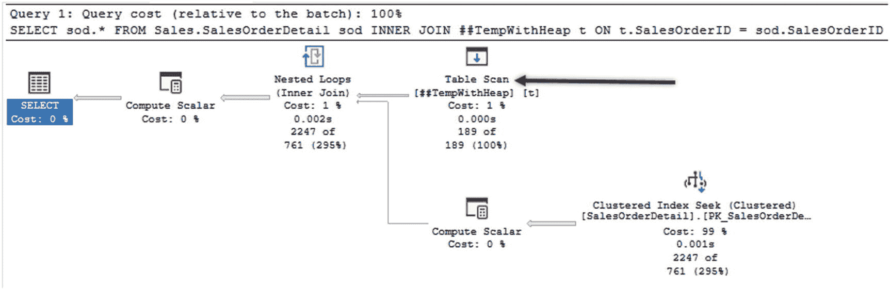

图 11-1
堆临时对象的执行计划

```sql
USE AdventureWorks2017
GO
IF OBJECT_ID('tempdb..##TempWithHeap') IS NOT NULL
DROP TABLE ##TempWithHeap
CREATE TABLE ##TempWithHeap
(
SalesOrderID INT
);
INSERT INTO ##TempWithHeap
SELECT SalesOrderID
FROM Sales.SalesOrderHeader
WHERE SalesPersonID = 283;
SELECT sod.* FROM Sales.SalesOrderDetail sod
INNER JOIN ##TempWithHeap t ON t.SalesOrderID = sod.SalesOrderID;
GO
```

清单 11-1
使用堆的临时对象

在脚本的第二个版本中（如清单 11-2 所示），临时表改为在`SalesOrderID`列上创建聚集索引。索引是两个脚本之间的唯一区别。这种差异导致执行计划略有变化。图 11-2 显示了聚集索引版本的执行计划。两个计划的区别在于，对临时表使用了聚集索引扫描而不是表扫描。虽然这是不同的操作，但两者所做的工作本质上是相同的。在查询执行期间，访问临时对象中的所有行，同时将它们与`Sales.SalesOrderDetail`中的行进行连接。

```sql
USE AdventureWorks2017
GO
IF OBJECT_ID('tempdb..##TempWithClusteredIX') IS NOT NULL
DROP TABLE ##TempWithClusteredIX
CREATE TABLE ##TempWithClusteredIX
(
SalesOrderID INT PRIMARY KEY CLUSTERED
)
INSERT INTO ##TempWithClusteredIX
SELECT SalesOrderID
FROM Sales.SalesOrderHeader
WHERE SalesPersonID = 283
SELECT sod.* FROM Sales.SalesOrderDetail sod
INNER JOIN ##TempWithClusteredIX t ON t.SalesOrderID = sod.SalesOrderID
GO
```

清单 11-2
使用聚集索引的临时对象

### 注意

自 SQL Server 2014 起，表变量也可以拥有聚集和非聚集索引。要求是在声明变量时创建索引。在表变量定义之后，不允许对其进行 DDL 操作。

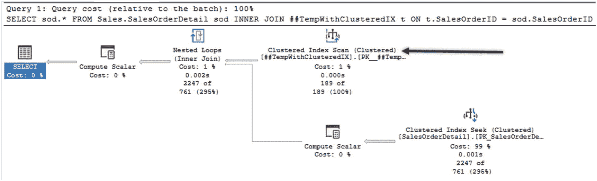

图 11-2
聚集临时对象的执行计划

在本章节类似的查询中，堆和聚集索引的临时表执行计划几乎相同。与所有规则一样，可能存在性能不同的例外情况。使用堆可能影响性能的一个好例子是在其执行中利用排序的 T-SQL 语法。清单 11-3 展示了一个在`WHERE`子句中使用`EXISTS`的具体例子。图 11-3 显示了该查询的执行计划。在嵌套循环连接解析`EXISTS`谓词之前，数据必须首先排序。在这种情况下，使用堆阻碍了查询的性能，因为堆表强制进行排序操作。对于小型数据集，性能差异可能不明显。随着数据集大小的增加，像包含排序操作这样的小变化会加剧查询的性能影响。

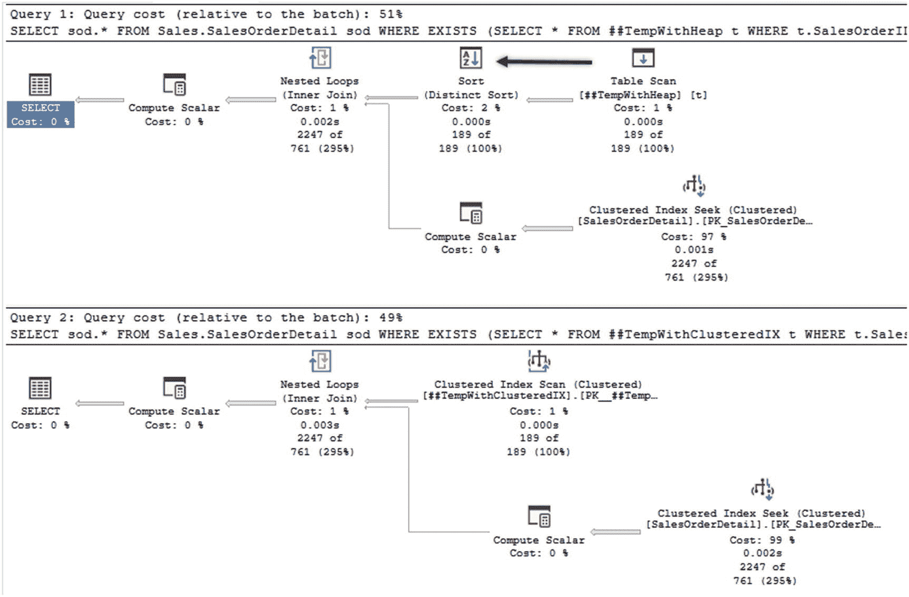

图 11-3
`EXISTS`示例执行计划

```sql
USE AdventureWorks2017
GO
SELECT sod.* FROM Sales.SalesOrderDetail sod
WHERE EXISTS (SELECT * FROM ##TempWithHeap t WHERE t.SalesOrderID = sod.SalesOrderID);
GO
SELECT sod.* FROM Sales.SalesOrderDetail sod
WHERE EXISTS (SELECT * FROM ##TempWithClusteredIX t WHERE t.SalesOrderID = sod.SalesOrderID);
```

清单 11-3
`EXISTS`示例

### 其他堆场景

通常，其他适合使用堆的场景很少且相隔很远。临时对象有意义的原因在于数据访问的频率较低，相比于构建一个支持性能的结构（例如聚集索引）所需的时间而言。这种情况也可以延伸到暂存表，因为数据在移动到最终目的地之前通常会被插入和修改几次。

在高插入量的环境中，使用堆来避免维护 B 树的开销似乎是有意义的。这种场景的问题在于，插入带来的收益被访问数据的需求所抵消，这需要其他的非聚集索引，而这些索引又需要维护排序顺序。

当面临在表上使用堆的情况时，首先应证明聚集索引是数据存储的负担，然后再使用它们。在考虑堆之前，也应考虑较新的索引结构（如聚集列存储索引或内存优化表）是否能提供所需的性能。

本节的重点是，堆在现实世界中的使用比许多人意识到的更为频繁。尽管大多数实践都反对使用它们，但确实存在一些案例和场景它们是合适的，而在另一些场景中，有无堆都没有关系。随着讨论转向聚集索引，你将会明白为什么通常默认使用聚集索引是更好的主意，而在堆无关紧要（例如大多数临时对象用例）或堆性能优于聚集索引的情况下才使用堆。


## 聚簇索引

本书中已经讨论过使用聚簇索引作为表数据页组织结构的价值和偏好。聚簇索引根据其键列来组织表中的数据。索引的所有数据页都依据键列进行逻辑存储。这样做的好处是能够通过键列实现对数据的最佳访问。

新建表时，几乎总是应该构建聚簇索引。然而，在构建表时的问题是，应该为聚簇索引的键列选择什么。定义良好的聚簇索引通常具有一些最常见的特性。这些特性是：
- 静态
- 窄
- 唯一
- 单调递增

这些属性中的每一个都有助于创建定义良好的聚簇索引，原因如下。

首先，聚簇索引应该是静态的。为聚簇索引定义的键列应该在行的生命周期内保持静态。通过使用静态值，当行更新时，其在索引中的位置不会改变。如果使用非静态键列，行在聚簇索引中的位置可能会改变，这可能要求该行被插入到不同的页面上。此外，非聚簇索引也需要被修改，以更改存储在这些索引中的键列值，因为聚簇索引键列被包含在非聚簇索引中。所有这些因素综合起来，可能导致表上的聚簇和非聚簇索引出现碎片。

聚簇索引应具备的下一个属性是“窄”。理想情况下，聚簇索引键应仅包含单个列。这些列应使用适合表中存储数据的最小合理数据类型来定义。窄的聚簇索引很重要，因为每一行的聚簇索引键都包含在与该表关联的所有非聚簇索引中。聚簇索引键越宽，所有非聚簇索引也会越宽，并且需要的页面就越多。正如其他章节所讨论的，索引中的页面越多，使用该索引所需的资源就越多。这可能会影响查询的性能。

聚簇索引还应该是唯一的。聚簇索引在索引中的单个位置存储单行；对于聚簇索引键列内的重复行，**唯一标识符**提供了行所需的唯一性。当唯一标识符被添加到一行时，该行会扩展 4 个字节，这会改变聚簇索引的“窄”度，并导致与非窄聚簇索引相同的担忧。您可以在第 2 章中找到有关唯一标识符的更多信息。

最后，一个定义良好的聚簇索引将基于一个单调递增的值。使用单调递增的聚簇键会导致新行被添加到聚簇索引的末尾。将新行放在 B 树的末尾，可以减少如果行被插入到聚簇索引中间可能导致的碎片。

选择聚簇索引键列时的另一个考虑因素是，它们代表行中最常用于访问该行的列。是否有特定的列或值将最常用于从表中检索行？如果有，这些列是聚簇索引键的良好候选。最终，当查询能够通过阻力最小的路径访问数据时，它们的性能将达到最佳。

在考虑上述选择聚簇索引策略的指导原则时，有一些模式可用于识别和建模聚簇索引。聚簇索引的模式包括：
- 标识序列
- 自然键
- 外键
- 多列
- 全局唯一标识符

在本节剩余部分，我们将引导您了解每种模式，描述它们以及如何识别何时使用该模式。

### 标识序列

构建聚簇索引最常见的模式是将其与表中配置为单调递增的列配对，该列使用 `IDENTITY` 属性或 `SEQUENCE` 对象。在此模式中，`IDENTITY` 列通常也是表上的 `PRIMARY KEY`。数据类型通常是整数，包括 `tinyint`、`smallint`、`int` 和 `bigint`。此模式的主要优点是它实现了定义良好的聚簇索引的所有属性。它是静态的、窄的、唯一的且单调递增的。当考虑数据将如何被访问时，在大多数情况下，键值将最常用于访问表中的行。

标识序列模式的一个区别在于，用作聚簇索引键的列与行中的数据和聚簇索引键之间没有关系。为了实现该模式，会向表中添加一个新列，该列包含 `IDENTITY` 属性或 `SEQUENCE` 默认值。然后将此列设置为聚簇索引键，通常也设置为 `PRIMARY KEY`。

几乎所有数据库中都能找到此模式的示例。创建一个使用此模式的表看起来类似于代码清单 11-4 中的 `CREATE TABLE` 语句。两个表都设计用于存储水果：插入了两行苹果、一行香蕉和一行葡萄。`Color` 列不会是一个好的聚簇键，因为它不能唯一标识表中的行。`FruitName` 列本可以标识表中的行，但它在整个表中不是唯一的，这将需要使用唯一标识符，并导致更大的聚簇键。按照标识序列模式对表进行索引，创建了一个 `FruitID` 列。

```sql
USE AdventureWorks2017
GO
IF OBJECT_ID('IndexStrategiesFruit_Identity') IS NOT NULL
DROP TABLE IndexStrategiesFruit_Identity
CREATE TABLE dbo.IndexStrategiesFruit_Identity
(
FruitID int IDENTITY(1,1)
,FruitName varchar(25)
,Color varchar(10)
,CONSTRAINT PK_Fruit_FruitID_Idnt PRIMARY KEY CLUSTERED (FruitID)
);
INSERT INTO dbo.IndexStrategiesFruit_Identity(FruitName, Color)
VALUES('Apple','Red'),('Banana','Yellow'),('Apple','Green'),('Grape','Green');
SELECT FruitID, FruitName, Color
FROM dbo.IndexStrategiesFruit_Identity;
IF OBJECT_ID('IndexStrategiesFruit_Sequence') IS NOT NULL
DROP TABLE IndexStrategiesFruit_Sequence
IF OBJECT_ID('FruitSequence') IS NOT NULL
DROP SEQUENCE FruitSequence
CREATE SEQUENCE FruitSequence AS INTEGER
START WITH 1;
CREATE TABLE dbo.IndexStrategiesFruit_Sequence
(
FruitID int DEFAULT NEXT VALUE FOR FruitSequence
,FruitName varchar(25)
,Color varchar(10)
,CONSTRAINT PK_Fruit_FruitID_Seq PRIMARY KEY CLUSTERED (FruitID)
);
INSERT INTO dbo.IndexStrategiesFruit_Sequence(FruitName, Color)
VALUES('Apple','Red'),('Banana','Yellow'),('Apple','Green'),('Grape','Green');
SELECT FruitID, FruitName, Color
FROM dbo.IndexStrategiesFruit_Sequence;
```
*代码清单 11-4: 为标识序列模式创建和填充表*

使用标识序列模式的效果之一是，聚簇键列的值与其所代表的信息之间没有关联。在代码清单 11-1 的查询输出中（如图 11-4 所示），对于两个结果集，值 1 都分配给了插入的第一行。然后，值 2 分配给下一行，依此类推。随着更多行的添加，`FruitID` 列会递增，并且不需要记录中的任何特定信息来指定该信息实例。

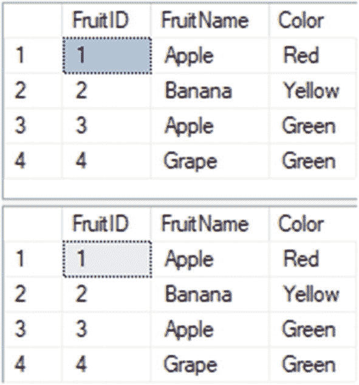

*图 11-4: 标识序列模式的结果*


#### 注意事项

`SEQUENCE` 是 SQL Server 2012 中引入的新对象。通过序列，可以生成一系列数值，这些数值可以是升序或降序的。序列不与任何特定的表关联。如果你不熟悉 `SEQUENCE` 的使用，出于性能和控制目的，建议你考虑使用序列而非 `IDENTITY`。这些内容超出了本书的讨论范围。

### 自然键

在某些情况下，在数据中使用自然键作为聚簇键，与向表中添加一个标识列以用于标识列模式（Identity Column pattern）同样有效。自然键是数据中一个能唯一标识一行与其他所有行不同的列。当数据中存在一个自然键，且该键符合明确定义的聚簇键的属性时，就可以确定使用自然键是有效的。当使用自然键作为聚簇键时，它们不太可能是始终递增的，但它们仍然应该是唯一的、窄的且静态的。

自然键可以替代标识列的一个常见例子是，查看包含一到两个字符缩写来表示其所代表信息的表。这些缩写可能代表订单状态、产品尺寸，或州/省列表。与在标识列模式中使用 4 字节的 `int` 相比，在自然键模式中使用 `char(1)` 或 `char(2)` 数据类型将产生比前者更窄的聚簇键。另一个例子是在日期表中使用 yyyymmdd 或时间戳格式的日期。

自然键模式还有一个额外的好处，即提供更易于解读的键值。当使用标识列模式时，聚簇键值为 1 或 7 并没有内在含义。这些值是无意义的——故意如此。而使用自然键模式时，`O` 和 `C` 的缩写则代表真实信息（分别代表“已打开”和“已关闭”）。

作为一个自然键模式的简单示例，让我们考虑一个包含州及其缩写的表。我们还将包括每个州所在的国家名称。清单 11-5 展示了创建并填充该表的 SQL。该表有一个 `StateAbbreviation` 列，其类型为 `char(2)`。由于对于每个州来说，这是一个窄的、唯一的且静态的值，因此聚簇索引是创建在此列上的。接下来，为这个虚构数据库所需的四个州添加了几行数据。

```sql
USE AdventureWorks2017
GO
CREATE TABLE dbo.IndexStrategiesNatural
(
StateAbbreviation char(2)
,StateName varchar(25)
,Country varchar(25)
,CONSTRAINT PK_State_StateAbbreviation PRIMARY KEY CLUSTERED (StateAbbreviation)
);
INSERT INTO dbo.IndexStrategiesNatural(StateAbbreviation, StateName, Country)
VALUES('MN','Minnesota','United States')
,('FL','Florida','United States')
,('WI','Wisconsin','United States')
,('NH','New Hampshire','United States');
SELECT StateAbbreviation, StateName, Country
FROM dbo.IndexStrategiesNatural;
```

清单 11-5 为自然键模式创建并填充表

在自然键匹配自然键模式的情况下，清单 11-5 中的技术可以是选择聚簇键列的一种有用方式。查看 `dbo.IndexStrategiesNatural` 的内容（如图 11-5 所示），表中存在四行数据，并且在其他表中使用 `StateAbbreviation` 作为外键值可能是有用的，因为 `MN` 这个值具有某种内在含义。

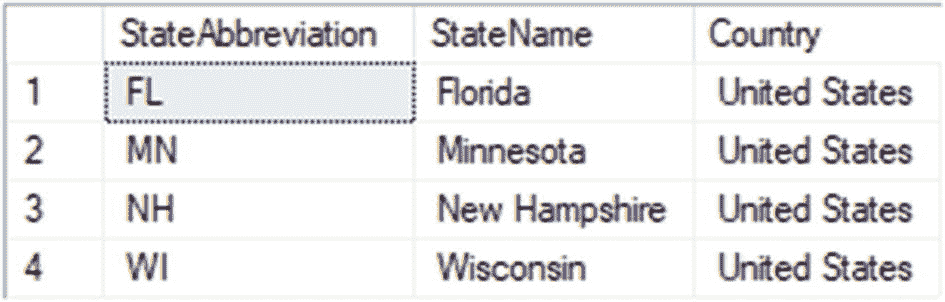
图 11-5 自然键模式的结果

这种模式看起来似乎很理想，并且比标识列模式更有价值——特别是因为聚簇键的值有助于描述数据。然而，使用这种模式也有一些缺点，这些缺点与能使其成为明确定义的聚簇键的属性有关。

首先，让我们考虑聚簇键的唯一性。假设数据库和表的使用场景永不改变，那么可以相信这些值将保持唯一。但是，当数据库需要在国际环境中使用时会发生什么？如果需要包含其他国家/地区的州，例如荷兰，那么出现数据问题的潜在可能性就很大。在荷兰，FL 是弗莱福兰（Flevopolder）的缩写，NH 是北荷兰省（Noord-Holland）的缩写。将一个本该送往弗莱福兰的订单发送到佛罗里达（Florida），可能会带来严重的业务后果。为了保持唯一性，需要在自然键和聚簇键中添加一些超出这两个字符缩写的内容。

改变自然键进而会影响聚簇键的“窄度”。可能有两种方法可以解决这个问题。第一个选项是在自然键中添加另一列，以标识州缩写属于哪个国家。第二个选项是增大州缩写的大小，在同一列中包含国家缩写。无论采用哪种解决方案，聚簇键的大小都将超过 4 字节，而使用 `int` 数据类型和标识列模式则可以维持一个窄的聚簇键。

此外，要始终考虑自然键是否真的是静态的。州缩写可以改变。虽然这种情况不太常见——美国上一次改变发生在 1987 年，当时所有州缩写都被标准化了——但对于几乎所有类型的自然键来说，偶尔都会发生变化。一个例子是南斯拉夫及其六个共和国，它们后来成为了独立的国家。另一个例子是苏联，它演变成了俄罗斯联邦，进而导致许多其他国家的成立。诸如州和国家缩写这样的值看起来可能是静态的，但在更大的尺度上是存在变化的。同时，着眼于你的应用程序，代表工作流状态的状态码今天可能是准确的，但未来可能会有新的、不同的含义。

最后，有时表面的自然键可能由不应广泛分发的数据构成。多年来，政府标识符（如社会安全号码）经常被用作数据库中的自然键，尤其是在医疗和教育系统中。虽然这能充分标识个人，但这绝对不是应该让数据库用户轻易获取的信息。在大多数现代数据库中，政府标识符现在需要加密，当这类自然键被用于聚簇索引并可能作为主键时，这会导致巨大的问题。

自然键模式对于选择索引列是设计聚簇索引的一个有效模式。如示例所示，它可以是唯一的、窄的且静态的。在将自然键用于聚簇索引之前，请查看该表当前和未来的应用。


### 外键模式

外键模式是创建聚集索引时最常被忽视的模式之一，它使用外键列作为表的聚集键。虽然该模式并非适用于所有外键场景，但在设计具有一对多关系的主表与明细表时非常有用。外键模式包含了构成良好聚集键的所有属性，不过其中几个属性需要注意。

### 实施外键模式

实施此模式的方式类似于实施标识列模式。该模式包含两个表，其列设置了 `IDENTITY` 属性。清单 11-6 展示了一个示例。示例中创建了三个表：第一个是主表 `dbo.IndexStrategiesHeader`，其聚集索引建立在 `HeaderID` 列上。第二个表是明细表的第一个版本 `dbo.IndexStrategiesDetail_ICP`，它被设计为主表的子表，聚集索引使用标识列模式构建，并在 `HeaderID` 列上建立了索引以提高性能。第三个表也是明细表 `dbo.IndexStrategiesDetail_FKP`，它使用外键模式设计。其聚集索引并非建立在带有 `IDENTITY` 属性的列上，而是包含两列：第一列来自父表 `HeaderID`，第二列是该表的主键 `DetailID`。为了提供示例数据，使用了 `sys.indexes` 和 `sys.index_columns` 来填充所有表。

```sql
USE AdventureWorks2017
GO
CREATE TABLE dbo.IndexStrategiesHeader
(
HeaderID int IDENTITY(1,1)
,FillerData char(250)
,CONSTRAINT PK_Header_HeaderID PRIMARY KEY CLUSTERED (HeaderID)
);
CREATE TABLE dbo.IndexStrategiesDetail_ICP
(
DetailID int IDENTITY(1,1)
,HeaderID int
,FillerData char(500)
,CONSTRAINT PK_Detail_ICP_DetailID PRIMARY KEY CLUSTERED (DetailID)
,CONSTRAINT FK_Detail_ICP_HeaderID FOREIGN KEY (HeaderID) REFERENCES IndexStrategiesHeader(HeaderID)
);
CREATE INDEX IX_Detail_ICP_HeaderID ON dbo.IndexStrategiesDetail_ICP (HeaderID)
CREATE TABLE dbo.IndexStrategiesDetail_FKP
(
DetailID int IDENTITY(1,1)
,HeaderID int
,FillerData char(500)
,CONSTRAINT PK_Detail_FKP_DetailID PRIMARY KEY NONCLUSTERED (DetailID)
,CONSTRAINT CLUS_Detail_FKP_HeaderIDDetailID UNIQUE CLUSTERED (HeaderID, DetailID)
,CONSTRAINT FK_Detail_FKP_HeaderID FOREIGN KEY (HeaderID) REFERENCES IndexStrategiesHeader(HeaderID)
);
GO
INSERT INTO dbo.IndexStrategiesHeader(FillerData)
SELECT CONVERT(varchar,object_id)+name
FROM sys.indexes
INSERT INTO dbo.IndexStrategiesDetail_ICP
SELECT ish.HeaderID, CONVERT(varchar,ic.index_column_id)+'-'+FillerData
FROM dbo.IndexStrategiesHeader ish
INNER JOIN sys.indexes i ON ish.FillerData = CONVERT(varchar,i.object_id)+i.name
INNER JOIN sys.index_columns ic ON i.object_id = ic.object_id AND i.index_id = ic.index_id
INSERT INTO dbo.IndexStrategiesDetail_FKP
SELECT ish.HeaderID, CONVERT(varchar,ic.index_column_id)+'-'+FillerData
FROM dbo.IndexStrategiesHeader ish
INNER JOIN sys.indexes i ON ish.FillerData = CONVERT(varchar,i.object_id)+i.name
INNER JOIN sys.index_columns ic ON i.object_id = ic.object_id AND i.index_id = ic.index_id
```
清单 11-6
为外键模式创建和填充表

### 性能比较

现在，我们有了采用两种聚集索引模式设计的三个表：标识序列和外键模式。此模式的关键在于，根据表常见的使用模式，数据应尽可能高效地返回。在此类场景中，有两种常见的用例：第一种是返回主表中的一行及其对应的所有明细行；第二种是返回主表中的多行及其在明细表中的所有相关行。

#### 用例 1：返回单行主数据

首先，我们考察返回主表中一行及其相关明细行的性能差异。清单 11-7 中的代码对这两种聚集索引模式执行了此用例。正如预期，两个查询返回的数据集是相同的，差异体现在统计信息和查询计划上。首先，查看在用例 1 中使用 `STATISTICS IO` 时的统计输出（如图 11-6 所示）。标识列模式的读取次数为四次，而外键模式的读取次数为两次。虽然这些数字很小，但这是两倍的差异，如果这些是高度频繁使用的查询，可能会对数据库产生显著影响。执行计划的差异则更为明显（如图 11-7 所示）。对于第一个查询，需要对明细表执行索引查找、键查找和嵌套循环。相比之下，第二个查询使用聚集索引查找获取了相同的信息。此示例清楚地表明，外键模式的性能优于标识列模式。

图 11-7
外键模式下单行主数据的执行计划

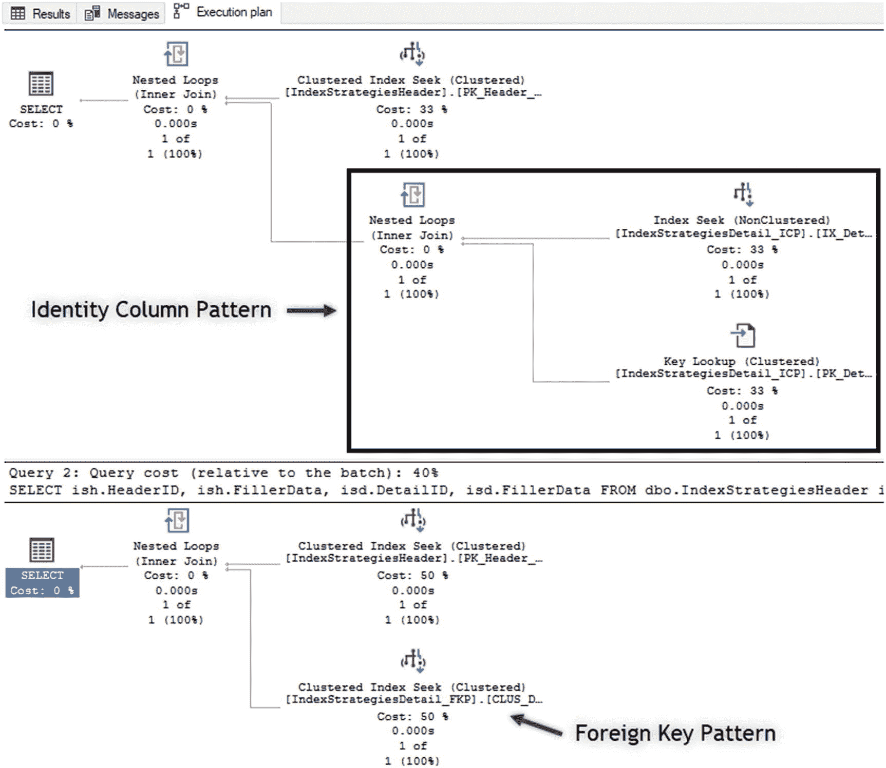

图 11-6
外键模式下单行主数据的结果

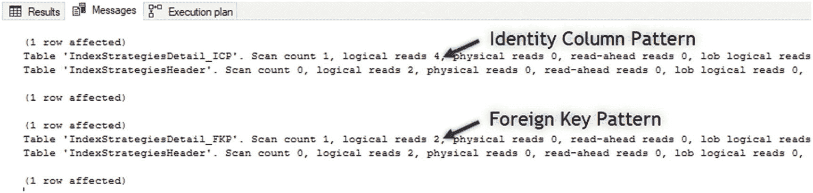

```sql
Use AdventureWorks2017
GO
SET STATISTICS IO ON
SELECT  ish.HeaderID, ish.FillerData, isd.DetailID, isd.FillerData
FROM dbo.IndexStrategiesHeader ish
INNER JOIN dbo.IndexStrategiesDetail_ICP isd ON ish.HeaderID = isd.HeaderID
WHERE ish.HeaderID = 10
SELECT  ish.HeaderID, ish.FillerData, isd.DetailID, isd.FillerData
FROM dbo.IndexStrategiesHeader ish
INNER JOIN dbo.IndexStrategiesDetail_FKP isd ON ish.HeaderID = isd.HeaderID
WHERE ish.HeaderID = 10
```
清单 11-7
外键模式下的单行主数据查询

#### 用例 2：返回多行主数据

基于第一个用例的成功，我们考察第二个用例。如清单 11-8 所示，此查询将从主表中检索多行，并从明细表中检索与主行 `HeaderID` 匹配的数据。同样，使用两种聚集索引模式的查询返回的数据相同，但执行性能存在差异。第一个差异体现在 `STATISTICS IO` 输出中（如图 11-8 所示）。第一次执行中，主表上有 158 次读取，明细表上有 44 次读取。相比之下，外键模式的主表读取次数为四次，明细表读取次数为八次，显然外键模式性能更佳。事实上，外键模式的读取次数比标识列模式低一个数量级。性能差异的原因可以通过图 11-9 所示的执行计划来解释。在执行计划中，第一个查询需要对明细表执行 `clustered index scan` 以返回明细行。而使用外键模式的第二个查询则不需要此操作，它使用了聚集索引查找。

图 11-9
外键模式下多行主数据的执行计划

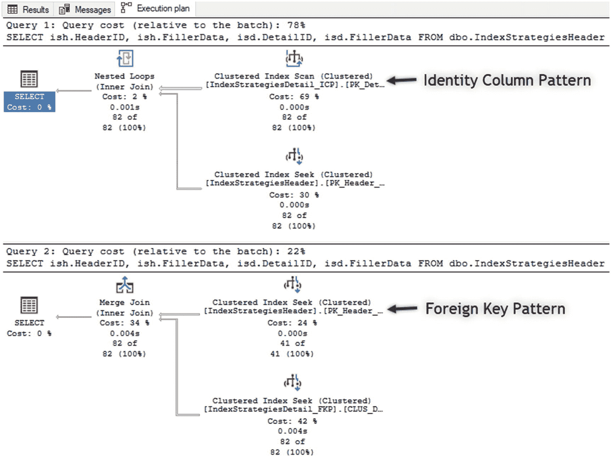

图 11-8
外键模式下多行主数据的结果

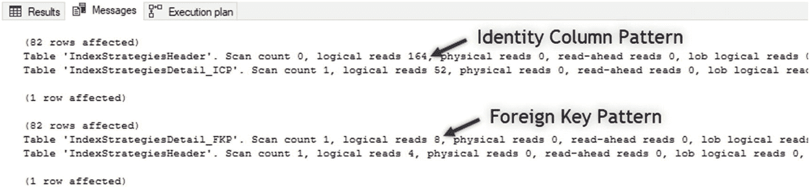


### 外键模式

通过本节中的两个用例，我们可以看到外键模式如何优于标识列模式。然而，在数据库中实现此模式之前，需要考虑一些事项。需要回答的主要问题是：行是否最常通过明细表的主键或其与头表的外键关系进行检索？并非所有外键都适合此聚簇索引模式；仅当表之间存在头-明细关系时，此模式才有效。

如前所述，使用外键模式时，关于明确定义的聚簇索引的属性有几个注意事项。在窄度方面，该模式不如标识列模式窄。它不是使用单个基于整数的列，而是由两个这样的列组成聚簇键。当使用 `int` 数据类型时，聚簇键的大小将从 4 字节增加到 8 字节。虽然这个值不算太大，但它会影响表上非聚集索引的大小。在大多数情况下，外键模式下的聚簇键是静态的。某些明细行的头行有时可能需要更改，例如当记录了两个订单并需要合并发货时。因此，外键模式并非完全静态。键可以更改，但不应频繁更改。如果有频繁的更改，您应该重新考虑使用此聚簇索引模式。最后一个有注意事项的属性是聚簇键是否始终递增。通常，情况应是如此。典型的插入模式是创建头记录和明细记录。在这种情况下，头行按顺序创建并插入，然后是它们的明细记录。如果写入明细记录存在延迟，或者稍后向头行添加了更多明细记录，则键将不会始终递增。结果，可能会产生与此聚簇索引模式相关的额外碎片和维护。

外键模式并非适用于所有数据库的聚簇索引模式。但当适用时，它非常有益，并且可以缓解可能不如其他问题明显的性能问题。在设计聚簇索引时，考虑使用此模式并审查其相关注意事项以确定是否合适非常重要。

#### 多列模式

可用于设计聚簇索引的下一个模式是多列模式。在此模式中，两个或多个表与第三个表存在关系，从而允许信息之间存在多对多关系。例如，可能有一个表存储员工信息，另一个表包含职位角色。为了表示这种关系，使用了第三个表。通过多列模式，不是在该表上使用带有 `IDENTITY` 属性的新列，而是用于关系的列充当聚簇键。

多列模式类似于外键模式，并提供与前一模式相同的许多性能增强。您很快会看到，在多对多关系表中，通常有一列或另一列是聚簇键的最佳候选。与其他模式类似，此模式也遵循明确定义聚簇索引的大多数属性。该模式是唯一的，并且大多是窄的和静态的；当您浏览多列模式的示例时，这些属性将显而易见。

为了演示多列模式，让我们从定义几个表及其关系开始。首先，有用于存储员工和职位角色信息的表，分别名为 `dbo.Employee` 和 `dbo.JobRole`。两个名为 `dbo.EmployeeJobRole_ICP` 和 `dbo.EmployeeJobRole_MCP` 的表用于在示例关系中表示标识列和多列模式（参见清单 11-9）。示例脚本包含插入语句以提供一些要使用的示例数据。此外，在表上创建了非聚集索引以提供真实场景。

```
USE AdventureWorks2017
GO
CREATE TABLE dbo.Employee (
EmployeeID int IDENTITY(1,1)
,EmployeeName varchar(100)
,FillerData varchar(1000)
,CONSTRAINT PK_Employee PRIMARY KEY CLUSTERED (EmployeeID));
CREATE INDEX IX_Employee_EmployeeName ON dbo.Employee(EmployeeName);
CREATE TABLE dbo.JobRole (
JobRoleID int IDENTITY(1,1)
,RoleName varchar(25)
,FillerData varchar(200)
,CONSTRAINT PK_JobRole PRIMARY KEY CLUSTERED (JobRoleID));
CREATE INDEX IX_JobRole_RoleName ON dbo.JobRole(RoleName);
CREATE TABLE dbo.EmployeeJobRole_ICP (
EmployeeJobRoleID int IDENTITY(1,1)
,EmployeeID int
,JobRoleID int
,CONSTRAINT PK_EmployeeJobRole_ICP PRIMARY KEY CLUSTERED (EmployeeJobRoleID)
,CONSTRAINT UIX_EmployeeJobRole_ICP UNIQUE (EmployeeID, JobRoleID))
CREATE INDEX IX_EmployeeJobRole_ICP_EmployeeID ON dbo.EmployeeJobRole_ICP(EmployeeID);
CREATE INDEX IX_EmployeeJobRole_ICP_JobRoleID ON dbo.EmployeeJobRole_ICP(JobRoleID);
CREATE TABLE dbo.EmployeeJobRole_MCP (
EmployeeJobRoleID int IDENTITY(1,1)
,EmployeeID int
,JobRoleID int
,CONSTRAINT PK_EmployeeJobRoleID PRIMARY KEY NONCLUSTERED (EmployeeJobRoleID)
,CONSTRAINT CUIX_EmployeeJobRole_ICP UNIQUE CLUSTERED (EmployeeID, JobRoleID));
CREATE INDEX IX_EmployeeJobRole_MCP_JobRoleID ON dbo.EmployeeJobRole_MCP(JobRoleID);
INSERT INTO dbo.Employee (EmployeeName)
SELECT OBJECT_SCHEMA_NAME(object_id)+'|'+name
FROM sys.tables;
INSERT INTO dbo.JobRole (RoleName)
VALUES ('Cook'),('Butcher'),('Candlestick Maker');
INSERT INTO dbo.EmployeeJobRole_ICP (EmployeeID, JobRoleID)
SELECT EmployeeID, 1 FROM dbo.Employee
UNION ALL SELECT EmployeeID, 2 FROM dbo.Employee WHERE EmployeeID / 4 = 1
UNION ALL SELECT EmployeeID, 3 FROM dbo.Employee WHERE EmployeeID / 8 = 1;
INSERT INTO dbo.EmployeeJobRole_MCP (EmployeeID, JobRoleID)
SELECT EmployeeID, 1 FROM dbo.Employee
UNION ALL SELECT EmployeeID, 2 FROM dbo.Employee WHERE EmployeeID / 4 = 1
UNION ALL SELECT EmployeeID, 3 FROM dbo.Employee WHERE EmployeeID / 8 = 1;
```


### 索引模式对比测试与分析

#### 第一个测试：基于 `RoleName` 的查询

针对示例表的第一个测试将查询所有三张表以获取员工姓名和工作角色信息。清单 [11-10] 中显示的查询基于 `dbo.JobRole` 表中的 `RoleName` 来检索信息。在代码中，`EmployeeJobRole` 表的两个版本使用不同的聚簇键创建。这导致执行计划存在显著差异，如图 [11-10] 和图 [11-11] 所示。第一个执行计划使用应用了标识列模式的表，比第二个查询的执行计划更复杂，并且占用了另一个计划 61% 的成本。第二个计划基于多列模式设置其聚簇键，操作更少，占执行成本的 39%。两个计划的主要区别在于，使用多列模式允许聚簇索引基于一个可能经常用于访问表中行的列（本例中是 `JobRoleID` 列）来覆盖表访问。使用另一种模式则无法提供此优势，并且代表了一种不太可能使用的数据访问路径（除非可能需要删除行时）。

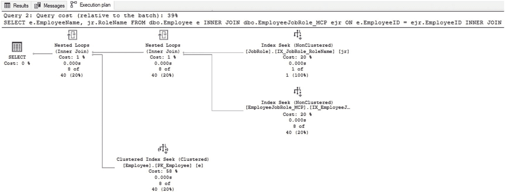
*图 11-11：多列模式的执行计划*

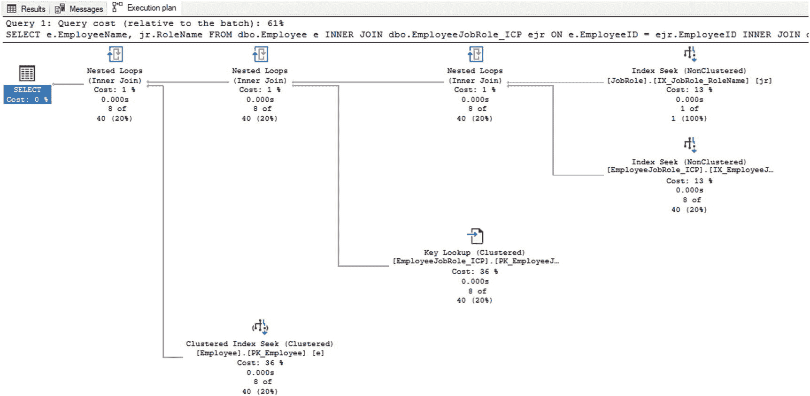
*图 11-10：标识列模式的执行计划*

```sql
USE AdventureWorks2017
GO
SELECT e.EmployeeName, jr.RoleName
FROM dbo.Employee e
INNER JOIN dbo.EmployeeJobRole_ICP ejr ON e.EmployeeID = ejr.EmployeeID
INNER JOIN dbo.JobRole jr ON ejr.JobRoleID = jr.JobRoleID
WHERE RoleName = 'Candlestick Maker'
SELECT e.EmployeeName, jr.RoleName
FROM dbo.Employee e
INNER JOIN dbo.EmployeeJobRole_MCP ejr ON e.EmployeeID = ejr.EmployeeID
INNER JOIN dbo.JobRole jr ON ejr.JobRoleID = jr.JobRoleID
WHERE RoleName = 'Candlestick Maker'
```
*清单 11-10：多列模式的脚本*

#### 第二个测试：基于 `EmployeeName` 的查询

尽管第一个测试结果益处显著，但当查看其他可用的方法时，其优势就不那么令人印象深刻了。例如，假设不使用 `RoleName` 作为谓词，而是使用 `EmployeeName` 作为谓词。清单 [11-11] 中的脚本演示了此场景。与上次测试脚本相反，这次的结果对于任一聚簇索引设计都没有差异（见图 [11-12] 和图 [11-13]）。图中执行计划相同的原因在于，在多列模式中优化聚簇索引键时选择了偏向 `JobRoleID`。当使用 `EmployeeID` 列访问数据时，非聚簇索引承担了大部分工作，从而为每个查询生成了良好的、相似的计划。第二次测试的结果并不否定多列模式的使用，但它们确实强调了在执行预期工作负载测试后，才应选择引导聚簇键的列。

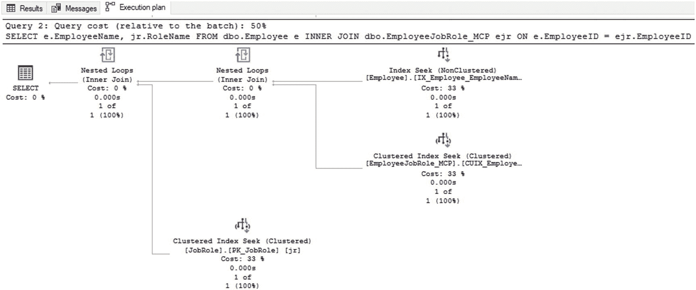
*图 11-13：多列模式的执行计划*

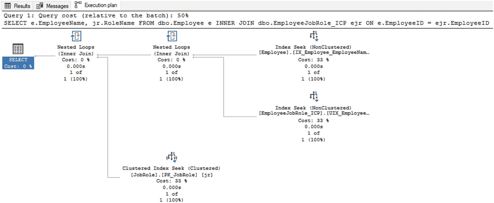
*图 11-12：标识列模式的执行计划*

```sql
USE AdventureWorks2017
GO
SELECT e.EmployeeName, jr.RoleName
FROM dbo.Employee e
INNER JOIN dbo.EmployeeJobRole_ICP ejr ON e.EmployeeID = ejr.EmployeeID
INNER JOIN dbo.JobRole jr ON ejr.JobRoleID = jr.JobRoleID
WHERE EmployeeName = 'Purchasing|ShipMethod'
SELECT e.EmployeeName, jr.RoleName
FROM dbo.Employee e
INNER JOIN dbo.EmployeeJobRole_MCP ejr ON e.EmployeeID = ejr.EmployeeID
INNER JOIN dbo.JobRole jr ON ejr.JobRoleID = jr.JobRoleID
WHERE EmployeeName = 'Purchasing|ShipMethod'
```
*清单 11-11：多列模式的脚本*

#### 多列模式的实现与属性

多列模式的实现方式有多种。可以反转聚簇索引中的关键列，这将改变为测试脚本生成的执行计划。虽然此模式可能有益处，但在使用时应谨慎，并在使用前充分了解预期的工作负载。

总结多列模式，让我们回顾一下定义良好的聚簇索引的属性。首先，值是静态的。如果发生更改，很可能是删除记录并插入新记录。这实际上仍然是一种更新操作。为了缓解此风险，尝试用最不可能更改或填充变化最小的值来引导聚簇索引。其次是聚簇键是否窄。在此示例中，键大多是窄的，由两个 4 字节列组成。如果使用更大的列或超过两列，则需要仔细考虑这是否是正确的方法。下一个属性是值是否唯一。在此场景中是唯一的，在现实世界的任何场景中都应该如此。如果不是，那么此模式自然不具备资格。与其他非标识列模式一样，此模式不提供始终递增的聚簇键。

#### 注意事项

最后需要注意的是，数据仓库中的事实表常常忍不住使用多列模式。在这些情况下，事实表中的所有维度键都被放入聚簇索引中。这样做的目的是强制事实行的唯一性。其效果是创建一个极宽的聚簇键，然后将其添加到表上的所有非聚簇索引中。很可能聚簇键中的每个维度列在事实表上都有一个单独的索引。结果，这些索引浪费了大量空间，并且由于其大小，其性能比通过非聚簇唯一索引来约束事实表的唯一性要差得多。

##### 全局唯一标识符

最后一种，也肯定是最不常用或最不受欢迎的、用于选择聚集索引列的模式是使用全局唯一标识符，也称为 GUID。GUID 模式涉及使用唯一生成的值来为表中的每一行提供唯一值。这个值不是基于整数的，选择它通常是因为它可以在任何位置（在应用程序的拓扑结构内）生成，并且保证是唯一的。该模式解决的问题是，需要在与通常控制唯一值列表的源断开连接时，能够生成新的唯一值。不幸的是，GUID 模式引发的问题几乎和它解决的问题一样多。

生成 GUID 值主要有两种方法。第一种是通过 `NEWID()` 函数。此函数生成一个 16 字节的十六进制值，该值部分基于创建时计算机的 MAC 地址。生成的每个值都是唯一的，并且可以以 0 到 9 或 a 到 f 之间的任何值开头。下一个创建的值在排序中可能位于前一个值之前或之后。无法保证下一个值是永远递增的。生成 GUID 的第二个选项是通过 `NEWSEQUENTIALID()`。此函数也创建一个 16 字节的十六进制值。与前一个函数不同，`NEWSEQUENTIALID()` 创建的新值大于自计算机上次启动以来生成的前一个值。最后一点很重要：当服务器重新启动时，使用 `NEWSEQUENTIALID()` 生成的新值有可能小于重启前创建的值。`NEWSEQUENTIALID()` 的逻辑确保值仅在服务器启动后的时间段内是顺序的。

如前所述，使用 GUID 模式并不能保证提供一个永远递增的值。无论是使用 `NEWID()` 还是 `NEWSEQUENTIALID()`，都无法保证下一个值总是大于上一个值。此外，它不能提供一个窄索引。当将 GUID 存储为 `uniqueidentifier` 时，它需要 16 字节的存储空间。这相当于四个 `int` 或两个 `bigint` 的大小。相比之下，GUID 相当大，并且这个值会被包含在表上所有的非聚集索引中。然而，GUID 模式占用的空间有时可能比这更糟。在某些情况下，如果 GUID 模式实现不当，GUID 值会存储为字符，这需要 36 字节来存储，或者如果使用 Unicode 数据类型则需要 72 字节。

即使 GUID 模式存在这些缺陷，它确实实现了良好定义聚集键的其他一些属性。首先，该值是唯一的。使用 `NEWID()` 和 `NEWSEQUENTIALID()` 函数，为 GUID 生成的值都是唯一的。该值也是静态的，因为生成的 GUID 值没有业务含义，意味着没有理由去更改它。

为了演示实现 GUID 模式的影响，让我们通过与另外几种实现的对比来检验它在一个表上的使用。在此场景中，如清单 11-12 所示，有三个表。表 `dbo.IndexStrategiesGUID_ICP` 使用标识列模式设计。表 `dbo.IndexStrategiesGUID_UniqueID` 使用 `uniqueidentifier` 按照最佳实践构建，采用 GUID 模式。最后一个脚本包含表 `dbo.IndexStrategiesGUID_String`，它使用 `varchar(36)` 来存储 GUID 值。后一种方法不是实现 GUID 模式的正确方式，接下来的分析将帮助突出这一点。在三个表都构建完成后，插入语句将向每个表填充 250,000 行。场景中的最后一条语句检索每个表所使用的页数。

```sql
USE AdventureWorks2017
GO
CREATE TABLE dbo.IndexStrategiesGUID_ICP (
RowID int IDENTITY(1,1)
,FillerData varchar(1000)
,CONSTRAINT PK_IndexStrategiesGUID_ICP PRIMARY KEY CLUSTERED (RowID)
);
CREATE TABLE dbo.IndexStrategiesGUID_UniqueID (
RowID uniqueidentifier DEFAULT(NEWSEQUENTIALID())
,FillerData varchar(1000)
,CONSTRAINT PK_IndexStrategiesGUID_UniqueID PRIMARY KEY CLUSTERED (RowID)
);
CREATE TABLE dbo.IndexStrategiesGUID_String (
RowID varchar(36) DEFAULT(NEWID())
,FillerData varchar(1000)
,CONSTRAINT PK_IndexStrategiesGUID_String PRIMARY KEY CLUSTERED (RowID)
);
INSERT INTO dbo.IndexStrategiesGUID_ICP (FillerData)
SELECT TOP (250000) a1.name+a2.name
FROM sys.all_objects a1 CROSS JOIN sys.all_objects a2
INSERT INTO dbo.IndexStrategiesGUID_UniqueID (FillerData)
SELECT TOP (250000) a1.name+a2.name
FROM sys.all_objects a1 CROSS JOIN sys.all_objects a2
INSERT INTO dbo.IndexStrategiesGUID_String (FillerData)
SELECT TOP (250000) a1.name+a2.name
FROM sys.all_objects a1 CROSS JOIN sys.all_objects a2
SELECT OBJECT_NAME(object_ID) as table_name, in_row_used_page_count, in_row_reserved_page_count
FROM sys.dm_db_partition_stats
WHERE object_id IN (OBJECT_ID('dbo.IndexStrategiesGUID_ICP')
,OBJECT_ID('dbo.IndexStrategiesGUID_UniqueID')
,OBJECT_ID('dbo.IndexStrategiesGUID_String'))
ORDER BY 1
```
清单 11-12
GUID 模式场景的脚本

图 11-14 显示了此查询的一些输出。

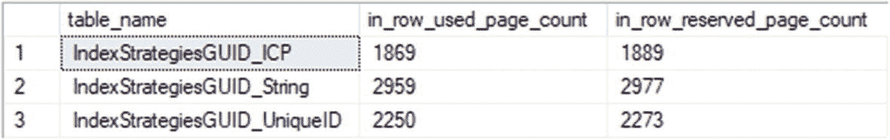

图 11-14
GUID 模式的页数统计

与其他场景不同，GUID 模式的使用很像标识列模式。主要有两个区别。首先，GUID 模式不能提供一个窄聚集键。对于使用 `uniqueidentifier` 数据类型的聚集键，聚集键大小的变化导致存储相同信息需要大约多 400 个页（见图 11-14）。更糟糕的是，如果以 `varchar` 数据类型不当存储 GUID，表需要大约多 1,100 个页。毫无疑问，使用 GUID 模式会导致聚集索引中浪费大量空间，这些空间也会被包含在表上的任何非聚集索引中。GUID 模式的第二个问题与聚集索引的永远递增属性有关。如前所述，GUID 不是按顺序呈现的。下一个值可能大于或小于前一个值，这导致行在表中的随机放置，从而产生碎片。有关 GUID 导致索引碎片的更多信息，请阅读第 6 章。

关于良好定义聚集键的最后两个属性，GUID 模式表现良好。该值是静态的，不应预期随时间改变。该值也是唯一的。事实上，它应该在整个数据库中是唯一的。即使 GUID 模式确实实现了良好定义聚集索引的这两个属性，它们也不能缓解上述该模式的问题。在确定如何为表构建聚集索引时，GUID 模式应该是最后的手段。

### 注意
对于使用 `uniqueidentifier` 模式但希望迁移到使用标识列模式进行聚集索引设计的应用程序，结合使用 `SEQUENCE` 和新的 `sp_sequence_get_range` 存储过程可以成为一种有效的替代方案。


#### 非聚集索引

在前两部分中，讨论集中于堆和聚集索引，它们用于决定如何存储数据。对于堆，数据以未排序的方式存储。对于聚集索引，数据根据一组列进行排序。在几乎所有数据库中，都需要其他访问表中数据的方法，这些方法与数据存储的排序顺序不一致。这就是非聚集索引的用途。除了堆或聚集索引外，非聚集索引提供了另一种访问表中数据的方法。

在本节中，我们将回顾与非聚集索引相关的若干模式。这些模式将有助于识别何时以及何地考虑构建非聚集索引。对于每种模式，我们将介绍其主要组成部分和可加以利用的场景。与聚集索引模式类似，每个非聚集索引模式都将包括一个或多个场景，以展示该模式的优势。将讨论的非聚集索引模式有：

- Search Columns
- Index Intersection
- Multiple Column
- Covering Index
- Included Columns
- Filtered Indexes
- Foreign Keys

在查看这些模式之前，有一些适用于所有非聚集索引的指南。这些指南不同于定义良好的聚集索引的属性。对于属性，关键目标之一是尽可能遵守它们。而对于非聚集索引指南，它们形成了一系列考量因素，这些因素有助于加强索引的合理性，但可能不会使索引的使用失效。设计索引时需要考虑的一些最常见因素如下：

- *非聚集索引键列的更改频率如何？* 数据更改越频繁，非聚集索引中的行可能就越需要更改其在索引中的位置。
- *索引将改善哪些频繁执行的查询？* 索引提供的整体提升越大，数据库平台的整体运行就会越好。
- *索引支持哪些业务需求？* 支持关键业务操作但使用不频繁的索引有时比频繁使用的索引更重要。
- *维护索引的时间成本与查询数据的时间成本相比如何？* 存在一个临界点，超过该点后，索引带来的性能提升会被创建和碎片整理索引所花费的时间以及它所需的空间所抵消。

正如引言中提到的，索引常常感觉像是一门艺术。幸运的是，科学或统计学可以用来证明索引的价值。在回顾这些模式时，我们将研究可以应用它们的场景，并使用一些科学方法——在这种情况下是指标——来确定索引是否提供价值。用于判断索引的两件事将是执行期间的读取操作数量和执行计划的复杂性。

### Search Columns

设计非聚集索引最基本和常见的模式是根据已定义或预期的搜索模式来构建它们。Search Columns 模式应该是最广为人知的模式，但也往往容易被忽视。

如果查询将通过名字搜索包含联系人的表，那么就为名字列建立索引。如果地址表将通过城市或州进行搜索，那么就为那些列建立索引。Search Columns 模式的主要目标是减少对聚集索引的扫描，并将这些操作转移到非聚集索引上，后者可以通过非聚集索引提供更直接的数据访问路径。

为了演示 Search Columns 模式，让我们使用本节提到的第一个场景，即联系人表。为简单起见，示例将使用一个名为 `dbo.Contacts` 的表，其中包含来自 `AdventureWorks2017` 表 `Person.Person` 的数据（参见清单 11-13）。大约应有 19,972 行插入到 `dbo.Contacts` 中，尽管具体数字取决于你的 `AdventureWorks2017` 数据库的新鲜度。

```sql
USE AdventureWorks2017;
GO
CREATE TABLE dbo.Contacts (
ContactID INT IDENTITY(1, 1),
FirstName NVARCHAR(50),
LastName NVARCHAR(50),
IsActive BIT,
EmailAddress NVARCHAR(50),
CertificationDate DATETIME,
FillerData CHAR(1000),
CONSTRAINT PK_Contacts PRIMARY KEY CLUSTERED (ContactID));
INSERT INTO dbo.Contacts (
FirstName,
LastName,
IsActive,
EmailAddress,
CertificationDate )
SELECT pp.FirstName,
pp.LastName,
IIF(pp.BusinessEntityID / 10 = 1, 1, 0),
pea.EmailAddress,
IIF(pp.BusinessEntityID / 10 = 1, pp.ModifiedDate, NULL)
FROM Person.Person pp
INNER JOIN Person.EmailAddress pea
ON pp.BusinessEntityID = pea.BusinessEntityID;
```
*清单 11-13*
*Search Columns 模式的设置*

在表 `dbo.Contacts` 建立后，对该表的第一个测试是在没有构建任何非聚集索引的情况下查询它。在示例中，如清单 11-14 所示，查询是搜索名字为 Catherine 的行。执行查询显示 `dbo.Contacts` 中有 22 行符合条件（见图 11-15）。为了检索这 22 行，SQL Server 最终读取了 2,866 个页，这是表中的所有页。如图 11-16 所示，页读取是对 `dbo.Contacts` 上的 `PK_Contacts` 进行索引扫描的结果。查询的目标是从 19,000 多行中检索 22 行，因此检查表中每一页以查找 `FirstName` 为 Catherine 的行并不是最优的方法，并且是可以避免的。

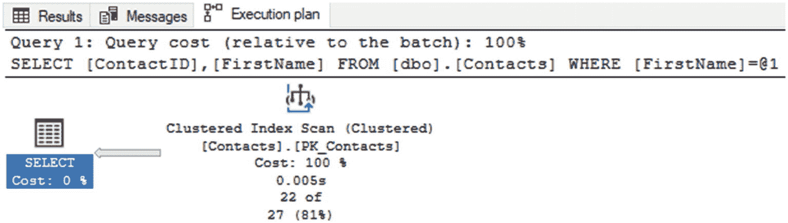
*图 11-16*
*Search Columns 模式的执行计划*

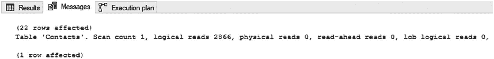
*图 11-15*
*Search Columns 模式的 Statistics I/O 结果*

```sql
USE AdventureWorks2017;
GO
SET STATISTICS IO ON;
SELECT ContactID,
FirstName
FROM dbo.Contacts
WHERE FirstName = 'Catherine';
```
*清单 11-14*
*Search Columns 模式*

通过向 `dbo.Contacts` 添加一个非聚集索引，相对容易地就能实现最优地检索所有 Catherine 行的目标。在下一个脚本（清单 11-15）中，在 `FirstName` 列上创建了一个非聚集索引。除了对 `FirstName` 的过滤外，查询还需要返回 `ContactID`。由于非聚集索引包含聚集索引键，因此 `ContactID` 的值默认包含在索引中。


执行清单 11-15 中的脚本所得的结果，与在表中添加非聚集索引之前相比，发生了显著变化。非聚集索引不再读取表中的每个页面，而是将查询使用的页面数量减少到两个（见图 11-17）。这里的减少是显著的，突显了使用非聚集索引为表中聚簇索引键以外的列提供更直接信息访问方式的力量和价值。执行中还有一处变化：执行计划不再扫描 `PK_Index`，而是对 `IC_Contacts_FirstName` 进行索引查找，如图 11-18 所示。操作符的改变进一步证明非聚集索引有助于提高查询性能。

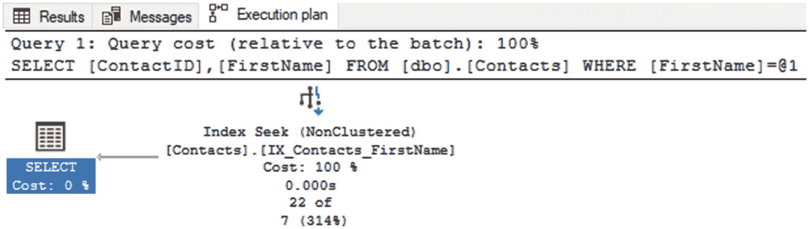

图 11-18
Search Columns 模式的执行计划

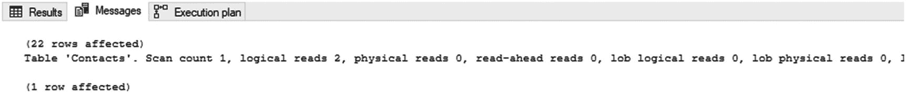

图 11-17
Search Columns 模式的 Statistics I/O 结果

```
USE AdventureWorks2017;
GO
CREATE INDEX IX_Contacts_FirstName ON dbo.Contacts (FirstName);
SET STATISTICS IO ON;
SELECT ContactID,
FirstName
FROM dbo.Contacts
WHERE FirstName = 'Catherine';
Listing 11-15
Search Columns Pattern
```

使用 Search Columns 模式可能是在数据库上应用非聚集索引模式最重要的第一步。它提供了访问数据的替代路径，这可能是从几个页面与数千个页面获取数据之间的区别。本节中的 Search Columns 示例展示了在单个列上构建索引。接下来的几个模式将扩展这个基础。

### Index Intersection

Search Columns 模式的目的是创建一个索引，以最小化查询的页面读取次数并提升其性能。然而，有时查询会超出演示的单个列示例。额外的列可能成为谓词的一部分，或在 `SELECT` 语句中返回。解决此问题的方法之一是创建包含额外列的非聚集索引。当存在可以满足 `WHERE` 子句中每个谓词的索引时，SQL Server 可以利用多个非聚集索引，通过聚簇键匹配来查找两个索引之间的行。此操作称为索引交叉。

为了演示 Index Intersection 模式，让我们首先回顾当过滤扩展到多个列时会发生什么。清单 11-16 中的代码包含了扩展的 `SELECT` 语句和 `WHERE` 子句，将谓词扩展到包括 `LastName` 为 Cox 的行。

查询的改变导致性能与上一节的结果相比发生了显著变化。由于查询中增加了列，满足查询需要读取 68 个页面，而未包含 `LastName` 时只需 2 个页面（见图 11-19）。页面读取增加的原因是执行计划的改变（见图 11-20）。在执行计划中，为查询的执行添加了两个额外操作：键查找和嵌套循环。添加这些操作是因为索引 `IX_Contacts_FirstName` 无法提供满足查询所需的所有信息。SQL Server 判定使用 `IX_Contacts_FirstName` 并从聚簇索引中查找缺失的信息仍然比扫描聚簇索引更廉价。你可能会遇到的问题是，对于在非聚集索引上匹配的每一行，都必须在聚簇索引上执行一次查找。虽然键查找并不总是问题，但它们可能会不必要地推高查询的 CPU 和 I/O 成本。

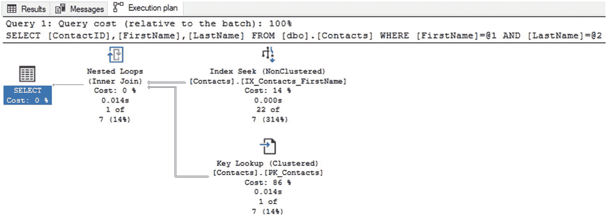

图 11-20
Index Intersection 模式的执行计划


图 11-19
Index Intersection 模式的 Statistics I/O 结果

```
USE AdventureWorks2017;
GO
SET STATISTICS IO ON;
SELECT ContactID,
FirstName,
LastName
FROM dbo.Contacts
WHERE FirstName = 'Catherine'
AND LastName = 'Cox';
Listing 11-16
Index Intersection Pattern
```

利用 Index Intersection 模式是改进清单 11-16 中查询性能的几种方法之一。当 SQL Server 能够利用同一表上的多个非聚集索引来满足查询要求时，就会发生索引交叉。对于清单 11-16 中的查询，查找 `FirstName` 最直接的路径是通过索引 `IX_Contacts_FirstName`。然而，此时为了过滤并返回 `LastName` 列，SQL Server 使用了聚簇索引并对每一行执行了查找操作，类似于图 11-21 左侧的图像。或者，如果存在一个 `LastName` 列的索引，SQL Server 本可以将其与 `IX_Contacts_FirstName` 一起使用。本质上，通过 Index Intersection 模式，SQL Server 能够执行类似于在同一表上的索引之间进行联接的操作，以找到两者之间重叠的行，如图 11-21 右侧所示。

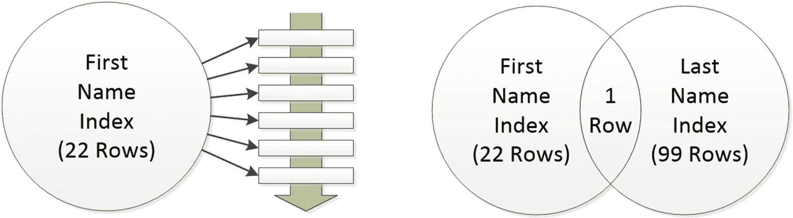

图 11-21


### 索引交叉模式 vs. 多列模式

#### 索引交叉模式

为了演示索引交叉模式并让 SQL Server 使用索引交叉，下一个示例在 `LastName` 列上创建了一个索引（清单 11-17）。创建了索引 `IX_Contacts_LastName` 后，结果与未创建该索引时相比发生了显著变化。第一个显著变化是读取次数。从之前执行的 68 次读取减少到了仅 5 次读取（图 11-22）。读取次数减少的原因是 SQL Server 在查询计划中利用了索引交叉（图 11-23）。索引 `IX_Contacts_FirstName` 和 `IX_Contacts_LastName` 被用来满足查询，而无需返回聚集索引检索查询数据。之所以能实现这一点，是因为这两个索引可以完全满足查询需求。

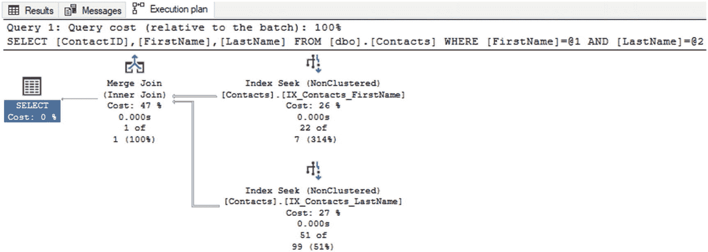
**图 11-23** 索引交叉模式的执行计划

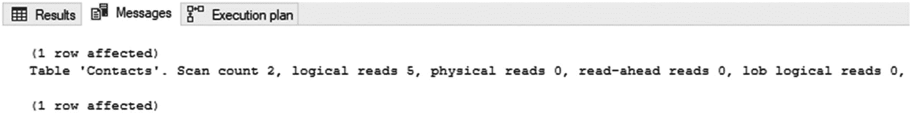
**图 11-22** 索引交叉模式的统计信息 I/O 结果

```sql
USE AdventureWorks2017;
GO
CREATE INDEX IX_Contacts_LastName ON dbo.Contacts (LastName);
SET STATISTICS IO ON;
SELECT ContactID,
FirstName,
LastName
FROM dbo.Contacts
WHERE FirstName = 'Catherine'
AND LastName = 'Cox';
```
**清单 11-17** 索引交叉模式

索引交叉是 SQL Server 的一项功能，当来自同一表的多个非聚集索引可以为查询提供结果时，它会利用此功能来更好地满足查询。在为索引交叉设计索引时，目标是基于“搜索列模式”创建多个索引，这些索引可以以多种组合方式一起使用，以支持各种筛选条件。关于索引交叉模式需要记住的一个关键点是，你无法告诉 SQL Server 何时使用索引交叉；它会在请求、底层索引和数据适合时选择使用它。

#### 多列模式

前两节中的示例都专注于仅包含单个键列的索引。然而，非聚集索引最多可以有 16 列。虽然“窄”是良好定义的聚集索引的一个属性，但同样的原则并不总是适用于非聚集索引。相反，非聚集索引应包含尽可能多的必要列，以便被尽可能多的查询使用。如果许多查询使用相同的列作为谓词，通常将它们全部包含在一个索引中是一个好主意。

演示使用多列模式的索引的一个简单方法是使用与上一节相同的查询并应用此模式。在该查询中，构建了两个索引，分别在 `FirstName` 和 `LastName` 列上。对于多列模式，新索引将同时包含这两个列（清单 11-18）。

如统计数据所示（图 11-24），通过使用多列模式，返回请求结果所需的读取次数有所减少。从索引交叉模式的 5 次读取减少到多列模式的仅 2 次读取。此外，执行计划（如图 11-25 所示）也已简化。现在只对索引 `IX_Contacts_FirstNameLastName` 进行索引查找。

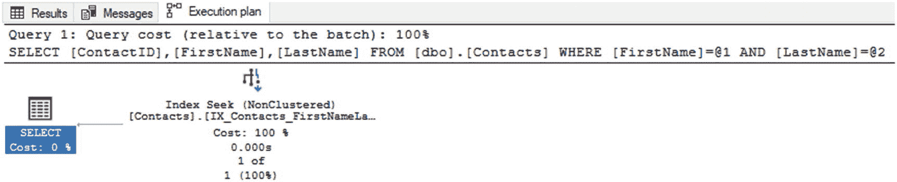
**图 11-25** 多列模式的执行计划

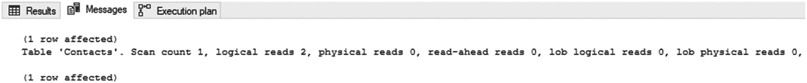
**图 11-24** 多列模式的统计信息 I/O 结果

```sql
USE AdventureWorks2017;
GO
CREATE INDEX IX_Contacts_FirstNameLastName
ON dbo.Contacts (FirstName, LastName);
SET STATISTICS IO ON;
SELECT ContactID,
FirstName,
LastName
FROM dbo.Contacts
WHERE FirstName = 'Catherine'
AND LastName = 'Cox';
```
**清单 11-18** 多列模式

在为数据库设计索引时，实现多列模式与实现搜索列模式同样重要。通过将最常用于谓词的列组合在一起，此模式有助于减少使用的索引数量。虽然这种模式确实与索引交叉模式的某些价值相矛盾，但两者之间的关键是平衡。在某些情况下，对于查询谓词变化很多的表，依赖单列索引上的索引交叉将提供最佳性能。在其他时候，具有特定列顺序的更宽的索引将是有益的。尝试这两种模式，并以提供最佳整体性能的方式应用它们。请记住，如果索引效果不佳，总是可以将其移除。


### 覆盖索引

接下来要了解的索引模式是**覆盖索引**模式。在覆盖索引模式下，谓词之外的列会被添加到索引的键列中，以便将这些值作为查询的 `SELECT` 子句的一部分返回。这种模式在 SQL Server 中已成为标准索引实践有一段时间了。然而，随着索引创建方式的改进，这种模式已不如过去那样有用了。我在这里讨论它是因为这是一个大多数人都知道的常见模式。

要开始研究覆盖索引模式，我们首先需要一个示例来定义该索引所解决的问题。为了展示问题，下一个测试查询将在 `SELECT` 列表中包含 `IsActive` 列（代码清单 11-19）。添加此列后，I/O 统计信息再次从两次读取增加到五次读取，如图 11-26 所示。性能的变化与执行计划的变化（参见图 11-27）直接相关，该计划包括一个键查找和一个嵌套循环。与之前的示例一样，当查询中添加了非聚集索引中未包含的项时，它们需要从聚集索引中检索，因为聚集索引包含表的所有数据。

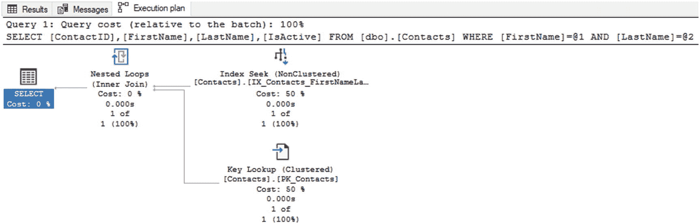

图 11-27
覆盖索引模式的执行计划


图 11-26
覆盖索引模式的 Statistics I/O 结果

```
USE AdventureWorks2017;
GO
SET STATISTICS IO ON;
SELECT ContactID,
FirstName,
LastName,
IsActive
FROM dbo.Contacts
WHERE FirstName = 'Catherine'
AND LastName = 'Cox';
代码清单 11-19
覆盖索引模式
```

理想情况下，你希望有一个索引能够适应索引上的筛选器，同时也能够返回 `SELECT` 列表中请求的列。覆盖索引模式可以满足这些要求。即使 `IsActive` 不是查询的谓词之一，也可以将其添加到索引中，SQL Server 可以使用该键列来随查询一起返回该列的值。为了演示覆盖索引模式，让我们创建一个以 `FirstName`、`LastName` 和 `IsActive` 作为键列的索引（参见代码清单 11-20）。有了索引 `IX_Contacts_FirstNameLastName` 之后，每次执行的读取次数降回两次（参见图 11-28）。执行计划现在也仅使用索引查找（参见图 11-29）。

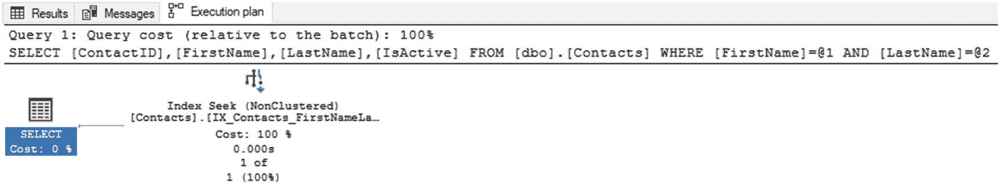

图 11-29
覆盖索引模式的执行计划

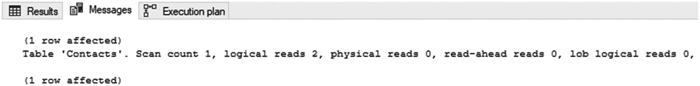

图 11-28
覆盖索引模式的 Statistics I/O 结果

```
USE AdventureWorks2017
GO
CREATE INDEX IX_Contacts_FirstNameLastNameIsActive ON dbo.Contacts(FirstName, LastName,
IsActive);
SET STATISTICS IO ON;
SELECT ContactID,
FirstName,
LastName,
IsActive
FROM dbo.Contacts
WHERE FirstName = 'Catherine'
AND LastName = 'Cox';
代码清单 11-20
覆盖索引模式
```

覆盖索引模式非常有用，并且有潜力在许多领域提高性能。在过去的几年里，这种模式的使用已经减少。这种用法的变化主要是由 SQL Server 2005 引入的索引中包含列这一选项的可用性所驱动的。

### 注意

有些人认为覆盖索引和带包含列的索引是同一回事。虽然非常相似，但两者的关键区别在于列的位置：是作为索引键的一部分，还是作为索引包含的数据。

### 包含列

**包含列**模式是覆盖索引模式的近亲。包含列模式利用了 `CREATE` 和 `ALTER INDEX` 语法中的 `INCLUDE` 子句。该子句允许将非键列添加到非聚集索引中，类似于非键数据存储在聚集索引上的方式。这是包含列模式和覆盖索引模式之间的主要区别，在覆盖索引模式中，附加列是索引的键列。与聚集索引类似，作为 `INCLUDE` 子句一部分的非键列不会被排序，尽管它们可以在某些查询中用作谓词。

包含列模式的用例来自于它提供的灵活性。它的用法通常与覆盖索引模式相同，有时这两个名称可以互换使用。关键区别（将在本节中演示）在于，覆盖索引模式受限于索引中所有列的排序顺序。包含列模式可以通过包含非键数据来避免这个潜在问题，从而增加其使用的灵活性。

在演示包含列模式的灵活性之前，让我们首先检查针对 `dbo.Contacts` 表的另一个索引。在代码清单 11-21 中，查询仅筛选 `FirstName` 值为 Catherine，并返回 `ContactID`、`FirstName`、`LastName` 和 `EmailAddress` 列。此查询请求与其他示例不同，因为它现在包含了 `EmailAddress` 列。由于此列未包含在任何其他非聚集索引中，因此没有索引能完全满足该查询。结果，执行计划使用 `IX_Contacts_FirstName` 来识别 Catherine 的行，然后从聚集索引中查找其余数据，如图 11-30 所示。由于进行了键查找，查询的读取次数也增加到 68 次读取（参见图 11-31），这与之前的示例一样。

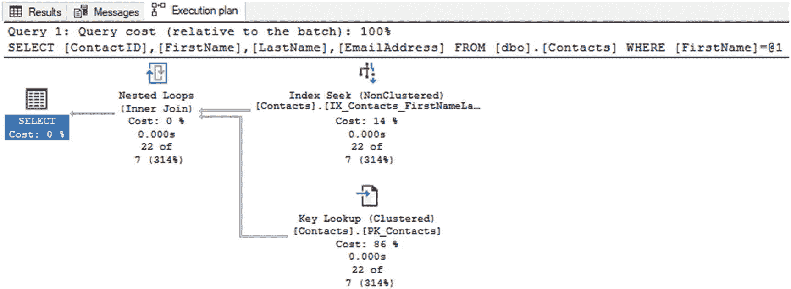

图 11-31
包含列模式的执行计划

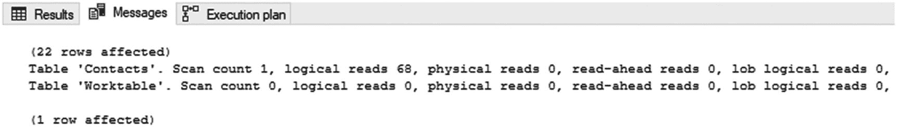

图 11-30
包含列模式的 Statistics I/O 结果

```
USE AdventureWorks2017;
GO
SET STATISTICS IO ON;
SELECT ContactID,
FirstName,
LastName,
EmailAddress
FROM dbo.Contacts
WHERE FirstName = 'Catherine';
代码清单 11-21
包含列模式
```

为了提高此查询的性能，可以基于多列模式或覆盖索引模式创建另一个索引。然而，这些选项的问题在于，最终生成的索引将与它们所能改进的查询具有相同的限制。相反，我们将创建一个基于包含列模式的新索引。这个新索引，如代码清单 11-22 所示，以 `FirstName` 作为键列，并包含 `LastName`、`IsActive` 和 `EmailAddress` 作为非键列。尽管 `IsActive` 列未在索引中使用，但将其包含在内是为了允许索引具有额外的灵活性，本节后面的一个示例将利用这一点。索引就位后，代码清单 11-22 中查询的性能显著提高。在此示例中，每次执行的读取次数从之前的 68 次下降到 3 次（参见图 11-32）。在执行计划中，不再需要键查找和嵌套循环；取而代之的只是索引查找，现在使用的是索引 `IX_Contacts_FirstNameINC`（参见图 11-33）。


### 包含列模式

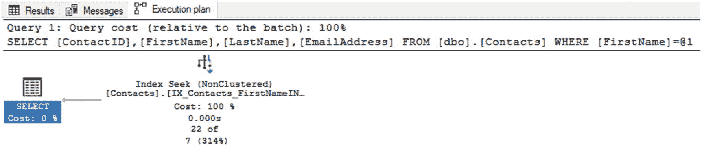

### 图 11-33
包含列模式的执行计划


### 图 11-32
包含列模式的统计 I/O 结果

```
USE AdventureWorks2017
GO
CREATE INDEX IX_Contacts_FirstNameINC ON dbo.Contacts(FirstName)
INCLUDE (LastName, IsActive, EmailAddress);
SET STATISTICS IO ON;
SELECT ContactID,
FirstName,
LastName,
EmailAddress
FROM dbo.Contacts
WHERE FirstName = 'Catherine';
清单 11-22
包含列模式
```

虽然使用 `包含列` 模式创建的索引，其读取次数略有增加，但该索引的灵活性足以抵消这种差异。在本章的每个示例中，都向 `dbo.Contacts` 表添加了一个新索引。至此，该表上共有六个索引，每个索引服务于不同的目的，其中四个以相同的列 `FirstName` 作为引导列。每个索引都占用空间，并且在 `dbo.Contacts` 表中的数据被修改时需要进行维护。在活跃的表中，如此数量的索引可能会对表上的所有活动产生负面影响。

`包含列` 模式可以帮助解决这个问题。在存在多个具有相同引导键列的索引的情况下，可以使用 `包含列` 模式，将其中一些键列作为非键列添加到索引中，从而将这些索引合并为一个索引。为了演示，首先删除所有以 `FirstName` 开头的索引，但保留使用 `包含列` 模式创建的那个索引（脚本见 清单 11-23）。

```
USE AdventureWorks2017
GO
DROP INDEX IF EXISTS IX_Contacts_FirstNameLastName ON dbo.Contacts
GO
DROP INDEX IF EXISTS IX_Contacts_FirstNameLastNameIsActive ON dbo.Contacts
GO
DROP INDEX IF EXISTS IX_Contacts_FirstName ON dbo.Contacts
GO
清单 11-23
在包含列模式中删除索引
```

现在，`dbo.Contact` 表上只剩下三个索引：`ContactID` 列上的聚集索引，`LastName` 列上的非聚集索引，以及一个以 `FirstName` 为引导列、并包含 `LastName`、`IsActive` 和 `EmailAddress` 列作为索引数据的索引。在这些索引就位后，需要针对该表测试来自先前模式中的查询，如 清单 11-24 所示。

关于查询在 `包含列` 模式下与在其他模式下的性能表现，有两点需要注意。首先，如 图 11-34 所示，所有查询的执行计划都利用了索引查找操作。对于仅在 `FirstName` 上进行筛选的查询，使用索引查找是预期的；但当存在额外的 `LastName` 筛选条件时，也可以使用索引查找。SQL Server 能够做到这一点，是因为在索引查找之下，它执行了一个范围扫描，先匹配第一个谓词的行，然后移除 `LastName` 值不为 `Cox` 的结果。第二个需要注意的点是每个查询的读取次数，如 图 11-35 所示。读取次数从两次增加到了三次。虽然这构成了 50% 的读取增加，但其性能变化不足以证明创建四个索引是合理的，因为一个索引已能充分提供所需的性能。

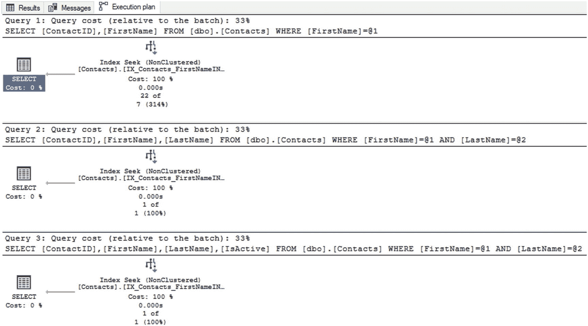

### 图 11-35
包含列模式的执行计划

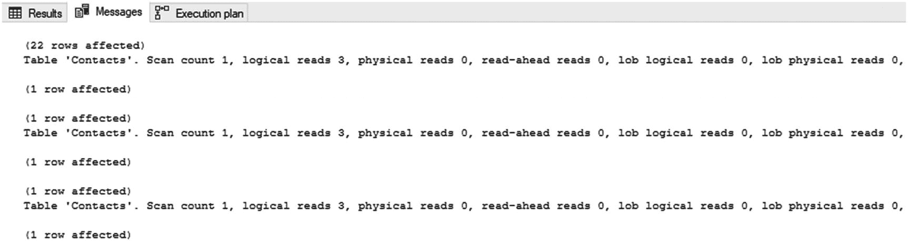

### 图 11-34
包含列模式的统计 I/O 结果

```
USE AdventureWorks2017;
GO
SET STATISTICS IO ON;
SELECT ContactID,
FirstName
FROM dbo.Contacts
WHERE FirstName = 'Catherine';
SELECT ContactID,
FirstName,
LastName
FROM dbo.Contacts
WHERE FirstName = 'Catherine'
AND LastName = 'Cox';
SELECT ContactID,
FirstName,
LastName,
IsActive
FROM dbo.Contacts
WHERE FirstName = 'Catherine'
AND LastName = 'Cox';
清单 11-24
针对包含列模式的其他查询
```

用于构建非聚集索引的 `包含列` 模式，是在创建索引时需要运用的一个重要模式。当与会导致查找操作的特定查询一起使用时，它可以改善读取和执行性能。它还提供了整合相似查询的机会，从而减少表上的索引数量，同时仍能提供优于不存在这些索引的情况下的性能改进。


### 过滤索引

在数据库的某些表中，存在一些具有特定值的行，这些行在应用程序使用的数据库结果集中很少或永远不会被返回。在这些情况下，将这些行作为结果集可返回的选项移除可能是有益的。在其他一些情况下，识别表中的数据子集并创建索引可能很有用。通过利用覆盖查询需要返回结果的那数百或数千行的索引，你可以避免扫描表中数百万或数十亿条记录。这两种情况都描述了使用**过滤索引**模式可以提高性能的场景。

顾名思义，过滤索引模式利用了 SQL Server 2005 引入的过滤索引功能。使用过滤索引时，会向非聚集索引添加一个 `WHERE` 子句，以减少索引中包含的行数。通过只包含符合 `WHERE` 子句过滤条件的行，查询引擎在构建执行计划时只需考虑这些行；此外，扫描一系列行的成本低于索引包含所有行时的情况。

为了说明使用过滤索引的价值，考虑这样一个场景：表中只有一小部分行在被过滤的列上有值。代码清单 11-25 考虑了查询的变体。第一个版本返回 `CertificationDate` 有值的行。第二个版本仅返回 `CertificationDate` 在 2005 年 1 月 1 日 和 2005 年 2 月 1 日 之间的行。对于这两个查询，表上都没有索引能提供最优的执行计划，因为在执行过程中会访问索引的所有 2,866 个页面（见图 11-36）。检查两个执行计划（图 11-37）显示，使用了 `dbo.Contacts` 的聚集索引扫描来查找符合 `CertificationDate` 谓词的行。正如缺失索引提示所建议的，在 `CertificationDate` 列上创建索引可以提高查询性能。

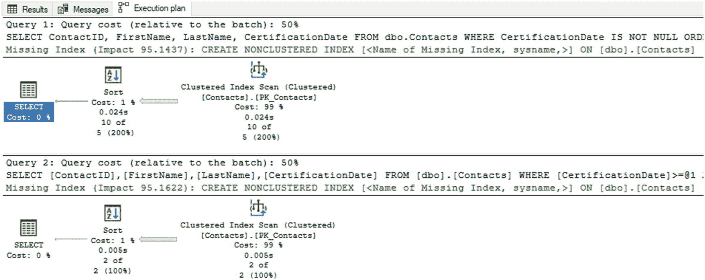

图 11-37. 过滤索引模式的执行计划

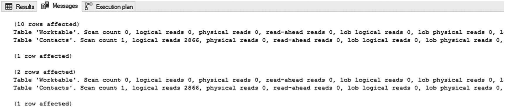

图 11-36. 过滤索引模式的统计信息 I/O 结果

```sql
USE AdventureWorks2017;
GO
SET STATISTICS IO ON;
SELECT ContactID,
FirstName,
LastName,
CertificationDate
FROM dbo.Contacts
WHERE CertificationDate IS NOT NULL
ORDER BY CertificationDate;
SELECT ContactID,
FirstName,
LastName,
CertificationDate
FROM dbo.Contacts
WHERE CertificationDate
BETWEEN '20110101' AND '20110201'
ORDER BY CertificationDate;
```

代码清单 11-25. 过滤索引模式

在应用缺失索引建议之前，你应该考虑该索引在此查询及未来查询中将如何使用。在此场景下，假设永远不会有查询在 `CertificationDate` 值为 `NULL` 时使用它。那么，在索引中存储所有 `NULL` 行的空值有意义吗？根据上述假设，这没有意义；这样做会浪费数据库中的空间，并且如果因为扫描读取量过高而选择了其他索引，导致跳过 `CertificationDate` 上的索引，可能会产生非最优的执行计划。

在此场景下，对索引中的行进行过滤是有意义的。为此，像创建任何其他索引一样创建索引，但要添加一个 `WHERE` 子句（见代码清单 11-26）。创建过滤索引时，关于 `WHERE` 子句有几点需要注意。首先，`WHERE` 子句必须是确定性的。它不能根据子句内函数的结果而随时间变化。例如，不能使用 `GETDATE()` 函数，因为其返回的值每毫秒都在变化。第二个限制是只允许简单的比较逻辑。这意味着不能使用 `BETWEEN` 和 `LIKE` 比较。有关过滤索引的限制和约束的更多信息，请参阅第 2 章。

执行来自代码清单 11-26 的 `CertificationDate` 查询显示，过滤索引对查询性能有显著影响。在产生的读取次数方面，现在只有 2 次读取，而应用索引前是 2,866 次读取（见图 11-38）。此外，执行计划现在对两个查询都使用索引查找，而不是聚集索引扫描，如图 11-39 所示。虽然这些结果是预期的，但关于索引的另一个考虑是，新索引仅由两个页面组成。如图 11-40 所示，整个索引所需的页面数量远少于聚集索引和其他非聚集索引。

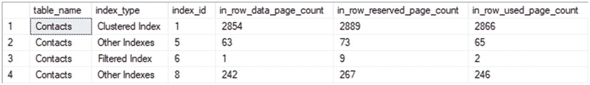

图 11-40. 过滤索引的页面数比较

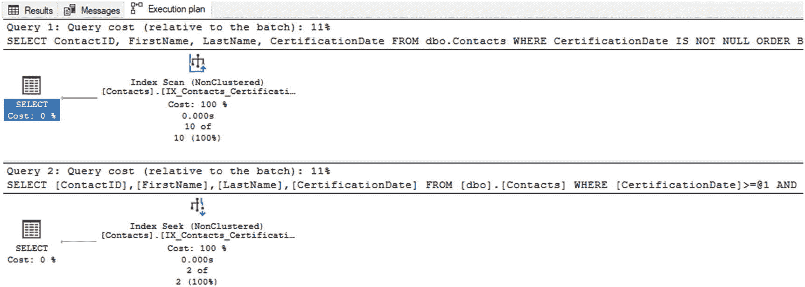

图 11-39. 过滤索引模式的执行计划

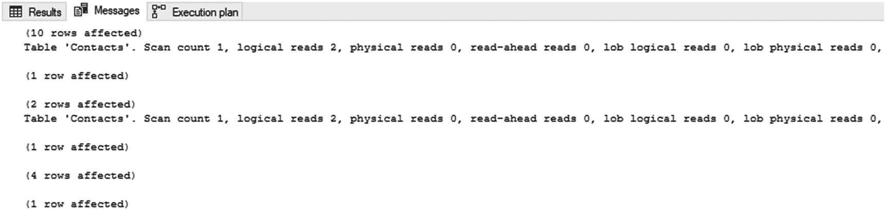

图 11-38. 过滤索引模式的统计信息 I/O 结果

```sql
USE AdventureWorks2017
GO
CREATE INDEX IX_Contacts_CertificationDate ON dbo.Contacts(CertificationDate)
INCLUDE (FirstName, LastName)
WHERE CertificationDate IS NOT NULL;
SET STATISTICS IO ON;
SELECT ContactID,
FirstName,
LastName,
CertificationDate
FROM dbo.Contacts
WHERE CertificationDate IS NOT NULL
ORDER BY CertificationDate;
SELECT ContactID,
FirstName,
LastName,
CertificationDate
FROM dbo.Contacts
WHERE CertificationDate
BETWEEN '20110101' AND '20110201'
ORDER BY CertificationDate;
SET STATISTICS IO OFF;
SELECT OBJECT_NAME(object_id) as table_name
,CASE index_id
WHEN INDEXPROPERTY(object_id , 'IX_Contacts_CertificationDate', 'IndexID') THEN 'Filtered Index'
WHEN 1 THEN 'Clustered Index'
ELSE 'Other Indexes' END As index_type
,index_id
,in_row_data_page_count
,in_row_reserved_page_count
,in_row_used_page_count
FROM sys.dm_db_partition_stats
WHERE object_id = OBJECT_ID('dbo.Contacts');
```

代码清单 11-26. 过滤索引模式

仅在索引中包含表中的一部分行具有多个优势。一个优势是，由于索引更小，索引中的页面更少，这直接转化为数据库的存储需求降低。同样地，如果索引中的页面更少，索引碎片的机会就更少，维护索引所需的努力也更小。过滤索引的最后一个优势与性能和计划质量有关。由于过滤索引中的值是有限的，索引的统计信息也是有限的。由于需要遍历过滤索引中的页面更少，对过滤索引的扫描几乎总是比对聚集索引或堆的扫描问题更小。


### 筛选索引模式

在创建索引时，有几种情况可以并且应该使用筛选索引模式。第一种情况是需要为配置为稀疏的列创建索引。在这种情况下，预计有值的行数与总行数相比会很少。使用稀疏列的好处之一是避免了在这些列中存储 `NULL` 值所带来的存储成本。通过使用筛选索引来排除 `NULL` 值，可以确保这些列上的索引不存储 `NULL`。第二种情况是需要对一个可能包含多个 `NULL` 值的列强制实施唯一性。创建筛选索引时，如果键列不为 `NULL`，则可以将其设为唯一索引，从而绕过通常只允许列中存在单个 `NULL` 值的唯一性限制。通过这种方式，你可以确保表中的社会安全号码在提供时不重复。

筛选索引适用的最后一种情况是，当需要运行的查询不符合表的正常索引配置文件时。例如，可能有一个一次性报告查询需要从数据库中检索几千行数据。与其运行报告并处理可能发生的聚集索引或堆扫描，不如创建模仿查询谓词的筛选索引。这样可以让查询快速执行，而无需花费时间去构建那些包含查询永远用不到的值的索引。

正如本节详细说明的，筛选索引模式在多种情况下都非常有用。请务必在设计索引时考虑它。通常，当发现筛选索引的第一个用途后，其他用途也会开始显现，我们将在前面提到的查询和修改数据等场景中，识别出哪些情况能从中受益。

### 外键模式

最后一种非聚集索引模式是外键模式。这是唯一直接与数据库设计中的对象相关联的模式。外键提供了一种机制，用于将一个表中的值约束为另一个表中行的值。这种关系提供了参照完整性，这在大多数数据库部署中至关重要。然而，外键有时可能是数据库性能问题的根源，而大家可能并未意识到它们正在干扰性能。

由于外键对列的可能值施加了约束，因此在需要验证值时会进行检查。外键验证有两种类型。第一种发生在父表 `dbo.ParentTable` 上，第二种发生在子表 `dbo.ChildTable` 上（参见图 11-41）。每当在 `dbo.ChildTable` 中修改行时，都会在 `dbo.ParentTable` 上进行验证。在这些情况下，`dbo.ChildTable` 中的 `ParentID` 值会通过查找 `dbo.ParentTable` 中的值进行验证。通常，这不会导致性能问题，因为 `dbo.ParentTable` 中的 `ParentID` 很可能是该表的主键，也是表的聚集列。另一种验证发生在对 `dbo.ParentTable` 进行修改时。例如，如果 `dbo.ParentTable` 中的一行被删除，则需要检查 `dbo.ChildTable` 以确定该表中是否正在使用该 `ParentID` 值。正是在这种验证时，才需要应用外键模式。

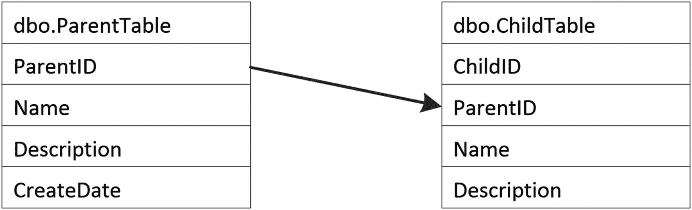

图 11-41 外键关系

为了演示外键模式，首先需要几个表作为示例。清单 11-27 中的代码创建了两个表 `dbo.Customer` 和 `dbo.SalesOrderHeader`。这两个表之间存在基于 `CustomerID` 列的外键关系。每个 `dbo.SalesOrderHeader` 行都关联一个客户。反过来，`dbo.Customer` 中的每一行可以关联到 `dbo.SalesOrderHeader` 中的一个或多个行。

```
USE AdventureWorks2017
GO
CREATE TABLE dbo.Customer(
CustomerID int
,FillterData char(1000)
,CONSTRAINT PK_Customer_CustomerID PRIMARY KEY CLUSTERED (CustomerID)
);
CREATE TABLE dbo.SalesOrderHeader(
SalesOrderID int
,OrderDate datetime
,DueDate datetime
,CustomerID int
,FillterData char(1000)
,CONSTRAINT PK_SalesOrderHeader_SalesOrderID
PRIMARY KEY CLUSTERED (SalesOrderID)
,CONSTRAINT GK_SalesOrderHeader_CustomerID_FROM_Customer
FOREIGN KEY (CustomerID) REFERENCES dbo.Customer(CustomerID)
);
INSERT INTO dbo.Customer (CustomerID)
SELECT CustomerID
FROM Sales.Customer;
INSERT INTO dbo.SalesOrderHeader
(SalesOrderID, OrderDate, DueDate, CustomerID)
SELECT SalesOrderID, OrderDate, DueDate, CustomerID
FROM Sales.SalesOrderHeader;
清单 11-27 外键模式设置
```

在示例中，你希望观察当 `dbo.Customer` 中的一行被修改时，`dbo.SalesOrderHeader` 中会发生什么。为了演示在 `dbo.Customer` 上的活动，清单 11-28 中的脚本在 `CustomerID` 等于 701 的行上对表执行 `DELETE` 操作。该行在 `dbo.SalesOrderHeader` 中应该没有对应的行。尽管如此，外键仍要求检查 `dbo.SalesOrderHeader` 中是否存在该 `CustomerID` 的行。如果有，SQL Server 将在删除时报错。由于 `dbo.SalesOrderHeader` 中没有对应的行，因此 `dbo.Customer` 中的该行可以被删除。


### 外键模式与列存储索引

### 外键模式

执行计划识别出了删除操作的几个潜在性能问题。首先，仅删除一行时，总共发生了 4,516 次读取（参见图 11-42）。在这些读取中，有 3 次发生在 `dbo.Customer` 表上，而有 4,513 次发生在 `dbo.SalesOrderHeader` 表上。其原因是 `dbo.SalesOrderHeader` 表上必须执行一次 `clustered index scan`（聚集索引扫描），如图 11-43 所示。发生扫描的原因是，检查哪些行使用了值为 701 的 `Customer` 的唯一方法是扫描表中的所有行。没有索引能提供更快的路径来验证该值是否被使用。

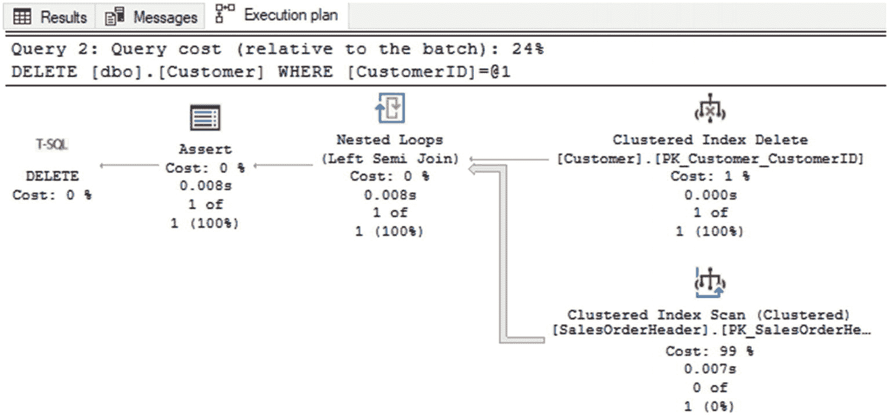
图 11-43: 外键模式的执行计划

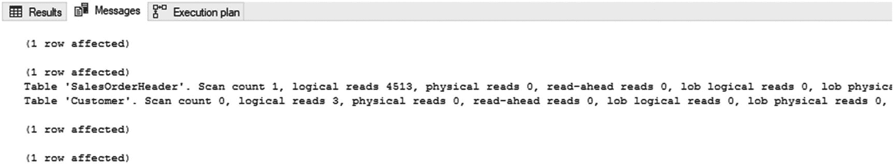
图 11-42: 外键模式的统计 I/O 结果

```
USE AdventureWorks2017
GO
SELECT MAX(c.CustomerID)
FROM dbo.Customer c
LEFT OUTER JOIN dbo.SalesOrderHeader soh ON c.CustomerID = soh.CustomerID
WHERE soh.CustomerID IS NULL;
SET STATISTICS IO ON;
DELETE FROM dbo.Customer
WHERE CustomerID = 701;
-- 清单 11-28: 外键模式
```

通过外键模式可以简单地提升 `dbo.Customer` 表上 `DELETE` 操作的性能。在 `dbo.SalesOrderHeader` 表的 `CustomerID` 列上创建一个索引，将为下一次删除操作的验证提供一个参考点（参见清单 11-29）。审查建立索引后的执行情况会得到截然不同的结果。`dbo.SalesOrderHeader` 表上的读取次数从 4,513 次减少到现在的仅两次（参见图 11-44）。当然，这种变化是因为在 `CustomerID` 列上创建了索引（参见图 11-45）。删除操作不再执行聚集索引扫描，而是可以利用 `dbo.SalesOrderHeader` 表上的索引查找。

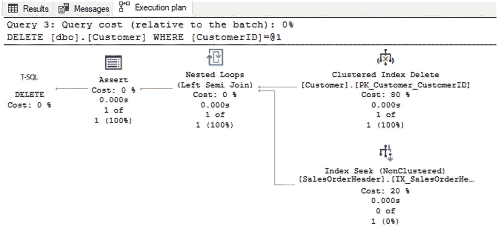
图 11-45: 外键模式的执行计划（优化后）

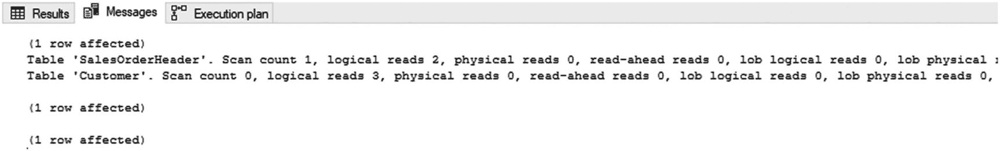
图 11-44: 外键模式的统计 I/O 结果（优化后）

```
USE AdventureWorks2017
GO
CREATE INDEX IX_SalesOrderHeader_CustomerID ON dbo.SalesOrderHeader(CustomerID);
SELECT MAX(c.CustomerID)
FROM dbo.Customer c
LEFT OUTER JOIN dbo.SalesOrderHeader soh ON c.CustomerID = soh.CustomerID
WHERE soh.CustomerID IS NULL;
SET STATISTICS IO ON
DELETE FROM dbo.Customer
WHERE CustomerID = 700
-- 清单 11-29: 外键模式
```

在表之间建立外键关系时，牢记外键模式非常重要。这些关系的目的是验证数据，你需要确保支持该活动的索引已就位。不要将此模式用作从数据库中移除验证的借口；相反，应将其视为正确索引数据库的机会。如果需要查询某个列来验证和约束数据，那么当数据需要用于其他目的时，应用程序也很可能会访问它。

#### 列存储索引

随着数据库规模的增长，越来越多的情况下，传统的聚集和非聚集索引无法为计算结果提供所需的性能。这在大型数据仓库中尤其令人头疼，为此，SQL Server 2012 引入了列存储索引。前面的章节讨论了列存储如何利用基于列的存储与基于行的存储。本节将介绍一些关于聚集和非聚集版本列存储索引的指导原则，以及如何识别何时应该构建列存储索引。在介绍完指导原则后，将提供一个实现列存储索引的示例。

### 注意

本节中的列存储示例使用了适用于零售业的 Microsoft Contoso BI 演示数据集。该数据库包含一个拥有超过 800 万条记录的事实表。可从此处下载：`www.microsoft.com/download/en/details.aspx?displaylang=en&id=18279`。

使用列存储索引的关键在于能够正确识别应应用它们的场景。虽然对某些 OLTP 数据库使用列存储索引可能有用，但这并非其目标场景。尽管列存储索引的性能在 OLTP 数据库中可能有用，但与此索引类型相关的限制妨碍了它在 OLTP 数据库中的有效使用。列存储索引主要对数据仓库有用，因为那里需要跨大量行进行聚合，并且返回的列较少。通过列式存储和内置压缩，这种索引类型提供了一种尽可能快地访问所需数据的方法，而无需加载不属于查询的列。在数据仓库中，列存储索引主要针对事实表而非维度表。当用于大型表时，列存储索引才能真正证明其价值。表越大，列存储索引比传统索引提升的性能就越多。此外，在考虑数据仓库查询时，它们有一个共同的特点，即聚合和可用列的子集。通过聚合，列存储索引的批处理模式提供了更大的性能改进。查询中的列越少，意味着加载到内存中的数据就越少，因为查询上下文中只使用被访问的列。

当发现使用列存储索引的场景时，首先需要考虑几件事。由于列存储索引可以是聚集的也可以是非聚集的，第一个决定是使用哪种类型。使用聚集列存储索引时，表中的所有数据都随索引存储，这意味着数据库中只有一份数据副本。因为它包含所有数据，所以表中所有列的结果都会出现在列存储索引中。在大多数情况下，这是首选。

或者，列存储索引可以是非聚集的。这提供了限制索引中包含的列数的能力。在某些情况下，如果表有很多列，这可能很有用。非聚集索引依赖于表中存在聚集索引，这意味着非聚集列存储索引会增加表的总体存储空间占用。

创建非聚集列存储索引时有更多的考虑因素，因此在构建它们时需要记住一些准则。首先，非聚集列存储索引中列的顺序无关紧要。每列都与其他列分开存储，直到在执行期间再次具体化在一起时，它们之间才建立关系。接下来要记住的是，将被列存储索引利用的表中所有列都必须出现在列存储索引中。如果查询中的某列未出现在非聚集列存储索引中，则无法使用该索引。

如果你使用的是 SQL Server 2017 之前的版本，重要的是要记住非聚集列存储索引是只读的，任何构建了非聚集列存储索引的表或分区都将被置于只读状态。要修改表，需要禁用或删除非聚集列存储索引，然后在更新完成后重新构建或创建它。此限制不影响聚集列存储索引，并且从 SQL Server 2017 开始，对非聚集列存储索引的此限制已被取消。

影响两种类型列存储索引的一个限制是创建索引所需的时间长度。在许多情况下，创建列存储索引所需的时间可能是创建聚集或非聚集索引的四到五倍。有关列存储索引的更多信息，请参见第 2 章。

在展示列存储索引的价值之前，让我们先看一个针对使用传统索引的数据仓库执行查询的演示。在清单 11-30 中，该查询按 `CalendarQuarter` 和 `ProductCategoryName` 对 `SalesQuantity` 值进行汇总。执行该查询并不需要大量时间；图 11-46 显示耗时 4,293 毫秒（或 4.2 秒），在 dbo.FactSales 上有略少于 20,000 次的读取。对于当前的记录量来说，结果是合理的，但请考虑如果表的行数增加 10 倍或 100 倍会怎样。在什么时候 4.2 秒的执行时间会增长到超出可接受的执行时间？

### 注意

由于执行计划的大小，它们未包含在列存储索引示例中。并且因为本节依赖 CPU 时间来展示性能，所以会多次运行以确保磁盘到内存的性能不是影响因素。

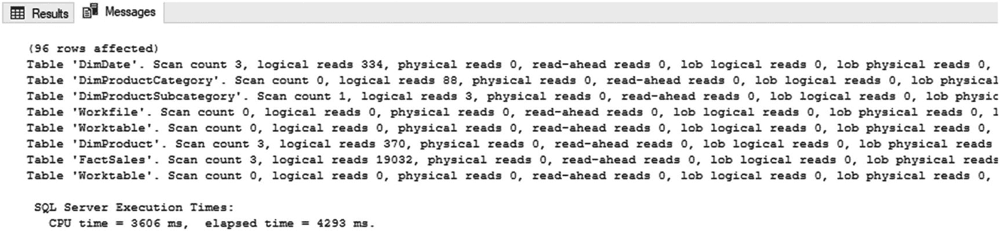
图 11-46  聚集索引在事实表上的 Statistics I/O 结果

```
USE ContosoRetailDW
GO
SET STATISTICS IO ON
SET STATISTICS TIME ON
SELECT dd.CalendarQuarter
,dpc.ProductCategoryName
,COUNT(*) As TotalRows
,SUM(SalesQuantity) AS TotalSales
FROM dbo.FactSales fs
INNER JOIN dbo.DimDate dd ON fs.DateKey = dd.Datekey
INNER JOIN dbo.DimProduct dp ON fs.ProductKey = dp.ProductKey
INNER JOIN dbo.DimProductSubcategory dps ON dp.ProductSubcategoryKey = dps.ProductSubcategoryKey
INNER JOIN dbo.DimProductCategory dpc ON dps.ProductCategoryKey = dpc.ProductCategoryKey
GROUP BY dd.CalendarQuarter
,dpc.ProductCategoryName;
```
清单 11-30 列存储索引

### 在 `dbo.FactSales` 上测试非聚集列存储索引的性能

为了测试在 `dbo.FactSales` 上使用非聚集列存储索引的性能，让我们向表中添加一个新索引。如本节所述，`dbo.FactSales` 中的所有列都被添加到列存储索引中，如清单 11-31 所示。有了索引后，查询性能发生了显著变化。从时间角度看，查询在 286 毫秒内完成，如图 11-47 所示，这比没有非聚集列存储索引时的性能提升了超过 15 倍。此外，I/O 次数从近 20,000 次下降到 2,608 次。

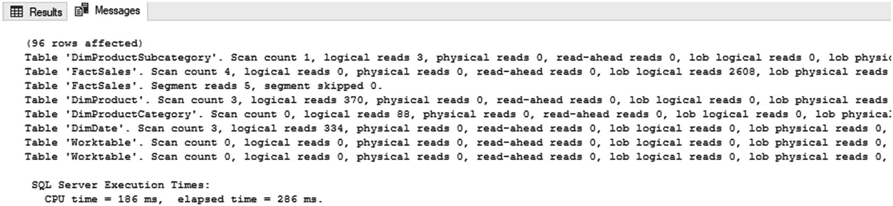
图 11-47  非聚集列存储索引的 Statistics I/O 结果

```
USE ContosoRetailDW
GO
CREATE NONCLUSTERED COLUMNSTORE INDEX IX_FactSales_CStore ON dbo.FactSales (
SalesKey, DateKey, channelKey, StoreKey, ProductKey, PromotionKey, CurrencyKey, UnitCost, UnitPrice,
SalesQuantity, ReturnQuantity, ReturnAmount, DiscountQuantity, DiscountAmount, TotalCost, SalesAmount,
ETLLoadID, LoadDate, UpdateDate);
SET STATISTICS IO ON;
SET STATISTICS TIME ON;
SELECT dd.CalendarQuarter
,dpc.ProductCategoryName
, COUNT(*) As TotalRows
,SUM(SalesQuantity) AS TotalSales
FROM dbo.FactSales fs
INNER JOIN dbo.DimDate dd ON fs.DateKey = dd.Datekey
INNER JOIN dbo.DimProduct dp ON fs.ProductKey = dp.ProductKey
INNER JOIN dbo.DimProductSubcategory dps ON dp.ProductSubcategoryKey = dps.ProductSubcategoryKey
INNER JOIN dbo.DimProductCategory dpc ON dps.ProductCategoryKey = dpc.ProductCategoryKey
GROUP BY dd.CalendarQuarter
,dpc.ProductCategoryName;
```
清单 11-31 添加非聚集列存储索引

### 使用聚集列存储索引

如前所述，聚集列存储索引是首选；既然这是首选，让我们看看在 `dbo.FactSales` 上使用聚集列存储索引的影响。由于您正在表上创建聚集索引，我们将使用清单 11-32 中的脚本创建一个名为 `dbo.FactSales_CCI` 的新表，用 `dbo.FactSales` 中的相同数据填充它，并向其添加聚集列存储索引。

当您使用与前面示例相同的聚合查询时，聚集列存储的性能优势是显而易见的。考虑到执行时间（如图 11-48 所示），它进一步下降到 164 毫秒，比带有聚集索引的事实表快 26 倍以上。I/O 也减少了，执行时仅有 1,309 次 I/O。虽然 I/O 占用与非聚集列存储类似，但请记住，聚集列存储只存储一次，并且其中的值可以被修改。

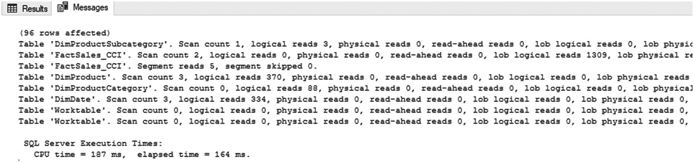
图 11-48  聚集列存储索引的 Statistics I/O 结果

```
USE ContosoRetailDW
GO
IF OBJECT_ID('dbo.FactSales_CCI') IS NOT NULL
DROP TABLE FactSales_CCI
CREATE TABLE dbo.FactSales_CCI(
SalesKey int NOT NULL,
DateKey datetime NOT NULL,
channelKey int NOT NULL,
StoreKey int NOT NULL,
ProductKey int NOT NULL,
PromotionKey int NOT NULL,
CurrencyKey int NOT NULL,
UnitCost money NOT NULL,
UnitPrice money NOT NULL,
SalesQuantity int NOT NULL,
ReturnQuantity int NOT NULL,
ReturnAmount money NULL,
DiscountQuantity int NULL,
DiscountAmount money NULL,
TotalCost money NOT NULL,
SalesAmount money NOT NULL,
ETLLoadID int NULL,
LoadDate datetime NULL,
UpdateDate datetime NULL
)
INSERT INTO dbo.FactSales_CCI
SELECT * FROM dbo.FactSales
CREATE CLUSTERED COLUMNSTORE INDEX FactSales_CStore ON dbo.FactSales_CCI
SET STATISTICS IO ON;
SET STATISTICS TIME ON;
SELECT dd.CalendarQuarter
,dpc.ProductCategoryName
, COUNT(*) As TotalRows
,SUM(SalesQuantity) AS TotalSales
FROM dbo.FactSales_CCI fs
INNER JOIN dbo.DimDate dd ON fs.DateKey = dd.Datekey
INNER JOIN dbo.DimProduct dp ON fs.ProductKey = dp.ProductKey
INNER JOIN dbo.DimProductSubcategory dps ON dp.ProductSubcategoryKey = dps.ProductSubcategoryKey
INNER JOIN dbo.DimProductCategory dpc ON dps.ProductCategoryKey = dpc.ProductCategoryKey
GROUP BY dd.CalendarQuarter
,dpc.ProductCategoryName;
```
清单 11-32 创建带有聚集列存储索引的事实表

随着 SQL Server 的最新发展，列存储索引在数据仓库的索引方式上是一项重大改进。这些性能提升为将数据库扩展到传统索引难以企及的范围打开了机会。以前只能汇总数百万行结果的场景，现在将能够扩展到数十亿行。此外，由于所有列都可以包含在列存储索引中，在数据仓库中持续维护和调整索引的工作和要求大大减少。

### 注意

下一节使用了 WorldWideImporters 数据库，可以从 [`https://github.com/Microsoft/sql-server-samples/releases/tag/wide-world-importers-v1.0`](https://github.com/Microsoft/sql-server-samples/releases/tag/wide-world-importers-v1.0) 下载。


## JSON 索引

SQL Server 2016 引入了在 SQL Server 中处理 JSON（JavaScript Object Notation）数据的能力。JSON 定义了一种易于应用程序和人类读写的数据结构化方法。由于这种便利性，它在应用程序开发中变得非常流行。

JSON 没有使用 XML 中的标签和属性，而是利用方括号、冒号和引号来定义实体-属性关系。例如，清单 11-33 包含了一个 XML 文档，其中定义了 WideWorldImporters 公司某位员工的额外信息。用 JSON 表示的相同信息如清单 11-34 所示。比较两者，JSON 比 XML 表示的数据更易于阅读和理解。

```
{
"OtherLanguages": ["Polish","Chinese","Japanese"] ,
"HireDate":"2008-04-19T00:00:00",
"Title":"Team Member",
"PrimarySalesTerritory":"Plains",
"CommissionRate":"0.98"
}
清单 11-34
JSON 示例
```

```
Polish
Chines
Japanese

2008-04-19T00:00:00
Team Member
Plains
0.98

清单 11-33
XML 示例
```

虽然 SQL Server 现在可以处理 JSON 数据，但 Microsoft 实现 JSON 的方式与 XML 和空间数据的实现方式略有不同。JSON 数据没有专门的数据类型，而是存储在定义为 `varchar(max)` 和 `nvarchar(max)` 数据类型的列中。然后可以使用 `JSON_VALUE` 或 `JSON_QUERY` 函数检索数据中的信息。这种实现方式的优点是，没有与 JSON 数据相关的特殊索引类型，这就是为什么没有专门介绍 JSON 索引的章节。相反，JSON 数据通过使用持久化计算列的索引，利用了现有的索引功能。

在开始介绍如何为 JSON 数据创建索引之前，我们先通过一个示例了解 JSON 函数的工作原理及其对性能的影响。首先，根据清单 11-35 提供的代码，从 `WideWorldImporters` 数据库中的 `Application.People` 表创建 `dbo.People` 表。在该表中，我们将包含一个 `HireDate` 列，用于从 `CustomFields` 列的 JSON 文档中提取 `HireDate`。

```
USE WideWorldImporters;
GO
DROP TABLE IF EXISTS dbo.People;
CREATE TABLE [dbo].[People]
(
[PersonID] [INT] NOT NULL,
[FullName] NVARCHAR NOT NULL,
[CustomFields] NVARCHAR NULL,
[HireDate] AS JSON_VALUE([CustomFields], N'$.HireDate'),
[Junk] VARCHAR NULL,
CONSTRAINT [PK_People]
PRIMARY KEY CLUSTERED ([PersonID])
);
GO
INSERT INTO dbo.People
(
PersonID,
FullName,
CustomFields,
Junk
)
SELECT PersonID,
FullName,
CustomFields,
REPLICATE('x', 4000) AS Junk
FROM Application.People;
GO
清单 11-35
JSON 示例设置
```

如果我们使用清单 11-36 中的代码查询 `dbo.People`，我们会发现通过计算列，我们从 JSON 数据中得到了期望的结果。不幸的是，为了检索这些结果，SQL Server 执行了聚集索引扫描，如图 11-50 所示。此扫描的影响是访问了表中的所有 1,111 行，图 11-49 中的统计输出表明了这一点，并导致查询产生了 762 次读取。

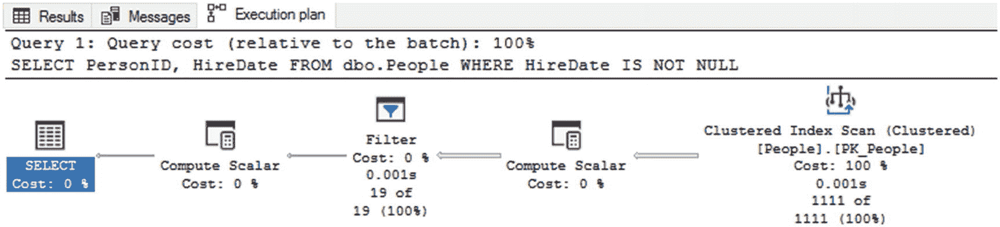
图 11-50
计算 JSON 列的执行计划

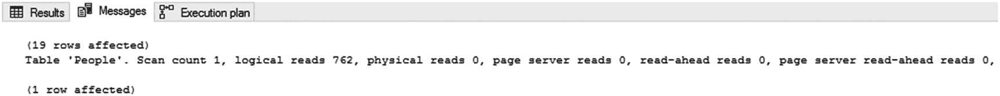
图 11-49
计算 JSON 列的统计 I/O 结果

```
USE WideWorldImporters;
GO
SET STATISTICS IO ON;
SELECT PersonID,
HireDate
FROM dbo.People
WHERE HireDate IS NOT NULL;
清单 11-36
查询计算 JSON 列
```

为了减轻计算 JSON 列对性能的影响，我们可以为该计算列添加索引，如清单 11-37 所示，然后再次执行针对 `dbo.People` 的查询。这次性能得到了极大改善。读取次数从 762 次减少到图 11-51 显示的仅 3 次。此外，图 11-52 中的执行计划表明使用了在添加的索引上的索引查找。

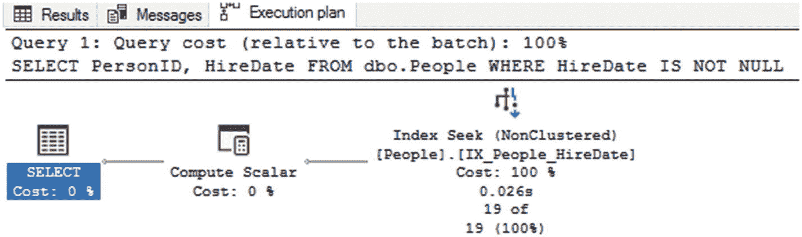
图 11-52
计算并创建索引的 JSON 列的执行计划

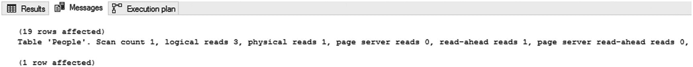
图 11-51
计算并创建索引的 JSON 列的统计 I/O 结果

```
USE WideWorldImporters;
GO
CREATE INDEX IX_People_HireDate ON dbo.People (HireDate);
GO
SET STATISTICS IO ON;
SELECT PersonID,
HireDate
FROM dbo.People
WHERE HireDate IS NOT NULL
清单 11-37
为 JSON 计算列创建索引并进行查询
```

通过利用计算列，JSON 数据可以在数据库中轻松高效地访问。而且，无需学习新的索引技术来获得这种效率，您就能够利用现有功能。这使得采用和维护 JSON 以及实现对该数据的高效查询访问变得更加容易。

## 索引存储策略

本章至此介绍的策略主要集中在通过索引的键列和非键列设计来提升查询性能。在索引设计时，还可以考虑与列选择结合使用的其他选项。这些替代策略都与索引在数据库中的存储方式有关。

有两种选项可用于处理索引如何存储其数据。这两种选项的基本前提是，索引越小，其包含的页就越少，查询数据时所需的读写操作也就越少。第一个可用选项是行压缩，第二个是页压缩。这两个选项都有潜力显著节省存储空间并提升性能。

### 注意
行压缩和页压缩的使用仅限于 SQL Server 企业版。


### 行压缩

#### 工作原理

减小索引大小的第一种方法是减小索引中行的大小。行压缩通过改变行中数据的存储方式来实现这一点。行压缩可用于堆表或聚集/非聚集索引。启用行压缩后，行上会发生一些变化。具体如下：

*   修改行的元数据。
*   定长字符数据以变长格式存储。
*   基于数字的数据类型以变长格式存储。

通过元数据的更改，为每个列存储的信息通常比非行压缩记录要少。行开销中多余的位被移除，信息被精简以减少浪费。不过这种更改有一个例外：对定长数据类型的一些更改可能会导致更大的行开销，以容纳数据长度和偏移量值所需的额外信息。

对于定长字符数据，列值末尾的空白会被移除。这些信息不会丢失，且定长数据类型（如`char`和`nchar`）的行为不受影响。区别仅在于数据的存储方式。对于二进制数据，值末尾的零会被移除，类似于空白处理。从列中移除字符的信息存储在行开销中。

数字数据类型可能是行压缩中变化最大的数据类型。对于这些数据类型，数据类型以其可能的最小形式存储。这意味着一个`bigint`数据类型的列，通常需要 8 字节，但如果存储的值在 0 到 255 之间，则只需要 1 字节。当值为 256 时，该列将以 2 字节存储该值。这个递进过程一直持续到需要以 8 字节存储值为止。这适用于所有基于数字的数据类型，包括`smallint`、`int`、`bigint`、`decimal`、`numeric`、`smallmoney`、`money`、`float`、`real`、`datetime`、`datetime2`、`datetimeoffset`和`timestamp`。

#### 示例设置

为了演示，你首先需要一个用于实现压缩的表，如代码清单 11-38 所示。此脚本创建了两个表：`dbo.NoCompression`和`dbo.RowCompression`。让我们使用这些表来演示行压缩对表大小（通过聚集索引）和查询性能的影响。

```
USE AdventureWorks2017
GO
IF OBJECT_ID('dbo.NoCompression') IS NOT NULL
DROP TABLE dbo.NoCompression;
IF OBJECT_ID('dbo.RowCompression') IS NOT NULL
DROP TABLE dbo.RowCompression;
SELECT SalesOrderID
,SalesOrderDetailID
,CarrierTrackingNumber
,OrderQty
,ProductID
,SpecialOfferID
,UnitPrice
,UnitPriceDiscount
,LineTotal
,rowguid
,ModifiedDate
INTO dbo.NoCompression
FROM Sales.SalesOrderDetail;
SELECT SalesOrderID
,SalesOrderDetailID
,CarrierTrackingNumber
,OrderQty
,ProductID
,SpecialOfferID
,UnitPrice
,UnitPriceDiscount
,LineTotal
,rowguid
,ModifiedDate
INTO dbo.RowCompression
FROM Sales.SalesOrderDetail;
代码清单 11-38
行压缩的设置
```

#### 实施与性能影响

行压缩的实现依赖于在`CREATE`或`ALTER INDEX`语句中使用`DATA_COMPRESSION`索引选项。压缩可用于聚集或非聚集索引。对于行压缩，`ROW`选项如代码清单 11-39 所示。在此示例中，向两个示例表都添加了聚集索引。在此表上使用行压缩的影响令人印象深刻；聚集索引所需的页面数量减少了 35%以上（见图 11-53）。

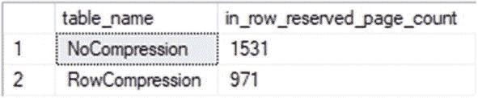

图 11-53
行压缩输出

```
USE AdventureWorks2017
GO
CREATE CLUSTERED INDEX CLIX_NoCompression ON dbo.NoCompression
(SalesOrderID, SalesOrderDetailID);
CREATE CLUSTERED INDEX CLIX_RowCompression ON dbo.RowCompression
(SalesOrderID, SalesOrderDetailID)
WITH (DATA_COMPRESSION = ROW);
SELECT OBJECT_NAME(object_id) AS table_name
,in_row_reserved_page_count
FROM sys.dm_db_partition_stats
WHERE object_id IN (OBJECT_ID('dbo.NoCompression'),OBJECT_ID('dbo.RowCompression'));
代码清单 11-39
实现行压缩
```

存储不是唯一得到改进的地方；查询性能也有所提高。为了演示这一优势，请执行代码清单 11-40 中的代码。在此脚本中，针对上一个示例中的表执行了两个查询。虽然查询的业务规则相同，但启用了行压缩的表在页面读取量上减少了 36%以上。仅仅通过向索引添加压缩，查询所需的资源就减少了，并且无需更改查询设计即可提高性能（图 11-54）。

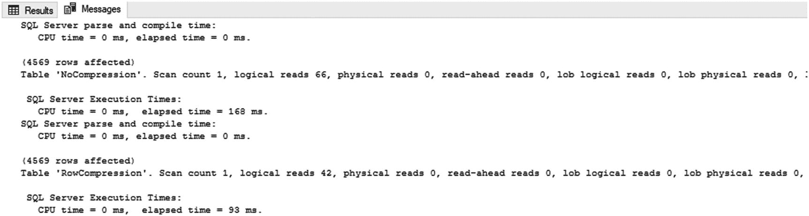

图 11-54
行压缩查询统计信息

```
USE AdventureWorks2017
GO
SET STATISTICS IO, TIME ON
SELECT SalesOrderID, SalesOrderDetailID, CarrierTrackingNumber
FROM dbo.NoCompression
WHERE SalesOrderID BETWEEN 51500 AND 52000;
SELECT SalesOrderID, SalesOrderDetailID, CarrierTrackingNumber
FROM dbo.RowCompression
WHERE SalesOrderID BETWEEN 51500 AND 52000;
代码清单 11-40
行压缩查询
```

#### 实施考虑因素

在索引上实施行压缩时，有许多事项需要考虑。首先，任何压缩使用所实现的压缩量将因所使用的数据类型和存储的数据而异。改进会（也应该）因表和时间而异。如果行的最大可能大小超过 8,060 字节（包括数据大小和行开销），则无法启用压缩。非聚集索引不会继承聚集索引或堆表的压缩设置；这必须在创建索引时指定。但是，如果未指定，聚集索引将继承其创建所在堆表的压缩设置。

行压缩是一种用于更改索引存储方式的有用机制。它减小了行的大小，具有提高查询性能和减少索引存储需求的双重好处。实施行压缩时主要需要关注的是与其使用相关的额外开销；这种开销表现为 CPU 利用率的小幅增加，这通常会被减少的查询处理工作量所抵消，如图 11-54 所示。除非你能证明行压缩导致了问题，否则至少在索引上始终利用行压缩可能是最佳选择。


### 页面压缩

减少索引大小的另一种方法是使用可变长度数据类型并消除页面上的重复值。SQL Server 通过索引上的页面压缩选项实现这一点。与行压缩类似，此压缩类型可应用于堆表、聚集索引和非聚集索引。页面压缩包含三个组成部分：

*   行压缩
*   前缀压缩
*   字典压缩

页面压缩的行压缩组件与行压缩选项完全相同。在压缩页面之前，首先会对页面上的行进行压缩。

页面压缩的下一步是通过前缀压缩完成的。前缀压缩扫描各列，移除相似的值，并将它们分组存储在页面头部。例如，如果若干列的值都以 `abc` 开头，则该值会被放置在页面头部，并在列中用一个位置标识符替换原值，以指示哪些值已被替换。如果另一列包含值 `abcd`，则会包含对页面头部 `abc` 值的引用，将该列的值更改为 `0d`。此过程对所有列持续进行，以移除最常见的模式并减少每行每列存储的信息量。

页面压缩的最后一步是字典压缩。通过字典压缩，检查所有列中的值是否存在重复值。延续前面的例子，如果多行中的两列存在与 `0d` 值匹配的值，那么该值会被放置在页面头部，并在那些列中存储对该值的引用。这在整个页面范围内执行，减少了重复的前缀压缩值。

为了演示页面压缩的优势，让我们扩展行压缩部分的示例。首先，执行 `清单 11-41` 中的脚本。这将创建一个类似于之前示例中表的 `dbo.PageCompression` 表。

```
USE AdventureWorks2017
GO
IF OBJECT_ID('dbo.PageCompression') IS NOT NULL
DROP TABLE dbo.PageCompression;
SELECT SalesOrderID
,SalesOrderDetailID
,CarrierTrackingNumber
,OrderQty
,ProductID
,SpecialOfferID
,UnitPrice
,UnitPriceDiscount
,LineTotal
,rowguid
,ModifiedDate
INTO dbo.PageCompression
FROM Sales.SalesOrderDetail;
```

`清单 11-41` 页面压缩设置

实施页面压缩与行压缩几乎相同。两者都使用 `DATA_COMPRESSION` 选项，其中页面压缩使用 `PAGE` 选项。要查看页面压缩对表的影响，请执行 `清单 11-42` 中的代码。在此示例中，页面压缩对表的影响比行压缩观察到的要显著得多。这次表使用的页面数量减少了 55%，如 `图 11-55` 所示。

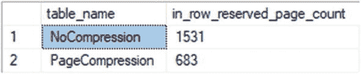

`图 11-55` 页面压缩输出

```
USE AdventureWorks2017
GO
CREATE CLUSTERED INDEX CLIX_PageCompression ON dbo.PageCompression
(SalesOrderID, SalesOrderDetailID)
WITH (DATA_COMPRESSION = PAGE);
SELECT OBJECT_NAME(object_id) AS table_name
,in_row_reserved_page_count
FROM sys.dm_db_partition_stats
WHERE object_id IN (OBJECT_ID('dbo.NoCompression'),OBJECT_ID('dbo.PageCompression'));
```

`清单 11-42` 实施页面压缩

页面压缩的改进不仅限于存储索引。这些改进还延续到查询表时。将之前针对 `dbo.NoCompression` 的结果与针对 `dbo.PageCompression` 的结果（`清单 11-43`）进行比较表明，页面压缩继续节省了读取量。在这种情况下，读取量降至 29（见 `图 11-56`），这相当于 I/O 成本降低了 55% 以上。

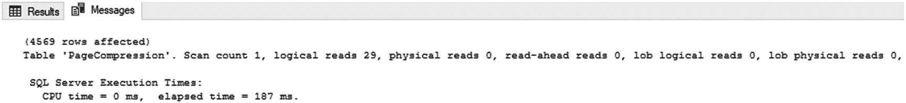

`图 11-56` 页面压缩查询统计信息

```
USE AdventureWorks2017
GO
SET STATISTICS IO, TIME ON
SELECT SalesOrderID, SalesOrderDetailID, CarrierTrackingNumber
FROM dbo.PageCompression
WHERE SalesOrderID BETWEEN 51500 AND 52000;
```

`清单 11-43` 页面压缩查询

页面压缩的注意事项与行压缩的注意事项性质相似，只是增加了几个额外的事项。首先，由于页面压缩的实现方式，有时 SQL Server 会判定页面的压缩率不足以证明压缩该页面的成本是合理的。在这些情况下，SQL Server 会尝试压缩页面，但会记录页面压缩失败，并存储该页面，使其无法获得相对于行压缩的页面压缩优势。监控页面压缩尝试未能成功的比率非常重要，因为这可以表明在索引上使用页面压缩的价值很低。这一点在 `第 3 章` 有进一步讨论。

其次，页面压缩的 CPU 成本远高于行压缩或没有压缩的情况。如果没有足够的 CPU 资源可用，这可能会导致其他性能问题。最后，对于预期会频繁修改数据的表和索引，页面压缩并不理想。为了修改单行而压缩和解压缩页面可能会对 CPU 产生显著影响。

行压缩和页面压缩都能为索引解决方案带来显著的成本节省。在设计索引时，可以考虑同时使用这两种技术。在其他解决方案可能未产生理想结果的情况下，这样做将提供性能改进。

### 注意

你可以在在线丛书（Books Online）主题“数据压缩”（`https://docs.microsoft.com/en-us/sql/relational-databases/data-compression/data-compression`）中找到与压缩相关的其他注意事项。


## 索引视图

在许多情况下，数据库中数据的存储方式并不能完全代表用户需要从数据库中检索的信息。为了解决这个问题，您可以构建查询，将用户所需的数据提取到结果集中，以便他们更轻松地使用。在执行这些活动的过程中，您可以对数据进行聚合，以提供用户所需详细程度的结果。

例如，用户可能希望查看数据库中所有订单中某个产品的总销售额，但不包括明细项目的信息。在大多数情况下，检索此信息并不是问题。然而，在某些情况下，动态执行该聚合可能会在数据库中造成瓶颈。虽然索引有助于简化聚合，但它们有时无法提供所需的性能提升以达到要求的性能。

解决此问题的一个可能方案是在数据库中的视图上创建索引。可以创建视图来提供所需的摘要和聚合，并且可以使用索引将视图中的信息物化为聚合形式。为视图创建索引时，查询的结果会以与存储任何表大致相同的方式存储在数据库中。通过预先存储此信息，使用视图中聚合的查询可以获得改进的响应时间。

在了解如何实现视图之前，让我们先看看前面概述的检索产品摘要信息的问题。在这种情况下，假设需要在产品子类别级别获取所有产品的摘要信息。为此提供的查询（如清单 11-44 所示）需要提供 `LineTotal` 和 `OrderQty` 值的总和聚合，然后是 `UnitPrice` 的平均值。虽然该查询的读取次数并非特别高（参见图 11-57），但假设在此数据库中，该次数被认为对于发布到生产的查询来说太高了。检查执行计划（如图 11-58 所示），您会发现虽然它并非过于复杂，但该计划包含多个步骤，因此不被认为是一个简单的计划。

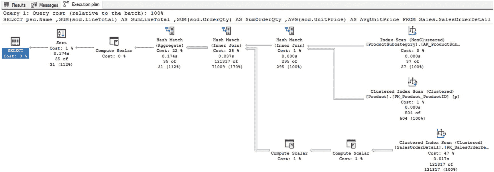
**图 11-58** 昂贵聚合的执行计划

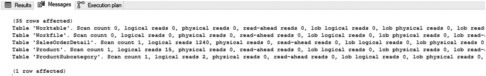
**图 11-57** 昂贵聚合的 Statistics I/O 结果

```
USE AdventureWorks2017
GO
IF OBJECT_ID('dbo.ProductSubcategorySummary') IS NOT NULL
DROP VIEW dbo.ProductSubcategorySummary;
SET STATISTICS IO ON;
SELECT psc.Name
,SUM(sod.LineTotal) AS SumLineTotal
,SUM(sod.OrderQty) AS SumOrderQty
,AVG(sod.UnitPrice) AS AvgUnitPrice
FROM Sales.SalesOrderDetail sod
INNER JOIN Production.Product p ON sod.ProductID = p.ProductID
INNER JOIN Production.ProductSubcategory psc ON p.ProductSubcategoryID = psc.ProductSubcategoryID
GROUP BY psc.Name
ORDER BY psc.Name;
```
**清单 11-44** 昂贵的聚合查询

如前所述，此性能问题的解决方案可以通过为清单 11-43 中的查询创建视图并向该视图添加索引来找到。为视图添加索引时需要考虑许多事情。一些更重要的注意事项如下：

*   视图中的所有列必须是确定性的。
*   必须使用 `SCHEMA_BINDING` 视图选项创建视图。
*   聚集索引必须创建为唯一的。
*   视图中引用的表必须使用双部分命名。
*   如果要聚合值，则必须包含 `COUNT_BIG()` 函数。
*   某些聚合（例如 `AVG()`）在索引视图中是不允许的。

创建索引视图时的额外注意事项包含在联机文档（Books Online）主题“创建索引视图”（[`https://docs.microsoft.com/en-us/sql/relational-databases/views/create-indexed-views?`](https://docs.microsoft.com/en-us/sql/relational-databases/views/create-indexed-views?)）中。

创建索引视图的第一步是创建基础视图。考虑到列出的注意事项，清单 11-44 中的查询不能直接转换为视图。必须更改查询以移除 `AVG` 函数并包含 `COUNT_BIG` 函数。虽然此更改从输出中移除了一个所需的数据元素，但在为视图创建索引后，您将能够计算该值。此外，视图定义必须包含 `WITH SCHEMABINDING` 选项。最终结果是清单 11-45 中的视图定义。最后一步是使用 `Production.ProductSubcategory` 表中的 `Name` 列在该表上创建唯一的聚集索引。

```
USE AdventureWorks2017
GO
CREATE VIEW dbo.ProductSubcategorySummary
WITH SCHEMABINDING
AS
SELECT psc.Name
,SUM(sod.LineTotal) AS SumLineTotal
,SUM(sod.OrderQty) AS SumOrderQty
,SUM(sod.UnitPrice) AS TotalUnitPrice
,COUNT_BIG(*) AS Occurrences
FROM Sales.SalesOrderDetail sod
INNER JOIN Production.Product p ON sod.ProductID = p.ProductID
INNER JOIN Production.ProductSubcategory psc ON p.ProductSubcategoryID = psc.ProductSubcategoryID
GROUP BY psc.Name;
GO
CREATE UNIQUE CLUSTERED INDEX CLIX_ProductSubcategorySummary
ON dbo.ProductSubcategorySummary(Name)
```
**清单 11-45** 索引视图

索引视图就位后，下一步是测试该视图与原始查询相比的性能如何。在执行清单 11-46 中的代码之前，首先查看第二个查询，该查询使用 `TotalUnitPrice` 和 `Occurrences` 列来生成 `AvgUnitPrice`。虽然您不能在索引视图的定义中包含 `AVG` 函数，但只需付出最少的努力就可以得到相同的结果。

执行清单 11-46 中的查询后，您会注意到它们的性能比清单 11-44 中的示例要好得多。不再需要超过 1,200 次读取，现在只需要 2 次读取（参见图 11-59），并且执行计划（图 11-60）也简单得多。该计划从众多运算符简化为仅三个运算符。

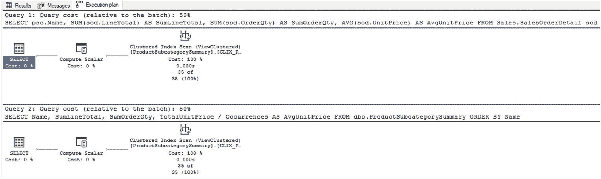
**图 11-60** 索引视图模式的执行计划

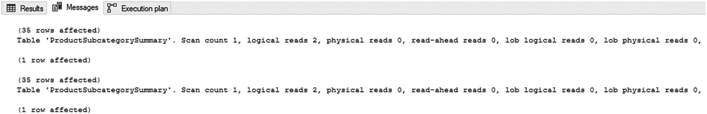
**图 11-59** 索引视图模式的 Statistics I/O 结果

```
USE AdventureWorks2017;
GO
SET STATISTICS IO ON;
SELECT psc.Name,
SUM(sod.LineTotal) AS SumLineTotal,
SUM(sod.OrderQty) AS SumOrderQty,
AVG(sod.UnitPrice) AS AvgUnitPrice
FROM Sales.SalesOrderDetail sod
INNER JOIN Production.Product p
ON sod.ProductID = p.ProductID
INNER JOIN Production.ProductSubcategory psc
ON p.ProductSubcategoryID = psc.ProductSubcategoryID
GROUP BY psc.Name
ORDER BY psc.Name;
SELECT Name,
SumLineTotal,
SumOrderQty,
TotalUnitPrice / Occurrences AS AvgUnitPrice
FROM dbo.ProductSubcategorySummary
ORDER BY Name;
```
**清单 11-46** 索引视图


在执行过程中，你可能还会注意到另一个奇特的现象。在实施索引视图后，针对基础表的查询和针对视图的查询执行情况完全一致。这是索引视图带来的额外好处之一。当 SQL Server 确定第一个查询的执行计划时，它能够推断出存在一个索引视图可以覆盖与该查询相同的逻辑，即使平均值列的计算方式并不相同。

当需要将多个表连接在一个单元中以减少运行时连接数据所需的 I/O 时，索引视图是一个非常有用的工具。尽管索引视图有许多限制，但它也带来了诸多好处，包括能够在类似清单 11-46 所示的情况下使用索引视图。当你频繁使用具有相同结构的视图和查询时，请考虑引入视图是否能提供基础表上索引所无法提供的优势。

### 本章小结

本章重点介绍在多种情况下如何以及何时对表应用索引。每个示例都演示了如何将特定的索引模式应用于相应场景，以通过索引来提升性能。本章涵盖了使用堆的有限但有效的实例。接着，介绍了构建聚集索引的各种选项和方式。关于非聚集索引，示例展示了在聚集键之外的列上提升性能时，向聚集索引添加选项的方法。本章还包含了一个实现列存储索引的示例，并讨论了何时应用此类索引。总的来说，这些模式为识别数据库中表所需索引的类型奠定了基础，并提供了比较和对比不同索引的基础。

# 第 12 章 查询策略

在上一章中，我们探讨了识别数据库潜在索引的策略。然而，这往往只是故事的一半。一旦索引创建完成，你会期望数据库内的性能得到提升，从而转向下一个瓶颈。不幸的是，编码实践和选择性有时会对索引在查询中的应用产生负面影响。有时，数据库和表的访问方式会阻碍你使用数据库中某些最有益的索引。

本章涵盖了许多查询策略，在这些策略中，索引可能不会如你所预期的那样被使用。这些场景包括：

*   `LIKE` 比较
*   字符串连接
*   计算列
*   标量函数
*   数据转换

在每种场景中，我们将审视其周围的情况以及它们为何不能按预期工作。然后，我们将看到一些缓解问题的方法，以及关于如何在正确的地方使用正确索引的技巧。到本章结束时，我们将更有准备地识别那些会阻碍你为性能而对数据库进行索引的情况，并且我们将拥有开始缓解这些风险的工具。

## LIKE 比较

在考察查询对索引使用的影响时，首先要看的就是 `LIKE` 比较。`LIKE` 比较允许在列中搜索任何单个字符或模式。如果你需要查找表中所有以字母 `AAA` 或 `BBB` 开头的值，`LIKE` 比较提供了此功能。在这些搜索中，查询可以读取索引并找到匹配字符或模式的值，因为索引是排序的。当在查询中使用此比较来查找包含或以某个字符或模式结尾的值时，问题就会出现。

在这种情况下，索引的排序变得无关紧要，因为统计数据仅在字符值的左边缘收集。字母 `B` 出现在索引第一个值中的可能性与其出现在索引最后一个值中的可能性是相等的。为了确定表中哪些记录在列中包含 `B`，必须检查所有行。没有可用的统计数据来识别出现的可能性或位置。由于没有可靠的统计数据可用，SQL Server 将不知道使用哪个索引来满足查询，最终可能使用一个较差的执行计划。

为了理解 `LIKE` 比较可能出现的问题，我们将通过几个演示来展示两种场景及其相关统计信息。首先，让我们从查询 `Person.Address` 表中 `AddressLine1` 以 710 开头的记录开始（见清单 12-1）。查看图 12-1 中的 `STATISTICS IO` 输出显示，该查询需要三次逻辑读取。检查图 12-2 中的执行计划显示，在非聚集索引上进行了索引查找，这导致了三次逻辑读取。

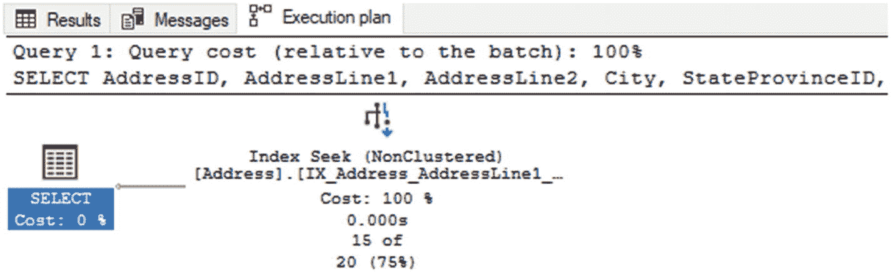
**图 12-2**
地址以 710 开头的执行计划

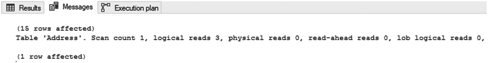
**图 12-1**
地址以 710 开头的 STATISTICS IO

```
USE AdventureWorks2017
GO
SET STATISTICS IO ON;
SELECT AddressID, AddressLine1, AddressLine2, City, StateProvinceID, PostalCode
FROM Person.Address
WHERE AddressLine1 LIKE '710%';
```
*清单 12-1*
查询以 710 开头的地址

在这种情况下，`LIKE` 比较运行良好，执行计划、统计信息和 I/O 都符合请求要求。不幸的是，如前所述，这不是使用 `LIKE` 比较的唯一方式。该比较也可用于查找列内的值。考虑一个场景，你需要查找与特定街道名称（如 Longbrook）匹配的所有地址（见清单 12-2）。对于此查询，执行计划在非聚集索引上使用扫描，需要 216 次逻辑读取，如图 12-3 所示。图 12-4 显示了执行计划。

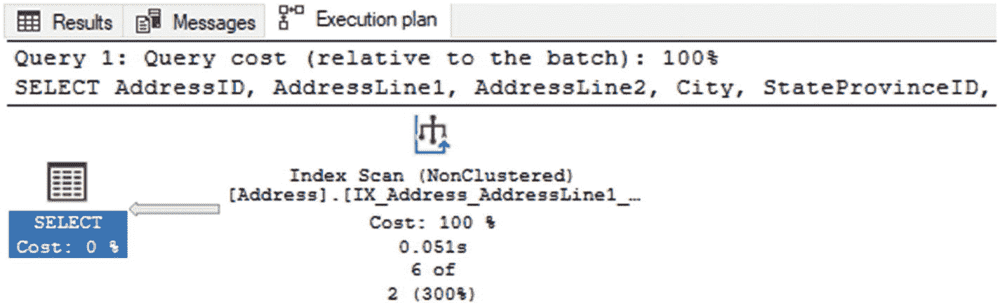
**图 12-4**
包含“Longbrook”的地址的执行计划

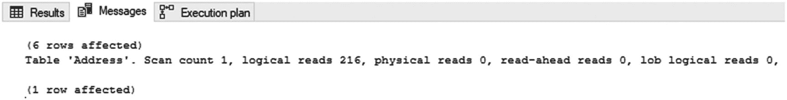
**图 12-3**
包含“Longbrook”的地址的 STATISTICS IO

```
USE AdventureWorks2017
GO
SET STATISTICS IO ON;
SELECT AddressID, AddressLine1, AddressLine2, City, StateProvinceID, PostalCode
FROM Person.Address
WHERE AddressLine1 LIKE '%Longbrook%';
```
*清单 12-2*
查询包含“Longbrook”的地址


在本场景中，表和索引都很小。索引查找（index seek）与索引扫描（index scan）之间的差异并不十分显著。试想一下，如果此场景发生在你的生产系统中，并且涉及数据库中较大的表之一。此时，SQL Server 无法快速过滤出匹配搜索值的记录，而必须遍历所有行。虽然完成时间可能只需几十秒，但这为阻塞（blocking）和死锁（deadlocking）问题打开了机会，从而进一步减慢环境中的查询速度。

避免这种情况的一个流行方法是规定通配符绝不允许出现在搜索条件的左边缘。不幸的是，这是一个相当不切实际的期望。世界上很少有业务经理会同意要求他们的用户输入所有可能的街道号码组合，以尝试找到匹配街道名称搜索的每一个地址。光是读一下这个要求就觉得很傻。

针对此场景，一个虽不流行但更合适且有用的解决方案是在表上创建全文索引。全文索引不如非聚集索引（nonclustered indexes）流行的一个影响因素是它们的构建和创建方式存在差异，这使得大多数人对它们不太熟悉。使用全文索引时，一个或多个列中的词汇会被编入目录，并记录它们在表中的位置。这使得查询能够快速搜索列值中的离散值，而无需检查索引中的所有记录。

要在 `Person.Address` 表上使用全文索引，必须首先创建一个全文目录（full-text catalog），如清单 12-3 所示。之后，创建全文索引，并包含将在查询中搜索的列。最后，需要修改查询以使用全文谓词函数之一。在此示例中，你将使用 `CONTAINS` 函数。

```
USE AdventureWorks2017
GO
SET STATISTICS IO ON;
CREATE FULLTEXT CATALOG ftQueryStrategies AS DEFAULT;
CREATE FULLTEXT INDEX ON Person.Address(AddressLine1)
KEY INDEX PK_Address_AddressID;
GO
SELECT AddressID, AddressLine1, AddressLine2, City, StateProvinceID, PostalCode
FROM Person.Address
WHERE CONTAINS (AddressLine1,'Longbrook');
Listing 12-3
Query for Addresses Using CONTAINS
```

有了全文索引后，搜索名为 Longbrook 的街道的性能，与第一次搜索（查询以 710 开头的地址）类似。在图 12-6 的执行计划中，查询不再扫描非聚集索引，而是使用聚集索引上的查找（seek）操作，并结合针对全文索引的表值函数查找。因此，使用 `LIKE` 比较时有 216 次逻辑读取，而使用全文索引仅需 12 次逻辑读取（如图 12-5 所示）。读取次数的差异带来了性能的显著提升。

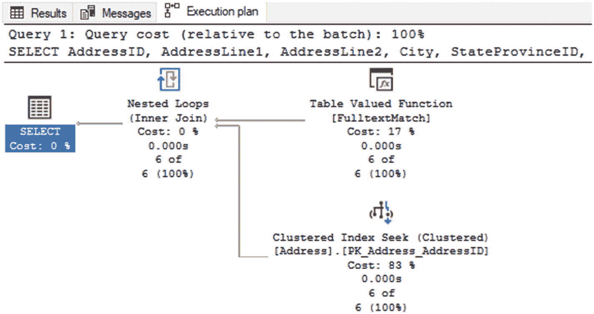

Figure 12-6

Execution plan for addresses using CONTAINS

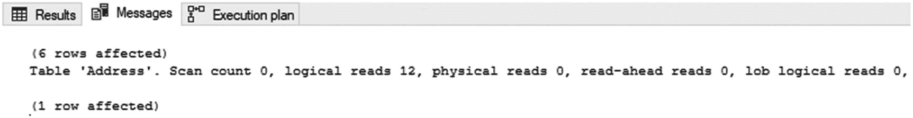

Figure 12-5

STATISTICS IO for addresses using CONTAINS

有关全文索引的更多信息，请阅读第 6 章。

## 连接

另一个可能严重破坏索引策略的场景是使用连接（concatenation）。*连接* 是指将两个或多个值附加在一起。当这种情况发生在 `WHERE` 子句中时，常常会导致意想不到的性能问题。

为了演示此场景，考虑一个查找名为 Gustavo Achong 的人的查询。搜索此值需要使用 `FirstName` 和 `LastName` 列，这两个列用一个空格连接在一起。清单 12-4 显示了此查询。代码清单中还包括一个在这些列上创建索引的脚本。为此查询生成的执行计划，如图 12-8 所示，表明使用了新索引，但操作是扫描（scan）而非更理想的查找（seek）。即使索引的前导左边缘与连接值的左侧值匹配，索引也无法确定在索引中的何处可以找到这些值。这导致索引使用 99 次逻辑读取来返回查询结果，如图 12-7 所示。

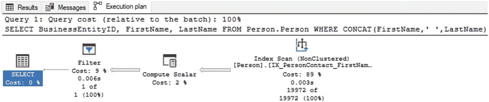

Figure 12-8

Execution plan for concatenation

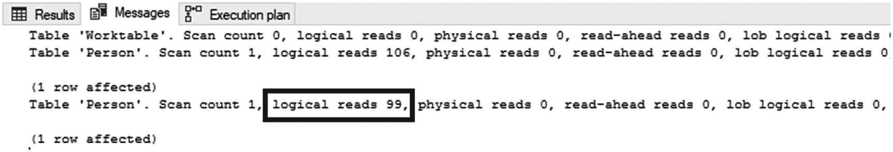

Figure 12-7

STATISTICS IO for concatenation

```
USE AdventureWorks2017
GO
SET STATISTICS IO ON;
CREATE INDEX IX_PersonContact_FirstNameLastName ON Person.Person (FirstName, LastName)
GO
SELECT BusinessEntityID, FirstName, LastName
FROM Person.Person
WHERE CONCAT(FirstName,' ',LastName) = 'Gustavo Achong'
Listing 12-4
Query with Concatenation
```

如前所述，使用索引扫描并不一定是坏事。然而，当存在大量并发用户或正在发生数据修改时，使用扫描可能会导致性能问题。对于拥有数百万或更多记录的大型表来说，这可能导致数据库缺乏可扩展性。

你可能认为去掉名字和姓氏之间的空格是个好主意（见清单 12-5），因为这样就使用了我们创建的索引中的两个列。此解决方案的主要问题是它不起作用。正如图 12-10 中的执行计划所示，它与连接值中包含空格的情况几乎相同，逻辑读取次数也是相同的 99 次（如图 12-9 所示）。

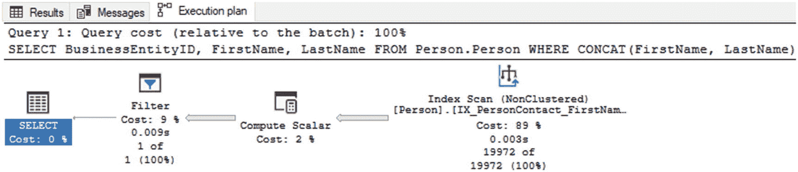

Figure 12-10

Execution plan for concatenation without spaces


Figure 12-9

STATISTICS IO for concatenation without spaces

```
USE AdventureWorks2017
GO
SET STATISTICS IO ON;
SELECT BusinessEntityID, FirstName, LastName
FROM Person.Person
WHERE CONCAT(FirstName, LastName)= 'GustavoAchong';
Listing 12-5
Concatenation Without Spaces
```

修复连接值问题的最好方法可能是消除连接的需要。与其搜索值 `Gustavo Achong`，不如分别搜索名字 `Gustavo` 和姓氏 `Achong`（见清单 12-6）。进行此更改后，查询就能够使用非聚集索引上的查找操作，并仅用两次逻辑读取返回结果（见图 12-11）。这些结果明显优于值连接在一起时的表现。执行计划见图 12-12。


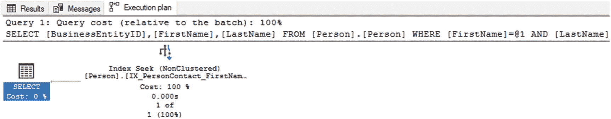
**图 12-12** 移除串联后的执行计划

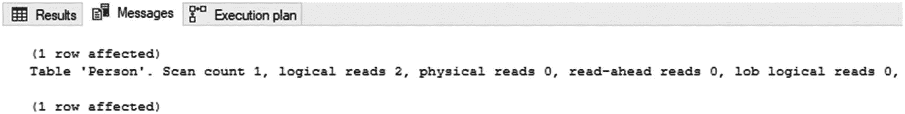
**图 12-11** 移除串联后的 STATISTICS IO

```
USE AdventureWorks2017
GO
SET STATISTICS IO ON;
SELECT BusinessEntityID, FirstName, LastName
FROM Person.Person
WHERE FirstName = 'Gustavo'
AND LastName = 'Achong';
```
**代码清单 12-6** 移除串联后的查询

有时，你可能无法选择从查询中移除串联。在这种情况下，还有另一种方法可以解决索引性能问题：可以将串联后的值作为计算列添加到表中。这个解决方案及其存在的一些问题将在下一节中讨论。

## 计算列

有时，表中的一个或多个列被定义为表达式。这类列被称为`计算列`。当你需要一个列来保存函数或计算的结果，并且该结果会根据表中的其他列随时间变化时，计算列会非常有用。与其花费 CPU 周期来确保对表的所有修改都包含对所有相关列的更改，不如在查询时更改组件并计算结果。

请注意，计算列无法利用其源列上的索引。为了演示，使用代码清单 12-7 向`Person.Person`表添加两个计算列。第一列将把`FirstName`和`LastName`连接在一起，就像上一节中那样。第二列将`ContactID`乘以`EmailPromotion`；这个计算本身没有意义，但它将展示如何将其用于其他计算类型。

```
USE AdventureWorks2017
GO
ALTER TABLE Person.Person
ADD FirstLastName AS (FirstName + ' ' + LastName)
,CalculateValue AS (BusinessEntityID ∗ EmailPromotion);
```
**代码清单 12-7** 向 Person.Person 添加计算列

列添加完成后，下一步是对表执行一些查询。使用代码清单 12-8 对该表执行两个查询。第一个查询类似于上一节中关于名字和姓氏的查询（搜索 Gustavo Achong）。第二个查询将返回所有`CalculateValue`为 198 的记录。

```
USE AdventureWorks2017
GO
SET STATISTICS IO ON
SELECT BusinessEntityID, FirstName, LastName, FirstLastName
FROM Person.Person
WHERE FirstLastName = 'Gustavo Achong';
SELECT BusinessEntityID, CalculateValue
FROM Person.Person
WHERE CalculateValue = 198;
```
**代码清单 12-8** 计算列查询

执行两个查询后，图 12-14 中的执行计划显示，两者都使用了扫描操作来返回查询结果。由于与本章前面提到的相同的原因，这些结果并不理想，因为它们可能导致阻塞，并且比查询请求所需使用了更多的 I/O。这里所说的更多 I/O，是指两个查询的结果都需要通过扫描整个表来进行读取 I/O，如图 12-13 所示。

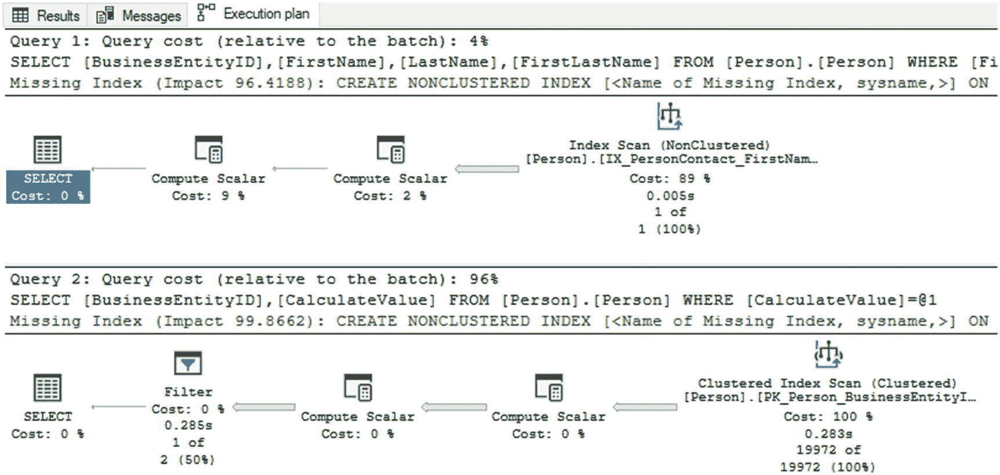
**图 12-14** 计算列执行计划

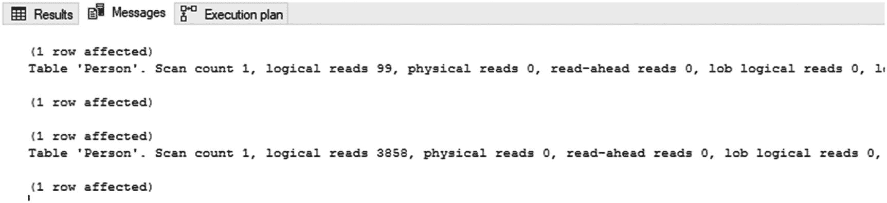
**图 12-13** 计算列的 STATISTICS IO

对于计算列，一个可用的索引选项是直接索引计算列本身，SQL Server 甚至会在图 12-4 中将其建议为缺失索引。正如`FirstLastName`的查询所示，该查询可以使用表上的任何索引。限制在于，它们无法比查询本身包含计算列表达式时更好地利用这些索引。如代码清单 12-9 所示，对计算列进行索引，提供了必要的分布和记录信息，允许像代码清单 12-8 中的查询使用寻道（seek）操作而不是扫描（scan）。索引将计算列中的值具体化，从而实现对数据的快速访问，这导致 I/O 从 99 次读取显著减少到 5 次读取，从 3,878 次读取减少到 2 次读取，如图 12-15 所示。图 12-16 显示了执行计划。

### 注意

对计算列进行索引时，该列的表达式必须是确定性的。这意味着每次使用相同的变量执行该表达式时，它总是返回相同的结果。例如，在计算列表达式中使用`GETDATE()`将不是确定性的。

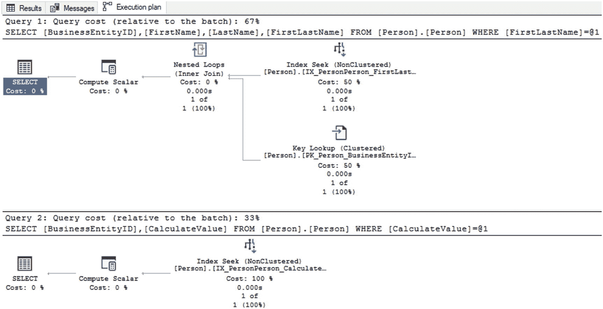
**图 12-16** 索引计算列的执行计划

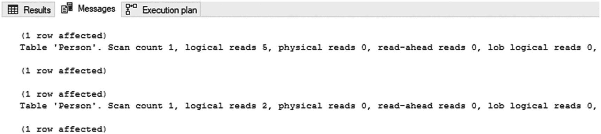
**图 12-15** 索引计算列的 STATISTICS IO

```
USE AdventureWorks2017
GO
CREATE INDEX IX_PersonPerson_FirstLastName ON Person.Person(FirstLastName);
CREATE INDEX IX_PersonPerson_CalculateValue ON Person.Person(CalculateValue);
```
**代码清单 12-9** 计算列索引

正如本节所展示的，当需要通过表达式来定义表中的值时，计算列会极其有用。例如，如果一个应用程序只能发送将姓氏和名字组合在一起的搜索，那么计算列可以提供应用程序所需格式的数据。这些列可以使用底层索引来返回结果，但由于列定义中的表达式，通常无法充分利用这些索引中的统计数据和底层排序。通过利用并索引计算列，你可以获得以应用程序所需状态保存数据的优势，同时保持最佳的性能。


## 标量函数

前面几个章节讨论了通过搜索列值或组合跨列的值来过滤查询结果。本节将探讨在查询的 `WHERE` 子句中使用标量函数所带来的影响。标量函数提供了将值转换为其他值的能力，这些转换后的值在查询数据库时可能比原始值更有用。

用户定义的标量函数也可以在 `WHERE` 子句中创建和使用。系统定义和用户定义的标量函数都存在的问题是，如果它们转换了索引所在的列，那么 SQL Server 就无法高效地使用这些函数。因为计算值的结果只有在运行时才能确定，查询优化器没有统计信息来确定索引中值的频率，也没有关于计算值在索引或表中位置的信息。

为了演示标量函数对查询的影响，请考虑代码清单 12-10 中的两个查询，它们返回来自 `Person.Person` 的信息。两个查询都将返回 `FirstName` 列中值为 `Gustavo` 的所有行。两个查询的区别在于，第二个查询将在 `WHERE` 子句中对 `FirstName` 列使用 `RTRIM` 函数。

```sql
USE AdventureWorks2017
GO
SET STATISTICS IO ON
SELECT BusinessEntityID, FirstName, LastName
FROM Person.Person
WHERE FirstName = 'Gustavo';
SELECT BusinessEntityID, FirstName, LastName
FROM Person.Person
WHERE RTRIM(FirstName) = 'Gustavo';
```

**代码清单 12-10** 针对 `FirstName` Gustavo 的查询

如图 12-18 中的第二个执行计划所示，当在 `WHERE` 子句中添加标量函数后，执行计划继续使用与第一个计划相同的索引，但采用了索引扫描而不是索引查找。这一变化使 I/O 从 2 增加到 99（如图 12-17 所示），这与其它示例类似。在此示例中，正如第一个查询那样，只要排除标量函数，就能获得与使用函数相同的结果。但这并不适用于所有查询，而让索引得到最佳使用的方法是将标量函数从键列移动到查询的参数中。

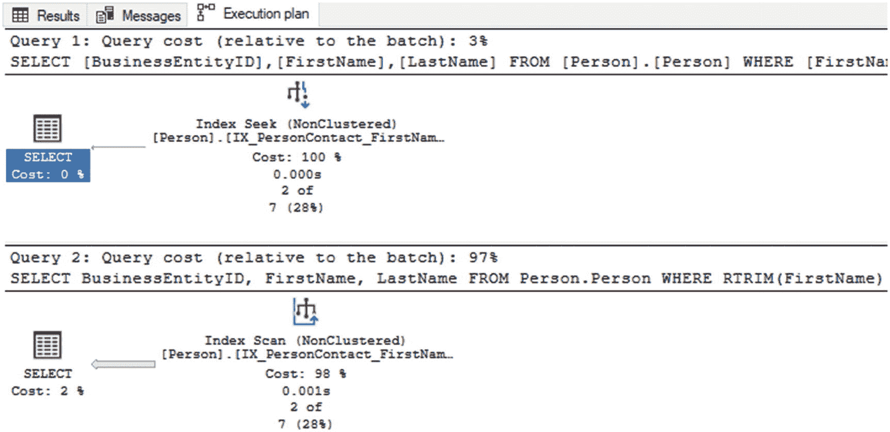
**图 12-18** Gustavo 查询的执行计划

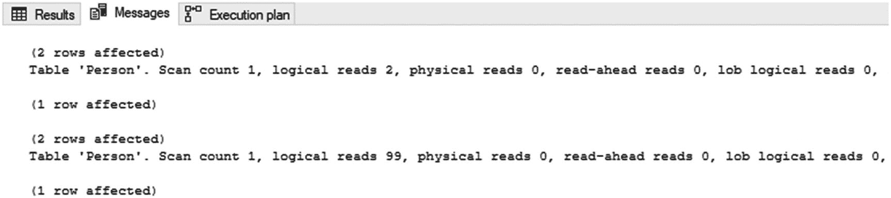
**图 12-17** Gustavo 查询的执行计划

关于如何将标量函数从键列移动到参数中的一个好例子，是使用 `MONTH` 和 `YEAR` 函数时。假设一个查询需要返回 2001 年 12 月的所有销售订单。这可以通过代码清单 12-11 中的第一个 `SELECT` 查询来实现。不幸的是，使用 `MONTH` 和 `YEAR` 函数会改变 `OrderDate` 的值，尽管建立的索引仍然被使用，但使用的是扫描而非查找（参见图 12-20 中的第一个执行计划）。这个问题可以通过改变查询方式来避免，即不使用函数，而是针对一个值范围进行筛选，如代码清单 12-11 中的第二个 `SELECT` 语句所示。如第二个执行计划所示，查询能够通过查找而非扫描来返回结果，读取次数显著减少，从 73 降至 3，如图 12-19 所示。

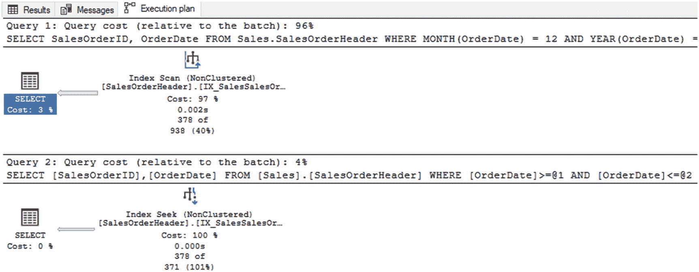
**图 12-20** 日期查询的执行计划

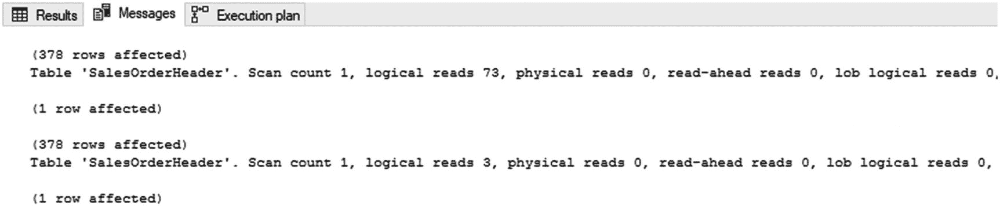
**图 12-19** 日期查询的执行计划

```sql
USE AdventureWorks2017
GO
CREATE INDEX IX_SalesSalesOrderHeader_OrderDate ON Sales.SalesOrderHeader(OrderDate);
SET STATISTICS IO ON;
SELECT SalesOrderID, OrderDate
FROM Sales.SalesOrderHeader
WHERE MONTH(OrderDate) = 12
AND YEAR(OrderDate) = 2012;
SELECT SalesOrderID, OrderDate
FROM Sales.SalesOrderHeader
WHERE OrderDate BETWEEN '20121201' AND '20121231';
SET STATISTICS IO OFF;
```

**代码清单 12-11** 针对 `FirstName` Gustavo 的查询

从查询的 `WHERE` 子句中移除标量函数并不总是可行的。一个很好的例子是，当某个列的值前被添加了前导空格，而在将列值与参数进行比较时不应包含这些空格。在这种情况下，你需要更“跳出框架”地思考。一种可能的解决方案是使用计算列并在其上建立索引，正如前一节所建议的那样。

在处理 `WHERE` 子句中的标量函数时，需要记住的重要一点是：如果函数改变了列的值，那么该列上的任何索引很可能都无法被查询尽可能高效地使用。如果表很小且查询不频繁，这可能不是大问题。但对于大型系统，这可能是导致索引扫描次数意外增多的原因，并可能引发阻塞和死锁问题。

## 数据类型转换

查询可能对索引使用方式产生负面影响的最后一个领域，是在 `JOIN` 操作或 `WHERE` 子句中更改列的数据类型时。当数据类型在这些情况下不匹配时，SQL Server 需要将列中的值转换为相同的数据类型。如果数据类型转换未包含在查询语法中，SQL Server 会在后台尝试进行转换。

数据转换对查询性能产生负面影响的原因与标量函数相关的问题类似。如果索引中的一个列需要从 `varchar` 转换为 `int`，那么该索引的统计信息和其他信息将无法用于确定值的频率和位置。例如，数字 10 和字符串 `"10"` 在同一个索引中很可能被排序到完全不同的位置。为了说明数据转换对查询可能产生的影响，首先执行代码清单 12-12 中的代码。

```sql
USE AdventureWorks2017
GO
SELECT BusinessEntityID
,CAST(FirstName as varchar(50)) as FirstName
,CAST(MiddleName as varchar(50)) as MiddleName
,CAST(LastName as varchar(50)) as LastName
INTO PersonPerson
FROM Person.Person;
CREATE CLUSTERED INDEX IX_PersonPerson_ContactID ON PersonPerson (BusinessEntityID);
CREATE INDEX IX_PersonContact_FirstName ON PersonPerson(FirstName);
```

**代码清单 12-12** 数据类型转换设置

代码清单 12-12 将创建一个包含 `varchar` 数据的表。然后，它将向该表添加两个索引，用于演示查询。代码清单 12-13 中显示的两个示例查询，将用于展示数据类型转换如何影响索引的性能和利用率。这两个查询都使用了 `RECOMPILE` 选项，以防止在未使用该选项时可能发生的参数嗅探问题。

### 注意

关于参数嗅探的更多信息，请阅读 Paul White 在 [SQLPerformance.com](http://sqlperformance.com) 上的文章 [《参数嗅探、嵌入与 RECOMPILE 选项》](http://sqlperformance.com/2013/08/t-sql-queries/parameter-sniffing-embedding-and-the-recompile-options)。

第一个 `SELECT` 查询使用了 `nvarchar` 数据类型的 `@FirstName` 变量。此数据类型与表 `PersonContact` 中列的 `varchar` 数据类型不匹配，因此必须将表中的列从 `varchar` 转换为 `nvarchar`。该查询的执行计划（图 12-21）显示，查询使用非聚集索引的索引查找来满足查询，并且谓词正在将列中的数据转换为 `nvarchar`，同时对非聚集索引中未包含的列进行聚集索引键查找。另请注意，第一个查询的开销占批处理总开销（仅这两个查询）的 40%。

```sql
USE AdventureWorks2017
GO
SET STATISTICS IO ON
DECLARE @FirstName nvarchar(100)
SET @FirstName = 'Gail';
SELECT FirstName, LastName FROM PersonPerson
WHERE FirstName = @FirstName
OPTION (RECOMPILE);
GO
DECLARE @FirstName varchar(100)
SET @FirstName = 'Gail';
SELECT FirstName, LastName FROM PersonPerson
WHERE FirstName = @FirstName
OPTION (RECOMPILE);
```

**清单 12-13** 隐式转换查询

### 注意

执行计划中为运算符显示的附加信息可在 SQL Server Management Studio 的“属性”窗口中找到。“属性”窗口包含了有关操作的有用信息，包括用于估计行数和实际行数的列。

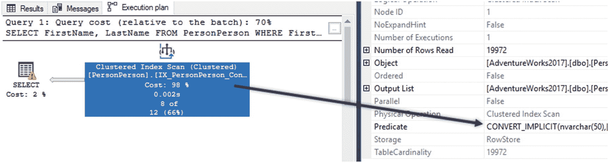

**图 12-21** 包含隐式数据转换的执行计划

图 12-22 的执行计划中另一个需要注意的项是，第一个查询的 `SELECT` 操作上包含的警告。随着 SQL Server 2012 的发布，现在执行计划中包含了涉及隐式转换的新警告消息。警告消息显示为一个带有感叹号的黄色三角形。检查运算符的属性将包含运算符的属性和警告消息。这些消息包含详细说明正在转换的列以及与问题相关的信息。在本例中，问题是 `SeekPlan ConvertIssue`。换句话说，SQL Server 没有关于转换后数据的统计信息来构建了解谓词中值频率的执行计划。

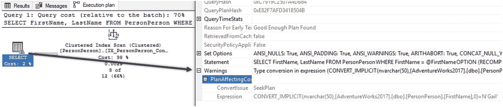

**图 12-22** 隐式转换附带的警告

清单 12-13 中的第二个 `SELECT` 查询使用了 `varchar` 数据类型的变量。由于此数据类型已经与表中列的数据类型匹配，因此可以使用非聚集索引。如图 12-23 的执行计划所示，通过匹配的数据类型，查询优化器可以构建一个了解索引中行位置的计划，并执行查找来获取它们。

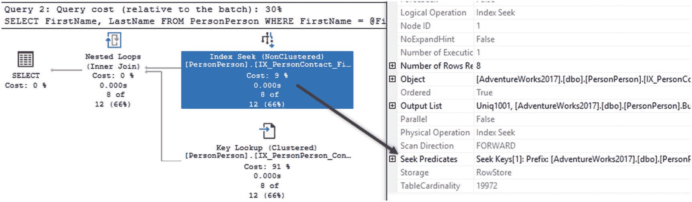

**图 12-23** 无数据转换的执行计划

尽管第二个查询中的操作更多，复杂性似乎更高（特别是包含键查找时），这可能会导致预期性能更差，但事实并非如此。如果我们查看图 12-24 中 `STATISTICS IO` 显示的逻辑读取，就可以看到这一点。对于第一个查询，使用聚集索引扫描时的读取次数是 89 次逻辑读取。第二个查询在访问两个索引时仅有 18 次读取。读取次数的差异是因为扫描聚集索引所需的读取次数比查找结果所需行子集并查找聚集中缺失列所需的读取次数更多。

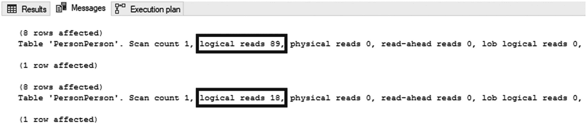

**图 12-24** 隐式转换查询的 `STATISTICS IO`

在本节中，讨论主要集中在隐式数据转换上。虽然这些转换可能比显式数据转换更隐蔽，但相同的缓解概念和方法也适用于这些数据转换。由于它们更具意图性，因此应该更少发生。即便如此，在执行数据转换时，也要密切注意数据类型，因为它们的变化方式会影响查询性能和索引利用率。

## 总结

在本章中，我们研究了查询对索引能否提供预期性能改进的影响。有时特定类型的索引可能不适合某种情况，例如在大表中搜索字符值内的值。在其他情况下，在正确的位置应用正确类型的索引或函数可以显著影响查询是否能利用索引。

在本章的许多示例中，索引的不当使用是当它使用索引扫描而不是索引查找操作时。对于这些场景，索引查找是理想的索引操作。但这并不总是如此，有些情况下对索引的扫描明显比查找操作更理想。重要的是要记住环境所针对的事务类型以及正在访问的表的大小。

本章的主要要点是，在编写查询时应谨慎。在开发数据库代码时所做的选择，可能会完全破坏为正确索引数据库所做的工作。确保用充分利用索引最大效能的代码来补充你的索引。

# 13. 监控索引

在本书中，我们已经讨论了索引是什么、它们的作用、构建索引的模式，以及确定 SQL Server 数据库应如何建立索引的许多其他方面。所有这些信息都是数据库索引建立过程中的最后一部分——分析数据库以确定所需索引——的必要基础。为此，本章及随后两章将整合我们需要的信息，以实施一套索引方法论。

首先，在本章中，我们将讨论一种可用于监控索引的通用实践。它将包含可以采取的步骤，用以观察索引的行为并理解它们如何影响你的环境。此方法论可应用于单个数据库、一个服务器，或你的整个 SQL Server 环境。无论数据库支持何种操作或业务，都可以采用类似的监控流程。

监控索引背后的主要目标是能够收集有关索引的信息。这些信息将来自多种来源。这些监控来源应该很熟悉，因为它们常用于与索引类似的调优任务，例如性能调优。对于某些来源，信息会随时间推移而收集，以提供总体趋势的概览。对于其他来源，在特定时间点的快照就足够了。随时间推移收集信息以提供比较性能的基准非常重要；这将帮助我们了解索引使用情况和有效性何时发生变化。

如前所述，有多种来源可用于收集信息以监控你的索引。本章将讨论的来源是

*   性能计数器
*   动态管理对象
*   事件跟踪

对于这些来源中的每一个，后续章节将描述需要收集的内容，并提供关于如何收集这些信息的指导。在本章结束时，我们将拥有一个框架，该框架能够提供启动分析阶段所需的信息。

### 注意

本章的所有监控信息都将收集在一个名为 `IndexingMethod` 的数据库中。脚本可以在该数据库中运行，也可以在你自己的性能监控数据库中运行。

### 性能计数器

索引监控信息的第一个来源是 SQL Server 性能计数器。性能计数器是 Microsoft 提供的指标，用于测量服务器上应用程序和硬件中事件的发生速率或资源的状态。对于其中一些性能计数器，存在通用准则，可用于指示何时可能存在索引问题。对于其他计数器，其速率或级别的变化可能表明需要更改服务器上的索引。

使用性能计数器的主要问题在于，它们代表的是服务器级别或 SQL Server 实例级别的计数器状态。它们并不指示具体是在哪个数据库或表级别发生了潜在的索引问题。然而，考虑到可用于监控索引和识别潜在索引需求的其他工具，这种详细程度是可以接受且有用的。在此级别收集计数器信息的一个优势是，我们被迫考虑全局情况以及所有索引对性能的综合影响。在孤立的情况下，一张表上几个性能不佳的索引可能是可以接受的。然而，如果再加上其他索引不佳的表，总体性能可能会达到一个临界点，此时需要处理索引问题。借助性能计数器提供的服务器级别统计数据，我们将能够识别何时达到了这个临界点。

SQL Server 和 Windows Server 都有大量的性能计数器可用。然而，从索引的角度来看，许多性能计数器可以被排除。最有用的性能计数器是那些与索引操作或访问方式相关的操作映射的计数器，例如转送记录和索引搜索。有关最有用的索引相关性能计数器的定义，请参见 `表 13-1`。收集每个计数器的原因以及它们如何影响索引决策将在下一章讨论。

### 表 13-1

索引相关性能计数器

| 选项名称 | 描述 |
| --- | --- |
| `Access Methods\Forwarded Records/sec` | 每秒通过转送记录指针获取的记录数。 |
| `Access Methods\FreeSpace Page Fetches/sec` | 每秒在分配给对象的页中获取页以插入或修改记录的次数。 |
| `Access Methods\FreeSpace Scans/sec` | 每秒启动的扫描次数，用于在分配给对象的页中搜索空闲空间以插入或修改记录。 |
| `Access Methods\Full Scans/sec` | 每秒无限制的完整扫描次数。这些可以是基表扫描或完整索引扫描。 |
| `Access Methods\Index Searches/sec` | 每秒索引搜索次数。这些搜索用于启动范围扫描、获取单个索引记录以及重新定位索引。 |
| `Access Methods\Page compression attempts/sec` | 每秒使用 PAGE 压缩尝试压缩页的次数，这将包括失败的页面压缩。 |
| `Access Methods\Pages compressed/sec` | 每秒使用 PAGE 压缩成功压缩的页数。 |
| `Access Methods\Page Splits/sec` | 每秒由于索引页溢出而发生的页拆分次数。 |
| `Buffer Manager\Page Lookups/sec` | 在缓冲池中查找页的请求数。 |
| `Locks(*)\Lock Wait Time (ms)` | 上一秒中锁的总等待时间（以毫秒计）。 |
| `Locks(*)\Lock Waits/sec` | 每秒需要调用方等待的锁请求数。 |
| `Locks(*)\Number of Deadlocks/sec` | 每秒导致死锁的锁请求数。 |
| `SQL Statistics\ Batch Requests/sec` | 每秒收到的 Transact-SQL 命令批次数。 |


收集性能计数器的方式有多种。本章的监控将使用动态管理视图 `sys.dm_os_performance_counters`。该 DMV 会为实例的所有 SQL Server 计数器返回一行。返回的值是计数器的原始值，因此根据计数器的类型，该值可能是一个时间点状态值，也可能是一个持续累加的聚合值。

为了开始收集用于监控的性能计数器信息，我们首先需要创建一个表来存储这些信息。清单 13-1 中的表定义满足了此需求。在收集性能计数器时，我们将使用一个表来存储计数器名称及其值，并为每行添加日期戳以标识信息收集的时间。

```
USE IndexingMethod;
GO
CREATE TABLE dbo.IndexingCounters
(
    counter_id INT IDENTITY(1, 1),
    create_date DATETIME2(0),
    server_name VARCHAR(128) NOT NULL,
    object_name VARCHAR(128) NOT NULL,
    counter_name VARCHAR(128) NOT NULL,
    instance_name VARCHAR(128) NULL,
    Calculated_Counter_value FLOAT NULL,
    CONSTRAINT PK_IndexingCounters
        PRIMARY KEY CLUSTERED (counter_id)
);
GO
CREATE NONCLUSTERED INDEX IX_IndexingCounters_CounterName
ON dbo.IndexingCounters (counter_name)
INCLUDE (create_date, server_name, object_name, Calculated_Counter_value);
```
清单 13-1
性能计数器快照表

为了收集用于索引监控的信息，我们将从 `sys.dm_os_performance_counters` 获取信息，并从该 DMV 计算出相应的值。这些值与从其他工具（如性能监视器）查看性能计数器信息时可用的值相同。要填充 `dbo.IndexingCounters` 需要几个步骤。如前所述，DMV 包含的是原始计数器值。为了正确计算这些值，有必要对 DMV 中的值进行快照，然后等待若干秒后再计算计数器值。在清单 13-2 中，计数器值在 10 秒后计算。一旦时间到期，计数器将被计算并插入到 `dbo.IndexingCounters` 表中。此脚本应被计划并频繁执行。理想情况下，我们应该每 1-5 分钟收集一次此信息。

### 注意

性能计数器信息可以更频繁地收集。例如，性能监视器默认为每 15 秒收集一次。出于索引监控的目的，不需要那么高的频率。

```
DROP TABLE IF EXISTS #Counters;
SELECT pc.object_name,
       pc.counter_name
INTO   #Counters
FROM   sys.dm_os_performance_counters pc
WHERE  pc.cntr_type IN ( 272696576, 1073874176 )
       AND (
            pc.object_name LIKE '%:Access Methods%'
            AND (
                pc.counter_name LIKE 'Forwarded Records/sec%'
                OR pc.counter_name LIKE 'FreeSpace Scans/sec%'
                OR pc.counter_name LIKE 'FreeSpace Page Fetches/sec%'
                OR pc.counter_name LIKE 'Full Scans/sec%'
                OR pc.counter_name LIKE 'Index Searches/sec%'
                OR pc.counter_name LIKE 'Page Splits/sec%'
                OR pc.counter_name LIKE 'Page compression attempts/sec%'
                OR pc.counter_name LIKE 'Pages compressed/sec%'
            )
       )
       OR (
            pc.object_name LIKE '%:Buffer Manager%'
            AND (
                pc.counter_name LIKE 'Page life expectancy%'
                OR pc.counter_name LIKE 'Page lookups/sec%'
            )
       )
       OR (
            pc.object_name LIKE '%:Locks%'
            AND (
                pc.counter_name LIKE 'Lock Wait Time (ms)%'
                OR pc.counter_name LIKE 'Lock Waits/sec%'
                OR pc.counter_name LIKE 'Number of Deadlocks/sec%'
            )
       )
       OR (
            pc.object_name LIKE '%:SQL Statistics%'
            AND pc.counter_name LIKE 'Batch Requests/sec%'
       )
GROUP BY pc.object_name,
         pc.counter_name;
DROP TABLE IF EXISTS #Baseline;
SELECT GETDATE() AS sample_time,
       pc1.object_name,
       pc1.counter_name,
       pc1.instance_name,
       pc1.cntr_value,
       pc1.cntr_type,
       x.cntr_value AS base_cntr_value
INTO   #Baseline
FROM   sys.dm_os_performance_counters pc1
       INNER JOIN #Counters c
              ON c.object_name = pc1.object_name
                 AND c.counter_name = pc1.counter_name
       OUTER APPLY (SELECT cntr_value
                    FROM   sys.dm_os_performance_counters pc2
                    WHERE  pc2.cntr_type           = 1073939712
                           AND UPPER(pc1.counter_name) = UPPER(pc2.counter_name)
                           AND pc1.object_name         = pc2.object_name
                           AND pc1.instance_name       = pc2.instance_name) x;
WAITFOR DELAY '00:00:15';
INSERT INTO dbo.IndexingCounters (
    create_date,
    server_name,
    object_name,
    counter_name,
    instance_name,
    Calculated_Counter_value
)
SELECT GETDATE(),
       LEFT(pc1.object_name, CHARINDEX(':', pc1.object_name) - 1),
       SUBSTRING(pc1.object_name, 1 + CHARINDEX(':', pc1.object_name), LEN(pc1.object_name)),
       pc1.counter_name,
       pc1.instance_name,
       CASE
           WHEN pc1.cntr_type = 65792 THEN pc1.cntr_value
           WHEN pc1.cntr_type = 272696576 THEN
               COALESCE((1. * pc1.cntr_value - x.cntr_value) / NULLIF(DATEDIFF(s, sample_time, GETDATE()), 0), 0)
           WHEN pc1.cntr_type = 537003264 THEN COALESCE((1. * pc1.cntr_value) / NULLIF(base.cntr_value, 0), 0)
           WHEN pc1.cntr_type = 1073874176 THEN
               COALESCE(
                   (1. * pc1.cntr_value - x.cntr_value) / NULLIF(base.cntr_value - x.base_cntr_value, 0)
                   / NULLIF(DATEDIFF(s, sample_time, GETDATE()), 0),
                   0
               )
       END AS real_cntr_value
FROM   sys.dm_os_performance_counters pc1
       INNER JOIN #Counters c
              ON c.object_name = pc1.object_name
                 AND c.counter_name = pc1.counter_name
       OUTER APPLY (SELECT cntr_value,
                           base_cntr_value,
                           sample_time
                    FROM   #Baseline b
                    WHERE  b.object_name   = pc1.object_name
                           AND b.counter_name  = pc1.counter_name
                           AND b.instance_name = pc1.instance_name) x
       OUTER APPLY (SELECT cntr_value
                    FROM   sys.dm_os_performance_counters pc2
                    WHERE  pc2.cntr_type           = 1073939712
                           AND UPPER(pc1.counter_name) = UPPER(pc2.counter_name)
                           AND pc1.object_name         = pc2.object_name
                           AND pc1.instance_name       = pc2.instance_name) base;
```
清单 13-2
性能计数器快照脚本


# 监控 SQL Server 索引性能

首次为索引收集性能计数器时，我们无法将这些计数器与其他合理的 SQL Server 值进行比较。然而，随着时间的推移，我们可以保留之前的性能计数器样本以便进行对比。作为监控的一部分，我们将负责识别性能计数器值代表您环境典型活动的时段。为了存储这些值，请将它们插入到一个类似于清单 13-3 的表中。该表包含开始和结束日期以指示基线所代表的范围。此外，还有最小值、最大值、平均值和标准差列用于存储从收集的计数器中获取的值。最小值和最大值有助于理解性能计数器的变化情况。平均值提供了计数器值“良好”时大概是多少的概念。标准差让我们了解计数器值的变异性。数字越低，表示计数器值越频繁地聚集在平均值附近。数值越高则表明计数器值变化更频繁，且通常更接近最小值和最大值。

```sql
USE IndexingMethod;
GO
CREATE TABLE dbo.IndexingCountersBaseline
(
counter_baseline_id INT IDENTITY(1, 1),
start_date DATETIME2(0),
end_date DATETIME2(0),
server_name VARCHAR(128) NOT NULL,
object_name VARCHAR(128) NOT NULL,
counter_name VARCHAR(128) NOT NULL,
instance_name VARCHAR(128) NULL,
minimum_counter_value FLOAT NULL,
maximum_counter_value FLOAT NULL,
average_counter_value FLOAT NULL,
standard_deviation_counter_value FLOAT NULL,
CONSTRAINT PK_IndexingCountersBaseline
PRIMARY KEY CLUSTERED (counter_baseline_id)
);
GO
```
清单 13-3 性能计数器基线表

将值填充到 `dbo.IndexingCountersBaseline` 时，填充过程有两个步骤。首先，我们需要从性能计数器中收集一个代表典型周的样本。如果没有典型的周，则选取本周并为其收集样本。一旦我们有了典型周，下一步就是将信息聚合到基线表中。聚合信息就是对 `dbo.IndexingCounters` 表中一段日期范围内的信息进行汇总。在清单 13-4 中，数据来自 2019 年 8 月 1 日至 8 月 15 日。下一步是验证基线。仅仅因为过去一周的平均值显示每秒转发记录数（Forwarded Records/sec）为 100，并不意味着该值对您的基线是良好的。运用您对服务器和数据库的经验来影响基线中的值。如果近期趋势低于或高于正常水平，请根据需要调整基线。

```sql
USE IndexingMethod;
GO
DECLARE @StartDate DATETIME = '20190911',
        @EndDate   DATETIME = '20190918';
INSERT INTO dbo.IndexingCountersBaseline (
    start_date,
    end_date,
    server_name,
    object_name,
    counter_name,
    instance_name,
    minimum_counter_value,
    maximum_counter_value,
    average_counter_value,
    standard_deviation_counter_value
)
SELECT MIN(create_date),
       MAX(create_date),
       server_name,
       object_name,
       counter_name,
       instance_name,
       MIN(Calculated_Counter_value),
       MAX(Calculated_Counter_value),
       AVG(Calculated_Counter_value),
       STDEV(Calculated_Counter_value)
FROM dbo.IndexingCounters
WHERE create_date BETWEEN @StartDate AND @EndDate
GROUP BY server_name,
         object_name,
         counter_name,
         instance_name;
```
清单 13-4 填充计数器基线表

还有其他方法可以收集和查看 SQL Server 实例的性能计数器。我们可以使用 Windows 应用程序 **Performance Monitor** 实时查看性能计数器。它还可以用于将性能计数器记录到二进制或文本文件中。命令行实用程序 `Logman` 也可用于与 **Performance Monitor** 交互，以创建数据收集器并根据需要启动和停止它们。此外，`PowerShell` 也可以用来辅助收集性能计数器。

所有这些替代方案都是收集数据库和索引性能计数器的有效选项。关键在于，如果我们想要监控索引，就必须收集必要的信息以了解潜在的索引问题何时可能出现。选择一个最顺手的工具，今天就开始收集这些计数器吧。

## 动态管理对象

监控索引性能的一些最佳信息包含在动态管理对象（DMO）中。这些 DMO 包含有关索引的逻辑和物理使用情况以及整体物理结构的信息。对于监控，有四个 DMO 提供有关索引使用情况的信息：`sys.dm_db_index_usage_stats`、`sys.dm_db_index_operational_stats`、`sys.dm_db_index_physical_stats` 和 `sys.dm_os_wait_stats`。在本节中，我们将逐步介绍使用这些 DMO 监控索引的过程。

接下来的前三节将讨论 `sys.dm_db_index_*` DMO。第 3 章定义并演示了这些 DMO 的内容。需要记住的一点是，这些 DMO 可能会因为服务器上的各种操作（例如重启服务或重建索引）而被清空。第四个 DMO `sys.dm_os_wait_stats` 与索引监控相关，并提供有助于索引分析的信息。

### 警告

索引 DMO 没有行级别的信息来精确指示收集索引信息的时间何时被重置。因此，可能会出现报告统计数据略高于或低于实际值的情况。虽然这应该不会对分析结果产生重大影响，但这是需要记住的一点。


### 索引使用情况统计

动态管理对象（DMO）`sys.dm_db_index_usage_stats` 提供了关于索引如何被使用以及索引最后被使用时间的信息。当我们想要跟踪索引是否被使用，以及针对索引执行了哪些操作时，这些信息非常有用。

监控此 DMO 的流程与其他 DMO 类似，包含以下步骤：

1.  创建一个表来存放快照信息。
2.  将 DMO 的当前状态插入到快照表中。
3.  比较最近的快照与上一个快照，并将行之间的增量插入到输出历史表中。

要构建此流程，我们首先需要创建快照表和历史表。这些表的结构将与 DMO 的架构相同，并包含 DMO 的所有列以及一个 `create_date` 列（参见代码清单 13-5）。为保持与源 DMO 的一致性，表中的列将与 DMO 的架构匹配。

```sql
USE IndexingMethod;
GO
CREATE TABLE dbo.index_usage_stats_snapshot
(
snapshot_id INT IDENTITY(1, 1),
create_date DATETIME2(0),
database_id SMALLINT NOT NULL,
object_id INT NOT NULL,
index_id INT NOT NULL,
user_seeks BIGINT NOT NULL,
user_scans BIGINT NOT NULL,
user_lookups BIGINT NOT NULL,
user_updates BIGINT NOT NULL,
last_user_seek DATETIME,
last_user_scan DATETIME,
last_user_lookup DATETIME,
last_user_update DATETIME,
system_seeks BIGINT NOT NULL,
system_scans BIGINT NOT NULL,
system_lookups BIGINT NOT NULL,
system_updates BIGINT NOT NULL,
last_system_seek DATETIME,
last_system_scan DATETIME,
last_system_lookup DATETIME,
last_system_update DATETIME,
CONSTRAINT PK_IndexUsageStatsSnapshot
PRIMARY KEY CLUSTERED (snapshot_id),
CONSTRAINT UQ_IndexUsageStatsSnapshot
UNIQUE (create_date, database_id, object_id, index_id)
);
CREATE TABLE dbo.index_usage_stats_history
(
history_id INT IDENTITY(1, 1),
create_date DATETIME2(0),
database_id SMALLINT NOT NULL,
object_id INT NOT NULL,
index_id INT NOT NULL,
user_seeks BIGINT NOT NULL,
user_scans BIGINT NOT NULL,
user_lookups BIGINT NOT NULL,
user_updates BIGINT NOT NULL,
last_user_seek DATETIME,
last_user_scan DATETIME,
last_user_lookup DATETIME,
last_user_update DATETIME,
system_seeks BIGINT NOT NULL,
system_scans BIGINT NOT NULL,
system_lookups BIGINT NOT NULL,
system_updates BIGINT NOT NULL,
last_system_seek DATETIME,
last_system_scan DATETIME,
last_system_lookup DATETIME,
last_system_update DATETIME,
CONSTRAINT PK_IndexUsageStatsHistory
PRIMARY KEY CLUSTERED (history_id),
CONSTRAINT UQ_IndexUsageStatsHistory
UNIQUE (create_date, database_id, object_id, index_id)
);
```
**代码清单 13-5** 索引使用情况统计快照表结构

捕获索引使用统计历史的下一个环节是收集 `sys.dm_db_index_usage_stats` 中的当前值。与性能监视器脚本类似，如代码清单 13-6 所示的收集查询需要计划为大约每 4 小时运行一次。环境中的活动以及索引被修改的频率应有助于确定信息捕获的频率。请务必在任何索引碎片整理过程之前安排一次快照，以捕获在重建索引时可能丢失的信息。

```sql
USE IndexingMethod;
GO
INSERT INTO dbo.index_usage_stats_snapshot
SELECT GETDATE(),
database_id,
object_id,
index_id,
user_seeks,
user_scans,
user_lookups,
user_updates,
last_user_seek,
last_user_scan,
last_user_lookup,
last_user_update,
system_seeks,
system_scans,
system_lookups,
system_updates,
last_system_seek,
last_system_scan,
last_system_lookup,
last_system_update
FROM sys.dm_db_index_usage_stats;
```
**代码清单 13-6** 索引使用情况统计快照填充

在填充索引使用统计的快照后，需要将最近快照和上一个快照之间的增量插入到 `index_usage_stats_history` 表中。由于 `sys.dm_db_index_usage_stats` 的行中没有任何内容可以标识索引统计信息何时被重置，因此识别索引的两个条目之间存在增量的过程是：如果索引上的任何统计信息返回负值，则删除该行。生成的查询（如代码清单 13-7 所示）实现了此逻辑，并移除了所有没有新活动发生的行。

```sql
USE IndexingMethod;
GO
WITH IndexUsageCTE
AS (SELECT DENSE_RANK() OVER (ORDER BY create_date DESC) AS HistoryID,
create_date,
database_id,
object_id,
index_id,
user_seeks,
user_scans,
user_lookups,
user_updates,
last_user_seek,
last_user_scan,
last_user_lookup,
last_user_update,
system_seeks,
system_scans,
system_lookups,
system_updates,
last_system_seek,
last_system_scan,
last_system_lookup,
last_system_update
FROM dbo.index_usage_stats_snapshot)
INSERT INTO dbo.index_usage_stats_history
SELECT i1.create_date,
i1.database_id,
i1.object_id,
i1.index_id,
i1.user_seeks - COALESCE(i2.user_seeks, 0),
i1.user_scans - COALESCE(i2.user_scans, 0),
i1.user_lookups - COALESCE(i2.user_lookups, 0),
i1.user_updates - COALESCE(i2.user_updates, 0),
i1.last_user_seek,
i1.last_user_scan,
i1.last_user_lookup,
i1.last_user_update,
i1.system_seeks - COALESCE(i2.system_seeks, 0),
i1.system_scans - COALESCE(i2.system_scans, 0),
i1.system_lookups - COALESCE(i2.system_lookups, 0),
i1.system_updates - COALESCE(i2.system_updates, 0),
i1.last_system_seek,
i1.last_system_scan,
i1.last_system_lookup,
i1.last_system_update
FROM IndexUsageCTE i1
LEFT OUTER JOIN IndexUsageCTE i2 ON i1.database_id = i2.database_id
AND i1.object_id   = i2.object_id
AND i1.index_id    = i2.index_id
AND i2.HistoryID   = 2
--验证没有行小于 0
AND NOT (
i1.system_seeks - COALESCE(i2.system_seeks, 0)  > 0
OR i1.system_scans - COALESCE(i2.system_scans, 0)     > 0
OR i1.system_lookups - COALESCE(i2.system_lookups, 0) > 0
OR i1.system_updates - COALESCE(i2.system_updates, 0) > 0
OR i1.user_seeks - COALESCE(i2.user_seeks, 0)         > 0
OR i1.user_scans - COALESCE(i2.user_scans, 0)         > 0
OR i1.user_lookups - COALESCE(i2.user_lookups, 0)     > 0
OR i1.user_updates - COALESCE(i2.user_updates, 0)     > 0
);
GO
```
**代码清单 13-7** 索引使用情况统计快照填充

### 索引操作统计

动态管理对象（DMO）`sys.dm_db_index_operational_stats` 提供了在计划执行期间索引上发生的物理操作信息。当跟踪索引被使用时发生的物理计划操作以及这些操作的比率时，此信息非常有用。此 DMO 监控的另一个方面是压缩操作的成功率。

如上一节所述，监控此 DMO 的流程涉及几个简单的步骤。首先，我们将创建表来存储 DMO 输出的快照和历史信息。然后，将 DMO 输出的周期性快照插入到快照表中。检索快照后，将当前快照和上一个快照之间的增量插入到历史表中。

此流程使用了一个与 `sys.dm_db_index_operational_stats` 架构几乎相同的快照表和历史表。架构中的主要差异是添加了一个 `create_date` 列，用于标识快照发生的时间。代码清单 13-8 中的代码提供了快照表和历史表所需的架构。

### 注意

`version_generated_inrow`、`version_generated_offrow`、`ghost_version_inrow`、`ghost_version_offrow`、`insert_over_ghost_version_inrow` 和 `insert_over_ghost_version_offrow` 列在 SQL Server 2019 中是新增的。如果在之前版本的 SQL Server 中使用此代码，则需要对代码进行调整。


```
USE IndexingMethod;
GO
CREATE TABLE dbo.index_operational_stats_snapshot
(
snapshot_id INT IDENTITY(1, 1),
create_date DATETIME2(0),
database_id SMALLINT NOT NULL,
object_id INT NOT NULL,
index_id INT NOT NULL,
partition_number INT NOT NULL,
hobt_id BIGINT NOT NULL,
leaf_insert_count BIGINT NOT NULL,
leaf_delete_count BIGINT NOT NULL,
leaf_update_count BIGINT NOT NULL,
leaf_ghost_count BIGINT NOT NULL,
nonleaf_insert_count BIGINT NOT NULL,
nonleaf_delete_count BIGINT NOT NULL,
nonleaf_update_count BIGINT NOT NULL,
leaf_allocation_count BIGINT NOT NULL,
nonleaf_allocation_count BIGINT NOT NULL,
leaf_page_merge_count BIGINT NOT NULL,
nonleaf_page_merge_count BIGINT NOT NULL,
range_scan_count BIGINT NOT NULL,
singleton_lookup_count BIGINT NOT NULL,
forwarded_fetch_count BIGINT NOT NULL,
lob_fetch_in_pages BIGINT NOT NULL,
lob_fetch_in_bytes BIGINT NOT NULL,
lob_orphan_create_count BIGINT NOT NULL,
lob_orphan_insert_count BIGINT NOT NULL,
row_overflow_fetch_in_pages BIGINT NOT NULL,
row_overflow_fetch_in_bytes BIGINT NOT NULL,
column_value_push_off_row_count BIGINT NOT NULL,
column_value_pull_in_row_count BIGINT NOT NULL,
row_lock_count BIGINT NOT NULL,
row_lock_wait_count BIGINT NOT NULL,
row_lock_wait_in_ms BIGINT NOT NULL,
page_lock_count BIGINT NOT NULL,
page_lock_wait_count BIGINT NOT NULL,
page_lock_wait_in_ms BIGINT NOT NULL,
index_lock_promotion_attempt_count BIGINT NOT NULL,
index_lock_promotion_count BIGINT NOT NULL,
page_latch_wait_count BIGINT NOT NULL,
page_latch_wait_in_ms BIGINT NOT NULL,
page_io_latch_wait_count BIGINT NOT NULL,
page_io_latch_wait_in_ms BIGINT NOT NULL,
tree_page_latch_wait_count BIGINT NOT NULL,
tree_page_latch_wait_in_ms BIGINT NOT NULL,
tree_page_io_latch_wait_count BIGINT NOT NULL,
tree_page_io_latch_wait_in_ms BIGINT NOT NULL,
page_compression_attempt_count BIGINT NOT NULL,
page_compression_success_count BIGINT NOT NULL,
version_generated_inrow BIGINT NOT NULL,
version_generated_offrow BIGINT NOT NULL,
ghost_version_inrow BIGINT NOT NULL,
ghost_version_offrow BIGINT NOT NULL,
insert_over_ghost_version_inrow BIGINT NOT NULL,
insert_over_ghost_version_offrow BIGINT NOT NULL,
CONSTRAINT PK_IndexOperationalStatsSnapshot
PRIMARY KEY CLUSTERED (snapshot_id),
CONSTRAINT UQ_IndexOperationalStatsSnapshot
UNIQUE (create_date, database_id, object_id, index_id, partition_number)
);
CREATE TABLE dbo.index_operational_stats_history
(
history_id INT IDENTITY(1, 1),
create_date DATETIME2(0),
database_id SMALLINT NOT NULL,
object_id INT NOT NULL,
index_id INT NOT NULL,
partition_number INT NOT NULL,
hobt_id BIGINT NOT NULL,
leaf_insert_count BIGINT NOT NULL,
leaf_delete_count BIGINT NOT NULL,
leaf_update_count BIGINT NOT NULL,
leaf_ghost_count BIGINT NOT NULL,
nonleaf_insert_count BIGINT NOT NULL,
nonleaf_delete_count BIGINT NOT NULL,
nonleaf_update_count BIGINT NOT NULL,
leaf_allocation_count BIGINT NOT NULL,
nonleaf_allocation_count BIGINT NOT NULL,
leaf_page_merge_count BIGINT NOT NULL,
nonleaf_page_merge_count BIGINT NOT NULL,
range_scan_count BIGINT NOT NULL,
singleton_lookup_count BIGINT NOT NULL,
forwarded_fetch_count BIGINT NOT NULL,
lob_fetch_in_pages BIGINT NOT NULL,
lob_fetch_in_bytes BIGINT NOT NULL,
lob_orphan_create_count BIGINT NOT NULL,
lob_orphan_insert_count BIGINT NOT NULL,
row_overflow_fetch_in_pages BIGINT NOT NULL,
row_overflow_fetch_in_bytes BIGINT NOT NULL,
column_value_push_off_row_count BIGINT NOT NULL,
column_value_pull_in_row_count BIGINT NOT NULL,
row_lock_count BIGINT NOT NULL,
row_lock_wait_count BIGINT NOT NULL,
row_lock_wait_in_ms BIGINT NOT NULL,
page_lock_count BIGINT NOT NULL,
page_lock_wait_count BIGINT NOT NULL,
page_lock_wait_in_ms BIGINT NOT NULL,
index_lock_promotion_attempt_count BIGINT NOT NULL,
index_lock_promotion_count BIGINT NOT NULL,
page_latch_wait_count BIGINT NOT NULL,
page_latch_wait_in_ms BIGINT NOT NULL,
page_io_latch_wait_count BIGINT NOT NULL,
page_io_latch_wait_in_ms BIGINT NOT NULL,
tree_page_latch_wait_count BIGINT NOT NULL,
tree_page_latch_wait_in_ms BIGINT NOT NULL,
tree_page_io_latch_wait_count BIGINT NOT NULL,
tree_page_io_latch_wait_in_ms BIGINT NOT NULL,
page_compression_attempt_count BIGINT NOT NULL,
page_compression_success_count BIGINT NOT NULL,
version_generated_inrow BIGINT NOT NULL,
version_generated_offrow BIGINT NOT NULL,
ghost_version_inrow BIGINT NOT NULL,
ghost_version_offrow BIGINT NOT NULL,
insert_over_ghost_version_inrow BIGINT NOT NULL,
insert_over_ghost_version_offrow BIGINT NOT NULL,
CONSTRAINT PK_IndexOperationalStatsHistory
PRIMARY KEY CLUSTERED (history_id),
CONSTRAINT UQ_IndexOperationalStatsHistory
UNIQUE (create_date, database_id, object_id, index_id, partition_number)
);
```
## 清单 13-8
### 索引操作统计信息快照表

创建好这些表后，下一步是捕获`sys.dm_db_index_operational_stats`中的当前快照信息。可以使用清单 13-9 中的脚本来填充这些信息。由于索引方法（Indexing Method）旨在捕获服务器上所有数据库的索引信息，因此`sys.dm_db_index_operational_stats`的参数都设置为`NULL`。这将返回服务器上所有数据库中所有表的所有索引的所有分区的结果。与索引使用情况统计信息一样，这些信息应大约每 4 小时捕获一次，其中一次计划捕获点应安排在服务器索引维护之前。

```
USE IndexingMethod;
GO
TRUNCATE TABLE dbo.index_operational_stats_snapshot
INSERT INTO dbo.index_operational_stats_snapshot
SELECT GETDATE(),
database_id,
object_id,
index_id,
partition_number,
hobt_id,
leaf_insert_count,
leaf_delete_count,
leaf_update_count,
leaf_ghost_count,
nonleaf_insert_count,
nonleaf_delete_count,
nonleaf_update_count,
leaf_allocation_count,
nonleaf_allocation_count,
leaf_page_merge_count,
nonleaf_page_merge_count,
range_scan_count,
singleton_lookup_count,
forwarded_fetch_count,
lob_fetch_in_pages,
lob_fetch_in_bytes,
lob_orphan_create_count,
lob_orphan_insert_count,
row_overflow_fetch_in_pages,
row_overflow_fetch_in_bytes,
column_value_push_off_row_count,
column_value_pull_in_row_count,
row_lock_count,
row_lock_wait_count,
row_lock_wait_in_ms,
page_lock_count,
page_lock_wait_count,
page_lock_wait_in_ms,
index_lock_promotion_attempt_count,
index_lock_promotion_count,
page_latch_wait_count,
page_latch_wait_in_ms,
page_io_latch_wait_count,
page_io_latch_wait_in_ms,
tree_page_latch_wait_count,
tree_page_latch_wait_in_ms,
tree_page_io_latch_wait_count,
tree_page_io_latch_wait_in_ms,
page_compression_attempt_count,
page_compression_success_count,
version_generated_inrow,
version_generated_offrow,
ghost_version_inrow,
ghost_version_offrow,
insert_over_ghost_version_inrow,
insert_over_ghost_version_offrow
FROM sys.dm_db_index_operational_stats(NULL, NULL, NULL, NULL)
WHERE database_id > 4;
```
## 清单 13-9
### 填充索引操作统计信息快照

填充快照之后的下一步是填充历史记录表。如前所述，历史记录表的目的是存储两个快照之间**增量**的统计信息。这些增量信息提供了有关发生了哪些操作的信息，它们还有助于对操作进行时间范围限定，以便在需要时，可以更集中地关注核心时段与非核心时段的操作。识别统计信息何时已重置的业务规则与索引使用情况统计信息类似：如果索引上的任何统计信息返回负值，则将忽略前一个快照中的该行。此外，任何返回全零值的行也将不被包含在内。清单 13-10 展示了用于生成历史增量信息的代码。


## 清单 13-10 索引操作统计快照填充

```sql
USE IndexingMethod;
GO
WITH IndexOperationalCTE
AS (SELECT DENSE_RANK() OVER (ORDER BY create_date DESC) AS HistoryID,
create_date,
database_id,
object_id,
index_id,
partition_number,
hobt_id,
leaf_insert_count,
leaf_delete_count,
leaf_update_count,
leaf_ghost_count,
nonleaf_insert_count,
nonleaf_delete_count,
nonleaf_update_count,
leaf_allocation_count,
nonleaf_allocation_count,
leaf_page_merge_count,
nonleaf_page_merge_count,
range_scan_count,
singleton_lookup_count,
forwarded_fetch_count,
lob_fetch_in_pages,
lob_fetch_in_bytes,
lob_orphan_create_count,
lob_orphan_insert_count,
row_overflow_fetch_in_pages,
row_overflow_fetch_in_bytes,
column_value_push_off_row_count,
column_value_pull_in_row_count,
row_lock_count,
row_lock_wait_count,
row_lock_wait_in_ms,
page_lock_count,
page_lock_wait_count,
page_lock_wait_in_ms,
index_lock_promotion_attempt_count,
index_lock_promotion_count,
page_latch_wait_count,
page_latch_wait_in_ms,
page_io_latch_wait_count,
page_io_latch_wait_in_ms,
tree_page_latch_wait_count,
tree_page_latch_wait_in_ms,
tree_page_io_latch_wait_count,
tree_page_io_latch_wait_in_ms,
page_compression_attempt_count,
page_compression_success_count,
version_generated_inrow,
version_generated_offrow,
ghost_version_inrow,
ghost_version_offrow,
insert_over_ghost_version_inrow,
insert_over_ghost_version_offrow
FROM dbo.index_operational_stats_snapshot)
INSERT INTO dbo.index_operational_stats_history
SELECT i1.create_date,
i1.database_id,
i1.object_id,
i1.index_id,
i1.partition_number,
i1.hobt_id,
i1.leaf_insert_count - COALESCE(i2.leaf_insert_count, 0),
i1.leaf_delete_count - COALESCE(i2.leaf_delete_count, 0),
i1.leaf_update_count - COALESCE(i2.leaf_update_count, 0),
i1.leaf_ghost_count - COALESCE(i2.leaf_ghost_count, 0),
i1.nonleaf_insert_count - COALESCE(i2.nonleaf_insert_count, 0),
i1.nonleaf_delete_count - COALESCE(i2.nonleaf_delete_count, 0),
i1.nonleaf_update_count - COALESCE(i2.nonleaf_update_count, 0),
i1.leaf_allocation_count - COALESCE(i2.leaf_allocation_count, 0),
i1.nonleaf_allocation_count - COALESCE(i2.nonleaf_allocation_count, 0),
i1.leaf_page_merge_count - COALESCE(i2.leaf_page_merge_count, 0),
i1.nonleaf_page_merge_count - COALESCE(i2.nonleaf_page_merge_count, 0),
i1.range_scan_count - COALESCE(i2.range_scan_count, 0),
i1.singleton_lookup_count - COALESCE(i2.singleton_lookup_count, 0),
i1.forwarded_fetch_count - COALESCE(i2.forwarded_fetch_count, 0),
i1.lob_fetch_in_pages - COALESCE(i2.lob_fetch_in_pages, 0),
i1.lob_fetch_in_bytes - COALESCE(i2.lob_fetch_in_bytes, 0),
i1.lob_orphan_create_count - COALESCE(i2.lob_orphan_create_count, 0),
i1.lob_orphan_insert_count - COALESCE(i2.lob_orphan_insert_count, 0),
i1.row_overflow_fetch_in_pages - COALESCE(i2.row_overflow_fetch_in_pages, 0),
i1.row_overflow_fetch_in_bytes - COALESCE(i2.row_overflow_fetch_in_bytes, 0),
i1.column_value_push_off_row_count - COALESCE(i2.column_value_push_off_row_count, 0),
i1.column_value_pull_in_row_count - COALESCE(i2.column_value_pull_in_row_count, 0),
i1.row_lock_count - COALESCE(i2.row_lock_count, 0),
i1.row_lock_wait_count - COALESCE(i2.row_lock_wait_count, 0),
i1.row_lock_wait_in_ms - COALESCE(i2.row_lock_wait_in_ms, 0),
i1.page_lock_count - COALESCE(i2.page_lock_count, 0),
i1.page_lock_wait_count - COALESCE(i2.page_lock_wait_count, 0),
i1.page_lock_wait_in_ms - COALESCE(i2.page_lock_wait_in_ms, 0),
i1.index_lock_promotion_attempt_count - COALESCE(i2.index_lock_promotion_attempt_count, 0),
i1.index_lock_promotion_count - COALESCE(i2.index_lock_promotion_count, 0),
i1.page_latch_wait_count - COALESCE(i2.page_latch_wait_count, 0),
i1.page_latch_wait_in_ms - COALESCE(i2.page_latch_wait_in_ms, 0),
i1.page_io_latch_wait_count - COALESCE(i2.page_io_latch_wait_count, 0),
i1.page_io_latch_wait_in_ms - COALESCE(i2.page_io_latch_wait_in_ms, 0),
i1.tree_page_latch_wait_count - COALESCE(i2.tree_page_latch_wait_count, 0),
i1.tree_page_latch_wait_in_ms - COALESCE(i2.tree_page_latch_wait_in_ms, 0),
i1.tree_page_io_latch_wait_count - COALESCE(i2.tree_page_io_latch_wait_count, 0),
i1.tree_page_io_latch_wait_in_ms - COALESCE(i2.tree_page_io_latch_wait_in_ms, 0),
i1.page_compression_attempt_count - COALESCE(i2.page_compression_attempt_count, 0),
i1.page_compression_success_count - COALESCE(i2.page_compression_success_count, 0),
i1.version_generated_inrow - COALESCE(i2.version_generated_inrow, 0),
i1.version_generated_offrow - COALESCE(i2.version_generated_offrow, 0),
i1.ghost_version_inrow - COALESCE(i2.ghost_version_inrow, 0),
i1.ghost_version_offrow - COALESCE(i2.ghost_version_offrow, 0),
i1.insert_over_ghost_version_inrow - COALESCE(i2.insert_over_ghost_version_inrow, 0),
i1.insert_over_ghost_version_offrow - COALESCE(i2.insert_over_ghost_version_offrow, 0)
FROM IndexOperationalCTE i1
LEFT OUTER JOIN IndexOperationalCTE i2 ON i1.database_id = i2.database_id
AND i1.object_id = i2.object_id
AND i1.index_id = i2.index_id
AND i1.partition_number = i2.partition_number
AND i2.HistoryID = 2
-- 验证没有行小于 0
AND NOT (i1.leaf_insert_count - COALESCE(i2.leaf_insert_count, 0)  0
OR i1.leaf_delete_count - COALESCE(i2.leaf_delete_count, 0) > 0
OR i1.leaf_update_count - COALESCE(i2.leaf_update_count, 0) > 0
OR i1.leaf_ghost_count - COALESCE(i2.leaf_ghost_count, 0) > 0
OR i1.nonleaf_insert_count - COALESCE(i2.nonleaf_insert_count, 0) > 0
OR i1.nonleaf_delete_count - COALESCE(i2.nonleaf_delete_count, 0) > 0
OR i1.nonleaf_update_count - COALESCE(i2.nonleaf_update_count, 0) > 0
OR i1.leaf_allocation_count - COALESCE(i2.leaf_allocation_count, 0) > 0
OR i1.nonleaf_allocation_count - COALESCE(i2.nonleaf_allocation_count, 0) > 0
OR i1.leaf_page_merge_count - COALESCE(i2.leaf_page_merge_count, 0) > 0
OR i1.nonleaf_page_merge_count - COALESCE(i2.nonleaf_page_merge_count, 0) > 0
OR i1.range_scan_count - COALESCE(i2.range_scan_count, 0) > 0
OR i1.singleton_lookup_count - COALESCE(i2.singleton_lookup_count, 0) > 0
OR i1.forwarded_fetch_count - COALESCE(i2.forwarded_fetch_count, 0) > 0
OR i1.lob_fetch_in_pages - COALESCE(i2.lob_fetch_in_pages, 0) > 0
OR i1.lob_fetch_in_bytes - COALESCE(i2.lob_fetch_in_bytes, 0) > 0
OR i1.lob_orphan_create_count - COALESCE(i2.lob_orphan_create_count, 0) > 0
OR i1.lob_orphan_insert_count - COALESCE(i2.lob_orphan_insert_count, 0) > 0
OR i1.row_overflow_fetch_in_pages - COALESCE(i2.row_overflow_fetch_in_pages, 0) > 0
OR i1.row_overflow_fetch_in_bytes - COALESCE(i2.row_overflow_fetch_in_bytes, 0) > 0
OR i1.column_value_push_off_row_count - COALESCE(i2.column_value_push_off_row_count, 0) > 0
OR i1.column_value_pull_in_row_count - COALESCE(i2.column_value_pull_in_row_count, 0) > 0
OR i1.row_lock_count - COALESCE(i2.row_lock_count, 0) > 0
OR i1.row_lock_wait_count - COALESCE(i2.row_lock_wait_count, 0) > 0
OR i1.row_lock_wait_in_ms - COALESCE(i2.row_lock_wait_in_ms, 0) > 0
OR i1.page_lock_count - COALESCE(i2.page_lock_count, 0) > 0
OR i1.page_lock_wait_count - COALESCE(i2.page_lock_wait_count, 0) > 0
OR i1.page_lock_wait_in_ms - COALESCE(i2.page_lock_wait_in_ms, 0) > 0
OR i1.index_lock_promotion_attempt_count - COALESCE(i2.index_lock_promotion_attempt_count, 0) > 0
OR i1.index_lock_promotion_count - COALESCE(i2.index_lock_promotion_count, 0) > 0
OR i1.page_latch_wait_count - COALESCE(i2.page_latch_wait_count, 0) > 0
OR i1.page_latch_wait_in_ms - COALESCE(i2.page_latch_wait_in_ms, 0) > 0
OR i1.page_io_latch_wait_count - COALESCE(i2.page_io_latch_wait_count, 0) > 0
OR i1.page_io_latch_wait_in_ms - COALESCE(i2.page_io_latch_wait_in_ms, 0) > 0
OR i1.tree_page_latch_wait_count - COALESCE(i2.tree_page_latch_wait_count, 0) > 0
OR i1.tree_page_latch_wait_in_ms - COALESCE(i2.tree_page_latch_wait_in_ms, 0) > 0
OR i1.tree_page_io_latch_wait_count - COALESCE(i2.tree_page_io_latch_wait_count, 0) > 0
OR i1.tree_page_io_latch_wait_in_ms - COALESCE(i2.tree_page_io_latch_wait_in_ms, 0) > 0
OR i1.page_compression_attempt_count - COALESCE(i2.page_compression_attempt_count, 0) > 0
OR i1.page_compression_success_count - COALESCE(i2.page_compression_success_count, 0) > 0
OR i1.version_generated_inrow - COALESCE(i2.version_generated_inrow, 0) > 0
OR i1.version_generated_offrow - COALESCE(i2.version_generated_offrow, 0) > 0
OR i1.ghost_version_inrow - COALESCE(i2.ghost_version_inrow, 0) > 0
OR i1.ghost_version_offrow - COALESCE(i2.ghost_version_offrow, 0) > 0
OR i1.insert_over_ghost_version_inrow - COALESCE(i2.insert_over_ghost_version_inrow, 0) > 0
OR i1.insert_over_ghost_version_offrow - COALESCE(i2.insert_over_ghost_version_offrow, 0) > 0
);
```


### 索引物理统计

用于监控索引的最后一个索引 DMO 是`sys.dm_db_index_physical_stats`。这个 DMO 提供了数据库中索引当前物理结构的统计信息。这些信息的价值在于确定索引的碎片化程度，这将在第 6 章中详细讨论。从监控的角度来看，我们收集物理统计信息是为了辅助后续分析。目标是识别可能影响索引存储效率的潜在问题，反之，索引的存储方式也会影响查询性能。

物理统计 DMO 的统计数据收集方式与其他 DMO 略有不同。这个 DMO 与其他 DMO 的主要区别在于收集信息时可能对数据库产生的影响。其他两个 DMO 引用内存表，而`index_physical_stats`会读取索引中的页以确定索引的实际碎片化和物理布局。有关使用`sys.dm_db_index_physical_stats`的影响，请参阅第 3 章。为了适应这种差异，统计数据仅存储在历史表中；不会计算历史检索点之间的差异值。此外，由于 DMO 中包含的统计数据的性质，计算差值几乎没有价值。

开始收集索引物理统计信息的第一步是创建前面提到的历史表。这个表如代码清单 13-11 所示，使用了与 DMO 相同的模式，并增加了`create_date`列。

### 提示

在生成 DMO 所需的表模式时，使用了 SQL Server 2012 中引入的一个表值函数。函数`sys.dm_exec_describe_first_result_set`可用于识别查询的列名和数据类型。

```sql
USE IndexingMethod;
GO
CREATE TABLE dbo.index_physical_stats_history
(
history_id INT IDENTITY(1, 1),
create_date DATETIME2(0),
database_id SMALLINT,
object_id INT,
index_id INT,
partition_number INT,
index_type_desc NVARCHAR(60),
alloc_unit_type_desc NVARCHAR(60),
index_depth TINYINT,
index_level TINYINT,
avg_fragmentation_in_percent FLOAT,
fragment_count BIGINT,
avg_fragment_size_in_pages FLOAT,
page_count BIGINT,
avg_page_space_used_in_percent FLOAT,
record_count BIGINT,
ghost_record_count BIGINT,
version_ghost_record_count BIGINT,
min_record_size_in_bytes INT,
max_record_size_in_bytes INT,
avg_record_size_in_bytes FLOAT,
forwarded_record_count BIGINT,
compressed_page_count BIGINT,
hobt_id BIGINT NULL,
columnstore_delete_buffer_state TINYINT NULL,
columnstore_delete_buffer_state_desc NVARCHAR(60) NULL,
version_record_count BIGINT NULL,
inrow_version_record_count BIGINT NULL,
inrow_diff_version_record_count BIGINT NULL,
total_inrow_version_payload_size_in_bytes BIGINT NULL,
offrow_regular_version_record_count BIGINT NULL,
offrow_long_term_version_record_count BIGINT NULL,
CONSTRAINT PK_IndexPhysicalStatsHistory
PRIMARY KEY CLUSTERED (history_id),
CONSTRAINT UQ_IndexPhysicalStatsHistory
UNIQUE
(
create_date,
database_id,
object_id,
index_id,
partition_number,
alloc_unit_type_desc,
index_depth,
index_level
)
);
```

代码清单 13-11 索引物理统计历史表

`index_physical_stats`历史记录的收集方式与前两个 DMO 不同。由于它只是历史记录，因此不需要捕获快照信息来构建两个快照之间的差异值。相反，如代码清单 13-12 所示，当前统计数据直接插入历史表。此外，由于`index_physical_stats`在收集统计信息时会在索引上执行物理操作，因此在生成历史信息时需要注意几点。首先，脚本将通过一个由`CURSOR`驱动的循环独立地从每个数据库收集信息。这为每个数据库的统计信息收集提供了批处理分离，并限制了 DMO 的影响。其次，我们应确保查询在非核心时段执行。每日维护窗口开始时是理想时间。重要的是，这些信息应在碎片整理或重新索引之前收集，因为这些操作会改变 DMO 提供的信息。通常，此信息作为碎片整理过程的一个步骤收集，这将在第 6 章中讨论。如果是这样，则无需收集两次信息。为碎片整理收集并存储它，以便日后用于监控索引。

```sql
USE IndexingMethod;
GO
DECLARE @DatabaseID INT;
DECLARE DatabaseList CURSOR FAST_FORWARD FOR
SELECT database_id
FROM sys.databases
WHERE state_desc = 'ONLINE'
AND database_id > 4;
OPEN DatabaseList;
FETCH NEXT FROM DatabaseList
INTO @DatabaseID;
WHILE @@FETCH_STATUS = 0
BEGIN
INSERT INTO dbo.index_physical_stats_history (
create_date,
database_id,
object_id,
index_id,
partition_number,
index_type_desc,
alloc_unit_type_desc,
index_depth,
index_level,
avg_fragmentation_in_percent,
fragment_count,
avg_fragment_size_in_pages,
page_count,
avg_page_space_used_in_percent,
record_count,
ghost_record_count,
version_ghost_record_count,
min_record_size_in_bytes,
max_record_size_in_bytes,
avg_record_size_in_bytes,
forwarded_record_count,
compressed_page_count,
hobt_id,
columnstore_delete_buffer_state,
columnstore_delete_buffer_state_desc,
version_record_count,
inrow_version_record_count,
inrow_diff_version_record_count,
total_inrow_version_payload_size_in_bytes,
offrow_regular_version_record_count,
offrow_long_term_version_record_count
)
SELECT GETDATE(),
database_id,
object_id,
index_id,
partition_number,
index_type_desc,
alloc_unit_type_desc,
index_depth,
index_level,
avg_fragmentation_in_percent,
fragment_count,
avg_fragment_size_in_pages,
page_count,
avg_page_space_used_in_percent,
record_count,
ghost_record_count,
version_ghost_record_count,
min_record_size_in_bytes,
max_record_size_in_bytes,
avg_record_size_in_bytes,
forwarded_record_count,
compressed_page_count,
hobt_id,
columnstore_delete_buffer_state,
columnstore_delete_buffer_state_desc,
version_record_count,
inrow_version_record_count,
inrow_diff_version_record_count,
total_inrow_version_payload_size_in_bytes,
offrow_regular_version_record_count,
offrow_long_term_version_record_count
FROM sys.dm_db_index_physical_stats(@DatabaseID, NULL, NULL, NULL, 'SAMPLED');
FETCH NEXT FROM DatabaseList
INTO @DatabaseID;
END;
CLOSE DatabaseList;
DEALLOCATE DatabaseList;
```

代码清单 13-12 索引物理统计历史记录填充

### 等待统计信息

另一个提供与索引相关信息的 DMO 是`sys.dm_os_wait_stats`。这个 DMO 收集 SQL Server 为了启动或继续执行查询或其他请求而正在等待的资源信息。大多数性能调优方法都包含一个收集和分析等待统计信息的过程。从索引的角度来看，有许多等待资源可能表明 SQL Server 实例上存在索引问题。通过监控这些统计信息，我们可以了解这些问题何时可能存在。表 13-2 提供了一个简短的等待类型列表，这些类型最常表明可能存在索引问题。

与性能计数器类似，等待统计信息是反映 SQL Server 实例整体信息的一般健康指标。它们并不直接指向资源；相反，它们收集的是 SQL Server 实例上何时等待特定资源的信息。


### 注意

许多来自第三方供应商的性能监控工具会收集等待统计信息作为其监控的一部分。如果您的环境中已经安装了某个工具，请检查是否可以从该工具中检索等待统计信息。

**表 13-2 与索引相关的等待统计信息**

| 选项名称 | 描述 |
| --- | --- |
| `CXPACKET` | 同步并行查询中涉及的线程。此等待类型意味着并行查询正尝试在并行查询的操作符之间同步数据，可能表明工作负载不平衡或某个工作线程被前一个请求阻塞。 |
| `IO_COMPLETION` | 表示等待 I/O 操作（通常是同步的），例如排序以及引擎需要执行同步 I/O 的各种情况。此等待类型代表非数据页 I/O。 |
| `LCK_M_*` | 当任务正在等待获取索引或表上的锁时发生。 |
| `PAGEIOLATCH_*` | 当任务正在等待位于 I/O 请求中的缓冲区的闩锁时发生。长时间的等待可能表明磁盘子系统存在问题。 |

收集等待统计信息的过程遵循使用快照表和历史表的模式。为此，数据首先收集到快照表中，快照之间的增量存储在历史表中。快照表和历史表（如清单 13-13 所示）包含支持快照和历史模式所需的列。

```
USE IndexingMethod;
GO
CREATE TABLE dbo.wait_stats_snapshot
(
wait_stats_snapshot_id INT IDENTITY(1, 1),
create_date DATETIME2(0),
wait_type NVARCHAR(60) NOT NULL,
waiting_tasks_count BIGINT NOT NULL,
wait_time_ms BIGINT NOT NULL,
max_wait_time_ms BIGINT NOT NULL,
signal_wait_time_ms BIGINT NOT NULL,
CONSTRAINT PK_wait_stats_snapshot
PRIMARY KEY CLUSTERED (wait_stats_snapshot_id)
);
CREATE TABLE dbo.wait_stats_history
(
wait_stats_history_id INT IDENTITY(1, 1),
create_date DATETIME2(0),
wait_type NVARCHAR(60) NOT NULL,
waiting_tasks_count BIGINT NOT NULL,
wait_time_ms BIGINT NOT NULL,
max_wait_time_ms BIGINT NOT NULL,
signal_wait_time_ms BIGINT NOT NULL,
CONSTRAINT PK_wait_stats_history
PRIMARY KEY CLUSTERED (wait_stats_history_id)
);
```
**清单 13-13 等待统计信息快照表和历史表**

要收集等待统计信息，需要查询 `sys.dm_os_wait_stats` 的输出。与本章讨论的其他 DMO 不同，在插入数据之前需要对信息进行一些汇总。在 SQL Server 的早期版本中，`wait_stats` DMO 包含两个等待类型为 `MISCELLANEOUS` 的行。为了适应这种差异，清单 13-14 中的示例脚本使用聚合来解决此问题。`wait_stats_snapshot` 与其他快照的另一个区别在于收集信息的频率。`Wait_stats` 报告有关请求的资源何时不可用的信息。能够将此信息与一天中的特定时间联系起来可能至关重要。因此，`wait_stats` 信息应大约每小时收集一次。

```
USE IndexingMethod;
GO
TRUNCATE TABLE dbo.wait_stats_snapshot
INSERT INTO dbo.wait_stats_snapshot (
create_date,
wait_type,
waiting_tasks_count,
wait_time_ms,
max_wait_time_ms,
signal_wait_time_ms
)
SELECT GETDATE(),
wait_type,
waiting_tasks_count,
wait_time_ms,
max_wait_time_ms,
signal_wait_time_ms
FROM sys.dm_os_wait_stats;
```
**清单 13-14 等待统计信息快照填充**

每次收集快照时，都需要将其与上一个快照之间的增量添加到 `wait_stats_history` 表中。为了确定 `sys.dm_os_wait_stats` 中的信息何时已被重置，使用了 `waiting_tasks_count` 列。如果该列中的值低于上一个快照，则表示 DMO 中的信息已被重置。清单 13-15 提供了填充历史表的代码。

虽然只有少数几种等待类型指向索引问题，但历史表将显示遇到的所有等待类型的结果。原因是对资源的等待需要与发生的其他等待总数进行比较。例如，如果 `CXPACKET` 是服务器上相对等待时间最低的等待类型，那么研究查询并确定可以减少此等待类型发生的索引就没有太大价值，因为其他问题可能会更显著地影响性能。

```
USE IndexingMethod;
GO
WITH WaitStatCTE
AS (SELECT create_date,
DENSE_RANK() OVER (ORDER BY create_date DESC) AS HistoryID,
wait_type,
waiting_tasks_count,
wait_time_ms,
max_wait_time_ms,
signal_wait_time_ms
FROM dbo.wait_stats_snapshot)
INSERT INTO dbo.wait_stats_history
SELECT w1.create_date,
w1.wait_type,
w1.waiting_tasks_count - COALESCE(w2.waiting_tasks_count, 0),
w1.wait_time_ms - COALESCE(w2.wait_time_ms, 0),
w1.max_wait_time_ms - COALESCE(w2.max_wait_time_ms, 0),
w1.signal_wait_time_ms - COALESCE(w2.signal_wait_time_ms, 0)
FROM WaitStatCTE w1
LEFT OUTER JOIN WaitStatCTE w2 ON w1.wait_type = w2.wait_type
AND w1.waiting_tasks_count >= COALESCE(w2.waiting_tasks_count, 0)
AND w2.HistoryID = 2
WHERE w1.HistoryID = 1
AND w1.waiting_tasks_count - COALESCE(w2.waiting_tasks_count, 0) > 0;
```
**清单 13-15 等待统计信息历史填充**

### 数据清理

虽然索引分析需要所有监控信息，但这些信息并不需要无限期保留。如果没有在合理时间后清理收集信息的任务，监控过程就不完整。一个普遍可接受的清理计划是在 3 天后清除快照，在 90 天后清除历史信息。

快照信息仅用于准备历史信息，在创建增量后确实不再需要。由于 SQL Agent 作业可能出错，并且收集点可能与前一个相隔一天，因此 3 天的窗口通常可以提供支持该过程并适应任何可能出现问题所需的灵活空间。

历史表中的数据比快照信息更重要，需要保留更长时间。这些信息为索引分析期间的活动提供支持。保留此信息的窗口期应与通常完成三轮或更多轮索引方法所需的时间相匹配。这样，保留的信息可以在该过程的几个周期中用作参考。

安排清理过程时，应至少每天一次，并在非核心处理时间进行。这将最小化每次执行删除的信息量，并减少删除操作与服务器上其他活动可能发生的争用。删除脚本（如清单 13-16 所示）涵盖了本节讨论的每个表。

```
USE IndexingMethod
GO
DECLARE @SnapshotDays INT = 3
,@HistoryDays INT = 90
DELETE FROM dbo.index_usage_stats_snapshot
WHERE create_date < DATEADD(d, -@SnapshotDays, GETDATE())
DELETE FROM dbo.index_usage_stats_history
WHERE create_date < DATEADD(d, -@HistoryDays, GETDATE())
DELETE FROM dbo.index_operational_stats_snapshot
WHERE create_date < DATEADD(d, -@SnapshotDays, GETDATE())
DELETE FROM dbo.index_operational_stats_history
WHERE create_date < DATEADD(d, -@HistoryDays, GETDATE())
DELETE FROM dbo.index_physical_stats_history
WHERE create_date < DATEADD(d, -@HistoryDays, GETDATE())
DELETE FROM dbo.wait_stats_snapshot
WHERE create_date < DATEADD(d, -@SnapshotDays, GETDATE())
DELETE FROM dbo.wait_stats_history
WHERE create_date < DATEADD(d, -@HistoryDays, GETDATE())
```
**清单 13-16 索引监控快照和历史清理**

## 事件追踪

为监控索引而应收集的最后一类信息是事件追踪。追踪信息收集代表生产活动的 SQL 语句，这些语句可用于在索引分析期间，根据生产环境中的查询活动以及存储在其中的数据，识别可能有用的索引。虽然迄今为止收集的统计信息提供了活动对索引的影响以及 SQL Server 实例上其他资源使用情况的信息，但事件追踪收集的正是导致这些统计信息产生的活动本身。对于 SQL Server，有两种方法可用于收集事件追踪数据：

*   SQL Trace
*   Extended Events

为保证完整性，两种方法都将被讨论。在我看来，在 SQL Server 中只应使用**Extended Events**来收集事件追踪数据。这是由于**扩展事件**被很好地集成到 SQL Server 中，有助于防止监控本身引发性能问题。并且它能获取的细节程度远远超出了 SQL Trace 的能力。

### SQL Trace

SQL Trace，以及由此衍生的 SQL Profiler，是 SQL Server 最初的追踪工具。它是 DBA 们最常用的工具之一，可以轻松收集 SQL Server 中的事件。使用 SQL Trace 收集信息时，需要注意几个方面。首先，SQL Trace 很可能会收集大量信息，这需要做好准备。换句话说，服务器和数据库活动越活跃，追踪（`.trc`）文件就越大。同样，不要在已经负载很重或专门用于数据或事务日志文件的驱动器上收集追踪信息。这样做可能会（并且很可能将会）影响这些驱动器上 I/O 的性能。监控的最终目标是提升系统性能；必须注意最小化监控带来的影响。

最后，SQL Trace 和 SQL Profiler 在 SQL Server 2012 中已被**弃用**。这并不意味着这些工具不再有效，但它们计划在未来版本的 SQL Server 中被移除。尽管 SQL Trace 已被弃用，但在某些场景下（例如为数据库引擎优化顾问构建工作负载），它仍然是收集追踪信息的理想工具。

### 注意

随时了解 SQL Server 中的**已弃用**功能始终是明智的。有关已弃用功能的更多信息，请参阅 SQL Docs 中的[`https://docs.microsoft.com/en-us/sql/database-engine/deprecated-database-engine-features-in-sql-server-2017?view=sql-server-ver15`](https://docs.microsoft.com/en-us/sql/database-engine/deprecated-database-engine-features-in-sql-server-2017?view%253Dsql-server-ver15)。

创建 SQL Trace 会话有四个基本步骤：

1.  构建跟踪会话。
2.  为会话分配事件和列。
3.  向会话添加筛选器。
4.  启动 SQL Trace 会话。

接下来的几页将涵盖这些步骤，并描述在 SQL Server 2019 中创建 SQL Trace 会话所使用的组件。该脚本应适用于早期版本的 SQL Server。

要开始使用 SQL Trace 进行监控，首先必须创建一个跟踪会话。会话使用`sp_trace_create`存储过程创建。此过程接受多个参数，用于配置会话收集信息的方式。在示例会话（如清单 13-17 所示）中，SQL Trace 会话将创建文件，这些文件在达到 50 MB 文件大小限制时会自动进行故障转移。限制文件大小是为了便于文件管理。在大多数环境中，复制许多个 50 MB 的文件比复制 1 GB 或更大的文件更容易。此外，追踪文件在`c:\temp`中创建，文件名为`IndexingMethod`。如果此文件夹不存在，请务必创建。请注意，此名称可以更改为适合设置监控的服务器和数据库需求的任何名称。

```
USE master;
GO
DECLARE @rc INT,
@TraceID INT,
--Maximum .trc file size in MB
@maxfilesize BIGINT = 50,
--File name and path, minus the extension
@FileName NVARCHAR(256) = N'c:\temp\IndexingMethod';
EXEC @rc = sp_trace_create @TraceID OUTPUT, 0, @FileName, @maxfilesize, NULL;
IF (@rc != 0)
RAISERROR('Error creating trace file', 16, 1);
SELECT *
FROM sys.traces
WHERE id = @TraceID;
```

清单 13-17：创建 SQL Trace 会话

创建 SQL Trace 会话后，下一步是向会话添加事件。有两个事件对于索引监控最具价值：`RPC:Completed`和`SQL:BatchCompleted`。`RPC:Completed`在远程过程调用完成时返回结果；最好的例子是存储过程的完成。另一个事件`SQL:BatchCompleted`在即席和预编译批处理完成时发生。通过这两个事件，服务器上所有已完成的 SQL 语句都将被收集。

要将事件添加到 SQL Trace 会话，我们使用`sp_trace_setevent`存储过程。每次执行此存储过程，都会向跟踪中添加一个事件以及从该事件请求的列。对于两个事件，每个事件有 15 列，则需要执行该存储过程 30 次。对于示例会话（如清单 13-18 所示），每个会话正在收集以下列：

*   `ApplicationName`
*   `ClientProcessID`
*   `CPU`
*   `DatabaseID`
*   `DatabaseName`
*   `Duration`
*   `EndTime`
*   `HostName`
*   `LoginName`
*   `NTUserName`
*   `Reads`
*   `SPID`
*   `StartTime`
*   `TextData`
*   `Writes`

我们可以在系统目录视图中找到事件和列的代码。事件列在视图`sys.trace_events`中。可用的列列在`sys.trace_columns`中。列视图还包括一个指示符，用于标识是否可以筛选该列的值，这在创建 SQL Trace 会话的下一步中非常有用。

### 添加事件和列到 SQL Trace 会话

```sql
USE master;
GO
DECLARE @on INT = 1,
@FileName NVARCHAR(256) = N'c:\temp\IndexingMethod',
@TraceID INT;
SET @TraceID = (
SELECT id FROM sys.traces WHERE path LIKE @FileName + '%'
);
-- RPC:Completed
EXEC sp_trace_setevent @TraceID, 10, 1, @on;
EXEC sp_trace_setevent @TraceID, 10, 10, @on;
EXEC sp_trace_setevent @TraceID, 10, 11, @on;
EXEC sp_trace_setevent @TraceID, 10, 12, @on;
EXEC sp_trace_setevent @TraceID, 10, 13, @on;
EXEC sp_trace_setevent @TraceID, 10, 14, @on;
EXEC sp_trace_setevent @TraceID, 10, 15, @on;
EXEC sp_trace_setevent @TraceID, 10, 16, @on;
EXEC sp_trace_setevent @TraceID, 10, 17, @on;
EXEC sp_trace_setevent @TraceID, 10, 18, @on;
EXEC sp_trace_setevent @TraceID, 10, 3, @on;
EXEC sp_trace_setevent @TraceID, 10, 35, @on;
EXEC sp_trace_setevent @TraceID, 10, 6, @on;
EXEC sp_trace_setevent @TraceID, 10, 8, @on;
EXEC sp_trace_setevent @TraceID, 10, 9, @on;
--SQL:BatchCompleted
EXEC sp_trace_setevent @TraceID, 12, 1, @on;
EXEC sp_trace_setevent @TraceID, 12, 10, @on;
EXEC sp_trace_setevent @TraceID, 12, 11, @on;
EXEC sp_trace_setevent @TraceID, 12, 12, @on;
EXEC sp_trace_setevent @TraceID, 12, 13, @on;
EXEC sp_trace_setevent @TraceID, 12, 14, @on;
EXEC sp_trace_setevent @TraceID, 12, 15, @on;
EXEC sp_trace_setevent @TraceID, 12, 16, @on;
EXEC sp_trace_setevent @TraceID, 12, 17, @on;
EXEC sp_trace_setevent @TraceID, 12, 18, @on;
EXEC sp_trace_setevent @TraceID, 12, 3, @on;
EXEC sp_trace_setevent @TraceID, 12, 35, @on;
EXEC sp_trace_setevent @TraceID, 12, 6, @on;
EXEC sp_trace_setevent @TraceID, 12, 8, @on;
EXEC sp_trace_setevent @TraceID, 12, 9, @on;
Listing 13-18
向 SQL Trace 会话添加事件和列
```

下一步是从 SQL Trace 会话中过滤掉不需要的事件。没有必要在所有数据库和所有应用程序的每次 SQL Trace 会话中始终收集所有语句。事实上，在清单 13-19 中，来自系统数据库（数据库 ID 小于 5）的事件已从会话中移除。用于过滤 SQL Trace 会话的存储过程是 `sp_trace_setfilter`。该存储过程接受来自 `sys.trace_columns` 的列 ID。可以过滤未包含在事件中的列，并且筛选器适用于所有事件。

### 向 SQL Trace 会话添加筛选器

```sql
USE master;
GO
DECLARE @intfilter INT = 5,
@FileName NVARCHAR(256) = N'c:\temp\IndexingMethod',
@TraceID INT;
SET @TraceID = (
SELECT id FROM sys.traces WHERE path LIKE @FileName + '%'
);
--Remove system databases from output
EXEC sp_trace_setfilter @TraceID, 3, 0, 4, @intfilter;
Listing 13-19
向 SQL Trace 会话添加筛选器
```

设置 SQL Trace 监控的最后一步是启动跟踪。此任务使用 `sp_trace_setstatus` 存储过程完成，如清单 13-20 所示。通过此过程，可以启动、暂停和停止 SQL Trace 会话。一旦跟踪启动，它将在提供的文件位置开始创建 `.trc` 文件，SQL Trace 监控的配置即告完成。当 SQL Trace 会话的收集期结束时，将使用状态代码 2（而非 1）运行此脚本来终止会话。清单 13-21 提供了此脚本。

### 启动 SQL Trace 会话

```sql
USE master;
GO
DECLARE @FileName NVARCHAR(256) = N'c:\temp\IndexingMethod',
@TraceID INT;
SET @TraceID = (
SELECT id FROM sys.traces WHERE path LIKE @FileName + '%'
);
-- Set the trace status to start
EXEC sp_trace_setstatus @TraceID, 1;
Listing 13-20
启动 SQL Trace 会话
```

### 注意

SQL Server 专家通常认为使用数据库引擎优化顾问不够时髦，更愿意手动分析数据库并确定所需索引。这种偏见错过了发现容易实现的成果或通过更改聚集索引位置来提高性能的情况。

### 停止 SQL Trace 会话

```sql
USE master;
GO
DECLARE @FileName NVARCHAR(256) = N'c:\temp\IndexingMethod',
@TraceID INT;
SET @TraceID = (
SELECT id FROM sys.traces WHERE path LIKE @FileName + '%'
);
-- Set the trace status to stop
EXEC sp_trace_setstatus @TraceID, 0;
Listing 13-21
停止 SQL Trace 会话
```

本节中的 SQL Trace 会话示例相当基础。在您的环境中，我们可能需要一个更智能的进程，该进程在指定的时间段内收集每个跟踪文件中的信息，而不是使用文件大小来控制文件滚动速率。这些对从 SQL Trace 收集信息以进行监控的更改，应该不会影响您在本章后续部分按预期目的使用 SQL Trace 信息的能力。关于 SQL Trace 信息，还有最后一项需要考虑。跟踪信息不需要像性能计数器和 DMO 信息那样持续收集。相反，SQL Trace 信息通常更适合收集 4-8 小时，这段时间代表了您的数据库平台上常规的一天活动。使用 SQL Trace，我们可能收集过多信息，这会使分析阶段不堪重负并延迟索引建议。


## 扩展事件

扩展事件（Extended Events），在 SQL Server 2008 中引入，是 SQL Server 中首选的跟踪工具；它的功能更强大，但奇怪的是不如 SQL Trace 流行。如果可以选择，请使用 Extended Events 而不是 SQL Trace 创建跟踪。有两种方法可以创建 Extended Events 会话。第一种是通过 T-SQL，本章将进行演示。第二种方法是在 SQL Server Management Studio 中使用包含向导的 GUI 来构建新会话；该 GUI 在 SQL Server 2012 中引入，因此已经存在了相当长的时间。在会话创建方面的最佳实践在很大程度上与 SQL Trace 相同。例如，请务必在数据和日志文件所在驱动器以外的驱动器上收集会话日志。

我们将在 Extended Events 中创建的跟踪将收集与 SQL Trace 相同的通用信息。主要区别将是会话的创建方式以及事件和列的某些名称。代替 `RPC:Completed` 和 `SQL:BatchCompleted`，在 Extended Events 中要捕获的事件分别是 `rpc_completed` 和 `sql_batch_completed`。这些事件各自捕获自己的列或数据元素集，这些列在表 13-3 中列出。

**表 13-3**

**扩展事件列**

| 事件 | 列 |
| --- | --- |
| `rpc_completed` | •    `connection_reset_option`•    `cpu_time`•    `data_stream`•    `duration`•    `logical_reads`•    `object_name`•    `output_parameters`•    `physical_reads`•    `result`•    `row_count`•    `statement`•    `writes` |
| `sql_batch_completed` | •    `batch_text`•    `cpu_time`•    `duration`•    `logical_reads`•    `physical_reads`•    `result`•    `row_count`•    `writes` |

此外，我们将在 Extended Events 会话中包含一些作为全局字段或操作提供的附加数据，这些字段可用于扩展每个事件中包含的默认信息。这些类似于上一个 SQL Trace 会话中包含的元素。要包含的全局字段是：

*   `client_app_name`
*   `client_hostname`
*   `database_id`
*   `database_name`
*   `nt_username`
*   `process_id`
*   `session_id`
*   `sql_text`
*   `username`

定义了会话后，下一步是创建会话。Extended Events 利用 T-SQL 数据定义语言（DDL）而不是存储过程来创建会话。清单 13-22 中的代码提供了会话的 DDL 并启动了会话。对于添加的每个事件，使用 `ADD EVENT` 语法，并使用 `ACTION` 子句包含全局字段。为方便起见，会话被设计为将输出存储在 SQL Server 的默认日志文件夹中，文件名为 `EventTracingforIndexTuning`。

```sql
USE master;
GO
IF EXISTS (
SELECT *
FROM sys.server_event_sessions
WHERE name = 'EventTracingforIndexTuning'
)
DROP EVENT SESSION [EventTracingforIndexTuning] ON SERVER;
CREATE EVENT SESSION [EventTracingforIndexTuning]
ON SERVER
ADD EVENT sqlserver.rpc_completed
(ACTION (
package0.process_id,
sqlserver.client_app_name,
sqlserver.client_hostname,
sqlserver.database_id,
sqlserver.database_name,
sqlserver.nt_username,
sqlserver.session_id,
sqlserver.sql_text,
sqlserver.username
)
),
ADD EVENT sqlserver.sql_batch_completed
(ACTION (
package0.process_id,
sqlserver.client_app_name,
sqlserver.client_hostname,
sqlserver.database_id,
sqlserver.database_name,
sqlserver.nt_username,
sqlserver.session_id,
sqlserver.sql_text,
sqlserver.username
)
)
ADD TARGET package0.event_file
(SET filename = N'EventTracingforIndexTuning')
WITH (
STARTUP_STATE = ON
);
GO
ALTER EVENT SESSION [EventTracingforIndexTuning] ON SERVER STATE = START;
GO
```

**清单 13-22 创建并启动扩展事件会话**

与 SQL Trace 会话类似，扩展事件会话可以启动和停止。没有必要暂停它们，因为会话的元数据独立于会话是否正在运行而存在。清单 13-22 包含启动跟踪的语法。清单 13-23 显示了停止跟踪的代码。此外，如果 SQL Server 重新启动，扩展事件跟踪会话将被保留，并且可以配置为重新启动，这与在重新启动时消失的 SQL Trace 不同。

```sql
USE master;
GO
ALTER EVENT SESSION [EventTracingforIndexTuning] ON SERVER STATE = STOP;
GO
```

**清单 13-23 停止扩展事件会话**

这个扩展事件会话相当简单。它的优点是能够轻松捕获 SQL Server 实例的工作负载。使用来自跟踪的工作负载，我们可以开始了解 SQL Server 是如何被查询的，以及将有助于改善环境性能的索引类型。

## 查询存储

查询存储（Query Store）在 SQL Server 2016 中引入，是一个每个数据库的数据存储，包含执行计划信息和相关的执行统计信息。虽然它不一定提供直接的索引调优信息，但此功能的未来发展可能会提供自动索引功能。这是基于 Azure SQL Database 中 SQL Server 现有的可用更改，详情请参阅 [`https://docs.microsoft.com/en-us/sql/relational-databases/automatic-tuning/automatic-tuning?view=sql-server-ver15#automatic-index-management`](https://docs.microsoft.com/en-us/sql/relational-databases/automatic-tuning/automatic-tuning%253Fview%253Dsql-server-ver15%2523automatic-index-management)。如前所述，在撰写本文时，此功能在 SQL Server 2019 中不可用。

尽管缺乏直接的索引监控优势，但查询存储中有一些功能对于索引非常有用。首先，由于它类似于计划缓存，因此可以修改用于计划缓存的查询以与查询存储一起使用。在大多数情况下，这将返回与计划缓存相同的信息。使用查询存储的另一个好处是，在执行计划因性能提升而被其他执行计划替换的情况下，有时可能与索引相关。这可能是由于索引的统计信息不佳，或者缺乏最佳索引来提供所需的性能而不替换计划。对于这两种情况，通过监控查询存储活动来识别这些性能问题，可以深入了解环境中所需的索引。

出于监控索引的目的，这些原因提供了另一个值得利用查询存储的理由。要在数据库上启用查询存储，请使用清单 13-24 中的代码。虽然深入探讨查询存储本身超出了本书的范围，但在数据收集频率、存储数据量、丢弃数据的速率以及查询存储当前是否可写等方面，具有很大的灵活性。绝对值得进一步阅读 Apress 出版的关于 SQL Server 2019 的查询存储的资料。

```sql
USE [master]
GO
ALTER DATABASE [AdventureWorks2017] SET QUERY_STORE = ON
GO
ALTER DATABASE [AdventureWorks2017] SET QUERY_STORE (OPERATION_MODE = READ_WRITE)
GO
```

**清单 13-24 在 AdventureWorks2017 上启用查询存储**

## 总结

在本章中，我们介绍了监控索引的步骤。监控索引是一般平台监控的延伸，但它是为确定我们是否有合适的索引以及分析索引提供基础的重要部分。通过监控，我回顾了如何收集动态管理数据和性能计数器。在下一章中，我们将研究如何应用这些信息来分析我们是否有正确的索引。


# 14. `索引分析`

在前一章中，我们讨论了监控索引时应收集哪些信息。所有这些信息对于数据库索引化的下一个环节——确定应用哪些索引——都是必要的。在本章中，我们将利用监控期间收集的所有信息，来分析性能现状和现有索引的价值。索引分析的最终目标是建立一个索引清单，包括需要创建、修改以及可能从数据库中删除的索引。在许多情况下，索引分析似乎近乎一门艺术。许多决策需要依据过去的性能来预判未来的索引需求。然而，对于每一个提出的变更，在索引解决方案实施前后，都会有统计数据支持或反驳该索引的价值，这使得索引分析更像是一门科学而非艺术。

索引分析的通用流程分为多个组成部分。每个组成部分都包含一个从宏观层面入手以确定所需关注点，并逐步将分析聚焦于现有问题的过程。分析组成部分如下：

*   审查 `服务器状态`

*   `模式发现`

*   `数据库引擎优化顾问`

*   未使用的索引

*   索引计划使用情况

在进行任何数据库索引分析之前，我们首先需要了解当前的部署状态。用于尚未开发的数据库的策略与已部署到生产环境的数据库大致相同。然而，两者在统计信息收集的地点和方式上存在显著差异。

对于尚未开发的数据库，重点将放在数据库和应用程序部署后预期用户如何使用上。针对数据库的测试和工作负载将侧重于验证数据库中的索引是否支持这些活动。测试所选择的活动很可能源于对用户将如何使用应用程序的估计和预测。确定这些活动将是业务分析师的职责，他们负责制定应用程序的需求。

一旦数据库部署完成，监控的重点就从“活动可能是什么”转变为“活动实际是什么”。用户采用功能的速度以及该活动中数据的分布情况都将变得可知。此时，测试和规划期间开发的索引可能并不适合实际工作负载。部署后首次使用数据库上的 `索引方法` 可能会导致重大的索引变更。对于已部署的数据库进行索引化的关键在于，分析必须基于生产环境中工作负载的统计数据。这样做将为实施能为数据库带来最佳效益的索引提供必要的指导，并将其与用户正在使用的功能及其使用频率相结合。

无论数据库处于何种部署状态，通过索引分析都能得到一组针对当前已知和理解的数据库情况最优的索引。当索引应用后，其效果可能会，并且将会，有所不同。一个索引可能为上个月数据库中的活动提供了完美的数据访问路径。但随着新版本发布、新客户端增加或用户行为改变，它们可能不再是最优的。正如股票购买时常听到的：过往业绩并不代表未来结果。

幸运的是，通过熟练运用 `索引方法`，我们将能够提供您的环境所需的索引。本章的重点是已经部署到生产的数据库。如前所述，这些策略适用于开发和生产两种状态的数据库和服务器，但为简便起见，默认将以生产环境为视角和方法。

在我们逐步分析每个领域时，我们将得到一份索引清单，包括需要创建、修改、删除或进一步调查的索引。对于需要进一步调查的索引，我们将使用索引分析流程的后续部分来决定如何推进和处理该索引。

### 注意

在本章中，在创建工作负载的脚本和用于查看统计信息的查询之间，运行第 `13` 章的监控脚本将非常重要。根据收集统计信息所使用的计划，可能要等数小时才能收集到统计信息，这将导致统计信息查询无法提供预期的结果。

## 审查 `服务器状态`

索引分析的第一步是审查服务器的状态。同时审查主机服务器环境和 `SQL Server` 实例环境，以识别是否存在表明可能存在索引问题的状况。通过从宏观层面入手，而不是直接查看表和单个索引，我们可以避免只见树木不见森林。通常，当数十个数据库中有数百个索引时，很容易过度专注于一个看起来索引不佳的索引或表，结果后来才发现该表所在的数据库中其他表有数十亿行数据，而它却只有不到一百行。

分析服务器状态时，我们将查看以下三个领域：

*   `性能计数器`

*   `等待统计信息`

*   `缓冲区分配`

这些领域中的每一个都提供了从何处开始聚焦索引分析过程的思路。它们让数据库平台能够确定与索引相关的性能问题可能存在于何处。

### `性能计数器`

为索引监控收集的第一组信息包括 `性能计数器`。自然地，在进行索引分析时，我们首先要查看这些 `性能计数器`。在监控期间和随时间推移跟踪 `性能计数器` 不会提供关于如何处理索引问题的具体指导，但它会提供一个发现性能问题的切入点，从而确定从何处开始。

对于每个计数器，我们将讨论一些通用准则。这些准则是一般性建议，应持保留态度。使用它们来初步判断计数器是否超出了其他数据库平台上的正常范围。如果您的平台上计数器值高于典型值有特定原因，那正是维护基线表的目的。请使用对您的环境有效的计数器值，而不是对他人最有效的值。

`性能计数器` 应以两种方式进行分析。第一种是使用 `Excel` 和/或 `Power BI` 基于 `性能计数器` 查看图表和趋势线。第二种是通过查询来审查 `性能计数器`，该查询获取 `性能计数器` 表中信息的快照。本章采用的是第二种方法。快照查询的准则同样适用于这两种方法。

### 注意

为简便起见，本节中的快照分析查询将限定在数据库级别。大多数情况下，我们需要针对 `SQL Server` 实例上的每个数据库执行它们。实现此目的的方法是使用 `sp_MSForEachDB` 并扩展游标。


## 每秒转发记录数

正如第 2 章所讨论的，当堆表记录被更新且不再适合存储在其原始页面时，就会发生转发记录。在这些情况下，原始记录中会放置一个指向新记录位置的指针。性能计数器`Forwarded Records/sec`衡量的是服务器上访问转发记录的速率。通常，`Forwarded Records/sec`的比率不应超过`Batch Requests/sec`的 10%。这个比率可能有误导性，因为`Forwarded Records`代表行级数据的访问，而`Batch Requests`代表更高层级的操作。然而，该比率可以作为`Forwarded Records/sec`可能超过建议水平的一个指标。

转发记录的快照查询（如清单 14-1 所示）提供了`Forwarded Records/sec`计数器和比率计算的列。在此查询中，值被聚合为最小值、平均值和最大值。比率是针对每组收集的计数器计算的，然后再进行聚合。最后一列`PctViolation`显示了`Forward Records`与`Batch Requests`的比率超过 10%准则的时间百分比。

```sql
USE IndexingMethod;
GO
WITH CounterSummary
AS (SELECT create_date,
server_name,
MAX(IIF(counter_name = 'Forwarded Records/sec', Calculated_Counter_value, NULL)) AS ForwardedRecords,
MAX(IIF(counter_name = 'Forwarded Records/sec', Calculated_Counter_value, NULL))
/ (NULLIF(MAX(IIF(counter_name = 'Batch Requests/sec', Calculated_Counter_value, NULL)), 0) * 10) AS ForwardedRecordRatio
FROM dbo.IndexingCounters
WHERE counter_name IN ( 'Forwarded Records/sec', 'Batch Requests/sec' )
GROUP BY create_date,
server_name)
SELECT server_name,
MIN(ForwardedRecords) AS MinForwardedRecords,
AVG(ForwardedRecords) AS AvgForwardedRecords,
MAX(ForwardedRecords) AS MaxForwardedRecords,
MIN(ForwardedRecordRatio) AS MinForwardedRecordRatio,
AVG(ForwardedRecordRatio) AS AvgForwardedRecordRatio,
MAX(ForwardedRecordRatio) AS MaxForwardedRecordRatio,
FORMAT(1. * SUM(IIF(ForwardedRecordRatio > 1, 1, NULL)) / COUNT(*), '0.00%') AS PctViolation
FROM CounterSummary
GROUP BY server_name;
```
**清单 14-1 转发记录计数器分析**

在审查快照查询的输出时，需要对返回的信息提出几个问题。首先，检查计数器和比率的最小值和最大值。最小值是否接近或为零？最大值有多高？它与监控期间收集的先前值相比如何？计数器和比率的平均值更接近最小值还是最大值？如果转发记录的数量和峰值在增加，那么就需要进行进一步的分析。接下来，考虑`PctViolation`列。百分比是否大于 1%？如果是，则有必要对转发记录进行进一步分析。如果需要更深入地研究`Forward Records`，下一步是将分析从服务器级别转移到数据库级别。

为了提供一些转发记录活动的示例，请执行清单 14-2 中的脚本。此脚本将创建一个带有堆的表。然后它将向表中插入记录并更新这些记录，导致记录扩展并引发记录转发。最后，一个查询将访问转发的记录，导致转发记录访问操作。

```sql
USE AdventureWorks2017
GO
DROP TABLE IF EXISTS dbo.HeapExample;
GO
CREATE TABLE dbo.HeapExample (
ID INT IDENTITY,
FillerData VARCHAR(2000)
);
INSERT INTO dbo.HeapExample (FillerData)
SELECT REPLICATE('X',100)
FROM sys.all_objects
UPDATE dbo.HeapExample
SET FillerData = REPLICATE('X',2000)
WHERE ID % 5 = 1
GO
SELECT *
FROM dbo.HeapExample
WHERE ID % 3 = 1
GO 2
```
**清单 14-2 转发记录示例**

一旦确定需要对数据库进行`Forwarded Records/sec`分析，该过程将利用动态管理对象（DMO）中的可用信息。有两个 DMO 有助于确定转发记录问题的范围和程度。它们是`sys.dm_db_index_physical_stats`和`sys.dm_db_index_operational_stats`。对于分析，`sys.dm_db_index_operational_stats`信息将来自监控表`dbo.index_operational_stats_history`。分析过程（如清单 14-3 所示）涉及识别数据库中的所有堆，然后检查堆的物理结构。此信息随后与`dbo.index_operational_stats_history`中收集的信息连接。索引的物理状态是从`sys.dm_db_index_operational_stats`中检索的，因为需要该 DMO 的`DETAILED`选项来获取转发记录信息。

```sql
USE AdventureWorks2017
GO
IF OBJECT_ID('tempdb..#HeapList') IS NOT NULL
DROP TABLE #HeapList
CREATE TABLE #HeapList
(
database_id int
,object_id int
,page_count INT
,avg_page_space_used_in_percent DECIMAL(6,3)
,record_count INT
,forwarded_record_count INT
)
DECLARE HEAP_CURS CURSOR FORWARD_ONLY FOR
SELECT object_id
FROM sys.indexes i
WHERE index_id = 0
DECLARE @IndexID INT
OPEN HEAP_CURS
FETCH NEXT FROM HEAP_CURS INTO @IndexID
WHILE @@FETCH_STATUS = 0
BEGIN
INSERT INTO #HeapList
SELECT
DB_ID()
,object_id
,page_count
,CAST(avg_page_space_used_in_percent AS DECIMAL(6,3))
,record_count
,forwarded_record_count
FROM
sys.dm_db_index_physical_stats(DB_ID(), @IndexID, 0, NULL,'DETAILED') ;
FETCH NEXT FROM HEAP_CURS INTO @IndexID
END
CLOSE HEAP_CURS
DEALLOCATE HEAP_CURS
SELECT
QUOTENAME(DB_NAME(database_id))
,QUOTENAME(OBJECT_SCHEMA_NAME(object_id)) + '.'
+ QUOTENAME(OBJECT_NAME(object_id)) AS ObjectName
,page_count
,avg_page_space_used_in_percent
,record_count
,forwarded_record_count
,x.forwarded_fetch_count
,CAST(100.*forwarded_record_count/record_count AS DECIMAL(6,3)) AS forwarded_record_pct
,CAST(1.*x.forwarded_fetch_count/forwarded_record_count AS DECIMAL(12,3)) AS forwarded_row_ratio
FROM #HeapList h
CROSS APPLY(
SELECT SUM(forwarded_fetch_count) AS forwarded_fetch_count
FROM IndexingMethod.dbo.index_operational_stats_history i
WHERE h.database_id = i.database_id
AND h.object_id = i.OBJECT_ID
AND i.index_id = 0) x
WHERE forwarded_record_count > 0
ORDER BY page_count DESC
```
**清单 14-3 转发记录快照查询**

快照查询的结果（如图 14-1 所示）提供了数据库中所有存在任何转发记录的堆的信息。通过这些结果，可以识别出存在转发和转发记录问题的堆。首先要关注的列是`page_count`和`record_count`。具有许多转发记录问题的记录的堆将比那些记录少的堆更重要。在调查此计数器时，专注于那些能对转发记录问题提供最大缓解的表是值得的。列`forwarded_record_count`和`forwarded_fetch_count`分别提供了表中已被转发的记录数量以及这些转发记录被访问的次数。这些列提供了问题规模的范围。最后要查看的列是`forwarded_record_pct`和`forwarded_row_ratio`。这些列详细说明了被转发的记录的百分比以及每个转发行被访问的次数。


在示例表中，统计数据表明转发行存在一个问题。该表超过 16%的行是转发行。根据 `forwarded_fetch_count`，这些行每行都被访问了三次。从代码样本来看，仅在表上执行了三个查询，这意味着每次数据访问时，所有转发行都会被访问。在分析此数据库中的索引时，为该表缓解转发行问题将是值得的。请特别注意转发行是否正在被访问。对于转发行比例极高但没有转发行访问的表，进行缓解处理则得不偿失，并且不会对 `Forwarded Records/sec` 计数器产生任何影响。

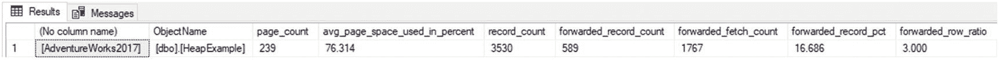

**图 14-1** 转发行快照查询结果

## 转发行缓解

一旦识别出存在转发行问题的堆表，通常有两种方法可以缓解转发行。第一种方法是将列的可变长度数据类型更改为固定长度数据类型。例如，将 `varchar` 数据类型改为 `char`。这种方法并不总是理想的，因为它可能导致表需要更多空间，并且某些查询可能无法适应字符字段末尾的额外空间，从而返回错误结果。第二种选择是向表添加聚集索引，这将移除作为表数据存储组织方式的堆表。这种方法的缺点在于确定用于聚集表的合适键列。如果表上有主键，它通常可以作为聚集索引键。

还有第三种选择。可以重建堆表，这会将堆表重写回数据库文件并移除所有转发行（使用清单 14-4 中的脚本）。这通常被认为是解决堆表中转发行的一种较差方法，因为它无法提供有意义的永久性修复。请记住，转发行不一定是坏事。然而，当与批处理请求相比，转发行操作的比例开始增加时，它们确实会带来潜在的性能问题。

```sql
USE AdventureWorks2017
GO
ALTER TABLE dbo.HeapExample REBUILD
```
**清单 14-4** 重建堆表脚本

### 每秒空闲空间扫描和页面获取次数

性能计数器 `FreeSpace Scans/sec` 是另一个与堆表相关的性能计数器。该计数器表示在向堆表插入记录时发生的活动。在向堆表插入数据期间，可能会在 `GAM`、`SGAM` 和 `PFS` 页面上产生活动。如果插入速率足够高，可能会在这些页面上发生争用。分析 `FreeSpace Scans/sec` 和 `FreeSpace Page Fetches/sec` 计数器的值，可以跟踪此活动，确定活动量何时增加，以及何时可能需要进一步分析堆表。结合使用时，`FreeSpace Scans/sec` 和 `FreeSpace Page Fetches/sec` 计数器分别表示堆表上扫描活动的频率和数量。

清单 14-5 提供了分析 `FreeSpace Scans/sec` 计数器的查询。它提供了 SQL Server 实例上 `FreeSpace Scans` 活动的快照。该查询提供了计数器的最小值、平均值和最大值聚合。与前一个计数器类似，此计数器也遵循建议指南：每十个 `Batch Requests` 对应一个 `FreeSpace Scans/sec`。`PctViolation` 列衡量计数器超出指南的时间百分比。

```sql
USE IndexingMethod;
GO
WITH CounterSummary
AS (SELECT create_date,
           server_name,
           MAX(IIF(counter_name = 'FreeSpace Scans/sec', Calculated_Counter_value, NULL)) FreeSpaceScans,
           MAX(IIF(counter_name = 'FreeSpace Page Fetches/sec', Calculated_Counter_value, NULL)) FreeSpacePageFetches,
           MAX(IIF(counter_name = 'FreeSpace Scans/sec', Calculated_Counter_value, NULL))
           / (NULLIF(MAX(IIF(counter_name = 'Batch Requests/sec', Calculated_Counter_value, NULL)), 0) * 10) AS ForwardedRecordRatio
    FROM dbo.IndexingCounters
    WHERE counter_name IN ( 'FreeSpace Scans/sec', 'FreeSpace Page Fetches/sec', 'Batch Requests/sec' )
    GROUP BY create_date,
             server_name)
SELECT server_name,
       MIN(FreeSpaceScans) AS MinFreeSpaceScans,
       AVG(FreeSpaceScans) AS AvgFreeSpaceScans,
       MAX(FreeSpaceScans) AS MaxFreeSpaceScans,
       MIN(FreeSpacePageFetches) AS MinFreeSpacePageFetches,
       AVG(FreeSpacePageFetches) AS AvgFreeSpacePageFetches,
       MAX(FreeSpacePageFetches) AS MaxFreeSpacePageFetches,
       MIN(ForwardedRecordRatio) AS MinForwardedRecordRatio,
       AVG(ForwardedRecordRatio) AS AvgForwardedRecordRatio,
       MAX(ForwardedRecordRatio) AS MaxForwardedRecordRatio,
       FORMAT(1. * SUM(IIF(ForwardedRecordRatio > 1, 1, NULL)) / COUNT(*), '0.00%') AS PctViolation
FROM CounterSummary
GROUP BY server_name;
```
**清单 14-5** 空闲空间扫描计数器分析

#### 识别高插入速率的堆表

当 `FreeSpace Scans/sec` 数值很高时，分析将侧重于确定数据库中哪些堆表的插入速率最高。要识别堆表上插入最多的表，请使用来自 `sys.dm_db_index_operational_stats` 的监控表中的信息。包含插入信息的列是 `leaf_insert_count`。清单 14-6 中的查询提供了监控表 `dbo.index_operational_stats_history` 中具有最多索引的堆表列表。

```sql
USE IndexingMethod
GO
SELECT
    QUOTENAME(DB_NAME(database_id)) AS database_name
    ,QUOTENAME(OBJECT_SCHEMA_NAME(object_id, database_id)) + '.'
    + QUOTENAME(OBJECT_NAME(object_id, database_id)) AS ObjectName
    , SUM(leaf_insert_count) AS leaf_insert_count
    , SUM(leaf_allocation_count) AS leaf_allocation_count
FROM dbo.index_operational_stats_history
WHERE index_id = 0
  AND database_id > 4
  and QUOTENAME(OBJECT_NAME(object_id, database_id)) IS NOT NULL
GROUP BY object_id, database_id
ORDER BY leaf_insert_count DESC
```
**清单 14-6** 空闲空间扫描快照查询

审查清单 14-3 演示脚本中的表以及 `FreeSpace Scans` 快照查询，得到图 14-2 中的结果。如本例所示，有数千次插入到堆表中。虽然结果中只显示了一个表，但在此列表中排名靠前的表将是最常导致 `FreeSpace Scans/sec` 升高的表。

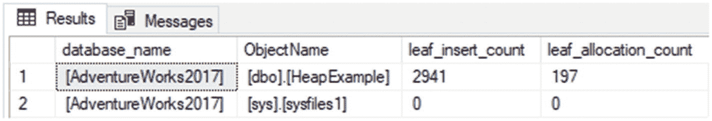

**图 14-2** 每秒空闲空间扫描快照查询结果

#### 缓解策略

一旦识别出导致问题的堆表，缓解堆表的最佳方法是在插入最多的表上创建聚集索引。由于该计数器基于对 `GAM`、`SGAM` 和 `PFS` 页面上空闲空间的扫描，在堆表上构建聚集索引会将页面分配移至 `IAM` 页面（每个聚集索引专用），而在堆表情况下，它们会与其他堆表竞争页面分配。


### 每秒全表扫描次数

通过性能计数器 `Full Scans/sec`，可以测量在聚集索引、非聚集索引和堆上执行的全表扫描次数。在执行计划中，该计数器在索引扫描和表扫描期间被触发。全表扫描的发生率越高，就越可能引发与之相关的性能问题。从性能角度看，这会影响 `Page Life Expectancy` 值，因为数据会在内存中被换出，并且当数据需要被载入内存时，可能产生 I/O 争用。

使用清单 14-7 中的查询，可以分析当前监控窗口内 `Full Scans/sec` 的状态。与之前的计数器一样，考虑此计数器与 `Batch Requests/sec` 计数器之间的关系非常重要。当 `Full Scans/sec` 与 `Batch Requests/sec` 的比率超过每一千比一时，`Full Scans/sec` 可能存在问题，需要进一步审查。

```
USE IndexingMethod;
GO
WITH CounterSummary
AS (SELECT create_date,
           server_name,
           MAX(IIF(counter_name = 'Full Scans/sec', Calculated_Counter_value, NULL)) FullScans,
           MAX(IIF(counter_name = 'Full Scans/sec', Calculated_Counter_value, NULL))
           / (NULLIF(MAX(IIF(counter_name = 'Batch Requests/sec', Calculated_Counter_value, NULL)), 0) * 1000) AS FullRatio
    FROM dbo.IndexingCounters
    WHERE counter_name IN ( 'Full Scans/sec', 'Batch Requests/sec' )
    GROUP BY create_date,
           server_name)
SELECT server_name,
       MIN(FullScans) AS MinFullScans,
       AVG(FullScans) AS AvgFullScans,
       MAX(FullScans) AS MaxFullScans,
       MIN(FullRatio) AS MinFullRatio,
       AVG(FullRatio) AS AvgFullRatio,
       MAX(FullRatio) AS MaxFullRatio,
       FORMAT(1. * SUM(IIF(FullRatio > 1, 1, 0)) / COUNT(*), '0.00%') AS PctViolation
FROM CounterSummary
GROUP BY server_name;
-- 清单 14-7
-- Full Scans 计数器分析
```

在演示如何检查高 `Full Scans/sec` 计数器值的根本原因之前，让我们先设置一些示例统计信息。清单 14-8 将提供一些可以通过前一节详述的监控过程收集到的全表扫描次数。请务必在执行示例脚本后，运行那些收集监控信息的脚本。

```
USE AdventureWorks2017
GO
SET NOCOUNT ON
EXEC ('SELECT * INTO #temp FROM Sales.SalesOrderHeader')
GO 1000
-- 清单 14-8
-- Full Scans 示例查询
```

主要目标是确定 `Full Scans/sec` 计数器受到哪些索引的影响。一旦识别出索引，就需要分析它们是否适用于该操作，或者是否需要其他性能调优策略来减少在全扫描操作中使用索引。用于调查全扫描的 DMO 是监控表中的 `sys.dm_db_index_usage_stats`；在监控中，这被存储在 `dbo.index_usage_stats_history` 表中。

可以使用清单 14-9 所示的查询来识别索引。快照结果排除了那些没有行的索引。这些索引仍然被用于全扫描，但减轻这些索引上的扫描对性能的影响不大。为了对结果排序，索引上的扫描次数乘以表中的行数。这种排序方式使输出结果侧重于那些可能对降低 `Full Scans/sec` 值影响不大，但能为索引性能带来最大提升的索引。

```
USE IndexingMethod;
GO
SELECT QUOTENAME(DB_NAME(uh.database_id)) AS database_name,
       QUOTENAME(OBJECT_SCHEMA_NAME(uh.object_id, uh.database_id)) + '.'
       + QUOTENAME(OBJECT_NAME(uh.object_id, uh.database_id)) AS ObjectName,
       uh.index_id,
       SUM(uh.user_scans) AS user_scans,
       SUM(uh.user_seeks) AS user_seeks,
       x.record_count
FROM dbo.index_usage_stats_history uh
CROSS APPLY (
    SELECT DENSE_RANK() OVER (ORDER BY ph.create_date DESC) AS RankID,
           ph.record_count
    FROM dbo.index_physical_stats_history ph
    WHERE ph.database_id = uh.database_id
      AND ph.object_id = uh.object_id
      AND ph.index_id = uh.index_id
) x
WHERE uh.database_id > 4
  AND uh.database_id != DB_ID()
  AND OBJECT_NAME(uh.object_id, uh.database_id) IS NOT NULL
  AND x.RankID = 1
GROUP BY uh.database_id,
         uh.object_id,
         uh.index_id,
         x.record_count
ORDER BY SUM(uh.user_scans) * x.record_count DESC;
GO
-- 清单 14-9
-- Full Scans 快照查询
```

`Full Scans` 快照查询的结果将类似于图 14-3 中的输出。有了这个输出，下一步就是确定哪些索引需要进一步分析。当前分析的目的是为后续分析识别问题索引。一旦识别出来，下一步就是确定它们在何处被使用，以及如何在这些地方减少全扫描，这将在本章后面的“索引计划使用”部分进行演示。

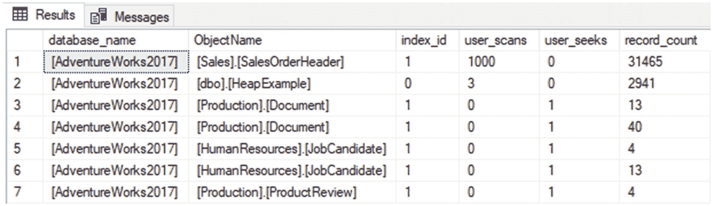

图 14-3
Full Scans 快照查询结果


### 每秒索引搜索次数

扫描索引的替代方法是直接对索引执行寻址操作。性能计数器 `Index Searches/sec` 用于报告 SQL Server 实例上索引寻址操作的速率。这可能包括范围扫描和键查找等操作。在大多数环境中，通常希望看到较高的 `Index Searches/sec` 计数器值。因此，该性能计数器相对于 `Full Scans/sec` 的值越高越好。

对 `Index Searches/sec` 的分析将从审查随时间收集的性能计数器信息开始（如代码清单 14-10 所示）。如前所述，`Index Searches/sec` 与 `Full Scans/sec` 的比率是可用于评估 `Index Searches/sec` 是否指示潜在索引问题的指标之一。评估这两个计数器之间比率的准则是：每出现 1 次 `Full Scans/sec`，应对应约 1,000 次 `Index Searches/sec`。分析查询通过 `PctViolation` 列提供了此计算，并确定了计数器值超出此比率的时间比例。

```sql
USE IndexingMethod;
GO
WITH CounterSummary
AS (SELECT create_date,
           server_name,
           MAX(IIF(counter_name = 'Index Searches/sec', Calculated_Counter_value, NULL)) IndexSearches,
           MAX(IIF(counter_name = 'Index Searches/sec', Calculated_Counter_value, NULL))
           / (NULLIF(MAX(IIF(counter_name = 'Full Scans/sec', Calculated_Counter_value, NULL)), 0) * 1000) AS SearchToScanRatio
    FROM dbo.IndexingCounters
    WHERE counter_name IN ( 'Index Searches/sec', 'Full Scans/sec' )
    GROUP BY create_date,
             server_name)
SELECT server_name,
       MIN(IndexSearches) AS MinIndexSearches,
       AVG(IndexSearches) AS AvgIndexSearches,
       MAX(IndexSearches) AS MaxIndexSearches,
       MIN(SearchToScanRatio) AS MinSearchToScanRatio,
       AVG(SearchToScanRatio) AS AvgSearchToScanRatio,
       MAX(SearchToScanRatio) AS MaxSearchToScanRatio,
       FORMAT(1. * SUM(IIF(SearchToScanRatio > 1, 1, NULL)) / COUNT(*), '0.00%') AS PctViolation
FROM CounterSummary
GROUP BY server_name;
```
代码清单 14-10: 索引搜索计数器分析

如果分析表明索引搜索存在问题，第一步是确认已完成前一章节中对 `Full Scans/sec` 的分析。该分析将更深入地揭示哪些索引存在大量全表扫描，这正是导致 `Index Searches/sec` 比率较高的原因。

为了帮助演示如何检查 `Index Searches/sec` 计数器值，我们将运行代码清单 14-11 中的查询。此查询将提供通过前一节详述的监控过程可收集到的全表扫描次数。请务必在执行示例脚本后，运行收集监控信息的脚本。

```sql
USE AdventureWorks2017
GO
SET NOCOUNT ON
EXEC('SELECT SOH.SalesOrderID, SOD.SalesOrderDetailID
      INTO #temp
      FROM Sales.SalesOrderHeader SOH
      INNER JOIN Sales.SalesOrderDetail SOD ON SOH.SalesOrderID = SOD.SalesOrderID
      WHERE SOH.SalesOrderID = 43659')
GO 1000
```
代码清单 14-11: 全表扫描示例查询

完成该分析后，我们就可以开始识别索引级别上扫描与寻址比率存在问题的地方。使用代码清单 14-12 中的查询，可以识别出扫描与寻址比率较高的索引。类似于性能计数器准则（每 1 次扫描对应 1,000 次寻址），该查询返回的结果针对的是那些每出现 1 次扫描，寻址次数少于 1,000 次的索引。由于全表扫描问题应在前一节中已被识别，因此分析也排除了没有任何寻址操作的索引。

```sql
USE IndexingMethod;
GO
SELECT QUOTENAME(DB_NAME(uh.database_id)) AS database_name,
       QUOTENAME(OBJECT_SCHEMA_NAME(uh.object_id, uh.database_id)) + '.'
       + QUOTENAME(OBJECT_NAME(uh.object_id, uh.database_id)) AS ObjectName,
       uh.index_id,
       SUM(uh.user_scans) AS user_scans,
       SUM(uh.user_seeks) AS user_seeks,
       1. * SUM(uh.user_seeks) / NULLIF(SUM(uh.user_scans), 0) AS SeekScanRatio,
       x.record_count
FROM dbo.index_usage_stats_history uh
CROSS APPLY (
    SELECT DENSE_RANK() OVER (ORDER BY ph.create_date DESC) AS RankID,
           ph.record_count
    FROM dbo.index_physical_stats_history ph
    WHERE ph.database_id = uh.database_id
      AND ph.object_id = uh.object_id
      AND ph.index_id = uh.index_id
) x
WHERE uh.database_id > 4
  AND uh.database_id  DB_ID()
  AND x.RankID = 1
  AND x.record_count > 0
GROUP BY uh.database_id,
         uh.object_id,
         uh.index_id,
         x.record_count
HAVING 1. * SUM(uh.user_seeks) / NULLIF(SUM(uh.user_scans), 0)  0
ORDER BY 1. * SUM(uh.user_seeks) / NULLIF(SUM(uh.user_scans), 0) DESC,
         SUM(uh.user_scans) DESC;
GO
```
代码清单 14-12: 索引搜索快照查询

查看快照查询的结果（如图 14-4 所示），仅识别出一个索引的寻址与扫描比率接近 1。这种情况的发生是因为在上一节中，我们对 `Sales.SalesOrderHeader` 执行了大约 1,000 次扫描，但对 `Sales.SalesOrderDetail` 则没有扫描，尽管代码清单 14-11 中访问了这两个表及其索引。结合 `Full Scans` 来考虑 `Index Searches` 的优势在于，它们通过识别更理想活动发生的频率，有助于抵消问题的严重性。

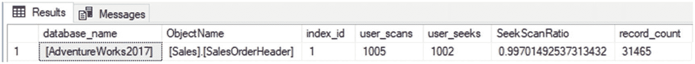

图 14-4: 索引搜索快照查询示例结果

在进行更深入分析时，我们需要注意一些可能表明已识别索引存在问题的迹象。首先是索引当前新的寻址与扫描行为；换句话说，这种差异是否沿着一个逐渐恶化的共同趋势发展？如果变化是突然的，可能是某个执行计划不再像以前那样使用该索引，原因可能是代码变更或不良的参数探测。其次是当变化是渐进时；应审视数据量的增长，以及数据库中的某个查询或功能是否比以前使用得更频繁。这也可能暗示人们使用数据库及其应用程序的方式发生了变化，这种变化有时是渐进的，直到达到某个临界点，导致索引及其支持的性能受到影响。

### 每秒页面拆分数

类似于聚集索引是堆的另一面，页面拆分是前转记录的另一面。关于页面拆分的深入讨论包含在第 2 章中。不过，就本章而言，当聚集或非聚集索引需要在索引页面的顺序中为数据腾出空间以将其放置到正确位置时，就会发生页面拆分。页面拆分可能非常耗费资源，因为单个页面被分成两个或多个页面，并且涉及锁定，可能还会导致阻塞。页面拆分越频繁，索引发生阻塞的可能性就越大，性能也会受到影响。此外，页面拆分导致的碎片化会降低单次操作中可以执行的读取大小。

为了开始分析页面拆分的性能计数器，我们使用计数器 `Page Splits/sec`。代码清单 14-13 中的查询提供了一种汇总页面拆分活动的方法。该查询包括性能计数器的最小值、最大值和平均水平。此外，还包含了 `Page Splits/sec` 与 `Batch Requests/sec` 的比率。在识别 SQL Server 实例上是否存在页面拆分问题时，经验法则是寻找每 20 个 `Batch Requests/sec` 超过 1 个 `Page Splits/sec` 的时间段。当然，与其他计数器一样，请通过 `PctViolation` 关注计数器超过阈值的时间量。

```sql
USE IndexingMethod;
GO
WITH CounterSummary
AS (SELECT create_date,
server_name,
MAX(IIF(counter_name = 'Page Splits/sec', Calculated_Counter_value, NULL)) PageSplits,
MAX(IIF(counter_name = 'Page Splits/sec', Calculated_Counter_value, NULL))
/ (NULLIF(MAX(IIF(counter_name = 'Batch Requests/sec', Calculated_Counter_value, NULL)), 0) * 20) AS FullRatio
FROM dbo.IndexingCounters
WHERE counter_name IN ( 'Page Splits/sec', 'Batch Requests/sec' )
GROUP BY create_date,
server_name)
SELECT server_name,
MIN(PageSplits) AS MinPageSplits,
AVG(PageSplits) AS AvgPageSplits,
MAX(PageSplits) AS MaxPageSplits,
MIN(FullRatio) AS MinFullRatio,
AVG(FullRatio) AS AvgFullRatio,
MAX(FullRatio) AS MaxFullRatio,
FORMAT(1. * SUM(IIF(FullRatio > 1, 1, 0)) / COUNT(*), '0.00%') AS PctViolation
FROM CounterSummary
GROUP BY server_name;
```
**代码清单 14-13** 页面拆分计数器分析

要确定哪些索引受到页面拆分的影响，我们可以考虑几个值。其中几个值来自 `sys.dm_db_index_operational_stats` 或来自索引监控过程的 `dbo.index_operational_stats_history`。这些列报告索引上发生的每次页面分配，无论是来自 B 树末尾的插入还是中间的页面拆分。由于我们只关心作为页面拆分一部分的操作，接下来的两列提供了是否正在发生由页面拆分引起的碎片的信息。为了确定碎片，监控表 `dbo.index_physical_stats_history` 中包含了来自 `sys.dm_db_index_physical_stats` 的列 `avg_fragmentation_in_percent`。对于平均碎片，返回两个值。第一个是索引报告的最新碎片值；第二个是所有收集到的碎片值的平均值。参见代码清单 14-14。

```sql
USE IndexingMethod;
GO
SELECT QUOTENAME(DB_NAME(database_id)) AS database_name,
QUOTENAME(OBJECT_SCHEMA_NAME(object_id, database_id)) + '.' + QUOTENAME(OBJECT_NAME(object_id, database_id)) AS ObjectName,
SUM(leaf_allocation_count) AS leaf_insert_count,
SUM(nonleaf_allocation_count) AS nonleaf_allocation_count,
MAX(IIF(RankID = 1, x.avg_fragmentation_in_percent, NULL)) AS last_fragmenation,
AVG(x.avg_fragmentation_in_percent) AS average_fragmenation
FROM dbo.index_operational_stats_history oh
CROSS APPLY (
SELECT DENSE_RANK() OVER (ORDER BY ph.create_date DESC) AS RankID,
CAST(ph.avg_fragmentation_in_percent AS DECIMAL(6, 3)) AS avg_fragmentation_in_percent
FROM dbo.index_physical_stats_history ph
WHERE ph.database_id = oh.database_id
AND ph.object_id = oh.object_id
AND ph.index_id = oh.index_id
) x
WHERE database_id > 4
AND database_id <> DB_ID()
AND oh.index_id <> 0
AND (
leaf_allocation_count > 0
OR nonleaf_allocation_count > 0
)
GROUP BY object_id,
database_id
ORDER BY leaf_insert_count DESC;
```
**代码清单 14-14** 页面拆分快照查询

以这种方式调查页面拆分提供了一种查看分配数量并将其与碎片信息配对的方法。一个具有低碎片和高 `leaf_insert_count` 的表，例如图 14-5 中所示的表 `dbo.IndexingCounters`，从页面拆分的角度来看并不是问题。另一方面，`dbo.index_operational_stats_history` 确实显示了高碎片量和 `leaf_insert_count`。值得进一步研究该索引。虽然代码清单 14-14 中的脚本通常不会显示 IndexingMethod 数据库的索引结果，但该脚本已从列表中的内容进行了修改，以提供一些可供检查的结果。

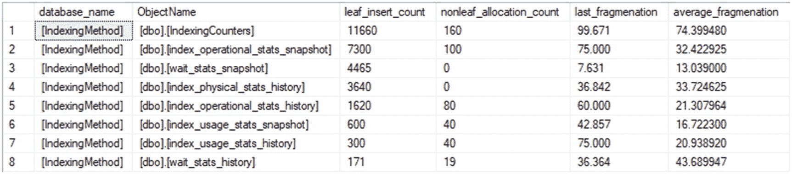

**图 14-5** 页面拆分快照查询示例结果

识别出需要更多分析的索引后，下一步是缓解。有许多方法可以减轻索引上的页面拆分。首先是审查索引的碎片历史。如果索引需要定期重建，首先可以做的事情之一是降低索引上的填充因子。减少填充因子将在重建索引后增加页面上的剩余空间，这将减少页面拆分的可能性。减少碎片的第二个策略是考虑索引中的列。这些列是否高度易变且值是否发生剧烈变化？例如，基于 `create_date` 的索引不太可能有页面拆分问题。但基于 `update_date` 的索引则容易产生碎片。如果索引的使用率不能证明其存在是合理的，那么删除该索引可能是值得的。或者，在多列索引中，将易变列移动到索引的右侧或将它们添加为包含列。减轻页面拆分的第三种方法可以是识别索引的使用位置。减轻索引上页面拆分的最后一种方法是审查索引使用的数据类型。在某些情况下，可变长度数据类型可能比固定长度数据类型更合适。


### 每秒页面查找次数

性能计数器 `Page Lookups/sec` 用于衡量在 SQL Server 实例中，为从缓冲池中检索单个数据页而发出的请求数量。当此计数器值较高时，通常意味着查询计划中存在低效问题，这通常可以通过执行计划分析来解决。通常，`Page Lookups/sec` 值过高可归因于那些每次执行都涉及大量页面查找和行查找的计划。一般来说，就性能问题而言，`Page Lookups/sec` 的值不应超过每秒批处理请求数 (`Batch Request/sec`) 的 100 倍。

对 `Page Lookups/sec` 的初步分析需要同时查看 `Page Lookups/sec` 和 `Batch Request/sec`。首先，使用清单 14-15 中所示的查询；该分析将包含监测期间内 `Page Lookups/sec` 的最小值、最大值和平均值。其次，查询结果中还包括了每个时间段内 `Page Lookups/sec` 与 `Batch Request/sec` 比率的最小值、最大值和平均值，并包含一个 `PctViolation` 列，用于标识该比率。违规计算用于验证操作比率是否超过了 100:1。

```sql
USE IndexingMethod;
GO
WITH CounterSummary
AS (SELECT create_date,
           server_name,
           MAX(IIF(counter_name = 'Page Lookups/sec', Calculated_Counter_value, NULL)) PageLookups,
           MAX(IIF(counter_name = 'Page Lookups/sec', Calculated_Counter_value, NULL))
           / (NULLIF(MAX(IIF(counter_name = 'Batch Requests/sec', Calculated_Counter_value, NULL)), 0) * 100) AS PageLookupRatio
    FROM dbo.IndexingCounters
    WHERE counter_name IN ( 'Page Lookups/sec', 'Batch Requests/sec' )
    GROUP BY create_date,
             server_name)
SELECT server_name,
       MIN(PageLookups) AS MinPageLookups,
       AVG(PageLookups) AS AvgPageLookups,
       MAX(PageLookups) AS MaxPageLookups,
       MIN(PageLookupRatio) AS MinPageLookupRatio,
       AVG(PageLookupRatio) AS AvgPageLookupRatio,
       MAX(PageLookupRatio) AS MaxPageLookupRatio,
       FORMAT(1. * SUM(IIF(PageLookupRatio > 1, 1, 0)) / COUNT(*), '0.00%') AS PctViolation
FROM CounterSummary
GROUP BY server_name;
```
**清单 14-15**
页面查找计数器分析

与其他计数器一样，当分析表明该计数器存在潜在问题时，下一步就是深入挖掘。有三种方法可以解决 `Page Lookups/sec` 值过高的问题。第一种是查询 `sys.dm_exec_query_stats` 以识别那些经常执行且具有高 I/O 的查询；我们可以在 `http://msdn.microsoft.com/en-us/library/ms189741.aspx` 上找到关于此 DMV 的更多信息。需要审查这些查询，并确定它们是否使用了过量的 I/O。第二种方法是检查 SQL Server 实例中的数据库是否存在缺失索引。第三种方法，也是本节将要详细介绍的，是检查聚集索引和堆上发生的查找操作。

要调查聚集索引和堆上的查找操作，主要信息来源是 DMO `sys.dm_db_index_usage_stats`。得益于前一章实施的监控，这些信息已保存在表 `dbo.index_usage_stats_history` 中。要执行分析，请使用清单 14-16 中的查询；我们将从用户角度审查发生的查找、 Seek 和 Scan 操作。利用这些值，该查询计算用户查找与用户 Seek 的比率，并返回所有比率高于 100:1 的记录。

```sql
USE IndexingMethod;
GO
SELECT QUOTENAME(DB_NAME(uh.database_id)) AS database_name,
       QUOTENAME(OBJECT_SCHEMA_NAME(uh.object_id, uh.database_id)) + '.'
       + QUOTENAME(OBJECT_NAME(uh.object_id, uh.database_id)) AS ObjectName,
       uh.index_id,
       SUM(uh.user_lookups) AS user_lookups,
       SUM(uh.user_seeks) AS user_seeks,
       SUM(uh.user_scans) AS user_scans,
       x.record_count,
       CAST(1. * SUM(uh.user_lookups) / IIF(SUM(uh.user_seeks) = 0, 1, SUM(uh.user_seeks)) AS DECIMAL(18, 2)) AS LookupSeekRatio
FROM dbo.index_usage_stats_history uh
CROSS APPLY (
    SELECT DENSE_RANK() OVER (ORDER BY ph.create_date DESC) AS RankID,
           ph.record_count
    FROM dbo.index_physical_stats_history ph
    WHERE ph.database_id = uh.database_id
      AND ph.object_id = uh.object_id
      AND ph.index_id = uh.index_id) x
WHERE uh.database_id > 4
  AND x.RankID = 1
  AND x.record_count > 0
GROUP BY uh.database_id,
         uh.object_id,
         uh.index_id,
         x.record_count
HAVING CAST(1. * SUM(uh.user_lookups) / IIF(SUM(uh.user_seeks) = 0, 1, SUM(uh.user_seeks)) AS DECIMAL(18, 2)) > 100
ORDER BY 1. * SUM(uh.user_lookups) / IIF(SUM(uh.user_seeks) = 0, 1, SUM(uh.user_seeks)) DESC;
GO
```
**清单 14-16**
页面查找快照查询

一旦识别出有问题的索引，下一步就是确定这些索引在何处以及如何被使用，该过程将在本章后面描述。


### 页面压缩

性能计数器`Page compression attempts/sec`和`Pages compressed/sec`分别用于测量已压缩和尝试压缩的页面数量。当`Pages compressed/sec`的比率相较于`Page compression attempts/sec`下降时，这表明 SQL Server 压缩算法在以压缩状态保存数据页面方面存在失败。虽然有些数据本就不适合压缩，但在解压所需的 CPU 开销超过数据压缩所带来的价值时（这种情况常见于像图像文件原始输出这类看似随机的数据），便会出现问题。压缩失败的麻烦之处在于，SQL Server 已经花费了时间（特别是 CPU 资源）尝试压缩页面。通常，当超过 5%的页面压缩尝试开始失败时，就值得去识别失败发生在哪些索引上。

要分析页面压缩是否存在问题，我们首先需要查看页面压缩的计数器。使用清单 14-17 所示的查询，我们可以审查监控期间`Page compression attempts/sec`和`Pages compressed/sec`的最小值、最大值和平均值。此外，该查询还包含了`Pages compressed/sec`与`Page compression attempts/sec`的比率的最小值、最大值和平均值。`PctViolation`列让我们知道有多少百分比的时间违反了 5%的阈值。

```sql
USE IndexingMethod;
GO
WITH CounterSummary
AS (SELECT create_date,
           server_name,
           MAX(IIF(counter_name = 'Page compression attempts/sec', Calculated_Counter_value, NULL)) PageCompressionAttempts,
           MAX(IIF(counter_name = 'Pages compressed/sec', Calculated_Counter_value, NULL)) PagesCompressed,
           MAX(IIF(counter_name = 'Page compression attempts/sec', Calculated_Counter_value, NULL))
           / (NULLIF(MAX(IIF(counter_name = 'Pages compressed/sec', Calculated_Counter_value, NULL)), 0) * 100.) AS CompressionRate
    FROM dbo.IndexingCounters
    WHERE counter_name IN ( 'Page compression attempts/sec', 'Pages compressed/sec')
    GROUP BY create_date,
             server_name)
SELECT server_name,
       MIN(PageCompressionAttempts) AS MinPageCompressionAttempts,
       AVG(PageCompressionAttempts) AS AvgPageCompressionAttempts,
       MAX(PageCompressionAttempts) AS MaxPageCompressionAttempts,
       MIN(PagesCompressed) AS MinPagesCompressed,
       AVG(PagesCompressed) AS AvgPagesCompressed,
       MAX(PagesCompressed) AS MaxPagesCompressed,
       MIN(CompressionRate) AS MinCompressionRate,
       AVG(CompressionRate) AS AvgCompressionRate,
       MAX(CompressionRate) AS MaxCompressionRate,
       FORMAT(1. * SUM(IIF(CompressionRate < 95, 1, 0)) / COUNT(*), '0.00%') AS PctViolation
FROM CounterSummary
GROUP BY server_name;
```

清单 14-17：页面压缩计数器分析

如果表明页面压缩失败率很高或频率在增加，那么值得在数据库内部进行更深入的挖掘，以确定哪些表和索引未能成功进行页面压缩。利用我们一直存储的索引数据，我们可以使用清单 14-18 中的查询来确定哪些特定索引存在页面压缩失败，或者页面压缩成功率最低。结果将类似于图 14-6 所示。该索引是基于`Person.Person`表的所有列创建的，其中包含一些`XML`和`varchar(max)`列。该索引的页面压缩成功率略高于 50%，这是一个相当糟糕的结果。

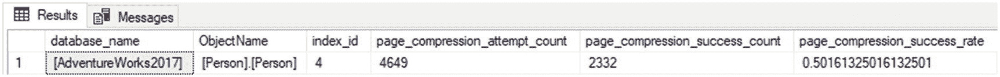

图 14-6：页面拆分快照查询示例结果

```sql
USE IndexingMethod;
GO
SELECT QUOTENAME(DB_NAME(database_id)) AS database_name,
       QUOTENAME(OBJECT_SCHEMA_NAME(object_id, database_id)) + '.' + QUOTENAME(OBJECT_NAME(object_id, database_id)) AS ObjectName,
       oh.index_id,
       SUM(oh.page_compression_attempt_count) AS page_compression_attempt_count,
       SUM(oh.page_compression_success_count) AS page_compression_success_count,
       SUM(1. * oh.page_compression_success_count / NULLIF(oh.page_compression_attempt_count, 0)) AS page_compression_success_rate
FROM dbo.index_operational_stats_history oh
WHERE database_id > 4
  AND database_id <> DB_ID()
  AND oh.page_compression_attempt_count > 0
GROUP BY object_id,
         database_id,
         index_id;
```

清单 14-18：页面压缩快照查询

一旦识别出有问题的索引，下一步就是确定页面压缩是否适用于该索引。包含诸如`XML`或`varchar(max)`等数据类型的索引是页面压缩的较差候选对象，正如我们在图 14-6 中所看到的。

#### 锁等待时间

一些性能计数器可以根据其使用情况来判断索引是否存在压力。其中一个这样的计数器是 `Lock Wait Time (ms)`。该计数器以毫秒为单位，衡量 `SQL Server` 在等待对表、索引或页实施锁所花费的时间。这个计数器没有公认的优良阈值。一般来说，这个值越低越好，但“低”的含义完全取决于数据库平台和访问它的应用程序。

由于没有关于 `Lock Wait Time(ms)` 的值在何种水平上是好是坏的指导，因此评估该计数器的最佳方法是将其与基准值进行比较。在这种情况下，收集基准对于能够监控与 `Lock Wait Time` 相关的索引性能何时发生变得极其重要。使用清单 14-19 中的查询，可以将 `Lock Wait Time (ms)` 值与可用的基准值进行比较。对于基准期和监控期的值，都提供了计数器值的最小值、最大值、平均值和标准差的聚合。这些聚合有助于提供计数器状态的概况，以及它是否相较于基线有所增加或减少。

```sql
USE IndexingMethod;
GO
WITH CounterSummary
AS (SELECT create_date,
server_name,
instance_name,
MAX(IIF(counter_name = 'Lock Wait Time (ms)', Calculated_Counter_value, NULL)) / 1000 LockWaitTime
FROM dbo.IndexingCounters
WHERE counter_name = 'Lock Wait Time (ms)'
GROUP BY create_date,
server_name,
instance_name)
SELECT CONVERT(VARCHAR(50), MAX(create_date), 101) AS CounterDate,
server_name,
instance_name,
MIN(LockWaitTime) AS MinLockWaitTime,
AVG(LockWaitTime) AS AvgLockWaitTime,
MAX(LockWaitTime) AS MaxLockWaitTime,
STDEV(LockWaitTime) AS StdDevLockWaitTime
FROM CounterSummary
GROUP BY server_name,
instance_name
UNION ALL
SELECT 'Baseline: ' + CONVERT(VARCHAR(50), start_date, 101) + ' --> ' + CONVERT(VARCHAR(50), end_date, 101),
server_name,
instance_name,
minimum_counter_value / 1000,
maximum_counter_value / 1000,
average_counter_value / 1000,
standard_deviation_counter_value / 1000
FROM dbo.IndexingCountersBaseline
WHERE counter_name = 'Lock Wait Time (ms)'
ORDER BY instance_name,
CounterDate DESC;
```
清单 14-19
`Lock Wait Time` 计数器分析

例如，在图 14-7 中，平均和最大锁等待时间已从基准值下降，这是期望的结果。如果平均锁等待时间相较于基线有所增加，则可能需要引起关注，特别是当增加量达到数十毫秒时。此外，如果最大值范围有所增加，这也值得进一步调查。等待获取锁所花费的时间持续越长，就越可能影响用户。

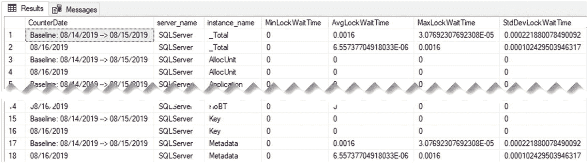

图 14-7
`Lock Wait Time` 计数器分析示例结果

在调查 `Lock Wait Time` 时，使用清单 14-20 中的查询来识别哪些索引产生了最多的 `Lock Wait Time` 至关重要。此信息可以从 `DMO sys.dm_db_index_operational_stats` 或监控表 `dbo.index_operational_stats_history` 中找到。用于检查 `Lock Wait Time` 的列是 `row_lock_wait_count`、`row_lock_wait_in_ms`、`page_lock_wait_count` 和 `page_lock_wait_in_ms`。这些列报告了每个索引的等待次数和这些等待的时间。正如列名所示，锁在行级和页级都存在；通常，锁类型的变化与索引上的查找和扫描操作相关。

```sql
USE IndexingMethod;
GO
SELECT QUOTENAME(DB_NAME(database_id)) AS database_name,
QUOTENAME(OBJECT_SCHEMA_NAME(object_id, database_id)) + '.' + QUOTENAME(OBJECT_NAME(object_id, database_id)) AS ObjectName,
index_id,
SUM(row_lock_wait_count) AS row_lock_wait_count,
SUM(row_lock_wait_in_ms) / 1000\. AS row_lock_wait_in_sec,
ISNULL(SUM(row_lock_wait_in_ms) / NULLIF(SUM(row_lock_wait_count), 0) / 1000., 0) AS avg_row_lock_wait_in_sec,
SUM(page_lock_wait_count) AS page_lock_wait_count,
SUM(page_lock_wait_in_ms) / 1000\. AS page_lock_wait_in_sec,
ISNULL(SUM(page_lock_wait_in_ms) / NULLIF(SUM(page_lock_wait_count), 0) / 1000., 0) AS avg_page_lock_wait_in_sec
FROM dbo.index_operational_stats_history oh
WHERE database_id > 4
AND database_id  DB_ID()
AND (
row_lock_wait_in_ms > 0
OR page_lock_wait_in_ms > 0
)
GROUP BY database_id,
object_id,
index_id;
```
清单 14-20
`Lock Wait Time` 快照查询

查看图 14-8 所示的快照查询结果，有几点需要指出。首先，在此示例中，所有锁都发生在表的页上，而不是行级。这可能导致更大范围的阻塞，因为锁定的不仅仅是正在访问的行。其次，平均页锁时间约为 7 秒。对于大多数环境来说，这是一个过长的锁定时间。基于此信息，我们应进一步调查该表上的聚集索引（`index_id=1`）`Sales.SalesOrderDetail`。

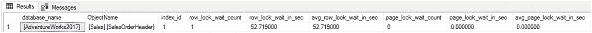

图 14-8
`Lock Wait Time` 索引分析示例结果

当我们需要更深入地研究索引及其用法时，下一步是确定哪些执行计划正在使用该索引。然后优化查询或索引以减少锁定。在某些情况下，如果索引对表不关键，删除该索引并让其他索引来满足查询可能更好。


### 每秒锁等待数

下一个计数器 `Lock Waits/sec` 的分析方法与 `Lock Wait Time (ms)` 类似。`Lock Waits/sec` 计数器用于衡量无法立即满足的锁请求数量。对于这些请求，SQL Server 会等待，直到行或页可用于加锁后才授予锁。与另一个计数器一样，该计数器也没有关于何谓“良好”值的具体准则。对于这些情况，我们应该参考基线，并与之对比分析，以确定计数器何时超出了正常操作范围。

`Lock Waits/sec` 的分析包括与 `Lock Wait Time(ms)` 相同的最小值、最大值、平均值和标准差聚合。这些值按每个计数器表 `dbo.IndexingCounters` 和基线表 `dbo.IndexingCountersBaseline` 进行聚合，如代码清单 14-21 所示。图 14-9 显示了该查询的结果。

```
USE IndexingMethod;
GO
WITH CounterSummary
AS (SELECT create_date,
server_name,
instance_name,
MAX(IIF(counter_name = 'Lock Waits/sec', Calculated_Counter_value, NULL)) LockWaits
FROM dbo.IndexingCounters
WHERE counter_name = 'Lock Waits/sec'
GROUP BY create_date,
server_name,
instance_name)
SELECT CONVERT(VARCHAR(50), MAX(create_date), 101) AS CounterDate,
server_name,
instance_name,
MIN(LockWaits) AS MinLockWait,
AVG(LockWaits) AS AvgLockWait,
MAX(LockWaits) AS MaxLockWait,
STDEV(LockWaits) AS StdDevLockWait
FROM CounterSummary
GROUP BY server_name,
instance_name
UNION ALL
SELECT 'Baseline: ' + CONVERT(VARCHAR(50), start_date, 101) + ' --> ' + CONVERT(VARCHAR(50), end_date, 101),
server_name,
instance_name,
minimum_counter_value / 1000,
maximum_counter_value / 1000,
average_counter_value / 1000,
standard_deviation_counter_value / 1000
FROM dbo.IndexingCountersBaseline
WHERE counter_name = 'Lock Waits/sec'
ORDER BY instance_name,
CounterDate DESC;
```
**代码清单 14-21 锁等待计数器分析**

有时会出现这样的情况，例如图 14-9 中包含的情况，`Lock Wait/sec` 不是问题，但 `Lock Wait Time(ms)` 却存在问題。这些情况指向了长时间持续的阻塞情形。另一方面，监控 `Lock Waits/sec` 很重要，因为它能指示出是否存在大范围的阻塞。这种阻塞可能持续时间不长，但范围广泛；单个长时间的阻塞就可能引发严重的性能问题。

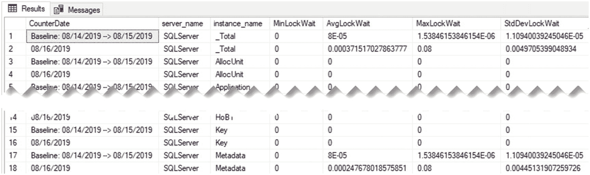
*图 14-9 锁等待计数器分析示例结果*

在存在大范围阻塞的情况下（由 `Lock Waits/sec` 的高值指示），分析将需要使用 DMO `sys.dm_db_index_operational_stats` 来调查索引的统计信息。通过监控流程，这些信息将存储在表 `dbo.index_operational_stats_history` 中。使用代码清单 14-22 中的查询，可以确定等待的锁的数量和百分比。与 `Lock Wait Time(ms)` 一样，此计数器分析也查看行级和页级的统计信息。

```
USE IndexingMethod;
GO
SELECT QUOTENAME(DB_NAME(database_id)) AS database_name,
QUOTENAME(OBJECT_SCHEMA_NAME(object_id, database_id)) + '.' + QUOTENAME(OBJECT_NAME(object_id, database_id)) AS ObjectName,
index_id,
SUM(row_lock_count) AS row_lock_count,
SUM(row_lock_wait_count) AS row_lock_wait_count,
ISNULL(SUM(row_lock_wait_count) / NULLIF(SUM(row_lock_count), 0), 0) AS pct_row_lock_wait,
SUM(page_lock_count) AS page_lock_count,
SUM(page_lock_wait_count) AS page_lock_wait_count,
ISNULL(SUM(page_lock_wait_count) / NULLIF(SUM(page_lock_count), 0), 0) AS pct_page_lock_wait
FROM dbo.index_operational_stats_history oh
WHERE database_id > 4
AND (
row_lock_wait_in_ms > 0
OR page_lock_wait_in_ms > 0
)
GROUP BY database_id,
object_id,
index_id;
```
**代码清单 14-22 锁等待快照查询**

锁等待次数占锁总数百分比高的索引是进行索引优化的首要目标。通常，当数据库中存在过多的锁等待时，终端用户会感受到应用程序运行缓慢，在某些更糟的情况下，会出现应用程序超时。分析此计数器的目的是识别可以优化的索引，然后调查这些索引的使用位置。一旦完成这项工作，就需要解决导致锁产生的根源，并优化索引和查询以减少索引上的锁。


### 每秒死锁数量

在极端情况下，索引不佳和锁过度阻塞可能导致死锁。死锁发生在两个或多个事务已放置锁，且其中一个事务因其他事务的锁而无法获取和/或释放其锁的情况。解决死锁有多种方法，其中之一是改进索引。

要确定 SQL Server 实例上是否发生死锁，请查看监控过程中收集的性能计数器。清单 14-23 中的查询提供了监控窗口内死锁率的概览。该查询返回服务器上死锁的最小、平均、最大和标准差聚合值。

```
USE IndexingMethod;
GO
WITH CounterSummary
AS (SELECT create_date,
server_name,
Calculated_Counter_value AS NumberDeadlocks
FROM dbo.IndexingCounters
WHERE counter_name = 'Number of Deadlocks/sec')
SELECT server_name,
MIN(NumberDeadlocks) AS MinNumberDeadlocks,
AVG(NumberDeadlocks) AS AvgNumberDeadlocks,
MAX(NumberDeadlocks) AS MaxNumberDeadlocks,
STDEV(NumberDeadlocks) AS StdDevNumberDeadlocks
FROM CounterSummary
GROUP BY server_name;
```
清单 14-23
“每秒死锁数量”计数器分析

通常，一个经过良好调优的数据库平台不应发生任何死锁。当死锁发生时，应调查每一个死锁以确定其根本原因。然而，在检查死锁之前，首先需要检索死锁信息。有多种方法可以从 SQL Server 收集死锁信息，包括跟踪标志、SQL Profiler 和事件通知。另一种方法是通过扩展事件，使用内置的 `system_health` 会话。清单 14-24 中的查询返回当前该会话的 `ring_buffer` 中所有死锁的列表。

```
USE IndexingMethod;
GO
WITH deadlock
AS (SELECT CAST(target_data AS XML) AS target_data
FROM sys.dm_xe_session_targets st
INNER JOIN sys.dm_xe_sessions s ON s.address = st.event_session_address
WHERE name = 'system_health'
AND target_name = 'ring_buffer')
SELECT c.value('(@timestamp)[1]', 'datetime') AS event_timestamp,
c.query('data/value/deadlock')
FROM deadlock d
CROSS APPLY target_data.nodes('//RingBufferTarget/event') AS t(c)
WHERE c.exist('.[@name = "xml_deadlock_report"]') = 1;
```
清单 14-24
系统运行状况死锁查询

识别出的死锁会以 XML 文档的形式返回。对大多数人来说，阅读 XML 文档并非检查死锁的自然方式。相反，通常更可取的方法是查看与死锁关联的死锁图，例如图 14-10 中所示的那种。要获取清单 14-22 返回的任何死锁的死锁图，请在 SQL Server Management Studio 中打开死锁 XML 文档，然后将文件保存为 `.xdl` 扩展名。重新打开该文件时，它将以死锁图的形式打开，而不是作为 XML 文档。

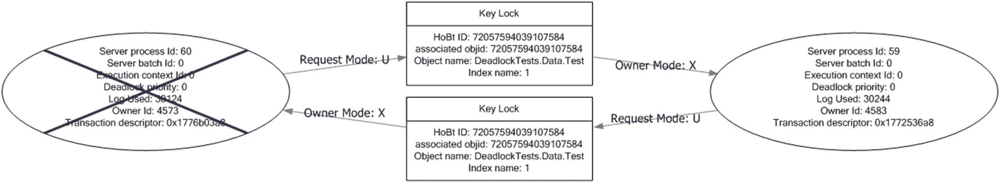
图 14-10
SQL Server Management Studio 中的死锁图

一旦识别出死锁，重要的是确定其发生原因以防止再次发生。导致死锁的一个常见问题是多个事务之间的操作顺序。这个原因通常难以解决，因为它可能需要重写部分应用程序。解决死锁最简单的方法之一是缩短事务的执行时间。为被访问的表创建索引是一种典型方法，在许多情况下可以通过缩小可能产生死锁的时间窗口来解决死锁问题。

### 等待统计信息

等待统计信息的分析过程与性能计数器的分析过程类似。这两组数据都指向资源可能承受压力的区域，识别资源并指明后续步骤。许多适用于性能计数器的分析流程也适用于等待统计信息。这两组信息的一个主要区别在于，等待统计信息被视为一个整体，其价值是通过它们与 SQL Server 实例上其他等待统计信息的关系来确定的。

由于这一差异，在审查等待统计信息时，只需要一个查询即可进行分析。在使用清单 14-25 提供的等待统计信息分析查询之前，有几个关于等待统计信息分析的方面需要解释。首先，如“忽略的等待统计”列表所示，有一些等待状态无论服务器上的活动如何都会累积。对于这些等待状态，调查与其相关的行为没有任何价值，原因要么它们只是服务器 CPU 时间的滴答声，要么它们与无法影响的内部操作有关。其次，等待统计信息的价值在于将它们与服务器上经过的时间联系起来进行观察。虽然一个等待状态高于另一个状态很重要，但如果没有知道经过的时间，就无法衡量该等待状态对服务器造成的压力。为此，监控表中第一组结果中的等待被忽略，利用它们与最后一个收集点之间的日期来计算经过的时间。等待状态持续的总时长与总时间相比，提供了确定该等待状态对 SQL Server 实例压力所需的值。


### 注意

在查询结果中，如果表 `dbo.wait_stats_history` 里只有一个样本，那么清单 14-25 中的百分比列将为 `null`。

```sql
USE IndexingMethod;
GO
WITH WaitStats
AS (SELECT DENSE_RANK() OVER (ORDER BY w.create_date ASC) AS RankID,
create_date,
wait_type,
waiting_tasks_count,
wait_time_ms,
max_wait_time_ms,
signal_wait_time_ms,
MIN(create_date) OVER () AS min_create_date,
MAX(create_date) OVER () AS max_create_date
FROM dbo.wait_stats_history w
WHERE wait_type NOT IN ( 'BROKER_EVENTHANDLER', 'BROKER_RECEIVE_WAITFOR', 'BROKER_TASK_STOP', 'BROKER_TO_FLUSH', 'BROKER_TRANSMITTER', 'CHECKPOINT_QUEUE', 'CHKPT', 'CLR_AUTO_EVENT', 'CLR_MANUAL_EVENT', 'CLR_SEMAPHORE', 'CXCONSUMER', 'DBMIRROR_DBM_EVENT', 'DBMIRROR_EVENTS_QUEUE', 'DBMIRROR_WORKER_QUEUE', 'DBMIRRORING_CMD', 'DIRTY_PAGE_POLL', 'DISPATCHER_QUEUE_SEMAPHORE', 'EXECSYNC', 'FSAGENT', 'FT_IFTS_SCHEDULER_IDLE_WAIT', 'FT_IFTSHC_MUTEX', 'HADR_CLUSAPI_CALL', 'HADR_FILESTREAM_IOMGR_IOCOMPLETIO,', 'HADR_LOGCAPTURE_WAIT', 'HADR_NOTIFICATION_DEQUEUE', 'HADR_TIMER_TASK', 'HADR_WORK_QUEUE', 'KSOURCE_WAKEUP', 'LAZYWRITER_SLEEP', 'LOGMGR_QUEUE', 'MEMORY_ALLOCATION_EXT', 'ONDEMAND_TASK_QUEUE', 'PARALLEL_REDO_DRAIN_WORKER', 'PARALLEL_REDO_LOG_CACHE', 'PARALLEL_REDO_TRAN_LIST', 'PARALLEL_REDO_WORKER_SYNC', 'PARALLEL_REDO_WORKER_WAIT_WORK', 'PREEMPTIVE_HADR_LEASE_MECHANISM', 'PREEMPTIVE_SP_SERVER_DIAGNOSTICS', 'PREEMPTIVE_OS_LIBRARYOPS', 'PREEMPTIVE_OS_COMOPS', 'PREEMPTIVE_OS_CRYPTOPS', 'PREEMPTIVE_OS_PIPEOPS', 'PREEMPTIVE_OS_AUTHENTICATIONOPS', 'PREEMPTIVE_OS_GENERICOPS', 'PREEMPTIVE_OS_VERIFYTRUST', 'PREEMPTIVE_OS_FILEOPS', 'PREEMPTIVE_OS_DEVICEOPS', 'PREEMPTIVE_OS_QUERYREGISTRY', 'PREEMPTIVE_OS_WRITEFILE', 'PREEMPTIVE_XE_CALLBACKEXECUTE', 'PREEMPTIVE_XE_DISPATCHER', 'PREEMPTIVE_XE_GETTARGETSTATE', 'PREEMPTIVE_XE_SESSIONCOMMIT', 'PREEMPTIVE_XE_TARGETINIT', 'PREEMPTIVE_XE_TARGETFINALIZE', 'PWAIT_ALL_COMPONENTS_INITIALIZED', 'PWAIT_DIRECTLOGCONSUMER_GETNEXT', 'PWAIT_EXTENSIBILITY_CLEANUP_TASK', 'QDS_PERSIST_TASK_MAIN_LOOP_SLEEP', 'QDS_ASYNC_QUEUE', 'QDS_CLEANUP_STALE_QUERIES_TASK_MAIN_LOOP_SLEEP', 'REQUEST_FOR_DEADLOCK_SEARCH', 'RESOURCE_QUEUE', 'SERVER_IDLE_CHECK', 'SLEEP_BPOOL_FLUSH', 'SLEEP_DBSTARTUP', 'SLEEP_DCOMSTARTUP', 'SLEEP_MASTERDBREADY', 'SLEEP_MASTERMDREADY', 'SLEEP_MASTERUPGRADED', 'SLEEP_MSDBSTARTUP', 'SLEEP_SYSTEMTASK', 'SLEEP_TASK', 'SLEEP_TEMPDBSTARTUP', 'SNI_HTTP_ACCEPT', 'SOS_WORK_DISPATCHER', 'SP_SERVER_DIAGNOSTICS_SLEEP', 'SQLTRACE_BUFFER_FLUSH', 'SQLTRACE_INCREMENTAL_FLUSH_SLEEP', 'SQLTRACE_WAIT_ENTRIES', 'STARTUP_DEPENDENCY_MANAGER', 'WAIT_FOR_RESULTS', 'WAITFOR', 'WAITFOR_TASKSHUTDOW', 'WAIT_XTP_HOST_WAIT', 'WAIT_XTP_OFFLINE_CKPT_NEW_LOG', 'WAIT_XTP_CKPT_CLOSE', 'WAIT_XTP_RECOVERY', 'XE_BUFFERMGR_ALLPROCESSED_EVENT', 'XE_DISPATCHER_JOI,', 'XE_DISPATCHER_WAIT', 'XE_LIVE_TARGET_TVF', 'XE_TIMER_EVENT'))
SELECT wait_type,
DATEDIFF(ms, min_create_date, max_create_date) AS total_time_ms,
SUM(waiting_tasks_count) AS waiting_tasks_count,
SUM(wait_time_ms) AS wait_time_ms,
CAST(1. * SUM(wait_time_ms) / NULLIF(SUM(waiting_tasks_count),0) AS DECIMAL(18, 3)) AS avg_wait_time_ms,
CAST(100. * SUM(wait_time_ms) / NULLIF(DATEDIFF(ms, min_create_date, max_create_date),0) AS DECIMAL(18, 3)) AS pct_time_in_wait,
SUM(signal_wait_time_ms) AS signal_wait_time_ms,
CAST(100. * SUM(signal_wait_time_ms) / NULLIF(SUM(wait_time_ms), 0) AS DECIMAL(18, 3)) AS pct_time_runnable
FROM WaitStats
GROUP BY wait_type,
min_create_date,
max_create_date
ORDER BY SUM(wait_time_ms) DESC;
```
清单 14-25
等待统计信息分析查询

该查询包含许多计算，有助于识别特定等待类型是否存在问题。要理解所提供的信息，请参阅表 14-1 中提供的定义。这些计算及其定义将有助于聚焦与等待统计信息相关的性能问题。

在查看等待统计信息查询的结果（如图 14-11 所示）时，有两个阈值需要注意。首先，如果任何等待类型的等待时间超过总等待时间的 5%，则可能存在与该等待类型相关的瓶颈，应进行进一步调查。同样地，如果任何等待类型的等待时间超过总时间的 1%，也应考虑进行进一步分析，但应优先处理那些等待时间更高的项目。在审查等待统计信息时，需要特别注意的一点是，如果等待所花费的时间主要是由于信号等待时间 (`signal_wait_time_ms`)，那么通过首先关注服务器上的 CPU 压力，可以更好地解决资源争用问题。

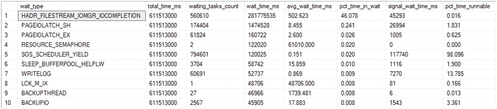

图 14-11

等待统计信息分析输出

表 14-1

等待统计信息查询列定义

| 选项名称 | 描述 |
| --- | --- |
| `wait_type` | 导致等待的等待统计信息类型。 |
| `total_time_ms` | 查询测量到的总时间（毫秒）。 |
| `waiting_tasks_count` | 此等待类型的等待次数计数。 |
| `wait_time_ms` | 为此等待类型累积的时间（毫秒）。这包括在 `signal_wait_time_ms` 上花费的时间。 |
| `avg_wait_time_ms` | 每次等待的平均时间（毫秒）。 |
| `pct_time_in_wait` | 为此等待类型花费的时间占总时间的百分比。 |
| `signal_wait_time_ms` | 在等待类型可用且不再等待之后，但在实际运行之前累积的时间（毫秒）。这是在 `RUNNABLE` 状态花费的时间。 |
| `pct_time_runnable` | 为此等待类型在 `RUNNABLE` 状态花费的时间百分比。 |

一旦识别出有问题的等待状态，下一步就是审查该等待类型以及推荐的应对措施。由于本章侧重于更多与索引相关的等待类型，我们将重点讨论这些定义。要了解有关其他等待类型的更多信息，请参阅 `sys.dm_os_wait_stats`（Transact-SQL）的联机丛书主题。

#### CXPACKET

`CXPACKET` 等待类型发生在由于并行查询执行（也称为并行 (`parallelism`)）而产生等待时。并行查询可能遇到 `CXPACKET` 等待主要有两种场景。第一种情况是，并行查询中的某个运算符由于调度器上已有其他线程在运行而无法执行。第二种情况是，并行线程中的某个运算符的线程执行时间比其他线程长，导致其他线程必须等待该较慢的线程完成。第一种原因是并行等待的更常见原因，但它超出了本书的范围，通常与配置设置和查询调优有关。而第二种原因则可以通过索引来解决。通常情况下，通过解决导致 `CXPACKET` 等待的第二个原因，也可以减轻第一个并行等待的原因。


### SQL Server 中的 CXPACKET 等待与索引优化

#### 关于并行等待

存在另一种名为 `CXCONSUMER` 的并行等待，它指示与正在等待线程向操作符发送行的并行操作符相关的等待。这通常不是一个可操作的等待，超出了本书的讨论范围。

解决 `CXPACKET` 等待的两种常见方法是调整服务器属性“最大并行度”和“并行查询的成本阈值”。与并行等待的第一个原因一样，使用这些服务器属性来解决并行问题也超出了本书的范围。存在有效利用这两个属性的方法，但本书的重点是索引，而非限制并行度和成本。简而言之，“最大并行度”限制了单个查询在并行处理期间可以使用的 CPU 核心总数。而“并行查询的成本阈值”则提高了 SQL Server 确定查询可以使用并行处理的阈值，但不限制并行的范围。

本书范围内的是通过索引来缓解 `CXPACKET` 等待，这可以与查询调优相结合。要解决并行运行查询的索引问题，我们首先需要识别正在使用并行的查询。有多种方法可以识别参与并行操作的查询和索引。

### 检查执行计划缓存

第一种方法是检查在先前执行中使用了并行的执行计划。通过这种方法，可以查询计划缓存以识别包含并行操作符的执行计划。这提供了一个理想的查询列表，可以调优它们以减少 I/O 消耗或消除对并行查询的需求。对并行查询的需求有时可归因于底层表上的索引不当。例如，在表上利用扫描的并行操作，可以通过一个支持查询中谓词或排序的索引来缓解。清单 `14-26` 提供了一个查询计划缓存中利用并行的执行计划列表。

```sql
SET TRANSACTION ISOLATION LEVEL READ UNCOMMITTED;
WITH XMLNAMESPACES (
DEFAULT 'http://schemas.microsoft.com/sqlserver/2004/07/showplan'
)
SELECT COALESCE(
DB_NAME([p].[dbid]),
[p].[query_plan].value[1]', 'nvarchar(128)')
) AS [database_name],
IIF([p].[objectid]  0,
CONCAT(
QUOTENAME(DB_NAME([p].[dbid])),
'.',
QUOTENAME(OBJECT_SCHEMA_NAME([p].[objectid], [p].[dbid])),
'.',
QUOTENAME(OBJECT_NAME([p].[objectid], [p].[dbid]))
),
NULL) AS [object_name],
[cp].[objtype],
[p].[query_plan],
[cp].[usecounts] AS [use_counts],
[cp].[plan_handle],
CAST('' AS XML) AS [sql_text]
FROM [sys].[dm_exec_cached_plans] AS [cp]
CROSS APPLY [sys].dm_exec_query_plan AS [p]
CROSS APPLY [sys].dm_exec_sql_text AS [q]
WHERE [cp].[cacheobjtype] = 'Compiled Plan'
AND [p].[query_plan].exist = 1
ORDER BY COALESCE(
DB_NAME([p].[dbid]),
[p].[query_plan].value[1]', 'nvarchar(128)')
),
[cp].[usecounts] DESC;
```
清单 `14-26`
计划缓存中利用并行的执行计划

### 警告

本章包含多个针对计划缓存和查询存储执行的查询。这些是通过 `DMOs` 访问的，它们提供了对 SQL Server 中执行计划的访问，允许对服务器上当前和最近的执行活动进行调查。虽然这些信息非常有用，但在生产系统上执行此代码时请务必小心。对这些视图执行过于昂贵的查询可能会影响 SQL Server 的性能。请务必在非生产环境中测试并监控此类查询，然后再在生产环境中使用。

### 查询查询存储

下一种方法类似于使用计划缓存，但是改为查询查询存储。假设查询存储正在数据库上运行，`sys.query_store_plan` 中有一个列标识并行计划。结合其他几个 `DMOs`，你可以获得一个包含并行操作符的 T-SQL 语句列表。清单 `14-27` 提供了一个从查询存储返回并行查询的查询，其中包含该 T-SQL 语句的执行次数统计。使用查询存储的一个优点是，它可以将结果限制在单个数据库内。

```sql
SET TRANSACTION ISOLATION LEVEL READ UNCOMMITTED;
SELECT IIF([qsq].[object_id]  0,
CONCAT(
QUOTENAME(DB_NAME()),
'.',
QUOTENAME(OBJECT_SCHEMA_NAME([qsq].[object_id])),
'.',
QUOTENAME(OBJECT_NAME([qsq].[object_id]))
),
NULL) AS [object_name],
CAST([qsp].[query_plan] AS XML) AS [query_plan],
[deqs].[execution_count],
CAST('' AS XML) AS [sql_text],
[qsp].[engine_version],
[qsp].[compatibility_level],
[qsq].[query_parameterization_type_desc],
[qsp].[is_forced_plan],
[deqs].[total_worker_time]
FROM [sys].[query_store_plan] AS [qsp]
INNER JOIN [sys].[query_store_query] AS [qsq] ON [qsp].[query_id] = [qsq].[query_id]
INNER JOIN [sys].[query_store_query_text] AS [qsqt] ON [qsq].[query_text_id] = [qsqt].[query_text_id]
INNER JOIN sys.[dm_exec_query_stats] AS deqs ON [last_compile_batch_sql_handle] = [deqs].[sql_handle]
WHERE [qsp].[is_parallel_plan] = 1
ORDER BY [deqs].[execution_count] DESC,
[deqs].[total_worker_time] DESC;
```
清单 `14-27`
查询存储中利用并行的执行计划

### 检查当前执行的计划

调查并行等待的另一种方法是研究当前正在执行的计划。此信息在 `DMO sys.dm_os_tasks` 中可用，它返回当前正在使用多个工作线程的等待；清单 `14-28` 提供了一个检索此信息的示例查询。此查询提供了一个当前正在执行的并行计划列表。

```sql
WITH executing
AS (SELECT er.session_id,
er.request_id,
MAX(ISNULL(exec_context_id, 0)) AS number_of_workers,
er.sql_handle,
er.statement_start_offset,
er.statement_end_offset,
er.plan_handle
FROM sys.dm_exec_requests er
INNER JOIN sys.dm_os_tasks t ON er.session_id = t.session_id
INNER JOIN sys.dm_exec_sessions es ON er.session_id = es.session_id
WHERE es.is_user_process = 0x1
GROUP BY er.session_id,
er.request_id,
er.sql_handle,
er.statement_start_offset,
er.statement_end_offset,
er.plan_handle)
SELECT QUOTENAME(DB_NAME(st.dbid)) AS database_name,
QUOTENAME(OBJECT_SCHEMA_NAME(st.objectid, st.dbid)) + '.' + QUOTENAME(OBJECT_NAME(st.objectid, st.dbid)) AS object_name,
e.session_id,
e.request_id,
e.number_of_workers,
SUBSTRING(
st.text,
e.statement_start_offset / 2,
(CASE
WHEN e.statement_end_offset = -1 THEN LEN(CONVERT(NVARCHAR(MAX), st.text)) * 2
ELSE e.statement_end_offset END - e.statement_start_offset
) / 2
) AS query_text,
qp.query_plan
FROM executing e
CROSS APPLY sys.dm_exec_sql_text(e.plan_handle) st
CROSS APPLY sys.dm_exec_query_plan(e.plan_handle) qp
WHERE number_of_workers > 0;
```
清单 `14-28`
当前正在执行的并行查询


第二种方法是启动一个扩展事件（Extended Events）会话，捕获事务信息，然后在可用调用堆栈上对该信息进行分组。如代码清单 14-29 所定义的会话，它会在并行等待发生时检索所有此类事件，并按其 T-SQL 堆栈进行分组。运行脚本前，请确保 `CXPACKET` 等待类型的值与查询中的值相匹配；对于 SQL Server 2019，该值为 `265`。T-SQL 堆栈包含了所有促成最终执行点的 SQL 语句。例如，深入分析一个执行堆栈可以提供关于一个正在执行函数（该函数又执行单个 T-SQL 语句）的存储过程的信息。这提供了可用于追踪并行等待发生位置的信息。这些语句使用 `histogram`（直方图）目标进行分组，这使我们能够最小化收集的数据量，并专注于导致系统上最多 `CXPACKET` 等待的项目。

```sql
USE master;
GO
SELECT name,
map_key,
map_value
FROM sys.dm_xe_map_values
WHERE name = 'wait_types'
AND map_value = 'CXPACKET';
GO
IF EXISTS (
SELECT *
FROM sys.server_event_sessions
WHERE name = 'ex_cxpacket'
)
DROP EVENT SESSION ex_cxpacket ON SERVER;
GO
CREATE EVENT SESSION [ex_cxpacket]
ON SERVER
ADD EVENT sqlos.wait_info
(ACTION (
sqlserver.plan_handle,
sqlserver.tsql_stack)
WHERE ([wait_type] = (265)
AND [sqlserver].[is_system] = (0)))
ADD TARGET package0.histogram
(SET filtering_event_name = N'sqlos.wait_info', slots = (2048), source = N'sqlserver.tsql_stack', source_type = (1))
WITH (STARTUP_STATE = ON);
GO
ALTER EVENT SESSION ex_cxpacket ON SERVER STATE = START;
GO
```

代码清单 14-29 用于捕获 CXPACKET 的扩展事件会话

一旦扩展事件会话收集了一段时间的数据，就可以更仔细地查看等待最多的会话。代码清单 14-30 提供了所有已收集的 `CXPACKET` 等待的列表，以及与之关联的语句和查询计划。一旦我们知道了这些信息，就可以调查正在使用的索引，以确定哪些索引导致了低选择性或意外的扫描。

```sql
WITH XData
AS (SELECT CAST(target_data AS XML) AS TargetData
FROM sys.dm_xe_session_targets st
INNER JOIN sys.dm_xe_sessions s ON s.address = st.event_session_address
WHERE name = 'ex_cxpacket'
AND target_name = 'histogram'),
ParsedEvent
AS (SELECT c.value('(@count)[1]', 'bigint') AS event_count,
c.value('xs:hexBinary(substring((value/frames/frame/@handle)[1],3))', 'varbinary(255)') AS sql_handle,
c.value('(value/frames/frame/@offsetStart)[1]', 'int') AS statement_start_offset,
c.value('(value/frames/frame/@offsetEnd)[1]', 'int') AS statement_end_offset
FROM XData d
CROSS APPLY TargetData.nodes('//Slot') t(c) )
SELECT QUOTENAME(DB_NAME(st.dbid)) AS database_name,
QUOTENAME(OBJECT_SCHEMA_NAME(st.objectid, st.dbid)) + '.' + QUOTENAME(OBJECT_NAME(st.objectid, st.dbid)) AS object_name,
e.event_count,
SUBSTRING(
st.text,
e.statement_start_offset / 2,
(IIF(e.statement_end_offset = -1, LEN(CONVERT(NVARCHAR(MAX), st.text)) * 2, e.statement_end_offset)
- e.statement_start_offset
) / 2
) AS query_text,
qp.query_plan
FROM ParsedEvent e
CROSS APPLY sys.dm_exec_sql_text(e.sql_handle) st
CROSS APPLY (
SELECT plan_handle
FROM sys.dm_exec_query_stats qs
WHERE e.sql_handle = qs.sql_handle
GROUP BY plan_handle
) x
CROSS APPLY sys.dm_exec_query_plan(x.plan_handle) qp
ORDER BY e.event_count DESC;
```

代码清单 14-30 用于查看 CXPACKET 扩展事件会话数据的查询

#### IO_COMPLETION

当 SQL Server 正在等待非数据页 I/O（例如索引页）的 I/O 操作完成时，会发生 `IO_COMPLETION` 等待类型。尽管此等待与非数据操作相关，但当此等待在 SQL Server 实例中较高时，仍可采取一些与索引相关的操作。

首先，检查服务器上 `Full Scans/sec`（全表扫描/秒）的状态。如果该性能计数器存在问题，其下的操作可能会渗透到用于管理索引的非数据页上。当这两者都较高时，应额外重点分析 `Full Scans/sec` 问题。

我们可以采取的第二个操作是检查 SQL Server 实例内的缺失索引信息。该信息在第 7 章中讨论。添加缺失索引可以将数据消耗的压力转移到新的结构上，在那里查询可能不再需要等待非数据 I/O 完成，因为查询现在利用了不同的索引。

接下来，考虑索引上发生的页面拆分量；页面拆分在重新分配页面到新页面时会影响非数据页。大量的页面拆分活动将导致高非数据页 I/O，这可能是这些等待的来源或与之相关。

最后，如果 `IO_COMPLETION` 问题的原因不明显，请使用扩展事件会话进行调查。此类分析超出了本书的范围，因为这些原因很可能与索引无关。调查 `CXPACKET` 的方法可以适用，并将作为调查的起点。


### SQL Server 中与索引相关的等待类型

#### LCK_M_∗

`LCK_M_∗` 系列等待类型指的是在 SQL Server 实例上发生的等待。这些不仅是锁的使用，还包括锁产生等待的时间。`LCK_M_∗` 中的每个等待类型都对应一种特定的锁类型，例如排他锁或共享锁。要解读不同的等待类型，请使用表 **14-2**。当 `LCK_M_∗` 等待类型增加时，它们总是伴随着“锁等待时间（毫秒）”和“每秒锁等待次数”的增加，因此可以利用这些计数器来帮助调查此类等待。

在调查性能计数器或不同锁类型的增加时，请参考表 **14-2**。结合等待类型和性能计数器来精确定位具体问题。例如，当性能计数器指向“锁等待时间（毫秒）”问题时，寻找 `LCK_M_∗` 上长时间运行的等待。使用 SQL Server Management Studio 中的向导创建“计数查询锁”会话，并通过 `query_hash` 确定是哪个锁和哪些查询导致了问题。同样地，如果问题是“每秒锁等待次数”，则寻找那些锁次数最多的操作。

表 14-2

LCK_M_∗ 等待类型

| 等待类型 | 锁类型 |
| --- | --- |
| `LCK_M_BU` | 批量更新。 |
| `LCK_M_IS` | 意向共享。 |
| `LCK_M_IU` | 意向更新。 |
| `LCK_M_IX` | 意向排他。 |
| `LCK_M_RIn_NL` | 在当前和上一个键之间插入范围锁，当前键值上使用 `NULL` 锁。 |
| `LCK_M_RIn_S` | 在当前和上一个键之间插入范围锁，当前键值上使用共享锁。 |
| `LCK_M_RIn_U` | 在当前和上一个键之间插入范围锁，当前键值上使用更新锁。 |
| `LCK_M_RIn_X` | 在当前和上一个键之间插入范围锁，当前键值上使用排他锁。 |
| `LCK_M_RS_S` | 在当前和上一个键之间共享范围锁，当前键值上使用共享锁。 |
| `LCK_M_RS_U` | 在当前和上一个键之间共享范围锁，当前键值上使用更新锁。 |
| `LCK_M_RX_S` | 在当前和上一个键之间排他范围锁，当前键值上使用共享锁。 |
| `LCK_M_RX_U` | 在当前和上一个键之间排他范围锁，当前键值上使用更新锁。 |
| `LCK_M_RX_X` | 在当前和上一个键之间排他范围锁，当前键值上使用排他锁。 |
| `LCK_M_S` | 共享。 |
| `LCK_M_SCH_M` | 架构修改。 |
| `LCK_M_SCH_S` | 架构共享。 |
| `LCK_M_SIU` | 共享带意向更新。 |
| `LCK_M_SIX` | 共享带意向排他。 |
| `LCK_M_U` | 更新。 |
| `LCK_M_UIX` | 更新带意向排他。 |
| `LCK_M_X` | 排他。 |

表 **14-2** 中的所有锁都可以带有 `_ABORT_BLOCKERS` 和 `_LOW_PRIORITY` 后缀，这些后缀与联机索引和分区切换操作中添加的低优先级选项有关。此功能自 SQL Server 2014 起可用。如果你看到带有这些后缀的锁，请检查正在发生的索引维护操作。当等待时间过长时，可能需要调整维护计划。

#### PAGEIOLATCH_∗

最后一个与索引相关的等待是 `PAGEIOLATCH_∗` 等待类型。此等待指的是当 SQL Server 从索引中检索数据页并将其放入内存时发生的等待。SQL Server 使用这些计数器来跟踪查询准备好检索数据页到数据页在内存中可用之间的时间。与 `LCK_M_∗` 等待一样，有许多不同的 `PAGEIOLATCH_∗` 类型，定义见表 **14-3**。

首先，监控当前位于缓冲区高速缓存中的索引，以识别哪些索引可用。此外，检查“页寿命/秒（PLE）”计数器，该计数器当前未在监控部分收集。在 PLE 变化前后，审查缓冲区中分配给索引的页，有助于识别哪些索引正在将信息推出内存。然后调查查询计划并调整查询或索引，以减少满足查询所需的数据量。

表 14-3

PAGEIOLATCH_∗ 等待类型

| 等待类型 | 锁类型 |
| --- | --- |
| `PAGEIOLATCH_DT` | IO 闩锁（销毁模式）。 |
| `PAGEIOLATCH_EX` | IO 闩锁（排他模式）。 |
| `PAGEIOLATCH_KP` | IO 闩锁（保持模式）。 |
| `PAGEIOLATCH_SH` | IO 闩锁（共享模式）。 |
| `PAGEIOLATCH_UP` | IO 闩锁（更新模式）。 |

解决 `PAGEIOLATCH_∗` 问题的第二个策略是更加重视“全表扫描/秒”分析。通常，导致此等待类型增加的索引与数据库中正在使用的全表扫描有关。通过在执行计划中更加注重减少对全表扫描的需求，需要拉入内存的数据量就会减少，从而导致此等待类型下降。

在某些情况下，与 `PAGEIOLATCH_∗` 相关的问题与索引无关。问题可能仅仅是磁盘性能缓慢。要验证是否是这种情况，请监控服务器计数器“物理磁盘：磁盘读取秒数”和“物理磁盘：磁盘写入秒数”，以及 SQL Server 的虚拟文件统计信息。如果这些统计信息持续偏高，则需将调查范围扩展到索引之外，转向硬件和 I/O 存储层。除了改进磁盘性能外，还可以通过增加可用内存来减少此等待统计信息，这可以降低数据页被推出内存的可能性。

### 缓冲区分配

在通过索引确定服务器状态时，最后一个需要审视的方面是查看位于缓冲区缓存中的数据页。这并非人们在考虑索引时通常会查看的典型区域，但它提供了关于 SQL Server 正将哪些数据放入内存的丰富信息。对于 SQL Server 实例，这个分析可以回答的基本问题是：缓冲区中的数据是否代表了使用该 SQL Server 的应用程序最关键的数据？

回答这个问题的第一步是回顾哪些数据库在内存中占有多少页面。这看起来可能并不十分重要，但不同数据库所使用的内存量有时会令人惊讶。在为 `MSDB` 数据库中的备份表添加索引之前，这些表将所有备份数据推入内存的情况并不少见。如果表中的数据没有被频繁清理，这可能导致大量非关键业务数据占用不必要的内存量。

对于问题的第二部分，我们需要与使用该 SQL Server 实例的应用程序的所有者及主题专家进行沟通。如果这些人的反馈与缓冲区中的信息不符，这就为我们提供了一份数据库列表，我们可以集中精力对这些数据库进行索引调优。

同样的道理，许多应用程序拥有用于存储错误和处理事件的日志数据库，以便日后进行故障排查。当问题出现时，开发人员可以简单地查询数据库并提取所需的事件进行故障排查，而无需去查看日志文件。但是，如果这些表没有正确索引，或者查询不是 SARGable（可搜索参数）的，会怎么样呢？拥有数百万或数十亿行的日志表可能会被推入内存，从而将来自关键业务应用程序的数据挤出内存，并可能导致更严重的问题。如果不检查缓冲区中的数据，就无法知道内存中存储的是什么，以及它是否是正确的数据。

检查内存中的数据是一项相对简单的任务，它利用了 DMO `sys.dm_os_buffer_descriptors`。此 DMO 列出了内存中的每个数据页，并描述了页面上的信息。通过对每个数据库的每个页面进行计数，可以确定分配给该数据库的总页数和内存量。使用代码清单 14-31 中的查询，我们可以从图 14-12 中看到，`ContosoRetailDW` 数据库在服务器上占用的内存最多，而 `IndexingMethod` 数据库当前使用了 8.84 MB 的空间。

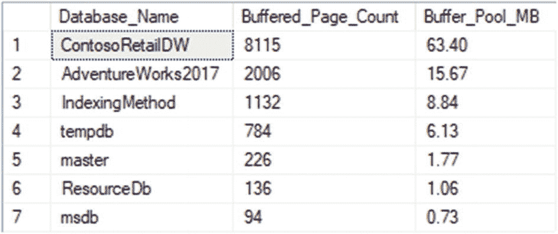

图 14-12：每个数据库缓冲区分配查询的结果

```
SELECT LEFT(CASE database_id
WHEN 32767 THEN 'ResourceDb'
ELSE DB_NAME(database_id) END, 20) AS Database_Name,
COUNT(*) AS Buffered_Page_Count,
CAST(COUNT(*) * 8 / 1024.0 AS NUMERIC(10, 2)) AS Buffer_Pool_MB
FROM sys.dm_os_buffer_descriptors
GROUP BY DB_NAME(database_id),
database_id
ORDER BY Buffered_Page_Count DESC;
```

代码清单 14-31：每个数据库的缓冲区分配

一旦识别出内存中的数据库，确定数据库中哪些对象位于内存中也很有用。与查看哪些数据库在内存中的原因类似，识别内存中的对象有助于确定在索引调优时应重点关注哪些表和索引。检索每个表和索引的内存使用情况同样利用了 `sys.dm_os_buffer_descriptors`，但需要将行映射到目录视图 `sys.allocation_units` 和 `sys.partitions` 中的 `allocation_unit_id` 值。

通过代码清单 14-32 中的查询，返回了每个用户表和索引所使用的内存在图 14-13 的结果中，表 `FactSales` 和 `FactOnlineSales` 占用了大量的内存。如果这出乎意料，并且这些事实表不那么显而易见，我们肯定需要进一步了解它们为何占用如此多的内存。这可以引导我们提出其他问题，例如：这些数据是什么？为什么如此庞大？该表占用的空间是否影响了其他数据库为其索引优化使用内存的能力？在这些情况下，我们需要调查这些表上的索引，因为最常驻留内存的表理应拥有最精良的索引配置。

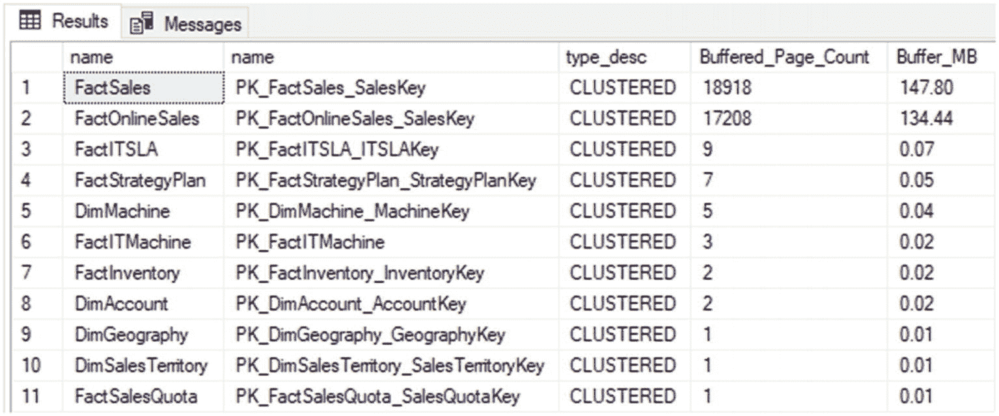

图 14-13：每个表/索引缓冲区分配查询的结果

```
WITH BufferAllocation
AS (SELECT object_id,
index_id,
allocation_unit_id
FROM sys.allocation_units AS au
INNER JOIN sys.partitions AS p ON au.container_id = p.hobt_id
AND (au.type = 1 OR au.type = 3)
UNION ALL
SELECT object_id,
index_id,
allocation_unit_id
FROM sys.allocation_units AS au
INNER JOIN sys.partitions AS p ON au.container_id = p.hobt_id
AND au.type = 2)
SELECT t.name,
we.name,
we.type_desc,
COUNT(*) AS Buffered_Page_Count,
CAST(COUNT(*) * 8 / 1024.0 AS NUMERIC(10, 2)) AS Buffer_MB
FROM sys.tables t
INNER JOIN BufferAllocation ba ON t.object_id = ba.object_id
LEFT JOIN sys.indexes we ON ba.object_id = we.object_id
AND ba.index_id = we.index_id
INNER JOIN sys.dm_os_buffer_descriptors bd ON ba.allocation_unit_id = bd.allocation_unit_id
WHERE bd.database_id = DB_ID()
GROUP BY t.name,
we.index_id,
we.name,
we.type_desc
ORDER BY Buffered_Page_Count DESC;
```

代码清单 14-32：按表/索引划分的缓冲区分配

## Schema 发现

在调查了服务器状态及其索引需求之后，索引分析过程的下一步是调查数据库的架构（Schema），以确定是否存在可解决的与架构相关的索引问题。对于这些问题，我们将主要关注一些可通过目录视图发现的关键细节。

### 识别堆表

如前所述，在表上使用聚集索引通常比将表存储为堆表更为理想。当堆表被优先考虑时，应当是在已证明聚集索引的使用会对其性能产生负面影响的情况下。在调查堆表时，最好考虑行数以及堆表的利用率。当一个堆表的行数较少或未被使用时，费力对其进行聚集可能毫无意义。

要识别堆表，请使用目录视图`sys.indexes`和`sys.partitions`。性能信息可在表`dbo.index_usage_stats_history`中找到。它可以结合使用以形成清单 14-33 中的查询，该查询提供图 14-14 中的输出。

结果显示`dbo.DatabaseLog`有一定数量的行。下一步是检查该表的架构。如果表上已存在主键，则它是聚集索引键的良好候选。如果没有，请检查其他键列，例如业务键。如果没有键列，向表中添加代理键可能是值得的。

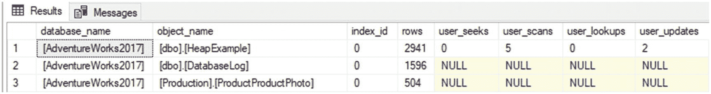

图 14-14 识别堆表的查询输出

```
SELECT QUOTENAME(DB_NAME()) AS database_name,
QUOTENAME(OBJECT_SCHEMA_NAME(we.object_id)) + '.' + QUOTENAME(OBJECT_NAME(we.object_id)) AS object_name,
we.index_id,
p.rows,
SUM(h.user_seeks) AS user_seeks,
SUM(h.user_scans) AS user_scans,
SUM(h.user_lookups) AS user_lookups,
SUM(h.user_updates) AS user_updates
FROM sys.indexes we
INNER JOIN sys.partitions p ON we.index_id = p.index_id
AND we.object_id = p.object_id
LEFT OUTER JOIN IndexingMethod.dbo.index_usage_stats_history h ON p.object_id = h.object_id
AND p.index_id = h.index_id
WHERE type_desc = 'HEAP'
GROUP BY we.index_id,
p.rows,
we.object_id
ORDER BY p.rows DESC;
```
清单 14-33 识别堆表的查询

### 重复索引

下一个需要审查的架构问题是重复索引。除了少数情况外，数据库中无需存在重复索引。它们浪费空间，并耗费资源进行维护，却没有任何益处。要确定一个索引是否是另一个的副本，请检查索引的键列和包含列。如果这些值匹配，则认为该索引是重复的。

要发现重复索引，`sys.indexes`视图与`sys.index_columns`目录视图结合使用。使用清单 14-34 中的代码比较这些视图，将提供重复索引的列表。查询结果如图 14-15 所示，显示在`AdventureWorks2017`数据库中，索引`AK_Document_rowguid`和`UQ__Document__F73921F7C5112C2E`是重复的。

发现重复项后，应从数据库中删除这两个索引之一。虽然其中一个索引会有活动，但删除任一索引都会将活动转移到另一个索引。在删除任一索引之前，请检查索引的非列属性，以确保不会丢失索引的重要方面。例如，如果其中一个索引被指定为唯一，请确保保留的索引仍具有该属性。

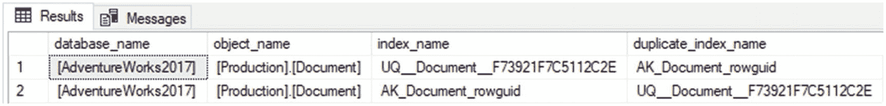

图 14-15 识别重复索引的查询输出

```
USE AdventureWorks2017;
GO
WITH IndexSchema
AS (SELECT we.object_id,
we.index_id,
we.name,
ISNULL(we.filter_definition, '') AS filter_definition,
we.is_unique,
(
SELECT QUOTENAME(CAST(ic.column_id AS VARCHAR(10)) + CASE
WHEN ic.is_descending_key = 1 THEN '-'
ELSE '+' END,
'('
)
FROM sys.index_columns ic
INNER JOIN sys.columns c ON ic.object_id = c.object_id
AND ic.column_id = c.column_id
WHERE we.object_id = ic.object_id
AND we.index_id = ic.index_id
AND is_included_column = 0
ORDER BY key_ordinal ASC
FOR XML PATH('')
) + COALESCE((
SELECT QUOTENAME(CAST(ic.column_id AS VARCHAR(10)) + CASE
WHEN ic.is_descending_key = 1 THEN '-'
ELSE '+' END,
'('
)
FROM sys.index_columns ic
INNER JOIN sys.columns c ON ic.object_id = c.object_id
AND ic.column_id = c.column_id
LEFT OUTER JOIN sys.index_columns ic_key ON c.object_id = ic_key.object_id
AND c.column_id = ic_key.column_id
AND we.index_id = ic_key.index_id
AND ic_key.is_included_column = 0
WHERE we.object_id = ic.object_id
AND ic.index_id = 1
AND ic.is_included_column = 0
AND ic_key.index_id IS NULL
ORDER BY ic.key_ordinal ASC
FOR XML PATH('')
),
''
) + CASE
WHEN we.is_unique = 1 THEN 'U'
ELSE '' END AS index_columns_keys_ids,
CASE
WHEN we.index_id IN ( 0, 1 ) THEN 'ALL-COLUMNS'
ELSE COALESCE((
SELECT QUOTENAME(ic.column_id, '(')
FROM sys.index_columns ic
INNER JOIN sys.columns c ON ic.object_id = c.object_id
AND ic.column_id = c.column_id
LEFT OUTER JOIN sys.index_columns ic_key ON c.object_id = ic_key.object_id
AND c.column_id = ic_key.column_id
AND ic_key.index_id = 1
WHERE we.object_id = ic.object_id
AND we.index_id = ic.index_id
AND ic.is_included_column = 1
AND ic_key.index_id IS NULL
ORDER BY ic.key_ordinal ASC
FOR XML PATH('')
),
SPACE(0)
) END AS included_columns_ids
FROM sys.tables t
INNER JOIN sys.indexes we ON t.object_id = we.object_id
INNER JOIN sys.data_spaces ds ON we.data_space_id = ds.data_space_id
INNER JOIN sys.dm_db_partition_stats ps ON we.object_id = ps.object_id
AND we.index_id = ps.index_id)
SELECT QUOTENAME(DB_NAME()) AS database_name,
QUOTENAME(OBJECT_SCHEMA_NAME(is1.object_id)) + '.' + QUOTENAME(OBJECT_NAME(is1.object_id)) AS object_name,
is1.name AS index_name,
is2.name AS duplicate_index_name
FROM IndexSchema is1
INNER JOIN IndexSchema is2 ON is1.object_id = is2.object_id
AND is1.index_id <> is2.index_id
AND is1.index_columns_keys_ids = is2.index_columns_keys_ids
AND is1.included_columns_ids = is2.included_columns_ids
AND is1.filter_definition = is2.filter_definition
AND is1.is_unique = is2.is_unique;
```
清单 14-34 识别重复索引的查询

## 注

重叠索引查询的最初灵感来自 Paul Nielsen 在[`http://sqlblog.com/blogs/paul_nielsen/archive/2008/06/25/find-duplicate-indexes.aspx`](http://sqlblog.com/blogs/paul_nielsen/archive/2008/06/25/find-duplicate-indexes.aspx)上的博客文章。


### 重叠索引

识别重复索引后，下一步是查找重叠索引。当一个索引的键列完全或部分构成另一个索引的键列时，该索引就被视为与另一个索引重叠。在查看重叠列时，不考虑包含列；此评估的重点仅在于键列。

为了识别重叠索引，使用了相同的目录视图：`sys.indexes` 和 `sys.index_columns`。对于每个索引，其键列将使用 `LIKE` 运算符和通配符与其他索引在表上的键列进行比较。当匹配时，它将被标记为重叠索引。此检查的查询如清单 14-35 所示，在 `AdventureWorks2017` 数据库上执行的结果如图 14-16 所示。

处理重叠索引的决策不像处理重复索引那样非黑即白。为了帮助说明重叠索引，在列 `DocumentNode` 上创建了索引 `index IX_SameAsPK`。这是用于表 `Production.Document` 聚集键的同一列。然而，这个例子表明，非聚集索引也可以被视为聚集索引的重叠索引。在某些情况下，移除重叠的非聚集索引可能是可取的。实际上，聚集索引具有相同的键，并且页面的排序方式相同。我们可以在两者中找到相同的值。灰色地带在于考虑聚集索引中行的大小。如果行足够宽，仅查询聚集键时，使用非聚集索引有时会更有益。这样，我们将需要花费更多时间来分析索引。这个相同的灰色地带也适用于两个非聚集索引之间的比较。

在审查重叠索引时，还有几点需要注意。务必保留索引属性，例如索引是否唯一。另外，注意包含列。包含列在重叠比较中不被考虑。两个索引之间可能存在唯一的包含列集。请注意这一点，并在适当时合并包含列。

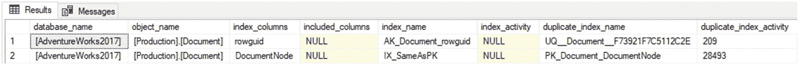

图 14-16：识别重叠索引的查询输出

```sql
WITH IndexSchema
AS (SELECT we.object_id,
           we.index_id,
           we.name,
           (
               SELECT CASE key_ordinal
                          WHEN 0 THEN NULL
                          ELSE QUOTENAME(column_id, '(')
                      END
               FROM   sys.index_columns ic
               WHERE  ic.object_id = we.object_id
                      AND ic.index_id = we.index_id
               ORDER  BY key_ordinal,
                         column_id
               FOR XML PATH('')
           ) AS index_columns_keys
    FROM   sys.tables t
           INNER JOIN sys.indexes we
                  ON t.object_id = we.object_id
    WHERE  we.type_desc IN ( 'CLUSTERED', 'NONCLUSTERED', 'HEAP' ))
SELECT QUOTENAME(DB_NAME()) AS database_name,
       QUOTENAME(OBJECT_SCHEMA_NAME(is1.object_id)) + '.' + QUOTENAME(OBJECT_NAME(is1.object_id)) AS object_name,
       STUFF((
           SELECT ', ' + c.name
           FROM   sys.index_columns ic
                  INNER JOIN sys.columns c
                         ON ic.object_id = c.object_id
                            AND ic.column_id = c.column_id
           WHERE  ic.object_id = is1.object_id
                  AND ic.index_id = is1.index_id
           ORDER  BY ic.key_ordinal,
                     ic.column_id
           FOR XML PATH('')
       ),
       1,
       2,
       '') AS index_columns,
       STUFF((
           SELECT ', ' + c.name
           FROM   sys.index_columns ic
                  INNER JOIN sys.columns c
                         ON ic.object_id = c.object_id
                            AND ic.column_id = c.column_id
           WHERE  ic.object_id = is1.object_id
                  AND ic.index_id = is1.index_id
                  AND ic.is_included_column = 1
           ORDER  BY ic.column_id
           FOR XML PATH('')
       ),
       1,
       2,
       '') AS included_columns,
       is1.name AS index_name,
       SUM(CASE
             WHEN is1.index_id = h.index_id THEN
               ISNULL(h.user_seeks, 0) + ISNULL(h.user_scans, 0) + ISNULL(h.user_lookups, 0)
               + ISNULL(h.user_updates, 0)
           END) index_activity,
       is2.name AS duplicate_index_name,
       SUM(CASE
             WHEN is2.index_id = h.index_id THEN
               ISNULL(h.user_seeks, 0) + ISNULL(h.user_scans, 0) + ISNULL(h.user_lookups, 0)
               + ISNULL(h.user_updates, 0)
           END) duplicate_index_activity
FROM   IndexSchema is1
       INNER JOIN IndexSchema is2
              ON is1.object_id = is2.object_id
                 AND is1.index_id > is2.index_id
                 AND (
                     is1.index_columns_keys LIKE is2.index_columns_keys + '%'
                     AND is2.index_columns_keys LIKE is2.index_columns_keys + '%'
                 )
       LEFT OUTER JOIN IndexingMethod.dbo.index_usage_stats_history h
                    ON is1.object_id = h.object_id
GROUP  BY is1.object_id,
          is1.name,
          is2.name,
          is1.index_id;
```
*清单 14-35：识别重叠索引的查询*

### 未索引的外键

外键对于在数据库中实施约束非常有用。当表之间存在父子关系时，外键提供了一种机制来验证子表不会引用不存在的父值。同样，外键确保父值在子值仍在使用时无法被删除。为了支持这些验证，父表和子表之间的列需要被索引。如果其中一个未被索引，SQL Server 就无法通过寻址来优化操作，而被迫使用扫描来验证相关表中是否存在这些值。

验证外键是否被索引的过程类似于重复索引和重叠索引的过程。除了 `sys.indexes` 和 `sys.index_columns` 目录视图外，还使用了 `sys.foreign_key_columns` 视图来提供外键所依赖的索引模板。这在清单 14-36 的查询中整合在一起，`AdventureWorks2017` 数据库的执行结果如图 14-17 所示。

通常的做法是，每个外键都应该始终被索引。然而，并非每个外键都是如此。在添加索引之前需要考虑几件事。首先，子表中有多少行？如果行数很少，添加索引可能不会带来性能提升。如果列的唯一性相当低，统计信息可能会证明无论是否有索引都需要扫描每一行。在这些情况下，可能会认为如果表的大小很小，索引的成本也很小，添加索引并无损失。另一个考虑是是否会从表中删除数据，以及需要验证外键的活动何时发生。对于具有许多列和外键的大表，性能可能会因为表上需要维护的又一个索引而受到影响。该索引可能具有价值，但它是否足够有价值来证明创建它是合理的？

虽然这些是索引外键时需要考虑的重要因素，但在大多数情况下，我们还是希望为外键创建索引。类似于对聚集表的建议，除非有性能文档表明索引外键会对性能产生负面影响，否则请为外键创建索引。

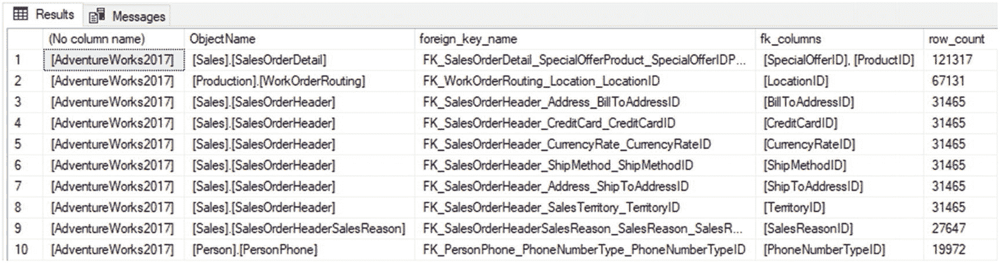

图 14-17：识别缺失外键索引的查询输出


### 未压缩索引

正如本章及本书其他部分先前所讨论的，通常对所有索引采用某种程度的压缩是有益的。使用行压缩时，索引通常将定长数据存储为变长数据，而页压缩则会检查数据并减少重复以进一步压缩。在许多情况下，数据库可以通过压缩减少到当前大小的 25%到 75%。这种大小缩减增加了 SQL Server 通过 CPU 可以处理的数据量。通常，压缩数据所增加的额外 CPU 成本，远低于处理未压缩数据量所减少的 CPU 开销。

在检查数据库中的未压缩索引时，清单 14-37 中的查询会按数据库提供每个索引的文件组、分区边界、行数和大小列表。此信息特别有用，因为它可以帮助识别最大的索引，在这些索引上压缩可能带来最大的收益。请审阅该列表并确定从哪些索引开始压缩，同时需注意是否存在如 `varchar(max)` 这样的数据类型，它们会压缩并可能导致压缩失败，如本章前面所讨论的。

```sql
WITH partitioning
AS (SELECT dds.data_space_id,
dds.partition_scheme_id,
ds.name,
dds.destination_id AS partition_number,
CASE
WHEN prv.value IS NOT NULL THEN
CONCAT(
IIF(pf.boundary_value_on_right = 1, 'Less than ', 'Greater than or equal to '),
CAST(prv.value AS VARCHAR(MAX))
)
WHEN pf.boundary_value_on_right = 1 THEN 'Greater than MAX boundary'
ELSE 'Less than MIN boundary' END AS Boundary
FROM sys.destination_data_spaces AS dds
INNER JOIN sys.partition_schemes AS ps ON ps.data_space_id = dds.partition_scheme_id
INNER JOIN sys.partition_functions AS pf ON pf.function_id = ps.function_id
INNER JOIN sys.data_spaces AS ds ON dds.data_space_id = ds.data_space_id
LEFT OUTER JOIN sys.partition_range_values AS prv ON pf.function_id = prv.function_id
AND prv.boundary_id = dds.destination_id)
SELECT S.name AS schema_name,
T.name AS table_name,
I.name AS index_name,
I.index_id,
P.partition_number,
P.data_compression_desc,
I.type_desc,
IIF(DS.type_desc = 'PARTITION_SCHEME', PS.name, DS.name) AS file_group,
PS.Boundary AS partition_boundary,
DS.type_desc AS data_space_type,
P.rows,
CAST(dps.reserved_page_count * CAST(8 AS FLOAT) / 1024\. AS DECIMAL(20, 3)) AS mb_size
FROM sys.tables AS T
INNER JOIN sys.schemas AS S ON S.schema_id = T.schema_id
INNER JOIN sys.indexes AS I ON T.object_id = I.object_id
INNER JOIN sys.partitions AS P ON I.object_id = P.object_id
AND I.index_id = P.index_id
INNER JOIN sys.dm_db_partition_stats AS dps ON P.object_id = dps.object_id
AND P.index_id = dps.index_id
AND P.partition_number = dps.partition_number
LEFT OUTER JOIN partitioning AS PS ON I.data_space_id = PS.partition_scheme_id
AND P.partition_number = PS.partition_number
INNER JOIN sys.data_spaces AS DS ON DS.data_space_id = I.data_space_id
WHERE P.data_compression_desc = 'NONE';
GO
```
清单 14-37：用于识别未压缩索引的查询

### 注意

需要再次强调的是，DTA（数据库引擎优化顾问）是确定可添加到数据库中有用索引的好工具。虽然手动为数据库设计索引而不依赖工具可能带来更多成就感，但忽略有用的建议是不切实际的。应将 DTA 作为起点，用以发现那些若没有该工具可能需要花费数小时才能确定的索引建议。


## 数据库引擎调优顾问

`数据库引擎调优顾问 (DTA)` 在第 7 章中讨论过。在那一章，我们讨论了使用 `DTA` 的两种模式：`GUI` 界面和命令行实用程序。虽然调优查询通常是一个审查统计数据和评估执行计划的过程，但 `DTA` 提供了加速此分析的方法，它利用前一章监控过程中的跟踪文件来识别潜在有用的索引建议。这个过程能够在对生产环境影响最小的情况下完成调优，因为所有建议都源自对非生产环境的分析。

使用 `DTA` 索引分析的基本过程可以分为五个不同的步骤，如图 14-18 所示：

1.  收集工作负载。
2.  收集元数据。
3.  执行调优。
4.  考虑建议并进行审查。
5.  部署更改。

通过这个过程，我们可以在索引优化方面快速入门，并开始处理与现有性能问题相关的建议。

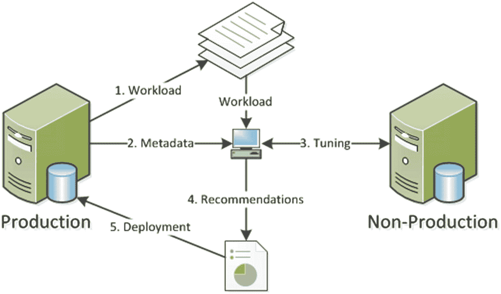

图 14-18：使用 `DTA` 索引分析的步骤。

该过程的第一步是收集工作负载。如果我们遵循了前一章索引监控过程中的步骤，我们应该已经收集了这些信息。工作负载应代表两种标准场景。首先，收集代表典型一天的工作负载，因为即使是正常的一天也可能存在潜在的性能问题，调优可以帮助缓解。其次，收集已知存在性能问题时段的工作负载。这将有助于提供我们可能通过手动调优实现的建议。

收集工作负载后，下一步是收集必要的元数据以开始调优会话。收集元数据有两个组成部分。第一是为 `dta` 会话创建一个 XML 输入文件。XML 输入文件包含生产和非生产服务器的名称，以及关于工作负载位置和要使用的调优选项类型的信息（清单 14-38 显示了一个示例）。有关调优选项的更多信息，请参见第 7 章。此步骤的第二部分是第一部分对调优的影响。当调优发生时，`SQL Server` 将从生产数据库收集数据库的架构和统计信息，并将该信息移动到非生产服务器。虽然数据库不会有生产数据，但它将拥有生成索引建议所需的信息。

```
STR8-SQL-PRD
AdventureWorks2017
c:\temp\IndexingMethod.trc
STR8-SQL-TEST 
IDX
NONE
NONE
```

清单 14-38：`DTA` 的 XML 输入文件示例。

### 注意

我们可以在 `联机丛书` 的 [`https://docs.microsoft.com/en-us/sql/tools/dta/xml-input-file-reference-database-engine-tuning-advisor?view=sql-server-ver15`](https://docs.microsoft.com/en-us/sql/tools/dta/xml-input-file-reference-database-engine-tuning-advisor%253Fview%253Dsql-server-ver15) 找到有关 XML 输入文件配置的更多信息。

下一步是实际执行 `DTA` 调优会话。要运行会话，请使用 `-ix` 命令行选项执行 `dta` 命令，如清单 14-39 所示。由于会话的所有配置信息都位于 XML 文件中，因此无需添加任何其他参数。

```
dta -ix "c:\temp\SessionConfig.xml"
```

清单 14-39：带有 XML 输入文件的 `DTA` 命令。

调优会话完成后，我们将收到一个索引建议列表。这不是此部分流程的最后一步。在实施 `DTA` 提供的任何建议之前，必须对其进行审查。虽然使用此工具将加速索引分析过程，但所有建议都需要经过审查和验证，以确保它们合理，并且不会在表上堆积超过 `SQL Server` 针对该工作负载所能支持的更多索引。

最后一步是部署索引建议。严格来说，此步骤超出了索引方法此阶段的范围。不过，此时我们应该对将要实施的索引更改很熟悉。将这些更改添加到从其他分析得出的现有索引更改列表中，并为实施做好准备，这将在下一章中讨论。

## 未使用的索引

在索引分析过程中，一个必要且可能危险的步骤是确定要删除的索引。有些索引会因为整合或因为是重复项而被删除。通常，这些索引被删除的风险低于其他索引被删除的情况。这类“其他”索引指的是那些未使用的索引。

识别未使用索引的最简单方法是检查每个数据库中的索引列表，并与 `IndexingMethod` 数据库中的 `dbo.index_usage_stats_history` 表进行对比。如果数据库中有任何未使用的索引，清单 14-40 中的查询将识别它们。关于未使用索引的一个注意事项是：在此分析中，`堆` 和 `聚集索引` 会被忽略，同样被忽略的还有任何 `唯一索引` 和 `主键`。具有这些属性的索引通常与其他业务规则相关，其删除应基于其他因素。图 14-19 显示了 `AdventureWorks2017` 数据库中未使用索引的示例。

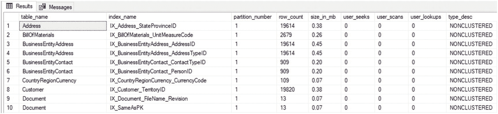

图 14-19：识别缺失外键索引的查询输出。

```
SELECT OBJECT_NAME(we.object_id) AS table_name,
       COALESCE(we.name, SPACE(0)) AS index_name,
       ps.partition_number,
       ps.row_count,
       CAST((ps.reserved_page_count * 8) / 1024\. AS DECIMAL(12, 2)) AS size_in_mb,
       COALESCE(ius.user_seeks, 0) AS user_seeks,
       COALESCE(ius.user_scans, 0) AS user_scans,
       COALESCE(ius.user_lookups, 0) AS user_lookups,
       we.type_desc
FROM sys.all_objects t
INNER JOIN sys.indexes we ON t.object_id = we.object_id
INNER JOIN sys.dm_db_partition_stats ps ON we.object_id = ps.object_id
                                          AND we.index_id = ps.index_id
LEFT OUTER JOIN sys.dm_db_index_usage_stats ius ON ius.database_id = DB_ID()
                                                   AND we.object_id = ius.object_id
                                                   AND we.index_id = ius.index_id
WHERE we.type_desc NOT IN ( 'HEAP', 'CLUSTERED' )
  AND we.is_unique = 0
  AND we.is_primary_key = 0
  AND we.is_unique_constraint = 0
  AND COALESCE(ius.user_seeks, 0) <= 0
  AND COALESCE(ius.user_scans, 0) <= 0
  AND COALESCE(ius.user_lookups, 0) <= 0
ORDER BY OBJECT_NAME(we.object_id),
         we.name;
```

清单 14-40：查询未使用索引。

虽然本节没有讨论，但还有两种识别未使用索引的场景。这些是使用率很低的索引或不再使用的索引。对于这些情况，可以使用类似的过程：不是寻找从未使用过的索引，而是过滤出使用率低的索引或在数周或数月内没有使用的索引。但不要自动删除这些索引。如果索引使用率很低，在删除它之前，请验证该索引是如何被使用的。它可能每天只使用一次，但可能与关键流程相关。同样，对于不再使用的索引，请验证它是否属于季节性流程的一部分。删除与季节性活动相关的索引可能带来的负担比仅仅在非高峰时段维护它们更大。


# 索引计划用法

在本章前面的部分，我们讨论了通过检查计划缓存来分析和调查索引使用情况的概念。虽然统计数据可以显示针对某个索引执行了查找或扫描，但它没有为我们提供足够的细节来了解应该添加哪些列，或者是什么原因导致索引使用扫描而非查找。要收集这些信息，我们需要转向执行计划。而能为你的数据库和 SQL Server 实例获取一些最佳执行计划的地方，就是计划缓存。在本节中，为了进行索引分析，我们将介绍两个可用于从计划缓存中检索执行计划的查询。

第一个查询用于我们需要检索特定索引的所有相关计划的情况。假设我们需要确定哪些进程或 T-SQL 语句正在使用表上的某个索引，而该索引每天只使用一两次。为此，我们可以使用代码清单 14-41 中的查询来查询计划缓存，并检查该查询的计划是否仍在缓存中。要使用此查询，请将变量 `@IndexName` 中的索引名称替换掉，然后执行它以返回使用该索引的计划列表。如果我们的数据库中有许多同名的索引，请务必谨慎，因为索引名称只需在表级别唯一。如果所有索引都命名为 `IX_1` 和 `IX_2`，我们将需要在搜索中验证表名，以确保我们获取的是正确的索引。

```sql
SET TRANSACTION ISOLATION LEVEL READ UNCOMMITTED;
GO
DECLARE @IndexName sysname = 'PK_SalesOrderHeader_SalesOrderID';
SET @IndexName = QUOTENAME(@IndexName, '[');
WITH XMLNAMESPACES (
DEFAULT 'http://schemas.microsoft.com/sqlserver/2004/07/showplan'
)
, IndexSearch
AS (SELECT qp.query_plan,
cp.usecounts,
ix.query('.') AS StmtSimple
FROM sys.dm_exec_cached_plans cp
OUTER APPLY sys.dm_exec_query_plan(cp.plan_handle) qp
CROSS APPLY qp.query_plan.nodes('//StmtSimple') AS p(ix)
WHERE query_plan.exist('//Object[@Index = sql:variable("@IndexName")]') = 1)
SELECT StmtSimple.value('StmtSimple[1]/@StatementText', 'VARCHAR(4000)') AS sql_text,
obj.value('@Database', 'sysname') AS database_name,
obj.value('@Schema', 'sysname') AS schema_name,
obj.value('@Table', 'sysname') AS table_name,
obj.value('@Index', 'sysname') AS index_name,
ixs.query_plan
FROM IndexSearch ixs
CROSS APPLY StmtSimple.nodes('//Object') AS o(obj)
WHERE obj.exist('//Object[@Index = sql:variable("@IndexName")]') = 1;
```

**代码清单 14-41** 查询计划缓存以获取索引用法

其他时候，仅按索引名称搜索对计划缓存来说范围太广。在这些情况下，我们可以使用代码清单 14-42 中的查询。此查询在计划缓存搜索中增加了物理运算符的名称。例如，假设我们正在调查“全表扫描/秒”，并且我们知道是哪个索引导致了该性能计数器的峰值。仅搜索索引可能会返回数十个执行计划。或者，我们可以在提供的查询中使用 `@op` 变量来添加对特定运算符（例如索引扫描）的搜索。

```sql
DECLARE @IndexName sysname = 'IX_SalesOrderHeader_SalesPersonID';
DECLARE @op sysname = 'Index Scan';
;WITH XMLNAMESPACES (
DEFAULT N'http://schemas.microsoft.com/sqlserver/2004/07/showplan'
)
SELECT cp.plan_handle,
DB_NAME(dbid) + '.' + OBJECT_SCHEMA_NAME(objectid, dbid) + '.' + OBJECT_NAME(objectid, dbid) AS database_object,
qp.query_plan,
c1.value('@PhysicalOp', 'nvarchar(50)'),
c2.value('@Index', 'nvarchar(max)')
FROM sys.dm_exec_cached_plans cp
CROSS APPLY sys.dm_exec_query_plan(cp.plan_handle) qp
CROSS APPLY query_plan.nodes('//RelOp') r(c1)
OUTER APPLY c1.nodes('IndexScan/Object') AS o(c2)
WHERE c2.value('@Index', 'nvarchar(max)') = QUOTENAME(@IndexName, '[')
AND c1.exist('@PhysicalOp[. = sql:variable("@op")]') = 1;
```

**代码清单 14-42** 查询计划缓存以获取索引用法和物理运算符

这两个查询都提供了机制，让我们能够进入环境并调查索引，确切地查看 SQL Server 如何使用它们。这些信息可以轻松利用来识别问题何时发生以及原因，从而为解决索引问题提供一条路径，而无需像现在许多人那样进行大量猜测。

# 本章小结

正如本章所示，我们可以利用从监控索引收集到的信息来分析索引，以检查和识别索引。此分析的结果有助于确定要修改的索引类型以及修改位置。诸如数据库引擎优化顾问和缺失索引 DMO 之类的索引工具可以用来发现“唾手可得的成果”，为我们提供分析的起点，这些可能原本无法发现。通过遵循本章索引分析中概述的流程，我们可以建立一个稳定、可重复的索引流程，这有助于提高数据库平台的性能，并随时间推移实现稳定的性能。

# 15. 索引方法论

在整本书中，我们讨论了索引是什么、它们的作用、构建索引的模式，以及决定 SQL Server 数据库应如何索引的许多其他方面。所有这些信息对于索引数据库的最后一部分——即管理索引的方法论——都是必要的。为此，你需要一个流程，将这些知识应用到确定最适合你环境并能带来最大性能提升的索引上。

在这最后一章中，我们将讨论一种可用于构建索引方法论的通用实践。你将了解管理索引所需的各个步骤。此方法论可以应用于单个数据库、服务器或整个 SQL Server 环境。无论数据库支持何种类型的业务操作，你都可以使用相同的方法论来构建索引。


## 索引方法

在你开始创建和删除索引之前，首先需要一个流程来分析当前和潜在的索引。这个流程需要提供一种方式来观察你的数据库，并确定哪些索引适合你的数据库。正如前面章节所提到的，索引工作应更像一门科学，而非艺术。正确索引数据库所需的信息是可得的；通过一些研究，你就可以识别出潜在的索引。类似于科学家使用科学方法来证明理论，数据库管理员和开发人员可以使用索引方法来证明数据库需要哪些索引。

本书中使用的索引方法由三个阶段组成：监控、分析和实施（见图 15-1）。每个阶段都包含若干步骤，完成后可帮助为数据库提供适当的索引。在实施阶段完成后，索引方法会重新启动第一阶段，使索引成为一个持续的、迭代的过程。

从监控阶段开始时，主要活动是观察索引。观察包括审查索引的性能和行为（即第 13 章中描述的索引概念）。SQL Server 会从可用的索引中选择它认为最有益的索引。通过观察这种行为，你可以识别出最常用的索引以及它们是如何被使用的。

观察之后，索引方法的分析阶段开始。在分析阶段（详见第 14 章），使用前一阶段收集的统计数据来确定哪些索引最适合数据库。目标是确定需要创建、删除和修改哪些索引。同时，任何索引更改的影响也会被识别出来。

索引方法的最后阶段是实施阶段。在这个阶段，上一阶段确定的索引被应用或部署到数据库中。对于每个数据库和环境，部署过程可能不同。例如，在第三方数据库上部署索引的过程与公司自有应用程序的过程就不同。不过，在此阶段内，存在适用于所有环境的核心概念；除了物理构建索引之外，你还需要沟通变更计划和变更可能带来的影响。然后，你需要跟踪随时间推移的变更情况。实施索引不仅仅是执行一条`CREATE INDEX`语句那么简单。

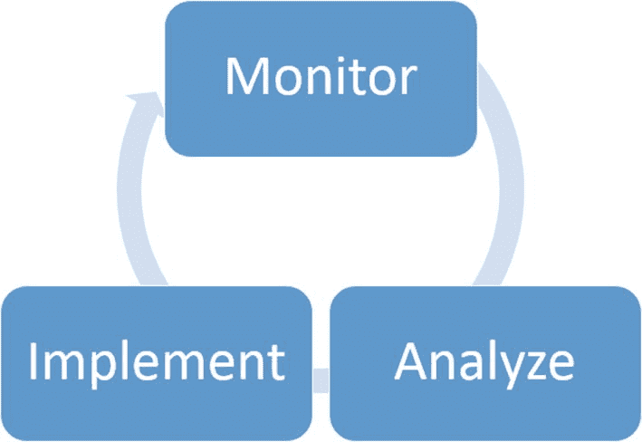

图 15-1
索引方法循环

在最后一个阶段完成后，索引方法再次从第一阶段开始。这样，索引就成了一个持续的、迭代的过程。今天能提供最佳性能的索引，明天可能就不再是最佳索引了。主要有两个事件导致需要随时间改变索引。第一个是数据使用模式，应用程序的功能和特性会随时间变化，因此应用程序的目的也可能改变。第二，数据量和数据分布会（而且通常将会）随时间变化。随着这些变化，某些索引可能会不再被使用，而可能需要其他的访问数据路径。数据变化并不是唯一可能导致索引使用情况变化的因素；未来 SQL Server 版本或服务包中的优化器改进也可能改变优化器使用索引的方式。

既然索引方法的基本原理已经介绍完毕，本章的剩余部分将重点放在实施部分。监控和分析阶段的概念分别在第 13 章和第 14 章中介绍。同样重要的是，随着你对索引了解的深入，你会发现新的模式，用于识别索引。随着你对索引和数据库的了解越来越多，你会发现其他看待性能和使用统计信息的方法，这些方法能提供更丰富或更明智的指导。请利用本书和你学到的信息，不断扩展你的索引方法论。

## 实施

索引方法的最后阶段是实施阶段。此阶段正如其名：它实施通过分析阶段确定为必要的索引变更。从流程角度看，这个阶段没有太多内容，但在实施阶段需要完成一些重要的步骤，以帮助建立一个成功的流程。整个流程的目标是改善数据库环境的性能。围绕这个目标，在实施过程中需要记住三个关键点：

*   沟通
*   源代码控制（例如，通过部署脚本）
*   执行

虽然只有最后一步会实际修改数据库，但另外两点有助于确保变更会被注意到，并且你未来能够继续使用索引方法。

### 沟通

在任何数据库上修改索引的第一个障碍是需要与管理层和数据库用户沟通你变更数据库的意图。对数据库的修改常常会引起警惕，尤其是当这些修改是由数据库所支持应用程序的非所有者提出时。在应用程序所有者和数据库管理团队之间建立并实施开放的沟通渠道，不仅有助于索引过程，也有利于其他共同关注的领域。没有这种沟通，团队可能会对索引变更措手不及，而这些变更可能会影响分析中未发现的功能，或影响计划中但尚未发布的功能。

在沟通方面，基本上需要为数据库所有者准备两项内容：索引变更的影响分析，以及变更实施后的状态报告。

#### 影响分析

在准备对数据库索引进行变更时，突出这些变更对应用程序性能的预期影响非常重要。历史上，这常常是一个猜测的过程。没有太多容易获取的信息能指明某个索引在何处被使用、如何被使用以及使用的频率。

通过监控阶段列出的流程，你能够自信地了解索引的使用情况。你可以确定它上次被使用的时间以及涉及的操作。还有一些信息可用于识别索引将不再被使用或使用频率增加的趋势。

通过分析阶段，列出了一些步骤，允许识别使用不同索引的执行计划。使用这些步骤来确定索引变更将在何处产生影响，然后在索引变更实施前后对 T-SQL 语句进行示例执行。

最终，影响分析将在实施阶段发挥两个重要作用。首先，它将向管理者和同事传达索引变更的意图，告知他们变更内容以验证正在做的事情，并让他们有机会提供反馈。其次，影响分析为索引变更可能带来的意外负面影响提供了一份保险单。这并不是说糟糕的索引建议就不会有负面影响，但有了他人的参与和记录的影响，负面影响更有可能被更快地缓解，甚至在实施前就被发现。


### 注意

在我曾工作过的一个环境中，一些较少使用的`索引`从数据库中被移除了。这些索引通常每天只使用一次。但那唯一的一次使用，却是一个对业务至关重要的导入过程，基本上没有这些`索引`就无法执行。如果在移除这些`索引`之前做了影响分析，本可以避免许多棘手的问题。

### 状态报告

在实施阶段的另一端是状态顾名思义，状态报告是一份向经理和同事提供关于`索引`变更实际影响反馈的文件。这份文件不需要非常深入，但它需要涵盖一些关键点。状态报告应包含以下信息：

*   所有已完成的`索引`变更
*   变更部署的状态
*   简要性能回顾
*   关于已注意到的任何性能回退的信息
*   在部署过程中学到的经验
*   遇到的问题总结

编写状态报告时，不要过于纠结细节。如果一切顺利，在不久的将来还会有额外的监控和分析阶段。最终，状态报告需要传达两点。第一，它提供对`索引`部署中成功与失败的诚实评估。第二，也是最重要的，它列出了通过`索引`变更现在正在实现哪些收益。这一点最为重要，因为这是管理层需要看到的`索引`工作投资回报率，以便能够证明在`索引`上所花费的时间和精力是合理的。

### 注意

作为顾问，我做过的最成功的其中一件事就是不断向客户更新我所做的`索引`变更的影响。一张显示变更前后性能对比的图表，对于我协助的一些团队来说，有时看起来像是“自我吹捧”，但聘请我来的管理层发现，这对于识别聘请顾问的投资回报率，以及向上级传达为解决业务性能问题所付出的努力，都极其有用。

### 部署脚本

分析阶段的主要交付成果是你环境中数据库计划的`索引`变更列表。在实施阶段，需要对这些`索引`进行评审并为部署做准备。作为为部署准备`索引`的一部分，需要执行三个步骤：

1.  准备数据库架构的部署和回滚方案。
2.  将`索引`变更保存到源代码控制中。
3.  分享同行评审和影响分析的结果。

#### 准备数据库架构的部署和回滚方案

通常，在分析阶段结束时，你会得到一份提议的`索引`变更列表。这个列表在阶段结束时通常还不能直接用于部署。从那时点到执行变更之间，需要将`索引`变更调整到可以用于部署的状态。

在构建部署脚本时，务必遵循“无害”原则对待数据库。换句话说，你需要构建足够智能的脚本，使得它们可以多次执行并产生相同的结果。此外，这意味着应提供脚本来撤销任何正在实施的`索引`变更。切勿假设表之前的`索引`状态已存储在源代码控制中。务必检查以确认已知现有状态，并在需要时开发脚本以恢复到该状态。

部署脚本还需要注意所使用的`SQL Server`版本。例如，如果你使用的是`Enterprise Edition`，对于需要以新特性重建的`索引`，请利用在线`索引`重建功能。如果对`索引`合适，`Enterprise Edition`还允许对`索引`进行压缩，这在许多情况下可以节省空间并提升性能。

#### 将索引变更保存到源代码仓库

如前所述，表上`索引`的当前状态应存放在源代码仓库中。如果还没有，那么在这次实施阶段迭代中，是时候这样做了。源代码仓库提供了一个存储数据库代码或架构的地方，使你的组织能够确定在特定日期时间`索引`、表或存储过程的架构是什么。从应用程序的角度来看，源代码通常管理良好。开发人员通常会快速选择一个工具并将其用于他们的应用程序。

源代码仓库允许你将数据库架构恢复到某个时间点。如果你的组织内有任何开发团队，他们很可能已经有一个期望的仓库。这可能是一个内部仓库，如`Perforce`，或一个外部可用的解决方案，如`GitHub`。

#### 包含影响分析的同行评审

在执行步骤之前要做的最后一件事是寻求对`索引`变更的同行评审。最糟糕的情况莫过于在真空中工作，不理解所提议的变更对使用数据库的应用程序的整体影响。专注于`索引`目标很容易导致视野狭隘，而忽略了当前部署的业务目标，或者忽视了在`索引`分析中不明显的一些东西。

避免这些陷阱的最佳方法是找一位同行来评审`索引`变更。向同行提供`索引`部署脚本和影响分析，并一起过一遍这些变更。你的同行不一定需要了解环境的一切，只需要对`索引`有基本了解即可。同行评审的目的是解释每一项变更。在这个对话中，你的同行充当一个共鸣板，你向其解释`索引`需求。这起到了双重作用。首先，你的同行将能够就`索引`变更提供反馈。其次，通过讨论这些变更，你可能会听到自己描述某个`索引`变更时，感觉它听起来不太对劲。

在某些环境中，你可能找不到可以求助的同行来评审`索引`。在这些情况下，考虑找你的经理进行同行评审。如果那也不可能，与你的经理谈谈利用你技术网络中的同行。利用论坛和社交网络找到一个或一群愿意与你一起评审变更的同行。使用像`Twitter`这样的社交网络联系技术同行并评审一些`索引`变更，总比完全没有同行评审要好得多。

完成同行评审后，`索引`就准备好进入实施阶段的下一个步骤：实际将`索引`应用到数据库的步骤。

### 注意

在`SQL Server`社区中，`Twitter`是较为活跃的社交网络工具之一。使用标签 `` `#sql` `` 和 `` `#sqlserver` `` 来查找关于`SQL Server`的通用信息。当寻找关于`SQL Server`的特定问题答案时，你可以使用标签 `` `#sqlhelp` ``。`Twitter`还允许你通过在推文中包含某人的`Twitter`账号来将其加入对话。例如，本书作者可以通过`Twitter`账号 `` `@stratesql` `` 联系到。


## 执行

实施阶段的最后一部分是执行 T-SQL 脚本，这些脚本将把索引变更应用到数据库。这些脚本应该已经在“部署脚本”步骤中准备好了，而变更的范围也应在“沟通”步骤中明确。因此，“执行”步骤应该是相对轻松的，因为准备工作已经完成。

从执行的角度看，执行方式完全取决于您组织的变更控制流程。在一些环境中，存在自动化流程，脚本可以加载到部署机制中并按计划执行。在其他环境中，数据库管理员只需打开 `SQL Server Management Studio` 并执行每个脚本，直到所有变更完成。无论采用何种机制，关键是在此阶段完成索引的部署。

随着部署的进行，请务必记录所做变更以及执行过程中出现的任何问题。注意数据库上意外的阻塞情况。如果索引正在以离线状态部署，请务必选择在数据库维护窗口期间执行。请记住，即使是联机索引操作也可能导致短暂的阻塞。

## 重复

在本章开头，讨论从审视“索引方法”的三个阶段开始。该过程的图示（图 15-1）展示了三个阶段处于一个无尽循环中，每个阶段都导向下一个阶段。这种布局安排是故意的。索引并非一项一劳永逸的活动。一旦完成了“索引方法”的第一轮循环，重要的是开始下一轮索引。

当数据库得到适当调优后，可能会忍不住让索引实践松懈下来，转而关注其他优先事项。不幸的是，新功能的添加频率往往与新数据添加到数据库中一样高。这两类事件都会改变数据库使用索引的方式以及当前“良好”索引状态的有效性。

为了维持数据库平台的期望性能，索引必须持续审查。这并不是说始终需要分配一个全职资源来监控、分析和实施索引。但是，确实需要接受这样一个事实：即每隔一段时间，就需要完成一次对索引状态的评估。

## 总结

正如本章所示，“索引方法”与“科学方法”非常相似。在您的数据库平台上，可以收集关于索引的统计信息，以识别可能存在索引问题的地方。然后，可以进一步利用这些统计信息来确定要修改的索引类型及其位置。可以借助诸如 `Database Engine Tuning Advisor` 和 `缺失索引 DMOs` 之类的索引工具来发现“唾手可得的成果”，为您提供一个可能原本无法发现的分析起点。通过遵循“索引方法”中列出的阶段，您可以建立一个稳定、可重复的索引流程，这有助于提高数据库平台的性能，并随时间推移实现稳定的性能。

## 索引

### A
聚合执行计划
自动维护统计信息创建预防更新

### B
平衡索引计数
最佳实践，索引 平衡索引计数 变更管理 填充因子 数据库级别 索引级别 索引外键列 在主键上使用聚集索引
二进制大对象 (BLOB)
缓冲区分配
批量更改映射 (BCM) 页

### C
CarrierTrackingNumber 列
聚集索引 递增的 外键 IDENTITY 属性 多个头行 单个头行 GUID 模式 标识列 多列 窄的 静态 代理键 唯一的 使用
列存储索引
列存储操作统计信息 头列 统计信息列
列存储物理统计信息 头列 统计信息列
计算列 执行计划 索引的计算列 `Person.Person` 查询 `STATISTICS IO`
串联 串联执行计划 移除无空格 查询 `STATISTICS IO` 移除无空格
CXPACKET

### D
数据库管理员 (DBAs)
`Database Engine Tuning Advisor` (DTA) 命令行实用工具 描述 第一个场景 场景设置 第二个场景 实用工具参数 实用工具语法
DDL 语句 部署 GUI 工具 配置屏幕 默认选择 描述 索引 选项 进度屏幕 建议 调优选项 配置屏幕 工作负荷选项 限制 元数据 PDSs 建议 调优，对工作负荷收集的影响 XML 输入文件
数据库级别 填充因子
数据转换 执行计划 查询 设置 `STATISTICS IO` 用于
数据定义语言 (DDL) `alter index` 命令 `create index` 索引选项 语法 类型 `UNIQUE` 关键字 `drop index`
数据存储 区域 混合的 一致的 页 参见 页
`DBCC PAGE` 分配 参数 打印选项 十六进制数据 十六进制行 页头 行数据 语法
`dbo.DatabaseLog`
`dbo.IndexingCounters`
碎片整理 删除并重新创建索引 重组索引 重新组织 维护计划 重建索引任务 重组索引任务 T-SQL 脚本
差异更改映射 (DCM) 页
重复索引
动态管理函数 (DMF)
动态管理对象 (DMOs) 数据清理 定义 索引操作统计信息 快照 种子填充 快照表 统计信息 索引物理统计信息 历史 种子填充 历史表 索引使用情况统计信息 监控步骤 快照 种子填充 快照表 统计信息 缺失索引 优点 反馈 `included_columns` 限制 查询性能 SQL 语句 `sys.dm_db_missing_index_columns` `sys.dm_db_missing_index_details` `sys.dm_db_missing_index_groups` `sys.dm_db_missing_index_group_stats` 等待统计信息 历史 种子填充 索引相关的 快照和历史表 快照 种子填充
动态管理视图 (DMV)

### E
事件追踪 扩展事件 SQL 跟踪
扩展事件
扩展事件会话 列 创建和启动 全局字段 停止
可扩展标记语言 (XML) 优点 注意事项 创建 主索引 次要索引 `_xml:index_id` 选择性 类型

### F
填充因子 数据库级别 描述 索引级别
筛选索引
外键
转发记录指针
碎片 列存储 删除操作 插入的影响 I/O 统计信息 行组 结果集 行组 统计信息 统计信息 I/O 结果 表 准备 默认值 碎片整理 删除并重新创建索引 重组索引 重新组织 策略 事件 堆膨胀和转发 删除影响 转发记录影响 I/O 影响 I/O 统计信息 问题 连续读取 索引 I/O `NEWID()` 函数 `NEWSEQUENTIALID()` 函数 操作 删除 插入 收缩 更新 预防 数据类型化 填充因子
全文搜索 (FTS) 创建 目录 `CREATE TABLE` 和 `INSERT` 语句 键索引 种子填充 停用词列表 语法 描述 索引 目录 视图和属性

### G
全局分配映射 (GAM) 页
全局唯一标识符 (GUI)
图形用户界面 (GUI) 工具 配置屏幕 默认选择 描述 索引 选项 进度屏幕 工作负荷选项

### H
哈希索引
堆 场景 临时对象
堆表


### I

影响分析 实施阶段，索引方法 通信影响分析 状态报告 部署脚本影响分析 审查准备与回滚 源代码仓库执行 索引分配映射(IAM)页面 索引分析 部署的组件 DTA 索引计划 用法 模式发现 重复索引 堆识别 重叠索引 未索引的外键 服务器状态审查 缓冲区分配 性能计数器 等待统计信息 未使用的索引 索引优势 聚集列存储压缩 页面级 行级 DDL 参见数据定义语言(DDL) 堆元数据 非聚集概述 类型 聚集索引 列存储索引 全文搜索 哈希索引 堆表 非聚集索引 范围索引 空间索引 XML 索引 变体 筛选索引 包含列 分区索引 主键 唯一索引 索引数据库 聚集索引 参见聚集索引 列存储索引 数据仓库 指南 性能改进 统计信息 IO 结果 堆 场景 临时对象 非聚集索引 参见非聚集索引 页压缩 优势 组件 实现 输出 查询 设置 行压缩 优势 固定长度字符数据 实现 元数据更改 数值数据类型 输出 查询设置 视图 优势 注意事项 创建 查询 摘要信息 索引方法 周期 实施阶段 通信 部署脚本 执行阶段 重复过程 索引迷思 最佳实践 参见最佳实践，索引 聚集索引，物理有序记录 多列索引中的列过滤 带列的索引 删除堆 查询结果 重用数据 描述 填充因子 插入时的平均空间 重建聚集索引 表创建，聚集索引 索引要求 添加索引 数量级 无索引的表 在线索引操作 创建表 使用 ONLINE 选项创建的索引 不带 ONLINE 选项创建的索引 在非聚集索引创建上监视事件 索引输出的排序 默认聚合 执行计划 在 order 上的筛选 并行性，聚合执行计划 无序结果 主键，聚集表，堆/聚集索引 索引工具 DMF DMOs 参见动态管理对象(DMOs) DMV DTA 参见 DTA PDSs 索引级 填充因子 索引级统计信息 基数 目录视图 DBCC SHOW_STATISTICS 密度向量 直方图 统计信息头 语法 DDL 语句 查询优化 STATS_DATE 函数 sys.dm_db_stats_properties 索引维护 参见碎片；统计信息维护 索引监视 DMOs 数据清理 定义 索引操作统计信息 索引物理统计信息 索引使用统计信息 等待统计信息 事件跟踪 扩展事件会话 SQL Trace 会话 性能计数器 基线表定义 索引相关 填充计数器基线表 快照脚本 快照表 索引操作统计信息 压缩 DML 活动 头列 锁存争用 页面 I/O 锁存 页面锁存 LOB 访问 锁争用 锁升级 页锁 行锁 页分配 周期参数 SELECT 活动 转发 获取 范围扫描 单例查找 语法 索引物理统计信息 碎片统计信息 头列 参数 行统计信息 索引使用统计信息 动态管理视图 头列 系统列 用户列 user_lookups user_scans user_seeks user_updates 集成全文搜索(iFTS) 国际标准书号(ISBN) IO_COMPLETION

### J, K

JavaScript 对象表示法(JSON)

### L

大对象(LOB)页面 LCK_M_* LIKE 比较 执行计划 710 Longbrook 查询 710 CONTAINS 函数 Longbrook STATISTICS IO 710 CONTAINS 函数 Longbrook

### M

MakeValid()方法 手动维护统计信息 维护计划 方法 T-SQL 脚本 DDL 命令 存储过程 内存优化表 方面 创建 哈希索引桶 执行时间 扩展事件会话 统计信息 查询实现 插入数据 概述 范围索引 NONCLUSTERED 索引 ORDER BY 语句 显著性能 元数据 sys.column_store_dictionaries sys.column_store_segments sys.fulltext_catalogs sys.fulltext_index_columns sys.fulltext_indexes sys.hash_indexes sys.index_columns sys.indexes sys.selective_xml:index_paths sys.spatial_indexes sys.xml:indexes 最小日志记录(ML) 迷思八 堆 迷思五 表，创建

### N

自然键 停用词 非聚集索引 注意事项 覆盖索引 筛选索引 外键 包含列 交集模式 多列搜索列

### O

重叠索引

### P

页自由空间(PFS) PAGEIOLATCH_* 页面寿命预期/秒(PLE)计数器 页面 BCM 页面 引导页 数据文件页 数据页 DBCC EXTENTINFO 分配 输出列 参数 语法 DBCC IND 分配 优势 输出列 页面类型映射 参数 语法 DBCC PAGE 参见 DBCC PAGE DCM 页面 文件头页 GAM 页面 IAM 页面 索引页 LOB 页面 偏移数组 组织结构 B 树 列存储 堆 行放置 SGAM 页面 SQL Server 转发记录 页拆分 sys.dm_db_database_page_allocations 附加列 DBCC IND 输出 参数 语法 分区索引 性能计数器 性能计数器，索引分析 死锁 Forward Records/sec 计数器分析 重建堆 脚本 快照查询 FreeSpace Scans/sec 计数器分析 快照查询 Full Scans/sec 计数器分析 快照查询 Index Searches/sec 计数器分析 快照查询 Lock Waits/sec 计数器分析 快照查询 Lock Wait Time 计数器分析 索引分析 示例结果 快照查询 Page Lookups/sec 计数器分析 快照查询 Page Splits/sec 计数器分析 快照查询 性能计数器，索引监视 基线表定义 索引相关 填充计数器基线表 快照脚本 快照表 物理设计结构(PDSs) 主键，创建

### Q

查询详细信息跟踪模板 查询策略 计算列 连接 数据转换 LIKE 比较 标量函数 查询存储

### R

范围索引 重建索引任务 重组索引任务

### S

标量函数，查询策略 模式修改锁 全局分配映射(SGAM)页面 空间数据索引 调整边界框 每对象单元规则 覆盖规则 创建 GEOMETRY 列 GEOMETRY 数据类型 索引选项 初始查询和输出 MakeValid()方法 STDistance() 支持方法 用于保存 GEOMETRY 相关数据的表 邮政编码数据 最深单元规则 描述 GEOMETRY 索引存储和单元 过程 独特功能和限制 视图 空间索引 SQL Trace 会话 添加事件和列 添加筛选器 要收集的列 创建 开始 停止 统计信息维护 自动创建 内存中表 预防 更新 手动维护计划 方法 T-SQL 脚本 状态报告 STDistance() 存储过程 sys.dm_db_incremental_stats_properties sys.dm_db_index_operational_stats sys.dm_db_stats_histogram

### T

细分 T-SQL 数据定义语言(DDL) T-SQL 脚本 碎片 构建索引 碎片整理 语句 收集碎片数据 指南 识别碎片化索引 索引碎片整理脚本模板 索引碎片整理语句 属性窗口 手动维护统计信息 DDL 命令 存储过程

### U, V

用户定义类型(UDT) 未索引的外键 未使用的索引

### W

等待统计信息分析，索引监视 历史记录填充 索引相关 快照和历史表 快照填充 等待统计信息，索引分析 分析输出 分析查询 CXPACKET 定义 IO_COMPLETION LCK_M_* PAGEIOLATCH_*

### X, Y, Z

XML 索引
