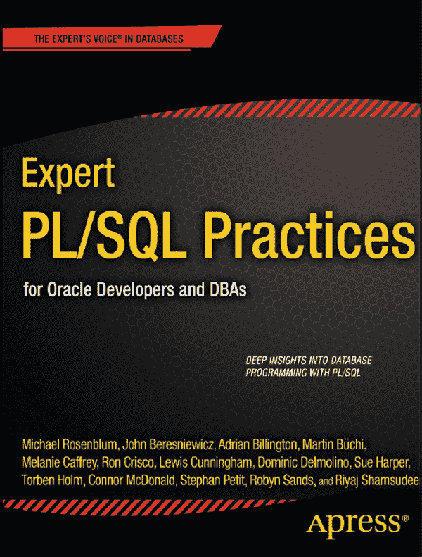
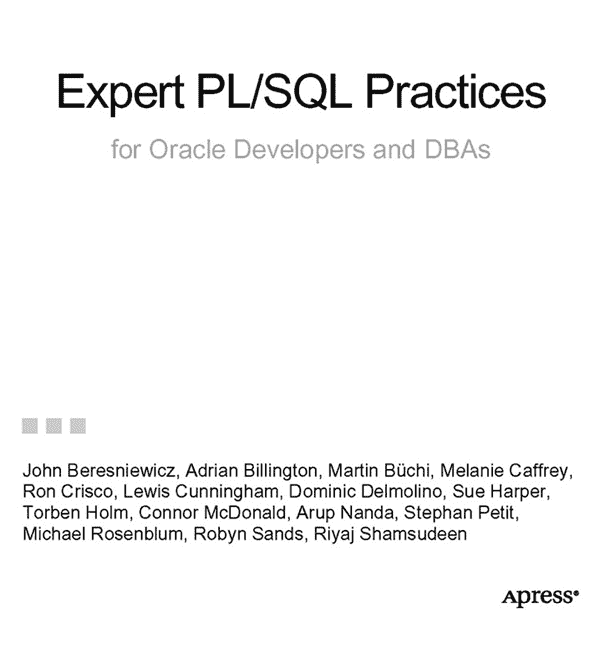

# Oracle 开发人员与 DBA 的专家级 PL/SQL 实践

 

## 版权信息

版权所有 © 2011，作者包括 John Beresniewicz, Adrian Billington, Martin Büchi, Melanie Caffrey, Ron Crisco, Lewis Cunningham, Dominic Delmolino, Sue Harper, Torben Holm, Connor McDonald, Arup Nanda, Stephan Petit, Michael Rosenblum, Robyn Sands, Riyaj Shamsudeen

保留所有权利。未经版权所有者及出版商事先书面许可，不得以任何形式或任何方式（电子或机械方式，包括影印、录音或任何信息存储和检索系统）复制或传播本作品的任何部分。

- `ISBN-13` (平装): 978-1-4302-3485-2
- `ISBN-13` (电子): 978-1-4302-3486-9

本书中可能出现商标名称、标识和图像。我们仅在编辑性描述中使用这些名称、标识和图像，旨在为商标所有者带来利益，并无意侵犯商标权。

本书中使用的商品名称、商标、服务标志及类似术语，即使未特别标明，也不应被视为表达了这些术语是否受专有权约束的观点。

## 出版团队

总裁兼出版人：Paul Manning
主编：Jonathan Gennick
技术审阅：Chris Beck, Mike Gangler, Toon Koppelaars
编辑委员会：Steve Anglin, Mark Beckner, Ewan Buckingham, Gary Cornell, Jonathan Gennick, Jonathan Hassell, Michelle Lowman, James Markham, Matthew Moodie, Jeff Olson, Jeffrey Pepper, Frank Pohlmann, Douglas Pundick, Ben Renow-Clarke, Dominic Shakeshaft, Matt Wade, Tom Welsh
协调编辑：Corbin Collins
文案编辑：Mary Behr
制作支持：Patrick Cunningham
索引编制：name?
美术设计：name?
封面设计：Anna Ishchenko

本书通过 Springer Science+Business Media, LLC. 向全球图书贸易发行，地址：233 Spring Street, 6th Floor, New York, NY 10013。电话 1-800-SPRINGER，传真 (201) 348-4505，电子邮箱 `orders-ny@springer-sbm.com`，或访问 [`www.springeronline.com`](http://www.springeronline.com)。

有关翻译信息，请发送电子邮件至 `rights@apress.com`，或访问 [`www.apress.com`](http://www.apress.com)。

Apress 和 friends of ED 的图书可批量购买用于学术、企业或推广用途。大多数图书也提供电子书版本和许可。更多信息，请参考我们的批量销售-电子书许可专页 [`www.apress.com/bulk-sales`](http://www.apress.com/bulk-sales)。

本书信息“按原样”提供，不作任何担保。尽管在本书编写过程中已采取一切预防措施，但作者及 Apress 对因本书所含信息直接或间接引起或据称引起的任何损失或损害，不向任何人或实体承担任何责任。

本书源代码可供读者在 [`www.apress.com`](http://www.apress.com) 获取。您需要回答与本书相关的问题才能成功下载代码。

## 目录

- 关于作者
- 关于技术审阅者
- 前言
-  第 1 章：不要使用
-  第 2 章：动态 SQL：处理未知
-  第 3 章：PL/SQL 与并行处理
-  第 4 章：警告与条件编译
-  第 5 章：PL/SQL 单元测试
-  第 6 章：批量 SQL 操作
-  第 7 章：了解你的代码
-  第 8 章：面向契约的编程
-  第 9 章：从 SQL 调用 PL/SQL
-  第 10 章：选择正确的游标
-  第 11 章：大规模 PL/SQL 编程
-  第 12 章：演进式数据建模
-  第 13 章：性能分析
-  第 14 章：编码规范与错误处理
-  第 15 章：依赖与失效
-  索引

## 目录

关于作者
关于技术评审
引言

## 第 1 章：禁止使用的模式

### 逐行处理
### 嵌套逐行处理
### 查询查找
### 过度访问 `DUAL`
### 日期的算术运算
### 访问序列
### 填充主从行
### 过度调用函数
### 不必要的函数执行
### 代价高昂的函数调用
### 数据库链接调用
### 过度使用触发器
### 过度提交
### 过度解析
### 总结

## 第 2 章：动态 SQL：处理未知

### 英雄登场
### 原生动态 SQL
### 动态游标
### `DBMS_SQL`
### 动态思维的示例
### 安全问题
### 性能与资源利用
### 反模式
### 动态 SQL 实现的比较
### 对象依赖
### 负面影响
### 积极影响
### 总结

## 第 3 章：`PL/SQL` 与并行处理

### 为何需要并行处理？
### 影响并行处理的定律
### 大数据的兴起
### 并行处理 vs. 分布式处理
### 并行硬件架构
### 明确你的目标
### 加速比
### 向上扩展
### 并行度
### 适合并行处理的工作负载
### 并行性与 OLTP
### 并行性与非 OLTP 工作负载
### `MapReduce` 编程模型
### 在转向 `PL/SQL` 之前
### 可用于并行活动的进程
### 为 `MapReduce` 使用并行执行服务器
### 流水线表函数
### 指导原则
### 并行流水线表函数总结
### 总结

## 第 4 章：警告与条件编译

### `PL/SQL` 警告
### 基础
### 使用警告
### 将警告提升为错误
### 忽略警告

编译与警告

关于警告的最终说明

条件编译

基础

代码的哪个部分在运行？

预处理代码的好处

失效

控制编译

查询变量

关于条件编译的最终说明

总结

第 5 章：PL/SQL 单元测试

为什么要测试你的代码？

什么是单元测试？

调试还是测试？

你应该在什么时候构建测试？

构建单元测试的工具

utPLSQL：与命令行代码协同工作

Quest Code Tester for Oracle

Oracle SQL Developer

准备和维护单元测试环境

创建单元测试仓库

维护单元测试仓库

导入测试

构建单元测试

使用单元测试向导

创建第一个实现

添加启动和拆卸流程

收集代码覆盖率统计信息

指定参数

添加流程验证

保存测试

调试和运行测试

拓宽测试范围

创建查找值

播种测试实现

创建动态查询

支持的单元测试功能

运行报告

创建组件库

导出、导入和同步测试

构建测试套件

从命令行运行测试

总结

第 6 章：批量 SQL 操作

五金店

本章示例的设置

PL/SQL 中的批量操作

开始使用批量获取

三种集合风格的数据类型

我为什么要费这个劲？

监控批量收集的开销

重构代码以使用批量收集

批量绑定

开始使用批量绑定

## 第六章相关章节

衡量批量绑定性能（`#Chapter06.html#measuring_bulk_binding_performance`）

监控内存使用（`#Chapter06.html#monitoring_memory_usage`）

11g 中的改进（`#Chapter06.html#improvements_in_11g`）

使用批量绑定进行错误处理（`#Chapter06.html#error_handling_with_bulk_bind`）

使用批处理保存异常（`#Chapter06.html#save_exceptions_with_batches`）

LOG ERRORS 子句（`#Chapter06.html#log_errors_clause`）

健壮的批量绑定（`#Chapter06.html#robust_bulk_bind`）

大型集合的合理性（`#Chapter06.html#a_justification_for_massive_collections`）

真正的好处：客户端批量处理（`#Chapter06.html#the_real_benefit_client_bulk_processing`）

小结（`#Chapter06.html#summary5`）

## 第七章：了解你的代码

 第七章：了解你的代码（`#Chapter07.html#ch7`）

本章将（及不会）涵盖的内容（`#Chapter07.html#what_this_chapter_will_and_will_not_cover`）

自动化代码分析（`#Chapter07.html#automated_code_analysis`）

静态分析（`#Chapter07.html#static_analysis`）

动态分析（`#Chapter07.html#dynamic_analysis`）

何时分析？（`#Chapter07.html#when_to_analyze`）

执行静态分析（`#Chapter07.html#performing_static_analysis`）

数据字典（`#Chapter07.html#the_data_dictionary`）

PL/SCOPE（`#Chapter07.html#plscope`）

执行动态分析（`#Chapter07.html#performing_dynamic_analysis`）

DBMS_PROFILER 和 DBMS_TRACE（`#Chapter07.html#dbms_profiler_and_dbms_trace`）

DBMS_HPROF（`#Chapter07.html#dbms_hprof`）

小结（`#Chapter07.html#summary6`）

## 第八章：面向契约编程

 第八章：面向契约编程（`#Chapter08.html#ch8`）

契约式设计（`#Chapter08.html#design_by_contract`）

软件契约（`#Chapter08.html#software_contracts`）

基本契约元素（`#Chapter08.html#basic_contract_elements`）

断言（`#Chapter08.html#assertions`）

参考文献（`#Chapter08.html#references`）

实现 PL/SQL 契约（`#Chapter08.html#implementing_plsql_contracts`）

基本的 ASSERT 过程（`#Chapter08.html#basic_assert_procedure`）

标准包本地 ASSERT（`#Chapter08.html#standard_package-local_assert`）

使用 ASSERT 强制执行契约（`#Chapter08.html#enforcing_contracts_using_assert`）

一项额外的改进（`#Chapter08.html#an_additional_improvement`）

面向契约的函数原型（`#Chapter08.html#contract-oriented_function_prototype`）

示例：测试奇数和偶数（`#Chapter08.html#example_testing_odd_and_even_integers`）

有用的契约模式（`#Chapter08.html#useful_contract_patterns`）

非空 IN / 非空 OUT（`#Chapter08.html#not-null_in_not-null_out`）

函数返回非空（`#Chapter08.html#function_return_not-null`）

函数返回 BOOLEAN 非空（`#Chapter08.html#function_return_boolean_not-null`）

检查函数：返回 TRUE 或 ASSERTFAIL（`#Chapter08.html#check_functions_return_true_or_assertfail`）

无错误代码的原则（`#Chapter08.html#principles_for_bug-free_code`）

严格断言先决条件（`#Chapter08.html#assert_preconditions_rigorously`）

无情地模块化（`#Chapter08.html#modularize_ruthlessly`）

采用基于函数的接口（`#Chapter08.html#adopt_function-based_interfaces`）

在 ASSERTFAIL 时崩溃（`#Chapter08.html#crash_on_assertfail`）

回归测试你的后置条件（`#Chapter08.html#regression_test_your_postconditions`）

避免正确性-性能权衡（`#Chapter08.html#avoid_correctness-performance_tradeoffs`）

Oracle 11g 优化编译（`#Chapter08.html#oracle_11g_optimized_compilation`）

小结（`#Chapter08.html#summary7`）

## 第九章：从 SQL 调用 PL/SQL

 第九章：从 SQL 调用 PL/SQL（`#Chapter09.html#ch9`）

在 SQL 中使用 PL/SQL 函数的成本（`#Chapter09.html#the_cost_of_using_plsql_functions_in_sql`）

上下文切换（`#Chapter09.html#context-switching`）

执行次数（`#Chapter09.html#executions`）

次优的数据访问（`#Chapter09.html#suboptimal_data_access`）

优化器困难（`#Chapter09.html#optimizer_difficulties`）

读一致性陷阱（`#Chapter09.html#the_read-consistency_trap`）

其他问题（`#Chapter09.html#other_issues`）

降低 PL/SQL 函数的成本
透视感
使用 SQL 替代方案
减少执行次数
辅助 CBO
调整 PL/SQL
小结

 第 10 章：选择正确的游标
显式游标
显式游标的剖析
显式游标与批量处理
REF 游标简介
隐式游标
隐式游标的剖析
隐式游标与额外获取理论
静态 REF 游标
游标变量限制清单
客户端与 REF 游标
关于解析的几句话
动态 REF 游标
示例与最佳用途
SQL 注入的威胁
描述 REF 游标列
小结

 第 11 章：大型 PL/SQL 编程
作为基于 PL/SQL 的应用服务器的数据库
案例研究：Avaloq 银行系统
在数据库中使用 PL/SQL 实现业务逻辑的优势
数据库作为基于 PL/SQL 的应用服务器的局限
软性因素
大型编程的要求
通过约定实现一致性
缩写
PL/SQL 标识符的前缀和后缀
代码与数据的模块化
将包及相关表作为模块
包含多个包或子模块的模块
模式作为模块
模式内的模块化
跨模式与模式内的模块化
使用 PL/SQL 进行面向对象编程
使用用户定义类型进行面向对象编程
使用 PL/SQL 记录进行面向对象编程
评估
内存管理
测量内存使用量
集合
小结

 第 12 章：演进式数据建模
二十年系统开发的经验教训
数据库与敏捷开发

