# Oracle SQL Developer

Oracle SQL Developer 是一款免费产品，支持 PL/SQL 单元测试。Oracle SQL Developer 单元测试功能最早在 SQL Developer 2.0 版本中引入，现已提供市面上其他工具的大部分功能；在 Oracle 资料库的支持下，它允许用户构建和保存测试。任何有权限的用户都可以运行这些测试，您还可以通过命令行运行测试和测试套件，从而将其集成到常规的构建流程中。Oracle SQL Developer 提供了一系列报告，可随时运行以审查测试结果。它还允许您收集代码覆盖率统计数据，以便确定已编写的代码有多少已被测试。

 **注意** Oracle SQL Developer 3.0 可从 Oracle 技术网络免费下载，网址为 [`www.oracle.com/technetwork/developer-tools/sql-developer`](http://www.oracle.com/technetwork/developer-tools/sql-developer)。

了解如何将单元测试集成到开发生命周期中的最佳方式是查看一些示例。本章的其余部分将使用 Oracle SQL Developer 3.0 来构建单元测试，以展示创建单元测试以改进代码的强大功能；所有说明都与该产品相关。

### 准备和维护单元测试环境

Oracle SQL Developer 使用一个中央资料库，所有有权限的用户都可以在其中存储、共享和重用单元测试。在开始创建测试之前，您需要使用资料库向导创建单元测试资料库。该向导通过向资料库所有者授予所有必需的权限并运行脚本来创建构成资料库的对象，从而创建资料库。

在运行向导之前，您需要识别或创建一个将成为单元测试资料库所有者并对其进行管理的用户。最好为此创建一个新用户，以便仅将您的单元测试信息存储在此处。您只需创建该用户并授予其基本连接权限，如下例所示，因为向导会授予所有额外必需的权限：

```sql
CREATE USER repos_owner IDENTIFIED BY repos_owner;
GRANT CREATE SESSION to repos_owner;
```

在运行资料库向导时，您还需要访问 `SYS` 的权限。使用 SQL Developer 为 `SYS` 和新用户创建数据库连接。

要创建连接，请确保“连接”导航器已打开，选择“连接”节点，右键单击以调用上下文菜单，然后选择`新建连接`；这将调用如图 5-1 所示的对话框。

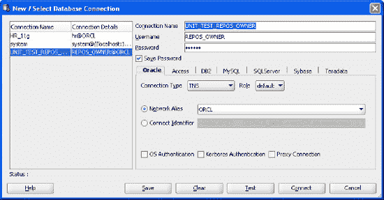

**图 5-1.** 创建或更新数据库连接

### 创建单元测试资料库

要创建资料库，请选择`工具`  `单元测试`  `选择当前资料库`，如图 5-2 所示。这将调用一个连接对话框并选择数据库连接——在本例中是为新创建的用户选择。如果不存在资料库，Oracle SQL Developer 资料库向导将提示您为所选连接创建新资料库。

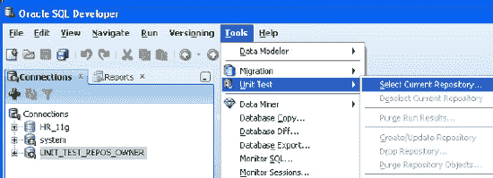

**图 5-2.** 创建或选择单元测试资料库

您可以在单个实例中拥有多个资料库，因此向导需要验证新资料库用户所需的角色是否已存在于实例中。如果角色可用，则无需重建它们。如果不可用，则必须创建所需的角色。一旦您启动该过程，向导将通过一系列对话框提示您每组要求。在每种情况下，向导都会显示语法，以便您可以查看并决定是否继续。在此阶段，系统还会提示您输入 `SYS` 密码。

最初，向导会验证资料库所有者是否拥有正确的权限；如果没有，则授予以下权限：

```sql
GRANT CONNECT, RESOURCE, CREATE VIEW TO "REPOS_OWNER";
```

之后，向导授予用户访问以下必需角色的权限：

```sql
GRANT SELECT ON dba_roles TO repos_owner;
GRANT SELECT ON dba_role_privs TO repos_owner;
```

最后，如果单元测试角色不可用，向导将显示以下语法来创建角色并授予其余必需的权限：

```sql
CREATE ROLE ut_repo_administrator;
CREATE ROLE ut_repo_user;
GRANT CREATE PUBLIC SYNONYM,DROP PUBLIC SYNONYM TO ut_repo_administrator;
GRANT SELECT ON dba_role_privs TO ut_repo_user;
GRANT SELECT ON dba_role_privs TO ut_repo_administrator;
GRANT SELECT ON dba_roles TO ut_repo_administrator;
GRANT SELECT ON dba_roles TO ut_repo_user;
GRANT SELECT ON dba_tab_privs TO ut_repo_administrator;
GRANT SELECT ON dba_tab_privs TO ut_repo_user;
GRANT EXECUTE ON dbms_lock TO ut_repo_administrator;
GRANT EXECUTE ON dbms_lock TO ut_repo_user;
GRANT ut_repo_user TO ut_repo_administrator WITH ADMIN OPTION;
GRANT ut_repo_administrator TO "REPOS_OWNER" WITH ADMIN OPTION;
```

依次接受每个对话框以授予权限并创建资料库。创建完成后，您可以使用`工具`  `单元测试`  `选择当前资料库`来选择该资料库。

### 维护单元测试资料库

资料库构建完成后，通过选择`视图`  `单元测试`菜单浏览单元测试导航器。这将打开一个导航器，您可以在其中执行以下操作：

*   浏览单元测试库。
*   创建可重用的查找值。
*   运行报告以审查所有测试运行。
*   构建单元测试套件。
*   创建单元测试和单元测试实现。

您现在可以使用单元测试菜单维护您的资料库，如图 5-3 所示。

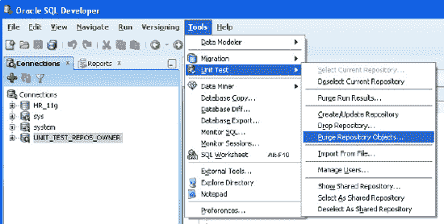

**图 5-3.** 管理单元测试

SQL Developer 3.0 提供了清除运行结果的选项。根据您运行测试的频率，尤其是在刚开始熟悉该工具时，您最终可能会积累大量运行结果，因此能够清除所有结果非常有用。还有一个进一步的选项，您可以在结果的上下文菜单中找到，它允许您删除不同日期之间的一组结果。

 **注意** `清除运行结果`（删除所有已运行测试的结果）与`清除资料库对象`（同时删除测试本身）是有区别的！

### 导入测试

当您有一组测试后，可以将它们导出到文件，并将其置于版本控制之下作为备份，或将其包含在项目交付成果中。将测试导出到文件还允许您将其导入其他单元测试资料库（有关导入和导出测试的更多信息将在后面介绍）。


### 构建单元测试

让我们从为一个简单的 PL/SQL 代码片段构建单元测试开始。我已经从代码体中移除了任何有趣的逻辑，因为我想专注于参数输入和测试构建，因此清单 5-1 中的示例代码只是一个过程的骨架，它期望接收一个参数。通过此示例，你将了解如何创建一个测试、测试的组成部分以及如何运行测试；通过扩展此示例，你将了解如何扩展测试能力。

**清单 5-1.** 单元测试的骨架代码

```sql
CREATE OR REPLACE PROCEDURE simple_parameter
 (p_x in NUMBER)
 AS
BEGIN
   NULL;
   -- 在此处添加有用的 PL/SQL 代码
END simple_parameter;
```

许多过程都期望输入参数，因此编写一个测试，在其中可以传入一系列参数或值，并确保它们都产生正确的结果，这一点很重要。通过编写单元测试，你可以提供各种各样的测试值，并随着时间的推移更改和增加这些值。

要创建该过程，请打开一个新的 SQL 工作表并执行代码。对于这些示例，我使用一个与仓库所有者不同的数据库用户，名为 `repos_user`。请确保该过程编译成功并且你可以运行它。一旦你有了一个成功编译的过程，就可以开始了。

#### 使用单元测试向导

开始创建单元测试最直接的方式是从“连接”导航器中的过程或函数列表直接操作。在 SQL Developer 中打开“连接”导航器，展开你为用户创建的连接，并找到你想要测试的 PL/SQL 程序单元。对于此示例，在你执行了创建过程的代码后，展开 `Procedures` 节点。

找到并选中正确的过程，右键单击调出上下文菜单，然后选择 `创建单元测试`。这将调出你用来创建所有测试的单元测试向导。该向导引导你完成测试执行时各个阶段的创建。因为你正在处理一个 PL/SQL 骨架，它只期望一个参数且不执行任何其他操作，所以不需要额外的设置或验证，因此你可以接受默认的测试名称 `SIMPLE_PARAMETER`，选择“使用单一虚拟实现创建”选项，并单击 `完成`。

你现在已经创建了你的第一个测试。选择 `视图`  `单元测试` 菜单调出单元测试导航器，展开 `测试` 节点，然后选择你的测试。你现在可以查看测试的完整结构和测试组件。

#### 创建第一个实现

一个 Oracle SQL Developer 单元测试包含一个或多个实现。如果你展开你的测试，你将看到单元测试向导创建的第一个实现。你可以为一个单元测试创建任意数量的实现，每个实现都有自己的参数集和预期结果。使用单元测试向导，你可以从创建单个实现开始，也可以为测试预置多个实现。对于这两种情况，你都可以在测试向导完成后继续添加实现。只需在测试名称上右键单击，然后从上下文菜单中选择 `添加实现`。这个单一的默认实现期望为每个输入参数提供一个值，你可以在向导中创建实现时添加，也可以在向导完成后添加。在图 5-4 中，`测试实现 1` 部分中的输入参数为 null，等待被填充。

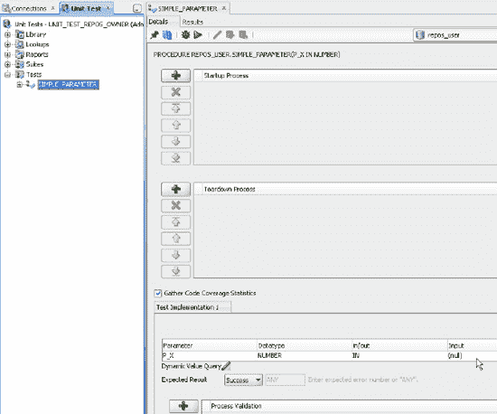

**图 5-4.** 单元测试详情

利用图 5-4，下一节将根据 `详细信息` 选项卡中列出的内容，回顾单元测试的组成部分。

#### 添加启动和拆除过程

构建单元测试的主要优势之一是你可以运行并重新运行它们。你无法以完全相同的方式手动测试你的过程。如果你有一个会更改数据值、可能向表中插入行或更新表中记录的过程，这一点尤其重要；运行和重新运行它会持续更改数据。你需要能够在再次运行代码之前将环境或数据重置回起始点。启动过程的目的是评估当前状况；例如，你在测试执行该过程之前，为表和数据制作一个备份副本。然后你可以运行测试，从而运行该过程，让它按设计进行更新，然后运行拆除过程。拆除过程旨在重置或恢复状态，例如将表和数据返回到执行过程之前的状态。

此示例中的过程不会更新或影响任何数据，因此不需要启动或拆除过程，因此它们是空的。如果你只有一个测试，你可以在测试运行前后有启动和拆除过程。你可以向一个单元测试添加多个启动和拆除过程。你也可以向一个测试套件添加多个测试。在这种情况下，可以将所有启动和拆除过程移到顶层，这样你就可以在套件开始之前通过运行所有启动过程来准备环境。然后你运行测试套件，拆除过程在结束时将情况恢复到正常状态。这取决于过程本身、你正在开发的内容以及一个测试可能对下一个测试产生的影响。

#### 收集代码覆盖率统计

收集代码覆盖率数据是一个好主意，尤其是随着项目中过程或函数数量的增长。你可以确定有多少代码以及你正在测试其中的多少。你可能有一个 100% 成功的测试，但如果它只测试了过程的 10%，那么你很难称其为有用的测试。所有收集到的代码覆盖率统计信息都可在 `测试运行` 和 `套件运行` 代码覆盖率报告中找到，你可以在单元测试导航器的 `报告` 节点中找到它们。


#### 指定参数

使用`测试实现`部分中的`参数网格`来添加或更新过程或函数预期的输入参数。您可以在逐步完成`单元测试向导`的过程中添加这些输入值，也可以在运行测试前于`详细信息选项卡`中手动添加。向导会创建参数列表，这些参数派生自过程或函数中列出的输入参数。

图 5-5 展示了`单元测试向导`的参数页面。在这里，您可以看到可以使用静态输入值或`动态值查询`。通过`动态值查询`，您可以使用或查询一个值表，而不是硬编码一个值。单元测试会查询该表，并将结果传递回过程，依次使用每个值或值集合作为过程的输入参数。像本例中那样添加一个单一值来验证测试是否正常工作，是一个有用的起点，但您并未充分利用自动化测试的强大功能。再次强调构建单元测试的优势：您不仅可以自动化该过程，还可以使用`动态值查询`为单次测试运行传入更广泛的测试值集。此外，通过使用值表，您可以更改和更新表中的值，从而为测试传入一组不同的值，而无需更新测试本身。

过程执行的`预期结果`可能是成功或失败，您可以针对任一结果进行测试。在本例中，您期望成功的结果。如果您测试的是失败，那么预期结果就是失败，您可以在此处添加失败或错误编号。这种情况下，当您运行测试并遇到预期的错误时，测试即视为成功，最终报告将返回成功！

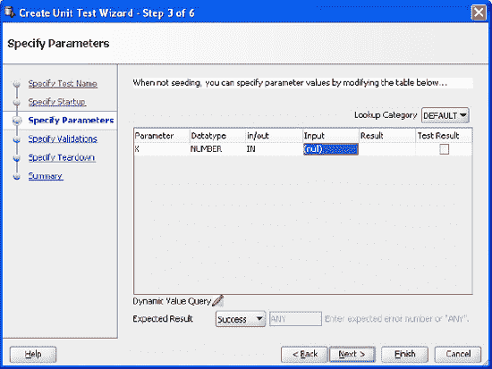

**图 5-5.** 向测试实现添加参数

#### 添加过程验证

测试详细信息页面的最后部分是过程验证。过程的执行通常会导致状态变更，无论您是更新表中的记录还是计算一个值。在这些情况下，您可以提供对预期结果的验证。图 5-6 提供了可能的过程验证类型列表。例如，如果您正在更新表中的列值，您可能希望验证没有任何值超过某个特定金额。您可以通过针对该表编写一个 `select` 语句并使用“查询不返回任何行”选项来验证这一点。在传入一组参数的情况下（允许过程为每个参数运行多次），您可能希望验证每次过程运行都通过所需的条件。

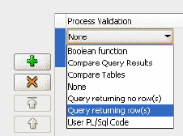

**图 5-6.** 选择过程验证

#### 保存测试

一旦您运行了`单元测试向导`，测试及其实施即被保存到`单元测试存储库`中。您所做的任何更改，例如更改输入参数或从静态值切换到动态查询值，都需要在运行测试前保存到存储库中。如果您进行了更改然后尝试运行测试，`SQL Developer`会提示您保存这些更改。

#### 调试和运行测试

您可以通过两种方式运行测试：从命令行，或使用图 5-7 所示的`单元测试详细信息`窗口。要在工具内部运行测试，请点击绿色的运行按钮或使用 `F9`。

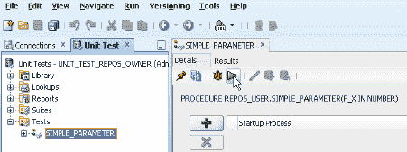

**图 5-7.** 运行测试

测试结果会发送到`结果选项卡`；您可以先在那里进行初步查看，之后再查看测试报告。

我发现先调试测试再运行它很有用，因为这可以暴露在运行测试前您可能忽略的任何问题。例如，如果您忘记添加任何输入参数，这会在调试窗口中被标记出来，如图 5-8 所示。

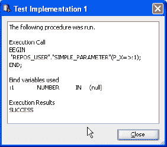

**图 5-8.** 调试窗口

### 扩展测试范围

构建单元测试的另一个优势是，一旦构建了一个测试，您可以轻松扩展它以测试各种各样的输入参数。您可以通过运行相同的测试实现并手动更改输入值来做到这一点；或者，您可以为要测试的每个值创建新的实现。如果只需要测试少数几个案例，那么向测试中添加几个额外的实现是可以的，但如果您要测试的值随时间变化，或者您想测试一长串值，那么手动添加实现就不是一个实际可行的方法了。`Oracle SQL Developer`的单元测试接受来自静态值列表和动态查询的参数值。您可以使用以下任何一种机制来添加输入参数：

*   静态查找值列表，使用下拉列表为您创建的每个测试实现填充内容。
*   静态查找值列表，根据可用值的排列动态生成实现。
*   动态查询以填充单个实现，使用查询返回的每个值作为输入参数。

接下来的章节将展示每种方式的示例，以及它们如何为您的测试增添价值。


#### 创建查找值

当你有一个小型已知数据集，或者有一套标准值集可在多个不同测试中使用时，可以使用静态查找值列表。通常，你会测试一个值的范围，包括几个极端值和中间值。因此，你可能会测试一组数字中的高值、低值和中值；或测试极端长度的字符串；或世纪之交的日期。在每种情况下，除了预期值集外，还要考虑边界情况。

要查看此静态值列表的实际应用，你可以创建一组查找值，用于与之前示例中使用的相同过程 `simple_parameter`。此过程期望一个数字作为输入参数，因此你需要创建一个静态数字列表。要创建查找值，请在单元测试导航器中展开 `Lookups` 节点。你可以创建一个新的查找类别，或使用现有的 `DEFAULT` 类别。对于本例，我建议你创建一个新类别，因为这样更容易看到非默认类别列表的影响。选中新类别后，右键单击以调用上下文菜单，单击 `Add Datatype`，然后在对话框的 `DataType` 下拉列表中选择 `Number`。现在你可以添加数字列表了。图 5-9 中有一组值的示例。添加值后，保存更改。

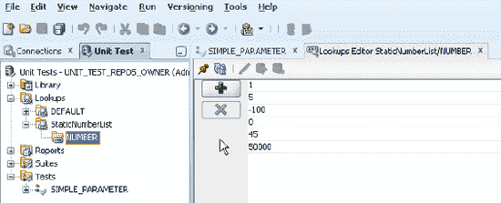

`图 5-9.` 添加静态查找值

在使用新的静态列表之前，你需要确保 SQL Developer 知晓你的列表，并确保这是新实现输入参数时默认使用的列表。为此，你需要设置单元测试参数首选项。选择 `Tools`  `Preferences` 菜单，然后单击 `Unit Test Parameters` 以显示用于设置查找配置选项。使用下拉列表，选择新类别。如果你将静态值添加到了 `DEFAULT` 类别，则无需执行此步骤，因为该类别默认显示在列表中。当你拥有许多不同类别时，此首选项非常有用。选择类别并关闭首选项对话框。

现在，你可以返回到创建的测试，选择测试，然后右键单击选择 `Add Implementation`。展开测试并选择新的实现，以在测试屏幕中显示详细信息。使用 `Lookup Category` 下拉列表，将值更改为你新的查找类别。现在，你可以使用静态列表来填充参数输入值来运行和重新运行实现，如 图 5-10 所示。

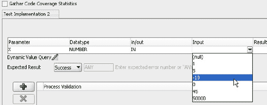

`图 5-10.` 使用静态下拉列表

#### 播种测试实现

你已经看到，可以通过手动输入或从静态下拉列表中选择来更改输入参数。你还可以使用静态列表在测试中播种多个实现。

要学习这种方法，你需要为你的过程创建一个新的测试。在单元测试导航器中选择 `Tests` 节点，右键单击调用上下文菜单，然后选择 `Create Test`。这将调用单元测试向导，比你之前看到的阶段更早，是创建测试的另一种方法。选择连接和你之前使用的过程。提供一个新的测试名称，并选择 `“Seed/Create implementations using lookup values.”`。此时你可以单击 `完成`，或跳过步骤以查看 `Specify Parameters` 屏幕。请注意，你无法在此处修改或添加任何参数，但你应该会看到你创建的查找名称显示在查找类别中；该向导使用查找中的值创建一个新的实现。完成向导并展开新测试。注意，创建的实现数量与你查找列表中的值一样多。

要看到其真正效果，请返回你的过程，添加另一个输入参数，例如 `p_y IN NUMBER`，并编译代码。你的过程现在如下所示：

```
CREATE OR REPLACE PROCEDURE simple_parameter
(
 p_x IN NUMBER,
 p_y IN NUMBER
)
 AS
BEGIN
   NULL;
   -- Add PL/SQL code to do something useful here
END simple_parameter;
```

返回单元测试导航器，并按照你刚刚完成的相同过程操作：创建一个新测试，选择 `“Seed/Create implementations using lookup values”` 并完成单元测试向导。当你展开新测试时，注意查找列表已被用于填充两个参数，因此不是像单个参数那样创建 6 个实现，而是创建了 6 × 6 个实现。这样做的好处是，你可以使用少量的静态值列表来测试广泛的数值范围。

当你运行单元测试时，每个实现都会被执行。要使用所有实现运行测试，请在单元测试导航器中选择测试，并使用右键上下文菜单来运行测试。切换到 `Results` 选项卡以查看结果，如 图 5-11 所示。注意使用的输入参数是如何组合自查找列表中创建的静态值的。

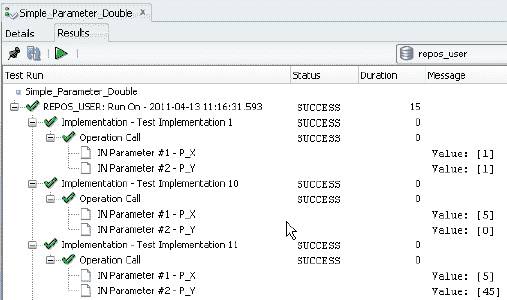

`图 5-11.` 查看播种的实现结果

#### 创建动态查询

使用静态查找列表来播种多个实现是扩展测试范围的有用方法。然而，前面提到的动态查询提供了更大的灵活性。使用查询来提供填充实现的值，意味着值集可以随时间而变化，增加或减少。

要创建动态查询，你需要有一个可以针对其运行查询的值表。例如，创建表和数据如下：

```
CREATE TABLE double_param_val
(p_val1 NUMBER(2),
p_val2 Number(5));

INSERT INTO double_param_val VALUES (2, 0);
INSERT INTO double_param_val VALUES (99, 20000);
INSERT INTO double_param_val values (0, 99999);
```

创建表后，你可以向测试添加一个新的实现。不要使用静态列表或手动添加参数，而是选择 `Dynamic Value Query` 选项。这将打开一个包含示例查询的对话框：`“select ? as P_X, ? as P_Y from ? where ?”`。重写查询以查询新的值表，如下所示：`“select p_val1 as P_X, p_val2 as P_Y from double_param_val;”`，然后保存并运行测试。请注意，对于动态查询，你只需要一个实现，即使表本身可能包含许多值。每个值或值集会依次传递给过程。当你运行测试时，`Results` 选项卡中将显示一套完整的结果，为每组输入值显示一个实现。

使用动态查询的优势在于表中的值可以变化，你可以继续添加和更新它们以测试更多选项，而无需添加额外的实现。这与静态查找值形成对比，静态查找值是为列表中的每个值创建一个实现。如果你想测试其他值，则必须添加额外的实现。

### 支持的单元测试功能

SQL Developer 还提供了许多支持创建和运行单元测试的附加功能。以下部分将介绍其中一些。


### 运行报告

创建并开始运行单元测试后，你可以运行为所有已运行测试创建的报告。报告包括以下内容：

*   用户测试运行：所有运行过测试的用户的报告。
*   代码覆盖率：运行的套件中的代码覆盖率报告和单个测试的代码覆盖率报告。覆盖率报告包括总行数以及测试覆盖的行数。
*   测试实现运行：测试和套件中运行的实现的报告。

图 5-12 展示了一组所有已运行的测试。通过选择单个报告，可以查看运行详情和代码覆盖率。

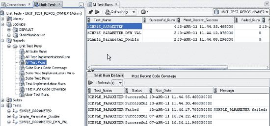

*图 5-12. 运行测试报告*

 **注意** 这些报告查询单元测试存储库中的结果，因此清除测试运行结果也会从报告中清除它们。

### 创建组件库

我之前谈到过单元测试的优势在于可重复性。如果能构建一套可重用的组件，就开始为组装更多测试建立资源。可以使用 Library 节点作为起点并在库中创建一组组件，但在创建测试时同步构建组件会容易得多。

仍然坚持使用最基础的 PL/SQL 程序，使用以下示例来构建测试，同时创建一组库组件。使用以下代码，它创建了两个表（其中一个包含数据）以及一个过程：

```
CREATE TABLE cities
  (city_id NUMBER(4,0),
   city VARCHAR2(30),
   country_abrv VARCHAR2(2)
  ) ;
```

```
CREATE OR REPLACE PROCEDURE insert_cities (
    city_id NUMBER,
    city       VARCHAR2,
    country_abrv VARCHAR2)
  IS
  BEGIN
    INSERT INTO cities (city_id, city,country_abrv)
    VALUES (city_id, city, country_abrv);
  END;
/
```

```
CREATE TABLE places
  (
    location_id NUMBER(4,0),
    city VARCHAR2(30),
    country_id  CHAR(2)
  ) ;
```

```
INSERT INTO places  VALUES (1000,'Roma','IT');
INSERT INTO places  VALUES (1100,'Venice','IT');
INSERT INTO places  VALUES (1200,'Tokyo','JP');
INSERT INTO places  VALUES (1300,'Hiroshima','JP');
INSERT INTO places  VALUES (1400,'Southlake','US');
INSERT INTO places  VALUES (1500,'South San Francisco','US');
INSERT INTO places  VALUES (1600,'South Brunswick','US');
INSERT INTO places  VALUES (1700,'Seattle','US');
INSERT INTO places  VALUES (1800,'Toronto','CA');
INSERT INTO places  VALUES (1900,'Whitehorse','CA');
```

为过程 `insert_cities` 创建一个新的单元测试。你可以从连接导航器中操作（选择该过程，右键打开上下文菜单，然后选择“创建单元测试”），或者从单元测试菜单中操作（选择测试  从上下文菜单中选择“创建测试”）。打开向导后，给测试起个名字并选择“使用单个虚拟实现创建”。

在启动过程中，你有一个选择：可以留空启动，插入记录，然后在拆卸时删除插入的记录；或者可以复制现有表，使用过程插入行，然后在拆卸中恢复状态。在本例中，添加一个新的启动，并从下拉列表中选择“表或行复制”。这将调用一个新对话框。浏览找到并选择要复制的表（本例中是 `CITIES`），然后单击“确定”返回到“启动过程”对话框。如果你只是构建单元测试而不将代码添加到库中，你会直接继续完成向导，但既然正在构建组件库，就在“发布到库”字段中添加一个名称，如图 5-13 所示，然后单击“发布”。

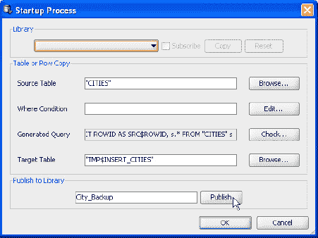

*图 5-13. 创建库组件*

发布组件后，对话框会发生变化，你将无法再编辑值。只要你选择了“订阅”复选框，这状态就一直保持。只要单元测试仍订阅此库组件，对组件进行的任何更改都会反映在使用它的测试中。一旦构建了一组组件，你就可以使用同一个对话框从库中选择它们。如果库组件完成了大部分你需要的功能，但不是全部，你可以创建一个副本然后进行修改。这些修改由你正在处理的测试使用，不会影响任何其他使用该库组件的测试。

将启动发布到库后，继续到向导的下一页。你已经看到了处理参数的不同可用选项，因此选择“动态值查询”，因为此参数选项也提供了将详细信息作为组件保存到库中的机会。添加以下查询：

```
SELECT LOCATION_ID AS CITY_ID,  CITY AS CITY,  COUNTRY_ID AS COUNTRY_ABRV
FROM PLACES
```

为了将查询发布到库中，像之前一样在“发布到库”字段中输入名称并单击“发布”。继续到“过程验证”屏幕并添加一个新的过程验证。在本例中，你需要检查是否已将行插入表中。有多种方法可以做到这一点，一种方法是查询更新后的表。在添加新的过程验证时，从下拉列表中选择**返回多行的查询**。输入以下代码：

```
SELECT CITY FROM CITIES WHERE  CITY_ID IN    
(SELECT  LOCATION_ID FROM PLACES);
```

输入查询后，给新的过程验证起个名字并将其发布到库。图 5-14 显示了将详细信息发布到库后的对话框。

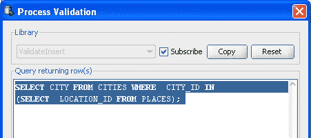

*图 5-14. 添加过程验证*

向导的最后阶段是拆卸过程。在启动过程中，你将表复制到了临时表，所以现在你需要反向操作并恢复表。重置环境的另一种方法可能是删除插入的记录。从下拉列表中选择“表或行恢复”。向导会根据你在启动过程中做出的决定，用详细信息填充拆卸过程中的字段。你也可以将这个最终组件发布到库中。通过查看摘要页面来完成向导，然后单击“完成”关闭对话框。

现在测试已完成，你可以运行它并查看结果。`CITIES` 测试表应该保持为空，因为你的测试插入了新记录然后恢复了表。你的验证过程验证了 `PLACES` 表中的记录已插入到 `CITIES` 表中。如果你想测试该过程是否确实在执行插入操作，只需删除启动和拆卸过程，重新运行测试，然后查询 `CITIES` 表。你应该会看到新插入的记录。

通过展开单元测试导航器中的 Library 节点来查看库组件，如图 5-15 所示。每个组件区域现在都有一段可重用的代码。你可以编辑和更新这些组件；你所做的任何更改都会反映在任何使用它们的测试中。

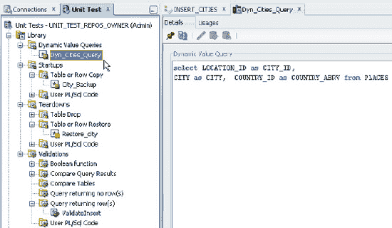

*图 5-15. 库的展开视图*

### 导出、导入和同步测试

您可以通过 `单元测试存储库` 与其他用户共享您的测试。这意味着任何有权访问 `单元测试存储库` 的用户都可以查看测试并运行它们。其他用户不仅可以查看测试，每个有权访问的用户还可以针对他们选择的数据库连接运行测试。换句话说，在有意义的情况下，您可以在开发环境和单独的缺陷测试环境中运行同一个测试。另一种方法是导出测试并在中央服务器上共享。然后其他用户可以导入这些测试。

当您最初为某个过程创建测试时，该过程所有者的详细信息会存储在测试详情中。您可以在如 图 5-16 所示的 `单元测试详情` 屏幕中看到这一点，其中列出了完全限定的过程名称。

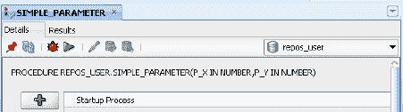

图 5-16. 显示单元测试详情

过程名称在导出测试时创建的 XML 文件中也可见。如果您导出并导入单元测试，则需要将其导入具有相同用户和过程的数据库，或者需要将测试指向新模式下的正确过程。因此，对于您想在不同数据库中针对不同用户和不同存储库测试同一过程的情况，您可以通过导出然后导入测试来实现。

要导出测试，只需右键单击测试并选择 `导出到文件`。对于导入测试，您需要使用主菜单中的 `工具` > `单元测试`，然后选择 `从文件导入`。

导入测试后，您可能需要将其与新环境同步。同步测试不仅在将测试移动到不同环境时有用，而且在您自己场景中使用的过程或函数发生变化时也很有用。例如，您可能添加或更新了输入参数。您可能需要执行同步的原因有几种。

*   测试执行的过程具有相同的参数，但顺序不同。
*   该过程与最初构建测试时所针对的过程具有不同的参数。
*   该过程存在于与最初创建时不同的模式中。

要执行同步，请选择测试，右键单击并选择 `同步测试`。现在您可以浏览以选择正确的过程，如 图 5-17 所示。

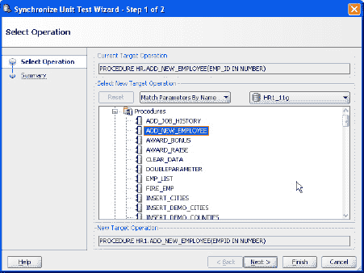

图 5-17. 同步单元测试

如果测试需要更改，这些更改会列在摘要屏幕中，如 图 5-18 所示。在此示例中，测试需要指向新模式中的过程，并且输入参数发生了变化。

 **提示** 同步测试后，请确保刷新测试详情以反映更改。您可能需要更新任何动态查询以匹配新的参数更改。

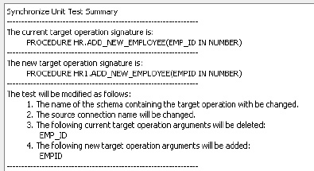

图 5–18. 同步单元测试摘要

### 构建测试套件

最终，您会希望建立一套回归测试，以便在 `SQL Developer` 环境之外运行。要创建测试套件，请选择 `套件` 节点，调用上下文菜单，然后选择 `创建套件`。您可以根据需要选择并添加任意多的测试到套件中。套件的好处在于，您只需选择套件即可运行它，并且可以将所有启动和拆解过程移动到顶层，让它们在测试开始时执行。您可以像审查单个测试的报告一样，在报告中查看套件的结果。

### 从命令行运行测试

一旦您构建了测试或测试套件，就可以从命令行运行它们，并最终将其纳入您的构建过程。要从命令行运行 `SQL Developer` 单元测试，请启动命令行会话并导航到 `\sqldeveloper\sqldeveloper\bin` 目录。

要获取有关单元测试命令行命令的帮助和详细信息，请在命令提示符下输入 `ututil`，不带任何附加参数。该工具将返回三个可用的命令选项：运行、导入或导出单元测试。要查看每个命令预期的参数，请输入查询命令 `ututil –exp ?`

一旦您知道预期的参数，就可以输入完整的命令，例如：

```
D:\Builds\SQL Dev\3.0\3.0.04.34\sqldeveloper\sqldeveloper\bin>ututil -exp -test -name SIMPLE_PARAMETER -repo UNIT_TEST_30 -file d:\working\myexptest.xml
```

您可以将完整的运行、导出或导入测试的命令构建到批处理文件中，如 图 5-19 所示，并根据需要安排它们运行。

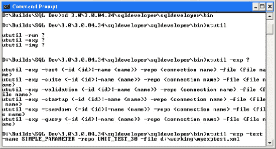

图 5-19. 从命令行导出单元测试

测试运行的结果像之前一样写入存储库，因此您可以在 `测试` 或 `套件` 部分查看报告。

### 总结

单元测试是构建应用程序的关键。Java 开发人员多年来一直将单元测试作为开发过程的一部分，而 PL/SQL 开发人员则较慢地将其作为开发过程的正式组成部分。单元测试可以构成回归测试套件的一部分，并从命令行运行以支持批处理过程。本章回顾了您应该构建单元测试的原因，以及何时和为何需要将它们视为整个 PL/SQL 开发周期的一部分。以 Oracle `SQL Developer` 3.0 作为示例基础，介绍了通过添加启动过程来准备测试环境以及通过拆解过程重置环境的概念。过程和函数通常期望一个或多个输入参数，因此有一节讨论了提供静态或动态输入参数的不同可用选项，以及验证测试过程和结果的重要性。通过从命令行运行测试来自动化测试过程，意味着测试和测试套件可以被纳入通用的应用程序构建周期。通过介绍单元测试并说明使用测试框架所获得的优势，我希望您能够快速轻松地构建测试，并在开发周期中开发出健壮的代码。

