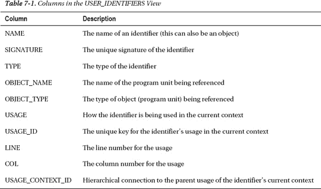

# PL/Scope 数据收集与配置

##### 收集的数据

PL/Scope 收集的数据包括标识符的名称、用法及其使用上下文。它还包括定义标识符的对象、对象类型以及使用的行和列。

用法是指标识符被使用的方式。数据类型由变量定义使用；过程可以被声明、定义和调用。以下是 PL/Scope 跟踪的用法：

*   **声明**：首次识别标识符，例如包。
*   **定义**：标识符的实现，例如包体中的过程。
*   **赋值**：更改标识符的值，例如变量或迭代器。
*   **引用**：检查标识符的值（包括引发异常）。
*   **调用**：执行标识符，例如过程、函数、游标。

 **注意** 数据类型是标识符的上下文，而不是属性，因为并非所有标识符都有数据类型。过程是标识符但没有数据类型。

`USER_IDENTIFIERS` 视图中的所有列都很重要。表 7-1 包含了视图中的列及其简要描述。



为了更好地理解用法列，你需要查看视图中的原始数据。以下是对该视图的一个示例查询。输出结果是你在自己的查询中会看到的典型情况。请注意，在你使用 PL/Scope 编译代码（下一节“配置 PL/Scope”将解释）之前，该视图将为空。

```sql
SELECT * FROM (
  SELECT object_name, name, type, usage, usage_id, usage_context_id
    FROM user_identifiers
    WHERE object_name = 'JOBS_API'
      AND object_type = 'PACKAGE BODY'
    ORDER BY line, col, usage_id)
WHERE rownum < 6; -- 保持小巧
```

```
OBJECT_NAME  NAME          TYPE         USAGE       USAGE_ID   USAGE_CONTEXT_ID
------------ ------------- ------------ ----------- ---------- ----------------------
JOBS_API     JOBS_API      PACKAGE      DEFINITION  1          0
JOBS_API     JOB_EXISTS    FUNCTION     DEFINITION  2          1
JOBS_API     JOB_TITLE     FORMAL IN    DECLARATION 3          2
JOBS_API     V_JOB_ID      VARIABLE     DECLARATION 4          2
JOBS_API     V_JOB_ID      VARIABLE     ASSIGNMENT  5          2
```

第一个用法（`USAGE_ID = 1`）是包定义。这个程序单元的上下文是 0。它是程序单元中的第一个用法，所以 `USAGE_CONTEXT_ID` 是 0。你不能在程序单元之间混合匹配用法或上下文，甚至在规范和包体之间也不行。

第二行是一个函数定义。`USAGE_ID` 是 2，上下文是 1。这意味着 `USAGE_ID` 2 是 `USAGE_ID` 1 的子项。该函数属于这个包。

第三行是一个参数，第四行是一个变量声明，第五行是对第四行定义的变量的赋值。所有这些用法都是该函数的子项，因此 `USAGE_CONTEXT_ID` 是 2（它们都位于函数体内）。

如果你有一个重载的程序单元，`SIGNATURE` 列将唯一标识正在调用的是哪个版本。签名始终是所引用标识符的签名，不一定是对象中的当前标识符。

以下查询显示，重载的过程即使名称相同，也会有不同的签名：

```sql
SELECT name, usage, signature
FROM user_identifiers
WHERE object_name = 'PLSCOPE_SUPPORT_PKG'
  AND object_type = 'PACKAGE'
  AND name = 'SOURCE_LOOKUP'
ORDER BY line, col, usage_id;
```

```
NAME                       USAGE       SIGNATURE
------------------------------ ----------- --------------------------------
SOURCE_LOOKUP              DECLARATION A633B1818ABD9AE3739E5A0B6D86EBB8
SOURCE_LOOKUP              DECLARATION 3ED2FA822BD27B5B10F44226DCB93E0E
```

##### 配置 PL/Scope

Oracle 文档指出，PL/Scope 面向应用开发人员，通常用于开发阶段。我对此持保留态度。它应该被任何编译 PL/SQL 的人使用，并且应该在你工作的任何数据库（开发、测试和生产）中使用。PL/Scope 将其数据存储在 `SYSAUX` 表空间中，占用空间非常小（所以这不应该成为问题）。运行 PL/Scope 也是一项编译时活动，而不是运行时活动，因此没有性能损失（不像开启调试编译那样）。它可能会稍微增加编译时间，但我自己并未察觉到。

PL/Scope 非常容易配置。如前所述，它是一项编译时活动，因此在编译程序单元之前启用。使用的编译器设置称为 `PLSCOPE_SETTINGS`。用户，或者更可能是用户的 IDE，将使用 `ALTER SESSION` 命令来开启 PL/Scope。你也可以通过 `ALTER SYSTEM` 全局设置，或使用 `ALTER COMPILE` 语句针对单个程序单元进行设置。下面我将展示每种方法的示例。

目前，它只有一个开启（ALL）或关闭（NONE）的开关，但将来可能会允许一些粒度控制。在 11.2 及更低版本中，默认值是 NONE。我预计随着时间的推移，ALL 会成为默认值，但这只是我的个人偏好。

要在会话级别开启 PL/Scope 收集，请使用以下命令：

```sql
ALTER SESSION SET PLSCOPE_SETTINGS = 'IDENTIFIERS:ALL';
```

要关闭标识符收集，请使用以下命令：

```sql
ALTER SESSION SET PLSCOPE_SETTINGS = 'IDENTIFIERS:NONE';
```

在系统级别开启和关闭类似。我不打算详细介绍 `ALTER SYSTEM` 命令及其存储值的方式，但一个例子可能是：

```sql
ALTER SYSTEM SET PLSCOPE_SETTINGS = 'IDENTIFIERS:ALL';
```

要编译一个带有标识符收集的对象，请使用相应的 `ALTER` 命令（`PROCEDURE`、`PACKAGE`、`TRIGGER`、`FUNCTION`、`TYPE` 等），如下所示：

```sql
ALTER PACKAGE batch_overlord COMPILE PLSCOPE_SETTINGS = 'IDENTIFIERS:ALL';
```

编译程序单元后，你可以使用视图 `USER_PLSQL_OBJECT_SETTINGS` 来查看设置，如下所示：

```sql
SQL> SELECT type, plscope_settings
     FROM user_plsql_object_settings
    WHERE name = 'EMPLOYEE_API';
```

```
TYPE         PLSCOPE_SETTINGS
------------ ---------------------------------------------------------------------
PACKAGE      IDENTIFIERS:ALL
PACKAGE BODY IDENTIFIERS:ALL
```

就是这么简单。一旦设置完成，你就可以开始使用它了。别忘了在开启 PL/Scope 的情况下重新编译你的代码。


