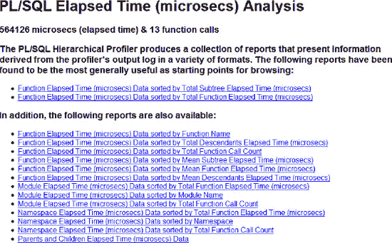
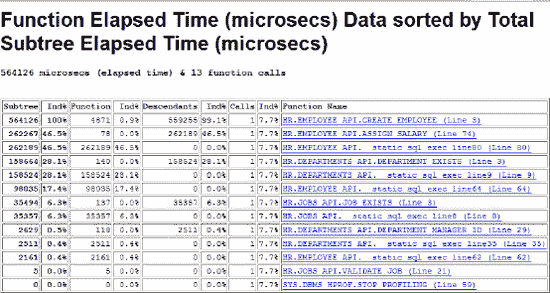
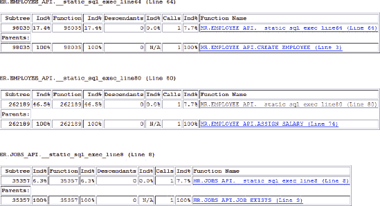

# DBMS_HPROF

`DBMS_HPROF` 是 Oracle 11g 及更高版本中用于 `PL/SQL` 代码性能分析的工具。这绝对是收集性能指标的首选工具。它提供了 `DBMS_PROFILER` 和 `DBMS_TRACE` 共同提供的所有功能，但不包含用于代码覆盖率的行信息；它更易于使用、更易于解读，并且不需要改变环境即可工作。`DBMS_HPROF` 可以轻松地在生产环境中运行，这是 `DBMS_PROFILER` 和 `DBMS_TRACE` 所欠缺的。

`DBMS_HPROF` 是一个分层分析器。它不仅告诉你什么代码运行了以及运行了多久，还提供了谁在什么顺序下调用了什么的层级上下文。你还可以比较 SQL 与 `PL/SQL` 所花费的时间（这对于性能调优至关重要）。结合正确的代码插桩，你将能够验证完整的代码覆盖率。

当运行一个分析会话时，`PL/SQL` 虚拟机会跟踪运行时信息。`DBMS_HPROF` 通过将这些信息写入操作系统文件，使其可供相关方使用。分析会话的输出称为原始输出。

原始输出是人类可读的，但不太友好。对于原始输出，你可以走两条路线。有一个名为 `plshprof` 的命令行工具，它接收原始的 `DBMS_HPROF` 输出文件，并生成包含各种性能相关信息的 `HTML` 报告。使用该工具，你甚至可以比较两个分析会话的输出（例如，代码更改前后），以查看更改如何影响了代码的性能概况。（第 13 章专门介绍了用于性能的插桩和分析，因此我将细节留给该章。）我更愿意讨论如何使用分析后的数据来编写你自己的报告。

处理原始输出的第二条路线是使用 `DBMS_HPROF` 包中的函数：`DBMS_HPROF.ANALYZE`。`ANALYZE` 函数接受几个输入参数，最重要的是原始输出的目录和文件名，并返回一个 `RUN_ID`。当 `ANALYZE` 运行时，会填充三个表，`RUN_ID` 是父表的主键。

被填充的三个表包含有关分析会话的信息、有关运行的信息以及运行会话内程序调用之间的关系。利用这些信息（暂时忽略性能信息），你可以准确地找到什么被调用了以及被谁调用。你无法直接得到的是什么没有被调用。将 `PL/Scope` 与 `DBMS_HPROF` 结合起来，你就可以找出什么没有被调用——这就是性能分析为代码覆盖率带来的价值。


## 配置 DBMS_HPROF

配置 DBMS_HPROF 只需要几个非常简单的步骤。第一步是您需要在 `DBMS_HPROF` 包上拥有 `EXECUTE` 权限。第二步是您需要对一个操作系统目录拥有读/写权限。如果您有创建目录的权限，可以创建自己的目录。如果没有，请要求您的数据库管理员（DBA）创建一个目录，并授予您 `READ` 和 `WRITE` 权限。

为了本次讨论的目的，我将以 `SYSTEM` 用户登录。在示例能够运行之前，必须执行以下 DDL 语句：

```
CREATE DIRECTORY plshprof_dir AS 'c:\temp';
GRANT READ, WRITE ON DIRECTORY PLSHPROF_DIR TO HR;
```

对于性能调优，拥有对该目录的访问权限就是您需要做的全部准备。运行 `plshprof` 实用程序（位于 `$ORACLE_HOME/bin`）来生成您的 HTML 报告并开始分析。我通常会将 HTML 输出复制到本地，并在浏览器中查看。

然而，为了理解代码并实现分析自动化，我希望将原始输出保存在数据库中，以便能够查询它。Oracle 通过三张表提供了这个功能（稍后会详细描述）。要创建这些表，您需要运行 Oracle 提供的脚本，该脚本位于 `$ORACLE_HOME/RDBMS/ADMIN` 目录下，名为 `dbmshptab.sql`。

与 `DBMS_PROFILER` 的脚本类似，您可以以应用程序用户身份运行此脚本，也可以创建一个公共的 `PROFILER` 方案。我通常倾向于拥有一个专用用户，该用户将包含数据库的所有性能分析数据；这样，您就可以将跨方案的分析会话存储在一起，便于查询，并且可以在所有数据库上创建相同的方案。这使您能够保持各实例间的一致性，从而增强了代码的可维护性。

以上就是配置 `DBMS_HPROF` 分析器所需的全部步骤。

## DBMS_HPROF 示例会话

运行分析器时，它非常类似于使用 `DBMS_TRACE` 或 `DBMS_PROFILER`。使用 `START_PROFILING` 开始分析会话，并使用 `STOP_PROFILING` 结束会话。以下会话将使用完全相同的调用来执行 `create_employee`：

```
DECLARE
  v_employee_id employees.employee_id%TYPE;
  v_runid dbmshp_runs.runid%TYPE;
  v_plshprof_dir all_directories.directory_name%TYPE := 'PLSHPROF_DIR';
  v_plshprof_file VARCHAR2(30) := 'create_employee.raw';
BEGIN
  -- 开始分析会话
  dbms_hprof.start_profiling(v_plshprof_dir, v_plshprof_file);

  -- 调用要分析的顶级过程
  v_employee_id := employee_api.create_employee(
        p_first_name => 'Lewis',
        p_last_name => 'Cunningham2',
        p_email => 'lewisc2@yahoo.com',
        p_phone_number => '888-555-1212',
        p_job_title => 'Programmer',
        p_department_name => 'IT',
        p_salary => 99999.99,
        p_commission_pct => 0 );

  -- 停止分析会话
  dbms_hprof.stop_profiling;

  -- 分析原始输出并创建表数据
  v_runid := dbms_hprof.analyze(v_plshprof_dir, v_plshprof_file);

  DBMS_OUTPUT.PUT_LINE('本次运行 ID: ' || to_char(v_runid) );

END;
```

`DBMS_HPROF.ANALYZE` 返回一个 `RUNID` 以标识特定的运行。但是，如果您需要在以后的某个时间点回溯，`DBMS_HPROF.START_PROFILING` 过程接受一个可选的 `COMMENT` 参数，这是标识特定 `ANALYZED` 运行的最简单方法。

## DBMS_HPROF 输出

`DBMS_HPROF` 跟踪各种 PL/SQL 调用，包括触发器和匿名块，以及 DML 和本地动态 SQL。它确实是一个强大的性能分析工具。`DBMS_HPROF.analyze` 会写入三张表。

- `DBMSRP_RUNS`：运行头信息。
- `DBMSHP_FUNCTION_INFO`：存储的程序详细信息和计时。
- `DBMSHP_PARENT_CHILD_INFO`：包含计时的调用层次结构。

这些表存储了生成完整跟踪报告所需的所有信息，计时精度可达到您想查看的任何详细级别。顺带一提，SQL Developer（Oracle 提供的免费 GUI IDE）原生支持 `DBMS_HPROF`。

由 `plshprof` 命令行实用程序生成的 HTML 报告是您性能优化武器库中非常强大的工具。用一堆截图来复现它们会显得很愚蠢；然而，我确实希望您了解这些报告中可用的信息。

当您运行 `plshprof` 时，它会生成一组相关的 HTML 文件。您可以在各个报告之间导航，并可以层层深入，从顶级报告钻取到更详细的级别报告。图 7-1 显示了由 `plshprof` 生成的索引页面。



**图 7-1.** `PLSHPROF` 输出 — 报告索引

从这里，点击第一个链接“Function Elapsed Time”，会打开图 7-2 所示的页面。



**图 7-2.** `PLSHPROF` 耗时报告

图 7-2 中的报告按每个调用花费的时间排序，显示了进程的总耗时。该报告是快速检查进程中时间花费在何处的便捷方法。耗时最多的调用并非巧合，正是顶级的 `CREATE_EMPLOYEE`。从该报告中，我可以点击其中一个函数调用，钻取到该特定调用的详细报告，如图 7-3 所示。



**图 7-3.** `PLSHPROF` 函数钻取

在图 7-3 中，您可以看到所示的过程都进行了静态 SQL 调用，以及 SQL 与 PL/SQL 各自花费了多少时间。通常，我宁愿运行自己的查询来获取关于运行情况的简明信息，以获得性能的快照。如果在我自己编写的查询中发现异常，那么我可以运行 HTML 报告并更深入地探究。

以下查询是一个相当简单的报告，展示了谁调用了谁以及耗时多久。我通常会将此数据与先前运行的数据进行比较；这样，我可以非常快速地了解变更对性能的影响。

```
SELECT parent_info.owner || '.' || parent_info.module || '.' ||
                   parent_info.function || '(' || parent_info.line# || ')' caller,
       child_info.owner || '.' || child_info.module || '.' ||
                   child_info.function || '(' || child_info.line# || ')' callee,
       child_info.function_elapsed_time elapsed
  FROM dbmshp_parent_child_info dpci
  JOIN dbmshp_function_info parent_info
    ON parent_info.runid = dpci.runid
  JOIN dbmshp_function_info child_info
    ON child_info.runid = dpci.runid
  WHERE dpci.runid = :HPROF_RUNID
  START WITH dpci.runid = :HPROF_RUNID
    AND dpci.childsymid = child_info.symbolid
    AND dpci.parentsymid = parent_info.symbolid
    AND parent_info.symbolid =1
  CONNECT BY dpci.runid = PRIOR dpci.runid
    AND dpci.childsymid = child_info.symbolid
    AND dpci.parentsymid = parent_info.symbolid
    AND prior dpci.childsymid = dpci.parentsymid;
```


```
`调用者                                           被调用者                                           耗时`
`---------------------------------------- ---------------------------------------- --------------------`
`..__anonymous_block(0)                           HR.EMPLOYEE_API.CREATE_EMPLOYEE(3)                    189`
`HR.EMPLOYEE_API.CREATE_EMPLOYEE(3)               HR.DEPARTMENTS_API.DEPARTMENT_EXISTS(3)               57`
`HR.DEPARTMENTS_API.DEPARTMENT_EXISTS(3)          HR.DEPARTMENTS_API.__static_sql_exec_line9(9)         473`

`HR.EMPLOYEE_API.CREATE_EMPLOYEE(3)               HR.DEPARTMENTS_API.DEPARTMENT_MANAGER_ID(29)          24`

`HR.DEPARTMENTS_API.DEPARTMENT_MANAGER_ID(29)     HR.DEPARTMENTS_API.__static_sql_exec_line35(35)       99`

`HR.EMPLOYEE_API.CREATE_EMPLOYEE(3)               HR.EMPLOYEE_API.ASSIGN_SALARY(74)                     51`
`HR.EMPLOYEE_API.ASSIGN_SALARY(74)                 HR.EMPLOYEE_API.__static_sql_exec_line80(80)          2634`
`.`
`.`
`.`
```
匿名块调用了 `CREATE_EMPLOYEE`，`CREATE_EMPLOYEE` 又调用了 `DEPARTMENT_EXISTS`，依此类推。耗时是最右侧的列；它指的是函数自身耗时。在你自己的报告中，你可以包含任何对你重要的其他列。还有一种“子树耗时”也很有用。函数自身耗时仅指函数内部花费的时间；子树耗时则包括了所有后代函数花费的时间。`CALLS` 列包含对子程序的调用次数（这在涉及重复调用和循环时很有用）。

你可以针对这些表编写自己的查询，以返回你所需的性能信息。我强烈建议你运行 HTML 报告并浏览它们。如之前的截图所示，其中包含一些极其有用的信息。

### 总结

本章阐述了如何最好地理解你所负责的代码。它介绍了 Oracle 原生提供的不同类型的代码分析方法，并展示了如何在日常开发中使用这些工具。你现在应该理解了静态代码分析和动态代码分析各自的优点。你也应该能够坐下来配置这些工具、使用它们并理解其输出。

我回顾了对静态分析最重要的数据字典视图，并展示了它们与 Oracle 在 11g 中提供的 `PL/Scope` 实用程序相比有何特点。本章随后转向动态分析，以及从这些工具中可以获取的数据类型。

实施本章建议的一个美妙之处在于，这里的内容本就应该是你已经在做的——本章只是向你展示如何更高效地完成这一切，以及如何避免人为错误。你应该已经有了标准；你应该已经在做代码审查；你应该在投产前智能地为代码添加插桩并进行性能分析，这样你就能确信当代码进入生产环境后，它将可靠运行且易于维护。

在你的环境中充分利用这些工具所付出的努力是一次性的前期投入，然后你会在今后的每个项目中持续受益。在根据本章信息创建你自己的报告和工具之前，我建议你创建或完善你的编码和测试标准。如果每个人在开发 `PL/SQL` 时都使用相同的标准，你将从这些工具中获得更多价值，并能够自动化更多的审查和测试。

你不必使用 Oracle 提供的工具。有第三方工具也能提供大部分此功能，它们很可能使用的就是本章讨论的那些内容。重要的是，你决定将影响分析和其他代码分析纳入你的工作流程，以构建质量更高的应用程序。

同时，不要觉得你被“困在”开箱即用的功能里。创建你自己的查询表，并将 `PL/Scope` 之类的东西作为起点。对数据进行加工，直到你获得认为有价值的东西。不要把本章呈现的内容当作终点，它应被视为起点。

阅读本章后，我希望你“明白”了源代码分析为何有用。我也真诚地希望你不会认为代码审查和性能分析不值得付出努力。如果你真这么想，我只请求你阅读本书的其余部分（特别是第 13 章）并思考一下。

任何新事物都可能显得复杂，并会干扰你的常规流程。如果你从未参与过代码审查，第一次会令人望而生畏。一旦你开始享受到更少漏洞、更优代码的好处，你就会接受这个想法。代码分析也是如此：一旦你完成了第一次分析工作，此后它真的就不会很难，而且其收益会在程序的整个生命周期内持续带来回报。

不要将了解你的代码当作开发的附加项。将其内建于流程中。做到心中有数；而非凭空猜测。

## 第 8 章

## 面向契约编程

作者：John Beresniewicz

本章将向你介绍一种强大的软件工程范式，称为**契约式设计**（Design by Contract），以及一种将其应用于 `PL/SQL` 编程的方法。

### 契约式设计

2000 年的某天，我第一次读到以下引文时，它对我而言宛如一道软件真理的启示：

> 契约式设计是一个强有力的隐喻……它使得设计出比以往可靠性高得多的软件系统成为可能；其关键在于理解可靠性问题（更常见的叫法是漏洞）主要发生在模块边界处，并且最常源于双方期望的不一致。契约式设计通过鼓励模块设计者基于精确定义的相互义务和权益声明来与其他模块沟通，而非寄希望于一切顺利的模糊愿望，从而为此问题提供了一种更为系统化的方法。
>
> —Bertrand Meyer, *Object Success*

当时我作为 DBA 的 Oracle 性能诊断工具开发工作的一部分，已经编写了大量 `PL/SQL` 代码，并开始厌恶追踪运行时漏洞，其中很多正是 Meyer 所指出的那类，即关于模块间 API 的误用或混淆。将这类漏洞从我的代码中工程化消除的承诺，激励我深入了解契约式设计并设法将其应用于 `PL/SQL` 编程。

#### 软件契约

契约式设计指出，软件模块之间存在客户-供应者关系，这种关系可以模仿法律合同来建模，即双方基于共同的自身利益和义务达成协议。每一方都期望从合同中以某种方式获益，而每一方通常也因合同而承担某些义务。在软件世界中，可以将契约视为调用模块与被调用模块之间 API 必须遵循的运行规则。调用模块在 API 被调用时提供一些输入值或其他系统状态，而被调用模块则被期望在完成时可靠地计算出某些输出或最终系统状态。如果管理这些输入输出的规则被打破，就构成契约违规，软件就存在缺陷，或者说漏洞。

软件契约管理 API 的概念之所以强大，原因有很多，但最主要的是因为高比例的漏洞源于 API 边界处的混淆或误用，正如 Meyer 引文所暗示的。如果我们能够以某种方式强制执行 API 契约，使得契约违规能被立即暴露，我们就能快速发现一整类漏洞，从而大幅提高软件的可靠性。


#### 契约的基本要素

定义软件契约条款时使用三种基本形式要素：`前置条件`、`后置条件`和`不变式`。这些抽象的契约要素通过通常称为`断言`的软件机制在代码中被记录和强制执行。

##### 前置条件

`前置条件`是指为了使模块能计算出正确结果而必须为真的条件或状态。它们代表了在契约下调用方对模块的义务，并为模块本身带来益处。前置条件对模块有益，因为它们代表了模块算法可以依赖的确凿事实。前置条件对调用方构成了约束，因为确保在调用模块之前满足前置条件是调用方的责任。

未能满足前置条件而调用模块属于违反契约；因此，前置条件违规表明调用代码中存在错误。在这种情况下，模块甚至没有义务计算结果，因为“交易条款”并未得到满足。

在代码层面，理想情况下，前置条件应在模块入口处由执行环境本身进行检查。由于`PL/SQL`不提供对契约要素的原生支持，建议所有模块在进入模块后立即强制执行其前置条件，特别是那些管理输入变量值有效性的条件。

##### 后置条件

`后置条件`规定了输出或计算结果的条件，只要前置条件得到满足，模块保证在其计算完成时这些条件为真。它们代表了模块计算正确结果的根本义务。后置条件对调用方的好处恰恰在于它们允许调用方信任模块的输出。

未能满足后置条件是模块本身的契约违反行为，并表明模块中存在缺陷。在代码层面的实际操作中，要断言模块输出的完全正确性可能非常困难，无论是在模块内部还是外部进行，因为这可能意味着需要独立实现模块的计算需求，并相互比较其相等性。

然而，通常可以对模块的输出施加有限或部分后置条件，这些条件足以表明契约违反。例如，如果一个函数旨在计算某个应始终为正数的结果，那么返回负数就是契约违反，这可以作为对该模块的后置条件来强制实施。

单元测试和回归测试可以看作是在已知前置条件和输入值下验证后置条件。

##### 不变式

`不变式`规定了应始终成立的状态或条件。例如，一个`PL/SQL`包可能会使用由该包模块访问（可能还会修改）的私有共享数据结构。可能存在针对这些数据结构的各种一致性或完整性要求，这些要求可以被定义并视为施加在整个包上的共享契约要素。

执行完成后导致不变式失效的模块存在错误。不变式可能难以通过编程方式识别和表达，并且强制执行它们的代价通常很高。

### 断言

`断言`是在代码中表达和强制执行软件契约要素的基本机制。断言基本上封装了关于系统状态必须为真的陈述，否则就是存在错误。也就是说，当断言测试结果为假时，已知系统处于错误状态；这应该被传达出去，通常以异常的形式。

从技术上讲，`前置条件`、`后置条件`和`不变式`都是不同类型的断言，因为它们捕获了不同的契约要素。在将契约设计应用于`PL/SQL`编程时，我建议构建一个简单且一致的断言机制，并使用该机制来表达和强制执行前置条件、后置条件以及（可能时）不变式。

断言本质上是直接内置于软件中的正确性测试，它们在运行时发现并发出错误信号，因此是确保软件可靠性的强大手段。

### 实施 PL/SQL 契约

在建立了契约设计的概念框架之后，下一步是设计并实现一个（或多个）`PL/SQL`断言机制，用以强制执行`PL/SQL`程序之间的软件契约。


### 基本断言过程

一个非常简单的断言机制可以在 PL/SQL 中实现为一个过程：它接受一个布尔型输入参数，当测试结果为 `TRUE` 时静默退出，或者当测试结果为 `FALSE` 时通过引发异常来大声报错。`代码清单 8-1` 中的简单过程正好实现了这一逻辑。

`代码清单 8-1.` 基本断言过程

```sql
PROCEDURE assert (condition_in IN BOOLEAN)
IS
BEGIN
   IF NOT NVL(condition_in,FALSE)
   THEN
      RAISE_APPLICATION_ERROR(-20999,'ASSERT FAILURE');
   END IF;
END assert;
```

尽管这个过程非常简单，但有几点需要注意。首先，也是非常重要的一点是，该过程将 `NULL` 输入值视为 `FALSE` 并引发异常。这意味着过程期望传入一个实际值，否则断言本身是无效的——换句话说，该过程被不正确地调用了。用契约术语来说，该过程有一个前置条件：输入参数 (`condition_in`) 不能为 `NULL` (`NOT NULL`)。

另一件需要注意的事情是，虽然该过程提供了一条消息表明异常指示断言失败，但这条消息并未传达有关失败条件本身的任何信息。由于断言失败总是指示存在缺陷（bug），因此若能获得特定于失败条件的附加信息用于调试将会很有帮助。

可以通过添加参数来改进该断言过程，在提供布尔条件的同时，提供上下文信息，用于创建更详尽的错误消息并与 `ASSERTFAIL` 异常一起返回。`代码清单 8-2` 提供了一个示例。

`代码清单 8-2.` 作为公共过程实现的改进版基本断言

```sql
CREATE OR REPLACE
PROCEDURE assert (condition_IN IN BOOLEAN
                 ,msg_IN  IN VARCHAR2 := null
                 ,module_IN IN VARCHAR2 := null)
IS
  ASSERTFAIL_C CONSTANT INTEGER := -20999;
  BEGIN
    IF NOT NVL(condition_IN,FALSE) -- 空值时断言失败
    THEN
      RAISE_APPLICATION_ERROR      -- 根据文档接受 2048 字节
              ( ASSERTFAIL_C, 'ASSERTFAIL:'||SUBSTR(module_IN,1,30)||':'||
                SUBSTR (msg_IN,1,2046) ); -- 用消息填满 2048 字节
END IF;
END assert;
/
CREATE OR REPLACE PUBLIC SYNONYM assert FOR assert;
GRANT EXECUTE ON assert TO PUBLIC;
```

在这里，`assert` 过程通过公共同义词和执行权限实现了全局可用。在此示例中，`ASSERTFAIL` 错误号通过引用示例中的局部常量 (`ASSERTFAIL_C`) 提供给 `RAISE_APPLICATION_ERROR`，但也可以引用包级别的常量。使用常量避免了在调用 `RAISE_APPLICATION_ERROR` 时硬编码字面数字，并且如果需要更改其值，可提供更好的可维护性。

此 `assert` 的签名包含两个新参数：`module_IN` 和 `msg_IN`。`module_IN` 参数允许调用断言的代码标识其来源模块。第二个参数 `msg_IN` 允许调用代码提供有关契约元素的诊断细节。

当 `condition_IN` 参数测试为 `FALSE` 时，即发生契约违反，并引发 `ASSERTFAIL` 异常。随 `ASSERTFAIL` 异常一起返回的实际消息被构建为由冒号分隔的复合字符串，包含字符串 `"ASSERTFAIL"`、程序名 (`module_IN`)，以及最后在调用 `assert` 时传入的消息 (`msg_IN`)。通过这种方式，`ASSERTFAIL` 异常可以提供关于契约违反的位置和原因的非常具体的信息，极大地有助于缺陷的隔离和诊断。

我可以在 SQL*Plus 中执行对该过程的简单测试，如下所示：

```sql
SQL> l
  1  declare
  2  procedure my_proc(i number)
  3  is
  4  begin
  5    assert(i>3,'i>3','my_proc');
  6  end;
  7  begin
  8  my_proc(1);
  9* end;
SQL> /
declare
*
ERROR at line 1:
ORA-20999: ASSERTFAIL:my_proc:i>3
ORA-06512: at "APPL01.ASSERT", line 9
ORA-06512: at line 5
ORA-06512: at line 8
```

请注意异常消息如何告诉我们 `ASSERTFAIL` 被引发的位置和原因：参数 `i` 必须大于 3 的条件在模块 `my_proc` 中失败了。这非常有用；`ASSERTFAIL` 表明代码中存在缺陷，而异常消息有助于隔离和分类该缺陷。调用栈显示起始代码行是匿名 PL/SQL 块的第 8 行，该行调用了 `my_proc`，后者又在第 5 行调用了 `APPL01.ASSERT` 以断言输入参数的契约条件（即 `i>3`）。通过充分利用 `assert` 的 `module_IN` 和 `msg_IN` 参数，具体的模块和失败条件在 `ASSERTFAIL` 错误消息中得以显露。如果断言强制执行的是一个前置条件，那么诊断未能通过断言的模块调用者将非常重要，因为前置条件缺陷会牵连到调用代码。

