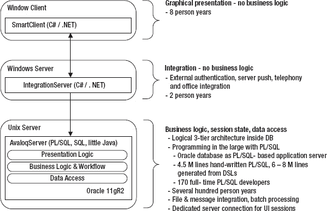
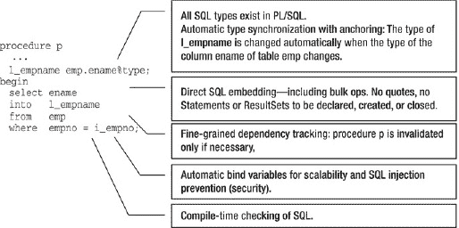

# 关于解析的几点说明

虽然这听起来可能有点题外话，但在为每种编程情况选择最适合的游标类型时，解析问题应始终是您优先考虑的重要事项。如前所述，`REF` 游标（即使是静态类型）通常在每次打开时执行一次软解析（请参阅前面提到的关于设置 `session_cached_cursors` 值的注意事项）。尽管软解析无限优于硬解析，但它 `远` 比完全不解析要糟糕。编写任何类型的 SQL 或 PL/SQL 时，您的目标都是尽可能减少解析。那么，您可以做些什么来减少解析呢？

如果您使用 PL/SQL 隐式游标或显式（非 `REF`）游标，并且没有对谓词使用字面值，那么您就是在使用绑定变量。这意味着，默认情况下，您已经开启了减少解析的机会，因为您减少了唯一 SQL 语句的数量。您的游标查询将在首次访问时解析，并保留在共享池中以供多次访问重用，直到它们被老化清除。这对应用程序的运行时性能和可扩展性是一个巨大的节省。您的游标查询不会被视作单个、新的游标而被反复解析、执行、关闭和重新打开（周而复始）。

除了在共享池中被缓存外，PL/SQL 本身也可以“缓存”这些查询。它会将这些查询以 `打开` 状态缓存。这意味着以后可以再次执行它们，甚至无需打开（解析）它们。因此，您不仅在共享池中拥有出色的共享 SQL，而且还会在会话中为每条 SQL 语句消除除一次解析调用之外的所有解析调用。这是使用非 `REF` 游标的最佳理由之一。PL/SQL 不会关闭它们，而是保持它们打开状态，从而完全避免了解析。

另一方面，`REF` 游标总是执行软解析。一方面，它们为您提供了极大的编码灵活性，特别是在需要将结果集传递回客户端时（许多数据库应用程序都需要这样做）。另一方面，这种灵活性是以可能降低可扩展性和过度软解析为代价的。而过度的软解析又可能带来门闩争用。因此，如果您无法编写静态隐式游标而必须编写 `REF` 游标，您可以做些什么来努力减轻不可避免的软解析所带来的影响呢？

考虑为您的 `session_cached_cursors` 初始化文件参数设置一个合适的值。您的目标是减轻过度软解析的影响（门闩争用）。在系统范围内缓存游标通常是一件非常好的事情，因为它将减少过多门闩的影响，并帮助您的应用程序避免门闩争用。使用 `session_cached_cursors` 有助于让软解析变得更“软”。它使软解析 `更容易`，因此，当您的应用程序使用 `REF` 游标时，这是一个值得设置的好参数。当您在 PL/SQL 中隐式或显式关闭游标时，PL/SQL 并不会真正关闭游标。它会将游标以打开状态缓存。而 PL/SQL 缓存的大小由为 `session_cached_cursors` 参数提供的值控制。

在 PL/SQL 中使用非 `REF` 游标的静态 SQL 有助于减少解析，这要归功于 PL/SQL 游标缓存。当应用程序多次解析查询时，就会发生多次解析。这些解析可能是硬解析或软解析。例如，假设您有一个类似于以下内容的脚本：

`ALTER SESSION SET SQL_TRACE = true;`

```sql
BEGIN
    FOR i IN 1 .. 2000 LOOP
        FOR x IN ( SELECT /*+ 隐式游标查询在此 */ * FROM dual )
        LOOP
            NULL;
        END LOOP;
    END LOOP;
END;
/
```

```sql
DECLARE
    TYPE rc_type IS REF CURSOR;
    rc rc_type;
BEGIN
    FOR i IN 1 .. 2000 LOOP
        OPEN rc FOR SELECT /*+ REF 游标查询在此 */ * FROM dual;
        CLOSE rc;
    END LOOP;
END;
/
```

生成的 TKPROF 输出揭示了以下内容：

```
********************************************************

SQL ID: dybuvv2j10gxt
Plan Hash: 272002086
SELECT /*+ implicit cursor query goes here */ *
FROM
 DUAL

call     count       cpu    elapsed       disk      query    current        rows
------- ------  -------- ---------- ---------- ---------- ----------  ----------
Parse        1      0.00       0.00          0          0          0           0
Execute   2000      0.01       0.02          0          0          0           0
Fetch     2000      0.03       0.04          2       6000          0        2000
------- ------  -------- ---------- ---------- ---------- ----------  ----------
total     4001      0.05       0.07          2       6000          0        2000

Misses in library cache during parse: 1
Optimizer mode: ALL_ROWS
Parsing user id: 84     (recursive depth: 1)

Rows     Row Source Operation
-------  ---------------------------------------------------
      1  TABLE ACCESS FULL DUAL (cr=3 pr=2 pw=0 time=0 us cost=2 size=2 card=1)

********************************************************
```

此 TKPROF 输出展示了该查询被解析了 1 次，执行了 2000 次。PL/SQL 缓存了该游标。输出中的“Misses in library cache during parse”行也证明这是一次硬解析。它在共享池中未被找到。这里是另一个例子：

```
********************************************************************************

SQL ID: gc72r5wh91y0k
Plan Hash: 272002086
SELECT /*+ REF cursor query goes here */ *
FROM
 DUAL

call     count       cpu    elapsed       disk      query    current        rows
------- ------  -------- ---------- ---------- ---------- ----------  ----------
Parse     2000      0.02       0.02          0          0          0           0
Execute   2000      0.02       0.02          0          0          0           0
Fetch        0      0.00       0.00          0          0          0           0
------- ------  -------- ---------- ---------- ---------- ----------  ----------
total     4000      0.04       0.05          0          0          0           0

Misses in library cache during parse: 1
Optimizer mode: ALL_ROWS
Parsing user id: 84     (recursive depth: 1)

Rows     Row Source Operation
-------  ---------------------------------------------------
      0  TABLE ACCESS FULL DUAL (cr=0 pr=0 pw=0 time=0 us cost=2 size=2 card=1)

********************************************************************************
```

这次 TKPROF 输出表明该查询被解析了 2000 次。它是使用 REF 游标打开的，而 PL/SQL 无法缓存此类游标。输出还表明有一次硬解析和（因此）1999 次软解析。第二次解析是通过在共享池的库缓存中找到已存在的执行计划完成的。最佳情况下，你应该看到 `parse =1`，但看到 `parse = execute = N` 也并不罕见。

### 动态 REF 游标

从所有实际用途来看，动态 REF 游标与静态 REF 游标非常相似，只有几个显著的区别。动态 REF 游标的查询直到运行时才知晓，并且也是动态构建的。你可能会问，这与静态 REF 游标有何不同，因为静态 REF 游标的查询同样直到运行时才知晓。强类型 REF 游标无法被动态打开。弱类型 REF 游标则可以被动态打开。

#### 示例与最佳实践

考虑清单 10-11 中概述的使用动态 REF 游标的过程示例：

`清单 10-11.` 使用动态 REF 游标的过程 (11.2.0.1)

```
PROCEDURE get_concepts (ip_input      IN  NUMBER,
                        ip_con_type   IN  VARCHAR2,
                        ip_con_dt     IN  DATE,
                        ip_con_cat    IN  VARCHAR2,
                        op_rc        OUT  my_cv)
IS
    lv_query VARCHAR2 (512) DEFAULT 'SELECT * FROM prod_concepts';
    BEGIN
         IF ( ip_con_type IS NOT NULL )
            lv_query := lv_query ||
            '  WHERE concept_type LIKE ''%''||:ip_con_type||''%'' ';
         ELSE
            lv_query := lv_query ||
            ' WHERE (1 = 1 OR :ip_con_type IS NULL) ';
         END IF;
         IF ( ip_con_dt IS NOT NULL )
            lv_query := lv_query ||
            '  AND concept_dt < :ip_con_dt ';
         ELSE
            lv_query := lv_query ||
            ' AND (1 = 1 OR :ip_con_dt IS NULL) ';
         END IF;
         IF ( ip_con_cat IS NOT NULL )
            lv_query := lv_query ||
            '  AND concept_category LIKE ''%''||:ip_con_cat||''%'' ';
         ELSE
            lv_query := lv_query ||
            ' AND (1 = 1 OR :ip_con_cat IS NULL) ';
         END IF;
            OPEN op_rc FOR
                lv_query USING ip_con_type, ip_con_dt, ip_con_cat;

    END get_concepts;
```

那么，这个版本的 `get_concepts` 过程与清单 10-9 中展示的那个有何不同？首先，与静态的 `OPEN-FOR` 版本不同，动态版本有一个*可选的* `USING` 子句——之所以说*可选*，是因为也可以使用字面量（而非绑定变量）来编码此过程，类似于下面这样：

```
'SELECT * FROM prod_concepts
  WHERE concept_type  = ''||COLLATERAL||''
    AND concept_dt    < ''||TO_CHAR(''''01-JAN-2003''', '''DD-MON-YYYY''')||''';'
```

显然，这似乎是构建查询的一种非理想且笨重的方式。这也会导致可怕的硬解析，因为所有查询都将是唯一的，这会*扼杀*性能。如果必须构建任何形式的动态查询，请先问明原因。在以下情况下你需要动态 SQL：

*   你想执行一条 SQL 数据定义语句（如 `CREATE`）、数据控制语句（如 `GRANT`）或会话控制语句（如 `ALTER SESSION`）。在 PL/SQL 中，此类语句无法通过静态 SQL 执行。
*   你希望获得更大的灵活性。例如，你可能希望等到运行时再选择使用哪些模式对象。或者，你可能希望程序为 `SELECT` 语句的 `WHERE` 子句构建不同的搜索条件，正如清单 10-11 中所做的那样。动态构建 `WHERE` 子句是使用动态 SQL 的一个非常常见的原因。更复杂的程序可能会从各种 SQL 操作、子句等中进行选择。

如果你不需要执行上述任何操作，但确实需要 REF 游标，那么你应该使用静态 REF 游标。如果你*确实*需要使用上述任何功能，请确保使用绑定变量，如清单 10-11 中的第一个示例所示。


## 关于 REF 游标与 SQL 注入风险的讨论

现在，由于你使用的是 REF 游标结构，它仍然会执行软解析。但至少，如果你使用了绑定变量，它就不会执行硬解析。因为游标*可能*不同，Oracle RDBMS 认为它可能是不同的（因为它是动态的），所以总会进行某种解析。在你必须选择的所有游标类型中，这一个绝对应该是你的最后手段。动态 SQL 极其脆弱，难以编码、难以调优，也难以维护。代码依赖链不复存在，因此你只能*希望*数据结构的改变不会对你的代码产生不利影响。

但你在前一节已经了解到，REF 游标至少会执行软解析。除了动态 REF 游标带来的繁琐编码之外，避免使用它们的其他原因可能是什么？我能想到的避免动态 REF 游标的最大原因是 SQL 注入的可能性。SQL 注入是对你的应用程序，更重要的，是你的数据的一个真实威胁。如果你的应用程序代码允许恶意用户将他们自己的 SQL 语句附加到你动态构建的查询中，此类攻击会对你的数据安全构成危险威胁。

### SQL 注入的威胁

允许用户在不使用绑定变量的情况下将字符串连接到语句中的动态 SQL，不仅是一个解析、可扩展性和可维护性的噩梦；它还带来了一个非常切实的安全威胁。每次你允许某人提供来自你控制范围之外的输入时，你的数据就不再安全。更糟糕的是，恶意用户因为他们使用的是*你的*代码，所以是以*你*的身份执行他们的语句。你打开了大门，让你的数据变得脆弱。考虑清单 10-12 中的例子，它概述了一个看似无害但易受 SQL 注入影响的存储过程。

**清单 10-12.** 一个易受 SQL 注入影响的过程 (11.2.0.1)

```
PROCEDURE get_concepts (ip_input      IN  NUMBER,
                        ip_con_type   IN  VARCHAR2,
                        ip_con_dt     IN  DATE,
                        ip_con_cat    IN  VARCHAR2,
                        op_rc        OUT  my_cv)
IS
    BEGIN
       IF ( ip_input = 1 )
       THEN
       OPEN op_rc FOR
             'SELECT * FROM prod_concepts
               WHERE concept_type  = ''||ip_con_type||''
                 AND concept_dt    < ''||ip_con_dt||''' ;
       ELSE
          OPEN op_rc FOR
             'SELECT * FROM prod_concepts
               WHERE  concept_category = ''||ip_con_cat||''' ;
       END IF;
    END get_concepts;
```

如果有人希望做一些他们不应该做的事情，例如获取访问权限或进行破坏，那么这些看似无害的参数（显然用于输入产品概念数据）很容易被操纵，以至于最终生成的动态 SQL 查询最终看起来类似于以下内容：

```
CREATE OR REPLACE
    PROCEDURE get_concepts (ip_input      IN  NUMBER,
                            ip_con_type   IN  VARCHAR2,
                            ip_con_dt     IN  DATE,
                            ip_con_cat    IN  VARCHAR2,
                            op_rc        OUT  sys_refcursor )
    IS
        BEGIN
           IF ( ip_input = 1 )
          THEN
                   DBMS_OUTPUT.PUT_LINE(
                'SELECT * FROM prod_concepts
                  WHERE concept_type  = ''' ||ip_con_type|| '''
AND concept_dt    < ''' || to_char(ip_con_dt, 'dd-mon-yyyy' )
 ||'''' );
          ELSE
                   DBMS_OUTPUT.PUT_LINE(
                'SELECT * FROM prod_concepts
                  WHERE  concept_category = ''' || ip_con_cat||'''' );
          END IF;
       END get_concepts;
   /
scott%ORA11GR2> variable x refcursor
scott%ORA11GR2> exec get_concepts( ip_input => 2, ip_con_type => null, ip_con_dt => null,
 ip_con_cat => '''||admin_pkg.change_app_passwd( ''INJECTED'' ) --', op_rc => :x );
SELECT * FROM prod_concepts
 WHERE concept_category =
''||admin_pkg.change_app_passwd( 'INJECTED' ) --'

PL/SQL procedure successfully completed.
```

这里发生了什么？在这个过程的调用中，用户提供的输入不关心匹配 `concept_type` 或 `concept_dt`，而是提供了他们实际要执行的 SQL：`admin_pkg.change_app_passwd('INJECTED');`。在该输入的末尾添加符号 `--`，表示 SQL 注释的开始。这是一个巧妙的方法来*消耗*应用程序提供的最终引号，而无需担心匹配它。

正如你所看到的，动态 SQL 为恶意入侵者敞开了大门。任何时候你不使用绑定变量，你不仅阻碍了应用程序性能，还将你的数据置于严重风险之中。因此，既然动态 REF 游标（以及任何形式的动态 SQL）是脆弱的，容易出错且具有风险，你需要问问自己，使用 REF 游标编码应用程序所带来的额外灵活性是否值得承担安全风险和可维护性的麻烦。如果你别无选择只能使用 REF 游标，请记住以下几点：

*   如果必须使用 REF 游标，请使用强类型静态 REF 游标。
*   如果无法使用静态 REF 游标，那么请确保你的动态 REF 游标使用绑定变量。

### 描述 REF 游标的列

在过去的 Oracle 版本中，描述 REF 游标的列是不可能的。如果你想拥有这个功能，必须使用数据库外部的客户端工具。这种情况从 Oracle 11.1 及更高版本开始发生了变化。从 Oracle 11.1 开始，`DBMS_SQL`（一个提供的包，允许你像 JDBC 一样以程序化方式处理结果集）与 REF 游标功能协同工作，使你能够在打开 REF 游标后以编程方式描述你的列。这种功能是可能的，因为 Oracle 11g 允许将 REF 游标转换为 `DBMS_SQL`，反之亦然。考虑清单 10-13 中的例子。

**清单 10-13.** 使用 `DBMS_SQL` 描述列的 REF 游标 (11.2.0.1)

```
DECLARE
            lv_ref_cursor   SYS_REFCURSOR;
            lv_col_cnt      NUMBER;
            lv_desc_tab     DBMS_SQL.DESC_TAB;
BEGIN
            OPEN lv_rcursor FOR SELECT * FROM prod_concepts;

            DBMS_SQL.DESCRIBE_COLUMNS
            ( cur_id      => DBMS_SQL.TO_CURSOR_NUMBER(lv_ref_cursor),
              col_cnt     => lv_col_cnt,
              desc_tab    => lv_desc_tab );

           FOR i IN 1 .. lv_col_cnt
           LOOP
                   DBMS_OUTPUT.PUT_LINE( lv_desc_tab(i).col_name );
           END LOOP;
END;
/
```

这个例子的关键部分是以下代码片段：

```
cur_id      => DBMS_SQL.TO_CURSOR_NUMBER(lv_ref_cursor)
```

函数 `TO_CURSOR_NUMBER` 可以将任何 REF 游标（无论是强类型还是弱类型）转换为一个 SQL 游标号，然后可以将其传递给任何 `DBMS_SQL` 子程序。你可以在 REF 游标处理中利用 `DBMS_SQL` 的能力，为你的程序提供更大的灵活性。但请注意，一旦将 REF 游标转换为 `DBMS_SQL` 游标号，就不能再使用原生动态 SQL 操作来访问它。你可以使用 `DBMS_SQL.TO_REFCURSOR` 函数将游标号切换回 REF 游标，但请注意，这个最新版本的 REF 游标将是弱类型的，即使它最初是强类型的。因此，与任何其他 PL/SQL 游标功能一样，在充分了解其副作用以及好处的前提下使用此功能。


### 总结

为应用需求选择合适的游标类型可能决定应用的成败。如果有机会使用静态 SQL，请务必使用，不要犹豫。在隐式游标和显式游标之间选择时，尽可能优先使用隐式游标。你的性能将得到提升，可扩展性将变得可衡量，你的用户也会表示赞赏。然而，如果你在执行需要同时以过程方式处理数据的批量处理，或者将结果集传递给客户端应用，那么你将别无选择，只能使用显式游标。

当需要选择`REF`游标（你的应用已确定不可避免）时，看看是否可以通过使用强类型的`REF`游标来实现目标。创建编译器可知的代码应是你的首要目标之一。请记住，动态代码本质上是脆弱且容易出错的。但如果你必须使用动态`REF`游标，请确保你使用了绑定变量——不仅仅是为了运行时的性能提升，也是为了安心于安全。SQL 注入正伺机攻击任何掉以轻心的应用。

作为开发者的职责，是为正确的工作使用正确的工具。所有这些游标类型都有其适用的特定场景。确保你对其风险和缺陷以及好处有充分的理解。你的游标选择应以最大化性能、减少担忧、并在应用用户群中提升你的受欢迎度的方式做出。所以，尝试用不同的方法实践。权衡一种方法与另一种方法。牢记优先顺序，并且当你不得不使用隐式游标之外的东西时，要明智而审慎地使用。

## 第 11 章

## 大型 PL/SQL 编程

**作者：Martin Büchi**

大多数业务应用都是数据密集型的，因此其核心需要一个数据库。这些应用通常会使用数年甚至数十年。在此期间，用户界面有时会被完全替换或扩展以保持其先进性。而数据模型和业务逻辑，通常随着所支持的业务流程更稳定地演进。许多这类应用最终会变得庞大，无论它们是从小处起步（例如用 APEX 替代电子表格）还是从一开始就复杂。因此，我们需要一种适合开发和维护面向数据的业务逻辑、并能持续多年的架构和编程语言。Oracle 数据库中的`PL/SQL`理想地契合了这些需求。

`PL/SQL`中的业务逻辑可能导致大量的`PL/SQL`代码；例如，我公司的旗舰应用有 1100 万行代码，并由 170 名开发人员维护。这才是真正的大型编程。在任何语言中进行有效且高效的大型编程都需要良好的模块化和基于严格遵循编程规范的高度一致性。`PL/SQL`为实现和强制这些方面提供了坚实的基础。此外，它还支持面向对象编程，这显著提高了代码重用率，从而带来成本降低和质量提升。

本章首先描述在何时以及为何使用`PL/SQL`编写业务逻辑是一个好的选择，然后解释掌握大型`PL/SQL`编程关键成功因素的方法。

### 作为基于`PL/SQL`的应用服务器的数据库

软件架构和编程语言必须选择以最好地满足业务需求。因此，用`PL/SQL`编码业务逻辑最有说服力的论据是基于此架构的长期成功的应用。Avaloq 银行业务系统就是这样一个应用，并作为案例研究。从这个案例研究中，我推导出这种架构的优势。因为没有一种架构是普遍适用的，了解其局限性也很重要。

#### 案例研究：Avaloq 银行业务系统

Avaloq 银行业务系统（ABS）是一个完整的核⼼银行业系统，具备支付、投资和融资功能。它提供最终用户图形界面（GUI）以及对消息和文件的批处理。超过 65 家银行，每家有 20 到 5000 个并发最终用户，在七个国家使用它。实时联机事务处理（OLTP）和报告都在同一个数据库中实现。

ABS 采用物理三层架构，如图 11-1 所示。用`.NET`实现的瘦富客户端提供了高效的用户交互和最佳的`Windows`集成。中间层负责电话集成、外部认证以及`Oracle Net`与`Windows Communication Foundation`之间的协议转换，这样桌面上就不需要`Oracle`客户端，防火墙可以禁止来自最终用户`PC`的直接`SQL`访问，并且客户端网络中的网络加密是免费可用的。客户端和中间层都不包含任何业务逻辑；事实上，它们可以不经修改地用于任意的`ERP`应用。

业务逻辑驻留在后端——即`Oracle`数据库中。数据库充当基于`PL/SQL`的应用服务器，并基于具有数据访问层、业务逻辑层和表示层的逻辑三层架构。相同的`PL/SQL`业务逻辑代码在批处理和图形界面会话中执行。例如，无论是从文件读入系统还是由职员在图形界面上输入，支付交易都以相同的方式处理。

在 Avaloq 银行业务系统中，图形界面会话的状态存储在`PL/SQL`包体全局变量中。每个字段值都被发送到服务器进行验证和派生字段的计算。业务事务在`PL/SQL`内存中构建，并在用户最终确定后持久化。会话状态的最佳存储位置（数据库表、数据库服务器内存、中间层或客户端）是一个常引发激烈争论的话题。因为即使会话状态不保存在数据库中，大部分业务逻辑也可以用`PL/SQL`实现，所以无论你的应用将会话状态存储在哪里，本章内容都具有相关性。



**图 11-1.** Avaloq 银行业务系统技术架构

Avaloq 银行业务系统的开发始于 1993 年，使用`Oracle 7`。将业务逻辑放在`Oracle`数据库中的基本架构自那时起一直保持不变。最初的图形界面是用`HyperCard`编写的；此后它被`Java AWT`、`Java Swing`和基于`.NET`的实现替换过三次，并且未来很可能成为`Web`图形界面。

Avaloq 是一家希望利润最大化的商业公司。我们选择所描述的架构是为了最大化客户满意度和开发者生产力，并定期对其进行重新评估。诚然，在 1993 年 Avaloq 银行业务系统开发开始时，还没有商业应用服务器。然而，我们保留当前的架构是因为它运行良好，而不是因为迁移到应用服务器的成本会非常高昂。事实上，我们在 2006 年，由一位具有`JEE`背景和`Java`认证的工程师设计数据库供应和持续集成系统时，选择了类似的架构。我们有时需要解释架构选择的原因，但在过去的 17 年里，我们从未因架构问题而丢失一单销售。

许多其他`ERP`和银行业应用，包括`IFS Applications`、`Oracle E-Business Suite`和`Oracle Fusion Applications`，都包含数百万行`PL/SQL`代码。`Oracle`对`PL/SQL`的坚定承诺体现在其用`PL/SQL`实现`Application Express (APEX)`上，以及对`PL/SQL`的持续增强，例如在 11gR2 中引入的基于版本的重定义。

#### 业务逻辑置于数据库中的优势

Avaloq 从将业务逻辑编码于数据库中获得了以下优势：
*   **简单性**：大多数开发人员只需为单一层次使用一种语言进行编码。他们可以编写完整的业务功能，而无需花费时间与其他层次的开发人员协调和等待他们完成工作。此外，并发模型使得开发与其他程序并行运行的程序变得容易。
*   **性能**：包括批量操作在内的数据访问在数据库内部直接执行是最快的。这与 Exadata 的基本思想相同：让处理更接近数据，并仅在网络上发送最少的数据。对于批处理（这是大多数 OLTP 银行业务活动），所有处理都可以在数据库中完成。
*   **安全性**：定义者权限（definer rights）存储过程更容易确保未经授权的人员无法从数据库外部访问关键信息。所有数据都可以驻留在锁定的模式中，外部访问可以限制到少数几个包。不需要授予直接的表或视图访问权限。如果业务逻辑位于数据库外部，那么（至少在一段时间后）会有多个应用程序直接访问数据库。这使得难以强制执行一致的安全性。存储在应用服务器中的密码很容易被滥用来直接访问数据。此外，服务器中的会话状态可以防止欺骗攻击。
*   **一致性**：我信任 Oracle 的读一致性。如果我必须在繁重的 OLTP 活动的同时基于中间层缓存显示实时的客户投资组合，我会睡不安稳。
*   **来自任何环境的可用性**：许多应用程序需要与其他应用程序交互。存储过程可以通过`JDBC`、`OCI`、`ODBC`等从任何语言调用。当然，这对于 Web 服务也是如此。
*   **参与分布式事务**：分布式事务对于业务系统中的接口至关重要，以确保只执行一次。Oracle 作为事务参与者的分布式事务设置简单，并且得到大多数事务协调器的支持。另一方面，在连接到多供应商环境中数据库的 Web 服务或`CORBA`中间层上，为任意接口设置分布式事务是一场噩梦。
*   **集中的单层部署**：大多数增强功能和错误修复只需要在单个层次上进行更改，即使需要修改表和业务逻辑。
*   **可扩展性**：得益于日益强大的服务器和通过`Real Application Cluster`实现的水平扩展，Oracle 数据库在单机箱内扩展良好，并可横向扩展。
*   **稳定性和可靠性**：Oracle 数据库是一个异常稳定可靠的执行环境。

三层架构的大部分优势源于数据访问、业务逻辑和呈现的逻辑分离而非物理分离。这种逻辑分离以及由此带来的好处，也可以通过数据库内部的模块化来实现，如下所述。

存储过程可以用`PL/SQL`、`Java`、`.NET`或几乎任何语言作为外部过程来编码。`PL/SQL`是我的默认选择。

##### PL/SQL 存储过程

`PL/SQL`是一种命令式`3GL`语言，专为无缝处理`SQL`而设计，为编写业务逻辑提供了额外的好处。图 11-2 展示了其部分关键优势。



`图 11-2. PL/SQL 的部分关键优势`

此外，基于版本的重定义（edition-based redefinition）为`PL/SQL`代码与其他对象类型的在线应用升级提供了支持。`PL/SQL`也在`TimesTen`内存数据库中运行，从而将相同的优势带到缓存在内存中的数据，以实现更高的性能。

##### Java 存储过程

Java 存储过程不像`PL/SQL`那样提供无缝的`SQL`集成。事实上，Java 没有`图 11-2`中列出的任何优势。此外，从 Oracle 11gR2 开始，从 Java 存储过程内部调用`SQL`的性能明显低于从`PL/SQL`或数据库外部运行的 Java。考虑到从数据库外部使用`JDBC`的性能非常出色，这种情况很可能会改善。另一方面，使用 11g 即时编译器的算法性能优于`PL/SQL`，并且几乎与数据库外部的 Java 相当。

如果某些功能在`PL/SQL`中无法实现（例如 Oracle 10g 之前的`OS`调用），或者现有 Java 库能极大简化工作，Avaloq 会使用 Java。例如，Avaloq 安装程序使用 Java 检查`ZIP`文件的签名，数据库供应系统使用 Java 通过`JDBC`在数据库之间传输`LOB`——而不是使用仅在`DDL`中支持`LOB`而不支持`DML`的`PL/SQL`通过数据库链接传输。许多库的可用性绝对是 Java 生态系统的优势。然而，这一事实经常被高估。对于业务应用程序，通常只有基础设施库有用，而且即使这些库也可能不够。例如，没有一个 Java 日志框架支持每条目安全、将同一问题的日志调用分组到单个条目中，或在条目上进行工作流处理。此外，新库的不断出现可能导致“强迫性最新框架采用障碍”（Compulsive Latest Framework Adoption Disorder），其典型表现是在一个产品中使用许多相似的库，因为对大型产品进行完整重构的努力是巨大的。最后但并非最不重要的一点是，`PL/SQL`也附带了大量的库：`PL/SQL Packages and Types Reference`在 11gR2 中已增长到 5,900 页。

Java 的一个好处是相同的代码，例如数据验证，可以在数据库和另一个层次中运行。后者的另一种选择是从领域特定语言生成`PL/SQL`和另一种语言的代码。在 Avaloq 银行系统中，超过一半的`PL/SQL`代码是从更高层次的领域特定语言生成的。

虽然 Oracle 允许开发人员在基于子程序（过程或函数）的基础上决定使用`PL/SQL`或`Java`作为实现语言，但我尽量避免难以维护的混乱混合。

`Java stored procedure`（Java 存储过程）实际上是一个用词不当的术语。Oracle 数据库包含一个完整的 Java 虚拟机（`JVM`）。因此，可以用数十种能够生成 Java 字节码的编译器的语言来编写存储过程。然而，从使用`AspectJ`的面向切面编程到使用`Scala`的函数式编程，没有一种语言具备无缝的`SQL`嵌入。

`SQLJ`是 Java 的基于预处理器的扩展，为更简单的`SQL`集成和自动绑定变量添加了语法糖。然而，它缺乏对嵌入式`SQL`的编译时检查以及对引用对象修改后自动失效的依赖项跟踪。自动失效将需要对`JVM`进行增强，无法通过语言扩展的方式添加。

`SQLJ`的支持情况参差不齐。很少有`IDE`支持`SQLJ`。Oracle 自己在原始的 10g 版本中停止了对`SQLJ`的支持。在客户投诉之后，`SQLJ`在 10.1.0.4 补丁集中重新出现。

##### .NET 和基于 C 的外部过程

外部过程（在 Oracle 文档中也互换地称为子程序）是具有`PL/SQL`调用规范并在另一种语言中实现的子程序。通过在`.NET`中编码存储过程，您将自己限制在 Windows 上运行 Oracle 数据库。用 C 或其他可从 C 调用的语言编写的外部过程会阻碍可移植性。此外，它们在自己的进程中运行。因此，基于 C 的外部过程与在中间层中的业务逻辑相比没有显著优势，除了它们可以通过数据库调用。

#### 作为基于 PL/SQL 的应用服务器的数据库的局限性

如果你只有一把锤子，那么所有问题看起来都像钉子。而作为软件工程师，另一方面，你应该意识到架构蓝图的适用范围限制。所描述的数据库解决方案中使用`PL/SQL`的业务逻辑，非常适用于以数据为中心的`ERP`应用程序。然而，它不太适用于计算密集且数据交互需求少的应用程序。

此外，对于以下任务，`PL/SQL`并非我的首选：

*   `CPU`密集型任务：`PL/SQL`的算法性能低于`C`和`Java`。此外，`Oracle`许可证费用也适用于`PL/SQL`。商业应用服务器中的`Java`会产生类似的许可证费用，而运行`C`或独立的`Java`程序则不需要运行时许可证。在`Avaloq Banking System`中，`CPU`使用率中不到 50%是`PL/SQL`；其余的是`SQL`。
*   使用内存中非常大的集合的程序：`PL/SQL`集合可能比其`C`语言对应物需要显著更多的内存。我将在本章后面深入探讨内存使用问题。
*   非常复杂的数据结构：`PL/SQL`集合和记录对于大多数任务来说已经足够。然而，其他语言（具有泛型类型、内存引用和自动垃圾回收的语言）可以更轻松地表达这些结构。

 注意：供应商无关性有时被引用为反对专有存储过程语言的理由。这个论点是无效的，因为大多数应用程序从未被移植到其他数据库，而且在不同数据库上实现良好性能和正确的并发处理需要多个特定的实现，而不是一个通用的实现。Tom Kyte 在*Expert Oracle Database Architectures* (Apress, 2005)一书中详细论证了这一点。我完全支持他在这本书中关于这个主题的每句话（而且我的薪水不是来自`Oracle`）。如果你不喜欢某个特定的数据库供应商，那是另一回事。但你应该充分利用你选择的数据库。

#### 软性因素

尽管`Java`可能比`PL/SQL`更有吸引力，但我发现，招聘`PL/SQL`程序员并不比招聘`Java`程序员更难（而且不幸的是，也不更容易）。学习曲线没有太大不同。`PL/SQL`很容易学习。大的挑战，尤其是对新毕业生来说，在于理解业务需求、学习大规模编程、掌握特定于应用程序的框架和模式，以及编写高效的`SQL`。

如果业务逻辑是用`Java`编写的，`SQL`也是一个问题。当然，简单的`SQL`语句可以由对象关系映射器生成。但是，遵循一些简单模式的`SQL`语句在`PL/SQL`中也不是问题——问题在于那些必须手动编码以获得最佳性能的复杂语句。

对于一个拥有数百万行应用程序的公司来说，让新员工轻松上手是成功的大规模编程的主要要求之一。

### 大规模编程的要求

既然已经确立了在数据库中处理业务逻辑的理由，让我们看看如何最好地掌握你将要编写的所有`PL/SQL`。大规模编程可能涉及由更庞大的人群进行编程，或者由较小的群体在更长的时间段内进行编程。通常，维护软件解决方案的人员会发生变化。一个典型的例子是，`Oracle 6`中`PL/SQL`的创建者现在没有一个人还在`PL/SQL`小组工作。因为软件生命周期成本的三分之二以上通常用于维护，所以维护效率是一个关键要求。

大规模编程需要一种方法，能够在软件的初始创建和未来维护期间，及时、在预算内、并以外部产品质量交付给用户。忽略与架构和编程语言在很大程度上独立的过程方面，你需要高水平的内部产品质量来实现外部目标。内部产品质量的主要因素是简单性、易于理解性、可扩展性和可重用性。业务逻辑位于数据库中的架构是实现简单性的基石。其他目标则通过命名和编码约定、模块化和面向对象编程来实现。这些方面的实现方式因编程语言而异。在本章中，我将解释如何在`PL/SQL`中实现这些方面。由于篇幅限制，我将省略大规模编程的其他相关方面，例如工具，以及通常与之相关的处理海量数据的方法，例如信息生命周期管理以及为性能和可扩展性而进行的设计。

成功的大规模编程需要成功的小规模编程。如果别人五年前编写的代码崩溃了，如果他遵循了适当的异常处理和错误日志记录实践（为了简洁，我在本章中省略了这些内容），你会感到庆幸。同样，如果你修改的代码包含单元测试或以断言形式存在的契约，你也会很高兴，这样你就知道在更改子程序以修复 bug 时，不太可能破坏其 200 个调用者中的任何一个。任何类型的编程都需要逻辑思维和一丝不苟的严谨性。


### 通过约定实现统一性

统一性是大型编程所必需的，因为它能让开发者快速且彻底地理解彼此的代码。例如，如果每张表的主键列都称为 `id`，且所有对它的引用格式都是 `<table>_id`，那么任何人看到 `foo_id` 就能立即明白它引用的是 `foo.id`。统一性也确保开发者不会频繁地重新格式化他人的代码，从而避免浪费时间、引入回归问题，以及在代码差异中难以区分语义变更和格式变更。

统一性可以通过约定来实现。在大多数情况下，没有哪种约定天生优于其他约定；它们的唯一价值在于为统一性提供基础。例如，靠右行驶和靠左行驶同样合理，选择是任意的。但每个国家都必须采用其中一种约定以避免混乱。同理，使用尾逗号还是首逗号来分隔参数并无优劣之分，但在同一个程序中混合使用两者会损害可读性。

不幸的是，对于 PL/SQL，并没有像 Java 那样标准的命名和格式约定。第 14 章 提供了一套编码约定，Steven Feuerstein 在 `http://bit.ly/8WPRiy` 提供了三套 PL/SQL 编码约定。无论你采用前述约定之一还是自创一套，这都不重要，只要你的组织内每个人遵循同一套约定即可。

有三种方法可以保证对约定的遵守。最佳方法是使用一个 IDE，在你键入时或选择自动格式化时自动建立约定。任何无法通过此方式处理的情况都必须强制执行——理想情况下，通过自动化工具而非依赖人工审查。保证遵守的最后一个选项是希望，这在小项目中可能有效，但在大型编程中则行不通。

有时大型应用程序包含因历史原因遵循不同约定的源代码。在这种情况下，你必须决定是否值得努力使所有源代码符合一个标准；或者你是否希望为应用程序不同且清晰分隔的部分保留多个标准；或者所有新源代码是否都应遵循单一标准。无论如何，每个源代码文件必须始终遵循单一约定。如果选择的方法是过渡到单一约定，则必须一次性调整完整的源文件。为符合不同约定而进行的语法调整，不能与语义更改（如错误修复）混在同一个代码库提交中。否则，代码审计将变得非常困难。

约定背后的原理可能会因为 Oracle 新版本发布或其他变更而过时。例如，在 Oracle 10g 之前，PL/SQL 编译器接受包规范和包体中输入参数的不同默认值，并且只使用包规范中提供的值。为了避免错误的假设，Avaloq 约定是在包体中不为导出的子程序指定任何默认值。从 10g 开始，编译器会检查如果规范和体中都列出了默认值，它们是否相同。因此，你可以无风险地复制默认值，这样开发者在处理包体时就不需要打开包规范了。这个故事的寓意是，你应该定期检查每个约定背后的原理，特别是当该约定也有缺点时。

对于约定规范的大多数方面，约定具体怎么规定并不重要，因为约定的唯一好处就是由此产生的统一性。然而，对于某些方面，有充分的理由选择一种方式而非另一种。例如，如果你的 IDE 只支持首逗号自动格式化，那么你的约定规定使用尾逗号就毫无意义。我在此列出一些 PL/SQL 特有的选定方面，这些方面有强有力的理由遵循特定实践。

#### 缩写词

SQL 和 PL/SQL 中的标识符长度只能为 30 字节。要使一个描述性名称符合这些要求，你需要省略不必要的词（例如 “get”）并对长词进行缩写。你可以通过维护一个缩写词列表并对照该列表检查所有名称来实现缩写的一致性。你还必须在该列表中添加那些你特别选择永不缩写的词。你甚至可以添加一个同义词列表，在新增条目时进行检查，以避免同一概念出现多个条目。

为了检查缩写使用的 Consistency，所有标识符必须拆分成组成部分，并对照缩写词注册表进行检查。要检查的标识符可以在 Oracle 数据字典中找到，例如在 `user_objects` 和 `user_tab_columns` 等视图中。从 Oracle 11g 开始，如果单元是使用 `plscope_settings="identifiers:all"` 编译的，那么 PL/SQL 程序中使用的所有标识符都存储在 `user_identifiers` 中。你可能希望在系统级别启用这个名为 PL/Scope 的新功能，通过执行 `SQL> alter system set plscope_settings="identifiers:all";` 并重新编译所有用户 PL/SQL 单元。视图 `user_plsql_object_settings` 显示哪些对象对此设置生效。

因为小写和混合大小写的标识符在 SQL 和 PL/SQL 中需要用双引号括起来，所以通常不使用。相反，标识符部分通常用下划线分隔。

以下代码清单显示了一个简化版的缩写词检查器。表 `abbr_reg` 保存已注册的缩写词。包 `abbr_reg#` 提供了一个过程 `ins_abbr` 用于插入新缩写词，以及 `chk_abbr` 用于检查标识符部分是否只使用了已注册的缩写词。你可以通过调用如 `abbr_reg#.ins_abbr('abbr', 'abbreviation')` 来填充注册表，并使用 `abbr_reg#.chk_abbr` 检查一致性使用。

```sql
create table abbr_reg(
  abbr                    varchar2(30)  primary key  -- Abbreviation, e.g., ABBR
 ,text                    varchar2(100) not null     -- Abbreviated text, e.g., ABBREVIATION
 ,descn                   varchar2(400)              -- Description, explain concept
) organization index;

create unique index abbr_reg#u#1 on abbr_reg(text);

create or replace package abbr_reg#
is
  ------------------------------------------------------------------------------
  -- Registry of abbreviations for SQL and PL/SQL identifier parts, such as
  -- ABBR for ABBREVIATION and REG for REGISTRY. All identifiers must be made up
  -- of registered abbreviations separated by underscores, e.g. abbr_reg.
  -- Contains also terms not to be abbreviated.
  ------------------------------------------------------------------------------

  ------------------------------------------------------------------------------
  -- Insert an abbreviation into the registry.
  ------------------------------------------------------------------------------
  procedure ins_abbr(
    i_abbr                    varchar2
   ,i_text                    varchar2
   ,i_descn                   varchar2 := null
  );

  ------------------------------------------------------------------------------
  -- Check whether only registered abbreviations are used as identifier parts.
  ------------------------------------------------------------------------------
  procedure chk_abbr;
end abbr_reg#;

create or replace package body abbr_reg#
is
  procedure ins_abbr(
    i_abbr                    varchar2
   ,i_text                    varchar2
   ,i_descn                   varchar2
  )
  is
  begin
    insert into abbr_reg(abbr, text, descn)
    values(upper(trim(i_abbr)), upper(trim(i_text)), i_descn);
  end ins_abbr;
```


