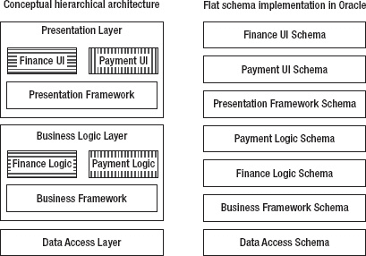
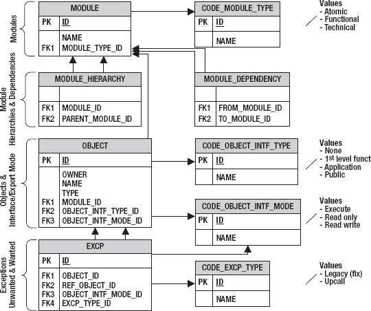

# 使用细粒度审计检测表访问

由于 Oracle 不提供 `on-select` 触发器，您必须使用变通方法来检测读访问。三种可选方案是细粒度审计、RLS 谓词和 Database Vault。这些都需要企业版。Database Vault 是一个需要额外付费的选项。这里介绍的是采用细粒度审计的方法。我将所有不同的调用者记录到 `call_log` 表中。

```sql
create table call_log(
   object_schema             varchar2(30)
  ,object_name               varchar2(30)
  ,policy_name               varchar2(30)
  ,caller                    varchar2(200)
  ,sql_text                  varchar2(2000 byte)
  ,constraint call_log#p primary key(object_schema, object_name, policy_name
                                    ,caller, sql_text)
) organization index;
```

 **注意** Oracle 对索引条目的最大尺寸有限制，该限制基于数据块大小，详见 My Oracle Support (MOS) Note 136158.1。我在一个数据块大小为 8K、字符集为 AL32UTF8（每个字符最多可占用 4 字节）的数据库上运行了此示例。为了在索引中容纳最多信息（该索引用于在创建时避免重复条目），我将 `sql_text` 列的长度语义指定为 `byte`。

该表由过程 `call_log_ins` 填充，细粒度审计框架会在每次 SQL 语句执行时调用此过程，大致相当于语句级触发器。

```sql
create or replace procedure call_log_ins(
  i_object_schema            varchar2
 ,i_object_name              varchar2
 ,i_policy_name              varchar2
)
is
  pragma autonomous_transaction;
  l_caller                   call_log.caller%type;
  l_current_sql              call_log.sql_text%type;

  ----------------------------------------------------------------------------------
  -- 返回触发器之下调用栈中直到第一个非匿名块的部分。
  ----------------------------------------------------------------------------------
  function caller(
    i_call_stack             varchar2
  ) return varchar2
  as
    c_lf            constant varchar2(1) := chr(10);
    c_pfx_len       constant pls_integer := 8;
    c_head_line_cnt constant pls_integer := 5;
    l_sol                    pls_integer;
    l_eol                    pls_integer;
    l_res                    varchar2(32767);
    l_line                   varchar2(256);
  begin
    l_sol := instr(i_call_stack, c_lf, 1, c_head_line_cnt) + 1 + c_pfx_len;
    l_eol := instr(i_call_stack, c_lf, l_sol);
    l_line := substr(i_call_stack, l_sol, l_eol - l_sol);
    l_res := l_line;
    while instr(l_line, 'anonymous block') != 0 loop
      l_sol := l_eol + 1 + c_pfx_len;
      l_eol := instr(i_call_stack, c_lf, l_sol);
      l_line := substr(i_call_stack, l_sol, l_eol - l_sol);
      l_res := l_res || c_lf || l_line;  
    end loop;
    return l_res;
  end caller;

begin
  l_caller := nvl(substr(caller(dbms_utility.format_call_stack), 1, 200), 'external');
  l_current_sql := substrb(sys_context('userenv','current_sql'), 1, 2000);
  insert into call_log(
    object_schema
   ,object_name
   ,policy_name
   ,caller
   ,sql_text
  ) values (
    i_object_schema
   ,i_object_name
   ,i_policy_name
   ,l_caller
   ,l_current_sql
  );
  commit;
exception
  when dup_val_on_index then
    rollback;
end call_log_ins;
```

最后，我需要添加策略。我希望对于 `abbr_reg` 表的每次 `select` 语句访问，都能调用过程 `call_log_ins`。为了也能审计 DML，我必须在调用时添加参数 `statement_types => 'select,insert,update,delete'`，或者为 `select` 和 DML 分别创建策略。

```sql
begin
  dbms_fga.add_policy(
    object_name     => 'ABBR_REG'
   ,policy_name     => 'ABBR_REG#SELECT'
   ,handler_module  => 'CALL_LOG_INS'
  );
end;
/
```

我通过从我正在运行的示例中调用 `abbr_reg#.chk_abbr` 来测试此实现，如下所示：

```sql
SQL> exec abbr_reg#.chk_abbr

PL/SQL 过程已成功完成。

SQL> select object_name, policy_name, caller, sql_text from call_log;

OBJECT_NAME POLICY_NAME     CALLER                         SQL_TEXT
----------- --------------- ------------------------------ ---------------------------------
ABBR_REG    ABBR_REG#SELECT 35  package body K.ABBR_REG#   SELECT COUNT(*) FROM ABBR_REG WHE

已选择 1 行。
```

无论是 DML 触发器还是细粒度审计，都不会在截断（`truncate`）表或分区时触发。要记录或阻止这些操作，需要 DDL 触发器。


## 包含多个包或子模块的模块

子程序和包是必要的构建块。然而，在大型程序中，需要更高层级的模块来对成千上万的包进行分组。例如，Avaloq 银行系统在功能上划分为核心银行、执行与运营以及前台模块。每个模块又被进一步细分，例如将执行与运营细分为财务和支付。在每个模块化层级上，都会声明可接受的依赖关系。

正交地，系统在技术上被划分为数据访问层、业务逻辑层和表示层。这两种模块化方式可以分开处理，也可以组合起来，如图 11-3 左侧所示。原子模块，例如财务用户界面，被定义为这两种模块化的交集。技术模块以包围框的形式展示，一级功能模块则通过相同的底色和属于同一模块的原子模块的名称前缀来标识。



**图 11-3.** 嵌套的层与模块架构，以及采用模式的平面化实现

作为包和其他对象类型集合的模块，可以在 Oracle 中用模式和权限来表示。模式和权限都非常灵活，但层级较低。例如，模式不能嵌套。因此，图 11-3 左侧概念上的层级架构，必须映射到一组平面的模式，如右侧所示。此外，接口必须实现为对每个客户模式的单独权限授予。

因此，引入一种比 Oracle 模式和权限抽象层级更高的模块化模型，可以通过减少条目数量来提高可理解性。如果需要，可以从这个模型生成 Oracle 模式和权限，或者使用该模型来检查模式内的模块化情况。

元模型的精确要求取决于所选的模块化方式。通常，模型必须满足以下要求：

1.  表示系统的模块，例如图 11-3 中的`支付逻辑`和`业务框架`。
2.  将每个数据库对象精确映射到一个模块，例如将 PL/SQL 包`pay_trx#`映射到`支付逻辑`模块。
3.  声明模块之间的依赖关系，例如`支付逻辑`使用`业务框架`，但反之则不行。只应允许无环依赖。
4.  声明每个模块的接口（API）——即哪些对象可以被依赖模块引用。
5.  提供一个扩展/向上调用机制，允许一个模块被依赖它的另一个模块扩展。例如，`表示框架`可以声明一个用于菜单项的扩展点，而`支付用户界面`可以创建一个菜单项。当该菜单项被选中时，`表示框架`必须对`支付用户界面`进行`向上调用`。此调用被称为`向上调用`，因为它与依赖链方向相反：`支付用户界面`依赖于`表示框架`，而非相反。

在 PL/SQL 中，`向上调用`通常通过生成的分发器或动态 SQL 来实现，如面向对象编程部分所述。如果模块是用模式实现的，则必须授予适当的`执行`对象权限。

通过将生成的代码（例如`向上调用`分发器）放入单独的模式中，可以将源自依赖关系的权限和为`向上调用`所需的权限分离开来。

如果`向上调用`是使用用户定义类型提供的动态分发来实现的，则根本不需要额外的权限。

可选地，元模型还可以提供以下功能：

6.  支持模块沿一个或多个维度（例如功能性和技术分层）的层级嵌套。或者，可以引入专用实体，如层和功能组件。专用实体可以用特定的语义来定义，例如层只允许向下的依赖关系。
7.  允许存在友元模块，它们可以使用普通客户端模块无法访问的额外 API。例如，`支付逻辑`模块可以只为`支付用户界面`模块提供额外的 API。同样，出于性能原因，可能需要拓宽选定模块之间的接口。友元关系可以单独声明，也可以从其他实体（例如功能域模块）派生。
8.  管理异常。在引入（新的）目标模块化方案时，可能无法立即移除所有非法依赖，但未来绝不能创建额外的非法依赖。因此，必须管理暂时容忍的非法依赖。

应用程序的目标架构模型可以集中定义在一个文件中，也可以按模块定义。集中定义适用于全局的高层级实体，例如层。按模块的配置更具可扩展性，并且对于多个独立的模块提供者是必需的。OSGi 模块（在 OSGi 术语中称为捆绑包）的清单文件就是按模块声明的示例。

图 11-4 以实体关系图的形式展示了一个可能的元模型。我在满足该要求的元素后面的括号中列出了先前提到的要求。图 11-4 顶部是模块（要求 1）和模块类型。下面是模块的层次结构（要求 6）和模块之间的依赖关系（要求 3）。利用这些实体，你可以对图 11-3 左侧描绘的架构进行建模。

接下来是对象（例如 PL/SQL 单元、表和视图）。每个对象恰好属于一个模块（要求 2）。每个对象要么对其所属模块是私有的，要么是某种类型的接口（要求 4）。在这个例子中有几种接口类型：供具有相同功能模块父级的其他原子模块使用的接口、供同一应用程序中其他模块使用的接口，以及可供外部应用程序使用的公共接口。额外的代码表`code_object_intf_mode`用于区分对表的只读访问和读写访问。



**图 11-4.** 目标模块化的元模型

在图 11-4 的底部是表示两种异常类型的结构，如右下角的两个值所述。

*   待修复的遗留缺陷（要求 8）。如果应用程序是新模块化的，或者目标模块化方案发生变更，这些缺陷应只会暂时存在。
*   可接受的`向上调用`异常（要求 5）。

友元模块（要求 7）仅由功能模块隐式支持。可以通过引入不同的模块依赖类型，或将友元建模为额外的异常类型，来支持显式的友元模块。

作为 PL/SQL 包和其他对象类型组的模块，可以用数据库模式或在模式内部实现。这两种方法可以结合使用，例如，为顶层模块使用模式，并在模式内为子模块进行分组。

## 将模式作为模块

模式为所有类型的对象（从 PL/SQL 单元到表）提供了一种比包粒度更高的通用模块化方式。每个对象都属于一个模式。模式可用于将应用程序划分为多个部分。例如，一个应用程序可以划分为三个模式，分别包含数据访问层、业务逻辑层和表示层。

在 Oracle 中，模式与用户是同义词。我为三层架构创建模式的方式如下：

```
SQL> create user data_access identified by pwd account lock;

用户已创建。

SQL> create user business_logic identified by pwd account lock;

用户已创建。

SQL> create user presentation identified by pwd account lock;

用户已创建。
```

