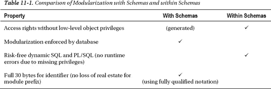
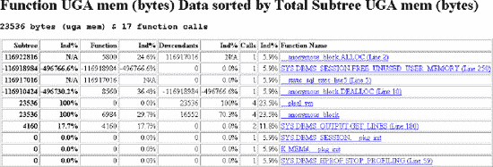
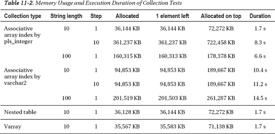

# 通过方案实现模块化的途径

尽管有这些好处，我所知的大多数大型应用程序仅使用一个或少数几个方案。原因似乎是技术无关的或历史性的，与当前版本 Oracle 中的方案问题无关。前面提到的用于引用其他方案中对象的同义词方法，提供了一个相对简单的迁移路径，以使用方案进行模块化。可能只需要适配 DDL 语句和对数据字典的查询，并且需要检查动态 SQL 以发现缺失的授权。当然，这样的迁移仅为未来的清理提供了一个起点，并不能神奇地立即改善模块化。

迁移到方案后，不可能再出现引用先前未引用的方案私有对象的额外模块化违规。例如，如果迁移前新方案`business_logic`没有引用表`data_access.t`，则迁移不需要授予任何对象权限。如果开发人员后来试图在`business_logic`的一个包中引用`data_access.t`，PL/SQL 编译器将捕获此错误。另一方面，对已使用的方案私有对象的额外引用是可能的，因为授权是授予方案而非其中的单个对象。如果在此示例中，`business_logic`的一个现有包体在迁移前访问了`data_access.t`，那么为了进行一对一的迁移，该授权是必须的，而编译器不会标记出额外的违规。因此，有必要维护一个预先存在的违规列表，并检查新的违规。可以使用`all_identifiers`检查 PL/SQL 单元之间的引用，并使用`all_dependencies`检查涉及其他对象类型的引用，从而进行细粒度的检查。

对现有应用程序进行模块化非常昂贵，因为如果过去没有强制实施模块化，应用程序中将充满对不可引用模块和非接口对象的非法引用。更改这些引用的高成本归咎于过去的“罪过”，而非方案的任何缺点。应吸取的教训是：新应用程序必须从一开始就是模块化的，并且必须强制实施模块化。


## 模式（Schema）内的模块化

如果一个应用程序由于向后兼容性或组织原因而局限于单一模式，或者模式仅用于顶层模块，该应用程序仍然可以在模式内细分为逻辑模块。

模式内的模块通常通过名称前缀隐式表示，例如数据访问层对象使用 `da_` 前缀。如之前针对作用域前缀所述，可以检查模块前缀的正确使用方式。

由于没有强制性的模块化毫无价值，且数据库无法帮助实现模式内的模块化强制，因此你需要创建自己的检查机制。进行检查需要目标模块化和实际模块化。目标模块化由图 11-4（先前已展示）的元模型实例给出。实际模块化存在于代码中。静态依赖关系列在 `all_dependencies` 和 `all_identifiers` 中。我已经讨论过动态 SQL 中对表的引用的检测。对于动态 SQL 和 PL/SQL 中对 PL/SQL 的引用，你可以使用 SQL 区域或 Database Vault。

Database Vault 是一种安全选件，它限制对 Oracle 数据库中特定区域的访问，任何用户，包括拥有管理访问权限的用户，都无法访问。你利用访问限制来捕获模块化违规——即直接访问其他模块的非接口单元。在示例中，我假设每个 PL/SQL 单元在其名称中都有模块前缀，并且接口单元具有 `_intf#` 后缀。Database Vault 提供了一个选项，可以在规则中执行自定义的 PL/SQL 函数来检查每个 PL/SQL 调用（或其他对象使用）的有效性。该函数获取调用栈，并验证在要检查的模式（示例中为 `k`）中，最顶层的调用者/被调用单元对是否满足模块化引用要求。为了避免对检查函数进行检查，我在一个单独的模式 `x` 中创建它。

```sql
create or replace function x.valid_call
return pls_integer
is
  c_lf               constant varchar2(1)    := chr(10);    -- UNIX
  c_intf_like        constant varchar2(8)    := '%\_INTF#'; -- Interface unit suffix
  c_owner_like       constant varchar2(5)    := '% K.%';    -- Schema to be checked
  c_module_sep       constant varchar2(1)    := '_';        -- Separator of module prefix
  c_head_line_cnt    constant pls_integer    := 4;          -- Ignored lines in call stack
  l_call_stack                varchar2(4000);               -- Call stack
  l_sol                       pls_integer;                  -- Start pos of current line
  l_eol                       pls_integer;                  -- End pos of current line
  l_callee                    varchar2(200);                -- Called unit
  l_caller                    varchar2(200);                -- Calling unit
  l_res                       boolean;                      -- Valid call?
begin
  l_call_stack := dbms_utility.format_call_stack;
  l_sol := instr(l_call_stack, c_lf, 1, c_head_line_cnt);
  l_eol := instr(l_call_stack, c_lf, l_sol + 1);
  l_callee := substr(l_call_stack, l_sol, l_eol - l_sol);
  -- ONLY CALLS TO NON INTERFACE UNITS OF K MAY BE INVALID --
  if l_callee like c_owner_like and l_callee not like c_intf_like escape '\' then
    l_callee := substr(l_callee, instr(l_callee, '.') + 1);
    -- FIND TOPMOST CALLER OF SCHEMA K, IF ANY, AND CHECK FOR SAME MODULE PREFIX --
    loop
      l_sol := l_eol + 1;
      l_eol := instr(l_call_stack, c_lf, l_sol + 1);
      l_caller := substr(l_call_stack, l_sol, l_eol - l_sol);
      if l_caller like c_owner_like then
        l_caller := substr(l_caller, instr(l_caller, '.') + 1);
        l_res := substr(l_callee, 1, instr(l_callee, c_module_sep))
                 = substr(l_caller, 1, instr(l_caller, c_module_sep));
      end if;
      exit when l_eol = 0 or l_res is not null;
    end loop;
  end if;
  return case when not l_res then 0 else 1 end;
end valid_call;
```

需要向 Database Vault 模式授予此函数的执行特权，以便在规则中使用。

```sql
SQL> grant execute on x.valid_call to dvsys;

Grant succeeded.
```

然后，我创建规则集、规则和命令规则，以便在作为 Database Vault 所有者登录时，对每个 PL/SQL 单元的执行执行 `valid_call` 函数。

```sql
declare
  c_rule_set_name  varchar2(90)  := 'Modularization within schema check';
  c_rule_name      varchar2(90)  := 'CHKUSER';
begin
  -- RULE SET: CHECK RULES AND FLAG VIOLATIONS
  dvsys.dbms_macadm.create_rule_set(
    rule_set_name   => c_rule_set_name
   ,description     => null
   ,enabled         => dvsys.dbms_macutl.g_yes
   ,eval_options    => dvsys.dbms_macutl.g_ruleset_eval_all
   ,audit_options   => dvsys.dbms_macutl.g_ruleset_audit_off
   ,fail_options    => dvsys.dbms_macutl.g_ruleset_fail_show
   ,fail_message    => 'Modularization check failed'
   ,fail_code       => -20002
   ,handler_options => dvsys.dbms_macutl.g_ruleset_handler_off
   ,handler         => null
  );
  -- RULE: CHECK WHETHER CALL IS VALID
  dvsys.dbms_macadm.create_rule(
    rule_name => c_rule_name
   ,rule_expr => 'X.VALID_CALL = 1'
  );
  -- ADD RULE TO RULE SET
  dvsys.dbms_macadm.add_rule_to_rule_set(
    rule_set_name => c_rule_set_name
   ,rule_name     => c_rule_name
  );
  -- MATCH CRITERIA: EXECUTE RULE SET ON PL/SQL EXECUTE OF OBJECTS OWNED BY USER K
  dvsys.dbms_macadm.create_command_rule(
    command         => 'EXECUTE'
   ,rule_set_name   => c_rule_set_name
   ,object_owner    => 'K'
   ,object_name     => '%'
   ,enabled         => dvsys.dbms_macutl.g_yes
  );
  commit;
end;
/
```

设置完成后，从 `k.m1_2` 到 `k.m1_1` 的调用是合法的，因为这两个单元具有相同的模块前缀 `m1`。另一方面，从 `k.m2_3` 到 `k.m1_1` 的调用被阻止，因为调用者属于模块 `m2`，而被调用者属于模块 `m1`。

```sql
SQL> create or replace procedure k.m1_1 is begin null; end;
  2  /

Procedure created.

SQL> create or replace procedure k.m1_2 is begin execute immediate 'begin m1_1; end;'; end;
  2  /

Procedure created.

SQL> exec k.m1_2

PL/SQL procedure successfully completed.

SQL> create or replace procedure k.m2_3 is begin execute immediate 'begin m1_1; end;'; end;
  2  /

Procedure created.

SQL> exec k.m2_3
BEGIN k.m2_3; END;

*
ERROR at line 1:
ORA-01031: insufficient privileges
ORA-06512: at "K.M1_1", line 1
ORA-06512: at "K.M2_3", line 1
ORA-06512: at line 1
```

这种方法适用于静态和动态 SQL（原生和 `dbms_sql`）。除了阻止违规行为，也可以选择允许并记录它们。

 **注意** 要安装 Database Vault，必须重新链接二进制文件，如《Database Vault 管理员指南》附录 B 所述，并使用数据库配置助理 `dbca` 添加 Oracle Label Security（前提条件）和 Oracle Database Vault 选件。从 11.2.0.2 开始，安装过程中的易错点很少。该选件必须使用 `dbca` 安装，因为 SQL*Plus 脚本无法正确安装 NLS。DV 所有者密码中所需的特殊字符不能是最后一个字符。如果使用延迟约束，则需要补丁 10330971。如果数据库字符集是 `AL32UTF8`，则由于前述基于块大小的索引条目最大尺寸，需要 16K 或更大块大小的表空间。如果默认块大小较小，请设置 `db_16k_cache_size` 并为 Database Vault 创建一个具有 16K 块大小的表空间。此外，Database Vault 有意引入了一些限制，你可能需要解除这些限制才能使你的应用程序正常工作。


#### 模式内与跨模式的模块化

表 11-1 总结了跨模式和模式内模块化的优缺点。在这两种情况下，都需要一个目标模块化的抽象模型。



### PL/SQL 中的面向对象编程

通过模块化，你仍然缺少两个重要部分来高效创建大型程序。首先，你所有的内存结构都局限于单例的表示。然而，大多数应用程序必须支持同类型的多个实例，例如多个银行交易。其次，重用仅限于完全不变的重用。但在实践中，重用通常需要调整——而无需复制源代码并维护多个副本。例如，银行系统中的支付和证券交易有许多共同点，但在其他方面（如记账逻辑）又有所不同。目标是让共享功能只有一个实现，而不仅仅是重用想法和开发人员。面向对象编程解决了这些问题。

重用带来许多好处：它减少了上市时间、实施成本和维护工作，因为只有一个实现需要维护。由于只有一个实现，可以投入更多的专家资源来使其正确和高效。

面向对象编程通过两种方式增加重用：

*   *带调整的重用*：继承和子类型多态允许你扩展一个数据类型，并将其子类型的实例视为超类型的实例。例如，你可以定义一个通用的银行交易类型作为超类型，以及支付和证券交易的子类型。动态绑定（也称为后期绑定、动态分派和虚拟方法）为此增添了最后一块拼图。你可以在超类型银行交易上声明一个过程 `book`（可能是没有实现的抽象过程），并为两个子类型对其进行适配。通用框架调用 `book` 过程，每个银行交易执行与其实际子类型相对应的逻辑。
*   *数据及相关功能的重用*：面向对象分析提倡基于数据而非功能进行分解。因为数据比提供在其上的特定功能寿命更长，这通常能提供更好的重用。

Bertrand Meyer 在其著作《*面向对象软件构造*》中总结了这两个方面：“面向对象软件构造是将软件系统构建为可能部分的抽象数据类型实现的结构化集合。”

 **注意** 泛型（F 有界多态）有时被错误地认为是面向对象编程的必备条件，尤其是在 Java 5 添加了泛型之后。然而，泛型是一个正交的概念，例如在非面向对象的 Ada 原始版本中也存在。泛型最常用于集合。PL/SQL 支持强类型集合，如关联数组，作为内置语言结构。这在大多数情况下已足够。

虽然 PL/SQL 本身不是面向对象编程语言，但可以使用用户定义类型（UDT）或 PL/SQL 记录以面向对象的方式进行编程。实例和带调整的重用实现如下：

*   PL/SQL 不直接支持内存引用（指针）。在运行时创建任意数量对象实例的唯一方法是将实例存储在集合（如关联数组）中。引用表示为集合索引。
*   UDT 原生支持动态绑定。使用记录时，你可以使用动态 SQL 或静态分派器自己实现动态分派。

我首先介绍 UDT，因为它们的别名“对象类型”表明它们是面向对象编程的自然选择，然后解释为什么在大多数情况下记录是更好的选择。

#### 使用用户定义类型进行面向对象编程

Oracle 在 Oracle 8 中的面向对象热潮中添加了用户定义类型（UDT），主要解决存储方面的问题，省略了一些有用的编程特性。UDT 是模式级别的对象。我可以如下创建一个银行交易的基类型：

 **注意** Oracle 对用户定义类型（UDT）使用两个同义词。在《*数据库对象关系开发者指南*》中，它们被称为 *对象类型*，因为 Oracle 想要支持数据库中的面向对象。同一个术语 *对象类型* 更早就被用作 `all_objects` 中条目的类型，例如包和表。第二个同义词 *抽象数据类型*（ADT）用于《*PL/SQL 语言参考*》，因为 UDT 可用于实现 ADT 的数学概念——即由一系列操作和这些操作的属性定义的数据结构。我在本章中使用明确的术语 *UDT*。UDT 包括 varrays 和嵌套表，这里不作讨论。UDT 作为外部调用的子程序参数类型很有用。

```sql
create or replace type t_bank_trx_obj is object (
  s_id                  integer
 ,s_amount              number

  ------------------------------------------------------------------------------
  -- 返回交易金额。
  ------------------------------------------------------------------------------
 ,final member function p_amount return number

  ------------------------------------------------------------------------------
  -- 记账交易。
  ------------------------------------------------------------------------------
 ,not instantiable member procedure book(
   i_text               varchar2
  )
) not instantiable not final;
```

类型 `t_bank_trx_obj` 有两个属性 `s_id` 和 `s_amount` 来保存状态。此外，它有两个方法。函数 `p_amount` 被声明为 `final`，意味着它不能在子类型中被覆盖。过程 `book` 被声明为不可实例化（抽象），意味着它只被声明和指定，但没有实现。类型体的语法是 PL/SQL 扩展了子程序的修饰符，如下所示：

```sql
create or replace type body t_bank_trx_obj is
  final member function p_amount return number
  is
  begin
    return s_amount;
  end p_amount;
end;
```


## 继承与 UDT 的动态调度

UDT 支持继承。我可以将支付交易类型定义为通用银行交易类型的特化。

```sql
create or replace type t_pay_trx_obj under t_bank_trx_obj (
  ------------------------------------------------------------------------------
  -- 创建支付交易。金额必须为正数。
  ------------------------------------------------------------------------------
  constructor function t_pay_trx_obj(
   i_amount             number
  ) return self as result

 ,overriding member procedure book(
   i_text               varchar2
  )
);
```

我还可以添加一个显式构造函数，以禁止创建负金额的支付交易。构造函数仅将金额作为输入参数，假设 ID 是从序列初始化的。关键字 `self` 表示当前实例，类似于其他语言中的 `this`。

 `注意` Oracle 会按声明顺序为所有属性创建一个默认构造函数，并以属性名作为输入参数。为了防止这种情况（例如，允许调用方创建负金额的支付），必须声明一个与默认构造函数签名相同的显式构造函数。

```sql
create or replace type body t_pay_trx_obj is
  constructor function t_pay_trx_obj(
   i_amount             number
  ) return self as result
  is
  begin
    if nvl(i_amount, -1) < 0 then
      raise_application_error(-20000, '负金额或空金额');
    end if;
    self.s_amount := i_amount;
    return;
  end t_pay_trx_obj;

  ------------------------------------------------------------------------------
  overriding member procedure book(
   i_text               varchar2
  )
  is
  begin
    dbms_output.put_line('Booking t_pay_trx_obj "' || i_text || '" with amount '
     || self.p_amount);
  end book;
end;
```

现在我可以使用这两种类型来说明动态调度。我将一个支付交易赋值给一个类型为 `t_bank_trx_obj` 的变量，并调用 `book` 过程。即使该变量的静态类型是 `t_bank_trx_obj`，执行的是实际类型 `t_pay_trx_obj` 的实现。

```sql
SQL> declare
  2    l_bank_trx_obj             t_bank_trx_obj;
  3  begin
  4    l_bank_trx_obj := new t_pay_trx_obj(100);
  5    l_bank_trx_obj.book('payroll January');
  6  end;
  7  /
Booking t_pay_trx_obj "payroll January" with amount 100

PL/SQL procedure successfully completed.
```

## UDT 的局限性

到目前为止，你已经看到了 UDT 在面向对象编程方面的优点。不幸的是，UDT 也有两个主要缺点。

*   UDT 只能在其规范中使用 SQL 类型，而不能使用 PL/SQL 类型（如记录和 Boolean），因为 UDT 可以在 SQL 中持久化。
*   与 PL/SQL 包不同，UDT 不支持信息隐藏。无法将任何属性或方法声明为 private，也无法在包体中添加更多属性和方法。任何客户端都可以访问所有成员，如下面的示例所示，我在其中直接修改了金额：

```sql
create or replace procedure access_internal
is
  l_bank_trx_obj             t_bank_trx_obj;
begin
  l_bank_trx_obj := new t_pay_trx_obj(100);
  l_bank_trx_obj.s_amount := 200;
  l_bank_trx_obj.book('cheating');
end;
```

至少 PL/Scope 提供了一种检测此类访问的方法。以下查询列出了所有对声明类型及其子类型外部的属性和私有方法（以 `p_` 为前缀）的静态访问：

```sql
SQL> select us.name, us.type, us.object_name, us.object_type, us.usage, us.line
  2  from   all_identifiers pm
  3        ,all_identifiers us
  4  where  pm.object_type  = 'TYPE'
  5     and (
  6              pm.type = 'VARIABLE'
  7           or (pm.type in ('PROCEDURE', 'FUNCTION') and pm.name like 'P\_%' escape '\')
  8         )
  9     and pm.usage        = 'DECLARATION'
 10     and us.signature    = pm.signature
 11     and (us.owner, us.object_name) not in (
 12           select ty.owner, ty.type_name
 13           from   all_types ty
 14           start with ty.owner     = pm.owner
 15                  and ty.type_name = pm.object_name
 16           connect by ty.supertype_owner = prior ty.owner
 17                  and ty.supertype_name  = prior ty.type_name
 18         );
```

```
NAME      TYPE      OBJECT_NAME      OBJECT_TYPE  USAGE       LINE
--------  --------  ---------------  -----------  ----------  ----
S_AMOUNT  VARIABLE  ACCESS_INTERNAL  PROCEDURE    ASSIGNMENT     6

1 row selected.
```

PL/Scope 区分了赋值和引用。不幸的是，以属性作为 `out` 或 `in out` 参数实际参数形式的隐藏赋值仅显示为引用。

## UDT 的持久化

对象类型可以作为表列或对象表持久化。例如，所有交易可以存储在下表中：

```sql
create table bank_trx_obj of t_bank_trx_obj(s_id primary key)
object identifier is primary key;
```

此表可以存储任何子类型的对象，例如支付交易。

```sql
SQL> insert into bank_trx_obj values(t_pay_trx_obj(1, 100));

1 row created.
```

一开始看起来简单的事情，当类型规范发生变化时，会变得非常复杂和麻烦。细节超出了本章的范围。此外，对于具有表依赖项及其子类型的类型，基于版本的重定义类型（以及从 11gR2 开始，类型体）是不可能的。将 UDT 存储在表中是一种不好的做法，可能只在高级队列表和某些 varrays 中是合理的。当然，也可以将 UDT 的内容存储到关系表中，每个 UDT 属性对应一列，如下文对记录的描述。

## 使用 PL/SQL 记录进行面向对象编程

PL/SQL 记录类型为 UDT 提供了一种替代的实现基础，用于在 PL/SQL 中进行面向对象编程。我认识的大多数在 PL/SQL 中进行面向对象编程的人都使用记录。使用记录代替 UDT 解决了几个问题。

*   PL/SQL 类型允许用作字段的类型和子程序的参数。
*   多重继承和子类型化是可能的。

使用记录的缺点是你必须自己实现动态调度。在我讲动态调度之前，我将描述如何在内存中运行时创建任意数量的对象实例以及如何引用它们。


## 子类型

在说明动态分派的实现之前，我将介绍支付交易子类型。与 UDT 实现类似，以包形式存在的子类型包含一个构造函数及其 `book` 过程的专门实现。以下是子类型的代码：

```sql
create or replace package body pay_trx#
is
  function pay_trx#new(
    i_amount                  number
  ) return bank_trx#.t_bank_trx
  is
  begin
    if nvl(i_amount, -1) < 0 then
      raise_application_error(-20000, 'Negative amount');
    end if;
    return bank_trx#.bank_trx#new(
      i_bank_trx_type_id => bank_trx_type#.c_pay_trx
     ,i_amount           => i_amount
    );
  end pay_trx#new;

  ------------------------------------------------------------------------------
  procedure bank_trx#book(
    i_bank_trx           bank_trx#.t_bank_trx
   ,i_text                   varchar2
  )
  is
  begin
    dbms_output.put_line('Booking t_pay_trx "' || i_text || '" with amount '
                          || bank_trx#.bank_trx#amount(i_bank_trx));
  end bank_trx#book;
end pay_trx#;
```

包体 `pay_trx#` 引用了银行交易子类型的列表。常量声明包 `bank_trx_type#` 可以手工编码或生成。

```sql
create or replace package bank_trx_type#
is
  -- 银行交易子类型列表。无主体。--
  c_pay_trx        constant bank_trx#.t_bank_trx_type := 1;
end bank_trx_type#;
```

## 动态分派

UDT 原生支持动态分派。对于作为记录的对象，你需要自己实现动态分派。这可以通过动态 SQL 或静态分派器完成。

### 使用动态 SQL 进行动态分派

针对每种银行交易类型调用的 `bank_trx#book` 语句存储在一个表中。

```sql
SQL> create table bank_trx_dsp(
  2    method_name                varchar2(30)
  3   ,bank_trx_type_id           number(9)
  4   ,stmt                       varchar2(200)
  5   ,primary key(method_name, bank_trx_type_id)
  6  ) organization index;

Table created.

SQL> begin
  2    insert into bank_trx_dsp(
  3      method_name
  4     ,bank_trx_type_id
  5     ,stmt
  6    ) values (
  7      'bank_trx#book'
  8     ,bank_trx_type#.c_pay_trx
  9     ,'begin pay_trx#.bank_trx#book(i_bank_trx => :1, i_text => :2); end;'
 10    );
 11    commit;
 12  end;
 13  /

PL/SQL procedure successfully completed.
```

过程 `bank_trx#.bank_trx#book` 的实现根据 `bank_trx_type_id` 执行正确的动态 SQL：

```sql
  procedure bank_trx#book(
    i_bank_trx               t_bank_trx
   ,i_text                   varchar2
  )
  is
    l_stmt                   bank_trx_dsp.stmt%type;
  begin
    select stmt
    into   l_stmt
    from   bank_trx_dsp
    where  method_name      = 'bank_trx#book'
       and bank_trx_type_id = b_bank_trx_list(i_bank_trx).bank_trx_type_id;
    execute immediate l_stmt
    using i_bank_trx, i_text;
  end bank_trx#book;
```

所有部分就绪后，我就可以创建并记账一笔支付交易。

```sql
SQL> declare
  2    l_my_payment               bank_trx#.t_bank_trx;
  3  begin
  4    l_my_payment := pay_trx#.pay_trx#new(100);
  5    bank_trx#.bank_trx#book(l_my_payment, 'payroll');
  6  end;
  7  /
Booking t_pay_trx "payroll" with amount 100

PL/SQL procedure successfully completed.
```

通过动态 SQL 进行的调用比静态 PL/SQL 调用更慢且可扩展性更差。得益于 10g 及更高版本中的单语句缓存，如果每个会话主要使用一种类型的银行交易，差异很小。与静态调用的另一个区别是，如果动态调用返回异常，则会回滚到调用前隐式设置的保存点。

### 使用静态分派器进行动态分派

静态分派器（以 `if` 语句的形式）是动态 SQL 的替代方案。这种分派器可以从元数据生成或手工编码。过程 `bank_trx#.bank_trx#book` 使用交易类型调用分派器。

```sql
  procedure bank_trx#book(
    i_bank_trx               t_bank_trx
   ,i_text                   varchar2
  )
  is
  begin
    bank_trx_dsp#.bank_trx#book(
      i_bank_trx          => i_bank_trx
     ,i_bank_trx_type_id  => b_bank_trx_list(i_bank_trx).bank_trx_type_id
     ,i_text              => i_text
    );
  end bank_trx#book;
```

分派器（这里只展示其主体）简单地根据类型调用正确的实现。

```sql
create or replace package body bank_trx_dsp#
is
  procedure bank_trx#book(
    i_bank_trx               bank_trx#.t_bank_trx
   ,i_bank_trx_type_id       bank_trx#.t_bank_trx_type
   ,i_text                   varchar2
  )
  is
  begin
    if i_bank_trx_type_id = bank_trx_type#.c_pay_trx then
      pay_trx#.bank_trx#book(
        i_bank_trx => i_bank_trx
       ,i_text          => i_text
      );
    else
      raise_application_error(-20000, 'Unknown bank_trx_type_id: ' || i_bank_trx_type_id);
    end if;
  end bank_trx#book;
end bank_trx_dsp#;
```

如果子类型非常多，分派器中的 `if` 语句就会有很多分支。在这种情况下，使用嵌套 `if` 语句的二分查找能提供最佳的运行时性能。如果分派器是手工编码的，它可以实现在 `bank_trx#` 中，而不是一个单独的包中。

## 子类型中的附加属性和方法

如果支付交易需要普通银行交易中不存在的额外方法，我只需将它们添加到包 `pay_trx#` 中。如果支付交易需要一个额外的属性（例如，结算类型），我会在 `pay_trx#` 的主体中创建对应的记录类型和关联数组，如下所示：

```sql
create or replace package body pay_trx#
is
  type t_pay_trx_rec is record (
    settle_type_id          t_settle_type
  );
  type t_pay_trx_tab is table of t_pay_trx_rec index by bank_trx#.t_bank_trx;
  b_pay_trx_list            t_pay_trx_tab;

  function pay_trx#new(
    i_amount                  number
   ,i_settle_type_id          t_settle_type
  ) return bank_trx#.t_bank_trx
  is
    l_idx                    bank_trx#.t_bank_trx;
  begin
    if nvl(i_amount, -1) < 0 then
      raise_application_error(-20000, 'Negative amount');
    end if;
    l_idx := bank_trx#.bank_trx#new(
      i_bank_trx_type_id => bank_trx_type#.c_pay_trx
     ,i_amount           => i_amount
    );
    b_pay_trx_list(l_idx).settle_type_id := i_settle_type_id;
    return l_idx;
  end pay_trx#new;
```

为了释放额外的状态，我还需要 `bank_trx#.bank_trx#remv` 通过分派器调用 `pay_trx#` 中的移除方法。

## 对象作为记录的持久化

若要将内存中使用记录方法实现的银行交易持久化，我创建了一个包含相应列的普通表格。

```sql
create table bank_trx(
  id                          integer
 ,bank_trx_type_id            integer
 ,amount                      number
 ,constraint bank_trx#p primary key(id)
);
```

子类型的附加属性，例如支付交易的结算类型，可以存储在补充表中。

```sql
create table pay_trx(
  bank_trx_id                integer
 ,settle_type_id             integer
 ,constraint pay_trx#p primary key(bank_trx_id)
 ,constraint pay_trx#f#1 foreign key(bank_trx_id) references bank_trx(id)
);
```

这种方法的缺点是需要访问多个表。或者，您可以将额外的字段存储在基表中，如果字段数量不多且您不介意概念上的不美观，这是一个不错的解决方案。第三种方法是去掉基表 `bank_trx`，将所有属性存储在 `pay_trx` 中。这种对象关系映射形式的缺点有两方面：如果您只知道交易 ID，您必须创建一个针对所有子类型的联合视图才能找到交易，并且 Oracle 无法通过简单的主键约束在存储于多个表中的所有类型交易上强制执行唯一 ID。

### 评估

好消息是，与 C 和大多数其他过程编程语言一样，在 PL/SQL 中进行面向对象编程是可行的。坏消息是，要获得所有特性需要一些额外的粘合代码。幸运的是，这些粘合代码大部分可以自动生成。

如果一个应用程序只需要少数几个类型层次结构，并且它们只有几层深，那么 PL/SQL 是合适的。另一方面，如果需要数百种带有子类型的不同类型，我会寻找不同的解决方案。本章开头描述的 Avaloq 银行系统有两个类型层次结构：银行交易和静态数据对象。每个层次结构只有两层：一个基类型和数百个子类型。此外，还有几十个没有任何子类型的独立类型。对于这些独立类型，不需要调度器，其实现可以像在面向对象语言中一样简单。

### 内存管理

大型程序通常需要大量内存，无论对象是否如前所述存储在集合中，或者使用了其他模式。因此，您需要知道如何测量内存使用情况以检测问题，例如内存泄漏。集合消耗了大部分 PL/SQL 内存；因此您需要了解它们是如何分配内存的。

大多数大型 PL/SQL 应用程序使用专用服务器进程而非共享服务器进程。因此，我将重点放在专用服务器进程上，并忽略共享服务器进程，在共享服务器进程中 UGA（因此大部分 PL/SQL 内存）驻留在 SGA 中。

 **注意** 使用 PL/SQL 变量，您可以分配比`pga_aggregate_target`定义的更多的内存，该参数指定了实例上所有服务器进程可用的总 PGA 内存目标。PL/SQL 内存被认为是不可调整的。只要操作系统提供内存，Oracle 就会按需分配内存。

### 测量内存使用情况

有多种测量进程内存使用情况的方法，这些方法与连接一一对应，并且在大多数情况下也与会话一一对应。视图 `v$process` 通常用作起点。

```sql
SQL> select se.sid
  2        ,se.username
  3        ,round(pr.pga_used_mem / power(1024, 2))     pga_used_mb
  4        ,round(pr.pga_alloc_mem / power(1024, 2))    pga_alloc_mb
  5        ,round(pr.pga_freeable_mem / power(1024, 2)) pga_freeable_mb
  6        ,round(pr.pga_max_mem / power(1024, 2))      pga_max_mb
  7  from   v$session se
  8        ,v$process pr
  9  where  se.paddr = pr.addr
 10     and se.type != 'BACKGROUND'
 11  order by pr.pga_alloc_mem desc;
```
```
  SID USERNAME PGA_USED_MB PGA_ALLOC_MB PGA_FREEABLE_MB PGA_MAX_MB
----- -------- ----------- ------------ --------------- ----------
  173 K                   35           39               3         39
   91 K                   16           28              10         28
   50 K                   19           23               3         24
  376 K                   13           13               0         13
```

前三个内存数字分别表示当前已使用、已分配和可释放的内存，其中已使用加上可释放大致等于已分配。`pga_max_mem`列返回该进程曾达到的最大内存大小。请注意，对于本节中的所有实验，您的系统可能会显示略有不同的值，因为内存使用情况取决于确切的 Oracle 版本和操作系统。

视图 `v$process_memory` 在 10g 中引入，但在 11g 之前存在错误，它提供了深入分析的功能。我用一个打印当前会话内存使用情况的存储过程来说明这一点。

```sql
create or replace procedure print_session_mem
is
begin
  dbms_output.put_line('Category  Allocated KB     Used KB  Max all KB');
  dbms_output.put_line('----------------------------------------------');
  for c in (
    select pm.*
    from   v$session        se
          ,v$process        pr
          ,v$process_memory pm
    where  se.sid   = sys_context('userenv', 'sid')
       and se.paddr = pr.addr
       and pr.pid   = pm.pid
  ) loop
    dbms_output.put_line(rpad(c.category, 10)
                      || to_char(round(c.allocated     / 1024), '999G999G999')
                      || to_char(round(c.used          / 1024), '999G999G999')
                      || to_char(round(c.max_allocated / 1024), '999G999G999'));
  end loop;
end print_session_mem;
```

然后我打印初始内存使用情况。

```sql
SQL> set serveroutput on
SQL> exec print_session_mem
Category  Allocated KB     Used KB  Max all KB
----------------------------------------------
SQL                   44          38          44
PL/SQL                38          33          38
Other                982         982

PL/SQL procedure successfully completed.
```

为了分配内存，我创建了一个包含全局关联数组的包。

```sql
create or replace package mem#
is
  type t_char1000_tab is table of varchar2(1000) index by pls_integer;
  g_list                         t_char1000_tab;
end mem#;
```

接下来，我用数据填充全局变量，并再次打印内存使用情况。

```sql
SQL> begin
  2    select lpad('x', 1000, 'x')
  3    bulk collect into mem#.g_list
  4    from   dual
  5    connect by level <= 100000;
  6  end;
  7  /

PL/SQL procedure successfully completed.

SQL> exec print_session_mem
Category  Allocated KB     Used KB  Max all KB
----------------------------------------------
SQL                   58          46       4,782
PL/SQL           114,052     113,766     114,056
Other              7,594       7,594

PL/SQL procedure successfully completed.
```

PL/SQL 内存使用量从 33 KB 跃升至 113,766 KB。包含杂项结构的类别 `Other` 也有所增加。接下来，我删除关联数组并再次测量内存使用情况。

```sql
SQL> exec mem#.g_list.delete

PL/SQL procedure successfully completed.
```

使用 `print_session_mem` 过程可以查看会话的内存分配情况。

```sql
SQL> exec print_session_mem
Category  Allocated KB     Used KB  Max all KB
----------------------------------------------
SQL                 58          45       4,782
PL/SQL         114,060          45     114,060
Other            7,586       7,586

PL/SQL procedure successfully completed.
```

使用的 PL/SQL 内存几乎降回了初始值。分配的内存保持不变。可以通过在会话中调用 `dbms_session.free_unused_user_memory` 过程将可释放的内存归还给操作系统。由于释放和分配的开销，不应过于频繁地调用它。

```sql
SQL> exec dbms_session.free_unused_user_memory

PL/SQL procedure successfully completed.
```

```sql
SQL> exec print_session_mem
Category  Allocated KB     Used KB  Max all KB
----------------------------------------------
SQL                 50          37       4,782
PL/SQL              58          49     114,068
Freeable         1,024           0
Other            1,084       1,830

PL/SQL procedure successfully completed.
```

视图 `v$process_memory_detail` 可以提供单个进程更详细的信息。通过执行 `alter session set events 'immediate trace name pga_detail_get level <pid>'` 可以创建一个快照，其中 `<pid>` 从 `v$process` 获取。该视图对 PL/SQL 开发人员的实用性有限，因为返回的堆名称未完全文档化，并且细分不是按 PL/SQL 类型或编译单元进行的。详细的描述见 MOS Notes 822527.1 和 1278457.1。

过程 `dbms_session.get_package_memory_utilization`（在 10.2.0.5 和 11gR1 中引入）允许你下钻到使用内存的 PL/SQL 单元。这对于查找内存泄漏非常完美。此示例显示了填充 `mem#.g_list` 后的内存使用情况：

```sql
SQL> declare
  2    l_owner_names             dbms_session.lname_array;
  3    l_unit_names              dbms_session.lname_array;
  4    l_unit_types              dbms_session.integer_array;
  5    l_used_amounts            dbms_session.integer_array;
  6    l_free_amounts            dbms_session.integer_array;
  7  begin
  8    dbms_session.get_package_memory_utilization(
  9      owner_names  => l_owner_names
 10     ,unit_names   => l_unit_names  
 11     ,unit_types   => l_unit_types  
 12     ,used_amounts => l_used_amounts
 13     ,free_amounts => l_free_amounts
 14    );
 15    for i in 1..l_owner_names.count loop
 16      dbms_output.put_line(
 17        case l_unit_types(i)
 18          when  7 then 'PROCEDURE   '
 19          when  8 then 'FUNCTION    '
 20          when  9 then 'PACKAGE     '
 21          when 11 then 'PACKAGE BODY'
 22          else         'TYPE     ' || lpad(l_unit_types(i), 3)
 23        end || ' '
 24      || rpad(l_owner_names(i) || '.' || l_unit_names(i), 26)
 25      || ' uses ' || to_char(round(l_used_amounts(i) / 1024), '999G999G999')
 26      || ' KB and has ' || to_char(round(l_free_amounts(i) / 1024), '999G999G999')
 27      || ' KB free.');
 28    end loop;
 29  end;
 30  /
PACKAGE BODY SYS.DBMS_SESSION           uses            2 KB and has            1 KB free.
PACKAGE      SYS.DBMS_SESSION           uses            0 KB and has            1 KB free.
PACKAGE BODY SYS.DBMS_OUTPUT            uses            2 KB and has            1 KB free.
PACKAGE      SYS.DBMS_OUTPUT            uses            0 KB and has            1 KB free.
PACKAGE      K.MEM#                     uses      108,035 KB and has        5,414 KB free.
PACKAGE BODY SYS.DBMS_APPLICATION_INFO  uses            1 KB and has            0 KB free.
PACKAGE      SYS.DBMS_APPLICATION_INFO  uses            0 KB and has            1 KB free.

PL/SQL procedure successfully completed.
```

缺点是该过程只能分析它运行所在会话的内存使用情况。

层次分析器 `dbms_hprof` 在 11g 中提供了一种未文档化的方法来分析内存分配和释放。过程 `start_profiling` 有两个新参数，`profile_pga` 和 `profile_uga`。以下示例展示了如何使用后者：

```sql
SQL> create or replace directory hprof_dir as '/tmp';

Directory created.

SQL> begin
  2    dbms_hprof.start_profiling(
  3      location    => 'HPROF_DIR'
  4     ,filename    => 'hprofuga'
  5     ,profile_uga => true
  6    );
  7  end;
  8  /

PL/SQL procedure successfully completed.

SQL> declare
  2    procedure alloc
  3    is
  4    begin
  5      select lpad('x', 1000, 'x')
  6      bulk collect into mem#.g_list
  7      from   dual
  8      connect by level < 100000;
  9    end alloc;
 10    procedure dealloc
 11    is
 12    begin
 13      mem#.g_list.delete;
 14      dbms_session.free_unused_user_memory;
 15    end dealloc;
 16  begin
 17    alloc;
 18    dealloc;
 19  end;
 20  /

PL/SQL procedure successfully completed.

SQL> exec dbms_hprof.stop_profiling

PL/SQL procedure successfully completed.
```

要分析生成的配置文件，你可以在 `DBMS_HPROF.ANALYZE` 中使用相同的未文档化参数（它将字节输出存储在 `DBMSHP_PARENT_CHILD_INFO` 的 `_TIME` 列中），或者将参数 `-pga` 或 `-uga` 传递给 `plshprof`。

```sql
oracle@af230d:af230d > $ORACLE_HOME/bin/plshprof -uga -output hprofuga hprofuga
PLSHPROF: Oracle Database 11g Enterprise Edition Release 11.2.0.2.0 - 64bit Production
[10 symbols processed]
[Report written to 'hprofuga.html']
```

这会生成一个 HTML 报告，如 图 11-5 所示。



*图 11-5. UGA 分配与释放内存分析*

该配置文件显示了 UGA 内存的分配和释放，而不是 UGA 内部的分配和释放。通过使用 `truss` 或类似工具跟踪 OS 调用可以收集到可比较的信息。请记住，层次分析器的这种用法是未文档化的，并且不受 Oracle 支持。

我遇到过几次 Oracle 动态性能视图报告的内存与操作系统报告的数字不对应的情况。如果你遇到内存问题，也值得检查一下操作系统。分析进程内存错误的帮助可以在 MOS Notes 1088267.1 和 396940.1 中找到。

`V$SYSSTAT` 和 `V$SESSTAT` 的历史 PGA 和 UGA 快照值可以在工作负载仓库和 Statspack 视图 `DBA_HIST_SYSSTAT`、`PERFSTAT.STATS$SESSTAT` 和 `PERFSTAT.STATS$SYSSTAT` 中找到。根据我的经验，这些信息不足以分析问题。因此，值得在外部循环中检查长时间运行的进程的内存使用情况，如果超过指定的阈值，则记录详细信息。如果可能，进程应定期重新启动自身，以从内存泄漏和未释放的锁中恢复。


#### 集合

由于集合通常消耗大部分 PL/SQL 内存，因此了解如何为其分配内存以及如何减少其内存占用至关重要。Oracle 并未公开集合的实现细节，以便在未来版本中进行修改。因此，您必须自行测量内存分配情况，并注意通过这种方式收集的信息可能会因未来的 Oracle 版本而过时。

许多数据类型在 Oracle 的 64 位版本上使用的空间比 32 位版本多出近一倍。我的测量是在 Solaris 10 x86-64 系统上进行的。

我阐述以下几点，它们可能与您使用以 `pls_integer` 索引的关联数组进行编码时相关：

*   关联数组的键（key）有大约 27 字节的开销。对于 `pls_integer` 或 `Boolean` 数组来说，这个开销很显著，但对于更大的有效载荷（例如复杂记录或大字符串）则不然。在大多数情况下，就内存使用、性能和概念清晰度而言，使用记录的关联数组比使用多个基本类型的关联数组（如 `dbms_session.get_package_memory_utilization` 中那样）更好。对于行外分配的有效载荷，每个元素的总开销可能显著大于键的 30 字节。
*   空间是按大约 20 个连续索引一次性分配的。因此，就内存使用和性能而言，使用连续索引更好。
*   从 11.2.0.2 版本开始，内存仅在删除数组的最后一个元素时才会被释放以供其他用途或返回给操作系统。这对于键和行内存储的小有效载荷都成立。行外存储的大有效载荷的内存通常立即释放。
*   将元素（例如 `varchar2`）定义得仅满足所需大小可能有好处，以避免过度分配。

以 `varchar2` 索引的关联数组在除最后一点外的所有方面都不同。键的开销更大，并且取决于字符串的实际长度。空间一次只为一个元素分配，并且在某些情况下，删除后会立即释放。此外，以 `varchar2` 索引的数组比以 `pls_integer` 索引的对应数组慢得多。

就内存使用和性能而言，使用其他集合类型（即 `varrays` 和 嵌套表）并无优势。

那么，让我通过以下过程来证明上述论断。我使用条件编译来改变集合中字符串的长度，并使用具有不同集合类型的过程。

```sql
create or replace procedure coll_mem_usage(
  i_step                         pls_integer := 1
 ,i_elem_cnt                     pls_integer := 1000000
)
is
  $IF $$COLL_TYPE = 0 $THEN
  type t_char_tab is table of varchar2($$string_len) index by pls_integer;
  $ELSIF $$COLL_TYPE = 1 $THEN
  type t_char_tab is table of varchar2($$string_len) index by varchar2(10);
  $ELSIF $$COLL_TYPE = 2 $THEN
  type t_char_tab is table of varchar2($$string_len);
  $ELSIF $$COLL_TYPE = 3 $THEN
  type t_char_tab is varray(2147483647) of varchar2($$string_len);
  $END
  c_string_len      constant pls_integer := $$string_len;
  l_str             constant varchar2($$string_len) := lpad('x', c_string_len, 'x');
  l_list                     t_char_tab;

  ------------------------------------------------------------------------------
  procedure print_plsql_used_session_mem(
    i_label                  varchar2
  )
  is
    l_used                   number;
  begin
    $IF DBMS_DB_VERSION.VERSION < 11 $THEN
    select pr.pga_used_mem
    $ELSE
    select pm.used
    $END
    into   l_used
    from   v$session        se
          ,v$process        pr
          ,v$process_memory pm
    where  se.sid      = sys_context('userenv', 'sid')
       and se.paddr    = pr.addr
       and pr.pid      = pm.pid
       and pm.category = 'PL/SQL';
    dbms_output.put_line(rpad(i_label, 18) || ' PL/SQL used '
                         || to_char(round(l_used / 1024), '999G999G999') || ' KB');
  end print_plsql_used_session_mem;
begin
  -- INIT --
  dbms_output.put_line(i_elem_cnt || ' elements of length ' || c_string_len || ' step '
                       || i_step || ' type ' || $$coll_type);
  print_plsql_used_session_mem('Init');

  -- ALLOCATE ELEMENTS --
  $IF $$COLL_TYPE = 2 OR $$COLL_TYPE = 3 $THEN /* NESTED TABLE, VARRAY */
  l_list := t_char_tab();
  l_list.extend(i_elem_cnt * i_step);
  $END
  for i in 1..i_elem_cnt loop
    l_list(i * i_step) := l_str;
  end loop;
  print_plsql_used_session_mem('Allocated');

  -- REMOVE ALL BUT 1 ELEMENT --
  for i in 2..i_elem_cnt loop
    $IF $$COLL_TYPE != 3 $THEN /* ASSOCIATIVE ARRAYS, NESTED TABLE */
    l_list.delete(i * i_step);
    $ELSE /* NO SINGLE ELEMENT DELETE IN VARRAY */
    l_list(i * i_step) := null;
    $END
  end loop;
  print_plsql_used_session_mem('1 element left');

  -- ADD ANOTHER c_element_cnt ELEMENTS --
  $IF $$COLL_TYPE = 2 OR $$COLL_TYPE = 3 $THEN /* NESTED TABLE, VARRAY */
  l_list.extend(i_elem_cnt * i_step);
  $END
  for i in (i_elem_cnt + 1)..(2 * i_elem_cnt) loop
    l_list(i * i_step) := l_str;
  end loop;
  print_plsql_used_session_mem('Allocated on top');

  -- DELETE ALL --
  l_list.delete;
  print_plsql_used_session_mem('All deleted');  
end coll_mem_usage;
```

该过程在创建时是无效的。它需要使用有效的条件编译标志进行编译，例如集合类型“以 pls_integer 索引的关联数组”，由 `coll_type` 等于 0 表示，以及 `string_len` 为 10。

```sql
SQL> alter procedure coll_mem_usage compile plsql_ccflags='coll_type:0,string_len:10';

Procedure altered.
```

有效的过程可以被执行。

```sql
SQL> exec coll_mem_usage
1000000 elements of length 10 step 1 type 0
Init               PL/SQL used            0 KB
Allocated          PL/SQL used       36,144 KB
1 element left     PL/SQL used       36,144 KB
Allocated on top   PL/SQL used       72,272 KB
All deleted        PL/SQL used           16 KB

PL/SQL procedure successfully completed.
```

此输出显示键的开销为 27 字节。36,144 KB 除以 1,000,000 个条目得出每个条目 37 字节，其中 10 字节由字符串数组元素使用。删除除一个元素外的所有元素并不会释放任何空间，如“1 element left”列与“Allocated”列相比未发生变化所示。新元素无法重用已删除元素的空间，如“Allocated on top”使已用内存翻倍所示。

表 11-2 总结了使用不同参数运行该过程的结果。第二行显示，通过仅使用每第十个索引，内存使用量增加了十倍。进一步增加步长（step）将显示，大约二十个连续元素的空间是被一次性分配的。

当字符串长度为 100 时，字符串被行外分配，字符串（但不是索引）的已释放内存可以被重用，如第三行所示。在这种情况下，行外存储每个条目有 37 字节的开销和对齐损失。

对于连续索引，以 `varchar2` 索引的关联数组比以 `pls_integer` 索引的对应数组慢六倍，并且使用的内存是其两倍多。另一方面，它们的内存使用与步长无关。

嵌套表和变长数组的内存使用和性能与以 `pls_integer` 索引的关联数组大致相同。




### 总结

以数据为中心的应用程序的业务逻辑应属于数据库。这一主张有技术原因和成功的实践案例作为支撑。这种做法有许多技术优势，例如设计简单、高性能和安全性提升。此外，许多使用此设计的企业资源规划系统已成功运行多年，且新系统也基于此设计构建。

数据库中的 PL/SQL 业务逻辑会导致庞大的 PL/SQL 代码库。自然会产生一个问题：如何向用户交付一个满足时间、预算和外部产品质量要求，并能在未来进行维护的初始版本。在抽象层面上，任何架构的答案都是相同的。而 PL/SQL 的具体实现则在四个方面独具特色，我将在本章中阐述。

*   **一致性**使得开发者能够更快、更透彻地理解彼此的代码。一致性比具体的约定更重要。尽管如此，仍有充分的理由将某些方面纳入您的 PL/SQL 编码规范中。
*   **模块化**是开发团队可扩展性和应用程序可维护性的基础。模块化将分而治之的优势带入了软件工程。PL/SQL 以子程序、包和模式的形式提供了强大的模块化构造，并提供了基于依赖视图和 PL/Scope 的出色分析能力。
*   **面向对象编程**允许增加复用性，这是在大型编程中降低成本和上市时间、提高质量的关键。虽然原样复用适用性有限，但面向对象编程提供的可适配复用能在更多情况下实现复用。PL/SQL 不是一种面向对象语言，但可以通过所述模式集以面向对象的方式进行编程。
*   大型应用程序的内存需求必须使用所述技术进行测量和优化。关于可扩展性和性能的设计有许多优秀资源，包括本书的若干章节。

