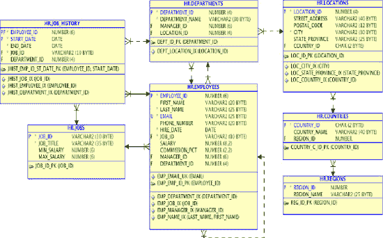

# 演进式数据建模

## 罗宾·桑兹

大学刚毕业时，我为洛克希德公司工作。第一年，我所在的小组负责评估制造资源规划方法与工具。我对 MRP 很熟悉；它是我学士学位必修课程的一部分，而且我之前也有一些 MRP 系统的经验。然而，在洛克希德，MRP 是个非常新的概念，并且它与现有系统背后的理念截然相反。我的老板兼导师，斯基普·克里斯托弗森，在洛克希德工作的时间比我年纪还大，他了解洛克希德排程系统的方方面面，甚至是最微小的细节。我们下班后一起上 MRP 课程，那情景就像一个经典喜剧场景：伶牙俐齿的新手轻松掌握材料，而那位经验丰富、真正知道事物如何运作的老员工却费力地理解这种所有花哨功能的时髦技术的意义。每晚课程结束，我们走回那间没有窗户的办公室时，斯基普会谈论所有他认为这个愚蠢想法的错误之处——一个系统每晚都能处理变更并重新生成排程，而不会把装配线搞得一团糟。我在学习洛克希德如何处理排程的同时，也在上 MRP 课程，并开始理解并欣赏它的工作原理。斯基普是对的：MRP 与我们的流程模型完全相反，我们的模型是基于数学、统计和学习曲线的。利用数十年成功飞机项目积累的知识，你计算出装配过程特定阶段的边界，并将其与车间位置关联起来。这些位置和日期为每个工作组创造了一个时间窗口，以容纳他们对装配的贡献。在这些边界内，零件和排程可能会疯狂地调整，工作组也会疯狂加班，但流水线上的人都知道，满足下一个位置的计划移动日期至关重要，他们已经学会无论如何都要实现它。飞机总是向前移动，即使装配线上三个位置之后的工作组不得不拆掉四个位置的工作，以添加一个当时需要时还无法获得的预制零件。

随着课程的深入，斯基普对 MRP 的担忧加剧了，他课后的抱怨也更加激动。他现在知道装配线为了让排程得以执行所经历的一切。如果排程每晚都变，工人如何能跟上信息的涌入，更不用说跟上实际的零件和飞机了？一天晚上，我仔细斟酌了措辞，然后向我的导师说出了我的想法。鼓起勇气后，我说：“斯基普，排程现在已经在每天变化了。唯一的区别是，如果它在系统里，你就能看见了。”他突然变得非常安静，那是我最后一次听到他抱怨 MRP。后来，他成为了 MRP 系统实施的倡导者，并在该技术和实施过程中都成为了专家。

变化总会发生，无论你是在制造飞机还是编写软件。你有一个选择：要么管理它，要么被它弄得措手不及。


### 从二十年的系统开发中学到的教训

1989 年，斯吉普到我大学招聘时面试了我，在我为他工作期间，他教会了我许多东西。自那份大学毕业后的第一份工作以来，我参与了许多不同类型的软件系统项目。其中一些项目规模很小，我能够独自设计和构建整个应用程序；而另一些则涉及全球数百人的团队。我参与的大多数项目都很复杂，而且每一个项目都被期望遵循加速的设计和实施进度。尽管存在种种差异，但系统开发中有一些基本的现实始终如一。

## 客户不知道自己想要什么（直到他们看到它）

客户只有在看到之后，才知道自己想要什么。只有当他们看到自己的数据能用来做什么时，他们才会开始理解一个新应用程序的真正可能性。也正是在这一刻，他们会开始向项目提出大量的变更请求。如果你想打造一款卓越的产品，最不该做的就是通过拒绝改变来扼杀他们的想法。

## 客户会撒谎（并非有意）

套用格雷戈里·豪斯医生的话说，客户会撒谎。请客户描述他们的流程，大多数时候，他们会给出流程的文档化版本。客户并非有意误导我们，但 ISO 认证流程教会了他们通过描述当前文档化的步骤来回答流程相关的问题。然而，许多流程本身存在缺陷，并且很可能存在书面文档中未包含的额外步骤。**观察客户的实际操作**，你才会看到真正的流程。当你看到文档中没有的步骤时，那就是你找到构建创新产品的最佳机会。

## 系统必须让用户的工作更轻松

如果你构建的系统能让用户的工作更轻松，他们就会使用它并提出更多要求：更多的选项、更多的功能和更高的性能。如果构建的应用程序只增加工作量却没有带来足够的益处，用户就会想办法绕过它，以从未设想过的方式使用它，或者完全避开它。这对他们来说是完全合理的反应：用户有工作要做，而对我们这些应用程序创建者来说至关重要的应用程序和代码，可能只是用户工作日中很小的一部分。当用户不得不绕过应用程序来完成工作时，就会报告更多的缺陷，数据也会随时间推移变得不准确。作为数据库和软件开发者，你需要记住，你的客户并不像你那样着迷于技术的细节。用户需要的是能够持续、可预测地工作的工具。

## 速度至关重要

如果你不能快速提供工具或产品，别人就会提供。这既适用于最终产品，也适用于其构建所依赖的开发环境。如果产品上市迟了，潜在客户就会寻找其他解决方案和其他供应商。如果数据库不能及时支持应用程序开发人员，他们就会寻找其他解决方案来完成工作。即使该解决方案不如使用数据库可能达到的效果好，但以后要移除或优化它通常会非常困难。通常，此类解决方案会在应用程序功能、性能或两者上产生长远的负面影响。

## 数据库设计的挑战

数据库管理系统擅长存储、搜索和转换数据。当与精心设计的数据模型相结合时，它们执行这些任务的速度将超过任何应用程序方法。挑战在于：数据库系统必须设计精良才能表现出色，并且能够在用户或数据量增长带来的日益增加的需求压力下持续表现出色。设计一个能够扩展以满足这些需求的数据库系统需要时间。如果在设计过程中走了捷径，数据库系统将无法满足性能要求；这通常会导致重大重新设计或硬件支出。这两种选择都代表了浪费和低效率：重新设计需要额外的时间和精力；即使硬件能够将系统性能提升到可接受的水平，试想一下，如果结合良好的设计和强大的硬件，系统的潜力将会有多大。

## 前进之路：拥抱变化

这一切听起来相当令人沮丧：如果客户不知道自己想要什么，不能准确描述他们的流程，并且会误用工具来减少自己的工作量，那么软件开发者及其构建的应用程序似乎注定要失败。你无法在前期就做出好的设计，因为你不知道应用程序和数据最终会变成什么样子；即便你在项目开始时就掌握了关于最终需求的完整而准确的信息，当竞争对手也在瞄准相同客户群时，你也没有时间进行数据建模和系统设计。然而，如果数据库设计有缺陷，用户会对系统响应时间感到不满，你的项目也会因响应缓慢和系统崩溃而备受困扰。

还有另一个选择。你可以做一些革命性的事情：认识到变化是不可避免的，为之做好准备并加以管理。如果你预期变化，或者更好的是，鼓励变化并从中学习，你就打开了创造客户确切所需产品的可能性。如果你观察最终用户执行工作，而不是要求他们描述工作，你就会发现当前流程中的痛点，并且可能能够轻松地消除这些痛点。这给了你一个真正创新并构建用户需要但无人想到的工具的机会。如果你在客户参与的情况下构建应用程序，在开发早期就将新功能交到他们手中，征求反馈并利用这些反馈在开发早期改进应用程序，其结果将是一个协作的过程和一个更好的产品。如果你观察客户使用你构建的工具，你会发现更多改进产品的方法。这被称为*迭代式设计*，我相信它能带来更好的产品、更满意的客户以及软件开发者更愉悦的工作环境。


### 数据库与敏捷开发

迭代开发并非新概念：已有大量书籍和专家探讨软件开发与迭代设计。但涉及数据库时，关于如何管理迭代数据库设计的有用信息却寥寥无几。与此同时，越来越多的应用数据库是在缺乏充分数据库设计的情况下创建的。无论是概念设计、逻辑设计还是物理设计，一个共同的主线是：在太多情况下，有意的设计规划是缺失的。这导致了一种极为常见的后果：数据库与应用未能达到预期性能。应用或许能通过功能测试要求，但一旦承受预期用户负载，其性能可能远不可接受。虽然让设计不佳的应用运行得更好是有可能的，但要构建一个能在并发用户不断增多、数据量持续增长的情况下依然满足性能预期的数据库，**必须**拥有一个设计精良的模式。你可以增加硬件资源来提升性能，但请思考一下：这些硬件资源中有多少仅仅是在弥补糟糕的设计？如果设计缺陷不存在，你本可以从硬件投资中获得多少额外收益？当模式存在缺陷时，应用代码所需的返工量会增加。这造成一个巨大的问题：数据库模式随时间推移被冻结，而应用功能却持续扩展。随着变更请求不断涌入，以及额外字段被强行添加到本已问题重重的模式设计中，性能问题变得越来越难以修复。

这类问题的最终结果是，架构师和开发者们得出结论：解决方案是尽可能在数据库中少放功能。这或许可以理解：因为他们已将数据库变更视为痛苦之事，于是试图通过避开数据库来规避这种痛苦。他们甚至避免使用数据库执行其最擅长的任务，因为他们担心未来可能需要变更它。对"**数据库无关性**"的追求加剧了这一问题，导致 DBMS 中一些最佳特性和功能未被使用。不幸且颇具讽刺意味的结果是：一个非常昂贵的 DBMS 闲置着，而团队却费力地尝试重新创建那些在现有许可下已经可用且已付费的功能。选择授权一个强大的产品，然后却像购买了最低公分母一样来设计应用，这是开发团队可能犯下的最昂贵错误之一。无论 DBMS 是 Oracle、MySQL、Postgres 还是 SQL Server，都是如此。优秀的开发者很难得。为何要让他们花费时间去重新创建其他公司已构建、而你们公司已购买的功能？如果目标是构建一个有竞争力的产品，在最大化我们投资回报的同时满足客户需求，那么你应该充分利用你所购买的 DBMS 平台中每一个有用的功能。

至此，我列举了软件开发项目中相互矛盾的目标：你需要快速构建；你需要在掌握足够知识之前就开始推进；你需要设计以支持长期性能目标，而这些性能目标很可能也是未知的。如果你还没有产品，你如何知道将来会吸引多少用户？如果你创造出令人惊叹和创新的东西，你将在比预期短得多的时间内获得比你想象中更多的用户。然后，你热情的用户将迅速使系统过载，导致又一个关于最新软件产品遭遇公开失败的头版新闻。你需要在追求稳定性的同时，通过迭代设计过程鼓励变更。你希望系统透明且易于使用，使用户无需每次连接都重新学习步骤就能完成工作，但你必须认识到，你对用户工作的理解可能并不准确。考虑到项目可能无法应对这些挑战的所有潜在方式，软件项目究竟如何才能成功？有一件事你不能做，那就是让时光倒流到开发速度没那么快的时代。相反，你必须预期设计将会变更，并配备数据库管理员、数据库开发者和应用开发者，以管理当今的变更，同时持续关注这些变更将对系统整体产生的长期影响。

 **注意** 在本章中，将提及*数据库开发*和*应用开发*。这两个标签都可能指同一应用的开发，且一个开发者可能负责这两个层面的开发。本章旨在区分访问和处理数据的代码，与构建工具向终端用户展示数据的代码，而非暗示需要一个额外的组织层级或一组人员。


### 演化式数据建模

## 理念阐述

尽管前面描绘的图景充满挑战，但我相信你的目标是可以实现的——关键不是减少在数据库管理系统（DBMS）中的工作。要创建一个敏捷的开发环境和一个真正敏捷的应用程序数据库，最好的方法是在数据库内部编码更多功能，并充分利用 DBMS 最擅长的工作类型。你的数据库设计需要随着开发团队、客户和最终用户不断变化的需求而演进和适应。你需要在一条精细的线上行走：构建当前所需，同时放眼未来并为之准备。这就是为什么我更喜欢“演化式数据建模”这个术语，而非“迭代式数据建模”。“迭代”意味着设计周期在整个开发过程中重复：这是一个好的开始，但还不够。“演化”也意味着持续的变化，但伴随演化，每一次变化都建立在迄今已创建的基础之上。当设计演进时，你认识到它应该能够扩展以满足尚未完全定义的需求。你仍然不想在需求出现之前就构建功能，但也不应该以“你不会需要它”（YGANI）的名义做出限制未来选项的选择。你做出的一些设计决策会为后续设计阶段创造更多选项，而另一些则会移除选项，并限制下一轮开发中的潜在解决方案。在你确定接下来要发生什么之前，请做出尽可能保留更多开放选项的选择。

 `Note` 据我所知，“演化式数据建模”这个术语起源于 Scott W. Ambler 在其网站 `agiledata.org` 上的内容。他还合著了一本书《重构数据库：演化式数据库设计》，其中包含了一些适用于敏捷开发的优秀方法论。本章描述的实现易于重构数据库的方法，与迄今为止我所看到的 Ambler 先生提出的任何建议都不同。

## 案例分析

例如，一个开发项目的数据库是从客户提供的 .csv 文件加载的。该文件中大约一半的列在第一轮功能规范中没有明确的用途。开发团队对于如何处理这些多余字段分成了两种观点。一方认为，所有不需要的列都应该被移除，因为它们没有被积极使用。另一方则认识到，尽管这些字段未被使用，但其值与应用程序核心数据值有明确的关系。他们认为这些字段可能有助于团队更好地理解所需数据以及最终用户如何处理这些数据。

这些不必要的字段被保留了下来。虽然它们看起来像是核心表中数据的父值，但解决方案是将这些字段保留为属性，以便可以进一步评估关系，而不会给数据库开发人员带来额外的工作（以及后续的返工）。这个决定打破了传统数据建模的几条规则：表中包含了不必要的数据，并且模式中的某些数据未被规范化。由于核心表仍然很小且宽度合理，违反规则的影响微乎其微。几个版本之后，客户开始提及这些未使用的字段，这证实了先前怀疑的关系。随着新功能的请求，这些数据值逐渐被整合到应用程序中，有些数据值移动到了父表，而另一些则作为属性保留下来。过早移除数据会限制团队的选择。如果过早地将数据正式整合到模式中，保留数据则可能造成返工。在这种情况下，以对影响最小化的形式保留数据，同时为日后使用敞开大门，是更好的决策。

## 后续内容预告

在下一节，你将看到演示简单模式变更的代码，以及此类变更如何在典型的开发环境中产生连锁反应。接下来，你将研究为什么使用 PL/SQL 作为 API 通过使得在不影响其他应用程序组件的情况下更轻松地重构数据库设计，从而支持演化式设计。之后，你将回顾一些敏捷开发概念，并讨论演化式数据建模和 PL/SQL API 如何支持敏捷开发的价值观和原则。


### 重构数据库

你将使用 Oracle 示例数据库中的人力资源（HR）模式，来演示对数据库模式进行的一项简单变更，并展示这些变更可能如何对应用程序内的其他功能产生意外影响。Oracle 提供的默认 HR 模式在员工表中包含一个电话号码字段。客户要求修改应用程序，以存储并显示每位员工的办公电话和移动电话号码。界面和报告将需要相应修改，因为有些仍需要特定的一个电话号码，而另一些则需要同时使用两个电话号码。例如，公司通讯录可能同时显示员工的座机和手机号码，而一份设施报告则只需要座机号码。

HR 模式的原始结构如图 12-1 所示。你需要确定新数据的存储位置以及如何向用户呈现信息。你应该考虑多种合理的解决方案，并决定哪一种（或哪几种）方案需要进行测试。



**图 12-1.** 未变更的人力资源模式

对于此类需求，一个常见的解决方案是向`EMPLOYEES`表中添加一个额外的列（`EMPLOYEES.MOBILE_NUMBER`）。虽然这可能解决了最初的需求，但解决该问题有更好的方法，因为这种方法只满足了眼前的需求。当人力资源部门决定还需要员工的家庭电话号码时怎么办？你可以继续添加列，但如果每个新增数据的需求都通过向`EMPLOYEES`表末尾添加一列来解决，你的表很快就会变得非常宽，且数据分布稀疏。这第一种方案也是一个相对局限的解决方案。如果一个员工在两个不同的办公室工作并拥有两个不同的办公电话号码怎么办？如果一位员工更倾向于通过手机联系，而另一位则更容易通过办公室电话联系，并且部门管理员需要一份包含所有员工及其最佳联系方式的报告怎么办？你可以再添加一列来存储员工偏好的电话类型指示符，然后让应用程序遍历数据，为一些员工提取办公电话号码，为另一些提取手机号码。这种类型的设计过程是性能问题如何产生的一个典型例子。列不断地被拼接到表上，并且需要更多的应用程序代码来处理这些列中的数据。最终，表变得非常宽，访问数据的代码因为数据库外部要做更多本应在`DBMS`中完成的排序和分组操作而变得越来越复杂，性能开始螺旋式下降。

更好的解决方案是创建另一个表来存储多个电话号码，并使用`EMPLOYEE_ID`关联回`EMPLOYEES`表。与第一种方案相比，这种方法有几个优点：数据库不会人为限制每个员工可存储的电话号码数量，而且你可以存储关于电话号码的额外属性，例如电话类型和首选电话。

清单 12-1 展示了如何添加一个表来存储员工 ID、电话号码、电话类型以及一个指示哪个电话号码是员工首选联系方式的标识。这段代码将创建新表并从现有表中填充数据。所有电话号码将被设置为默认类型“Office”（办公），首选标识将被设置为“Y”（是）。

然后，你将使用`EMPLOYEES`表中的数据填充新表。由于系统中所有员工之前都只有一个电话号码，你可以为所有员工设置默认的电话类型和首选标识为相同的值。

**清单 12-1.** 创建表并填充`EMP_PHONE_NUMBER`

```sql
SQL>  CREATE TABLE emp_phone_numbers
        (employee_id    NUMBER(6)                  NOT NULL,
         phone_number   VARCHAR2(20)               NOT NULL,
         preferred      VARCHAR2(1)   DEFAULT 'N' NOT NULL,
         phone_type     VARCHAR2(10)               NOT NULL,
            CONSTRAINT  emp_phone_numbers_pk
            PRIMARY KEY (employee_id, phone_number)
         ) ;

Table created.

SQL>  alter table EMP_PHONE_NUMBERS add constraint emp_phone_numbers_fk1
        foreign key (employee_id)
        references EMPLOYEES (employee_id) ;

Table altered.

SQL>  insert into emp_phone_numbers (
        select employee_id, phone_number, 'Y', 'Office' from employees) ;

107 rows created.

SQL>  commit;

Commit complete.
```

一些数据库重构方法建议，你应该在数据库中保留旧列，在确定所有对旧列的引用都已解决之前，同时填充新旧两个数据点。任何时候，如果你在数据库的多个地方存储相同的数据，就存在数据不同步的风险。然后你就需要对其进行协调，确定哪些值是正确的，并修复数据。在一个真实的人力资源数据库中，数据协调和修复可能是一项巨大的工作。有一些选项可以最小化此类问题的风险，但它们通常涉及将数据从一个源复制到另一个源，而这可能无法防止目标列被独立更新。如果对数据库的所有更改都需要维护多个数据源（即使是临时的），最终结果将是一个非常难以管理的开发环境。当你意识到典型的开发团队在任何时候都在响应多个变更请求时，这种方法会变得更加复杂。当开发人员在处理其他变更请求时，他们是否必须构建新的代码来同时支持旧字段和新字段？这些遗留的数据值可能在系统中保留多久？良好性能的关键在于消除不必要的工作：这对于流程和系统同样适用。如果开发团队要保持敏捷，你必须尽量减少他们需要完成的工作量。维护多个代码路径数周、数月或数年，并不是对开发资源的最佳利用。

更新查询以使用新表所需的变更很简单：你在 from 子句中添加另一个表，并在 where 子句中通过`EMPLOYEE_ID`连接`EMPLOYEES`表和`EMP_PHONE_NUMBERS`表。如果应用程序是在应用程序代码层（如`Java`、`PHP`等）中直接使用`SQL`调用编写的，那么类似清单 12-2 中显示的第一个查询可能会出现在应用程序中每个引用基本员工信息的模块代码中。清单 12-2 展示了一个在表设计变更前获取包含员工电话号码的员工信息的查询，以及该查询在表变更完成后如何被修改以请求相同的数据。

**清单 12-2.** 员工数据请求

```sql
SQL>  select dept.department_name,
             loc.street_address,
             loc.city,
             loc.state_province,
             loc.postal_code,
             cty.country_name ,
             emp.employee_id ,
             emp.last_name,
             emp.first_name,
             emp.email,
             emp.phone_number
        from departments dept,
             locations loc,
             countries cty,
             employees emp
       where dept.department_id = &DepartmentID
         and dept.location_id = loc.location_id
         and loc.country_id = cty.country_id
         and dept.department_id = emp.department_id
       order by dept.department_name, emp.last_name, emp.first_name ;
```

