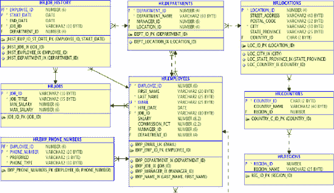

# SQL 查询与模式变更分析

`SQL> select dept.department_name,
             loc.street_address,
             loc.city,
             loc.state_province,
             loc.postal_code,
             cty.country_name,
             emp.employee_id EMP_ID,
             emp.last_name,
             emp.first_name,
             emp.email,
             epn.phone_number
      from departments dept,
           locations loc,
           countries cty,
           employees emp,
           emp_phone_numbers epn
     where dept.department_id = &DepartmentID
       and dept.location_id = loc.location_id
       and loc.country_id = cty.country_id
       and dept.department_id = emp.department_id
       and emp.employee_id = epn.employee_id
     order by dept.department_name, emp.last_name, emp.first_name;`

由于目前每个员工只填充了一个电话号码，采购部的两个查询的结果集是完全相同的。此时，任一查询都将返回如 清单 12-3 所示的数据。

### 清单 12-3. 部门 30（采购部）的简略员工数据

```
DEPT_NAME   EMP_ID LAST_NAME    FIRST_NAME    EMAIL       PHONE_NO
采购部      114    Raphaely     Den           DRAPHEAL    515.127.4561
采购部      115    Khoo         Alexander     AKHOO       515.127.4562
采购部      116    Baida        Shelli        SBAIDA      515.127.4563
采购部      117    Tobias       Sigal         STOBIAS     515.127.4564
采购部      118    Himuro       Guy           GHIMURO     515.127.4565
采购部      119    Colmenares   Karen         KCOLMENA    515.127.4566
```

 **注意** 为保持示例可读性，结果集可能经过编辑，以缩短列名和/或移除对示例不重要的数据。对示例不关键的结果可能不会显示。

## 潜在问题与疑问

表结构的更改为您的应用程序带来了几个潜在问题，这些问题很可能影响用户界面并产生新的错误报告。解决这些问题将需要从业务的功能侧获得反馈，因为您需要了解客户希望应用程序如何行为。以下是您需要弄清楚的几个问题：

*   客户期望如何输入员工电话号码数据？这个问题的答案将帮助您确定在确保可以安全删除原始列之前，保持两个数据源同步的方案。
*   您是否应该将电话类型和首选标志添加到相关查询中？在查询中包含此信息将为您处理界面和报告提供更多选择。
*   哪些查询需要为每个员工返回一个电话号码，哪些查询应返回多个电话号码？一旦员工的手机号码进入系统，清单 12-2 中查询的结果集将**不再相同**，因为原始查询只会返回一行，而新查询可能为一个员工返回多行。
*   如果存在基于此类查询构建的视图，向视图中添加额外字段是否会破坏应用程序？如果有人使用 `Select * from EMPLOYEES_BY_DEPT_VW` 来请求数据，那么会的。

## 后续步骤与挑战

一旦您回答了这些问题，您需要为所有引用 `EMPLOYEES` 表并使用电话号码数据的查询或更新确认相同的信息。否则，您的微小更改可能会在客户初始请求未预期的地方影响应用程序前端。

在您的应用程序中可能存在许多相似但略有不同的查询：不同的列顺序、由于不同的 `where` 子句导致不同的结果集、所选列的不同组合。每一段使用了原始电话号码字段的代码都需要被找到、更新和测试。保留旧列并同步数据将为您争取更多时间来找到所有需要修正的代码，但所有这些工作仍然需要完成。

重构数据库模式的**最大**挑战是找到并更改所有引用您所修改表的组件。如果开发人员一直很尽职，也许他们已经构建了可重用模块来处理 `EMPLOYEE` 数据的请求，那么您需要查找的代码就会更少。但是，您真的能确定没有人编写过一个虽小但未知、会在表结构更改时失败的查询或更新吗？在这个例子中，您只考虑了一个 `select` 语句。在一个人力资源系统中，将会有大量的应用程序代码用于添加员工、更改员工数据以及生成使用电话号码数据的报告。查看图 12-1 中的模式图，您会注意到存在循环引用，因为员工的经理是通过经理的员工 ID 在员工记录中标识的。包含员工和经理电话号码的查询、更新和报告可能需要更复杂的更改。而且，为了使事情真正有趣起来，订单录入模式也使用了 `EMPLOYEES` 表，使用 `EMPLOYEE_ID` 来指示完成销售的销售代表，因此您这个非常小的更改现在影响了多个模式和多个应用程序模块。当您想到这个模式是多么简单，并想象大多数数据存储可以有多复杂时，由提及模式变更所产生的恐惧就变得稍微可以理解一些了。


### 通过 PL/SQL 创建访问层

如果您将模块化、可重用的代码直接创建在数据库本身中，使得对应用数据的所有访问都封装在 PL/SQL 包、过程和函数中，会怎么样？清单 12-2 中引用的查询将被整合到一个过程中，如清单 12-4 所示。清单 12-5 展示了执行该过程的代码，而清单 12-6 则展示了一次示例执行的结果。此练习创建了一个可由数据库外部组件调用的过程，以返回与清单 12-2 中第一个查询相同的数据。

## 清单 12-4. 按部门返回员工数据的过程

```sql
CREATE OR REPLACE PROCEDURE GetEmployeeData(
       p_dept_id        IN  NUMBER,
       p_emp_cursor        OUT SYS_REFCURSOR,
       p_status_code       OUT NUMBER,
       p_status_message OUT VARCHAR2) IS
/********************************************************************************
    NAME: GetEmployeeData
PURPOSE: This procedure returns contact information for employees by department

  NOTES:

      p_status_code  status_message
      ==============  ======================================================
                  0  Success
             -20102  Input parameter p_dept_id must not be null.

***************************************************************************************/
BEGIN -- GetEmployeeData

--validate parameters
IF ((p_department_id) IS NULL ) THEN
   RAISE_APPLICATION_ERROR(-20102, Input parameter p_dept_id must not be null.',TRUE);
END IF;

OPEN p_emp_cursor FOR
   SELECT
         dept.department_id,
         dept.department_name,
         loc.street_address,
         loc.city,
         loc.state_province,
         loc.postal_code,
         cty.country_name,
  CURSOR (select emp.employee_id,
                 emp.last_name,
                 emp.first_name,
                 emp.email,
                 emp.phone_number
            from employees emp
           where emp.department_id = dept.department_id) emp_cursor
      FROM
           departments dept, locations loc, countries cty
     WHERE
           dept.department_id = p_dept_id
       AND dept.location_id = loc.location_id
       AND loc.country_id = cty.country_id
     ORDER BY 2,3;

  p_status_code:= 0;
  p_status_message:= NULL;

EXCEPTION
  WHEN OTHERS THEN
    p_status_code:= SQLCODE;
    p_status_message:= SQLERRM;

END GetEmployeeData;
/
```

## 清单 12-5. 过程执行脚本

```sql
set serveroutput on

         var p_main_cursor REFCURSOR

DECLARE
         v_dept_id         departments.department_id%TYPE;
         v_status_code     NUMBER;
         v_status_message  VARCHAR2(200);

         t0 timestamp;
         t1 timestamp;

BEGIN
         t0:= systimestamp;

         v_dept_id := &Department_ID;

  GetEmployeeData
          (v_dept_id, :p_main_cursor, v_status_code, v_status_message);

  t1:= systimestamp;

DBMS_OUTPUT.PUT_LINE('Code=' || v_status_code || 'Message=' || v_status_message);
DBMS_OUTPUT.PUT_LINE('ela=' || (t0 - t1) );

END;
/

   print :p_main_cursor
```

## 清单 12-6. 过程执行及结果集

```sql
SQL> @exec_GetEmployeeData.prc

Enter value for department_id: 30
  old  13:   v_dept_id := &Department_ID;
  new  13:   v_dept_id := 30;
  status_code=0  status_message
  ela=-000000000 00:00:00.000091000

PL/SQL procedure successfully completed.

DEPT_ID DEPT_NAME      STREET_ADDRESS    CITY       STATE         EMP_CURSOR
30      Purchasing     2004 Charade Rd   Seattle    Washington    CURSOR STATEMENT : 8

CURSOR STATEMENT : 8

EMPLOYEE_ID     LAST_NAME     FIRST_NAME   EMAIL      PHONE_NUMBER
        114     Raphaely      Den          DRAPHEAL   515.127.4561
        115     Khoo          Alexander    AKHOO      515.127.4562
        116     Baida         Shelli       SBAIDA     515.127.4563
        117     Tobias        Sigal        STOBIAS    515.127.4564
        118     Himuro        Guy          GHIMURO    515.127.4565
        119     Colmenares    Karen        COLMENA    515.127.4566

6 rows selected.
```

一旦过程就位，您的重构工作就会改变并变得更加完整。这次您可以创建并填充新表，一旦确定数据已正确填充，就可以删除旧列，移除重复数据以及可能导致不一致条目的隐患。您还可以使用您的执行脚本来完成第一轮测试，验证过程是否执行并返回了预期的结果集。虽然您总能在数据库中测试一个查询，但如果应用程序可能包含自己版本的代码，该测试的价值就有限了。本章稍后，您将学习如何使用模式权限来确保整个应用程序中一致地使用这些过程，从而让您有信心，重构数据库不会影响应用层。现在，请执行清单 12-7 中的代码。

## 清单 12-7. 使用 PL/SQL API 的重构练习

```sql
SQL>  CREATE TABLE emp_phone_numbers
        (employee_id    NUMBER(6)                   NOT NULL,
         phone_number   VARCHAR2(20)                NOT NULL,
         preferred      VARCHAR2(1)   DEFAULT 'N'   NOT NULL,
         phone_type     VARCHAR2(10)                NOT NULL,
            CONSTRAINT  emp_phone_numbers_pk
            PRIMARY KEY (employee_id, phone_number)
         ) ;

Table created.

SQL>  alter table EMP_PHONE_NUMBERS add constraint emp_phone_numbers_fk1
        foreign key (employee_id)
        references EMPLOYEES (employee_id) ;

Table altered.

SQL> insert into emp_phone_numbers (
     select employee_id, phone_number, 'Y', 'Office'
      from employees) ;

107 rows created.

SQL> commit;

Commit complete.

SQL> alter table employees drop column phone_number;

Table altered.
```

随着清单 12-7 中所示的更改完成，您立即实现了目标设计。新表已被创建和填充，旧的数据列已被移除。无需编写代码来保持重复值同步，也无需稍后重新审视此更改以删除旧列及其支持代码。您减少了应用程序和开发团队必须完成的工作。图 12-2 展示了您的新模式设计。



## 图 12-2. 人力资源模式，目标设计

在填充新表并删除旧列后，请务必检查应用程序模式中是否有任何对象因您的更改而失效。清单 12-8 将显示，不仅您预期的 `GetEmployeeData` 过程无效，而且有两个触发器也已失效。您需要做的第一件事是查看这些触发器的作用以及它们与 `EMPLOYEES` 表的关联方式。


## 清单 12-8. 验证并重新编译相关对象
作为验证更改的一部分，需要为每个失效的触发器选择源文本，并评估它们如何使用 `EMPLOYEES` 表。在 `清单 12-8` 中，您将使用数据字典来查看 `清单 12-7` 中的更改如何影响了模式中的其他对象。您将重新编译失效对象并确保所有对象都有效。`UPDATE_JOB_HISTORY` 触发器引用了 `EMPLOYEES` 表，但没有引用您移动到另一个表的列。`SECURE_EMPLOYEES` 触发器引用了另一个过程。您将检查 `SECURE_DML` 过程，并验证它也没有使用电话号码数据。这意味着两个触发器都可以按原样重新编译以恢复到有效状态。

```sql
SQL> select object_type, object_name, status
       from user_objects
      where status = 'INVALID'
      order by object_type, object_name ;

OBJECT_TYPE   OBJECT_NAME           STATUS
------------- --------------------- -------
PROCEDURE     GETEMPLOYEEDATA       INVALID
TRIGGER       SECURE_EMPLOYEES      INVALID
TRIGGER       UPDATE_JOB_HISTORY    INVALID

3 rows selected.

SQL> select text
       from user_source
      where name = 'UPDATE_JOB_HISTORY'
        and type = 'TRIGGER'
      order by line ;

TEXT
-------------------------------------------------------------------------
TRIGGER update_job_history
       AFTER UPDATE OF job_id, department_id ON employees
          FOR EACH ROW
BEGIN
  add_job_history(:old.employee_id,
                  :old.hire_date,
                   sysdate,
                  :old.job_id,
                  :old.department_id);
END;

7 rows selected.

SQL> alter trigger update_job_history compile ;

Trigger altered.

SQL> select text
       from user_source
      where name = 'SECURE_EMPLOYEES'
        and type = 'TRIGGER'
      order by line ;

TEXT
--------------------------------------------------------------------------
TRIGGER secure_employees
      BEFORE INSERT OR UPDATE OR DELETE ON employees
BEGIN
      secure_dml;
END secure_employees;

5 rows selected.

SQL> select object_type, object_name, status
             from user_objects
          where object_name = 'SECURE_DML' ;

OBJECT_TYPE  OBJECT_NAME        STATUS
------------------- ----------------------- -------
PROCEDURE    SECURE_DML          VALID

1 row selected.

SQL> select text
       from user_source
      where name = 'SECURE_DML'
      order by line ;

TEXT
-------------------------------------------------------------------------
PROCEDURE secure_dml
  IS
BEGIN
  IF TO_CHAR (SYSDATE, 'HH24:MI') NOT BETWEEN '08:00' AND '18:00'
  OR TO_CHAR (SYSDATE, 'DY') IN ('SAT', 'SUN') THEN
    RAISE_APPLICATION_ERROR (-20205,
      'You may only make changes during normal office hours');
  END IF;
END secure_dml;

9 rows selected.

SQL> alter trigger secure_employees compile;

Trigger altered.

SQL> select object_type, object_name, status
       from user_objects
      where status = 'INVALID'
      order by object_type, object_name ;

OBJECT_TYPE   OBJECT_NAME       STATUS
------------- ----------------- ------------
PROCEDURE     GETEMPLOYEEDATA   INVALID

1 row selected.
```

现在，您已经准备好更新 `GetEmployeeData` 过程以使用 `EMP_PHONE_NUMBERS` 表；再次强调，使用过程为您提供了在将 SQL 直接编码到应用程序层时所没有的选项。您不会更改此过程以提供客户要求的新功能，而是更改 `select` 语句，使过程返回与过去相同的结果集，但来自新的数据源。这是通过向 `where` 子句添加一个额外的限制因子来实现的，该子句现在将指定您希望接收每位员工的首选电话号码。另一种选择是指定该过程始终返回员工的办公电话号码。做出此决定的最佳方式是向客户提供行为选择。

请在此处暂停片刻，思考您已完成的工作。您重构了数据库，更改了表定义和数据位置，而没有以任何方式影响前端应用程序。每次应用程序代码调用 `GetEmployeeData` 过程时，它的行为都将与以往完全相同。如果应用程序仅使用过程，那么您就知道在分析和测试过程中没有遗漏任何未发现的 `select` 语句片段。更好的是，由于您能够在将更改交付给开发之前测试数据库中的执行情况和结果，因此您可以确信开发人员可以立即高效地完成他们需要完成的实际工作，即整合新功能。

## 清单 12-9. 更改 GetEmployeeData 过程
现在是进行应用程序更改的时候了，或者至少是更改应用程序调用的过程。`清单 12-9` 展示了如何修改 `GetEmployeeData` 过程以使用新表。您将把 `GetEmployeeData` 过程更改为使用新的 `EMP_PHONE_NUMBERS` 表来返回员工的首选电话号码。然后，您将执行 `清单 12-5` 中的测试脚本，以确认该过程按预期工作。

```sql
SQL>  CREATE OR REPLACE PROCEDURE GetEmployeeData(
             p_dept_id          IN NUMBER,
             p_emp_cursor       OUT SYS_REFCURSOR,
             p_status_code      OUT NUMBER,
             p_status_message   OUT VARCHAR2) IS

/**********************************************************************************
    NAME:  GetEmployeeData
PURPOSE:  This procedure returns contact information for employees by department

   NOTES:

  p_status_code  status_message
  =============  ============================================================
              0  Success
         -20102  'Input parameter p_dept_id must not be null.'

***********************************************************************************/
BEGIN -- GetEmployeeData

      --validate parameters

IF ((p_dept_id) IS NULL ) THEN
  RAISE_APPLICATION_ERROR(-20102, 'Input parameter p_dept_id must not be null.', TRUE);
    END IF;

OPEN p_emp_cursor FOR
     SELECT
            dept.department_id, dept.department_name,
            loc.street_address,
            loc.city, loc.state_province, loc.postal_code,
            cty.country_name,
     CURSOR (select emp.employee_id,
                    emp.last_name,
                    emp.first_name,
                    emp.email,
                    eph.phone_number
               from employees emp, emp_phone_numbers eph
              where emp.department_id = dept.department_id
                and emp.employee_id = eph.employee_id
                and eph.preferred = 'Y'
              order by emp.employee_id) emp_cursor
       FROM
             departments dept, locations loc, countries cty
      WHERE dept.department_id = p_dept_id
        AND dept.location_id = loc.location_id
        AND loc.country_id = cty.country_id ;

  p_status_code:= 0;
  p_status_message:= NULL;
```


### 测试确认与功能更新

## 数据库对象验证与过程测试
```sql
EXCEPTION
  WHEN OTHERS THEN
       p_status_code:= SQLCODE;
       p_status_message:= SQLERRM;

END GetEmployeeData;
/
```

确认所有模式对象均有效：
```sql
SQL> select object_type, object_name, status
      from user_objects
     where status = 'INVALID'
     order by object_type, object_name ;
```
```
no rows selected
```

执行测试脚本并确认过程按预期工作：
```sql
SQL> @exec_GetEmployeeData.prc
```
```
Enter value for department_id: 30
  old  13:   v_dept_id := &Department_ID;
  new  13:   v_dept_id := 30;
  status_code=0  status_message=
  ela=-000000000 00:00:00.000128000

PL/SQL procedure successfully completed.

DEPT_ID DEPT_NAME   STREET_ADDRESS   CITY      STATE        EMP_CURSOR
30      Purchasing  2004 Charade Rd  Seattle   Washington   CURSOR STATEMENT : 8

CURSOR STATEMENT : 8

EMPLOYEE_ID     LAST_NAME   FIRST_NAME   EMAIL       PHONE_NUMBER
        114     Raphaely    Den          DRAPHEAL    515.127.4561
        115     Khoo        Alexander    AKHOO       515.127.4562
        116     Baida       Shelli       SBAIDA      515.127.4563
        117     Tobias      Sigal        STOBIAS     515.127.4564
        118     Himuro      Guy          GHIMURO     515.127.4565
        119     Colmenares  Karen        KCOLMENA    515.127.4566

6 rows selected.
```

至此，您已经完成了模式设计更改，并执行了几个步骤来测试和确认您的更改。您知道，受表更改影响的所有模式对象都已被找到、重新编译，并且现在都是有效的。您对 `GetEmployeeData` 过程所做的唯一更改确保了它将继续保持其一贯的行为。下一步是合并请求的功能更改，并通过部门提供具有多个电话号码的员工数据。为此，您将创建一个新过程 `GetEmployeeData_MultiPhoneNo`，如清单 12-10 所示。清单 12-11 随后展示了如何测试这个新过程。

 **注意** 还有另一个更优雅的方法来解决这个问题：向原始过程添加一个新参数，以指示应向应用程序返回哪个电话号码或电话号码组合。新参数应默认为返回单个电话号码，可以是首选电话号码，也可以是办公室电话号码，具体取决于您的客户选择的选项。这种方法确保该过程将继续生成相同的结果集，而无需更改应用程序，并且当开发准备好包含新功能时，他们将使用相同的过程，但通过过程调用中的一个附加值来指定电话号码行为。

### 清单 12-10. 创建 `GetEmployeeData_MultiPhoneNo` 过程
```sql
SQL>  CREATE OR REPLACE PROCEDURE GetEmployeeData_MultiPhoneNo(
             p_dept_id          IN NUMBER,
             p_emp_cursor      OUT SYS_REFCURSOR,
             p_status_code     OUT NUMBER,
             p_status_message  OUT VARCHAR2) IS

/***************************************************************************************
     NAME: GetEmployeeData_MultiPhoneNo
  PURPOSE: This procedure returns contact information for employees by department

    NOTES:

   p_status_code  status_message
   =============  ============================================================
               0  Success
          -20102  Input parameter p_dept_id must not be null.

***************************************************************************************/
BEGIN -- GetEmployeeData_MultiPhoneNo

       --validate parameters
IF ((p_dept_id) IS NULL ) THEN
   RAISE_APPLICATION_ERROR(-20102, 'Input parameter p_dept_id must not be null.', TRUE);

END IF;

   OPEN p_emp_cursor FOR
     SELECT
            dept.department_id,
            dept.department_name,
            loc.street_address,
            loc.city,
            loc.state_province,
            loc.postal_code,
            cty.country_name,
     CURSOR (select emp.employee_id,
                    emp.last_name,
                    emp.first_name,
                    emp.email,
                    eph.preferred,
                    eph.phone_type,
                    eph.phone_number
               from employees emp, emp_phone_numbers eph
              where emp.department_id = dept.department_id
                and emp.employee_id = eph.employee_id
              order by emp.employee_id) emp_cursor
       FROM
            departments dept, locations loc, countries cty
      WHERE dept.department_id = p_dept_id
        AND dept.location_id = loc.location_id
        AND loc.country_id = cty.country_id ;

p_status_code:= 0;
p_status_message:= NULL;

EXCEPTION
   WHEN OTHERS THEN
     p_status_code:= SQLCODE;
     p_status_message:= SQLERRM;

END GetEmployeeData_MultiPhoneNo;
/
```

```sql
---- Create new test script to execute this procedure
---- only the procedure name is changed

set serveroutput on

  var p_main_cursor      REFCURSOR

DECLARE
  v_dept_id        departments.department_id%TYPE;

  v_status_code    NUMBER;
  v_status_message VARCHAR2(200);

  t0 timestamp;
  t1 timestamp;

BEGIN
  t0:= systimestamp;

  v_dept_id := &Department_ID;

  GetEmployeeData_MultiPhoneNo
     (v_dept_id, :p_main_cursor, v_status_code, v_status_message);

  t1:= systimestamp;
  DBMS_OUTPUT.PUT_LINE('code=' || v_status_code || 'message=' || v_status_message);
  DBMS_OUTPUT.PUT_LINE('ela=' || (t0 - t1) );

END;
/
   print :p_main_cursor
```

此时，新过程的结果集看起来与旧过程完全一样，因为系统中没有任何员工拥有多个电话号码。在清单 12-11 中，您将为一名员工添加多个电话号码，并确认原始测试脚本返回了正确的结果。您将为其中一名高管 Steven King 先生添加两个电话号码。他现在将有三个电话号码：办公室、手机和家庭电话。您还将把他的手机号码切换为他的首选号码，并确认他的手机号码将从原始的 `GetEmployeeData` 过程返回。

### 清单 12-11. 扩展的电话号码功能测试
```sql
SQL>  select * from emp_phone_numbers
      where employee_id = 100;
```
```
EMPLOYEE_ID PHONE_NUMBER        P PHONE_TYPE
----------- ----------------- - ----------
        100 515.123.4567        Y Office

SQL> 1 row selected.
```
```sql
SQL> insert into emp_phone_numbers
     values (100,'555.312.9876','N','Mobile');
```
```
1 row created.
```
```sql
SQL> insert into emp_phone_numbers
     values (100,'555.321.7345','N','Home');
```
```
1 row created.

Commit complete.
```
```sql
SQL> select * from emp_phone_numbers
     where employee_id = 100;
```
```
EMPLOYEE_ID PHONE_NUMBER        P PHONE_TYPE
----------- ----------------- - ----------
        100   515.123.4567      Y Office
        100   555.312.9876      N Mobile
        100   555.321.7345      N Home

SQL> 3 rows selected.
```
```sql
SQL> @exec_GetEmployeeData_MultiPhoneNo.sql
```
```
Enter value for department_id: 90
  old  13:   v_dept_id := &Department_ID;
  new  13:   v_dept_id := 90;
  status_code=0  status_message=
  ela=-000000000 00:00:00.000110000

PL/SQL procedure successfully completed.

DEPT_ID DEPT_NAME     STREET_ADDRESS    CITY      STATE       EMP_CURSOR
     90 Executive     2004 Charade Rd   Seattle   Washington  CURSOR STATEMENT : 8

CURSOR STATEMENT : 8
```


