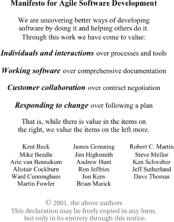
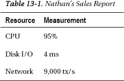
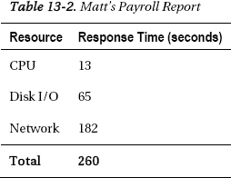
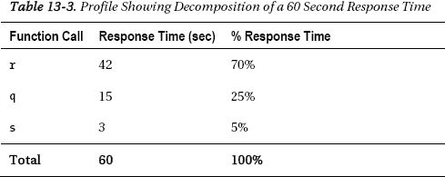

# 数据库重构示例：修改首选电话号码

`EMPLOYEE_ID    LAST_NAME  FIRST_NAME  EMAIL      P  PHONE_TYPE   PHONE_NUMBER`
`        100    King       Steven      SKING      Y  Office       515.123.4567`
`        100    King       Steven      SKING      N  Mobile       555.312.9876`
`        100    King       Steven      SKING      N  Home         555.321.7345`
`        101    Kochhar    Neena       NKOCHHAR   Y  Office       515.123.4568`
`        102    De Haan    Lex         LDEHAAN    Y  Office       515.123.4569`

`---- 将金先生的手机号设为他的首选号码`
`---- 执行 GetEmployeeData 过程`
`---- 确认默认行为返回首选号码`

`SQL>  update emp_phone_numbers set preferred = 'N'`
`       where employee_id = 100`
`         and phone_type = 'Office';`

`1 row updated.`

`SQL>  update emp_phone_numbers set preferred = 'Y'`
`       where employee_id = 100`
`         and phone_type = 'Mobile';`

`1 row updated.`

`SQL> commit ;`

`Commit complete.`

`SQL> select * from emp_phone_numbers`
`      where employee_id = 100;`

`EMPLOYEE_ID PHONE_NUMBER        P PHONE_TYPE`
`----------- ----------------- - ------------------`
`          100 515.123.4567      N Office`
`          100 555.312.9876      Y Mobile`
`          100 555.321.7345      N Home`

`3 rows selected.`

`SQL> @exec_GetEmployeeData`

`Enter value for department_id: 90`
`  old  13:   v_dept_id := &Department_ID;`
`  new  13:   v_dept_id := 90;`
`  status_code=0  status_message=`
`  ela=-000000000 00:00:00.002270000`

`PL/SQL procedure successfully completed.`

`DEPT_ID DEPT_NAME   STREET_ADDRESS    CITY      STATE         EMP_CURSOR`
`     90 Executive   2004 Charade Rd   Seattle   Washington    CURSOR STATEMENT : 8`

`CURSOR STATEMENT : 8`

`EMPLOYEE_ID     LAST_NAME  FIRST_NAME   EMAIL       PHONE_NUMBER`
`        100     King       Steven       SKING       555.312.9876`
`        101     Kochhar    Neena        NKOCHHAR    515.123.4568`
`        102     De Haan    Lex          LDEHAAN     515.123.4569`

如果你将这个结果集与上面的结果集进行比较，你会注意到金先生列出的电话号码是他的手机号。在任何重构练习中，你的目标都应该是识别出现有应用程序的大多数屏幕和报表中期望的行为，并对原始过程进行编码以返回那些结果。对于特殊情况，可以通过添加新过程或添加额外参数（默认设置为常用请求值）来处理。这将最大限度地减少整合这些变更所需的应用程序代码更改数量。

通过采取数据库设计和重构步骤以最小化对前端应用程序开发的影响，你已经真正实现了数据库与应用程序的解耦。数据库开发和应用程序开发之间有一条清晰的界线；对于数据库来说，这条界线可以在包含应用程序对象的模式（一个或多个）中进行验证和测试。这使得应用程序开发人员能够按照自己的节奏整合新功能，根据他们的任务优先级独立于数据库变更进行工作。在开发人员选择调用返回新版本数据的过程之前，数据库变更不会对应用程序产生任何影响。

这是否意味着应用程序开发人员、数据库开发人员和 DBA 不再需要协同工作和沟通？远非如此。在下一节中，你将了解敏捷背后的价值观，并探讨一些在敏捷数据库开发环境中充分利用 PL/SQL 的指导原则。

### 敏捷宣言

几年前，我发现自己对“*敏捷开发*”这个短语感到非常困惑。我听到了许多新术语，如“*scrum*”和“*sprint*”，碰到一群群站在走廊里的人（通常挡住了我要去的地方），并且注意到关于构建候选版本的邮件持续泛滥。与此同时，解释规范、文档和培训不再需要，因为每个人都接受过“*敏捷*”培训的呆伯特漫画副本出现在办公隔间的各个角落。这一切对我来说都挺有意思，直到我注意到实体关系图（ERD）和精心设计的数据库模式在这个新世界中也消失了。在那一刻，我决定是时候了解一些关于敏捷的知识了。

不幸的是，我的大部分阅读发现关于数据库的信息很少。我找到的少数资料似乎对现代数据库产品中可用的所有选项以及这些选项的使用如何影响数据库性能的理解非常有限。我想知道，对数据库设计缺乏关注是敏捷运动发起者有意为之，因为他们认为这没有必要，还是因为数据库设计被忽视了，因为大多数书中的典型用例都是处理在预先存在的数据库上构建应用程序。

因此，我从头开始，查看图 12-3 所示的《敏捷宣言》。我发现我完全同意该宣言以及支持它的《十二项原则》中的每一条。我也没有发现任何关于 scrum、sprint、站立会议或任何想要抹杀数据库设计的迹象。我在下面复制了《敏捷宣言》，你可以在 `agilemanifesto.org` 找到《十二项原则》。



**图 12-3.** 敏捷宣言

敏捷宣言列出了四个价值观：*个体和互动*、*工作的软件*、*客户协作*以及*响应变化*。这前四个价值观可与四个传统价值观相比较：*流程和工具*、*详尽的文档*、*合同谈判*以及*遵循计划*。注意每一行的措辞。宣言并没有说第二组价值观不再必要；它只是说第一组价值观更重要。宣言也没有确切地告诉你如何实现敏捷，这有一个原因。团队各不相同，对某个团队有效的方法可能对另一个团队有害。由于个体和互动比工具和流程更重要，并且是列在第一的价值对，你需要认识到工具和流程应该支持团队中的个体并鼓励团队成员之间的互动。当现有的工具和流程不符合这个目标时，就应该改变工具和流程。


听到我这么说的人通常会感到惊讶。毕竟，我在 2008 年写过一篇题为《工业工程师的数据库管理指南》的论文。在论文中，我指出了优秀的数据库管理实践与工业工程的相似之处，并非常强调流程和标准化。我仍然相信流程和标准化对于构建可靠、可重复构建的产品非常重要，但如果现有流程并未让团队更轻松地完成工作，那么缺陷在于流程本身，而非团队。正如用户会欣然使用能简化工作的应用程序一样，团队也会遵循能让工作更轻松的流程。流程存在缺陷的首要迹象就是人们不愿意遵循它。最佳解决方案是确保流程能创造价值且其效益显而易见。如果流程确有价值但执行过程令人痛苦，那么你需要工具来简化合规操作。当团队中每个人都持续遵循流程时，其效益才能最大化，而团队通常也非常愿意遵循那些易于满足已知要求的流程。

这当然是一个循环论证，但并非坏事。在这种情况下，你拥有一个良性的反馈循环：人们会遵循创造价值的流程；随着更多人遵循该流程，其价值也随之提升。早期的工业工程技术（即泰勒主义）认识到在流程（系统）优化中发现并消除瓶颈的重要性，但他们的做法是以牺牲流程中涉及的人员为代价的。后来的技术，如 W·爱德华兹·戴明博士提出的方法及精益制造中的应用，则认识到了流程中个体的价值。通过优化流程以提升团队以最简单、最便捷的方式完成工作的能力，丰田公司能够以更低的成本、更快地生产出比同时期遵循公认流程的公司质量更高的汽车。这正是敏捷的核心：聚焦于团队的价值和目标，定义支持这些目标的原则，然后创建能确保成员尽可能有效且高效地实现目标的流程（实践）。

## 在进化数据建模中使用 `PL/SQL`

在本节中，我将列举一些我亲身经历或认为有效的技巧。这并非详尽无遗的清单，也无意成为必须遵循的教条。在阅读这些技巧时，请思考`《敏捷宣言》`中的价值。以下每项技巧都至少符合一项核心价值，并支持团队适应变更、保持变更可见性以及持续改进其软件产品的能力。

### 定义接口

不要从设计数据库模式开始，而是先定义数据库与前端应用程序之间的接口。应用程序必须实现哪些功能？定义用户所需的数据以及他们为请求结果集将输入的值。定义他们需要更新的数据以及确认更新的方式。如果需要操作或转换数据，请确定需要对其执行的操作以及如何验证转换过程。此过程应包括数据库架构师、数据库开发人员和应用程序开发人员，完成后，最终达成关于数据库将为应用程序提供何种功能的共识。该协议必须包含应用程序团队将调用的任何对象的名称。如果需要视图，则应包括列名和数据类型。存储过程定义应包含所有必需的输入和输出参数。一旦达成共识，每个人都应获得所需信息，以便专注于其职责范围内的优化设计。任何变更都必须经过协商。如果后续发现表明数据库与应用程序不匹配的错误，审查接口协议将有助于确定如何解决该错误。定义接口的过程增加了团队成员之间的直接互动，并让他们聚焦于最重要的主题：最终用户所需的功能。

### 考虑可扩展性

`《敏捷宣言》`背后的原则之一是简洁性，即最小化待完成工作。对敏捷的一些解读将最小化工作理解为仅应编写满足当前需求的最小限度代码。这种思维方式的问题在于，当客户注意到响应速度变慢时，性能和可扩展性无法后期添加到构建中。我曾听人说：“客户又不是在买单凯迪拉克。现在先造辆尤格就行。”然而，有人曾成功地将尤格改造成凯迪拉克吗？任何懂车——或懂软件——的人都知道这根本行不通。

相反，你需要从构建一个坚实且可扩展的框架开始。对于汽车、房屋或软件系统而言，结构性变更都是重大变更。如果你有一个坚实的基础，就可以添加功能，让你的尤格/凯迪拉克初具雏形，让客户初步了解其可能性。也许客户会对尤格感到满意；也许应用程序会非常成功，最终成为凯迪拉克。采用进化式的数据库设计方法，并使用`PL/SQL`作为`API`，可以使数据库适应不断变化的需求，同时控制变更在应用程序下一层中实现的方式和时间。

许多敏捷倡导者提到，当识别出新的客户需求时，后期进行变更非常容易。这取决于哪些系统组件被视为设计的一部分。如果团队有一位架构师，而该架构师仅负责应用程序的设计，那么这可能是真的。然而，`架构师`是当今广泛使用的术语，如果所讨论的架构师负责硬件或软件平台，后期进行变更可能会成为一项非常复杂且昂贵的选择。目标应该是聚焦于本质：提供客户所请求结果所需的功能特性，同时为最终产品的可能走向做好规划。短发布周期和迭代开发为你提供反馈，确保你准确理解客户的请求。当你收到反馈时，它就提供了产品方向是否需要转变的第一线索。


#### 测试驱动开发

敏捷开发和极限编程中最有用的工具之一是测试驱动开发。其概念很简单：在编写任何代码之前，先设计好测试，以验证计划的代码变更已达成目标。有人可能会问，如何为尚不存在的软件功能编写测试？但不妨反过来思考：如果成败的标准尚未定义，又该如何编写代码呢？

当使用 `PL/SQL` 作为 `API` 时，确定必要测试的第一步是考虑约定的接口。接口提供了有关过程名称、参数和预期结果的信息。当然，对过程进行的变更测试应包括验证结果的准确性，但还有哪些其他类型的错误可能影响过程的行为呢？思考这个问题时，你会发现改进代码的机会。某些错误条件可以被捕获，然后过程可以向前端应用程序返回一条消息。如果应用程序传入了一个完全意想不到的值，会发生什么？当结果不符合预期时，会发生什么？当调用过程的应用程序会话在未完成任务的情况下消失时，又会发生什么？这些情况对于任何应用程序来说都是真实存在的可能性，但当代码能够捕获错误并以一种能帮助开发者识别输入为何无效或结果如何被影响的方式处理它们时，最终的应用程序对最终用户来说会更加健壮和稳定，从而显著提升软件的价值。

每个过程测试都应该是可编写脚本且可重复的。这些可重复的脚本构成了回归测试的基础，提供了一种工具来确认对一个过程的更改不会影响应用程序的其他部分。附带的好处是，这些脚本可以提供给其他人，作为故障排查或验证系统集成的工具。一旦测试可重复，它们就可以被整合到一个测试框架中，允许将整个测试序列作为一个包来执行。如果测试脚本可以使用 `shell` 脚本或 `PL/SQL` 代码执行，那么数据库开发者就能在应用程序开发端开始使用接口之前，确认接口协议要求的所有功能是否按预期工作。这将最小化前端开发团队在整合其变更与数据库变更时遇到的问题。更好的是，如果应用程序开发者确实遇到了错误，可以将数据库单级测试的结果与下一级开发中的参数和结果进行比较。这能加快故障排查和错误纠正，使开发过程的双方都更加敏捷。

#### 善用模式与用户

使用 `PL/SQL` 作为接口层的一个优势是，可以更改结构对象、重新编译数据库代码，并检查数据字典以确认整个模式有效。如果新变更对其他包、过程或视图有任何影响，它将立即可见，并且可以在错误传播到其他应用层之前进行修复。为了能够做到这一点，应该有一个包含所有应用程序对象的单一应用程序模式。在复杂的应用程序中，功能可以划分为模块，允许独立测试部分代码子集。这并不意味着不应执行完整的系统集成测试，或者应该将其推迟到项目后期。但如果能缩小问题的范围，问题通常可以更轻松、更快地解决。

创建一个独立的应用程序用户，并授予该用户执行接口协议和中心模式中定义的过程的权限。如果授予该应用程序用户更多访问权限，就会有人在其他部分构建直接的 `SQL` 语句的风险，这将使编译测试失效。这也会使识别拟议变更影响了多少应用程序代码变得更加困难，给规划过程增加复杂性和不确定性。

虽然限制应用程序用户 `ID` 的访问权限和权限有好处，但重要的是要注意，开发者需要访问模式对象，这不仅对数据库开发者是如此。前端应用程序开发者对 `DBMS` 及其内部数据了解得越多，他们就能越好地利用这个工具集。应鼓励开发者安全地探索数据库模式，有几个选项可以实现这一目标。在开发周期早期尽可能多地提供对数据库的访问，随着变更从开发数据库迁移到功能测试、系统集成测试和质量测试，逐步减少访问。如何提供这种访问取决于团队的技能。如果团队精通数据库知识，则允许直接访问模式。如果他们对 `DBMS` 和数据库技术缺乏经验，则创建具有不同权限类型的额外用户。这也为监控带来了好处：如果你发现一个失控的查询，但该进程是由只读用户发起的，而不是预期执行应用程序中过程的用户发起的，那么可以安全地终止该进程而不影响应用程序。如果开发者不值得信任，会在未经授权或在迁移过程的错误阶段更改代码或数据，则不应给予他们直接访问权限。审计提供了一种准确且简便的方法，使数据库内进行的所有更改都透明可见。

### 总结

敏捷性是指能够快速适应不断变化的条件。不仅如此，能够适应和演变以满足变化的条件和需求，对于保持竞争力至关重要。`DBMS` 软件本身并不限制你实施变更的能力，但你如何选择使用该软件以及如何设计应用程序却会带来限制。首先，你需要承认并为即将到来的不可避免的变更做好准备。然后，你需要评估项目目标以及你为实现这些目标所拥有的工具。支持敏捷开发流程**同时**拥有设计良好的数据模型是可能的。使用 `PL/SQL` 作为 `API` 可以通过提供一种允许数据库和应用程序演进并支持不断变化的客户需求的方法，来缓冲一些需要进行的变更。

## C H A P T E R  13


## 性能分析

**作者：罗恩·克里斯科**

*性能*和*性能分析*是我办公室日常交流、与客户互动以及教学中的关键词。这两个词同样适用于生活的方方面面，包括软件工程和我们当前的主题：`PL/SQL`。

我第一次接触`PL/SQL`是在其诞生之初，当时它是 Oracle 基于字符的交互式应用开发工具`SQL*Forms 3`的测试版。多年来，我学到了很多关于编写高性能`PL/SQL`代码的知识，我很高兴能与大家分享我的所学。

在`PL/SQL`的语境中，性能究竟意味着什么？本章结束时，我的目标是为你提供战胜性能低下代码所需的知识和理解。

> *业余者练到做对为止。专业人士练到不会做错为止。*
>
> ——佚名

除了我的软件开发与教育职业生涯外，我还是一名古典音乐演奏家，演奏最富英雄气概的乐器——`圆号`。任何领域的专家都有许多共同点。音乐和软件工程也不例外——我思考得越多，发现的共同点就越多。例如，这两个领域共享一个共同的词：performance（演奏/性能）。尽管乍一看它在两种语境中的含义似乎大相径庭，但这个词暗示了关于我们如何进行音乐和软件开发工作的一些非常重要的事情。

在音乐中，performance（演奏）被定义为对音乐作品的诠释，并在观众面前呈现。在软件开发中，performance（性能）被定义为软件实现其预期目的的方式或效率。这两个定义都将 performance 解释为一种最终结果。在音乐中，准备工作的最终结果包括学习音乐家所选乐器的基本技巧、学习通用乐谱、学习所选作品的特定记谱法、练习该作品所需的特定技巧，然后为实际演奏进行心理和生理上的准备。但作为一名专业音乐家，我知道演奏并不仅仅是这个过程结束时的一个单一事件。

> *永远不要“练习”，永远要“演奏”！*
>
> ——巴德·赫瑟斯，芝加哥交响乐团

换句话说，我意识到我的演奏听起来总会像我的练习一样，这是一个可怕的想法，除非我练习“演奏”。为了预先发现我的演奏听起来会怎样，我需要在练习时仿佛观众就在那里聆听一样去演奏音乐。只有通过这种方式练习，我才能评估作品中需要我集中精力改进的部分。

这一切如何与软件性能相关联，特别是`PL/SQL`代码的软件性能？真正的关键在于，能够在将软件投入生产之前，使用人们将在生产环境中看待它的相同视角来审视你的软件。专家的视角需要理解这些重要概念：性能、性能分析、插桩和问题诊断。

**一个音乐注记**

许多英语使用者用*Horn*这个词来泛指包括小号、萨克斯管和长号在内的一类乐器。通常被称为*French Horn*（法国号）的乐器，其起源和设计均非法国，正确名称应为`圆号`。更多信息请参见 [`http://en.wikipedia.org/wiki/Corno`](http://en.wikipedia.org/wiki/Corno)。这可能看起来微不足道，但对许多`圆号`演奏者，包括我在内，这是一件大事。

我将`圆号`描述为最富英雄气概的乐器。当伟大的作曲家为`圆号`创作音乐时，他们会充分利用这种乐器所能实现的广泛多样的音乐表现力。音乐史上有一个模式不断重复——当英雄登场时，`圆号`最常被选来提供音乐主题。在古典曲目中，理查德·瓦格纳、理查德·施特劳斯、彼得·伊里奇·柴可夫斯基和古斯塔夫·马勒等作曲家创作出激动人心、栩栩如生的英雄主题。在二十世纪的电影音乐中，约翰·威廉姆斯、埃里希·科恩戈尔德和霍华德·肖继承并拓展了这一传统。

### 什么是性能？

在软件语境中，*performance*这个词确实有几种不同的含义，因此我首先澄清一下我的用法。特别是在`PL/SQL`代码的语境下——实际上也适用于任何代码——性能可以从四个方面来考虑。

#### 功能需求

Performance 有时可用于描述软件执行满足所谓功能规格和定义的需求的程度。如果软件程序运行至完成而没有任何错误，准确地处理输入，并产生正确的输出，那么人们可能会说该软件性能良好。有多少次，你希望自己购买使用的软件能达到这个标准？这似乎是一个正常的期望，当然，但重要的是要看到这个定义的基本部分。

#### 响应时间

需求撰写者已经意识到，性能远不止于此。性能还关乎时间。软件完成了你期望的工作——但却在你期望几分钟内完成的情况下用了 34 小时才完成——它就未能通过“性能良好”的定性描述。当我们描述性能良好的软件时，必须在描述中引入时间因素。软件需求通常以单个工作单元、一个业务任务来表述。因此，需求必须说明该任务的预期功能，以及软件完成该任务所需的预期时间。这通常被称为*响应时间*：以时间单位衡量的业务任务单次执行的持续时间。

#### 吞吐量

但有时，以不同的方式衡量性能更有意义。*吞吐量*是指在指定持续时间内完成的业务任务执行次数。一个订单录入应用软件的需求可能会规定每小时至少录入 1,000 个订单的最小吞吐量。该需求当然暗示了对任何一个特定订单响应时间的某种限制，但对于负责订单录入应用的业务经理来说，这个指标更有意义。

对经理来说，只要达到了吞吐量目标，每个录入订单的单独响应时间就无关紧要。对于订单录入员和电话那头的客户来说，吞吐量则不予考虑。他们只关心一个特定的订单录入任务——他们自己的那个任务的响应时间。

优化响应时间是优化吞吐量的必要先决条件，但还不够充分。将每个订单的响应时间优化到 1/1,000 秒，并不能保证达到每秒 1,000 个订单的吞吐量。优化吞吐量还需要关注排队延迟和一致性延迟，但对这些内容的满意讨论超出了本章的范围。关于清晰的解释，我推荐 Cary Millsap 的论文《清晰思考性能问题》，可从 [`http://method-r.com/downloads/doc_download/44-thinking-clearly-about-performance`](http://method-r.com/downloads/doc_download/44-thinking-clearly-about-performance) 下载。


#### 资源利用率

考量性能的另一种方式是测量软件在执行业务任务期间所使用的资源。常见的指标包括 CPU 利用率、内存使用情况和 I/O 延迟。典型的诊断通常只讨论这些指标的聚合形式——换句话说，与单个业务任务的执行分离开来。尽管这些指标对于整体描述系统健康状况很有用，但我发现它们作为性能问题诊断的起点并不那么有效。相反，我认为当它们与响应时间的测量紧密结合时，会实用得多。请看下面的例子。

内森抱怨月末销售报告运行得实在太慢了。上个月它只用了 5 分钟就完成了。而这个月，他 15 分钟前启动了报告，到现在还没完成。系统监控显示 CPU 利用率高达 95%。平均磁盘 I/O 延迟看起来很好，只有 4 毫秒，网络管理员告诉我们吞吐量远低于容量，为 9,000 tx/s。表 13-1 展示了此信息的摘要。



马特抱怨月末工资单报告运行得实在太慢。上个月它只用了 5 分钟就完成了。在这 5 分钟里，20%的时间用在了 CPU 上，70%用在了磁盘 I/O 操作上，10%用在了网络调用上。而这个月，他 15 分钟前启动了报告，到现在还没完成。响应时间指标显示，在这 15 分钟里，5%的时间用在了 CPU 上，25%用在了 I/O 操作上，70%用在了网络调用上。表 13-2 展示了此信息的摘要。



考虑到所提供的信息，我更愿意处理马特的情况。这两张表格在视觉上相似，但传达的信息却截然不同。当试图根据表 13-1 来诊断内森的问题时，我只能*猜测*CPU 利用率是否是销售报告的问题所在，因为数据的聚合掩盖了我需要的细节。我当然知道整个系统的 CPU 使用率很高，但为了给销售报告解决问题，我需要知道该任务是否真的在等待 CPU 资源才能完成。

在马特的例子中，我获得了关于仅应用于其任务的资源利用率的宝贵信息。借助表 13-2，我可以*明确知道*该从哪里入手，并且充满信心地开始调查工资单报告如何以及为何在网络层消耗了时间。

#### 性能是一项功能

你应该将性能视为一项功能。它不是你工作的一个偶然结果；相反，它是你在设计和交付产品时有意为之的东西。卡伦·莫顿真正抓住了这个概念的重要性，她说：

> 因此，首先也是最重要的，我认为管理性能就是将一个简单的原则融入你的思维模式：**我对自己编写或维护的代码的性能负责。**
>
> ——卡伦·莫顿，《Expert Oracle Practices》（Apress 2010）

无论你遵循敏捷还是瀑布，极限编程还是快速应用开发，原型法还是螺旋模型，性能都应该在过程开始时、进行中以及过程“完成”后，都作为一个突出的功能特性。

功能需求应当伴随着性能期望，在某些业务场景中，这些期望是作为服务水平协议（SLA）表达的正式需求。这些期望不能在软件交付后强行施加。这似乎是一个显而易见的陈述，但在实践中，现实世界中发生的恰恰是这种情况。卡伦·莫顿的引述描述了软件开发团队中每个角色、每个人所必需具备的基本思维模式。从一开始，性能就必须包含功能和时间这两个概念。

当马特打电话抱怨工资单报告的性能时，他会打给谁？很可能是负责该应用的 DBA。而这个 DBA 可能从未参与过软件开发过程。软件应用文档会手把手地引导 DBA 完成问题诊断吗？很可能不会。它应该吗？绝对应该！软件本身会提供足够的信息来指引 DBA 找到可能的原因吗？很可能不会。它应该吗？当然应该！为什么性能问题在生产环境实现中被视为缺陷，而在开发和测试过程中却不是呢？

无论原因如何，最终解决问题的责任落在了 DBA 或性能分析师身上。他们解决问题的能力将取决于他们能收集到的关于该问题的信息质量。如果马特抱怨“整个系统都很慢”而没有指明具体问题，那么解决他的问题可能会令人痛苦。系统范围的、通常是抽样聚合的数据，可能无法揭示影响马特报告的问题。如果分析师仅依赖聚合数据，他们可能会花费无尽的时间和金钱去追逐错误的问题。他们可能会改进系统的某些部分，但在解决导致马特报告变慢的根本问题之前，他们并不算真正完成。

这并不是说优秀的 DBA 和性能分析师没有一直在解决像马特这样的问题——他们当然会。他们会提出能引向问题解决的好问题，例如：

*   系统变慢时，你具体在做什么？
*   当我告诉你系统不再变慢之后，你会立即执行哪项业务任务，以测试我的判断？

性能分析师使用各种工具来测量关键细节——在执行该业务任务期间，时间花在了哪里、消耗在了什么资源上。那么，你应该如何编写代码，才能真正帮助性能分析师——即编写出能提供超出功能需求之外的性能信息的代码？

### 什么是性能剖析？

性能剖析是在代码步骤执行时记录其日志。在某些情况下，剖析不强调时间，而是更侧重于事件序列和迭代次数。在其他情况下，每个代码步骤都会记录一个耗时测量值。

性能剖析对于许多软件开发人员来说是一项常见活动，甚至是日常实践。性能剖析是在开发过程中了解代码的好方法。第 7 章 描述了如何使用 Oracle 提供的包来剖析 PL/SQL 代码。你可能从其他软件语言中认识这些剖析器：

```
gcc –pg …; gprof …
```

```
java –prof …; java ProfilerViewer …
```

```
perl –d:Dprof …; dprofpp …
```

这些工具都以不同的方式展示剖析结果。为了能更清晰地描述最适合性能的剖析结果，我将首先快速解释一个能帮助开发人员更清晰地理解时间流逝的工具：序列图。


### 序列图

作为统一建模语言的一部分，序列图主要用于按交互发生的顺序展示对象之间的交互。在软件架构中，这些对象通常定义为应用层，如数据库、Web 服务器或浏览器。

在软件开发中，这些对象有时定义为应用代码中的层级，高层过程调用连续的低层过程。在最底层，这些过程通常代表对基本系统资源的调用。

当引入时间元素时，序列图对性能优化的价值最大。可视化地查看每个消耗响应时间的层级或层，且每个交互按所耗时间的比例缩放，可以使您专注于能获得最大性能提升的代码区域。

图表对于高层次理解流程非常有效，但随着越来越多对象和交互被添加到图中，细节会如此拥挤以至于丢失了整体价值。当我迷失在细节中时，我发现最有帮助的方法是汇总或聚合数据以找到我需要的信息。

### 配置文件的魔力

*配置文件*是序列图的表格化表示。它是对响应时间的分解，通常按组件响应时间贡献的降序列出。杂货店收据是类似的分解（虽然通常不按成本排序），在底部提供支付的总额，并列出所购每件商品的成本。表 13-3 展示了一个任务消耗了 60 秒时间的配置文件，该任务被分解为其组成函数。



配置文件可以被聚合，使得对同一函数的所有调用都报告在一行中。在表中添加一列显示每个函数被调用的次数有时很有帮助，特别是如果您想知道每次调用的平均响应时间。

当您确切地看到慢任务将 60 秒花在了哪里时，魔力就发生了。您现在*知道*任务 70%的响应时间被`r`函数调用消耗。同样有帮助的是，您知道任务*没有*在哪里花费时间。

### 性能分析的好处

以这种方式分析代码有许多好处。真正的关键是这种独特格式的配置文件所提供的可见性。好处包括：

*   您*知道*代码的时间花在哪里。没有准确的响应时间测量，您只能*猜测*。
*   您只优化相关的代码路径。配置文件将您的注意力集中在响应时间的主要贡献者上。没有这些信息，您会陷入强迫性调优障碍（CTD），调优所有能调优的东西，并且永远不知道何时才足够。Gaja Krishna Vaidyanatha 在第 7 章的《Oracle 洞见：橡木桌的故事》（Apress 2004）中定义并描述了 CTD。
*   您将学习集中在当前对您重要的话题上。如果您的响应时间完全由 `latch: cache buffers chains` 调用主导，那么今天是您的幸运日：您只需要研究 Oracle 数据库中超过 1000 种可插桩调用类型中的一种。
*   当您的目标达成时，您可以停止优化。通过配置文件，您知道业务任务每个组件可能的改进。您使用真实数据来证明您的断言，从而做出关于改进的经济决策。
*   您可以定量地*预测*您的补救措施将产生的影响。然后，您可以使用与预测时相同的度量单位直接验证结果。配置文件因此既是优化工具，也是所获收益的证明。

以这些方式使用配置文件只会让您成为更好的软件开发人员。为了完全负责代码的性能，您必须养成进行性能分析的习惯。

### 插桩

作为一名音乐家和软件开发人员，“插桩”这个词对我来说当然也有多种含义。当我思考音乐时，插桩被定义为特定音乐作品或编曲中要使用不同乐器的数量和种类。作曲家规定所需不同乐器的数量以及每种乐器所需的最少演奏者数量，记为独立的声部。作品的指挥和演奏者根据期望的音乐效果和可用的正确数量的音乐家，最终决定有多少演奏者将表演每个声部。

当我思考软件时，插桩具有不同的含义。如果配置文件是通过聚合顺序测量构建的，那么测量值从何而来？插桩是您代码中提供这些测量值的部分。就像音乐插桩一样，您的代码所提供的测量类型和数量会影响软件的整体性能。

考虑通常引发插桩主题的情况。当出现问题，程序的性能无法接受时，神奇的问题就出现了：“为什么这个程序这么慢？”


#### 为何此程序运行缓慢？

从理论转向实践，我们来审视程序 `p`。为什么程序 `p` 运行缓慢？

```
SQL> exec p
PL/SQL procedure successfully completed.
SQL>
```

显然，我缺少一个关键要素。没有更多信息，我只能猜测程序 `p` 运行缓慢的原因。在办公室里，我无数次听到类似我们公司信条的话。

> 当你能知道时，何必去猜？
>
> ——凯里·米勒萨

我当然能知道——我只需要测量。“慢”是以时间单位来衡量的，因此我需要测量程序 `p` 的**已用时间**。

```
SQL> set timing on
SQL> exec p
PL/SQL procedure successfully completed.
Elapsed 00:03:07.42
SQL>
```

现在我知道程序 `p` 执行了 3 分 7.42 秒。这是个好的开始，但要想了解程序 `p` 中哪些代码部分需要改进，我需要详细测量所有代码部分。（这是方法 R 的第二步，我稍后会详细说明）。详细的测量结果最好以性能剖析文件的形式呈现。那么，我如何获取正确的测量数据来创建剖析文件呢？我需要*插桩*。插桩就是你添加到代码中的东西，以使生成剖析文件成为可能。

首先，这是代码现在的样子：

```
CREATE OR REPLACE PROCEDURE p AS
BEGIN
  q;
  r;
  s;
END;
```

现在我添加插桩。

```
CREATE OR REPLACE PROCEDURE p AS
  t0 NUMBER;
  t1 NUMBER;
  t2 NUMBER;
  t3 NUMBER;
BEGIN
  t0 := DBMS_UTILITY.GET_TIME;
  q;
  t1 := DBMS_UTILITY.GET_TIME;
  DBMS_OUTPUT.PUT_LINE ('Procedure q: ' || (t1 - t0)/100 || ' seconds');
  r;
  t2 := DBMS_UTILITY.GET_TIME;
  DBMS_OUTPUT.PUT_LINE ('Procedure r: ' || (t2 - t1)/100 || ' seconds');
  s;
  t3 := DBMS_UTILITY.GET_TIME;
  DBMS_OUTPUT.PUT_LINE ('Procedure s: ' || (t3 - t2)/100 || ' seconds');
  DBMS_OUTPUT.PUT_LINE ('Total Elapsed: ' || (t3 - t0)/100 || ' seconds');
END;
```

这是执行此插桩代码后的结果：

```
SQL> set timing on serveroutput on
SQL> exec p
Procedure q: 1.05 seconds
Procedure r: 172.59 seconds
Procedure s: 14.11 seconds
Total Elapsed: 187.75 seconds
Elapsed 00:03:07.75
SQL>
```

我现在知道了一个非常重要的信息，这是没有某种插桩就无法得知的。这些结果提供了一个*剖析文件*，一份时间花费明细，显示了我的时间在代码中被用在了哪里。我承认这里展示的插桩方式很笨拙，我不会建议将这样的代码称为“成品”，但即便如此笨拙的插桩也是强大的。我将在下一节讨论如何改进插桩方法。

现在我知道，花时间优化过程 `q` 将收益甚微——最多不超过 1.05 秒（占总时间 187.75 秒的 0.56%）。同样地，优化过程 `s` 最多也只能获得 14.11 秒（7.52%）的提升。我的大部分时间花在了过程 `r` 上，所以我应该把优化的时间和精力集中在那里。如果我决定从过程 `q` 或 `s` 开始优化会怎样？我也许能极大地改进这些过程的个别响应时间，但如果我的目标是将整体响应时间减少 1 分钟，我的努力将会是失败的。为何要*猜测*？你可以*知道*应该专注于哪里。

插桩让你的代码更快、更易于维护、编写成本更低。插桩让代码更快，因为它向你展示了所有让代码更高效的机会，无论是在编写时还是完成后。插桩让代码更易于维护，因为它在你的分析人员说你的代码太慢时，确切地向他们展示了代码在做什么。插桩让编写代码成本更低，因为它让你的调优努力只集中在真正影响性能的代码部分。良好的插桩就是你的代码性能要求已得到满足的证明。

### 测量侵入性

注意在我这个简短的例子中，添加插桩后的已用时间是 3 分 07.75 秒，比原来的 3 分 07.42 秒长了 0.33 秒。想象一下，如果这些测量是在一千次执行过程中计算的平均值。插桩也是代码，而所有代码都会影响一个工作单元的整体响应时间。聪明的开发者知道，移除多余和不必要的代码对于性能优化至关重要。

那么，你是否应该认为这段插桩代码是多余且不必要的？绝对不是！代码不仅必须满足任务的要求，还必须在软件的整个生命周期内表现良好。

汤姆·凯特（Tom Kyte），`http://asktom.oracle.com/` 背后的“汤姆”，曾在一次会议上被问及，Oracle 数据库中内置的所有插桩（通过各种 V$ 和 X$ 固定视图发布的数据、扩展的 SQL 跟踪数据等）的测量侵入效应有多大。他若有所思地停顿了一下，然后自信地回答说，测量侵入相当于*负*百分之十，甚至可能更少。他接着解释说，如果没有在 Oracle 数据库内核中编写的插桩，Oracle 服务器技术部门的开发者将无法有效地优化他们的代码。由于拥有了他们的插桩所提供的详细程度，开发者们能够在每个版本中改进代码的性能。

### 标识

除了为单个程序单元提供响应时间值的代码外，插桩还可用于标识数据库中的应用程序代码。能够将数据库中消耗的资源直接与特定的业务任务关联起来，是性能优化的关键组成部分。Oracle 提供了许多不同的方法来实现这一目标。


## DBMS_SESSION.SET_IDENTIFIER

应使用 `DBMS_SESSION.SET_IDENTIFIER` 以简化运行时的性能分析。使用此命令可让数据库实例知道每个会话关联的是哪个最终用户。Oracle 在版本 10 中引入了这种“端到端应用跟踪”功能。例如，如果你的应用在数据库层面通过唯一账户验证用户，可以在登录触发器中将标识符设置为用户名和 IP 地址。

```
CREATE OR REPLACE TRIGGER LOGON_TRIGGER
AFTER LOGON ON DATABASE
DECLARE
  l_identifier VARCHAR2(64);

BEGIN
  L_identifier := SYS_CONTEXT('USERENV', 'OS_USER') || ':' ||
                  SYS_CONTEXT('USERENV', 'IP_ADDRESS');
  DBMS_SESSION.SET_IDENTIFIER(l_identifier);
END;
/
```

最终用户的标识信息现在可见于 `V$SESSION.CLIENT_IDENTIFIER` 列、其他数十个视图以及为该会话生成的任何扩展 SQL 跟踪文件中。要为已知的最终用户标识符启用跟踪，请调用 Oracle 内置过程，如下所示：

```
DBMS_MONITOR.CLIENT_ID_TRACE_ENABLE(client_id=>'HR:Claire:425542',
                                    waits=>TRUE,
                                    binds => TRUE,
                                    plan_stat => 'ALL_EXECUTIONS'      -- 11g 及以后版本
                                    );
```

跟踪文件将包含一行格式如下的内容：

```
*** CLIENT ID:(HR:Claire:425542) 2011-03-16 01:59:13.317
```

如果你的应用在最终用户之间共享会话，则此信息需要从应用层而非数据库层设置。应使用应用级会话 ID 或用户名，而非 IP 地址。关键是要利用必要的信息来识别对数据库会话中执行的工作负责的最终用户。

为最终用户标识符启用跟踪现在将把数据输出到多个跟踪文件，因为你的应用正在共享会话。Oracle 实用工具 `trcsess` 可用于整合来自包含相同 `CLIENT ID` 的多个跟踪文件的信息。例如：

```
trcsess output=425542.trc clientid=HR:Claire:425542 *.trc
```

 `注意` 不要将 `V$SESSION.CLIENT_IDENTIFIER` 与 `V$SESSION.CLIENT_INFO` 混淆，后者是使用 `DBMS_APPLICATION_INFO.SET_CLIENT_INFO` 过程设置的。尽管 `DBMS_MONITOR` 提供了基于从 `DBMS_APPLICATION_INFO` 设置的 `MODULE` 和 `ACTION` 来启用和禁用扩展 SQL 跟踪的过程，但 `CLIENT_INFO` 列在 `DBMS_MONITOR` 中没有对应项。

## DBMS_APPLICATION_INFO.SET_SESSION_LONGOPS

如果你有一个预先可知将长时间运行的任务，请使用 `DBMS_APPLICATION_INFO.SET_SESSION_LONGOPS` 来标识该任务。此过程会在 `V$SESSION_LONGOPS` 视图中填充一行，该行可用于监视你的长时任务的进度。该过程的参数与视图中的列大致对应，因此可以轻松实现对应用程序特定细节的可见性，而且方式极其轻量。

请注意，Oracle 会在统计信息收集、并行查询执行和服务器管理恢复等任务期间自动填充此视图，因此你的数据将与那些数据交错在一起。以下代码展示了使用此过程的示例：

```
DECLARE
  l_rindex      BINARY_INTEGER;
  l_slno        BINARY_INTEGER; -- Oracle 内部使用
  l_op_name     VARCHAR2(64)    := 'Month end posting';
  l_target      BINARY_INTEGER; -- 正在处理的对象 ID
  l_target_desc VARCHAR2(32);   -- 目标描述
  l_context     BINARY_INTEGER; -- 与任务相关的数字，如已处理数量等
  l_sofar       NUMBER(6,2);    -- 迄今已完成的工作量
  l_totalwork   NUMBER := 100;  -- 预估的总工作量
  l_units       VARCHAR2(32)    := 'records';
BEGIN
  -- rindex 用于标识 V$SESSION_LONGOPS 中的行
  -- 使用 _nohint 调用将为我们创建一个新的行和 rindex
  l_rindex := DBMS_APPLICATION_INFO.SET_SESSION_LONGOPS_NOHINT;

  FOR i IN 1 .. l_totalwork LOOP

    -- 在实践中，这将是一个更复杂的计算。
    -- 这个简单示例假设每个子任务的处理时间是均匀的
    l_sofar := i;

    DBMS_APPLICATION_INFO.SET_SESSION_LONGOPS(rindex      => l_rindex,
                                              slno        => l_slno,
                                              op_name     => l_op_name,
                                              target      => l_target,
                                              target_desc => l_target_desc,
                                              context     => l_context,
                                              sofar       => l_sofar,
                                              totalwork   => l_totalwork,
                                              units       => l_units);

    -- 处理在此处发生

    COMMIT;
  END LOOP;
END;
/
```

 `提示` Oracle 目前没有提供用于删除 `V$SESSION_LONGOPS` 中行的过程。此视图代表 Oracle 底层固定大小表之一的数据，因此行实际上并不会被删除。达到最大行数后，旧行会被新行替换。对于由 Oracle 功能（如统计信息收集）插入的行，操作完成时 `TIME_REMAINING` 列将被设置为 0。对于你自己的数据，请确保在任务完成时将 `SOFAR` 和 `TOTALWORK` 设置为相同的值，因为无法通过该过程访问 `TIME_REMAINING` 列。


## DBMS_APPLICATION_INFO.SET_MODULE

虽然`DBMS_APPLICATION_INFO.SET_SESSION_LONG_OPS`过程专门用于识别长时间运行的任务，但 Oracle 确实提供了一种轻量级方法来识别当前在数据库中执行的所有应用程序任务。`module`和`action`的值可在`V$SESSION`及许多动态性能视图中查看。`DBMS_MONITOR.SERV_MOD_ACT_STAT_ENABLE`可用于查看视图`V$SERV_MOD_ACT_STATS`中任何模块和操作的实时统计信息。

正确设置`module`和`action`的值是将数据库中的性能统计信息与业务任务关联起来的**最佳方式**。例如：

```
CREATE OR REPLACE PROCEDURE p AS
BEGIN
  DBMS_APPLICATION_INFO.SET_MODULE(module_name => 'Month End Posting',
                                   action_name => 'p');
  q;
  r;
  s;
  DBMS_APPLICATION_INFO.SET_MODULE(module_name => NULL,
                                   action_name => NULL);
END;
```

请注意，就像`DBMS_SESSION.SET_IDENTIFIER`一样，Oracle（在 10g 及更高版本中）提供了使用`DBMS_MONITOR`包根据模块和操作值开启扩展 SQL 跟踪的功能。要为已知的模块和操作启用跟踪，请调用 Oracle 过程，如下所示：

```
DBMS_MONITOR.SERV_MOD_ACT_TRACE_ENABLE(service_name => 'V11202',
                                       module_name => 'Month End Posting',
                                       action_name => 'p',
                                       waits => TRUE,
                                       binds => TRUE,
                                       plan_stat => 'ALL_EXECUTIONS'     -- 11g 及更高版本
                                       );
```

跟踪文件将包含格式如下的行：

```
*** SERVICE NAME:(V11202) 2011-05-13 20:26:22.919
*** MODULE NAME:(Month End Posting) 2011-05-13 20:26:22.919
*** ACTION NAME:(p) 2011-05-13 20:26:22.919
```

`module`和`action`应该使用什么值呢？模块名称应能唯一标识应用程序的一部分。操作名称应表示在该模块内正在执行的逻辑工作单元。模块和操作的名称都应尽可能贴近业务术语。

 `注意` Oracle 除了为 PL/SQL 提供钩子外，也为其他语言提供了对`module`和`action`标识符的挂钩。在 OCI 中，使用过程`OCIAttrSet`来设置`OCI_ATTR_MODULE`和`OCI_ATTR_ACTION`值。详情请参见[`http://download.oracle.com/docs/cd/E11882_01/appdev.112/e10646/ociaahan.htm`](http://download.oracle.com/docs/cd/E11882_01/appdev.112/e10646/ociaahan.htm)。

在 Java 中，使用 JDBC 方法`OracleConnection.setEndToEndMetrics()`，该方法首次在 Oracle 10g 中提供。详情请参见[`http://download.oracle.com/docs/cd/E11882_01/java.112/e16548/dmsmtrc.htm`](http://download.oracle.com/docs/cd/E11882_01/java.112/e16548/dmsmtrc.htm)。

在 Perl 中，使用`DBI->connect`函数（在`DBD::Oracle`中）来设置属性`ora_module_name`和`ora_action`。详情请参见[`http://kobesearch.cpan.org/htdocs/DBD-Oracle/DBD/Oracle.html`](http://kobesearch.cpan.org/htdocs/DBD-Oracle/DBD/Oracle.html)。

这些语言，以及任何其他可以访问数据库层的语言，也可以通过 PL/SQL 调用直接使用`DBMS_APPLICATION_INFO`来设置值。与 OCI、Java 和 Perl 示例不同，这种方法会带来额外的网络往返开销，因此在代码循环内部进行这些 PL/SQL 调用之前需要仔细考虑。

`DBMS_APPLICATION_INFO`包不跟踪嵌套的操作。当你使用`SET_MODULE`过程时，之前的`module`和`action`值会丢失，因此你需要在代码中正确处理这个问题。在代码的最高层级结束时将它们设置为`NULL`是合理的，但在内部过程`q()`、`r()`和`s()`中应如何使用`SET_MODULE`呢？一种选择是在被调用的过程中避免设置`module`和`action`，仅在最高层级的过程中设置它们。例如：

```
CREATE OR REPLACE PROCEDURE p AS
BEGIN
  DBMS_APPLICATION_INFO.SET_MODULE(module_name => 'Month End Posting',
                                   action_name => 'q');
  q;
  DBMS_APPLICATION_INFO.SET_MODULE(module_name => 'Month End Posting',
                                   action_name => 'r');
  r;
  DBMS_APPLICATION_INFO.SET_MODULE(module_name => 'Month End Posting',
                                   action_name => 's');
  s;
  DBMS_APPLICATION_INFO.SET_MODULE(module_name => NULL,
                                   action_name => NULL);
END;
```

一个更好的选择是通过在对`set_module`进行调用前存储先前的值，并在完成时恢复它们来处理嵌套问题。每个被调用的过程都应包含类似的代码，而不仅仅在最高层级的代码中进行检测。过程的每个退出点，包括异常处理部分，都需要重置`module`和`action`。例如：

```
CREATE OR REPLACE PROCEDURE p AS
  l_module VARCHAR2(48);
  l_action VARCHAR2(32);
  l_sqlcode NUMBER;
  l_sqlerrm VARCHAR2(512);
BEGIN
  DBMS_APPLICATION_INFO.READ_MODULE(module_name => l_module,
                                    action_name => l_action);
  DBMS_APPLICATION_INFO.SET_MODULE(module_name => 'Month End Posting',
                                   action_name => 'p');
  q;
  r;
  s;
  DBMS_APPLICATION_INFO.SET_MODULE(module_name => l_module,
                                   action_name => l_action);
EXCEPTION WHEN OTHERS THEN
  l_sqlcode := SQLCODE;
  l_sqlerrm := SQLERRM;
  DBMS_APPLICATION_INFO.SET_MODULE(module_name => l_module,
                                   action_name => l_action);
  -- 在此处处理异常
END;
```

我**无法过分强调**在您的应用程序中结合使用`DBMS_APPLICATION_INFO`的价值。维护`module`/`action`堆栈虽然麻烦，但我很快就会讨论一种简化它的方法。

### 条件编译

第 4 章描述了如何使用 PL/SQL 的条件编译功能为 PL/SQL 代码添加计时信息检测。在性能分析师能够控制运行时应用程序并且性能问题易于重现的情况下，可以使用此方法。

如果问题可以在测试环境中重现，那么可以重新编译 PL/SQL 代码并开启计时检测。如果必须使用生产环境（让我们面对现实，这种情况发生得太频繁了），有办法将侵入性降至最低。不要在活动模式中重新编译 PL/SQL，而是将 PL/SQL 复制到一个单独的模式中。然后可以在新模式中重新编译代码，而不影响生产用户。

要将特定用户重定向到新创建的模式，可以修改应用程序或创建一个登录触发器。然后重现问题。最后，根据计时代码提供的数据，构建问题任务的响应时间概况，并通过解决性能问题让您的朋友们惊叹不已。


#### 内置性能分析器

第 7 章 鼓励你利用 Oracle 数据库附带的几个工具包来分析你的代码：`DBMS_HPROF`、`DBMS_TRACE` 和 `DBMS_PROFILER`。这些包提供了分析你的 PL/SQL 代码的功能，每个包的关注点略有不同。我在此只作简要介绍，因为我更感兴趣的是能够覆盖整个软件生命周期的解决方案。

在开发过程中了解你的代码至关重要，因此能够轻松在代码行或子程序级别进行性能分析的工具是非常宝贵的。但是，这些工具能否轻松集成到你的应用程序中？测量的侵入性有多大？性能分析师能否在不招致对所有其他业务任务的侵入性惩罚的情况下，轻松获取特定业务任务的响应时间数据？

使用这些内置包可能正是你想要的，但我发现它们未能很好地回答这些问题。幸运的是，我找到了一个更好的答案：一个提供 `DBMS_APPLICATION_INFO` 插桩标准并启用 Oracle 内部插桩的 PL/SQL 库。在我详细介绍这个库之前，我需要先介绍这种插桩。

#### 扩展 SQL 跟踪数据 (事件 10046)

Oracle 的内核插桩，即扩展 SQL 跟踪数据，最初被称为“伪错误调试事件 10046”。此插桩被添加到 Oracle 代码中，用于优化数据库应用程序以及内核本身。此插桩生成的跟踪文件恰好提供了开发人员想要的：其代码花费时间的线性顺序记录。

跟踪文件中包含的详细程度允许分析师深入了解数据库会话的内部工作方式。与内置性能分析器非常相似，有时这种细节程度可能令人难以招架。在正确级别进行插桩是真正的关键。Oracle 的 `tkprof` 聚合数据以便理解细节，但这样做时，它隐藏了重要的关系。真正需要的是以配置文件格式聚合数据，以一种将你的注意力集中在特定业务任务中最大响应时间消耗点的方式来总结细节。

构建性能不佳的业务任务的配置文件是成功优化的关键。我使用 Method R Profiler 软件来生成配置文件，识别响应时间的最大贡献者，并解决性能问题。有时问题在于糟糕的 SQL，有时在于糟糕的 PL/SQL，有时在于配置问题，有时在于更复杂的情况。但在每种情况下，配置文件都是最佳的起点。有时，DBA 团队对启用跟踪或向开发团队提供访问权限有抵触情绪。

> *即使需要国会法案和医生的信才能让 DBA 给我必要的权限，我也会运行跟踪。*
> 
> ——受挫的客户

但是，获取那些跟踪文件是非常值得的。插桩非常好的应用程序可能会报告足够的详细计时信息来解决大多数问题。但在某些情况下，真正的性能问题隐藏在应用程序的数据库层中。在这些情况下，性能分析师需要插桩的关联性：包含所执行业务任务细节的扩展 SQL 跟踪文件。更好的是，智能应用程序应在需要时生成包含此关联信息的跟踪文件。

#### Oracle 插桩库 (ILO)

`ILO`，即 Oracle 插桩库，是一个开源项目。我是当前的维护者，但其创建的荣誉属于 Eric Evans。`ILO` 由 PL/SQL 包组成，包含用于使用 Oracle 扩展 SQL 跟踪识别和测量任务的过程，以及用于收集和存储特定业务任务响应时间数据的过程。这些包被安装并编译在目标 Oracle 实例中，并且可以由任何能够访问 Oracle 数据库层的代码调用。`ILO` 与 Method R `SLA Manager` 完全集成，允许你组织和分析整个应用程序系统的响应时间数据。

 **注意** `ILO` 是在 SourceForge 上提供的开源软件，[`http://sourceforge.net/projects/ilo/`](http://sourceforge.net/projects/ilo/)。它需要 Oracle Database 9.2.0.1 或更高版本。它在 GNU 宽松通用公共许可证（LGPL）下免费发布，[`http://gnu.org/copyleft/lgpl.html`](http://gnu.org/copyleft/lgpl.html)。`SLA Manager` 是来自 Method R Corporation [`http://method-r.com/software/slam`](http://method-r.com/software/slam) 的商业软件。

##### 为什么你应该使用 ILO？

使用 `ILO` 为代码插桩的好处包括以下几点：

*   对于运行 `ILO` 插桩应用程序的操作员和分析师来说，分析指定业务任务的确切持续时间非常容易。想象一下，用户抱怨人力资源系统中“添加员工”操作太慢。借助 `ILO` 插桩，性能分析师可以轻松获取其诊断和修复用户特定问题所需的 Oracle 扩展 SQL 跟踪数据。
*   开发人员不再需要担心何时或为何使用 `DBMS_APPLICATION_INFO` 或 `DBMS_SESSION` 将其应用程序的部分注册到 Oracle 数据库。业务任务现在通过 `Module` 和 `Action` 在 `V$` 视图中可见。
*   开发人员不再需要担心在应用程序中插入代码行来管理 Oracle 的“扩展 SQL 跟踪”功能（也称为 10046 跟踪、`DBMS_SUPPORT` 跟踪或 `DBMS_MONITOR` 跟踪）。
*   使用 `ILO`，你的 Oracle 跟踪文件将被正确地限定时间范围，并将*仅*包含属于你响应时间的耗时描述。
*   `ILO` 包含钩子，允许你存储特定任务的响应时间历史记录。然后，你将能够报告性能趋势或违反服务级别协议的情况。
*   `ILO` 经过真实世界测试。它轻量且可靠。


## 工作原理

ILO 非常易于使用。你用一行代码标记每个任务的开始和结束，为每个任务分配一个模块和操作名称。可以将操作视为任务本身的名称，而模块则代表该任务所对应的应用程序部分。

标记任何任务的开始，就像进行一次过程调用并包含模块、操作和注释的值一样简单。标记任务结束时，再次进行一次简单的过程调用。务必包含被标记任务的所有可能退出点，包括代码中的任何 `EXCEPTION` 部分。例如：

```sql
DECLARE
  l_sqlcode NUMBER;
  l_sqlerrm VARCHAR2(512);
BEGIN
   ilo_task.begin_task(module  => '加载事务表',
                       action  => '开始整体加载',
                       comment => '执行过程 all_trx_table_loads');

   ... 你的任务代码放在这里

   ilo_task.end_task;
EXCEPTION
   WHEN ex_insert_problem THEN
      l_sqlcode := SQLCODE;
      l_sqlerrm := SQLERRM;
      ilo_task.end_task(error_num => l_sqlcode);
      ... 处理异常
   WHEN others THEN
      l_sqlcode := SQLCODE;
      l_sqlerrm := SQLERRM;
      ilo_task.end_task(error_num => l_sqlcode);
      … 处理异常
END;
```

 **提示** `SQLCODE` 和 `SQLERRM` 在代码的 `EXCEPTION` 部分始终处于活动状态。如果你的异常处理引发了另一个异常，原始的 `SQLCODE` 将被新错误替换。请注意，几乎任何一行代码都可能引发异常。在引用这些内置函数之前，请将内容保存到局部变量中。然后，你的日志记录和插桩过程应使用这些局部变量来记录正确的错误。另请注意，ILO 的异常处理是可配置的。默认情况下，ILO 过程会抑制自身异常，以避免对生产代码产生负面影响。

扩展 SQL 跟踪的启用和禁用应在应用程序运行时执行，此时开发人员参与项目早已结束。`ilo_task.begin_task` 调用会检查是否有人通过调用 `ilo_timer.get_config` 表达了跟踪特定模块/操作对的意图。该过程确定应跟踪哪些任务，通常在每个 ILO 安装中都会进行定制。

希望进行单元测试的开发人员可以调用特殊过程 `ilo_timer.set_mark_all_tasks_interesting(TRUE,TRUE);` 来覆盖正常的 `ilo_timer.get_config` 处理，但对此过程的调用通常不会出现在生产代码中，除非它们是作为菜单选项实现的（例如，帮助  调试  跟踪所有）。使用 ILO 的最大好处在于，跟踪的选择是一个精确控制的运行时决策。无需 DBA 手动干预来为会话开启跟踪，ILO 提供了一种机制，可以从应用程序表达开启跟踪的意图，并在无需干预的情况下实现任务特定的跟踪。

## 示例

PL/SQL 代码的一个常见用途是处理多代码路径的 DML 触发器。在以下示例中，触发器根据原始 DML 是 `INSERT` 还是 `UPDATE` 执行不同的操作。良好的插桩不仅应告知你代码覆盖率，还应帮助你衡量正确的事务。

```sql
CREATE OR REPLACE TRIGGER insert_or_update_example
    INSTEAD OF INSERT OR UPDATE ON table_abc
DECLARE
  v_storage_value VARCHAR2(32000);
  l_sqlcode       NUMBER;
BEGIN
  IF INSERTING THEN
    ilo_task.begin_task(module => 'Table_ABC',
                        action => 'Instead of insert',
                        comment => 'Table_ABC 上的插入或更新触发器');
    example_package.create_value
    (p_value_name     => :NEW.value_name
     ,p_value         => :NEW.value
     ,p_description   => :NEW.description
     ,p_storage_value => v_storage_value
    );
    example_package.setup_something_else
    (p_storage_value => v_storage_value
    );        
  ELSIF UPDATING THEN
    example_package.update_value
    (p_value_name     => :NEW.value_name
     ,p_value         => :NEW.value
     ,p_description   => :NEW.description
     ,p_storage_value => v_storage_value
    );        
  ENDIF;
  ilo_task.end_task;
EXCEPTION WHEN OTHERS THEN
  l_sqlcode := SQLCODE;
  ilo_task.end_task(error_num => l_sqlcode);
  ... 处理异常
END;
```

假设你已经对 `example_package` 中的各个程序单元进行了插桩，你可能会认为在此触发器中进行进一步插桩是多余的。但如果你的插桩目标是为测试和诊断性能问题提供正确的性能指标，那么这个插桩就至关重要。

使用 ILO 的众多好处之一是，该库能正确处理模块/操作对的嵌套。想象一下如果情况并非如此，模块和操作会发生什么。最后一个设置值的过程或函数将承担直到值被再次设置之前所花费的所有时间的全部责任，从而导致你无法看到该任务的实际响应时间。

### 问题诊断

你应如何解决性能问题？当某件事耗时过长时，问一个问题：“我的时间去哪儿了？”这就是方法 R。

### 方法 R

“方法 R”是 Cary Millsap 和 Jeff Holt 谦逊地命名的他们用于诊断和修复性能问题的四步方法，记录在《*优化 Oracle 性能*》（O'Reilly, 2003）一书中。“R”代表响应时间，与他们称为“方法 C”的传统方法形成对比。

方法 R 规定了四个简单的步骤。

*   识别对你最重要的任务。
*   详细测量其响应时间。
*   以经济高效的方式优化该响应时间。
*   重复，直到你的系统达到经济最优。

这就像优化生活中任何其他事物一样来优化软件。

#### 步骤 1：识别

***识别***对你最重要的任务。向你的软件业务利益相关者提出以下问题：

*   哪个执行缓慢的业务任务对业务的负面影响最大？
*   首先修复哪个任务会最令人满意？

不可避免地，你会得到许多任务都极其重要的答案。不过别慌，这并非意料之外。只需接着问这个问题：“如果所有这些任务的优先级都相同，那么我们可以从任务 X 开始吗？”

你会得到同意或进一步的澄清。也许任务 Y 确实需要先解决。无论哪种情况，关键是选择 ***一个*** 任务，然后继续方法 R 的下一步。如果整个系统确实很慢，并且存在一个根本原因，那么处理任何一个缓慢的任务都会迅速导向那个根本原因。修复该任务的性能问题也将有益于系统的其余部分。

相反，如果该任务有一个独特的根本原因，那么你解决这个问题也不会浪费时间，因为你从一个已知对业务重要的任务开始。任何流程或方法的关键在于正确地开始。正如玛丽·波平斯引用亚里士多德的话：

> *良好的开端是成功的一半。*
>
> ——亚里士多德


## 第 2 步：测量

详细`测量`任务的响应时间。在任何性能分析活动中，测量都应该是您关注的首要焦点。准确的测量能清晰地指出根本问题。不准确的测量则可能让您陷入徒劳的“兔洞”追猎中。

当我说“响应时间”时，我指的是最高优先级任务的响应时间，从最终用户发出工作请求开始，到最终用户收到所请求的信息或处理完成的通知为止。获取这些测量值有时很困难，但总是值得的。

当我说“详细”时，我指的是以性能剖析的形式。了解响应时间的每一刻消耗在何处，并聚焦于最大的时间消耗者。剖析可以详细展示程序代码单元或资源利用情况，但底部的总计`必须`是您所测量响应时间的 100%。如果不是，您需要更准确地重新测量，或者重新考虑您构建剖析的方式。

软件性能分析常被描绘成艺术而非科学，但我不同意这种说法。良好的性能分析完全关乎测量。

> *有两种可能的结果：如果结果证实了假设，那么你完成了一次测量。如果结果与假设相反，那么你完成了一次发现。*
>
> —恩里科·费米

## 第 3 步：优化

以最具经济效益的方式`优化`该响应时间。首先，找到并消除不必要的工作。我反复发现，这是评估新性能问题的最佳起点。每天早上 8 点运行的那个 600 页报告是绝对必要的吗？真的有人读它吗？每天晚上重建索引的作业最近评估过吗？从业务任务层面提出正确的问题是最好的起点。

如果它确实需要，那么也许可以将报告安排到凌晨 2 点运行？也许可以在数据中心用`SQL*Plus`执行，而不是在 2000 英里外的`Excel`中运行。如果您无法消除所有工作，次优选择是减少要完成的工作量。将业务规则从中层应用移到数据库层是实现此目标的一个好方法。第 11 章提供了一个详细的案例研究，展示了在数据库中编写代码的好处。

如果您的关键任务严重依赖某个资源，请考虑重新安排在同一时间竞争该资源的其他工作。负载管理是一个非常有效但常被忽视的工具。让业务相关方参与性能优化至关重要。如果您把皮卡车开到修理厂，让技术人员调试您的车辆，他们会如何调校？每位技术人员对“调校”的含义都有自己的理解。您是想开着皮卡车在陡坡上拉着一车床钢材跑 2 小时？还是想在当地周五晚上的泥地赛道上赢得一场 200 英里的比赛？知道这些问题答案的技术人员会正确完成工作。同样，了解业务工作负载期望的性能分析师也会正确完成工作。

优化应用程序中的代码路径或优化单个 SQL 语句时，减少工作量也是目标。关键在于专注于效率，以最少的资源消耗完成适量的工作。手头有了正确的测量值，您就`知道`哪里需要改进。

> *完成任何事情最快的方法，就是完全不去做它。*
>
> —卡里·米尔萨普

 **提示** 将业务规则移到数据库层是一个备受争议的话题，但 Toon Koppelaars 对此的论证比我听过的任何人都更有力。如果您渴望通过将代码移到尽可能低的层来获得性能收益，请查看 Toon 的构想以及他对“赫尔辛基宣言（IT 版）”的解释：[`http://thehelsinkideclaration.blogspot.com/`](http://thehelsinkideclaration.blogspot.com/)。

## 第 4 步：重复

`重复`以上步骤，直到您的系统达到经济最优。系统的性能总是可以提升的，但成本会越来越高。通过准确测量业务任务的响应时间，您可以预测对软件或硬件资源进行给定变更所带来的改进。然后，可以将量化的改进与实现该改进所需的成本进行权衡。当改进的成本超过所获得的业务价值时，调优过程就结束了。当球进洞时——就停止。

> *去打高尔夫吧。去高尔夫球场。击球。找球。重复直到球进洞。享受乐趣。就这样。*
>
> —查克·霍根


