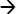
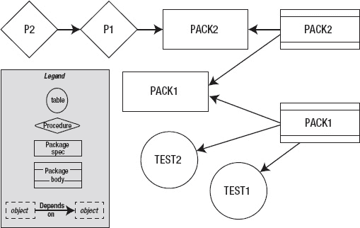

# Oracle RAC 数据库中的解析与依赖管理

 **注意** 在一个 RAC 数据库中，这种解析效果更为显著。由于存在多个实例，每个实例都有自己独立的库缓存，因此解析和失效过程必须被仔细协调。例如，当实例 `INST1` 中的表 `ORDERS` 被修改时，`UPD_QTY` 过程不仅需要在实例 `INST1` 中被失效；在 `INST2` 中也同样需要（假设是一个双节点的 RAC 数据库）。实例 `INST1` 会向 `INST2` 发送一条消息，立即标记 `UPD_QTY` 的已加载版本为无效。由于存在其他人可能错误访问 `UPD_QTY` 过程的可能性，这条消息以高优先级作为**直接消息**发送。因为直接消息优先于其他类型的消息（例如请求一个数据块，这被称为**间接消息**），其他消息可能没有机会被传输。这导致获取数据块出现延迟；请求数据块的会话必须等待，从而加剧了性能问题。

问题不止于此。正如你所见，过程在执行时会自动重新编译。它被验证，然后该消息立即传输到 `INST2`。RAC 互联网络被此类消息淹没，影响了其他消息和数据块的流动，从而导致性能问题。随着实例数量的增加，这个问题会变得更加严重，因为需要协调的工作量呈指数级增长。与数据块不同，库缓存中的对象（游标、表、包等）没有“主实例”概念，因此 RAC 必须通知集群中的所有实例来失效（并验证）该对象。

在一个典型的应用程序中，你可能有很多过程，这些过程又调用很多其他过程。假设过程 `P1` 调用过程 `P2`，`P2` 又调用 `P3`，而 `P3` 访问表 `T1`。我们可以用下图表示这种情况，其中  表示“依赖于”：

`P1`  `P2`  `P3`  `T1`

这被称为`依赖链`。如果 `T1` 被修改，链中位于其左侧的所有依赖对象都可能被失效，并且必须在使用前重新编译。重新编译必须按照依赖顺序进行，例如先编译 `P3`，然后是 `P2`，最后是 `P1`。这种重新编译可以是自动的，但它无论如何都会消耗解析所需的 CPU 周期，并且需要解析锁。`依赖链`越长，对解析的需求就越大，从而导致更多的 CPU 消耗和对解析锁的需求。在 RAC 数据库中，控制这一成本变得极其重要；否则，其影响将失控。因此，你的目标应该是减少重新验证的循环并缩短`依赖链`。

## 关于 SYS_STUB_FOR_PURITY_ANALYSIS?

你注意到输出中那个命名奇怪的包 `SYS_STUB_FOR_PURITY_ANALYSIS` 了吗？我很确定你没有创建它，而且你肯定没有在过程中使用它。如果你检查数据字典，你会看到只有包的规范（Specification），而没有包体。无论如何，你甚至没有引用这个包，那为什么它被列为 `UPD_QTY` 过程的父对象呢？

这又是解析机制的另一个隐藏工作原理。还记得 PL/SQL 代码段的纯净度模型吗？总的来说，它规定了存储代码改变数据库和包状态的可能性，例如“不写数据库状态”（WNDS）或“不读包状态”（RNPS）。这些被称为存储代码的纯净度级别。在编译存储代码时，Oracle 会假定其处于这些纯净状态之一。然而，考虑这个复杂的情况：有一个名为 `ORDERS` 的公共同义词。当你创建这个过程时，解析必须假定你指的是*你自己的*对象 `ORDERS`，而不是公共同义词 `ORDERS`。但假设另一个用户正在创建一个同名过程（使用相同的代码），而他没有名为 `ORDERS` 的表？在这种情况下，解析将指向公共同义词。这给解析器带来了一个有趣的问题——必须考虑对象的作用域和纯净度。Oracle 通过访问一个特殊的包来解决这个问题，该包中定义了针对纯净度状态的过程。以下是该包的定义：

```sql
Create or replace package sys_stub_for_purity_analysis as
  procedure prds;
  pragma restrict_references(prds, wnds, rnps, wnps);

  procedure pwds;
  pragma restrict_references(pwds, rnds, rnps, wnps);

  procedure prps;
  pragma restrict_references(prps, rnds, wnds, wnps);

  procedure pwps;
  pragma restrict_references(pwps, rnds, wnds, rnps);
end sys_stub_for_purity_analysis;
```

由于这些过程仅仅是为了提供指向纯净度级别的指针，没有其他用途，因此包体不存在。为什么依赖树可以只针对包规范而没有包体存在？这个有趣的话题将在本章后面讨论。就目前而言，我们希望你对这个奇怪引用的包 `sys_stub_for_purity_analysis` 的解释感到满意。


### 缩短依赖链

如何减少这种解析-失效-解析事件的恶性循环？有一个好消息是，Oracle 开发团队已经注意到这个问题，并在 Oracle Database 11g 中改变了常规的依赖模型。Oracle Database 11g 不再依赖于对表或视图的修改来使依赖对象失效，而是采用了一种细粒度的依赖机制，同时检查列的变更。只有当所引用的列被修改时，依赖对象才会失效；否则，它们将保持有效状态。

那么，在你确实必须修改列的情况下呢？在 Oracle Database 11g 中，这可能会触发失效。完全避免它可能是不可能的，但你可以通过缩短依赖链来减少其影响。例如，如果上述依赖链只有两级而不是四级，那么需要重新编译的对象就会更少，从而减少 CPU 消耗和解析锁。如何实现这一目标呢？

答案在于另一种类型的存储代码：包。包处理失效的方式不同，在遇到上游对象变更时，它们比过程和函数更不容易受到这种失效涟漪效应的影响。让我们通过一个例子来看看。首先，创建一系列表、包和过程。

```sql
-- 创建两个表
create table test1 (
   col1  number;
   col2  number
)
/
create table test2 (
   col1  number;
   col2  number
)
/
-- 创建一个包来操作这些表
create or replace package pack1
is
    g_var1  number;
    l_var1  number;
    procedure p1 (p1_in test1.col1%TYPE);
    procedure p2 (p1_in number);
end;
/
create or replace package body pack1
as
    procedure p1 (p1_in test1.col1%type) is
    begin
        update test1
        set col2 = col2 + 1
        where col1 = p1_in;
    end;
    procedure p2 (p1_in number) is
    begin
        update test2
        set col2 = col2 + 1
        where col1 = p1_in;
    end;
end;
/
create or replace package pack2
is
    procedure p1 (p1_in number);
    procedure p2 (p1_in number);
end;
/
create or replace package body pack2
as
    procedure p1 (p1_in number) is
    begin
        pack1.p1(p1_in);
    end;
    procedure p2 (p1_in number) is
    begin
        pack1.p2(p1_in);
    end;
end;
/
-- 创建两个调用这些包的过程
create or replace procedure p1
(
    p1_in   in number
)
is
begin
    pack2.p1 (p1_in);
end;
/
create or replace procedure p2
(
    p1_in   in number
)
is
begin
    p1(p1_in);
end;
```

你创建了两个表，然后是引用这些表的两个包（这些包随即成为表的依赖项），一个调用其中一个包的过程，以及最后另一个调用此过程的过程。从定义上看，依赖链*似乎*是这样的：

`P2`  `P1`  `PACK1,PACK2`  `TEST1,TEST2`

现在修改表`TEST2`的一个列：

```sql
SQL> alter table test2 modify (col2 number(9));

Table altered.
```

根据依赖规则，所有对象（`PACK1`、`PACK2`、`P1`和`P2`）都应该失效，并且保持失效状态，直到手动或自动重新编译它们。通过检查所有相关对象的状态来确认这一点。

```sql
select object_type, object_name, status
from user_objects;
```

```
OBJECT_TYPE         OBJECT_NAME                     STATUS
------------------- ------------------------------ -------
PROCEDURE           P1                             VALID
PROCEDURE           P2                             VALID
PACKAGE             PACK1                          VALID
PACKAGE BODY        PACK1                          INVALID
PACKAGE             PACK2                          VALID
PACKAGE BODY        PACK2                          VALID
TABLE               TEST1                          VALID
TABLE               TEST2                          VALID
```

有趣的是，唯一失效的对象是包体`PACK1`；所有其他对象仍然有效。这是怎么发生的？为什么所有依赖于表`TEST2`的对象都没有失效？

答案在于包的依赖工作方式。让我们通过运行一条 SQL 语句来检查这些依赖关系。由于需要多次运行它，请将以下内容保存为`dep.sql`：

```sql
select referenced_type, referenced_owner, referenced_name
from dba_dependencies
where owner = '&1'
and name = '&2'
and type = '&3'
```

现在你可以多次调用此脚本并使用适当的参数来获取依赖关系信息。

```sql
SQL> @dep ARUP P2 PROCEDURE

REFERENCED_TYPE   REFERENCED_OWNER                REFERENCED_NAME
----------------- ------------------------------ ------------------------------
PACKAGE           SYS                            SYS_STUB_FOR_PURITY_ANALYSIS
PACKAGE           SYS                            STANDARD
PROCEDURE         ARUP                           P1

SQL> @dep ARUP P1 PROCEDURE

REFERENCED_TYPE   REFERENCED_OWNER                REFERENCED_NAME
----------------- ------------------------------ ------------------------------
PACKAGE           SYS                            SYS_STUB_FOR_PURITY_ANALYSIS
PACKAGE           SYS                            STANDARD
PACKAGE           ARUP                           PACK2

SQL> @dep ARUP PACK2 PACKAGE

REFERENCED_TYPE   REFERENCED_OWNER                REFERENCED_NAME
----------------- ------------------------------ ------------------------------
PACKAGE           SYS                            STANDARD

SQL> @dep ARUP PACK2 'PACKAGE BODY'

REFERENCED_TYPE   REFERENCED_OWNER                REFERENCED_NAME
----------------- ------------------------------ ------------------------------
PACKAGE           SYS                            STANDARD
PACKAGE           ARUP                           PACK1
PACKAGE           ARUP                           PACK2

SQL> @dep ARUP PACK1 PACKAGE

REFERENCED_TYPE   REFERENCED_OWNER                REFERENCED_NAME
----------------- ------------------------------ ------------------------------
PACKAGE           SYS                            STANDARD

SQL> @dep ARUP PACK1 'PACKAGE BODY'

REFERENCED_TYPE   REFERENCED_OWNER                REFERENCED_NAME
----------------- ------------------------------ ------------------------------
PACKAGE           SYS                            STANDARD
TABLE             ARUP                           TEST1
PACKAGE           ARUP                           PACK1
TABLE             ARUP                           TEST2
```

如果你将这些依赖关系信息（实际上是一个依赖链）放入图表中，它将如图 15-1 所示。箭头从*依赖项*指向*引用项*。我更喜欢使用这些术语，而不是*子项*和*父项*，仅仅因为父项/子项暗示了外键关系。并非所有依赖关系都涉及引用完整性约束（这些约束是针对数据的）。依赖关系涉及对实际对象的引用，即使这些对象可能根本不包含任何数据。


## 包的依赖与失效

仔细研究图 15-1，你可能会注意到一个有趣的事实：包体（package bodies）依赖于*包*（packages），而不是其他的包*体*。这是包的一个非常重要的特性，在依赖链中对象的失效过程中起着有益的作用。由于依赖的是包体而非包本身，所以被失效的是包体，而不是包本身。依赖于这些包的对象因为其引用的对象（包）仍然有效，所以也保持有效。在这个例子中，没有其他对象依赖于`PACK1`包体，所以没有其他对象被失效。

*图 15-1. 一个复杂的依赖链*

`PACK1`包体何时会重新验证（或重新编译）？由于修改表列并未从根本上改变任何内容，对象可以在被调用时自动重新编译。让我们执行位于依赖链顶端的过程`P2`（即它是最后一个，没有其他对象依赖它）。
```
SQL> exec p2 (1)

PL/SQL procedure successfully completed.
```
执行后，检查对象的状态。
```
OBJECT_TYPE         OBJECT_NAME                     STATUS
------------------- ------------------------------ -------
PROCEDURE           P1                              VALID
PROCEDURE           P2                              VALID
PACKAGE             PACK1                           VALID
PACKAGE BODY        PACK1                           VALID
PACKAGE             PACK2                           VALID
PACKAGE BODY        PACK2                           VALID
TABLE               TEST1                           VALID
TABLE               TEST2                           VALID
```
注意包体是如何自动重新编译的。执行`P2`调用了过程`P1`，`P1`又执行了`PACK2.P1`，而`PACK2.P1`反过来执行了`PACK1.P1`。由于`PACK1`是无效的，这次执行强制进行了编译并使其重新验证。这里只编译了一个包体，而不是一整条依赖链的对象，这降低了 CPU 消耗和解析锁的需求。考虑一下如果这些包都是过程的情况。这将使所有依赖的过程都失效。强制重新编译将导致 CPU 消耗显著增加，并且需要更多的解析锁。

### 数据类型引用

有时两个最佳实践本身是理想的，但一起使用时却会失败。依赖跟踪和 PL/SQL 代码中使用的某些数据类型就是这种情况。为了说明问题，我想展示一个略有不同的场景。不是修改表`TEST2`，让我们修改`TEST1`来添加一列，如下所示：
```
SQL> alter table test1 modify (col2 number(8,3));

Table altered.
```
如果检查对象状态，你将看到以下内容：
```
OBJECT_TYPE         OBJECT_NAME                     STATUS
------------------- ------------------------------ -------
PROCEDURE           P1                              VALID
PROCEDURE           P2                              VALID
PACKAGE             PACK1                           INVALID
PACKAGE BODY        PACK1                           INVALID
PACKAGE             PACK2                           VALID
PACKAGE BODY        PACK2                           INVALID
TABLE               TEST1                           VALID
TABLE               TEST2                           VALID
```
注意这次修改导致失效的对象——这次更多了。在这种情况下，包和包体`PACK1`都被失效了，而在前一种情况下只有包体被失效。为什么呢？

要回答这个问题，请查看包规范中`P1`的声明。
```
    procedure p1 (p1_in test1.col1%type) is
```
数据类型不是像`NUMBER`这样的基本类型；它是通过表`TEST1`中`COL1`的数据类型来引用的。以这种方式定义参数而不是使用基本类型，对于高性能代码来说是个好主意，因为编译会将其与对象组件绑定，使代码运行更快。然而，这也使它比`TEST2`更紧密地依赖于表`TEST1`。修改`TEST2`不会影响包`PACK1`内部的数据类型，但修改`TEST1`中`COL1`的数据类型会改变其中一个参数的数据类型。因此，当`TEST1`被修改时，Oracle 检测到包规范也发生了变化，从而将包标记为无效。在修改表`TEST2`的情况下，传递给过程的参数没有被改变，包规范没有受到影响，因此包规范保持有效。

这种失效应该在下次执行最顶层对象时自动重新编译，对吗？不；这次自动重新编译实际上会失败。
```
SQL> exec p2 (1)
BEGIN p1(1); END;

*
ERROR at line 1:
ORA-04068: existing state of packages has been discarded
ORA-04061: existing state of package "ARUP.PACK1" has been invalidated
ORA-04065: not executed, altered or dropped package "ARUP.PACK1"
ORA-06508: PL/SQL: could not find program unit being called: "ARUP.PACK1"
ORA-06512: at "ARUP.PACK2", line 5
ORA-06512: at "ARUP.P1", line 7
ORA-06512: at line 1
```
此时，如果检查对象的有效性，你会得到：
```
OBJECT_TYPE         OBJECT_NAME                     STATUS
------------------- ------------------------------ -------
PROCEDURE           P1                              VALID
PROCEDURE           P2                              VALID
PACKAGE             PACK1                           VALID
PACKAGE BODY        PACK1                           INVALID
PACKAGE             PACK2                           VALID
PACKAGE BODY        PACK2                           VALID
TABLE               TEST1                           VALID
TABLE               TEST2                           VALID
```
那两个无效的对象因为这次尝试执行而重新验证了。只有一个对象仍然无效：包`PACK1`的包体。如何解释这一点以及之前的错误呢？

问题在于一个称为*包状态*的概念。当一个包首次被调用时，它会在内存中初始化其状态。例如，包中的全局变量就是被初始化的组件之一。当包规范变得无效时，状态也随之失效。状态会被重新初始化，但这发生在错误产生*之后*，因此错误无论如何都会发生。如果你重新执行这个过程，将不会得到相同的错误，因为状态此时已经初始化了。当包第一次没有被重新编译时，它的包体也没有被重新编译。后来，当包状态被初始化且包被成功重新编译后，Oracle 并没有回头去尝试*再次*重新编译包体，因此包体保持无效状态。

此时，如果你重新执行过程`P2`，包体`PACK2`也将被重新编译并变为有效。遇到此错误的应用程序除了简单地重新执行它之前执行的过程外，无需做任何其他事情。然而，应用程序可能无法正确处理它，抛出异常并最终导致应用程序中断——这不是一个理想的结果。因此，你应该尝试避免这种类型的失效。你可以很容易地通过在声明部分对参数的数据类型使用基本类型（如`NUMBER`、`DATE`等）而不是`%type`声明来避免它。不幸的是，这样做会导致性能较低的代码。这就引出了一个有趣的难题：你会为了性能而编码，还是为了更高的可用性而编码？

是否有办法同时实现这两个目标：编写性能高且不易失效的代码？幸运的是，有，这将在下一节中描述。


### 视图用于表修改

正如你之前所见，避免或减少因表修改而导致级联失效机会的技巧之一，是在你的存储代码中使用视图来代替直接使用表。视图增加了另一层抽象，可以将表的变更与依赖代码隔离开来。让我们通过一个例子来看看这个好处的实际效果。假设有一个名为 `TRANS` 的表，你可以按如下方式创建：

```sql
create table trans
(
    trans_id        number(10),
    trans_amt       number(12,2),
    store_id        number(2),
    trans_type      varchar2(1)
);
```

现在构建以下包来操作此表中的数据：

```sql
create or replace package pkg_trans
is
        procedure upd_trans_amt
        (
                p_trans_id      trans.trans_id%type,
                p_trans_amt     trans.trans_amt%type
        );
end;
/
create or replace package body pkg_trans
is
        procedure upd_trans_amt
        (
                p_trans_id      trans.trans_id%type,
                p_trans_amt     trans.trans_amt%type
        ) is
        begin
                update trans
                set trans_amt = p_trans_amt
                where trans_id = p_trans_id;
        end;
end;
/
```

你现在想使用这个包来编写其他几个业务代码单元。其中一个单元是一个名为 `ADJUST` 的函数，它用于按特定金额更新交易额。以下是创建此函数的代码：

```sql
create or replace function adjust
(
        p_trans_id      trans.trans_id%type,
        p_percentage    number
)
return boolean
is
        l_new_trans_amt number(12);
begin
        select trans_amt * (1 + p_percentage/100)
        into l_new_trans_amt
        from trans
        where trans_id = p_trans_id;
        pkg_trans.upd_trans_amt (
                p_trans_id,
                l_new_trans_amt
        );
        return TRUE;
exception
        when OTHERS then
                return FALSE;
end;
/
```

 注意：某一编码实践流派的支持者会主张将所有操作特定表的代码放在一个单独的包中，而不是分散在许多存储代码段中，而另一些人则认为这种做法会使包变得冗长且难以管理。我认为正确的答案取决于具体情况，因此最好留待设计时决定。在这个例子中，我并非认可任何一种方法，而仅仅是出于说明目的才使用了一个单独的过程。

在添加了新对象后，让我们在表中添加一个列。

```sql
SQL> alter table trans add (vendor_id number);

Table altered.
```

现在检查对象的状态。

```sql
OBJECT_NAME     OBJECT_TYPE          STATUS
--------------- -------------------- -------
PKG_TRANS       PACKAGE BODY         INVALID
PKG_TRANS       PACKAGE              INVALID
ADJUST          FUNCTION             INVALID
```

函数失效并不令人意外。它失效是因为它所依赖的组件（包 `PKG_TRANS` 的声明和主体）失效了。而这些失效是由表 `TRANS` 的修改引起的。下次执行这些无效组件时，它们将被自动重新编译，但这会导致解析，从而增加 CPU 消耗并放置解析锁。

为了避免这种情况，你可以基于该表创建一个视图。

```sql
create or replace view vw_trans
as
select trans_id, trans_amt, store_id, trans_type
from trans
/
```

改为在包和函数中使用此视图：

```sql
create or replace package pkg_trans
is
        procedure upd_trans_amt
        (
                p_trans_id      vw_trans.trans_id%type,
                p_trans_amt     vw_trans.trans_amt%type
        );
end;
/
create or replace package body pkg_trans
is
        procedure upd_trans_amt
        (
                p_trans_id      vw_trans.trans_id%type,
                p_trans_amt     vw_trans.trans_amt%type
        ) is
        begin
                update vw_trans
                set trans_amt = p_trans_amt
                where trans_id = p_trans_id;
        end;
end;
/
create or replace function adjust
(
        p_trans_id      vw_trans.trans_id%type,
        p_percentage    number
)
return boolean
is
        l_new_trans_amt number(12);
begin
        select trans_amt * (1 + p_percentage/100)
        into l_new_trans_amt
        from vw_trans
        where trans_id = p_trans_id;
        pkg_trans.upd_trans_amt (
                p_trans_id,
                l_new_trans_amt
        );
        return TRUE;
exception
        when OTHERS then
                return FALSE;
end;
/
```

现在添加一列，然后检查对象的状态。

```sql
SQL> alter table trans add (vendor_id number);

Table altered.

OBJECT_NAME     OBJECT_TYPE          STATUS
--------------- -------------------- -------
PKG_TRANS       PACKAGE BODY         VALID
PKG_TRANS       PACKAGE              VALID
ADJUST          FUNCTION             VALID
VW_TRANS        VIEW                 VALID
```

所有对象都是有效的。这是因为包主体依赖于视图，而不是表。新增的列没有在视图中被引用，因此视图本身不受表变更的影响，也未被失效，这要归功于 Oracle 11g 中实现的细粒度依赖。

 注意：在 Oracle 10g 中，视图会被失效，因为该版本没有实现细粒度依赖控制。在 10g 中，依赖关系是视图对表的依赖，表的任何更改，即使是在视图中甚至未被引用的列添加，都会导致视图失效。

细粒度依赖的强大之处在于，它不仅查看命名列，也适用于隐式列。例如，如果你将视图定义为 `create or replace view vw_trans as select * from trans`（注意 `*`；它表示所有列，而不是之前的命名列），依赖关系也不会有影响，视图不会被失效。然而，如果你重新创建视图，新列将被添加到视图中，并使依赖对象（函数）失效。但是，如果你使用的是包函数而不是独立函数，它就不会被失效，正如你之前观察到的那样。


### 将组件添加到包中

既然你已经理解了包在缩短依赖链和减少级联失效方面的巨大价值，你就应该始终在应用程序中使用**包**，而不是独立的代码段。你应该围绕功能逻辑地创建包。当你增强应用程序功能时，可能需要向现有包中添加新的函数和过程，而不是创建新包。这就引出了一个问题：既然你修改了现有包，这样做会影响依赖对象吗？

### 通过示例检查依赖性

让我们用之前涉及表 `TRANS`、视图 `VW_TRANS`、包 `PKG_TRANS` 和函数 `ADJUST` 的例子来检验这个问题。假设根据修订后的需求，你需要向该包中添加一个新的过程 (`upd_trans_type`) 来更新交易类型。以下是你需要执行的包修改脚本：

```sql
create or replace package pkg_trans
is
        procedure upd_trans_amt
        (
                p_trans_id      vw_trans.trans_id%type,
                p_trans_amt     vw_trans.trans_amt%type
        );
        procedure upd_trans_type
        (
                p_trans_id      vw_trans.trans_id%type,
                p_trans_type    vw_trans.trans_type%type
        );
end;
/
create or replace package body pkg_trans
as
        procedure upd_trans_amt
        (
                p_trans_id      vw_trans.trans_id%type,
                p_trans_amt     vw_trans.trans_amt%type
        ) is
        begin
                update vw_trans
                set trans_amt = p_trans_amt
                where trans_id = p_trans_id;
        end;
        procedure upd_trans_type
        (
                p_trans_id      vw_trans.trans_id%type,
                p_trans_type    vw_trans.trans_type%type
        ) is
        begin
            update vw_trans
            set trans_type = p_trans_type
            where trans_id = p_trans_id;
        end;
end;
/
```

修改包后，请花时间检查对象的状态。

```
OBJECT_TYPE          OBJECT_NAME                      STATUS
-------------------- ------------------------------ -------
VIEW                 VW_TRANS                         VALID
TABLE                TRANS                            VALID
PACKAGE BODY         PKG_TRANS                        VALID
PACKAGE              PKG_TRANS                        VALID
FUNCTION             ADJUST                           VALID
```

所有对象都是有效的。（请注意，在 11g 之前的版本中，由于缺乏细粒度依赖跟踪，你会发现某些对象会失效）。尽管包是通过添加一个新过程来修改的，但函数 `ADJUST` 本身并不调用该过程，因此无需失效——这是 11g 中细粒度依赖检查所识别出的一个事实。正如你所见，细粒度依赖模型不仅跟踪列引用，还跟踪存储代码中的组件。

### 当顺序很重要时：存根编号

尽管 Oracle 11g 及以上版本似乎会自动处理失效问题，但请注意情况并非总是如此。考虑另一个场景，你想添加一个新过程来更新 `store_id`。

```sql
create or replace package pkg_trans
is
procedure upd_store_id
(
p_trans_id      vw_trans.trans_id%type,
p_store_id      vw_trans.store_id%type
);
        procedure upd_trans_amt
        (
                p_trans_id      vw_trans.trans_id%type,
                p_trans_amt     vw_trans.trans_amt%type
        );
end;
/
create or replace package body pkg_trans
is
procedure upd_store_id
(
p_trans_id      vw_trans.trans_id%type,
p_store_id      vw_trans.store_id%type
) is
begin
update vw_trans
set store_id = p_store_id
where trans_id = p_trans_id;
end;
        procedure upd_trans_amt
        (
                p_trans_id      vw_trans.trans_id%type,
                p_trans_amt     vw_trans.trans_amt%type
        ) is
        begin
                update vw_trans
                set trans_amt = p_trans_amt
                where trans_id = p_trans_id;
        end;
end;
/
```

请注意，新过程被插入到包的开头，而不是末尾。如果你检查有效性，会得到以下结果：

```sql
SQL> select status from user_objects where object_name = 'ADJUST';
```

```
STATUS
-------
INVALID
```

为什么函数 `ADJUST` 被失效了？有趣的是，如果你将该过程放在末尾，就不会使函数失效。这种看似奇怪行为的原因在于包解析版本中存根的放置位置。每个函数在包中都以一个存根的形式表示，并且存根的顺序与它们在包中的定义顺序一致。依赖组件通过其存根编号引用存根。当你在末尾添加函数或过程时，新组件会被赋予一个新的存根编号；现有组件的存根不受干扰，因此依赖对象不会失效。当你在顶部添加组件时，包内部的组件顺序发生变化，这会影响现有组件的存根编号。由于依赖组件引用的是存根编号，它们需要重新解析，因此会立即失效。


**提示：** 为了避免在向包中添加新代码段时依赖对象失效，请将函数和过程等新组件添加到包规范和包体的**末尾**——而不是中间。这将保留包内部现有组件的存根编号，并且不会使其依赖项失效。

### 通过显式列引用避免无效化

我将以另一个应影响你编码方式的重要特性来结束关于依赖模型的讨论。依赖跟踪检查列的更改。如果新添加的列未被使用，则依赖项不会失效。例如，考虑在存储代码中使用以下结构的情况。

```sql
select * into ... from test where ...;
insert into test1 values (...);
```

注意，这里没有列名。在第一种情况中，`*` 隐式选择了所有列。当你修改表添加新列时，即使你未在代码中使用该列，`*` 也会隐式引用那个新列，从而使存储代码失效。在第二种情况中，`insert` 未指定列列表，因此默认认为所有列都被包含，在 `test1` 中添加新列将迫使该语句检查新列的值，从而强制存储代码失效。因此，你必须避免使用此类结构。你应该在存储代码中使用命名列。

此场景下导致失效的另一个原因是全包含的隐式定义列列表。一些开发人员在追求编写敏捷代码时，会使用这样的声明：

```sql
declare l_test1_rec test1%rowtype;
```

由于未命名列列表，因此默认认为包含了 `test1` 的所有列。所以当你添加列时，会使变量 `l_test1_rec` 失效，进而使存储代码失效。不要使用这样的声明。相反，应使用显式命名的列，如下所示：

```sql
l_trans_id      test1.trans_id%type;
l_trans_amt     test1.trans_amt%type;
```

这样，如果添加了新列，它不会影响任何已声明的变量，也不会使该存储代码失效。然而，在你做出决定之前，请理解非常重要的一点：使用 `%rowtype` 可能使代码维护更容易，因为你无需显式命名变量。另一方面，这样做会使代码更容易受到失效的影响。你应该根据自己的最佳判断来决定采用哪种方式。


## Synonyms in Dependency Chains

大多数数据库都使用同义词，这是有充分理由的。与其使用完全限定名称如 *`<SchemaName>.<TableName>`*，创建一个同义词并使用它总是更简单。但请记住，同义词是依赖链中的另一个对象，并会影响级联失效。假设同义词 S1 位于依赖链中，如下所示：

`P2`  `P1`  `PACK1`  `PACK2`  `S1`  `VW1`  `T1`

在几乎所有情况下，同义词不会中断链条；它们只是简单地将其引用的对象的失效信息向下游传递，但有一个重要的例外。当你修改一个同义词时，你有两种选择。

*   *删除并重新创建*：你会执行 `drop synonym s1; create synonym s1 as …`
*   *替换*：你会执行 `create or replace synonym s1 as …`

这两种方式的区别可能看起来微不足道，但第一种方法是致命的。当你删除一个同义词时，下游对象引用的就是一个无效对象。在依赖链中，从 `PACK2` 一直到 `P2` 的所有对象都将被失效。当你重新创建同义词时，这些对象将在下次调用时自动重新编译，但这并非没有代价——会消耗一些宝贵的 CPU 周期并获取解析锁。第二种方法不会使任何依赖对象失效。当你修改同义词时，切勿删除并重新创建它——请替换它。

 `注意` `OR REPLACE` 语法是在 Oracle 的近期版本中引入的。你的一些应用程序脚本可能仍在使用旧的方法。你应该主动寻找并修改这些脚本，将其改为使用更新的 `CREATE OR REPLACE` 语法。

## Resource Locking

变化是生活的常态。应用程序的需求和范围会发生变化，从而迫使存储代码发生改变。修改存储代码需要独占锁。如果当前有任何会话正在执行该对象或该更改对象所引用的另一个对象，这个独占锁将不可用。让我们用一个示例表和一个访问该表的存储过程来检验这一点：

`create table test1 (col1 number, col2 number);`

`create or replace procedure p1`
`(`
`     p1_in in number,`
`     p2_in in number`
`) as`
`begin`
`     update test1 set col2 = p2_in where col1 = p1_in;`
`end;`
`/`

创建完成后，执行该过程。不要退出该会话。

`SQL> exec p1 (1,1)`

`PL/SQL procedure successfully completed.`

在另一个会话中，尝试向该表添加一个新列。

`SQL> alter table test1 add (col3 number);`

之前的 update 语句会对表中的一行施加一个事务锁。即使表 `test1` 中没有任何一行数据，这个锁也会存在。这个锁将阻止表的修改操作。在 Oracle 10g 中，这会立即报错：

`alter table test1 add (col3 number)`
`*`
`ERROR at line 1:`
`ORA-00054: resource busy and acquire with NOWAIT specified`

在 Oracle 11g 中，`ALTER TABLE` 语句不会立即报错；它很可能会等待指定的时间。如果你检查该会话正在等待什么，你应该会得到类似以下的结果：

`SQL> select event from v$session where sid = <Sid>;`

`EVENT`
`-----------------------`
`blocking txn id for DDL`

这个 `ddl_lock_timeout` 参数在繁忙的数据库中非常方便，这些数据库中的表被应用程序持续访问，因此几乎没有停机时间让修改命令完成。`ALTER TABLE` 语句不会立即以 `ORA-54` 错误退出，而是会等待直到获取到锁。在第一个会话中，如果你执行 `rollback` 或 `commit`，这将结束事务并有效地释放锁，第二个会话将获取到表上的锁，并能够修改该表。在 10g 的情况下，该语句必须重新发出。

## Forcing Dependency in Triggers

触发器是任何应用程序代码中不可或缺的一部分。由于它们属于数据库范畴，因此常被视为应用程序之外的东西。但事实绝非如此；支持业务功能的触发器就是应用程序代码的一部分，必须在整个应用程序的上下文中进行评估。触发器会自动执行，并与某些事件相关联，例如在插入前或表更改后。如果使用得当，它们为应用程序的功能提供了一种极好的扩展，而这些功能不受用户操作的控制。

代码设计的最佳实践建议你将代码模块化（构建可以被多次调用的小代码块，而不是创建一个庞大的单体代码）。这能实现许多目标，例如可读性、代码的可重用性、单元测试的能力等等。然而，对于触发器来说，这种策略带来了一个独特的问题。你可以在表上定义多个触发器，但 Oracle 不保证触发器的执行顺序。相同类型的触发器可以按任何顺序触发。如果它们彼此之间完全独立，这可能不是问题，但如果它们确实依赖于数据，并且一个触发器可能更新另一个触发器使用的数据呢？在这种情况下，执行顺序就极其重要。如果更改数据的触发器在使用该数据的触发器之后触发，那么执行结果将不如预期，可能导致不正确的结果。让我们用一个例子来检验这种情况。考虑以下名为 `PAYMENTS` 的表：

`Name              Null? Type`
`  -------------- -------- --------------`
`PAY_ID                  NUMBER(10)`
`CREDIT_CARD_NO          VARCHAR2(16)`
`AMOUNT                  NUMBER(13,2)`
`PAY_MODE                VARCHAR2(1)`
`RISK_RATING             VARCHAR2(6)`
`FOLLOW_UP               VARCHAR2(1)`

假设其中只有一行数据。

`SQL> select * from payments;`

`    PAY_ID CREDIT_CARD_NO   AMOUNT P RISK_R F`
`    ------ ---------------- ------ - ------ -`
`         1`

这些列最初都是空的。`RISK_RATING` 列的含义不言自明；它显示了处理该特定支付时的风险类型，有效值为 `LOW`（支付金额低于 1,000）、`MEDIUM`（介于 1,001 和 10,000 之间）和 `HIGH`（超过 10,000）。风险较高的支付需要由经理稍后跟进。公司使用标准逻辑来定义风险。由于此风险评级需要自动分配，一个 `before update row` 触发器可以很好地完成这项工作，如下所示：

```
create or replace trigger tr_pay_risk_rating
before update
on payments
for each row
begin
        dbms_output.put_line ('This is tr_pay_risk_rating');
        if (:new.amount) < 1000 then
                :new.risk_rating := 'LOW';
        elsif (:new.amount < 10000) then
                if (:new.pay_mode ='K') then
                        :new.risk_rating := 'MEDIUM';
                else
                        :new.risk_rating := 'HIGH';
                end if;
        else
                :new.risk_rating := 'HIGH';
        end if;
end;
/
```

高风险支付原本需要被跟进，但由于经理工作量大，公司决定只跟进某些类型的高风险支付。跟进应针对使用信用卡支付的 `HIGH` 风险支付，或使用现金支付的 `MEDIUM` 风险支付。此外，来自特定银行（由卡号的第二到第六位数字表示）的信用卡支付也需要被跟进。现在设置了一个触发器，在这些条件下自动将 `FOLLOW_UP` 列设置为 `Y`，如下所示：


