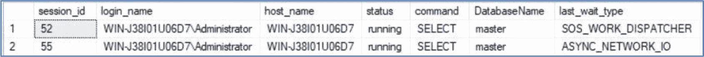

# 1. 面向 DBA 的 T-SQL 技巧

在本章中，我们将讨论 T-SQL 中的一些基础技巧，这些技巧在后续章节中当我们探讨如何使用 PowerShell 自动化您的 SQL Server 企业环境时将变得非常有用。具体而言，我们将讨论如何使用 `APPLY` 运算符对结果集中的每一行调用函数。理解这项技术对于第 8 章至关重要，那时我们将开始研究元数据驱动的自动化。然后，我们将探讨 XML（可扩展标记语言），以及 SQL Server DBA 如何利用其原生 XML 数据类型。由于大量信息（如查询计划）以 XML 格式存储，DBA 掌握 XML 的使用至关重要。理解 SQL Server 中的基础 XML 也是理解如何高效循环的关键。为此，我们将探索如何使用 XML 技术高效地遍历多个对象。我们会将其效率与传统的游标进行比较。这一点很重要，因为尽管在 PowerShell 中循环总是更高效，但有时自动化的最优方法会涉及通过 PowerShell 和 T-SQL 层进行多层循环。这将在第 8 章中变得显而易见，但这项技术贯穿于本书的多个章节。

## 使用 APPLY 运算符

T-SQL `APPLY` 运算符将在第 8 章探讨元数据驱动的自动化时使用。它允许您针对查询返回的结果集中的每一行调用一个表值函数。`APPLY` 运算符有两种变体：`CROSS APPLY` 和 `OUTER APPLY`。使用 `CROSS APPLY` 时，查询将仅返回表值函数产生了结果集的行。使用 `OUTER APPLY` 时，不会对结果集应用筛选器，如果表值函数未返回任何结果，则在该函数的每一列中将返回 `NULL`。

当 DBA 从动态管理视图（`DMV`）和函数（`DMF`）中检索元数据时，`APPLY` 运算符非常有用。例如，代码清单 1-1 中的查询将返回所有会话的列表，详细列出会话 ID、登录时间、登录名以及进程是用户进程还是系统进程。然后，它将使用 `OUTER APPLY` 针对每一行运行 `sys.dm_exec_sql_text` 动态管理函数。该函数返回一个名为 `text` 的列，其中包含与 `sys.dm_exec_requests` 动态管理视图中 `sql_handle` 列关联的 SQL 语句。

> 注意
>
> 在 `SELECT` 列表中引用的 `text` 列是由 `sys.dm_exec_sql_text` `DMF` 返回的列。

```sql
SELECT
s.session_id
, s.login_time
, s.login_name
, s.is_user_process
, dest.[text]
FROM sys.dm_exec_sessions s
INNER JOIN sys.dm_exec_requests r
ON r.session_id = s.session_id
OUTER APPLY sys.dm_exec_sql_text(sql_handle) dest;
```

代码清单 1-1 使用 `OUTER APPLY`

您会注意到此查询返回的结果集中有许多行的 `text` 列为 `NULL` 值。这是因为它们是系统进程，为 SQL Server 运行后台任务，例如 Lazy Writer（懒惰写入器）和 Ghost Cleanup Task（幽灵清理任务）。

> 提示
>
> 我们可以确定它们是系统进程是因为 `is_user_process` 标志。我们不会依赖会话 ID 小于 50 这一假设。所有系统进程的会话 ID 都小于 50 这一断言被广泛相信，但也是一个谬误，因为有可能存在超过 50 个并行运行的系统会话。

如果我们对同一个查询使用 `CROSS APPLY` 运算符，如代码清单 1-2 所示，则返回的唯一行将是应用表值函数后结果不为 `NULL` 的行。

```sql
SELECT
s.session_id
, s.login_time
, s.login_name
, [text]
, s.is_user_process
FROM sys.dm_exec_sessions s
INNER JOIN sys.dm_exec_requests r
ON r.session_id = s.session_id
CROSS APPLY sys.dm_exec_sql_text(sql_handle) ;
```

代码清单 1-2 使用 `CROSS APPLY`

## 面向 DBA 的 XML

XML（可扩展标记语言）在 SQL Server 中被广泛用作数据格式，用于存储对成功 DBA 至关重要的数据，例如扩展事件数据、查询计划数据以及 `MDW`（管理数据仓库）使用的收集器项目。因此，DBA 掌握 XML 格式及其在 SQL Server 中的使用方法非常重要。理解如何在 SQL Server 中使用 XML 对于理解如何高效循环也很重要。这将在本章的“高效循环”一节中讨论。以下各节将概述 XML 数据类型、如何生成 XML 文档以及如何查询 XML 数据。


### 理解 XML

XML 是一种标记语言，与 HTML 类似，其设计目的是存储和传输数据。和 HTML 一样，XML 使用标签。但与 HTML 不同的是，这些标签不是预定义的，而是由文档作者定义的。XML 文档具有树状结构，以一个根节点开始，并包含子节点（也称为子元素）。每个元素不仅可以包含数据，还可以包含属性。每个属性可以包含描述该元素的信息。

例如，假设你需要将销售订单的详细信息以 XML 格式存储。一个合理的设想是，每个销售订单都存储在文档中一个独立的元素里。但是，像订单日期、客户 ID、产品 ID、数量和价格这样的销售订单属性该怎么处理呢？这些信息既可以作为销售订单元素的子元素来存储，也可以作为销售订单元素的属性来存储。对于何时应该使用子元素还是属性来描述元素的属性，没有固定的规则。这个选择取决于文档作者的判断。

代码清单 1-3 提供了一个示例 XML 文档，其中保存了一个虚构组织的销售订单详细信息。

```
代码清单 1-3
存储在 XML 文档中的销售订单
```

在查看此 XML 文档时，有几点需要注意。首先，元素（或节点）以开始标签开头，即元素名被包裹在尖括号内。它们以结束标签结尾，即元素名前加一个反斜杠并被尖括号包裹。任何位于另一个节点开始和结束标签之间的元素都是该节点的子元素。

属性值用双引号括起来，并位于元素的开始标签内。例如，`SalesOrderID` 是 `<SalesOrder>` 元素的一个属性。

可以存在重复元素。可以看到 `<SalesOrder>` 是一个重复元素，因为两个独立的销售订单都存储在此 XML 文档中。`<SalesOrders>` 元素是文档的根元素，并且是唯一一个不允许是复杂的元素。这意味着它不能拥有属性，也不能是重复的。属性永远不能在元素内重复。因此，如果你需要一个属性重复，你应该使用一个嵌套元素，而不是一个属性。

XML 文档的格式可以通过 `XSD` （XML 模式定义）模式来定义。一个 `XSD` 模式将定义文档的结构，包括数据类型、是否允许复杂类型（复杂元素），以及元素在文档中必须出现（或限制出现）的次数。它还定义了元素的顺序。关于 `XSD` 模式的完整描述可以在 `en.wikipedia.org/wiki/XML_Schema_(W3C)` 找到。

> 提示
>
> 一个 XML 文档需要一个根元素才能是“格式良好的”。没有根元素的 XML 文档被称为 XML 片段。这很重要，因为无法将 XML 片段绑定到 `XSD` 模式。这意味着无法强制执行文档的结构，包括数据类型。

那么，这如何映射到 DBA 的数据呢？好吧，以代码清单 1-4 为例。它展示了从 `msdb.dbo.suspect_pages` 选择 `database_id` 列所产生的部分 XML 执行计划。

```
代码清单 1-4
部分 XML 执行计划
```

虽然这个执行计划非常简单，但你可以看到作者使用了嵌套元素，所有这些元素都有许多与之关联的属性。因为文档符合一个模式（类型化的），所以在此例中，根元素 `<ShowPlanXML>` 定义了它的模式关联。

### 将结果集转换为 XML

`T-SQL` 允许你通过在 `SELECT` 语句中使用 `FOR XML` 子句，将关系型结果集转换为 XML。`FOR XML` 子句可以使用四种模式：`FOR XML RAW`、`FOR XML AUTO`、`FOR XML PATH` 和 `FOR XML EXPLICIT`。

以下部分将简要讨论 `FOR XML` 子句在 `RAW` 模式和 `AUTO` 模式下的工作方式，但我们将主要关注 `PATH` 模式。`EXPLICIT` 模式超出了本书的范围，因为它的功能与 `PATH` 模式非常相似，但复杂得多，尽管在某些开发场景中有帮助，但对 DBA 来说通常用处不大。


#### 使用 FOR XML RAW

在 `FOR XML` 的各种模式中，`FOR XML RAW` 是最简单且最易于理解的。此模式会将关系结果集中的每一行转换为扁平 XML 文档中的一个元素。请考虑清单 1-5 中的查询，该查询从 `sys.dm_exec_sessions` 和 `sys.dm_exec_requests` 中提取数据。

```sql
SELECT
ExecSessions.session_id
, ExecSessions.login_name
, ExecSessions.host_name
, ExecSessions.status
, ExecRequests.command
, DB_NAME(ExecRequests.database_id) AS DatabaseName
, ExecRequests.last_wait_type
FROM sys.dm_exec_sessions ExecSessions
INNER JOIN sys.dm_exec_requests ExecRequests
ON ExecSessions.session_id = ExecRequests.session_id
WHERE ExecSessions.is_user_process = 1
Listing 1-5
提取会话信息
```

运行此查询时，您的结果将根据您的环境以及实例上当前的活动情况而有所不同。当我运行它时，它返回了如图 1-1 所示的结果。



显示数据库会话信息的表格。列包括 `session_id`、`login_name`、`host_name`、`status`、`command`、`DatabaseName` 和 `task_wait_type`。显示了两行：

1.  `session_id` 52, `login_name` WIN-3B0U1U05D7\Administrator, `host_name` WIN-3B0U1U05D7, `status` running, `command` SELECT, `DatabaseName` master, `task_wait_type` SOS_WORK_DISPATCHER.
2.  `session_id` 55, `login_name` WIN-3B0U1U05D7\Administrator, `host_name` WIN-3B0U1U05D7, `status` running, `command` SELECT, `DatabaseName` master, `task_wait_type` ASYNC_NETWORK_IO.

**图 1-1**
提取会话信息 – 结果

如果我们使用 `RAW` 模式添加一个 `FOR XML` 子句，结果将以 XML 片段的形式返回。清单 1-6 中修改后的查询将返回 XML 文档而不是关系结果集。

```sql
SELECT
ExecSessions.session_id
, ExecSessions.login_name
, ExecSessions.host_name
, ExecSessions.status
, ExecRequests.command
, DB_NAME(ExecRequests.database_id) AS DatabaseName
, ExecRequests.last_wait_type
FROM sys.dm_exec_sessions ExecSessions
INNER JOIN sys.dm_exec_requests ExecRequests
ON ExecSessions.session_id = ExecRequests.session_id
WHERE ExecSessions.is_user_process = 1
FOR XML RAW
Listing 1-6
使用 FOR XML RAW 提取会话信息
```

清单 1-7 展示了返回的 XML 文档。

```xml
清单 1-7
提取会话信息 FOR XML RAW 结果
```

关于这个文档，我们首先需要注意它是一个 XML 片段，而不是一个格式良好的 XML 文档，因为它没有根节点。`<row>` 元素不能作为根节点，因为它会重复。这意味着我们无法根据架构验证 XML。因此，在使用 `FOR XML` 子句时，应考虑使用 `ROOT` 关键字。这将强制在文档中创建一个根元素，名称由您选择。清单 1-8 展示了这一点。

```sql
SELECT
ExecSessions.session_id
, ExecSessions.login_name
, ExecSessions.host_name
, ExecSessions.status
, ExecRequests.command
, DB_NAME(ExecRequests.database_id) AS DatabaseName
, ExecRequests.last_wait_type
FROM sys.dm_exec_sessions ExecSessions
INNER JOIN sys.dm_exec_requests ExecRequests
ON ExecSessions.session_id = ExecRequests.session_id
WHERE ExecSessions.is_user_process = 1
FOR XML RAW, ROOT('Sessions')
Listing 1-8
添加根节点
```

结果 XML 文档可以在清单 1-9 中看到。

```xml
清单 1-9
带根节点的提取会话信息结果
```

关于文档的另一个重要注意事项是它是完全扁平的。没有嵌套。这意味着文档的粒度在会话级别，如果一个会话有多个请求，这就不那么合理了。

还值得注意的是，所有数据都包含在属性中，而不是元素中。我们可以通过在 `FOR XML` 子句中使用 `ELEMENTS` 关键字来改变这种行为。`ELEMENTS` 关键字将使所有数据都包含在子元素中，而不是属性中。清单 1-10 中修改后的查询展示了这一点。

```sql
SELECT
ExecSessions.session_id
, ExecSessions.login_name
, ExecSessions.host_name
, ExecSessions.status
, ExecRequests.command
, DB_NAME(ExecRequests.database_id) AS DatabaseName
, ExecRequests.last_wait_type
FROM sys.dm_exec_sessions ExecSessions
INNER JOIN sys.dm_exec_requests ExecRequests
ON ExecSessions.session_id = ExecRequests.session_id
WHERE ExecSessions.is_user_process = 1
FOR XML RAW, ELEMENTS, ROOT('Sessions')
Listing 1-10
提取会话信息为元素
```

返回的格式良好的 XML 文档可以在清单 1-11 中看到。

```xml
<Sessions>
  <row>
    <session_id>52</session_id>
    <login_name>WIN-J38I01U06D7\Administrator</login_name>
    <host_name>WIN-J38I01U06D7</host_name>
    <status>running</status>
    <command>SELECT</command>
    <DatabaseName>master</DatabaseName>
    <last_wait_type>MEMORY_ALLOCATION_EXT</last_wait_type>
  </row>
  <row>
    <session_id>55</session_id>
    <login_name>WIN-J38I01U06D7\Administrator</login_name>
    <host_name>WIN-J38I01U06D7</host_name>
    <status>running</status>
    <command>SELECT</command>
    <DatabaseName>master</DatabaseName>
    <last_wait_type>ASYNC_NETWORK_IO</last_wait_type>
  </row>
</Sessions>
清单 1-11
提取会话信息为元素结果
```

您可以看到，以元素为中心的文档仍然为关系结果集中的每一行返回一个名为 `<row>` 的元素。但是，数据不是包含在属性中，而是以子元素的形式存储。每个子元素都被赋予了从中返回数据的列的名称。然而，数据仍然是扁平的。没有基于逻辑或物理表结构的层次结构。

可以为 `<row>` 元素赋予一个更有意义的名称。在我们的例子中，最有意义的名称是 `<Session>`。清单 1-12 展示了如何在 `FOR XML` 子句中使用可选参数来为元素生成此名称。

```sql
SELECT
ExecSessions.session_id
, ExecSessions.login_name
, ExecSessions.host_name
, ExecSessions.status
, ExecRequests.command
, DB_NAME(ExecRequests.database_id) AS DatabaseName
, ExecRequests.last_wait_type
FROM sys.dm_exec_sessions ExecSessions
INNER JOIN sys.dm_exec_requests ExecRequests
ON ExecSessions.session_id = ExecRequests.session_id
WHERE ExecSessions.is_user_process = 1
FOR XML RAW('Session'), ELEMENTS, ROOT('Sessions')
Listing 1-12
为 <row> 元素生成名称
```

部分结果 XML 文档可以在清单 1-13 中找到。

```xml
<Sessions>
  <Session>
    <session_id>52</session_id>
    <login_name>WIN-J38I01U06D7\Administrator</login_name>
    <host_name>WIN-J38I01U06D7</host_name>
    <status>running</status>
    <command>SELECT</command>
    <DatabaseName>master</DatabaseName>
    <last_wait_type>MEMORY_ALLOCATION_EXT</last_wait_type>
  </Session>
  <Session>
    <session_id>55</session_id>
    <login_name>WIN-J38I01U06D7\Administrator</login_name>
    <host_name>WIN-J38I01U06D7</host_name>
    <status>running</status>
    <command>SELECT</command>
    <DatabaseName>master</DatabaseName>
    <last_wait_type>ASYNC_NETWORK_IO</last_wait_type>
  </Session>
</Sessions>
清单 1-13
为 <row> 元素生成名称的结果
```


#### 使用 FOR XML AUTO

与 `FOR XML RAW` 不同，`FOR XML AUTO` 能够返回嵌套结果。它使用起来也异常简单，因为它会根据查询中的联接自动嵌套数据。代码清单 1-14 中的修改后的查询使用 `AUTO` 模式来返回一个层次化的 XML 文档。

```sql
SELECT
ExecSessions.session_id
, ExecSessions.login_name
, ExecSessions.host_name
, ExecSessions.status
, ExecRequests.command
, DB_NAME(ExecRequests.database_id) AS DatabaseName
, ExecRequests.last_wait_type
FROM sys.dm_exec_sessions ExecSessions
INNER JOIN sys.dm_exec_requests ExecRequests
ON ExecSessions.session_id = ExecRequests.session_id
WHERE ExecSessions.is_user_process = 1
FOR XML AUTO
代码清单 1-14
使用 FOR XML AUTO
```

此查询返回的 XML 片段可以在代码清单 1-15 中看到。

```xml
代码清单 1-15
使用 FOR XML AUTO 结果提取会话信息
```

您可以看到，当使用 `AUTO` 模式时，`FOR XML` 子句会根据查询中的 `JOIN` 子句自动嵌套数据。每个元素都根据其来源表的表别名被分配了一个名称。与 `RAW` 模式一样，我们可以使用 `ROOT` 关键字来添加一个根节点，以使文档结构良好；或者使用 `ELEMENTS` 关键字使文档以元素为中心。

#### 使用 FOR XML PATH

有时，您需要对结果 XML 文档的形状进行比 `RAW` 模式或 `AUTO` 模式所能提供的更多控制。当您有定义自定义启发式规则的需求时，可以使用 `PATH` 模式。`PATH` 模式提供了极大的灵活性，因为它允许您定义结果 XML 中每个节点的位置。这是通过指定查询中的每一列如何映射到 XML 来实现的，使用的是列名或别名。

如果一个列别名以 `@` 符号开头，则将创建一个属性。如果不使用 `@` 符号，该列将映射到一个元素。将成为属性的列必须在定义为同级节点但作为元素的列之前指定。

如果您希望定义节点在层次结构中的位置，可以使用 `/` 符号。例如，如果您需要主机名显示在一个名为 `<Session>` 的元素之下，您可以将 `host_name` 列的别名指定为 `'/Session/HostName'`。

`PATH` 模式允许您创建高度定制和复杂的结构。例如，假设您有一个需求，需要创建一个格式如代码清单 1-16 所示的 XML 文档。在这里，您会注意到有一个名为 `<Sessions>` 的根节点，层次结构中的下一个节点是 `<UserSession>`。这是一个可重复元素，对于实例上的每个活动会话都会出现一次。在此元素中，会话 ID 显示为属性，而登录名、主机名和状态都是子元素。

还有一个名为 `<Request>` 的复杂子元素，它包含其他子元素，这些子元素包含命令类型、上次等待的原因和数据库。数据库有自己的子元素，其中包含数据库名称。如果我们想添加另一个标签，例如数据库 ID，这将很有帮助。

```xml
<Sessions>
  <UserSession SessionID="54">
    <LoginName>WIN-J38I01U06D7\Administrator</LoginName>
    <HostName>WIN-J38I01U06D7</HostName>
    <Status>running</Status>
    <Request>
      <Command>SELECT</Command>
      <Database>
        <Name>master</Name>
      </Database>
      <LastWaitReason>SOS_WORK_DISPATCHER</LastWaitReason>
    </Request>
  </UserSession>
  <UserSession SessionID="55">
    <LoginName>WIN-J38I01U06D7\Administrator</LoginName>
    <HostName>WIN-J38I01U06D7</HostName>
    <Status>running</Status>
    <Request>
      <Command>SELECT</Command>
      <Database>
        <Name>master</Name>
      </Database>
      <LastWaitReason>ASYNC_NETWORK_IO</LastWaitReason>
    </Request>
  </UserSession>
</Sessions>
代码清单 1-16
FOR XML PATH 的期望结果
```

使用 `FOR XML PATH` 构建 XML 文档的查询初看起来可能有点复杂，但一旦理解了原理，它们就变得相当直接。让我们逐一检查每个需求以及如何实现所需的形状。

首先，我们需要一个名为 `<Sessions>` 的根节点，并且我们还需要将 `<row>` 元素重命名为 `<UserSession>`。这可以以与我们探索 `RAW` 模式时相同的方式实现，使用 `FOR XML` 子句中 `<row>` 元素的可选参数和 `ROOT` 关键字来指定根节点，如代码清单 1-17 所示。

```sql
FOR XML PATH('UserSession'), ROOT('Sessions')
代码清单 1-17
使用 FOR XML PATH 创建根节点并命名 <row> 元素
```

接下来，在 `SELECT` 列表中，我们只需要指定每个标签应该位于层次结构中的哪个位置，以及它们应该被视为元素还是属性。如代码清单 1-18 所示的技术。请注意，`SessionID` 带有 `@` 前缀以使其成为属性，并且我们仅为 `DatabaseName` 创建了额外的嵌套层级，只需在请求的层次结构中添加另一个层级即可。

```sql
SELECT
ExecSessions.session_id                      '@SessionID'
, ExecSessions.login_name                      'LoginName'
, ExecSessions.host_name                       'HostName'
, ExecSessions.status                          'Status'
, ExecRequests.command                         'Request/Command'
, DB_NAME(ExecRequests.database_id)            'Request/Database/Name'
, ExecRequests.last_wait_type                  'Request/LastWaitReason'
代码清单 1-18
定义 SELECT 列表
```

将这些技术整合在一起，我们得到了代码清单 1-19 中生成所需结果集的完整查询。

```sql
SELECT
ExecSessions.session_id '@SessionID'
, ExecSessions.login_name 'LoginName'
, ExecSessions.host_name 'HostName'
, ExecSessions.status 'Status'
, ExecRequests.command 'Request/Command'
, DB_NAME(ExecRequests.database_id) 'Request/Database/Name'
, ExecRequests.last_wait_type 'Request/LastWaitReason'
FROM sys.dm_exec_sessions ExecSessions
INNER JOIN sys.dm_exec_requests ExecRequests
ON ExecSessions.session_id = ExecRequests.session_id
WHERE ExecSessions.is_user_process = 1
FOR XML PATH('UserSession'), ROOT('Sessions')
代码清单 1-19
最终查询
```


### 从 XML 文档中提取值

在编写脚本或进行性能调优时，DBA 经常需要从原生 XML 中提取值。为了演示这一点，我们将使用查询存储。查询存储捕获查询计划及其统计信息的历史记录，因此 DBA 可以轻松比较不同计划之间的性能差异。除了图形化仪表板风格的工具外，查询存储还通过一系列目录视图公开计划及其元数据。

**提示**
关于查询存储的完整讨论，我强烈推荐 Apress 出版的 `Pro SQL Server 2022 Administration` 一书，可从 [`https://link.springer.com/book/10.1007/978-1-4842-8864-1`](https://link.springer.com/book/10.1007/978-1-4842-8864-1) 购买。

让我们假设我们想要检查使用扫描操作的最昂贵的查询计划。这些信息可以通过将 `sys.query_store_runtime_statistics` 目录视图与 `sys.query_store_plan` 目录视图进行联接来检索。然而，为了检索我们需要的结果，我们将不得不查询 XML 执行计划。这意味着我们将不得不引入 XQuery 的概念。

XQuery 是一种用于查询 XML 的语言，就像 SQL 是一种用于查询关系数据的语言一样。该语言建立在 XPath 之上，由用于寻址文档特定区域的 XPath 表达式和 FLOWR（发音同 "flower"）语句组成。FLOWR 是 "For, Let, Where, Order by, and Return" 的缩写。

For 语句允许你遍历一个节点序列。Let 语句将一个序列绑定到一个变量。Where 语句根据布尔表达式过滤节点。Order by 语句在返回节点之前对其进行排序。Return 语句指定应返回的内容。

大多数 DBA（即使是那些关注自动化的人）很少需要关心 FLOWR 语句。因此，对该主题的完整讨论超出了本书的范围。相反，我将重点介绍在 SQL Server 中用于自动化和脚本编写的核心方法。这些方法是 `query()`、`value()`、`exist()` 和 `nodes()`。

**注意**
以下部分中的示例使用 showplan 模式。此 XSD 的完整详细信息可在 [`http://schemas.microsoft.com/sqlserver/2004/07/showplan`](http://schemas.microsoft.com/sqlserver/2004/07/showplan) 找到。

#### query 方法

XQuery `query()` 方法可用于具有 XML 数据类型的列或变量。它提取文档的一部分。提取的文档部分将形成一个未类型化的 XML 文档，即使原始文档符合模式（类型化 XML）。

调用该方法使用语法 `XMLDoc.query('/Path/To/Node')`。如果文档绑定到 XSD，你可以在指定节点路径之前声明命名空间，语法为 `XMLDoc.query('declare namespace alias="//domain.com/schemalocation"; //alias:node')`。

例如，代码清单 1-20 中的查询将返回查询存储中每个查询计划的每个列引用。在 `query()` 方法中，我们首先为 Microsoft 的 showplan 模式声明命名空间。然后我们可以轻松地指定我们希望提取的节点，而不是传递该节点在层次结构中的完整位置。

```
SELECT
CAST(query_plan AS XML).query('declare namespace
qplan="http://schemas.microsoft.com/sqlserver/2004/07/showplan";
//qplan:ColumnReference') AS SQLStatement
FROM sys.query_store_plan ;
代码清单 1-20
使用 query() 方法
```

#### value 和 nodes 方法

`value()` 方法将从 XML 文档中提取一个单值，并映射到 SQL Server 数据类型。`value()` 方法可以针对 XML 数据类型的列或变量调用，格式为 `XMLDoc.value('/path/to/node/@node[1]', 'int')`。或者，你也可以指定 XML 文档所绑定的模式，格式为 `XMLDoc.value('declare namespace alias="http://domain.com/schemalocation"; (//alias:node[1]', 'int')`。

**提示**
因为 `value()` 方法只能返回一个单值，所以必须在方括号中指定一个索引值，即使该节点在文档中只出现一次。

因为 `value()` 方法只能返回一个原子（单）值，所以它可以与 `nodes()` 方法结合使用，将节点分解为关系数据。`nodes()` 方法返回一个行集，其中包含节点实例的逻辑副本。然后，可以将 `value()` 方法交叉应用到 `nodes()` 方法的结果，以便从同一个 XML 文档返回多个值。代码清单 1-21 中的查询将返回查询存储中每个计划内访问的表和列的列表。

代码清单 1-21 中的子查询只是将 `query_plan` 列转换为原生 XML，以便可以对其调用 `nodes()` 方法。外部查询将 `nodes()` 方法交叉应用到查询计划的原生 XML 版本，然后针对 `nodes()` 方法返回的节点实例的逻辑表示运行 `value()` 方法。请注意，因为 `value()` 方法是针对 `nodes()` 返回的结果而不是原始 XML 文档调用的，所以不需要为属性指定路径。这是因为 `nodes()` 返回的结果始于 `<ColumnReference>` 元素级别，而 `@Table` 和 `@Column` 节点是该元素的属性。因此，对于 `value()` 方法而言，这些属性位于文档的顶层。

**提示**
当将 `nodes()` 与 `value()` 结合使用时，模式仅在 `nodes()` 方法中声明。这是因为 `value()` 方法是针对实例的逻辑表示运行的，而不是针对原始 XML 文档。

```
SELECT
plan_id
,nodes.query_plan.value('@Table[1]', 'nvarchar(128)') AS TableRef
,nodes.query_plan.value('@Column[1]', 'nvarchar(128)') AS ColumnRef
FROM
(
SELECT plan_id, CAST(query_plan AS XML) query_plan_xml
FROM sys.query_store_plan
) base
CROSS APPLY query_plan_xml.nodes('declare namespace
qplan="http://schemas.microsoft.com/sqlserver/2004/07/showplan";
//qplan:ColumnReference') as nodes(query_plan) ;
代码清单 1-21
使用 value() 和 nodes() 方法
```


#### exist 方法

`exist` 方法会对 XML 文档执行 XQuery 表达式。它将返回一个位（布尔）值来表示表达式的结果状态。当 XPath 表达式的结果为空时返回 0；结果不为空时返回 1；如果结果为 `NULL` 则返回 `NULL`。

`exist` 方法通常用于 `WHERE` 子句。例如，你可能已经注意到清单 1-20 和 1-21 中的查询返回了许多结果，这些结果既来自 SQL Server 内部运行的许多查询，也来自 DBA 活动，比如访问备份元数据。清单 1-22 中的查询扩展了清单 1-21 的查询，用于过滤掉 `<ColumnReference>` 元素的 `@Schema` 属性等于 `[sys]` 或 `[dbo]` 的任何结果。这将导致只考虑访问用户表的执行计划。

```
SELECT
plan_id
,nodes.query_plan.value('@Table[1]', 'nvarchar(128)') AS index1
,nodes.query_plan.value('@Column[1]', 'nvarchar(128)') AS index2
FROM
(
SELECT plan_id, CAST(query_plan AS XML) query_plan_xml
FROM sys.query_store_plan
) base
CROSS APPLY query_plan_xml.nodes('declare namespace
qplan="http://schemas.microsoft.com/sqlserver/2004/07/showplan";
//qplan:ColumnReference') as nodes(query_plan)
WHERE query_plan_xml.exist('declare namespace
qplan="http://schemas.microsoft.com/sqlserver/2004/07/showplan";
//qplan:Object[@Schema="[sys]"]') = 0
AND query_plan_xml.exist('declare namespace
qplan="http://schemas.microsoft.com/sqlserver/2004/07/showplan";
//qplan:Object[@Schema="[dbo]"]') = 0 ;
Listing 1-22
使用 `exist` 方法
```

#### 综合使用方法

为了满足我们的原始需求，即检查使用扫描操作的最昂贵的执行计划，我们必须在单个查询中组合 `value`、`query` 和 `exist` 方法。清单 1-23 中的查询在 `WHERE` 子句中使用了 `exist` 方法来检查每个计划的 `<RelOp>` 元素，并过滤掉任何不涉及扫描操作的运算符。`WHERE` 子句还将使用 `exist` 方法来过滤任何非用户表的操作。

`SELECT` 列表使用 `value` 方法提取 `@Schema` 和 `@Table` 属性，以帮助我们识别可能缺少索引的表。它还使用 `query` 方法提取整个 `<Object>` 元素，以 XML 格式提供表的完整详细信息。

除了使用 XQuery 方法外，该查询还以本机 XML 格式返回整个计划，并从 `sys.query_store_runtime_stats` 目录视图返回计划统计信息。查询使用 `TOP` 和 `ORDER BY` 来过滤掉除基于计划的平均执行时间乘以计划执行次数计算出的最昂贵的前五个计划之外的所有计划。

```
SELECT TOP 5
CAST(p.query_plan AS XML)
, CAST(p.query_plan AS XML).value('declare namespace
qplan="http://schemas.microsoft.com/sqlserver/2004/07/showplan";
(//qplan:Object/@Schema)[1]','nvarchar(128)')
+ '.'
+ CAST(p.query_plan AS XML).value('declare namespace
qplan="http://schemas.microsoft.com/sqlserver/2004/07/showplan";
(//qplan:Object/@Table)[1]','nvarchar(128)') AS [Table]
, CAST(p.query_plan AS XML).query('declare namespace
qplan="http://schemas.microsoft.com/sqlserver/2004/07/showplan";
//qplan:Object') AS TableDetails
, rs.count_executions
, rs.avg_duration
, rs.avg_physical_io_reads
, rs.avg_cpu_time
FROM sys.query_store_runtime_stats rs
INNER JOIN sys.query_store_plan p
ON p.plan_id = rs.plan_id
WHERE CAST(p.query_plan AS XML).exist('declare namespace
qplan="http://schemas.microsoft.com/sqlserver/2004/07/showplan";
//qplan:RelOp[@LogicalOp="Index Scan"
or @LogicalOp="Clustered Index Scan"
or @LogicalOp="Table Scan"]') = 1
AND CAST(p.query_plan AS XML).exist('declare namespace
qplan="http://schemas.microsoft.com/sqlserver/2004/07/showplan";
//qplan:Object[@Schema="[sys]"]') = 0
AND CAST(p.query_plan AS XML).exist('declare namespace
qplan="http://schemas.microsoft.com/sqlserver/2004/07/showplan";
//qplan:Object[@Schema="[dbo]"]') = 0
ORDER BY rs.count_executions * rs.avg_duration DESC ;
Listing 1-23
查找具有扫描操作的最昂贵计划
```

#### 高效循环

DBA 强加给开发人员的最常见托管标准之一是禁止使用游标。与此同时，大多数 DBA 在需要遍历一组对象时都会使用游标。论点通常是他们的脚本每天只运行一次，而编写游标是实现目标的最快方式。当然，这个论点有一定道理，但我总觉得最好以身作则。有几次，我与开发团队进行了“游标辩论”，并通过自己编写不使用游标的脚本赢得了辩论，开发人员也应该能够做到同样的事情。

当然，本书的主要重点是 PowerShell，在 PowerShell 中循环远比在 T-SQL 中循环高效得多。然而，本书（尤其是第 8 章）展示了最佳技术，在 PowerShell 和 T-SQL 级别具有多层循环是合理的方案。

想象一下，我们需要一个脚本来终止所有活动会话。这对于任何 DBA 都是一个有用的脚本，因为你总会有需要快速断开所有用户连接的情况。清单 1-24 中的脚本使用游标实现了这一点，但它会很慢且耗费资源，尤其是在具有许多活动会话的高度事务性环境中。

```
DECLARE @session_id INT ;
DECLARE C_Sessions CURSOR
FOR
SELECT Session_id
FROM sys.dm_exec_sessions
WHERE session_id <> @@SPID
AND is_user_process = 1 ;
OPEN C_Sessions ;
FETCH NEXT FROM C_Sessions
INTO @Session_id ;
DECLARE @SQL NVARCHAR(MAX) ;
WHILE @@FETCH_STATUS = 0
BEGIN
SET @SQL = 'Kill ' + CAST(@Session_id AS NVARCHAR(4)) ;
EXEC(@SQL) ;
FETCH NEXT FROM C_Sessions
INTO @Session_id ;
END
CLOSE C_Sessions ;
DEALLOCATE C_Sessions ;
Listing 1-24
使用游标终止所有会话
```

一种更有效（也符合你自己的托管标准！）的方法是使用 `FOR XML` 的一个技巧。清单 1-25 中的查询使用子查询来填充变量。子查询为结果集中返回的每一行返回字符串 `'Kill '` 与 `Session_id` 连接的结果。然后使用 `FOR XML PATH` 将其转换为 XML 格式。`data()` 方法用于剥离 XML 标签和字符，只保留文本。然后，该文本被传递回外部查询，凭借变量的数据类型，它被隐式转换为 `NVARCHAR`。然后可以使用动态 SQL 执行该变量。

这种方法的好处是查询只执行一次，而不是对每个活动会话执行一次。这意味着更少的磁盘活动。与其他技术（如 `@SQL = @SQL +` 方法）相比，这种方法使用的内存也更少。

```
DECLARE @SQL NVARCHAR(MAX) ;
SELECT DISTINCT @SQL =
(
SELECT 'Kill ' + CAST(session_id AS NVARCHAR(4)) AS [data()]
FROM sys.dm_exec_sessions
WHERE session_id <> @@SPID
AND is_user_process = 1
FOR XML PATH('')
) ;
EXEC(@SQL) ;
Listing 1-25
高效终止所有会话
```


## 摘要

对于希望通过脚本编写和自动化任务来减少工作量的数据库管理员（DBA）而言，必须熟悉一些 T-SQL 技术。虽然本书侧重于 PowerShell，但有时在 T-SQL 层编写代码才是最优解决方案，这意味着您的代码将横跨 PowerShell 和 T-SQL 两个层面。

使用 `APPLY` 操作符可以将函数应用于结果集中的每一行。当使用 `CROSS APPLY` 操作符时，仅返回那些不会导致函数返回 `NULL` 值的行。当使用 `OUTER APPLY` 操作符时，结果集中的所有行都将被返回。DBA 可以使用此技术将动态管理函数应用于动态管理视图。

XML 对于 DBA 来说是一项日益重要的技术，需要理解并能够处理。SQL Server 中与 XML 相关的两个主要概念是将 XML 转换为关系值，以及将结果集转换为 XML 文档。`SELECT` 语句的 `FOR XML` 子句可用于从结果集生成 XML 文档。基于 XPath 的 XQuery 可用于从 XML 文档中提取值。

许多 DBA 仍然使用游标来遍历对象，但在子查询中使用 XQuery `data()` 方法提供了一种优化得多的解决方案。它也通过以身作则，促进了开发人员的良好实践。

