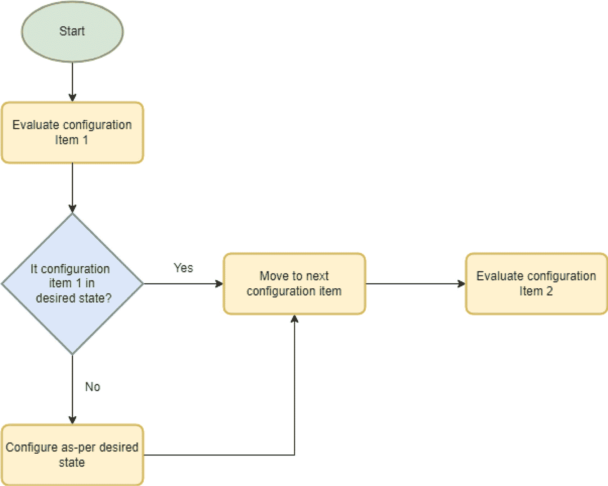

# 3. PowerShell DSC

配置管理是一种强大的方法，可用于根据组织的标准配置服务器，并通过在其生命周期内按计划强制执行策略，使它们保持一致的配置。

在本章中，我们将讨论配置管理方法背后的概念，然后深入探讨微软的配置管理工具——期望状态配置（DSC）的具体实现。最后，我们将探索如何在 SQL Server 环境中实施 DSC 来配置 Windows Server。


## 理解配置管理

构建和配置服务器的方式有很多种。我们可以手动配置服务器，可以使用黄金镜像或构建脚本，但每种方法都有其局限性。

手动配置服务器的局限性相当明显。这是一项单调、耗时的工作，常常导致人为错误，进而造成环境状态不一致。即使服务器是按照良好标准构建的，其配置也可能随着时间的推移而发生**偏移**。

如果我们采用黄金镜像方法，即构建一个单一镜像，使用 `sysprep` 然后多次部署它，那么我们可以解决手动构建所描述的问题，但同时又会引发新的问题。具体来说：

*   我们没有任何灵活性。每台服务器都必须是 100%相同的。这意味着如果我们需要最细微的变体，我们必须要么
    *   拥有大量黄金镜像选择，每一个都必须单独维护
    *   使用黄金镜像，但随后进行手动更新，这可能导致环境状态不一致
*   虽然每台服务器在构建时环境状态可能是一致的，但随着时间的推移，手动更改可能导致配置偏移，并最终造成环境状态不一致。

如果我们采用脚本化方法，我们通常会从一个非常基础的黄金镜像开始，然后针对新创建的服务器运行构建脚本，这些脚本将执行配置。这种方法消除了黄金镜像的第一个问题。具体来说，它允许我们拥有一致的构建，利用脚本中的逻辑为不同用例配置服务器。然而，它并没有解决第二个问题。随着服务器生命周期的推进，仍然存在配置偏移的可能性。

配置管理解决了上述所有构建问题。它是一种脚本化方法，但脚本不是只在构建时运行一次，而是按计划运行。每次脚本运行时，它都会检查服务器的配置应该是什么，如果有任何偏移，它会将配置恢复到期望状态。

配置管理中使用的逻辑如图 3-1 所示。



图 3-1：配置管理逻辑

此过程可用于配置服务器内的任何配置项。它可以安装软件、配置安全设置，甚至可以安装和配置 SQL Server（这将在第 6 章和第 9 章讨论）。

有许多配置管理工具可用，包括 Ansible、Chef 和 Puppet。然而，本书将重点介绍微软的 DSC 或所需状态配置，这是微软对配置管理的实现。

## 理解 DSC

DSC 可以通过两种主要方式实现。第一种是在机器级别。这种方法是最简单的实现，最适合小型环境或测试。DSC 包含在 Windows Management Framework 5.1 中。因此，我们无需安装任何客户端软件即可开始使用 DSC。本章将重点介绍这种方法，以最直接的方式帮助您理解其实现。

第二种实现方式是通过使用集中管理资源，可以从单一位置管理多台机器。这最适合大型企业，因为当您拥有许多服务器时，它能显著减少管理开销。

集中管理组件可以是一个拉取服务器，即运行 `DSC-Service` Windows Server 功能的服务器，也可以是来宾配置 Azure Policy，它与 Azure VM 和 Azure 外的 Arc 启用服务器兼容。

> **注意**：Windows 拉取服务器仍是一个受支持的功能，但已不再进行开发。这意味着微软 DSC 通常最适合使用 Azure 或 Arc 启用服务器的中小型组织。DSC 代码实际上已经分支，因此 DSC 1.1 仍然受支持但不再维护。它可以与最高到 PowerShell 5.1 的版本一起使用，并且可以在非 Azure 环境中使用。DSC 2.0 在 PowerShell 7 及以上版本中受支持，但设计用于与 Azure 配合使用。在撰写本文时，DSC 3.0 处于预览阶段。

DSC 中需要理解的两个主要概念是配置和资源。配置提供了一种简单的机制来描述项目的期望配置，而资源则提供了实现配置中描述的设置的机制（同时考虑项目的当前状态）。每个 DSC 资源都有三种方法：`Get`、`Test` 和 `Set`。`Get` 方法用于检索资源的当前状态。`Test` 方法用于确定服务器（在 DSC 中称为节点）当前是否配置为其期望的目标状态。`Set` 方法用于将节点配置为符合其目标状态。

DSC 提供了许多内置资源，可用于配置服务、用户、组、注册表项和 Windows 功能等项目。DSC 也是完全可扩展的。我们可以创建自己的自定义资源，用于配置任何可以通过 PowerShell 配置的项目。

资源可以使用基于类的方法或基于 Microsoft Operations Framework (MOF) 的方法来编写。本章将重点介绍使用开箱即用的资源，但有关创建自定义 DSC 资源的指南可在以下位置找到：`learn.microsoft.com/en-us/powershell/dsc/resources/authoringresourceclass?view=dsc-1.1`。

配置是应应用的资源的清单。它们通过一种特殊类型的函数实现，该函数列出了应应用于节点的资源。每个资源至少传递两个参数。其中一个参数是目标实例的名称。第二个是应对其应用的操作。例如，如果您有一个资源用于确保 SQL Browser 服务正在运行，您将使用服务资源并传递 `Name = "SQLBrowser"` 和 `State = "Running"`。另一方面，如果您想确保文件 `C:\Logs\CustomSqlLog.log` 存在，您将使用文件资源并传递参数 `Name = "C:\Logs\CustomSqlLog.log"` 和 `Ensure = "Present"`。本地配置管理器是读取配置并使用资源来确保应用期望配置的引擎。


## 使用 DSC 配置 Windows 服务器

现在我们已经理解了关键概念，让我们将这些概念付诸实践，使用 DSC 1.1 来执行一些简单的 Windows 服务器配置。您可能希望在操作系统级别执行许多配置，例如配置操作系统以符合 CIS 基准，或者确保 SQL Server 数据库引擎服务正在运行。然而，为了保持简单，在本例中，我们将力求确保以下目标配置：

*   确保存在一个用于存储 SQL Server 使用的证书备份的文件夹
*   确保 Windows 被配置为优化后台任务
*   确保 SQL Server 数据库引擎服务正在运行

### 定义文件资源

清单 3-1 中的代码片段演示了如何定义一个资源，该资源将确保存在一个名为 `CertificateBackups` 的文件夹。声明以使用 `File` 关键字开始，这表示被声明的资源是 DSC `File` 资源。后面是资源的名称。提供名称至关重要，因为它唯一地标识了相同类型的资源。在花括号内，我们传递 `Ensure = "Present"`，这表明我们希望确保文件夹存在。如果我们想确保它不存在，可以传递 `Ensure = "Absent"`。我们传递 `Type = "Directory"`。如果我们想管理一个文件而不是文件夹，可以传递 `Type = "File"`。然后我们可以使用 `Content = "FooBar"` 将文本插入文件。最后，我们传递 `DestinationPath = "C:\CertificateBackups"`，它定义了我们要让资源管理哪个文件夹。

```powershell
File CreateCertificateBackupsFolder {
Ensure           = "Present"
Type             = "Directory"
DestinationPath  = "C:\CertificateBackups"
}
```
**清单 3-1** 定义一个 `File` 资源

### 定义注册表资源

清单 3-2 中的代码片段演示了如何使用 `Registry` DSC 资源。这种资源类型对于配置许多 Windows 级别的项目很有用，但在这里，我们将用它来确保 Windows 被配置为针对后台任务进行优化。我们不希望数据库引擎因为用户在 Management Studio 中点击操作被优先处理而不得不等待。这次，我们使用 `Registry` 关键字来表示这是一个 `Registry` DSC 资源。同样，我们给它一个合理的名称。在花括号内，我们再次使用 `Ensure = “Present”` 来表示相关的字符串值应存在于注册表项中。我们使用 `Key = "HKLM:\SYSTEM\CurrentControlSet\Control\PriorityControl"` 来指定我们想要管理的注册表项的路径。我们使用 `ValueName = "Win32PrioritySeparation"` 来表示该项中应该存在的值，并使用 `ValueData = 24` 来定义我们为该项期望的值。

```powershell
Registry OptimizeForBackgroundServices {
Ensure      = "Present"
Key         = "HKLM:\SYSTEM\CurrentControlSet\Control\PriorityControl"
ValueName   = "Win32PrioritySeparation"
ValueType   = 'Dword'
ValueData   = 24
}
```
**清单 3-2** 定义一个 `Registry` 资源

### 定义服务资源

我们的最后一个资源确保默认 SQL Server 实例的数据库引擎服务正在运行。

> **提示**
> 我们将在第 6 章讨论如何构建 SQL Server，因此如果您想跟随示例操作，但尚未安装 SQL Server，可以将 SQL Server 数据库引擎服务更改为任何其他确实存在的服务。

清单 3-3 演示了如何通过使用 `Service` DSC 资源来定义此资源。声明以 `Service` 关键字开始，表示我们正在使用 `Service` DSC 资源，并且同样，我们提供一个合理的名称。在花括号内，您会注意到这次我们没有传递 `Ensure`。当未指定时，`Ensure` 默认为 `Present`。我们传递 `Name = "MSSQLSERVER"` 来定义我们希望管理的服务。我们传递 `StartupType = "Automatic"` 来指定该服务应始终配置为自动启动，传递 `State = "Running"` 来指定该服务应始终正在运行。如果服务停止，DSC 将自动为我们启动它。

```powershell
Service SQLServerService {
    Name        = "MSSQLSERVER"
    StartupType = "Automatic"
    State       = "Running"
}
```
**清单 3-3** 定义一个 `Service` 资源

### 创建配置文件

现在我们所有的资源都已定义，我们需要将它们整合到一个配置文件中。我们将使用的配置文件如清单 3-4 所示。第一行使用 `Configuration` 关键字，后跟配置的名称。所需的 DSC 资源从 `PSDesiredStateConfiguration` PowerShell 模块导入。

接下来，我们定义配置应在其中运行的主机。在我们的拓扑中，我们将计划配置从任务计划程序在本地运行。因此，我们将其定义为 `localhost`。在节点定义内部，我们拥有所有资源的定义，这些资源规划了我们期望的配置。

最后，文件的最后一行调用了我们刚刚定义的配置。可以将配置的定义想象成定义一个函数。仅仅定义函数要做什么是不够的，它需要被实际调用才能执行。

我们需要将此文件保存到本地计算机。我已将其保存为 `C:\Scripts\WindowsConfig.ps1`。

```powershell
Configuration WindowsConfig {
    Import-DscResource -ModuleName 'PSDesiredStateConfiguration'
    Node 'localhost' {
        File CreateCertificateBackupsFolder {
            Ensure = "Present"
            Type = "Directory"
            DestinationPath = "C:\CertificateBackups"
        }
        Registry OptimizeForBackgroundServices {
            Ensure      = "Present"
            Key         = "HKEY_LOCAL_MACHINE:\SYSTEM\CurrentControlSet\Control\PriorityControl"
            ValueName   = "Win32PrioritySeparation"
            ValueType   = 'Dword'
            ValueData   = 24
        }
        Service SQLServerService {
            Name        = "MSSQLSERVER"
            StartupType = "Automatic"
            State       = "Running"
        }
    }
}
WindowsConfig
```
**清单 3-4** 定义配置

### 运行配置

现在我们已经保存了配置，我们将运行该配置以生成 `.mof` 文件，如清单 3-5 所示。

> **提示**
> 如果您为配置文件使用了不同的路径或文件名，请确保更改以下脚本中的路径。

```powershell
.\C:\Scripts\WindowsConfig.ps1
```
**清单 3-5** 运行配置

此命令的输出如下所示：

```
Mode          LastWriteTime         Length Name
----          -------------         ------ ----
-a----        10/11/2024   10:22       3796 localhost.mof
```

如果您查看文件系统，会注意到当我们运行配置时，它创建了一个与配置同名的文件夹，里面有一个 `.mof` 文件。该文件以节点命名，并包含系统的配置信息。该文件夹如图 3-2 所示。


**图 3-2** 配置文件夹


那么，让我们来应用配置并看看会发生什么。我们可以使用 `Start-DscConfiguration` cmdlet 来应用配置，如代码清单 3-6 所示。我们使用 `-Path` 参数来传递执行配置时创建的文件夹，并使用 `-Verbose` 开关，这样我们就能看到正在发生的事情的详细信息。

> **提示**
>
> 在运行脚本之前，我建议停止 SQL Server Database Engine 服务，确保你没有一个名为 `C:\CertificateBackups` 的文件夹，并确保 Windows 已针对“程序”进行优化。这将允许你测试配置是否按预期应用了所需状态。

```
Start-DscConfiguration -Path 'C:\Scripts\WindowsConfig' -Verbose -Wait
清单 3-6
应用配置
```

在我的测试设备上运行时，详细输出如下所示：

```
VERBOSE: 执行操作 'Invoke CimMethod'，参数为：'methodName' = SendConfigurationApply,'className' = MSFT_DSCLocalConfigurationManager,'namespaceName' = root/Microsoft/Windows/DesiredStateConfiguration'。
VERBOSE: LCM 方法调用来自计算机 SQL2022-STANDAL，用户 sid 为 S-1-5-21-2722909466-2614467794-2401863046-500。
VERBOSE: [SQL2022-STANDAL]: LCM:  [ 开始 设置      ]
VERBOSE: [SQL2022-STANDAL]: LCM:  [ 开始 资源 ]  [[File]CreateCertificateBackupsFolder]
VERBOSE: [SQL2022-STANDAL]: LCM:  [ 开始 测试     ]  [[File]CreateCertificateBackupsFolder]
VERBOSE: [SQL2022-STANDAL]:                            [[File]CreateCertificateBackupsFolder] 系统找不到指定的文件。
VERBOSE: [SQL2022-STANDAL]:                            [[File]CreateCertificateBackupsFolder] 相关文件/目录是：`C:\CertificateBackups`。
VERBOSE: [SQL2022-STANDAL]: LCM:  [ 结束 测试     ]  [[File]CreateCertificateBackupsFolder]  耗时 0.0150 秒。
VERBOSE: [SQL2022-STANDAL]: LCM:  [ 开始 设置      ]  [[File]CreateCertificateBackupsFolder]
VERBOSE: [SQL2022-STANDAL]:                            [[File]CreateCertificateBackupsFolder] 系统找不到指定的文件。
VERBOSE: [SQL2022-STANDAL]:                            [[File]CreateCertificateBackupsFolder] 相关文件/目录是：`C:\CertificateBackups`。
VERBOSE: [SQL2022-STANDAL]: LCM:  [ 结束 设置      ]  [[File]CreateCertificateBackupsFolder]  耗时 0.0000 秒。
VERBOSE: [SQL2022-STANDAL]: LCM:  [ 结束 资源 ]  [[File]CreateCertificateBackupsFolder]
VERBOSE: [SQL2022-STANDAL]: LCM:  [ 开始 资源 ]  [[Registry]OptimizeForBackgroundServices]
VERBOSE: [SQL2022-STANDAL]: LCM:  [ 开始 测试     ]  [[Registry]OptimizeForBackgroundServices]
VERBOSE: [SQL2022-STANDAL]:                            [[Registry]OptimizeForBackgroundServices] 注册表项值 '`HKLM:\SYSTEM\CurrentControlSet\Control\PriorityControl\Win32PrioritySeparation`'（类型为“字符串”）不包含数据 '24'
VERBOSE: [SQL2022-STANDAL]: LCM:  [ 结束 测试     ]  [[Registry]OptimizeForBackgroundServices]  耗时 0.1100 秒。
VERBOSE: [SQL2022-STANDAL]: LCM:  [ 开始 设置      ]  [[Registry]OptimizeForBackgroundServices]
VERBOSE: [SQL2022-STANDAL]:                            [[Registry]OptimizeForBackgroundServices] (设置) 将注册表项值 '`HKLM:\SYSTEM\CurrentControlSet\Control\PriorityControl\Win32PrioritySeparation`' 设置为 '24'（类型为“字符串”）
VERBOSE: [SQL2022-STANDAL]: LCM:  [ 结束 设置      ]  [[Registry]OptimizeForBackgroundServices]  耗时 0.0470 秒。
VERBOSE: [SQL2022-STANDAL]: LCM:  [ 结束 资源 ]  [[Registry]OptimizeForBackgroundServices]
VERBOSE: [SQL2022-STANDAL]: LCM:  [ 开始 资源 ]  [[Service]SQLServerService]
VERBOSE: [SQL2022-STANDAL]: LCM:  [ 开始 测试     ]  [[Service]SQLServerService]
VERBOSE: [SQL2022-STANDAL]:                            [[Service]SQLServerService] 执行操作 'Query CimInstances'，参数为：'queryExpression' = SELECT * FROM Win32_Service WHERE Name='MSSQLSERVER','queryDialect' = WQL,'namespaceName' = root\cimv2'。
VERBOSE: [SQL2022-STANDAL]:                            [[Service]SQLServerService] 操作 'Query CimInstances' 完成。
VERBOSE: [SQL2022-STANDAL]: LCM:  [ 结束 测试     ]  [[Service]SQLServerService]  耗时 1.2030 秒。
VERBOSE: [SQL2022-STANDAL]: LCM:  [ 开始 设置      ]  [[Service]SQLServerService]
VERBOSE: [SQL2022-STANDAL]:                            [[Service]SQLServerService] 服务 'MSSQLSERVER' 已存在。对于现有服务，将忽略 Status、DisplayName、Description、Dependencies 等写入属性。
VERBOSE: [SQL2022-STANDAL]:                            [[Service]SQLServerService] 执行操作 'Query CimInstances'，参数为：'queryExpression' = SELECT * FROM Win32_Service WHERE Name='MSSQLSERVER','queryDialect' = WQL,'namespaceName' = root\cimv2'。
VERBOSE: [SQL2022-STANDAL]:       [[Service]SQLServerService] 操作 'Query CimInstances' 完成。
VERBOSE: [SQL2022-STANDAL]:       [[Service]SQLServerService] 服务 'MSSQLSERVER' 已启动。
VERBOSE: [SQL2022-STANDAL]: LCM:  [ 结束 设置      ]  [[Service]SQLServerService]  耗时 2.0040 秒。
VERBOSE: [SQL2022-STANDAL]: LCM:  [ 结束 资源 ]  [[Service]SQLServerService]
VERBOSE: [SQL2022-STANDAL]: LCM:  [ 结束 设置      ]
VERBOSE: [SQL2022-STANDAL]: LCM:  [ 结束 设置      ]    耗时  3.7230 秒。
VERBOSE: 操作 'Invoke CimMethod' 完成。
VERBOSE: 配置作业完成所花费的时间为 3.767 秒
```


那里有大量的信息需要消化，但以**粗体文本**高亮显示的部分表明，所有三个资源都已发生了一组操作。因此，让我们再次运行清单 3-6 中的命令，看看第二次会发生什么。根据我的测试设备，输出如下所示：

```
VERBOSE: Perform operation 'Invoke CimMethod' with following parameters, ''methodName' = SendConfigurationApply,'className' = MSFT_DSCLocalConfigurationManager,'namespaceName' = root/Microsoft/Windows/DesiredStateConfiguration'.
VERBOSE: An LCM method call arrived from computer SQL2022-STANDAL with user sid S-1-5-21-2722909466-2614467794-2401863046-500.
VERBOSE: [SQL2022-STANDAL]: LCM:  [ Start  Set      ]
VERBOSE: [SQL2022-STANDAL]: LCM:  [ Start  Resource ]  [[File]CreateCertificateBackupsFolder]
VERBOSE: [SQL2022-STANDAL]: LCM:  [ Start  Test     ]  [[File]CreateCertificateBackupsFolder]
VERBOSE: [SQL2022-STANDAL]:                            [[File]CreateCertificateBackupsFolder] The destination object was found and no action is required.
VERBOSE: [SQL2022-STANDAL]: LCM:  [ End    Test     ]  [[File]CreateCertificateBackupsFolder]  in 0.0150 seconds.
VERBOSE: [SQL2022-STANDAL]: LCM:  [ Skip   Set      ]  [[File]CreateCertificateBackupsFolder]
VERBOSE: [SQL2022-STANDAL]: LCM:  [ End    Resource ]  [[File]CreateCertificateBackupsFolder]
VERBOSE: [SQL2022-STANDAL]: LCM:  [ Start  Resource ]  [[Registry]OptimizeForBackgroundServices]
VERBOSE: [SQL2022-STANDAL]: LCM:  [ Start  Test     ]  [[Registry]OptimizeForBackgroundServices]
VERBOSE: [SQL2022-STANDAL]:                            [[Registry]OptimizeForBackgroundServices] Found registry key value 'HKLM:\SYSTEM\CurrentControlSet\Control\PriorityControl\Win32PrioritySeparation' with type 'String' and data '24'
VERBOSE: [SQL2022-STANDAL]: LCM:  [ End    Test     ]  [[Registry]OptimizeForBackgroundServices]  in 0.1090 seconds.
VERBOSE: [SQL2022-STANDAL]: LCM:  [ Skip   Set      ]  [[Registry]OptimizeForBackgroundServices]
VERBOSE: [SQL2022-STANDAL]: LCM:  [ End    Resource ]  [[Registry]OptimizeForBackgroundServices]
VERBOSE: [SQL2022-STANDAL]: LCM:  [ Start  Resource ]  [[Service]SQLServerService]
VERBOSE: [SQL2022-STANDAL]: LCM:  [ Start  Test     ]  [[Service]SQLServerService]
VERBOSE: [SQL2022-STANDAL]:                            [[Service]SQLServerService] Perform operation 'Query CimInstances' with following parameters, ''queryExpression' = SELECT * FROM Win32_Service WHERE Name='MSSQLSERVER','queryDialect' = WQL,'namespaceName' = root\cimv2'.
VERBOSE: [SQL2022-STANDAL]:                            [[Service]SQLServerService] Operation 'Query CimInstances' complete.
VERBOSE: [SQL2022-STANDAL]: LCM:  [ End    Test     ]  [[Service]SQLServerService]  in 1.1170 seconds.
VERBOSE: [SQL2022-STANDAL]: LCM:  [ Skip   Set      ]  [[Service]SQLServerService]
VERBOSE: [SQL2022-STANDAL]: LCM:  [ End    Resource ]  [[Service]SQLServerService]
VERBOSE: [SQL2022-STANDAL]: LCM:  [ End    Set      ]
VERBOSE: [SQL2022-STANDAL]: LCM:  [ End    Set      ]    in  1.4600 seconds.
VERBOSE: Operation 'Invoke CimMethod' complete.
VERBOSE: Time taken for configuration job to complete is 1.507 seconds
```

这次，输出内容要短得多。你会注意到**粗体文本**高亮显示的条目表明，所有三个设置操作都被跳过了。这是因为它们已经配置为所需状态，无需执行任何操作。这说明了配置管理方法的美妙之处。

最后一步是安排此配置运行。我通常建议每 30 分钟运行一次配置。也就是说，如果服务器上出现任何偏差，将在不超过半小时内（加上配置执行所需的时间）得到纠正。

清单 3-7 演示了如何在任务计划程序中配置任务以每 30 分钟应用一次配置。该脚本设置了多个变量，这些变量构建了在脚本末尾执行 `Register-ScheduledTask` 命令所需的参数。

注意

你会注意到我们使用的是 Windows PowerShell，而不是 PowerShell 7。这是因为，如前所述，不使用 Azure 的 DSC 仅由随 Windows PowerShell 5.1 一起发布的 DSC 1.1 支持。PowerShell 7 随附 DSC 2.0，其中包含重大更改，并且截至 PowerShell 7.2，`PSDesiredStateConfiguration` 模块不再随 PowerShell 一起提供，而是作为单独的下载提供。

```
$command = 'C:\Windows\System32\WindowsPowerShell\v1.0\powershell.exe'
$arguments = '-NoProfile -Command "Start-DscConfiguration -Path C:\Scripts\WindowsConfig" -Wait'
$actions = (New-ScheduledTaskAction -Execute $command -Argument $arguments )
$trigger = New-ScheduledTaskTrigger -Once -At 00:00 -RepetitionInterval (New-TimeSpan -Minutes 30)
$settings = New-ScheduledTaskSettingsSet
$principal = New-ScheduledTaskPrincipal -UserId 'NT AUTHORITY\SYSTEM' -RunLevel Highest -LogonType ServiceAccount
$task = New-ScheduledTask -Action $actions -Trigger $trigger -Settings $settings -Principal $principal
Register-ScheduledTask 'ApplyWindowsConfig' -InputObject $task
清单 3-7
创建计划任务
```

## 总结

配置管理是一种非常强大的技术，用于构建服务器并避免其在生命周期中发生配置偏差。现代的 DSC 最适合在利用 Azure 或 Azure Arc 的环境中使用。然而，通过使用 DSC 1.1 版本，它仍然可以在非 Azure 环境中使用。

DSC 可用于配置 Windows 的所有方面。在本章中，我们研究了如何使用 DSC 配置注册表项、文件夹以及确保服务正在运行。在第 6 章中，我们将探讨如何使用 DSC 安装 SQL Server；在第 9 章中，我们将探讨如何使用 DSC 配置 SQL Server 本身。

DSC 是完全可扩展的，我们可以编写自己的 DSC 资源，这些资源几乎可以涵盖任何可能的配置。DSC 的美妙之处在于它只执行需要执行的配置以避免偏差。每个资源都将测试资源的状态，并且仅在测试评估失败时才执行设置操作。

