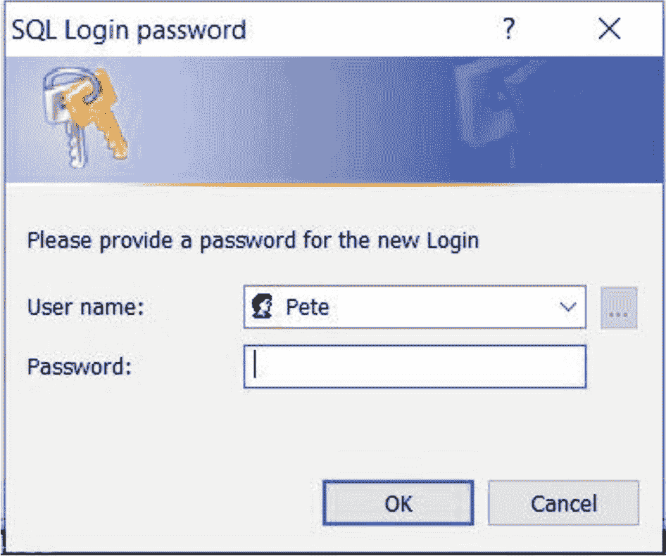

# 4. 使用 sqlserver 模块

`sqlserver` 是一个由 Microsoft 编写和维护的 PowerShell 模块，它允许 DBA 从 PowerShell 终端与 SQL Server 实例进行交互和管理。可以手动从 PowerShell Gallery ([`www.powershellgallery.com/packages/Sqlserver`](http://www.powershellgallery.com/packages/Sqlserver/21.1.18228)) 下载，也可以使用清单 4-1 中的命令安装。

```
Install-Module SqlServer
清单 4-1
安装 sqlserver 模块
```

在本章中，我们将讨论如何使用该模块，探索一些最有用的命令及其用例，既适用于临时管理，也适用于自动化。我们将首先了解 `Invoke-SqlCmd` 命令，然后再了解可用于管理和脚本编写的其他命令。

## 使用 Invoke-SqlCmd

可以说，`sqlserver` 模块中最常用的命令是 `Invoke-SqlCmd`。该命令镜像了 `SQLCMD` 命令行工具的功能，允许 DBA 从 PowerShell 终端针对 SQL Server 实例运行查询。


### Invoke-SqlCmd 基础用法

`Invoke-SqlCmd` 最基本的调用方式涉及传递两个参数：`ServerInstance`（定义查询应针对哪个 SQL Server 实例运行）和 `Query`（提供要执行的查询语句）。清单 4-2 演示了如何使用此基本调用从本地服务器的默认实例返回数据库名称列表。`ServerInstance` 参数的可能格式包括 `ServerName` 和 `ServerName\InstanceName`。如果你希望针对本地服务器的默认实例运行查询，则可以使用 `localhost`、`.` 或完全省略 `ServerInstance` 参数。

提示

以下示例假设使用 Windows 身份验证。如果应使用 SQL 身份验证，则还需要传递用户凭据。

如果你使用的是 `sqlServer` 模块的 v22 或更高版本且未配置加密，则将需要 `-TrustServerCertificate` 参数。

```
Invoke-SqlCmd -ServerInstance localhost -Query "SELECT name FROM sys.databases" -TrustServerCertificate
清单 4-2
Invoke-SqlCmd 的基本调用
```

### 将 Invoke-SqlCmd 用于脚本编写

现在我们已经将数据库列表显示在屏幕上，这对于临时的 DBA 活动来说既很棒又确实有用。如果我们计划在脚本中使用 `Invoke-SqlCmd`，那么我们很可能会希望将查询结果传递到一个变量中。

清单 4-3 中的脚本演示了如何做到这一点，但它也引入了一种称为**拼接**的技术。该技术会构建一个哈希表，其中包含键/值对，这些键/值对应于我们计划传递给命令的参数名称和值。当我们执行命令时，我们只需传递该哈希表，PowerShell 就会展开其中的参数名称和值。在功能上，这等同于以通常的方式将每个参数传递给命令。拼接的好处在于它使命令更简洁、更易于阅读。日后查找和管理参数值也更容易。

```
$Params = @{
ServerInstance = "localhost"
Query          = "SELECT name FROM sys.databases"
}
$Databases = Invoke-Sqlcmd @Params
清单 4-3
将 Invoke-SqlCmd 结果传递给变量
```

需要注意的是，`Invoke-SqlCmd` 命令的结果是一个对象或对象数组。默认情况下，输出为 `DataRow` 对象，尽管可以使用 `OutputAs` 参数将输出更改为 `DataSet` 或 `DataTables` 格式。这意味着你需要使用丰富对象的属性，而不是对象本身。例如，考虑清单 4-4 中的脚本，它将 `$Databases` 变量传递给 `foreach` 循环，并将每个对象写入屏幕。

提示

`foreach` 循环在第 2 章介绍。

```
$Params = @{
ServerInstance = "localhost"
Query          = "SELECT name FROM sys.databases"
}
$Databases = Invoke-Sqlcmd @Params
foreach ($Database in $Databases) {
Write-Host $Database
}
清单 4-4
将丰富对象传递给 foreach 循环
```

运行此脚本的结果显示如下：

```
System.Data.DataRow
System.Data.DataRow
System.Data.DataRow
System.Data.DataRow
System.Data.DataRow
```

相反，我们应该使用丰富对象的属性。在这个特定情况下，我们返回的列名为 `name`；因此，我们应该使用 `name` 属性，如清单 4-5 所示。

```
$Params = @{
ServerInstance = "localhost"
Query          = "SELECT name FROM sys.databases"
}
$Databases = Invoke-Sqlcmd @Params
foreach ($Database in $Databases) {
Write-Host $Database.name
}
清单 4-5
使用对象属性
```

此脚本将返回更有用的结果，如下所示：

```
master
tempdb
model
msdb
WideWorldImporters
```

这一点自然引出了如何使用 `Invoke-SqlCmd` 返回的数据的讨论。在上面的例子中，我们一直返回我们实例上存在的数据库列表。想象一下，你有一个脚本，它将根据碎片化阈值动态重建索引，例如清单 4-6 中的脚本。

提示

创建动态索引重建脚本和其他元数据驱动的自动化将在第 7 章中更详细地讨论。

```
DECLARE @SQL NVARCHAR(MAX)
SET @SQL =
(
SELECT 'ALTER INDEX '
+ QUOTENAME(i.name)
+ ' ON ' + s.name
+ '.'
+ QUOTENAME(OBJECT_NAME(i.object_id))
+ ' REBUILD ; '
FROM sys.dm_db_index_physical_stats(DB_ID(),NULL,NULL,NULL,'DETAILED') ps
INNER JOIN sys.indexes i
ON ps.object_id = i.object_id
AND ps.index_id = i.index_id
INNER JOIN sys.objects o
ON ps.object_id = o.object_id
INNER JOIN sys.schemas s
ON o.schema_id = s.schema_id
WHERE index_level = 0
AND avg_fragmentation_in_percent > 25
FOR XML PATH('')
) ;
EXEC(@SQL) ;
清单 4-6
动态索引重建
```

提示

使用 `FOR XML PATH` 在 T-SQL 中高效循环的内容将在第 1 章进一步解释。

一个包含数据库列表的变量将允许我们安排此脚本针对我们实例上的每个数据库运行，而无需维护一个静态的数据库列表。此技术在清单 4-7 中演示。

```
$Params = @{
ServerInstance = "localhost"
Query          = "SELECT name FROM sys.databases"
}
$Databases = Invoke-Sqlcmd @Params
foreach ($Database in $Databases) {
$Params = @{
ServerInstance = "localhost"
Database       = $Database.name
InputFile      = "c:\scripts\IndexRebuild.sql"
}
Invoke-Sqlcmd @Params
}
清单 4-7
对所有数据库运行脚本
```

关于此脚本，有几个关键点需要考虑。首先，请注意我们正在使用 `Invoke-SqlCmd` cmdlet 的 `Database` 参数。我们在 `foreach` 循环的每次迭代中传入 `Database` 对象的 `name` 属性。

其次，虽然在技术上可以将索引重建脚本直接传递到 `Invoke-SqlCmd` 的 `Query` 参数，但此脚本对于这种方法来说相当大，并且会使我们的脚本难以维护。因此，我们将脚本保存在一个名为 `c:\scripts\IndexRebuild.sql` 的文件中，并使用 `InputFile` 参数将此文件传递给 cmdlet。


### 处理参数

当然，虽然这个脚本已经变得相当有用，但如果它能接受变量，就会更加实用。在这种情况下，变量最明显的用例是碎片化阈值，但我们可能还想增强脚本以重建那些受外部碎片影响的索引。因此，清单 4-8 更新了 `IndexRebuild.sql` 脚本以包含 `avg_page_space_used_in_percent`，并期望将变量传递到 `WHERE` 子句中。请注意，变量的格式是 SQLCMD 格式的 `$(Variable)`。

```sql
DECLARE @SQL NVARCHAR(MAX)
SET @SQL =
(
SELECT 'ALTER INDEX '
+ QUOTENAME(i.name)
+ ' ON ' + s.name
+ '.'
+ QUOTENAME(OBJECT_NAME(i.object_id))
+ ' REBUILD ; '
FROM sys.dm_db_index_physical_stats(DB_ID(),NULL,NULL,NULL,'DETAILED') ps
INNER JOIN sys.indexes i
ON ps.object_id = i.object_id
AND ps.index_id = i.index_id
INNER JOIN sys.objects o
ON ps.object_id = o.object_id
INNER JOIN sys.schemas s
ON o.schema_id = s.schema_id
WHERE index_level = 0
AND (avg_fragmentation_in_percent > $(Fragmentation)
OR avg_page_space_used_in_percent < $(PageSpace))
FOR XML PATH('')
) ;
EXEC(@SQL) ;
```
清单 4-8
更新脚本以期望变量

`Invoke-SqlCmd` 允许通过 `Variable` 参数使用 `VARIABLE='Value'` 格式传递 SQLCMD 变量。如清单 4-9 所示。

```powershell
$Variables = "Fragmentation=25", "PageSpace=70"
$Params = @{
ServerInstance = "localhost"
Query          = "SELECT name FROM sys.databases"
}
$Databases = Invoke-Sqlcmd @Params
foreach ($Database in $Databases) {
$Params = @{
ServerInstance = "localhost"
Database       = $Database.name
InputFile      = "c:\scripts\IndexRebuild.sql"
Variable       = $Variables
}
Invoke-Sqlcmd @Params
}
```
清单 4-9
将变量传递给 Invoke-SqlCmd

在这个脚本中，我们首先创建一个字符串数组，其中包含我们想要传递的每个变量。然后，我们将这个数组传递给 `Variable` 参数。

> 提示
> 
> 如果我们运行索引重建等维护任务，那么配置超时会很有帮助。`Invoke-SqlCmd` 支持 `ConnectionTimeout` 和 `QueryTimeout` 参数，允许你以秒为单位指定超时值。

### 输出错误

`Invoke-SqlCmd` 有许多参数，虽然不如我们到目前为止讨论的那些常用，但同样有用。例如，假设我们在用于返回数据库名称列表的查询中有一个错误。我们可以使用 `OutputSqlErrors` 参数来返回错误。如清单 4-10 所示。我们预计这个查询会失败，因为 `WHERE` 子句中的列应该是 `database_id`，而不是 `db_id`。第一次调用 `Invoke-SqlCmd` 会成功，但 `$Databases` 参数将为空。第二次调用 `Invoke-SqlCmd` 将告诉我们错误。

```powershell
$Params = @{
ServerInstance   = "localhost"
Query            = "SELECT name FROM sys.databases WHERE db_id = 1"
OutputSqlErrors = $false
}
$Databases = Invoke-Sqlcmd @Params
$Params = @{
ServerInstance   = "localhost"
Query            = "SELECT name FROM sys.databases WHERE db_id = 1"
OutputSqlErrors = $true
}
$Databases = Invoke-Sqlcmd @Params
```
清单 4-10
输出错误消息

第二次调用返回的错误如下所示：

```powershell
Invoke-Sqlcmd : Invalid column name 'db_id'.
At line:15 char:14
+ $Databases = Invoke-Sqlcmd @Params
+              ~~~~~~~~~~~~~~~~~~~~~
+ CategoryInfo          : InvalidOperation: (:) [Invoke-Sqlcmd], SqlPowerShellSqlExecutionException
+ FullyQualifiedErrorId : SqlError,Microsoft.SqlServer.Management.PowerShell.GetScriptCommand
```

#### 将结果写入文件

没有直接允许你将查询结果发送到文件的参数；但是，可以通过将 `Invoke-SqlCmd` 的结果通过管道传输到 `Out-File` cmdlet 来实现相同的目的。如清单 4-11 所示，它将数据库列表写入名为 `c:\scripts\DatabasesOut.txt` 的文件。

```powershell
$Params = @{
ServerInstance  = "localhost"
Query           = "SELECT name FROM sys.databases"
}
Invoke-Sqlcmd @Params | Out-File -FilePath "c:\scripts\DatabasesOut.txt"
```
清单 4-11
将结果输出到文件

> 提示
> 
> 对于许多用例，最好先将结果通过管道传输到 `ConvertTo-Csv`，然后再传输到 `Out-File`，但这会产生将 NULL 值转换为 `System.Byte[]` 的副作用。

### 用户执行上下文

到目前为止的所有示例都使用了 Windows 身份验证。也就是说，T-SQL 脚本是在交互式运行 PowerShell 的 Windows 用户的安全上下文下执行的，并假设该 Windows 用户在 SQL Server 中具有执行查询的适当权限。

然而，情况并非总是如此，特别是当脚本被安排为无人值守运行时，而不是由人交互式运行时。在这些场景中，可以使用 SQL Server 身份验证（即 SQL Server 登录名和密码）来验证 SQL Server。

要以这种方式进行身份验证，你可以使用 `Username` 和 `Password` 参数，或者使用 `Credential` 参数，后者将用户名和密码作为 `PSCredential` 对象传递。首先，让我们检查 `Username` 和 `Password` 参数。假设存在一个名为 `Pete`、密码为 `Pa$$w0rd` 的 SQL 登录名，我们可以使用清单 4-12 中的脚本来检索数据库名称列表。

```powershell
$Params = @{
ServerInstance  = "localhost"
Query           = "SELECT name FROM sys.databases"
Username        = "Pete"
Password        = 'Pa$$w0rd'
}
Invoke-Sqlcmd @Params
```
清单 4-12
使用用户名和密码参数

这是一个简单的方法，但不是很安全，因为用户名和密码将以明文形式发送到 SQL Server 实例。如果命令是从本地服务器运行的，这可能没问题，但明文凭据绝不应通过网络发送。因此，另一种方法是使用 `Credential` 参数，如清单 4-13 所示。

```powershell
$UserName = 'Pete'
$SecurePassword = ConvertTo-SecureString 'Pa$$w0rd' -AsPlainText -Force
$Credential = [PSCredential]::new($UserName, $SecurePassword)
$Params = @{
ServerInstance  = "localhost"
Query           = "SELECT name FROM sys.databases"
Credential      = $Credential
}
Invoke-Sqlcmd @Params
```
清单 4-13
使用凭据参数进行身份验证

该脚本首先创建 `$UserName` 和 `$Password` 变量。密码被创建为安全字符串。然后，这些变量用于创建一个 `PSCredential` 对象，该对象被传递给 `Invoke-SqlCmd` 的 `Credential` 参数。

## 管理安全对象

`sqlserver` 模块提供的不仅仅是 `Invoke-SqlCmd`，它还包含用于执行常见管理任务的定制 cmdlet。这包括一组用于管理安全对象（包括登录名和凭据）的 cmdlet。然而，该模块在处理数据库用户和权限方面的功能有些有限；因此，我们需要直接与 SMO（SQL Server 管理对象——`sqlserver` 模块所基于的库）交互来管理这些方面。以下部分将讨论这些主题。

> 提示
> 
> 对每个安全对象及其注意事项的详细讨论超出了本书的范围，但可以在 Apress 书籍 *Securing SQL Server* 中找到，链接如下：[`www.apress.com/gb/book/9781484222652`](http://www.apress.com/gb/book/9781484222652)。


### 处理登录名

可以使用 `Add-SqlLogin` cmdlet 创建新的登录名。其最基本的形式是，您可以简单地请求创建一个具有指定名称的新的 SQL Server 登录名，如清单 4-14 所示。

```powershell
$params = @{
ServerInstance  = "localhost"
LoginName       = "Pete"
LoginType       = "SqlLogin"
DefaultDatabase = "WideWorldImporters"
Enable          = $true
GrantConnectSql = $true
}
Add-SqlLogin @params
清单 4-14
创建新登录名
```

提示

如果您不设置 `Enable = $true`，登录名将被创建但处于禁用状态。如果您不设置 `GrantConnectSql = $true`，则登录名将被创建，但不会被授予连接到数据库引擎的权限。

这将显示一个密码提示，如图 4-1 所示，您可以在其中为登录名输入所需的密码。

提示

如果使用非 Windows 操作系统，提示将显示在控制台中，而不是弹出窗口中。

如果您正在运行临时命令，这样做没问题，但如果您尝试编写脚本流程，这就不太方便了。因此，您也可以将一个 `PSCredential` 对象传递到 `LoginPsCredential` 参数中，而不是使用 `LoginName` 参数。这将允许用户名和密码都安全地传递给 SQL Server。清单 4-15 演示了此技术。

```powershell
$UserName = 'Pete'
$Password = 'Pa$$w0rd'
# Convert to SecureString
$SecurePassword = ConvertTo-SecureString $Password -AsPlainText -Force
#Create The psCredential object
$LoginCredential = [PSCredential]::new($UserName, $SecurePassword)
$params = @{
ServerInstance      = "localhost"
LoginPsCredential   = $LoginCredential
LoginType           = "SqlLogin"
DefaultDatabase     = "WideWorldImporters"
Enable              = $true
GrantConnectSql     = $true
}
Add-SqlLogin @params
清单 4-15
使用 LoginPsCredential 创建登录名
```



SQL 登录密码提示的截图。该窗口请求新登录名的密码，显示一个用户名字段，其中选择了 "Pete"。下方是一个密码输入字段。该窗口包含 "确定" 和 "取消" 按钮。左上角可见一个钥匙图标。

图 4-1
密码提示

就像使用 T-SQL 或 SQL Server Management Studio 创建登录名一样，也可以为登录名强制实施域密码策略。这可以通过 `EnforcePasswordPolicy`、`EnforcePasswordExpiration` 和 `MustChangePasswordAtNextLogin` 参数来实现。

这些参数形成一个层级结构。不设置 `EnforcePasswordPolicy` 就无法设置 `EnforcePasswordExpiration`。同样，不设置 `EnforcePasswordExpiration` 也无法设置 `MustChangePasswordAtNextLogin`。因此，如果您指定了层级结构中较低级别的参数，它就会隐式地意味着设置了其上级的参数。

例如，清单 4-16 中的脚本只指定了 `MustChangePasswordAtNextLogin`，但由于此参数位于层级结构的底部，`EnforcePasswordExpiration` 和 `EnforcePasswordPolicy` 也会被设置。

```powershell
$UserName = 'Pete'
$Password = 'Pa$$w0rd'
# Convert to SecureString
$SecurePassword = ConvertTo-SecureString $Password -AsPlainText -Force
#Create The psCredential object
$LoginCredential = [PSCredential]::new($UserName, $SecurePassword)
$params = @{
ServerInstance                  = "localhost"
LoginPsCredential               = $LoginCredential
LoginType                       = "SqlLogin"
DefaultDatabase                 = "WideWorldImporters"
Enable                          = $true
GrantConnectSql                 = $true
MustChangePasswordAtNextLogin   = $true
}
Add-SqlLogin @params
清单 4-16
强制实施密码策略
```

`Add-SqlLogin` cmdlet 也可用于为 Windows 用户、Windows 组、非对称密钥和证书创建 SQL 登录名。这通过更改 `LoginType` 参数的值来实现。例如，清单 4-17 中的脚本将为 AD 用户 `POSHSQL\Pete` 创建一个登录名。

```powershell
$params = @{
ServerInstance    = "localhost"
LoginName         = "POSHSQL\Pete"
LoginType         = "WindowsUser"
DefaultDatabase   = "WideWorldImporters"
Enable            = $true
GrantConnectSql   = $true
}
Add-SqlLogin @param
清单 4-17
为 Windows 用户创建登录名
```

sqlserver 模块还提供了一个 `Get-SqlLogin` cmdlet，它允许您返回有关用户的信息。例如，清单 4-18 中的脚本返回了我们在前面示例中创建的名为 Pete 的 SQL 登录名的详细信息。

```powershell
$params = @{
ServerInstance = "localhost"
LoginName      = "Pete"
}
Get-SqlLogin @params
清单 4-18
返回登录名详细信息
```

此命令返回的结果如下所示：

```powershell
Name                                        Login Type    Created
----                                        ----------    ----------------
Pete                                          SqlLogin      10/10/2020 10:33
```

`Get-SqlLogin` 命令可以使用通配符或正则表达式搜索来运行，或者如果您省略 `LoginName` 参数，它将返回实例中存在的所有登录名。这对于审计、清理旧登录名、强制实施命名约定以及检查登录名是否存在非常有帮助。当然，此命令也可以添加到脚本中以帮助构建自动化管理例程。

在另一个 cmdlet `Remove-SqlLogin` 的帮助下，让我们看看如何使用 `Get-SqlLogin` 命令来清理旧的登录对象。清单 4-19 中的脚本将返回所有 SQL 登录名（使用 `LoginType` 参数进行筛选，仅包括 SQL 登录名，不包括 Windows 用户或 Windows 组），然后将它们通过管道传递给 `Remove-Login` cmdlet，该 cmdlet 将把它们从实例中删除。

```powershell
$params = @{
ServerInstance = "localhost"
LoginName      = "*Pete*"
Wildcard       = $true
LoginType      = "SqlLogin"
}
Get-SqlLogin @params | Remove-SqlLogin
清单 4-19
使用 Get-SqlLogin 和 Remove-SqlLogin 清理旧的登录对象
```

### 处理服务器角色

现在，我们知道了如何创建 SQL 登录名，但通常我们会希望创建一个与该登录名关联的数据库用户，并通过服务器和数据库角色为我们的安全主体分配对 SQL Server 资源的权限。在这里，sqlserver 模块缺乏此功能，因此我们需要直接与 SMO（SQL Server 管理对象）交互来执行所需的任务。

清单 4-20 中的脚本演示了如何将我们的登录名 `Pete` 添加到 `dbcreator` 服务器角色中，以便该主体可以创建新的数据库。该脚本首先创建一个映射到我们 SQL Server 实例的 SMO 对象。然后，我们为 `dbcreator` 服务器角色创建一个对象，最后将我们的登录名添加到该角色中。

```powershell
using namespace Microsoft.SqlServer.Management.Smo
#Set variables
$ServerInstance = "localhost"
$LoginName = "Pete"
$Role = "dbcreator"
#Create an SMO instance of our SQL Instance
$Server = [Server]::new($ServerInstance)
#Traverse the instance for find the role
$ServerRole = $Server.Roles[$Role]
#Add the Login to the server role
$ServerRole.AddMember($LoginName)
清单 4-20
将登录名添加到服务器角色
```


### 处理数据库用户

现在我们应该在 `WideWorldImporters` 数据库内部创建一个数据库用户。同样，`sqlserver` 模块在这里功能有限，因此我们需要与 SMO 进行交互。清单 4-21 中的脚本使用了与上面示例类似的技术，当时我们将我们的登录名添加到了 `dbcreator` 服务器角色中。
设置变量后，脚本首先创建一个映射到我们 SQL Server 实例的 SMO 对象。然后，我们遍历此实例表示中的数据库，以创建我们数据库的 SMO 表示。接着，我们创建一个表示新数据库用户的 SMO 对象，之后使用该用户对象上的 `Create` 方法来创建数据库用户。

```powershell
using namespace Microsoft.SqlServer.Management.Smo
#Set Variables
$ServerInstance = "localhost"
$LoginName = "Pete"
$UserName = "Pete"
$Database = "WideWorldImporters"
#Create an SMO instance of our SQL Instance
$Server = [Server]::new($ServerInstance)
#Create an SMO instance of our Database
$Database = $Server.Databases[$Database]
#Create an SMO objecty to represent our new user and map the appropriate Login
$DbUser = [Microsoft.SqlServer.Management.Smo.User]::New($Database, $UserName)
$DbUser.Login  = $LoginName
#Use the Create method to create the Database User
$DbUser.Create()
```
清单 4-21
创建数据库用户

现在用户已创建，我们应该将其添加到适当的数据库角色以分配权限。在此例中，我们希望将登录名 Pete 添加到 `db_datareader` 角色。为此，我们修改前面示例中的脚本，这次不再创建数据库用户，而是使用用户对象的 `AddToRole` 方法将用户添加到数据库角色，如清单 4-22 所示。

```powershell
using namespace Microsoft.SqlServer.Management.Smo
#Set Variables
$ServerInstance = "localhost"
$UserName = "Pete"
$Database = "WideWorldImporters"
$Role = "db_datareader"
#Create an SMO instance of our SQL Instance
$Server = [Server]::new($ServerInstance)
#Create an SMO instance of our Database
$Database = $Server.Databases[$Database]
#Create an SMO objecty to represent our user
$DbUser = $Database.Users[$UserName]
#Use the Create method to create the Database User
$DbUser.AddToRole($Role)
```
清单 4-22
将用户添加到数据库角色

### 处理凭据

凭据是 SQL Server 中的一个实例级对象，包含向 SQL Server 实例外部资源进行身份验证所需的详细信息。一个典型用例是与 SQL Server Agent 作业配合使用。默认情况下，SQL Server Agent 作业中的作业步骤在运行 SQL Server Agent 服务的服务帐户的安全上下文下运行。但是，如果作业步骤需要提升的权限，那么为了在不同安全上下文下运行特定的作业步骤，可以帮助减少服务帐户的安全足迹。
在这种情况下，您可以在 SQL Server 中创建一个凭据，该凭据映射到具有执行相关任务所需权限的不同 AD 帐户。然后，此凭据对象可以映射到 SQL Server Agent 代理，该代理又用于运行相关的作业步骤。
凭据的另一个用例是在混合云场景中。例如，如果您正在执行备份到 Azure Blob 存储，则必须使用凭据来存储 Azure 存储帐户名称和访问密钥。
`sqlserver` 模块提供了 `New-SqlCredential`、`Get-SqlCredential` 和 `Remove-SqlCredential` cmdlet 来管理 SQL Server 中的凭据对象。例如，清单 4-23 中的脚本可用于创建一个名为 `WinUser` 的凭据，该凭据存储 Windows 用户 `POSHSQL\Pete` 的身份验证详细信息。
关于此脚本需要注意的关键点是，我们没有提供 `ServerInstance` 参数来指定应在其中创建凭据的 SQL Server 实例，而是提供了 `Path` 参数。此参数指定实例的 Windows Management Instrumentation (WMI) 位置，形式为 `SQLServer:\SQL\[ServerName]\[InstanceName]`，其中 `default` 用于指定默认实例，或者使用命名实例的名称。

```powershell
$Password = 'Pa$$w0rd'
# Convert to SecureString
$SecurePassword = ConvertTo-SecureString $Password -AsPlainText -Force
$params = @{
    Name     = "WinUser"
    Identity = "POSHSQL\Pete"
    Secret   = $SecurePassword
    Path     = "SQLServer:\SQL\localhost\default"
}
New-SqlCredential @params
```
清单 4-23
创建凭据

为了演示 `Get-SqlCredential` 和 `Remove-SqlCredential` cmdlet 的用法，让我们使用与处理登录名类似的场景。我们将使用 `Get-SqlCredential` cmdlet 来返回我们的 `WinUser` 凭据，然后将其通过管道传递给 `Remove-SqlCredential` cmdlet 以删除它们。如清单 4-24 所示。

```powershell
$params = @{
    Name     = "WinUser"
    Path     = "SQLServer:\SQL\localhost\default"
}
Get-SqlCredential @params | Remove-SqlCredential
```
清单 4-24
删除旧凭据

### 处理可用性组

`sqlserver` 模块提供了多个用于管理 AlwaysOn 可用性组的 cmdlet。在本节中，我们将重点介绍可用的 cmdlet，但全面讨论可用性组超出了本书的范围。
**提示**
全面讨论 SQL Server AlwaysOn 可用性组超出了本书的范围；但是，完整细节可以在 Apress 出版物 *SQL Server 2019 AlwaysOn* 中找到，链接如下：link.springer.com/book/10.1007/978-1-4842-6479-9。
支持可用性组的 cmdlet 列表可以通过运行清单 4-25 中的命令找到。

```powershell
Get-Command -Module sqlserver -Name  '*availability*' | Select-Object -ExpandProperty Name
```
清单 4-25
列出可用性组 Cmdlet

此命令的结果如下所示：

```
Add-SqlAvailabilityDatabase
Add-SqlAvailabilityGroupListenerStaticIp
Grant-SqlAvailabilityGroupCreateAnyDatabase
Join-SqlAvailabilityGroup
New-SqlAvailabilityGroup
New-SqlAvailabilityGroupListener
New-SqlAvailabilityReplica
Remove-SqlAvailabilityDatabase
Remove-SqlAvailabilityGroup
Remove-SqlAvailabilityReplica
Resume-SqlAvailabilityDatabase
Revoke-SqlAvailabilityGroupCreateAnyDatabase
Set-SqlAvailabilityGroup
Set-SqlAvailabilityGroupListener
Set-SqlAvailabilityReplica
Set-SqlAvailabilityReplicaRoleToSecondary
Suspend-SqlAvailabilityDatabase
Switch-SqlAvailabilityGroup
```

**提示**
`Get-Command` 是一个非常有用的辅助函数，与可用性组无关。更改传递给 `–Name` 参数的值可用于将结果筛选到任何一组相关命令。
每个 cmdlet 对应管理可用性组所需的特定管理任务。以 `New` 动词开头的 cmdlet 主要负责可用性组的初始配置，同时还有 `Add-SqlAvailabilityGroupListenerStaticIp` 和 `Grant-SqlAvailabilityGroupCreateAnyDatabase` cmdlet。
其他 cmdlet 主要关注实施后的管理。例如，清单 4-26 中的脚本会将 `WideWorldImporters` 数据库添加到现有的可用性组。脚本的第一部分通过在主服务器上执行完整备份和日志备份到共享位置，然后在辅助副本上还原它们，从而在辅助副本上播种数据库。这些任务使用非常有用的 `Backup-SqlDatabase` 和 `Restore-SqlDatabase` cmdlet 执行。脚本的第二部分使用 `Add-SqlAvailabilityDatabase` cmdlet 将数据库添加到每个副本上的可用性组。
**提示**
如果使用了自动播种，则数据库无需加入副本。


```powershell
$DatabaseBackupFile = "\\PrimaryServer.poshsql.com\backups\WideWorldImporters.bak"
$LogBackupFile = "\\PrimaryServer.poshsql.com\backups\WideWorldImporters.trn"
$AGPrimaryPath = "SQLSERVER:\SQL\PrimaryServer\default\AvailabilityGroups\WideWorldImportersAG"
$AGSecondaryPath = "SQLSERVER:\SQL\SecondaryServer\default\AvailabilityGroups\WideWorldImportersAG"
$PrimaryServerInstance = "PrimaryServer"
$SecondaryServerInstance = "SecondaryServer"
#在主副本上备份数据库和日志
$BackupCommonParams = @{
Database        = "WideWorldImporters"
ServerInstance  = $PrimaryServerInstance
}
Backup-SqlDatabase @BackupCommonParams -BackupFile $DatabaseBackupFile
Backup-SqlDatabase @BackupCommonParams -BackupFile $LogBackupFile -BackupAction Log
#在辅助副本上还原数据库和日志
$RestoreCommonParams = @{
Database         = "WideWorldImporters"
ServerInstance   = $SecondaryServerInstance
}
Restore-SqlDatabase @RestoreCommonParams -BackupFile $DatabaseBackupFile -NoRecovery
Restore-SqlDatabase @RestoreCommonParams -BackupFile $LogBackupFile -RestoreAction Log -NoRecovery
#将数据库添加到可用性组
Add-SqlAvailabilityDatabase -Path $AGPrimaryPath -Database "WideWorldImporters"
Add-SqlAvailabilityDatabase -Path $AGSecondaryPath -Database "WideWorldImporters"
代码清单 4-26
将数据库添加到可用性组
```

`sqlserver`模块可用于管理可用性组的另一个绝佳示例是`Switch-AvailabilityGroup` cmdlet，它可用于将可用性组故障转移到另一个副本。此功能在代码清单 4-27 中演示。

```powershell
Switch-SqlAvailabilityGroup -Path "SQLSERVER:\Sql\SecondaryServer\default\AvailabilityGroups\WideWorldImportersAG"
代码清单 4-27
故障转移可用性组
```

如果可用性组处于异步模式，则存在数据丢失的风险。在这种情况下，必须使用`AllowDataLoss`参数，以确保运行该命令的管理员知晓潜在后果，如代码清单 4-28 所示。

```powershell
Switch-SqlAvailabilityGroup -Path "SQLSERVER:\Sql\SecondaryServer\default\AvailabilityGroups\WideWorldImportersAG" –AllowDataLoss
代码清单 4-28
在异步提交模式下故障转移可用性组
```

## 处理其他 Cmdlet

`sqlserver`模块还包含许多不属于以上任何部分的 cmdlet。例如，`Invoke-SqlAssessment` cmdlet 可用于根据最佳实践知识库扫描你的 SQL Server 实例，以确保你已正确加固。

有许多 cmdlet 允许你管理 SSAS（SQL Server Analysis Services），包括处理 SSAS 数据库中数据的功能，这会刷新聚合以及可能来自源关系数据库的基础数据。这些对于自动化 SSAS 活动的管理以及临时操作非常有用。

还有一些 cmdlet 可以让你查看有关 SQL Server Agent、其作业和作业步骤的信息。例如，代码清单 4-29 中的命令将返回给定实例上所有 SQL Server Agent 作业的信息。

```powershell
Get-SqlAgentJob –ServerInstance "localhost"
代码清单 4-29
返回所有 SQL Server Agent 作业
```

当在作为 SQL Server MDW（管理数据仓库）客户端的实例上运行时，此命令将返回以下输出：

```
Name                      Owner       Category             Enabled    CurrentRunStatus   DateCreated               LastModified              LastRunDuration
----                      -----       --------             -------    ----------------   -----------               ------------              ---------------
collection_set_1_nonca... sa          Data Collector       True       Idle               09/09/2020 16:01:38       07/10/2020 18:46:29       00:00:04
collection_set_2_colle... sa          Data Collector       True       Idle               09/09/2020 16:01:41       07/10/2020 18:46:30       20.18:26:41
collection_set_2_upload   sa          Data Collector       True       Idle               09/09/2020 16:01:41       07/10/2020 18:46:29       00:00:09
collection_set_3_colle... sa          Data Collector       True       Idle               09/09/2020 16:01:44       07/10/2020 18:46:30       20.17:43:04
collection_set_3_upload   sa          Data Collector       True       Idle               09/09/2020 16:01:44       07/10/2020 18:46:30       00:00:03
collection_set_6_nonca... sa          Data Collector       True       Idle               09/09/2020 16:16:50       07/10/2020 18:46:30       00:00:06
mdw_purge_data_sysuti... sa          Data Collector       True       Idle               09/09/2020 16:01:17       07/10/2020 18:46:30       02:20:28
```

然而，这些 cmdlet 的用处比其他一些 cmdlet 稍小，因为该模块仅包含读取作业详细信息的 cmdlet，而不包括更新它们的 cmdlet。要更新作业，你需要直接与 SMO 交互或在`Invoke-SqlCmd`内使用 T-SQL。

`Read-SqlXEvent` cmdlet 可用于读取扩展事件并将其写入终端。此 cmdlet 接受连接字符串（到 SQL Server）和扩展事件会话的名称（用于读取实时会话），或者，如果你希望从 XEL 文件读取事件，则可以接受`FileName`参数的名称。例如，代码清单[4-30 中的命令可用于将名为`LocksAndLatches_XE`的实时扩展事件会话中的事件读取到终端。

提示

有关创建扩展事件会话的更多详细信息，请参阅 Apress 出版物*Pro SQL Server 2022 Administration*，可在此处找到：link.springer.com/book/10.1007/978-1-4842-8864-1。

```powershell
$params = @{
ConnectionString = "Server=localhost;Database=master;Trusted_Connection=True;"
SessionName      = "system_health"
}
Read-SQLXEvent @params
代码清单 4-30
读取扩展事件会话
```

## 小结

`sqlserver`模块提供了许多用于在 SQL Server 中执行常见管理任务的 cmdlet。但是，其功能存在一些显著缺口。可以通过直接与 SMO（`sqlserver`模块所基于的库）交互来解决这些问题。或者，有一个由社区更新的开源模块，名为`dbatools`。该模块填补了功能上的许多空白，本书第 5 章将进行讨论。

`Invoke-SqlCmd` cmdlet 是一个强大的工具，它允许你从 PowerShell 终端或在 PowerShell 脚本中运行 T-SQL 语句。结果可以返回到变量，允许你基于结果编写下游逻辑。例如，如果你想对一组数据库执行操作，可以使用`Invoke-SqlCmd`检索实例中数据库的动态列表，然后遍历该列表以执行所需的管理操作。

`sqlserver`模块提供了一组用于管理 SQL Server 登录名的 cmdlet。`Add-SqlLogin` cmdlet 可用于从 Windows（带有二级身份验证）、证书或非对称密钥创建 SQL Server 登录名，而`Get-SqlLogin` cmdlet 可用于返回有关登录名的信息，`Remove-SqlLogin` cmdlet 可用于从实例中删除登录名。但是，该模块没有处理数据库用户或权限的功能。

该模块包含许多其他 cmdlet，包括用于管理 Analysis Services 数据库和检索有关 SQL Server Agent 作业信息的 cmdlet。`sqlserver`模块中包含的 cmdlet 和函数的完整列表可以通过运行`Get-Command -module sqlserver`获取。


