# 应用配置
Start-DscConfiguration -Path "C:\Scripts\WindowsConfig" -Verbose -Wait
```
列表 6-18
应用参数化配置

在第 9 章中，我们将探讨如何使用 DSC 根据我们组织的最佳实践来配置我们的 SQL Server 实例。

## 总结

安装 SQL Server 是一项单调的任务，并且容易出错，这可能导致环境不一致。解决这个问题的关键是自动化。SQL Server 的安装可以通过多种方式自动化，但在现代工作场所，我们通常会选择脚本化方法或配置管理方法。

脚本化方法涉及使用 PowerShell 脚本来运行`setup.exe`，然后根据我们的要求配置实例。我们还应该在脚本中包含冒烟测试，以确保实例已正确安装。

或者，我们可以使用配置管理方法，该方法使用工具（如 PowerShell DSC）来管理实例安装。这种方法可以像脚本化方法一样进行参数化，并确保实例始终存在。在第 9 章中，我们将探讨如何使用配置管理方法来配置 SQL Server 实例。

# 7. 元数据驱动自动化

元数据是描述其他数据的数据。SQL Server 公开了大量元数据。这包括描述每个对象的结构性元数据，以及描述数据本身的描述性元数据。元数据通过目录视图、信息架构视图、动态管理视图、动态管理函数、系统函数和存储过程公开。元数据是自动化的关键，因为它允许您创建动态的、智能的脚本。

本章假设您熟悉基本的元数据对象，例如`sys.tables`和`sys.databases`。相反，本章将重点探讨一些不太常见但被证明对 DBA 非常有用的元数据对象。它将演示这些元数据对象如何在自动化维护例程中发挥关键作用。然而，重要的是要记住，对 SQL Server 中所有可用元数据对象的讨论本身就需要几卷书的篇幅。因此，我建议您自己研究 SQL Server 元数据，并找出对您的个体环境有用的对象。一个很好的起点是 MSDN 上的动态管理视图和函数页面，可以在[`https://msdn.microsoft.com/en-us/library/ms188754.aspx`](https://msdn.microsoft.com/en-us/library/ms188754.aspx)找到。

> **提示**
>
> 本章将重点介绍编写维护例程本身。在第 10 章中，我们将重点介绍如何在 SQL Server 环境中集中化维护，以便我们有一个单一的代码库需要维护。

## 创建智能例程

以下部分将演示如何将 SQL Server 元数据与 PowerShell 结合使用，以编写智能例程，这些例程可用于使您的企业更一致、性能更好，同时减少 DBA 的工作量。我们将讨论使用查询存储元数据、动态索引重建，以及强制执行无法通过基于策略的管理来强制执行的策略。


### 移除即席查询计划

即席查询计划会消耗内存且可能用处有限。如果它们没有被重用，移除这些即席查询计划是个好主意。清单 7-1 中的查询演示了如何使用查询存储元数据从缓存中清除不需要的即席查询计划。

脚本的第一部分针对 `sys.databases` 目录视图运行一个查询，以返回实例上的数据库列表。查询存储可以在数据库级别启用或禁用，并且不能在 `master` 或 `TempDB` 系统数据库上启用。在 SQL Server 2022 中，查询存储默认启用，但之前版本是默认禁用的。因此，该查询会筛选掉 `database_id` 小于 3 的数据库以及任何已禁用查询存储的数据库。

#### 处理查询结果的两种方式

`Invoke-DbaQuery` 命令的输出是一个对象（或对象数组），该对象具有多个属性。查询结果中的每个列都对应一个属性，此外还有一些额外属性。

因此，要在进一步处理中使用此结果，需要提取所需的属性。这可以通过两种不同的方式完成，各有优缺点：

1.  **立即方式** – 通过将结果通过管道传递给 `Select-Object` cmdlet，例如：

    ```
    $databases = Invoke-DbaQuery @GetDatabaseParams | Select-Object -ExpandProperty Name
    ```

    这种方式使得 `$database` 保持简单；它最终只是一个数据库名称的数组。

2.  **在使用时方式** – 通过使用 `foreach` 循环遍历每个对象，例如：

    ```
    foreach ($database in $databases.Name) { ... }
    ```

    这种方法意味着在后续任何时候，你都可以利用查询返回的所有数据，包括元数据。

当 PowerShell 显示对象时，默认情况下并不总是显示其所有属性。要查看对象的所有属性，可以将其通过管道传递给 `Select-Object *`，例如：

```
Invoke-DbaQuery @GetDatabaseParams | Select-Object *
```

脚本的第二部分将数据库名称传递到一个 `foreach` 循环中，并针对每个数据库执行一个 SQL 脚本。这种技术为在实例中的每个数据库上运行相同命令提供了一种有用的机制，我强烈推荐使用这种使用 `FOR XML PATH('')` 技术（在第 1 章中描述）的方法，而不是未公开的系统存储过程 `sp_MSForeachdb`，后者可能不可靠。我们还可以通过使用第 10 章中讨论的技术来扩展此脚本，使其在企业中的所有实例上运行。

```
$GetDatabaseParams = @{
    SqlInstance = "localhost"
    Query       = "
    SELECT name
    FROM sys.databases
    WHERE database_id > 2
      AND is_query_store_on = 1
    "
}
$databases = Invoke-DbaQuery @GetDatabaseParams | Select-Object -ExpandProperty Name
$params = @{
    SqlInstance = "localhost"
    Query       = "
    DECLARE @SQL NVARCHAR(MAX)
    SELECT @SQL = (
        SELECT 'EXEC sp_query_store_remove_query '
               + CAST(qsq.query_id AS NVARCHAR(6)) + ';' AS [data()]
        FROM sys.query_store_query_text AS qsqt
        JOIN sys.query_store_query AS qsq
          ON qsq.query_text_id = qsqt.query_text_id
        JOIN sys.query_store_plan AS qsp
          ON qsp.query_id = qsq.query_id
        JOIN sys.query_store_runtime_stats AS qsrs
          ON qsrs.plan_id = qsp.plan_id
        GROUP BY qsq.query_id
        HAVING SUM(qsrs.count_executions) = 1
           AND MAX(qsrs.last_execution_time) < DATEADD (HH, -24, GETUTCDATE())
        ORDER BY qsq.query_id
        FOR XML PATH('')
    ) ;
    EXEC(@SQL) ;
    "
}
foreach ($database in $databases) {
    Invoke-DbaQuery @params -Database $database
}
```
*清单 7-1 移除即席查询计划*

针对每个数据库运行的查询使用了 `data()` 方法进行迭代，以构建一个可以使用动态 SQL 执行的字符串，最后使用 `EXEC` 语句执行该脚本。查询使用的元数据对象描述如下。

`sys.query_store_query_text` 目录视图公开了存储中每个 T-SQL 语句的文本和句柄。它返回表 7-1 中详述的列。

**表 7-1 `sys.query_store_query_text` 返回的列**

| 列名 | 描述 |
| --- | --- |
| `query_text_id` | 主键 |
| `query_sql_text` | 查询的 T-SQL 文本 |
| `statement_sql_handle` | 查询的 SQL 句柄 |
| `is_part_of_encrypted_module` | SQL 文本是否属于加密的可编程对象 |
| `has_restricted_text` | SQL 文本是否包含无法显示的敏感信息，例如密码 |

`sys.query_store_query` 目录视图通过每个视图中的 `query_text_id` 列与 `sys.query_store_query_text` 目录视图联接。它还通过每个对象中的 `context_settings_id` 列与 `sys.query_context_settings` 联接。`sys.query_store_query` 返回查询的详细信息，包括聚合的统计信息。返回的列详见表 7-2。

**表 7-2 `sys.query_store_query` 返回的列**


# sys.query_store_query 目录视图

`sys.query_store_query` 目录视图公开了存储在查询存储中的查询的相关信息。该视图的列如表 7-2 所示。

表 7-2

`sys.query_store_query` 返回的列

| 列名 | 描述 |
| --- | --- |
| `query_id` | 主键 |
| `query_text_id` | 外键，连接至 `sys.query_store_query_text` |
| `context_settings_id` | 外键，连接至 `sys.query_context_settings` |
| `object_id` | 可编程对象的对象 ID，查询是其一部分。`0` 表示即席 SQL |
| `batch_sql_handle` | 查询所属批处理的 ID。仅当查询使用表变量或临时表时此字段才被填充 |
| `query_hash` | 以 Zobrist 哈希值表示的查询树 |
| `is_internal_query` | 指示查询是用户查询还是内部查询：<br>• `0` 表示用户查询<br>• `1` 表示内部查询 |
| `query_parameterization_type` | 查询使用的参数化类型：<br>• `0` 表示无<br>• `1` 表示用户参数化<br>• `2` 表示简单参数化<br>• `3` 表示强制参数化 |
| `query_parameterization_type_desc` | 参数化类型的描述 |
| `initial_compile_start_time` | 查询首次编译的日期和时间 |
| `last_compile_start_time` | 查询最近一次编译的日期和时间 |
| `last_execution_time` | 查询最近一次执行的日期和时间 |
| `last_compile_batch_sql_handle` | 查询在最近一次执行时所属的 SQL 批处理的句柄 |
| `last_compile_batch_offset_start` | 查询相对于 `last_compile_batch_sql_handle` 所表示的批处理起始处的偏移量 |
| `last_compile_batch_offset_end` | 查询相对于 `last_compile_batch_sql_handle` 所表示的批处理起始处的结束偏移量 |
| `count_compiles` | 查询被编译的次数计数 |
| `avg_compile_duration` | 查询编译的平均耗时，以微秒记录 |
| `last_compile_duration` | 查询最近一次编译的耗时，以微秒记录 |
| `avg_bind_duration` | 绑定查询的平均耗时。绑定是将每个表和列名解析为系统目录中的对象并创建代数化树的过程 |
| `last_bind_duration` | 查询在最近一次执行时绑定所花费的时间 |
| `avg_bind_cpu_time` | 绑定查询所需的平均 CPU 时间 |
| `last_bind_cpu_time` | 查询在最近一次编译时绑定所需的 CPU 时间 |
| `avg_optimize_duration` | 查询优化器生成候选查询计划并选择最有效计划所花费的平均时长 |
| `last_optimize_duration` | 查询在最近一次编译时优化所花费的时间 |
| `avg_optimize_cpu_time` | 优化查询所需的平均 CPU 时间 |
| `last_optimize_cpu_time` | 查询在最近一次编译时优化所需的 CPU 时间 |
| `avg_compile_memory_kb` | 编译查询所使用的平均内存量 |
| `last_compile_memory_kb` | 查询在最近一次编译时所使用的内存量 |
| `max_compile_memory_kb` | 在查询的任何一次编译中所需的最大内存量 |
| `is_clouddb_internal_query` | 指示查询是用户查询还是内部生成的。此列仅适用于 Azure SQL Database。如果查询未在 Azure SQL Database 上运行，将始终返回 `0`。在 Azure SQL Database 上运行时：<br>• `0` 表示用户查询<br>• `1` 表示内部查询 |

# sys.query_store_plan 目录视图

`sys.query_store_plan` 目录视图公开了执行计划的详细信息。该视图在每个表的 `query_id` 列上与 `sys.query_store_query` 目录视图进行连接。此视图返回的列如表 7-3 所示。

表 7-3

`sys.dm_query_store_plan` 返回的列

| 列名 | 描述 |
| --- | --- |
| `plan_id` | 主键 |
| `query_id` | 外键，连接至 `sys.query_store_query` |
| `plan_group_id` | 计划所属的计划组 ID。仅适用于涉及游标的查询，因为它们需要多个计划 |
| `engine_version` | 用于编译计划的数据库引擎版本 |
| `compatibility_level` | 查询引用的数据库的兼容级别 |
| `query_plan_hash` | 以 MD5 哈希表示的计划 |
| `query_plan` | 查询计划的 XML 表示 |
| `is_online_index_plan` | 指示计划是否在在线索引重建期间使用：<br>• `0` 表示未使用<br>• `1` 表示已使用 |
| `is_trivial_plan` | 指示优化器是否认为该计划是平凡的：<br>• `0` 表示不是平凡计划<br>• `1` 表示是平凡计划 |
| `is_parallel_plan` | 指示计划是否是并行化的：<br>• `0` 表示不是并行计划<br>• `1` 表示是并行计划 |
| `is_forced_plan` | 指示计划是否是强制的：<br>• `0` 表示未强制<br>• `1` 表示已强制 |
| `is_natively_compiled` | 指示计划是否包含原生编译的存储过程：<br>• `0` 表示不包含<br>• `1` 表示包含 |
| `force_failure_count` | 强制计划失败的尝试次数 |
| `last_force_failure_reason` | 计划强制失败的原因代码。更多细节可在表 7-4 中找到 |
| `last_force_failure_reason_desc` | 描述计划强制失败原因的文本。更多细节可在表 7-4 中找到 |
| `count_compiles` | 查询被编译的次数计数 |
| `initial_compile_start_time` | 查询首次编译的日期和时间 |
| `last_compile_start_time` | 查询最近一次编译的日期和时间 |
| `last_execution_time` | 查询最近一次执行结束的日期和时间 |
| `avg_compile_duration` | 查询编译的平均耗时，以微秒记录 |
| `last_compile_duration` | 查询最近一次编译的耗时，以微秒记录 |
| `plan_forcing_type` | 定义计划强制类型，其中 0 表示无，1 表示手动，2 表示自动 |
| `plan_forcing_type_desc` | 提供与 `plan_force_type` 关联的描述 |
| `has_compile_replay_script` | 指定是否存在与计划关联的优化重放脚本的标志 |
| `is_optimized_plan_forcing_disabled` | 指定是否为计划禁用优化计划强制的标志 |
| `plan_type` | 计划的类型，其中 0 表示已编译计划，1 表示调度器计划，2 表示查询变体计划 |
| `plan_type_desc` | 提供与 `plan_type` 列关联的描述 |

# 计划强制失败原因

如果计划强制失败，则 `last_force_failure_reason` 和 `last_force_failure_reason_desc` 列描述了失败的原因。表 7-4 定义了代码与原因之间的映射关系。

表 7-4

计划强制失败原因


## 失败原因代码与运行时统计信息

| 原因代码 | 原因文本 | 描述 |
| --- | --- | --- |
| `0` | `N/A` | 无失败 |
| `8637` | `ONLINE_INDEX_BUILD` | 查询尝试更新表时，该表上的索引正在被重建 |
| `8683` | `INVALID_STARJOIN` | 计划中包含的星型连接无效 |
| `8684` | `TIME_OUT` | 优化器在搜索强制计划时，超出了允许的操作阈值 |
| `8689` | `NO_DB` | 计划引用了一个不存在的数据库 |
| `8690` | `HINT_CONFLICT` | 计划与查询提示冲突。例如，在具有聚集索引的表上使用了 `FORCE_INDEX(0)` |
| `8694` | `DQ_NO_FORCING_SUPPORTED` | 计划与使用全文查询或分布式查询冲突 |
| `8698` | `NO_PLAN` | 优化器无法生成强制计划，或者无法验证该计划 |
| `8712` | `NO_INDEX` | 计划使用的一个索引不存在 |
| `8713` | `VIEW_COMPILE_FAILED` | 计划使用的索引视图存在问题 |
| `3617` | `COMPILATION_ABORTED_BY_CLIENT` | 客户端在编译完成前中止了查询 |
| `8675` | `OPTIMIZATION_REPLAY_FAILED` | 执行优化重放脚本时失败 |
| 其他值 | `GENERAL_FAILURE` | 未被其他代码涵盖的错误 |

`sys.query_store_runtime_stats` 目录视图公开了每个查询计划的聚合运行时统计信息。该视图使用各自表中的 `plan_id` 列连接到 `sys.query_store_plan`，并使用各自对象中的 `runtime_stats_interval_id` 列连接到 `sys.query_store_runtime_stats_interval` 目录视图。目录视图返回的列位于聚合间隔内。重要的列在表 7-5 中描述，但为简洁起见，并未包含所有列。

**表 7-5** `sys.query_store_runtime_stats` 返回的列

| 列 | 描述 |
| --- | --- |
| `runtime_stats_id` | 主键 |
| `plan_id` | 外键，连接到 `sys.query_store_plan` |
| `runtime_stats_interval_id` | 外键，连接到 `sys.query_store_runtime_stats_interval` |
| `execution_type` | 指定执行状态：• `0` 表示成功完成的常规执行• `3` 表示客户端中止了执行• `4` 表示因异常而中止执行 |
| `execution_type_desc` | `execution_type` 列的文本描述 |
| `first_execution_time` | 计划首次执行的结束日期和时间 |
| `last_execution_time` | 计划最近一次执行的结束日期和时间 |
| `count_executions` | 计划已执行的次数 |
| `avg_duration` | 查询执行的平均耗时，以微秒表示 |
| `last_duration` | 查询最近一次执行的耗时，以微秒表示 |
| `min_duration` | 计划执行的最短耗时，以微秒表示 |
| `max_duration` | 计划执行的最长耗时，以微秒表示 |
| `stdev_duration` | 执行计划所耗时间的标准差，以微秒表示 |
| `avg_cpu_time` | 执行计划所用 CPU 时间的平均值，以微秒表示 |
| `last_cpu_time` | 计划最近一次执行所用的 CPU 时间，以微秒表示 |
| `min_cpu_time` | 任何执行计划所用的最小 CPU 时间，以微秒表示 |
| `max_cpu_time` | 任何执行计划所用的最大 CPU 时间，以微秒表示 |
| `stdev_cpu_time` | 执行计划所用 CPU 时间的标准差，以微秒表示 |
| `avg_logical_io_reads` | 计划所需的平均逻辑读次数 |
| `last_logical_io_reads` | 计划最近一次执行所需的逻辑读次数 |
| `min_logical_io_reads` | 任何执行计划所需的最小逻辑读次数 |
| `max_logical_io_reads` | 任何执行计划所需的最大逻辑读次数 |
| `stdev_logical_io_reads` | 执行计划所需逻辑读次数的标准差 |
| `avg_logical_io_writes` | 计划所需的平均逻辑写次数 |
| `last_logical_io_writes` | 计划最近一次执行所需的逻辑写次数 |
| `min_logical_io_writes` | 任何执行计划所需的最小逻辑写次数 |
| `max_logical_io_writes` | 任何执行计划所需的最大逻辑写次数 |
| `stdev_logical_io_writes` | 执行计划所需逻辑写次数的标准差 |
| `avg_physical_io_reads` | 计划所需的平均磁盘读次数 |
| `last_physical_io_reads` | 计划最近一次执行所需的磁盘读次数 |
| `min_physical_io_reads` | 任何执行计划所需的最小磁盘读次数 |
| `max_physical_io_reads` | 任何执行计划所需的最大磁盘读次数 |
| `stdev_physical_io_reads` | 执行计划所需磁盘读次数的标准差 |
| `avg_clr_time` | 执行计划所需的平均 CLR（公共语言运行时）时间，以微秒表示 |
| `last_clr_time` | 计划最近一次执行所需的 CLR 时间，以微秒表示 |
| `min_clr_time` | 任何执行计划所需的最小 CLR 时间，以微秒表示 |
| `max_clr_time` | 任何执行计划所花费的最长 CLR 时间，以微秒表示 |
| `stdev_clr_time` | 执行计划所需 CLR 时间的标准差，以微秒表示 |
| `avg_dop` | 执行计划所使用的平均并行度 |
| `last_dop` | 计划最近一次执行所使用的并行度 |
| `min_dop` | 任何执行计划所使用的最低并行度 |
| `max_dop` | 任何执行计划所使用的最大并行度 |
| `stdev_dop` | 执行计划所使用并行度的标准差 |
| `avg_query_max_used_memory` | 为任何执行计划发出的内存授予的平均值，以 8KB 页数表示* |
| `last_query_max_used_memory` | 计划最近一次执行期间发出的内存授予数量，以 8KB 页数表示* |
| `min_query_max_used_memory` | 为任何执行计划发出的最小内存授予数量，以 8KB 页数表示* |
| `max_query_max_used_memory` | 为任何执行计划发出的最大内存授予数量，以 8KB 页数表示* |
| `stdev_query_max_used_memory` | 执行计划期间发出的内存授予数量的标准差，以 8KB 页数表示* |
| `avg_rowcount` | 执行计划影响的平均行数 |
| `last_rowcount` | 计划最近一次执行影响的行数 |
| `min_rowcount` | 任何执行计划影响的最小行数 |
| `max_rowcount` | 任何执行计划影响的最大行数 |
| `stdev_rowcount` | 各次执行计划所影响行数的标准差 |

\*对于使用本机编译存储过程的查询返回 `0`。所有读写操作均以 8KB 页数表示。


# 动态索引重建

SQL Server 没有提供开箱即用的智能重建索引功能。如果使用维护计划来重建或重组数据库中的所有索引，那么每个索引都会被重建或重组，无论它是否需要。不幸的是，这可能是一个耗费资源且耗时的过程，而实际上可能只有你的一部分索引需要重建。

如果你阅读了第 4 章和第 5 章，你会注意到我们使用了一个动态索引重建脚本。这解决了上述问题，因此你可以利用索引相关的元数据来评估每个索引的碎片化程度，并采取相应的措施（重建、重组或保持不动）。正如前面章节提到的，我们将在此花时间解释该脚本的工作原理。

该脚本使用了 `sys.dm_db_index_physical_stats` 动态管理函数。此函数返回索引的碎片统计信息，对于作用域内（基于输入参数）的每个索引的每个级别都会返回一行。调用此函数所需的参数详见表 7-6。

## 表 7-6

`sys.dm_db_index_physical_stats` 所需参数

| 参数 | 描述 |
| --- | --- |
| `Database_ID` | 函数将要针对其运行的数据库的 ID。如果不知道，可以传入 `DB_ID('DatabaseName')` |
| `Object_ID` | 你想要针对其运行函数的表的对象 ID。如果不知道，传入 `OBJECT_ID('TableName')`。传入 `NULL` 以针对数据库中的所有表运行函数 |
| `Index_ID` | 你想要针对其运行函数的索引的索引 ID。`1` 始终是表的聚集索引的 ID。传入 `NULL` 以针对表上的所有索引运行函数 |
| `Partition_Number` | 你想要针对其运行函数的分区的 ID。如果想针对所有分区运行函数或表未分区，则传入 `NULL` |
| `Mode` | 可接受的值为 `LIMITED`、`SAMPLED` 或 `DETAILED`：<br>• `LIMITED` 仅扫描索引的非叶级别<br>• `SAMPLED` 扫描表中 1% 的页，除非表或分区有 10,000 页或更少，此时则使用 `DETAILED` 模式<br>• `DETAILED` 模式扫描表中 100% 的页。对于非常大的表，通常首选 `SAMPLED`，因为在 `DETAILED` 模式下返回数据可能需要很长时间 |

> 提示
>
> 本书假设你熟悉 B-Tree 索引和碎片（包括内部和外部）。如果需要复习，可以在 Apress 的图书 *Pro SQL Server 2022 Administration* 中找到完整详情，网址为 link.springer.com/book/10.1007/978-1-4842-8864-1，或在 manning.com/books/100-sql-server-mistakes-and-how-to-avoid-them 查看 *100 SQL Server Mistakes and How to Avoid Them*。

`sys.dm_db_index_physical_stats` 返回的列详见表 7-7。

## 表 7-7

`sys.dm_db_index_physical_stats` 返回的列

| 列 | 描述 |
| --- | --- |
| `database_id` | 索引所在数据库的 ID |
| `object_id` | 索引关联的表或索引视图的对象 ID |
| `index_id` | 表或索引视图内的索引 ID。该 ID 仅在其关联的父对象内唯一。`0` 始终是堆的索引 ID，`1` 始终是聚集索引的索引 ID |
| `partition_number` | 分区号。对于非分区表和索引视图，始终返回 `1` |
| `index_type_desc` | 定义索引类型的文本。可能的返回值如下：<br>• `HEAP`<br>• `CLUSTERED INDEX`<br>• `NONCLUSTERED INDEX`<br>• `PRIMARY XML INDEX`<br>• `EXTENDED INDEX`<br>• `XML INDEX`（指辅助 XML 索引）<br>还有一些仅用于内部用途的索引类型，如下所示：<br>• `COLUMNSTORE MAPPING INDEX`<br>• `COLUMNSTORE DELETEBUFFER INDEX`<br>• `COLUMNSTORE DELETEBITMAP INDEX` |
| `alloc_unit_type_desc` | 描述索引级别所在分配单元类型的文本 |
| `index_depth` | 索引包含的级别数。如果返回 `1`，则索引是堆、LOB 数据或行溢出数据 |
| `index_level` | 该行所代表的索引级别 |
| `avg_fragmentation_in_percent` | 索引级别内**外部碎片**的平均百分比（越低越好） |
| `fragment_count` | 索引级别内的碎片数 |
| `avg_fragment_size_in_pages` | 每个碎片的平均大小，以 8KB 页数为单位表示 |
| `page_count` | 对于行内数据，页数表示该行所代表的索引级别的页数<br>对于堆，页数表示 `IN_ROW_DATA` 分配单元内的页数<br>对于 LOB 或行溢出数据，页数表示分配单元内的页数 |
| `avg_page_space_used_in_percent` | 该行所代表的索引级别内**内部碎片**的平均百分比（越高越好…通常） |
| `record_count` | 对于行内数据，记录数表示该行所代表的索引级别的记录数<br>对于堆，记录数表示 `IN_ROW_DATA` 分配单元内的记录数<br>对于 LOB 或行溢出数据，记录数表示分配单元内的记录数 |
| `ghost_record_count` | 等待被后台清除任务物理删除的逻辑删除行的计数 |
| `version_ghost_record_count` | 由使用快照隔离级别的事务保留的行数 |
| `min_record_size_in_bytes` | 最小记录的大小，以字节表示 |
| `max_record_size_in_bytes` | 最大记录的大小，以字节表示 |
| `avg_record_size_in_bytes` | 平均记录大小，以字节表示 |
| `forwarded_record_count` | 具有指向其他位置的转发行指针的记录数。仅适用于堆。如果对象是索引，则返回 `NULL` |
| `compressed_page_count` | 该行所代表的索引级别内压缩页的计数 |
| `hobt_id` | 此列仅适用于列存储索引。它表示用于跟踪内部列存储数据的堆或 B-Tree 的 ID |
| `column_store_delete_buffer_state` | 此列仅适用于列存储索引。它表示列存储删除缓冲区的状态 |
| `column_store_delete_buff_state_desc` | 此列仅适用于列存储索引。它是 `column_store_delete_buffer_state` 列返回值的文字描述 |
| `version_record_count` | 为加速数据库恢复而维护的行版本记录数 |
| `inrow_version_record_count` | 为加速数据库恢复而保留在行内的版本记录数 |
| `inrow_diff_version_record_count` | 以差异形式为加速数据库恢复保留的版本记录数 |
| `total_inrow_version_payload_size_in_bytes` | 索引行内版本记录的大小。以字节表示 |
| `offrow_regular_version_record_count` | 保存在数据行外的版本记录数 |
| `offrow_long_term_version_record_count` | 保存在联机索引版本存储中的记录数 |


清单 7-2 中的脚本演示了如何使用此动态管理函数来确定哪些索引的碎片率超过 25%，并仅重建这些索引。

```
$GetDatabaseParams = @{
SqlInstance = "localhost"
Query       = "
SELECT name
FROM sys.databases
WHERE database_id > 4
"
}
$databases = Invoke-DbaQuery @GetDatabaseParams | Select-Object -ExpandProperty Name
$params = @{
SqlInstance = "localhost"
Query       = "
DECLARE @SQL NVARCHAR(MAX)
SET @SQL = (
SELECT 'ALTER INDEX '
+ QUOTENAME(i.name)
+ ' ON ' + s.name
+ '.'
+ QUOTENAME(OBJECT_NAME(i.object_id))
+ ' REBUILD ; '
FROM sys.dm_db_index_physical_stats(DB_ID(),NULL,NULL,NULL,'DETAILED') ps
INNER JOIN sys.indexes i
ON ps.object_id = i.object_id
AND ps.index_id = i.index_id
INNER JOIN sys.objects o
ON ps.object_id = o.object_id
INNER JOIN sys.schemas s
ON o.schema_id = s.schema_id
WHERE index_level = 0
AND avg_fragmentation_in_percent > 25
FOR XML PATH('')
) ;
EXEC(@SQL) ;
"
}
foreach ($database in $databases) {
Invoke-DbaQuery @params -Database $database
}
```

该脚本使用 XML `data()` 方法技术来构建并执行一个字符串，该字符串包含针对指定数据库中所有在叶级碎片率超过 25% 的索引的 `ALTER INDEX` 语句。脚本将 `sys.dm_db_index_physical_stats` 连接到 `sys.schemas` 以获取包含该索引的架构名称。这些对象之间没有直接连接，因此连接是通过一个中间目录视图 (`sys.objects`) 实现的。脚本还连接到 `sys.indexes` 以检索 `object_id`，然后将其传递到 `OBJECT_NAME()` 函数中以确定索引的名称。

### 强制执行策略

基于策略的管理 (PBM) 是确保整个企业满足您策略的绝佳工具。然而，它有其局限性。具体来说，某些方面只允许您报告策略违规，而无法实际阻止导致违规的更改。因此，许多 DBA 会选择通过自定义脚本来强制执行其部分关键策略。

**提示**：PBM 方面是 SQL Server 管理领域中一组相关的属性。

`xp_cmdshell` 是一个系统存储过程，允许您从 SQL Server 实例中运行操作系统命令。DBA 们对于这是否是一个安全漏洞似乎存在一些争论，但我一直认为这是显而易见的。认为 `xp_cmdshell` 不是安全风险的理由通常围绕着“只有我的团队和我才被允许使用它。”但是，如果实例被恶意用户入侵了怎么办？在这种情况下，您绝对不希望减少黑客在开始将其攻击传播到网络之前所需采取的步骤。

**注意**：如果您的组织希望符合 SQL Server 的 CIS 加固标准，则必须禁用 `xp_cmdshell`。

PBM 可以报告 `xp_cmdshell` 的状态，但无法阻止其被启用。不过，您可以创建一个 PowerShell 脚本，用于检查 `xp_cmdshell` 是否已启用，并在需要时将其禁用。然后可以安排该脚本定期运行。

清单 7-3 中的脚本演示了如何通过检查 `sys.configurations` 目录视图中的状态来发现该功能是否配置错误。然后，它将使用 `sp_configure` 重新配置该设置。这里调用了两次 `sp_configure`，因为 `xp_cmdshell` 是一个高级选项，在更改该设置之前必须先配置 `show advanced options` 属性。`RECONFIGURE` 命令强制应用更改。

**提示**：在第 10 章中，我们将讨论允许从此类有用的脚本从中心位置应用到企业的技术。然而，对于这个特定的配置，您可能希望使用第 9 章中讨论的技术，将其作为标准构建的一部分，通过期望状态配置 (DSC) 或您选择的配置管理工具来应用。

在通过 `sp_configure` 进行更改后，有两个命令可以重新配置实例。第一个是 `RECONFIGURE`。第二个是 `RECONFIGURE WITH OVERRIDE`。只要新配置的值被 SQL Server 视为“合理”，`RECONFIGURE` 就会更改该设置的运行值。例如，如果实例上存在包含数据库，`RECONFIGURE` 将不允许您禁用包含数据库。但是，如果您使用 `RECONFIGURE WITH OVERRIDE`，即使您的包含数据库将不再可访问，此操作也将被允许。即使使用此命令，SQL Server 仍会运行检查以确保您输入的值介于该设置允许的最小值和最大值之间。它也不允许您执行任何会导致数据库引擎出现致命错误的操作。例如，该过程不允许您将 `Min Server Memory (MB)` 设置配置为高于 `Max Server Memory (MB)` 设置。

```
$params = @{
SqlInstance = "localhost"
Query       = "
--Check if xp_cmdshell is enabled
IF (
SELECT value_in_use
FROM sys.configurations
WHERE name = 'xp_cmdshell'
) = 1
BEGIN
--Turn on advanced options
EXEC sp_configure 'show advanced options', 1 ;
RECONFIGURE
--Turn off xp_cmdshell
EXEC sp_configure 'xp_cmdshell', 0 ;
RECONFIGURE
END
"
}
Invoke-DbaQuery @params
```

此方法可用于配置企业对外暴露区域的许多方面。在 SQL Server 2022 中，可以使用此方法配置的功能详见表 7-8。

**表 7-8**：可通过 `sp_configure` 更改的设置


| 设置 | 描述 |
| --- | --- |
| `recovery interval (min)` | 最大恢复间隔（分钟） |
| `allow updates` | 允许更新系统表 |
| `user connections` | 允许的用户连接数 |
| `Locks` | 所有用户的锁数量 |
| `open objects` | 打开的数据库对象数量 |
| `fill factor (%)` | 默认填充因子百分比 |
| `disallow results from triggers` | 禁止从触发器返回结果 |
| `nested triggers` | 允许在触发器内调用触发器 |
| `server trigger recursion` | 允许服务器级触发器递归 |
| `remote access` | 允许远程访问 |
| `default language` | 默认语言 |
| `cross db ownership chaining` | 允许跨 `db` 所有权链 |
| `max worker threads` | 最大工作线程数 |
| `network packet size (B)` | 网络数据包大小（字节） |
| `show advanced options` | 显示高级选项 |
| `remote proc trans` | 为远程过程创建分布式事务协调器（DTC）事务 |
| `c2 audit mode` | `c2` 审核模式 |
| `default full-text language` | 默认全文语言 |
| `two digit year cutoff` | 两位数年份截止值 |
| `index create memory (KB)` | 索引创建排序的内存（千字节） |
| `priority boost` | 优先级提升 |
| `remote login timeout (s)` | 远程登录超时（秒） |
| `remote query timeout (s)` | 远程查询超时（秒） |
| `cursor threshold` | 游标阈值 |
| `set working set size` | 设置工作集大小 |
| `user options` | 用户选项 |
| `affinity mask` | 亲和性掩码 |
| `max text repl size (B)` | 复制中文本字段的最大大小（字节） |
| `media retention` | 磁带保留期限（天） |
| `cost threshold for parallelism` | 并行度的成本阈值 |
| `max degree of parallelism` | 最大并行度 |
| `min memory per query (KB)` | 每个查询的最小内存（千字节） |
| `query wait (s)` | 等待查询内存的最大时间（秒） |
| `min server memory (MB)` | 服务器最小内存（兆字节） |
| `max server memory (MB)` | 服务器最大内存（兆字节） |
| `query governor cost limit` | 查询调控器允许的最大估计成本 |
| `lightweight pooling` | 用户模式调度器使用轻量级池 |
| `scan for startup procs` | 扫描启动存储过程 |
| `affinity64 mask` | 配置 Affinity64 掩码（适用于核心数量多的服务器，确定实例可使用哪些调度器） |
| `affinity I/O mask` | 配置 Affinity I/O 掩码（确定哪些调度器用于 I/O 操作） |
| `affinity64 I/O mask` | 配置 Affinity64 I/O 掩码（确定哪些调度器可供实例用于 I/O） |
| `transform noise words` | 为全文查询转换干扰词 |
| `precompute rank` | 为全文查询使用预计算的排名 |
| `PH timeout (s)` | 全文协议处理器的数据库连接超时（秒） |
| `clr enabled` | 在服务器中启用 CLR 用户代码执行 |
| `max full-text crawl range` | 全文索引中允许的最大爬网范围 |
| `ft notify bandwidth (min)` | 保留的全文通知缓冲区数量 |
| `ft notify bandwidth (max)` | 全文通知缓冲区的最大数量 |
| `ft crawl bandwidth (min)` | 保留的全文爬网缓冲区数量 |
| `ft crawl bandwidth (max)` | 全文爬网缓冲区的最大数量 |
| `default trace enabled` | 启用或禁用默认跟踪 |
| `blocked process threshold (s)` | 被阻塞进程报告阈值 |
| `in-doubt xact resolution` | 对于结果未知的 DTC 事务的恢复策略 |
| `remote admin connections` | 允许从远程客户端进行专用管理员连接 |
| `common criteria compliance enabled` | 启用通用标准合规模式 |
| `EKM provider enabled` | 启用或禁用 EKM 提供程序 |
| `backup compression default` | 默认启用备份压缩 |
| `filestream access level` | 设置 `FILESTREAM` 访问级别 |
| `optimize for ad hoc workloads` | 设置此选项时，针对单次使用的即席 OLTP 工作负载会进一步减小计划缓存大小 |
| `access check cache bucket count` | 访问检查结果安全缓存的默认哈希存储桶计数 |
| `access check cache quota` | 访问检查结果安全缓存的默认配额 |
| `backup checksum default` | 默认启用备份校验和 |
| `automatic soft-NUMA disabled` | 默认启用自动软非统一内存访问（NUMA） |
| `external scripts enabled` | 允许执行外部脚本 |
| `Agent XPs` | 启用或禁用 Agent XPs |
| `Database Mail XPs` | 启用或禁用 Database Mail XPs |
| `SMO and DMO XPs` | 启用或禁用服务器管理对象（SMO）和分布式管理对象（DMO）扩展存储过程（XPs） |
| `Ole Automation Procedures` | 启用或禁用 Ole 自动化过程 |
| `xp_cmdshell` | 启用或禁用命令外壳 |
| `Ad Hoc Distributed Queries` | 启用或禁用即席分布式查询 |
| `Replication XPs` | 启用或禁用复制 XPs |
| `contained database authentication` | 启用包含数据库和包含身份验证 |
| `hadoop connectivity` | 配置 SQL Server 通过 PolyBase 连接到外部 Hadoop 或 Microsoft Azure 存储 Blob 数据源 |
| `polybase network encryption` | 配置 SQL Server 在使用 PolyBase 时加密控制通道和数据通道 |
| `remote data archive` | 允许对数据库使用 `REMOTE_DATA_ARCHIVE` 数据访问 |
| `ADR cleaner retry timeout (min)` | 以分钟为单位，指定加速数据库恢复在停止尝试扫描前，将专门用于重试获取对象锁的时间。默认为 15 分钟 |
| `ADR Preallocation Factor` | 加速数据库恢复会向持久化版本存储（PVS）预分配页面块以提高性能。此设置控制预分配的页面块数，默认为 4 |
| `allow filesystem enumeration` | 可配置为 0 或 1，默认为 1。配置为 0 时，将阻止在 SQL Server 内部浏览操作系统 |
| `allow polybase export` | 可配置为 0 或 1。启用时，允许对 Hadoop 外部表执行 `INSERT` 操作。默认为 0 |
| `clr strict security` | 可配置为 0 或 1。默认为启用。禁用时，使用 `SAFE` 权限集创建的 CLR 程序集可能能够访问外部资源。您应确保此设置保持启用状态，因为提供禁用它的能力仅为向后兼容 |
| `column encryption enclave type` | 指定是否有安全飞地可用。配置为 0 时，没有安全飞地。配置为 1 时，SQL Server 将尝试初始化 VBS（基于虚拟化的安全飞地） |
| `tempdb metadata memory-optimized` | 指定是否应为 TempDB 启用内存优化的元数据功能集 |
| `version high part of SQL Server` | 设置 model 数据库被复制时所针对的 SQL Server 版本高部分 |
| `version low part of SQL Server` | 设置 model 数据库被复制时所针对的 SQL Server 版本低部分 |
| `Data processed daily limit in TB` | 指定 SQL 按需每日处理数据的限制（TB） |
| `Data processed weekly limit in TB` | 指定 SQL 按需每周处理数据的限制（TB） |
| `Data processed monthly limit in TB` | 指定 SQL 按需每月处理数据的限制（TB） |
| `ADR Cleaner Thread Count` | 设置 ADR 清理程序可分配的最大线程数 |
| `hardware offload enabled` | 可配置为 0 或 1。启用或禁用服务器上的硬件卸载 |
| `hardware offload config` | 可配置为 0 或 1。启用或禁用硬件卸载加速器 |
| `hardware offload mode` | 设置硬件卸载加速器模式 |
| `backup compression algorithm` | 配置默认备份压缩算法 |
| `polybase enabled` | 允许 SQL Server 连接到外部数据源 |
| `Suppress recovery model errors` | 对于不支持的 `ALTER DATABASE SET RECOVERY` 语句，返回警告而非错误 |
| `Openrowset auto_create_statistics` | 启用或禁用为 openrowset 源自动创建统计信息 |


# 8. 构建库存数据库

## 表 7-9

`sys.configurations` 返回的列

| 列 | 描述 |
| --- | --- |
| `configuration_id` | 主键 |
| `name` | 设置的名称 |
| `value` | 设置当前配置的值 |
| `minimum` | 该设置可配置的最小值 |
| `maximum` | 该设置可配置的最大值 |
| `value_in_use` | 当前正在使用的值。如果设置已更改但实例尚未重新配置或重启，则此值可能与 `value` 列不同 |
| `description` | 设置的描述 |
| `is_dynamic` | 指定设置是否为动态的：<br>• `1` 表示该设置可通过 `RECONFIGURE` 应用<br>• `0` 表示必须重启实例 |
| `is_advanced` | 指定设置是否只能在“显示高级选项”设为 `1` 时更改：<br>• `0` 表示它不是高级选项<br>• `1` 表示它是一个高级选项 |

`sp_configure` 接受的参数详见表 7-10。

## 表 7-10

`sp_configure` 接受的参数

| 参数 | 描述 |
| --- | --- |
| `@configname` | 要更改的设置的名称 |
| `@configvalue` | 要为该设置配置的值 |

## 总结

全面讨论 SQL Server 中所有可用的元数据对象本身就足以写成好几卷书。元数据的每一个领域都为你开启了在环境中自动化维护例程的机会，而这应该是每一位 DBA 的目标。仅 `sp_configure` 内的可配置选项就让你窥见了可能性的广阔。我强烈建议你探索 SQL Server 元数据，以及如何利用它在你自己的企业中实现日常工作的自动化。

然而，对于任何组织中的 DBA 来说，都有一些显而易见的经典机会，例如，只重建那些需要重建的索引，而不是在每个维护窗口中重建所有索引。`sys.dm_db_index_physical_stats` 就可以被用来实现这一机制。

DBA 应始终认真考虑在其数据库上启用查询存储，在 SQL Server 2022 中，这已是默认选项。你甚至可以选择创建一个维护例程（使用本书中学到的一些技术），编写一个中心化的脚本，针对企业中的每个数据库运行，以启用该功能。一旦启用，一系列可能性便会展开，例如此处提供的关于从实例中移除即席查询计划的示例。还存在许多更复杂的可能性，其中一些可以通过查询存储原始查询存储数据的 XML 来利用。在某些场景下，你会希望结合使用 `CROSS` 和 `OUTER APPLY` 操作符来以最有效的方式提取有用的元数据。当你希望向结果中添加查询文本时，`APPLY` 操作符将特别有用。关于如何使用这些功能的入门知识，请参阅第 1 章。

结合使用 PowerShell 和 T-SQL 的脚本也可用于强制执行策略，例如在基于策略的管理只能报告而无法强制执行所需标准的场景中实施加固标准。这在需要跟踪多台服务器的大型企业中尤其有用。第 10 章将讨论如何集中化我们的维护例程。或者，你也可以使用第 9 章讨论的技术，使其成为标准构建的一部分，从而通过配置管理来强制执行。

你可能想知道为什么一本讨论 DBA PowerShell 自动化的书会包含一章关于构建库存数据库的内容。答案很简单——库存数据库对于自动化策略的成功至关重要。尽管它是一个相对较小且简单的数据库，但库存数据库将充当你在整个企业中协调自动化工作的枢纽。

即使你的公司拥有一个成熟的配置管理数据库（CMDB），其中包含了数据库，精明的 DBA 仍然会拥有自己的库存系统。这有两个原因。首先，它让 DBA 能更好地控制自己的数据库，减少数据变得陈旧或“脏”的机会。

然而，从 PowerShell 和自动化的角度来看，完全控制系统也意味着你可以轻松地扩展和增强它，从而也能轻松地发展和扩展你的自动化解决方案。因为该数据库是一个 DBA 拥有的 SQL Server 数据库，而不是大型 CMDB 中的一个隐藏数据库（后者通常只能通过 API 访问），所以它允许你使用该数据库来控制你的自动化维护。

你的自动化构建将通过插入在企业中构建的每个新 SQL Server 实例的详细信息来保持数据库最新。然后，该数据库可以为你创建的自动化维护例程提供数据，例如，提供一个 SQL Server 实例和数据库列表，供维护例程（如 `DBCC CHECKDB` 或索引重建）进行迭代。

集中化维护技术将在第 10 章中更详细地讨论。在本章中，我们将专注于设计和构建库存数据库本身。我们将首先讨论适合该数据库的平台设计，然后讨论逻辑和物理数据库设计。最后，我们将探讨如何创建该数据库。

## 库存数据库平台设计

### 概述

在设计库存数据库本身之前，您应首先考虑数据库的平台要求，例如**可用性**。例如，假设您的组织拥有四个数据中心，分散在英国和美国，并且在 Azure 中也有业务存在。这如图 8-1 所示。您已决定将库存数据库放置在英国的一个管理实例上。如果发生 `UK Primary` 数据中心与其他网络连接中断的情况，将会怎样？`UK` 中的 SQL Server 实例将继续能看到库存数据库，但其他三个数据中心的实例将无法看到。如果您的库存数据库被用作控制自动化的中心，这种情况可能会引发真正的问题。如果您正全员出动，忙于应对数据中心中断故障，并可能为数十个数据层应用程序调用灾难恢复策略，那么您最不希望担心的事情可能就是：由于维护作业无法运行，用户抱怨整个企业的其他部分出现性能问题。

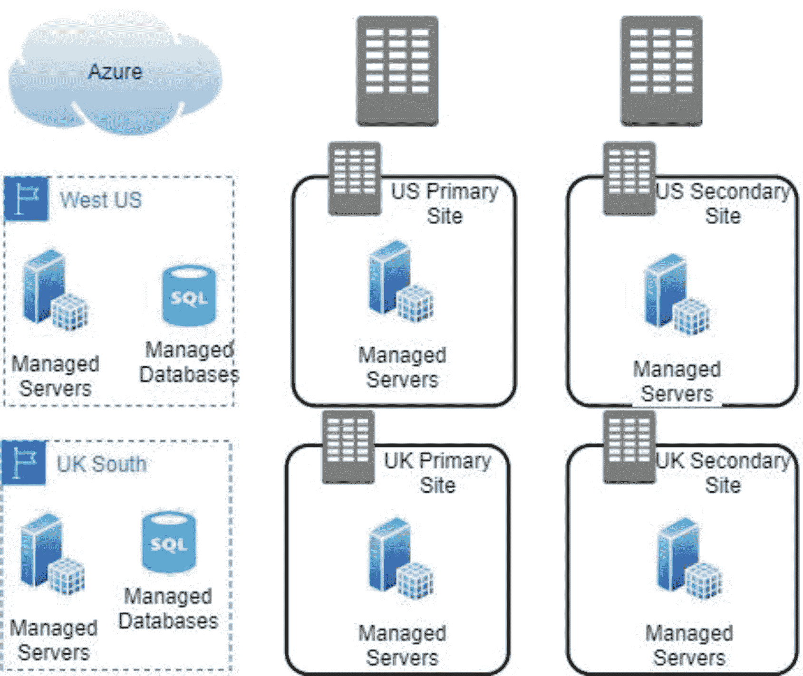

图 8-1：展示使用 Azure 的云计算基础设施的流程图。该图显示了两个主要区域：美国西部和英国南部，每个区域都有托管服务器和数据库。美国西部和英国南部连接到它们各自的主站点和辅助站点，分别标记为美国主站点、美国辅助站点、英国主站点和英国辅助站点，每个站点都包含托管服务器。该流程图代表了服务器和数据库在不同地理位置上的分布和管理。

### 示例拓扑

解决此问题的方法在于冗余。具体而言，可以使用 SQL Server `AlwaysOn 可用性组` 在两个位置之间同步您的库存数据库。您可以构建一个跨越两个数据中心的本地 `AlwaysOn 可用性组`，或者如本例所示，如果组织在公有云中有业务存在，您可以在 Azure 的两个区域之间构建一个 `可用性组`。

### 解决方案

如果您选择将库存数据库托管在 Azure 中，您可以在 `IaaS`（基础设施即服务）上构建 `可用性组`，或者利用 Azure 的 `PaaS`（平台即服务）或 `DBaaS`（数据库即服务）产品。

#### IaaS

如果您选择使用 `IaaS`，那么您将在 Azure 中构建虚拟机，并负责手动配置 `可用性组`。

#### PaaS

如果您选择使用 `PaaS` 产品，那么您将考虑 Azure 托管实例。在这里，您不直接操作虚拟机，而是购买一个 SQL Server 实例作为服务。这减少了管理开销，因为它提供了自动修补、版本更新和自动备份，并完全消除了 Windows 管理。自动故障转移组也可用于管理库存数据库在 Azure 区域间的地理分散部署。

**注意**：Azure SQL 数据库可能不适合您的库存数据库；尽管您可能可以使用弹性作业，但使用托管实例会更易于管理。

Azure SQL 数据库是 Azure 提供的数据库即服务产品。选择此选项，您购买的是一个数据库。这完全消除了管理 Windows 操作系统和 SQL Server 实例的需求。然而，在我们的场景中，Azure SQL 数据库可能不是一个好的选择，因为我们希望将数据库用作自动化的中心，这意味着需要创建 SQL Server Agent 作业。这些作业在 Azure SQL 数据库中不受支持，因为它们属于实例级别的对象。

**提示**：对 `AlwaysOn 可用性组` 的完整讨论超出了本书范围。但是，完整细节可以在 Apress 出版的 *SQL Server 2022 AlwaysOn* 一书中找到，链接为：link.springer.com/book/10.1007/978-1-4842-8864-1。

## 库存数据库逻辑设计

在设计任何数据库时，首要任务应是确定需要存储哪些数据。先不要考虑表设计，只需考虑需要的数据——以扁平列表形式列出。对于数据库开发人员，这需要与业务分析师或业务利益相关者沟通以确定需求。对于应用程序开发人员，此任务通常由他们选择的框架（如 Entity Framework）处理。然而，希望建立库存数据库的 DBA 将同时扮演开发人员和业务利益相关者的角色。以下是一份您可能希望记录的属性列表。当然，此列表应根据您的具体需求进行调整。

*   `服务器名称`
*   `实例名称`
*   `端口`
*   `IP 地址`
*   `服务账户名称和密码`
*   `身份验证模式`
*   `sa 账户名称和密码`
*   `集群标志`
*   `Windows 版本`
*   `SQL Server 版本`
*   `灾难恢复服务器名称`
*   `灾难恢复实例名称`
*   `灾难恢复技术`
*   `目标恢复点目标`
*   `目标恢复时间目标`
*   `实例分类`
*   `服务器核心数`
*   `实例核心数`
*   `服务器内存`
*   `实例内存`
*   `虚拟化标志`
*   `虚拟机监控程序`
*   `SQL Server Agent 账户名称和密码`
*   `应用程序所有者`
*   `应用程序所有者电子邮件`


### 规范化

既然我们已经确定了需要存储的数据（称为属性），接下来必须将这些属性分组到相关的组中。每个组称为一个实体，这些属性实际上就是最终实体的属性。

对实体进行建模的过程称为*规范化*。这一过程由 Edgar F. Codd 于 1970 年发明，并经受住了时间的考验，尽管在随后的十年中又增加了额外的范式。

总共有八种范式，列举如下：

*   1NF（第一范式）
*   2NF（第二范式）
*   3NF（第三范式——这是由 Edgar Codd 定义的原始范式中的最后一个）
*   BCNF（Boyce-Codd 范式，也称为 3.5 范式）
*   4NF（第四范式）
*   5NF（第五范式）
*   6NF（第六范式）
*   DKNF（域键范式）

从 BCNF 到 DKNF 这些范式处理的是特殊情况，并且大多数情况下，如果数据库处于 3NF，那么它通常也满足 DKNF。因此，以下部分将只讨论前三种范式。

使用规范化对数据库进行建模的原因是为了减少数据冗余，这意味着每一条数据都应该只存储一次，用于唯一标识该数据的键除外。这与其说是为了节省存储空间（尽管这显然具有成本和性能优势），不如说是为了避免因需要在多个位置更新数据而导致的数据库异常。它也避免了与防止这些异常相关的复杂性和开销。

**提示**

规范化仅适用于 OLTP（联机事务处理）数据库。数据仓库和数据集市应为了性能而进行反规范化。因此，应使用诸如 Kimball 方法学之类的技术进行建模。ODS（操作数据存储）也需要以不同方式建模，通常基于它所集成的异构源。

将数据建模为 1NF 的目标是确保值是原子的，将重复的属性组移至单独的实体，并且所有属性都依赖于键（也称为素属性）。将数据建模为 2NF 的目标是确保所有非素属性都依赖于实体内的所有素属性。将数据建模为 3NF 的目标是确保没有非素属性依赖于任何其他非素属性。我喜欢用这句话来记忆：“第一、第二和第三范式确保所有属性都依赖于键、整个键、以及除了键之外什么也不依赖。”

#### 1NF

我们规范化之旅的第一步是将所需属性移入第一范式（1NF）。为此，我们必须确保每个属性都是原子的（只保存一条信息），并且每个属性都依赖于一个键。在此阶段，我们还将把重复的属性组拆分到新的实体中。那么，首先，让我们拆分出重复的属性组。我们将从第一个属性（`Server name`）开始，然后对每个其他属性提出以下问题：“每个服务器是否可以有多个该属性？” 表 8-1 为每个属性回答了这个问题。

**表 8-1**

**每个服务器名是否可以有多个该属性？**

| 属性 | 每个服务器是否可以有多个该属性？ |
| --- | --- |
| `Instance name` | 是 |
| `Port` | 是 |
| `IP Address` | 是 |
| `Service account name and password` | 是 |
| `Authentication mode` | 是 |
| `sa account name and password` | 是 |
| `Cluster flag` | 否 |
| `Windows version` | 否 |
| `SQL Server version` | 否（技术上可行，但违反大多数公司策略） |
| `DR Server` | 是 |
| `DR instance` | 是 |
| `DR technology` | 是 |
| `Target RPO` | 是 |
| `Target RTO` | 是 |
| `Instance classification` | 是 |
| `Server cores` | 否 |
| `Instance cores` | 是 |
| `Server RAM` | 否 |
| `Instance RAM` | 是 |
| `Virtual flag` | 否 |
| `Hypervisor` | 否 |
| `SQL Server Agent account name and password` | 是 |
| `Application owner` | 否 |
| `Application owner e-mail` | 否 |

对于任何答案为“否”的属性，在此规范化阶段，它将保留在与 `Server name` 相同的实体中。因此，我们知道我们的第一个实体将包含以下属性：

*   `Server name`
*   `Cluster flag`
*   `Windows version`
*   `SQL Server version`
*   `Server cores`
*   `Server RAM`
*   `Virtual flag`
*   `Hypervisor`
*   `Application owner`
*   `Application owner e-mail`

我们应该给这个实体一个有意义的名称，因此我们将其称为 `Server`。我们现在应确保 `Server` 实体中的每个属性都依赖于一个键。键应该能唯一标识任何行，而 `Server name` 将满足这一要求。因此，我们将把 `Server name` 设为键（素）属性。我们可以看到每个属性只包含一个值，这意味着我们也满足了原子性的要求。

如果我们查看剩余的属性，可以发现它们自然地分为两组：`Instance` 和 `DR Server`。因此，我们将把其余的属性拆分到与这些重复组对应的新实体中。

首先，让我们看看 `Instance` 实体，它将包含以下属性：

*   `Instance name`
*   `Port`
*   `IP Address`
*   `Service account name and password`
*   `Authentication mode`
*   `sa account name and password`
*   `Instance classification`
*   `Instance cores`
*   `Instance RAM`
*   `SQL Server Agent account name and password`

我们需要将 `Server name` 属性添加到 `Instance` 实体中，以便能够将这些实体关联起来。在这个实体中，我们还可以轻松识别出三个不包含原子值的属性：`sa account name and password`、`Service account name and password` 和 `SQL Server Agent account name and password`。每个属性都包含两个值：账户名和密码。因此，这些列应该被拆分，得到以下属性集：

*   `Instance name`
*   `Server name`
*   `Port`
*   `IP Address`
*   `Service account name`
*   `Service account password`
*   `Authentication mode`
*   `sa account name`
*   `sa password`
*   `Instance classification`
*   `Instance cores`
*   `Instance RAM`
*   `Additional services`
*   `SQL Server Agent account name`
*   `SQL Server Agent account password`

关于键，所有属性都可以通过 `Instance name` 唯一标识。因此，实例名称将成为该实体的键。

**提示**


# 数据库规范化

我曾见过一些环境，其实例总是遵循 SQL001、SQL002 等命名约定。这种模式在每个服务器上重复出现。在这种情况下，实例名称将不是唯一的，不能用作键。因此，要么必须使用 IP 地址，要么必须创建一个由`服务器名`和`实例名`组成的复合键。

灾难恢复（DR）实体将包含以下属性：

*   `DR 服务器`

*   `DR 实例`

*   `DR 技术`

*   `目标 RPO`

*   `目标 RTO`

所有值都是原子性的，因此我们无需拆分任何属性。在这个实体中，没有单个属性能够唯一标识所有其他属性。因此，我们必须为此实体构建一个复合键。该键将由`DR 服务器`和`DR 实例`组成。同样，我们将`服务器`实体的键移动到`DR 服务器`实体中，以便将实体链接起来。图 8-2 展示了我们完成的 1NF 实体模型。

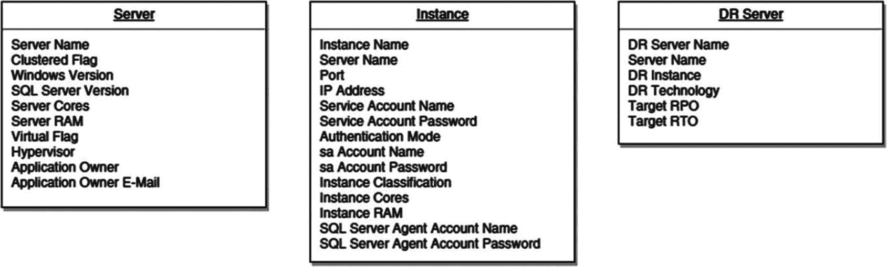

显示三个部分的表格图像：“服务器”、“实例”和“DR 服务器”。“服务器”部分列出了服务器名称、集群标志、Windows 版本、SQL Server 版本、服务器核心数、服务器内存、虚拟化标志、管理程序、应用负责人和应用负责人电子邮件等属性。“实例”部分包括实例名称、服务器名称、端口、IP 地址、服务账户名、服务账户密码、身份验证模式、sa 账户名、sa 账户密码、实例分类、实例核心数、实例内存、SQL Server 代理账户名和 SQL Server 代理账户密码。“DR 服务器”部分列出了 DR 服务器名称、服务器名称、DR 实例、DR 技术、目标 RPO 和目标 RTO。

图 8-2

1NF 实体

#### 2NF

规范化过程的下一步是将我们的实体转换为第二范式（2NF）。要符合 2NF，实体必须已经是 1NF，并且你必须确保没有非键属性（也称为非素属性）仅依赖于实体键的一部分。如果有，你必须将属性拆分到额外的实体中。

由于`服务器`和`实例`实体都具有单属性键，我们知道这些实体已经是第二范式。然而，我们必须检查`DR 服务器`实体，因为该实体具有复合键。我们应该依次查看每个非素属性，并确定该属性是依赖于复合键的全部，还是仅依赖于键的一个子集。表 8-2 显示了此分析。

表 8-2

键依赖关系

| 非素属性 | 键依赖关系 | 符合 2NF？ |
| --- | --- | --- |
| `DR 技术` | `DR 实例名称` | 否 |
| `目标 RPO` | `DR 实例名称` | 否 |
| `目标 RTO` | `DR 实例名称` | 否 |

如你所见，所有三个非素属性无需知道 DR 服务器的名称即可标识。这意味着这些列都应移动到一个单独的实体中，我们称之为`DR 实例`。

唯一保留在`DR 服务器`实体中的属性是键属性。这可能看起来有点奇怪，但这样做是为了避免`服务器`实体和`DR 实例`实体之间的多对多关系，并且是一个完全有效的设计。

#### 3NF

本书中将介绍的规范化最后阶段是如何将实体转换为第三范式（3NF）。为了符合 3NF，实体应该已经是 2NF，并且实体的非素属性不应依赖于任何其他非素属性。如果我们发现一个属性依赖于非素属性，则称为传递依赖，该属性应移动到单独的实体中。

在`服务器`、`DR 服务器`和`DR 实例`实体中，没有传递依赖。然而，在`实例`实体中，有三个属性依赖于非素属性。这些列在表 8-3 中。

表 8-3

传递依赖

| 属性 | 依赖 |
| --- | --- |
| `sa 账户密码` | `sa 账户名` |
| `服务账户密码` | `服务账户名` |
| `SQL Server 代理账户密码` | `SQL Server 代理账户名` |

根据规范化规则，我们应该将这些属性中的每一个移动到其自己的实体中。但是，利用我们对业务规则的理解，我们知道在某些情况下，同一个服务账户可能同时用于数据库引擎服务账户和 SQL Server Agent 服务账户。因此，我们将服务账户属性移动到单个实体中，我们称之为`服务账户`。然后，我们可以将`服务账户`实体链接回`DR 实例`实体两次：一次用于`服务账户名`，另一次用于`SQL Server 代理账户名`。

sa 账户详情与服务账户详情不匹配，因为 sa 账户永远不能在实例之间共享。因此，我们将 sa 账户详情移动到一个单独的实体中，称为`sa 账户`。我们将`服务账户`和`sa 账户`实体的主键移回`实例`实体，以便将它们链接在一起。图 8-3 显示了`实例`、`sa 账户`和`服务账户`实体的建模方式。

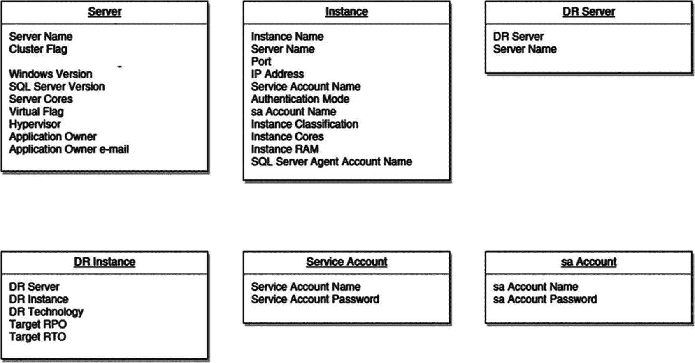

显示流程图的图表，包含六个带标签的框：“服务器”、“实例”、“DR 服务器”、“DR 实例”、“服务账户”和“sa 账户”。每个框列出相关属性。“服务器”包括服务器名称和 SQL 版本等详细信息。“实例”涵盖实例名称、IP 地址和身份验证模式。“DR 服务器”和“DR 实例”侧重于灾难恢复详细信息。“服务账户”和“sa 账户”列出账户名称和密码。该图表概述了服务器和账户配置。

图 8-3

传递依赖


### 测试规范化

我们可以通过创建一个简单的 ERD（实体关系图）来测试规范化过程是否有效。该图将以图形方式描绘实体及其连接键。当键是唯一的时，连接实体的线条将带有标准端点。当可能出现重复键值时，线条将带有“鸦爪”状端点。

当我们检查完成的 ERD 时，我们希望看到每条连接实体的线条都是一端为标准线，另一端为鸦爪状。这被称为一对多关系，将直接映射到物理数据库表中的主键和外键约束。

如果我们发现多对多关系，很可能我们遗漏了一个实体，需要在我们的设计中添加一个额外的实体，其作用方式与我们的 `DR Server` 实体类似，用于将多对多关系分解为两个一对多关系。

另一方面，如果我们发现一对一关系，那几乎肯定是我们将实体规范化到了一个会增加查询复杂性却没有任何价值的程度。这种情况下，我们应该将实体反规范化，直到所有实体都使用一对多关系连接在一起。我们规范化后的库存数据库的 ERD 可以在图 8-4 中找到。

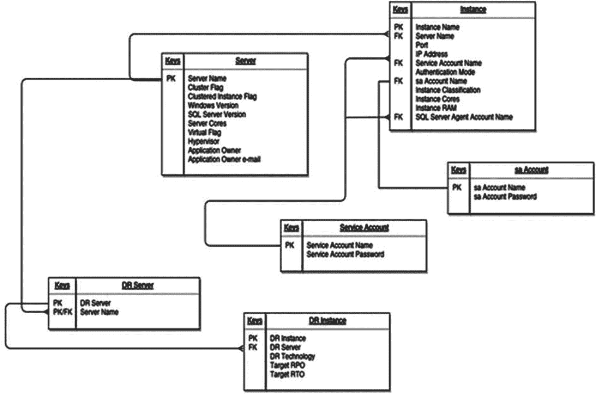

显示表间关系的数据库模式流程图图表。主要表包括“Server”、“Instance”、“Service Account”、“sa Account”、“DR Server”和“DR Instance”。每个表列出属性，如“Server Name”、“Cluster Flag”、“Instance Name”、“Service Account Name”和“DR Technology”。线条连接表以指示关系，键被标记为“PK”（主键）和“FK”（外键）。该图表直观地表示了数据库系统内的结构和连接。

图 8-4: 实体关系图

你会注意到 ERD 发现了一个我们建模中的问题。`sa Account` 实体通过一对一关系连接到 `Instance` 实体。这意味着我们应该将 `sa Account` 实体反规范化回到 `Instance` 实体中。由此产生的 ERD 显示在图 8-5 中。

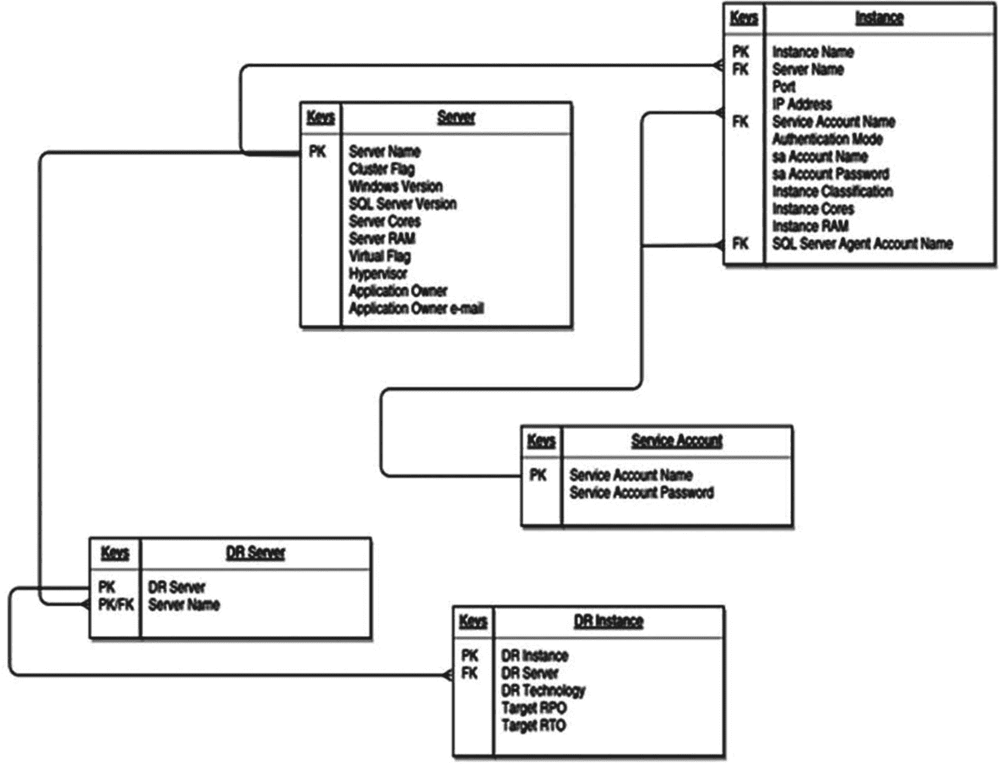

一个数据库模式图示，包含五个相互连接的表：Server、Instance、DR Server、Service Account 和 DR Instance。每个表列出了属性和键。Server 表包含属性如 Server Name 和 SQL Server Version。Instance 表包含 Instance Name 和 IP Address。DR Server 表列出 DR Server Name。Service Account 表包含 Service Account Name。DR Instance 表具有 DR Instance 和 DR Technology。线条表示表之间的关系，标有主键和外键。

图 8-5: 反规范化的 ERD

提示

前面的示例展示了如何为一个简单的库存数据库建模。在创建库存数据库以支持你的生产环境时，你可能还希望存储与高可用性（HA）技术相关的详细信息，例如 AlwaysOn 故障转移集群或 AlwaysOn 可用性组。你可能还希望将 `Servers`、`DR Servers` 和（可能的）`HA Servers` 建模为超类型和子类型。有关超类型和子类型的更多详细信息，请访问 [`https://msdn.microsoft.com/en-us/library/cc505839.aspx`](https://msdn.microsoft.com/en-us/library/cc505839.aspx)。

## 库存数据库物理设计

既然我们有了数据库的逻辑模型，我们就必须考虑物理设计。第一个考虑因素可能是我们的属性和实体名称，以及它们如何映射到 SQL Server 友好的对象标识符，这些标识符将不需要被封装在方括号中。在代码中引用对象标识符时，如果违反以下任何规则，则必须将其封装在方括号中：

1.  标识符不能包含空格。

2.  标识符不能包含以下特殊字符：

```
    ~                              '
    -                              &
    !                              .
    {                              (
    %                              \
    }                              )
    ^                              `
```

3.  标识符不能与 T-SQL 关键字相同。

如果标识符不符合这些规则，则它们被称为分隔标识符。我们的 `Server` 和 `Instance` 实体符合这些规则，但我们的 `DR Server` 实体将成为 `DRServer`；我们的 `DR Instance` 实体将成为 `DRInstance`；我们的 `Service Account Entity` 将成为 `ServiceAccount`。表 8-4 详细说明了属性名到列名的映射。

表 8-4: 移除分隔标识符

| 属性名称 | 列名称 |
| --- | --- |
| `Server name` | `ServerName` |
| `Instance name` | `InstanceName` |
| `Port` | `Port` |
| `IP Address` | `IPAddress` |
| `Service account name` | `ServiceAccountName` |
| `Service account password` | `ServiceAccountPassword` |
| `Authentication mode` | `AuthenticationMode` |
| `sa account name` | `saAccountName` |
| `sa account password` | `saPassword` |
| `Cluster flag` | `ClusterFlag` |
| `Windows version` | `WindowsVersion` |
| `SQL Server version` | `SQLVersion` |
| `DR Server Name` | `DRServerName` |
| `DR instance Name` | `DRInstanceName` |
| `DR technology` | `DRTechnology` |
| `Target RPO` | `TargetRPO` |
| `Target RTO` | `TargetRTO` |
| `Instance classification` | `InstanceClassification` |
| `Server cores` | `ServerCores` |
| `Instance cores` | `InstanceCores` |
| `Server RAM` | `ServerRAM` |
| `Instance RAM` | `InstanceRAM` |
| `Virtual flag` | `VirtualFlag` |
| `Hypervisor` | `Hypervisor` |
| `SQL Server Agent account name` | `SQLServerAgentAccountName` |
| `SQL Server Agent account password` | `SQLServerAgentAccountPassword` |
| `Application owner` | `ApplicationOwner` |
| `Application owner e-mail` | `ApplicationOwnerEMail` |

数据类型是列唯一始终具有的约束，在实现此约束时应谨慎。如果数据类型限制性太强，某些数据将无法放入列中，你将不得不通过更改列的数据类型或长度规范来修复问题。然而，如果数据类型比需要的大，你将发现自己在使用更多的服务器资源来满足磁盘和 RAM 要求。

表 8-5 列出了我们 `Inventory` 数据库中的每一列，并推荐了合适的数据类型。在适用的情况下，给出了选择背后的基本原理说明。

表 8-5: 数据类型


| 列名 | 数据类型 | 说明 |
| --- | --- | --- |
| `Server name` | `NVARCHAR(128)` | SQL Server 使用一种名为 `sysname` 的内部数据类型来存储对象标识符。`sysname` 数据类型本质上是 `NVARCHAR(128) NOT NULL` 的同义词。因此，为了保持一致性，我们将使用 `NVARCHAR(128)` 作为任何对象标识符的数据类型。 |
| `Instance name` | `NVARCHAR(128)` |  |
| `Port` | `NVARCHAR(8)` | 存储为字符串，以包含协议信息。 |
| `IP Address` | `NVARCHAR(15)` |  |
| `Service account name` | `NVARCHAR(128)` |  |
| `Service account password` | `NVARCHAR(64)` |  |
| `Authentication mode` | `BIT` | `0` 表示 Windows 身份验证，`1` 表示混合模式身份验证。 |
| `sa account name` | `NVARCHAR(128)` |  |
| `sa account password` | `NVARCHAR(64)` |  |
| `Cluster flag` | `BIT` |  |
| `Windows version` | `NVARCHAR(64)` | 服务器上安装的 Windows 版本，例如 “Windows Server 2022 Standard LSTC”。 |
| `SQL Server version` | `NVARCHAR(64)` | 服务器上安装的 SQL Server 版本，例如 “SQL Server 2022 Enterprise RTM CU2”。 |
| `DR Server name` | `NVARCHAR(128)` |  |
| `DR instance name` | `NVARCHAR(128)` |  |
| `DR technology` | `NVARCHAR(128)` |  |
| `TargetRPO` | `TINYINT` |  |
| `TargetRTO` | `TINYINT` |  |
| `Instance classification` | `TINYINT` | `1` 表示联机事务处理 (OLTP)，`2` 表示数据仓库，`3` 表示混合工作负载，`4` 表示提取、转换、加载 (ETL)。 |
| `Server cores` | `TINYINT` |  |
| `Instance cores` | `TINYINT` |  |
| `Server RAM` | `SMALLINT` |  |
| `Instance RAM` | `SMALLINT` |  |
| `Virtual flag` | `BIT` | `0` 表示物理服务器，`1` 表示虚拟机。 |
| `Hypervisor` | `BIT` | `0` 表示 VMWare，`1` 表示 Hyper-V。 |
| `SQL Server Agent account name` | `NVARCHAR(128)` |  |
| `SQL Server Agent account password` | `NVARCHAR(64)` |  |
| `Application owner` | `NVARCHAR(256)` |  |
| `Application owner e-mail` | `NVARCHAR(512)` |  |

我们现在应该考虑为每张表设计主键。我们已经识别出的逻辑“自然”键是否足够，还是应该创建人工键？人工键通常通过 `IDENTITY` 列实现。

我们可以看到，每张表的主键列数据类型都是 `NVARCHAR(128)`。虽然这些列能唯一标识各自表中的每一行，但它们是宽列，每行可能消耗高达 256 字节。

主键将在每个外键中被复制，并且由于主键通常是表的聚集索引所基于的列，它也很可能在所有非聚集索引中被复制。因此，我们希望主键值尽可能窄。如果我们为每张表添加一个使用 `INT` 数据类型的假想主键，每个键值将只消耗 4 字节，而不是可能的 256 字节。

> 提示
>
> 由于我们采取了使用假想键的方法，很可能每个自然键都需要一个唯一约束。

## 创建库存数据库

在本节中，我们将使用 DbaTools 来创建我们在本章中设计的库存数据库。我们的第一步是创建数据库外壳，这可以通过使用 `New-DbaDatabase` 命令来实现，如代码清单 8-1 所示。在此脚本中，我们配置了数据库的排序规则、数据库所有者以及所需的恢复模式（在我们的案例中是完整恢复模式，因为它是一个 OLTP 数据库，并且我们希望执行事务日志备份）。我们还配置了主数据文件的属性。

> 提示
>
> `New-DbaDatabase` 还有一些参数，允许您配置辅助数据文件的属性、事务日志的属性、默认文件组以及数据和日志文件的文件路径。由于我们未指定这些值，SQL Server 将使用 `Model` 数据库中配置的值。

```powershell
$params = @{
    SqlInstance        = "localhost"
    Name               = "Inventory"
    Collation          = "Latin1_General_CI_AS"
    Owner              = "sa"
    RecoveryModel      = "Full"
    PrimaryFileSize    = "2048" # 指定单位为 MB
    PrimaryFileGrowth  = "1024" # 指定单位为 MB
    PrimaryFileMaxSize = "4096" # 指定单位为 MB
}
New-DbaDatabase @params
### 清单 8-1 创建外壳数据库
```

由于我们的库存数据库将包含所管理实例的 `sa` 密码，因此我们需要考虑加密。SQL Server 中的加密层次结构如图 8-6 所示。

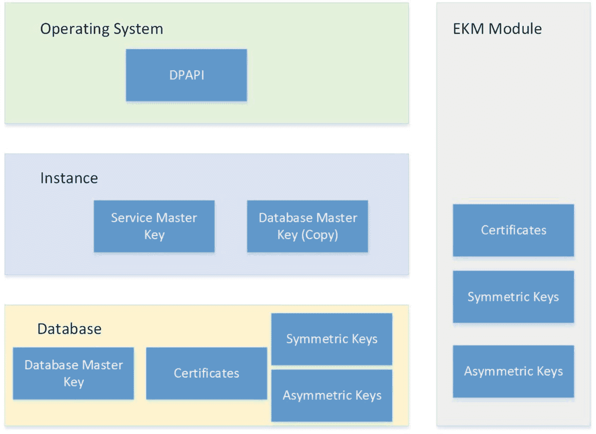

图 8-6 SQL Server 加密层次结构

> 提示
>
> 全面讨论加密超出了本书的范围。但是，可以在 Apress 出版的 *Pro SQL Server 2022 Administration* 中找到完整的描述，网址为 link.springer.com/book/10.1007/978-1-4842-8864-1。

对于我们的用例，我们需要创建一个数据库主密钥（服务主密钥将自动创建）。然后，我们需要创建一个使用数据库主密钥加密的证书，再创建一个使用该证书加密的对称密钥。这样就可以使用对称密钥加密 `sa` 密码，然后再插入数据库表。

我们可以使用 `New-DbaDbMasterKey` 命令创建数据库主密钥，如代码清单 8-2 所示。在这里，我们将一个密码转换为安全字符串，然后将其作为主密钥的密码，连同将在其中创建主密钥的数据库名称一起，传递到 `New-DbaDbMasterKey` 命令中。

```powershell
$Password = $SecurePassword = ConvertTo-SecureString 'Pa$$w0rd' -AsPlainText -Force
$params = @{
    SqlInstance    = "localhost"
    Database       = "Inventory"
    SecurePassword = $Password
}
New-DbaDbMasterKey @params
### 清单 8-2 为库存数据库创建数据库主密钥
```

备份数据库主密钥至关重要。否则，如果我们丢失了密钥，将无法恢复加密的数据。我们可以使用代码清单 8-3 中的脚本将密钥备份到文件系统。

```powershell
$Password = $SecurePassword = ConvertTo-SecureString 'Pa$$w0rd' -AsPlainText -Force
$params = @{
    SqlInstance    = "localhost"
    Database       = "Inventory"
    SecurePassword = $Password
    Path           = "c:\Keys\"
}
Backup-DbaDbMasterKey @params
### 清单 8-3 备份主密钥
```


此命令的示例输出如下所示。你会注意到其中包含了保存密钥时使用的文件名。

```
ComputerName : WIN-J38I01U06D7
InstanceName : MSSQLSERVER
SqlInstance  : WIN-J38I01U06D7
Database     : Inventory
Path         : C:\Keys\localhost-Inventory-20240128124555.key
Status       : Success
```

### 创建证书
我们现在可以创建一个证书。清单 8-4 演示了如何使用 `New-DbaDbCertificate` 命令来生成证书。

```
$Password = $SecurePassword = ConvertTo-SecureString 'Pa$$w0rd' -AsPlainText -Force
$params = @{
    SqlInstance    = "localhost"
    Database       = "Inventory"
    SecurePassword = $Password
}
New-DbaDbCertificate @params
清单 8-4
创建证书
```

### 备份证书
就像我们处理数据库主密钥一样，我们也应该备份证书，以确保在证书出现问题时不会丢失数据。清单 8-5 演示了这一点。

```
$Password = $SecurePassword = ConvertTo-SecureString 'Pa$$w0rd' -AsPlainText -Force
$params = @{
    SqlInstance        = "localhost"
    Database           = "Inventory"
    EncryptionPassword = $Password
    DecryptionPassword = $Password
    Path               = "C:\Keys\"
}
Backup-DbaDbCertificate @params
清单 8-5
备份证书
```

此命令的输出如下所示。你会注意到它提供了用于创建证书和私钥文件的文件名。

```
Certificate  : Inventory
ComputerName : WIN-J38I01U06D7
Database     : Inventory
InstanceName : MSSQLSERVER
Key          : C:\Keys\Inventory202401281255385538.pvk
Path         : C:\Keys\Inventory202401281255385538.cer
SqlInstance  : WIN-J38I01U06D7
Status       : Success
```

### 创建对称键
我们现在可以创建一个对称密钥。该密钥将使用我们的证书进行加密，反过来又将用于加密我们插入到 `dbo.Instance` 表的 `saPassword` 列中的数据。清单 8-6 演示了如何创建对称密钥。不幸的是，在撰写本文时，执行此操作的 DbaTools 命令 (`New-DbaEncryptionKey`) 会在 master 数据库中查找证书，而不是在用户数据库中。因此，脚本使用了 `Invoke-DbaQuery`，传入 T-SQL 脚本来创建密钥。

> 提示
>
> 关于 `Invoke-DbaQuery` 的更多详细信息可以在第 5 章找到。

```
$params = @{
    SqlInstance = "localhost"
    Query = "
        CREATE SYMMETRIC KEY Inventory_Key
        WITH ALGORITHM = AES_128
        ENCRYPTION BY CERTIFICATE Inventory
    "
    Database = "Inventory"
}
Invoke-DbaQuery @params
清单 8-6
创建对称密钥
```

### 创建表
最后，我们需要创建表。虽然有一个用于创建表的 DbaTools 命令 (`New-DbaDbTable`)，但我个人觉得它相当繁琐，需要将列定义在数组中定义然后传入。因此，我们将使用 `Invoke-DbaQuery` 命令执行此操作，传入一个将创建所需架构的脚本。清单 8-7 演示了这一点。请注意，`saPassword` 列被创建为 `VARBINARY(256)` 而不是 `NVARCHAR(64)`，以便存储加密值。

```
$params = @{
    SqlInstance = "localhost"
    Database = "Inventory"
    Query       = "
        --Create the ServiceAccount table
        CREATE TABLE [dbo].[ServiceAccount] (
            [ServiceAccountID] INT NOT NULL IDENTITY PRIMARY KEY,
            [ServiceAccountName] NVARCHAR(128) NOT NULL UNIQUE,
            [ServiceAccountPassword] VARBINARY(256)
        ) ;
        GO

        --Create the Server table
        CREATE TABLE [dbo].[Server] (
            [ServerID] INT NOT NULL IDENTITY PRIMARY KEY,
            [ServerName] NVARCHAR(128) NOT NULL UNIQUE,
            [ClusterFlag] BIT NOT NULL,
            [WindowsVersion] NVARCHAR(64) NOT NULL,
            [SQLVersion] NVARCHAR(64) NOT NULL,
            [ServerCores] TINYINT NOT NULL,
            [ServerRAM] BIGINT NOT NULL,
            [VirtualFlag] BIT NOT NULL,
            [Hypervisor] BIT NULL,
            [ApplicationOwner] NVARCHAR(256) NULL,
            [ApplicationOwnerEMail] NVARCHAR(512) NULL
        ) ;
        GO

        --Create the DRServer table
        CREATE TABLE [dbo].[DRServer] (
            [DRServerID] INT NOT NULL IDENTITY ,
            [DRServerName] NVARCHAR(128) NOT NULL
            [ServerID] INT NOT NULL,
            CONSTRAINT [FK_DRServer_ToServer]
                FOREIGN KEY ([ServerID]) REFERENCES Server,
            PRIMARY KEY ([DRServerID], [ServerID])
        ) ;
        GO

        --Create the DRInstance table
        CREATE TABLE [dbo].[DRInstance] (
            [DRInstanceID] INT NOT NULL IDENTITY PRIMARY KEY,
            [DRInstanceName] NVARCHAR(128) NOT NULL UNIQUE,
            [DRServerID] INT NOT NULL,
            [ServerID] INT NOT NULL,
            [DRTechnology] NVARCHAR(128) NOT NULL,
            [TargetRPO] TINYINT NOT NULL,
            [TargetPTO] TINYINT NOT NULL,
            CONSTRAINT [FK_DRInstance_ToDRServer]
                FOREIGN KEY ([DRServerID], [ServerID]) REFERENCES DRServer
        ) ;
        GO

        --Create the Instance table
        CREATE TABLE [dbo].[Instance] (
            [InstanceID] INT NOT NULL IDENTITY  PRIMARY KEY,
            [InstanceName] NVARCHAR(128) NOT NULL UNIQUE,
            [ServerID] INT NOT NULL,
            [Port] NVARCHAR(8) NOT NULL,
            [IPAddress] NVARCHAR(15) NOT NULL,
            [SQLServiceAccountID] INT NOT NULL,
            [AuthenticationMode] BIT NOT NULL,
            [saAccountName] NVARCHAR(128) NULL,
            [saAccountPassword] VARBINARY(256) NULL,
            [InstanceClassification] TINYINT NOT NULL,
            [InstanceCores] TINYINT NOT NULL,
            [InstanceRAM] BIGINT NOT NULL,
            [SQLServerAgentAccountID] INT NOT NULL,
            CONSTRAINT [FK_Instance_ToServer]
                FOREIGN KEY ([ServerID]) REFERENCES Server,
            CONSTRAINT [FK_Instance_SQL_ToServiceAccount]
                FOREIGN KEY ([SQLServiceAccountID]) REFERENCES ServiceAccount,
            CONSTRAINT [FK_Instance_Agent_ToServiceAccount]
                FOREIGN KEY ([SQLServerAgentAccountID]) REFERENCES ServiceAccount
        ) ;
        GO
    "
}
Invoke-DbaQuery @params
清单 8-7
创建架构
```

## 总结
一个设计良好的清单数据库可以通过提供自动维护的、集中式的信息存储库来协助 DBA 进行自动化工作，该存储库进而可以驱动自动化维护例程。

在设计清单数据库时，你必须同时考虑平台需求以及数据库表的逻辑和物理设计。在设计数据库的平台需求时，你应该考虑 HA/DR 策略以及清单数据库的放置位置，以避免数据中心隔离问题。理想情况下，你应该将清单数据库进行地理分散，因为它对于提供“低运维”解决方案至关重要。

在执行数据库的逻辑设计时，你应该使用规范化来建模数据，这是在 1970 年发明的用于消除数据重复的过程。然后，你可以使用实体关系图测试你的模型，以确保所有实体都通过一对多关系连接。

数据库的物理设计将涉及设计将存储数据的物理表。这包括确保没有分隔标识符、选择适当的数据类型以及定义可能需要的任何人工键。

你可以使用 DbaTools 创建数据库和所需的对象，例如加密密钥和证书，以及数据库和表。这使你所有的代码都保留在 PowerShell 中。然而，有些对象，例如对称密钥和表，使用 `Invoke-DbaQuery` 命令创建可能更好，因为特定功能的命令存在限制。


# 9. 实现 SQL Server 的配置管理

在第 3 章中，我们探讨了配置管理的概念，以及如何使用 PowerShell DSC 来配置 Windows 操作系统并防止配置漂移。在第 6 章中，我们扩展了这一概念，研究了如何使用 DSC 来确保 SQL Server 实例的安装。在本章中，我们将进一步探讨 `SqlServerDsc` 模块，研究如何使用它来配置我们的 SQL Server 实例并防止漂移。

我们将从定义构建需求开始，思考在 SQL Server 构建期间我们可能希望配置的、并在实例生命周期中防止其发生漂移的常见方面。然后，我们将探讨如何实现适当的 DSC 资源。

## 定义配置需求

在为组织定义标准构建时，我们不应只考虑安装 SQL Server，还应考虑它应如何配置。在考虑此配置时，我们应考虑诸如安全性、性能和减少持续性操作等方面。

**提示**

高可用性超出了本书的范围，但它是 DSC 的另一个考虑因素，因为 `SqlServerDsc` 模块包含有助于向集群或可用性组添加节点的命令。

### 安全需求

SQL Server 的安全性是一个庞大的主题，我在 Apress 出版的《*Securing SQL Server*》一书中有深入探讨，该书可在此链接获取：link.springer.com/book/10.1007/978-1-4842-2265-2。然而，就本章的目的而言，让我们选取三个考虑因素。首先是 `xp_cmdshell` 的使用。这是一个系统存储过程，允许管理员从 SQL Server 内部与操作系统交互。不幸的是，它的性质使其成为恶意活动的主要目标。存在一些攻击向量，这意味着如果 SQL Server 实例遭到入侵，此过程可被用于在网络中执行横向移动攻击。

我们将强制执行的第二个配置是禁用 OLE 自动化。如果启用了 OLE 自动化过程，则 SQL Server 实例的攻击面会增加，并且允许用户在数据库引擎服务的安全上下文内，执行 SQL Server 外部的函数。这是攻击者希望执行横向移动攻击的另一个主要目标。

最后，我们将确保内置的 Windows `Administrators` 角色不与 SQL Server 登录关联。在非常旧的 SQL Server 版本中，`Administrators` 组会自动获得 SQL Server 登录名并被添加到 `sysadmin` 固定服务器角色中。然而，在过去的 15 年里，这种行为已经改变，现在被认为是不良实践。事实上，在 SQL Server 2022 中，已无法再将本地 Administrators 组添加为登录名。只有指定的 SQL Server 管理员才应被授予 SQL Server 实例的权限。如果未掌握 SQL Server 技能的管理员尝试在 SQL Server 中执行操作，即使他们的意图是善意的，也可能导致问题。

### 性能需求

确保良好的性能是许多 DBA 心中的首要任务。许多性能配置将取决于实例中托管数据库的工作负载特征。例如，期望高比例 `INSERTS` 和 `UPDATES` 的 OLTP 数据库，其配置可能与数据仓库数据库不同，后者受夜间 ETL 运行的影响，但用户体验主要基于大型读取。然而，有一些性能优化通常**适用**，无论工作负载特征如何。

我们将为实例确保的第一个配置是最大并行度 (MAXDOP) 得到最佳配置。此设置将确定单个查询可使用的最大核心数。将 MAXDOP 设置为 0 允许无限并行化，而将其设置为整数值则指定可使用的逻辑处理器数量。

尽管存在一些边缘情况，例如具有多个 NUMA 节点的服务器，但一般经验法则是 MAXDOP 应配置为服务器中的核心数，最多不超过 8。`SqlserverDsc` 允许我们动态配置此值。这非常有帮助，因为这意味着如果我们调整服务器规模，DSC 会自动更改 MAXDOP 以确保其保持适当。

我们将强制执行的第二个配置与 SQL Server 消耗的内存量有关。Microsoft 建议 SQL Server 使用的最大内存量（用于缓冲区缓存）为服务器总内存的 75%。因此，我们将强制执行此建议。与 MAXDOP 一样，`SqlserverDsc` 可以动态强制执行此设置，以确保在服务器调整规模后仍遵循最佳实践，而无需管理员干预。

**提示**

如果服务器上安装了多个实例，则应将 75% 的内存分配给这些实例。例如，如果服务器托管三个实例，您可能希望将每个实例的最大内存设置为 25%，以确保一个实例不会使其他实例因内存不足而受限。

下一个配置涉及 SQL Server 实例将消耗的最小内存量。默认情况下，SQL Server 根据需要上下调整内存使用量。问题在于，SQL Server 中的动态内存分配并非该产品的最强功能。鉴于 SQL Server 通常是服务器上运行的唯一应用程序，并且假设只有一个实例，我建议将最小内存配置为与最大内存相同，从而防止动态内存管理。

**提示**

SQL Server 不会在服务启动时为自己分配最小内存。它总是会根据需要增长内存使用量。最小内存设置的作用是设置可释放内存量的限制。

### 减少持续性操作

自动化的理念是防止手动任务的需求。因此，如果我们事先知道安装后需要管理任务，那么最好提前将其自动化，以便以后节省时间。

我们将强制执行的第一个配置，以减少以后的管理工作量，是确保 DBA 团队对实例具有管理访问权限。这将涉及为名为 `DBATeam` 的 Windows 组创建一个登录名，并确保此登录名位于 `sysadmin` 固定服务器角色中。

我们将强制执行的第二个配置涉及我们在第 8 章讨论的中央管理服务器和配置数据库。具体来说，我们将确保存在一个链接服务器，该服务器提供对中央管理服务器上 `Config` 数据库的访问。这将允许我们从本地实例运行查询，以检索有用的信息，例如应用程序所有者。

## 实现配置

在以下部分中，我们将研究如何为每个需求创建资源。第一部分将介绍如何实现我们的安全需求。然后，我们将讨论如何实现性能和操作需求。最后，我们将把所有内容整合到我们在第 3 章和第 6 章中一直在构建的配置中。


### 实施安全资源

让我们看看如何使用 DSC（期望状态配置）来强制实施我们选定的每个安全相关配置。我们需要的第一个资源应确保 `xp_cmdshell` 被禁用。我们可以使用清单 9-1 中的资源定义来实现这一点。该资源使用了 `SqlserverDsc` 模块中的 `SqlConfiguration` 资源类型，我们将其名称设为 `xpCmdshell`。你会注意到，我们没有向此资源传递 `Ensure` 参数。相反，我们传递的是选项名称和选项的期望值。在我们的例子中，值是 `0`，表示禁用。我们还可以指定是否希望服务重启。这是因为有少数配置选项只有在服务重启后才会生效。

提示

当使用 `SqlserverDsc` 模块配置默认实例时，我们应传递 `MSSQLSERVER` 作为实例名称。对于命名实例，我们当然会传递实际的实例名称。在此场景中，我们的配置（参见第 6 章）是参数化的，因此我们将传递 `SqlInstanceName` 变量，该变量默认值为 `MSSQLSERVER`，但在编译 MOF 时可以覆盖。

```
SqlConfiguration 'xpCmdshell' {
OptionName     = 'xp_cmdshell'
OptionValue    = 0
RestartService = $false
ServerName     = 'localhost'
InstanceName   = $SqlInstanceName
}
```
清单 9-1. xpCmdshell 资源

我们的下一个资源将确保在实例中禁用 OLE 自动化。对于此配置，我们将再次使用 `SqlConfiguration` 资源。但这次，我们将传递 `Ole Automation Procedures` 作为 `OptionName`。同样，我们将传递 `OptionValue` 为 `0` 来表示我们希望禁用该功能。如清单 9-2 所示。

```
SqlConfiguration 'OLEAutomation' {
OptionName     = 'Ole Automation Procedures'
OptionValue    = 0
RestartService = $false
ServerName     = 'localhost'
InstanceName   = $SqlInstanceName
}
```
清单 9-2. OLEAutomation 资源

我们将创建的最后一个安全相关资源将确保 Windows `Authenticated Users` 组没有 SQL Server 登录名。为此，我们将使用 `SqlserverDsc` 模块中的 `SqlLogin` 资源。我们将传递 `Ensure` 参数，但这次不是像之前那样使用 `Ensure = 'Present'`，而是使用 `Ensure = 'Absent'` 来删除登录名（如果存在）。

我们将使用 `Name` 参数来提供要删除的登录名的名称，`LoginType` 参数允许我们定义该登录名是映射到 Windows 用户、Windows 组还是 SQL 登录名。清单 9-3 展示了这一点。

```
SqlLogin 'AuthenticatedUsers' {
Ensure       = 'Absent'
Name         = 'NT AUTHORITY\Authenticated Users'
LoginType    = 'WindowsGroup'
ServerName   = 'localhost'
InstanceName = $SqlInstanceName
}
```
清单 9-3. BuiltinAdministrators 资源

### 实施性能资源

让我们看看如何使用 DSC 执行性能配置。这些配置中的第一个是确保 `MAXDOP` 被配置为最佳值。使用 `SqlMaxDop` 资源，可以直接传递 `MAXDOP` 的期望值，但我们不这样做，而是传递 `DynamicAlloc = $true`。这是一个有用的功能，它利用资源代码中包含的逻辑，根据服务器当前的规模计算理想值，并相应地配置 `MAXDOP`。如清单 9-4 所示。

提示

如果你的服务器有多个 NUMA 节点，那么建议会有所不同，并且 `SqlMaxDop` 资源没有内置逻辑来支持这种情况。因此，如果服务器有多个 NUMA 节点，我建议在你自己的配置中添加自定义逻辑。

```
SqlMaxDop 'DynamicSqlMaxDop' {
Ensure                  = 'Present'
DynamicAlloc            = $true
ServerName              = 'localhost'
InstanceName            = $SqlInstanceName
}
```
清单 9-4. DynamicSqlMaxDop 资源

接下来，我们将考虑最小和最大内存需求。我们希望将这两个设置都配置为服务器可用内存的 75%，这将为操作系统预留足够的内存，并避免 SQL Server 中的动态内存管理。

我们可以使用单个 `SqlMemory` 资源来配置这两个选项。该资源允许我们使用资源内置的规则动态配置最小和最大内存，也允许我们以 MB 为单位传递任意值。然而，在我们的例子中，我们希望以总服务器内存的百分比来传递值。因此，我们将使用 `MaxMemoryPercent` 和 `MinMemoryPercent` 参数，如清单 9-5 所示。

```
SqlMemory 'MinAndMaxMemory75Percent' {
Ensure               = 'Present'
DynamicAlloc         = $false
MaxMemoryPercent     = 75
MinMemoryPercent     = 75
ServerName           = 'localhost'
InstanceName         = $SqlInstanceName
}
```
清单 9-5. MinAndMaxMemory75Percent 资源


### 实现操作资源

我们要实施的第一个配置，旨在减少运维开销，它将确保为 `DBATeam` Windows 组创建一个登录名，并且该登录名在实例上拥有管理权限。这将需要两个资源。

第一个资源将使用我们在本章已讨论过的 `SqlLogin` 资源，来确保 `DBATeam` 登录名存在。第二个资源将是一个 `SqlRole` 资源，用于确保 `DBATeam` 登录名被添加到 `sysadmin` 固定服务器角色中。在声明 `SqlRole` 资源时，我们需要将 `sysadmin` 传递给 `ServerRoleName` 参数。`Members` 参数接受一个以逗号分隔的安全主体列表，这些主体应被添加到该角色中。清单 9-6 演示了如何创建这两个资源。

> 注意
> 该脚本假设 `DBATeam` Windows 组已存在。如果你正在跟随本章的示例操作，那么你应该在 Windows 中创建 `DBATeam` 组，或者使用一个已存在的 Windows 组。

```powershell
SqlLogin 'DBATeamLogin' {
Ensure           = 'Present'
Name             = 'MyDomain\DBATeam'
LoginType        = 'WindowsGroup'
ServerName       = 'localhost'
InstanceName     = $SqlInstanceName
}
SqlRole 'DBATeamSysadmin' {
Ensure           = 'Present'
ServerRoleName   = 'sysadmin'
MembersToInclude = 'MyDomain\DBATeam'
ServerName       = 'localhost'
InstanceName     = $SqlInstanceName
}
```
清单 9-6
`DBATeamLogin` 和 `DBATeamSysadmin` 资源

> 警告
> 此示例使用了 `MembersToInclude`。如果我们改用 `Members` 属性，它将会覆盖现有的组成员资格，而不是追加其他用户。

我们将配置的最后一个资源将确保一个链接服务器存在，这将允许我们针对中央管理服务器运行查询。问题在于，`SqlServerDsc` 模块中不存在一个允许我们管理链接服务器的资源。

因此，我们将使用一个被称为 `SqlScriptQuery` 的高级资源。该资源允许我们定义自己的 `Get`、`Test` 和 `Set` 查询。所以，在查看创建该资源的 PowerShell 脚本之前，我们首先来看一下将由该资源运行的每个 T-SQL 查询。

第一个脚本是 Get 脚本。清单 9-7 演示了如何为我们的用例编写一个 `Get` 查询。该查询读取 `sys.sysservers` 目录视图，并在 `srvname` 为 `CENTRALMGMT` 时返回 `srvname`。然后，它将此查询的结果转换为 JSON 并返回给 DSC。

> 注意
> 本节中的脚本要求一个默认的 SQL Server 实例托管在名为 `CENTRALMGMT` 的服务器上。你应该修改这些脚本，使其指向你环境中的 SQL Server 实例。

```sql
SELECT srvname
FROM sys.sysservers
WHERE srvname = 'CENTRALMGMT'
FOR JSON AUTO
```
清单 9-7
`Get` 查询

测试查询可以在清单 9-8 中找到。此查询检查在 `sys.sysservers` 目录视图中是否存在名为 `CENTRALMGMT` 的服务器。如果服务器存在，脚本成功并返回一条指出已找到链接服务器的消息。如果失败，则返回一条错误消息。

```sql
IF (SELECT COUNT(srvname) FROM sys.sysservers WHERE srvname = 'CENTRALMGMT') = 0
BEGIN
RAISERROR ('Did not find the CENTRALMGMT linked sever', 16, 1)
END
ELSE
BEGIN
PRINT 'Found the CENTRALMGMT linked server'
END
```
清单 9-8
`Test` 查询

最后，Set 查询使用 `sp_addlinkedserver` 系统存储过程来创建链接服务器，然后使用 `sp_addlinkedserverlogin` 系统存储过程来配置传递身份验证。这意味着针对链接服务器的查询将使用运行该查询的安全主体的安全上下文来执行。此脚本见清单 9-9。

```sql
USE master
GO
EXEC master.dbo.sp_addlinkedserver
@server = 'CENTRALMGMT',
@srvproduct='SQL Server'
GO
EXEC master.dbo.sp_addlinkedsrvlogin
@rmtsrvname = 'CENTRALMGMT',
@locallogin = NULL , @useself = 'True'
GO
```
清单 9-9
`Set` 查询

将运行我们自定义脚本的 `SqlScriptQuery` 资源如清单 9-10 所示。除了 `Get`、`Set` 和 `Test` 脚本外，我们还传递了一个名为 `QueryTimeout` 的参数，该参数指定了三个脚本在因超时而失败之前可以运行的最大持续时间。

> 提示
> 你会注意到每个自定义查询的字符串终止符（herestrings）没有缩进。这是因为在使用 `SqlserverDsc` 资源时，字符串终止符必须始终放在行的开头。

```powershell
SqlScriptQuery 'CentralMgmtLinkedServer' {
Id                   = 'CentralMgmtLinkedServer'
ServerName           = 'localhost'
InstanceName         = $SqlInstanceName
GetQuery             = @'
SELECT srvname
FROM sys.sysservers
WHERE srvname = 'CENTRALMGMT'
FOR JSON AUTO
'@
TestQuery            = @'
IF (SELECT COUNT(srvname) FROM sys.sysservers WHERE srvname = 'CENTRALMGMT') = 0
BEGIN
RAISERROR ('Did not find the CENTRALMGMT linked sever', 16, 1)
END
ELSE
BEGIN
PRINT 'Found the CENTRALMGMT linked server'
END
'@
SetQuery             = @'
USE master
GO
EXEC master.dbo.sp_addlinkedserver
@server = 'CENTRALMGMT',
@srvproduct='SQL Server'
GO
EXEC master.dbo.sp_addlinkedsrvlogin
@rmtsrvname = 'CENTRALMGMT',
@locallogin = NULL , @useself = 'True'
GO
'@
QueryTimeout         = 30
}
```
清单 9-10
`CentralMgmtLinkedServer` 资源

### 整合所有资源

剩下的唯一事情就是将我们所有的资源整合到一个配置中，这个配置是我们在第 3 章和第 6 章中构建的。这个完整的配置可以在清单 9-11 中看到。你会注意到我们在 `DBATeamSysadmin` 资源中添加了一个 `DependOn` 子句，这使它依赖于 `DBATeamLogin` 资源，因为如果登录名不存在，该资源当然会失败。我们将使所有其他 SQL Server 配置资源都依赖于 `SQLServerService` 资源，以确保 SQL Server 数据库引擎服务已启动。这是因为如果数据库引擎服务停止，这些资源中的每一个都会失败。


```
Configuration WindowsConfig {
param (
[string] $SqlInstanceName = 'MSSQLSERVER',
[Parameter(Mandatory)]
[ValidateSet('Developer', 'Standard', 'Enterprise')]
[string] $Edition
)
Import-DscResource -ModuleName 'PSDesiredStateConfiguration'
Import-DscResource -ModuleName SqlServerDsc
if ($Edition -eq 'Developer') {
$ProductKey = '22222-00000-00000-00000-00000'
} elseif ($edition -eq 'Standard') {
$ProductKey = '00000-00000-00000-00000-00000'
} elseif ($edition -eq 'Enterprise') {
$ProductKey = '00000-00000-00000-00000-00000'
}
$serviceName = if ($SqlInstanceName -eq 'MSSQLSERVER') {
'MSSQLSERVER'
} else {
'MSSQL${0}' -f $SqlInstanceName
}
Node 'localhost' {
#OS Resources
File CreateCertificateBackupsFolder {
Ensure = "Present"
Type = "Directory"
DestinationPath = "C:\CertificateBackups"
}
Registry OptimizeForBackgroundServices {
Ensure      = "Present"
Key         = "HKLM:\SYSTEM\CurrentControlSet\Control\PriorityControl"
ValueName   = "Win32PrioritySeparation"
ValueData   = 24
ValueType   = 'Dword'
}
#Install SQL Server
SqlSetup 'InstallInstance' {
InstanceName        = $SqlInstanceName
Features            = 'SQLENGINE'
SourcePath          = 'C:\SQL Media'
SQLSysAdminAccounts = @('Administrator')
ProductKey          = $ProductKey
}
Service SQLServerService {
Name        = $serviceName
StartupType = "Automatic"
State       = "Running"
DependsOn   = '[SqlSetup]InstallInstance'
}
#Security Resources
SqlConfiguration 'xpCmdshell' {
OptionName     = 'xp_cmdshell'
OptionValue    = 0
RestartService = $false
ServerName     = 'localhost'
InstanceName   = $SqlInstanceName
DependsOn      = '[Service]SQLServerService'
}
SqlConfiguration 'OLEAutomation' {
OptionName     = 'Ole Automation Procedures'
OptionValue    = 0
RestartService = $false
ServerName     = 'localhost'
InstanceName   = $SqlInstanceName
DependsOn      = '[Service]SQLServerService'
}
SqlLogin 'BuiltinAdministrators' {
Ensure       = 'Absent'
Name         = 'BUILTIN\Administrators'
LoginType    = 'WindowsGroup'
ServerName   = 'localhost'
InstanceName = $SqlInstanceName
DependsOn    = '[Service]SQLServerService'
}
#Performance Resources
SqlMaxDop 'Set_SqlMaxDop_ToAuto' {
Ensure                  = 'Present'
DynamicAlloc            = $true
ServerName              = 'localhost'
InstanceName            = $SqlInstanceName
DependsOn               = '[Service]SQLServerService'
}
SqlMemory 'MinAndMaxMemory75Percent' {
Ensure               = 'Present'
DynamicAlloc         = $false
MaxMemoryPercent     = 75
MinMemoryPercent     = 75
ServerName           = 'localhost'
InstanceName         = $SqlInstanceName
DependsOn            = '[Service]SQLServerService'
}
#Operational Resources
SqlLogin 'DBATeamLogin' {
Ensure               = 'Present'
Name                 = 'MyDomain\DBATeam'
LoginType            = 'WindowsGroup'
ServerName           = 'localhost'
InstanceName         = $SqlInstanceName
DependsOn            = '[Service]SQLServerService'
}
SqlRole 'DBATeamSysadmin' {
Ensure               = 'Present'
ServerRoleName       = 'sysadmin'
Members              = 'MyDomain\DBATeam'
ServerName           = 'localhost'
InstanceName         = $SqlInstanceName
DependsOn            = '[SqlLogin]DBATeamLogin'
}
SqlScriptQuery 'CentralMgmtLinkedServer' {
Id                   = 'CentralMgmtLinkedServer'
ServerName           = 'localhost'
InstanceName         = $SqlInstanceName
GetQuery             = @'
SELECT srvname
FROM sys.sysservers
WHERE srvname = 'CENTRALMGMT'
FOR JSON AUTO
'@
TestQuery            = @'
IF (SELECT COUNT(srvname) FROM sys.sysservers WHERE srvname = 'CENTRALMGMT') = 0
BEGIN
RAISERROR ('Did not find the CENTRALMGMT linked sever', 16, 1)
END
ELSE
BEGIN
PRINT 'Found the CENTRALMGMT linked server'
END
'@
SetQuery             = @'
USE master
GO
EXEC master.dbo.sp_addlinkedserver @server = 'CENTRALMGMT', @srvproduct='SQL Server'
GO
EXEC master.dbo.sp_addlinkedsrvlogin @rmtsrvname = 'CENTRALMGMT', @locallogin = NULL , @useself = 'True'
GO
'@
QueryTimeout         = 30
DependsOn            = '[Service]SQLServerService'
}
}
}
```

## 清单 9-11 最终配置

## 总结

许多人认为 DSC 是构建操作系统并在操作系统层面避免**配置漂移**的强大工具。SQL Server 数据库管理员也应将其视为在 SQL Server 中构建和避免配置漂移的有用工具。

`SqlserverDsc` 模块提供了许多资源，我们可以用它们来配置 SQL Server 的各个方面，包括安全性、性能和可用性。其中一些资源，例如 `SqlMaxDop` 资源，其内部已写入逻辑，避免了我们必须传递任意值，而是为我们动态计算最合适的值。这非常有用，因为它允许我们在调整服务器大小时，无需担心更改 DSC 配置中传递的值。

`SqlScriptQuery` 资源允许我们定义自己的 `Get`、`Test` 和 `Set` 查询。这使得模块完全可扩展，因为它意味着我们可以满足 SQL Server 中的任何配置需求，即使没有现成的资源来执行该配置。

使用 `SqlScriptQuery` 资源时，`Get` 查询应以 JSON 格式将资源状态返回给 DSC，我们可以通过在查询中使用 `FOR JSON` 子句来实现这一点。`Test` 查询应检查资源是否已配置为我们期望的状态。如果是，我们应该让查询成功；如果不是，我们应该引发错误，这将导致执行 `Set` 查询。`Set` 查询仅由将资源配置为符合我们要求所需的 T-SQL 语句组成。

# 10. 集中化维护

向 SQL Server 环境引入自动化和脚本技术的主要目标之一是能够集中化你的维护工作。这是迈向**低运维模型**的关键一步，在这种模型中，数据库管理员的时间用于为业务增加价值主张，而不是花费在诸如检查整个企业中 SQL Server 代理作业状态等日常任务上。

在本章中，我们将首先讨论实现集中式维护系统的设计考虑事项，该系统构建于我们在第 8 章讨论的清单数据库之上。然后，我们将探讨如何创建维护引擎。


## 设计集中式维护

有多种方式可以为你的 SQL Server 企业版构建集中式维护系统。其中一个选项是使用 `SQL Server 代理` 的主服务器和目标服务器，这允许目标服务器从集中式的主服务器拉取作业。

这是我之前提倡的一种方法，但近年来，这种方法存在的局限性和灵活性的缺乏，使我转而推荐创建一个自定义的维护调度系统，该系统可以轻松地与你的自动化构建集成。假设你采用配置管理方法，你还可以通过仅更新构建中的参数，来轻松执行活动，例如更改维护计划。因此，本章将重点介绍使用自定义维护系统的方法。

如图 10-1 所示，对于这种方法，我们将使用一个 `SQL Server` 实例作为集中式管理系统。该实例将承载我们的清单数据库，该数据库将进行增强以包含一组表和视图，这些表和视图将定义哪些维护例程将在哪些服务器上以及何时执行。该实例还将承载一个 `SQL Server 代理` 作业，该作业持续运行，并根据定义的调度对服务器调用维护脚本。由该作业调用的 `PowerShell` 脚本也将存储在我们的集中式服务器上。这样做的好处是只需要更新单个作业或单台服务器上的一组维护脚本，而不必更新企业中潜在的数百台服务器。同时，我们保持了在每台服务器的不同时间运行维护作业的灵活性。

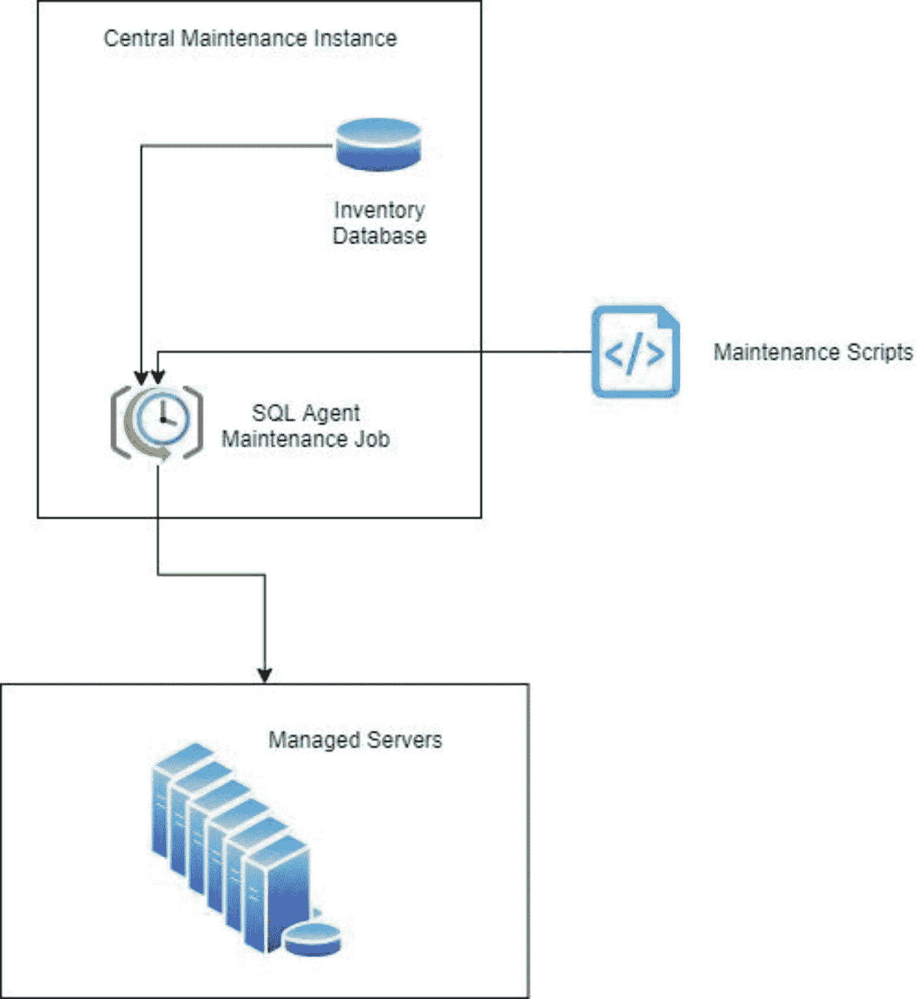

说明维护流程的流程图。“中央维护实例”包含一个“清单数据库”和一个“SQL 代理维护作业”。箭头连接数据库和维护作业，指示数据流。一个单独的箭头将“维护脚本”链接到维护作业。流程输出到“托管服务器”，描绘为一堆服务器图标。关键元素包括清单管理、SQL 维护和服务器管理。

### 图 10-1：目标维护例程架构

> 提示
>
> 在不同服务器上以不同时间运行作业的能力绝对关键。以备份为例，许多服务器需要在特定时间进行备份，以避免其维护或 `ETL` 窗口期。但即使不考虑机会窗口，在诸如私有云之类的环境中，所有 `SQL` 实例都运行在共享资源上，由于底层硬件存在资源争用的风险，在同一时间运行所有备份作业也是不可取的。

我们现在需要考虑为支持该解决方案而需要添加到清单数据库中的表结构。从高级别来看，这如图 10-2 所示。其中，`MaintenanceWindows` 表将依赖于来自 `Server` 和 `Instance` 表的 `Server ID`，并定义企业中每台服务器可以运行维护例程的时间窗口。

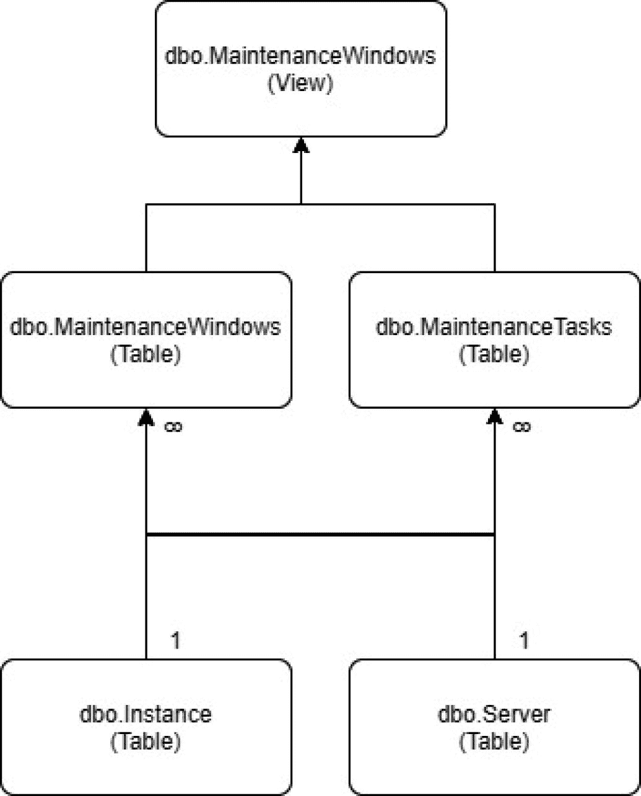

描述数据库架构的流程图。顶部是“dbo.MaintenanceWindows (视图)”，连接到两个表：“dbo.MaintenanceWindows (表)”和“dbo.MaintenanceTasks (表)”。这两个表分别链接到“dbo.Instance (表)”和“dbo.Server (表)”，基数指示符显示多对一关系。

### 图 10-2：表和视图的高级设计

`MaintenanceTasks` 表将定义应对每个实例运行哪些维护任务，这使我们能够禁用特定服务器上的特定维护作业，并提供每次维护任务执行之间的间隔。同样，该表将依赖于 `Server` 和 `Instance` 表。

最后，`MaintenanceSchedule` 视图基于上述两个表构建，并计算应对每台服务器运行维护任务的下一次时间。该视图将是调用我们维护脚本的 `SQL Server Agent` 作业的入口点。

那么现在，让我们看看我们应该在每个对象中存储哪些配置数据。`MaintenanceWindows` 表的建议列布局详见表 10-1。

> 提示
>
> 本章中的示例列布局旨在为创建调度引擎提供一个基础模板；但是，你应该考虑根据你组织的独特需求对其进行调整。

我们希望使我们的调度选项尽可能灵活且易于使用。因此，我们将希望适应 `DBA` 使用固定的 `Daily` 或 `Weekly` 计划，或以分钟为单位表达计划。我们的 `MaintenanceTasks` 表，其粒度为 `Server`、`Instance` 和 `Task`，将允许这样做，方法是包含一个计划列，我们可以在其中添加诸如 `Daily` 和 `Weekly` 之类的值。然后，它将有一个计算列，将该值转换为分钟数。这将使我们的代码能够轻松确定应对给定服务器和实例运行任务的频率。

### 表 10-1：`MaintenanceWindows` 列

| 列 | 描述 |
| --- | --- |
| `MaintenanceWindowID` | 表的代理主键 |
| `ServerID` | 来自 `Server` 表的外键。应在 `ServerID` 和 `InstanceID` 列上添加唯一约束 |
| `InstanceID` | 来自 `Instance` 表的外键。应在 `ServerID` 和 `InstanceID` 列上添加唯一约束 |
| `DayOfWeekNumber` | 一个从 1 到 7 的数字，用于指定星期几。允许实例在不同日期有不同的计划 |
| `StartTime` | 维护窗口的开始时间 |
| `EndTime` | 维护窗口的结束时间 |

我们希望使我们的调度选项尽可能灵活且易于使用。因此，我们将希望适应 `DBA` 使用固定的 `Daily` 或 `Weekly` 计划，或以分钟为单位表达计划。我们的 `MaintenanceTasks` 表，其粒度为 `Server`、`Instance` 和 `Task`，将允许这样做，方法是包含一个

`MaintenanceTasks` 表的建议列布局定义在表 10-2 中。

### 表 10-2：`MaintenanceTasks` 列

| 列 | 描述 |
| --- | --- |
| `MaintenanceTaskID` | 表的代理主键 |
| `ServerID` | 来自 `Server` 表的外键。应在 `ServerID` 和 `InstanceID` 列上添加唯一约束 |
| `InstanceID` | 来自 `Instance` 表的外键。应在 `ServerID` 和 `InstanceID` 列上添加唯一约束 |
| `Task` | 维护任务的名称 |
| `LastExecDate` | 任务上次执行的日期和时间 |
| `Schedule` | 计划。在我们的示例中，可以是 `Daily`、`Weekly`，或者是任务执行之间的分钟数 |
| `ScheduleMinutes` | 以分钟表示计划的整数值 |
| `InProgress` | 指定任务是否正在进行的标志 |
| `LastExecStatus` | 任务上次在实例上执行时的状态 |
| `TaskDisabled` | 指定任务是否对特定实例禁用的标志 |

`MaintenanceSchedules` 视图将是代码的入口点，因此它应包含所有有助于最小化维护任务内潜在代码重复的列。该视图的建议列布局定义在表 10-3 中。

### 表 10-3：`MaintenanceSchedules` 列


| 列 | 描述 |
| --- | --- |
| ServerInstance | 每个目标实例的“服务器\实例”组合名称 |
| Task | 维护任务的名称 |
| LastExecDate | 任务在实例上最后一次执行的日期和时间 |
| NextExecDate | 任务在实例上下一次预定执行的日期和时间 |
| InProgress | 一个标志，用于指定任务是否当前正在执行中 |
| TaskDisabled | 一个标志，用于指定任务是否被禁用 |

我们的 SQL Server Agent 作业应设置为每分钟运行一次。该作业将为每个常见的维护任务设置一个作业步骤，每个步骤都会调用一个 PowerShell 脚本。PowerShell 脚本将使用 `MaintenanceSchedule` 视图中显示的数据来确定该任务应在哪些实例上运行，然后依次针对每个实例执行任务。

因此，由于我们将为每个维护任务设置一个作业步骤，我们需要定义希望在我们的环境中运行的维护任务列表。在我们的示例中，我们将运行以下维护任务：

*   所有数据库的完整备份
*   删除旧的备份文件
*   更新统计信息

> 提示
>
> 当然，您希望创建的维护任务列表将取决于您自身组织和企业的需求。例如，您几乎肯定需要一个动态索引重建功能，实现此功能的脚本可以在第 7 章中找到。可能性是无穷无尽的，我鼓励您广泛思考。例如，您可以考虑为完整恢复模式的数据库包含事务日志备份、列存储索引维护，甚至快照维护。

## 实现集中化维护

既然我们已经对集中化维护解决方案的设计进行了一些思考，我们现在将看看如何实现它。在接下来的章节中，我们将讨论如何创建表和视图、如何创建 PowerShell 脚本，以及最后如何创建 SQL Server Agent 作业。

### 创建表和视图

我们将创建的第一张表是 `MaintenanceWindows` 表。这个表相对直接，因为它不包含任何计算列。我们将为该表定义主键，并针对服务器和实例表定义两个外键，同时在这两列以及 `DayOfWeekNumber` 上设置唯一约束，以避免意外地为同一天添加两次相同的“服务器\实例”。代码清单 10-1 演示了如何创建此表。

```powershell
Set-DbatoolsInsecureConnection -SessionOnly
$params = @{
    SqlInstance = "localhost"
    Database    = "Inventory"
    Query       = "
        CREATE TABLE dbo.MaintenanceWindows (
            MaintenanceWindowID  INT    NOT NULL    PRIMARY KEY CLUSTERED,
            ServerID             INT    NOT NULL    FOREIGN KEY REFERENCES Server(ServerID),
            InstanceID           INT    NOT NULL    FOREIGN KEY REFERENCES Instance(InstanceID),
            DayOfWeekNumber      INT    NOT NULL,
            StartTime            TIME   NOT NULL,
            EndTime              TIME   NOT NULL
        ) ;
        CREATE UNIQUE NONCLUSTERED INDEX ServerID_InstanceID_Day
            ON dbo.MaintenanceWindows(ServerID, InstanceID, DayOfWeekNumber) ;
    "
}
Invoke-DbaQuery @params
```
**代码清单 10-1**
创建 MaintenanceWindows 表

接下来，我们将使用代码清单 10-2 中的脚本来创建 `MaintenanceTasks` 表。该表将再次包含一个唯一约束，在 `ServerID`、`InstanceID` 和 `Task` 列上创建。另外，请注意 `ScheduleMinutes` 列的定义。这是一个计算列，它将所有计划类型的粒度更改为以分钟为单位。

```powershell
$params = @{
    SqlInstance = "localhost"
    Database    = "Inventory"
    Query       = "
        CREATE TABLE dbo.MaintenanceTasks (
            MaintenanceTaskID INT            NOT NULL    PRIMARY KEY CLUSTERED,
            ServerID          INT            NOT NULL    FOREIGN KEY REFERENCES Server(ServerID),
            InstanceID        INT            NOT NULL    FOREIGN KEY REFERENCES Instance(InstanceID),
            Task              NVARCHAR(32)   NOT NULL,
            LastExecDate      DATETIME       NULL,
            Schedule          NVARCHAR(8)    NOT NULL,
            ScheduleMinutes   AS (CASE WHEN [Schedule]='Daily' THEN (1440) WHEN [Schedule]='Weekly' THEN (10080) ELSE [Schedule] END) PERSISTED,
            InProgress        BIT            NOT NULL,
            LastExecStatus    NCHAR(7)       NOT NULL,
            TaskDisabled      BIT            NOT NULL
        ) ;
        CREATE UNIQUE NONCLUSTERED INDEX ServerID_InstanceID
            ON dbo.MaintenanceTasks(ServerID, InstanceID, Task) ;
    "
}
Invoke-DbaQuery @params
```
**代码清单 10-2**
创建 MaintenanceTasks 表

最后，我们将创建 `MaintenanceSchedules` 视图（代码清单 10-3），它将基于基础表，并计算每个维护任务应在每个“服务器\实例”上运行的时间。请特别注意计算 `NextExecDate` 列以实现此功能。同时，请特别注意 `StartTime` 和 `EndTime` 列。这些列源自 `MaintenanceWindows` 表，与该表的连接基于查询执行当天的星期数，这是通过将 `DayOfWeekNumber` 列与 `WEEKDAY` 日期部分进行比较来实现的。

```powershell
$params = @{
    SqlInstance = "localhost"
    Database    = "Inventory"
    Query       = "
        CREATE VIEW dbo.MaintenanceSchedule
        AS
        SELECT
            S.ServerName + '\' + I.InstanceName AS ServerInstance
            , MT.Task
            , MT.LastExecDate
            , CASE
                WHEN LastExecDate IS NULL
                THEN GETDATE()
                ELSE DATEADD(MINUTE,ScheduleMinutes,LastExecDate)
            END AS NextExecDate
            , MT.InProgress
            , MT.TaskDisabled
            , MW.StartTime
            , MW.EndTime
            , S.ServerID
            , I.InstanceID
        FROM dbo.MaintenanceTasks MT
        INNER JOIN dbo.Server S
            ON S.ServerID = MT.ServerID
        INNER JOIN dbo.Instance I
            ON I.InstanceID = MT.InstanceID
        INNER JOIN dbo.MaintenanceWindows MW
            ON MW.ServerID = S.ServerID
            AND MW.InstanceID = I.InstanceID
            AND (SELECT DATEPART(dw,GETDATE())) = MW.DayOfWeekNumber
    "
}
Invoke-DbaQuery @params
```
**代码清单 10-3**
创建 MaintenanceSchedules 视图


### 创建 PowerShell 脚本

在开始为每个具体任务编写脚本实现之前，我们需要向数据库添加一些元数据，以便测试我们的框架和脚本。清单 10-4 中的脚本向表中插入了一些样本数据用于此目的。如果你正在按照示例操作，那么你应该更改服务器和实例详细信息以匹配你自己的基础设施。

```powershell
$params = @{
SqlInstance = "localhost"
Database = "Inventory"
Query       = "
--Insert Server/Instance Details
INSERT INTO dbo.Server (
ServerName
,ClusterFlag
,WindowsVersion
,SQLVersion
,ServerCores
,ServerRAM
,VirtualFlag
,ApplicationOwner
,ApplicationOwnerEMail)
VALUES (
'SQL2022-STANDAL'
,0
,'Windows Server 2022 Standard'
,'SQL Server 2022 Developer Edition'
,4
,16
,1
,'Peter Carter'
,'pete@ExpertScripting.com'
)
GO
INSERT INTO dbo.ServiceAccount
(ServiceAccountName)
VALUES
('SQLServiceAccount')
GO
INSERT INTO dbo.Instance (
InstanceName
,ServerID
,Port
,IPAddress
,SQLServiceAccountID
,AuthenticationMode
,InstanceClassification
,InstanceCores
,InstanceRAM
,SQLServerAgentAccountID
)
VALUES (
'Expert'
,1
,1434
,'127.0.0.1'
,1
,0
,1
,2
,6
,1
),
(
'Scripting'
,1
,1435
,'127.0.0.1'
,1
,0
,1
,2
,6
,1
)
GO
--Insert Maintenance Details
INSERT INTO dbo.MaintenanceWindows (
MaintenanceWindowID
,ServerID
,InstanceID
,DayOfWeekNumber
,StartTime
,EndTime
)
VALUES (

,1
,1
,1
,'00:01'
,'05:00'
),

,1
,1
,2
,'00:01'
,'05:00'
),

,1
,1
,7
,'06:01'
,'18:00'
),

,1
,2
,6
,'00:01'
,'05:00'
),

,1
,2
,7
,'06:01'
,'18:00'
)
GO
INSERT INTO [dbo].[MaintenanceTasks] (
[MaintenanceTaskID]
,[ServerID]
,[InstanceID]
,[Task]
,[LastExecDate]
,[Schedule]
,[InProgress]
,[LastExecStatus]
,[TaskDisabled]
)
VALUES (

,1
,1
,'FullBackup'
,'1900-01-01'
,'Daily'
,0
,'Not Run'
,0
),

,1
,1
,'RemoveOldBackups'
,'1900-01-01'
,'Daily'
,0
,'Not Run'
,0
),

,1
,1
,'UpdateStats'
,'1900-01-01'
,'Daily'
,0
,'Not Run'
,0
),

,1
,2
,'FullBackup'
,'1900-01-01'
,'Daily'
,0
,'Not Run'
,0
),

,1
,2
,'RemoveOldBackups'
,'1900-01-01'
,'Daily'
,0
,'Not Run'
,1
),

,1
,2
,'UpdateStats'
,'1900-01-01'
,'Daily'
,0
,'Not Run'
,1
)
"
}
Invoke-DbaQuery @params
```
*清单 10-4 插入样本数据*

那么，让我们开始创建一个脚本，该脚本将对我们的用户数据库执行完整备份。该脚本首先生成一个维护任务列表，这些任务需要在每个服务器/实例上运行。它通过查询`MaintenanceSchedule`视图并过滤掉任何正在进行中的维护任务以及已禁用的任务来创建此列表。它还包括一个筛选器，以确保当前日期和时间大于或等于任务下次应运行的时间。下一个筛选器确保当前时间在作业可执行的开始时间和结束时间范围内。这是通过将当前日期/时间转换为`time`类型，并对照`StartTime`和`EndTime`列进行评估来实现的。最后一个筛选器移除了所有不等于`FullBackup`的任务。

此查询的结果被传递到一个`foreach`循环中，该循环依次连接到每个 SQL Server 实例，并在该实例上生成用户数据库列表。然后更新`MaintenanceTasks`表，指示给定服务器\实例的任务正在进行中。

数据库列表然后被传递到一个子`foreach`循环，在该循环中，每个数据库依次被备份。备份语句通过使用给定数据库的名称生成。

一旦实例上的所有用户数据库都备份完毕，子`foreach`循环退出，并再次更新`MaintenanceTasks`表。这次是为了反映给定服务器的任务不再进行中。`LastExecTime`和`LastExecStatus`列也会被更新，以避免任务在需要之前再次运行。然后循环对每个需要进行完整备份的服务器重复，如清单 10-5 所示。

```powershell
$params = @{
SqlInstance = "localhost"
Database    = "Inventory"
Query       = "
SELECT
ServerInstance
,Task
,LastExecDate
,NextExecDate
,InProgress
,TaskDisabled
,StartTime
,EndTime
,ServerID
,InstanceID
FROM dbo.MaintenanceSchedule ms
WHERE InProgress = 0
AND TaskDisabled = 0
AND GETDATE() >= NextExecDate
AND CAST(GETDATE() AS TIME) BETWEEN StartTime AND EndTime
AND Task = 'FullBackup'
"
}
$ServerTasks = Invoke-DbaQuery @params
foreach ($Server in $ServerTasks) {
$params = @{
SqlInstance = $Server.ServerInstance
Database    = "Master"
Query       = "
SELECT name FROM sys.databases WHERE database_id > 4
"
}
$databases = Invoke-DbaQuery @params
$params = @{
SqlInstance = "localhost"
Database    = "Inventory"
Query       = "
UPDATE dbo.MaintenanceTasks
SET InProgress = 1
WHERE ServerID = '" + $Server.ServerID + "' AND InstanceID = '" + $Server.InstanceID + "' AND Task = 'FullBackup'
"
}
Invoke-DbaQuery @params
foreach ($database in $databases) {
$params = @{
SqlInstance = $Server.ServerInstance
Database    = "Master"
Query       = "
BACKUP DATABASE " + $database.name + " TO DISK = 'C:\Backups\" + $database.name + ".bak'
"
}
Invoke-DbaQuery @params
}
$params = @{
SqlInstance = "localhost"
Database    = "Inventory"
Query       = "
UPDATE dbo.MaintenanceTasks
SET InProgress = 0, LastExecDate = GETDATE(), LastExecStatus = 'Success'
WHERE ServerID = '" + $Server.ServerID + "' AND InstanceID = '" + $Server.InstanceID + "' AND Task = 'FullBackup';
"
}
Invoke-DbaQuery @params
}
```
*清单 10-5 完整备份脚本*

> **提示**
>
> 如果你正在跟随操作，请将此脚本保存为`c:\scripts\fullbackup.ps1`。稍后，我们将从 SQL Agent 作业调用此脚本。

### 删除旧备份脚本

我们需要的下一个脚本如清单 10-6 所示。该脚本将删除旧的备份文件。你会注意到创建了一个`$limit`变量，它被填充为当前日期/时间减去三天。`$path`变量构建到共享的路径，使用`split`函数删除实例名称。然后使用`Get-ChildItem` cmdlet 来构建要删除的文件列表。然后，此列表通过管道传递给`Remove-Item` cmdlet。

在这个例子中，我们将假设应删除超过三天的备份。这是基于有一个企业备份工具将`.bak`文件卸载到磁带的假设。如果没有，你可能希望保留备份更长时间。

该脚本使用了与我们之前创建的`FullBackup`脚本相同的逻辑。唯一的区别是正在调度的任务和调用的脚本是`RemoveOldBackups`。

> **提示**
>
> 该脚本假设存储备份文件的卷是共享的。如果不是这种情况，并且假设你配置了 PowerShell Remoting，你可以使用`Invoke-Command` cmdlet 在远程服务器上调用该脚本。


## 维护脚本与作业创建

```powershell
$params = @{
SqlInstance = "localhost"
Database    = "Inventory"
Query       = "
SELECT
ServerInstance
,Task
,LastExecDate
,NextExecDate
,InProgress
,TaskDisabled
,StartTime
,EndTime
,ServerID
,InstanceID
FROM dbo.MaintenanceSchedule ms
WHERE InProgress = 0
AND TaskDisabled = 0
AND GETDATE() >= NextExecDate
AND CAST(GETDATE() AS TIME) BETWEEN StartTime AND EndTime
AND Task = 'RemoveOldBackups'
"
}
$ServerTasks = Invoke-DbaQuery @params
foreach ($Server in $ServerTasks) {
$params = @{
SqlInstance = "localhost"
Database    = "Inventory"
Query       = "
UPDATE dbo.MaintenanceTasks
SET InProgress = 1
WHERE ServerID = '" + $Server.ServerID + "' AND InstanceID = '" + $Server.InstanceID + "' AND Task = 'RemoveOldBackups'
"
}
Invoke-DbaQuery @params
foreach ($database in $databases) {
$limit = (Get-Date).AddDays(-3)
$path = "\\" + $Server.ServerInstance.split('\')[0] + "\Backups\"
Get-ChildItem -Path $path | Where-Object { $_.CreationTime -lt $limit } | Remove-Item
}
$params = @{
SqlInstance = "localhost"
Database    = "Inventory"
Query       = "
UPDATE dbo.MaintenanceTasks
SET InProgress = 0, LastExecDate = GETDATE(), LastExecStatus = 'Success'
WHERE ServerID = '" + $Server.ServerID + "' AND InstanceID = '" + $Server.InstanceID + "' AND Task = 'RemoveOldBackups';
"
}
Invoke-DbaQuery @params
}
```
**清单 10-6 删除旧备份脚本**

此示例中我们需要的最后一个脚本如清单 10-7 所示。该脚本用于更新统计信息。它遵循与前两个维护任务相同的模式。它遍历每个实例，然后遍历该实例中的每个数据库。脚本本身只是简单地执行 `sp_updatestats` 存储过程。

```powershell
$params = @{
SqlInstance = "localhost"
Database    = "Inventory"
Query       = "
SELECT
ServerInstance
,Task
,LastExecDate
,NextExecDate
,InProgress
,TaskDisabled
,StartTime
,EndTime
,ServerID
,InstanceID
FROM dbo.MaintenanceSchedule ms
WHERE InProgress = 0
AND TaskDisabled = 0
AND GETDATE() >= NextExecDate
AND CAST(GETDATE() AS TIME) BETWEEN StartTime AND EndTime
AND Task = 'UpdateStatistics'
"
}
$ServerTasks = Invoke-DbaQuery @params
foreach ($Server in $ServerTasks) {
$params = @{
SqlInstance = $Server.ServerInstance
Database    = "Master"
Query       = "
SELECT name FROM sys.databases
"
}
$databases = Invoke-DbaQuery @params
$params = @{
SqlInstance = "localhost"
Database    = "Inventory"
Query       = "
UPDATE dbo.MaintenanceTasks
SET InProgress = 1
WHERE ServerID = '" + $Server.ServerID + "' AND InstanceID = '" + $Server.InstanceID + "' AND Task = 'UpdateStats'
"
}
Invoke-DbaQuery @params
foreach ($database in $databases) {
$params = @{
SqlInstance = $Server.ServerInstance
Database    = $database.name
Query       = "
EXEC sp_UpdateStatistics
"
}
Invoke-DbaQuery @params
}
$params = @{
SqlInstance = "localhost"
Database    = "Inventory"
Query       = "
UPDATE dbo.MaintenanceTasks
SET InProgress = 0, LastExecDate = GETDATE(), LastExecStatus = 'Success'
WHERE ServerID = '" + $Server.ServerID + "' AND InstanceID = '" + $Server.InstanceID + "' AND Task = 'UpdateStatistics';
"
}
Invoke-DbaQuery @params
}
```
**清单 10-7 更新统计信息**

每个脚本都应保存到 SQL Server 代理服务账户（或代理账户）可以访问的文件夹中。在此示例中，我将它们保存到了中央管理服务器上的 `c:\scripts` 文件夹中。我分别将文件命名为 `FullBackups.ps1`、`RemoveOldBackups.ps1` 和 `UpdateStatistics.ps1`。

> **提示**
>
> 如果适合你的环境，可以进行各种增强。例如，你可以考虑将 `MaintenanceTasks` 表的粒度细化到数据库级别，以便在同一实例上为不同数据库安排不同的备份时间。你还可以向 `MaintenanceSchedule` 视图中添加 `LastExecStatus`，这样如果任务失败，你就可以添加重试逻辑。

### 创建 SQL Server 代理作业

现在我们有了希望针对 SQL Server 实例运行的每个脚本，我们可以在中央管理服务器上创建一个 SQL Server 代理作业来运行它们。由于脚本本身决定了它们需要运行在哪些实例上，这意味着可以将作业安排为每分钟运行一次。如果没有需要脚本执行的任务，它将直接退出，并允许作业转到下一个作业步骤。

清单 10-8 中的脚本创建了 SQL Server 代理作业、计划以及所需的步骤。该作业被配置为无论前一步骤成功或失败都转到下一步。这避免了一个脚本失败导致其他任务停止运行的问题。

> **注意**
>
> 在查询中使用了 `"` 的地方，我们使用 `""` 对其进行了转义。

```powershell
$params = @{
SqlInstance  = "localhost"
Query        = "
USE msdb
GO
DECLARE @jobId BINARY(16)
EXEC  msdb.dbo.sp_add_job @job_name='SQLMaintenance',
@enabled=1,
@notify_level_eventlog=0,
@notify_level_email=2,
@notify_level_page=2,
@delete_level=0,
@owner_login_name='SQL2022-STANDAL\Administrator', @job_id = @jobId OUTPUT
SELECT @jobId
GO
EXEC msdb.dbo.sp_add_jobserver @job_name='SQLMaintenance', @server_name = 'SQL2022-STANDALONE'
GO
USE msdb
GO
EXEC msdb.dbo.sp_add_jobstep @job_name='SQLMaintenance', @step_name='FullBackups',
@step_id=1,
@cmdexec_success_code=0,
@on_success_action=3,
@on_fail_action=3,
@retry_attempts=0,
@retry_interval=0,
@os_run_priority=0, @subsystem='PowerShell',
@command='powershell ""C:\scripts\FullBackups.ps1""'
GO
USE msdb
GO
EXEC msdb.dbo.sp_add_jobstep @job_name='SQLMaintenance', @step_name='RemoveOldBackups',
@step_id=2,
@cmdexec_success_code=0,
@on_success_action=3,
@on_fail_action=3,
@retry_attempts=0,
@retry_interval=0,
@os_run_priority=0, @subsystem='PowerShell',
@command='powershell ""C:\scripts\RemoveOldBackups.ps1""'
GO
USE msdb
GO
EXEC msdb.dbo.sp_add_jobstep @job_name='SQLMaintenance', @step_name='UpdateStatistics',
@step_id=3,
@cmdexec_success_code=0,
@on_success_action=1,
@on_fail_action=2,
@retry_attempts=0,
@retry_interval=0,
@os_run_priority=0, @subsystem='PowerShell',
@command='powershell ""C:\scripts\UpdateStatistics.ps1""'
GO
USE msdb
GO
EXEC msdb.dbo.sp_update_job @job_name='SQLMaintenance',
@enabled=1,
@start_step_id=1,
@notify_level_eventlog=0,
@notify_level_email=2,
@notify_level_page=2,
@delete_level=0,
@owner_login_name='SQL2022-STANDAL\Administrator'
GO
USE msdb
GO
DECLARE @schedule_id int
EXEC msdb.dbo.sp_add_jobschedule @job_name='SQLMaintenance', @name='MaitenanceSchedule',
@enabled=1,
@freq_type=4,
@freq_interval=1,
@freq_subday_type=4,
@freq_subday_interval=1,
@freq_relative_interval=0,
@freq_recurrence_factor=1,
@active_start_date=20241020,
@active_end_date=99991231,
@active_start_time=0,
@active_end_time=235959
GO
"
}
Invoke-DbaQuery @params
```
**清单 10-8 创建 SQL Server 代理作业**

## 总结

创建一个集中化的维护引擎，为在 SQL Server 全域中如何以及何时执行维护任务提供了终极灵活性。维护引擎位于集中管理的服务器上，允许跨企业执行维护任务，但可从单一位置进行控制。

引擎本身由表和视图组成，这些表和视图存储有关哪些维护例程应在何时、在哪台服务器上执行的信息。随后是 PowerShell 脚本中的简单逻辑，用于确定任务应在何处运行。然后，这些任务由每分钟运行一次的 SQL Server 代理作业调用。

这种方法具有无尽的可能性，我鼓励你以此方法为基础，开发满足你组织需求的自定义维护计划程序。


# 11. 自动化例行维护与故障修复场景

DBA 团队响应业务需求的速度越快，为组织带来的价值就越大。在第 10 章中，我们重点讨论了维护例程的集中化，但 DBA 角色中还有许多更琐碎的方面可以实现自动化。

本章中，我们将探讨其中的两个方面。第一个方面是自动化临时维护，这将使我们能够更快地响应业务需求。本章将特别聚焦于环境刷新，但这些技术可应用于多种场景。

我们将讨论的第二个方面是故障修复自动化。这可以通过自动解决问题（无需等待 DBA 手动处理）来极大改善对业务的服务质量。本章将重点解决日志空间问题，但同样，这些技术几乎可应用于任何场景。

迄今为止，本书主要聚焦于`PowerShell`。然而，在本章中，我们将跳出`PowerShell`，展示使用`SQL Server`实现自动化的其他方法。具体而言，我们将探讨`SSIS`和`SQL Agent 警报`的使用。本章还演示了通过`GUI`配置`SQL Agent 作业`。了解这一点很有用，因为在本书中，你已经学习了如何通过代码创建`SQL Agent 作业`，但有时创建`SQL Agent 作业`最快的方法是使用`GUI`，然后将其编写为脚本，以便保存到源代码管理中。

## 自动化临时例行维护

你在第 10 章学到的构建集中化维护的技术，对于按计划运行的例行维护非常有效。但对于临时任务呢？这些任务无法定期安排运行，但这并不妨碍我们实施自动化来减轻请求的负担，从而使我们能够更快地响应，并解放我们从事更高价值的活动。

让我们以环境刷新为例。如果你有内部应用开发团队，他们通常会定期请求使用最新的生产数据快照来刷新其开发环境。在这种情况下，只要不存在数据隐私问题，我们可能会通过备份数据库并将其恢复到开发环境，或者分离数据库、复制数据文件并在两个位置重新附加来响应。

然而，在其他环境中，尤其是在安全性要求更高的场景下，该过程可能要复杂得多。

例如，我曾与一家受监管机构严格控制的`FTSE 100`公司合作，当开发人员需要刷新环境时，绝对不能让他们访问实时数据。因此，刷新环境的流程包括以下步骤：

1.  备份生产数据库。
2.  将开发服务器置于`SINGLE USER`模式，使开发人员无法访问。
3.  将数据库恢复到开发服务器。
4.  删除没有登录凭据的数据库用户。
5.  混淆数据。
6.  将实例恢复为`MULTI USER`模式。

在本节中，我们将为`AdventureWorks22`数据库重现此过程，将其从名为`ESPROD1`的实例复制到名为`ESPROD2`的实例。该过程如图 11-1 的工作流所示。

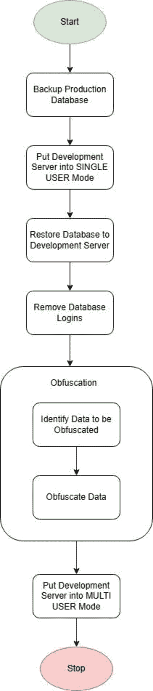

流程图说明了数据库混淆过程。它从绿色的“开始”椭圆开始，后续步骤包括：“备份生产数据库”、“将开发服务器置于 SINGLE USER 模式”、“将数据库恢复到开发服务器”和“删除数据库登录”。流程继续进行“混淆”，包括“识别待混淆的数据”和“混淆数据”。最后，以“将开发服务器置于 MULTI USER 模式”和粉色的“停止”椭圆结束。箭头依次连接每个步骤。

**图 11-1**

环境刷新工作流

我们将对此过程进行参数化，以便可以轻松修改用于任何数据库。同样，我们可以选择使用`PowerShell`或`SSIS`来编排此工作流。然而，对于此类工作流，我建议将`SSIS`视为最合适的工具。


### 创建 SSIS 包

我们现在将使用 SQL Server Data Tools (SSDT) 来创建一个 SQL Server Integration Services 项目，我们将其命名为 `EnvironmentRefresh`。我们将使用相同的名称来命名在项目中自动创建的包。

#### 创建项目参数

我们的第一个任务将是创建三个项目参数，这些参数将用于接受 `生产服务器\实例` 的名称、`开发服务器\实例` 的名称以及要刷新的数据库名称。如图 11-2 所示。

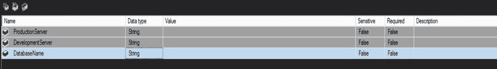

#### 配置连接管理器

下一步将是创建两个 `OLEDB 连接管理器`，方法是在 `连接管理器` 窗口中右键单击并使用 `新建 OLEDB 连接` 对话框。我们应该将一个 `连接管理器` 命名为 `ProductionServer`，另一个命名为 `DevelopmentServer`。

一旦 `连接管理器` 创建完成，我们就可以使用 `表达式生成器` 来动态配置每个 `连接管理器` 的 `ServerName` 属性，依据是我们创建的 `ProductionServer` 和 `DevelopmentServer` 项目参数。图 11-3 展示了使用 `表达式生成器` 配置 `ProductionServer` 连接管理器的 `ServerName` 属性。

![图 11-3：表达式生成器。表达式生成器界面截图，显示一个包含变量和参数以及函数部分的窗口。左侧面板列出系统变量，如 `$Project::DatabaseName`、`$Project::DevelopmentServer` 和 `$Project::ProductionServer`。右侧面板包括数学函数、字符串函数和日期/时间函数等类别。表达式字段包含 `@[$Project::ProductionServer]`。底部有“计算表达式”、“确定”和“取消”按钮。](images/395785_2_En_11_Chapter/395785_2_En_11_Fig3_HTML.jpg)

#### 创建包变量

我们现在必须创建三个包变量，它们将保存用于备份数据库、恢复数据库和混淆数据库的 SQL 语句。我们将在变量中输入适当的表达式来构建 SQL 语句，如图 11-4 所示。将变量的 `EvaluateAsExpression` 属性设置为 `true` 非常重要（尽管在较新版本中，如果粘贴表达式，这会自动发生）。当变量在作用域内时，可以在 `属性` 窗口中配置此设置。

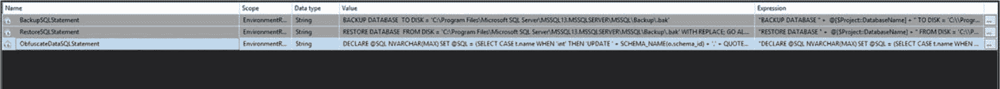

存储在 `BackupSQLStatement` 变量中的表达式详见清单 11-1。

```
"BACKUP DATABASE " +  @[$Project::DatabaseName] + " TO DISK = 'C:\\Backups\\" + @[$Project::DatabaseName] + ".bak'"
```
*清单 11-1：BackupSQLStatement 表达式*

存储在 `RestoreSQLStatement` 变量中的表达式可以在清单 11-2 中找到。

```
"RESTORE DATABASE " +  @[$Project::DatabaseName] + " FROM DISK = '\\\\ESPROD2\\backups\\" + @[$Project::DatabaseName] + ".bak' WITH REPLACE; ALTER DATABASE " + @[$Project::DatabaseName] + " SET SINGLE_USER WITH ROLLBACK IMMEDIATE;"
```
*清单 11-2：RestoreSQLStatement 表达式*

存储在 `ObfuscateDataStatement` 变量中的表达式可以在清单 11-3 中找到。

```
"DECLARE @SQL NVARCHAR(MAX) ;
SET @SQL = (SELECT CASE t.name WHEN 'int' THEN 'UPDATE ' + SCHEMA_NAME(o.schema_id) + '.' + QUOTENAME(OBJECT_NAME(nkc.object_id)) + ' SET ' +  QUOTENAME(c.name) + ' = CHECKSUM(' + c.name + '); '
WHEN 'money' THEN 'UPDATE ' + QUOTENAME(SCHEMA_NAME(o.schema_id)) + '.' + QUOTENAME(OBJECT_NAME(nkc.object_id)) + ' SET ' +  QUOTENAME(c.name) + ' = CHECKSUM(' + c.name + '); '
WHEN 'nvarchar' THEN 'UPDATE ' + QUOTENAME(SCHEMA_NAME(o.schema_id)) + '.' + QUOTENAME(OBJECT_NAME(nkc.object_id)) + ' SET ' +  QUOTENAME(c.name) + ' = LEFT(RTRIM(CONVERT(nvarchar(255), NEWID())), ' + CAST(c.max_length / 2 AS NVARCHAR(10)) + '); '
WHEN 'varchar' THEN 'UPDATE ' + QUOTENAME(SCHEMA_NAME(o.schema_id)) + '.' + QUOTENAME(OBJECT_NAME(nkc.object_id)) + ' SET ' +  QUOTENAME(c.name) + ' = LEFT(RTRIM(CONVERT(nvarchar(255), NEWID())), ' + CAST(c.max_length AS NVARCHAR(10)) + '); '
WHEN 'text' THEN 'UPDATE ' + QUOTENAME(SCHEMA_NAME(o.schema_id)) + '.' + QUOTENAME(OBJECT_NAME(nkc.object_id)) + ' SET ' +  QUOTENAME(c.name) + ' = LEFT(RTRIM(CONVERT(nvarchar(255), NEWID())), ' + CAST(c.max_length AS NVARCHAR(10)) + '); '
WHEN 'ntext' THEN 'UPDATE ' + QUOTENAME(SCHEMA_NAME(o.schema_id)) + '.' + QUOTENAME(OBJECT_NAME(nkc.object_id)) + ' SET ' +  QUOTENAME(c.name) + ' = LEFT(RTRIM(CONVERT(nvarchar(255), NEWID())), ' + CAST(c.max_length AS NVARCHAR(10)) + '); '  END
FROM
(
SELECT object_id, column_id
FROM sys.columns
EXCEPT --排除外键列
SELECT parent_object_id, parent_column_id
FROM sys.foreign_key_columns
EXCEPT --排除检查约束
SELECT parent_object_id, parent_column_id
FROM sys.check_constraints
) nkc
INNER JOIN sys.columns c
ON nkc.object_id = c.object_id
AND nkc.column_id = c.column_id
INNER JOIN sys.objects o
ON nkc.object_id = o.object_id
INNER JOIN sys.types t
ON c.user_type_id = t.user_type_id
AND c.system_type_id = t.system_type_id
INNER JOIN sys.tables tab
ON o.object_id = tab.object_id
WHERE is_computed = 0  --排除计算列
AND c.is_filestream = 0 --排除文件流列
AND c.is_identity = 0 --排除标识列
AND c.is_xml_document = 0 --排除 XML 列
AND c.default_object_id = 0 --排除具有默认约束的列
AND c.rule_object_id = 0 --排除与规则关联的列
AND c.encryption_type IS NULL --排除具有加密的列
AND o.type = 'U' --筛选用户表
AND t.is_user_defined = 0 --排除具有自定义数据类型的列
AND tab.temporal_type = 0 --排除时态历史表
FOR XML PATH('')
) ;
EXEC(@SQL) ;
ALTER DATABASE " +  @[$Project::DatabaseName] + " SET MULTI_USER ;"
```
*清单 11-3：ObfuscateDataStatement 表达式*

#### 创建备份执行 SQL 任务

我们现在将创建一个 `执行 SQL 任务`，该任务将用于备份生产数据库。如图 11-5 所示，我们将使用 `执行 SQL 任务编辑器` 对话框来配置任务以针对生产服务器运行。我们将 SQL 源类型配置为变量，然后将任务指向我们的 `BackupSQLStatement` 变量。

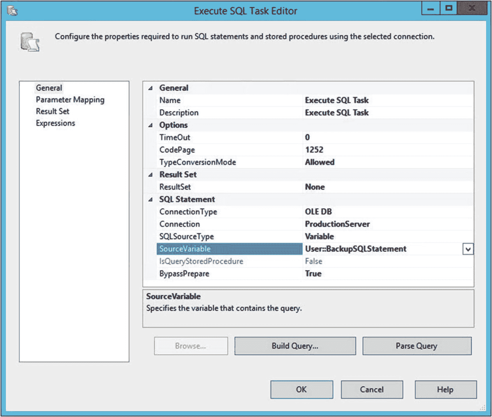


我们现在将添加第二个 `Execute SQL Task`（执行 SQL 任务），并配置它将数据库还原到 `Development Server`（开发服务器）并将其置于 `Single User`（单用户）模式。该任务的 `Execute SQL Task Editor`（执行 SQL 任务编辑器）如图 11-6 所示。这里，你会注意到我们已配置该任务针对我们的 `Development Server` 运行。我们将 `SQL source`（SQL 源）配置为一个变量，并将任务指向我们的 `RestoreSQLStatement`（还原 SQL 语句）变量。

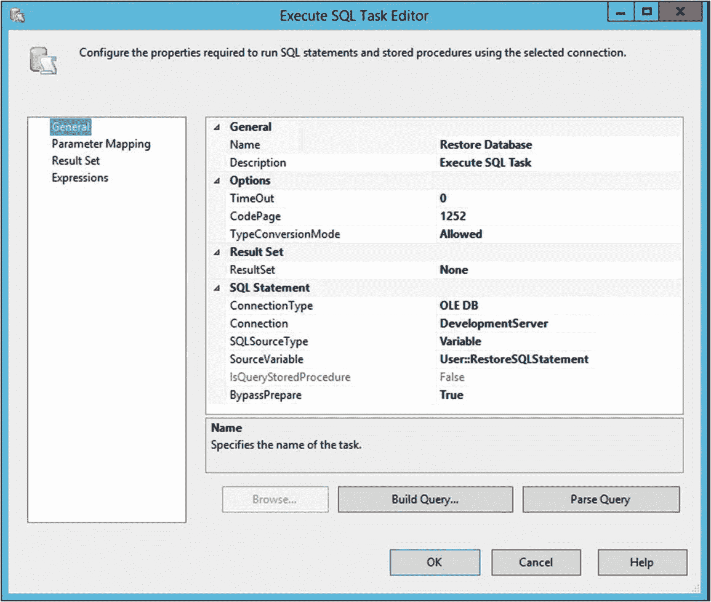

“执行 SQL 任务编辑器”窗口的截图。界面包括左侧的导航窗格，选项有：常规、参数映射、结果集和表达式。主部分显示了一个名为“还原数据库”的任务设置，选项包括超时设置为 0，代码页 1252，以及允许类型转换模式。结果集设置为“无”。SQL 语句设置包括连接类型为 OLE DB，连接为 DevelopmentServer，SQL 源类型为“变量”。底部的按钮包括：生成查询、分析查询、确定、取消和帮助。

图 11-6：配置还原任务

下一个 `Execute SQL Task`（执行 SQL 任务）将用于删除所有没有登录名的现有数据库用户。可以直接在数据库级别创建登录名，这与必须映射到实例级别登录名的数据库用户不同。此功能是包含数据库功能的一部分，当使用诸如 `AlwaysOn Availability Groups`（AlwaysOn 可用性组）等技术时，可简化管理。然而，在我们的场景中，没有登录名的数据库用户可能会导致问题，因为如果他们拥有数据库登录名并知道密码，未经授权的用户可能会连接进来，而不是在较低环境的实例上成为孤立用户。因此，我们将删除所有此类登录名。

图 11-7 展示了我们将如何使用 `Execute SQL Task Editor`（执行 SQL 任务编辑器）对话框来配置此过程。你会注意到，我们已配置 `Connection`（连接）属性以针对 `Development Server`（开发服务器）运行查询；我们将 `SQL source`（SQL 源）配置为“直接输入”；并且我们将查询直接输入到 `SQLStatement`（SQL 语句）属性中。这次我们没有使用变量，因为我们将探索另一种配置任务使其动态化的方法。

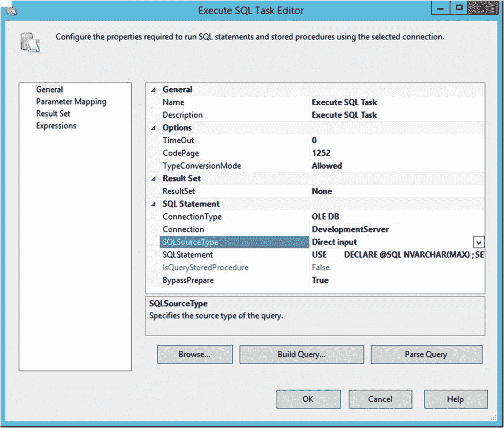

软件应用程序中“执行 SQL 任务编辑器”窗口的截图。该窗口显示了运行 SQL 语句的各种配置选项。关键部分包括“常规”、“选项”、“结果集”和“SQL 语句”。“连接类型”设置为“OLE DB”，“连接”为“DevelopmentServer”。“SQL 源类型”突出显示为“直接输入”，并显示了一个示例 SQL 语句。底部的按钮包括“浏览”、“生成查询”、“分析查询”、“确定”、“取消”和“帮助”。

图 11-7：配置删除无登录名的数据库用户任务

输入到 `SQLSourceType`（SQL 源类型）属性中的表达式可以在代码清单 11-4 中找到。

```sql
"USE " +  @[$Project::DatabaseName] + "
DECLARE @SQL NVARCHAR(MAX)
SET @SQL = (
SELECT 'DROP USER ' + QUOTENAME(name) + ' ; '
FROM sys.database_principals
WHERE type = 'S'
AND authentication_type = 0
AND principal_id > 4
FOR XML PATH('')
) ;
EXEC(@SQL)"
```

代码清单 11-4：删除无登录名的数据库用户

我们将通过配置任务 `SQLStatement`（SQL 语句）属性上的表达式使此任务动态化，如图 11-8 所示。

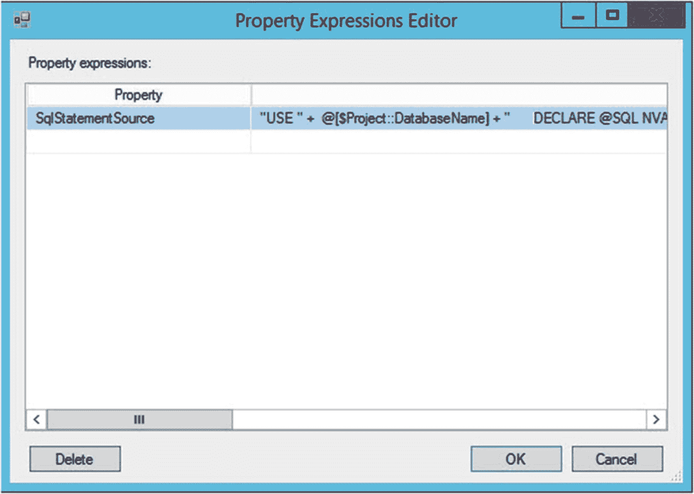

“属性表达式编辑器”窗口的截图。它显示了一个包含“属性”和“表达式”列的表格。显示的属性是“SqlStatementSource”，表达式为：`"USE " + @[Project::DatabaseName] + " DECLARE @SQL NVARCHAR(MAX)`。底部的按钮包括“删除”、“确定”和“取消”。

图 11-8：在 SQLStatement 属性上配置表达式

最后一个 `Execute SQL task`（执行 SQL 任务）将用于混淆数据并将其置于 `Multi User`（多用户）模式。我们将使用 `Execute SQL Task Editor`（执行 SQL 任务编辑器）对话框来配置连接到 `Development Server`（开发服务器），并将 `SQL source`（SQL 源）配置为变量。然后，我们将任务指向 `ObfuscateDataSQLStatement`（混淆数据 SQL 语句）变量。我们用来创建包的动态技术意味着，当我们运行包时（可能是作为 `SQL Server Agent`（SQL Server 代理）作业的手动执行），我们可以传入任何 `Production Server`（生产服务器）、`Development Server`（开发服务器）和数据库。这个元数据驱动的过程将混淆任何数据库中的文本数据、整数和货币数据。如果需要，你也可以轻松修改脚本，以仅混淆数据库中的特定数据，例如特定架构。

所有必需的任务现已创建并配置完成。为了整理包，请使用成功优先约束按顺序连接每个任务。因为有四个 `Execute SQL Tasks`（执行 SQL 任务），我也强烈建议重命名它们以赋予直观的名称。这始终是一个最佳实践，但在有这么多同类任务时尤为重要，因为默认情况下，它们将被命名为无意义的顺序编号。最终的控制流如图 11-9 所示。

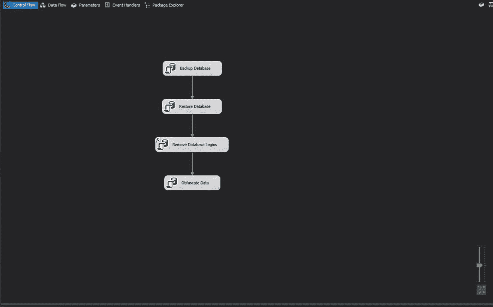

说明数据库管理过程的流程图。顺序包括四个步骤：“备份数据库”、“还原数据库”、“删除数据库登录名”和“混淆数据”，由指示流向的箭头连接。图表设置在深色背景上，每个步骤都包含在矩形框中。

图 11-9：完成的控制流

## 自动化故障/修复场景

自动化响应故障/修复场景是您自动化工作的巅峰。如果实施得当，它可以显著降低 SQL Server 基础架构的 `TCO（Total Cost of Ownership，总拥有成本）`。

如果您试图从一开始就设计一个完整的故障/修复自动化解决方案，注定会失败。首先，成本和工作量将是巨大的。其次，每个企业不仅是独特的，而且会随时间变化。因此，故障/修复自动化应作为 `CSI（continuous service improvement，持续服务改进）` 来实施。

我推荐的方法是使用一个简单的公式来决定您应该为哪些故障/修复场景创建自动化响应。我推荐的公式是：“如果问题在 n 周内发生 x 次，并且（修复时间 X n）> 预估的自动化工作量”。

您将代入此公式的值取决于您的环境。一个例子是“如果问题在 4 周内发生 5 次，并且（修复时间 X 20）> 4 小时”。该公式计算您是否能在三个月内收回您的自动化工作投入。如果您能在三个月内回收您的工作投入，那么几乎可以肯定，为自动化响应付出的前期努力是值得的。

如果您的公司使用复杂的工单系统，例如 `ServiceNow` 或 `ITSM 365`，您将能够报告问题。问题是指被反复提交的工单。例如，您的工单系统可能被配置为，如果同一个问题在四周内被提交五次，它就成为一个问题工单。这允许进行有效的根本原因分析，但您会立即看到与我们公式的协同效应。报告 DBA 团队队列中的问题工单，可以作为寻找待自动化候选故障/修复场景的一个绝佳起点。

以下部分将讨论如何设计和实现对 `9002` 错误的自动化响应。`9002` 错误发生在事务日志没有空间写入，并且日志无法增长时。


### 针对 9002 错误设计响应方案

在创建响应 9002 错误的流程之前，我们将首先创建一个流程图。这将有助于后续的编码工作，并作为该流程的持续文档。

图 11-10 展示了我们在编写代码时将遵循的流程图。

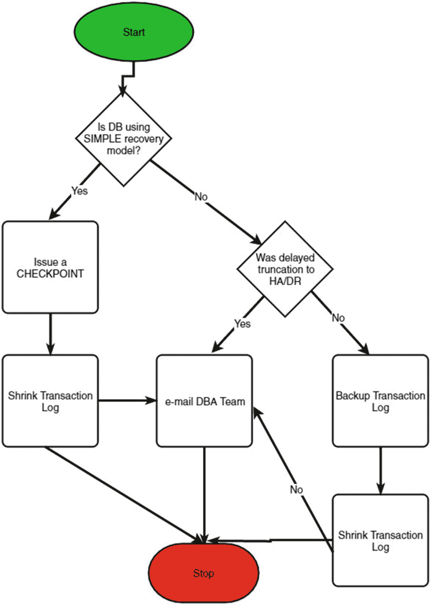

展示数据库管理决策过程的流程图。它始于绿色椭圆中的“开始”，导向一个决策菱形，询问“数据库是否使用简单恢复模式？”如果“是”，则进行“发出 CHECKPOINT”，然后是“收缩事务日志”，并以红色椭圆中的“停止”结束。如果“否”，则询问“是否由于高可用/灾难恢复（HA/DR）导致延迟截断？”如果“是”，则导向“电子邮件通知 DBA 团队”，然后“收缩事务日志”，并以“停止”结束。如果“否”，则导向“备份事务日志”，然后“收缩事务日志”，并以“停止”结束。

图 11-10

响应 9002 错误的流程图

### 自动化响应 9002 错误

我们将使用 `SQL Server Agent` 警报来触发我们的流程（如果发生 9002 错误）。要创建新警报，请在 `SQL Server Management Studio` 中展开 `SQL Server Agent`，并从 `Alerts`（警报）的上下文菜单中选择 `New Alert`（新建警报）。这将显示 `New Alert`（新建警报）对话框。在对话框的 `General`（常规）选项卡上（如图 11-11 所示），我们将为警报命名，并将其配置为由 `SQL Server` 错误号 9002 触发。

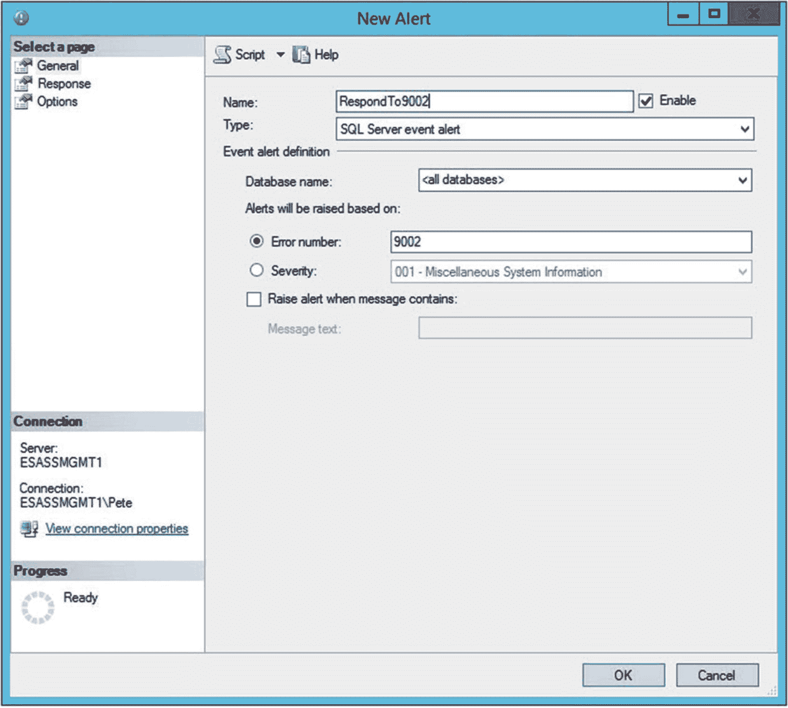

SQL Server 的“新建警报”配置窗口截图。警报被命名为“RespondTo9002”并已启用。这是一个针对所有数据库的 SQL Server 事件警报，由错误号 9002 触发。严重性设置为“001 - 杂项系统信息”。服务器是“ESASSMGMT1”，连接到“ESASSMGMT1\Pete”。可以看到查看连接属性和进度状态为“就绪”的选项。

图 11-11

新建警报 – 常规选项卡

在对话框的 `Response`（响应）选项卡上，我们将勾选 `Execute Job`（执行作业）选项，并使用 `New Job`（新建作业）按钮调用 `New Job`（新建作业）对话框。保存作业后，在 `New Job`（新建作业）对话框的 `General`（常规）选项卡上，我们将为我们新的 `Job`（作业）定义一个名称，如图 11-12 所示。

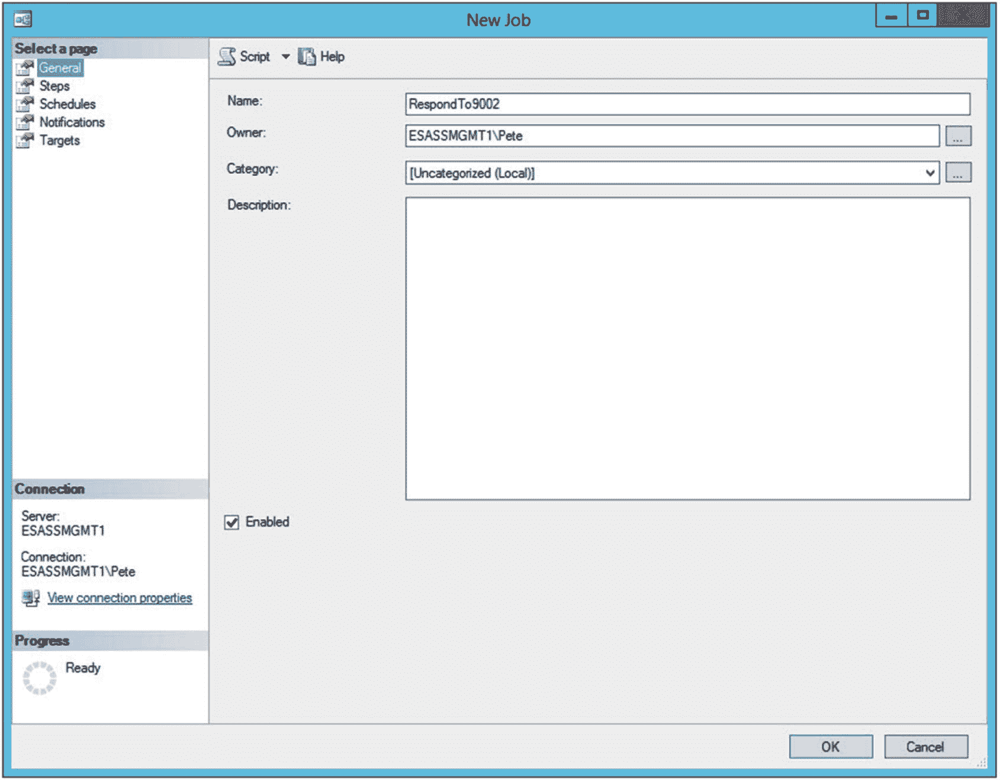

软件应用程序中“新建作业”窗口的截图。界面包含“名称”、“所有者”、“类别”和“描述”字段，名称设置为“RespondTo9002”，所有者为“ESASSMGMT1\Pete”。类别为“[未分类（本地）]”。标有“已启用”的复选框已被勾选。左侧面板显示“常规”、“步骤”、“计划”、“通知”和“目标”等选项。连接详细信息显示服务器为“ESASSMGMT1”以及“查看连接属性”的链接。进度状态为“就绪”。

图 11-12

新建作业 – 常规选项卡

在 `New Job`（新建作业）对话框的 `Steps`（步骤）选项卡上，我们将使用 `New`（新建）按钮调用 `New Job Step`（新建作业步骤）对话框。在 `New Job Step`（新建作业步骤）对话框的 `General`（常规）选项卡上，我们将为我们的作业步骤命名，并配置其执行清单 11-5 中的脚本。

```sql
--创建一个表来存储日志条目
CREATE TABLE #ErrorLog
(
LogDate          DATETIME,
ProcessInfo      NVARCHAR(128),
Text             NVARCHAR(MAX)
) ;
--用日志条目填充表
INSERT INTO #ErrorLog
EXEC('xp_readerrorlog') ;
--声明变量
DECLARE @SQL NVARCHAR(MAX) ;
DECLARE @DBName NVARCHAR(128) ;
DECLARE @LogName NVARCHAR(128) ;
DECLARE @Subject        NVARCHAR(MAX) ;
--查找发生错误的数据库名称
SET @DBName = (
SELECT TOP 1
SUBSTRING(
SUBSTRING(
Text,
35,
LEN(Text)
),
1,
CHARINDEX(
'''',
SUBSTRING(Text,
35,
LEN(Text)
)
)-1
)
FROM #ErrorLog
WHERE Text LIKE 'The transaction log for database%'
ORDER BY LogDate DESC
FOR XML PATH('')
) ;
--查找已满的日志文件名称
SET @LogName = (
SELECT name
FROM sys.master_files
WHERE type = 1
AND database_id = DB_ID(@DBName)
) ;
--终止任何活动的查询，以便清理操作可以执行
SET @SQL = (
SELECT 'USE Master; KILL ' + CAST(s.session_id AS NVARCHAR(4)) + ' ; '
FROM sys.dm_exec_requests r
INNER JOIN sys.dm_exec_sessions s
ON r.session_id = s.session_id
INNER JOIN sys.dm_tran_active_transactions at
ON r.transaction_id = at.transaction_id
WHERE r.database_id = DB_ID(@DBName)
) ;
EXEC(@SQL) ;
--如果恢复模式为简单（SIMPLE）
IF (SELECT recovery_model FROM sys.databases WHERE name = @DBName) = 3
BEGIN
--发出 CHECKPOINT
SET @SQL = (
SELECT 'USE ' + @DBName + ' ; CHECKPOINT'
) ;
EXEC(@SQL) ;
--收缩事务日志
SET @SQL = (
SELECT 'USE ' + @DBName + ' ; DBCC SHRINKFILE (' + @LogName + ' , 1)'
) ;
EXEC(@SQL) ;
--发送电子邮件给 DBA 团队
SET @Subject = (SELECT '9002 Errors on ' + @DBName + ' on Server ' + @@SERVERNAME)
EXEC msdb.dbo.sp_send_dbmail
@profile_name = 'ESASS Administrator',
@recipients = 'DBATeam@ESASS.com',
@body = 'A CHECKPOINT has been issued and the Log has been shrunk',
@subject = @Subject ;
END
--如果数据库为完整恢复模式（FULL）
IF (SELECT recovery_model FROM sys.databases WHERE name = @DBName) = 1
BEGIN
--如果重用延迟不是由于复制或镜像/可用性组导致
IF (SELECT log_reuse_wait FROM sys.databases WHERE name = @DBName) NOT IN (5,6)
BEGIN
--备份事务日志
SET @SQL = (
SELECT 'BACKUP LOG '
+ @DBName
+ ' TO  DISK = ''C:\Backups\'
+ @DBName
+ '.bak'' WITH NOFORMAT, NOINIT,  NAME = '''
+ @DBName
+ '-Full Database Backup'', SKIP ;'
) ;
EXEC(@SQL) ;
--收缩事务日志
SET @SQL =  (
SELECT 'USE ' + @DBName + ' ; DBCC SHRINKFILE (' + @LogName + ' , 1)'
) ;
EXEC(@SQL) ;
--发送电子邮件给 DBA 团队
SET @Subject = (SELECT '9002 Errors on ' + @DBName + ' on Server ' + @@SERVERNAME) ;
EXEC msdb.dbo.sp_send_dbmail
@profile_name = 'ESASS Administrator',
@recipients = 'DBATeam@ESASS.com',
@body = 'A Log Backup has been issued and the Log has been shrunk',
@subject = @Subject ;
END
--如果重用延迟是由于复制或镜像/可用性组导致
ELSE
BEGIN
--发送电子邮件给 DBA 团队
SET @Subject = (SELECT '9002 Errors on ' + @DBName + ' on Server ' + @@SERVERNAME) ;
EXEC msdb.dbo.sp_send_dbmail
@profile_name = 'ESASS Administrator',
@recipients = 'DBATeam@ESASS.com',
@body = 'DBA intervention required - 9002 errors due to HA/DR issues',
@subject = @Subject ;
END
END
```

清单 11-5

响应 9002 错误

> **提示**
>
> 此脚本假设您已配置 `Database Mail`（数据库邮件）。关于 `Database Mail` 的完整讨论超出了本书范围。更多详细信息可以在 [`https://learn.microsoft.com/en-us/sql/relational-databases/database-mail/configure-database-mail?view=sql-server-ver16`](https://learn.microsoft.com/en-us/sql/relational-databases/database-mail/configure-database-mail?view=sql-server-ver16) 找到。

如图 11-13 所示。

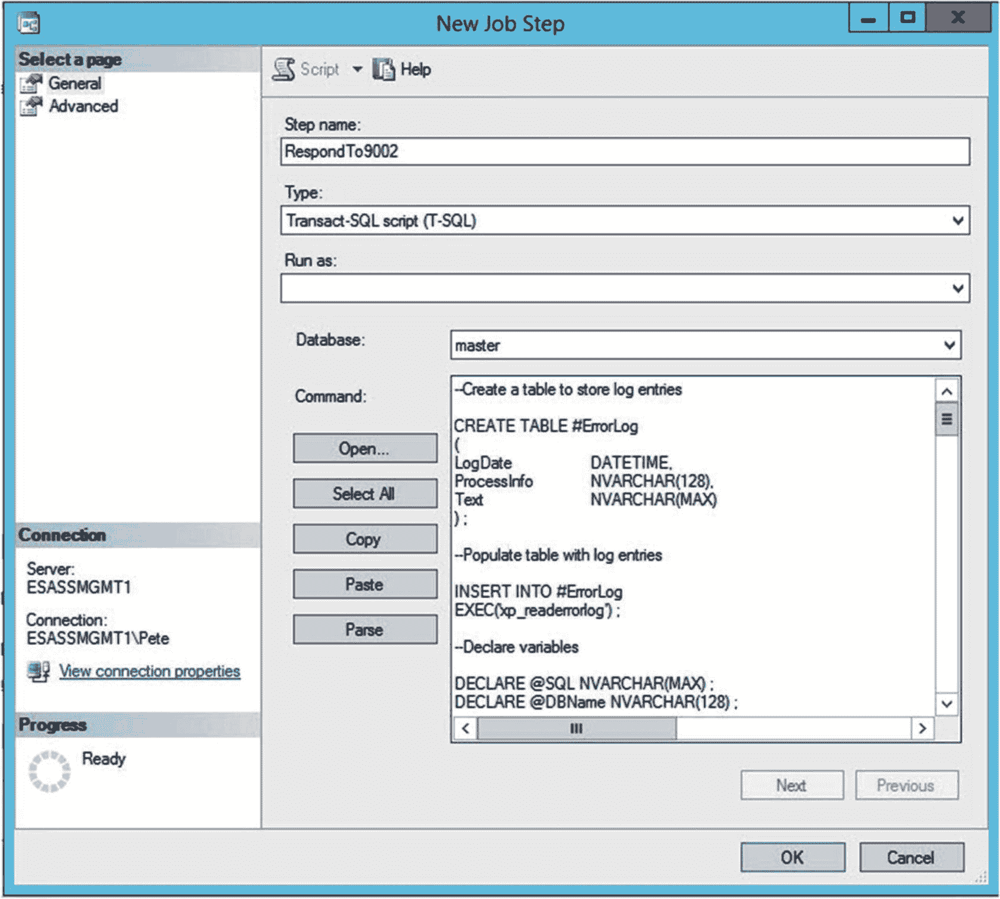


SQL Server Management Studio 中 “新建作业步骤” 窗口的截图。该窗口包含 “步骤名称”、“类型” 和 “以身份运行” 字段，其中已填入 “RespondTo9002” 和 “Transact-SQL 脚本 (T-SQL)”。“数据库” 设置为 “master”。“命令” 部分包含用于创建名为 “#ErrorLog” 的表（包含 “LogDate”、“ProcessInfo” 和 “Text” 列）以及插入日志条目的 SQL 代码。左侧面板显示 “选择页面” 选项，“连接” 部分显示服务器详细信息。可以看到 “打开”、“全选”、“复制”、“粘贴” 和 “解析” 按钮。

图 11-13

#### 新建作业步骤 – 常规页

退出 `新建作业步骤` 对话框和 `新建作业` 对话框后，我们的新作业将自动出现在 `新建警报` 对话框的 `响应` 页面上的 `执行作业` 下拉列表中，如图 11-14 所示。

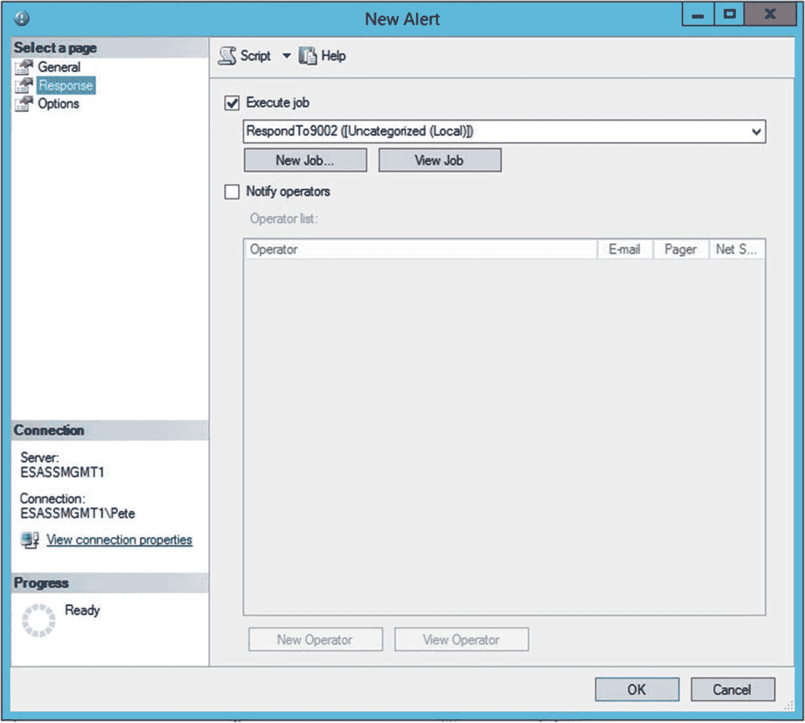

服务器管理界面中 “新建警报” 配置窗口的截图。该窗口包含执行名为 “RespondTo9002 (未分类本地)” 的作业的选项，以及 “新建作业” 和 “查看作业” 按钮。有一个通知操作员的部分，尽管未列出任何操作员。左侧面板显示导航选项，如常规、响应和选项，其中响应选项卡被选中。连接详细信息显示 “服务器: ESASSMGMT1” 和 “连接: ESASSMGMT1\Pete”。底部的进度指示器显示 “就绪”。

图 11-14

#### 响应页

我们无需在 `新建警报` 对话框的 `选项` 页面上进行任何配置。但您应该了解在此页面上可以配置的选项。一个非常有用的选项是能够在响应之间提供延迟。配置此选项可以帮助您避免在先前的响应仍在处理问题的过程中时触发 “误” 响应的可能性。

## 总结

自动化日常维护任务可以节省 DBA 的宝贵时间，并提高对业务的服务水平。当然，可能无法实现 100% 维护自动化，因为总会有例外情况。目标是将 80% 的任务自动化，20% 作为例外处理，这是一个很好的思路。除了自动化数据库引擎内的任务（例如智能 `索引重建`，如您在前面章节中所学）之外，也可以自动化包含操作系统元素的任务，例如打补丁。

您能自动化的故障/修复场景越多，您对业务的服务就会越好、越主动。然而，试图一次性自动化对所有故障/修复场景的响应是不可行的。这是因为问题会随着时间而变化和不同，并且如此大规模的工作很可能成本过高。相反，您应该将自动化的故障/修复场景作为一项持续服务改进 (`CSI`) 计划来添加。利用工单系统的问题管理功能来帮助定义适合自动化的候选问题会很有帮助。


Add-SqlLogin cmdlet, Ad hoc routine maintenance, Ad hoc commands, Ad hoc query plans, Aggregation interval, Aliases, APPLY operator, Automated installation, Automating ad hoc maintenance, break/fix scenarios, 9002 errors, installation, See SQL Server installation, multiple approaches, scripts, Automation, See also Automating, AUTO mode, Availability Groups, Azure, Azure SQL Database

B
Break/fix scenarios

C
Centralized maintenance, column layout, configuration data, inventory database, PowerShell Scripts, schedule column, scheduling system tables and view target, CertificateBackups, CLR, See Common Language Runtime (CLR), Comments, Common Language Runtime (CLR), Comparison operators, Config database, Configuration management, ongoing operations, operational resources, performance requirements, performance resources, security requirements, security resources, Continuous service improvement (CSI) program, Controlling flow, Credential, Credentials, CROSS APPLY operator, CSI program, See Continuous service improvement (CSI) program

D
Database as a Service (DBaaS), Database users, addittion role, dropping users, Data-tier applications, Data types, DateTimeOffset, DBaaS, See Database as a Service (DBaaS), DBATeam, DBATeamSysadmin resource, DbaTools, database users, installation, SQL Server Agent artifacts, DependOn clause, Desired state configuration (DSC), configuration management, configurations, implementation, management component, process, Windows Server, DMF, See Dynamic management functions (DMF), DMV, See Dynamic management views (DMV), Dropping users, DSC, See Desired state configuration (DSC), Dynamic management functions (DMF), Dynamic management views (DMV)

E
ELSE block, ELSEIF blocks, EndTime, Error handling, 9002 errors, Errors, EvaluateAsExpression, Execute SQL Task, Execution context, Execution policy, Exist method, eXtensible Markup Language (XML), description, execution plan, extracting values, FOR XML AUTO, FOR XML PATH, FOR XML RAW, sales order values extraction

F
FEATURES parameter, Filtering, First normal form (1NF), FLOWR statements, Forcing failure reasons, FOR XML modes, FOR XML PATH('') technique

G
Get-Command -module sqlserver, Get-DbaDbUser command, Get-ExecutionPolicy command, Get-SqlLogin command, Gold disk approach

H
$HelloWorldText, Hierarchy level

I, J, K
IaaS, See Infrastructure as a Service (IaaS), IDENTITY column, Infrastructure as a Service (IaaS), Instance, installation, ACTION Parameter, command line parameters, FEATURES parameter, IACCEPTSQLSERVERLICENSETERMS, installation progress, optional parameters, product update, role parameter, Inventory database, centralized maintenance techniques, creation, database logical design, physical design, platform design, See also Normalization, Invoke-DbaQuery command, error handling, parameters, queries against multiple instances, Invoke-SqlCmd, execution context, Out-File cmdlet, parameters, scripting, ITSM 365

L
LastExecTime, Logins, dropping, renaming, server role, Looping

M
MaintenanceSchedules Columns, MaintenanceSchedule view, MaintenanceTasks, MaintenanceTasks Columns, MaintenanceTasks table, MaintenanceWindows table, MaintenanceWindows Columns, Many-to-many relationships, MAXDOP, See Maximum degree of parallelism (MAXDOP), Maximum degree of parallelism (MAXDOP), Metadata-driven automation, ad hoc query plans, automation, dynamic index policies, enforcement, SQL Server, Microsoft Operations Framework (MOF), Modules, Install-Module command, modular approach, SqlServer, MOF, See Microsoft Operations Framework (MOF)

N
.NET CLR, New-DbaAgentJob command, New-DbaAgentJobStep command, New-DbaAgentSchedule command, New-DbaDbMasterKey command, Nodes method, Normalization, first normal form (1NF), second normal form (2NF), testing, third normal form (3NF), NVARCHAR(128)

O
1NF, See First normal form (1NF), Operational resources, Optional parameters, OUTER APPLY operator, Out-File cmdlet, Out-of-the-box functionality, OutputSqlErrors parameter

P
PaaS, See Platform as a Service (PaaS), PATH mode, PBM, See Policy-based management (PBM), Piping, Platform as a Service (PaaS), Policy-based management (PBM), PowerShell, aliases, comments, configuration management, controlling flow, data types, description, DSC, See Desired state configuration (DSC), execution policy, modules, object-oriented language, piping & filtering, scripts, standards, variables, PowerShell Get-Service cmdlet, Process flow, 9002 errors, Product updation, Proxy

Q
Query method, Query plans, Query Store

R
Remove-DbaDbUser command, Remove-DBALogin command, Retrieving job information, Role parameter

S
SalesOrderID, Scripts, auto-install, installation routine, PowerShell, production readiness, Scripting, Second normal form (2NF), Security objects, availability groups, credentials, database user, DbaTools module, login creation, miscellaneous Cmdlets, server roles, sqlserver module, working with logins, working with server roles, Security requirements, Security resources, Server Agent, credential, job creation, Proxy, retrieving job information, Server roles, Service Account, ServiceNow, Shell Database, Smoke tests, SMO, See SQL Server Management Objects (SMO), sp_configure, SQLAgentCredential, SQL Agent job, SQLAgentProxy, SqlConfiguration resource, SqlMaxDop resource, SQL Server Agent, SQL Server AlwaysOn, SqlServerDsc module, SQL Server Enterprise, SQL Server installation, ACTION parameter, required parameters, SQL Server Management Objects (SMO), SQL Server Management Studio (SSMS), Sqlserver module, Invoke-SqlCmd, SQL Task, SQL Server Analysis Services (SSAS), SSIS package, SSAS, See SQL Server Analysis Services (SSAS), SSMS, See SQL Server Management Studio (SSMS), Standards, StartTime, sys.configurations, sys.dm_db_index_physical_stats, sys.dm_query_store_plan, sys.query_store_query catalog, sys.query_store_runtime_stats

T, U
Task Scheduler, TempDB system, Testing normalization, Third normal form (3NF), 3NF, See Third normal form (3NF), ToString() method, Transitive dependencies, T-SQL techniques, APPLY operator, looping, values extraction, XML data type, XML for DBAs, 2NF, See Second normal form (2NF)

V
Value method, Variables

W
WHERE clause, Windows Server, Windows Server Core Installation, configuration file, auto-install script, PROSQLADMINCONF2, SQLAutoInstall.ps1, SQLPROSQLADMINCONF1 instance, See Instance Installation

X, Y, Z
XML, See eXtensible Markup Language (XML), XML Schema Definition (XSD), xp_cmdshell, XQuery, XSD, See XML Schema Definition (XSD)
