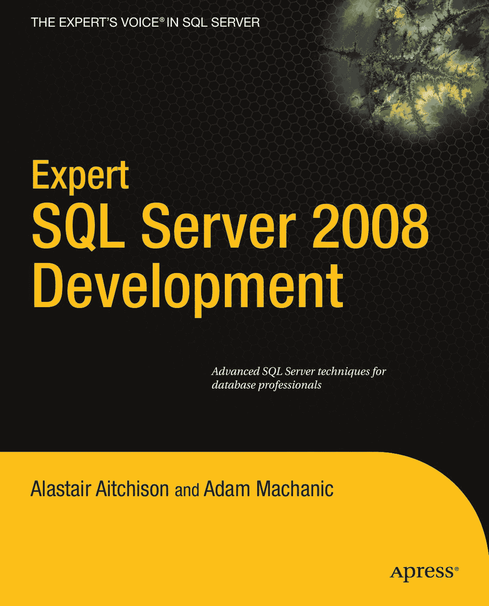

# 精通 SQL Server 2008 开发

## 致读者

市面上已有很多关于`SQL Server`的书籍，那我为何还要参与编写另一本呢？这本书又有何不同之处？答案是：与市面上大多数书籍不同，《精通 SQL Server 2008 开发》的目的并非提供`SQL Server 2008`可用功能的全面参考手册。这类信息已在*Microsoft 在线丛书*中提供，并且也在许多书籍中被重复介绍。相反，我的目标是分享创建一流数据库应用程序所需的知识和技能，这些应用程序体现了数据库开发的最佳实践。

本书涵盖的主题代表了数据库开发中有趣、有时复杂且经常被误解的各个方面。理解这些领域将使你成为一名专家级的`SQL Server`开发者。其中一些主题在软件社区中备受争议，对于任何特定问题，并不总存在一个唯一的“最佳”解决方案。相反，我将向你展示多种方法，并提供相应的信息和工具，以便你决定哪种方法最适合你的特定环境。

阅读本书后，你将领会到诸如测试和异常处理等领域的重要性，以确保你的代码健壮、可扩展且易于维护。你将学习如何通过控制对敏感信息的访问来创建安全的数据库，并了解如何加密数据以保护其免受窥探。你还将学习如何使用动态`SQL`和`SQLCLR`创建灵活、高性能的应用程序，并发现处理数据库并发用户的各种模型。最后，我将教你如何处理表示时间、空间和分层信息的复杂数据。我们将一起揭示这些情况下可能出现的一些有趣问题。

我为这本书付出了巨大努力，希望它对所有技能水平的读者都有所助益。无论是初学者、专家还是介于两者之间的人，你都能在本书中找到有用的内容。我希望它能帮助你成为一名真正的专家级`SQL Server`开发者。

阿拉斯泰尔·艾奇逊

## 作者信息

**阿拉斯泰尔·艾奇逊，**  
*《SQL Server 2008 空间入门》* 作者

**亚当·马哈尼克，**  
*《精通 SQL Server 2005 开发》* 作者

## Apress 出版社路线图

*《Pro T-SQL 2008 程序员指南》*  
*《T-SQL 2008 入门》*  
*《加速掌握 SQL Server 2008》*  
*《Transact-SQL 解决方案集》*  
**《精通 SQL Server 2008 开发》**

详情请见末页关于 10 美元电子书版本的信息

## 源代码

**在线提供源代码**

## 书籍详情

ISBN 978-1-4302-7213-7  
**美国定价：49.99 美元**

分类归属：数据库 / `SQL Server`  
读者水平：中级 / 高级

## 印制详情

5 49 9 9  
9 781430 272137  
提供配套电子书  
**本印刷版本仅供内容预览——尺寸与颜色不准确**  
**成品尺寸 = 7.5 英寸 x 9.25 英寸 书脊厚度 = 0.84375 英寸 页数：456 页**

