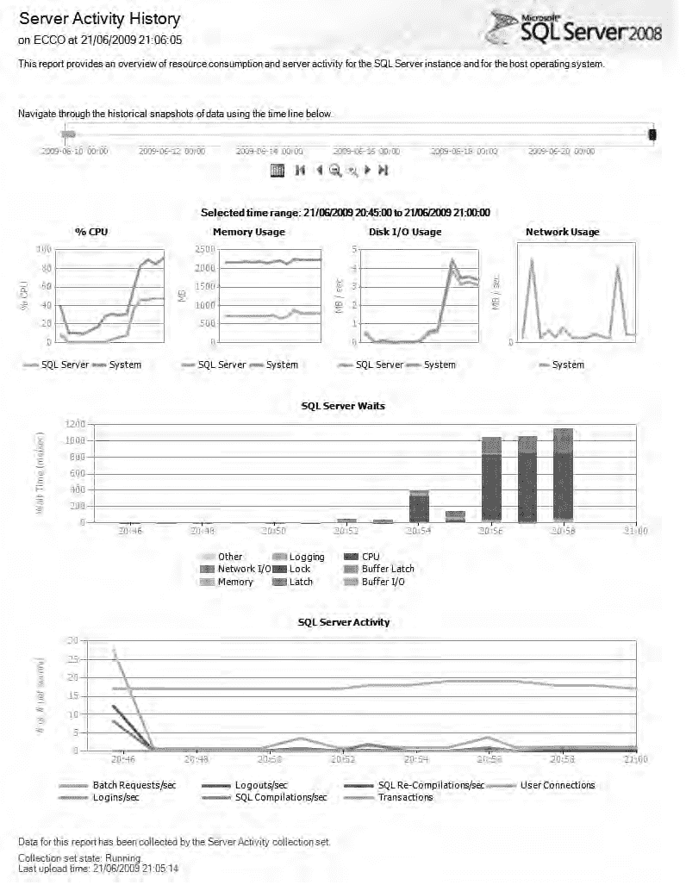

# 第三章 测试数据库例程

-   队列长度过长是磁盘争用的典型表现，也是一个明确信号，表明您可能需要评估如何减少索引碎片，以降低插入和更新操作的时间。

-   `SQLServer:Locks:Average Wait Time (ms)` 报告查询等待锁的平均时长。减少锁争用可能颇具挑战，但在某些情况下可以通过使用脏读（`READ UNCOMMITTED` 隔离级别）或行版本控制（`SNAPSHOT` 隔离级别）来解决。有关这些及其他选项的讨论，请参见第 9 章。

-   `SQLServer:Buffer Manager:Page life expectancy` 指页面从磁盘读入后，在缓冲区缓存内存中保留的平均时间（以秒为单位）。该计数器与 Disk Read Bytes/sec 结合使用，有助于指示磁盘瓶颈发生的位置——或者，它也可能只是表明您的服务器需要更多内存。无论哪种情况，低于 300（即 5 分钟）的值可能表明您在此方面存在问题。

-   `SQLServer:Plan Cache:Cache Hit Ratio` 和 `SQLServer:Plan Cache:Cached Pages` 是处理查询计划缓存的计数器。缓存命中率计数器是缓存命中数与查找数的比率——换句话说，就是已发出查询中已在缓存中的百分比。在性能运行期间，此数字通常应开始时较低（假设您在运行前已重启 SQL 服务器以使其处于一致状态），并在运行过程中逐渐上升。接近尾声时，您应该看到此数字相当接近 100，表明几乎所有查询都已被缓存。缓存页计数器指示有多少 8KB 的内存页正用于过程缓存。低缓存命中率结合高缓存页值意味着您需要考虑修复系统所使用的动态 SQL。有关解决动态 SQL 问题的技术信息，请参见第 8 章。

**提示** SQL Server Profiler 能够导入已保存的性能计数器日志，以便将其与跟踪关联起来。这对于帮助精确定位诸如 CPU 时间和磁盘利用率等区域中特别大的峰值原因非常有用。

## 动态管理视图

SQL Server 2008 暴露的动态管理视图包含各种服务器级和数据库级信息，可用于辅助性能测量。`sys.dm_os_performance_counters` DMV 包含服务器维护的超过 1000 行的高级性能计数器，包括有关 I/O、锁、缓冲区和日志使用情况的常见度量。查询此 DMV 提供了一种替代方法，用于收集通过性能监控控制台暴露的许多相同数据。

除了 `sys.dm_os_performance_counters`，还有许多其他 DMV 包含对性能监控目的有用的信息。以下列表显示了我发现对性能测量和调优最有帮助的几个 DMV：

-   `sys.dm_exec_query_stats`：为当前计划在缓存中的查询提供性能统计信息。通过与 `sys.dm_exec_sql_text` 和 `sys.dm_exec_query_plan` 连接，可以分析个别有问题的批处理与其 SQL 和查询计划相关的性能。
-   `sys.dm_db_index_usage_stats`、`sys.dm_db_index_physical_stats` 和 `sys.dm_db_index_operational_stats`：这三个视图显示对索引调优有用的信息，包括报告针对每个索引执行的查找和扫描次数、索引碎片程度以及可能的索引争用和阻塞问题。
-   `sys.dm_os_wait_stats`：此视图记录有关被迫等待的请求的信息——换句话说，任何由于 I/O 或 CPU 资源不可用而无法立即由服务器满足的请求。
-   `sys.dm_os_waiting_tasks` 和 `sys.dm_tran_locks`：分别包含在这两个表中的关于等待任务和锁的信息，可以结合起来帮助识别阻塞情况。

**注意** DMV 通常报告以微秒（1/1,000,000 秒）为单位测量的任何计时，而大多数其他性能测量工具则以毫秒（1/1,000 秒）为单位报告计时。

分析这些 DMV 中包含的详细信息，可以让您了解许多性能问题的根本原因，并确定纠正这些问题的适当措施。例如，假设一台性能不佳的服务器上的 `sys.dm_os_wait_stats` 显示有大量的 I/O 等待（例如，`PAGEIOLATCH`、`LOGMGR` 或 `IO_COMPLETION` 的值很高），但几乎没有 CPU 资源等待。显然，在这种情况下，性能问题不会通过升级服务器 CPU 来解决——存在 I/O 瓶颈，适当的解决方案涉及找到缩短 I/O 响应时间的方法，或者减少查询的 I/O 需求。

**注意** DMV 存储的是自服务器上次重启以来的预聚合累积统计信息。为了在运行性能测试前重置等待统计信息，您可以使用带有 CLEAR 选项的 `DBCC SQLPERF`——例如，`DBCC SQLPERF ('sys.dm_os_wait_stats', CLEAR);`。

### 扩展事件

扩展事件是 SQL Server 2008 中引入的一种灵活、多用途的事件系统，可用于各种场景，包括性能测试。有超过 250 个预定义事件，其中一些镜像了传统的跟踪事件触发器，包括 `RPC:Completed`、`sp_completed` 和 `lock_timeout`，但还有许多其他事件。事件触发时收集的有效载荷（即数据列）随后可以传递到各种同步和异步目标。这种用于处理扩展事件的灵活框架允许您构建一个定制的性能监控系统，该系统收集非常具体的测量值，并以各种格式传递它们，以满足您的监控要求。

前面介绍的监控工具的一个缺点是，它们倾向于收集在预定义级别聚合的性能指标。例如，在 `sys.dm_os_wait_stats` 中暴露的等待统计信息可能表明在服务器范围内发生了 I/O 瓶颈。然而，仅凭这些信息，我们无法判断哪些查询或会话受到影响，或者它们被强制等待了多久。通过利用诸如 `sqlos.wait_info` 和 `sqlos.wait_info_external` 之类的扩展事件，可以在会话或语句级别收集特定的等待统计信息。使用扩展事件收集的性能统计信息可以通过添加谓词来进一步细化，这些谓词指定例如仅收集特定类型的等待信息、发生一定次数的等待或超过最小等待时间的等待。

以下代码清单说明了如何创建一个新的扩展事件会话，该会话记录所有遇到等待的语句（由 `sqlos.wait_info` 事件触发），并将其保存到服务器上的日志文件中：

```
CREATE EVENT SESSION WaitMonitor ON SERVER
ADD EVENT sqlos.wait_info(
    ACTION(
        sqlserver.sql_text,
        sqlserver.plan_handle)
    WHERE total_duration > 0
)
ADD TARGET package0.asynchronous_file_target(
    SET filename = N'c:\wait.xel',
    metadatafile = N'c:\wait.xem');
GO
```

当您准备好启动日志时，运行以下命令：

```
ALTER EVENT SESSION WaitMonitor ON SERVER
STATE = start;
GO
```

## 停止扩展事件会话

要停止 `WaitMonitor` 会话，请执行以下代码清单：

```sql
ALTER EVENT SESSION WaitMonitor ON SERVER
STATE = stop;
GO
```

扩展事件会话捕获的有效负载以 XML 格式保存到文件目标中。要分析此文件中包含的数据，可以使用 `sys.fn_xe_file_target_read_file` 方法将其加载回 SQL Server，然后使用 XQuery 语法进行查询，如以下查询所示：

```sql
SELECT
    xe_data.value('(/event/action[@name=''sql_text'']/value)[1]','varchar(max)') AS sql_text,
    xe_data.value('(/event/@timestamp)[1]','datetime') AS timestamp,
    xe_data.value('(/event/data[@name=''wait_type'']/text)[1]','varchar(50)') AS wait_type,
    xe_data.value('(/event/data[@name=''total_duration'']/value)[1]','int') AS total_duration,
    xe_data.value('(/event/data[@name=''signal_duration'']/value)[1]','int') AS signal_duration
FROM (
    SELECT CAST(event_data AS xml) AS xe_data
    FROM sys.fn_xe_file_target_read_file('c:\wait_*.xel', 'c:\wait_*.xem', null, null)
) x;
GO
```

`注意` 扩展事件可以用于比此处展示的简单示例更多的场景。有关更多信息和其他可能用途的示例，请参阅在线手册：`http://msdn.microsoft.com/en-us/library/bb630354.aspx`。

### 数据收集器

数据收集器允许您根据指定的计划，自动从 DMV 和某些系统性能计数器收集性能数据，并将其上传到中央管理数据仓库（MDW）。SQL Server 附带了三个预定义的系统收集集，其中从性能调整的角度来看，最有用的是 `server activity collection set`。`server activity collection set` 结合了来自 `sys.dm_os_wait_stats`、`sys.dm_exec_sessions`、`sys.dm_exec_requests` 和 `sys.dm_os_waiting_tasks` 等 DMV 的信息，以及各种 SQL Server 和 OS 性能计数器，提供了服务器上 CPU、磁盘 I/O、内存和网络资源使用的概览。默认情况下，每项指标每 60 秒采样一次，收集的数据每 15 分钟上传到 MDW 一次，数据在 MDW 中保留 14 天后被清除。如果需要，您可以基于性能计数器的收集器类型创建自己的自定义数据收集集，以调整收集计数器的定义、频率和持续时间。

之前讨论的其他分析工具主要用于针对特定目标区域的短期诊断和测试，而数据收集器是监控长期性能趋势的有用工具。历史性能数据可以长期收集和保留，并可以比较服务器在几个月甚至几年内的相对性能。数据收集器还提供了预先格式化的、可向下钻取的表格报告和图表，使得一眼就能相对容易地识别主要问题区域。图 3-1 展示了从 `server activity collection set` 生成的默认报告。



*图 3-1. 服务器活动收集报告*

## 分析性能数据

在上一节中，我讨论了如何使用多种不同的工具和技术捕获 SQL Server 性能数据。在本节中，让我们考虑应该监控哪些数据，以及如何分析这些数据以构建数据库性能概况。

请注意，此处讨论的技术可能帮助您识别瓶颈和其他性能问题，但它们不涉及如何解决这些问题。在本书的其余部分，各种示例将讨论如何从性能角度审视代码以及如何解决某些问题，但请记住，本书并非旨在作为查询性能调整的全面指南。我强烈建议寻找更详细指南的读者投资一本专门讨论该主题的书籍，例如 Grant Fritchey 和 Sajal Dam 所著的《*SQL Server 2008 Query Performance Tuning Distilled*》（Apress，2009）。

## 捕获基线指标

与单元测试和功能测试一样，在进行性能评估时，建立一个整体流程非常重要。性能测试应该是可重复的，并且应该在可以回滚的环境中进行，以便为多次测试运行复制相同的条件。

请记住，应用程序中的任何组件都可能以某种方式影响性能，因此每次从相同的起点开始至关重要。我建议使用一个测试数据库，该数据库可以在每次测试前恢复到其原始状态，并且在测试运行开始前重启所有涉及的服务器，以确保每次测试都从相同的初始条件开始。另一个可能比备份和恢复测试数据库更简单的选择是使用 SQL Server 2008 的数据库快照功能，或者如果您使用虚拟化环境，则从虚拟机映像恢复保存的状态。在您自己的环境中尝试每种技术，以确定哪种最适合您的测试系统。

除了确保服务器处于相同状态外，您还应该以完全相同的方式为每次测试运行收集完全相同的性能计数器、查询跟踪数据和其他指标。一致性是验证变更是否有效以及衡量其有效程度的关键。

在测试过程中，第一次运行的测试应用作为 `baseline`。基线测试期间捕获的指标将用于与后续运行的结果进行比较。当问题得到解决，或者测试条件发生变化时（例如，如果需要在某个领域收集更多性能计数器），您应该建立一个新的基线以继续进行。请记住，修复应用程序某个领域的问题可能会对另一个领域的性能产生影响。例如，某个给定的查询可能是 I/O 密集型的，而另一个可能是 CPU 密集型的。通过修复第一个查询的 I/O 问题，您可能会引入更高的 CPU 利用率，如果它们同时运行，反过来会导致另一个查询性能下降。

在数据库环境中建立基线指标通常是一个相当直接的过程。应使用服务器端跟踪来捕获性能数据，包括查询持续时间和使用的资源。然后可以聚合这些数据以确定查询的最小、最大和平均统计信息。为了确定哪些资源匮乏，可以使用性能计数器来跟踪服务器利用率。在进行更改以修复性能问题时，可以将基线数据与其他测试数据进行分析，以确定性能趋势。

## 全局分析

