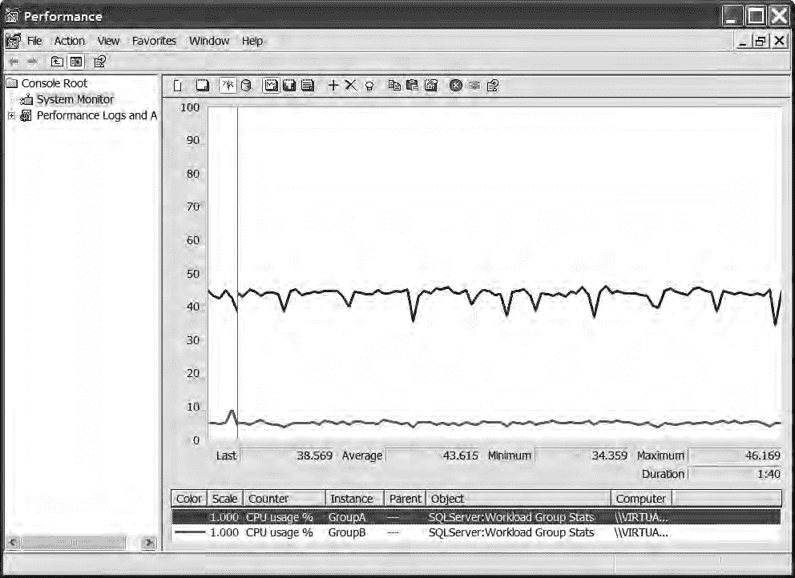
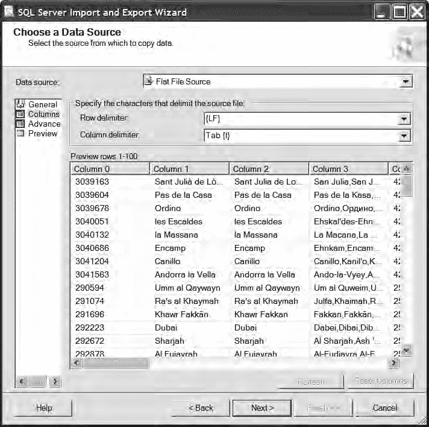
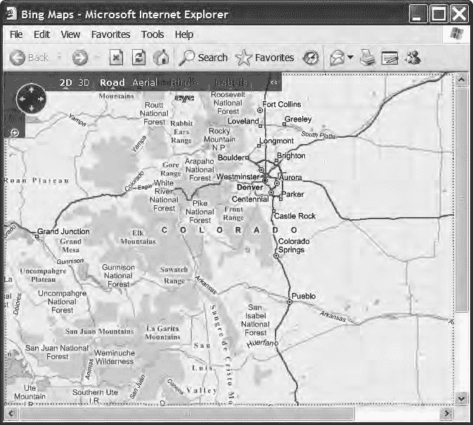
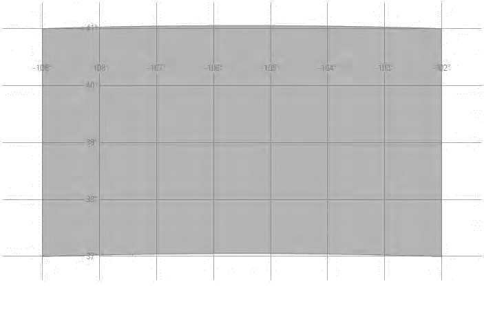

# 第七章 SQLCLR：架构与设计考量

## XML 序列化问题

我对结果 XML 的数据大小达到 105KB 感到惊讶，尽管 `HumanResources.Employee` 表本身只有 56KB 的数据。我尝试设置更短的列名，但这对大小影响甚微，并且造成了我认为难以维护的代码。

接下来，我设置了一个跟踪（trace）来收集 XML 序列化性能的一些概念（关于跟踪的更多信息，请参阅第三章）。跟踪结果显示，在我的系统上，前述查询的平均执行时间（在 1,000 次迭代中平均）为相当不令人满意的 3.9095 秒每次迭代。

经过一些试错，我发现通过使用 `TYPE` 指令可以提高 XML 序列化的性能，如下所示：

```sql
DECLARE @x xml;

SET @x = (
    SELECT *
    FROM HumanResources.Employee
    FOR XML RAW, ROOT('Employees'), TYPE
);
GO
```

这一改动将每次迭代的平均时间略微降低到 3.6687 秒——有所改进，但仍不是一个很好的结果。

### XML 反序列化

尽管 XML 序列化没有产生令人印象深刻的性能，我还是决定继续测试反序列化。第一个问题是从 XML 反序列化回表所需的代码。为了还原出我开始时完全相同的表，我必须为结果集显式定义每一列；这使得代码比我预期的要复杂得多。此外，由于 `XQuery` `value` 语法不支持 `hierarchyid` 数据类型，`OrganizationNode` 列中的值必须作为 `nvarchar` 读取，然后 `CAST` 为 `hierarchyid`。生成的代码如下：

```sql
DECLARE @x xml;

SET @x = (
    SELECT *
    FROM HumanResources.Employee
    FOR XML RAW, ROOT('Employees'), TYPE
);

SELECT
    col.value('@BusinessEntityID', 'int') AS BusinessEntityID,
    col.value('@NationalIDNumber', 'nvarchar(15)') AS NationalIDNumber,
    col.value('@LoginID', 'nvarchar(256)') AS LoginID,
    CAST(col.value('@OrganizationNode', 'nvarchar(256)') AS hierarchyid) AS OrganizationNode,
    col.value('@JobTitle', 'nvarchar(50)') AS JobTitle,
    col.value('@BirthDate', 'datetime') AS BirthDate,
    col.value('@MaritalStatus', 'nchar(1)') AS MaritalStatus,
    col.value('@Gender', 'nchar(1)') AS Gender,
    col.value('@HireDate', 'datetime') AS HireDate,
    col.value('@SalariedFlag', 'bit') AS SalariedFlag,
    col.value('@VacationHours', 'smallint') AS VacationHours,
    col.value('@SickLeaveHours', 'smallint') AS SickLeaveHours,
    col.value('@CurrentFlag', 'bit') AS CurrentFlag,
    col.value('@rowguid', 'uniqueidentifier') AS rowguid,
    col.value('@ModifiedDate', 'datetime') AS ModifiedDate
FROM @x.nodes('/Employees/row') x (col);
GO
```

下一个问题是性能。当我测试使用前面的查询反序列化 `XML` 时，性能从差劲变成了极其糟糕——平均每次迭代需要 6.8157 秒。

此时，我决定研究用于解决该问题的 `SQLCLR` 选项，重点关注重用潜力和性能。

### 使用 SQLCLR 进行二进制序列化

我的第一个想法是返回二进制序列化的 `DataTable`；为了实现这一点，我需要一种从 `CLR` 例程返回二进制格式数据的方法。这当然需要 .NET 的 `BinaryFormatter` 类，因此我创建了一个名为 `serialization_helper` 的类，该类在 `EXTERNAL_ACCESS` 程序集中编录（这是 `System.IO` 访问所必需的）：

```csharp
using System;
using System.Data;
using System.Data.SqlClient;
using System.Data.SqlTypes;
using Microsoft.SqlServer.Server;
using System.Security.Permissions;
using System.Runtime.Serialization.Formatters.Binary;

public partial class serialization_helper
{
    public static byte[] getBytes(object o)
    {
        SecurityPermission sp =
            new SecurityPermission(
                SecurityPermissionFlag.SerializationFormatter);
        sp.Assert();
        BinaryFormatter bf = new BinaryFormatter();
        using (System.IO.MemoryStream ms =
            new System.IO.MemoryStream())
        {
            bf.Serialize(ms, o);
            return(ms.ToArray());
        }
    }

    public static object getObject(byte[] theBytes)
    {
        using (System.IO.MemoryStream ms =
            new System.IO.MemoryStream(theBytes, false))
        {
            return(getObject(ms));
        }
    }

    public static object getObject(System.IO.Stream s)
    {
        SecurityPermission sp =
            new SecurityPermission(
                SecurityPermissionFlag.SerializationFormatter);
        sp.Assert();
        BinaryFormatter bf = new BinaryFormatter();
        return (bf.Deserialize(s));
    }
};
```

这个类的使用相当直接：要序列化一个对象，将其传递给 `getBytes` 方法。该方法首先使用断言（assertion）（如前所述）允许 `SAFE` 调用者使用它，然后使用二进制格式化器将对象序列化到 `Stream` 中。该流随后作为字节集合返回。

反序列化可以使用 `getObject` 方法的任一重载来完成。我发现根据场景的不同，我可能直接访问 `Stream` 或字节集合，因此创建两个重载是有意义的，而不是重复代码来相互转换。反序列化在运行前也使用断言，以允许调用代码被编录为 `SAFE`。

我获取数据的首次尝试是简单地将输入集加载到 `DataTable` 中，然后通过 `serialization_helper` 方法运行它。以下代码实现了一个名为 `GetDataTable_Binary` 的 `UDF`，它使用此逻辑：

```csharp
[Microsoft.SqlServer.Server.SqlFunction(
    DataAccess = DataAccessKind.Read)]
public static SqlBytes GetDataTable_Binary(string query)
{
    SqlConnection conn =
        new SqlConnection("context connection = true;");
    SqlCommand comm = new SqlCommand();
    comm.Connection = conn;
    comm.CommandText = query;
    SqlDataAdapter da = new SqlDataAdapter();
    da.SelectCommand = comm;
    DataTable dt = new DataTable();
    da.Fill(dt);
    // 序列化并返回输出
    return new SqlBytes(serialization_helper.getBytes(dt));
}
```

通过传入一个查询来调用此方法，该查询对应于你希望以二进制序列化形式获取的表，如下例所示：

```sql
DECLARE @sql nvarchar(max);
SET @sql = 'SELECT
    BusinessEntityID,
    NationalIDNumber,
    LoginID,
    OrganizationNode.ToString(),
    OrganizationLevel,
    JobTitle,
    BirthDate,
    MaritalStatus,
    Gender,
    HireDate,
    SalariedFlag,
    VacationHours,
    SickLeaveHours,
    CurrentFlag,
    rowguid,
    ModifiedDate
FROM HumanResources.Employee';

DECLARE @x varbinary(max);
SET @x = dbo.GetDataTable_Binary(@sql);
GO
```

> 注意：`hierarchyid` CLR 数据类型未标记为可序列化，因此在上面的查询中，我使用 `ToString()` 方法来序列化 `OrganizationNode` 值的字符串表示形式。

初步性能测试的结果非常令人鼓舞，显示平均序列化速度已降至仅 0.1437 秒——相比 XML 序列化方法有了巨大改进。

通过在序列化前将 `DataTable` 的 `RemotingFormat` 属性设置为 `Binary`，可以进一步提升二进制方法的性能：

```csharp
dt.RemotingFormat = SerializationFormat.Binary;
```

进行此更改后，性能更快——仅需 0.0576 秒。此外，生成的二进制数据大小现在仅为 68KB。

首次尝试的成功鼓舞了我，我决定研究是否存在其他 `SQLCLR` 方法可以进一步提升性能。经过几次我就不赘述细节的尝试后，我决定放弃 `DataTable`，转而使用另一个类：`SqlDataReader`。我致力于将数据提取到对象集合中，初步测试显示使用 `SqlDataReader` 的序列化性能与 `DataTable` 一样好，但输出大小更小。然而，这种方法本身也并非没有困难。


`DataTable` 的优势在于它是一个易于使用的整体单元，包含了所有数据以及相关的元数据。您无需关心列名、类型和大小，因为所有内容都会自动加载到 `DataTable` 中。而使用 `SqlDataReader` 则需要多做一些工作，因为它不能被序列化为一个单一单元，而是必须拆分成其组成部分。

由于我实现的代码有些复杂，我将带您逐段解读。首先，我在 `SqlFunctionAttribute` 上设置了 `DataAccessKind.Read` 属性，以允许该方法通过上下文连接访问数据。实例化了一个泛型 `List`，它将为每一行数据保存一个 `object` 集合，此外还有一个用于元数据。最后，实例化了 `SqlConnection`，并设置和执行了 `SqlCommand`：

## 第七章 „ SQLCLR：架构与设计考量

```
[Microsoft.SqlServer.Server.SqlFunction(
    DataAccess = DataAccessKind.Read)]
public static SqlBytes GetBinaryFromQueryResult(string query)
{
    List<object[]> theList = new List<object[]>();
    using (SqlConnection conn = 
        new SqlConnection("context connection = true;"))
    {
        SqlCommand comm = new SqlCommand();
        comm.Connection = conn;
        comm.CommandText = query;
        conn.Open();
        SqlDataReader read = comm.ExecuteReader();
```

下一步是从 `SqlDataReader` 中提取每个列的元数据。使用一个名为 `GetSchemaTable` 的方法来返回一个 `DataTable`，其中为每一列填充了一行数据。可用字段在 MSDN 文档库中有记录，但我接下来使用的代码是其中最常见的部分。

在用元数据填充 `object` 集合后，将其添加到输出的 `List` 中：

```
        DataTable dt = read.GetSchemaTable();
        // 从架构表中填充字段列表
        object[] fields = new object[dt.Rows.Count];
        for (int i = 0; i < fields.Length; i++)
        {
            object[] field = new object[5];
            field[0] = dt.Rows[i]["ColumnName"];
            field[1] = dt.Rows[i]["ProviderType"];
            field[2] = dt.Rows[i]["ColumnSize"];
            field[3] = dt.Rows[i]["NumericPrecision"];
            field[4] = dt.Rows[i]["NumericScale"];
            fields[i] = field;
        }
        // 将字段集合添加到输出列表
        theList.Add(fields);
```

最后，代码循环遍历查询返回的行，使用 `GetValues` 方法将每一行提取到一个 `object` 集合并添加到输出中。这个 `List` 被转换成一个 `object[]` 数组（更准确地说，是 `object[][]`），然后被序列化并返回给调用者。

``
        // 将所有行添加到输出列表
        while (read.Read())
        {
            object[] o = new object[read.FieldCount];
            read.GetValues(o);
            theList.Add(o);
        }
    }
    // 第七章 „ SQLCLR：架构与设计考量
    // 序列化并返回输出
    return new SqlBytes(
        serialization_helper.getBytes(theList.ToArray()));
}
```

创建好这个函数后，调用它几乎与调用 `GetDataTable_Binary` 完全相同：

```
DECLARE @sql nvarchar(max);
SET @sql = 'SELECT BusinessEntityID,
    NationalIDNumber,
    LoginID,
    OrganizationNode.ToString(),
    OrganizationLevel,
    JobTitle,
    BirthDate,
    MaritalStatus,
    Gender,
    HireDate,
    SalariedFlag,
    VacationHours,
    SickLeaveHours,
    CurrentFlag,
    rowguid,
    ModifiedDate FROM HumanResources.Employee'

DECLARE @x varbinary(max);
SET @x = dbo.GetBinaryFromQueryResult(@sql);
GO
```

结果是一个 57KB 的二进制数据，相比 `DataTable` 方法，大小减少了 15%。如果使用此方法在远程服务器上的代理实例之间传输数据，相关的网络流量减少可能对性能产生显著影响。更重要的是，使用 `SqlDataReader` 的序列化性能是迄今为止最快的，平均查询执行时间仅为 0.0490 秒。

### 二进制反序列化

对 SQLCLR 二进制序列化的结果感到满意，我决定继续进行反序列化。


# 第 7 章 SQLCLR：架构与设计考量

延续我对可重用潜力的强调，我认为存储过程会是比用户定义函数（UDF）更好的选择。存储过程不像 UDF 那样有固定的输出，因此任何输入表都可以被反序列化并返回，而无需担心违反列列表约定。

存储过程的前半部分如下：

`[Microsoft.SqlServer.Server.SqlProcedure]`

```csharp
public static void GetTableFromBinary(SqlBytes theTable)
{
    //反序列化输入
    object[] dt = (object[])(
        serialization_helper.getObject(theTable.Value));

    //首先，获取字段
    object[] fields = (object[])(dt[0]);
    SqlMetaData[] cols = new SqlMetaData[fields.Length];

    //遍历字段并填充 SqlMetaData 对象
    for (int i = 0; i < fields.Length; i++)
    {
        object[] field = (object[])(fields[i]);
        SqlDbType dbType = (SqlDbType)field[1];
```

将输入字节反序列化回对象集合后，该集合中的第一项（假定为列元数据）被转换为一个对象集合。对此集合进行逐项遍历，以创建输出的 `SqlMetaData` 对象，这些对象将用于将数据流式传输回调用方。

设置过程中最棘手的部分在于，每种 SQL Server 数据类型都需要一个不同的 `SqlMetaData` 重载。`decimal` 需要精度和小数位数设置；字符和二进制类型需要大小；而对于其他类型，大小、精度和小数位数都不适用。下面的 switch 语句处理了 `SqlMetaData` 实例的创建：

```csharp
        //根据数据类型的不同，
        //需要不同的 SqlMetaData 重载
        switch (dbType)
        {
            case SqlDbType.Decimal:
                cols[i] = new SqlMetaData(
                    (string)field[0],
                    dbType,
                    (byte)field[3],
                    (byte)field[4]);
                break;

            case SqlDbType.Binary:
            case SqlDbType.Char:
            case SqlDbType.NChar:
            case SqlDbType.NVarChar:
            case SqlDbType.VarBinary:
            case SqlDbType.VarChar:
                switch ((int)field[2])
                {
                    //如果是 MAX 类型，则使用 -1 作为大小
                    case 2147483647:
                        cols[i] = new SqlMetaData(
                            (string)field[0],
                            dbType,
                            -1);
                        break;
                    default:
                        cols[i] = new SqlMetaData(
                            (string)field[0],
                            dbType,
                            (long)((int)field[2]));
                        break;
                }
                break;

            default:
                cols[i] = new SqlMetaData(
                    (string)field[0],
                    dbType);
                break;
        }
    }
```

列集合填充完成后，即可使用 `SqlPipe` 类的 `SendResults` 方法将数据发送回调用方。启动流之后，输入集合中剩余的对象会被遍历、强制转换为 `object[]`，并作为 `SqlDataRecords` 发送回去：

```csharp
    //开始结果流
    SqlDataRecord rec = new SqlDataRecord(cols);
    SqlContext.Pipe.SendResultsStart(rec);

    for (int i = 1; i < dt.Length; i++)
    {
        rec.SetValues((object[])dt[i]);
        SqlContext.Pipe.SendResultsRow(rec);
    }

    //结束结果流
    SqlContext.Pipe.SendResultsEnd();
}
```

不仅二进制序列化测试取得了积极的结果，而且事实证明，以此方式准备的数据进行反序列化，其速度远超其他方法。性能测试显示，反序列化 `SqlDataReader` 数据的平均时间仅为 `0.2666` 秒——比反序列化类似的 XML 数据快了一个数量级。

本节讨论的三种方法各自最快优化版本的结果如表 7-1 所示。

*表 7-1. 不同序列化方法的结果*

`方法`
`平均序列化时间`
`平均反序列化时间`
`大小`

`XML (使用 TYPE)`
`3.6687`
`6.8157`
`105KB`

`二进制 (DataTable)`
`0.0576`
`—`
`68KB`

`二进制 (SqlDataReader)`
`0.0490`
`0.2666`
`57KB`

此示例展示了更好的网络利用率与快得多的序列化/反序列化相结合的效果，说明了在横向扩展和分布式处理场景中，SQLCLR 如何成为在 Service Broker 实例之间传输表数据的一项出色技术。

## 总结

充分利用 SQLCLR 例程需要投入一些思考。前期的设计和架构考量将在安全性、可靠性和性能方面带来巨大收益。

在每个阶段，你也应考虑可重用性，以最小化当你在半年或一年后需要相同功能时必须完成的工作量。如果你已经编写过一次，为何还要再编写一次？

为了说明这些概念，我展示了一个使用 `BinaryFormatter` 序列化表的示例，该示例可用于扩展 SQL Server Service Broker。我使用了一组通用的、核心的、更高权限的实用程序程序集，以限制外部表面面积，并尝试设计该解决方案以提升灵活性，使其能够在代码的生命周期内用于众多项目。

# 第 8 章 动态 T-SQL

任何软件应用程序的总体目标都是提供一致、可靠的功能，使用户能够以有效的方式执行给定任务。因此，实现这一目标的第一步是保持应用程序无错误且按设计运行，达到预期标准。然而，一旦满足了这些基本要求，下一步就是尝试创造出色的用户体验，这就引出了一个问题：“用户想要什么？”答案往往是用户希望拥有灵活的界面，让他们能够以自己想要的方式控制数据。软件客户支持团队经常收到关于略微不同的排序顺序、筛选机制或数据输出的请求，这使得应用程序必须被设计为支持沿着这些方向的扩展性。

与其他数据相关的开发挑战一样，对灵活数据输出的此类请求往往会向下渗透到应用层次结构中，最终落到数据库（以及数据库开发人员）上。这在基于 Web 的应用程序开发中尤其如此，因为启用排序和筛选的客户端网格控件仍然相对较少，而且许多应用程序仍然使用轻量级的两层模型，没有专门的业务层来处理数据缓存和筛选。

数据库中的“灵活性”可以意味着许多事情，在我多年来参与的应用程序中，我遇到过一些非常有趣的方法，通常涉及创建大量的存储过程或复杂的嵌套控制流块。这些解决方案似乎总是弊大于利，并通过在数据库层引入大量额外的复杂性，使应用程序开发变得比原本困难得多。

在本章中，我将讨论如何使用动态 SQL 来解决这些问题，以及如何创建更灵活的存储过程。一些 DBA 和开发人员鄙视动态 SQL，通常认为它会导致性能、安全性或可维护性问题，而在许多情况下，只是因为他们不了解如何正确使用它。动态 SQL 是一个强大的工具，如果使用得当，它将是数据库开发人员工具箱中的巨大资产。关于它是什么以及何时或为何应该使用，存在很多错误信息和误解，我希望在本章中澄清一些迷思和误解。

*注意* 在本章中，我将用笔记本电脑上记录的性能测量和计时来说明对各种方法的讨论。有关如何在您自己的系统环境中捕获这些测量的更多信息，请参阅第 3 章中关于性能监控工具的讨论。

## 动态 T-SQL 与即席 T-SQL


# 动态 SQL 使用探讨

在开始深入讨论如何使用动态 SQL 之前，首先需要明确一些术语。在数据库领域，关于 SQL 的两个术语常常被混用：**dynamic**（动态）和 **ad hoc**（临时）。在本章中，我对这两个术语定义如下：

*   临时 SQL（Ad hoc SQL）是在应用层生成并发送到 SQL Server 执行的任何 SQL 批处理。这包括本书中几乎所有的代码示例，这些示例都是通过 SQL Server Management Studio 输入和提交的。
*   另一方面，动态 SQL（Dynamic SQL）是 *在 T-SQL 中* 生成并使用 `EXECUTE` 语句执行，或者更推荐使用 `sp_executesql` 系统存储过程（本章稍后介绍）执行的 SQL 批处理。

本章大部分内容将重点介绍如何使用存储过程来有效利用动态 SQL。

然而，如果你是那些使用不采用存储过程的系统的开发者之一，我建议你至少阅读“SQL 注入”和“编译与参数化”这两个部分。这两个部分无疑也适用于临时 SQL 场景，并且极其重要。

综上所述，我不建议在应用开发中使用临时 SQL，并且认为许多潜在的问题（特别是影响应用程序安全性和性能的问题）可以通过使用存储过程来避免。

## 存储过程与临时 SQL 之争

数据库开发社区成员之间似乎存在一场永无止境的争论，焦点在于数据库应用开发是否应该使用存储过程。

这场辩论可能变得相当激烈，支持测试驱动开发（TDD）等快速软件开发方法的人声称存储过程会拖慢他们的流程，而对象关系映射（ORM）技术的拥护者则声称这些技术优于存储过程。我强烈建议你搜索网络以了解这些争论并得出你自己的结论。就我个人而言，我非常倾向于使用存储过程，原因如下，我将在此简要讨论。

首先也是最重要的，存储过程在数据库和应用程序之间创建了一个抽象层，隐藏了模式的细节，有时也隐藏了数据的细节。将数据逻辑封装在存储过程内大大降低了数据库和应用程序之间的耦合，这意味着对数据库的维护或修改不需要相应地改变应用程序。减少这些依赖性并将数据库视为一个数据 API，而不是一个简单的应用持久层，能够实现灵活的应用程序开发过程。通常，这可以允许数据库和应用层并行开发，而不是按顺序开发，从而在给定项目上实现更大规模的人力资源扩展。有关封装、耦合以及将数据库视为 API 等概念的更多信息，请参见第 1 章。

如果存储过程定义得当，具有记录良好且一致的输出，测试绝不会受到阻碍——可以轻松创建单元测试（如第 3 章所示）以支持 TDD。

此外，得益于存储过程，支持更先进的测试方法也变得更容易，而不是更困难。例如，考虑使用 **mock objects**（模拟对象）——返回特定已知值的 façade 方法。在测试场景中，模拟对象可以替代真实方法，以便可以单独测试任何给定的方法，而无需同时测试它调用的任何方法（被测试方法内部的任何调用实际上都将是对方法的模拟版本的调用）。当使用存储过程时，这种技术实际上更容易实现，因为可以轻松创建模拟存储过程并将其换入换出，而不会中断或重新编译正在测试的应用程序代码。

另一个重要问题是安全性。临时 SQL（以及动态 SQL）带来了各种安全挑战，包括可能打开攻击向量，以及使得以声明式而非编程方式强制执行数据访问安全性变得更加困难。这意味着，通过使用临时 SQL，你的应用程序可能更容易被黑客攻击，并且你可能无法依赖 SQL Server 来保护数据访问。最终结果是需要进行更高程度的测试，以确保安全漏洞得到适当修补，并且用户（无论是授权用户还是未授权用户）无法访问他们本不应看到的数据。有关这些观点的进一步讨论，请参见“动态 SQL 安全注意事项”部分。

最后，我将讨论在线辩论似乎总是倾向于的最热门问题，当然，那就是性能问题。临时 SQL 的支持者提出了一个有效的观点，由于最新版本的 SQL Server 对查询计划缓存的支持更好，存储过程与临时查询相比不再具有显著的性能优势。虽然这听起来像是一个不使用存储过程的绝佳理由，但我个人认为这是一个不成问题的问题。在性能相当的情况下，我认为显而易见的选择是更易于维护和更安全的选项（即存储过程）。

归根结底，存储过程与临时 SQL 的问题实际上是关于目的的问题。ORM 社区中的许多人认为数据库应该只用作一个非常简单的对象持久层，并且可能对只有一个表、只有两列（一个用于标识对象 ID 的 GUID 和一个用于序列化对象图的 XML 列）的数据库完全满意。

在我看来，数据库远不止是数据的集合。它还是数据规则的执行者、数据完整性的保护者，以及可以跨多个应用程序共享的中央数据资源。

基于这些原因，我认为基于解耦的存储过程的设计是最佳选择。

## 为何选择动态 SQL？

正如本章引言所述，动态 SQL 可以帮助创建更灵活的数据访问层，从而帮助实现更灵活的应用程序，这会让用户更满意。这是一个正当的目标，但事实是，动态 SQL 只是实现预期最终结果的一种手段。在许多桌面应用程序中，直接在客户端进行动态排序和过滤是完全可能的——事实上通常是更可取的——或者在业务层（如果存在）中进行，以支持基于 Web 或客户端-服务器风格的桌面应用程序。也可以完全不采用动态 SQL，通过支持提供可选参数的静态存储过程来实现——但这通常不被推荐，因为它可能很快导致代码非常笨拙且难以维护，正如本章后面的“通过静态 T-SQL 实现可选参数”部分将演示的那样。

在承诺采用任何基于数据库的解决方案之前，请确定它是否确实是正确的行动方针。请牢记性能、可维护性以及最重要的可扩展性问题。

数据库资源通常是特定应用程序使用的任何资源中负担最重的，而数据的动态排序和过滤可能意味着给数据库带来更多负载。请记住，扩展数据库通常比扩展应用程序的其他层要昂贵得多。


# 第八章：动态 T-SQL

例如，考虑数据排序的问题。为了使数据库能够排序数据，必须先查询数据。这意味着数据必须从磁盘或内存中读取，从而使用 I/O 和 CPU 时间，经过适当筛选，最后排序并返回给调用者。每次需要以不同方式重新排序数据时，都必须重新读取或在内存中重新排序，并由数据库引擎重新筛选。

如果有成百上千的用户都试图以不同方式排序数据，并且共享同一数据库服务器上的资源，这些操作累积起来可能会造成相当大的负载。

由于这个问题，如果相同的数据被反复重新排序（例如，一个用户想要查看各种高点或低点数据），在**断开连接的缓存**中完成这项工作通常是有意义的。例如，一个使用客户端数据网格的桌面应用程序，可以只加载一次数据，然后使用客户端计算机的资源进行排序和重新排序，而不是使用数据库服务器的资源。这可以大大减轻数据库服务器的压力，意味着它可以将资源用于其他数据密集型操作。

除了可扩展性问题之外，重要的是要注意，基于数据库的解决方案可能很棘手，且难以测试和维护。我在“走向动态：使用 EXECUTE”一节中提供了一些建议，但请记住，对于这些目的，过程式代码可能比 T-SQL 更容易处理。

一旦你用尽了所有其他资源，*只有那时*才应将数据库视为动态操作的解决方案。在数据库层，使用动态 SQL 还是静态 SQL 的问题，归根结底是可维护性和性能两方面的问题。事实上，对于许多动态案例，动态 SQL 可以比简单的静态 SQL 表现出更好的性能，但更复杂（且更难维护）的静态 SQL 通常会比可维护的动态 SQL 解决方案性能更优。为了在维护和性能之间取得最佳平衡，我总是倾向于选择动态 SQL 解决方案。

## 编译与参数化

任何关于动态 SQL 和性能的讨论，如果不包含关于 SQL Server 如何处理查询并缓存其计划的基本背景信息，都是不完整的。为此，我将在此简要讨论一下，并提供一些示例，帮助你开始在 SQL Server 中研究这些行为。

SQL Server 执行的每个查询在查询处理器实际执行之前，都会经历一个编译阶段。此编译会产生所谓的`查询计划`，它告诉查询处理器如何物理访问数据库中的表和索引以满足查询。然而，对于某些查询，查询编译可能代价高昂，当相同的查询或查询类型被反复执行时，通常没有理由每次都进行编译。

为了节省编译成本，SQL Server 将查询计划缓存到一个名为`查询计划缓存`的内存池中。

`查询计划缓存`使用基于查询确切文本的简单哈希查找，以找到先前已编译的计划。如果确切的查询已经被编译过，则没有理由重新编译，SQL Server 会直接跳到执行阶段，以便为调用者获取结果。

如果未找到查询的已编译版本，则采取的第一步是解析查询。SQL Server 确定 SQL 中正在执行哪些操作，验证使用的语法，并生成`解析树`，这是一种以规范化形式包含查询信息的结构。`解析树`会进一步被验证，并最终编译成一个`查询计划`，该计划被放入`查询计划缓存`中，供查询的未来调用使用。

`查询计划缓存`对执行时间的影响即使在简单查询中也能看到。为了演示这一点，首先使用`DBCC FREEPROCCACHE`命令清空缓存：

```
DBCC FREEPROCCACHE
```


# 第八章：动态 T-SQL

## 查询计划缓存与编译时间

`DBCC FREEPROCCACHE;`

`GO`

请记住，此命令会清除整个 SQL Server 实例的缓存——通常不建议在生产环境中这样做。然后，要查看查询在解析和编译阶段所花费的时间，可以打开 SQL Server 的 `SET STATISTICS TIME` 选项，这会导致 SQL Server 输出有关解析/编译和执行所花费时间的信息性消息：

`SET STATISTICS TIME ON;`

`GO`

现在考虑以下 T-SQL，它查询 `AdventureWorks2008` 数据库中的 `HumanResources.Employee` 表：

`注意`：从 SQL Server 2008 开始，SQL Server 不再附带任何示例数据库。要遵循本章中的代码清单，您需要从 CodePlex 网站（网址为 http://msftdbprodsamples.codeplex.com）下载并安装 `AdventureWorks2008` 数据库。

```sql
SELECT *
FROM HumanResources.Employee
WHERE BusinessEntityId IN (1, 2);
GO
```

在我的系统上，在 SQL Server Management Studio 中首次运行此查询会产生以下输出消息：

```
SQL Server parse and compile time:
   CPU time = 0 ms, elapsed time = 12 ms.
(2 row(s) affected)
SQL Server Execution Times:
   CPU time = 0 ms, elapsed time = 1 ms.
```

此查询花费了 12 毫秒进行解析和编译。但后续运行会产生以下输出，表明正在使用缓存的计划：

```
SQL Server parse and compile time:
   CPU time = 0 ms, elapsed time = 1 ms.
(2 row(s) affected)
SQL Server Execution Times:
   CPU time = 0 ms, elapsed time = 1 ms.
```

由于缓存计划的存在，查询的每次后续调用比第一次调用少花费 11 毫秒——考虑到实际执行时间小于 1 毫秒（时间统计报告的最低耗时），这已经很不错了。

## 自动参数化

解析过程的一个重要部分（在某些情况下使查询计划缓存更高效）涉及确定查询的哪些部分符合参数的条件。如果 SQL Server 确定查询中使用的一个或多个字面量是参数，并且可能在将来对类似版本查询的调用中更改，它可以 `自动参数化` 该查询。为了理解这意味着什么，让我们首先通过 `sys.dm_exec_cached_plans` 动态管理视图和 `sys.dm_exec_sql_text` 函数查看查询计划缓存的内容。以下查询查找所有包含字符串 “HumanResources” 的缓存查询，排除那些包含 `sys.dm_exec_cached_plans` 视图名称本身的查询——第二个谓词是必要的，这样结果中就不会包含此查询本身的计划。

```sql
SELECT
   cp.objtype,
   st.text
FROM sys.dm_exec_cached_plans cp
CROSS APPLY sys.dm_exec_sql_text(cp.plan_handle) st
WHERE
   st.text LIKE '%HumanResources%'
   AND st.text NOT LIKE '%sys.dm_exec_cached_plans%';
GO
```

`注意`：我将在本节中多次重用此代码来检查不同类型的查询的计划缓存，因此您可能希望将其在单独的 Management Studio 选项卡中打开。

在对 `HumanResources.Employee` 执行前面的查询后运行此代码清单，会得到以下结果：

```
objtype text
------- ----
Adhoc   SELECT * FROM HumanResources.Employee WHERE BusinessEntityId IN (1, 2);
```

这里需要注意的重要事项是，`objtype` 列表明该查询被视为 `Adhoc`（即席查询），并且 `Text` 列显示了已执行查询的确切文本。无法自动参数化的查询被查询引擎分类为“ad hoc”（即席查询，请注意，这与我使用的定义略有不同）。

前面的示例查询被用来保持简单性，正是因为它不能被自动参数化。而下面的查询可以自动参数化：

```sql
SELECT *
FROM HumanResources.Employee
WHERE BusinessEntityId = 1;
GO
```


# 第 8 章 - 动态 T-SQL

`sys.dm_exec_cached_plans` 如前所述，其输出结果如下所示：

```
objtype text
Adhoc SELECT * FROM HumanResources.Employee WHERE BusinessEntityId = 1;
Prepared (@1 tinyint)SELECT * FROM [HumanResources].[Employee] WHERE [BusinessEntityId]=@1
```

在这种情况下，已生成两个计划：一个是针对查询确切文本的 `Adhoc` 计划，另一个是针对该查询自动参数化版本的 `Prepared` 计划。查看后一个计划的文本，可以注意到查询已被规范化（对象名称用方括号限定，删除了回车符和其他多余的空白等），并且已从查询文本中推导出一个参数。

这种自动参数化的好处在于，随后提交给 SQL Server 的、能够自动参数化为相同规范化形式的查询，可能能够利用已准备好的查询计划，从而避免编译开销。

> **注意：** 此处展示的自动参数化示例基于 `AdventureWorks2008` 数据库的默认设置，包括“简单参数化”选项。SQL Server 2008 包含一种更强大的自动参数化形式，称为“强制参数化”。此选项使 SQL Server 尽可能地尝试自动参数化查询，这意味着在某些情况下查询编译成本会更高。这对于使用大量未参数化即席查询的应用程序可能非常有益，但在其他情况下可能导致性能下降。有关强制参数化的更多信息，请参见 http://msdn.microsoft.com/en-us/library/ms175037.aspx。

## 应用程序级参数化

自动参数化并不是查询可以参数化的唯一方式。对于即席 SQL，在应用程序级别可能存在其他形式的参数化；或者在存储过程中使用动态 SQL 时，在 T-SQL 内部也可能实现参数化。本章稍后的章节 `sp_executesql：更优的 EXECUTE` 描述了如何对动态 SQL 进行参数化，但这里我将简要讨论应用程序级参数化。

每个能够与 SQL Server 通信的查询框架都支持远程过程调用（`RPC`）的概念来调用查询。在 `RPC` 调用的情况下，参数是绑定且强类型的，而不是编码为字符串并与查询文本的其余部分一起传递。

从性能角度来看，以这种方式对查询进行参数化有一个关键优势：应用程序告诉 SQL Server 参数是什么；SQL Server 不需要（也不会）自己尝试去寻找它们。

要查看实际的程序级参数化，以下代码清单演示了如何通过 `ADO.NET` 发出参数化查询所需的 C# 代码，方法是在准备查询时填充 `SqlCommand` 对象上的 `Parameters` 集合。

```csharp
SqlConnection sqlConn = new SqlConnection(
"Data Source=localhost; Initial Catalog=AdventureWorks2008; Integrated Security=SSPI");
sqlConn.Open();
SqlCommand cmd = new SqlCommand(
"SELECT * FROM HumanResources.Employee WHERE BusinessEntityId IN (@Emp1, @Emp2)", sqlConn);
SqlParameter param = new SqlParameter("@Emp1", SqlDbType.Int);
param.Value = 1;
cmd.Parameters.Add(param);
SqlParameter param2 = new SqlParameter("@Emp2", SqlDbType.Int);
param2.Value = 2;
cmd.Parameters.Add(param2);
cmd.ExecuteNonQuery();
sqlConn.Close();
```

> **注意：** 您需要更改上述代码清单中 `SqlConnection` 对象使用的连接字符串，以匹配您的服务器。

请注意，基础查询与本章展示的第一个查询相同，该查询在通过 Management Studio 作为 T-SQL 查询发出时，无法被 SQL Server 自动参数化。然而，在此情况下，字面量员工 ID 已被替换为变量 `@EmpId1` 和 `@EmpId2`。

执行此代码清单，然后使用上一节的查询再次检查 `sys.dm_exec_cached_plans` 视图，将得到以下结果：

```
objtype text
```


# 动态 T-SQL

## 预编译查询与执行计划标准化

```
Prepared (@Emp1 int,@Emp2 int)SELECT * FROM HumanResources.Employee

WHERE BusinessEntityId IN (@Emp1, @Emp2)
```

与自动参数化查询类似，该执行计划是预编译的，且查询文本前缀了参数。但是，请注意，查询的文本并未被标准化。对象名称没有方括号界定，而且虽然可能不明显，但空白符也未被移除。这一点至关重要！如果你运行同一个查询但使用了稍微不同的格式，你将会得到第二个执行计划——因此，在使用参数化查询时，请确保生成查询的应用程序每次都产生完全相同的格式。否则，你最终将浪费不必要的编译所需的 CPU 周期以及用于缓存额外计划的内存。

> **`注意`** 空白符并非唯一能影响执行计划重用的格式类型。缓存查找机制不过是对查询文本进行简单的哈希运算，并且它是大小写敏感的。因此，一个大小写不同的相同查询被提交两次，在缓存看来会被视为两个不同的查询——即使是在大小写不敏感的服务器上。在使用 SQL Server 时，尽量保持大小写和格式的一致性始终是一个好主意。这不仅使你的代码更具可读性，还可能最终提升性能！

## 参数化与缓存的性能影响

既然所有背景信息都已介绍完毕，那个迫切的问题便可以得到解答：你为何应该关心，以及这一切与动态 SQL 有何关联？答案当然是，如果你关心性能（以及其他问题，我们很快会讲到），那么这与动态 SQL 有着莫大的关系。

例如，假设我们将之前的应用程序代码放入一个循环中——调用同一个查询 2,000 次，并且每次迭代只更改提供的参数值：

```
SqlConnection sqlConn = new SqlConnection(
    "Data Source=localhost;" +
    "Initial Catalog=AdventureWorks2008;" +
    "Integrated Security=SSPI");

sqlConn.Open();

for (int i = 1; i <= 2000; i++)
{
    SqlCommand cmd = new SqlCommand(
        "SELECT * FROM HumanResources.Employee " +
        "WHERE BusinessEntityId IN (@Emp1, @Emp2)",
        sqlConn);

    SqlParameter param = new SqlParameter("@Emp1", SqlDbType.Int);
    param.Value = i;
    cmd.Parameters.Add(param);

    SqlParameter param2 = new SqlParameter("@Emp2", SqlDbType.Int);
    param2.Value = i + 1;
    cmd.Parameters.Add(param2);

    cmd.ExecuteNonQuery();
}

sqlConn.Close();
```

再次回到 SQL Server Management Studio 并查询 `sys.dm_exec_cached_plans` 视图，你会发现结果并未改变。尽管这个查询刚刚以不同的参数值运行了 2,000 次，但缓存中针对此形式的查询只有一个执行计划：

```
objtype text
------- -----------------------------------------------------------------
Prepared (@Emp1 int,@Emp2 int)SELECT * FROM HumanResources.Employee
                              WHERE BusinessEntityId IN (@Emp1, @Emp2)
```

这个结果表明参数化正在生效，服务器不需要在每次提交一个形式略有不同的查询时都进行额外的编译工作。

既然已经建立了积极的基准线，现在让我们来研究一下当查询*没有*被正确参数化时会发生什么。考虑一下，如果我们把应用程序代码循环设计成如下形式，将会发生什么：

```
SqlConnection sqlConn = new SqlConnection(
    "Data Source=localhost;" +
    "Initial Catalog=AdventureWorks2008;" +
    "Integrated Security=SSPI");

sqlConn.Open();

for (int i = 1; i < 2000; i++)
{
    SqlCommand cmd = new SqlCommand(
        "SELECT * FROM HumanResources.Employee " +
        "WHERE BusinessEntityId IN (" + i + ", " + (i+1) + ")",
        sqlConn);

    cmd.ExecuteNonQuery();
}

sqlConn.Close();
```

运行此代码后，查询执行计划缓存的简化结果如下所示：

```
objtype text
------- -----------------------------------------------------------------------------------------
Adhoc   SELECT * FROM HumanResources.Employee WHERE BusinessEntityId IN (1, 2)
Adhoc   SELECT * FROM HumanResources.Employee WHERE BusinessEntityId IN (2, 3)
```


# 非参数化查询的性能与资源问题

`Adhoc SELECT * FROM HumanResources.Employee WHERE BusinessEntityId IN (3, 4)`

...1,995 行之后...

`Adhoc SELECT * FROM HumanResources.Employee WHERE BusinessEntityId IN (1998...`

`Adhoc SELECT * FROM HumanResources.Employee WHERE BusinessEntityId IN (1999...`

运行 2,000 个带有不同参数的非参数化即席查询会导致生成 2,000 个额外的缓存计划。这意味着查询执行不仅会因为额外的编译而经历性能下降，而且查询计划缓存中还会浪费相当多的 RAM。在 SQL Server 2008 中，查询计划会按照最近最少使用（LRU）的原则从计划缓存中老化退出，而根据服务器的工作负载情况，未使用的计划可能需要很长时间才能被清除。

在大型生产环境中，不使用参数化查询可能导致数 GB 的 RAM 被浪费在缓存那些永远不会再被使用的查询计划上。这显然不是件好事！

所以，为了那些宝贵的 RAM——请学会使用你的连接库的参数化查询功能，避免陷入这个陷阱。

## 支持可选参数

动态 SQL 最常被引用的用例是能够以高效、可维护的方式编写支持可选查询参数的存储过程。尽管编写处理可选查询参数的静态存储过程相当容易，但这些过程通常要么效率极差，要么难以维护——作为开发者，你只能二选一。

## 通过静态 T-SQL 处理可选参数

在介绍可选参数问题的动态 SQL 解决方案之前，有必要通过几个演示来说明为什么静态 SQL 并`不是`完成这项工作的合适工具。有几种不同的方法可以创建支持可选参数的静态查询，其复杂性和有效性各不相同，但每种解决方案都存在缺陷。

作为基准，考虑以下查询，它从 AdventureWorks2008 数据库的 `HumanResources.Employee` 表中选择一行数据：

```sql
SELECT
    BusinessEntityID,
    LoginID,
    JobTitle
FROM
    HumanResources.Employee
WHERE
    BusinessEntityID = 28
    AND NationalIDNumber = N'14417807';
GO
```

该查询使用谓词对 `BusinessEntityID` 和 `NationalIDNumber` 两列进行筛选。

执行该查询会产生如图 8-1 所示的执行计划，其估计开销为 0.0032831，并且需要两次逻辑读取。该计划涉及对表聚集索引的搜索，该索引使用 `BusinessEntityID` 列作为其键。

*图 8-1. 在 `BusinessEntityID` 聚集索引上进行搜索的基础执行计划*

由于查询使用了聚集索引，因此不需要进行查找来获取任何额外数据。此外，由于 `BusinessEntityID` 是表的主键，在物理识别行时并不使用 `NationalIDNumber` 谓词。因此，仅使用 `BusinessEntityId` 谓词的以下查询会产生完全相同的查询计划，具有相同的开销和读取次数：

```sql
SELECT
    BusinessEntityID,
    LoginID,
    JobTitle
FROM
    HumanResources.Employee
WHERE
    BusinessEntityID = 28;
GO
```

这种查询的另一种形式是移除 `BusinessEntityID`，仅基于 `NationalIDNumber` 进行查询：

```sql
SELECT
    BusinessEntityID,
    LoginID,
    JobTitle
FROM
    HumanResources.Employee
WHERE
    NationalIDNumber = N'14417807';
GO
```

由于必须使用不同的索引来满足查询，此查询产生的计划与前两个非常不同。图 8-2 显示了结果计划，该计划涉及对 `NationalIDNumber` 列上非聚集索引的搜索，然后进行查找以获取 `SELECT` 列表所需的额外行。该计划的估计开销为 0.0065704，并执行四次逻辑读取。

*图 8-2. 在 `NationalIDNumber` 非聚集索引上进行搜索，然后在聚集索引中进行查找的基础执行计划*

基础查询的最后一种形式没有任何谓词：

```sql
SELECT
    BusinessEntityID,
    LoginID,
```


# 第 8 章 动态 T-SQL

## 图 8-3. 基于聚集索引扫描的基础执行计划

如图 8-3 所示，本例中的查询计划是一个简单的聚集索引扫描，估计开销为 0.0080454，逻辑读取次数为 9 次。由于需要返回所有行，且没有索引覆盖所需的所有列，因此聚集索引扫描是满足此查询的最有效方式。

这些基线数据将用于比较创建动态存储过程的各种方法的相对性能，这些过程返回相同的列，但可选择地根据`BusinessEntityID`和`NationalIDNumber`中的一个或两个谓词对返回的行进行过滤。首先，可以将查询包装在存储过程中：

```sql
CREATE PROCEDURE GetEmployeeData
    @BusinessEntityID int = NULL,
    @NationalIDNumber nvarchar(15) = NULL
AS
BEGIN
    SET NOCOUNT ON;

    SELECT
        BusinessEntityID,
        LoginID,
        JobTitle
    FROM
        HumanResources.Employee
    WHERE
        BusinessEntityID = @BusinessEntityID
        AND NationalIDNumber = @NationalIDNumber;
END;
GO
```

此存储过程使用参数`@BusinessEntityID`和`@NationalIDNumber`来支持谓词。这两个参数都是可选的，默认值为`NULL`。然而，此存储过程并未真正可选地支持这些参数；不传递其中一个参数将意味着存储过程根本不会返回任何行，因为在谓词中与`NULL`进行任何比较都不会得出`TRUE`的结果。

作为使此存储过程支持可选谓词的首次尝试，开发人员可能会尝试使用控制流语句重写该过程，如下所示：

```sql
ALTER PROCEDURE GetEmployeeData
    @BusinessEntityID int = NULL,
    @NationalIDNumber nvarchar (15) = NULL
AS
BEGIN
    SET NOCOUNT ON;

    IF (@BusinessEntityID IS NOT NULL AND @NationalIDNumber IS NOT NULL)
    BEGIN
        SELECT
            BusinessEntityID,
            LoginID,
            JobTitle
        FROM
            HumanResources.Employee
        WHERE
            BusinessEntityID = @BusinessEntityID
            AND NationalIDNumber = @NationalIDNumber;
    END
    ELSE IF (@BusinessEntityID IS NOT NULL)
    BEGIN
        SELECT
            BusinessEntityID,
            LoginID,
            JobTitle
        FROM
            HumanResources.Employee
        WHERE
            BusinessEntityID = @BusinessEntityID;
    END
    ELSE IF (@NationalIDNumber IS NOT NULL)
    BEGIN
        SELECT
            BusinessEntityID,
            LoginID,
            JobTitle
        FROM
            HumanResources.Employee
        WHERE
            NationalIDNumber = @NationalIDNumber;
    END
    ELSE
    BEGIN
        SELECT
            BusinessEntityID,
            LoginID,
            JobTitle
        FROM
            HumanResources.Employee;
    END
END;
GO
```

尽管执行此存储过程产生的查询计划与测试批处理中创建的等效单独查询完全相同——因此性能也完全相同——但它存在一个不幸的问题。即，采用这种方法将原本非常简单的 10 行存储过程变成了一个 42 行的庞然大物。

为此过程的选择列表添加一个列，就需要在四个地方进行更改。现在考虑如果需要第三个谓词会发生什么——情况数量将从四个跃升至八个，这意味着任何更改（如添加或删除列）都必须在八个地方进行。现在考虑 10 或 20 个谓词，显然这种方法在 SQL Server 开发人员的工具箱中没有立足之地。它根本不是一个可管理的解决方案。

下一个最常见的技术在过去几年中出现在多个 SQL Server 网站的文章中。因此，许多开发人员基于此编写了大量代码，而他们似乎没有意识到自己正在制造一颗性能定时炸弹。此技术利用了`COALESCE`函数，如以下重写的存储过程版本所示：

```sql
ALTER PROCEDURE GetEmployeeData
    @BusinessEntityID int = NULL,
    @NationalIDNumber nvarchar(15) = NULL
AS
BEGIN
    SET NOCOUNT ON;

    SELECT
        BusinessEntityID,
        LoginID,
        JobTitle
    FROM
        HumanResources.Employee
    WHERE
        BusinessEntityID = COALESCE(@BusinessEntityID, BusinessEntityID)
        AND NationalIDNumber = COALESCE(@NationalIDNumber, NationalIDNumber);
END;
GO
```


此版本的存储过程看起来很棒，也易于理解。`COALESCE` 函数会返回传入其参数列表中的第一个 `NULL` 值。因此，如果存储过程的任一参数为 `NULL`，`COALESCE` 将会“直通”，将列的值与其自身进行比较——至少在理论上，这似乎不需要任何处理，因为它总是成立的。

不幸的是，由于 `COALESCE` 函数将表中的列用作输入，它无法在查询执行前进行确定性求解。结果是，无论提供何种参数组合，该函数都会针对表的每一行求解一次。这导致了*一致的*性能结果，但可能不是好的那种；所有四种参数组合都产生了相同的查询计划：一次聚集索引扫描，估计开销为 `0.0080454`，并产生九次逻辑读取。这比涉及 `BusinessEntityID` 列的查询的 I/O 高出四倍多——性能消耗相当大。

## 使用 OR

类似于使用 `COALESCE` 的版本，有一个版本使用 `OR` 来仅在参数不为 `NULL` 时有条件地设置参数：

```sql
ALTER PROCEDURE GetEmployeeData
    @BusinessEntityID int = NULL,
    @NationalIDNumber nvarchar(15) = NULL
AS
BEGIN
    SET NOCOUNT ON;

    SELECT
        BusinessEntityID,
        LoginID,
        JobTitle
    FROM
        HumanResources.Employee
    WHERE
        (@BusinessEntityID IS NULL OR BusinessEntityID = @BusinessEntityID)
        AND (@NationalIDNumber IS NULL OR @NationalIDNumber = NationalIDNumber);
END;
GO
```

这个版本，虽然在思路上与使用 `COALESCE` 的版本相似，但具有一些有趣的性能特性。根据你第一次调用它时使用的参数，你会看到截然不同的结果。如果你足够幸运，第一次调用时没有参数，结果将是一次索引扫描，产生九次逻辑读取——并且之后无论传入何种参数组合，都将产生相同的读取次数。然而，如果你第一次调用存储过程时仅使用了 `@BusinessEntityID` 参数，由此产生的计划将只使用四次逻辑读取——直到你碰巧在没有任何参数的情况下调用该过程，这将产生巨大的 `582` 次读取。

鉴于糟糕计划可能导致的 I/O 令人惊讶地激增，以及你最终会得到何种性能特性的不可预测性，这无疑是最糟糕的选择。

## 使用 BETWEEN 和 LIKE 与 COALESCE

可以使用的最后一种方法更具创意，也可能产生稍好的结果。以下版本的存储过程展示了其实现方式：

```sql
ALTER PROCEDURE GetEmployeeData
    @BusinessEntityID int = NULL,
    @NationalIDNumber nvarchar(15) = NULL
AS
BEGIN
    SET NOCOUNT ON;

    SELECT
        BusinessEntityID,
        LoginID,
        JobTitle
    FROM
        HumanResources.Employee
    WHERE
        BusinessEntityID BETWEEN COALESCE(@BusinessEntityID, -2147483648) AND
            COALESCE(@BusinessEntityID, 2147483647)
        AND NationalIDNumber LIKE COALESCE(@NationalIDNumber, N'%');
END;
GO
```

如果你对这个存储过程的逻辑感到有点困惑，那么你现在就熟悉了我不推荐这种技术的第一个原因：如果你不完全理解它是如何工作的，它的可维护性就相对较低。使用它几乎可以保证你会创建出让未来试图维护它们的其他人感到困惑的存储过程。虽然这可能对工作保障有好处，但以此为目的使用它可能并不是一个正当的目标。

此存储过程通过使用 `COALESCE` 来抵消 `NULL` 参数，方法是为整数谓词 (`BusinessEntityID`) 替换为最小和最大条件，并为字符串谓词 (`NationalIDNumber`) 替换一个将匹配任何内容的 `LIKE` 表达式。这种方法的运作方式如下：如果 `@BusinessEntityID` 为 `NULL`，则 `BusinessEntityID` 谓词实际上变为 `BusinessEntityID BETWEEN -2147483648 AND 2147483647`——换句话说，即所有可能的整数。如果 `@BusinessEntityID` 不为 `NULL`，谓词则变为 `BusinessEntityID BETWEEN @BusinessEntityID AND @BusinessEntityID`。这等价于 `BusinessEntityID=@BusinessEntityID`。

`NationalIDNumber` 谓词的基本逻辑相同，尽管因为它是字符串而不是整数，所以使用了 `LIKE` 而不是 `BETWEEN`。如果 `@NationalIDNumber` 为 `NULL`，谓词变为 `NationalIDNumber LIKE N'%'`。这将匹配 `NationalIDNumber` 列中的任何字符串。另一方面，如果 `@NationalIDNumber` 不为 `NULL`，谓词变为 `NationalIDNumber LIKE @NationalIDNumber`，这等价于 `NationalIDNumber=@NationalIDNumber`——前提是 `@NationalIDNumber` 不包含字符串表达式。此谓词也可以使用 `BETWEEN` 来编写，以避免字符串表达式问题（例如，`BETWEEN N'' AND REPLICATE(nchar(1000), 15)`）。然而，这种方法不仅比 `LIKE` 表达式更难阅读，而且由于排序规则问题而充满潜在问题（这就是为什么在示例中我只用到 `nchar(1000)` 而不是 `nchar(65535)`）。

当然，真正的问题是性能。不幸的是，这个存储过程设法迷惑了查询优化器，导致每次调用都生成相同的计划。在每种情况下，该计划都涉及对表的聚集索引查找，估计开销为 `0.0033107`，如图 8-4 所示。不幸的是，这个估计被证明是高度不一致的，因为实际逻辑读取的数量会根据传递给过程的参数而有很大差异。

*图 8-4. 传递给存储过程的每组参数都会产生相同的执行计划。*

如果两个参数都被传递，或者传递了 `@BusinessEntityID` 但没有传递 `@NationalIDNumber`，逻辑读取次数为三。虽然这比之前版本的存储过程所需的九次逻辑读取要好得多，但在两种情况下，它仍然比基线所需的两次逻辑读取多出 50% 的 I/O。当仅传递 `@NationalIDNumber` 时，这个估计计划就完全失效了，因为无法使用聚集索引高效地满足对 `NationalIDNumber` 列的查询。在那种情况和没有传递参数的情况下，都会报告九次逻辑读取。对于 `NationalIDNumber` 谓词来说，这是一个相当大的失败，因为存储过程为相同的结果所做的工作是基线的两倍多。

## 动态化：使用 EXECUTE

当然，解决上述所有静态 SQL 问题的方法是使用动态 SQL。在存储过程中构建动态 SQL 很简单，代码相对容易理解，而且正如我将展示的，它可以提供出色的性能。然而，需要注意各种潜在问题，其中最重要的是安全问题。随着示例的进行，我将解释如何处理这些问题。

动态 SQL 的真正好处在于，为每次调用查询生成的执行计划将仅针对该时刻实际使用的谓词进行优化。静态 SQL 解决方案的主要问题，除了可维护性之外，是额外的谓词迷惑了查询优化器，导致它创建低效的计划。动态 SQL 通过不在查询中包含任何多余内容来解决这个问题。

在存储过程中实现动态 SQL 最简单的方法是使用 `EXECUTE` 语句。该语句接受一个字符串输入并执行字符串中包含的任何 SQL。以下批处理展示了其最简单——也是效果最差——的形式：

```sql
EXEC('SELECT
        BusinessEntityID,
        LoginID,
        JobTitle
    FROM HumanResources.Employee');
GO
```


# 第 8 章：动态 T-SQL

请注意，在此示例（以及本章所有其他示例）中，我使用的是 `EXECUTE` 的缩写形式。这似乎是 SQL Server 代码的一种事实标准；我很少见到使用完整“UTE”的写法。尽管这仅仅节省了三个字符，但我已非常习惯看到这种缩写，并且出于某种原因，在阅读 SQL 时，这比看到完整的 `EXECUTE` 关键字让我感觉清晰得多。

在这个例子中，传递给 `EXECUTE` 的是一个字符串字面值，这确实无法实现非常“动态”的操作。例如，要在查询中添加一个针对 `BusinessEntityID` 的谓词，以下写法将不起作用：

```sql
DECLARE @BusinessEntityID int = 28;

EXEC('SELECT
    BusinessEntityID,
    LoginID,
    JobTitle
FROM HumanResources.Employee
WHERE BusinessEntityID = ' + CONVERT(varchar, @BusinessEntityID));

GO
```

这会失败（抛出“语法不正确”异常），原因是 SQL Server 引擎解析 `EXECUTE` 的方式。SQL Server 仅进行一次解析以检查语法，然后在第二个步骤中尝试拼接并执行 SQL。但由于第一步不包含内联展开的阶段，当进行拼接时，`CONVERT` 仍然是一个 `CONVERT` 函数，而不是一个字面值。

解决此问题的方法非常简单。定义一个变量，将动态 SQL 赋值给它，*然后*调用 `EXECUTE`：

```sql
DECLARE @BusinessEntityID int = 28;
DECLARE @sql nvarchar(max);

SET @sql = 'SELECT
    BusinessEntityID,
    LoginID,
    JobTitle
FROM HumanResources.Employee
WHERE BusinessEntityID = ' + CONVERT(VARCHAR, @BusinessEntityID);

EXEC (@sql);

GO
```

字符串变量 `@sql` 可以以任何方式进行操作，以形成所需的动态 SQL 字符串。由于它是一个变量，可以使用流程控制语句创建不同的代码路径。换句话说，构建动态 SQL 现在仅受限于 T-SQL 语言中用于字符串操作的工具。

下面是一个初步尝试，可选择性地包含 `BusinessEntityID` 和 `NationalIDNumber` 谓词：

```sql
DECLARE @BusinessEntityID int = 28;
DECLARE @NationalIDNumber nvarchar(15) = N'14417807';
DECLARE @sql nvarchar(max);

SET @sql = 'SELECT
    BusinessEntityID,
    LoginID,
    JobTitle
FROM HumanResources.Employee ';

IF (@BusinessEntityID IS NOT NULL AND @NationalIDNumber IS NOT NULL)
BEGIN
    SET @sql = @sql +
        'WHERE BusinessEntityID = ' + CONVERT(nvarchar, @BusinessEntityID) +
        ' AND NationalIDNumber = N''' + @NationalIDNumber + '''';
END
ELSE IF (@BusinessEntityID IS NOT NULL)
BEGIN
    SET @sql = @sql +
        'WHERE BusinessEntityID = ' +
        CONVERT(nvarchar, @BusinessEntityID);
END
ELSE IF (@NationalIDNumber IS NOT NULL)
BEGIN
    SET @sql = @sql +
        'WHERE NationalIDNumber = N''' + @NationalIDNumber + '''';
END

EXEC(@sql);

GO
```

如果这看起来令人作呕地熟悉，那么说明你在本章学习过程中注意力非常集中；此示例与第一次尝试编写的静态 SQL 存储过程存在相同的维护问题。添加更多参数将导致组合爆炸，使得此解决方案完全无法维护。此外，SQL 语句已被拆分为两个组成部分，使其缺乏良好的流程感。想想如果必须添加 `ORDER BY` 或 `GROUP BY` 子句，情况可能会变得多糟糕。

为了解决这个问题，我喜欢一次性拼接动态 SQL，使用 `CASE` 表达式代替流程控制语句，以便有选择性地拼接部分内容。以下示例应能说明其工作原理：

```sql
DECLARE @BusinessEntityID int = 28;
DECLARE @NationalIDNumber nvarchar(15) = N'14417807';
DECLARE @sql nvarchar(max);

SET @sql = 'SELECT
    BusinessEntityID,
    LoginID,
    JobTitle
FROM HumanResources.Employee
WHERE 1=1' +
    CASE
        WHEN @BusinessEntityID IS NULL THEN ''
        ELSE 'AND BusinessEntityID = ' + CONVERT(nvarchar, @BusinessEntityID)
    END +
    CASE
        WHEN @NationalIDNumber IS NULL THEN ''
        ELSE 'AND NationalIDNumber = N''' + @NationalIDNumber + ''''
    END;

EXEC(@sql);

GO
```


# 动态 SQL：可选参数与代码格式化

在此示例中，`CASE`表达式会在某个参数为`NULL`时连接一个空字符串。

否则，该参数将被格式化为字符串并连接到谓词之后。

得益于`CASE`表达式，代码变得更加紧凑，并且查询仍然大体上保持查询的格式，而非类似过程化的代码。但此处真正的技巧是在`WHERE`子句中添加`1=1`，以避免组合爆炸问题。查询优化器会"优化掉"（即丢弃）`WHERE`子句中的`1=1`，因此它对最终生成的查询计划没有影响。它的作用是允许可选谓词使用`AND`，而无需考虑其他可选谓词是否被连接。因此，每个谓词在代码中只需列出一次，组合不再是问题。

此代码最终的易维护性问题在于格式。我认为在处理动态 SQL 时，格式是极其重要的一个方面。仔细、一致的格式可能意味着快速修改存储过程与花费数小时解读混乱代码之间的区别。

要看到当前代码格式的问题，可以在批处理末尾添加`PRINT @sql`来查看最终字符串：

```sql
SELECT
    BusinessEntityID,
    LoginID,
    JobTitle
FROM HumanResources.Employee
WHERE 1=1AND BusinessEntityID = 28AND NationalIDNumber = N'14417807'
```

尽管这个 SQL 是有效的，并且可以毫无例外地直接执行，但由于谓词之间缺乏空格，它存在潜在问题。调试动态 SQL 中的空格问题可能会让人抓狂，因此我建议采用一致的格式标准来解决此问题。当我处理动态 SQL 时，我会单独连接每一行，确保每行以一个空格结束。这为代码增加了一点复杂性，但我发现这使调试变得容易得多。以下是我喜欢格式化动态 SQL 的示例：

```sql
DECLARE @BusinessEntityID int = 28;
DECLARE @NationalIDNumber nvarchar(15) = N'14417807';
DECLARE @sql nvarchar(max);
SET @sql = ''
    + 'SELECT '
    + 'BusinessEntityID, '
    + 'LoginID, '
    + 'JobTitle '
    + 'FROM HumanResources.Employee '
    + 'WHERE 1=1 '
    + CASE
        WHEN @BusinessEntityID IS NULL THEN ''
        ELSE 'AND BusinessEntityID = ' + CONVERT(nvarchar, @BusinessEntityID) + ' '
      END
    + CASE
        WHEN @NationalIDNumber IS NULL THEN ''
        ELSE 'AND NationalIDNumber = N''' + @NationalIDNumber + ''' '
      END;
EXEC(@sql);
GO
```

> **注意** 我在使用旧版本 SQL Server 时开发了这种风格，这些版本没有`max`数据类型，因此对变量大小有严格的限制。将所有内容切分成单个标记极大地减少了空白字符的数量，这意味着我可以在每个变量中放入更多代码。在 SQL Server 2008 中，删除多余的空白字符并非必要，但我仍然认为这种技术对于确保正确的空格非常有用，既提高了可读性，又确保了一致性以实现缓存计划的重用。

现在代码片段已经正确格式化，可以移植到新版本的`GetEmployeeData`存储过程中：

```sql
ALTER PROCEDURE GetEmployeeData
    @BusinessEntityID int = NULL,
    @NationalIDNumber nvarchar(15) = NULL
AS
BEGIN
    SET NOCOUNT ON;
    DECLARE @sql nvarchar(max);
    SET @sql = ''
        + 'SELECT '
        + 'BusinessEntityID, '
        + 'LoginID, '
        + 'JobTitle '
        + 'FROM HumanResources.Employee '
        + 'WHERE 1=1 '
        + CASE
            WHEN @BusinessEntityID IS NULL THEN ''
            ELSE 'AND BusinessEntityID = ' + CONVERT(nvarchar, @BusinessEntityID) + ' '
          END
        + CASE
            WHEN @NationalIDNumber IS NULL THEN ''
            ELSE 'AND NationalIDNumber = N''' + @NationalIDNumber + ''' '
          END
    EXEC(@sql);
END;
GO
```

所以，这就是一个具有可选参数的动态存储过程。乍一看，这似乎是一个很好的解决方案，但它仍然充满问题。

# 第 8 章 - 动态 T-SQL

## 从性能角度看

从性能角度看，这个过程在几次测试运行中表现似乎不错。每组输入参数都产生了与基线示例相同的执行计划，具有相同的估计成本和读取次数。然而，底层存在一个主要问题：参数化并未实现。为说明这一点，请执行以下 T-SQL，它会清空查询计划缓存，然后使用相同的可选参数运行存储过程，传入三个不同的输入值：

```sql
DBCC FREEPROCCACHE;
GO

EXEC GetEmployeeData @BusinessEntityID = 1;
GO

EXEC GetEmployeeData @BusinessEntityID = 2;
GO

EXEC GetEmployeeData @BusinessEntityID = 3;
GO
```

现在，使用本章前面介绍的查询来查询 `sys.dm_exec_cached_plans` 视图，你将看到如下输出：

```
objtype    text
---------  ------------------------------------------------
Proc       CREATE PROCEDURE GetEmployeeData @BusinessEntityID int = NULL ...
Adhoc      SELECT BusinessEntityID, LoginID, JobTitle FROM HumanResources.Employee WHERE 1=1 AND BusinessEntityID = 3
Adhoc      SELECT BusinessEntityID, LoginID, JobTitle FROM HumanResources.Employee WHERE 1=1 AND BusinessEntityID = 2
Adhoc      SELECT BusinessEntityID, LoginID, JobTitle FROM HumanResources.Employee WHERE 1=1 AND BusinessEntityID = 1
```

请注意，有一个用于存储过程本身的 `Proc` 缓存计划——这对任何存储过程来说都是预期的——以及每次调用存储过程时缓存的额外的 `Adhoc` 计划。这意味着每次传递新参数时，都会发生一次编译，这显然会严重影响性能。

这个存储过程目前的另一个问题是存在一个严重的安全漏洞。一个与此类似但稍作修改的存储过程将打开一个简单的攻击向量，黑客可以利用它轻松地从数据库中窃取信息，甚至造成更严重的后果。

## SQL 注入

直接将 `@NationalIDNumber` 等字符串参数拼接到查询中可能会使你的应用程序面临严重问题。这个问题是一种名为 **SQL 注入攻击** 的黑客技术，它涉及向数据库传递半成型的 SQL 片段（通常通过网页表单中输入的值），以试图操纵另一端的动态或即席 SQL。

示例 `GetEmployeeData` 存储过程本身其实问题不大，因为 `@NationalIDNumber` 只有 15 个字符长——这没有给黑客太多操作空间（但请记住，只需 8 个字符就可以发出 `SHUTDOWN` 命令）。但如果你正在处理另一个需要更灵活一些的存储过程呢？下面的示例过程可能用于在 AdventureWorks2008 数据库中搜索地址，它为攻击者提供了足够多的字符来造成破坏：

```sql
CREATE PROCEDURE FindAddressByString
    @String nvarchar(60)
AS
BEGIN
    SET NOCOUNT ON;
    DECLARE @sql nvarchar(max);
    SET @sql = '' +
        'SELECT AddressID ' +
        'FROM Person.Address ' +
        'WHERE AddressLine1 LIKE ''%' + @String + '%'''
    EXEC(@sql);
END;
GO
```

可以使用类似“Stone”的字符串作为参数值来执行此存储过程：

```sql
EXEC FindAddressByString @String = 'Stone';
GO
```

这将输出你可能预期的结果集，其中包含所有在 `AddressLine1` 列中使用该字符串的地址 ID。简化的结果列表如下：

```
AddressID
...
```

考虑一下存储过程内部实际发生了什么。查询的 `WHERE` 子句被拼接，使其字面上变成了 `WHERE AddressLine1 LIKE '%Stone%'`。但没有任何东西可以阻止某人向存储过程传递一个具有更深远影响的字符串。例如，考虑以下情况会发生什么：

```sql
EXEC FindAddressByString @String = ''' ORDER BY AddressID --';
GO
```

拼接后，`WHERE` 子句变成了 `WHERE AddressLine1 LIKE '%' ORDER BY AddressID -- %'`。效果是过滤不再应用，并且添加了一个之前没有的 `ORDER BY` 子句。当提供此输入时，查询结果现在按顺序列出 `Person.Address` 表中的每个 `AddressID`，如下所示：

```
AddressID
...
```

这当然是一个相当普通的例子。来点更有趣的如何，比如获取数据库中每位员工的完整薪酬历史？

```sql
EXEC FindAddressByString @String = 'Fake address'; SELECT * FROM HumanResources.EmployeePayHistory --';
GO
```

假设用于查询的帐户有权访问 `HumanResources.EmployeePayHistory` 表，现在运行存储过程会产生两个结果集——第一个是来自 `Person.Address` 表的空结果集，但第二个列出了 `EmployeePayHistory` 表的所有详细信息：

```
BusinessEntityID  RateChangeDate  Rate    PayFrequency  ModifiedDate
----------------  --------------  ------  ------------  ------------
1                 1999-02-15      125.50  2             2004-07-31
...
290               2002-07-01      23.0769 2             2004-07-31
```

事实是，攻击者可以在数据库中执行其认证帐户有权执行的任何操作，并且能在 60 个字符（字符串参数的大小）内完成。这包括查看数据、删除数据和插入虚假数据。这种攻击通常可以从舒适的网页浏览器发起，并且入侵行为可能极难被检测到。

解决方案不是停止使用动态 SQL。而是要确保你的动态 SQL 始终是参数化的。让我重复一遍以示强调：**始终、始终、始终参数化你的动态 SQL**！下一节将向你展示如何使用 `sp_executesql` 来做到这一点。

## sp_executesql：更好的 EXECUTE

在前面的章节中，我指出了使用 `EXECUTE` 构建和执行动态 SQL 语句的两个主要问题：首先，存在多余的编译和查询计划缓存问题（第 220 页），这会导致性能下降并消耗宝贵的系统资源。其次，也许更重要的是 SQL 注入攻击的威胁。

查询参数化（本章前面在应用程序开发的上下文中提到过）是解决这两个问题的关键。参数化是一种构建查询的方式，其中任何参数都作为强类型变量传递，而不是格式化为字符串并附加到查询上。除了通过减少处理查询的工作量来带来性能优势外，参数化还有一个好处，即几乎可以消除 SQL 注入攻击。

参数化查询的第一步是用变量名替换字面量。例如，上一节中易受注入攻击的查询可以重写为参数化方式（为简单起见，我删除了创建存储过程的代码）：

```sql
DECLARE @String nvarchar(60) = 'Stone';
DECLARE @sql nvarchar(max);
SET @sql = '' +
    'SELECT AddressID ' +
    'FROM Person.Address ' +
    'WHERE AddressLine1 LIKE ''%'' + @String + ''%''';
```

与上一节的版本相比，此查询唯一的变化是添加了两个额外的单引号，使得 `@String` 的字面值不再与查询的其余部分拼接。之前，拼接后 `@sql` 的字面值如下：

```sql
SELECT AddressID FROM Person.Address WHERE AddressLine1 LIKE '%Stone%'
```

作为此更改的结果，拼接后的字面值现在如下：

```sql
SELECT AddressID FROM Person.Address WHERE AddressLine1 LIKE '%' + @String + '%'
```

尝试使用 `EXECUTE` 执行此 SQL 会导致以下异常：

```
Msg 137, Level 15, State 2, Line 1
Must declare the scalar variable "@String".
```


## 第八章 - 动态 T-SQL

其原因在于，`EXECUTE` 运行 SQL 的上下文与其创建时的上下文不同。在运行该语句的上下文中，变量 `@String` 未被声明，因此是未知的。由于变量的值不是直接拼接进查询中，因此本节前面描述的 SQL 注入类型在此场景下是不可能的。不过，我们需要找到另一种方法，将合法的、类型强匹配的参数传递给查询。

解决此问题的方法是使用系统存储过程 `sp_executesql`，它允许您向动态 SQL 传递参数，就像对存储过程那样。`sp_executesql` 的参数包括：一个包含动态 SQL 批处理的 Unicode（nvarchar 或 nchar）字符串、一个定义了动态 SQL 中引用变量数据类型的第二个 Unicode 字符串，以及一个来自调用作用域、与数据类型列表中定义的变量相对应的值或变量列表。

以下 T-SQL 展示了如何使用 `sp_executesql` 执行 `Person.Address` 查询：

```sql
DECLARE @String nvarchar(60) = 'Stone'

DECLARE @sql nvarchar(max);

SET @sql = '' +
'SELECT AddressID ' +
'FROM Person.Address ' +
'WHERE AddressLine1 LIKE ''%'' + @String + ''%'''

EXEC sp_executesql
@sql,
N'@String nvarchar(60)',
@String;

GO
```

运行此批处理将产生与调用 `FindAddressByString` 并传递字符串“Stone”相同的结果。传递给 `sp_executesql` 的参数用于将外部作用域的 `@String` 变量映射到动态 SQL 执行时生成的新作用域中——无需拼接变量的字面值。

对于使用多个参数的示例，再次考虑 `GetEmployeeData` 存储过程，现在改用 `sp_executesql` 而非 `EXECUTE` 重写：

```sql
ALTER PROCEDURE GetEmployeeData
@BusinessEntityID int = NULL,
@NationalIDNumber nvarchar(15) = NULL
AS
BEGIN
SET NOCOUNT ON;

DECLARE @sql nvarchar(max);

SET @sql = '' +
'SELECT ' +
'BusinessEntityID, ' +
'LoginID, ' +
'JobTitle ' +
'FROM HumanResources.Employee ' +
'WHERE 1=1 ' +
CASE
WHEN @BusinessEntityID IS NULL THEN ''
ELSE 'AND BusinessEntityID = @BusinessEntityID '
END +
CASE
WHEN @NationalIDNumber IS NULL THEN ''
ELSE 'AND NationalIDNumber = @NationalIDNumber '
END

EXEC sp_executesql
@sql,
N'@BusinessEntityID int, @NationalIDNumber nvarchar(60)',
@BusinessEntityID,
@NationalIDNumber;
END;

GO
```

对于多个参数，只需在第二个参数中用逗号分隔它们的数据类型定义，然后根据需要传递相应数量的外部参数，以定义第二个参数中列出的每个变量。请注意，您可以为第二个参数使用字符串变量，如果您要定义一个很长的列表，这可能更合理——但我通常将列表放在字符串字面量中，这样可以轻松地将定义与从外部作用域传递进来的变量进行匹配。

这里另一个需要注意的重要事项是，即使两个参数都是可选的，每次执行查询时它们都会被传递给查询。这完全没问题！将参数传递给 `sp_executesql` 的开销非常小，而试图绕过此问题要么会重新引入组合爆炸问题，要么需要非常有创意地使用嵌套动态 SQL。这两种解决方案都难以维护或不值得花费时间，所以还是把精力留给更有趣的追求吧。

为了验证 `sp_executesql` 是否真的如预期那样重用了查询计划，运行之前用于展示 `EXECUTE` 方法未重用计划的相同代码：

```sql
DBCC FREEPROCCACHE;
GO

EXEC GetEmployeeData
@BusinessEntityID = 1;
GO

EXEC GetEmployeeData
@BusinessEntityID = 2;
GO

EXEC GetEmployeeData
@BusinessEntityID = 3;
GO
```

运行此代码后，像之前一样查询 `sys.dm_exec_cached_plans` 视图。结果应显示两行，如下所示：

```text
objtype      text
Proc         CREATE PROCEDURE GetEmployeeData @BusinessEntityID int = NULL...
Prepared     (@BusinessEntityID INT, @NationalIDNumber nvarchar(60))SELECT ...
```


# 第八章 动态 T-SQL

## 性能比较

在考虑了维护和计划缓存重用的影响之后，我们现在来进行一些简单的负载测试，看看三种不同方法（静态 SQL、`EXECUTE` 和 `sp_executesql`）在实际性能方面有何不同。

首先，创建性能最佳（但最难维护）的存储过程的静态 SQL 版本的重命名版本。将其命名为 `GetEmployeeData_Static`：

```sql
CREATE PROCEDURE GetEmployeeData_Static
    @BusinessEntityID int = NULL,
    @NationalIDNumber nvarchar(15) = NULL
AS
BEGIN
    SET NOCOUNT ON;

    IF (@BusinessEntityID IS NOT NULL AND @NationalIDNumber IS NOT NULL)
    BEGIN
        SELECT
            LoginID,
            JobTitle
        FROM HumanResources.Employee
        WHERE
            BusinessEntityID = @BusinessEntityID
            AND NationalIDNumber = @NationalIDNumber;
    END
    ELSE IF (@BusinessEntityID IS NOT NULL)
    BEGIN
        SELECT
            LoginID,
            JobTitle
        FROM HumanResources.Employee
        WHERE
            BusinessEntityID = @BusinessEntityID;
    END
    ELSE IF (@NationalIDNumber IS NOT NULL)
    BEGIN
        SELECT
            LoginID,
            JobTitle
        FROM HumanResources.Employee
        WHERE
            NationalIDNumber = @NationalIDNumber;
    END
    ELSE
    BEGIN
        SELECT
            LoginID,
            JobTitle
        FROM HumanResources.Employee;
    END
END;
GO
```

这个版本能产生最佳的查询计划，但当然存在难以维护的问题。它也没有与上下文切换相关的额外开销，如果查询非常简单，这可能使其比动态 SQL 解决方案稍快。对于运行时间更长的更复杂查询，任何上下文切换开销都会被查询的实际运行时间所掩盖。

为了测试 `GetEmployeeData_Static` 存储过程的性能，我们将通过 ADO.NET 从一个简单的 C# 应用程序中调用它。但首先我们需要获取一组用于提供给 `@NationalIDNumber` 和 `@BusinessEntityID` 参数的值。对于 `HumanResources.Employee` 表中的每一行，我们将使用这两个参数的每一种组合来调用该过程：一次只提供 `BusinessEntityID`，一次只提供 `NationalIDNumber`，一次同时提供两者，以及一次为两个参数都提供 `NULL`。`HumanResources.Employee` 表中有 290 行，因此这提供了 `(290 x 3) + 1 = 871` 种组合。为了增加样本量，我们将把过程调用放在一个循环中，该循环将每种组合调用十次——从而产生 8,710 次查询迭代。

下面的代码清单说明了执行上述测试所需的 C# 代码。它首先用可能的参数值集合填充一个 `DataTable`，然后遍历该表的行，用每种组合调用 `GetEmployeeData_static`：

```csharp
SqlConnection sqlConn = new SqlConnection(
    "Data Source=localhost;Initial Catalog=AdventureWorks2008;Integrated Security=SSPI");
sqlConn.Open();

/* Grab every combination of parameters */
SqlCommand cmd = new SqlCommand(@"
    SELECT BusinessEntityId, NationalIDNumber FROM HumanResources.Employee
    UNION ALL SELECT NULL, NationalIDNumber FROM HumanResources.Employee
    UNION ALL SELECT BusinessEntityId, NULL FROM HumanResources.Employee
    UNION ALL SELECT NULL, NULL", sqlConn);
SqlDataAdapter da = new SqlDataAdapter();
da.SelectCommand = cmd;
DataTable dt = new DataTable();
da.Fill(dt);

for (int i = 0; i < 10; i++)
{
    foreach (DataRow r in dt.Rows)
    {
        SqlCommand cmd2 = new SqlCommand("GetEmployeeData_static", sqlConn);
        cmd2.CommandType = CommandType.StoredProcedure;

        SqlParameter param = new SqlParameter("@BusinessEntityID", SqlDbType.Int);
        param.Value = r[0];
        cmd2.Parameters.Add(param);
```


# 第 8 章 动态 T-SQL

## 运行代码前
在运行代码之前，请务必通过执行以下命令清空存储过程缓存：
```sql
DBCC FREEPROCCACHE;
GO
```
然后执行 C#代码，在循环中调用静态存储过程。运行完成后，我们将通过再次查询系统动态管理视图（DMV）来研究性能。这次，我们将修改原始的缓存计划查询，加入来自 `sys.dm_exec_query_stats` 视图的性能计数器列，如下所示：
```sql
SELECT
    cp.objtype AS type,
    COUNT(DISTINCT st.text) AS plans,
    SUM(qs.execution_count) AS execution_count,
    CAST(SUM(qs.total_worker_time) AS decimal(18,9)) / SUM(qs.execution_count)
    / 1000 AS avg_CPU_ms
FROM sys.dm_exec_query_stats qs
JOIN sys.dm_exec_cached_plans cp ON cp.plan_handle = qs.plan_handle
CROSS APPLY sys.dm_exec_sql_text(qs.sql_handle) st
WHERE
    st.text LIKE '%HumanResources.Employee%'
    AND st.text NOT LIKE '%sys.dm_exec_sql_text%'
GROUP BY
    cp.objtype
```

## 获得的结果
我在笔记本电脑上运行此查询后，得到的结果如下：
```
type        plans   execution_count     avg_CPU_ms
Adhoc       1       1                   3.00000000000000000000000000000
Proc        1       8710                0.08829402985074626865671641791
```
如预期所料，缓存中包含一个执行计划，该计划编译一次后，被所有 `8,710` 次查询重复使用。每个静态查询的平均运行时间为 `0.08829` 毫秒。表现不错。

## 接下来，创建一个重命名的版本
接下来，为 `EXECUTE` 解决方案创建一个重命名的版本，名为 `GetEmployeeData_Execute`：
```sql
CREATE PROCEDURE GetEmployeeData_Execute
    @BusinessEntityID int = NULL,
    @NationalIDNumber nvarchar(15) = NULL
AS
BEGIN
    SET NOCOUNT ON;
    DECLARE @sql nvarchar(max);
    SET @sql = '' +
        'SELECT ' +
        'LoginID, ' +
        'JobTitle ' +
        'FROM HumanResources.Employee ' +
        'WHERE 1=1 ' +
        CASE
            WHEN @BusinessEntityID IS NULL THEN ''
            ELSE
                'AND BusinessEntityID = ' +
                CONVERT(nvarchar, @BusinessEntityID) + ' '
        END +
        CASE
            WHEN @NationalIDNumber IS NULL THEN ''
            ELSE
                'AND NationalIDNumber = N''' +
                @NationalIDNumber + ''' '
        END;
    EXEC(@sql);
END
```

## 测试此存储过程
将此存储过程与静态解决方案进行测试，然后再与 `sp_executesql` 解决方案进行测试，这将创建一个很好的方法来比较静态 SQL 与参数化和非参数化的动态 SQL，并将展示参数化对性能的影响。回到 C#应用程序，更改 `SqlCommand` 以反映新过程的名称，如下所示：
```csharp
SqlCommand cmd2 = new SqlCommand("GetEmployeeData_execute", sqlConn);
```
进行此更改后，再次调用 `DBCC FREEPROCCACHE` 清除存储过程缓存，然后重新运行测试。在测试运行后，在我的系统上查询 DMV 表得到以下结果：
```
type        plans   execution_count     avg_CPU_ms
Adhoc       872     8711                0.11204224543680404086786821260
```
使用 `EXECUTE` 方法时，缓存中包含 `872` 个不同的 Adhoc 计划——一个是存储过程最初创建时生成的，其余每个都是使用不同参数集调用时生成的。此方法的总体平均 CPU 时间为每次查询 `0.112` 毫秒——比静态解决方案慢了十倍以上。

## 最后要测试的存储过程是
最后要测试的存储过程当然是 `sp_executesql` 解决方案。再次创建一个存储过程的重命名版本以示区别。这次，将其命名为 `GetEmployeeData_sp_executesql`：
```sql
CREATE PROCEDURE GetEmployeeData_sp_executesql
    @BusinessEntityID int = NULL,
    @NationalIDNumber nvarchar(15) = NULL
AS
BEGIN
    SET NOCOUNT ON;
    DECLARE @sql nvarchar(max);
    SET @sql = '' +
        'SELECT ' +
        'LoginID, ' +
        'JobTitle ' +
        'FROM HumanResources.Employee ' +
        'WHERE 1=1 ' +
        CASE
            WHEN @BusinessEntityID IS NULL THEN ''
            ELSE 'AND BusinessEntityID = @BusinessEntityID '
        END +
        CASE
            WHEN @NationalIDNumber IS NULL THEN ''
            ELSE 'AND NationalIDNumber = @NationalIDNumber '
        END;
    EXEC sp_executesql
        @sql,
        N'@BusinessEntityID int, @NationalIDNumber nvarchar(15)',
        @BusinessEntityID,
        @NationalIDNumber;
END
```
在 C#代码中，将 `SqlCommand` 文本更改为以下内容：


# 第八章：动态 T-SQL

```sql
SqlCommand cmd2 = new SqlCommand("GetEmployeeData_sp_executesql", sqlConn);
```

清除查询计划缓存并运行测试。完成后，最后检查一次性能结果。我系统上的结果如下：

| 类型       | 计划数 | 执行次数 | 平均 CPU 时间（毫秒） |
|------------|--------|----------|----------------------|
| 即席       | 1      | 1        | 3.0000000000000000   |
| 预处理     | 4      | 8710     | 0.0954129735935706   |

有趣的是，两种动态 SQL 解决方案的结果非常接近，`sp_executesql` 解决方案仅以微弱优势击败了 `EXECUTE` 解决方案，即使考虑到参数化对性能的好处也是如此。运行次数较少或针对 SQL Server 编译成本更高的存储过程进行的测试将更清楚地突出这些好处。

## 静态 SQL 与动态 SQL

正如预期的那样，静态 SQL 版本在性能方面仍然胜出（尽管三者都极快）。同样，运行时间更长、更复杂的存储过程自然会掩盖动态 SQL 和静态 SQL 解决方案之间的差异，使得动态 SQL 与静态 SQL 的问题纯粹变为维护问题。

> **注意**：在我的系统上运行这些测试时，我在每次运行之间重启了 SQL Server 服务以确保绝对一致。尽管对于这个案例来说可能有些小题大做，但你可能会发现，亲自试验一下重启服务如何影响性能是很有意思的。这种测试对于一般的可扩展性测试也很有用，尤其是在集群环境中。在测试前重启服务是一种技术，你可以用来模拟应用程序在发生故障转移时的行为，而无需集群测试环境。

### 输出参数

虽然有点偏离当前讨论的主题，但我想指出 `sp_executesql` 相比 `EXECUTE` 带来的另一个功能——一个刚入门的用户经常忽视的功能。`sp_executesql` 允许你像向存储过程传递参数一样向动态 SQL 传递参数——这包括输出参数。

当你需要使用可能仅返回单个标量值的动态 SQL 语句的输出时，输出参数变得非常有用。相比于必须将值插入表中然后再将其读回变量，输出参数是一种更简洁的解决方案。

要定义输出参数，只需在参数定义列表和参数列表本身中追加 `OUTPUT` 关键字。以下 T-SQL 展示了如何与 `sp_executesql` 一起使用输出参数：

```sql
DECLARE @SomeVariable int;

EXEC sp_executesql
    N'SET @SomeVariable = 123',
    N'@SomeVariable int OUTPUT',
    @SomeVariable OUTPUT;
```

执行此 T-SQL 后，`@SomeVariable` 变量的值将为 123。

由于这是一个特意构造的例子，我要补充一点，在实践中，我经常在具有可选参数的搜索存储过程里，将输出参数与 `sp_executesql` 一起使用。一个常见的用户界面需求是返回所选搜索条件找到的总行数，而输出参数是将数据返回给调用方的快速方法。

## 动态 SQL 安全性考虑

作为本章的结束，谈谈安全性是很重要的。除了前面一节展示的 SQL 注入示例外，还有一些其他重要的安全主题需要考虑。在本节中，我将简要讨论权限问题以及一些接口规则，以帮助你在使用动态 SQL 时避免麻烦。

### 引用对象的权限

正如本章多次提到的，动态 SQL 在不同于静态 SQL 的作用域中调用。从授权的角度来看，这是极其重要的，因为在执行时，将检查动态 SQL 中引用的所有对象的权限。因此，为了使动态 SQL 能够运行而不抛出授权异常，执行动态 SQL 的用户必须直接拥有对引用对象的访问权限，或者模拟一个拥有该对象访问权限的用户。

这与使用静态 SQL 存储过程时遇到的挑战略有不同，这是因为调用动态 SQL 时发生的上下文更改会破坏已建立的所有权链。如果你需要管理权限层次结构，例如用户应该有权使用动态 SQL 的存储过程，但无权访问它们引用的基础表，请务必深入了解证书签名和 `EXECUTE AS` 子句，两者在第四章中有详细描述。

### 接口规则

本章重点介绍了你可能传递以启用或禁用查询中某个谓词的可选参数。然而，还有其他类型的可选参数，开发人员经常尝试将其与动态 SQL 一起使用。这些参数涉及将表名、列列表、`ORDER BY` 列表以及其他对查询本身的修改传递到存储过程中进行拼接。

如果你阅读过本书的第一章，你就知道从软件开发的角度来看，这些实践是极其危险的，会导致数据库和应用程序之间的紧密耦合，此外还可能扭曲存储过程隐含的输出契约，从而使测试和维护变得极其困难。

作为一般规则，你应该永远不要将任何数据库对象名从应用程序传递到存储过程（而且应用程序也不应该知道对象名）。如果你绝对必须在存储过程中修改表或其他对象的名称，尝试通过一组参数来封装该名称，而不是允许应用程序来指定。

例如，假设你正在使用以下存储过程：

```sql
CREATE PROC SelectDataFromTable
    @TableName nvarchar(200)
AS
BEGIN
    SET NOCOUNT ON;
    DECLARE @sql nvarchar(max);
    SET @sql = '' +
        'SELECT ' +
        'ColumnA, ' +
        'ColumnB, ' +
        'ColumnC ' +
        'FROM ' + @TableName;
    EXEC(@sql);
END;
GO
```

表名无法参数化，这意味着在这种情况下使用 `sp_executesql` 没有任何帮助。然而，实际上在几乎所有情况下，可以（或者将会）实际传递到存储过程的表名是一个有限的子集。如果你事先知道此存储过程只会使用表 `TableA`、`TableB` 和 `TableC`，你可以重写存储过程，将这些表名排除在应用程序之外，同时仍提供相同的功能。

以下代码列表提供了一个示例，说明如何修改先前的存储过程以提供动态表功能，同时将名称进行一定程度的抽象以避免耦合问题：

```sql
ALTER PROC SelectDataFromTable
    @UseTableA bit = 0,
    @UseTableB bit = 0,
    @UseTableC bit = 0
AS
BEGIN
    SET NOCOUNT ON;
    IF (
        CONVERT(tinyint, COALESCE(@UseTableA, 0)) +
        CONVERT(tinyint, COALESCE(@UseTableB, 0)) +
        CONVERT(tinyint, COALESCE(@UseTableC, 0))
    ) <> 1
    BEGIN
        RAISERROR('Must specify exactly one table', 16, 1);
        RETURN;
    END
    DECLARE @sql nvarchar(max);
    SET @sql = '' +
        'SELECT ' +
        'ColumnA, ' +
        'ColumnB, ' +
        'ColumnC ' +
        'FROM ' +
        CASE
            WHEN @UseTableA = 1 THEN 'TableA'
            WHEN @UseTableB = 1 THEN 'TableB'
            WHEN @UseTableC = 1 THEN 'TableC'
        END
    EXEC(@sql);
END;
GO
```

这个版本的存储过程显然复杂了不少，但仍然相对容易理解。`IF` 块验证是否恰好选择了一个表（即，对应于该表的参数值设置为 1），而 `CASE` 表达式处理表名的实际动态选择。


# 如果发现自己处于一种连此技术都无法使用、而你又*绝对**必须*支持应用程序以动态方式传递对象名称的情况，你至少可以做些事情来防范可能发生的 SQL 注入问题。SQL Server 提供了一个名为 `QUOTENAME` 的函数，它可以给任何输入字符串加上方括号分隔符，这样在与 SQL 语句拼接时，它会被视为标识符。例如，`QUOTENAME('123')` 会返回值 `[123]`。

通过使用 `QUOTENAME`，可以修改原本的动态表名存储过程，从而消除 SQL 注入的风险：

```sql
ALTER PROC SelectDataFromTable
    @TableName nvarchar(200);
AS
BEGIN
    SET NOCOUNT ON;
    DECLARE @sql nvarchar(max);
    SET @sql = '' +
        'SELECT ' +
        'ColumnA, ' +
        'ColumnB, ' +
        'ColumnC ' +
        'FROM ' + QUOTENAME(@TableName);
    EXEC(@sql);
END;
GO
```

不幸的是，这并没有解决接口问题，并且修改数据库模式可能仍然需要对应用程序代码进行修改。

## 总结

动态 SQL 对于处理需要灵活性的存储过程来说，可能是一个极其有用的工具。然而，确保你正确地使用动态 SQL 以达成性能、可维护性和安全性之间的最佳平衡至关重要。请确保*始终*对查询进行参数化，并且*永远*不要信任调用者提供的任何输入，以防一个恶意的有效载荷正潜伏在一个看似无辜的搜索字符串中。

# 第九章：为应用并发设计系统

当应用程序只有一个并发用户时，其行为和扩展性往往表现得极好，这毫不奇怪。许多开发者都熟悉那种在漫长而疲惫的发布周期结束时，提交复杂代码并自信地回家，确信一切都能按照规范运行和扩展的美妙感觉。唉，当大量实际用户开始猛烈敲击系统时，这种感觉可能会瞬间被撕裂，转化为剧痛，并且变得显而易见：如果当初能对并发使用情况再多做一点测试可能会很有帮助。除非你的应用程序一次只供一个用户使用，否则它根本不能被设计和开发得好像只会被一个用户使用一样。

并发可能是应用程序开发中最棘手的领域之一，因为在此领域出现的问题往往依赖于极其特定的时机。某个导致测试运行以一连串异常结束的问题，在下一次运行时可能不会触发任何警报，因为某个其他模块碰巧比平时多花了几个毫秒，恰好对齐了“牌局”。更糟糕的是相反的情况，并发问题似乎凭空出现，在奇怪且无法复现的时间间隔发生（但*总是*发生在某个重要演示的中间）。

虽然完全消除你软件中的这类问题可能很困难或不可能，但恰当的前期设计可以极大地帮助你减少看到问题的次数。关键在于理解几个基本因素：
- 用户可能执行哪些会干扰系统中其他用户活动的操作？
- 数据库（或软件系统）的哪些特性会帮助或妨碍你的用户并发地执行工作？
- 为了确保并发得到妥善处理，必须遵守哪些业务规则？

本章将深入探讨你可能需要在数据库层实现的不同类型的应用并发模型，SQL Server 提供的工具以帮助你设计在并发场景下正常工作的应用程序，以及如何超越 SQL Server 开箱即用的功能。

## 业务层面：当进程冲突时应该发生什么？

在深入探讨 SQL Server 中处理并发的技术细节之前，定义基本的问题领域以及通常处理这些问题的方法是很重要的。在数据库应用程序的上下文中，并发进程引发的问题通常归为以下三类之一：

### 覆盖

当两个或更多用户同时编辑相同的数据，并且一个用户的更改被另一个用户的更改替换而丢失时，就发生了**覆盖**。这可能成为问题，原因有几个：首先，是努力、时间和数据的损失（更不用说工作被丢失的用户会感到相当恼火）。此外，一个更严重的潜在后果是，根据用户当时参与的活动，覆盖可能导致数据库级别的数据损坏。一个简单的例子是销售点应用程序，它将库存数量从表中读入一个变量，根据交易增加或减少数量，然后将更新后的数字写回表中。如果有两个销售终端在运行，并且每个终端同时处理同一产品的销售，那么两个终端都可能检索到初始值，并且一个终端可能会覆盖另一个终端的更改，而不是进行更新。

### 不可重复读

**不可重复读**发生在应用程序从数据库读取一组数据并对其执行一些计算，然后需要为了另一个目的再次读取同一组数据——但原始数据集在此期间已经发生了变化。这个问题可能显现的一个常见例子是分析系统提供的向下钻取报告。报告系统可能向用户展示一个基于初始读取计算得出的汇总数据视图。当用户点击报告上的汇总数据项时，报告系统可能会返回数据库以读取相应的详细数据。然而，在初始读取和详细读取之间，有可能另一个用户已经更改了一些数据，这意味着两组数据将不再匹配。

### 阻塞

当一个进程正在写入数据，而另一个进程试图读取或写入相同的数据时，可能会发生**阻塞**。阻塞可以是（并且通常是）一件好事——它能防止多种覆盖问题，并确保客户端只读取到一致的数据。然而，过度的阻塞会极大地降低应用程序的扩展能力，因此必须仔细监控和控制。

有几种处理这些问题的方法，技术实现的难易程度各不相同。但就本节而言，我将暂时忽略技术层面，让讨论聚焦于所涉及的业务规则。解决数据库并发问题主要有四种方法值得考虑：

- **无政府状态**：假设冲突和数据不一致无关紧要。不阻止读取者读取不一致的数据，也不担心覆盖或重复读。这种方法常用于用户几乎没有机会并发编辑同一数据点，以及重复读问题不重要的应用程序中。
- **悲观并发控制**：假设冲突会很频繁；阻止它们发生。阻止读取者读取不一致的数据，但不一定担心重复读。为了避免覆盖，不允许任何人开始编辑其他人正在编辑的数据。
- **乐观并发控制**：假设偶尔会发生一些冲突，但在发生时处理它们是可以接受的。阻止读取者读取不一致的数据，并告知读取者正在读取的数据版本。这使得读取者能够知道何时发生了重复读问题。


（但并非避免它们）。为避免覆盖，如果自该进程首次读取数据以进行编辑以来数据已被更改，则不允许任何进程覆盖该数据片段。

`多值并发控制（MVCC）`：假设会发生冲突，但应将其视为新版本而非冲突。通过让读者知晓正在读取的数据版本，并允许读者多次重读相同版本，既阻止读者读取不一致的数据，也避免其遇到可重复读问题。为避免覆盖，每次保存数据时都创建一个新版本，同时保留旧版本。

这些方法论各自代表不同的用户体验，必须根据当前应用程序所需的功能进行选择。例如，留言板应用程序可能采用近乎无政府状态的并发处理方法，因为两个用户同时编辑同一条消息的可能性很小或不可能——覆盖和不一致读取是可以接受的。

另一方面，许多应用程序无法承受覆盖。源代码控制系统就是一个很好的例子，被覆盖的源代码可能意味着大量工作成果的丢失。然而，处理源代码控制系统中这种情况的最佳方式尚有争议。两个流行的系统——Subversion 和 Visual SourceSafe——各自以不同的方式处理此问题。Subversion 使用一种乐观方案，任何人都可以编辑给定文件，但若在您提交期间其他人已编辑过该文件，则会收到冲突错误。而 Visual SourceSafe 则使用一种悲观模型，在编辑前您必须签出给定文件，从而在您签回之前限制任何其他人进行编辑。

最后，支持 `MVCC` 的系统的一个例子是维基。尽管一些维基软件包使用乐观模型，但许多其他维基允许用户随时进行编辑，只是为每个给定页面的更改递增版本号，但仍会保存过去的版本。这意味着如果两个用户同时进行编辑，某些更改可能会被覆盖。然而，用户总是可以查看版本历史记录以恢复被覆盖的内容——在 `MVCC` 系统中，没有任何内容会被真正删除。

在本章后面的章节中，我将更详细地描述基于这些方法论的解决方案。

## 隔离级别与事务行为

本章假设您具有使用 SQL Server 事务和隔离级别的背景知识，但如果您不熟悉某些术语，本节将对该主题做一个非常基础的介绍。

`隔离级别` 在 SQL Server 中设置，用于告知数据库引擎在多个事务发生碰撞、试图读取和写入相同数据时，如何处理锁定和阻塞。在许多业务案例中，为事务选择正确的隔离级别极其重要，特别是那些需要多次读取相同数据时保持一致性的案例。

SQL Server 的隔离级别可以分为两大类：读者被写者阻塞的类别，以及读者不会被阻塞的类别。`READ COMMITTED`、`REPEATABLE READ` 和 `SERIALIZABLE` 隔离级别都属于第一类，而 `READ UNCOMMITTED` 和 `SNAPSHOT` 则属于后一组。`SNAPSHOT` 隔离级别的一个特殊子类 `READ COMMITTED SNAPSHOT` 也属于这第二类——非阻塞类。

所有事务，无论使用何种隔离级别，都会对正在更新的数据采取排他锁。

事务隔离级别不会改变在写入时采取的锁的行为，而只会改变读者采取或遵循的锁的行为。

为了了解隔离级别的工作原理，请创建一个将由多个并发事务访问的表。以下 T-SQL 在 `TempDB` 中创建了一个名为 `Blocker` 的表，并用三行数据填充它：

```sql
USE TempDB;
GO

CREATE TABLE Blocker
(
    Blocker_Id int NOT NULL PRIMARY KEY
);
GO

INSERT INTO Blocker VALUES (1), (2), (3);
GO
```

表创建后，打开两个 SQL Server Management Studio 查询窗口。此后，我将分别称这两个窗口为 `阻塞窗口` 和 `被阻塞窗口`。

在三个阻塞型隔离级别中，读者都将被写者阻塞。为了观察其表现，请在 `阻塞窗口` 中运行以下 T-SQL：

```sql
BEGIN TRANSACTION;
UPDATE Blocker
SET Blocker_Id = Blocker_Id + 1;
```

现在在 `被阻塞窗口` 中运行以下语句：

```sql
SELECT *
FROM Blocker;
```

这个第二个查询将不会返回任何结果，直到在 `阻塞窗口` 中启动的事务被提交或回滚。为了释放锁，请在 `阻塞窗口` 中运行以下语句来回滚事务：

```sql
ROLLBACK;
```

在下一节中，我将演示指定不同隔离级别对阻塞查询与被阻塞查询之间交互的影响。

### 阻塞型隔离级别

使用阻塞型隔离级别的事务在读取数据时会采取共享锁，从而在读取过程中阻止任何其他人尝试更新相同数据。这三种隔离级别的主要区别在于它们所采取共享锁的粒度和行为，这会改变哪些写入操作会被阻塞以及何时被阻塞。

#### READ COMMITTED 隔离

SQL Server 使用的默认隔离级别是 `READ COMMITTED`。在此隔离级别下，读者仅在执行读取的语句持续期间持有锁，即使在显式事务内部也是如此。为了说明这一点，请在 `阻塞窗口` 中运行以下语句：

```sql
BEGIN TRANSACTION;
SELECT *
FROM Blocker;
```

现在在 `被阻塞窗口` 中运行以下语句：

```sql
BEGIN TRANSACTION;
UPDATE Blocker
SET Blocker_Id = Blocker_Id + 1;
```

在这种情况下，即使 `阻塞窗口` 中的事务仍处于活动状态，更新操作也能运行而不被阻塞。原因是 `SELECT` 语句一结束，它持有的锁就被释放了。当您观察完此行为后，别忘了在每个窗口中执行 `ROLLBACK` 语句来回滚已启动的事务。

#### REPEATABLE READ 隔离

`REPEATABLE READ` 和 `SERIALIZABLE` 隔离级别都会在显式事务的持续期间持有锁。不同之处在于，`REPEATABLE READ` 事务采取的锁粒度级别确保已读取的数据不能被其他事务更新，但允许其他事务插入会改变结果的数据。另一方面，`SERIALIZABLE` 事务采取的锁粒度级别更高，使得在锁定范围内既不能更新数据，也不能插入数据。

要观察 `REPEATABLE READ` 事务的行为，首先在 `阻塞窗口` 中运行以下 T-SQL：

```sql
SET TRANSACTION ISOLATION LEVEL REPEATABLE READ;
BEGIN TRANSACTION;
SELECT *
FROM Blocker;
GO
```

在 `被阻塞窗口` 中运行以下更新将导致阻塞行为——查询将等待，直到 `阻塞窗口` 的事务完成：

```sql
BEGIN TRANSACTION;
UPDATE Blocker
SET Blocker_Id = Blocker_Id + 1;
```

更新和删除操作都将被该查询采取的锁阻塞。然而，类似下面的插入操作不会被阻塞：

```sql
BEGIN TRANSACTION;
INSERT INTO Blocker VALUES (4);
COMMIT;
```


# 事务隔离级别与并发控制

在阻塞窗口中重新运行 `SELECT` 语句，你将看到新的一行。这种现象被称为 **`幻影行`**，因为新数据就像幽灵一样凭空出现。

一旦你完成对幻影行主题的研究，请务必在两个窗口中都执行 `ROLLBACK`。

## 可序列化隔离

`可重复读` 与 `可序列化` 隔离级别的区别在于，前者允许幻影行，而后者不允许。如果使用 `可序列化` 隔离级别，则任何在 `WHERE` 子句限定范围内的键——无论当时是否存在——都将在事务期间被锁定。要查看其工作原理，首先在阻塞窗口中运行以下命令：
```sql
SET TRANSACTION ISOLATION LEVEL SERIALIZABLE;

BEGIN TRANSACTION;

SELECT *
FROM Blocker;
```
接下来，尝试在阻塞窗口中执行 `INSERT` 或 `UPDATE`。无论哪种情况，操作都将被迫等待阻塞窗口中的事务提交，因为该事务锁定了表中的所有行——无论它们是否实际存在。若要仅锁定特定行范围，请在阻塞查询中添加 `WHERE` 子句，所有在该键范围内的 DML 操作都将在事务期间被阻塞。完成后，请务必执行 `ROLLBACK`。

**提示** `可重复读` 和 `可序列化` 隔离级别将在查询涉及的表上持有共享锁直至事务结束。然而，在涉及多个对象的事务中，你可能希望仅选择性地对特定表持锁。为此，可以使用 `HOLDLOCK` 表提示，仅将其应用于你希望持锁的表。在 `已提交读` 事务中，这将产生与仅为这些表将隔离级别提升至 `可重复读` 相同的效果。有关表提示的更多信息，请参阅 SQL Server 2008 联机丛书。

## 非阻塞隔离级别

非阻塞隔离级别，`未提交读` 和 `快照`，都允许读取器在无需等待写入事务完成的情况下读取数据。从并发性角度来看，这很棒——无阻塞意味着进程等待时间减少，因此用户能更快地获取数据——但这可能对数据一致性造成灾难性影响。

### 未提交读隔离

`未提交读` 事务在读取数据时不施加共享锁，也不理会其他事务放置的锁。这意味着不会发生阻塞，但正在读取的数据可能不一致（尚未提交）。要理解这意味着什么，请在阻塞窗口中运行以下命令：
```sql
BEGIN TRANSACTION;

UPDATE Blocker
SET Blocker_Id = 10
WHERE Blocker_Id = 1;
GO
```
此操作将对更新行施加排他锁，因此任何读取器在事务完成前都应被阻塞，无法读取数据。但是，如果在阻塞窗口中运行以下查询，则不会被阻塞：
```sql
SET TRANSACTION ISOLATION LEVEL READ UNCOMMITTED;

SELECT *
FROM Blocker;
GO
```
这里的危险在于，由于查询未被阻塞，用户可能看到属于某个事务的数据，而该事务稍后可能被回滚。当稍后进行对账时，如果用户看到的汇总数据与底层明细数据不匹配，这可能会带来特别严重的问题。我建议你在查询中使用 `未提交读`（或 `NOLOCK` 表提示）之前，仔细权衡这些问题。

#### 快照隔离

`未提交读` 的一种替代方案是 SQL Server 2008 的 `快照` 隔离级别。该隔离级别与 `未提交读` 具有相同的非阻塞特性，但仅显示一致的数据。这是通过利用行版本控制技术实现的，该技术会在数据库中发生数据修改时，将行的先前版本存储在 `TempDB` 中。

`快照` 似乎两全其美：既无阻塞，又无数据不一致的风险。然而，此隔离级别并非没有问题。首先，将行的先前值存储在 `TempDB` 中会产生巨大负载，给未正确配置以处理额外压力的服务器带来许多问题。其次，对于许多应用程序来说，这种非阻塞读取没有意义。例如，考虑一个需要读取更新后库存数量的应用程序。`快照` 读取可能导致用户收到无效的数量，因为读取数据时用户不会被阻塞，因此可能看到的是先前提交的数据，而非最新的更新数字。

如果你确实决定使用任何非阻塞隔离级别，请务必仔细思考相关问题。两种方法都存在许多潜在的注意事项，它们并非适用于每个应用程序，甚至可能不适用于大多数应用程序。

**注意** `快照` 隔离是一个很大的主题，超出了本章范围，但有许多优秀的资源可供读者参考，以更好地理解该主题。一个起点是 MSDN 联机丛书文章 “Understanding Row Versioning-Based Isolation Levels”，网址为 http://msdn.microsoft.com/en-us/library/ms189050.aspx。

## 从业务隔离到并发控制

上一节提到的业务逻辑方法论中使用的部分术语——特别是形容词 **乐观** 和 **悲观**——也常用于描述 SQL Server 自身的锁定和隔离规则行为。然而，你应该理解，这些术语所描述的 SQL Server 进程行为与相关业务流程中使用的定义并不完全相同。从 SQL Server 的角度来看，唯一必要的并发控制是发生在两个同时访问服务器的事务之间——从这个角度来看，其行为运行良好。但是，从业务角度来看，并不存在事务（至少不是数据库事务意义上的）——只有用户和进程试图修改相同的数据。从这个意义上说，纯粹的事务性思维无法提供足够的控制。

SQL Server 的默认隔离级别 `已提交读`，以及其 `可重复读` 和 `可序列化` 隔离级别，可以说支持一种形式的**悲观并发控制**。使用这些隔离级别时，写入器不允许覆盖其他写入器正在写入的数据。然而，一旦阻塞事务结束，数据就变得任人宰割，另一个会话甚至可以在不知道其已被修改的情况下覆盖它。从业务角度来看，这离悲观并发控制的目标——阻止两个终端用户同时开始编辑同一数据——相去甚远。

`快照` 隔离级别据说支持一种形式的**乐观并发控制**。这种比较比其他隔离级别的悲观并发更容易证明其合理性：使用 `快照` 隔离时，如果你读取了一条数据以便对其进行编辑或修改，而其他人恰好在你读取之后、但在你有机会写入编辑之前更新了该数据，那么当你尝试写入时，将会收到一个异常。这几乎是乐观并发控制的教科书式定义，只有一个轻微的问题：SQL Server 的隔离级别是 **事务性** 的——因此，为了实现这一点，你必须在整个读取、编辑和重写尝试过程中保持一个事务开放。如果应用程序是 Web 级的，并且用户希望花费一个小时编辑文档，这就无法很好地扩展。


SQL Server 支持的另一种乐观并发控制形式用于可更新游标。`OPTIMISTIC` 选项支持一种与 `SNAPSHOT isolation` 非常相似的乐观并发形式。然而，鉴于在设计良好的生产应用程序中，可更新游标实际使用的情况非常罕见，这不是一个你很可能会经常看到的选项。

尽管 `SNAPSHOT isolation` 和 `OPTIMISTIC WITH ROW VERSIONING` 游标选项都通过在版本存储中保存行的先前版本来工作，但这不应与 MVCC 相混淆。无论是隔离级别还是游标选项，行的先前版本都只是临时保存，以帮助支持非阻塞读取。这些行以后并不可用——例如，不能作为合并多个写入者更改的一种手段——而这是设计良好的 MVCC 系统的一个标志。

SQL Server 应用程序开发场景中经常使用的另一个隔离级别是 `READ UNCOMMITTED`。这个隔离级别实现了上一节提到的“无政府”业务方法，并且做得相当好——无论事务是否处于活动状态，读取者都不会被写入者阻塞，写入者也不会被读取者阻塞。

需要再次强调的是，尽管从业务角度来看，SQL Server 并没有真正适当地支持并发，但它也没有理由这样做。SQL Server 隔离级别的目标是在事务级别控制并发，最终帮助保持数据库中数据的一致性状态。

尽管 SQL Server 本身缺乏对符合业务需求的并发解决方案的内置支持，但它提供了所有必要的工具，让您可以轻松地自行构建这些解决方案。以下部分讨论了如何使用 SQL Server 来帮助在数据库应用程序中定义并发模型。

## 未雨绸缪：悲观并发

想象一下，您被委以重任，要构建一个系统来帮助一家人寿保险公司录入多年积累的纸质客户档案更新表格的数据。该公司每半年向其数十万客户发送一次表格，以获取客户的最新信息。

大部分档案是手工填写的，因此 OCR 行不通——必须手动键入。更糟糕的是，很大一部分客户文件被员工从归档系统中取出，并错误地重新归档。许多文件还曾被多次复印，员工经常在归档原件的同时也归档复印件，导致大量重复。公司曾尝试移除最旧的表格，并将较新的表格放在文件堆的顶部，但这很困难，因为许多客户并非每次收到请求都会寄回表格——对某位客户而言，1994 年的表格可能是最新的，而对另一位客户，最新的表格可能来自 2009 年。

回到手头的挑战——构建数据输入应用程序相对容易，找到愿意以相当低廉的费用进行数据输入的学生也是如此。工作流程如下：对于每份档案更新表格，进行数据输入的人员将根据该客户的社会安全号码或其他身份证号调出其记录。如果档案表格上的日期比系统中上次更新的日期新，则需要用更新的数据更新该档案。如果日期相同，公司已决定操作员应扫描该表格并确保所有已输入的数据都是正确的——如同所有手动数据输入的情况一样，公司意识到会出现打字错误。每份表格有几页，较大的表格需要数小时才能录入。

如同此类项目中常见的情况一样，时间和金钱至关重要，公司对大量的档案表格重复以及许多表格顺序错误归档的事实感到担忧。如果一位操作员正在输入某客户的 1996 年更新表，而另一位操作员碰巧正在输入同一客户的 2002 年表格，那将是对数据输入操作员时间的巨大浪费。

### 推进到解决方案

这种情况几乎明确呼唤一种涉及悲观并发控制的解决方案。每次在系统中输入客户的社保号码时，应用程序可以检查是否有其他人输入了相同的号码且尚未持久化更改或返回消息说没有更改（即，点击了取消按钮）。如果另一位操作员当前正在编辑该客户的数据，可以向用户返回一条消息，告知其稍后再试——此档案已被锁定。

那么问题就变成了如何最好地实现这样的解决方案。我曾多次尝试过一种方案，即创建一个类似如下结构的表：

```sql
CREATE TABLE CustomerLocks
(
    CustomerId int NOT NULL PRIMARY KEY
        REFERENCES Customers (CustomerId),
    IsLocked bit NOT NULL DEFAULT (0)
);
GO
```

`IsLocked` 列也可以添加到现有的 `Customers` 表中，但在高度事务性的数据库系统中不推荐这样做。我通常建议将锁定结构与实际数据分开，以限制对核心表的过度阻塞。

在这个系统中，采用的一般技术是用系统中的每个客户 ID 填充该表。当有人需要获取锁时，会查询该表，使用如下代码：

```sql
DECLARE @LockAcquired bit = 0;
IF
(
    SELECT IsLocked
    FROM CustomerLocks
    WHERE CustomerId = @CustomerId
) = 0
BEGIN
    UPDATE CustomerLocks
    SET IsLocked = 1
    WHERE CustomerId = @CustomerId;
    SET @LockAcquired = 1;
END
```

不幸的是，这种方法问题重重。第一个也是最严重的问题是，在测试锁是否存在的 `IF` 条件查询和 `UPDATE` 之间，该行的值可能被另一个写入者更改。如果两个会话同时请求锁，结果可能是两个写入者都认为自己持有独占锁。为了解决这个问题，应消除 `IF` 条件；改为在获取锁的同时，在 `UPDATE` 的 `WHERE` 子句中检查获取锁的权限：

```sql
DECLARE @LockAcquired bit;
UPDATE CustomerLocks
SET IsLocked = 1
WHERE
    CustomerId = @CustomerId
    AND IsLocked = 0;
SET @LockAcquired = @@ROWCOUNT;
```

这个模式修复了两个读取者同时请求锁的问题，但留下了一个维护问题：我关于将锁定与存储客户数据的实际表分开的建议意味着，您现在必须确保所有新的客户 ID 在添加到系统时也添加到锁表中。

为了解决这个问题，不要将表建模为每个客户的锁状态集合。相反，将表中行的存在定义为锁被持有的指示。然后该表变成如下结构：

```sql
CREATE TABLE CustomerLocks
(
    CustomerId int NOT NULL PRIMARY KEY
        REFERENCES Customers (CustomerId)
);
GO
```

要使用这个新表获取锁，您可以尝试 `INSERT`，使用 `TRY/CATCH` 块来查明是否引起了主键冲突：

```sql
DECLARE @LockAcquired bit;
BEGIN TRY
    INSERT INTO CustomerLocks
    (
        CustomerId
    )
    VALUES
    (
        @CustomerId
    )
    --未引发异常：锁已获取
    SET @LockAcquired = 1;
END TRY
BEGIN CATCH
    --捕获异常：未获取锁
    SET @LockAcquired = 0;
END CATCH
GO
```

释放锁很简单，只需删除该行即可：

```sql
DELETE FROM CustomerLocks
WHERE CustomerId = @CustomerId;
GO
```


我们正在接近一个健壮的解决方案，但尚未完全实现。想象一下，应用程序中某处存在一段有缺陷的代码，它本应调用存储过程来获取锁，却偶尔会调用另一个释放锁的存储过程。在当前设计的系统中，没有任何机制防止此类问题——无论当前哪个用户持有记录的锁，任何人都可以随时请求释放锁。这非常危险，因为它会使整个系统的锁定机制失效。此外，如图所示的系统实现方式，调用者不会知道发生了问题，也不知道锁并不存在。通过在现有框架上增加一些功能，可以解决这两个问题。

为了帮助防止锁被提前失效，可以颁发一个 `lock token`。

这个令牌不过是一个随机生成的锁的唯一标识符，它将用作释放锁的键，而不是客户 ID。要实现此解决方案，可以按如下方式更改表的定义：

```sql
CREATE TABLE CustomerLocks
(
    CustomerId int NOT NULL PRIMARY KEY
        REFERENCES Customers (CustomerId),
    LockToken uniqueidentifier NOT NULL UNIQUE
);
GO
```

有了这个表，用于请求锁的插入例程就变成了如下形式：

```sql
DECLARE @LockToken uniqueidentifier
BEGIN TRY
    --Generate the token
    SET @LockToken = NEWID();

    INSERT INTO CustomerLocks
    (
        CustomerId,
        LockToken
    )
    VALUES
    (
        @CustomerId,
        @LockToken
    )
END TRY

BEGIN CATCH
    --Caught an exception: No lock acquired
    SET @LockToken = NULL;
END CATCH
GO
```

现在，不再通过检查 `@LockAcquired` 是否为 1 来确定锁是否成功获取，而是检查 `@LockToken` 是否为 `NULL`。通过使用 GUID，该系统大大降低了有缺陷的应用程序代码导致锁被不持有它的进程释放的概率。

获取锁后，应用程序应记住锁令牌，在需要释放锁时传递它，而不是传递客户 ID：

```sql
DELETE FROM CustomerLocks
WHERE LockToken = @LockToken;
GO
```

更好的是，用于释放锁的代码可以检查锁是否未被成功释放（或者是否一开始就没有锁），并调用方返回异常：

```sql
DELETE FROM CustomerLocks
WHERE LockToken = @LockToken;

IF @@ROWCOUNT = 0
    RAISERROR('Lock token not found!', 16, 1);
GO
```

调用方应在同一事务中完成对锁定资源的任何更新并请求释放锁。这样，如果调用方收到此异常，它可以采取适当的操作——回滚事务——确保数据不会最终处于无效状态。

几乎所有问题现在都已从该锁定方案中消除：两个进程不会错误地获得同一个锁，不存在关于保持表包含最新客户 ID 列表的维护问题，并且令牌极大地消除了锁释放问题的可能性。

最后还剩一个稍微微妙的问题：如果用户请求了一个锁，忘记点击保存按钮，然后去度两周的假怎么办？或者类似地，如果应用程序获取了一个锁，然后在 5 分钟后崩溃，从而丢失了其对令牌的引用，该怎么办？

不幸的是，无法用一个适用于所有场景的统一方法来解决这个问题，并且悲观方案的最大问题之一是，总会存在与释放因某些原因未得到正确处理的锁相关的管理开销。解决此问题的一般方法是在锁表中添加一个审计列，以记录锁被获取的日期和时间：

```sql
CREATE TABLE CustomerLocks
(
    CustomerId int NOT NULL PRIMARY KEY
        REFERENCES Customers (CustomerId),
    LockToken uniqueidentifier NOT NULL UNIQUE,
    LockGrantedDate datetime NOT NULL DEFAULT (GETDATE())
);
GO
```

已列出的代码无需修改以适应 `LockGrantedDate` 列，因为它具有默认值。必须编写一个外部作业来定期轮询该表，“过期”那些持有时间过长的锁。执行此操作的代码很简单；以下 T-SQL 删除所有超过 5 小时的锁：

```sql
DELETE FROM CustomerLocks
WHERE LockGrantedDate < DATEADD(hour, -5, GETDATE());
GO
```

此代码可以在 SQL Server 代理作业中实现，设置为在一天中偶尔运行。实际间隔取决于系统经历的活跃度，但在大多数情况下，每 20 或 30 分钟一次就足够了。

尽管此过期过程在大多数情况下有效，但从管理和业务角度来看，它也是问题可能出错的地方。主要挑战是定义一个合理的超时期限。如果平均锁持有时间为 20 分钟，但某些长时间运行的进程可能需要持有锁数小时，则重要的是定义超时以偏向于后一进程，甚至提供缓冲以确保它们的锁永远不会在不适当的时候自动过期。

不幸的是，无论你选择什么超时期限，它永远不会对所有人都适用。几乎可以百分之百肯定，在某个时刻，某个用户将处理一个必须快速完成的非常重要的操作，而应用程序会崩溃，使锁保持原位。用户除了呼叫管理支持或等待超时期限外别无选择——当然，如果超时被设计为偏向需要数小时的进程，这将不是一个受欢迎的选择。

虽然我见过这个问题在悲观并发解决方案中出现，但它通常并不十分常见，并且除了一些压力大的最终用户外，没有造成任何重大问题。我很高兴地说，我从未在凌晨 2:00 接到用户请求释放锁的紧急电话，尽管我完全可以想象这会发生。如果这是你系统的一个担忧，解决方案是设计应用程序，使其在工作时定期向数据库发送“心跳”通知。这些通知应更新锁日期/时间列：

```sql
UPDATE CustomerLocks
SET LockGrantedDate = GETDATE()
WHERE LockToken = @LockToken;
```

应用程序可以被设置为在检测到用户活动期间，按需发送心跳——例如，每 5 分钟一次。即使在 Web 应用程序中，这也很容易实现，这要归功于 AJAX 和类似的异步技术。如果使用此设计，可以显著缩短超时期限，但请记住，用户在工作时偶尔可能会暂时断开连接；至少稍微缓冲超时时间，以帮助抑制与断开连接相关的超时。

> **提示** 作为在锁表中保留 `LockGrantedDate` 的替代方案，你可以将该列建模为 `LockExpirationDate`。通过让调用方在获取锁时请求最大持续时间，而不是被迫采用标准的过期间隔，这可能会提高系统的灵活性。当然，这有其缺点：用户可能会请求不切实际的长时间锁。如果你实施此类解决方案，请仔细监控使用情况，以确保这不会成为问题。

在写入时强制实施悲观锁


# 悲观并发解决方案的一个问题及一项提议的技术

先前提出的解决方案以及其他程序化的悲观并发方案存在一个问题，即锁通常在应用程序代码之外不被强制实施。尽管在许多情况下这没有问题，但确保每个数据使用者在获取和释放锁时遵循相同的规则集至关重要。这些锁并不阻止数据修改，而仅作为一种手段来告知调用应用程序是否允许修改数据。如果应用程序的编码逻辑不正确，则可能导致核心数据规则被违反。

通过在写入时使用触发器对锁进行双重检查，可能避免部分或所有此类问题，但这可能难以实现，因为您可能无法确定哪个用户为特定行获取了哪个锁，更不用说判断是哪个用户在进行特定更新，特别是在您的应用程序仅使用单个数据库登录的情况下。

我提出了一种技术，可以帮助规避其中一些问题。首先，应基于 `CustomerId` 和 `LockToken` 列，为 `CustomerLocks` 表添加一个新的候选键：

```sql
ALTER TABLE CustomerLocks
ADD CONSTRAINT UN_Customer_Token
UNIQUE (CustomerId, LockToken);
GO
```

然后，在 `Customers` 表中添加 `LockToken` 列后，此键可用作引用：

```sql
ALTER TABLE Customers
ADD
LockToken uniqueidentifier NULL,
CONSTRAINT FK_CustomerLocks
FOREIGN KEY (CustomerId, LockToken)
REFERENCES CustomerLocks (CustomerId, LockToken);
GO
```

由于 `Customers` 表中的 `LockToken` 列是可为空的，因此不需要始终引用有效的令牌。但是，当它实际设置为某个值时，该值必须存在于 `CustomerLocks` 表中，并且 `Customers` 表中的客户 ID 和令牌组合必须与 `CustomerLocks` 表中的相同组合一致。

一旦设置完成，就可以使用触发器为所有写入者在写入时强制实施锁：

```sql
CREATE TRIGGER tg_EnforceCustomerLocks
ON Customers
FOR UPDATE
AS
BEGIN
    SET NOCOUNT ON;

    IF EXISTS
    (
        SELECT *
        FROM inserted
        WHERE LockToken IS NULL
    )
    BEGIN
        RAISERROR('LockToken is a required column', 16, 1);
        ROLLBACK;
    END

    UPDATE Customers
    SET LockToken = NULL
    WHERE
        LockToken IN
        (
            SELECT LockToken
            FROM inserted
        );
END
GO
```

外键约束强制分配给 `LockToken` 列的任何非 NULL 值必须有效。但是，它不强制 NULL 值；触发器处理这种情况，强制写入者在写入时设置锁令牌。如果所有行都符合条件，则令牌会更新回 NULL，以便锁可以被释放——保持引用将意味着无法从 `CustomerLocks` 表中删除这些行。

此技术为更新增加了一些开销，因为每行必须更新两次。如果您的应用程序每天处理大量事务，请务必仔细测试，以确保这不会导致性能问题。

# 应用锁：推广悲观并发

上一节中的示例可用于悲观地锁定行，但它需要为每种要锁定的实体类型进行一些设置，并且不容易推广到跨多行、表或 SQL Server 数据库支持的其他粒度级别的资源锁定。

认识到对这种锁定结构的需求，Microsoft 在 SQL Server 中包含了一项名为应用锁的功能。应用锁是程序化的、命名的锁，其行为类似于数据库中的其他类型的锁：在会话或事务范围内，调用者尝试获取与另一个调用者已持有的锁不兼容的锁会导致阻塞和排队。

使用 `sp_getapplock` 存储过程获取应用锁。默认情况下，锁绑定到活动事务，这意味着结束事务会释放锁。还有一个选项可以将锁绑定到会话，这意味着用户断开连接时会释放锁。要设置事务锁，请开始一个事务并请求一个锁名称（在应用锁术语中称为资源）。

您还可以指定锁模式，例如共享或独占。调用者还可以设置等待超时时间，之后存储过程将停止等待其他调用者释放锁。以下 TSQL 获取对 `customers` 资源的独占事务锁，最多等待 2 秒让其他调用者释放他们持有的任何锁：

```sql
BEGIN TRAN;
EXEC sp_getapplock
    @Resource = 'customers',
    @LockMode = 'exclusive',
    @LockTimeout = 2000;
```

`sp_getapplock` 如果锁未成功获取，不会引发异常，而是设置一个返回值。如果锁无需等待就成功获取，返回值将为 0；如果锁在等待一段时间后获取，返回值将为 1；如果锁未成功获取，返回值将为多个负值中的任何一个。作为 `sp_getapplock` 的使用者，了解您是否实际获取了您请求的锁非常重要——因此前面的示例调用实际上是不完整的。以下调用检查返回值以了解锁是否被授予：

```sql
BEGIN TRAN;
DECLARE @ReturnValue int;
EXEC @ReturnValue = sp_getapplock
    @Resource = 'customers',
    @LockMode = 'exclusive',
    @LockTimeout = 2000;

IF @ReturnValue IN (0, 1)
    PRINT 'Lock granted';
ELSE
    PRINT 'Lock not granted';
```

要释放锁，您可以提交或回滚活动事务，或者使用 `sp_releaseapplock` 存储过程，该过程将锁资源名称作为其输入值：

```sql
EXEC sp_releaseapplock
    @Resource = 'customers';
```

SQL Server 的应用锁在许多场景中非常有用，但它们存在与之前提到的相同问题，即 SQL Server 提供的并发模型与业务实际需求之间存在差异。应用锁仅在事务或会话的持续时间内持有，这意味着要锁定资源并基于该锁执行长时间运行的业务事务，调用者必须在整个时间内保持与数据库的连接。这显然不是一个可扩展的选项，因此我着手编写一个替代的、非事务性的应用锁框架。

我的目标是模拟 `sp_getapplock` 的大部分行为，但仅针对独占锁——悲观锁定方案通常不需要资源上的共享锁。我特别希望调用者能够排队并等待其他资源释放锁。由于这不是事务锁，我还希望处理我在本节中讨论的所有注意事项，包括确保同时请求锁的多个调用者不会都认为锁已授予他们，返回令牌以避免无效的锁释放场景，以及添加锁超时时间以确保孤立锁不会滞留直到管理员移除它们。

在考虑有助于我创建此功能的 SQL Server 2008 功能时，我立即想到了 Service Broker。Service Broker 提供可跨事务和会话边界的异步排队，而 `WAITFOR` 命令允许调用者等待消息，而无需持续轮询队列。

> **注意** 有关 SQL Server Service Broker 的详细背景，请参阅 Klaus Aschenbrenner 所著的 *Pro SQL Server 2008 Service Broker*（Apress, 2008）。

我开发用于解决此问题的架构始于一个中央表，用于跟踪已获取的锁：

```sql
CREATE TABLE AppLocks
(
```


### **设计系统以实现应用并发性**

`AppLockName` `nvarchar(255)` `NOT NULL`,
`AppLockKey` `uniqueidentifier` `NULL`,
`InitiatorDialogHandle` `uniqueidentifier` `NOT NULL`,
`TargetDialogHandle` `uniqueidentifier` `NOT NULL`,
`LastGrantedDate` `datetime` `NOT NULL` `DEFAULT`(`GETDATE()`),
`PRIMARY KEY` (`AppLockName`)
);
`GO`

`AppLockName` 列存储用户请求的锁的名称，`AppLockKey` 充当锁令牌。该令牌恰好也是一个 Service Broker 对话的对话句柄，我稍后会详细说明。`InitiatorDialogHandle` 和 `TargetDialogHandle` 列是另一个 Service Broker 对话的对话句柄，我也会在后面解释。最后，`LastGrantedDate` 列的用法与之前的示例相同，用于跟踪表中每个锁的使用时间。如你所见，此列在此方案中比在之前的情况下更为重要，因为锁是被重用而非删除的。

为了支持 Service Broker 服务，我创建了一种消息类型和一个契约：

```sql
CREATE MESSAGE TYPE AppLockGrant
VALIDATION = EMPTY;
GO

CREATE CONTRACT AppLockContract (
AppLockGrant SENT BY INITIATOR
);
GO
```

如果你好奇为什么有一种用于授予锁的消息却没有用于请求它们的消息，那是因为此解决方案不使用锁请求服务。使用 Service Broker 仅仅是因为它恰好提供了我所需的排队、等待和超时功能——这与大多数 Service Broker 示例有所不同。

我创建了两个队列和两个服务来支持此基础设施。接下来我们将深入了解系统的核心部分：

```sql
CREATE QUEUE AppLock_Queue;
GO

CREATE SERVICE AppLock_Service
ON QUEUE AppLock_Queue (AppLockContract);
GO

CREATE QUEUE AppLockTimeout_Queue;
GO

CREATE SERVICE AppLockTimeout_Service
ON QUEUE AppLockTimeOut_Queue;
GO
```

`AppLock_Queue` 队列及其关联服务的使用方式如下：当调用方请求对给定资源的锁时，如果以前从未有人请求过该资源的锁，则会在 `AppLock_Service` 服务与其自身之间启动一个对话。该对话的发起方和目标对话句柄分别用于填充 `InitiatorDialogHandle` 和 `TargetDialogHandle` 列。之后，当该调用方释放其锁时，会使用表中存储的发起方对话句柄在队列上发送一条 `AppLockGrant` 消息。当另一个调用方想要获取同一资源上的锁时，它会从表中获取目标对话句柄并在其上等待。这样，调用方就可以在不进行轮询的情况下等待锁被释放，并且如果在释放时正好在等待，就能立即获取它。

`AppLockTimeout_Queue` 的用法略有不同。你可能会注意到其关联服务使用了默认契约。这是因为除了 Service Broker 系统消息外，将不会有其他消息从它发出或发送给它。每当授予一个锁时，就会在服务与其自身之间启动一个新的对话，该对话的发起方对话句柄成为锁令牌。

除了用作锁令牌外，该对话还有另一个目的：启动时会为其设置一个生命周期。对话生命周期是一个计时器，在设定的时间段后，会向对话中所有活动的参与方发送一条消息——在此情况下，由于没有发送过消息，只有发起方会收到消息。收到消息后，将使用一个激活存储过程来释放锁。我发现这比使用 SQL Server 代理作业（如上一节示例所示）更能精细地控制锁的过期。每当调用方释放锁时，对话就会结束，从而清除其生命周期计时器。

为了允许调用方请求锁，我创建了一个名为 `GetAppLock` 的存储过程。由于此存储过程相当长，我将分节介绍它，以便更彻底地解释细节。


# 第 9 章 „ 设计应用并发系统

首先，该存储过程暴露了三个必需参数：要锁定的资源名称、在他人已持锁时等待锁的时长，以及一个输出参数——用于稍后释放锁的锁键。以下是该存储过程的前几行，直至其事务部分开始处：

```sql
CREATE PROC GetAppLock
    @AppLockName nvarchar(255),
    @LockTimeout int,
    @AppLockKey uniqueidentifier = NULL OUTPUT
AS
BEGIN
    SET NOCOUNT ON;
    SET XACT_ABORT ON;
    --Make sure this variable starts NULL
    SET @AppLockKey = NULL;
    DECLARE @LOCK_TIMEOUT_LIFETIME int = 18000; --5 hours
    DECLARE @startWait datetime = GETDATE();
    DECLARE @init_handle uniqueidentifier;
    DECLARE @target_handle uniqueidentifier;
    BEGIN TRAN;
```

该存储过程定义了几个重要的局部变量。`@LOCK_TIMEOUT_LIFETIME`是等待孤儿锁超时的时间长度。目前它是硬编码的，但可以轻松转换为参数，以允许调用者指定他们自己预估的完成时间。这可能是处理锁过期问题的一种更精确的方法。`@startWait`变量用于跟踪锁等待时间，使得该过程不允许调用者等待超过请求的锁超时值。

接下来，该存储过程利用了我试图取代的特性：SQL Server 原生的事务性应用程序锁。这背后有一些缘由。

在开发这项技术期间，我发现 Service Broker 的等待是按照后进先出（LIFO）规则处理的：最近等待的进程首先从队列中获取消息。

如果你习惯于使用先进先出（FIFO）队列，这可能有些反直觉，但其设计目的是在活动突发后，让最少数量的激活存储过程保持活动状态。通过将消息传递给最新的等待进程，迫使较旧的进程最终超时并过期。

显然，这种方案虽然在激活存储过程的世界中有用，但不遵循队列锁的要求，因此我利用了一个事务性应用程序锁来强制等待的序列化。以下是用于获取锁的代码：

```sql
--Get the app lock -- start waiting
DECLARE @RETURN int;
EXEC @RETURN = sp_getapplock
    @resource = @AppLockName,
    @lockmode = 'exclusive',
    @LockTimeout = @LockTimeout;
IF @RETURN NOT IN (0, 1)
BEGIN
    RAISERROR(
        'Error acquiring transactional lock for %s', 16, 1, @AppLockName);
    ROLLBACK;
    RETURN;
END
```

如果锁成功授予，代码将继续执行；否则，它将回滚，调用方将收到错误通知，表明它未获取到请求的锁。一旦进入事务锁的作用域，就终于可以开始考虑 Service Broker 队列了。存储过程接下来要做的是获取目标对话句柄（如果存在）。如果存在，该存储过程就开始在队列上等待消息：

```sql
--Find out whether someone has requested this lock before
SELECT
    @target_handle = TargetDialogHandle
    FROM AppLocks
    WHERE AppLockName = @AppLockName;
--If we're here, we have the transactional lock
IF @target_handle IS NOT NULL
BEGIN
    --Find out whether the timeout has already expired...
    SET @LockTimeout = @LockTimeout - DATEDIFF(ms, @startWait, GETDATE());
    IF @LockTimeout > 0
    BEGIN
        --Wait for the OK message
        DECLARE @message_type nvarchar(255);
        --Wait for a grant message
        WAITFOR
        (
            RECEIVE
                @message_type = message_type_name
                FROM AppLock_Queue
                WHERE conversation_handle = @target_handle
        ), TIMEOUT @LockTimeout;
```

在这部分代码中需要注意的一点是，输入的锁超时值会根据 `@startWait` 变量，减去存储过程已经等待的时间长度。


调用者可能指定了 `2500ms` 的等待时间，但实际上只等待事务锁 `2000ms`。此时，调用者应仅被允许再等待最多 `500ms` 以接收队列中的消息。因此，缩减后的超时时间被用作 `WAITFOR` 命令的 `RECEIVE` 超时。

接下来，该过程检查接收到的消息类型。如果它是 `AppLockGrant` 消息，则一切顺利——锁已成功获取。超时对话被启动，锁令牌被设置。如果接收到意外的消息类型，则抛出异常并回滚事务：

```sql
IF @message_type = 'AppLockGrant'
BEGIN
    BEGIN DIALOG CONVERSATION @AppLockKey
        FROM SERVICE AppLockTimeout_Service
        TO SERVICE 'AppLockTimeout_Service'
        WITH
            LIFETIME = @LOCK_TIMEOUT_LIFETIME,
            ENCRYPTION = OFF;

    UPDATE AppLocks
    SET
        AppLockKey = @AppLockKey,
        LastGrantedDate = GETDATE()
    WHERE
        AppLockName = @AppLockName;
END
ELSE IF @message_type IS NOT NULL
BEGIN
    RAISERROR('Unexpected message type: %s', 16, 1, @message_type);
    ROLLBACK;
END
```

第 9 章 „ 设计应用并发系统

下一段代码处理进入 `IF` 块之前获取的目标句柄为 `NULL` 的分支情况，这意味着之前从未有人请求过此资源的锁。

此分支做的第一件事是在 `AppLock_Service` 服务上开始一个对话。由于其他调用者需要目标对话句柄来等待资源，并且目标句柄直到发送消息后才会生成，所以必须做的第一件事就是在对话上发送一条消息。

消息发送后，从 `sys.conversation_endpoints` 目录视图中获取目标句柄，并获取已发送的消息，以便其他调用者无法接收它：

```sql
ELSE
BEGIN
    -- No one has requested this lock before
    BEGIN DIALOG @init_handle
        FROM SERVICE AppLock_Service
        TO SERVICE 'AppLock_Service'
        ON CONTRACT AppLockContract
        WITH ENCRYPTION = OFF;

    -- Send a throwaway message to start the dialog on both ends
    SEND ON CONVERSATION @init_handle
        MESSAGE TYPE AppLockGrant;

    -- Get the remote handle
    SELECT
        @target_handle = ce2.conversation_handle
    FROM sys.conversation_endpoints ce1
    JOIN sys.conversation_endpoints ce2 ON
        ce1.conversation_id = ce2.conversation_id
    WHERE
        ce1.conversation_handle = @init_handle
        AND ce2.is_initiator = 0;

    -- Receive the throwaway message
    RECEIVE
        @target_handle = conversation_handle
    FROM AppLock_Queue
    WHERE conversation_handle = @target_handle;
```

第 „ 章 „ 设计应用并发系统

启动锁授予对话并初始化目标对话句柄后，最终可以启动超时/令牌对话并将锁插入 `AppLocks` 表。处理完毕后，存储过程检查 `@AppLockKey` 变量是否已填充。如果已填充，则提交事务。否则，假定发生了超时，并回滚所有工作。

```sql
    BEGIN DIALOG CONVERSATION @AppLockKey
        FROM SERVICE AppLockTimeout_Service
        TO SERVICE 'AppLockTimeout_Service'
        WITH
            LIFETIME = @LOCK_TIMEOUT_LIFETIME,
            ENCRYPTION = OFF;

    INSERT INTO AppLocks
        (
            AppLockName,
            AppLockKey,
            InitiatorDialogHandle,
            TargetDialogHandle
        )
    VALUES
        (
            @AppLockName,
            @AppLockKey,
            @init_handle,
            @target_handle
        );
END

IF @AppLockKey IS NOT NULL
    COMMIT;
ELSE
BEGIN
    RAISERROR(
        'Timed out waiting for lock on resource: %s', 16, 1, @AppLockName);
    ROLLBACK;
END
END;
GO
```

设置这些锁所需的大部分工作都是在 `GetAppLock` 存储过程中完成的。

幸运的是，配套的 `ReleaseAppLock` 过程要简单得多：

```sql
CREATE PROC ReleaseAppLock
    @AppLockKey uniqueidentifier
AS
BEGIN
    SET NOCOUNT ON;
    SET XACT_ABORT ON;
    BEGIN TRAN;

    DECLARE @dialog_handle uniqueidentifier;

    UPDATE AppLocks
    SET
        AppLockKey = NULL,
        @dialog_handle = InitiatorDialogHandle
    WHERE
        AppLockKey = @AppLockKey;

    IF @@ROWCOUNT = 0
    BEGIN
        RAISERROR('AppLockKey not found', 16, 1);
        ROLLBACK;
    END

    END CONVERSATION @AppLockKey;

    -- Allow another caller to acquire the lock
```

第 9 章 „ 设计应用并发系统


# 第 9 章 设计应用并发系统

## 应用锁的实现

以下 T-SQL 代码片段展示了通过服务中介发送消息并提交对话的过程。

```sql
SEND ON CONVERSATION @dialog_handle
MESSAGE TYPE AppLockGrant;
COMMIT;
END;
GO
```

调用方将获取的锁令牌发送给此过程，该过程首先尝试在 `AppLocks` 表中将其值置为空。如果未找到该令牌，则引发错误并回滚事务。否则，与该令牌关联的对话将被终止。最后，也是最重要的，一条 `AppLockGrant` 消息被发送到与锁关联的授权对话上。此消息将被任何其他等待该锁的进程接收，从而授予该锁。

还需要一个最终的存储过程来支持此基础设施：一个激活存储过程，用于处理 `AppLockTimeout_Queue` 队列上的对话生命周期到期情况。以下 T-SQL 创建了该过程并启用了队列上的激活功能：

```sql
CREATE PROC AppLockTimeout_Activation
AS
BEGIN
    SET NOCOUNT ON;
    SET XACT_ABORT ON;

    DECLARE @dialog_handle uniqueidentifier;

    WHILE 1=1
    BEGIN
        SET @dialog_handle = NULL;
        BEGIN TRAN;
        WAITFOR
        (
            RECEIVE @dialog_handle = conversation_handle
            FROM AppLockTimeout_Queue
        ), TIMEOUT 10000;

        IF @dialog_handle IS NOT NULL
        BEGIN
            EXEC ReleaseAppLock @AppLockKey = @dialog_handle;
        END
        COMMIT;
    END
END;
GO

ALTER QUEUE AppLockTimeout_Queue
WITH ACTIVATION
(
    STATUS = ON,
    PROCEDURE_NAME = AppLockTimeout_Activation,
    MAX_QUEUE_READERS = 1,
    EXECUTE AS OWNER
);
GO
```

此过程在其循环的每次迭代中，等待长达 10 秒以获取队列中的消息。由于除了超时通知外预计不会有其他消息，因此接收到的任何消息都被假定为超时通知，并触发对 `ReleaseAppLock` 存储过程的调用。如果在 10 秒内未收到消息，激活过程将退出。

一旦此系统就位，即可使用 `GetAppLock` 存储过程请求应用锁，如下例所示：

```sql
DECLARE @AppLockKey uniqueidentifier;
EXEC GetAppLock
    @AppLockName = 'customers',
    @LockTimeout = 2000,
    @AppLockKey = @AppLockKey OUTPUT;
GO
```

在此示例中，存储过程将最多等待 2 秒让资源变为可用，然后返回错误。与其他悲观方案一样，应用程序必须妥善保存返回的密钥，以便稍后使用 `ReleaseAppLock` 存储过程释放锁。

请注意，对此锁方法的持续维护与行级悲观锁描述的方法有些不同。锁被请求一次后，其在 `AppLocks` 表中的行及其关联的授权对话将不会过期。我设计系统时考虑了这一点，以最小化在使用和重用大量锁的系统中设置和拆解大量对话的开销，但由于此架构，对话数量可能会随时间变得相当大。如果这成为问题，请使用 `LastGrantedDate` 列查找最近未请求的锁，并对发起方和目标句柄都调用 `END CONVERSATION`。

## 乐观并发：期望最好的结果

与悲观并发解决方案的复杂性和开销相比，乐观方案感觉是一个绝妙的替代方案。确实，即使是“乐观”这个词也唤起了更好的感觉，这个名称也非常适合该方法论。乐观方案在读取或编辑时不使用任何锁，而是在数据实际写入表之前才检查冲突。这意味着没有管理孤儿锁或其他可能出现在悲观锁中的问题的开销，但也意味着该系统可能不适用于许多业务场景。

考虑“为最坏情况做准备：悲观并发”一节中描述的人寿保险公司。对于该公司来说，乐观方案意味着损失许多时间和金钱——这不是个好主意。然而，假设该公司有一个新项目：这次，公司不是要更新多年冗长的个人信息表单，而是只需将一些地址变更卡输入系统。与个人信息表单一样，这些卡片也没有得到保险公司员工的良好管理，并且存在一些重复。幸运的是，这些卡片是使用一个更新的系统归档的，数据重复不像个人信息表单那样严重。

在此场景中，悲观方案相关的管理开销可能不必要。碰撞的可能性远低于个人信息表单场景，如果操作员的输入恰好与另一个操作员碰撞，也只会损失几分钟的工作，而不是潜在的几个小时。

乐观并发的基本设置需要一个在行更新时也随之更新的列。此列用作版本标记，由客户端与其余数据一起检索。

在更新时，检索到的值与更新一起发回，并检查其值以确保数据在读取时和更新时之间未更改。

实现此列有几种不同的选择，但首先我将讨论一个流行选项：SQL Server 的 `rowversion` 类型。`rowversion` 类型是一个 8 字节的二进制字符串，每当表中的一行更新时，SQL Server 会自动更新它。例如，考虑以下表：

```sql
CREATE TABLE CustomerNames
(
    CustomerId int NOT NULL PRIMARY KEY,
    CustomerName varchar(50) NOT NULL,
    Version rowversion NOT NULL
);
GO
```

以下 T-SQL 插入两行，然后从表中检索所有行：

```sql
INSERT INTO CustomerNames
(
    CustomerId,
    CustomerName
)
VALUES
(123, 'Mickey Mouse'),
(456, 'Minnie Mouse');
GO

SELECT *
FROM CustomerNames;
GO
```

此查询的输出如下：

| CustomerId | CustomerName | Version        |
|------------|--------------|----------------|
| 123        | Mickey Mouse | 0x00000000000007E3 |
| 456        | Minnie Mouse | 0x00000000000007E4 |

更新任何行都会自动更新 `rowversion` 列。以下 T-SQL 更新其中一行，然后检索表中的所有行：

```sql
UPDATE CustomerNames
SET CustomerName = 'Pluto'
WHERE CustomerId = 456;
GO

SELECT *
FROM CustomerNames;
GO
```

此查询的输出显示表中的值现在如下：

| CustomerId | CustomerName | Version        |
|------------|--------------|----------------|
| 123        | Mickey Mouse | 0x00000000000007E3 |
| 456        | Pluto        | 0x00000000000007E5 |

重要的是要注意，表上任何已提交的更新操作都会导致 `Version` 列被更新——即使您用相同的值更新列。不要假设版本跟踪的是数据的更改；相反，它跟踪的是对行的操作。

使用这样的列来支持乐观方案非常直接。一个有效的初步做法是在读取时将 `Version` 列与行中的其余数据一起取回，并在写入时检查它：

```sql
DECLARE
    @CustomerIdToUpdate int = 456,
    @Version rowversion;

SET @Version =
    (SELECT Version
     FROM CustomerNames
     WHERE CustomerId = @CustomerIdToUpdate);

UPDATE CustomerNames
SET CustomerName = 'Pluto'
WHERE
    CustomerId = @CustomerIdToUpdate
    AND Version = @Version;

IF @@ROWCOUNT = 0
    RAISERROR('Version conflict encountered', 16, 1);
```


这是一种处理乐观并发控制的简单方法，但它存在几个问题。首先，系统中的每个更新例程都必须遵守检查版本的要求。与上一节描述的悲观方案一样，即使只有一个有问题的模块也会导致整个系统崩溃——这可不是好事。其次，这种设置在为用户提供良好体验方面留下的选择余地不大。遇到冲突错误却没有任何修复手段，这并不特别有趣——如果可能，我倾向于返回足够的数据，以便用户可以执行合并（当然，前提是应用程序提供了此功能）。

## 为应用并发设计系统

解决这两个问题的方案始于对版本列数据类型的更改。由于使用 `rowversion` 类型的列除了 SQL Server 外无法被任何东西更新，这使得系统难以控制。因此，我的第一个建议是切换到 `uniqueidentifier` 或 `datetime`。以下是更新后的 `CustomerNames` 表定义，它使用了一个 `uniqueidentifier` 列：

```sql
-- 重新创建 CustomerNames 表
CREATE TABLE CustomerNames
(
    CustomerId int NOT NULL PRIMARY KEY,
    CustomerName varchar(50) NOT NULL,
    Version uniqueidentifier NOT NULL DEFAULT (NEWID())
);
GO

-- 填充新表
INSERT INTO CustomerNames
(
    CustomerId,
    CustomerName
)
VALUES
    (123, 'Mickey Mouse'),
    (456, 'Minnie Mouse');
GO
```

为了解决例程不遵守规则的潜在问题，可以使用触发器来强制执行乐观方案。这是通过要求对表的任何更新都必须包含对 `Version` 列的更新来实现的，该要求通过在触发器中检查 `UPDATE()` 函数来强制执行。该列应设置为读取数据时返回的任何版本值。这样，触发器就可以将 `inserted` 表中每行更新后的值与 `deleted` 表中的值进行比较。如果两者不匹配，则存在版本冲突。最后，触发器可以为更新的行设置一个新的版本值，从而将其标记为已被更改，供任何读取过数据的人知晓。以下是该触发器的定义：

```sql
CREATE TRIGGER tg_UpdateCustomerNames
ON CustomerNames
FOR UPDATE AS
BEGIN
    SET NOCOUNT ON;
    IF NOT UPDATE(Version)
    BEGIN
        RAISERROR('Updating the Version column is required', 16, 1);
        ROLLBACK;
    END
    IF EXISTS
    (
        SELECT *
        FROM inserted i
        JOIN deleted d ON i.CustomerId = d.CustomerId
        WHERE i.Version <> d.Version
    )
    BEGIN
        RAISERROR('Version conflict encountered', 16, 1);
        ROLLBACK;
    END
    ELSE
        --为更新的行设置新版本
        UPDATE CustomerNames
        SET Version = NEWID()
        WHERE
            CustomerId IN
            (
                SELECT CustomerId
                FROM inserted
            );
END;
GO
```

这个触发器解决了乐观模型中的版本控制问题，但它采取的方法相当生硬——遇到版本冲突时只是引发错误并回滚事务。

也许更好地做法是扩展此触发器，以帮助为用户提供更多选择。这是我发现 SQL Server 的 XML 功能有用的一个地方。要创建一个类似于 ADO.NET XML DiffGram 的输出文档，请按以下代码清单中高亮显示的方式修改触发器的 `IF` 块：

```sql
ALTER TRIGGER tg_UpdateCustomerNames
ON CustomerNames
FOR UPDATE AS
BEGIN
    SET NOCOUNT ON;
    IF NOT UPDATE(Version)
    BEGIN
        RAISERROR('Updating the Version column is required', 16, 1);
        ROLLBACK;
    END
    IF EXISTS
    (
        SELECT *
        FROM inserted i
        JOIN deleted d ON i.CustomerId = d.CustomerId
        WHERE i.Version <> d.Version
    )
    BEGIN
        SELECT
            (
                SELECT
                    ROW_NUMBER() OVER (ORDER BY CustomerId) AS [@row_number],
                    *
                FROM inserted
                FOR XML PATH('customer_name'), TYPE
            ) new_values,
            (
                SELECT
                    ROW_NUMBER() OVER (ORDER BY CustomerId) AS [@row_number],
                    *
                FROM deleted
                FOR XML PATH('customer_name'), TYPE
            ) old_values
        FOR XML PATH('customer_name_rows');
    END
    ELSE
        --为更新的行设置新版本
        UPDATE CustomerNames
```


# 第 „ 章 设计支持应用并发的系统

```sql
SET Version = NEWID()
WHERE
CustomerId IN
(
    SELECT CustomerId
    FROM inserted
);
END;
GO
```

进行此修改后，让我们尝试用无效的版本值更新表，如下面的 T-SQL 所示：

```sql
DECLARE
    @CustomerId int = 123,
    @Version uniqueidentifier;

-- Retrieve the current version value
SELECT @Version = Version
FROM CustomerNames
WHERE CustomerId = @CustomerId;

-- Do something with the retrieved data here

-- Meanwhile, something else updates the version number
UPDATE CustomerNames
SET CustomerName = 'Popeye',
    Version = @Version
WHERE CustomerId = @CustomerId;

-- Now try to write the changes back to the table
UPDATE CustomerNames
SET CustomerName = 'Top Cat',
    Version = @Version
WHERE CustomerId = @CustomerId;
GO
```

执行此代码将产生类似如下所示的输出：

```xml
<customer_name_rows>
    <new_values>
        <customer_name row_number="1">
            <CustomerId>123</CustomerId>
            <CustomerName>Top Cat</CustomerName>
            <Version>10E83AAD-B966-4250-A66D-FE0085706F9E</Version>
        </customer_name>
    </new_values>
    <old_values>
        <customer_name row_number="1">
            <CustomerId>123</CustomerId>
            <CustomerName>Popeye</CustomerName>
            <Version>DDEDE0D4-44FE-42EA-B605-7431098D8A24</Version>
        </customer_name>
    </old_values>
</customer_name_rows>
```

# 第 9 章 „ 设计支持应用并发的系统

虽然这并不完全是为你编写合并例程，但我发现 XML 格式在处理这类操作时非常方便。由于该文档包含了引发冲突的较新版本值，你可以让最终用户执行合并，或者选择覆盖其他用户的更改，而无需再次返回数据库获取新行。

## 关于触发器与性能的说明

在前两节中，更新触发器被用作控制围绕锁定的工作流的机制。触发器是一个很好的工具，因为调用者无法控制它们——无论更新是发生在存储过程中还是临时批处理中，也无论调用者是否遵循了锁定规则，触发器都会在表发生任何更新时触发。不幸的是，触发器也会带来问题：最显著的是，它们可能对性能产生严重影响。

触发器引起的主要性能问题通常源于事务时间延长以及因此可能发生的阻塞，这是由于低粒度锁被长时间持有所致。就这些触发器而言，这并不算大问题，因为它们使用的是更新操作本身已经锁定的相同行。然而，这些触发器确实会使更新速度略微变慢。在 SQL Server 2008 中，`inserted` 和 `deleted` 表实际上是隐藏的临时表；填充这些表并非没有成本——数据必须被传输到 `TempDB` 中。此外，每个这样的触发器都会对基表产生额外的索引操作，而这些操作对于简单的更新来说是不必要的。

在我的测试中，我发现这些触发器会使更新速度降低大约一倍。然而，这通常是几毫秒和再多几毫秒之间的差别——当然不算大问题，特别是考虑到它们为应用程序带来的价值。值得进行测试以确保这些触发器不会对你的应用程序造成严重的性能问题，但同时要记住，天下没有免费的午餐——如果是在数据完整性与性能之间做选择，我个人总是会选择前者。

## 拥抱冲突：多版本并发控制

乐观并发和悲观并发专注于使长时间运行的业务流程能够协同工作，而不会破坏恰好正在并发修改的数据，而 MVCC 则基于*性能为王*的理念。


# 第九章 设计面向应用并发的系统

MVCC 并不关心如何防止覆盖他人数据，因为在 MVCC 方案中根本不存在数据覆盖——完全不存在。MVCC 不更新现有行，而是将每次变更都作为插入操作完成。这意味着无需检查数据冲突；只要没有数据被更新，就不会有数据丢失。在 MVCC 系统中，新行会标记版本号——通常是日期时间列或递增键——以便用户能轻松识别和查询最新版本。

一般而言，要从 MVCC 中获益，特定事务集的阻塞成本必须超过所有其他资源成本，尤其是磁盘 I/O 方面。由于行的新版本将作为完整新行插入，磁盘空间大量消耗的可能性相当大。

然而，由于没有实际更新操作发生，阻塞现象几乎不复存在。

## 展示仅插入架构的性能提升

使用负载工具展示仅插入架构可能带来的性能提升相当简单。首先，创建一个表并填充示例数据，如下方 T-SQL 所示：

```sql
CREATE TABLE Test_Updates
(
    PK_Col int NOT NULL PRIMARY KEY,
    Other_Col varchar(100) NOT NULL
);
GO

INSERT INTO Test_Updates (
    PK_Col,
    Other_Col
)
SELECT DISTINCT
    Number,
    'Original Value'
FROM master..spt_values
WHERE number BETWEEN 1 AND 10;
```

接着，在新查询窗口中输入以下代码：

```sql
-- 选择任意一行进行更新
DECLARE @PK_Col int = CEILING(RAND() * 10)
BEGIN TRAN;
-- 更新表格
UPDATE Test_Updates
SET Other_Col = 'new value set at ' + CAST(SYSDATETIME() AS varchar(32))
WHERE PK_Col = @PK_Col;
-- 添加延迟
WAITFOR DELAY '00:00:00.25';
COMMIT;
```

此代码模拟了一个`UPDATE`操作后，同一事务中继续执行四分之一秒的其他操作。其他操作的具体内容无关紧要；关键在于这是个稍长的事务，且`UPDATE`会在事务期间保持锁定——这对于保证更新数据的一致性是必要的。

## 使用 ostress 模拟并发环境

为模拟并发环境，我们将通过多个并行线程同时执行前述查询。为此，我们将使用`ostress`工具，它是 Microsoft Replay Markup Language (RML) Utilities for SQL Server 套件的一部分，可从 http://support.microsoft.com/default.aspx/kb/944837 下载。使用`ostress`工具前，请将前述查询保存至新文件——我假设您保存为 `c:\update_test.sql`。要测试此查询在并发环境中的性能，请打开 RML 命令提示符并输入：

```bash
ostress.exe -Slocalhost -dtempDB -i"c:\update_test.sql" -n25 -r100 -q
```

这将通过 25 个线程执行`update_test.sql`文件内容，每个线程运行查询 100 次。如有必要，您应调整所提供的`ostress`参数如下：

*   `-S`：服务器名称
*   `-d`：执行查询的目标数据库名称
*   `-U`：登录 ID（仅当不使用 Windows 身份验证时需要）
*   `-P`：密码（仅当不使用 Windows 身份验证时需要）

执行后，`ostress`工具在我系统上报告的耗时为 00:01:42.514。

## 与仅插入表格的性能对比

要将此性能与高并发场景下插入操作的相对性能进行比较，请创建一个类似于`Test_Updates`的表格，这次设计用于存储——并进行版本化——插入的行：

```sql
CREATE TABLE Test_Inserts
(
    PK_Col int NOT NULL,
    Other_Col varchar(100) NOT NULL,
    Version int IDENTITY(1,1) NOT NULL,
    PRIMARY KEY (PK_Col, Version)
);
GO
```

修改先前的查询，使其不再更新记录，而是将记录插入新表，如下所示：

```sql
DECLARE @PK_Col int = CEILING(RAND() * 10);
BEGIN TRAN;
-- 将值插入新表
INSERT INTO Test_Inserts (
    PK_Col,
    Other_Col
)
SELECT
    @PK_Col,
    'new value set at ' + CAST(SYSDATETIME() AS varchar(32));
-- 添加延迟
WAITFOR DELAY '00:00:00.25';
```


COMMIT;

将此查询保存为 `insert_test.sql`，并使用与之前相同的 `ostress` 设置执行。在我的笔记本电脑上运行此测试的耗时为 00:00:29.184——不到等效更新测试所用时间的三分之一。

结果相当清晰：在模拟大规模阻塞场景时，插入操作明显优于更新操作，这得益于进程不会因尝试写入相同行而互相阻塞。

诚然，这个例子是刻意设计的，但它应足以说明 MVCC 作为一种并发技术的所谓优势。

## 第九章 „ 设计支持应用并发的系统

当然，MVCC 不仅仅是使用插入代替更新的概念。你还需要能够检索数据的一致视图。可以使用如下查询来获取 `Test_Inserts` 表中每一行的最新版本：

```sql
SELECT
    ti.PK_Col,
    ti.Other_Col,
    ti.Version
FROM Test_Inserts ti
WHERE
    Version =
    (
        SELECT MAX(ti1.Version)
        FROM Test_Inserts ti1
        WHERE
            ti1.PK_Col = ti.PK_Col
    );
```

本节我不会广泛涵盖 MVCC 查询——相反，我会建议你参考[第 11 章](http://example.com/chapter11)，该章涵盖了时态数据。其中讨论的双时态技术与 MVCC 有许多相似之处，但由于它们同时利用了时间和版本控制，因此总体价值主张更大，允许你基于时间而不仅仅是版本回溯数据的一致视图。

正如你可能猜测的那样，MVCC 虽然是一个有趣的概念，但如上所述，它无法直接应用于许多现实世界的应用程序。将 MVCC 概念与双时态数据模型相结合，可以使这项技术对高并发应用更具吸引力，在这些场景中，数据冲突的版本控制是有意义的。

### 在并发用户之间共享资源

到目前为止，在本章中，我们已经探讨了用于保护数据完整性的业务规则——防止覆盖并最小化阻塞的发生——以及对不同并发模型性能影响的简要考量。然而，我尚未解决一个重要问题，即如何在并发环境中平衡对有限资源的竞争需求。

默认情况下，当向 SQL Server 实例发出多个请求时，数据库引擎会在所有并发用户之间平均共享资源。结果，每个请求都将面临更多的 CPU、内存和 I/O 资源争用，导致平均查询时间更长，发生阻塞场景的风险更大。然而，在实践中，所有查询同等重要是罕见的。有些请求可能基于数据需求的紧迫性或请求用户的资历被归类为高优先级。相比之下，维护任务有时应仅在后台运行，即在有空闲资源时才执行。通过使用 **Resource Governor**（SQL Server 2008 的 Developer 和 Enterprise 版本中引入的一项新功能），可以对传入的连接进行分类和优先级排序，以确定资源如何在它们之间分配。

我不打算在本文中涵盖 Resource Governor 的所有方面：对于不熟悉该主题的读者，我建议阅读联机丛书上关于 Resource Governor 的介绍：`http://msdn.microsoft.com/en-us/library/bb895232.aspx`。在本节中，我将集中演示一些可将 Resource Governor 应用于高并发环境以提升性能的方法。

### 第九章 „ 设计支持应用并发的系统

在继续之前，创建一个新数据库并向该数据库添加两个新用户，用于接下来的示例：

```sql
-- 创建并切换到新数据库
CREATE DATABASE ResourceGovernor;
GO
USE ResourceGovernor;
GO

-- 为每个用户创建 DB 登录和用户
CREATE LOGIN UserA
WITH
    PASSWORD = 'password',
    CHECK_POLICY = OFF;
CREATE USER UserA FROM LOGIN UserA;
GO
CREATE LOGIN UserB WITH
```


# 设计应用并发系统

## 设置用户与资源组

首先，创建用户并授予其数据库所有者权限。

```sql
PASSWORD='password',
CHECK_POLICY = OFF;

CREATE USER UserB FROM LOGIN UserB;

GO

-- 为简化起见，使两个用户都成为 db_owner
EXEC sp_addrolemember 'db_owner', 'UserA';
EXEC sp_addrolemember 'db_owner', 'UserB';

GO
```

为简化示例，来自这些数据库用户的请求将被映射到它们各自的工作负载组，每个组又有其专用的资源池，如下所示：

```sql
USE master;

GO

ALTER RESOURCE GOVERNOR RECONFIGURE;

GO

-- 使用默认设置创建两个资源池
CREATE RESOURCE POOL PoolA;
CREATE RESOURCE POOL PoolB;

GO

-- 创建两个工作负载组
CREATE WORKLOAD GROUP GroupA USING PoolA;
CREATE WORKLOAD GROUP GroupB USING PoolB;

GO
```

## 创建分类器函数

接下来，必须创建用于分配传入请求所属工作负载组的分类器函数。在此示例中，我们将所有来自`UserA`的请求分类到`GroupA`工作负载组，所有来自`UserB`的请求分类到`GroupB`工作负载组，如下所示：

```sql
CREATE FUNCTION dbo.RGClassifier()
RETURNS sysname WITH SCHEMABINDING
AS
BEGIN
    DECLARE @grp_name AS sysname = N'default';
    DECLARE @login_name AS sysname = SUSER_NAME();
    IF @login_name = N'UserA'
        SET @grp_name = N'GroupA';
    ELSE IF @login_name = N'UserB'
        SET @grp_name = N'GroupB';
    RETURN @grp_name;
END;

GO
```

为便于演示，我仅根据发出请求的用户登录名对每个传入连接请求进行分类。所有来自`UserA`的请求被分类到`GroupA`工作组，所有来自`UserB`的请求将被分类到`GroupB`工作组。所有其他请求将使用默认组。

也可以基于其他因素进行分类决策，包括连接字符串中提供的主机或应用程序名称（分别使用`HOST_NAME()`和`APP_NAME()`检索），以及用户是否是特定角色或组的成员。

> **重要提示**：一旦激活`Resource Governor`，分类器函数将运行以分类*每一个*传入服务器的连接，并管理该会话可用的资源。因此，至关重要的是确保此函数经过彻底测试和优化，否则可能会危及你的系统。

> **提示**：所有通过专用管理员连接（DAC）发出的查询都在内部工作负载组和资源池中运行，不受分类约束。如果分类器函数出现问题，你可能会发现需要通过 DAC 连接到`SQL Server 2008`来调查和修复问题。

## 激活资源调控器

最后，将`Resource Governor`绑定到分类器函数并激活，如下所示：

```sql
ALTER RESOURCE GOVERNOR
WITH ( CLASSIFIER_FUNCTION = dbo.RGClassifier );
GO

ALTER RESOURCE GOVERNOR RECONFIGURE;

GO
```

## 监控性能

既然我们已经设置了基本的资源调控器基础设施，就需要某种方法来监控高并发环境下的性能影响。为此，打开系统性能监视器控制台（`perfmon.exe`）。右键单击性能图，然后选择“添加计数器”菜单选项。向下滚动可用计数器列表，当看到`SQL Server:Workload Group Stats`标题时，单击为`GroupA`和`GroupB`添加`CPU Usage %`度量。这些步骤如图 9-1 所示。

**图 9-1. 为 GroupA 和 GroupB 添加 CPU 使用率百分比性能计数器**

### 控制资源分配

`Resource Governor`最基本的用途之一是为分配给不同资源池的 CPU 和服务器内存设置明确的最小和最大级别。为了演示应用这些限制的效果，我们首先需要在服务器上施加一些负载。打开 RML 命令提示符，使用`ostress`工具设置由`UserA`发出的查询，如下所示：

```
ostress -U"UserA" -P"password" -Q"WHILE(1=1) SELECT REPLICATE('a',4000);" -n5 –q
```

接下来，打开第二个 RML 命令提示符并输入以下由`UserB`发出的请求：

```
ostress -U"UserB" -P"password" -Q"WHILE(1=1) SELECT REPLICATE('b',4000);" -n5 -q -o"C:\UserB"
```

每个查询都将发出一个循环的、相对 CPU 密集型的查询，该查询将跨五个独立线程无限重复。我们可以通过检查`sys.dm_resource_governor_workload_groups` DMV 来确认分类器函数是否正常工作，如下列代码清单所示：

```sql
SELECT
    name,
    total_request_count
FROM
    sys.dm_resource_governor_workload_groups
WHERE
    name IN ('GroupA', 'GroupB');
```

结果显示，每个工作负载组下都有五个正在运行的请求。现在检查性能监视器图。在我的系统上，这如图 9-2 所示。

**图 9-2. 两个默认工作负载组的平衡性能**

## 调整 CPU 限制

正如我们保留了所有资源调控器设置为默认值所预期的那样，图中显示两个工作负载之间的 CPU 使用率百分比大致均等。那么现在让我们尝试改变一下。首先，我们将尝试限制分配给两个资源池的 CPU 资源：

```sql
ALTER RESOURCE POOL PoolA
WITH ( MAX_CPU_PERCENT = 10 );

ALTER RESOURCE POOL PoolB
WITH ( MAX_CPU_PERCENT = 10 );

ALTER RESOURCE GOVERNOR RECONFIGURE;

GO
```

执行此代码后，你可能会惊讶地发现，图表没有任何变化。那么为什么`Resource Governor`似乎忽略了我们指定的`MAX_CPU_PERCENT`，并且未能将两个资源池限制在 10%的 CPU 呢？这说明了`Resource Governor`分配资源的方式的一个重要点——`MAX_CPU_PERCENT`值并非规定 CPU 使用的硬性限制，而是在*资源存在争用时*用于平衡竞争请求。

在这种情况下，由于所有资源池的声明性`MAX_CPU_PERCENT`总和小于 100%，因此不存在争用。SQL Server OS 总是会尝试最大化 CPU 资源使用率，因此如果有空闲 CPU 可用，它将在可用池之间分配。资源池的`MAX_CPU_PERCENT`仅在超出该限制会阻止另一个资源池被授予其请求的最大 CPU 设置的情况下强制执行。

> **注意**：在测试使用限制为`MAX_CPU_PERCENT`的资源池执行的应用程序时，重要的是要记住，仅当存在来自其他资源池对该 CPU 资源的争用时，该限制才会被强制执行。因此，你应该始终在具有竞争性并发进程的环境中进行测试。

考虑到这一点，让我们现在尝试另一个例子。在此示例中，我们将确保两个资源池的`MAX_CPU_PERCENT`总和为 100%，这样任何一个都不允许超过该限制（否则另一个将被拒绝 CPU 资源）：

```sql
ALTER RESOURCE POOL PoolA
WITH ( MAX_CPU_PERCENT = 90 );

ALTER RESOURCE POOL PoolB
WITH ( MAX_CPU_PERCENT = 10 );

ALTER RESOURCE GOVERNOR RECONFIGURE;

GO
```

遵循前面解释的规则，你现在可能期望`PoolA`和`PoolB`之间的 CPU 使用率按 90:10 的比例分配，并且根据你的系统，这可能是你现在在性能监视器图上观察到的结果。然而，我的系统上的图表*仍然*显示两个工作负载组之间几乎没有可察觉的差异，如图 9-3 所示。

**图 9-3. CPU 使用率百分比**


# 第 9 章：为应用程序并发设计系统

## 对图 9-3 所示行为的解释是，资源调控器使用的 `MAX_CPU_PERCENT` 限制（以及其他资源池选项）是在 *每个调度程序* 级别指定的。换句话说，`MAX_CPU_PERCENT` 设置用于分配授予资源池的 CPU 资源量，以运行该进程的 CPU 的百分比表示。我在一个多处理器计算机上运行这些测试，这意味着每个工作负荷组下的查询被分配到不同的 CPU 上。我可以通过执行以下命令来确认这一点：

```sql
SELECT
    rgwg.name AS group_name,
    est.text AS SQL,
    ot.scheduler_id,
    cpu_id,
    er.status
FROM
    sys.dm_exec_requests er
    JOIN sys.dm_os_tasks ot ON er.task_address = ot.task_address
    JOIN sys.dm_resource_governor_workload_groups rgwg
        ON er.group_id = rgwg.group_id
    JOIN sys.dm_os_schedulers os ON ot.scheduler_id = os.scheduler_id
    CROSS APPLY sys.dm_exec_sql_text(er.sql_handle) est
WHERE
    rgwg.name IN ('GroupA', 'GroupB');
```

结果表明，两个查询是在运行于不同 CPU 的不同调度程序上执行的：

```
group_name    SQL                                          scheduler_id    cpu_id    status
------------  -------------------------------------------  --------------  --------  -------
GroupA        WHILE(1=1) SELECT REPLICATE('a'...           0               0         running
GroupB        WHILE(1=1) SELECT REPLICATE('b'...           1               1         runnable
```

由于每个查询都在单独的调度程序上执行，因此再次没有对 CPU 资源的争用，所以 `MAX_CPU_PERCENT` 限制未被强制执行。

## 为了能够更清晰地展示资源调控器的效果，有必要通过设置关联掩码将 SQL Server 线程的执行限制在单个 CPU 上，如下所示：

```sql
sp_configure 'show advanced options', 1;
RECONFIGURE;
GO

sp_configure 'affinity mask', 1;
RECONFIGURE;
GO
```

**注意**：使用位掩码值 `1` 调用 `sp_configure 'affinity mask'` 会将所有 SQL Server 线程分配给处理器 `0`，而不管系统上有多少个 CPU 核心。设置此选项时应极其谨慎，即使在测试环境中也是如此。

## 在我的系统上更改 CPU 关联掩码的结果如图 9-4 所示。

最终，我们似乎接近了预期的结果，但看到的不是资源池之间 90:10 的分割，而是看起来像 45:5——这是池之间的正确比例，但另外 50%的资源到哪里去了？

原因在于，“CPU 使用率%”性能计数器是基于服务器上的 CPU 数量进行标准化的。在这种情况下，我在一台双处理器机器上运行测试，但我刚刚将 SQL Server 关联掩码设置为仅允许 SQL Server 处理器线程在一个处理器上运行。因此，所有 CPU 使用率百分比的测量值都是其预期值的一半，最大 CPU 使用率数字为 50%。



*图 9-4\. 将 CPU 关联设置为单个处理器后资源池之间的 CPU 使用情况*

## 计算有效最大值和共享最大资源分配

在高并发环境中，很少有每个请求都被平等对待的情况。在许多情况下，业务要求确保某些定义的用户组或特定查询集获得优先处理，以保证快速响应时间。来自高优先级用户的查询或必须在特定时间范围内完成以确保满足客户服务级别协议的查询可能需要特殊处理。

到目前为止，我已经演示了资源调控器如何在某些场景下用于限制最大服务器资源使用，但更实际的情况涉及保证查询可用的*最小*资源。通过在不同的资源池的 `MAX_CPU_PERCENT` 和 `MIN_CPU_PERCENT`（以及对应的 `MIN_MEMORY_PERCENT` 和 `MAX_MEMORY_PERCENT`）上设置适当的限制，很容易将优先请求分类到专用资源池，该池接收服务器 CPU 和内存资源的保证最小份额，同时限制给予其他池的资源。

要理解不同池设置之间的相互作用，假设我们希望 `PoolA` 作为我们的优先池，`PoolB` 作为我们的普通池。为了实现这一点，我们将规定 `PoolA` 应具有 30%的最小 CPU 资源和 90%的最大 CPU 资源。我们将规定 `PoolB` 的 CPU 最小为 0%，最大 CPU 限制为 50%。可以使用以下 T-SQL 进行这些更改：

```sql
ALTER RESOURCE POOL PoolA
WITH (
    MIN_CPU_PERCENT = 30,
    MAX_CPU_PERCENT = 90
);

ALTER RESOURCE POOL PoolB
WITH (
    MIN_CPU_PERCENT = 0,
    MAX_CPU_PERCENT = 50
);

ALTER RESOURCE GOVERNOR RECONFIGURE;
GO
```

现在，这些设置如何影响池之间的资源分配方式？

记住，`MAX_CPU_PERCENT` 限制仅在存在资源争用时才会强制执行。`PoolA` 指定了 30%的最小服务器 CPU 使用率。然而，由于 `PoolB` 仅请求最多 50%的 CPU，这两个请求都可以在没有争用的情况下被满足。因此，此情况下每个池的**有效最大值** CPU 使用率与请求的最大值相同：`PoolA` 为 90%，`PoolB` 为 50%。

对于 `PoolA`，有效最大 CPU 的 30%来自专用资源，而剩余的 60%来自共享资源池，因此取决于服务器上其他请求的其他需求。`PoolB` 没有指定最小 CPU 百分比，因此其 50%的有效最大 CPU 使用率全部来自共享资源池。

**注意**：有关有效最大值限制的更多信息，请参阅以下联机丛书页面：http://msdn.microsoft.com/en-us/library/bb934084.aspx。

现在让我们看看，如果我们创建第三个资源池会发生什么，如下所示：

```sql
CREATE RESOURCE POOL PoolC
WITH (
    MIN_CPU_PERCENT = 15,
    MAX_CPU_PERCENT = 100
);
```

创建这个新资源池的效果如下：

*   `PoolA` 现在的有效最大 CPU 使用率为 85%。必须将之前 90%的有效最大值降低，以确保可以满足 `PoolC` 15%的 `MIN_CPU_PERCENT` 请求。`PoolA` 现在从共享资源池获取其最大有效 CPU 资源的 55%。
*   `PoolB` 保持不变，有效最大 CPU 资源为 50%，全部取自共享资源池。
*   `PoolC` 的有效最大 CPU 资源为 70%（因为必须满足 `PoolA` 30%的最小请求），其中 55%的资源来自共享资源池。

请注意，在本节中，我仅演示了使用 `MIN_CPU_PERCENT` 和 `MAX_CPU_PERCENT` 分配 CPU 资源，但相同的资源平衡规则也可以应用于使用 `MIN_MEMORY_PERCENT` 和 `MAX_MEMORY_PERCENT` 分配给资源池的内存资源。通过为每个资源池设置适当的限制，可以在服务器上有限资源存在竞争时平衡不同类别请求的需求。请始终记住，这些不是硬性限制，而是用于在存在争用时计算资源分配方式。在没有争用时，资源池可以消耗服务器上的所有可用资源，即使其他资源池指定了最小值。

### 控制并发请求处理


# 第九章 设计高并发应用程序系统

虽然上一节讨论了如何更改资源调控器使用的各种资源池的可用资源量，但考虑查询请求所分配的工作负载组的配置也同样重要。在高并发环境中，一个特别值得关注的选项是 `GROUP_MAX_REQUESTS` 设置，该设置限制在给定工作负载组中将处理的并发请求数。一旦达到最大请求限制，此工作负载组的任何额外请求都将进入等待状态，直到容量可用为止。

在继续之前，请取消任何可能仍在运行的 `ostress` 窗口。

然后通过执行以下 T-SQL 重置查询计划缓存、资源调控器统计信息以及 DMV 表中的等待统计信息：

```sql
ALTER RESOURCE GOVERNOR RESET STATISTICS;
DBCC FREEPROCCACHE;
DBCC SQLPERF('sys.dm_os_wait_stats', CLEAR);
GO
```

现在打开一个新的 RML 命令提示符，并使用 `ostress` 工具通过 500 个线程各执行一个简单查询 100 次，总共创建 50,000 个请求：

```cmd
ostress -U"UserA" -P"password" –Slocalhost -Q"DECLARE @table TABLE (x varchar(4000)); INSERT INTO @table SELECT REPLICATE('a',4000);" -n500 -r100 –q
```

当 `ostress` 完成后，您将看到完成所有查询所需的总耗时。在我的笔记本电脑上，报告的时间是 00:03:23.255。

回到 SQL Server Management Studio，我们可以使用以下 T-SQL 检查这些查询的性能：

```sql
SELECT
    total_request_count AS requests,
    total_queued_request_count AS queued,
    total_lock_wait_count AS locks,
    CAST(total_cpu_usage_ms AS decimal(18,9)) / total_request_count
        AS avg_cpu_time,
    max_request_cpu_time_ms AS max_cpu_time
FROM
    sys.dm_resource_governor_workload_groups
WHERE
    name = N'GroupA';
```

```
requests queued locks avg cpu_time max_cpu_time
50500    0      627216 3.52998019801980198019801980198 80
```

现在，让我们更改资源调控器设置，将此工作负载组允许的最大并发请求数限制为三。这将创建一个队列。

```sql
ALTER WORKLOAD GROUP GroupA
WITH ( GROUP_MAX_REQUESTS = 3 )
USING PoolA;
ALTER RESOURCE GOVERNOR RECONFIGURE
GO
```

在再次运行测试之前，重置统计信息表：

```sql
ALTER RESOURCE GOVERNOR RESET STATISTICS;
DBCC FREEPROCCACHE;
DBCC SQLPERF('sys.dm_os_wait_stats', CLEAR);
GO
```

然后完全按照之前的方式重新运行 `ostress` 测试。这次在我的系统上，所有查询的最终执行时间是 00:03:03.257。通过限制工作组的最大并发请求数，在此示例中处理 50,000 个查询队列所花费的总时间减少了大约 10%。

尽管乍一看这个结果可能令人惊讶，但它实际上完全合理。为了理解发生了什么，请重新运行之前对 `sys.dm_resource_governor_workload_groups` DMV 的查询。我在系统上的结果如下所示：

```
requests queued locks avg cpu_time max_cpu_time
50500    48372 36727 3.46671287128712871287128712871 54
```

由于我们将 `GROUP_MAX_REQUESTS` 设置为 3，正如预期的那样，发送到 `GroupA` 工作负载组的请求被迫等待，同时满足每个请求所需的总体平均 CPU 时间基本保持相似。

然而，当并发请求较少时，每个查询因其他线程锁定的资源而产生的等待会显著减少。在此特定示例中，减少锁等待带来的益处超过了资源调控器限制所带来的等待时间成本。结果，不仅处理请求队列的总耗时减少了，而且完成每个查询所用时间的一致性也提高了（只有三个并发请求时最大 CPU 时间为 54ms，而之前的示例中是 80ms）。

## 提示
如果您对查找有关资源调控器所施加等待的进一步统计信息感兴趣，请尝试在 `sys.dm_os_wait_stats` DMV 中查找 `wait_type` 为 `RESMGR_THROTTLED` 的行。

## 总结
并发性是一个复杂的主题，有许多可能的解决方案。在本章中，我介绍了从业务流程和数据碰撞角度应该考虑的各种并发模型，并解释了它们与 SQL Server 数据库引擎支持的类似命名的并发模型有何不同。悲观并发可能是最常用的形式，但其设置和维护可能很复杂。乐观并发虽然更轻量级，但可能不适用于许多业务场景；而多值并发控制虽然是一项新颖的技术，但其实现方式可能难以在提供除性能提升之外的价值的同时允许碰撞。

最后，我概述了在并发环境中，资源调控器如何平衡有限资源在不同竞争请求之间的分配方式。这里的讨论仅触及了这一技术潜力的皮毛，我建议对此主题感兴趣的读者花些时间进一步研究这个强大的功能。

# 第十章 处理空间数据

空间功能的添加是 SQL Server 2008 中引入的最激动人心的新功能之一。尽管对于许多 SQL 开发人员来说，这通常是一个新概念，但处理空间数据的原理已经确立了很多年。专用的地理信息系统（GIS），例如 ESRI 的 ARC/INFO，自 1970 年代以来就已经存在。然而，直到最近，空间数据分析一直被视为一个独特、小众的主题领域，空间数据的知识和使用在很大程度上仍局限于其自身领域内，而未与主流开发集成。

事实上，几乎没有哪个企业数据库不存储某种形式的空间信息。客户的地址、销售区域、本地营销活动针对的区域，或者配送和物流车辆所采取的路线，都是可以在许多常见应用程序中找到的空间数据。

在本章中，我将首先描述处理空间数据所涉及的一些基本原理，然后讨论 `geometry` 和 `geography` 数据类型的一些重要特性，这些数据类型是 SQL Server 中用于表示空间数据和对空间数据执行操作的具体数据类型。

在演示了如何使用这些方法来回答一些常见的空间问题之后，我将集中讨论创建高性能空间应用程序需要考虑的要素。

> **注意** 处理空间数据带来了一系列独特的挑战，并且在许多情况下，与其他传统数据类型相比，需要采用特定的技术和理解。如果您对 SQL Server 中的空间数据更全面的介绍感兴趣，我推荐阅读我之前的另一本书《*Beginning Spatial with SQL Server 2008*》（Apress，2008）。

## 空间数据建模
空间数据描述对象在空间中的位置、形状和方向。这些对象可以是具体的、物理的事物，如办公楼、铁路或山脉；也可以是抽象的特征，例如标记国家之间政治边界的想象线，或特定商店服务的区域。

SQL Server 采用空间数据的矢量模型，其中每个对象都使用一个或多个**几何体**来表示——这些原始形状近似于它们所代表的真实世界对象的形状。

`geometry` 和 `geography` 数据类型可以使用三种基本类型的几何体：点（`Point`）、线串（`LineString`）和多边形（`Polygon`）：


好的，作为您的高级文档工程师和翻译员，我将严格遵循您提供的注意事项和格式要求，将这份关于空间数据的技术文档从英文翻译为中文。

# 第十章 处理空间数据

`Point` 是最基本的几何类型，表示空间中的一个单独位置。`Point` 几何是零维的，这意味着它没有相关的面积或长度。

`LineString` 由一系列两个或多个不同的点以及连接这些点的线段组成。`LineString` 有长度，但没有相关的面积。一个**简单**的 `LineString` 是指点之间的路径不会自相交。一个**闭合**的 `LineString` 是指起点和终点是同一个点。一个既简单又闭合的 `LineString` 被称为**环**。

`Polygon` 由一个**外环**组成，它定义了多边形所包含空间区域的边界。多边形也可以指定一个或多个**内环**，它们定义了外环内部但被多边形排除的空间区域。内环可以被看作是从多边形中“挖掉”的“洞”。多边形是二维的——它们有一个长度，测量为所有定义环的总长度，还有一个面积，测量为外环内（且未被任何内环排除）的空间。

> **注意** 在 SQL Server 中处理空间数据时，`geometry` 一词有两种不同的含义。为了区分清楚，我将使用 `geometry`（常规字体）作为通用名称来描述点、线串和多边形，并使用 `geometry`（代码字体）来指代 `geometry` 数据类型。

有时，一个要素可能由多个几何体表示，这种情况下它被称为一个 `GeometryCollection`。`GeometryCollection` 可以是同构的，也可以是异构的。例如，中国的长城不是一段连续的墙；相反，它由几个不同的墙段组成。因此，它可以表示为一个 `MultiLineString`——一个 `LineString` 几何的同构集合。同样，许多国家，如日本，可以表示为一个 `MultiPolygon`——一个由几个多边形组成的 `GeometryCollection`，每个多边形代表一个独立的岛屿。也有可能存在一个异构的 `GeometryCollection`，例如包含一个点、三个线串和两个多边形的集合。

图 10-1 展示了 SQL Server 2008 中使用的三种基本几何类型，以及它们通常适用的场景示例。

在选择了合适的几何类型来表示给定要素后，我们需要一种方法将几何定义中的每个点与其所代表的相关真实世界位置关联起来。例如，要使用 `Polygon` 几何来表示美国国防部五角大楼，我们需要指定定义 `Polygon` 几何边界的五个点与大楼五个角的位置相关联。那么我们如何做到这一点呢？

你可能熟悉“经度”和“纬度”这些术语，因此你可能会认为这仅仅是列出几何中每个点的相应纬度和经度坐标的问题。不幸的是，事情并非如此简单。

图 10-1. 不同类型的几何体及其常见用途

许多人没有意识到的是，地球表面上的任何一个点，并不仅仅只有一个唯一的纬度或经度与之关联。实际上，存在许多不同的经纬度系统，给定点在地球上的坐标会因使用哪个系统而异。此外，经纬度坐标并不是表达地球上位置的唯一方式——还有其他类型的坐标可以在不使用经纬度的情况下定义物体的位置。

为了理解如何指定几何体的坐标，我们首先需要考察不同的空间参考系统是如何工作的。

## 空间参考系统

空间参考系统是一个旨在明确识别和描述空间中任何点位置的系统。这种能力对于使空间数据能够存储用于表示地球上要素的几何体坐标至关重要。

为了描述空间中点的位置，每个空间参考系统都基于一个底层坐标系。在数学的各个领域中使用了许多不同类型的坐标系，但在 SQL Server 2008 中定义地理空间数据时，你最有可能使用基于**地理坐标系**或**投影坐标系**的空间参考系统。

### 地理坐标系

在地理坐标系中，地球表面上的任何位置都可以使用两个角度坐标来定义：

- 一个点的**纬度**坐标测量的是赤道平面与该点处垂直于地球表面的直线之间的角度。
- **经度**坐标测量的是赤道平面内，从地球中心到该点的直线与从地球中心到**本初子午线**的直线之间的角度。

通常，地理坐标以度为单位进行测量。因此，纬度可以在 –90°（南极）和 +90°（北极）之间变化。经度值从 –180° 延伸到 +180°。

图 10-2 说明了如何使用地理坐标系来识别地球表面上的一个点。

### 投影坐标系

与在三维的、圆形的地球模型上定义位置的地理坐标系相反，投影坐标系在平坦的二维平面（即地球表面的**投影**）上描述地球表面上的位置。简单来说，投影坐标系描述的是地图上的位置，而不是地球仪上的位置。

如果我们认为地球表面上的所有点都位于一个平面上，我们可以使用熟悉的**x** 和 **y** 笛卡尔坐标（有时称为东向和北向）来定义该平面上的位置，它们分别代表一个点沿 x 轴和 y 轴距离原点的距离。

图 10-3 说明了图 10-2 中所示的同一个点如何使用投影坐标系来定义。

图 10-2. 使用地理坐标系描述地球上的一个位置

图 10-3. 使用投影坐标系描述地球上的一个位置

### 将坐标系应用于地球

无论是来自地理坐标系还投影坐标系的一组坐标，其本身并不能唯一地标识地球上的一个位置。我们需要知道额外的信息，例如从哪里测量这些坐标、使用什么单位，以及使用什么形状来模拟地球。因此，除了指定所使用的坐标系外，每个空间参考系统还必须包含一个**基准**、一个**本初子午线**和一个**计量单位**。

### 基准

基准包含有关地球大小和形状的信息。具体来说，它包含一个**参考椭球体**和一个**参考框架**的详细信息，它们用于创建一个可以应用坐标系的地球大地模型。


# 第 10 章 处理空间数据

## 参考椭球体

参考椭球体是一个三维形状，用于近似表示地球的形状。尽管被称为参考椭球体，但大多数地球模型实际上是一个扁球体——一个可以精确地用两个参数来描述的扁球体：长半轴长度（代表地球赤道处的半径）和短半轴长度（地球两极处的半径），如图 10-4 所示。扁球体被压扁的程度可以表示为长半轴与两轴之差的比值，这被称为**扁率的倒数**。

不同的参考椭球体提供了对地球形状的不同近似，没有一个单一的参考椭球体能够在全球表面提供最佳拟合。因此，在区域层面运作的空间应用倾向于使用基于能够为所讨论区域提供最佳地球表面近似的参考椭球体的空间参考系统。例如，在英国，使用的是`Airy 1830`椭球体，其长半轴为 6,377,563 米，短半轴为 6,356,257 米。在北美，最常用的是`NAD83`椭球体，其长半轴为 6,378,137 米，短半轴为 6,356,752 米。

参考框架定义了一组在现实世界中具有已知坐标的地点，这些坐标是相对于参考椭球体分配的。通过建立一组具有已知坐标的点，这些点可以用来正确地将坐标系与参考椭球体对齐，从而可以确定其他未知点的坐标。参考点通常是地球表面本身的位置，但也可以分配给围绕地球静止轨道运行的卫星的位置，全球定位系统使用的`WGS84`基准就是这样实现的。

## 本初子午线

如前所述，地理坐标中的经度是从地球中心到某一点的连线与从地球中心到本初子午线的连线之间在赤道平面上的角度。因此，任何空间参考系统都必须声明其本初子午线——经度测量所依据的轴线。

一个常见的误解是认为存在一条基于地球某种内在基本属性的单一本初子午线。实际上，任何空间参考系统的本初子午线都是任意选择的，只是为了提供一条零度经线，所有其他经度坐标都可以从这条线开始测量。一个常用的本初子午线经过伦敦格林威治，但还有很多其他的选择。如果选择不同的本初子午线，给定空间参考系统中每个经度坐标的值都会改变。

*图 10-4. 参考椭球体的属性*

## 投影

投影坐标参考系统允许你在二维平面上描述地球上的位置，这个平面是投影的结果。创建这种地图投影的方法有很多，每种方法都会产生世界的不同图像。一些常见的地图投影包括墨卡托投影、邦尼投影和等距圆柱投影，但还有更多。

必须认识到，为了在平面上表示地球的三维模型，*每*种地图投影都会以某种方式扭曲地球的特征。有些投影试图保持特征的相对面积，但这样做会扭曲它们的形状。其他投影保留了赤道附近特征的属性，但会严重扭曲两极附近的特征。

一些折衷投影试图平衡失真，以创建一张没有任何一方面失真过于显著的地图。地图上描绘的特征失真程度通常与投影区域的范围有关。因此，投影空间参考系统在仅应用于单个国家或更小区域时效果最佳，而不是用于完整的全球视图。

由于投影方法会影响结果地图图像上的特征，来自投影坐标系的坐标仅对给定的投影有效。

## 空间参考标识符

全球使用最广泛的空间参考系统是基于`WGS84`基准的地理坐标系统，其参考椭球体半径为 6,378,137 米，扁率的倒数为`298.257223563`。坐标以度为单位进行测量，基于格林威治本初子午线。该系统被手持 GPS 设备以及许多消费级地图产品（包括谷歌地球和必应地图 API）所使用。

使用行业标准的 Well-Known Text 格式，这个空间参考系统的属性可以表示如下：

```
GEOGCS[
  "WGS 84",
  DATUM[
    "World Geodetic System 1984",
    ELLIPSOID[
      "WGS 84",
      6378137,
      298.257223563
    ]
  ],
  PRIMEM["Greenwich", 0],
  UNIT["Degree", 0.0174532925199433]
]
```

回到本章开头的例子，使用这个空间参考系统，我们可以将美国五角大楼每个角落的近似位置描述为一对经纬度坐标如下：

`38.870, -77.058`
`38.869, -77.055`
`38.871, -77.053`
`38.873, -77.055`
`38.872, -77.058`

请注意，由于我们描述的点位于本初子午线以西，因此在每种情况下经度坐标都是负数。

现在让我们考虑另一个空间参考系统——通用横轴墨卡托 18N 带系统，这是北美部分地区使用的一个投影坐标系。这个空间参考系统基于 1983 年北美基准，其参考椭球体为 6,378,137 米，扁率的倒数为`298.257222101`。这个大地测量模型使用横轴墨卡托投影，以西经 75°经线为中心，基于投影图像的坐标以米为单位进行测量。这个系统的完整属性在 WKT 格式中表示如下：

```
PROJCS[
  "NAD_1983_UTM_Zone_18N",
  GEOGCS[
    "GCS_North_American_1983",
    DATUM[
      "D_North_American_1983",
      SPHEROID[
        "GRS_1980",
        6378137,
        298.257222101
      ]
    ],
    PRIMEM["Greenwich",0],
    UNIT["Degree", 0.0174532925199433]
  ],
  PROJECTION["Transverse_Mercator"],
  PARAMETER["False_Easting", 500000.0],
  PARAMETER["False_Northing", 0.0],
  PARAMETER["Central_Meridian", -75.0],
  PARAMETER["Scale_Factor", 0.9996],
  PARAMETER["Latitude_of_Origin", 0.0],
  UNIT["Meter", 1.0]
]
```

使用这个空间参考系统，五角大楼的相同五个点可以用以下坐标描述：

`321460, 4304363`
`321718, 4304246`
`321896, 4304464`
`321728, 4304690`
`321465, 4304585`

比较这些结果清楚地表明，任何坐标对只有在说明了从中获得它们的坐标系的详细信息时，才能描述地球上的唯一位置。然而，如果我们每次想引用一对坐标时都必须写出基准、本初子午线、测量单位和投影细节的完整信息，那将相当麻烦。幸运的是，有一套既定的**空间参考标识符**为每个空间参考系统提供一个唯一的整数代码。前面例子中使用的两个空间参考系统分别由`SRID 4326`和`SRID 26918`表示。


# 第 10 章 处理空间数据

每次在 SQL Server 2008 中使用 `geography` 或 `geometry` 类型声明一项空间数据时，你都*必须*指明获取坐标值时所依据的相应 `SRID`。此外，由于 SQL Server 没提供任何在空间参考系统之间进行转换的机制，因此如果你想对两个或多个空间数据项执行任何计算，每一项都必须使用相同的 `SRID` 来定义。

如果你不知道一组坐标所关联的 `SRID`——比方说，你从某个网站查询了一些经纬度坐标，但该网站未说明所使用的系统——那么这些坐标极有可能是基于 `SRID 4326` 的地理坐标，这是 GPS 设备使用的系统。

### 注意
要查找任何给定空间参考系统所关联的 `SRID`，你可以使用 `www.epsg-registry.org` 提供的搜索功能。

## Geography 与 Geometry 的比较

微软早期关于 SQL Server 2008 的宣传材料将 `geography` 数据类型介绍为适用于“球面”数据，而 `geometry` 数据类型则适用于“平面”数据。这些术语随后被一些评论员原封不动地重复，却很少关注解释“平面”或“球面”的实际含义。一个简单的类比可能是：在地理空间数据方面，`geometry` 数据类型在地图上操作，而 `geography` 数据类型则在地球仪上操作。

考虑到这一区别，两种数据类型之间一个明显的差异在于它们可以使用的坐标类型：

- `geography` 数据类型要求数据必须使用从地理坐标系获得的经纬度坐标来表示。此外，由于 SQL Server 需要知道这些坐标应应用的椭球体模型参数，因此所有 `geography` 数据都必须基于 `sys.spatial_reference_systems` 系统表中列出的空间参考系统之一。
- `geometry` 数据类型在平面上操作，这使其非常适合处理来自投影坐标系的地理空间数据，包括通用横轴墨卡托（`UTM`）网格坐标、国家网格坐标或州平面坐标。不过，有时你可能希望使用 `geometry` 数据类型存储经纬度坐标，正如本章后面将演示的那样。`geometry` 数据类型也可用于存储任何可建模为一对浮点 x, y 坐标的抽象非空间数据，例如图的节点。

坐标类型的这种区别并不是区分这两种数据类型的唯一属性。在接下来的章节中，我将更详细地分析其他一些差异。

### 注意
`geometry` 数据类型使用的平面和 `geography` 数据类型的弯曲椭球面都是二维曲面，这些曲面上的位置可以恰好用两个坐标来描述（对于 `geography` 数据类型是纬度和经度，对于 `geometry` 数据类型是 x 和 y）。SQL Server 2008 还允许你存储 `Z` 和 `M` 坐标，它们可以表示与每个点相关的另外两个维度（通常，`Z` 是地表上方的高程，`M` 是时间的度量）。然而，尽管可以存储和检索这些值，但 `geography` 或 `geometry` 数据类型提供的任何方法在计算中都不考虑 `Z` 和 `M` 坐标的值。

## 标准符合性

`geometry` 数据类型在平面上操作，其中每个点的两个坐标值代表平面上从指定原点出发的 x 和 y 位置。因此，`geometry` 数据类型提供的许多标准方法可以使用初等三角学和几何学来执行。例如，以下代码清单展示了如何使用 `geometry` 数据类型的 `STDistance()` 方法计算位于 `(50,100)` 的 `Point` 与位于 `(90,130)` 的 `Point` 之间的距离：

```sql
DECLARE @point1 geometry = geometry::Point(50, 100, 0);
DECLARE @point2 geometry = geometry::Point(90, 130, 0);
SELECT @point1.STDistance(@point2);
```

结果 `50` 本可以不用 `geometry` 数据类型，仅用基本的毕达哥拉斯定理知识得出，如下面的等效 T-SQL 查询所示：

```sql
DECLARE
    @x1 int = 50, @y1 int = 100,
    @x2 int = 90, @y2 int = 130;
SELECT
    SQRT(
        POWER(@x2 - @x1, 2) +
        POWER(@y2 - @y1, 2)
    );
```

当然，其他的 `geometry` 操作，例如查找一个 `Point` 是否位于一个 `Polygon` 内，或者两个 `Polygon` 相交所产生的面积，比这里给出的简单例子要复杂一些，但通常仍然可以使用 T-SQL 或 SQLCLR 中的替代方法来实现。那么，为什么还要对 `geometry` 数据类型如此关注呢？

使用 `geometry` 数据类型实现此类功能的一个关键好处是，`geometry` 数据类型实现的所有方法都符合开放地理空间联盟（`OGC`）的 SQL 规范简单要素 v1.1.0。这是用于空间功能交换和实施的行业标准格式。通过使用 `geometry` 数据类型，你可以确保任何空间方法的结果将与任何其他基于相同标准的系统获得的结果相同。

请注意，尽管 `OGC` 符合性确保了结果的*一致性*，但 `OGC` 方法并不一定能给出可预测的结果，至少不是那种你可以仅根据方法名称就能合理猜测其行为的程度。例如，考虑图 10-5 中所示的两个 `LineString`。

*图 10-5. 两条相交但不接触的 LineString*

在正常的英语中，大多数人会描述这两条 `LineString` 是*接触*，而不是*相交*。然而，根据 `OGC` 的定义，情况恰恰相反。你可以通过检查 `STTouches()` 和 `STCrosses()` 方法的结果来自行测试这一点，如下面的代码清单所示：

```sql
DECLARE @x geometry = geometry::STLineFromText('LINESTRING(0 0, 0 10)', 0);
DECLARE @y geometry = geometry::STLineFromText('LINESTRING(10 0, 0 5, 10 10)', 0);
SELECT
    @x.STCrosses(@y),
    @x.STTouches(@y);
```

`STCrosses()` 方法的结果是 `1`，表明 `LineString` x 跨越了 `LineString` y。根据 `OGC` 标准，如果两个 `LineString` 相交产生的几何体是零维的，则它们彼此相交。在此例中，两条 `LineString` 相交于单点 `(5,5)`，因此它们被视为相交。相比之下，只有当两条 `LineString` 相交的点位于 `LineString` 的边界（即端点）上时，它们才被认为是接触。在此例中，点 `(5,5)` 位于两条 `LineString` 的内部而非边界，因此 `STTouches()` 的结果是 `0`（即假）。务必仔细检查任何方法的文档，以确保其行为完全符合你的预期！

## 精度

世界是圆的。然而，`geometry` 数据类型在平面上操作。因此，根据定义，使用 `geometry` 数据类型执行的任何地理空间计算都会涉及一定程度的误差。这本身并非 `geometry` 数据类型的一个限制，而是使用投影坐标系来表示圆形地球模型时不可避免的畸变所导致的。

一般来说，随着投影区域的增大，畸变的影响也会增大。


因此，在长距离情况下，使用 `geometry` 数据类型获得的结果将比使用 `geography` 数据类型获得的结果准确度更低。

在全局空间应用中，`geography` 数据类型是更合适的选择，因为能够用于通用全局目的且具有足够准确度的投影坐标系很少。对于存储单个国家或更小区域内的空间数据，`geometry` 数据类型通常能提供足够的准确度，并且相比 `geography` 类型具有更多功能带来的优势。

## 技术限制与性能

`geography` 数据类型使用的椭球面计算本质上比 `geometry` 数据类型的平面计算更为复杂。这意味着，使用 `geography` 数据类型的应用程序性能可能略低于基于 `geometry` 数据类型的应用程序，不过这种影响通常并不显著。此外，在 `geometry` 数据列上创建的索引可以指定一个明确的边界框，从而创建更精细的网格，这比 `geography` 索引能更高效地过滤结果（因为 `geography` 索引被假定为覆盖整个地球——但稍后会详细讨论这一点）。

然而，这两种数据类型所基于的不同模型之间还存在其他更重要的影响。第一个区别是，目前，任何 `geography` 实例都不能超过单个半球。在这里，术语 `半球` 指的是地球表面的一半，以球面上任意一点为中心。因此，不可能有一个包含一个位于北极的点和一个位于南极的点的 `geography` `MultiPoint` 实例。也不可能有一个从伦敦延伸到奥克兰，然后再延伸到洛杉矶的 `geography` `LineString`。为了绕过这个限制，您必须将大型 `geography` 对象分解为几个较小的对象，每个对象都适合一个半球。相比之下，`geometry` 实例的大小没有限制，它可以在无限平面上无限延伸。

第二个技术差异源于在曲面上工作与在平面上工作的概念差异。如前所述，`Polygon` 的外环定义了 `Polygon` 内部包含的空间区域，并且可能包含一个或多个内环来定义“孔洞”——即从 `Polygon` 中切除的空间区域。当在平坦的纸张上绘制 `Polygon` 时，这相当直观。然而，当您尝试在连续的圆形表面（如 `geography` 数据类型所使用的）上应用此定义时，问题就出现了，因为对于 `Polygon` 环“内部”包含的空间区域和“外部”区域的界定变得模糊不清。

为了说明这个问题，请考虑图 10-6，它展示了一个外环是围绕赤道绘制的一组点的 `Polygon`。该 `Polygon` 包含的区域代表的是北半球还是南半球？

*图 10-6. 对于 `geography` 数据类型，`Polygon` 环方向很重要*

SQL Server（以及与其他一些空间系统相同）使用的解决方案是考虑 `Polygon` 的 `环方向`——即指定环上点的顺序。在定义 `geography` `Polygon` 时，SQL Server 将点与点之间绘制路径“左侧”的区域视为环内包含的区域，而“右侧”的点则被排除在外。因此，图 10-6 中描绘的 `Polygon` 代表北半球。每当您定义 `geography` 多边形时，必须确保指定正确的环方向，否则您的多边形将会“内外颠倒”——排除了它们本应包含的区域，而包含了所有其他区域。在 `geometry` 数据中，环方向并不重要，因为在平面上 `Polygon` 环内包含的区域不存在歧义。

## 最后的技术差异

最后一个技术差异涉及 `无效几何体`。在理想情况下，我们总是希望空间数据是“有效”的——即符合该类型 `geometry` 的所有 OGC 规范。然而，作为开发人员，我们不得不勉强接受一个现实：空间数据与其他任何数据一样，很少能如我们所愿般完美。这意味着您会经常遇到无效数据，例如，`Polygon` 自身相交。

或许有些反常的是，符合 OGC 标准的 `geometry` 数据类型，也是提供了处理不符合这些标准的数据选项的数据类型。例如，`geometry` 数据类型不仅可以存储无效几何体，还提供了 `STIsValid()` 方法来识别 `geometry` 是否有效，以及 `MakeValid()` 方法来尝试“修复”无效几何体。相比之下，所有 `geography` 数据都被假定在任何时候都是有效的。尽管这意味着一旦 `geography` 数据进入 SQL Server，您就可以放心地使用它，因为它始终有效，但这可能会在最初导入数据时构成障碍。由于 SQL Server 无法导入无效的 `geography` 数据，您可能不得不依赖外部工具在导入之前验证和修复任何错误数据。

## 创建空间数据

对于许多刚接触 SQL Server 2008 空间功能的用户来说，面临的第一个挑战是如何将空间数据导入数据库。不幸的是，最常用的空间格式——ESRI shapefile 格式 (SHP)——不被任何 `geography` 或 `geometry` 方法直接支持，也不被 SQL Server Integration Services (SSIS) 中可用的任何文件数据源支持。此外，在内部，`geography` 和 `geometry` 数据是使用专有的二进制格式存储的，这种格式相当复杂。感兴趣的读者可以在 `http://msdn.microsoft.com/en-us/library/ee320529.aspx` 查看其结构文档，但通常您不需要担心具体细节，因为 SQL Server 提供了静态方法，可以从三种不同的替代空间格式创建空间数据：WKT、Well-Known Binary (WKB) 和 Geography Markup Language (GML)。

## Well-Known Text

WKT 是由 OGC 定义的一种简单的、基于文本的格式，用于交换空间信息。由于其易读性和相对简洁性，WKT 格式是一种流行的存储和共享空间数据的方式，也是本章大多数示例中使用的格式。它也是 SQL Server 2008 联机丛书空间文档中使用的格式，网址为 `http://msdn.microsoft.com/en-us/library/ms130214.aspx`。

以下代码清单展示了用于表示一个位于 x 坐标 258647 和 y 坐标 665289 的 `Point` 几何体的 WKT 字符串：

```
POINT(258647 665289)
```

基于大不列颠国家格网（这是一个由 `SRID` 27700 表示的投影坐标系），这些坐标代表了苏格兰格拉斯哥的位置。一旦我们知道 WKT 字符串和相关的 `SRID`，就可以使用 `STPointFromText` 方法创建一个代表该城市的 `geometry` `Point` 实例，如下所示：

```
DECLARE @Glasgow geometry;

SET @Glasgow = geometry::STPointFromText('POINT(258647 665289)', 27700);

GO
```

为了从 WKT 创建更复杂的几何体，只需在一个逗号分隔的列表中指定每个点的坐标对，如下例所示，它创建了一个代表悉尼海港大桥两个点之间的 `LineString`：

```
DECLARE @SydneyHarbourBridge geography;

SET @SydneyHarbourBridge = geography::STLineFromText(
'LINESTRING(151.209 -33.855, 151.212 -33.850)', 4326);

GO
```


# 空间数据格式与处理

## WKT 格式注意事项

请注意，在为地理数据类型使用 WKT（Well-Known Text）表示坐标时，如最后一个示例所示，经度坐标必须在每个坐标对中列在首位，随后是纬度坐标。这与人们日常用语中习惯的“纬度，经度”坐标对表达方式相反。

WKT 格式的一个缺点是，与任何基于文本的表示一样，它无法精确表示从二进制方法获得的某些浮点坐标值。

尝试这样做时不可避免地引入的舍入误差将导致精度损失。

此外，由于 SQL Server 必须解析 WKT 表示中的文本来创建相关的空间对象，因此从 WKT 实例化对象可能比使用其他方法更慢。

## WKB 格式

WKB（Well-Known Binary）格式与 WKT 格式一样，是由 OGC 定义的表示空间数据的标准化方式。与基于文本的 WKT 格式不同，WKB 以二进制格式将几何或地理对象表示为连续的字节流。每个 WKB 表示都以一个头部部分开始，该部分指定了字节的列出顺序（大端序或小端序）、一个定义所表示几何类型的值，以及一个表示几何中每个点坐标的 8 字节值流。

以下代码演示了如何使用 `geography` 的 `STPointFromWKB()` 方法，从代表位于纬度 52.23、经度 21.02 的波兰华沙市的 WKB 构造一个 `Point` 几何对象：

```sql
DECLARE @Warsaw geography;
SET @Warsaw = geography::STPointFromWKB(
    0x010100000085EB51B81E0535403D0AD7A3701D4A40,
    4326);
```

使用 WKB 的一个优点是，它比任何基于文本的格式（GML 或 WKT）处理效率更高。此外，由于它是二进制格式，WKB 保留了从二进制运算计算出的浮点坐标值的精度，而不会引入基于文本格式的舍入误差。因此，对于在系统接口之间直接传输空间数据，其速度和精度优势显著，且缺乏人类可读性并不重要时，它是格式的最佳选择。

### `Note`

尽管 SQL Server 以类似于 WKB 的二进制格式存储空间数据，但它并不相同。为了从 WKB 创建空间数据项，您必须将其提供给适当的 `STxxxxFromWKB()` 方法。

## GML 格式

GML（Geography Markup Language）是一种基于 XML 的语言，用于表示空间信息。像所有 XML 格式一样，GML 是一种非常明确且高度结构化的层次格式。以下代码演示了位于纬度 -33.86、经度 151.21 的点的 GML 表示示例：

```xml
<Point >
    <pos>-33.86 151.21</pos>
</Point>
```

与 WKT 类似，GML 具有易于阅读和理解的优点。此外，XML 结构使得通过检查关联的 GML 文档的结构来评估和查询复杂空间对象的结构变得容易。然而，它非常冗长——一个对象的 GML 表示占据的空间远大于等效的 WKT 表示，并且与 WKT 一样，它在表达二进制浮点坐标值时也会因舍入而产生精度问题。GML 最常用于基于 XML 的环境中表示空间信息，包括通过互联网聚合空间数据。

## 数据导入

通常需要希望在已知的地理特征（例如政治边界、城市位置或道路和铁路路径）的背景下分析自定义定义的空间数据（例如您客户的位置）。有许多地方可以获取此类通用空间数据，来源包括各种商业和免费资源。


# 第十章 处理空间数据

SQL Server 并未提供专门用于导入预定义空间数据的工具，但可以使用一些第三方工具来实现此目的。也可以采用基于 `SqlServer.Types.dll` 库功能的编程技术，该库包含了 `geography` 和 `geometry` 数据类型本身所使用的方法。为了演示一种导入空间数据的方法，并为本章后续示例提供一些样本数据，我们将从 Geonames 网站 (www.geonames.org) 导入一个包含世界各地地理位置坐标的数据集。

首先，从 Geonames 网站下载并解压主数据集，地址为：
```
http://download.geonames.org/export/dump/allCountries.zip
```
该压缩包包含一个制表符分隔的文本文件，其中近有 700 万行数据，解压后占用近 800MB 空间。如果想使用更小的数据集，也可以选择下载
```
http://download.geonames.org/export/dump/cities1000.zip
```
这个压缩包。它使用相同的模式，但仅包含大约 80,000 条记录，代表人口超过 1,000 的城市。

> **注意**：Geonames `allCountries.zip` 导出文件是一个大文件（约 170MB），下载可能需要一些时间。

要在 SQL Server 中存储 Geonames 信息，首先按如下方式创建一个新表：

```sql
CREATE TABLE allCountries(
    [geonameid] int NOT NULL,
    [name] nvarchar(200) NULL,
    [asciiname] nvarchar(200) NULL,
    [alternatenames] nvarchar(4000) NULL,
    [latitude] real NULL,
    [longitude] real NULL,
    [feature class] nvarchar(1) NULL,
    [feature code] nvarchar(10) NULL,
    [country code] nvarchar(2) NULL,
    [cc2] nvarchar(60) NULL,
    [admin1 code] nvarchar(20) NULL,
    [admin2 code] nvarchar(80) NULL,
    [admin3 code] nvarchar(20) NULL,
    [admin4 code] nvarchar(20) NULL,
    [population] int NULL,
    [elevation] smallint NULL,
    [gtopo30] smallint NULL,
    [timezone] nvarchar(80) NULL,
    [modification date] datetime NULL
);
GO
```

我保留了所有列名和数据类型，完全按照 Geonames 模式中的定义，但你可能需要进行调整。我个人不喜欢包含空格的列名，例如 `[modification date]`，但我也认为，当从外部源导入数据时，清楚地引用列的映射方式非常重要，而最简单的方法就是保持列名与源数据一致。

将 Geonames 文本文件导入 `allCountries` 表有多种方法——然而在本例中，为了尽可能简单，我们将使用导入和导出向导。

在 SQL Server Management Studio 中，右键单击“对象资源管理器”窗格中创建了 `allCountries` 表的数据库名称，然后选择“任务” → “导入数据”来启动向导。当提示选择数据源时，选择“平面文件源”选项，单击“浏览”按钮，找到并选择之前下载的 `allCountries.txt` 文件。从“代码页”下拉列表中，向下滚动并选择 `65001 (UTF-8)`，然后单击左侧窗格中的“列”选项卡。

在“列”页面上，将“列分隔符”更改为`Tab {t}`，然后选择“刷新”以预览文件中的数据，数据应如图 10-7 所示。然后单击左侧窗格中的“高级”。

在“高级”窗格中，依次单击每个列名，并配置列属性以匹配表 10-1 所示的值。



*图 10-7. 预览从 Geonames 网站下载的数据*

*表 10-1. Geonames 数据的列属性*

| **列名** | **数据类型** | **输出列宽** |
| :--- | :--- | :--- |
| geonameid | 四字节有符号整数 | [DT_I4] |
| name | Unicode 字符串 | [DT_WSTR] |
| asciiname | Unicode 字符串 | [DT_WSTR] |
| alternatenames | Unicode 字符串 | [DT_WSTR] |
| latitude | 浮点数 | [DT_R4] |
| longitude | 浮点数 | [DT_R4] |
| feature class | Unicode 字符串 | [DT_WSTR] |
| feature code | Unicode 字符串 | [DT_WSTR] |
| country code | Unicode 字符串 | [DT_WSTR] |
| cc2 | Unicode 字符串 | [DT_WSTR] |
| admin1 code | Unicode 字符串 | [DT_WSTR] |
| admin2 code | Unicode 字符串 | [DT_WSTR] |
| admin3 code | Unicode 字符串 | [DT_WSTR] |
| admin4 code | Unicode 字符串 | [DT_WSTR] |
| population | 四字节有符号整数 | [DT_I4] |
| elevation | 两字节有符号整数 | [DT_I2] |
| gtopo30 | 两字节有符号整数 | [DT_I2] |
| timezone | Unicode 字符串 | [DT_WSTR] |
| modification date | 日期 | [DT_DATE] |

> **注意**：关于表 10-1 中列出的 Geonames 导出数据的列的完整说明，请查阅 `http://download.geonames.org/export/dump/readme.txt`。

设置好列后，单击“下一步”继续，并检查目标数据库是否已正确配置为将记录导入 `allCountries` 表。再次单击“下一步”完成导入向导。

在我的笔记本电脑上，导入大约需要 10 分钟，所以如果需要，可以利用这个时间活动一下腿脚，喝杯咖啡。导入向导成功完成导入操作后，Geonames 数据集中的每一列都将被导入到 `allCountries` 表中，但我们尚未利用 SQL Server 2008 的空间功能。表中的每条记录都有一个关联的纬度和经度坐标值，但这些值目前存储在不同的浮点数列中。由于 Geonames 坐标是使用 SRID 为 `4326` 的地理坐标系测量的，因此对此数据建模的最佳方式是向表中添加一个新的 `geography` 列，并使用代表每个位置的各个 `Point` 实例来填充它。以下代码清单说明了添加名为 `location` 的 `geography` 列并使用基于 `latitude` 和 `longitude` 列中坐标值的 `Point()` 方法进行更新所需的 T-SQL：

```sql
ALTER TABLE allCountries
ADD location geography;
GO

UPDATE allCountries
SET location = geography::Point(latitude, longitude, 4326);
GO
```

这里描述的方法可用于从各种表格格式（如地名志）加载空间数据。类似的方法也可以在 SSIS 包中采用，其中 `location` 列可以在加载过程中作为派生列计算出来，而不是像本例这样在之后添加。

> **提示**：在填充了 `location` 列之后，如果需要，可以从 `allCountries` 表中删除 `latitude` 和 `longitude` 列——每个点关联的坐标值可以通过 `location` 列的 `Lat` 和 `Long` 属性来获取。

## 查询空间数据

既然我们已经导入了一个规模合适的样本数据集，就可以开始编写一些空间查询了，但在编写涉及 `geometry` 或 `geography` 数据的查询时，有几个重要的注意事项。因为空间数据类型是不可比较的，所以对它们可以使用的查询类型存在某些限制——例如：

*   不能对 `geometry` 或 `geography` 列使用 `ORDER BY`。
*   不能对空间数据使用 `SELECT DISTINCT`，也不能对包含 `geography` 或 `geometry` 数据的两个结果集使用 `UNION`。但是，可以对两个数据集使用 `UNION ALL`。
*   不能使用常规的查询比较运算符，例如 `WHERE t1.shape = t2.shape`，但可以使用基于 `STEquals()` 方法的谓词来测试两个形状是否相等，例如 `WHERE t1.shape.STEquals(t2.shape) = 1`。

就实际对空间数据本身执行操作而言，`geography` 和 `geometry` 数据类型都提供了一系列用于执行常见计算的方法，包括交集、距离测量以及几何图形的加减操作。


# 第 10 章 处理空间数据

需要注意的是，可用方法在给定场景下取决于所使用的数据类型。尽管大多数情况下，`geometry` 和 `geography` 数据类型都提供了执行所有操作的等效功能方法，但有些方法只能应用于其中一种类型。最明显的例子是，虽然 `geometry` 和 `geography` 都支持测试两个几何图形是否相交（使用 `STIntersects()` 方法），但只有 `geometry` 数据类型提供了测试具体*相交类型*所需的方法——即判断一个几何图形是否穿过、重叠、接触或包含于另一个几何图形中。另一些方法以不同的名称为两种类型提供了等效功能：例如，`Lat()` 和 `Long()` 方法返回 `geography` 实例的坐标值，其功能等同于 `geometry` 数据类型中的 `STY()` 和 `STX()`。

一般来说，使用任一类型可用的方法可分为两类：遵循 OGC 规范的方法以字母 `ST`（*spatiotemporal* 时空的缩写）为前缀。这些方法通常提供处理空间实例的基础功能，例如 `STIntersects()` 用于判断一个实例是否与另一个相交；`STDistance()` 用于计算两个实例之间的最短距离；以及 `STArea()` 用于计算多边形实例所围成的面积。

SQL Server 还提供了许多**扩展方法**，这些方法在 OGC 标准之上提供了额外功能。其中包括 `Reduce()`（用于简化 `geometry`）、`BufferWithTolerance()`（在给定容差限制内应用缓冲区）以及 `Filter()`（基于空间索引执行近似的相交测试）。

在本节中，我不会讨论每一个可用的方法——你可以查阅 `SQL Server 联机丛书`（或《*Beginning Spatial with SQL Server 2008*》）。相反，我将研究几个常见场景，并说明如何组合使用一个或多个方法来解决它们。在开始之前，让我们在 `allCountries` 表上创建一个聚集主键和一个基础的空间索引，以支持对其执行的任何查询：

```sql
ALTER TABLE allCountries
ADD CONSTRAINT PK_geonameid
PRIMARY KEY (geonameid );
GO

CREATE SPATIAL INDEX idxallCountries
ON allCountries(location) USING GEOGRAPHY_GRID
WITH (
    GRIDS =(
        LEVEL_1 = MEDIUM,
        LEVEL_2 = MEDIUM,
        LEVEL_3 = MEDIUM,
        LEVEL_4 = MEDIUM),
    CELLS_PER_OBJECT = 16);
```

我将在本章后面介绍空间索引，所以如果你不熟悉这里使用的语法也不用担心——很快就会清楚了！

### 最近邻查询

关于空间数据最常被问到的问题或许是：“给定位置最近的 *x* 在哪里？”或者更一般地说，“我们如何识别一个位置最近的 *n* 个要素？”这类查询通常被称为**最近邻**查询，在 SQL Server 2008 中有多种方法可以执行此类查询。

最先想到的最简单方法是根据 `STDistance()` 方法的结果对数据集进行排序，将所有记录按与给定点的距离升序排列，从而轻松识别出前 *n* 条记录。下面的查询演示了这种方法：

```sql
DECLARE @Point geography;
SET @Point = geography::STPointFromText('POINT(0 52)', 4326);

SELECT TOP 3
    name,
    location.STAsText() AS WKT,
    location.STDistance(@Point) AS Distance
FROM
    allCountries
ORDER BY
    location.STDistance(@Point) ASC;
```

**注意** 该查询完全有效，并且会得到正确的结果。但是，它需要很长的执行时间，原因将在下一节解释。与其浪费时间和服务器资源，你可能更愿意相信我的话，直接尝试下一个示例！

前面的查询定义了一个位于纬度 52 度、经度 0 度的 `geography` Point 实例，使用空间引用系统 SRID 4326。然后，它根据 `allCountries` 表中的记录与该点的距离对查询结果进行排序，并返回前三个结果，如下所示：

名称 | WKT | 距离
--- | --- | ---
Periwinkle Hill | POINT (-0.00112 52.0055) | 616.78524720001
Barkway | POINT (0.0166667 52) | 1144.6358911887
Reed | POINT (-0.0166667 52) | 1144.6358911887

虽然此查询正确识别并返回了最近的 *n* 个结果，但这种方法存在一个根本性问题：`STDistance()` 是一个计算成本高昂的方法，并且前面的查询必须对结果集中的每一行计算此方法的结果，才能对它们进行排序并选择最近的 *n* 条记录。这导致对包含 690 万行的表进行表扫描，而且空间索引在这里没有任何帮助，因为在排序结果之前必须对每一行进行计算。

在包含大量行的表上执行这样的最近邻搜索非常缓慢且成本高昂，如果你自己尝试执行了这个示例，无疑已经发现了这一点！

另一种寻找最近邻的方法涉及一个两阶段的方法。第一阶段是使用索引识别一组可能的最近邻候选对象，这些候选对象位于预定特征周围的缓冲区内。缓冲区的大小选择要足够大以包含所需数量的最近邻，但又不能太大以至于包含大量超出所需结果数量的额外数据行。此方法的第二阶段像之前一样使用 `STDistance()` 方法，但仅计算那些位于缓冲区域内的候选记录的距离，而不是处理和排序整个表。通过有选择性地选择要排序的候选记录，我们可以利用空间索引。

下面的代码清单演示了这种方法，使用 `STBuffer(25000)` 来识别位于 25 公里搜索区域内的候选记录：

```sql
DECLARE @Point geography;
SET @Point = geography::STPointFromText('POINT(0 52)', 4326);

DECLARE @SearchArea geography;
SET @SearchArea = @Point.STBuffer(25000); --25km search radius

DECLARE @Candidates table (
    Name varchar(200),
    Location geography,
    Distance float
);

INSERT INTO @Candidates
SELECT
    name,
    location,
    location.STDistance(@Point) AS Distance
FROM
    allCountries
WITH(INDEX(idxallCountries))
WHERE
    location.Filter(@SearchArea) = 1;

SELECT TOP 3 * FROM @Candidates ORDER BY Distance;
```

**注意** 请注意，在上面的示例查询中，我显式包含了索引提示 `WITH(INDEX(idxallCountries))`，以确保查询优化器选择使用 `idxallCountries` 空间索引的计划。空间查询的基于成本的估计并不总是准确的，这意味着 SQL Server 2008 并不总是为查询选择最优计划。SQL Server 2008 SP1 改善了这种情况，但有时仍然需要显式提示来确保使用空间索引。

与上一个示例一样，这种方法正确识别出了三个最近的城市。缓冲区方法的优势在于，通过首先将候选结果集筛选为仅那些位于特征附近的记录，减少了需要调用 `STDistance()` 的次数，并且待排序的数据集变得小得多，使得该查询比前面描述的基础最近邻方法显著更快。位于缓冲区内的位置可以使用空间索引查找来识别，如图 10-8 所示的执行计划所示。在我的笔记本电脑上，现在只需 33 毫秒即可获得前三个最近邻，而执行第一个查询所需的时间超过一个小时！


# 第十章 处理空间数据

图 10-8. 在缓冲区内识别最近邻候选者的查询可以利用聚集空间索引查找。

然而，这种方法的主要问题在于它依赖于一个合适的缓冲区大小来搜索候选结果。如果设置的缓冲区太大，返回的可能候选者就会太多，导致过滤效率低下。如果设置的缓冲区太小，则搜索区域可能不包含*任何*候选者，从而导致查询完全无法识别出任何最近邻。

缓冲区搜索区域方法在您能够可靠地设定一个合适的缓冲区大小以选择一组候选最近邻的情况下最为有用。这可能基于您数据的已知、均匀分布——例如，您知道数据集中的任何项目与其最近邻的距离永远不会超过 25 公里。或者，您可能希望结合额外的距离约束来获取最近邻——例如，“显示距离此位置最近的三个加油站，但前提是它们在 10 英里范围内。”

与其识别位于固定搜索区域内的候选者（这面临着完全找不到任何最近邻的风险），更好的方法是创建一个在不断扩大的搜索范围内识别候选者的查询。对候选结果的搜索最初可以限制在所选位置的邻近区域，然后逐渐扩大范围，直到找到至少所需数量的最近邻。然后可以在第二阶段对这些候选结果进行排序，以找出真正的*n*个最近邻。

基于扩大搜索范围识别最近邻的查询需要使用一个`数字表`。如果您还没有数字表，可以使用以下代码创建一个，并用 0 到 1,000 之间的整数填充它：

```sql
CREATE TABLE Numbers (
    Number int PRIMARY KEY CLUSTERED
);

DECLARE @i int = 0;

WHILE @i <= 1000
BEGIN
    INSERT INTO Numbers VALUES (@i);
    SET @i = @i + 1;
END;
GO
```

`Numbers`表将与`allCountries`表连接，以创建一系列不断扩大的搜索范围。每次连续搜索的范围距离呈指数增长，直到找到足够大、包含所需数量最近邻的搜索区域。该搜索区域中的所有要素都作为候选者返回，然后使用`TOP 3`语法选出三个真正的最近邻。以下代码清单演示了这种方法：

```sql
DECLARE @Point geography;
SET @Point = geography::STPointFromText('POINT(0 52)', 4326);

DECLARE @Candidates table (
    Name varchar(200),
    Location geography,
    Distance float,
    Range int
);

INSERT INTO @Candidates
SELECT TOP 3 WITH TIES
    Name,
    Location,
    Location.STDistance(@Point) AS Distance,
    1000*POWER(2, Number) AS Range
FROM
    allCountries
    WITH(INDEX(idxallCountries))
    INNER JOIN Numbers
    ON allCountries.Location.STDistance(@Point) < 1000*POWER(2,Numbers.Number)
ORDER BY Number;

SELECT TOP 3 * FROM @Candidates ORDER BY Range DESC, Distance ASC;
```

这段代码可能不那么直观，让我们逐步分析。记住，`Numbers`表包含从零开始的连续整数。因此，条件`allCountries.Location.STDistance(@Point) < 1000*POWER(2,Numbers.Number)`指定了一个要素被视为最近邻候选者的初始标准是：该要素与`@Point`之间的距离小于`1000 * 2⁰`。由于 EPSG:4326 空间参考系统以米为单位定义距离，这相当于 1 公里的搜索区域——如果您想指定一个不同的起始搜索半径，可以将`1000`的值更改为另一个值（请记住使用适合数据类型的单位和问题数据的 SRID 的度量单位）。

如果在指定距离内没有找到所需数量的邻居（在本例中，我们搜索前三名），则搜索范围的大小会增加。连续的搜索范围是通过将`2`提升到`Numbers`表中下一个数的幂次获得的。因此，第一个范围扩展到点周围 1 公里，第二个范围扩展到 2 公里——然后是 4 公里、8 公里、16 公里，依此类推。通过采用指数增长模型，无论底层要素的分布如何分散，此方法都能保证在相对较少的迭代次数内找到最近邻。

一旦搜索范围扩大到足以包含至少所需数量的候选最近邻，通过使用带`WITH TIES`参数的`SELECT`语句，*所有*位于该范围内的要素都被选为候选者。最后，候选者按距离点的升序排序，并选择`TOP 3`记录作为真正的最近邻。结果中返回的`Range`列说明了为找到最近邻而扩展搜索范围的距离。

在我的笔记本电脑上，这种方法能在 45 毫秒内识别出三个最近邻。虽然稍微复杂一些，但这最后一种方法为实现最近邻查询提供了最灵活的解决方案。它比基本方法快得多，虽然不如固定搜索区域技术快，但它没有必须指定固定搜索半径的限制。为了进一步增强此查询的性能，我们需要研究空间索引的问题，这将在本章后面介绍。

### 查找给定边界框内的位置

在过去几年中，网络地图服务的应用得到了巨大增长，包括谷歌地图、雅虎地图和微软必应地图。这些工具曾经被认为是缺乏真正价值的噱头和花哨装饰，现在却被用于越来越重要的应用程序中，包括灾害响应规划、物流学、流行病学和其他健康报告场景。

通常，这些网络地图应用程序被用作存储在数据库中的空间数据的动态前端界面。用户平移和缩放地图以显示特定感兴趣的区域，可见地图视图中的任何数据都会从数据库中检索并绘制在地图上。在本节中，我们将探讨一个使用微软必应地图作为 SQL Server 2008 中存储的空间数据的接口的场景，尽管同样的方法可以应用于大多数地图接口。

第一个需求是识别给定地图视图中的可见区域——换句话说，就是地图的`边界框`。通常，地图视图的边界框可以仅使用两对坐标值来描述，它们代表地图对角的两个点。不幸的是，对于使用哪两个角并没有标准化的视图：必应地图中的`GetMapView()`方法返回地图左上角和右下角的坐标，而谷歌地图使用的等效`getBounds()`方法则返回西南角和东北角的坐标。

虽然这些差异很容易处理，但在开发代码时需要注意这一点。

确定了两个对角的坐标后，我们接下来需要构造一个表示由这些点围成的边界框的`多边形`。为了说明这一点，请考虑图 10-9 所示的地图视图，其中心位于科罗拉多州。地图左上角和右下角的坐标值分别为(41,–109)和(37,–102)。



*图 10-9. 网络地图应用程序的典型视窗*

从必应地图/谷歌地图返回的边界框坐标使用


# 第 10 章：处理空间数据

使用 SRID 4326 测量的纬度/经度值。因此，使用 `geography` 数据类型来表示边界框似乎是合理的。初步尝试可能如下所示：

```sql
DECLARE @TopLeft geography = geography::Point(41, -109, 4326);
DECLARE @BotRight geography = geography::Point(37, -102, 4326);
DECLARE @BoundingBox geography;
SET @BoundingBox = geography::STPolyFromText('POLYGON(('
+ CAST(@TopLeft.Long AS varchar(32)) + ' '+ CAST(@TopLeft.Lat AS varchar(32)) + ','
+ CAST(@TopLeft.Long AS varchar(32)) + ' '+ CAST(@BotRight.Lat AS varchar(32)) + ','
+ CAST(@BotRight.Long AS varchar(32)) + ' '+ CAST(@BotRight.Lat AS varchar(32)) +','
+ CAST(@BotRight.Long AS varchar(32)) +' ' + CAST(@TopLeft.Lat AS varchar(32)) + ','
+ CAST(@TopLeft.Long AS varchar(32)) + ' ' + CAST(@TopLeft.Lat AS varchar(32))
+ '))',
4326);
SELECT @BoundingBox.STAsText();
```

结果看起来不错：

```
POLYGON ((-109 41, -109 37, -102 37, -102 41, -109 41))
```

那么现在，为了从数据库中识别所有应该显示在当前地图视图中的点，我们可以继续使用 `STIntersects()` 方法从 `allCountries` 表中选择所有与该 `geography` `Polygon` 相交的点，对吧？不幸的是，这里有一个需要解决的微妙问题。

## 地理坐标 vs. 投影坐标

尽管地图边界框的角点坐标是以纬度和经度的地理坐标表示的，但浏览器中呈现的默认二维地图视图是平面的。这意味着，隐含地，屏幕上显示的数据已经经过了*投影*。

稍加思考，这个事实应该是显而易见的——除非你有一个非常聪明的显示器能够在三维空间中显示图像，否则计算机显示器上的所有地理空间数据都必须经过投影。这样的话，为什么边界框的角点坐标是使用纬度和经度的*地理*坐标来表示的呢？关键在于：Google Maps 和 Microsoft Bing Maps 实际上使用了两个坐标系——当通过 API 提供或检索数据时，它们使用基于 WGS84 的纬度和经度地理坐标，但在显示数据时，它们使用一个引用为 `SRID 3785` 的投影坐标系。

与大多数投影参考系不同，`SRID 3785` 使用基于完美球形地球模型的墨卡托投影。这个系统具有许多有益的特性，能够实现高效的切片引用算法（此处不赘述），但需要注意的重要一点是，这意味着使用此投影显示的地图将恒定纬度的线（*纬线*）描绘为平行的水平线，并将恒定经度的线（*经线*）描绘为平行的垂直线。在这个例子中，这意味着地图底边上的每一个点（连接点(37,–109)和(37,–102)的点），其纬度都是 37。然而，这对于之前创建的 `geography` `Polygon` `@BoundingBox` 底边上的点来说并不成立。请记住，`geography` 数据类型基于椭球体模型运作，因此点(37,–109)和(37,–102)之间的边代表了在相关参考椭球体（此处为`SRID 4326`）表面上这两点之间的最短距离。因此，`geography` 数据类型中连接任意两点的线代表这两点之间的*大椭圆弧*，而不遵循投影上描绘的直线。

## 应用程序问题

这一切对于本示例中的应用程序意味着什么？考虑一个位于纬度 37.0281、经度 –107.419 的点。这是 `allCountries` 表中为纳瓦霍湖西北岸的 Arboles 社区（geonameid 5412070）存储的坐标。由于纬度 37.0281 介于 37 和 41 之间，而经度值 –107.419 介于 –102 和 –


# 第十章 处理空间数据

109，该点包含在此示例所使用的地图视图中，我们预期它也应包含在从数据库检索的结果集中。然而，这并非`geography`数据类型的`STIntersects()`方法所返回的结果：

```sql
DECLARE @BoundingBox geography;

SET @BoundingBox = geography::STPolyFromText(
'POLYGON ((-109 41, -109 37, -102 37, -102 41, -109 41))',
4326);
```



```sql
SELECT
    name,
    location.STAsText(),
    location.STIntersects(@BoundingBox)
FROM
    allCountries
WHERE
    geonameid = 5412070;
```

结果为 0，这表明尽管位于地图窗口内，但 Arboles 的位置并不在地图四角坐标定义的`geography`多边形内。如果我们直观地看一下这里发生的情况，原因可能会更明显。执行以下代码清单，然后切换到 Management Studio 中的“空间结果”选项卡：

```sql
DECLARE @BoundingBox geography;

SET @BoundingBox = geography::STPolyFromText(
'POLYGON ((-109 41, -109 37, -102 37, -102 41, -109 41))',
4326);

SELECT location
FROM allCountries
WHERE geonameid = 5412070

UNION ALL SELECT @BoundingBox;
```

结果如图 10-10 所示。

*图 10-10. 显示科罗拉多州边界框和 Arboles 位置的“空间结果”选项卡* 311

请注意，`geography`多边形的顶部和底部边缘沿着大椭圆弧延伸，该弧线从两点之间的恒定纬度线向北弯曲。结果是代表 Arboles 的点落在多边形之外，因此未包含在`geography` `STIntersects()`方法的结果中。

虽然`geography`数据类型在椭球面上绘制区域方面给出了正确的行为，但在当前情况下，它并未给出我们想要的结果——即使用“直线”定义一个代表地图边界框的矩形。解决此问题的一种方法是在多边形的顶部和底部边缘创建额外的锚点，这将更接近于投影地图视图的近似值，但会使我们的多边形更加复杂，并可能降低空间查询的使用速度。

另一种解决方案是不使用空间数据类型，而是根据地图窗口定义的限制创建一个简单的数值范围查询。换句话说，直接对纬度和经度列执行查询，如下所示：

```sql
SELECT *
FROM allCountries
WHERE
    latitude > 37 AND latitude < 41
    AND
    longitude > -109 AND longitude < -102;
```

这不仅避免了混合平面/球面数据的问题，而且如果我们为经度和纬度列添加索引，其执行速度也将比之前使用`geography`数据类型的解决方案快得多。当然，此解决方案的问题在于，它仅在此案例中使用的非常特定的场景下有用——即在*矩形*搜索区域内搜索*点*。如果我们想扩展应用程序，让用户可以在地图上绘制不规则的搜索区域，或者想搜索与该区域相交的`LineStrings`或`Polygons`，这种方法就行不通了，因为我们无法再基于简单的搜索条件执行查询。

在这种情况下，更好的解决方案是像之前一样使用纬度和经度的地理坐标存储几何图形，但使用`geometry`数据类型而不是`geography`数据类型。纬度坐标直接映射到 y 坐标，经度坐标映射到 x 坐标。使用这种方法，两个等纬度点之间的“直线”将遵循它们之间的恒定纬度线，而不是由`geography`数据类型定义的大椭圆弧。要实现此方法，请执行以下代码清单：

```sql
ALTER TABLE allCountries
ADD locationgeom geometry;
GO

UPDATE allCountries
SET locationgeom = geometry::STGeomFromWKB(location.STAsBinary(), location.STSrid);
GO
```

现在，选择那些与多边形 `POLYGON ((-109 41, -109 37, -102 37, -102 41, -109 41))` 相交的`geometry`记录会得到预期的结果。这是有时打破“仅对地理坐标使用`geography`数据类型，对投影坐标使用`geometry`数据类型”这一通用规则有益的一个例子。其他可能发生这种情况的情况是，当你需要依赖某个仅在`geometry`数据类型中可用的函数时，例如`STConvexHull()`或`STRelate()`。如果涉及的距离不大，可以忽略地球曲率引起的变形影响，而`geometry`数据类型提供的更强大功能足以弥补其相关的精度损失。

但是，以这种方式使用`geometry`数据类型存储地理数据时应格外小心，因为某些操作可能会产生令人惊讶的结果。考虑这样一个事实：`geometry`数据类型的`STArea()`和`STLength()`方法以定义坐标值时所使用的度量单位返回结果。如果使用`geometry`数据类型存储以纬度和经度地理坐标表示的坐标值，这意味着长度将以度为单位测量，面积将以平方度为单位，这几乎肯定不是你想要的。

## 空间索引

开发人员和数据库管理员都知道，一个好的索引可以显著提高数据库应用程序的性能。在空间索引领域，这一点尤为 true，即使是为小数据表创建空间索引，性能提升超过 1000% 的情况也并不少见。当然，使用选择不当或不存在的索引也可能导致同等比例的性能下降，因此理解空间索引的工作原理非常有价值。

空间索引的运作方式与用于更常规数据类型的聚集索引和非聚集索引有很大不同。实际上，`geometry`和`geography`数据列只能添加到空间索引中，并且空间索引只能用于这两种数据类型。为了理解原因，在本节中，我将首先概述空间索引，然后探讨一些优化空间索引以为你的空间应用程序提供最佳性能的方法。

### 空间索引如何工作？

当你执行涉及空间谓词（如`STIntersects()`）的查询时，SQL Server 数据库引擎分两个阶段应用该谓词：

*   **主筛选器** 识别一组可能满足所需条件的候选结果。从主筛选器获得的结果集是一个超集——虽然它保证包含所有真实结果，但也可能包含错误匹配项。
*   **辅助筛选器** 分析主筛选器选择的每条记录，以确定它们是否真正满足查询条件。辅助筛选器更准确，但比主筛选器慢。

空间索引的作用是提供几何图形位置和形状的近似表示，以便可以在主筛选器中快速识别它们。为此，SQL Server 中的空间索引采用多级网格模型，内部嵌套有四级网格，如图 10-11 所示。


# 空间索引网格概览

网格被覆盖在索引所涵盖的空间区域上，该区域内的每个几何体随后会根据网格进行**细分**。空间索引中的每个条目并不描述关联几何体的详细形状，而是包含对一个网格单元的引用，以及与该单元相交的几何体的主键。请注意，并非几何体相交的*每个*单元都会包含在索引中——系统会应用诸如**最深单元规则**和**覆盖规则**之类的优化，以确保空间索引中的每个条目都能以最详尽的细节描述关联几何体，同时占用最少的网格单元。有关这些主题的更多信息，请参阅相关书籍或联机丛书。

## 空间查询中网格的应用示例

为了理解数据库引擎如何使用网格来满足空间查询，请参考上一节中检索位于地图边界框内的所有点的示例：

**图 10-11. 空间索引使用的多级网格**

```sql
DECLARE @BoundingBox geography;

SET @BoundingBox = geography::STPolyFromText(
'POLYGON ((-109 41, -109 37, -102 37, -102 41, -109 41))',
4326);

SELECT
    name,
    location.STAsText()
FROM
    allCountries
WHERE
    location.STIntersects(@BoundingBox) = 1;
```

`location`列被包含在`idxallCountries`地理索引中，并且谓词`location.STIntersects(@BoundingBox) = 1`支持使用空间索引，因此该查询的执行计划可以利用基于索引的主筛选器。为此，首先根据`location`列上`idxallCountries`索引的相同网格对`@BoundingBox`参数进行细分。然后，可以将索引中每个单元占用的网格单元与`@BoundingBox`占用的网格单元进行比较。主筛选器的结果可能导致以下三种结果之一：

-   如果`location`列中的某个几何体没有与`@BoundingBox`所占用单元共同的索引单元，则它可以被主筛选器丢弃，因为几何体本身不可能相交。
-   如果该几何体占据了`@BoundingBox`所占用的索引网格单元的全部，那么它肯定会与`@BoundingBox`几何体本身相交。因此，无需调用次级筛选器，此行就可以肯定地包含在结果集中。这被称为内部筛选。
-   如果该几何体仅部分占据了`@BoundingBox`所占用的网格单元，则无法确定该单元是否与`@BoundingBox`相交。在这些情况下，几何体必须传递给次级筛选器，这涉及调用`STIntersects()`方法本身。

为了获得最佳的空间查询性能，理想目标是让主筛选器完成尽可能多的处理，并减少需要调用次级筛选器的次数。这意味着要确保尽可能多的行要么被主筛选器完全丢弃，要么仅基于主筛选器就肯定被包含。实现这一目标需要调整网格属性，以最好地匹配底层数据集中的数据以及针对该数据运行的查询类型。

### 优化网格

如果空间索引要有效地充当空间查询结果的主筛选器，它不仅必须快速，而且还必须最小化返回的误报结果数量。索引在实现这两个目标方面的成功程度，很大程度上取决于为其网格分辨率、边界框和每对象单元数参数选择的值。

每个参数的最佳值在很大程度上取决于所讨论的底层数据集的确切分布。但是，在下一节中，我将给出一些在确定空间索引设置时需要牢记的一般思路。


**提示** 你可以在同一张表上创建最多 249 个空间索引，并且可以在同一列上创建多个空间索引，为每个索引使用不同的设置。你可能会发现这对于索引分布不均匀的数据很有用。

## 网格分辨率
选择正确的网格分辨率——即网格每个级别包含的单元格数量——是一个在索引提供的精度（即“围绕要素的贴合紧密度”）与获取该精度所需的网格单元格数量之间进行权衡的问题。网格每一级的分辨率可以独立设置为三种分辨率之一：`LOW` 对应一个 `4×4` 网格，`MEDIUM` 对应一个 `8×8` 网格，`HIGH` 对应一个 `16×16` 网格。如果你设置一个低网格分辨率（即，索引包含数量较少、相对较大的网格单元格），那么主筛选器可能会返回更多的误报——即那些与网格单元格相交但并未实际与所讨论几何体相交的要素。这些误报将导致次级筛选器需要完成更多工作，从而导致查询性能下降。然而，如果你设置一个高网格分辨率（即，索引包含大量网格单元格，但每个单元格本身很小），那么生成的索引将为每个几何体包含更多的网格单元格条目，这可能意味着查询索引所需的时间更长，同样会降低查询性能。高分辨率的另一个影响可能是，完全镶嵌几何体所需的单元格数量超过了 `CELLS_PER_OBJECT` 限制，在这种情况下，镶嵌将无法完全完成。

## 边界框
空间索引的边界框指定了将被网格镶嵌的空间区域。指定一个更小的边界框但保持相同数量的网格单元格，将导致每个单独的网格单元格变小，从而在任何要素周围形成更精确的贴合，并使主筛选器更准确。但是，如果你过度限制边界框的范围，你可能会发现你将一些离群要素完全排除在索引之外。对于 `geography` 数据类型，没有显式边界框，因为每个 `geography` 索引都被假定为覆盖整个地球。

## 每对象单元格数
`CELLS_PER_OBJECT` 参数允许你明确指定将存储多少网格单元格来描述空间索引中的每个要素。每个对象的最佳单元格数量与每一级别所用单元格的分辨率密切相关；更高分辨率的网格将包含更小的单元格，这可能意味着在给定网格级别下，需要更多单元格才能完全覆盖对象。如果 `CELLS_PER_OBJECT` 限制设置得太低，那么根据最深单元格规则和覆盖规则，每个索引条目可能不允许包含描述一个几何体所需的总单元格数。在这种情况下，网格单元格将不会被完全细分，索引条目将无法达到其应有的准确性。如果 `CELLS_PER_OBJECT` 限制设置得太高，那么每个索引条目将被允许增长到包含大量单元格。这可能导致更精确的索引，但查询速度变慢，从而违背了最初使用空间索引的目的。

为了理解这些不同参数之间的相互作用，让我们考虑本章前面创建的 `idxallCountries` 索引。该索引使用了所有四个级别均为 `MEDIUM` 网格分辨率的默认参数，以及每个对象 16 个单元格。使用 `geography` 网格进行镶嵌的索引没有显式边界框，因为它们隐式覆盖了整个地球。

为了评估 `idxallCountries` 索引的有效性，我们本可以简单地获取一些使用不同索引设置的查询的性能计时。然而，与其依赖这种试错方法，SQL Server 2008 附带了两个非常有用的存储过程——


`sp_help_spatial_geometry_index` 和 `sp_help_spatial_geography_index`——它们提供各种有用信息，帮助诊断空间索引的工作方式。

要使用这些存储过程之一，您需要提供要测试的表和索引名称的参数，以及一个`query sample`——一个地理或几何实例，将根据索引使用的设置进行镶嵌。由于`idxallCountries`索引使用了`geography`数据类型的`location`列，我们将使用相应的`sp_help_spatial_geography_index`过程，并提供之前创建的地理边界框作为查询示例，如以下代码清单所示：

```
EXEC sp_help_spatial_geography_index
   @tabname = allCountries,
   @indexname = idxallCountries,
   @verboseoutput = 1,
   @query_sample = 'POLYGON ((-109 41, -109 37, -102 37, -102 41, -109 41))';
```

输出中有很多详细行，但从性能角度来看，我们只关注一些重要的行：

`Base_Table_Rows` 6906119

这个值简单地告诉我们基础表中的总行数，就像`SELECT COUNT(*) FROM allCountries`会报告的那样。重要的是要记住，如果没有这个表上的空间索引，要找出哪些行位于所选查询样本内的查询将必须对这 690 万行中的每一行调用`STIntersects()`方法。幸运的是，情况并非如此，因为空间索引可以提供这些记录的主要过滤器，如过程返回的以下行所示：

`Number_Of_Rows_Selected_By_Primary_Filter` 49018
`Number_Of_Rows_Selected_By_Internal_Filter` 38913
`Number_Of_Times_Secondary_Filter_Is_Called` 10105

基于表的主要过滤器，49,018 条记录被选为此查询示例的候选。这少于表中总行数的 0.71%。在这些候选行中，38,913 行可以直接被选为确定结果，而无需调用二级过滤器。

例如，在交集谓词的情况下，如果一个点位于完全被查询样本覆盖的网格单元中，则该点肯定与该几何体相交，因此永远不需要使用`STIntersects()`方法。仅基于主要过滤器选择的输出行被称为`internal filter`。在这种情况下，主要过滤器行的 79.385%可以由内部过滤器选择。

## 第 10 章 ··· 处理空间数据

剩余的 10,105 条由主要过滤器选择的记录位于索引单元中，这些单元仅部分被查询样本中指定的几何体相交，因此必须依赖二级过滤器来确认是否应选择它们。

在应用主要和二级过滤器之后，确认的`Number_Of_Rows_Output`为 44,840。注意，最终的行输出数少于最初由主要过滤器选择的行数，因为其中一些行可能是假阳性，然后被二级过滤器消除。

`Number_Of_Rows_Output` 44840
`Internal_Filter_Efficiency` 86.7818911685995
`Primary_Filter_Efficiency` 91.4766004324942

重要的是要记住，无论您有什么索引设置（包括无索引），对于给定的空间查询，您总是会得到相同的最终结果。唯一的区别在于这些行是如何被识别的。在这种情况下，`Primary_Filter_Efficiency`指标表示主要过滤器选择的行中有 91.476%被包含在最终结果中。`Internal_Filter_Efficiency`为 86.78%，表示仅从内部过滤器选择的输出行的百分比。调整空间索引时的目标是最大化这两个指标。

现在，让我们考虑当我们创建一个新索引时会发生什么，使用高分辨率在所有四个网格级别：

```
CREATE SPATIAL INDEX idxallCountriesHigh
   ON allCountries(location) USING GEOGRAPHY_GRID
   WITH (
      GRIDS =(
         LEVEL_1 = HIGH,
```


# 第十章：处理空间数据

```
LEVEL_2 = HIGH,
LEVEL_3 = HIGH,
LEVEL_4 = HIGH),
CELLS_PER_OBJECT = 16);
```

我们将再次使用 `sp_help_spatial_geography_index` 存储过程来检查此索引的属性：

```
EXEC sp_help_spatial_geography_index
@tabname = allCountries,
@indexname = idxallCountriesHigh,
@verboseoutput = 1,
@query_sample = 'POLYGON ((-109 41, -109 37, -102 37, -102 41, -109 41))';
```

## 索引性能对比

不出所料，`Base_Table_Rows` 值保持不变，仍为 `6,906,119`，查询输出的总行数 `44,840` 也是如此。主筛选器选择的行数非常接近，为 `49,157`，主筛选器效率几乎未变——从 `91.4766` 变为 `91.21793`。然而，索引之间存在一个非常重要的区别，如下列行所示：

`Number_Of_Rows_Selected_By_Internal_Filter` `25333`
`Number_Of_Times_Secondary_Filter_Is_Called` `23824`
`Percentage_Of_Primary_Filter_Rows_Selected_By_Internal_Filter` `51.5348780438188`
`Internal_Filter_Efficiency` `56.4964317573595`

当使用 `MEDIUM` 网格分辨率时，主筛选器选择的候选行中有 `79.385%` 可以被自动包含在结果集中。因此，对于剩余的 `10,105` 行，只需调用二级筛选器。然而，当设置为 `HIGH` 分辨率时，只有 `51.53%` 的主筛选器行能被内部筛选器预先选中。因此，昂贵的二级筛选器不得不被调用两次。

## 网格分辨率选择原理

乍一想，这似乎不合逻辑。人们可能会认为，在为点表建立索引时，由于每个几何体最多只能与一个单元格相交（或者如果点位于单元格相交的角落，则最多与四个单元格相交），`HIGH` 网格分辨率必定能提供最佳拟合。每个点几何体在索引中只需要一个单元格，而使用 `HIGH` 分辨率时，该单元格将尽可能精细。

然而，重要的是要认识到，为了满足空间查询，用于比较几何体的空间谓词（即存储过程定义的查询样本）也必须使用与基表本身相同的索引设置进行镶嵌。在本例中，`@BoundingBox` 是一个相当大的多边形，代表科罗拉多州，这需要大量单元格才能完全覆盖。由于这超过了 `CELLS_PER_OBJECT` 的限制，镶嵌操作被停止，其拟合效果就不如预期。在此示例中，`MEDIUM` 分辨率网格提供的索引比 `HIGH` 分辨率网格更准确，因此性能更好。

遗憾的是，关于确定最佳空间索引设置，几乎没有通用的规则可以遵循，因为它们很大程度上取决于相关数据的确切分布以及针对该数据运行的查询的性质。调整空间索引需要大量的试错过程，但这里介绍的存储过程可以提供宝贵的统计数据来评估索引的性能，从而辅助这一过程。

## 总结

空间数据是数据库开发中一个令人兴奋且不断发展的领域。随着更多应用程序和服务具备位置感知能力，所有类型的数据都需要以结构化的、可搜索的方式与关联的空间信息一起存储。

SQL Server 2008 中的 `geography` 和 `geometry` 数据类型提供了一种强大且符合标准的方式，可以使用平面或椭球体模型来存储、检索和对空间数据执行计算。然而，空间数据的复杂性和独特性意味着必须采取特定的方法来确保空间查询保持高性能。空间索引可用于提供数据的主筛选器以满足空间查询，从而减少执行昂贵的精确空间操作（如 `STIntersects()`）所需的处理量。

# 第十一章：处理时态数据


或许可以公允地说，时间信息在几乎所有有用的数据库中都是关键组成部分。

想象一个缺少时间组件的数据库，无异于想象没有时间流逝的生活；这根本说不通。没有时间轴，就不可能描述上个月的购买次数、仓库的夜间平均温度，或呼叫者拨打技术支持电话时被要求等待的最长时间。

尽管时间数据对我们的数据至关重要，但很少有开发者愿意真正深入思考成功处理时态数据所需的复杂性，这在许多情况下需要的思考量可能超出你最初的想象。

在本章中，我将深入探讨在 SQL Server 中处理时间的方方面面。我会解释你可能遇到的一些不同类型的时间处理需求，并描述如何最好地应对一些常见——且出奇复杂——的时间查询。

## 对基于时间的信息进行建模

当在 SQL Server 中思考"时态"数据时，通常想到的场景是一个 `datetime` 列，代表某个动作发生或未来计划发生的时间。

然而，`datetime` 列只是实现时态数据的几种可能方式之一。可以在 SQL Server 中建模的一些基于时间的信息类别如下：

*   **基于实例的数据** 关注于记录事件发生的时间点。如前面描述的例子所示，基于实例的数据通常使用单个 `datetime` 值列来记录，但也可以使用其他数据类型，包括 `SQL Server 2008` 引入的 `datetime2` 和 `datetimeoffset` 类型，以不同的精度级别记录实例数据。你可能为其建模实例的场景包括：用户登录系统的时刻、客户进行购买的时刻，以及任何其他可能需要记录在数据库中的事件发生的准确时间。关键是要认识到，你是在描述一个特定的时间点，这基于你所使用的数据类型的精度。
*   **基于区间的数据** 扩展了实例的概念，描述了一个指定起点和终点之间的时间段。根据你的需求，区间可以使用两个时间列（例如，使用 `datetime` 类型）建模，也可以使用单个时间列加上另一个列（通常是数值列）来建模，该列代表自该时间点以来经过的时间量。基于区间数据的一个子集是 **持续时间** 的概念，它只记录事件持续的时间长度，而不考虑其发生的时间点。持续时间可以使用单个数值列来建模。
*   **基于周期的数据** 与基于区间的数据类似，但它通常用于回答稍有不同的问题。处理区间或持续时间时，问题是"多长时间？"，而对于周期，问题是"什么时候？"。周期的例子包括"下个月"、"昨天"、"除夕夜"和"假日季"。虽然这些与区间相似——并且可以用区间表示——但处理周期的思维方式略有不同，因此重要的是要认识到存在其他建模选项。有关周期的更多信息，请参阅本章后面的"使用日历表定义周期"一节。
*   **双时态数据** 是属于上述任何一类的时态数据，但还包括一个额外的时间组成部分（称为**有效时间**，或更宽松地称为**截止日期**），指明数据被认为有效的时间。这种数据模式常用于数据仓库，既用于缓慢变化的维度，也用于更新半加法性的事实数据。当以双时态方式查询数据库时，问题就从"在某一天，发生了什么？"转变...


## 关于时间数据的思维方式

“截至某一天，我们认为在某个（其他）日期发生了什么？”这个问题也可以表述为“我们对某一天发生事件的最新认识是什么？”。要真正理解这种思维方式可能需要一点思考；更多信息请参阅本章后面的“管理双时态数据”部分。

## SQL Server 的日期/时间数据类型

在 SQL Server 中成功处理时态数据的第一个要求是理解数据库管理系统（DBMS）提供了哪些原生的日期/时间数据类型。在 SQL Server 2008 之前，当需要在 SQL Server 中存储时态数据时，实际上没有太多选择——唯一可用的时间数据类型是 `datetime` 和 `smalldatetime`。在实践中，即使 `smalldatetime` 需要的存储空间更少，也很少有开发人员使用它，因为它的精度和值范围较小。

SQL Server 2008 仍然支持 `datetime` 和 `smalldatetime`，但也提供了一系列新的时间数据类型。支持的完整时间数据类型列表见表 11-1。

**表 11-1. SQL Server 2008 支持的日期/时间数据类型**

| 数据类型（Datatype） | 范围（Range） | 精度（Resolution） | 存储空间（Storage） |
| :--- | :--- | :--- | :--- |
| `datetime` | 1753 年 1 月 1 日, 00:00:00.000 – 9999 年 12 月 31 日, 23:59:59.997 | 3.33 毫秒 | 8 字节 |
| `datetime2` | 0001 年 1 月 1 日, 00:00:00.0000000 – 9999 年 12 月 31 日, 23:59:59.9999999 | 100 纳秒（ns） | 6-8 字节 |
| `smalldatetime` | 1900 年 1 月 1 日, 00:00 – 2079 年 6 月 6 日, 23:59 | 1 分钟 | 4 字节 |
| `datetimeoffset` | 0001 年 1 月 1 日, 00:00:00.0000000 – 9999 年 12 月 31 日, 23:59:59.9999999 | 100 纳秒（ns） | 8-10 字节 |
| `date` | 0001 年 1 月 1 日 – 9999 年 12 月 31 日 | 1 天 | 3 字节 |
| `time` | 00:00:00.0000000 – 23:59:59.9999999 | 100 纳秒（ns） | 3-5 字节 |

了解每种数据类型的日期范围和存储需求是很好的；然而，处理时态数据涉及的远不止这些。开发人员在使用 SQL Server 的日期/时间类型时，真正需要理解的是应该使用什么输入和输出格式，以及如何操作这些类型以创建各种常用的查询。本节将涵盖这两个问题。

## 输入日期格式

在使用 SQL Server 的日期/时间类型时，实际上只需要记住一条规则：当从客户端接收数据时，**务必**避免使用模糊的日期格式！一个不幸的事实是，根据书写方式的不同，同一个日期可能被不同的人解读为不同的含义。

例如，非常幸运的是，我恰好在 2009 年 8 月 7 日编写本章。当时差不多是中午 12:35。为什么这特别有趣？因为如果我写下当前的时间和日期，它会形成一个升序的数字序列，如下所示：

```
12:34:56 07/08/09
```

我住在英格兰，所以我倾向于使用 `dd/mm/yy` 格式来书写和思考日期，就像上面的例子一样。然而，美国的人们早在上个月，7 月 8 日，就已经享受过这个相当整齐的时间模式了。如果你来自某些亚洲国家（比如日本），你可能在大约两年前的 2007 年 8 月 9 日就见过这个序列。就像这些地区的居民一样，SQL Server 在处理输入日期字符串时会尝试遵循本地的格式规范，这意味着用户有时无法从给定的输入中得到他们期望的日期。

幸运的是，有一个解决方案可以解决这个问题。就像许多其他因缺乏标准化而产生的问题一样，国际标准化组织（ISO）选择介入。

**ISO 8601** 是一个国际标准的日期/时间格式，SQL Server（以及其他软件）会自动检测并使用它，而不受本地服务器设置的影响。完整的 ISO 格式指定如下：

```
yyyy-mm-ddThh:mi:ss.mmm
```

`yyyy` 是四位数的年份，这是该格式的关键；任何时候 SQL Server 首先看到一个四位数的年份，它就会假定正在使用的是 ISO 格式。`mm` 和 `dd` 分别是月份和日期，`hh`、`mi`、`ss` 和 `mmm` 分别是小时、分钟、秒和毫秒。根据标准，连字符和 `T` 是分隔符。


两者都是可选的，但如果你包含了连字符，则**必须**同时包含 `T`。

`datetime`、`datetime2`、`smalldatetime` 和 `datetimeoffset` 数据类型同时存储日期和时间部分，而 `date` 和 `time` 数据类型则分别只存储日期或时间。然而，需要注意的一个重要点是，无论使用何种数据类型，任何输入的时间和日期元素都是可选的。如果为记录时间成分的数据类型未提供时间部分，SQL Server 将使用午夜作为默认值；如果为记录日期成分的数据类型未在输入中指定日期部分，SQL Server 将使用 1900 年 1 月 1 日。类似地，如果为 `date` 数据类型提供了时间成分作为输入，或者为 `time` 数据类型提供了日期，该值将被简单地忽略。

以下每一种都是有效、明确的日期/时间格式，可用于为任何时间数据类型提供输入：

```
--无分隔符的日期和时间
20090501 13:45:03

--带连字符的日期，并用 T 指定时间 (ISO 8601)
2009-05-01T13:45:03

--仅日期
20090501

--仅时间
13:45:03
```

### 注意

如果你选择在 ISO 8601 格式中使用连字符分隔年、月、日值，则**必须**在时间部分之前包含 `T` 字符。为了演示此字符的重要性，请比较以下结果：

```
SET LANGUAGE British;
SELECT CAST('2003-12-09 00:00:00' AS datetime), CAST('2003-12-09T00:00:00' AS datetime).
```

始终使用前述格式之一——并始终确保客户端按该格式发送日期——你可以确保 SQL Server 将始终使用正确的日期。

请记住，SQL Server 不存储原始的输入日期字符串；日期会被转换并以二进制格式在内部存储。因此，如果无效的日期最终进入了数据库，将无法仅从数据中将其还原。

不幸的是，在数据到达数据库之前，总是不一定能使其恰好处于正确的格式。SQL Server 提供了两种主要机制，可在处理非标准日期/时间格式时提供帮助：一是对 `CONVERT` 函数的扩展，允许指定日期“样式”；二是称为 `DATEFORMAT` 的运行时设置。

要使用 `CONVERT` 从非标准日期创建日期/时间数据实例，请使用该函数的第三个参数来指定日期的格式。以下代码块展示了如何为英式/法式和美式样式创建日期：

```
--英式/法式风格
SELECT CONVERT(date, '01/02/2003', 103);

--美式风格
SELECT CONVERT(date, '01/02/2003', 101);
```

样式 `103` 生成日期“2003 年 2 月 1 日”，而样式 `101` 生成日期“2003 年 1 月 2 日”。通过使用这些样式，你可以更轻松地控制日期/时间输入的处理方式，并明确告知 SQL Server 如何处理输入字符串。文档中记录了 20 多种不同的样式；有关完整列表，请参阅 SQL Server 2008 联机丛书中主题“`CAST` 和 `CONVERT` (Transact-SQL)”。

另一个常用于控制输入日期字符串格式的选项是 `DATEFORMAT` 设置。`DATEFORMAT` 允许你使用说明符 `D`、`M` 和 `Y` 来指定日、月、年在输入日期格式中出现的顺序。以下 T-SQL 等效于前面使用 `CONVERT` 的示例：

```
--英式/法式风格
SET DATEFORMAT DMY;
SELECT CONVERT(date, '01/02/2003');

--美式风格
SET DATEFORMAT MDY;
SELECT CONVERT(date, '01/02/2003');
```

使用 `DATEFORMAT` 和 `CONVERT` 来纠正非标准输入之间其实没有太大区别。`DATEFORMAT` 在某些情况下可能更简洁，因为它只需要为每个连接指定一次，但 `CONVERT` 由于可用的样式更多，提供了略多的控制。最终，你应该选择能使你正在处理的特定代码更易于阅读、测试和维护的选项。


# 第 11 章 处理时间数据

`注意` 在存储过程中使用 `SET DATEFORMAT` 会导致每次执行该过程时都发生重新编译。这在某些情况下可能会引发性能问题，因此在将解决方案部署到生产环境之前，请务必进行仔细测试。

## 输出日期格式化

`CONVERT` 函数不仅可用于指定输入的日期/时间字符串格式，它也常用于格式化日期以供输出。

在继续之前，我觉得有必要快速声明一点：在数据库中进行格式化工作通常不是个好主意。通过在数据层将日期格式化为字符串，你可能会降低存储过程的可重用性。因为这可能会迫使需要不同日期/时间格式的应用程序将字符串转换回本机日期/时间对象，然后再将其重新格式化为字符串。应用程序方面这种额外的工作很可能没有必要，而且真正需要以字符串格式将日期发送回应用程序的情况少之又少。我能想到的一个例子是在进行数据绑定到网格或其他不支持所需日期格式的对象时——但这种情况很少见。

与处理输入格式化时一样，用于日期/时间输出格式化的主要 T-SQL 函数也是 `CONVERT`。可用于输入的同样一组样式代码，也可用于输出格式；唯一的区别是该函数是从日期/时间类型的实例转换为字符串，而不是相反。以下 T-SQL 展示了如何将当前日期格式化为美式和英式/法式风格的字符串：

```sql
--英式/法式风格
SELECT CONVERT(varchar(50), GETDATE(), 103);

--美式风格
SELECT CONVERT(varchar(50), GETDATE(), 101);
```

`CONVERT` 函数可用的样式集有些有限，可能不足以应对所有情况。幸运的是，SQL Server 的 CLR 集成为此问题提供了解决方案。.NET 的 `System.DateTime` 类包含了极其灵活的字符串格式化功能，可以通过 CLR 标量用户定义函数（UDF）来利用。以下方法公开了必要的功能：

```csharp
public static SqlString FormatDate(
    SqlDateTime Date,
    SqlString FormatString)
{
    DateTime theDate = Date.Value;
    return new SqlString(theDate.ToString(FormatString.ToString()));
}
```

此 UDF 将 `SqlDateTime` 实例转换为 `System.DateTime` 的实例，然后使用重载的 `ToString` 方法将日期/时间格式化为字符串。该方法接受广泛的格式化指令，所有这些指令在微软 MSDN 库中都有完整记录。作为一个快速示例，以下方法调用将当前日期/时间格式化为月在前，然后是四位数的年份，最后是日：`SELECT dbo.FormatDate(GETDATE(), 'MM yyyy dd');`

请记住，`ToString` 方法的格式化重载是区分大小写的。例如，`MM` 和 `mm` 不同，如果不小心，可能会得到意想不到的结果。

## 高效查询日期/时间列

知道如何格式化输入和输出日期是良好的第一步，但任何数据库系统的真正目标是允许用户查询数据以解答业务问题。在 SQL Server 中查询日期/时间数据有一些有趣的陷阱，但如果你理解 DBMS 如何处理时间数据，这些陷阱在大多数情况下都很容易避免。

首先，创建下表：

```sql
CREATE TABLE VariousDates
(
    ADate datetime NOT NULL,
    PRIMARY KEY (ADate) WITH (IGNORE_DUP_KEY = ON)
);
GO
```

现在，我们将向表中插入一些数据。以下 T-SQL 将向表中插入 85,499 行，日期范围从 2010 年 2 月到 11 月：

```sql
WITH Numbers
AS
(
    SELECT DISTINCT number
    FROM master..spt_values
    WHERE number BETWEEN 1001 AND 1256
)
INSERT INTO VariousDates ( ADate )
SELECT
    CASE x.n
        WHEN 1 THEN
```


# 第 11 章 处理时态数据

## SQL 查询示例

```sql
DATEADD(millisecond,
    POWER(a.number, 2) * b.number,
    DATEADD(day, a.number-1000, '20100201'))
WHEN 2 THEN
DATEADD(millisecond,
    b.number-1001,
    DATEADD(day, a.number-1000, '20100213'))
END
FROM Numbers a, Numbers b
CROSS JOIN
(
    SELECT 1
    UNION ALL
    SELECT 2
) x (n);
GO
```

## 查询数据与最小日期

数据插入后，下一个合乎逻辑的步骤自然是查询它。你可能首先想问“表中的最小日期值是多少？”以下查询使用`MIN`聚合函数来回答这个问题：

```sql
SELECT MIN(ADate)
FROM VariousDates;
GO
```

这个查询返回一行，值为`2010-02-13 14:36:43.000`。但或许你想知道表中还有哪些来自`2010`年`2`月`13`日的时间。第一次尝试这个查询可能如下：

```sql
SELECT *
FROM VariousDates
WHERE ADate = '20100213';
GO
```

如果你运行这个查询，可能会惊讶地发现，返回的并不是`2010`年`2`月`13`日的所有行，而是零行。原因在于`ADate`列使用的是`datetime`类型，如前所述，它同时包含日期和时间部分。当此查询被评估，且搜索参数`ADate = '20100213'`被处理时，SQL Server 看到`datetime`类型的`ADate`列正与`varchar`字符串`'20100213'`进行比较。根据 SQL Server 的数据类型优先级规则，该字符串在比较前会被转换为`datetime`；由于该字符串不包含时间部分，因此使用默认时间`00:00:00.000`。要查看此转换过程，请尝试以下 T-SQL：

```sql
SELECT CONVERT(datetime, '20100213');
GO
```

当此代码运行时，会自动添加默认时间部分，此`SELECT`语句的输出为值`2010-02-13 00:00:00.000`。显然，基于此字符串与`datetime`类型之间隐式转换的查询是无效的——除非你只想要午夜时刻的值。

## 解决方案：日期转换与索引利用

此问题有很多潜在解决方案。当然，我们可以修改表结构，将`ADate`列的类型从`datetime`改为`date`。这样做将便于对特定日期进行查询，但会丢失与每条记录关联的时间元素。因此，这个解决方案只适用于你永远不需要知道记录发生的具体时间，只需知道其发生日期的场景。

一个更好的解决方案是以稍有不同的方式尝试控制从`datetime`到`date`的转换。

许多开发人员的第一反应是尝试完全避免字符串到`datetime`实例的转换，通过转换`ADate`列本身并使用能消除时间部分的转换样式。以下查询是这样一个示例：

```sql
SELECT *
FROM VariousDates
WHERE CONVERT(varchar(20), ADate, 112) = '20100213';
```

运行此查询，你会发现返回了正确的数据；你将看到所有来自`2010`年`2`月`13`日的行。虽然获得正确结果是件好事，但不幸的是，这里存在一个在本例使用的少量样本数据中可能不太明显的主要问题。表中`ADate`列上的索引是基于其原生类型——即`datetime`——构建的。该表并没有一个用于将`ADate`转换为使用样式`112`（或任何其他样式）的`varchar(20)`的索引。因此，此查询无法利用索引查找，SQL Server 被迫扫描表的每一行，将每个`ADate`值转换为字符串，然后与日期字符串进行比较。这会产生如图 11-1 所示的执行计划，其估计成本为`0.229923`。

*图 11-1. 将日期/时间列转换为字符串不会产生良好的执行计划。*

任何试图使用字符串操作函数截断`datetime`字符串末尾时间部分的方法都会导致类似问题。

一般来说，在查询中对列进行计算或转换会妨碍使用该列上的任何索引。然而，此规则有一个例外：对于`datetime`、`datetime2`或`datetimeoffset`类型的查询谓词被转换（或`CAST`）为`date`的特殊情况，查询优化器仍然可以依赖索引顺序来满足查询。

为了演示这种不寻常但非常有用的行为，我们可以将之前的查询重写如下：

```sql
SELECT *
FROM VariousDates
WHERE CAST(ADate AS date) = '20100213';
```

此查询性能好得多，产生了如图 11-2 所示的执行计划，其中包含一个估计成本为`0.0032831`的聚集索引查找（成本仅为前一版本的`1/68`！）。

*图 11-2. 查询将日期/时间列`CAST`为`date`类型允许查询引擎利用索引查找。*

## 时间范围查询

将`datetime`转换为`date`对于查询`datetime`范围内的特定日期非常有效，但如果我们想查询一个不代表整天数的连续时间范围呢？例如，假设我们将每天划分为两个`12`小时的班次：一个从午夜到中午，另一个从中午到午夜。基于此数据的查询可能如下所示：

```sql
SELECT *
FROM VariousDates
WHERE ADate BETWEEN '20100213 12:00:00' AND '20100214 00:00:00';
```

此查询与上一个类似，能够使用高效的聚集索引查找，但它有一个问题。`BETWEEN`操作符在两端都是包含性的，这意味着`X BETWEEN Y AND Z`展开为`X >= Y AND X <= Z`。如果恰好有一行数据是`2010`年`2`月`14`日午夜的（示例表中的数据确实包含这样一行），那么该行将同时包含在此查询和返回下一个班次数据的查询的结果中。幸运的是，解决这个问题很容易；在对时间数据执行范围查询时，不要使用`BETWEEN`。而是始终使用完全展开的版本，包含区间的起始值，但*排除*结束值：

```sql
SELECT *
FROM VariousDates
WHERE
ADate >= '20100213 12:00:00'
AND ADate < '20100214 00:00:00';
```

此模式可用于查询任何类型的日期和时间范围，并且实际上非常灵活。在下一节中，你将学习如何扩展此模式以查找所有“今天”的行、“本月”的行以及其他类似的需求。

## 日期/时间计算

上一节中用于返回给定日期所有行的查询模式有效且能返回正确结果，但目前来看过于静态。期望所有日期范围查询都对输入日期进行硬编码，这既不现实，也不是一个易于维护的解决方案。通过使用 SQL Server 的日期计算函数，可以操作输入日期以动态生成给定查询所需的任何范围。

常用于执行日期/时间计算的两个主要函数是`DATEDIFF`和`DATEADD`。第一个返回两个日期之间的差值；第二个从现有日期中添加（或减去）时间。这些函数中的每一个都接受粒度（`granularity`）作为参数，并且可以在毫秒到年之间的任何级别上操作。

`DATEDIFF`接受三个参数：用于比较两个输入日期的时间粒度、开始日期和结束日期。例如，要找出`2010`年`2`月`13`日午夜到`2010`年`2`月`14`日午夜之间经过了多少小时，可以使用以下查询：

```sql
SELECT DATEDIFF(hour, '20100113', '20100114');
```

结果，正如你所料，是`24`。请注意，我提到此查询比较的是两个日期（均在午夜），即使两个输入字符串都不包含时间。再次强调，我想强调的是，每当你将字符串用作日期/时间类型的输入时，它都会被 SQL Server 隐式转换。


同时需要注意的是，`DATEDIFF` 函数保持了“开始”和“结束”时间的概念，如果调换这两个时间参数，结果会发生变化。将前面的查询修改为先传入 2 月 14 日再传入 2 月 13 日，输出结果会变成 `-24`。

`DATEADD` 函数接受三个参数：时间粒度、要添加的时间量以及输入日期。例如，下面的查询将 2010 年 2 月 13 日午夜增加 24 小时，输出结果为 `2010-01-14 00:00:00.000`：

```sql
SELECT DATEADD(hour, 24, '20100113');
```

`DATEADD` 函数也接受负数作为时间量，这会导致相应的时间量被减去而非加上，如本例所示。

### 截断 `datetime` 值的时间部分

在 SQL Server 2008 之前的版本中，仅提供 `datetime` 和 `smalldatetime` 这两种有限的时间数据类型，这意味着无法存储不带关联时间部分的日期值。因此，开发人员提出了多种“截断” `datetime` 值的方法，以便在不改变底层数据类型的情况下，能够不考虑时间部分而将其作为日期进行查询。这些方法通常将 `datetime` 值的时间部分向下舍入到 `00:00:00`（午夜），使得结果唯一有效数字代表该值的日期、月份和年份。

虽然随着 `date` 数据类型的引入，不再需要执行此类截断，但所采用的“舍入”方法作为其他时间查询的基础仍然非常有用。为了演示，让我首先将截断过程分解为几个组成部分：

1.  首先，你必须决定要将结果舍入到的粒度级别。例如，如果你想移除时间值的秒和毫秒，可以使用分钟为单位向下舍入。同样，要移除整个时间部分，可以使用天为单位向下舍入。
2.  一旦决定了粒度级别，就选择一个参考日期/时间。我通常使用 `1900-01-01` 的午夜，但你可以使用正在使用的数据类型范围内的任何日期/时间。
3.  使用 `DATEDIFF` 函数，在所选粒度级别上，找出参考日期/时间与你想要截断的日期/时间之间的差值。
4.  最后，使用 `DATEADD` 将 `DATEDIFF` 函数的输出加到与你用来计算差值的相同参考日期/时间上。结果将是原始日期/时间的截断值。

通过一个例子来说明应该会更清晰一些。假设你希望从 `2010-04-23 13:45:43.233` 开始，截断时间部分（换句话说，得到 `2010-04-23` 的午夜）。由于天是高于时间单位（毫秒、秒、分钟和小时）的最低粒度级别，因此将使用天作为粒度。可以使用以下 T-SQL 来确定参考日期 `1900-01-01` 与输入日期之间的天数：

```sql
DECLARE @InputDate datetime = '20100423 13:45:43.233';
SELECT DATEDIFF(day, '19000101', @InputDate);
```

运行此 T-SQL 后，我们发现参考日期和输入日期之间相差 40289 天。使用 `DATEADD` 可以将该数字加到参考日期上：

```sql
SELECT DATEADD(day, 40289, '19000101');
```

此操作的结果就是所需的截断值：`2010-04-23 00:00:00.000`。因为只将天数加回到参考日期——没有时间部分——所以日期被向下舍入，时间部分被消除。当然，你不必一步步运行这个 T-SQL；在实际应用中，你可能会将所有内容合并到一个内联语句中：

```sql
SELECT DATEADD(day, DATEDIFF(day, '19000101', @InputDate), '19000101');
```

由于将日期/时间值向下舍入到不同粒度级别是非常常见的需求——例如查找一周的第一天、一个月的第一天等——你可能会发现将此逻辑封装在一个具有常用命名时间单位的可重用函数中很有帮助，如下所示：

```sql
CREATE FUNCTION DateRound (
    @Unit varchar(32),
    @InputDate datetime
) RETURNS datetime
AS
BEGIN
    DECLARE @RefDate datetime = '19000101';
    SET @Unit = UPPER(@Unit);
    RETURN
    CASE(@Unit)
        WHEN 'DAY' THEN
            DATEADD(day, DATEDIFF(day, @RefDate, @InputDate), @RefDate)
        WHEN 'MONTH' THEN
            DATEADD(month, DATEDIFF(month, @RefDate, @InputDate), @RefDate)
        WHEN 'YEAR' THEN
            DATEADD(year, DATEDIFF(year, @RefDate, @InputDate), @RefDate)
        WHEN 'WEEK' THEN
            DATEADD(week, DATEDIFF(week, @RefDate, @InputDate), @RefDate)
        WHEN 'QUARTER' THEN
            DATEADD(quarter, DATEDIFF(quarter, @RefDate, @InputDate), @RefDate)
    END
END;
GO
```

以下代码演示了如何将 `DateRound()` 函数与表示 2009 年 8 月 20 日上午 08:48 的日期/时间值一起使用：

```sql
SELECT
    dbo.DateRound('Day', '20090820 08:48'),
    dbo.DateRound('Month', '20090820 08:48'),
    dbo.DateRound('Year', '20090820 08:48'),
    dbo.DateRound('Week', '20090820 08:48'),
    dbo.DateRound('Quarter', '20090820 08:48');
```

此代码返回以下结果：

```
2009-08-20 00:00:00.000
2009-08-01 00:00:00.000
2009-01-01 00:00:00.000
2009-08-17 00:00:00.000
2009-07-01 00:00:00.000
```

`注意`：具有 Oracle 数据库经验的开发人员可能熟悉 Oracle PL/SQL 的 `TRUNC()` 方法，它提供了与此处描述的 `DateRound` 函数类似的功能。

### 查找相对日期

一旦你理解了上一节描述的基本截断模式，就可以修改它来得出任何日期组合。例如，假设你想找到该月的最后一天。一种方法是找到该月的第一天，增加一个月，然后减去一天：

```sql
SELECT DATEADD(day, -1, DATEADD(month, DATEDIFF(month, '19000101', @InputDate) + 1, '19000101'));
```

另一种查找该月最后一天的方法是将整个月份添加到本身是某月最后一天的参考日期上。例如，你可以使用参考日期 `190012-31`：

```sql
SELECT DATEADD(month, DATEDIFF(month, '19001231', @InputDate), '19001231');
```

请注意，使用这种方法时，选择一个有 31 天的月份非常重要；此 T-SQL 所做的是在输入日期所在的月份中找到与参考日期相同的月份日期。但是，如果该月份少于 31 天，SQL Server 会自动向下舍入到最近的日期，该日期将代表所讨论月份的实际最后日期。如果我使用 2 月 28 日而不是 12 月 31 日作为参考日期，那么每次运行此查询的输出都将是该月的 28 号。

其他更有趣的组合也是可能的。例如，许多应用程序中的一个常见需求是根据“从上周五到今天之间的每一天”等时间段执行计算。通过稍微修改截断模式，查找“上周五”是相当简单的——主要技巧是选择合适的参考日期。在这种情况下，要找到与提供的输入日期最近的星期五，参考日期应该是*任何*一个星期五。我们知道任何星期五与任何其他星期五之间的天数都能被 7 整除，我们可以利用这一知识将当前日期截断到最近的星期五。

以下 T-SQL 查找参考星期五（2000 年 1 月 7 日）与输入日期（2009 年 2 月 9 日）之间的天数：

```sql
DECLARE @Friday date = '20000107';
SELECT DATEDIFF(day, @Friday, '20090209');
```

结果是 `3321`，这当然是一个整数。利用 SQL Server 的整数数学特性，将结果除以 7，然后再乘以 7，就会将其向下舍入到能被 7 整除的最近数字 `3318`：

```sql
SELECT (3321 / 7) * 7;
```


## 处理时间数据

将 3318 天添加到原始参考日期 2000 年 1 月 7 日，即可得到所需输出，即 2009 年 2 月 9 日之前的“最后一个星期五”，该日期为 2009 年 2 月 6 日：

```sql
SELECT DATEADD(day, 3318, '20000107')
```

与上一个示例类似，可以通过将所有内容合并到一行来简化（并明确）表达：

```sql
DECLARE @InputDate date = '20090209';
DECLARE @Friday date = '20000107';
SELECT DATEADD(day, ((DATEDIFF(day, @Friday, @InputDate) / 7) * 7), @Friday);
```

还可以对最后一条语句进行进一步简化。目前，内部`DATEDIFF`的结果除以 7 以计算整周数，然后再乘以 7 以生成使用`DATEADD`方法添加的等效天数。但是，如果您可以直接指定以周为单位的添加时间量，则无需执行乘法转换为天，如下所示：

```sql
SELECT DATEADD(week, (DATEDIFF(day, @Friday, @InputDate) / 7), @Friday);
```

请注意，在输入日期是星期五的情况下，这些示例将返回输入日期本身。如果您希望每次都返回“上一个”星期五，而绝不返回输入日期本身——即使输入日期就是星期五——则需要进行小幅修改。为此，您必须使用两个参考日期：一个代表任意已知的星期五，另一个代表该参考星期五之后一周内的任意一天（为简单起见，我推荐第二天）。通过计算这第二个参考日期与输入日期之间经过的天数，如果输入日期是星期五，四舍五入后的周数将减少一周，这意味着结果将始终是上一个星期五。以下 T-SQL 代码针对给定输入日期实现了这一点：

```sql
DECLARE @InputDate date = '20100423';
DECLARE @Friday date = '20000107';
DECLARE @Saturday date = DATEADD(day, 1, @Friday);
SELECT DATEADD(week, (DATEDIFF(day, @Saturday, @InputDate) / 7), @Friday);
```

通过使用此模式并切换参考日期，您可以轻松地根据输入日期找到任意星期几的“上一个”日期。要找到给定日期的“下一个”日期（例如“下一个星期五”），只需在将内部计算结果添加到参考日期之前，为其加上一周：

```sql
DECLARE @InputDate datetime = GETDATE();
DECLARE @Friday datetime = '2000-01-07';
SELECT DATEADD(week, (DATEDIFF(day, @Friday, @InputDate) / 7) +1, @Friday);
```

作为日期/时间计算的最后一个示例，这里有一个稍微复杂些的需求。假设您正在访问波士顿地区，并想参加新英格兰 SQL Server 用户组的会议。该小组在每月的第二个星期四举行会议。给定一个输入日期，您如何找到下一次会议的日期？

回答这个问题需要对问题进行一点思考。第二个星期四可能出现的最早日期是当月的第一天是星期四。在这种情况下，第二个星期四出现在当月的第八天。第二个星期四可能出现的最晚日期是当月的第一天是星期五，此时第二个星期四是 14 号。因此，对于任何给定月份，截至并包括 14 号的“上一个星期四”（换句话说，最近的星期四）将是该月的第二个星期四。以下 T-SQL 使用了这种方法：

```sql
DECLARE @InputDate date = '20100101';
DECLARE @Thursday date = '20000914';
DECLARE @FourteenthOfMonth date = DATEADD(month, DATEDIFF(month, @Thursday, @InputDate), @Thursday);
SELECT DATEADD(week, (DATEDIFF(day, @Thursday, @FourteenthOfMonth) / 7), @Thursday);
```

当然，这并不是在寻找*下一次*会议；它找到的是输入日期所在月份的会议。要找到下一次会议，除了观察第二个星期四的特性外，还需要使用`CASE`表达式：如果某个月的第二个星期四落在 8 号、9 号或 10 号，那么下个月的第二个星期四就在五周之后。否则，下个月的第二个星期四就在四周之后。

要找出给定日期/时间实例所代表的月份中的日期，请使用 T-SQL 的`DATEPART`函数，该函数接受与`DATEADD`和`DATEDIFF`相同的日期粒度输入。以下 T-SQL 结合了所有这些技术，根据输入日期找出新英格兰 SQL Server 用户组会议的下一次日期：

```sql
DECLARE @InputDate date = GETDATE();
DECLARE @Thursday date = '20000914';
DECLARE @FourteenthOfMonth date = DATEADD(month, DATEDIFF(month, @Thursday, @InputDate), @Thursday);
DECLARE @SecondThursday date = DATEADD(week, (DATEDIFF(day, @Thursday, @FourteenthOfMonth) / 7), @Thursday);
SELECT
  CASE
    WHEN @InputDate <= @SecondThursday
      THEN @SecondThursday
    ELSE
      DATEADD(
        week,
        CASE
          WHEN DATEPART(day, @SecondThursday) <= 10 THEN 5
          ELSE 4
        END,
        @SecondThursday)
  END;
```

查找诸如某月第二个星期四之类的复杂日期并不是一个非常常见的需求，除非您正在编写日程安排应用程序。更常见的需求是类似于“查找今天的所有记录”这样的查询。结合上一节讨论的范围技术和此处展示的日期/时间计算，可以轻松设计出既高效又能动态查询所需时间段的存储过程。

### 生日蛋糕上有多少根蜡烛？

作为 T-SQL 中日期/时间计算的最后一个示例，考虑一个看似简单的任务：计算截至今天您是多少岁。显而易见的答案当然是以下语句：

```sql
SELECT DATEDIFF(year, @YourBirthday, GETDATE());
```

不幸的是，这个答案——取决于当前日期——是错误的。考虑一个出生于 1965 年 3 月 25 日的人。在 2010 年 3 月 25 日，应该庆祝这个人的 45 岁生日。然而，根据 SQL Server，这个人在 2010 年 3 月 24 日就已经是 45 岁了：

```sql
SELECT DATEDIFF(year, '19650325', '20100324');
```

事实上，根据 SQL Server，这个人在整个 2010 年，从 1 月 1 日开始，都是 45 岁。新年快乐加上生日快乐，多亏了 SQL Server 的魔力？可能并非如此；这种差异源于 SQL Server 计算日期差异的方式。它只考虑正在比较的日期/时间组件，任何更小的组件都被截断。这一特性使得前面的日期/时间截断示例能够工作，但会使年龄计算失败，因为在比较年份时，天数和月份没有被考虑进去。

为了解决这个问题，必须添加一个`CASE`表达式，如果当前日期的月和日小于输入日期的月和日——换句话说，如果该人在当前年份尚未庆祝其生日——则减去一岁。以下 T-SQL 既实现了主要目标，还有一个额外好处，即也考虑到了闰年：

```sql
SELECT
  DATEDIFF(YEAR, @YourBirthday, GETDATE()) -
  CASE
    WHEN 100 * MONTH(GETDATE()) + DAY(GETDATE())
       < 100 * MONTH(@YourBirthday) + DAY(@YourBirthday) THEN 1
    ELSE 0
  END;
```

请注意，此 T-SQL 使用了`MONTH`和`DAY`函数，它们分别是`DATEPART(month, <date>)`和`DATEPART(day, <date>)`的简写形式。

### 使用日历表定义周期

考虑到为了高效查询数据而进行日期/时间计算的复杂性，在某些情况下寻求替代技术是合理的。在大多数情况下，使用前一节讨论的日期/时间计算和范围匹配技术将产生最佳性能。


然而，在某些情况下，用户交互的便利性可能比性能更重要。很可能是那些更具技术背景的业务用户会请求直接访问以查询关键业务数据库，但他们精通 T-SQL 足以完成复杂的日期/时间计算的可能性非常低。

在这些情况下，以及本节将讨论的其他一些情况下，预定义将被查询的时间段是有意义的。可以创建一个查找表，允许用户轻松地从当前日期派生任意数量的命名周期。这些表，不足为奇地，被称为 `calendar tables`，它们可能非常有用。

基本的日历表有一个充当主键的日期列，以及几个描述时间段的列。日历覆盖的日期范围内的每个日期都将在表中插入一行，可用于引用所有关联的时间段。一个标准示例可以使用以下代码清单创建：

```sql
CREATE TABLE Calendar
(
    DateKey date PRIMARY KEY,
    DayOfWeek tinyint,
    DayName nvarchar(10),
    DayOfMonth tinyint,
    DayOfYear smallint,
    WeekOfYear tinyint,
    MonthNumber tinyint,
    MonthName nvarchar(10),
    Quarter tinyint,
    Year smallint
);
GO

SET NOCOUNT ON;
DECLARE @Date date = '19900101';
WHILE @Date < '20250101'
BEGIN
    INSERT INTO Calendar
    SELECT
        @Date AS DateKey,
        DATEPART(dw, @Date) AS DayOfWeek,
        DATENAME(dw, @Date) AS DayName,
        DATEPART(dd, @Date) AS DayOfMonth,
        DATEPART(dy, @Date) AS DayOfYear,
        DATEPART(ww, @Date) as WeekOfYear,
        DATEPART(mm, @Date) AS MonthNumber,
        DATENAME(mm, @Date) AS MonthName,
        DATEPART(qq, @Date) AS Quarter,
        YEAR(@Date) AS Year;
    SET @Date = DATEADD(d, 1, @Date);
END
GO
```

此表为 1990 年 1 月 1 日至 2025 年 1 月 1 日之间的每一天创建一行。我建议回溯到您将处理的数据所涉及的最早日期，并至少向前展望十年。虽然这听起来可能会产生很多行，但请记住，每十年的数据只需要大约 3,652 行。考虑到数据库表中包含数亿行的情况很常见，这么小的数字应该很容易管理。

在 `Calendar` 表中定义的列代表用户希望查找和处理的时间段。由于添加额外列不会为表增加太多空间，因此偏向于过多而不是过少可能不是个坏主意。例如，您可能希望添加列来记录财政年度、周开始和结束日期或节假日。但是，请记住，额外的列可能会使技术背景较弱的用户感到困惑。

一旦创建了日历表，它就可以用于上一节涵盖的许多相同计算，以及许多其他用途。首先，让我们尝试查找关于“今日行”的信息：

```sql
SELECT *
FROM Calendar AS Today
WHERE Today.DateKey = CAST(GETDATE() AS date);
```

一旦确定了“今天”，就很容易找到其他日期。例如，“上周五”是 `DateKey` 值小于今天的最接近的星期五：

```sql
SELECT TOP(1) *
FROM Calendar LastFriday
WHERE
    LastFriday.DateKey < GETDATE()
    AND LastFriday.DayOfWeek = 6
ORDER BY DateKey DESC;
```

请注意，在创建日历时我选择了默认设置，将星期日作为一周的第一天，因此对于任何星期五，`DayOfWeek` 都将为 6。如果您选择了一周的第一天不同，您将必须更改指定的 `DayOfWeek` 值。当然，您也可以使用 `DayName` 列进行过滤，这样用户就不必知道该使用哪个数字；他们可以基于名称进行查询。`DayName` 列是使用 `DATENAME` 函数填充的，该函数返回表示日期名称的本地化字符串（即，英语中的“Friday”）。请记住，在区域设置不同的服务器上运行此代码可能会产生不同的结果。

由于日历表包含定义各种周期的列，例如当前年份和一年中的第几周，因此很容易回答诸如“本周发生了什么？”之类的问题。要查找“本周”的第一天和最后一天，可以使用以下查询：

```sql
SELECT
    MIN(ThisWeek.DateKey) AS FirstDayOfWeek,
    MAX(ThisWeek.DateKey) AS LastDayOfWeek
FROM Calendar AS Today
JOIN Calendar AS ThisWeek ON
    ThisWeek.Year = Today.Year
    AND ThisWeek.WeekOfYear = Today.WeekOfYear
WHERE
    Today.DateKey = CAST(GETDATE() AS date);
```

一个类似的问题可能涉及相邻的周。例如，您可能希望确定“上周的星期五”。以下查询是此操作的首次尝试：

```sql
SELECT FridayLastWeek.*
FROM Calendar AS Today
JOIN Calendar AS FridayLastWeek ON
    Today.Year = FridayLastWeek.Year
    AND Today.WeekOfYear - 1 = FridayLastWeek.WeekOfYear
WHERE
    Today.DateKey = CAST(GETDATE() AS date)
    AND FridayLastWeek.DayName = 'Friday';
```

不幸的是，这段代码存在一个边界问题，在某些情况下（例如在新年伊始附近）会导致其功能部分失效。问题在于，`WeekOfYear` 值在新年的第一天重置为 1，无论它是星期几。该查询还在 `Year` 列上进行联接，使情况变得加倍复杂。

使用 `CASE` 表达式解决这个问题可能是可行的，但会很困难，而日历表的目标是简化事情。一个好的替代解决方案是添加一个 `WeekNumber` 列，该列在整个日历所代表的时间段内为每一周连续编号。执行此操作的第一步是修改表并添加列，如下面的 T-SQL 所示：

```sql
ALTER TABLE Calendar
ADD WeekNumber int NULL;
```

接下来，可以使用以下 T-SQL 创建一个包含所有周编号的临时表：

```sql
WITH StartOfWeek (DateKey) AS
(
    SELECT MIN(DateKey)
    FROM Calendar
    UNION
    SELECT DateKey
    FROM Calendar
    WHERE DayOfWeek = 1
),
EndOfWeek (DateKey) AS
(
    SELECT DateKey
    FROM Calendar
    WHERE DayOfWeek = 7
    UNION
    SELECT MAX(DateKey)
    FROM Calendar
)
SELECT
    StartOfWeek.DateKey AS StartDate,
    (
        SELECT TOP(1)
        EndOfWeek.DateKey
        FROM EndOfWeek
        WHERE EndOfWeek.DateKey >= StartOfWeek.DateKey
        ORDER BY EndOfWeek.DateKey
    ) AS EndDate,
    ROW_NUMBER() OVER (ORDER BY StartOfWeek.DateKey) AS WeekNumber
INTO #WeekNumbers
FROM StartOfWeek;
```

这段 T-SQL 的逻辑需要稍作解释。`StartOfWeek` 公用表表达式 (CTE) 从日历表中选择一周的第一天（`DayOfWeek = 1`）的所有日期，此外还选择表中的最早日期（以防该日不是一周的第一天）。`EndOfWeek` CTE 使用类似的逻辑来查找每周的最后一天，以及表中的最后一天。`SELECT` 列表包括 `StartOfWeek` CTE 每一行所代表的 `DateKey`、`EndOfWeek` CTE 中大于 `StartOfWeek` 值的最小 `DateKey` 值（即该周的结束日期），以及使用 `ROW_NUMBER` 函数生成的周编号。查询的结果被插入到一个名为 `#WeekNumbers` 的临时表中。

一旦运行了此 T-SQL，就可以使用以下代码填充日历表的新列（并将其设置为不可为 `NULL`）：

```sql
UPDATE Calendar
SET WeekNumber =
(
    SELECT WN.WeekNumber
    FROM #WeekNumbers AS WN
    WHERE
        Calendar.DateKey BETWEEN WN.StartDate AND WN.EndDate
);

ALTER TABLE Calendar
ALTER COLUMN WeekNumber int NOT NULL;
```

现在，使用新的 `WeekNumber` 列，查找“上周的星期五”变得几乎轻而易举：

```sql
SELECT FridayLastWeek.*
FROM Calendar AS Today
JOIN Calendar AS FridayLastWeek ON
    Today.WeekNumber = FridayLastWeek.WeekNumber + 1
WHERE
    Today.DateKey = CAST(GETDATE() AS date)
    AND FridayLastWeek.DayName = 'Friday';
```


# 第 11 章 处理时间数据

当然，一个关键问题仍然存在：找出新英格兰 SQL Server 用户组下一次会议的日期，该会议在每月的第二个星期四举行。有几种方法可以利用日历来解决这个难题。第一种方法，当然是直接查询日历表。以下 T-SQL 代码展示了一种实现方式：

```sql
WITH NextTwoMonths AS
(
    SELECT
        Year,
        MonthNumber
    FROM Calendar
    WHERE
        DateKey IN (
            CAST(GETDATE() AS date),
            DATEADD(month, 1, CAST(GETDATE() AS date)))
),
NumberedThursdays AS
(
    SELECT
        Thursdays.*,
        ROW_NUMBER() OVER (PARTITION BY Thursdays.MonthNumber ORDER BY DateKey) AS ThursdayNumber
    FROM Calendar Thursdays
    JOIN NextTwoMonths ON
        NextTwoMonths.Year = Thursdays.Year
        AND NextTwoMonths.MonthNumber = Thursdays.MonthNumber
    WHERE
        Thursdays.DayName = 'Thursday'
)
SELECT TOP(1)
    NumberedThursdays.*
FROM NumberedThursdays
WHERE
    NumberedThursdays.DateKey >= CAST(GETDATE() AS date)
    AND NumberedThursdays.ThursdayNumber = 2
ORDER BY NumberedThursdays.DateKey;
```

如果你觉得这段 T-SQL 代码有点令人困惑，别担心！它是这样工作的：首先，代码使用 `NextTwoMonths` 公共表表达式 (CTE) 找出当前月份和下个月的年份与月份。接着，在 `NumberedThursdays` CTE 中，这两个月中的每个星期四都被识别出来并按顺序编号。最后，返回日期在“今天”或之后、且编号为 2（表示是第二个星期四）的最早的星期四。

幸运的是，像这样复杂的 T-SQL 代码通常可以通过日历表变得过时。这里演示的日历表已经包含了各种通用的命名日期和时间段。当然，没有理由阻止你添加自己的列，以创建符合你业务需求的特定命名时间段。如果有一个预先填充的列来表示用户组会议日，那么询问下一个第二个星期四就会容易得多。

## 计算工作日

一个更常见的需求是弄清楚哪些天是工作日。这对于确定工作时间表、与服务水平协议相关的度量以及其他常见的业务需求至关重要。虽然你可以简单地数出周末天数，但这将无法考虑国家法定假日、你的企业可能遵守的州和地方假日，以及可能特定于你公司的团队建设日或其他休假。

为了同时解决所有这些问题，只需在表中添加一个名为 `HolidayDescription` 的列：

```sql
ALTER TABLE Calendar
ADD HolidayDescription varchar(50) NULL;
```

这个列可以为任何假日填充，无论是国家的、地方的、公司特有的，还是周末日。

如果你不需要为每个假日记录完整的描述，那么你可以改用一组简单的标志值来填充该列，代表不同类型的假日。这使得回答诸如“我们这个月有多少个工作日？”这样的问题变得容易。以下 T-SQL 回答了这个问题：

```sql
SELECT COUNT(*)
FROM Calendar AS ThisMonth
WHERE
    HolidayDescription IS NULL
    AND EXISTS
    (
        SELECT *
        FROM Calendar AS Today
        WHERE
            Today.DateKey = CAST(GETDATE() as date)
            AND Today.Year = ThisMonth.Year
            AND Today.MonthNumber = ThisMonth.MonthNumber
    );
```

此查询统计当前月份中未被标记为假日的天数。如果你只想计算工作日（周一至周五），可以在 `WHERE` 子句中添加一个额外条件，以排除 `DayName` 为 `Saturday` 或 `Sunday` 的行。

## 处理季节性时段

如果你的业务受季节影响，可以尝试添加一个列，帮助你识别各种季节性时段，例如“早春”、“仲夏”或“节假日季”，以协助基于这些时段的分析查询。或者，你可能会发现需要几个额外的列来反映对你的查询重要的所有时间段。


# 第十一章：处理时间数据

使用日历表可以让面向时间段的查询更容易执行，但要记住它们需要持续维护。务必记录流程，以保持已定义时间段的最新状态，并向日历中添加额外的日期，以确保你的数据不会超出可用日期的范围。你可能希望每年的第一天增加一年的日期，以维持一个恒定的十年的缓冲期。

## 处理时区

进入全球经济的后果之一是，与不同地区的人们开展业务带来的复杂性。抛开语言障碍不谈，最重要的问题之一源于时差问题。本质上，任何需要与同时身处不同地区的人们打交道的系统，都必须能够正确处理这样一个事实：那些人的手表设置并不都相同。

1884 年，在华盛顿特区召开的国际子午线会议上，与会代表们定义了 24 个标准时区。每个时区代表一个小时的偏移量，该偏移量是相对于格林威治（英国）所在的时区——本初子午线——来确定的。这个中心时区被称为`GMT`（格林威治标准时间）或`UTC`（Universel Temps Coordonné，法语“协调世界时”）。标准时区如图 11-3 所示。

*图 11-3. 世界标准时区*

定义这些标准时区的关键好处在于，如果两个人知道对方所在时区的偏移量，并且他们的时钟都与同一个`UTC`时钟同步，那么无论他们在地球上的哪个位置，都可以确定对方的时间。

在我写下这些文字时，英格兰刚过上午 8:15，但由于我们目前使用的是英国夏令时（`BST`），这个时间代表的是`UTC + 1 小时`。北半球许多其他实行夏令时的国家目前也比其正常时间提前 1 小时。

例如，美国东部通常是`UTC – 5`，但现在实际上是`UTC – 4`，即凌晨 3:15。

**注意：** 不同国家切换到和退出夏令时的时间不同：例如，英国和智利本土之间的时间差可能是三、四或五小时，具体取决于一年中的时间。

在世界其他地方，我可以立即推断出泰国曼谷的当地时间是下午 2:15，该地使用`UTC + 7`的偏移量。不幸的是，并非世界上所有国家都使用标准时区。例如，印度孟买现在是下午 12:45；印度使用非标准偏移量`UTC + 5.5`。事实证明，时区既是关于政治边界的问题，也是关于在全球保持正确时间的问题。

编写特定于时区的软件时，有三个核心问题需要担心：

当用户看到应用程序呈现的数据时，除非另有说明，否则任何日期都应以用户的当地时区（如果已知）呈现。在另有说明的情况下，数据通常应以`UTC`呈现，以避免混淆。

当用户提交新数据或更新现有数据，从而更改数据库中的日期/时间数据时，数据库应将数据从用户的时区转换为标准时区（同样，通常是`UTC`）。数据库中的所有日期/时间数据都应标准化到特定时区，以便基于已知偏移量，可以轻松地将其转换为用户的当地时间。为了更好地控制和审计，存储事件发生时的原始时区和当地时间也很重要。有各种方法可以对此类数据建模，我稍后会讨论。鉴于夏令时的开始和结束日期偶尔会发生变化，如果时间仅以`UTC`存储或仅带有偏移量，可能很难从中推导出原始的当地时间。如果你需要根据事件发生的当地时间进行报告或查询，除了将时间标准化存储为`UTC`外，还请考虑将原始时间按原样持久化。

当用户提出一个基于时间的问题时，重要的是要决定用于提问的日期是按原样使用（可能是用户的当地时间），还是先转换为标准时区。考虑一个在纽约的用户提出这样的问题：“今天下午 2:00 到 5:00 之间发生了什么？”如果数据库中的日期/时间数据都基于`UTC`时区，就不清楚用户指的是东部标准时间（`EST`）的下午 2:00 到 5:00，还是`UTC`的下午 2:00 到 5:00——这可是非常不同的问题！这里实际的需求会根据业务需求而变化，但最好在任何可能出现此问题的界面上添加注释，以提醒用户注意。

处理这些问题实际上并不太难，但它确实需要相当的条理性和对细节的关注，更不用说还需要一些关于不同时区偏移和夏令时变化的数据了。尽可能多地在应用层处理这些工作是个好主意，但部分（或有时全部）责任自然也会延伸到数据层。那么，我们该如何在数据库中处理多时区问题呢？在接下来的章节中，我将讨论两种处理此问题的可能模型。

### 存储 UTC 时间

为全球应用程序存储时间数据的基本技术是：维护系统中每个用户的时区设置，以便在他们登录时，你可以知道应该将其数据视为源自哪个时区。每当需要向用户显示日期和时间时，将其转换为用户的当地时间；每当用户输入日期或时间到应用程序中用于搜索或作为数据点时，在数据进入数据库之前将其转换为`UTC`。

这种方法需要对数据库代码进行一些更改。例如，每当使用`GETDATE()`函数插入数据时，应改用`GETUTCDATE()`函数，该函数返回格林威治的当前日期/时间。然而，这条规则仅无条件适用于插入操作；如果你正在将数据库从本地时间转换为`UTC`，盲目地进行从`GETDATE()`到`GETUTCDATE()`的查找/替换式转换可能不会产生预期的结果。例如，考虑下面这个存储过程，它从`AdventureWorks`数据库的`Sales.SalesOrderHeader`表中选择“今日”订单：

```sql
CREATE PROCEDURE GetTodaysOrders
AS
BEGIN
    SET NOCOUNT ON

    SELECT
        OrderDate,
        SalesOrderNumber,
        AccountNumber,
        TotalDue
    FROM Sales.SalesOrderHeader
    WHERE
        CAST(OrderDate as date) = CAST(GETDATE() AS date)
END;
```

假设`Sales.SalesOrderHeader`表包含定义为`UTC`的日期/时间值，将此代码中的`GETDATE()`调用更改为`GETUTCDATE()`似乎是自然而然的下一步。但是，如果你的应用程序托管在纽约，并且你的大多数用户习惯于看到和处理与东部标准时间（`EST`）同步的时间呢？在这种情况下，“今日订单”的定义就变得模糊了，取决于“今天”是按`EST`还是`UTC`来衡量。尽管在大多数情况下`CAST(GETDATE() AS date)`会返回与`CAST(GETUTCDATE() AS date)`相同的结果，但每天有 4 个小时（有时是 5 个小时，取决于夏令时设置），按`UTC`衡量的日期会比按`EST`衡量的日期提前一天。如果在此查询在`EST`时间晚上 7:00 或 8:00 之后（同样，取决于一年中的时间）被调用，`GETUTCDATE()`将返回一个对美国东部的人来说是“明天”的日期/时间。时间部分将被截断，查询根本不会返回任何“今日”数据——至少如果你期望按`EST`规则工作的话是不会的。


要纠正这些问题，请使用 `GETUTCDATE` 查找格林尼治的当前日期/时间，并将其转换为用户的本地时间。转换为本地时间后，*再*截断时间部分。最后，将日期转换回 UTC，并使用得到的日期/时间来搜索 UTC 值表。根据您是否已在应用程序代码中处理，可能还需要对 `SELECT` 列表中的 `OrderDate` 列进行进一步修改，以便以用户的本地时区返回数据。

每当您的应用程序需要处理相对日期时，例如“今天”、“明天”或“上周”，您应始终使其对提交查询的用户的时区敏感，并在查询中处理与 UTC 的来回转换。

## 使用 `datetimeoffset` 类型

新的 `datetimeoffset` 数据类型是 SQL Server 2008 中功能最全的时间数据类型。它不仅匹配 `datetime2` 数据类型的精度和范围，还允许您指定一个偏移量，表示给定时间值与 UTC 之间的差异。因此，单个值可以包含表达本地时间和相应 UTC 时间所需的所有信息。

乍看之下，这似乎是解决跨不同时区处理数据问题的理想方案。对 `datetimeoffset` 值的计算会同时考虑时间成分和偏移量。

考虑以下示例：

```sql
DECLARE @LondonMidday datetimeoffset = '2009-07-15 12:00 +0:00';
DECLARE @MoscowMidday datetimeoffset = '2009-07-15 12:00 +3:00';
SELECT DATEDIFF(hour, @LondonMidday, @MoscowMidday);
```

莫斯科的时区比伦敦早 3 小时，因此此代码的结果是 `-3`。换句话说，莫斯科的中午发生在伦敦中午之前 3 小时。

使用 `datetimeoffset` 可以轻松比较中央存储的、表示不同区域存储时间的值。考虑以下：

```sql
CREATE TABLE TimeAndPlace (
    Place varchar(32),
    Time datetimeoffset
);
GO

INSERT INTO TimeAndPlace (Place, Time) VALUES
('London', '2009-07-15 08:15:00 +0:00'),
('Paris', '2009-07-15 08:30:00 +1:00'),
('Zurich', '2009-07-15 09:05:00 +2:00'),
('Dubai', '2009-07-15 10:30:00 +3:00');
GO
```

要找出哪个事件最先发生，我们可以在 `SELECT` 查询中使用简单的 `ORDER BY` 语句——输出将根据其偏移量对结果进行排序：

```sql
SELECT
    Place,
    Time
FROM TimeAndPlace
WHERE Time BETWEEN '20090715 07:30' AND '20090715 08:30'
ORDER BY Time ASC;
```

结果如下：

```
Place       Time
Paris       2009-07-15 08:30:00.0000000 +01:00
Dubai       2009-07-15 10:30:00.0000000 +03:00
London      2009-07-15 08:15:00.0000000 +00:00
```

请注意，行是根据其发生的 UTC 时间而非本地时间进行过滤和排序的。以 UTC 时间计，苏黎世的时间对应于上午 7:05，这超出了查询条件的范围，因此未包含在结果中。迪拜和巴黎都对应于上午 7:30，而伦敦对应于上午 8:15。

### 局限性与时区感知

`datetimeoffset` 类型具有许多优点，如本文所示，但重要的是要注意它并不“感知时区”——它只是基于与一个一致定义（UTC）的时间的偏移量进行计算。应用程序仍然需要告诉数据库时间定义所在时区的正确偏移量。

许多操作系统允许用户从地点列表中选择操作时区。例如，我的操作系统报告我当前的时区为“(GMT) 格林尼治标准时间 : 都柏林、爱丁堡、里斯本、伦敦”。向用户提供此类地点选择并不困难，并将相应的时区持久化在数据库中，以便可以使用正确的偏移量创建 `datetimeoffset` 值。此类信息可以从基于系统注册表的查找表中提取，较新的操作系统可以识别并正确处理夏令时，在需要时自动调整系统时钟。

例如，在前端的 .NET 应用程序中，您可以使用 `TimeZoneInfo.Local.Id` 检索用户本地时区的 ID，然后使用 `TimeZoneInfo.FindSystemTimeZoneById` 方法将其转换为 `TimeZoneInfo` 对象。每个 `TimeZoneInfo` 都有一个关联的与 UTC 的偏移量，可以通过 `BaseUtcOffset` 属性访问，以获取数据库中相应 `datetimeoffset` 实例的正确偏移量。

然而，即使这可以解决在不同时区*创建*时间数据的问题，在对这些数据进行计算时仍然会出现问题。例如，假设您想知道 2010 年 3 月 27 日凌晨 1:30 给定时间之后 24 小时在伦敦的时间：

```sql
DECLARE @LondonTime datetimeoffset = '20100327 01:30:00 +0:00';
SELECT DATEADD(hour, 24, @LondonTime);
```

此代码将给出结果 `2010-03-28 01:30:00.0000000 +00:00`，这在技术上是正确的——这是基于与提供的 `datetimeoffset` 值相同的偏移量计算出的 24 小时后的时间。然而，在 3 月 28 日星期日凌晨 1:00，英国的时钟会拨快 1 小时至凌晨 2:00，以应对从 GMT 到 BST（英国夏令时）的变化。提供输入 24 小时后伦敦的实际时间将是 `2010-03-28 02:30:00.0000000 +01:00`。尽管这与获得的结果对应的 UTC 时间相同，但任何仅向用户显示本地时间的应用程序都会显得不正确。

更重要的是，与给定时间区对应的偏移量并非一成不变。例如，在 2007 年 12 月，总统乌戈·查韦斯为委内瑞拉创建了一个新的时区，将全国时间调慢半小时，使其比 UTC 晚 4.5 小时。您实现的任何从时区到偏移量的转换方案都需要考虑此类变化。

时区问题可能变得相当复杂，但可以通过仔细评估代码所需的更改，并在实施更改后更加仔细地测试来解决。

### 一致性是关键

需要记住的最重要的一点是，在处理时间标准化数据时，一致性是关键；数据修改例程中的任何漏洞插入了非标准化数据，都可能导致无法修复的歧义。一旦插入，就无法询问数据库某个时间应该是 UTC 还是本地时区。

## 处理时间间隔

现实世界中很少有事件发生在单一时刻。时间是连续的，任何给定的状态变化通常都有明确定义的开始时间和结束时间。例如，您可能会说，“我在 10:00 从斯托克布里奇开车到波士顿。”但您并非真的只在 10:00 开车，除非您恰好拥有某种未来主义的时空折叠技术（这显然超出了本章的范围）。


# 第十一章  处理时序数据

处理数据库时，我们通常只关注事件的开始或结束时间，而不是完整的区间。在处理订单的数据库中，一个名为 `OrderDate` 的列几乎是无处不在的；但这一列只存储订单结束时的日期/时间——即用户提交最终请求的时刻。它没有反映用户浏览网站、填充购物车以及输入信用卡信息所花费的时间。同样，每次我们查看电子邮件时，都会看到一个 `Sent Date` 字段，它捕捉的是发件人点击发送按钮的时刻，但无助于识别该人思考或输入电子邮件所花费的时间，而这些活动构成了“发送”过程的一部分。

我们不常看到这种扩展数据的原因是，它通常是不必要的。对于大多数网站来说，从订单履行的角度来看，用户浏览了多长时间并不重要（尽管该信息可能对界面设计师有用，或在考虑整体客户体验时有用）。而且，一旦电子邮件发出，发送它花费了多少精力也不那么重要。重要的是，它已经发送（并随后被接收——这是许多电子邮件客户端不暴露的另一个数据点）。

尽管存在这些反面例子，但对于许多应用程序来说，完整的分析需要开始和结束时间。以你的工作经历为例。当你从一个工作换到另一个工作时，你携带了你在特定时期拥有特定头衔、获得特定薪酬或承担特定工作职责的区间。未能包含这些数据的开始和结束日期可能会带来一些有趣的挑战。

### 建模和查询连续区间

如果一个表仅使用开始时间或结束时间（而不是两者）来表示区间，那么该表中的所有行都可以被视为属于一个跨越整个时间段的连续区间。在这种情况下，每一行都代表某个状态发生变化的子区间。让我们看一些简单的例子来阐明这一点。从以下表和行开始：

```sql
CREATE TABLE JobHistory
(
    Company varchar(100),
    Title varchar(100),
    Pay decimal(9, 2),
    StartDate date
);
GO

INSERT INTO JobHistory
(
    Company,
    Title,
    Pay,
    StartDate
) VALUES
('Acme Corp', 'Programmer', 50000.00, '19970626'),
('Software Shop', 'Programmer/Analyst', 62000.00, '20001005'),
('Better Place', 'Junior DBA', 82000.00, '20030108'),
('Enterprise', 'Database Developer', 95000.00, '20071114');
GO
```

请注意，每个日期都使用了 `date` 类型。除了最糟糕的微观管理者之外，没人会在查看工作历史记录时，关心某人是在第一天上午 8:00 还是 8:30 上班。重要的是表中的日期是开始*日期*。

`JobHistory` 表中的数据很容易转换成更符合逻辑的格式；为了获得完整的子区间，我们可以假设每份工作的结束日期是下一份工作的开始日期。可以假设最后一份工作的结束日期是当前日期（或者，如果你愿意，可以是 `NULL`）。根据这些规则将其转换为基于开始/结束日期的报告，需要使用类似以下的 T-SQL：

```sql
SELECT
    J1.*,
    COALESCE((
        SELECT MIN(J2.StartDate)
        FROM JobHistory AS J2
        WHERE J2.StartDate > J1.StartDate),
        CAST(GETDATE() AS date)
    ) AS EndDate
FROM JobHistory AS J1;
```

这会产生以下结果（最终日期会变化，显示你运行查询的日期）：

| Company | Title | Pay | StartDate | EndDate |
| :--- | :--- | :--- | :--- | :--- |
| Acme Corp | Programmer | 50000.00 | 1997-06-26 | 2000-10-05 |
| Software Shop | Programmer/Analyst | 62000.00 | 2000-10-05 | 2003-01-08 |
| Better Place | Junior DBA | 82000.00 | 2003-01-08 | 2007-11-14 |
| Enterprise | Database Developer | 95000.00 | 2007-11-14 | 2009-07-12 |

外部查询获取工作数据和开始时间，子查询找到当前行开始日期之后的第一个开始日期。如果不存在这样的开始日期，则使用当前日期。当然，这里一个明显的主要问题是缺乏对工作历史中空档期的支持。例如，这个表可能掩盖了对象在 2002 年 7 月被 `Software Shop` 解雇的事实。这就是我为什么强调以此方式建模的数据具有连续性。

尽管缺乏对空档期的支持，让我们再尝试一些数据，看看会发生什么。随着对象职业生涯的发展，他在这些不同公司的任职期间获得了各种头衔和薪酬变化，这些变化体现在以下新增行中：

```sql
INSERT INTO JobHistory
(
    Company,
    Title,
    Pay,
    StartDate
) VALUES
('Acme Corp', 'Programmer', 55000.00, '19980901'),
('Acme Corp', 'Programmer 2', 58000.00, '19990901'),
('Acme Corp', 'Programmer 3', 58000.00, '20000901'),
('Software Shop', 'Programmer/Analyst', 62000.00, '20001005'),
('Software Shop', 'Programmer/Analyst', 67000.00, '20020101'),
('Software Shop', 'Programmer', 40000.00, '20020301'),
('Better Place', 'Junior DBA', 84000.00, '20040601'),
('Better Place', 'DBA', 87000.00, '20060601');
```

`JobHistory` 表中的数据（如表 11-1 所示）展示了对象相对职业发展道路上的历程。几次加薪和头衔调整——包括一次没有相应加薪的头衔调整——以及一次不幸的降职和随之而来的薪资缩减，刚好发生在 2002 年被解雇之前（如前所述，这个空档期无法在此表示）。幸运的是，在解雇期间努力学习后，对象以一份好得多的薪水，当然也是一条更令人满意的职业轨迹，卷土重来！

### 表 11-1. 对象的完整工作历史，包含薪资和头衔调整

| Company | Title | Pay | StartDate |
| :--- | :--- | :--- | :--- |
| Acme Corp | Programmer | 50000.00 | 1997-06-26 |
| Acme Corp | Programmer | 55000.00 | 1998-09-01 |
| Acme Corp | Programmer 2 | 58000.00 | 1999-09-01 |
| Acme Corp | Programmer 3 | 58000.00 | 2000-09-01 |
| Software Shop | Programmer/Analyst | 62000.00 | 2000-10-05 |
| Software Shop | Programmer/Analyst | 62000.00 | 2000-10-05 |
| Software Shop | Programmer/Analyst | 67000.00 | 2002-01-01 |
| Software Shop | Programmer | 40000.00 | 2002-03-01 |
| Better Place | Junior DBA | 82000.00 | 2003-01-08 |
| Better Place | Junior DBA | 84000.00 | 2004-06-01 |
| Better Place | DBA | 87000.00 | 2006-06-01 |
| Enterprise | Database Developer | 95000.00 | 2007-11-14 |

忽略空档期，让我们看看如何使用这些数据来回答简历风格的问题。作为对先前查询的一个修改，假设我们想显示在每个公司的任职起始和结束日期，以及在该公司获得的最高工资，以及获得最高工资时所担任的头衔。

解决此类挑战通常采取的第一步是使用关联子查询来查找每组中具有最大值的行。在这种情况下，这意味着找出每家公司的最高薪酬：

```sql
SELECT
    Pay,
    Title
FROM JobHistory AS J2
WHERE
    J2.Pay =
    (
        SELECT MAX(Pay)
        FROM JobHistory AS J3
        WHERE J3.Company = J2.Company
    );
```

必须对查找开始和结束日期的基本查询进行一项关键修改。由于现在每个工作有多行，必须使用 `MIN` 聚合函数来找到真正的开始日期，并且结束日期子查询必须修改为不仅查看日期变化，还要查看公司变化。以下 T-SQL 找到了每家公司的正确开始和结束日期：

```sql
SELECT
    J1.Company,
    MIN(J1.StartDate) AS StartDate,
    COALESCE((
        SELECT MIN(J2.StartDate)
        FROM JobHistory AS J2
        WHERE
            J2.Company <> J1.Company
            AND J2.StartDate > MIN(J1.StartDate)),
        CAST(GETDATE() AS date)
    ) AS EndDate
FROM JobHistory AS J1
GROUP BY J1.Company
ORDER BY StartDate;
```


# 第十一章 - 处理时间数据

快速提示：如果某人在离职一段时间后又被同一家公司重新雇佣，此查询将无法正常工作。为了解决这个问题，可以使用类似以下的查询，其中会检查确保“前一行”（基于 `StartDate`）不包含相同的公司名称（这意味着该人更换了公司）：

```sql
SELECT
    J1.Company,
    J1.StartDate AS StartDate,
    COALESCE((
        SELECT MIN(J2.StartDate)
        FROM JobHistory AS J2
        WHERE
            J2.Company <> J1.Company
            AND J2.StartDate > J1.StartDate),
        CAST(GETDATE() AS date)
    ) AS EndDate
FROM JobHistory AS J1
WHERE
    J1.Company <>
    COALESCE((
        SELECT TOP(1)
            J3.Company
        FROM JobHistory J3
        WHERE J3.StartDate < J1.StartDate
        ORDER BY J3.StartDate DESC),
        ''
    )
GROUP BY
    J1.Company,
    J1.StartDate
ORDER BY
    J1.StartDate;
```

本章为了讲解而将此示例复杂化了一些，但我认为有必要指出这种技术，以防你在生产应用程序中发现需要编写此类查询。这种模式在许多场景中都很有用，尤其是在记录自动化系统状态并试图确定停机时间统计或其他指标时。

回到手头的主要任务，即显示雇佣历史以及最高薪资和职位，下一步是将查找正确开始和结束日期的查询与查找最高薪资和关联职位的查询合并起来。最简单的方法是使用 `CROSS APPLY` 运算符，其行为类似于关联子查询，但返回的是表而非标量值。以下 T-SQL 展示了如何实现这一点：

```sql
SELECT
    x.Company,
    x.StartDate,
    x.EndDate,
    p.Pay,
    p.Title
FROM
    (
        SELECT
            J1.Company,
            MIN(J1.StartDate) AS StartDate,
            COALESCE((
                SELECT MIN(J2.StartDate)
                FROM JobHistory AS J2
                WHERE
                    J2.Company <> J1.Company
                    AND J2.StartDate > MIN(J1.StartDate)),
                CAST(GETDATE() AS date)
            ) AS EndDate
        FROM JobHistory AS J1
        GROUP BY J1.Company
    ) x
CROSS APPLY
    (
        SELECT
            Pay,
            Title
        FROM JobHistory AS J2
        WHERE
            J2.StartDate >= x.StartDate
            AND J2.StartDate < x.EndDate
            AND J2.Pay =
            (
                SELECT MAX(Pay)
                FROM JobHistory AS J3
                WHERE J3.Company = J2.Company
            )
    ) p
ORDER BY x.StartDate;
```

此 T-SQL 使用外部查询中的 `StartDate` 和 `EndDate` 列来关联 `CROSS APPLY` 子查询，以查找与每个职位相对应的正确雇佣时间段。每个雇佣期的 `StartDate`/`EndDate` 对是一个 `半开区间`（或 `半开区间`，取决于你参考的数学教材）；`StartDate` 一端是 `闭区间`（包含端点），而 `EndDate` 是 `开区间`（不包含）。这是因为一个区间的 `EndDate` 实际上是下一个区间的 `StartDate`，并且这些区间不重叠。此查询的结果如下：

| Company       | StartDate  | EndDate    | Pay      | Title             |
| ------------- | ---------- | ---------- | -------- | ----------------- |
| Acme Corp     | 1997-06-26 | 2000-10-05 | 58000.00 | Programmer 2      |
| Acme Corp     | 1997-06-26 | 2000-10-05 | 58000.00 | Programmer 3      |
| Software Shop | 2000-10-05 | 2003-01-08 | 67000.00 | Programmer/Analyst|
| Better Place  | 2003-01-08 | 2007-11-14 | 87000.00 | DBA               |
| Enterprise    | 2007-11-14 | 2009-07-12 | 95000.00 | Database Developer|

虽然此查询有效，但它存在一个问题：如果在最高薪资级别发生了职位变更但未伴随薪资增长（如此数据集中所示），`CROSS APPLY` 子查询将返回多行，从而在结果中产生重复行。解决方案是通过按 `Pay` 列降序对结果排序来选择适当的行。修改后的子查询（每个职位只返回一行）如下：

```sql
SELECT TOP(1)
    Pay,
    Title
FROM JobHistory AS J2
WHERE
    J2.StartDate >= x.StartDate
    AND J2.StartDate < x.EndDate
ORDER BY PAY DESC
```

我希望你能从这些示例中带走的重要信息是用于操作区间的模式，以及这样一个事实：以这种方式对区间建模可能不足以满足许多情况。

从查询风格的角度来看，需要注意的是，为了在逻辑上操作这些数据，必须在查询中合成某种形式的区间“结束”。每当你面对一个映射实体随时间变化但仅使用单个日期/时间列记录时间组件的表时，试着思考如何转换数据以便可以处理区间的开始和结束。这将使查询更加直接明了。

从建模的角度来看，这种设置显然是有缺陷的。我已经提到了序列中存在间隔（gaps）的问题，这在单列表中是无法表示的。另一个问题是重叠的区间。如果该人在与某份工作相同的时段内承担了一些业余合同工作怎么办？尝试将这些数据插入表中会让人觉得该人已经换了公司。

这并不是说任何区间都不应该以此方式建模。在许多情况下，间隔和重叠可能没有意义，并且用于第二列的额外字节将是一种浪费。一个主要例子是服务器正常运行时间监视器。IT 部门经常使用的系统会定期 ping 每个被监视的服务器，并记录其状态的变化。以下是一个简化的示例表和代表两个被监视服务器状态的几行数据：

```sql
CREATE TABLE ServerStatus
(
    ServerName varchar(50),
    Status varchar(15),
    StatusTime datetime
);
GO

INSERT INTO ServerStatus
(
    ServerName,
    Status,
    StatusTime
) VALUES
    ('WebServer', 'Available', '2009-04-20T03:00:00.000'),
    ('DBServer', 'Available', '2009-04-20T03:00:00.000'),
    ('DBServer', 'Unavailable', '2009-06-12T14:35:23.100'),
    ('DBServer', 'Available', '2009-06-12T14:38:52.343'),
    ('WebServer', 'Unavailable', '2009-06-15T09:16:03.593'),
    ('WebServer', 'Available', '2009-06-15T09:28:17.006');
GO
```

应用与用于雇佣期开始和结束的几乎完全相同的查询，我们可以找出每台服务器不可用的区间：

```sql
SELECT
    S1.ServerName,
    S1.StatusTime,
    COALESCE((
        SELECT MIN(S2.StatusTime)
        FROM ServerStatus AS S2
        WHERE
            S2.StatusTime > S1.StatusTime),
        GETDATE()
    ) AS EndTime
FROM ServerStatus AS S1
WHERE S1.Status = 'Unavailable';
```

此查询的结果如下：

| ServerName | StatusTime             | EndTime                |
| ---------- | ---------------------- | ---------------------- |
| DBServer   | 2009-06-12 14:35:23.100| 2009-06-12 14:38:52.343|
| WebServer  | 2009-06-15 09:16:03.593| 2009-06-15 09:28:17.007|

如果系统状态未改变，某些系统会发送定期的状态更新。监视系统可能会每 30 秒或一分钟插入额外的“不可用”行，直到目标系统再次开始响应。按目前情况，此查询将每个临时状态更新报告为一个单独的区间起点。要解决此问题，可以按如下方式修改查询：

```sql
SELECT
    S1.ServerName,
    MIN(S1.StatusTime) AS StartTime,
    p.EndTime
FROM ServerStatus AS S1
CROSS APPLY
    (
        SELECT
            COALESCE((
                SELECT MIN(S2.StatusTime)
                FROM ServerStatus AS S2
                WHERE
                    S2.StatusTime > S1.StatusTime
                    AND S2.Status = 'Available'
                ),
                GETDATE()
            ) AS EndTime
    ) p
WHERE S1.Status = 'Unavailable'
GROUP BY
    S1.ServerName,
    p.EndTime;
```

这个新版本查找在当前“不可用”行之后出现的第一个“可用”行；该行代表服务器宕机整个区间的实际结束时间。外部查询使用 `MIN` 聚合函数来查找每个 `ServerName`/`EndTime` 组合报告的第一个“不可用”时间。

## 对独立区间进行建模和查询


# 第十一章 处理时间数据

在很多情况下，将时间区间建模为开始时间/结束时间的组合，比使用上一节中采用的单列方式更为合适。同时拥有开始和结束时间后，任何子区间都不再直接依赖于其他区间或子区间。因此，既可以表示间隔，也可以表示重叠。本节剩余部分将详细说明如何使用这种方式建模的时间区间。

回到雇佣关系的例子，假设一个公司需要一个系统来跟踪内部的雇佣历史。下面是一个示例表，为本例进行了简化：

```sql
CREATE TABLE EmploymentHistory
(
    Employee varchar(50) NOT NULL,
    Title varchar(50) NOT NULL,
    StartDate date NOT NULL,
    EndDate date NULL,
    CONSTRAINT CK_Start_End CHECK (StartDate < EndDate)
);
GO
```

这个例子中我主要忽略了完善的数据完整性。忽略为避免数据重复而明显需要的姓名和职位表——那会使例子过于复杂。我指的是针对雇佣历史特定数据的缺陷，也就是这个表旨在存储的数据。主要问题在于，虽然我确实包含了一个 `CHECK` 约束来确保 `EndDate` 在 `StartDate` 之后（我们希望办公室不至于糟糕到让员工第一天就辞职），但我忘记包含主键。

在这种情况下，决定什么构成主键需要一些思考。单独的 `Employee` 字段是不够的，因为员工无法在任职期间获得新职位（否则它就不再是那些变化的“历史”）。下一个候选可能是 `Employee` 和 `Title`，但这也有问题。如果员工离开公司一段时间，后来醒悟过来并恳求以相同的职位重新被录用，会怎样？表结构的*好处*在于可以表示这样的间隔；但约束 `Employee` 和 `Title` 两列将阻止这种情况发生。

把 `StartDate` 加进来似乎可以解决问题，但实际上它创造了全新的问题。一个员工不能在同一时间出现在两个地方（或办公室），而这三列的组合将允许同一个员工在同一天开始拥有两个不同的职位。尽管在我们的行业中身兼数职很常见，但这个事实通常不会反映在我们的职位名称中。

事实证明，在主键中真正需要约束的是员工在某一天开始任职；员工特定职位的唯一性在这方面并不重要。可以添加以下键：

```sql
ALTER TABLE EmploymentHistory
ADD PRIMARY KEY (Employee, StartDate);
```

这个主键解决了员工在同一天同时出现在两个地方的问题，但不同天呢？即使有了这个约束，以下两行仍然是有效的：

```sql
INSERT INTO EmploymentHistory
(
    Employee,
    Title,
    StartDate,
    EndDate
) VALUES
('Jones', 'Developer', '20090101', NULL),
('Jones', 'Senior Developer', '20090601', NULL);
```

根据这些数据，截至 2009 年 6 月 1 日，Jones *同时*是 `Developer` 和 `Senior Developer`——对一个人来说压力太大了！第一个想到的解决方案可能是给 `Employee` 和 `EndDate` 列添加一个唯一约束。在 SQL Server 中，唯一约束允许一个 `NULL` 值的行——因此每个员工只允许一个 `NULL` 的 `EndDate`。这将解决这些行的问题，但仍允许以下行的存在：

```sql
INSERT INTO EmploymentHistory
(
    Employee,
    Title,
    StartDate,
    EndDate
) VALUES
('Jones', 'Developer', '20090201', '20090801'),
('Jones', 'Senior Developer', '20090701', NULL);
```

现在，Jones 有一个月的时间既是 `Developer` 又是 `Senior Developer`。同样，这可能也不是我们想要的。

解决这个问题需要的不仅仅是主键和唯一键约束的组合，在我给出解决方案之前，需要一些背景知识。因此，我将在下一节中回到这个话题，该节将介绍重叠区间。

在我们解决重叠区间的问题之前，让我们先考虑一下这种模型相对于单日期模型的另一个主要好处，即对间隔的支持。暂时忽略缺少适当约束的问题，考虑以下行（即使有约束，这些行也是有效的）：

```sql
INSERT INTO EmploymentHistory
(
    Employee,
    Title,
    StartDate,
    EndDate
) VALUES
('Jones', 'Developer', '20070105', '20070901'),
('Jones', 'Senior Developer', '20070901', '20080901'),
('Jones', 'Principal Developer', '20080901', '20081007'),
('Jones', 'Principal Developer', '20090206', NULL);
```

这里展示的场景是：一位名叫 Jones 的员工，于 2007 年 1 月作为一名开发者入职，并在同年晚些时候被提升为高级开发者。2008 年，Jones 再次被提升为主要开发者，但一个月后辞职了。然而，几个月后，他决定重新加入公司，至今尚未离开或再次获得晋升。

处理表示间隔的时间区间时，可以提出的两个主要问题是：“数据覆盖了哪些时间段？”以及“存在哪些空缺？”这类问题在处理任何类型的区间数据时都普遍存在。现实世界中的场景包括跟踪服务器正常运行时间的服务级别协议和管理员工轮班表——当然，还有雇佣历史。

在这个情况下，问题可以表述为“Jones 在哪些时间段为公司工作？”以及相反的问题，“Jones 在哪些时间段*没有*为公司工作？”。要回答第一个问题，首先需要找到所有子区间的开始日期——即没有与先前结束日期相连的日期。以下的 T-SQL 实现了这个目标：

```sql
SELECT
    theStart.StartDate
FROM EmploymentHistory theStart
WHERE
    theStart.Employee = 'Jones'
    AND NOT EXISTS
    (
        SELECT *
        FROM EmploymentHistory Previous
        WHERE
            Previous.EndDate = theStart.StartDate
            AND theStart.Employee = Previous.Employee
    );
```

此查询查找 Jones 的所有行（记住，表中可能还有其他员工的行），然后将其过滤为那些没有其他 Jones 子区间的结束日期与此行的开始日期相匹配的行。这些行的开始日期就是 Jones 连续雇佣时间段的起始日期。

下一步是找到覆盖区间的结束点。结束行可以类似开始行那样识别；它们是那些结束日期在其他行中没有对应开始日期的行。

为了将结束行与开始行匹配起来，需要为给定的开始行找到其后的第一个结束行。以下的 T-SQL 使用前面的查询找到开始日期，并使用一个采用上述算法的子查询找到结束日期：

```sql
SELECT
    theStart.StartDate,
    (
        SELECT
            MIN(EndDate)
        FROM EmploymentHistory theEnd
        WHERE
            theEnd.EndDate > theStart.StartDate
            AND theEnd.Employee = theStart.Employee
            AND NOT EXISTS
            (
                SELECT *
                FROM EmploymentHistory After
                WHERE
                    After.StartDate = theEnd.EndDate
                    AND After.Employee = theEnd.Employee
            )
    ) AS EndDate
FROM EmploymentHistory theStart
WHERE
    theStart.Employee = 'Jones'
    AND NOT EXISTS
    (
        SELECT *
        FROM EmploymentHistory Previous
        WHERE
            Previous.EndDate = theStart.StartDate
            AND theStart.Employee = Previous.Employee
    );
```


# 查找非覆盖区间

查找非覆盖区间（即就业历史中的空白期）相对简单一些。首先，使用与查找覆盖区间查询中结束日期相同的语法，找出每个子区间的结束日期。这些日期中的每一个都标志着一个非覆盖区间的开始。务必过滤掉 `EndDate` 为 `NULL` 的行——这些子区间尚未结束，因此将它们包含为空白期没有意义。在查找每个空白期结束的子查询中，找出空白期开始后出现的第一个开始日期（如果存在）。

以下 T-SQL 演示了这种查找非覆盖区间的方法：

```sql
SELECT
    theStart.EndDate AS StartDate,
    (
        SELECT MIN(theEnd.StartDate)
        FROM EmploymentHistory theEnd
        WHERE
            theEnd.StartDate > theStart.EndDate
            AND theEnd.Employee = theStart.Employee
    ) AS EndDate
FROM EmploymentHistory theStart
WHERE
    theStart.Employee = 'Jones'
    AND theStart.EndDate IS NOT NULL
    AND NOT EXISTS
    (
        SELECT *
        FROM EmploymentHistory After
        WHERE After.StartDate = theStart.EndDate
    );
```

### 重叠区间

我想讨论的使用开始和结束日期表示区间的最后一个好处（或缺点，取决于建模对象）是处理重叠区间的能力。理解如何处理重叠对于执行与重叠相关的查询（"在 2007 年 8 月至 2008 年 9 月期间，有多少员工为公司工作过？"）或者对于施加约束以避免重叠（如前一节开始的单个员工示例中所必需的）都是必要的。

## 重叠类型

首先，需要一些关于重叠的背景知识。图 11-4 展示了可能的区间重叠类型。区间 A 被其他区间 B 到 E 各自重叠，如下所示：

-   区间 B 在区间 A 内开始，并在区间 A 之后结束。
-   区间 C 则相反，在区间 A 之前开始，并在区间 A 内结束。
-   区间 D 在区间 A 内开始并结束。
-   最后，区间 E 在区间 A 之前开始并在其之后结束。

图 11-4. 重叠区间的类型

## 广义重叠算法

假设每个区间都有一个 `StartTime` 属性和一个 `EndTime` 属性，那么区间 B 到 E 中每一个与区间 A 之间的关系可以用类似 SQL 的语法形式化如下：

```sql
B.StartDate >= A.StartDate AND B.StartDate < A.EndDate AND B.EndDate > A.EndDate

C.StartDate < A.StartDate AND C.EndDate > A.StartDate AND C.EndDate <= A.EndDate

D.StartDate >= A.StartDate AND D.EndDate <= A.EndDate

E.StartDate < A.StartDate AND E.EndDate > A.EndDate
```

用名称 `X` 替换所有区间 B 到 E，我们可以开始为检测重叠创建一个广义算法。让我们首先考虑区间 `X` **不** 重叠区间 A 的情况。这可能在两种情况下发生：要么 `X` 完全发生在区间 A 之后，要么它完全在区间 A 之前——例如：

```sql
X.StartDate > A.EndDate OR X.EndDate < A.StartDate
```

如果上述条件在 `X` 不重叠 A 的情况下为真，那么重叠的条件就必定是此条件的补集——换句话说：

```sql
X.StartDate < A.EndDate AND X.EndDate > A.StartDate
```

用英语重新表述这个条件，我们得到：“如果 `X` 在 A 结束之前开始，并且 `X` 在 A 开始之后结束，那么 `X` 与 A 重叠。” 这如图 11-5 所示。

图 11-5. 如果 `X` 在 A 结束之前开始且 `X` 在 A 开始之后结束，则两个区间重叠。

## 使用触发器防止重叠

回到 `EmploymentHistory` 表及其缺乏适当约束的问题，很明显，真正的问题在于它没有被约束以避免重叠。一个员工不能同时拥有两个职位，而确保这种情况不会发生的唯一方法是确保每个员工的子区间是唯一的。

不幸的是，这个逻辑不能嵌入到约束中，因为为了确定一行是否与另一行重叠，必须评估集合中的所有其他行。以下查询使用最终的重叠表达式，在 `EmploymentHistory` 表中查找 Jones 的所有重叠行：

```sql
SELECT *
FROM EmploymentHistory E1
JOIN EmploymentHistory E2 ON
    E1.Employee = E2.Employee
    AND (
        E1.StartDate < COALESCE(E2.EndDate, '99991231')
        AND COALESCE(E1.EndDate, '99991231') > E2.StartDate)
    AND E1.StartDate <> E2.StartDate
WHERE
    E1.Employee = 'Jones';
```

注意，为了避免显示与自身重叠的行，添加了 `E1.StartDate <> E2.StartDate` 表达式。由于在 `Employee` 和 `StartDate` 列上存在主键，我们知道没有两行可以共享相同的 `StartDate`，因此这不影响重叠逻辑。此外，在结束日期 (`EndDate`) 为开放式 (`NULL`) 的情况下，使用 `COALESCE` 语句来替代最大可能的日期值。这避免了在插入一个未来开始的区间时，当前区间仍然有效的可能性。

每次对表进行插入或更新时都必须评估此逻辑，确保插入或更新操作产生的行都不会造成任何重叠。由于此逻辑不能放入约束中，因此只有一种可能性——触发器。触发器逻辑相当简单；基础表将与 `inserted` 虚拟表连接，而不是将 `EmployeeHistory` 与自身连接。以下 T-SQL 展示了触发器：

```sql
CREATE TRIGGER No_Overlaps
ON EmploymentHistory
FOR UPDATE, INSERT
AS
BEGIN
    IF EXISTS
    (
        SELECT *
        FROM inserted i
        JOIN EmploymentHistory E2 ON
            i.Employee = E2.Employee
            AND (
                i.StartDate < COALESCE(E2.EndDate, '99991231')
                AND COALESCE(i.EndDate, '99991231') > E2.StartDate)
            AND i.StartDate <> E2.StartDate
    )
    BEGIN
        RAISERROR('Overlapping interval inserted!', 16, 1);
        ROLLBACK;
    END
END;
GO
```

## 监控并发进程

本节的最后一个示例涉及一个常见场景，在其中你可能希望调查重叠区间：在数据库场景中监控并发进程的性能时。

要开始设置此示例，请加载 SQL Server Profiler，启动一个新跟踪，并连接到测试服务器。取消选中除 `SQL:BatchCompleted` 之外的所有事件，并保留选中的默认列。

开始跟踪，然后加载 RML 命令提示符。输入以下查询：

```bash
ostress -Q"SELECT * FROM sys.databases;" -q –n100 –r100
```

前面的代码将在 100 个线程上执行一个查询的 100 次迭代。运行大约需要 1 分钟，并将产生 10,000 个 Profiler 事件——每次调用查询产生一个事件。当 `ostress` 运行完成后，返回到 Profiler 并点击 `File` > `Save As Trace Table`，将数据保存到数据库中一个名为 `Overlap_Trace` 的新表中。

Profiler 跟踪表包含两个 `StartTime` 和 `EndTime` 列，许多事件（包括 `SQL:BatchCompleted` 和 `RPC:Completed`）都填充了这两个列。通过将这些列视为一个区间，并使用以下一些查询模式，你可以操作数据来完成诸如将并发查询数量与数据库服务器性能下降相关联的事情。

第一个也是最基本的查询是找出表中哪个时间区间表示的重叠最多。换句话说，在某个查询运行期间，有多少其他查询在运行？

为了回答这个问题，表中每个查询的区间必须与表中所有其他查询的区间进行比较。以下 T-SQL 使用先前讨论的重叠算法来实现这一点：

```sql
SELECT
    O1.StartTime,
    O1.EndTime,
    COUNT(*)
FROM Overlap_Trace O1
JOIN Overlap_Trace O2 ON
    (O1.StartTime < O2.EndTime AND O1.EndTime > O2.StartTime)
    AND O1.SPID <> O2.SPID
GROUP BY
    O1.StartTime,
    O1.EndTime
ORDER BY COUNT(*) DESC;
```


## 第 11 章 时态数据处理

与 `EmploymentTable` 示例类似，我们必须确保不会因为行与自身重叠而产生误报。由于服务器进程无法同时运行两个查询，此时服务器进程标识符（`SPID`）列就能派上用场。

在未建索引的表上运行此查询是一种痛苦的体验。它极其缓慢，在我机器上的示例表中，它需要 288,304 次逻辑读取。在表上创建以下索引起到了一点作用：

```sql
CREATE NONCLUSTERED INDEX IX_StartEnd
ON Overlap_Trace (StartTime, EndTime, SPID)
```

然而，我注意到索引仍未被有效利用；检查查询计划发现是针对外部表的扫描，内部表则采用嵌套循环——表中的每一行都导致了一次表扫描。回顾合并前的原始两种算法，我注意到它们返回的是互斥的数据集。第一种算法返回区间 B 和 D 的重叠部分，而第二种算法返回区间 C 和 E 的重叠部分。我还注意到，每种算法单独使用时都比合并版本对索引更友好。解决性能问题的方法不是将两种算法合并为单个表达式，而是使用 `UNION ALL`，如下所示：

```sql
SELECT
    x.StartTime,
    x.EndTime,
    SUM(x.theCount)
FROM
    (
        SELECT
            O1.StartTime,
            O1.EndTime,
            COUNT(*) AS theCount
        FROM Overlap_Trace O1
        JOIN Overlap_Trace O2 ON
            (O1.StartTime >= O2.StartTime AND O1.StartTime < O2.EndTime)
            AND O1.SPID <> O2.SPID
        GROUP BY
            O1.StartTime,
            O1.EndTime
        UNION ALL
        SELECT
            O1.StartTime,
            O1.EndTime,
            COUNT(*) AS theCount
        FROM Overlap_Trace O1
        JOIN Overlap_Trace O2 ON
            (O1.StartTime < O2.StartTime AND O1.EndTime > O2.StartTime)
            AND O1.SPID <> O2.SPID
        GROUP BY
            O1.StartTime,
            O1.EndTime
    ) x
GROUP BY
    x.StartTime,
    x.EndTime
ORDER BY SUM(x.theCount) DESC
OPTION(HASH GROUP);
```

此查询在逻辑上与前一个相同。它基于相同的区间合并两个互斥集并对其计数求和，这等同于一次性获取区间的完整计数。请注意，我被迫在查询末尾添加了 `HASH GROUP` 选项，以使查询优化器更好地利用索引。一旦加入该提示，查询的总读取次数降至 66,780 次——这是一个显著的改进。

### 时间切片

另一种分析重叠区间的方法是将数据拆分为单独的时段，并查看每个时段内发生的活动。例如，要找出每年每月有多少员工为某家公司工作，你可以找出哪些员工的工作日期区间与 1 月 1 日至 1 月 31 日重叠，再检查 2 月 1 日至 2 月 28 日，依此类推。

虽然使用日历表很容易回答这类日期问题，但当需要处理时间时就有点棘手了。预先用未来十年或更长时间的每一个*时间点*（以及每一个日期）填充日历表，会导致读取日期所需的 I/O 大幅增加，从而严重降低该表的实用性。因此，我建议根据需要动态生成时间表。以下用户定义函数接受一个输入的开始和结束日期，并为每个关联的子区间输出周期：

```sql
CREATE FUNCTION TimeSlice
(
    @StartDate datetime,
    @EndDate datetime
)
RETURNS @t TABLE
(
    StartDate datetime NOT NULL,
    EndDate datetime NOT NULL,
    PRIMARY KEY (StartDate, EndDate) WITH (IGNORE_DUP_KEY=ON)
)
WITH SCHEMABINDING
AS
BEGIN
    IF (@StartDate > @EndDate)
        RETURN;

    -- 将开始日期向下舍入到最近的秒
    DECLARE @TruncatedStart datetime;
    SET @TruncatedStart =
        DATEADD(second, DATEDIFF(second, '20000101', @StartDate), '20000101');

    -- 将结束日期向下舍入到最近的秒
    DECLARE @TruncatedEnd datetime;
    SET @TruncatedEnd =
        DATEADD(second, DATEDIFF(second, '20000101', @EndDate), '20000101');

    -- 首先插入开始和结束日期时间
```


# 第 11 章  处理时态数据

--确保匹配传入的相同起始/结束间隔

```sql
INSERT INTO @t (

StartDate,

EndDate

)

-- 插入第一个间隔

SELECT

@StartDate,

CASE

WHEN DATEADD(second, 1, @TruncatedStart) > @EndDate THEN @EndDate

ELSE DATEADD(second, 1, @TruncatedStart)

END

UNION ALL

-- 插入最后一个间隔

SELECT

CASE

WHEN @TruncatedEnd < @StartDate THEN @StartDate

ELSE @TruncatedEnd

END,

@EndDate;

SET @TruncatedStart = DATEADD(second, 1, @TruncatedStart);

--为间隔内的每一个整秒插入一行

WHILE (@TruncatedStart < @TruncatedEnd)

BEGIN

INSERT INTO @t (

StartDate,

EndDate

)

VALUES (

@TruncatedStart,

DATEADD(second, 1, @TruncatedStart)

);

SET @TruncatedStart = DATEADD(second, 1, @TruncatedStart);

END;

RETURN;

END;
```

此函数目前硬编码使用秒作为子间隔长度，但通过修改 `DATEDIFF` 和 `DATEADD` 的参数，可以轻松更改为任何其他时间段。

## 使用 TimeSlice 函数

作为使用该函数的示例，考虑以下调用：

```sql
SELECT *

FROM dbo.TimeSlice('2010-01-02T12:34:45.003', '2010-01-02T12:34:48.100');
```

如下所示的输出，包含间隔内每一个整秒范围的一行，起始点和结束点受间隔边界约束。

```
StartDate                   EndDate
2010-01-02 12:34:45.003    2010-01-02 12:34:46.000
2010-01-02 12:34:46.000    2010-01-02 12:34:47.000
2010-01-02 12:34:47.000    2010-01-02 12:34:48.000
2010-01-02 12:34:48.000    2010-01-02 12:34:48.100
```

要使用 `TimeSlice` 函数来查看示例跟踪过程中重叠查询的数量，首先使用 `MIN` 和 `MAX` 聚合函数找到跟踪的起始点和结束点。然后使用该函数将间隔切分为 1 秒的时段。以下 T-SQL 展示了如何实现：

```sql
SELECT

    Slices.DisplayDate

FROM

    (

        SELECT MIN(StartTime), MAX(EndTime)

        FROM Overlap_Trace

    ) StartEnd (StartTime, EndTime)

    CROSS APPLY

    (

        SELECT *

        FROM dbo.TimeSlice(StartEnd.StartTime, StartEnd.EndTime)

    ) Slices;
```

`TimeSlice` 函数的输出然后可用于查找每个时段内正在运行的重叠查询数量，方法是再次结合使用 `CROSS APPLY` 操作符和间隔重叠表达式：

```sql
SELECT

    Slices.DisplayDate,

    OverLaps.thecount

FROM

    (

        SELECT MIN(StartTime), MAX(EndTime)

        FROM Overlap_Trace

    ) StartEnd (StartTime, EndTime)

    CROSS APPLY

    (

        SELECT *

        FROM dbo.TimeSlice(StartEnd.StartTime, StartEnd.EndTime)

    ) Slices

    CROSS APPLY

    (

        SELECT COUNT(*) AS theCount

        FROM Overlap_Trace OT

        WHERE

            Slices.StartDate < OT.EndTime

            AND Slices.EndDate > OT.StartTime

    ) Overlaps;
```

这些数据，结合性能监视器跟踪，可用于将特定时间点的计数器峰值与数据库中实际发生的情况关联起来。这对于跟踪阻塞的突然增加尤其有用，因为阻塞的增加通常不会伴随任何系统资源利用率的提高，这使得它们难以识别。通过向前面的查询添加额外的过滤器，您可以查看那些容易相互阻塞的特定查询的并发运行情况，以找出它们是否可能导致性能问题。

## 对时长建模

时长与间隔非常相似，因为它们都表示一个开始时间和一个结束时间。因此，在许多情况下，将时长建模为间隔，并使用 `DATEDIFF` 来确定实际时长以用于报告或聚合目的是有意义的。然而，在某些情况下，您可能希望使用比 SQL Server 的 `datetime2` 类型提供的 100ns 分辨率更高的精度来存储时长。此外，格式化两个日期/时间列之间计算出的时长以供输出可能很困难，有时需要复杂的字符串操作。

有几个例子说明您可能希望对时长而非间隔建模。

例如，存储科学试验定时信息的数据库通常需要微秒甚至纳秒精度。另一个例子是可能根本不需要日期/时间组件的数据。例如，包含参加 300 码短跑的选手时间的表可能不需要开始时间。跑步发生的时刻并不重要；唯一重要的事实是选手跑完 300 码所花的时间。

对于分辨率不足的问题，最直接的解决方案是存储一个开始日期，以及一个整数列，使用所需精度的测量单位来表示实际时长：

```sql
CREATE TABLE Events
(
    EventId int,
    StartTime datetime2,
    DurationInNanoseconds int
);
```

使用 `Events` 表，可以通过使用 `DATEADD` 将时长加到开始时间上来找到事件的近似结束时间。SQL Server 会将时长向下舍入到最接近的 100ns——`datetime2` 类型支持的最低时间分辨率。对于 300 码短跑或其他开始时间无关紧要的场景，`StartTime` 列可以简单地丢弃，只维护时长本身（当然，在此类情况下，结果可能不需要此处使用的纳秒精度）。

此表未解决的问题是格式化问题，如果您需要将精确数据输出为人类可读的字符串。由于 SQL Server 类型支持的最低粒度是 100ns，没有任何时间格式化方法能帮助输出表示纳秒精度的时间字符串。因此，您必须编写自己的代码来完成此操作。我再次强调，格式化最好在客户端层完成。但是，如果您确实需要在数据库层格式化数据（并且您有一个*非常*充分的理由这样做），处理此场景的最佳方法是创建一个 SQLCLR UDF，该函数使用 .NET 的 `TimeSpan` 类型的属性来构建一个精确到秒的字符串，然后将剩余的纳秒部分附加到末尾。

以下 UDF 可用于以 `HH:MM:SS.NNNNNN` 字符串格式（其中 `N` 代表纳秒）返回以纳秒为单位的时长：

```csharp
[Microsoft.SqlServer.Server.SqlFunction]
public static SqlString FormatDuration(SqlInt64 TimeInNanoseconds)
{
    // Ticks = Nanoseconds / 10
    long ticks = TimeInNanoseconds.Value / 100;
    // Create the TimeSpan based on the number of ticks
    TimeSpan ts = new TimeSpan(ticks);
    // Format the output to HH:MM:SS:NNNNNN
    return new SqlString(
        ts.Hours.ToString() + ":"
        + ts.Minutes.ToString() + ":"
        + ts.Seconds.ToString() + "."
        + (TimeInNanoseconds % 1000000000)
    );
}
```

此函数可以轻松修改，以返回您的特定应用程序所需的任何时间格式。

## 管理双时态数据

所有数据库开发人员都必须认识到的一个核心事实是，数据质量常常不如它应有的那样高（或者不如我们希望的那样高）。有时我们被迫处理不完整或不正确的数据，并在更完整的现实情况变得可用时稍后进行更正。

修改数据库中的数据足够简单——调用一个 DML 语句即可完成工作。但在需要高级日志记录和为了审计目的在运行之间复现报告的系统中，一个直接的 `UPDATE`、`INSERT` 或 `DELETE` 可能适得其反。执行此类数据修改会破坏在同一查询的连续运行中重现相同输出的可能性。


# 第 11 章 处理时间数据

作为对简单修正无效数据的替代方案，一些系统采用了 `抵消交易` 的概念。抵消交易利用汇总逻辑的加性本质，在原位修复数据。例如，假设某财务报告系统的一部分包含一个描述客户交易的表格。下表是此类表格的一个高度简化表示：

```sql
CREATE TABLE Transactions
(
    TransactionId int,
    Customer varchar(50),
    TransactionDate datetime,
    TransactionType varchar(50),
    TransactionAmount decimal(9,2)
);
GO
```

假设在 2009 年 6 月 12 日，客户 Smith 存入了 500 美元。然而，由于柜员输入错误未被及时发现，到报告数据加载时，进入系统的金额变成了 5000 美元：

```sql
INSERT INTO Transactions VALUES
(1001, 'Smith', '2009-06-12', 'DEPOSIT', 5000.00);
```

第二天早上，错误数据被检测到。更新交易行本身会破坏审计追踪，因此必须发出一笔抵消交易。处理此场景有几种方法。

## 方法一：使用错误的日期

第一种方法是发出一笔日期与错误交易相同的抵消交易：

```sql
INSERT INTO Transactions VALUES
(1001, 'Smith', '2009-06-12', 'OFFSET', -4500.00);
```

将抵消交易日期回填可以修复按任何维度（交易号、客户、日期或交易类型）分组的汇总报告中的问题，但未能跟踪错误实际是在 6 月 13 日被发现的这一事实。

## 方法二：使用正确的日期

出于数据审计目的，正确标注抵消记录的日期至关重要：

```sql
INSERT INTO Transactions VALUES
(1001, 'Smith', '2009-06-13', 'OFFSET', -4500.00);
```

不幸的是，正确标注日期并不能解决所有问题——反而会引入新问题。在正确标注抵消日期后，查询客户 Smith 截至 6 月 12 日的所有业务数据将不包含更正。只有包含 6 月 13 日的数据，查询才能返回正确数据。虽然可以编写关联查询来返回 6 月 12 日的正确汇总报告，但在查询 6 月 12 日之后的范围（例如 6 月 13 日至 15 日）时，数据处于一种有些奇怪的状态。如果查询中没有同时考虑 6 月 12 日和 6 月 13 日，抵消记录就会成为孤立记录。

## 双时态模型

为了规避这些及类似问题，需要一个 `双时态` 模型。在双时态表中，每笔交易都有两个日期：交易实际发生的日期和一个“有效”日期，后者代表我们知道更新数据正确的日期。以下是修改后的 `Transactions` 表，展示了新增的列：

```sql
CREATE TABLE Transactions
(
    TransactionId int,
    Customer varchar(50),
    TransactionDate datetime,
    TransactionType varchar(50),
    TransactionAmount decimal(9,2),
    ValidDate datetime
);
```

当插入 Smith 在 6 月 12 日的数据时，同时也应用一个 6 月 12 日的有效日期：

```sql
INSERT INTO Transactions VALUES
(1001, 'Smith', '2009-06-12', 'DEPOSIT', 5000.00, '2009-06-12');
```

实际上，这一行可以解读为“截至 6 月 12 日，我们相信日期为 6 月 12 日的交易 1001 是一笔 5000.00 美元的存款。” 在 6 月 13 日，当错误被发现时，不插入抵消记录，而是插入一条更正后的存款记录，并带有新的有效日期：

```sql
INSERT INTO Transactions VALUES
(1001, 'Smith', '2009-06-12', 'DEPOSIT', 500.00, '2009-06-13');
```

这一行表明截至 6 月 13 日，交易 1001 已被修改。但重要的区别是，交易仍保持其正确的日期——因此运行一份报告查询 6 月 13 日发生的交易时，不会返回任何行，因为我们查看的行都发生在 6 月 12 日（尽管其中一条是在 6 月 13 日录入的）。此外，此模型消除了对抵消交易的需求。查询应始终在有效范围内查找任何给定交易的最新更新，而不是使用抵消。

## 查询最新版本数据

为了更深入地理解这一点，考虑一份在 8 月 5 日运行的报告，查看所有发生在 6 月 12 日的交易。运行报告的人希望得到最“正确”的数据版本——即应用所有可用的更正。这是通过为每笔交易选取具有最大有效日期的行来完成的：

```sql
SELECT
    T1.TransactionId,
    T1.Customer,
    T1.TransactionType,
    T1.TransactionAmount
FROM Transactions AS T1
WHERE
    T1.TransactionDate = '2009-06-12'
    AND T1.ValidDate =
    (
        SELECT MAX(ValidDate)
        FROM Transactions AS T2
        WHERE T2.TransactionId = T1.TransactionId
    );
```

## 查询历史快照数据

通过修改子查询，可以基于更新应用前的数据获取“快照”报告。例如，假设同一份报告在 6 月 12 日晚间运行。Smith 的输出将显示交易 1001 的存款为 5000.00 美元。要在 8 月 5 日（或 6 月 12 日之后的任何一天）重现该报告，需更改 `ValidDate` 子查询：

```sql
SELECT
    T1.TransactionId,
    T1.Customer,
    T1.TransactionType,
    T1.TransactionAmount
FROM Transactions AS T1
WHERE
    T1.TransactionDate = '2009-06-12'
    AND T1.ValidDate =
    (
        SELECT MAX(ValidDate)
        FROM Transactions AS T2
        WHERE
            T2.TransactionId = T1.TransactionId
            AND ValidDate <= '2009-06-12'
    );
```

请注意，在这种情况下，本可以完全省略子查询，将搜索条件变为 `AND T1.ValidDate = '2009-06-12'`。但是，当查询日期范围时，子查询是必需的，因此为了便于查询维护，保留它是明智的。

## 预订未来交易

使用相同的模式，也可以在数据实际生效前预订未来交易。在进行电汇、信用卡支付和其他类型的电子资金交易时，通常可以设置业务实际执行的记账日期。通过操作有效日期，Smith 可以在 6 月 14 日请求一笔转出转账，但要求该转账实际在 6 月 16 日发生：

```sql
INSERT INTO Transactions VALUES
(1002, 'Smith', '2009-06-16', 'TRANSFER', -1000.00, '2009-06-14');
```

由于交易日期是 6 月 16 日，一份处理 6 月 1 日至 6 月 15 日之间发生的交易的报告不会显示这笔转账。但业务经理可以在 6 月 15 日查询，以了解未来几天或几周内将发生哪些交易，并审核数据是何时进入系统的。

## 总结

对数据进行双时态建模，可以在数据更新时对历史或未来知识进行可审计、准确的表示。这在许多场景中非常有用——尤其是在财务对账领域，当您被迫处理回溯日期的合同（这些合同改变了先前交易的条款）以及为避免某些类型的审计问题而预订的未来业务时。

**注意** 在对双时态数据建模时，您可能需要研究实施截止日期规则的可能性，超过该日期后不能再对交易进行更改。例如，系统可能有政策规定交易在 90 天后视为关闭。在这种情况下，一个简单的 `CHECK` 约束就可以解决问题，以确保 `ValidDate` 在 `TransactionDate` 的 90 天内。另一个例子是已用于生成正式报告（例如提交给政府机构）的数据。在这种情况下，您会希望有一条规则，使得任何交易都不能回溯到报告运行之前的日期（以免改变报告中的数据）。这时需要一个触发器，以便根据包含报告运行历史的表来验证日期。

## 总结


# 几乎所有数据都带有某种形式的时间成分，每个数据库开发人员都将不得不反复处理时间和日期。成功管理时间数据始于理解不同类型的时间数据：基于实例的、基于区间的、基于时段的和双时态的。通过应用对 SQL Server 原生日期/时间类型工作方式的了解，你可以智能且高效地执行基于时间数据模型的计算和查询。

## 树、层次结构与图

尽管有时看起来很混乱，但我们周围的世界充满了结构和秩序。宇宙本身在本质上是层次化的，由星系、恒星和行星组成。地球上自然的层次结构之一是荒野中存在的食物链；狮子当然可以吃斑马，但唉，斑马可能永远不会以狮子肉为食。当然，我们也都熟悉公司的管理层次结构——有些公司试图废除它而 favor 矩阵结构，后者根本不是层次化的……但这一点稍后再谈！

我们努力基于实体之间的连接（或缺乏连接）来描述我们的存在，而这正是树、层次结构和图在数学和数据层面帮助我们做的事情。大多数数据库至少在很大程度上是层次化的，根部有一个中心表或一组表，所有其他表通过外键引用从此分支出来。然而，有时数据库的层次结构需要在更细粒度的级别上设计，以表示单个表中记录之间的层次关系。例如，你不会为了支持层次结构而设计一个需要为每个员工使用一个表的管理数据库。相反，你会将所有员工放入一个单独的表中，并在行之间创建引用。

本章讨论了在 SQL Server 2008 中处理这些表内层次结构和图的三种不同方法，如下所示：

*   邻接表
*   物化路径
*   `hierarchyid` 数据类型

根据具体情况，这些技术各有优势。我将分别描述每种技术，并比较如何使用它们来查询和管理你的层次数据。

## 术语：一切都是图

从数学上讲，树和层次结构都是 `图` 的不同类型。图被定义为由 `边` 连接的一组 `节点`（或 `顶点`）。图中的边可以进一步分类为 `有向` 或 `无向`，这意味着它们只能单向遍历（有向）或可以双向遍历（无向）。如果一个图中的所有边都是有向的，则该图本身被称为有向图（有时称为 `有向图`）。图还可以有 `环`，即一组节点/边，当按顺序遍历时会让你回到同一个初始节点。没有环的图称为 `无环` 图。图 12-1 显示了一些基本图类型的简单示例。

*图 12-1\. 无向图、有向图、无环有向图和有向无环图*

最直接可识别的图的例子是街道地图。每个十字路口可以被视为一个节点，每条街道是一条边。单行道是有向边，如果你开车绕着街区转一圈，就说明了一个环。因此，可以说街道系统是一个有环的有向图。在制造领域，一个常见的图结构是物料清单，或称零件展开，它描述了给定产品所有必需的组成部分。在软件开发中，我们通常使用类和对象图，它们构成了面向对象系统中各组成部分之间的关系。

`树` 被定义为一个无向、无环的图，其中任意两个节点之间恰好存在一条路径。图 12-2 显示了一个简单的树。

*图 12-2\. 树中任意两个节点之间恰好存在一条路径。*

> **注意** 借用与“树”一词相同的农业术语，我们可以将多棵树称为 `森林`。

`层次结构` 是树的一个特殊子集，它可能是开发人员需要处理的最常见的图结构。它具有树的所有特性，但也是 `有向` 和 `有根` 的。这意味着某个节点被指定为 `根`，所有其他节点都被称为该节点的 `下属`（或 `后代`）。此外，每个非根节点必须恰好有一个 `父` 节点——一个指向它的节点。不允许有多个父节点，也不允许有多个根节点。在描述大多数业务关系时，层次结构极为常见；经理/员工、承包商/分包商以及公司/部门关联都会让人想到。图 12-3 显示了一个包含根节点和若干层级下属的层次结构。

*图 12-3\. 一个层次结构必须恰好有一个根节点，并且每个非根节点必须恰好有一个父节点。*

层次结构中的父子关系通常使用术语 `祖先` 和 `后代` 进行更正式的分类，尽管这个术语在软件开发环境中可能有点拗口。另一个重要术语是 `兄弟节点`，它描述共享同一个父节点的节点。用于描述家族关系的其他术语也常规应用于树和层次结构，但我个人发现，试图弄清楚哪个节点是另一个节点的 `表亲` 等可能会引起混淆，因此已放弃使用大多数这种扩展术语。

## 基础：邻接表与图

最常见的图数据模型称为 `邻接表`。在邻接表中，图被建模为节点对，每对代表一条边。这是一种极其灵活的图建模方式；任何类型的图、层次结构或树都可以适应这个模型。然而，从查询复杂性、性能和数据完整性的角度来看，它可能会有问题。在本节中，我将向你展示如何使用邻接表，并指出在围绕它们设计解决方案时应该警惕的一些问题。

最简单的图表只包含两列，`X` 和 `Y`：

```sql
CREATE TABLE Edges
(
    X int NOT NULL,
    Y int NOT NULL,
    PRIMARY KEY (X, Y)
);
GO
```

列 `X` 和 `Y` 的组合构成了主键，表中的每一行代表图中的一条边。注意，`X` 和 `Y` 被假定为对某个有效节点表的引用。此表仅表示连接节点的边。它也可以用来引用未连接的节点；一个有路径回到自身但没有其他路径的节点可以为此目的插入到表中。

> **注意** 在为未连接的节点建模时，一些数据架构师更喜欢使用可为空的 `Y` 列，而不是让两个列都指向同一个节点。最终效果是一样的，但在我看来，可为空的 `Y` 列会使某些查询变得有些混乱，因为你将被迫处理 `NULL` 的可能性。因此，本章中的示例不遵循该约定——但在你的生产应用程序中可以使用任一方法。

### 约束边

就目前而言，`Edges` 表可以用来表示任何图，但语义很重要，而当前结构并未隐含任何语义。很难知道每条边是有向的还是无向的。遍历图时，可以想象两个方向都走得通，因此下面两行在逻辑上可能相同也可能不同：

```sql
INSERT INTO Edges VALUES (1, 2);
INSERT INTO Edges VALUES (2, 1);
```


# 第十二章 树、层次结构与图

如果该图中的边被设定为有向边，则没有问题。如果你需要某条边具有两个方向，只需同时插入两个方向即可，而对于有向边则不要同时插入两者。另一方面，如果所有的边都应该是无向的，那么就需要一个约束来确保不能插入逻辑上相同的两条路径。

主键显然不足以实施此约束，因为它将每种组合都视为唯一的。解决此问题最明显的办法是创建一个触发器，在执行插入或更新操作时检查这些行。由于主键已经强制禁止插入重复的有向路径，该触发器只需检查其反向路径即可。

在创建触发器之前，请先清空 `Edges` 表，使其不再包含刚刚插入的重复无向边：

```sql
TRUNCATE TABLE Edges;
GO
```

然后创建一个触发器，该触发器将在插入或更新行时进行如下检查：

```sql
CREATE TRIGGER CheckForDuplicates
ON Edges
FOR INSERT, UPDATE
AS
BEGIN
    IF EXISTS
    (
        SELECT *
        FROM Edges e
        WHERE
            EXISTS
            (
                SELECT *
                FROM inserted i
                WHERE
                    i.X = e.Y
                    AND i.Y = e.X
            )
    )
    BEGIN
        ROLLBACK;
    END
END;
GO
```

现在，尝试重新插入前面列出的两行数据，将会导致触发器结束事务并对第二行执行回滚，从而防止创建重复的边。

一个稍微巧妙一些的约束路径唯一性的方法是利用索引视图。你可以利用索引视图具有唯一索引这一特性，将其用作约束，适用于触发器显得笨拙的此类场景。为了创建索引视图，你将需要一个数字表（也称为计数表），它只包含一列 `Number`，并且该列是主键。以下代码清单创建了这样一个表，并填充了从 1 到 8000 的所有数字：

```sql
SELECT TOP (8000)
    IDENTITY(int, 1, 1) AS Number
INTO Numbers
FROM master..spt_values a
CROSS JOIN master..spt_values b;

ALTER TABLE Numbers
ADD PRIMARY KEY (Number);
GO
```

## 注意

我们实际上并不需要 `Numbers` 表中的全部 8000 行（事实上，这里描述的解决方案只需要两个不同的行），但在许多其他场景中，你可能需要一个更大的数字表，因此现在预先用额外的行填充该表并无坏处。

`master..spt_values` 表是一个随意选择的系统表，仅仅是因为它有足够的行，当与自身进行交叉连接时，输出将超过 8000 行。

数字表在你需要进行行间操作和前瞻逻辑的许多情况下都非常有用，尤其是在处理字符串时。然而，在当前这个案例中，它的用途相当简单：与 `Numbers` 表进行 `CROSS JOIN`，结合一个 `WHERE` 条件，将产生一个输出，其中包含 `Edges` 表中每行对应的两行数据。然后，一个 `CASE` 表达式将用于交换 `X` 和 `Y` 列的值——反转路径方向——用于每对重复项中的一行。以下视图封装了此逻辑：

```sql
CREATE VIEW DuplicateEdges
WITH SCHEMABINDING
AS
SELECT
    CASE n.Number
        WHEN 1 THEN e.X
        ELSE e.Y
    END X,
    CASE n.Number
        WHEN 1 THEN e.Y
        ELSE e.X
    END Y
FROM Edges e
CROSS JOIN Numbers n
WHERE
    n.Number BETWEEN 1 AND 2;
GO
```

视图创建后，可以为其创建索引，以约束重复路径：

```sql
CREATE UNIQUE CLUSTERED INDEX IX_NoDuplicates
ON DuplicateEdges (X,Y);
GO
```

由于该视图在逻辑上包含了插入表中的两条路径及其反向路径，唯一索引可用于防止重复。两种技术具有相似的性能特点，但不可否认的是，索引视图有其独特的优势。它还可以兼作快速查找，用于查找有向表示法中的所有路径。


# 第 12 章：树、层次结构与图

**注意** 一旦你选择了触发器或索引视图方法来防止重复边，在执行本章剩余的任何代码清单之前，务必再次清空`Edges`表中的所有行。

## 基础图查询：我与谁相连？

在遍历图以回答问题之前，再次讨论有向边和无向边之间的区别及其建模方式仍然很重要。图 12-4 展示了两个图：I 是无向的，J 是有向的。

`图 12-4. 有向图与无向图具有不同的连接特性。`

无论`Edges`表被视为有向还是无向，以下节点对都可用于表示边：

```sql
INSERT INTO Edges VALUES (2, 1), (1, 3);
GO
```

现在我们可以回答一个简单的问题：从一个特定节点出发，我们能遍历到哪些节点？

在有向图的情况下，如果存在一条从`X`开始并在`Y`结束的边，则任何节点`Y`都可以从另一个节点`X`访问。这很容易用查询表示（在此例中，从节点 1 开始）：

```sql
SELECT Y
FROM Edges e
WHERE X = 1;
```

对于无向图，情况变得稍微复杂一些，因为两个节点之间的任何给定边都可以沿任一方向遍历。在这种情况下，如果一条边被表示为要么从`X`开始并在`Y`结束，要么反过来，则任何节点`Y`都可以从另一个节点`X`访问。我们需要考虑节点`Y`是起点或终点的所有边，否则图实际上就变成了有向图。

现在要找到从节点 1 可达的所有节点，需要多写一些代码：

```sql
SELECT
  CASE
    WHEN X = 1 THEN Y
    ELSE X
  END
FROM Edges e
WHERE
  X = 1 OR Y = 1;
```

除了这段代码复杂性增加之外，还有一个重要得多的问题：在较大的数据集上，性能将开始下降，因为搜索条件无法通过索引查找来满足，因为它依赖于带有`OR`条件的两列。这个问题可以通过创建多个索引（每个列作为第一个键一个索引）并使用`UNION ALL`查询在一定程度上得到解决，如下所示：

```sql
SELECT Y
FROM Edges e
WHERE X = 1
UNION ALL
SELECT X
FROM Edges e
WHERE Y = 1;
```

这段代码有些不直观，并且由于必须维护两个索引，并且查询必须进行两次索引操作才能满足，与查询有向图相比，性能仍然会受到影响。因此，我建议通常将图建模为有向图，并处理插入双向边对，除非有令人信服的理由不这样做，例如一个非常大的无向图，其额外的边组合将挑战服务器可用的磁盘空间。

本章剩余的示例将假定图是有向图。

### 遍历图

找出一个给定节点直接连接到哪些节点是一个好的开始，但为了回答关于底层数据结构的问题，必须遍历图。对于本节内容，需要一个更严谨的示例数据集。图 12-5 展示了一个初始样本图，代表了一个未命名城市的街道地图的缩略部分。

`图 12-5. 一个缩略的街道地图`

需要几个表来表示这个地图——首先是一个街道表：

```sql
CREATE TABLE Streets
(
  StreetId int NOT NULL PRIMARY KEY,
  StreetName varchar(75)
);
GO

INSERT INTO Streets VALUES
(1, '1st Ave'), (2, '2nd Ave'),
(3, '3rd Ave'), (4, '4th Ave'), (5, 'Madison');
GO
```

每条街道都被分配了一个代理键，以便可以在其他表中轻松引用。

下一个需求是一个交叉口表——图中的节点。该表为每个交叉口创建一个键，在此数据集中定义为一条或多条街道的集合：

```sql
CREATE TABLE Intersections
(
  IntersectionId int NOT NULL PRIMARY KEY,
  IntersectionName varchar(10)
);
GO

INSERT INTO Intersections VALUES
(1, 'A'), (2, 'B'), (3, 'C'), (4, 'D');
GO
```

接下来是一个名为`IntersectionStreets`的表，它将街道映射到它们各自的交叉口。请注意，我没有在这个表上包含任何约束，因为它们可能相当复杂。一个理想的约束可能规定任何给定的街道组合不应相交超过一次。然而，很难说这是否适用于所有城市，因为许多古老城市有弯曲的道路，可能在多个点相互交叉。处理此问题留作练习供你自行尝试。

```sql
CREATE TABLE IntersectionStreets
(
  IntersectionId int NOT NULL
    REFERENCES Intersections (IntersectionId),
  StreetId int NOT NULL
    REFERENCES Streets (StreetId),
  PRIMARY KEY (IntersectionId, StreetId)
);
GO

INSERT INTO IntersectionStreets VALUES
(1, 1), (1, 5), (2, 2), (2, 5), (3, 3), (3, 5), (4, 4), (4, 5);
GO
```

最后一个表描述了图的边，在这种情况下是每个交叉口之间的街道段。我添加了一些乍一看可能不太明显的约束：`StreetSegments`表没有使用指向`Intersections`表的外键，而是引用了`IntersectionStreets`表作为起点和终点。在两种情况下，街道也包含在键中。这样做的目的是确保你不能从一个街道开始，然后神奇地结束在另一条街道上，或者甚至结束在你起始街道根本不经过的交叉口上。

`CK_Intersections`约束确保两个交叉口确实不同——因此你不能从一个交叉口开始，仅移动一步后就结束在同一个地方。理论上，一条环形街道可能只与另一条街道相交于一点，在这种情况下，沿着整条街道行走可以让你回到起点。然而，这样做显然无助于你通过图遍历到目的地，而这正是当前正在考虑的情况。

以下是创建构成图边的街道段的 T-SQL：

```sql
CREATE TABLE StreetSegments
(
  IntersectionId_Start int NOT NULL,
  IntersectionId_End int NOT NULL,
  StreetId int NOT NULL,
  CONSTRAINT FK_Start
    FOREIGN KEY (IntersectionId_Start, StreetId)
    REFERENCES IntersectionStreets (IntersectionId, StreetId),
  CONSTRAINT FK_End
    FOREIGN KEY (IntersectionId_End, StreetId)
    REFERENCES IntersectionStreets (IntersectionId, StreetId),
  CONSTRAINT CK_Intersections
    CHECK (IntersectionId_Start <> IntersectionId_End),
  CONSTRAINT PK_StreetSegments
    PRIMARY KEY (IntersectionId_Start, IntersectionId_End)
);
GO

INSERT INTO StreetSegments VALUES (1, 2, 5), (2, 3, 5), (3, 4, 5);
GO
```

除了这些表之外，一个辅助函数对于使导航更容易很有用。`GetIntersectionId`函数返回两条输入街道相交的交叉口。如前所述，本示例中使用的模式假设每条街道只与任何其他街道相交一次，`GetIntersectionId`函数也做了同样的假设。它通过搜索输入街道参与的所有交叉口，然后找到恰好有两个匹配项（意味着两条输入街道都相交）的那个交叉口来工作。以下是该函数的 T-SQL：

```sql
CREATE FUNCTION GetIntersectionId
(
  @Street1 varchar(75),
  @Street2 varchar(75)
)
RETURNS int
WITH SCHEMABINDING
AS
BEGIN
  RETURN
  (
    SELECT
      i.IntersectionId
    FROM dbo.IntersectionStreets i
    WHERE
      StreetId IN
      (
        SELECT StreetId
        FROM dbo.Streets
        WHERE StreetName IN (@Street1, @Street2)
      )
    GROUP BY i.IntersectionId
    HAVING COUNT(*) = 2
  )
END;
GO
```


# 第 12 章 树、层次结构与图

利用模式和函数，我们可以开始遍历节点。图遍历的基本技术非常简单：找到起始交叉点及其连接的所有节点，然后迭代或递归地向外移动，将前一个节点的终点作为下一个节点的起点。这可以通过递归公用表表达式（`CTE`）轻松实现。以下是一个简单的初始 `CTE` 示例，可用于从 `Madison` 和 `1st Avenue` 遍历节点到 `Madison` 和 `4th Avenue`：

```sql
DECLARE
    @Start int = dbo.GetIntersectionId('Madison', '1st Ave'),
    @End int = dbo.GetIntersectionId('Madison', '4th Ave');

WITH Paths
AS
(
    SELECT
        @Start AS theStart,
        IntersectionId_End AS theEnd
    FROM dbo.StreetSegments
    WHERE
        IntersectionId_Start = @Start

    UNION ALL

    SELECT
        p.theEnd,
        ss.IntersectionId_End
    FROM Paths p
    JOIN dbo.StreetSegments ss ON ss.IntersectionId_Start = p.theEnd
    WHERE p.theEnd <> @End
)

SELECT *
FROM Paths;
GO
```

该 `CTE` 的锚点部分找到了起始交叉点连接的所有节点——在此情况下，根据我们已经输入的数据，只有一个。递归部分使用锚点的输出作为其输入，从那里查找所有连接的节点，并且仅当下一个交叉点的终点不等于终点交叉点时才继续。此查询的输出如下：

```
theStart theEnd
1 2
2 3
3 4
```

虽然这个输出是正确的，并且在两点之间只有一条路径的情况下描述得很清晰，但它存在一些问题。首先，`CTE` 的输出顺序——就像任何其他查询一样——如果没有 `ORDER BY` 子句是无法保证的。在此情况下，顺序恰好与路径的顺序一致，但这只是一个非常小的数据集，而且我运行查询的服务器只有一个处理器。在更大的数据集上和/或使用多个处理器时，`SQL Server` 可能会选择以不同的顺序处理数据，从而破坏隐含的输出顺序。

第二个问题是，在这种情况下，起点和终点之间恰好有一条路径。如果有多条路径怎么办？图 12-6 展示了添加了一条新街道、几个新交叉点和更多路段后的街道地图。以下 `T-SQL` 可用于将新数据添加到相应的表中：

```sql
--New street
INSERT INTO Streets VALUES (6, 'Lexington');
GO

--New intersections
INSERT INTO Intersections VALUES
(5, 'E'), (6, 'F'), (7, 'G'), (8, 'H');
GO

--New intersection/street mappings
INSERT INTO IntersectionStreets VALUES
(5, 1), (5, 6), (6, 2), (6, 6), (7, 3), (7, 6), (8, 4), (8, 6);
GO

--North/South segments
INSERT INTO StreetSegments VALUES (2, 6, 2), (4, 8, 4);
GO

--East/West segments
INSERT INTO StreetSegments VALUES (8, 7, 6), (7, 6, 6), (6, 5, 6);
GO
```

请注意，虽然交叉点 `E` 和 `G` 已创建，但它们对应的南北路段尚未插入。这是有意为之，因为我将使用这些路段来说明另一个复杂情况。

*图 12-6. 一个更完整的街道地图版本*

新数据插入后，我们可以尝试与之前相同的 `CTE`，这次从 `Madison` 和 `1st Avenue` 遍历到 `Lexington` 和 `1st Avenue`。要更改目的地，请修改分配 `@Start` 和 `@End` 变量的 `DECLARE` 语句，如下所示：

```sql
DECLARE
    @Start int = dbo.GetIntersectionId('Madison', '1st Ave'),
    @End int = dbo.GetIntersectionId('Lexington', '1st Ave');
```

进行这些更改后，`CTE` 查询的输出现在如下：

```
theStart theEnd
1 2
2 3
2 6
6 5
3 4
4 8
8 7
7 6
6 5
```

现在从起点到终点有两条路径，但无法分辨它们是什么；每条路径涉及的交叉点在输出中混在了一起。

为了解决这个问题，`CTE` 必须在每次迭代时“记住”它已经遍历过的


# 第 12 章：树、层次结构与图

之前的迭代。由于公用表表达式的每个迭代只能访问前一次迭代的数据——而非所有先前迭代的全部数据——每一行都必须以行内方式保存自己的记录。这可以通过使用**物化路径**表示法来实现，其中每个先前访问过的节点都会被附加到一个持续更新的列表中。这需要在公用表表达式中添加一个新列，如以下代码清单中以粗体突出显示的部分所示：

```sql
DECLARE
    @Start int = dbo.GetIntersectionId('Madison', '1st Ave'),
    @End int = dbo.GetIntersectionId('Lexington', '1st Ave');

WITH Paths
AS
(
    SELECT
        @Start AS theStart,
        IntersectionId_End AS theEnd,
        CAST('/' +
             CAST(@Start AS varchar(255)) + '/' +
             CAST(IntersectionId_End AS varchar(255)) + '/'
             AS varchar(255) ) AS thePath
    FROM dbo.StreetSegments
    WHERE
        IntersectionId_Start = @Start
    UNION ALL
    SELECT
        p.theEnd,
        ss.IntersectionId_End,
        CAST(p.ThePath +
             CAST(IntersectionId_End AS varchar(255)) + '/'
             AS varchar(255)
        )
    FROM Paths p
    JOIN dbo.StreetSegments ss ON ss.IntersectionId_Start = p.theEnd
    WHERE p.theEnd <> @End
)
SELECT *
FROM Paths;
GO
```

这段代码将开始形成一个已访问节点的列表。如果将节点 A（IntersectionId 1）指定为起点，则此列在锚定成员中的输出将是`/1/2/`，因为节点 B（IntersectionId 2）是唯一一个参与从节点 A 开始的街道段的节点。

随着新节点被访问，它们的 ID 将被追加到列表中，生成一个所有已访问节点的“面包屑”轨迹。请注意，锚定成员和递归成员中的列都被`CAST`转换，以确保它们的数据类型完全相同。这是必需的，因为由于连接操作，`varchar`的大小会发生变化，并且锚定成员和递归成员公开的所有列必须具有相同的类型。进行这些修改后，公用表表达式的输出如下：

```
theStart theEnd thePath
1        2      /1/2/
2        3      /1/2/3/
2        6      /1/2/6/
6        5      /1/2/6/5/
3        4      /1/2/3/4/
4        8      /1/2/3/4/8/
8        7      /1/2/3/4/8/7/
7        6      /1/2/3/4/8/7/6/
6        5      /1/2/3/4/8/7/6/5/
```

输出现在包含了到达终点的完整路径，但它仍然包含了沿途访问的所有子路径。为了完成，向最外层查询添加以下内容：

```sql
WHERE theEnd = @End
```

这将把结果限制为仅那些实际终止于指定终点的路径——在本例中是节点 E（IntersectionId 5）。添加此条件后，只会显示真正访问了起点和终点的两条路径。

目前的公用表表达式仍有一个主要问题。图 12-7 显示了地图的完整版本，其中填充了最后两个街道段。以下 T-SQL 可用于使用新数据填充`StreetSegments`表：

```sql
INSERT INTO StreetSegments VALUES (5, 1, 1), (7, 3, 3);
GO
```

**图 12-7. 填充了所有路段的地图版本**

引入新路段后重新运行公用表表达式，得到以下部分输出（为简洁起见进行了缩写）：

```
theStart theEnd thePath
6        5      /1/2/6/5/
6        5      /1/2/3/4/8/7/6/5/
6        5      /1/2/3/4/8/7/3/4/8/7/6/5/
6        5      /1/2/3/4/8/7/3/4/8/7/3/4/8/7/6/5/
...
```

并伴随以下错误：

```
Msg 530, Level 16, State 1, Line 9
The statement terminated.
The maximum recursion 100 has been exhausted before statement completion.
```

问题在于这些新的交叉点在图中创建了循环。问题可以从输出的第四行开始看出，当递归首次访问节点 G（IntersectionId 7）时。从那里，可以选择两条路径：向西到节点 F（IntersectionId 6）或向北到节点 C（IntersectionId 3）。

遵循第一条路径，递归最终会完成。但遵循第二条路径，递归将不断地回到节点 G，一次又一次地沿着相同的两个分支前进。

最终，达到默认的递归限制 100，执行以错误结束。请注意，可以使用`OPTION (MAXRECURSION N)`查询提示来覆盖此默认限制，其中`N`是你希望使用的最大递归深度。在这种情况下，100 是一个很好的限制，因为它能迅速告诉我们存在一个重大问题！

幸运的是，解决这个问题很简单：检查路径以查明下一个节点是否已经被访问过，如果是，则不再访问它。由于路径是一个字符串，这可以通过使用`LIKE`谓词来实现，向递归成员的`WHERE`子句添加以下参数：`AND p.thePath NOT LIKE '%/' + CONVERT(varchar, ss.IntersectionId_End) + '/%'`

此谓词检查确保以`/`分隔的结尾`IntersectionId`尚未出现在路径中——换句话说，尚未被访问。这将使递归不可能陷入循环。

添加此修复后运行公用表表达式，消除了循环问题。修复后的公用表表达式的完整代码如下：

```sql
DECLARE
    @Start int = dbo.GetIntersectionId('Madison', '1st Ave'),
    @End int = dbo.GetIntersectionId('Lexington', '1st Ave');

WITH Paths
AS
(
    SELECT
        @Start AS theStart,
        IntersectionId_End AS theEnd,
        CAST('/' +
             CAST(@Start AS varchar(255)) + '/' +
             CAST(IntersectionId_End AS varchar(255)) + '/'
             AS varchar(255) ) AS thePath
    FROM dbo.StreetSegments
    WHERE
        IntersectionId_Start = @Start
    UNION ALL
    SELECT
        p.theEnd,
        ss.IntersectionId_End,
        CAST(p.ThePath +
             CAST(IntersectionId_End AS varchar(255)) + '/'
             AS varchar(255)
        )
    FROM Paths p
    JOIN dbo.StreetSegments ss ON ss.IntersectionId_Start = p.theEnd
    WHERE p.theEnd <> @End
      AND p.thePath NOT LIKE '%/' + CONVERT(varchar, ss.IntersectionId_End) + '/%'
)
SELECT *
FROM Paths;
GO
```

至此，本章关于通用图的介绍就结束了。本章剩余部分将讨论层次结构的建模和查询。尽管层次结构比通用图更为专门化，但它们在软件项目中往往比通用图更常见，开发人员在建模时必须考虑略有不同的问题。

## 高级路由

本节所示的示例是高度简化的，旨在教授查询图的基础知识，而非作为一个完整的路由解决方案。我曾有幸广泛参与一个设计用于遍历实际街道路线的生产系统，并将简要分享我获得的一些见解，以防你对这类问题感兴趣。

此处展示的解决方案的首要问题是可扩展性。一个大城市拥有数万个街道段，使用此方法确定从城市一端到另一端的路线将导致可能性的组合爆炸。为了减少组合数量，可以采取一些措施。

首先，可以为每个路段分配权重，并在遍历可能路径时累计评分。如果得分过高，可以终止递归。例如，在我参与的系统中，权重是根据行驶距离确定的。使用的算法相当复杂，但本质上，如果目的地在 2 英里外，而路线超过了 3 英里，则终止该分支的递归。这种评分还使系统能够确定最短的可能路线。


# 第 12 章：树、层次结构与图

另一种能大幅减少组合数量的方法是分析街道输入集，并确定某些地点之间的主要路线。例如，从城市一端到另一端，通常最直接的方式是走高速公路。如果系统判断高速公路路线是合适的，它会将路线规划问题分解为两部分：首先，找到从起点到高速公路入口匝道的最短路线；然后，找到从终点到高速公路出口的最短路线。将这些路段（包括高速公路行驶路段）组合起来，你就得到了一条从起点到终点的优化路径。像高速公路这样的主要路线，可以被降低权重（underweighted），以便它们在评分排名中显得更靠前。

如果你想尝试使用真实的街道数据，你可以从美国人口普查局免费下载美国地理形状文件（包括街道和各种自然地貌）。这些数据名为 `TIGER/Line`，可从 `www.census.gov/geo/www/tiger/index.html` 获取。需要提醒的是：这些数据处理起来并不容易，需要大量清理工作才能使其达到易于查询的状态。

## 邻接列表层次结构

如前所述，任何类型的图都可以使用邻接列表来建模。这当然也包括层次结构，它不过是有根、有向、无环图的一种特殊形式，其中任意两个节点之间恰好只有一条路径（不考虑方向）。邻接列表层次结构非常易于建模、可视化和理解，但在某些情况下查询起来可能比较棘手或效率低下，因为它们需要迭代或递归，这一点我稍后会讨论。

遍历一个邻接列表层次结构实际上与遍历邻接列表图几乎相同，但由于层次结构中没有环，你不需要在代码中担心环的问题。这是一个很好的特性，因为它使你的代码更短、更易于理解、更高效。然而，要能够假设你的数据确实遵循层次结构而非一般图的结构，前期需要做一点工作。关于如何确保你的层次结构最终不会出现环、多个根节点或断开的子树，请参阅本节后面的“约束层次结构”部分。

邻接列表层次结构最常见的、易于识别的例子是一个自引用的员工表，用于建模员工及其经理。由于这是一个如此常见且易于理解的例子，本节及本章剩余部分都将使用这个场景。

首先，我们将基于 `AdventureWorks` 数据库的 `HumanResources.Employee` 表中的三列数据创建一个简单的邻接列表。使用的列如下：

*   `EmployeeID` 是表中每一行的主键。大多数情况下，邻接列表层次结构是以节点为中心而非以边为中心的方式建模的；也就是说，层次结构的主键是给定节点的键，而不是表示边的键。这是合理的，因为层次结构中的每个节点只能有一个直接祖先。
*   `ManagerID` 是同一表中每一行所汇报的员工的键。如果 `ManagerID` 为 `NULL`，则该员工是树中的根节点（即公司负责人）。在为邻接列表层次结构建模时，通常使用 `NULL` 或与该行主键相同的键来表示根节点。
*   最后，`Title` 列代表员工的职位，将用于使输出更易于阅读。

你可以使用以下 `T-SQL` 基于这些列创建一个表：

```
USE AdventureWorks;
GO
CREATE TABLE Employee_Temp
(
    EmployeeID int NOT NULL
        CONSTRAINT PK_Employee PRIMARY KEY,
    ManagerID int NULL
        CONSTRAINT FK_Manager REFERENCES Employee_Temp (EmployeeID),
    Title nvarchar(100)
);
GO
INSERT INTO Employee_Temp
(
    EmployeeID,
    ManagerID,
    Title
)
SELECT
    EmployeeID,
    ManagerID,
```


# 标题

```sql
FROM HumanResources.Employee;
GO
```

针对层次结构提出的问题类型，通常与上一节探讨的图遍历示例问题有所不同。对于邻接表以及其他本章讨论的层次模型，我们将考虑如何回答以下常见问题：

-   给定节点的**直接后代**是什么？换言之，哪些人直接向给定的管理者汇报？
-   给定节点的*所有*后代是什么？也就是说，组织层级中最终向给定管理者汇报的所有下级有多少人？这里的挑战在于如何对输出进行排序，使其符合层次结构逻辑。
-   从给定的子节点返回根节点的路径是什么？换言之，沿着管理路径向上追溯，谁向谁汇报？

我还将讨论以下数据修改方面的挑战：

-   将新节点插入层次结构，例如当新员工被聘用时。
-   重定位子树，例如当某个部门被划归新管理者管辖时可能需要这样操作。
-   从层次结构中删除节点，例如，可能因为人员流失而需要在组织层级中进行此操作。

本章讨论的每种技术在解决这些问题的复杂性上略有不同的难度，我将对何时使用每种模型提出一般性建议。

### 查找直接后代

在邻接表层次结构中，查找给定节点的直接后代相当简单；这与在图中查找可以遍历到的可用节点相同。首先为查询选择父节点，然后选择所有以该节点为父节点的节点。要查找所有直接向首席执行官（`EmployeeID` 109）汇报的员工，请使用以下 T-SQL：

```sql
SELECT *
FROM Employee_Temp
WHERE ManagerID = 109;
```

此查询返回的结果如下所示，显示了 AdventureWorks 的六个分支，由其高级管理团队代表——这正是我们预期的结果。

第 12 章 „ 树、层次结构与图

| EmployeeID | ManagerID | 职务 |
| :--- | :--- | :--- |
| 6 | 109 | 市场部经理 |
| 12 | 109 | 工程部副总裁 |
| 42 | 109 | 信息服务部经理 |
| 140 | 109 | 首席财务官 |
| 148 | 109 | 生产部副总裁 |
| 273 | 109 | 销售部副总裁 |

然而，此查询存在一个隐藏问题：在 `Employee_Temp` 表中从一个节点遍历到另一个节点意味着基于 `ManagerID` 列进行搜索。考虑到该列未被索引，前面查询的查询计划涉及扫描也就不足为奇了，如图 12-8 所示。

`图 12-8. 对 ManagerID 进行查询导致表扫描。`

要消除此问题，必须在 `ManagerID` 列上创建索引。然而，为这样的表选择最佳的索引方式可能很困难。在这个小示例中，对 `ManagerID` 的聚集索引将为查询和数据更新提供最佳的整体性能组合，因为它涵盖了所有涉及遍历表的查询。但是，在实际的生产系统中，基于 `EmployeeID` 的查询比例可能要高得多——例如，获取单个员工数据的查询——而且表中可能包含比此处用于示例目的的三个列多得多的列，这意味着聚集键查找可能代价高昂。

在这种情况下，仔细测试哪种索引组合能为你的特定工作负载提供查询和数据修改性能的最佳平衡非常重要。

为了在本例中展示最佳性能，请将主键更改为使用非聚集索引，并在 `ManagerID` 上创建聚集索引，如下列 T-SQL 所示：

```sql
ALTER TABLE Employee_Temp
DROP CONSTRAINT FK_Manager, PK_Employee;

CREATE CLUSTERED INDEX IX_Manager
ON Employee_Temp (ManagerID);

ALTER TABLE Employee_Temp
ADD CONSTRAINT PK_Employee
PRIMARY KEY NONCLUSTERED (EmployeeID);
GO
```


# 第 12 章 树、层次结构与图形

> **注意：** 为非键列 `ManagerId` 添加聚集索引，可能对专门查询“哪些员工向特定经理汇报”的查询产生最佳性能，但这不一定是通用员工表的最佳设计。

一旦完成此更改，重新运行用于查找 CEO 直属下属的 T-SQL 语句，将产生聚集索引寻址而非扫描——这是一次小幅改进，当对行数更多的表执行查询时，此改进效果将被放大。

### 向下遍历层次结构

从查找单个节点的直接子节点转向向下遍历整个层次结构直至叶节点，这极其简单，与处理通用图的情况一样。递归公共表表达式（CTE）是可用于此目的的工具之一。以下 CTE（由图形部分的代码修改而来）从 CEO 开始遍历 `Employee_Temp` 层次结构，返回公司中的所有员工：

```sql
WITH n AS
(
    SELECT
        EmployeeID,
        ManagerID,
        Title
    FROM Employee_Temp
    WHERE ManagerID IS NULL
    UNION ALL
    SELECT
        e.EmployeeID,
        e.ManagerID,
        e.Title
    FROM Employee_Temp e
    JOIN n ON n.EmployeeID = e.ManagerID
)
SELECT
    n.EmployeeID,
    n.ManagerID,
    n.Title
FROM n;
GO
```

请注意，此 CTE 返回所有列以供外部查询使用——但这并非编写此查询的唯一方式。也可以将查询编写为 CTE 仅使用并返回 `EmployeeID` 列，从而需要在外部查询中进行额外的 `JOIN` 操作以获取其他列：

```sql
WITH n AS
(
    SELECT
        EmployeeID
    FROM Employee_Temp
    WHERE ManagerID IS NULL
    UNION ALL
    SELECT
        e.EmployeeID
    FROM Employee_Temp e
    JOIN n ON n.EmployeeID = e.ManagerID
)
SELECT
    e.EmployeeID,
    e.ManagerID,
    e.Title
FROM n
JOIN Employee_Temp e ON e.EmployeeID = n.EmployeeID;
GO
```

我认为后一种形式可能会减少 I/O 活动，但在针对此表以及具有更多列的表测试了索引与查询形式的几种组合后，我得出的结论是：没有直接的答案。随着输出行大小的增加，后一种查询往往表现更好，但在小型测试表的情况下，前一种查询则高效得多。再次强调，在部署解决方案前，您应该针对实际工作负载对此进行测试。

## 输出排序

无论上一节中两个查询的性能如何，事实是我们尚未真正做太多工作。这两个查询目前的输出在逻辑上等价于 `SELECT * FROM Employee_Temp` 的输出。为了增加价值，输出应进行排序，以符合表中所表示的层次结构。为此，我们可以使用“遍历图形”部分描述的相同路径技术，但无需担心循环。通过对路径进行排序，输出将遵循与层次结构本身相同的嵌套顺序。以下 T-SQL 展示了如何实现此目的：

```sql
WITH n AS
(
    SELECT
        EmployeeID,
        ManagerID,
        Title,
        CONVERT(varchar(900),
            RIGHT(REPLICATE('0', 10) + CONVERT(varchar, EmployeeID), 10) + '/'
        ) AS thePath
    FROM Employee_Temp
    WHERE ManagerID IS NULL
    UNION ALL
    SELECT
        e.EmployeeID,
        e.ManagerID,
        e.Title,
        CONVERT(varchar(900),
            n.thePath +
            RIGHT(REPLICATE('0', 10) + CONVERT(varchar, e.EmployeeID), 10) + '/'
        ) AS thePath
    FROM Employee_Temp e
    JOIN n ON n.EmployeeID = e.ManagerID
)
SELECT
    n.EmployeeID,
    n.ManagerID,
    n.Title,
    n.thePath
FROM n
ORDER BY n.thePath;
GO
```

运行此查询将产生如下所示的输出（为简洁起见已截断）：

| EmployeeID | ManagerID | Title                  | thePath                          |
| ---------- | --------- | ---------------------- | -------------------------------- |
| 109        | NULL      | Chief Executive Officer | 0000000109/                      |
| 6          | 109       | Marketing Manager      | 0000000109/0000000006/           |
| 2          | 6         | Marketing Assistant    | 0000000109/0000000006/0000000002/ |
| 46         | 6         | Marketing Specialist   | 0000000109/0000000006/0000000046/ |
| 106        | 6         | Marketing Specialist   | 0000000109/0000000006/0000000106/ |
| 119        | 6         | Marketing Specialist   | 0000000109/0000000006/0000000119/ |


# 第 12 章 树、层次结构与图

### CTE 是最佳选择吗？

203 6 营销专员 0000000109/0000000006/0000000203/
269 6 营销助理 0000000109/0000000006/0000000269/
271 6 营销专员 0000000109/0000000006/0000000271/
272 6 营销助理 0000000109/0000000006/0000000272/
12 109 工程副总裁 0000000109/0000000012/
3 12 工程经理 0000000109/0000000012/0000000003/

为了支持节点上的正确数字排序，我使用了前导零填充。这样可以确保，例如，路径 `1/2/` 不会排在路径 `1/10/` 之后。数字被填充到十位，以支持 SQL Server 的 `int` 数据类型所能支持的完整正整数范围。请注意，在此情况下，同级节点是根据其 `EmployeeID` 排序的。要更改同级节点的排序方式——例如，根据 `Title` 按字母顺序排序——需要对路径进行一些处理。

不是具体化 `EmployeeID`，而是具体化一个代表当前有序同级节点的行号。这可以使用 SQL Server 的 `ROW_NUMBER` 函数完成，有时也被称为枚举路径。以下修改后的 CTE 版本枚举了路径：

```sql
WITH n AS
(
    SELECT
        EmployeeID,
        ManagerID,
        Title,
        CONVERT(varchar(900), '0000000001/') AS thePath
    FROM Employee_Temp
    WHERE ManagerID IS NULL

    UNION ALL

    SELECT
        e.EmployeeID,
        e.ManagerID,
        e.Title,
        CONVERT(varchar(900),
            n.thePath +
            RIGHT(
                REPLICATE('0', 10) +
                CONVERT(varchar, ROW_NUMBER() OVER (ORDER BY e.Title)),
                10
            ) + '/'
        ) AS thePath
    FROM Employee_Temp e
    JOIN n ON n.EmployeeID = e.ManagerID
)
SELECT
    n.EmployeeID,
    n.ManagerID,
    n.Title,
    n.thePath
FROM n
ORDER BY n.thePath;
GO
```

查询结果中展示了代表每个节点的枚举路径，如下所示：

`EmployeeID` `ManagerID` `Title` `thePath`
109 NULL 首席执行官 00000001/
140 109 首席财务官 00000001/00000001/
139 140 账户经理 00000001/00000001/00000001/
216 139 会计师 00000001/00000001/00000001/00000001/
178 139 会计师 00000001/00000001/00000001/00000002/
166 139 应付账款专员 00000001/00000001/00000001/00000003/
201 139 应付账款专员 00000001/00000001/00000001/00000004/
130 139 应收账款专员 00000001/00000001/00000001/00000005/
94 139 应收账款专员 00000001/00000001/00000001/00000006/
59 139 应收账款专员 00000001/00000001/00000001/00000007/
103 140 首席财务官助理 00000001/00000001/00000002/
71 140 财务经理 00000001/00000001/00000003/
274 71 采购经理 00000001/00000001/00000003/00000001/

„ **提示** 你不必用前导零填充节点 ID，而是可以暴露类型为 `varbinary` 的 `thePath` 列，并将 ID 转换为 `binary(4)`。出于排序目的，这将产生相同的净效果，同时占用更少的空间——因此你会看到效率上的提升，此外，你还能在每一行的路径中容纳更多的节点 ID。缺点是这让 ID 更难以可视化，因此出于本章的目的——其中视觉提示很重要——我改用前导零填充方法。

使用枚举路径而非具体化路径的缺点在于，枚举版本无法轻松解构以确定所遵循的键。例如，仅查看本节第一个查询结果中的 `thePath` 列，我们可以看到工程经理（`EmployeeID` 3）的路径始于 `EmployeeID` 109，然后到 `EmployeeID` 12，最后到达工程经理。而使用枚举路径查看同一列时，若不沿着输出在层次结构中回溯，则无法发现构成给定路径的实际 ID。


虽然公共表表达式（CTE）可能是 SQL Server 2008 中遍历**邻接列表**层次结构最便捷的方法，但它们并不一定能提供最佳性能。涉及临时表或表变量的迭代方法很可能优于递归 CTE，尤其是当层次结构规模增长时。

为了突出 CTE 与迭代方法之间的性能差异，需要一个更大的样本层次结构。首先，我们可以为 `Employee_Temp` 层次结构添加 `width`。这意味着层次结构将保持相同的深度，但每一层将有更多的兄弟节点。为了实现这一点，对于给定子树下的每一行，可以将员工 ID 和经理 ID 增加相同的已知量，从而在原地生成一个重复的子树。以下 T-SQL 完成了这项工作，通过循环运行五次，每次迭代使层次结构的*宽度*加倍：

```sql
DECLARE @CEO int;

SELECT
    @CEO = EmployeeID
FROM Employee_Temp
WHERE ManagerID IS NULL;

DECLARE @width int = 1;

WHILE @width <= 16
BEGIN
    INSERT INTO Employee_Temp
    (
        EmployeeID,
        ManagerID,
        Title
    )
    SELECT
        e.EmployeeID + (1000 * @width),
        CASE e.ManagerID
            WHEN @CEO THEN e.ManagerID
            ELSE e.ManagerID + (1000 * @width)
        END,
        e.Title
    FROM Employee_Temp e
    WHERE
        e.ManagerID IS NOT NULL;

    SET @width = @width * 2;
END;
GO
```

在这个示例中，有两个关键因素需要注意。首先是 `@width` 变量，它在每次迭代时加倍，以避免在键递增时发生键冲突。其次，查看 `SELECT` 列表中的 `CASE` 表达式，它递增了除 CEO ID 以外的所有 ID。这确保了重复的子树将作为整体附加到树上，因为这些子树的根节点是 CEO 节点的下属，而不是每个子树顶部的节点成为额外的根节点。

## 第 12 章 „ 树、层次结构和图

运行此代码后，`Employee_Temp` 层次结构将拥有 9,249 个节点，而不是我们开始时的 290 个。然而，该层次结构仍然只有五层。要增加 `depth`，需要一个稍有不同的算法。要添加层级，需找到除 CEO 外的所有经理，并插入新的重复节点，类似于之前那样递增其员工 ID。接下来，更新表中现有的经理，使其向新的经理汇报。以下 T-SQL 通过循环四次实现了这一点，生成了一个深度为 50 层、包含 31,329 个节点的层次结构：

```sql
DECLARE @CEO int;

SELECT
    @CEO = EmployeeID
FROM Employee_Temp
WHERE ManagerID IS NULL;

DECLARE @depth int = 32;

WHILE @depth <= 256
BEGIN
    DECLARE @OldManagers table
    (
        EmployeeID int
    );

    --插入中间经理
    --找到除 CEO 外的所有经理，并将其 EmployeeID 增加 1000
    INSERT INTO Employee_Temp
    (
        EmployeeID,
        ManagerID,
        Title
    )
    OUTPUT inserted.EmployeeID - (1000 * @depth) INTO @OldManagers
    SELECT
        e.EmployeeID + (1000 * @depth) as newemp,
        e.ManagerID,
        'Intermediate Manager'
    FROM Employee_Temp e
    WHERE
        e.EmployeeID <> @CEO
        AND EXISTS
        (
            SELECT *
            FROM Employee_Temp e1
            WHERE e1.ManagerID = e.EmployeeID
        );

    --更新现有经理，使其向中间经理汇报
    UPDATE Employee_Temp
    SET ManagerID = EmployeeID + (1000 * @depth)
    WHERE
        EmployeeID IN
        (
            SELECT EmployeeID
            FROM @OldManagers
        );

    SET @depth = @depth * 2;
END;
GO
```

向实验性层次结构添加额外深度时要小心。我发现深度对性能的影响远大于宽度，而且极深的层次结构并不特别常见——例如，即使是最大的公司，通常也不会超过 20 或 30 层的管理层级。

要使用表变量迭代遍历层次结构，可以思考递归做了什么：在每一层，根据上一层的经理找到对应的员工，然后该层成为当前层。迭代应用此逻辑需要以下表变量：

```sql
DECLARE @n table
(
    EmployeeID int,
    ManagerID int,
    Title nvarchar(100),
    Depth int,
    thePath varchar(900)
);
```


# 第 12 章：树、层次结构与图表

## 主键（深度，员工 ID）

`Depth` 列在插入节点时维护其层级。表按 `Depth` 和 `EmployeeID` 的组合进行聚集；在每个层级，将首先查询深度，并且我们知道 `EmployeeID` 将是唯一的，因此可以利用它来确保键本身是唯一的。

首先，用您希望作为遍历根的节点初始化表变量。这里将使用首席执行官节点，路径以 `1/` 开始，因为将实现前一示例中所示的枚举路径输出：

```sql
DECLARE @depth int = 1;

INSERT INTO @n
SELECT
    EmployeeID,
    ManagerID,
    Title,
    @depth,
    '0000000001/'
FROM Employee_Temp
WHERE ManagerID IS NULL;
```

在第一行就位后，逻辑与 CTE 中使用的递归逻辑相同。对于每个深度层级，查找下属。唯一的区别是，这是使用 `WHILE` 循环完成的，而不是递归 CTE：

```sql
WHILE 1=1
BEGIN
    INSERT INTO @n
    SELECT
        e.EmployeeID,
        e.ManagerID,
        e.Title,
        @depth + 1,
        n.thePath +
            RIGHT(
                REPLICATE('0', 10) +
                CONVERT(varchar, ROW_NUMBER() OVER
                    (PARTITION BY e.ManagerID ORDER BY e.Title)),
                10) + '/'
    FROM Employee_Temp e
    JOIN @n n on n.EmployeeID = e.ManagerID
    WHERE n.Depth = @depth;

    IF @@ROWCOUNT = 0
        BREAK;

    SET @depth = @depth + 1;
END
```

最后，可以从表变量中查询输出。和之前一样，需要 `ORDER BY` 子句：

```sql
SELECT
    EmployeeID,
    ManagerID,
    Title,
    thePath
FROM @n
ORDER BY
    thePath;
```

此方法使用的代码比 CTE 多出 50% 以上，相当不直观，并且存在更多可能引入逻辑错误的潜在区域。然而，其性能比 CTE 好得多。在我的笔记本电脑上，针对增强型 `Employee_Temp` 表，枚举路径 CTE 执行 347,282 次读取，运行时间为 27.6 秒。而迭代方法仅需 173,536 次读取，运行时间为 13.2 秒。

尽管在此案例中性能有明显提升，但我并不建议在大多数情况下使用此方法。我认为，除了最极端的情况（如此处演示的案例），可维护性问题盖过了性能优势。因此，本章剩余的示例将使用 CTE。不过，您应该能够将任何示例转换为使用迭代逻辑。如果您决定在项目中使用此技术，可能会发现将代码封装在多语句表值 UDF 中是有益的，以提供更大的重用潜力。

**注意** 如果您正按照本章的示例操作，并且增加了 `Employee_Temp` 表中的行数，则应在继续本章剩余内容之前删除并重新创建它。

### 向上遍历层次结构

对于邻接列表，向上遍历层次结构——换句话说，查找任意给定节点到根节点的祖先路径——本质上与向下遍历层次结构相反。在递归的每个层级，不使用 `ManagerID` 作为键，而是使用 `EmployeeID`。以下 CTE 展示了如何获取从研发经理（`EmployeeID` 217）到首席执行官的路径：

```sql
WITH n AS
(
    SELECT
        ManagerID,
        CONVERT(varchar(900),
            RIGHT(
                REPLICATE('0', 10) +
                CONVERT(varchar, EmployeeID) + '/', 10)
        ) AS thePath
    FROM Employee_Temp
    WHERE EmployeeID = 217

    UNION ALL

    SELECT
        e.ManagerID,
        CONVERT(varchar(900),
            n.thePath +
            RIGHT(
                REPLICATE('0', 10) +
                CONVERT(varchar, e.EmployeeID),
                10) + '/'
        ) AS thePath
    FROM Employee_Temp e
    JOIN n ON n.ManagerID = e.EmployeeID
)
SELECT *
FROM n
WHERE ManagerID IS NULL;
```

此查询将从所选节点到首席执行官的路径作为员工 ID 的物化路径返回。但是，您可能更希望将结果作为员工 ID 表返回。为此，将外部查询更改为以下内容：

```sql
SELECT
    COALESCE(ManagerID, 217) AS EmployeeID
FROM n
ORDER BY
    CASE
        WHEN ManagerID IS NULL THEN 0
        ELSE 1
    END,
    thePath;
```

在此案例中，`SELECT` 列表中使用的 `COALESCE` 函数将首席执行官的 `ManagerID`（为 `NULL`）替换为目标 `EmployeeID`。`ORDER BY` 子句中的 `CASE` 表达式强制 `NULL` 行排在最前面，以便首先返回目标 `EmployeeID`。所有其他排序基于物化路径，这自然会将首席执行官的行排在最后。

### 插入新节点和重新定位子树

在邻接列表层次结构中，插入新节点通常非常简单。插入叶节点（即没有下属的节点）只需在表中插入一个新节点。要插入非叶节点，还必须更新您在其下插入节点的任何直接下属，使它们指向新的管理者。这实际上等同于插入一个新节点，然后将旧节点的子树重新定位到新节点下，这就是为什么我将这两个主题合并为一节的原因。

例如，假设 AdventureWorks 决定聘请一位新的首席技术官，当前的工程副总裁（`EmployeeID` 12）将向其汇报。要在 `Employee_Temp` 表中反映这些更改，首先插入新的首席技术官节点，然后将副总裁的节点更新为向新的首席技术官汇报：

```sql
INSERT INTO Employee_Temp
(
    EmployeeID,
    ManagerID,
    Title
)
VALUES
(
    999,
    109,
    'CTO'
);
GO

UPDATE Employee_Temp
SET ManagerID = 999
WHERE EmployeeID = 12;
GO
```

就是这样！相同的逻辑可应用于任何子树重新定位——邻接列表相对于本章讨论的其他层次结构技术的优势之一，就是可以轻松处理此类数据修改。

### 删除现有节点

在邻接列表中删除节点仅比插入新的非叶节点稍微复杂一点。这次，第一步是将所有下属重新定位到待删除节点之外——关键是 *下属* 是复数，因为可能不止一个。一旦这些子树被重新定位到新的管理者下，就可以简单地删除叶节点。

假设在新的首席技术官上班第一天，她中彩票了，并决定宁愿去玩帆船比赛也不愿继续在 AdventureWorks 工作。将她从组织层次结构中移除需要将她的下属重新定位回首席执行官，然后删除她的节点（该节点将成为叶节点）。由于表上的自引用外键，非叶节点无法被删除——这是邻接列表的另一个不错的附带好处。

以下 T-SQL 可用于将首席技术官的下属重新定位到她的直接管理者，然后移除首席技术官的节点：

```sql
UPDATE Employee_Temp
SET ManagerID =
    (
        SELECT ManagerID
        FROM Employee_Temp
        WHERE EmployeeID = 999
    )
WHERE ManagerID = 999;

DELETE FROM Employee_Temp
WHERE EmployeeID = 999;
```

此代码通过查找待移除节点的管理者，并将该节点的所有直接下属更新为指向该管理者（换句话说，每个下属的“祖父”节点成为他们的“父”节点）来工作。更新完成后，该节点成为叶节点，因此可以被移除。

### 约束层次结构

本章展示的每个层次结构遍历示例都对数据做出了一个非常重要的假设：理所当然地认为没有循环或其他违反有效层次结构规则的数据问题。此假设的主要好处是生成的代码可以简化很多；问题在于，如果不良数据渗入，更简单的代码容易出现各种问题——正如大多数读者无疑意识到的，如果有机会，不良数据可以也 *将* 会渗入。


简洁的代码是件好事，因此，与其让代码变得更复杂，我们有一个选择：要么凭运气祈祷系统在运行时永远不会崩溃，要么更好一些，实际约束数据以确保其保持有效。从防御的角度来看，我强烈推荐第二种方法。

有两个可能的问题会让层次查询变得棘手：**森林** 和 **循环**。

`森林` 指的是在层次结构中存在多个根节点。虽然对于某些类型的数据来说这可能是合理的，但对于组织结构图来说则不然。`循环` 指的是在给定节点的下游某处，该节点突然又被引用。例如，如果乔治管理艾德，艾德管理史蒂夫，而史蒂夫又管理乔治，就形成了一个循环——这不仅不现实，还会因为无限循环而导致运行时异常！

我们一直在使用的 `Employee_Temp` 表已经具备了一些有助于防范特定问题的约束：一个主键和一个自引用外键。位于 `EmployeeID` 列上的主键通过确保一个给定的员工不可能有多个经理来防范大多数循环。而自引用外键则能防范大多数森林问题，因为每个节点都必须连接到另一个已存在的节点——除非它是根节点。

# 第 12 章 树、层次结构和图

首先必须约束的是多个根节点。处理此问题可能想到的一种方法是使用触发器，但我发现使用索引视图更有趣：

```sql
CREATE VIEW OnlyOneRoot
WITH SCHEMABINDING
AS
SELECT
    ManagerID
FROM dbo.Employee_Temp
WHERE
    ManagerID IS NULL;
GO

CREATE UNIQUE CLUSTERED INDEX IX_OnlyOneRoot
ON OnlyOneRoot (ManagerID);
GO
```

该视图返回表中所有 `NULL` 经理 ID 的行，而索引因为是 `UNIQUE` 的，所以只允许插入一行这样的记录。

虽然这种方法能有效防止创建多个根节点，但它并不能强制执行层次结构应始终有 *恰好* *一个* 根节点的条件。例如，它无法阻止有人为根节点分配一个经理（唯一约束只能约束存在的行，通过更新表，`NULL` 经理 ID 将不复存在）。为了解决这个问题，可以使用触发器来确保表中始终至少有一个 `NULL` 经理 ID：

```sql
CREATE TRIGGER tg_AtLeastOneRoot
ON Employee_Temp
FOR UPDATE
AS
BEGIN
    SET NOCOUNT ON;

    IF NOT EXISTS
    (
        SELECT *
        FROM Employee_Temp
        WHERE ManagerID IS NULL
    )
    BEGIN
        RAISERROR('需要根节点', 16, 1);
        ROLLBACK;
    END
END;
GO
```

为了消除循环的可能性，我们需要考虑表中可能存在哪些类型的循环。首先，最简单的循环——也是主键或外键都无法约束的——是员工管理自己。这可以通过一个检查约束轻松解决：

```sql
ALTER TABLE Employee_Temp
ADD CONSTRAINT ck_ManagerIsNotEmployee
CHECK (EmployeeID <> ManagerID);
GO
```

这个约束对更深层次的循环无能为力，即一个员工在自己下方一层或多层管理自己。例如，如果乔治管理艾德，艾德管理史蒂夫，有人可能会更新表，让艾德管理乔治。这将产生一个更深层次的循环，而该约束将无法捕获。为了解决这个问题，可以使用触发器。触发器应该从更新的行开始，沿着树向上遍历到根节点。如果在到达根节点之前再次遇到同一个员工，就说明存在循环。以下是这样一个触发器的代码：

```sql
CREATE TRIGGER tg_NoCycles
ON Employee_Temp
FOR UPDATE
AS
BEGIN
    SET NOCOUNT ON;

    --仅当 ManagerID 列被更新时才检查
    IF NOT UPDATE(ManagerID)
        RETURN;

    --避免循环
    DECLARE @CycleExists bit = 0;

    --沿着层次结构向上朝叶子节点遍历
    WITH e AS
    (
        SELECT EmployeeID, ManagerID
        FROM inserted
        UNION ALL
        SELECT e.EmployeeID, et.ManagerID
        FROM Employee_Temp et
        JOIN e ON e.ManagerID = et.EmployeeID
        WHERE
            et.ManagerID IS NOT NULL
            AND e.ManagerID <> e.EmployeeID
    )
    SELECT @CycleExists = 1
    FROM e
    WHERE e.ManagerID = e.EmployeeID;

    IF @CycleExists = 1
    BEGIN
        RAISERROR('该更新引入了循环', 16, 1);
        ROLLBACK;
    END
END
GO
```

这种类型的循环只能由更新或多行插入引起，而在实际生产环境的几乎所有层次结构中，都不存在多行插入。因此，该触发器设置为仅在更新时触发。如果你的环境中需要处理多行插入，请记得修改触发器定义。

`注意` 过度或不恰当地使用触发器会降低查询性能。虽然本节提出的解决方案在数据库中使用触发器解决了循环问题，但如果你觉得在应用层强制执行此类业务逻辑更有意义，也可以考虑这种方式。

## 持久化物化路径

邻接表模型虽然是建模层次结构的事实标准，并且从数据操作的角度来看极其易于使用，但由于必须使用递归或迭代来遍历层次结构，因此存在效率低下的问题。在本节中，我们将探讨一种避免此问题的替代技术：`持久化物化路径`。虽然该技术可以作为邻接表的独立替代方案，但我建议将其与现有的邻接表层次结构结合使用。在接下来的章节中，我将展示如何通过一系列触发器，在 `Employee_Temp` 表中同时维护这两种层次结构类型。

在上一节的示例中，物化路径用于为输出目的提供层次结构的有序表示。相同的路径可以持久化存储在表中，使你能够回答与邻接表相同的所有层次问题，而无需递归或迭代。

要向 `Employee_Temp` 表添加并填充一个物化路径列，首先添加一个类型为 `varchar(900)` 的新列，然后使用递归 CTE 来获取每个节点的路径并更新表：

```sql
ALTER TABLE Employee_Temp
ADD thePath varchar(900);
GO

WITH n AS
(
    SELECT
        EmployeeID,
        CONVERT(varchar(900),
            '/' + CONVERT(varchar, EmployeeID) + '/'
        ) AS thePath
    FROM Employee_Temp
    WHERE ManagerID IS NULL

    UNION ALL

    SELECT
        e.EmployeeID,
        CONVERT(varchar(900),
            n.thePath +
            CONVERT(varchar, e.EmployeeID) + '/'
        ) AS thePath
    FROM Employee_Temp e
    JOIN n ON n.EmployeeID = e.ManagerID
)
UPDATE Employee_Temp
SET Employee_Temp.thePath = n.thePath
FROM Employee_Temp
JOIN n ON n.EmployeeID = Employee_Temp.EmployeeID;
GO
```

`varchar(900)` 在这个案例中很重要，因为物化路径将被用作索引键，以便能够高效地用于遍历层次结构。SQL Server 中的索引键限制为 900 字节。这对于持久化物化路径也是一个限制；导航特别深的层次结构的路径将无法被索引，因此无法用于此技术。


# 物化路径的索引与查询

与纯邻接表层次结构一样，持久化物化路径的最佳索引方案应通过针对特定工作负载的仔细测试来确定。尽管如此，我几乎可以保证，**聚集索引**永远不会是正确的选择。由于路径可能变得非常大，并且每个非聚集索引都会继承聚集索引的键，因此在路径上进行聚集会增大表上创建的每个索引的页面大小。路径在非索引形式下不带来任何价值，因此我不建议尝试该技术。相反，应创建一个非聚集覆盖索引，并使用 `INCLUDE` 子句来包含通常与数据的层次搜索结合使用的任何列。在 `Employee_Temp` 表的情况下，索引将包含 `Title` 和 `EmployeeID` 列，以便可以通过物化路径最有效地生成先前显示的输出（该表聚集在 `ManagerID` 上，因此无需显式包含）：

```sql
CREATE NONCLUSTERED INDEX IX_Employee_Temp_Path
ON Employee_Temp (thePath)
INCLUDE (EmployeeID, Title);
```

## 查找下属节点

由于物化路径是一个字符串，我们可以利用 SQL Server 的 `LIKE` 谓词来遍历层次结构。对于作为某个节点 M 的下属的每个给定节点 N，其路径以节点 M 的路径开头。回顾上一节中枚举路径的结果，注意由于所有节点都是 EmployeeID 109（CEO）的后代，每个路径都以字符串 `109/` 开头。

同样，在层次结构中向下移动时，每个下属节点都会继承其父节点的路径，并将自己的 ID 添加到末尾。

因此，使用 `LIKE` 谓词并添加通配符字符 `%`，即可简单地搜索给定员工的所有下属。以下查询使用物化路径查找工程副总裁（EmployeeID 12）的所有下属：

```sql
DECLARE @Path varchar(900);
SELECT @Path = thePath
FROM Employee_Temp
WHERE EmployeeID = 12;

SELECT *
FROM Employee_Temp
WHERE
    thePath LIKE @Path + '%'
ORDER BY thePath;
```

即使对于小表，此查询与 CTE 解决方案相比的性能也相当令人印象深刻。使用 CTE 查找副总裁的所有下属，查询引擎必须执行 187 次逻辑读取。而使用物化路径仅需 6 次。

仅查找给定节点的直接报告则稍微复杂一些。这次，裸通配符不起作用，因为它将返回输入节点、其子节点以及子节点的子节点。要排除输入节点，我们可以将谓词更改为 `thePath LIKE @Path + '%/'`。这对于输入节点将返回 false，因为其路径中没有额外的斜杠。然而，这仍然包括所有子节点，因为每个子节点的路径都带有斜杠后缀。要排除子节点的子节点，必须添加以下 `NOT LIKE` 谓词：`AND thePath NOT LIKE @Path + '%/%/'`。本质上，该谓词表示目标路径只能比输入路径多一个斜杠——因此，该路径深度低一级。以下 T-SQL 查找工程副总裁的直接报告：

```sql
DECLARE @Path varchar(900);
SELECT @Path = thePath
FROM Employee_Temp
WHERE EmployeeID = 12;

SELECT *
FROM Employee_Temp
WHERE
    thePath LIKE @Path + '%/'
    AND thePath NOT LIKE @Path + '%/%/';
```

### 向上遍历层次结构

持久化物化路径的一个限制是，没有特别有效的方法来使用它们向上遍历层次结构以生成“我们如何从当前节点到达 CEO”的报告。然而，物化路径本身已经包含了所有必要的信息——只是需要对数据进行一些操作才能将其转换为可用的格式。


# 树、层次结构与图形

## 每位员工的路径都是一个由斜杠分隔的有序节点列表，该列表从根节点开始，延伸到给定的员工。为了从该列表生成一个表，必须根据其分隔符进行拆分。这可以通过递归使用 `SUBSTRING` 函数来完成。通过将此逻辑置于递归公用表表达式 (CTE) 中，我们可以在每次迭代时提取路径中每个节点的子字符串。同时，我们可以记住列表中节点的顺序，以便能够正确地对输出进行排序。下面的 CTE 从研发部经理开始，寻找通往 CEO 的路径：

```sql
WITH n AS
(
    SELECT
        CONVERT(int,
            SUBSTRING(thePath, 2, CHARINDEX('/', thePath, 2) -2)) AS EmployeeID,
        SUBSTRING(thePath, CHARINDEX('/', thePath, 2), LEN(thePath)) AS thePath,
        1 AS theLevel
    FROM Employee_Temp
    WHERE EmployeeID = 217

    UNION ALL

    SELECT
        CONVERT(int,
            SUBSTRING(thePath, 2, CHARINDEX('/', thePath, 2) -2)),
        SUBSTRING(thePath, CHARINDEX('/', thePath, 2), LEN(thePath)),
        theLevel + 1
    FROM n
    WHERE thePath LIKE '/%/'
)

SELECT *
FROM n
ORDER BY theLevel;
```

该查询的输出如下：

| EmployeeID | thePath | theLevel |
| :--- | :--- | :--- |
| 109 | /12/3/158/217/ | 1 |
| 12 | /3/158/217/ | 2 |
| 3 | /158/217/ | 3 |
| 158 | /217/ | 4 |
| 217 | | 5 |

除了用于提取当前第一个节点的表达式之外，我在锚定成员和递归成员中使用的另一个表达式，从路径中切掉了第一个节点，这样随着 CTE 在每一层级递归，路径会逐渐缩短。这一次，切分从第一个分隔符之后开始——并取路径的剩余全部内容。

虽然 `EmployeeID` 列可能是输出中唯一必需的列，但我保留了其他列，以便您可以看到路径如何受到 CTE 在每一层级逻辑的影响。

### 插入节点

每当向层次结构添加一个新的叶节点时，必须确定其父节点的路径，并将新节点附加到该路径后面。此逻辑可以封装在触发器中，以便每当新节点被插入到邻接表中时，它们的路径会自动更新。以下触发器处理此逻辑：

```sql
CREATE TRIGGER tg_Insert
ON Employee_Temp
FOR INSERT
AS
BEGIN
    SET NOCOUNT ON;

    IF @@ROWCOUNT > 1
    BEGIN
        RAISERROR('Only one node can be inserted at a time', 16, 1);
        ROLLBACK;
    END

    UPDATE e
    SET e.thePath =
        Managers.thePath +
        RIGHT(
            REPLICATE('0', 10) + CONVERT(varchar, i.EmployeeID),
            10) + '/'
    FROM Employee_Temp e
    JOIN inserted i ON i.EmployeeID = e.EmployeeID
    JOIN Employee_Temp Managers ON Managers.EmployeeID = e.ManagerID;
END;
GO
```

这个触发器的逻辑相对简单：通过连接 `Employee_Temp` 表和 `inserted` 虚拟表的 `EmployeeID` 列来找到要更新的行，然后连接回 `Employee_Temp` 表以获取经理的路径。最后，将员工的 ID 连接到路径的末尾。

关于这个触发器，最重要的是要提到它在处理多行插入时的局限性。由于 SQL Server 无法保证更新顺序，因此同时插入两个节点可能会创建无效的路径。例如，尝试禁用行数检查，并在同一条语句中先插入一个下属，然后再插入一个经理：

```sql
INSERT INTO Employee_Temp
(
    EmployeeID,
    ManagerID,
    Title
)
VALUES
    (1000, 999, 'Subordinate'),
    (999, 109, 'Manager');
```

由于 `UPDATE` 处理行的顺序无法保证，此操作的结果是非确定性的。因此，下属最终可能得到一个 `NULL` 路径，因为在更新它的行时，经理的路径可能尚未被处理。通过使用游标遍历 `inserted` 表中存在的任何层次结构，或许可以解决这个问题，但我决定不尝试这样做，因为我从未在真实项目中遇到过此限制会成为障碍的情况。

### 重新定位子树

数据修改是这种持久化物化路径技术的真正缺点。任何时候影响节点的路径，都必须将新路径级联到其所有下属。这可能意味着某些更新极其昂贵——如果某位副总裁接替了 CEO，层次结构中的每个节点都必须更新！幸运的是，平均成本并不高；以下 T-SQL 查询在 `Employee_Temp` 层次结构中查找 `` `管理幅度` `` 或平均下属数量——结果发现是四：

```sql
SELECT AVG(NumberOfSubordinates)
FROM
(
    SELECT COUNT(*) AS NumberOfSubordinates
    FROM Employee_Temp e
    JOIN Employee_Temp e2 ON e2.thePath LIKE e.thePath + '%'
    GROUP BY e.EmployeeID
) x;
```

重新定位物化路径的子树涉及找到新经理的路径，并在更新的节点及其所有子节点中替换它。通过例子可以看得更清楚，因此考虑一下如果工程经理（`EmployeeID` 为 3）得到晋升并现在直接向 CEO 汇报会发生什么。她的路径将变为 CEO 的路径，并在其末尾连接她的员工 ID：`0000000109/0000000003/`。此操作还将使设计工程师和高级工具设计师的路径失效，这两者的路径都依赖于工程经理的路径。因此，同样的操作——替换路径的开头部分——必须对所有三个节点执行。对于他们的任何下属，也必须执行此操作，一直向下到树的底部，因为每个下属都继承其经理的路径。

同样，可以利用触发器在基于邻接表重新定位子树时自动执行此更新。以下触发器处理该逻辑：

```sql
CREATE TRIGGER tg_Update
ON Employee_Temp
FOR UPDATE
AS
BEGIN
    DECLARE @n int = @@ROWCOUNT;

    IF UPDATE(thePath)
    BEGIN
        RAISERROR('Direct updates to the path are not allowed', 16, 1);
        ROLLBACK;
    END

    IF UPDATE(ManagerID)
    BEGIN
        IF @n > 1
        BEGIN
            RAISERROR('Only update one node''s manager at a time', 16, 1);
            ROLLBACK;
        END

        --Update all nodes using the new manager's path
        UPDATE e
        SET e.thePath =
            REPLACE(e.thePath, i.thePath,
                Managers.thePath +
                RIGHT(
                    REPLICATE('0', 10) + CONVERT(varchar, i.EmployeeID),
                    10) + '/'
            )
        FROM Employee_Temp e
        JOIN inserted i ON e.thePath LIKE i.thePath + '%'
        JOIN Employee_Temp Managers ON Managers.EmployeeID = i.ManagerID
    END
END
GO
```

这个触发器中有几点需要讨论。从顶部开始，触发器首先获取更新操作影响的行数。就像处理插入新节点一样，重新定位子树必须序列化为一次一个节点，以避免逻辑上的歧义。

然而，在这种情况下，并不会立即抛出错误；可能有人正在更新表中的其他列，例如将所有“Production Technicians”更改为“Production Specialists”。只要更新不是针对层次结构的，当然允许多行更新。

首先进行的错误检查是针对对路径的直接更新——这是不允许的，因为这是触发器的职责。接下来，触发器检查 `ManagerID` 列是否正在被更新。如果不是，它就无事可做。如果是，并且影响了多个行，则抛出错误。最后，如果没有问题，则基于新经理的路径更新受影响节点及其所有下属的路径。所使用的逻辑是找到更新节点的先前路径——使用 `inserted` 虚拟表，因为它仍然包含原始路径（因为直接对路径的更新是不允许的）——并在所有节点中将其替换为新路径。

和之前一样，这个触发器可能可以通过使用游标来处理多行更新，但我认为实现这样一个解决方案所需的努力并不值得。


# 第 12 章 树、层次结构与图

**注意** 如果将 `tg_AtLeastOneRoot` 触发器与 `tg_Update` 触发器结合使用，当您需要交换根节点时会遇到问题。因为要满足 `tg_AtLeastOneRoot` 触发器的逻辑，更新操作必须以一个根节点就位结束，而这将需要多行更新。幸运的是，这种情况通常不常发生，但如果您确实需要这样做，请记住在进行更改前禁用其中一个触发器，并在操作完成后立即重新启用它，以确保在此期间其他调用者不会引入数据不一致。

### 删除节点

得益于邻接表与物化路径的结合使用，删除节点无需额外逻辑。由于邻接表上的自引用约束，只能删除叶节点。叶节点没有下属，因此无需级联操作——该行将被删除，无需进一步逻辑。这是在同一个表中保持两种层次模型的主要好处之一——每种模型都继承了对方的约束，有助于确保更高的数据完整性。

### 约束层次结构

前一节“约束层次结构”（讨论邻接表）中提到的所有逻辑仍然适用于物化路径。然而，使用物化路径时，检测环要容易得多，因此无需使用 `tg_NoCycles` 触发器。取而代之，应使用一个简单的检查约束，确保给定员工只在路径末尾出现一次：

```sql
ALTER TABLE Employee_Temp
ADD CONSTRAINT ck_NoCycles
CHECK
(
    thePath NOT LIKE
    '%' +
    RIGHT(REPLICATE('0', 10) + CONVERT(varchar, EmployeeID), 10) +
    '/%/' +
    RIGHT(REPLICATE('0', 10) + CONVERT(varchar, EmployeeID), 10) +
    '/'
);
GO
```

**注意** 这里表达的逻辑与在“遍历图”一节中用于防止无限循环的逻辑有一个微妙的区别。在那一节中，路径中的节点没有左填充零，因此必须对第一个节点进行定界，以确保能检测到涉及它的环。这样做是为了防止在路径如 `123/456/3` 的情况下出现误报。在这里，左填充意味着无法将一个 ID 的一部分误解为另一个 ID，因此我们不必修改已建立的基本路径逻辑。

## hierarchyid 数据类型

在上一节中，我讨论了物化路径方法的一个局限性——即字符串编码使得处理深层层次结构变得困难。幸运的是，在 SQL Server 2008 中引入了 `hierarchyid` 数据类型，它本质上使用序列化为 CLR 数据类型的物化路径来存储层次结构数据。虽然这并没有在之前描述的物化路径方法之上提供太多额外功能，但它确实使查询层次结构数据变得更加容易，正如我将在本节中演示的那样。

`hierarchyid` 数据类型附带了一组预定义的用于处理层次结构数据的方法，我们感兴趣的第一个方法是 `Parse()` 方法，它根据提供的物化路径字符串表示实例化一个新的 `hierarchyid` 数据项。对我们来说幸运的是，`Parse()` 方法期望的字符串格式与我们在上一节创建的 `thePath` 列中使用的格式完全相同——使用斜杠分隔路径中的每个节点。

以下代码清单创建并填充了一个 `hierarchyid` 值列，该列基于现有的物化路径表示 `Employee_Temp` 表中的行。

```sql
ALTER TABLE Employee_Temp
ADD hierarchy hierarchyid;

UPDATE Employee_Temp
SET hierarchy = hierarchyid::Parse (thePath);
```

### 查找下属

填充好 `hierarchyid` 列后，让我们通过执行与之前其他方法相同的一组常见查询来测试它。第一个需求是识别特定经理的所有下属行。为此，我们可以使用 `IsDescendantOf()` 方法，如下面的查询所示：

```sql
SELECT * FROM Employee_Temp
WHERE hierarchy.IsDescendantOf('/109/6/') = 1;
```

前面的查询返回了所有隶属于市场经理（其层次路径为 `/109/6/`）的行，如下所示：

| EmployeeID | ManagerID | Title                  | thePath              | hierarchy (binary) |
|------------|-----------|------------------------|----------------------|--------------------|
| 2          | 6         | Marketing Assistant    | /109/6/2/            | 0xE02EE568         |
| 6          | 109       | Marketing Manager      | /109/6/              | 0xE02EE5           |
| 46         | 6         | Marketing Specialist   | /109/6/46/           | 0xE02EE5CBD0       |
| 106        | 6         | Marketing Specialist   | /109/6/106/          | 0xE02EE5E02D40     |
| 119        | 6         | Marketing Specialist   | /109/6/119/          | 0xE02EE5E047C0     |
| 203        | 6         | Marketing Specialist   | /109/6/203/          | 0xE02EE5E0EDC0     |
| 269        | 6         | Marketing Assistant    | /109/6/269/          | 0xE02EE5E26EC0     |
| 271        | 6         | Marketing Specialist   | /109/6/271/          | 0xE02EE5E26FC0     |
| 272        | 6         | Marketing Assistant    | /109/6/272/          | 0xE02EE5E28440     |

关于前面查询的结果，有几点需要注意：

*   注意，提供给 `IsDescendantOf()` 方法的值，与所有 `hierarchyid` 数据的字符串表示一样，既以斜杠开头也以斜杠结尾。这种语法风格对于所有先前在 SQL Server 或其他地方使用过 XQuery 功能的开发者来说可能很熟悉。
*   `hierarchyid` 值以其本机二进制格式在结果集中返回。要获取 `hierarchyid` 值的字符串表示形式，您必须调用 `ToString()` 方法。
*   请注意，尽管我们试图识别市场经理的下属，但市场经理本人也在结果中返回。这是 `hierarchyid` 类型的一个有趣特性：对于任何给定节点 `x`，`x.IsDescendantOf(x) = 1`。这是设计使然，在某些情况下很有用，但可能不那么直观。
*   `IsDescendantOf()` 方法对给定节点的所有后代都返回 `true`，而不仅仅是直接子节点，还包括孙节点、曾孙节点等。

为了将结果限制为仅返回节点的*直接*后代（并将节点本身从结果中排除），我们可以利用 `GetLevel()` 方法，该方法返回一个整数，表示节点在层次结构中的“级别”。根节点为级别 0，在根节点之下的层次结构的每一级，该值增加一。因此，给定节点的直接下属级别总是比其父级大一。以下代码演示了如何将结果限制为仅包含市场经理的直接下属：

```sql
DECLARE @Parent hierarchyid = hierarchyid::Parse('/109/6/');

SELECT * FROM Employee_Temp
WHERE hierarchy.IsDescendantOf(@Parent) = 1
AND hierarchy.GetLevel() = @Parent.GetLevel() + 1;
```

这是一个非常灵活的结构，可用于指定在给定节点下遍历多少级后代——例如，要返回子节点和孙节点，您可以包括所有两个级别之差小于或等于 2 的节点。

### 在层次结构中向上导航

由于 `hierarchyid` 数据类型本质上只是一个序列化为 CLR 数据类型的物化路径，每个单独的 `hierarchyid` 值已经包含了返回根节点的完整路径。为了以可读格式显示此路径，我们只需调用 `ToString()` 方法。例如，考虑从 CEO 到生产技术员（`EmployeeID` 为 100）的路径：

```sql
SELECT
    EmployeeID,
    ManagerID,
    Title,
    hierarchy.ToString() AS hierarchyPath
FROM Employee_Temp
WHERE EmployeeID = 100;
```

此查询的结果如下：

| EmployeeID | ManagerID | Title                      | hierarchyPath         |
|------------|-----------|----------------------------|-----------------------|
| 100        | 143       | Production Technician - WC20 | /109/148/21/143/100/ |


请注意，从 `hierarchyid` `ToString()` 方法获取的路径与我们先前在 `thePath` 列中创建的路径完全相同。不过幸运的是，在此层次结构中向上导航并不需要像以前那样进行任何字符串操作——相反，我们可以使用 `GetAncestor()` 方法，它提供了与 `IsDescendant()` 相似的功能，但视角相反。`GetAncestor()` 方法不是返回布尔值以指示一个给定节点是否是另一个节点的后代，而是被调用在子元素上，用于返回代表该子节点祖先的 `hierarchyid` 节点。`GetAncestor()` 方法不仅可以返回节点的直接父节点——它还接受一个参数，用于确定给定节点与祖先之间应相隔的层级数。

为了演示，以下代码清单使用带有参数 `1` 的 `GetAncestor()` 方法，来确定层次结构列中每个节点的直接父节点。然后，此值用于仅返回那些直接向营销经理（`EmployeeID 6`）汇报的节点：

```sql
DECLARE @Parent hierarchyid;

SELECT @Parent = hierarchy
FROM Employee_Temp
WHERE EmployeeID = 6;

SELECT * FROM Employee_Temp
WHERE hierarchy.GetAncestor(1) = @Parent;
```

### 插入节点

为了插入一个新节点，我们需要计算出代表通往该节点路径的适当 `hierarchyid` 值。这可以通过在将成为新插入节点父节点的节点上使用 `GetDescendant()` 方法来完成。`GetDescendant()` 接受两个参数，用于确定分配的 `hierarchyid` 节点所在范围的下限和上限值。为了演示此方法，假设收货与发货主管（`EmployeeID 85`）需要招聘一名办公室管理员。通过为两个参数都提供 `null` 值，以下代码使用 `GetDescendant()` 方法为新员工分配一个任意的 `hierarchyid` 值：

```sql
DECLARE @Parent hierarchyid;

SELECT @Parent = hierarchy
FROM Employee_Temp
WHERE EmployeeID = 85;

SELECT @Parent.GetDescendant(null, null).ToString();
```

结果 `/109/148/21/85/1/` 保证是一个新节点，并且是所提供父节点的直接后代，但新节点的实际标识可能会有所不同。在某些情况下，这可能会导致问题。例如，考虑如果生产主管（`EmployeeID 16`）要招聘一名新员工，使用前面的模式为这个新员工分配一个层次结构节点，我们最初可能会尝试类似这样的代码：

```sql
DECLARE @Parent hierarchyid;

SELECT @Parent = hierarchy
FROM Employee_Temp
WHERE EmployeeID = 16;

SELECT @Parent.GetDescendant(null, null).ToString();
```

返回的结果 `/109/148/21/16/1/` 是一个有效的节点，它向生产主管汇报，但问题是这个节点在层次结构中已经存在。它被分配给了 `EmployeeID 1`，这是一位向该生产主管汇报的技术员。为了避免这种情况，我们可以向 `GetDescendant()` 方法提供一个参数值，代表新创建的子节点必须大于的最小值。为此，我们将找出所选父节点当前已分配的最大子节点，如下所示：

```sql
DECLARE @Parent hierarchyid;

SELECT @Parent = hierarchy
FROM Employee_Temp
WHERE EmployeeID = 16;

DECLARE @MaxChild hierarchyid;

SELECT @MaxChild = MAX(hierarchy)
FROM Employee_Temp
WHERE hierarchy.IsDescendantOf(@Parent) = 1;

SELECT @Parent.GetDescendant(@MaxChild, null).ToString();
```

结果 `/109/148/21/16/248/` 现在保证是层次结构中的一个唯一节点。可以提供给 `GetDescendant()` 的第二个参数代表新创建节点必须位于其之前的最大节点值。在这种情况下，我将其设为 `null`，因为我不想强制指定上限。

当然，在当前模型中，具体化路径中每个节点的值是基于关联员工的 `EmployeeID`。只要 `EmployeeID` 字段保持唯一，你就可以继续基于此对每个节点值建模，而不必担心创建重复 `hierarchyid` 值的可能性。然而，还有许多其他场景下此类标识值不可用，在这些情况下，`GetDescendantOf()` 方法成为一种非常有用的为新子节点分配值的方式。如果你希望同时在 `Employee_Temp` 表中保留基于 `EmployeeID` 建模的邻接表和 `hierarchyid` 模型，那么当然需要修改先前创建的 `tg_Insert` 触发器，以根据插入行的 `EmployeeID` 自动更新 `hierarchy` 列。

## 重定位子树

要重定位一个 `hierarchyid` 节点，我们使用 `GetReparentedValue()` 方法。请注意，此方法实际上并不更改 `hierachyid` 值——相反，它返回一个代表节点新路径的节点（如果该节点将被重新分配到所提供的新的父节点）。要移动节点，你必须将 `hierarchyid` 值更新为等于此结果。

为了演示其实际操作，考虑如果我们从层次结构中移除一名生产主管（`EmployeeID 64`），并将其所有直接下属员工重定位向另一名替代主管（`EmployeeID 74`）汇报，会发生什么。

首先，我们需要识别代表节点所来自的旧父节点和节点将要汇报的新父节点的节点，如下所示：

```sql
DECLARE @FromParent hierarchyid;

SELECT @FromParent = hierarchy
FROM Employee_Temp
WHERE EmployeeID = 64;

DECLARE @ToParent hierarchyid;

SELECT @ToParent = hierarchy
FROM Employee_Temp
WHERE EmployeeID = 74;
```

在识别出节点将要移动于其间的两个父节点后，我们可以使用 `GetReparentedValue()` 方法更新所有旧父节点的后代，如下所示：

```sql
UPDATE Employee_Temp
SET hierarchy = hierarchy.GetReparentedValue(@FromParent, @ToParent)
WHERE
hierarchy.IsDescendantOf(@FromParent) = 1
AND EmployeeID <> 64;
```

此查询使用 `IsDescendantOf()` 方法来识别所有向旧父节点（`EmployeeID 64`）汇报的行，并更新它们以向新父节点汇报。最后的条件是为了防止原始父节点被移动（请记住，根据 `IsDescendantOf()` 方法，一个节点是自身的后代）。

与行插入类似，如果你想在生产环境中将此解决方案与邻接表一起维护，则需要修改 `tg_Update` 存储过程，以便在节点移动时更新 `hierarchy` 列。

### 删除节点

使用 `hierarchyid` 数据类型建模的层次结构不强制执行任何类型的内在引用完整性。因此，任何节点都可以从层次结构中移除，如果被移除的节点是非叶节点，可能会导致孤立节点。幸运的是，与前面描述的字符串具体化路径类似，在此示例中，我们将 `hierarchyid` 数据类型与 `Employee_Temp` 表上现有邻接表提供的约束结合使用。这些约束意味着只有叶节点可以被删除，这减少了在层次结构结构中引入孤立节点或多根节点的机会。

### 约束层次结构

由于 `hierarchyid` 数据类型本质上只是具体化路径结构的一个包装器，因此如何约束层次结构以防止循环或森林的规则同样适用。另一个考虑因素是如何最好地为 `hierarchyid` 数据列建立索引。在 `hierarchy` 列上放置唯一索引可以防止重复条目，并提高针对层次结构的查询性能，但你应该花一点时间考虑如何在单个索引中对层次结构进行排序。


# 第 12 章：树、层次结构与图

默认情况下，SQL Server 2008 以 `深度优先` 顺序索引 `hierarchyid` 值。也就是说，沿着树中特定路径列出的节点彼此相邻列出。这种索引方式对于执行涉及向上（或向下）遍历若干级子树的查询非常高效，例如“查找此员工正上方两级的管理者”。以下代码清单在层次结构列上创建了一个深度优先索引：

```sql
CREATE UNIQUE INDEX idxHierarchyDepth
ON Employee_Temp(hierarchy);
GO
```

也可以按 `广度优先` 顺序索引 `hierarchyid` 数据，在这种情况下，作为特定父节点直接子节点的所有兄弟节点在索引中彼此相邻列出。此类索引最适合诸如“查找所有直接向此管理者汇报的员工”之类的查询。当然，你无需在这两种索引类型中二选一——你可以两者都创建。要创建广度优先索引，我们将再次利用 `GetLevel()` 方法来填充一个表示每个节点级别的持久化列。通过将此列包含在索引中，我们将确保层次结构中同一级别的节点按预期在广度优先索引中相邻索引：

```sql
ALTER TABLE Employee_Temp
ADD hierarchyLevel AS hierarchy.GetLevel();
GO

CREATE UNIQUE INDEX idxHierarchyBreadth
ON Employee_Temp(hierarchyLevel, hierarchy);
GO
```

## 总结

图和层次结构在我们的世界中极为常见，通常需要在数据库中表示它们。通过利用邻接表，你几乎可以描述任何图的形式，而递归 CTE 可以让你相对轻松地遍历图。层次结构——特殊类型的图——也可以使用邻接表来建模，但可以采用其他技术来使查询它们高效得多，而无需递归或迭代。

解决层次结构问题的方法有很多，但归根结底，要根据你所面临的具体场景选择最佳方案。一如既往，作为开发人员，你能做的最重要的事情就是仔细考虑你的选项，并尽可能进行测试以找到最优解决方案。

## 索引

`APIs`（应用程序编程接口），18

### A

`应用程序生命周期`，27

应用程序锁
    访问控制
        `获取`，250
        通过 `ACLs`，102
        `描述`，250
        通过 `模拟`，102–104, 107–110
        缺点，251
    `访问控制列表 (ACLs)`，102
    `非事务性`，251–259
    `准确性`，294
    `释放`，250

`无环图`，371–372

`应用程序逻辑`，12

`即席 SQL`，196

`应用程序登录`，102

`Adabas 数据库管理系统`，9

`应用程序编程接口 (APIs)`，18

`ADD SIGNATURE 命令`，116

`应用程序级参数化`，202–203

`Address 列`，30

`APTCA (AllowPartiallyTrustedCallersAttribute)`，178

邻接表模型（层次结构）。*另见* `持久化物化路径`
    `约束`，374–376, 388, 402–405, 412

`内聚性`，2, 4–5

finding ancestors, 407–408

coupling, 2–3, 5

finding descendants, 389–391, 400–401

encapsulation, 2, 5, 9

406–407

evolution, 8–9

graph queries, 376–377

flaws, 12

nodes

`AS` keyword, 7

deleting, 402, 411

Aschenbrenner, Klaus, 252

inserting new, 401, 408–409

as-of data component, 322

overview, 373, 388–389

assemblies

relocating subtrees, 401, 410–411

cataloging, 163

traversing, 388, 391–393, 396–399, 412

granting privileges between, 175–178

`Advanced Encryption Standard (AES)`, 130, 140

privileges, raising selectively, 168–175

affinity mask, 276

age, calculating, 335–336

`strong naming`, 177

agile development, 25, 55

`Assert` method (`IStackWalk` interface), 174

`allCountries` table, 299, 302–303

assertions, debug, 52

`allCountries.txt` file, 299

assets, need for encryption, 121–122

`allCountries.zip` file, 298

assumptions, identifying in code, 29–33

`AllowPartiallyTrustedCallersAttribute (APTCA)`, 178

attitudes to defensive programming, 24–27

`ALTER AUTHORIZATION` command, 106

`ALTER DATABASE` command, 111, 175

authentication

`ALTER SCHEMA` command, 107

defined, 101

anarchic concurrency control, 236–237, 243

overview, 101, 104

ancestor relationships, 373

software release issues, 101

anti-patterns, 20, 419

authentication tests, 56

authorization. *See also* access control;

bitemporal data. *See also* temporal data

certificates

described, 322, 367

defined, 101

managing, 367–369

developer's concerns, 101

black box testing, 49–50

in dynamic SQL, 230

`BLOB` data, 139


## 所有权链，106，11，0–114

## 阻塞，236。另请参见并发使用；隔离

## 用户权限，102

### 级别

## 自动加密层次结构，移除密钥

## 边界框，308–313，316

## 来源，126–127

## 缓冲区搜索区域，306

### 自动密钥管理层次结构

## `BufferWithTolerance()` 方法，303

## 非对称密钥，124

### 业务逻辑

## 证书，124

## 描述，11

## 数据库主密钥，125

## 位置，8，11

## 概述，123–125

## 服务主密钥，125

# C

## 对称密钥，124

## 自动参数化，查询，200–202

## CA（证书颁发机构），134

## 避免走捷径，33–36

## 缓存

### 监控使用，62

# B

## 测试，69

## 日历表

## `BACKUP CERTIFICATE` 命令，135

## 优点，336

## `Base_Table_Rows` 值，318

## 描述，336

## 基线性能测试，59，68

## 使用，337–341

## 最佳实践

## 笛卡尔坐标，286

## CAS。请参见代码访问安全性

## 态度，24–27

## `CAST` 操作，34，133

## 概述，23–28

## catch 块，定义，87

## 原因，27–28

## 单元格级加密，122，138–139，147

## 开发环境，47

## 概述，23，48

## `CELLS_PER_OBJECT` 限制，316，319

## SQL

## 证书

### 避免走捷径，33–36

### 备份，117–118

### 代码审查，39–40

### 创建，103，117

### 注释，44–45

### 加密哈希，116

### 代码面向未来，42–43

### 识别已签名模块，116

### 识别代码中的隐藏假设，29–33

### 识别用户，116

### 模块签名，112，114–116

### 缩进，45–46

### 概述，124

### 限制暴露，43

### 恢复，117–118

### 概述，28，46

### 证书颁发机构 (CA)，134

### 语句块，45–46

## `ChangeLog` 表，31–32

## 测试，36–39

## `CHARINDEX`，183–184

## 验证输入，40–42

## 类，与表比较，13–14


## 索引

-   `二进制编码`，395
-   `客户端/服务器架构`，9
-   二进制浮点坐标值，
-   `CLOSE SYMMETRIC KEY 方法`，131
-   298
-   `封闭的 LineString 对象`，284
-   `二进制哈希值`，148
-   `CLR` (公共语言运行时)。*参见* `SQLCLR`
-   `Bing 地图`，308
-   420
-   `COALESCE 函数`，210, 212
-   `CREATE DATABASE ENCRYPTION KEY`
-   代码
-   语句，137
-   防御性技术，92
-   `CREATE LOGIN FROM CERTIFICATE`
-   面向未来，42–43
-   `命令`，103
-   识别其中的隐藏假设，29–33
-   `CREATE MASTER KEY 语句`，125
-   复查，39–40
-   `CREATE SCHEMA 命令`，105
-   `代码访问安全性 (CAS)`
-   `CREATE SYMMETRIC KEY 语句`，131
-   示例，173–175
-   `CREATE USER FOR CERTIFICATE 命令`，104
-   权限集强制实施，163–165, 167
-   相关资源，167
-   `CREATE USER WITHOUT LOGIN 命令`，104, 110
-   代码膨胀，25
-   内聚性，2, 4–5, 20
-   `CreditCard_HMAC 列`，157
-   注释，44–45
-   `CreditCard_Sym 列`，147
-   商品化服务器，9
-   `CreditCard_SymKey 对称密钥`，146
-   `公共语言运行时 (CLR)`。*参见* `SQLCLR`
-   `CreditCardNumber_HMAC 列`，152–154
-   `公用表表达式 (CTEs)`
-   `CreditCardNumber_Last4HMAC 列`，154–155, 157
-   与持久化物化路径相比，407
-   `CreditCardNumber_Sym 列`，146–147, 152–153
-   限制，383
-   结果排序，381
-   `CreditCards 表`，146, 151, 154
-   图遍历，380–381, 386
-   `CriuseControl.NET`，56
-   层级结构遍历，396, 399
-   `CROSS APPLY 运算符`，351–352, 365
-   查询编译，75, 198–200
-   `CROSS JOINs`，37
-   压缩算法，139
-   跨数据库所有权链，111–112
-   计算机的演变，8–9
-   交叉，294
-   并发进程的性能监控，360
-   `CTEs`。*参见* `公用表表达式`
-   游标，182
-   并发使用。*另见* 隔离级别
-   开发因素，235
-   `Customers 表`，29–30


## 索引

## `D`

模型使用, 281

资源共享, 269–28080

`DAC` (专用管理员连接), 271

SQL Server 目标, 242–243243

Dam, Sajal, 68

机密表, 143

## data (数据)

持续集成, 55

导入, 298–302

契约，接口, 6

在软件开发中的角色, 1

`CONTROL` 权限, 126

处理有缺陷的, 366–3677

`CONVERT` 函数, 324–325

静态数据, 122

## coordinate systems (坐标系)

数据授权测试, 56

基准点, 288

数据可用性测试, 56

概述, 288–290

`数据收集器`, 65, 67

本初子午线, 288

data encryption (数据加密). *参见* encryption (加密)

投影, 289–290

`数据加密标准` (`DES`), 125

耦合, 2–3, 5

## data logic (数据逻辑)

覆盖索引, 152

业务建模, 10

覆盖规则, 313

描述, 10

`CPU 使用率 %` 度量, 272, 276

位置, 10–11

`CREATE ASSEMBLY` 语句, 163

数据加工, 41

`CREATE CERTIFICATE` 命令, 103, 118

`数据保护 API` (`DPAPI`), 125

421

## `INDEX` (索引)

数据类型, 160–161

`DECRYPTBYPASSPHRASE` 函数, 132

数据库应用程序, 9–10

解密, 157

数据库缺陷, 27–28

`解密方法`, 147

database development (数据库开发). *参见* testing, software (测试，软件)

专用管理员连接 (`DAC`), 271

database encryption (数据库加密). *参见* encryption (加密)

`最深层单元格` 规则, 313

数据库加密密钥 (`DEK`), 136](#index_split_002.html#p158)

默认自动密钥管理层次结构, 126

数据库完整性，风险, 28

数据库接口, 18

## defensive programming (防御性编程)

态度, 24–277

数据库邮件功能, 43

识别错误, 25

数据库主密钥 (`DMK`), 124–125](#index_split_002.html#p146)5

database queries (数据库查询). *参见* queries (查询)

概述, 23–28

数据库系统，演变, 9

原因, 27–28

数据库即 API 思维模式, 18

`DEK` (数据库加密密钥), 136](#index_split_002.html#p158)

databases (数据库). *另见* dynamic SQL (动态 SQL)

`DELETE` 关键字, 41

访问信息, 13–14

`DES` (`数据加密标准`), 125](#index_split_002.html#p147)

设计目标, 8

后代关系, 372–373

循环，`图`, 371–372](#index_split_006.html#p393)2, 402, 404–405

引发的错误, 235

实现方法, 236


索引条目：**E**

灵活性, 195

开发，软件

中体现的继承，14–16

最佳实践，47

与面向对象系统集成，8,

良好的标志，49

12–13, 16–18

DiffGram, 263

目的, 197

有向图（有向图），371–372

在应用程序中的作用，19

有向边, 371

安全职责, 21

脏读技术，62

数据相关应用程序, 1

磁盘争用

数据驱动的应用程序, 1

识别, 62, 69

`DataTable` 类, 187, 189

的迹象, 62

`date` 数据类型, 35, 323

`磁盘写入字节/秒` 计数器, 62

`date format` 函数, 45

`DMK` (数据库主密钥), 124–125

`DATEADD` 函数, 36, 330–336, 366

`DML` 查询, 62

`DATEDIFF` 函数, 330–336, 365

`DMVs` (动态管理视图), 43, 62–63

`DATEFORMAT` 设置, 324–325

异常文档化，8

日期。*另见* 日历表

`DPAPI` (数据保护 API), 125

计算, 329, 33–336

`DROP` 语句, 41, 134

从非标准日期转换, 324

`Duration` 列, 59

默认日期, 324

持续时间, 365–366

数据库中的格式化, 325

动态管理视图 (`DMV`s), 43, 62–63

输入格式, 323–325

动态 SQL。*另见* 可选参数

输出格式, 325–326

优点, 197, 213

查询, 326–329, 3337–341

定义, 196

`datetime` 数据类型, 35–36, 160, 321–322, 330–

格式化, 215–216

332

注入攻击, 218–219

`datetime2` 数据类型, 322

使用理由, 197–198

`datetimeoffset` 数据类型, 323, 344–346

所有权链与, 111

`DAY` 函数, 336

安全性, 230–232

`db_owner` 角色, 134

用途, 205

死锁，管理, 91–92

调试断言，52

`decimal` 类型, 35

`DECRYPTBYASYMKEY` 函数, 136


边，图，371

`DECRYPTBYKEY` 方法, 131

CPU 有效最大使用率，278

`DECRYPTBYKEYAUTOCERT` 函数, 142–143

422

„ 索引

`EFS`（加密文件系统），139

错误消息模板，78

`EKM`（可扩展密钥管理）, 127

错误消息, 78, 82–84

椭球计算，294

错误号，78

`ELSE` 子句，46

错误状态，79

封装

`ERROR_LINE` 函数, 89–90

确定的挑战，2

`ERROR_MESSAGE` 函数, 89–90

数据库接口，18

`ERROR_NUMBER` 函数, 89–90

定义，2

`ERROR_PROCEDURE` 函数, 89–90

示例, 5

`ERROR_SEVERITY` 函数, 89–90

重要性, 5, 9

`ERROR_STATE` 函数, 89–90

`ENCRYPTBYASYMKEY` 方法, 135, 139

错误，定义, 71

`ENCRYPTBYKEY` 方法, 131, 139, 142–143

ESRI Shapefile 格式 (`SHP`)，296

`ENCRYPTBYPASSPHRASE` 函数, 132–134

事件。参见具体事件的名称

加密文件系统 (`EFS`)，139

异常事件, 85

加密

异常隐藏, 26

异常，SQL Server

144

优点, 72

对查询设计的影响

避免, 92

使用哈希消息认证码进行相等匹配

批处理级别, 73–74

认证码, 148–153

行为, 71

概览, 145, 158

编译, 89

范围搜索, 157

组件信息, 78–81

使用 HMAC 进行通配符搜索

连接, 74, 76–77

子串, 153–157

自定义设置, 77

方法

数据事务，影响, 96–99

`非对称密钥` 加密, 134–136

定义，71

哈希, 129–130

错误消息, 78–81

概览, 128, 139

处理

`对称密钥` 加密, 130–133

概述, 8

`透明数据` 加密, 136–139

原因, 86

必要性

`SQLCLR` 过程, 93–96

资产, 121–122

使用 `@@ERROR` 函数, 86–87

概览, 121–123

`try/catch`, 87–92


威胁，122–124

日志记录，91

概述，121, 158

监控，85

加密密钥层次结构

概述，72–73

非对称密钥，124

解析，75, 89

证书，124

哲学方法，72

数据库主密钥，125

重新引发，90–91

可扩展密钥管理，127

作用域解析，75–76

概述，123–127

服务器级别，76–77

从自动加密中移除密钥

语句级别，73

层次结构，126–127

不太可能，71

服务主密钥，125

用户

对称密钥分层，126

日志记录，85

对称密钥轮换，126

消息，82–84

对称密钥，124

引发，81

枚举路径，393–395

严重性，84

相等匹配，148–153

EXEC 命令，213。*另请参阅* EXECUTE

错误 208 异常，85

命令

错误级别，79, 81

EXECUTE AS 命令，107–109, 112–114, 423

EXECUTE 命令

地理信息系统 (GIS)，283

缺点，218–220

地理学

过程，221

准确性，294

用途，196, 213

概述，292–296

扩展搜索范围，306

性能，294–296

预期行为，45

标准符合性，293–294

ExpertSqlEncryption 用户数据库，137

技术限制，294–296

显式边界框，294

geography 数据类型，292, 294

显式合约，6

地理标记语言 (GML)，296, 298

暴露限制，43

geometry

扩展事件，64–65

准确性，294

扩展方法，303

概述，292–296

可扩展密钥管理 (EKM)，127

性能，294–296

外部环，284

标准符合性，293–294

EXTERNAL_ACCESS 权限集，43, 163

技术限制，294–296

极限编程 (XP)，23, 55

geometry 数据类型，292

GeometryCollection 几何体，284

GetAggregateTransactionHistory 存储过程，51

getBounds() 方法, 308

快速失败方法论, 27

GetMapView() 方法, 308

农场，服务器, 9

GETUTCDATE 命令, 344

特性蔓延, 22

GIS (地理信息系统), 283

联邦信息处理标准 (FIPS), 149

全球定位系统 (GPS), 288

GML (地理标记语言), 296, 298

文件 I/O, 165

GMT (格林尼治标准时间), 341

FileIOPermission 类, 175

GO 标识符, 80

FileIOPermissionAccess 枚举, 175

GPS (全球定位系统), 288

filestream 数据类型, 139

GRANT IMPERSONATE 命令, 109

Filter() 方法, 303

粒度分析, 69, 71

过滤, 294

图。另请参见邻接表模型

FinanceSymKey 属性, 143

定义, 371

FinanceUser 类, 142

有向的, 377

在边界框中查找位置, 308–313

有向图, 376

FIPS (联邦信息处理标准), 149

示例, 372

遍历, 378–384, 386–387

固定搜索区域, 306

类型, 372

平面, 292

无向的, 377

灵活的模块/接口, 20

无向图, 376

fn_trace_gettable 函数, 61

大椭圆弧, 310

强制参数化, 202

格林尼治标准时间 (GMT), 341

森林, 372, 402

网格分辨率, 316

格式说明符，错误消息, 82–83

GROUP_MAX_REQUESTS 设置, 279–280

数据库中的格式化, 366

功能测试, 50–52

代码的长期适用性, 42–43

**H**

半开区间, 352

**G**

汉明距离, 150

硬件安全模块 (HSM), 127

GenerateHMAC 函数, 151, 154

哈希碰撞, 129

地理坐标系, 286, 310, 424

索引

HASHBYTES 函数, 129, 148–150

基于实例的数据, 321

哈希消息认证码 (HMAC), 148–157

INSTEAD OF 触发器, 16

接口总线, 11

哈希, 129–130, 139

接口一致性测试, 56

半球, 294

接口

层次结构

描述, 5

索引

## 索引

**特征**，372–3733 设计，6–8 定义，372 异常处理，8 概述，371 实现隐藏，6–7 hierarchyid 数据类型 差劲设计的指标, 6 约束层级结构，417–418 输入, 6–7 删除节点，417 输出, 6–7 查找祖先，414–415 内部过滤器，317 查找下属，413–41414 内部环，284 插入节点，415–416 基于区间的数据, 321 概述，412–413 区间 重新定位子树，416–41717 约束，359–36060 HIGH 网格分辨率, 319 描述，346 HMACKeys 表，154 半开，352 HMACs（哈希消息认证码），148–15757 重叠，358–3623, 364–365 查询，349–354, 356–358 `HOLDLOCK` 表提示，241 表示，347–3483, 352–356 `HostProtectionAttribute` (`HPA`) 触发器，360 示例, 169–1733 无效几何，296 权限集 强制执行，163, 165–1677 反扁率，288 相关资源, 167 `I/O`（输入/输出）, 59 `HSM`（硬件安全模块），127 `ISNUMERIC( )` 函数，41 混合加密模型，140 `ISO 8601` 标准日期/时间格式, 323–324 隔离级别 默认，239 描述, 237–241 识别错误，25 事务性质，243 识别代码中的隐藏假设, 29–33 `IStackWalk` 接口（`Assert` 方法），174 `IDENTITY_VALUE` 选项, 131 `idxallCountries` 索引，317 `idxCreditCardNumberHMAC` 索引，153 **我** 模拟，102–104107–110 默示合同，6 `导入和导出向导`, 29924 导入数据, 298–30202 密钥轮换, 126 缩进，45–466 `KEY_GUID` 方法, 143 索引，294 **K** 保持简单、愚蠢（`KISS`）原则，22,24


KEY_SOURCE 选项, 131

*继承*

*密钥*

在数据库中, 13–16

*非对称*

在面向对象系统中, 14–15

加密, 134–136

注入攻击, 41

概述, 124

输入，验证, 40–42

管理可扩展的, 127

输入/输出 (I/O), 59

从自动加密中移除

`INSERT` 语句, 152

层级, 126–127

425

„ 索引

*密钥（续）*

„ **M**

*对称*

加密, 130–133

`MainData` 表, 30–33

分层, 126

可维护性，软件, 20–21

概述, 124

`MakeValid( )` 方法, 296

轮换, 126

Management Studio, 311

KISS (保持简单，傻瓜) 原则, 22, 24

`MarketingCertificate` 类, 142

`MarketingUser` 类, 142

„ **L**

`Match` 方法, 40

物化路径表示法, 383–384

`Lat` 属性, 302

物化路径。*参见* 持久化物化路径

后期绑定, 75

`MAX_CPU_PERCENT` 值, 274–278

纬度, 284, 286

`latitude` 列, 302

MD (消息摘要) 算法, 129

`MEDIUM` 网格分辨率, 317, 319

对称密钥分层, 126

最小权限原则, 102–103

子午线, 310

消息摘要 (MD) 算法, 129

应用生命周期, 27

微软 Bing 地图, 308

限制暴露, 43

`LineString` 对象, 284, 294, 312

模拟对象, 196

空间数据建模, 283–291

负载测试, 69

错误信息本地化, 85

模块，代码

定义, 110

`location` 列, 302

权限提升与, 110

位置，在边界框中查找, 308–313

目的, 5

`MONTH` 函数, 336

锁令牌, 246–250

锁定数据。*另见* 并发使用；隔离级别

`MultiLineString` 几何, 284

多数据库

整合, 107

示例, 240

隔离级别差异, 241

必要性, 112

`MultiPoint` 实例, 294

释放过期锁, 248

时间跟踪, 247–249

`MultiPolygon` 几何, 284

多行插入


# N

记录异常
导致循环
逻辑
应用
在层次结构中
多值并发控制 (MVCC)
业务
数据
...的优势
数据保留
...的类型
...的缺点
逻辑触发器
登录名（服务器级主体）
示例用途
概述
创建
创建代理
查询
用途
定义的
授予权限
代理
使用
Long 属性
国家网格坐标
经度
最近邻查询
经度列
.NET 基础类库
.NET 互操作性
.NET System.Security 命名空间
.NET System.Text.RegularExpressions.Regex
输出参数
类
覆盖数据
节点
所有权链
不可重复读
规范化

# P

NULL 值
`Number_Of_Rows_Output` 存储过程
并行
参数化，查询。*另请参阅* `sp_executesql`
数字表
系统存储过程
NUnit 单元测试框架
优势
应用层
自动
步骤
对象资源管理器窗格
父节点
面向对象系统
访问信息
设计目标
与数据库集成
18
即席 SQL
对象关系映射器 (ORM)
与安全性平衡
对象
创建
概述
所有者
相对于静态 SQL
引用
使用 EXECUTE


## „ 索引

偏移量 `transactions`，367

使用 `sp_executesql`，227–229

OGC（开放地理空间联盟），293

地理类型与几何类型，294–296

单向加密，129

参数化/缓存优势，203–205

安全的洋葱模型，104–105

开放地理空间联盟（OGC），293

软件，19–20

`OPEN SYMMETRIC KEY DECRYPTION BY PASSWORD` 语法，131

`SQL Server` 服务重启的影响，229

乐观并发控制

静态 SQL 存储过程，225, 228–229

其缺点，281

性能测试

示例环境，260

补充信息，68

实施，260–263

计数器，61–62

概述，237, 242, 260

`数据收集器`，65, 67

`SNAPSHOP` 隔离级别支持，242

`DMVs`（动态管理视图），62–63

可更新游标，243

扩展事件，64–65

`OPTIMISTIC`（乐观）隔离选项，243

细粒度分析，69, 71

优化网格，315

识别问题，71

可选参数

重要性，57–58

动态 SQL，212–218, 20

过程，68

存储过程中的静态参数，208–213

分析服务器活动，59–61

静态 `T-SQL`，206–208, 213

运行，69–71

`ORDER BY` 查询，303, 381

基于时间段的数据，322

`Orders` 表，29–30

程序集代码的权限集

`ORIGINAL_LOGIN` 函数，110

执行，163

ORM（对象关系映射器），17

提升权限的影响，168

ostress 工具，272, 280

设置，163

`OUTPUT` 关键字，229

类型，163

427

权限系统

描述，103

数据库级别权限，114–116

登录权限，103, 117

使用顺序，104

公钥，134

服务器级别权限，103

系统级别权限，117–119

### „ Q

持久化物化路径

与 CTE 方法比较，407

查询

删除节点，411

数据库查询，17

其缺点，410

加密对设计的影响

索引，406

基于哈希消息的相等匹配


`moving subtrees`， 410–41， `authentication codes`， 148–153， `navigating up hierarchy`， 407–408， `overview`， 145， 158， `overview`， 405， `range searches`， 157， `uses for`， 405–407， `wildcard searches with HMAC`， `pessimistic concurrency control`。 `另请参阅` `substrings`， 153–157， `application locks`， `nearest-neighbor`， 304–308， `drawbacks of`， 247， 281， `optimization example`， 361–362， `enforcing locks at write time`， 249–250， `spatial data`， `example environment`， 243–244， `finding locations in bounding boxes`， 308–313， `example implementation`， 244–248， 250， `isolation level support for`， 242， `nearest-neighbor queries`， 304–308， `overview`， 237， 242， `overview`， 302， 313， `phantom rows`， 240， `query plan cache`， 198， 203。 `另请参阅` `PhysicalDisk:Avg. Disk Queue Length counter`， `performance` 61， `QUOTENAME function`， 232， `PhysicalDisk:Disk Read Bytes/sec counter`， 62， `planar calculations`， 294， `R`， `Point( ) method`， 302， `RAISERROR function`， 81， 83–85， 90， `points`， 284， 312， `Range column`， 308， `polygons`， 284， 295， 312， `range searches`， 157， `polymorphism`， 13， `READ COMMITTED isolation level`， 238–239， 241–242， `primary filter`， 313， 315， `Primary_Filter_Efficiency stored procedure`， 318， `READ COMMITTED SNAPSHOT isolation level`， 238， `prime meridian`， 286， 341， `READ UNCOMMITTED isolation level`， 238， `principle of least privilege`， 102–103， `PRINT statement`， 27， `Reads column`， 59， `private key`， 134， `rectangular search area`， 312， `privilege, resource escalation`， 102， `goals`， 102–103， `reference ellipsoid`， 288， `in non-Windows systems`， 102， `reference frame`， 288， `in Windows-based systems`， 102， `reference identifiers`， 290–291， `privilege escalation`。 `另请参见` `certificates`； `ownership chaining`； `stored procedures`， `RegExMatch function`， 40。


`回归缺陷`55

`处理器:% 处理器时间计数`61

`回归测试套件`55

`投影坐标系`286

`回归测试`55, 57

`代理`
远程过程调用 (`RPCs`)202

`基于证书的`114

`创建`103

428

`从自动加密中移除密钥`

`用于...的软件`21

`层级结构`126-127

`SQL 注入攻击`218-219

`可重复读隔离级别`238-242

`SELECT * 方法`36

`资源调控器`269, 271-272, 274-277

`SELECT DISTINCT` `空间数据`303

279-281

`SELECT 查询`30, 35, 62, 148, 308

`重新抛出 SQL Server 异常`90-91

`自文档化代码`45

`重试循环`91-92

`半开区间`。`参见` `区间，半开`

`代码复用`161

`敏感数据`122

`REVERT 命令`109

`可序列化隔离级别`238-242

`环向方位`295

`服务器活动收集集`65, 67

Rivest, Shamir, 和 Adleman (`RSA`) 算法, 124

`服务器场`9

`服务器级别主体`。`参见` `登录名`

`根节点`372-373

`服务器端跟踪`60-61

`轮换对称密钥`126

`Service Broker`185, 252, 254

`路由系统`387

`服务主密钥 (SMK)`125

`行版本控制技术`62

`SET DATEFORMAT 命令`325

`行级安全性`104

`SET STATISTICS TIME 选项`198

`rowversion 列`37

`SETUSER 命令`107

`ROWVERSION 类型`260-262

`严重性，用户异常`84

`RPC:Completed 事件`59

`SHA (安全散列算法) 算法`129

`RPCs (远程过程调用)`202

`共享对称密钥`141

`RSA (Rivest, Shamir, 和 Adleman) 算法,`124

`SharedSymKey 属性`143

短期管理信息数据库, 28

`捷径，避免`33-36

`S`

`SHP (ESRI shapefile 格式)`296

`兄弟关系`373

`SAFE 权限集`43, 163

`简单 LineString 对象`284

`盐值`130

`"简单筛法" 算法`179-181

`Scan:Started 事件`60

`smalldatetime 数据类型`322, 330

`架构`

`SMK (服务主密钥)`125


## 索引

## 数据库与编程基础

### 优势与特性
-   优势介绍，参见第 107 页。
-   SNAPSHOT 隔离级别，第 238、242–244 页。
-   对对象应用权限，第 106 页。
-   软件开发，第 19–21 页。

### 排序
-   创建，第 105 页。
-   加载，第 197–198 页。

### 对象与数值处理
-   在对象内创建，第 105 页。
-   数值的零填充，第 393、395、412 页。
-   描述，第 105 页。
-   安全特性，第 105 页。

## 存储过程与系统函数

### 存储过程
-   `sp_addmessage` 存储过程，第 83–85 页。
-   指定所有者，第 105–106 页。
-   `sp_executesql` 系统存储过程
    -   作用域解析，第 75 页。
    -   示例，第 221–222 页。
-   次要筛选器，第 313 页。
-   输出参数，第 229 页。
-   `sp_getapplock` 存储过程，第 250–251 页。
-   `sp_help_geography_index` 过程，第 317 页。
-   `sp_help_spatial_geography_index` 过程，第 318 页。
-   `sp_help_spatial_geography_index` 存储过程，第 317、429 页。
-   `sp_help_spatial_geometry_index` 存储过程，第 317 页。
-   `sp_MSForEachTable` 过程，第 43 页。
-   `sp_releaseapplock` 存储过程，第 251 页。

### 算法与安全
-   安全散列算法（SHA），第 129 页。
-   参数，第 221–223 页。

## 安全

### 总览与策略
-   安全。另见身份验证；授权；加密；存储过程。
    -   性能，第 223 页。
    -   用途，第 196、221 页。
    -   即席 SQL 与动态 SQL，第 197 页。
-   攻击，第 102–104、118 页。
-   与性能的平衡，第 139–144 页。
-   分层，第 104–105 页。
-   最小化，第 119 页。
-   总览，第 101 页。
-   行级，第 104 页。

### 输入验证与注入
-   在代码中识别隐藏的假设，第 29–33 页。
-   限制暴露，第 43 页。
-   总览，第 28、46 页。
-   语句块，第 45–46 页。
-   测试，第 36–39 页。
-   验证输入，第 40–42 页。
-   注入攻击，第 41、218–219 页。

## 空间数据

### 坐标与系统
-   坐标系统
    -   数据，第 288 页。
    -   总览，第 288–290 页。
-   本初子午线，第 288 页。
-   投影，第 289–290 页。

### 创建与导入
-   创建
    -   地理标记语言（GML），第 298 页。
-   导入数据，第 298–302 页。
-   总览，第 296、313 页。
-   已知二进制（WKB），第 297 页。
-   已知文本（WKT），第 296–297 页。

## SQL Server 相关工具与事件

-   SQL Server 联机丛书，第 303 页。
-   SQL Server 集成服务（SSIS），第 296、302 页。
-   SQL Server Profiler，第 60、62、360 页。
-   `SQL Server:Workload Group Stats` 标题，第 272 页。
-   `SQL:BatchCompleted` 事件，第 59 页。

## 代码格式

```sql
if (condVar > someVal) {console.log("xxx")}
```


-   SQLCLR（SQL 公共语言运行时）。*参见*
-   地理数据类型与几何数据类型
-   *另见* 程序集
-   准确性，294
-   地址格式验证示例，162–163
-   概述，292–296
-   优点，161, 163
-   性能，294–296
-   .NET 互操作性，160–161
-   标准符合性，293–294
-   与 T-SQL 的性能对比，170, 178–184
-   技术限制，294–296
-   过程，93–96
-   建模，283–291
-   相关资源，159
-   概述，283, 319
-   安全性/可靠性特性，163–170, 172–
-   查询
175
-   在边界框中查找位置，
-   序列化示例，186, 188–193
-   308–313
-   字符串格式化功能，326
-   最近邻查询，304–308
-   作为 T-SQL 的替代方案，159
-   概述，302, 313
-   用途，159
-   引用标识符，290–291
-   `SqlDataReader` 类，189](#index_split_003.html#p211)
-   参考系
-   `SQLQueryStress` 性能测试工具，228
-   地理坐标系，286
-   `SQLServer:Buffer Manager:Page life expectancy`
-   概述，286
-   计数器，62
-   投影坐标系，286
-   `SQLServer:Cache Hit Ratio` 计数器，62
-   空间索引
-   `SQLServer:Cached Pages` 计数器，62
-   优化网格，315
-   `SQLServer:Locks:Average Wait Time (ms)`
-   概述，313–319
-   计数器，62
-   空间索引
-   `SqlServer.Types.dll` 库，298
-   优化网格，315
-   `SqlTypes` .NET 命名空间，160–161
-   概述，313–319
-   SRID（空间引用标识符），291
-   空间查询，315
-   SSIS（SQL Server 集成服务），296, 302
-   空间引用标识符（SRID），291
-   标准符合性，293–294
-   “空间结果”选项卡，311
-   `STArea()` 方法，303, 313
-   时空数据，303
-   州平面坐标系，292
-   SP:Recompile 事件，60
-   语句块，45–46
-   SQL
-   `STConvexHull()` 函数，312
-   最佳实践
-   `STCrosses()` 方法，294
-   避免使用快捷方式，33–36
-   `STDistance()` 方法，293, 303–305
-   代码审查，39–40
-   `STEquals()` 方法，303
-   注释，44–45


## STIntersects( ) 方法
303, 310, 31 2, 31 7

## 面向未来的代码
42–43

## STIsValid( ) 方法
296

## 430

## 索引

## STLength( ) 方法
313

## `T`

## 存储过程
优势，196–19 7

## 表提示
s, 241
争议，196

## 表
与类对比, 13–14
用于数据 API，18

## `TDD` (测试驱动开发) 方法论
数据事务，影响，97–9 8
23, 196
描述，196

## 技术限制
s, 294–29 6
识别，116

## `tempdb` 数据库
137–1 38
可选查询参数，处理，205

## 时间数据
*另见* 日期；间隔；时间
输出特性，191
分类, 322
参数传递，230–2 32
数据类型, 322
性能测试，影响，70–71
持续时间, 365–366
安全性, 104, 1 12–1 14, 2 30– 232
重要性，321
使用证书签名，114–116
查询，269
静态, 197
时区问题，341–34 4, 34 6

## STPointFromWKB( ) 方法
297

## 镶嵌的
313](#index_split_005.html#p335)

## 街道数据
访问，387

## 测试驱动开发 (`TDD`) 方法论
23, 196

## 压力测试
36](#index_split_000.html#p58)

### 测试
字符串编码，395
性能
附加信息，68
计数器，61–6 2
数据收集器，65, 67
DMV，62–63
扩展事件，64–65
细粒度分析，69, 71
识别问题，71
重要性，57–58
过程，68
分析服务器活动，59– 61
运行，69–71
软件
优势，58

## 字符串处理函数
183–18 5

## `String.IndexOf( )` 方法
183–184

## 强名称
177

## `STTouches( )` 方法
294

## `STxxxxFromWKB( )` 方法
297

## `su` 命令, UNIX
102

## 从属节点
372

## Subversion
, 237

## `SUSER_NAME` 函数
109

## `SymKey1` 密钥
130

## 对称密钥
, 124, 1 26– 127, 130–1 33, 1 40

## `sysadmin` 角色
134

## `sys.certificates` 视图
116

`sys.crypt_properties` 视图，116

最佳实践，36–39

`sys.dm_database_encryption_keys` 视图，137

数据库短缺，49

`sys.dm_db_index_operational_stats` DMV，63

原因，56

`sys.dm_db_index_physical_stats` DMV，63

存储过程与，196

`sys.dm_db_index_usage_stats` DMV，63

技术，55–56

`sys.dm_exec_cached_plans` DMV，200

可测试性，20–21

`sys.dm_exec_query_stats` DMV，63

时机，55

`sys.dm_exec_sql_text` 函数，148, 2000

类型，49–52, 55–58

`sys.dm_os_performance_counters` DMV，43, 63

所需测试量，57–58

`sys.dm_os_wait_stats` DMV，63

证书指纹。参见 `certificates`

`sys.dm_os_waiting_tasks` DMV，63

TIGER/Line 数据，387

`sys.dm_tran_locks` DMV，63

`time` 数据类型，323

`sys.spatial_reference_systems` 系统表，292

时区对数据的影响，341–344, 346

`sys.sysusers` 表，42

基于时间的数据。参见 `temporal data`

`System.Data.SqlTypes` .NET 命名空间，160–161

时间。另见 `calendar tables`

计算，329, 331–333, 336

`System.DateTime` 字符串格式化，326

约束，347

431

„ 索引

时间 *(续)*

协调世界时 (UTC)，341–344

默认，324

`UNSAFE` 权限集，163

输入格式，323–324

`UPDATE` 语句，152

查询，326–329, 337–341, 362, 364–365

`UPDATE` 触发器，31

`ToString` 方法，326

可更新游标，243

接触，294

导致循环的更新，405

跟踪 SQL Server 异常，85

访问美国地理数据，387

事务锁，250

`User Error Message` 事件，85

事务

用户界面数据，12

已注定的，100

`USER_NAME` 函数，109

异常与，96–99

用户定义函数 (UDF)，191

回滚，96–100

用户

存储过程与，97–98

创建，103–104

透明数据加密，136–139

定义，103

树

模拟，102–104, 107–110


## **V**

`try 块`，定义，87
`try/catch 异常处理`，87–92, 100
T-SQL，对比 `SQLCLR`，178–184
`T-SQL 函数`，40, 137
`T-SQL 存储过程`，6
`TSQLUnit 单元测试框架`，52
双部分命名，105

## **U**

`UTC（协调世界时）`，341–344
`UDF（用户定义函数）`，191
`UNION ALL 查询`，303
`UNION 查询`，36, 303
单元测试，157
    优势，54
    局限性，51
    用途，50, 55
单元测试框架，52
    优势，52
    使用技巧，52–54
    多样性，52
通用横轴墨卡托（`UTM`）网格，坐标，290, 292

## **W**

`WAITFOR 命令`，252
警告，79, 85
`Web 服务`，18
`已知二进制（WKB）格式`，296–297
`已知文本（WKT）格式`，290, 296–297
白盒测试，49–50, 52
使用 `HMAC` 子字符串的通配符搜索，153–157
`WindowsIdentity 类`，102
`WITH TIES 参数`，308
`WKB（已知二进制）格式`，296–297
`WKT（已知文本）格式`，290, 296–297
包装器方法/类
    优势，161, 163
    示例，162–163
    用途，161, 163
`Writes 列`，59

## **X**

`XML 序列化`，185–186
`XP（极限编程）`，23, 55
`x 坐标`，312
`XACT_ABORT 设置`，77–78, 98–99
`XACT_STATE 函数`，100
`XandY 表`，37, 39
`XML 格式文档`，185, 263

## **Y**

`y 坐标`，312


# Apress - SQL Server 2008 高级开发（2009 年 12 月）（ATTiCA）

## 专业书籍

## 内容概览

## 目录

# 前言

### 面向数据库世界的软件开发方法

## 架构再探

##### 耦合

##### 内聚

### 封装

### 接口

### 接口即契约

### 接口设计

## 集成数据库与面向对象系统

### 数据逻辑

### 业务逻辑

##### 应用程序逻辑

### “对象-关系阻抗不匹配”

##### 表真的是伪装的类吗？

### 建模继承

#### ORM：一个产生诸多问题的解决方案

#### 引入“数据库即 API”的思维模式

#### 伟大的平衡术

### 性能

### 可测试性

### 可维护性

### 安全性

##### 为未来需求预留空间

## 总结

## 数据库编程最佳实践

## 防御性编程

#### 对防御性编程的态度

#### 为何在数据库开发中采用防御性方法？

### 最佳实践的 SQL 编程技术

### 识别代码中的隐藏假设

#### 不走捷径

### 测试

### 代码审查

### 验证所有输入

#### 让你的代码面向未来

#### 限制你的风险敞口

### 遵循良好的编码规范

#### 注释

#### 缩进和语句块

#### 如果其他方法都失败了...

### 创建健康的开发环境

## 总结

## 测试数据库例程

## 测试方法

### 单元测试与功能测试

### 单元测试框架

### 回归测试

### 实施数据库测试流程和程序的指南

#### 为何测试很重要？

#### 哪种测试很重要？

#### 需要多少测试？

#### 管理层会支持吗？

## 性能监控工具

### 实时客户端监控

### 服务器端跟踪

### 系统监控

### 动态管理视图 (`DMVs`)

### 扩展事件

### 数据收集器

## 分析性能数据

#### 捕获基线指标

### 宏观分析

#### 细粒度分析

#### 解决问题：只关注明显的是否足够？

## 总结

## 错误与异常

### 异常 vs. 错误

### 异常在 `SQL Server` 中如何工作

### 语句级异常

### 批处理级异常

#### 解析和作用域解析异常

### 连接和服务器级异常

## `XACT_ABORT` 设置

## 剖析错误消息

#### 错误号

### 错误级别

### 错误状态

### 附加信息

#### `SQL Server` 的 `RAISERROR` 函数

### 格式化错误消息

#### 创建持久的自定义错误消息

### 记录用户抛出的异常

### 使用跟踪监控异常事件

## 异常处理

#### 为何在 `T-SQL` 中处理异常？

### 使用 `@@ERROR` 进行异常“处理”

#### `SQL Server` 的 `TRY/CATCH` 语法

#### 在 Catch 块中获取扩展错误信息

#### 重新抛出异常

#### 何时应使用 `TRY/CATCH`？

#### 使用 `TRY/CATCH` 构建重试逻辑

## 事务与异常

#### 事务中止的迷思

#### `XACT_ABORT`：将迷思变为（半）现实

#### `TRY/CATCH` 与已判定的事务

## 总结

## 权限与授权

## 最小权限原则

#### 在 `SQL Server` 中创建代理

#### 服务器级代理

#### 数据库级代理

### 数据安全分层：洋葱模型

## 使用架构组织数据

## 使用 `EXECUTE AS` 进行基本模拟

## 所有权链

## 无所有权链的权限提升

### 存储过程与 `EXECUTE AS`

### 使用证书对存储过程签名

#### 分配服务器级权限

## 总结

## 加密

## 你真的需要加密吗？

#### 什么应该被保护？


### 你在防范什么？

## SQL Server 2008 加密密钥层次结构

### 自动密钥管理层次结构
### 对称密钥、非对称密钥和证书
#### 数据库主密钥
#### 服务主密钥
### 替代的加密管理结构
### 对称密钥分层与轮换
### 从自动加密层次结构中移除密钥
### 可扩展密钥管理

## 数据保护与加密方法

### 哈希
### 对称密钥加密
### 非对称密钥加密
### 透明数据加密

## 平衡性能与安全性

## 加密对查询设计的影响

### 使用哈希消息认证码进行等值匹配
### 使用 HMAC 子字符串进行通配符搜索
### 范围搜索

## 总结

# SQLCLR：架构与设计考量

## 弥合 SQL/CLR 鸿沟：SqlTypes 库

## 封装代码以促进跨层重用

### 问题所在
### 一个合理的解决方案
### 简单示例：电子邮件地址格式验证

## SQLCLR 安全与可靠性特性

### 安全异常
### 宿主保护异常
### 对代码安全性的追求
### 通过程序集引用进行选择性权限提升
### 使用宿主保护权限
### 使用代码访问安全权限
### 授予跨程序集权限
## 数据库可信赖性
### 强名称

## 性能比较：SQLCLR 与 TSQL

### 创建一个“简单筛子”来寻找素数
### 计算运行聚合
### 字符串操作

## 使用 SQLCLR 增强 Service Broker 横向扩展

### XML 序列化
### XML 反序列化
### 使用 SQLCLR 进行二进制序列化
### 二进制反序列化

## 总结

# 动态 T-SQL

## 动态 T-SQL 与即席 T-SQL

## 存储过程与即席 SQL 的争论

## 为何采用动态方式？

## 编译与参数化
## 自动参数化
## 应用层参数化

## 参数化与缓存的性能影响

## 支持可选参数

### 通过静态 T-SQL 实现可选参数
### 转向动态方式：使用 EXECUTE
## SQL 注入
### sp_executesql：更好的 EXECUTE
### 性能比较

## 动态 SQL 安全考量

### 对引用对象的权限
### 接口规则

## 总结

# 为应用程序并发设计系统

## 业务层面：当进程冲突时应如何处理？

## 隔离级别与事务行为

### 阻塞隔离级别
#### READ COMMITTED 隔离
#### REPEATABLE READ 隔离
#### SERIALIZABLE 隔离
### 非阻塞隔离级别
#### READ UNCOMMITTED 隔离
### SNAPSHOT 隔离
### 从隔离到并发控制

## 未雨绸缪：悲观并发

### 逐步推进到解决方案
## 在写入时强制实施悲观锁
### 应用程序锁：泛化悲观并发

## 乐观预期：乐观并发

## 接受冲突：多值并发控制

## 在并发用户间共享资源

### 控制资源分配
### 计算有效和共享的最大资源分配
### 控制并发请求处理

## 总结

# 使用空间数据

## 空间数据建模

## 空间参考系统
### 地理坐标系
### 投影坐标系
### 将坐标系应用于地球
### 基准面
### 本初子午线
### 投影
### 空间参考标识符

## Geography 与 Geometry 数据类型

## 标准符合性
### 准确性
## 技术限制与性能

## 创建空间数据

### 知名文本
### 知名二进制
### 地理标记语言
## 导入数据

## 查询空间数据

### 最近邻查询
### 查找给定边界框内的位置

## 空间索引

### 空间索引如何工作？


*   优化网格
*   小结

## 处理时态数据
*   为基于时间的信息建模
*   SQL Server 的日期/时间数据类型
    *   输入日期格式
    *   输出日期格式
    *   高效查询日期/时间列
    *   日期/时间计算
    *   截断 datetime 值的时间部分
    *   查找相对日期
    *   生日蛋糕上有多少根蜡烛？
*   使用日历表定义时间段
*   处理时区
    *   存储 UTC 时间
    *   使用 `datetimeoffset` 类型
*   处理时间间隔
    *   为连续间隔建模与查询
    *   为独立间隔建模与查询
    *   重叠间隔
    *   时间切片
*   为持续时间建模
*   管理双时态数据
*   小结

## 树、层次结构与图
*   术语：一切都是图
*   基础：邻接表与图
    *   约束边
    *   基础图查询：我与谁相连？
    *   遍历图
*   邻接表层次结构
    *   查找直接下属
    *   向下遍历层次结构
    *   对输出进行排序
    *   CTE 是最佳选择吗？
    *   向上遍历层次结构
    *   插入新节点和重新定位子树
    *   删除现有节点
    *   约束层次结构
*   持久化物化路径
    *   查找下属
    *   向上导航层次结构
    *   插入节点
    *   重新定位子树
    *   删除节点
    *   约束层次结构
*   `hierarchyid` 数据类型
    *   查找下属
    *   向上导航层次结构
    *   插入节点
    *   重新定位子树
    *   删除节点
    *   约束层次结构
*   小结

## 索引
*   A
*   B
*   C
*   D
*   E
*   F
*   G
*   H
*   I
*   K
*   L
*   M
*   N
*   O
*   P
*   Q
*   R
*   S
*   T
*   U
*   V
*   W
*   X
*   Y
