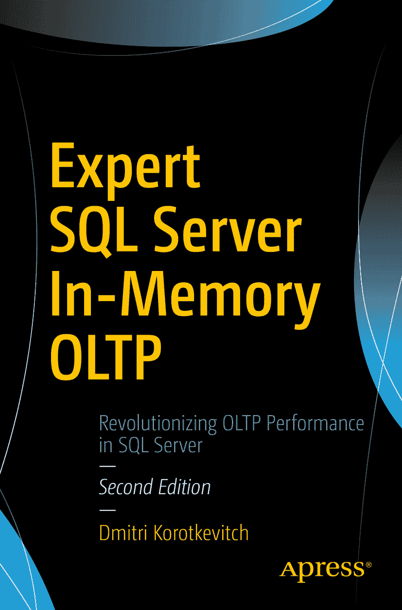

Dmitri Korotkevitch 《专家级 SQL Server 内存 OLTP》第 2 版

本书作者引用的任何源代码或其他补充材料，读者均可通过本书的产品页面在 GitHub 上获取，地址为 [`www.apress.com/9781484227718`](http://www.apress.com/9781484227718)。更详细信息请访问 [`www.apress.com/source-code`](http://www.apress.com/source-code)。ISBN 978-1-4842-2771-8e-ISBN 978-1-4842-2772-5 [`doi.org/10.1007/978-1-4842-2772-5`](https://doi.org/10.1007/978-1-4842-2772-5) 美国国会图书馆控制号：2017952536 © Dmitri Korotkevitch 2017
本作品受版权保护。无论涉及材料的全部还是部分，出版者保留所有权利，特别是翻译、转载、插图重用、朗诵、广播、缩微胶片或其他任何物理方式的复制，以及信息存储与检索、电子改编、计算机软件，或目前已知及未来开发的类似或不同方法的权利。
书中可能出现商标名称、标识和图像。我们仅在使用商标名称、标识和图像时，出于编辑目的并为了商标所有者的利益，而不使用商标符号，绝无侵权之意。本书中对商品名称、商标、服务标志及类似术语的使用，即使未特别标识，也不应被理解为表达其是否受专有权利约束的意见。
尽管本书中的建议和信息在出版时被认为是真实准确的，但作者、编辑或出版商均不对可能出现的任何错误或遗漏承担任何法律责任。出版商对本出版物所含材料不作任何明示或暗示的保证。
使用无酸纸印刷
本书通过 Springer Science+Business Media New York 在全球图书贸易中发行，地址：233 Spring Street, 6th Floor, New York, NY 10013。电话：1-800-SPRINGER，传真：(201) 348-4505，电子邮件：orders-ny@springer-sbm.com，或访问网站 www.springeronline.com。Apress Media, LLC 是一家位于加利福尼亚州的有限责任公司，其唯一成员（所有者）是 Springer Science + Business Media Finance Inc (SSBM Finance Inc)。SSBM Finance Inc 是一家特拉华州公司。
献给 SQL Server 社区以及社区之外的所有朋友们。

