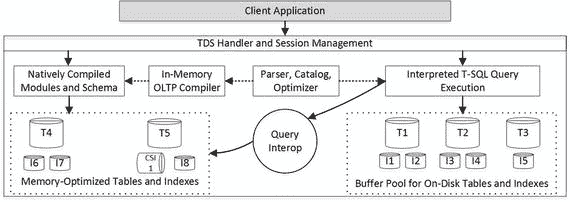

# 1. 为何需要内存 OLTP？

本章作为引言，阐述了内存数据库的重要性及其所解决的问题。文中概述了微软内存 OLTP 的实现（代号 `Hekaton`）及其设计目标，探讨了内存 OLTP 引擎的高级架构及其与 `SQL Server` 的集成方式。

最后，本章还将 `SQL Server` 的内存数据库产品与其他几种可用的解决方案进行了比较。

## 背景

追溯到 `SQL Server` 和其他主要数据库最初设计之时，硬件十分昂贵。当时的服务器仅配备一个或极少数几个 CPU，以及少量的安装内存。数据库服务器必须处理驻留在磁盘上的数据，并在需要时将其加载到内存中。

自那时起，情况已发生翻天覆地的变化。在过去 30 年间，内存价格大约每 5 年下降 10 倍。硬件变得更加经济实惠。如今，完全有可能以低于 5 万美元的价格购买一台拥有 32 个核心和 1TB 内存的服务器。诚然，数据库也变得愈发庞大，但活动的业务数据通常仍有可能完全装入内存。

显然，将数据缓存在缓冲池中是有益的。它减轻了 I/O 子系统的负载并提升了系统性能。然而，当系统在高并发负载下运行时，这往往不足以获得所需的吞吐量。`SQL Server` 管理和保护内存中的页结构，这带来了巨大的开销且可扩展性不佳。即使采用行级锁，多个会话也无法同时修改同一数据页上的数据，而必须相互等待。

或许需要澄清最后一点。显然，多个会话可以同时修改同一数据页上的数据行，并对不同的行持有排他锁（`X` 锁）。然而，它们无法同时更新物理数据页和行对象，因为这可能会损坏内存中的页结构。`SQL Server` 通过使用闩锁保护页面来解决此问题。闩锁的工作方式类似于锁，通过在物理级别序列化对内部 `SQL Server` 数据结构的访问来进行保护，因此在任何给定时间点，只有一个线程可以更新内存中数据页上的数据。

最终，这限制了当前数据库引擎架构所能实现的性能提升。尽管您可以通过添加更多 CPU 和核心来扩展硬件，但这种序列化很快就会成为瓶颈，并限制系统可扩展性的提升。同样，您也无法通过提高 CPU 时钟速度来改善性能，因为硅芯片可能会过热熔化。因此，提升数据库系统性能唯一可行的方法是减少执行某个操作所需的 CPU 指令数量。

不幸的是，仅靠代码优化是不够的。考虑需要更新表中一行数据的情况。即使您知道聚集索引键值，该操作也需要遍历索引树，在数据页和行上获取闩锁和锁。在某些情况下，它还需要更新非聚集索引，并在那里获取闩锁和锁。所有这些都会生成日志记录，并要求将这些日志记录和脏数据页写入磁盘。

所有这些操作可能需要执行数十万甚至数百万条 CPU 指令。代码优化可以在一定程度上减少这个数字，但如果不改变系统架构以及系统存储和处理数据的方式，就不可能显著地减少它。

这些趋势和架构限制使得微软团队得出结论：一个真正的内存解决方案应该采用与经典 `SQL Server` 数据库引擎不同的设计原则和架构来构建。最初的概念在 2008 年底提出，认真的规划和设计始于 2010 年，实际开发于 2011 年开始，该技术最终在 `SQL Server 2014` 中向公众发布。

该项目的主要目标是构建一个比现有 `SQL Server` 数据库引擎快 100 倍的解决方案，这也解释了代号 `Hekaton`（希腊语意为“100”）的由来。这个目标尚未完全实现；然而，内存 OLTP 在某些场景下提供 20 到 40 倍的性能提升并不罕见。

同样值得一提的是，`Hekaton` 的设计目标是针对 OLTP 工作负载。众所周知，为特定任务和工作负载设计的专用解决方案通常在目标领域优于通用系统。内存 OLTP 也是如此。它在支持数百甚至数千个并发事务的大型、繁忙 OLTP 系统中表现出色。与此同时，`SQL Server 2014` 中内存 OLTP 的最初版本对于数据仓库工作负载表现不佳，其他 `SQL Server` 技术在其上表现更优。

随着 `SQL Server 2016` 的发布，情况发生了变化。内存 OLTP 的第二个版本支持列存储索引，这允许您针对热门的 OLTP 数据运行实时操作分析查询。尽管如此，该技术尚未像基于磁盘的列式存储那样成熟，您不应将其视为内存数据仓库解决方案。

内存 OLTP 的设计目标如下：

*   **为内存优化数据存储**：内存 OLTP 中的数据不存储在基于磁盘的数据页上，并且在加载到内存时也不模仿基于磁盘的存储结构。这使得可以消除复杂的缓冲池结构及其管理代码。此外，常规（非列存储）索引不会持久化到磁盘，它们会在启动时，当内存驻留表的数据被加载到内存中时重新创建。
*   **消除闩锁和锁**：所有内存 OLTP 的内部数据结构都是无闩锁和无锁的。内存 OLTP 使用多版本并发控制来提供事务一致性。从用户角度看，其行为类似于常规的 `SNAPSHOT` 事务隔离级别；然而，其底层并不使用锁或 `tempdb` 版本存储。这种机制允许多个会话在无需锁定和阻塞的情况下处理相同的数据，提供近乎线性的系统可扩展性，使其能够充分利用现代多 CPU/多核硬件。
*   **使用原生编译**：`T-SQL` 是一种解释型语言，以 CPU 开销为代价提供了极大的灵活性。即使是一个简单的语句也需要执行数十万条 CPU 指令。内存 OLTP 引擎通过将行访问逻辑、存储过程和用户定义函数编译成本地机器代码来解决此问题。

内存 OLTP 引擎已完全集成到 `SQL Server` 数据库引擎中。您无需进行复杂的系统重构，将数据拆分到内存和传统数据库服务器之间，或将所有数据从数据库移入内存。您可以逐表分离内存数据和磁盘数据，这允许您将活动的业务数据移入内存，而将其他表和历史数据保留在磁盘上。在某些情况下，这种迁移甚至可以对客户端应用程序透明进行。

这听起来好得令人难以置信，而且不幸的是，在使用这项技术时您可能仍然会遇到许多障碍。在 `SQL Server 2014` 中，内存 OLTP 仅支持 `SQL Server` 数据类型和功能的一个子集，这常常需要您进行代价高昂的代码和架构重构才能加以利用。尽管在 `SQL Server 2016` 中许多此类限制已被移除，但您仍然需要处理一些不兼容性和限制。

为了从该技术中获得最大的性能提升，您还需要根据内存 OLTP 的行为和内部实现来设计系统。


## 内存 OLTP 引擎架构

内存 OLTP 完全集成到 SQL Server 中，其他 SQL Server 功能和客户端应用程序可以透明地访问它。然而，其内部工作方式与行为与 SQL Server 存储引擎截然不同。图 1-1 展示了 SQL Server 数据库引擎的架构，包括内存 OLTP 组件。


图 1-1. SQL Server 数据库引擎架构

内存 OLTP 将数据存储在`内存优化表`中。这些表完全驻留在内存中，与经典的`基于磁盘的表`结构不同。除一个小例外，`内存优化表`不在数据页上存储数据；行通过内存指针链连接在一起。同样值得注意的是，`内存优化表`不与`基于磁盘的表`共享内存，且存在于缓冲池之外。

注：我将在第 3 章详细讨论`内存优化表`。

SQL Server 数据库引擎有两种方式可以与`内存优化表`交互。第一种是`查询互操作引擎`。它允许你从解释型 T-SQL 代码中引用`内存优化表`。数据位置对查询是透明的；你可以访问`内存优化表`，将它们与`基于磁盘的表`连接，并以通常的方式使用它们。在此模式下支持大多数 T-SQL 功能和语言结构。

你还可以使用`原生编译模块`（例如`存储过程`、`内存优化表触发器`和`标量用户定义函数`）来访问和操作`内存优化表`。你可以使用 In-Memory OLTP 引入的一些额外语言结构，以类似于常规 T-SQL 模块的方式定义它们。

`原生编译模块`已被编译成机器码并加载到 SQL Server 进程内存中。与`互操作引擎`相比，这些模块可以带来显著的性能提升；然而，它们仅支持有限的 T-SQL 结构，并且只能访问`内存优化表`。

注：我将在第 9 章讨论`原生编译模块`。

`内存优化表`使用基于行的存储，所有列组合成数据行。也可以在这些表上定义`聚集列存储索引`。这些索引是独立的数据结构，以基于列的格式存储高度压缩的数据副本，非常适合实时操作分析查询。In-Memory OLTP 将这些索引持久化在磁盘上，并且在数据库重启时不会重新创建它们。

注：我将在第 7 章讨论`聚集列存储索引`。

## 内存 OLTP 与其他内存数据库

内存 OLTP 几乎是市场上唯一可用的关系型内存数据库（`IMDB`）。让我们来看看截至 2017 年存在的其他流行解决方案。

### Oracle

截至撰写本文时，Oracle 提供两种独立的`IMDB`产品。主流的 Oracle 12c 数据库服务器包含`Oracle Database In-Memory 选项`。启用后，Oracle 会以基于列的存储格式创建数据副本，并在后台维护它。数据库管理员可以选择应包含在副本中的表、分区和列。

此方法针对分析查询和数据仓库工作负载，这些工作负载受益于基于列的存储和处理。它不会提高继续使用基于磁盘的基于行的存储的 OLTP 查询的性能。

内存中的基于列的数据在数据修改期间增加了开销；需要更新它以反映数据更改。此外，它不会持久保存在磁盘上，并且每次服务器重启时都需要重新创建。

同时，此实现对客户端应用程序是完全透明的。支持所有数据类型和 PL/SQL 结构，并且可以在配置级别启用或禁用此功能。Oracle 在每个查询的基础上选择要访问的数据，对分析/数据仓库使用内存数据，对 OLTP 工作负载使用基于磁盘的数据。这与 SQL Server In-Memory OLTP 不同，在后者中你需要明确定义`内存优化表`和`列存储索引`。

除了`Database In-Memory 选项`外，Oracle 还提供面向 OLTP 工作负载的独立产品`Oracle TimesTen`。这是一个独立的内存数据库，将所有数据加载到内存中，可以三种模式运行。
*   `独立内存数据库`支持传统的客户端-服务器架构。
*   `嵌入式内存数据库`允许应用程序将`Oracle TimesTen`加载到应用程序的地址空间中，并消除网络调用的延迟。当数据层响应时间至关重要时，这非常有用。
*   `Oracle 数据库缓存（TimesTen 缓存）`允许该产品作为应用程序和 Oracle 数据库之间的附加层进行部署。缓存中的数据是可更新的，`TimesTen`和 Oracle 数据库之间的同步是自动完成的。

然而，在内部，`Oracle TimesTen`仍然依赖锁机制，这在高并发负载下会降低事务吞吐量。而且，它不像 In-Memory OLTP 那样支持原生编译。

同样值得注意的是，`Oracle In-Memory 选项`和`TimesTen`都需要单独的许可证。与 In-Memory OLTP 相比，这可能会显著增加实施成本，后者即使在 SQL Server 的非企业版中也可免费使用。

### IBM DB2

与`Oracle Database In-Memory 选项`类似，`IBM DB2 10.5 with BLU Acceleration`针对数据仓库和分析工作负载。它将基于行的磁盘表的副本以基于列的格式持久化在内存中的`影子表`中，用于分析查询。`影子表`中的数据持久化在磁盘上，并且在数据库启动时不会重新创建。同样值得注意的是，`影子表`中的数据大小可能超过可用内存的大小。

`IBM DB2`自动且异步地同步基于磁盘的表和`影子表`之间的数据，这减少了数据修改期间的开销。然而，这种方法在`影子表`更新期间引入了延迟，查询可能使用稍微过时的数据。

`IBM DB2 BLU Acceleration`侧重于查询处理，并为数据仓库和分析工作负载提供了出色的性能。它没有任何与 OLTP 相关的优化，并使用基于磁盘的数据和锁来支持 OLTP 工作负载。

### SAP HANA

SAP HANA 是市场上相对较新的数据库解决方案；它自 2010 年起开始可用。直到最近，SAP HANA 一直作为纯粹的内存数据库实施，这限制了数据大小不能超过服务器可用内存量。

这个问题在近期版本中已得到解决；然而，它需要单独的工具来管理数据。应用程序也需要知晓底层存储架构。例如，HANA 支持基于磁盘的扩展表；但是，应用程序需要直接查询它们，并实现数据在内存表与扩展表之间移动的逻辑。

SAP HANA 以列式格式存储所有数据，并且不支持行式存储。数据是完全可修改的；SAP HANA 将新行存储在增量存储中，并在后台对其进行压缩。当 `UPDATE` 操作像 SQL Server 内存中 OLTP 那样生成行的新版本时，使用多版本并发控制来处理并发问题。

**注意**
我将在第 8 章深入讨论内存中 OLTP 并发模型。

SAP 声称，HANA 可以使用单份列式格式的数据，成功处理 OLTP 和数据仓库/分析工作负载。不幸的是，几乎找不到任何基准测试能证明它适用于 OLTP 工作负载。考虑到纯粹的列式存储通常并未针对 OLTP 用例进行优化，很难向需要高 OLTP 吞吐量的系统推荐 SAP HANA。

然而，对于专注于运营分析和商业智能并且需要支持不频繁的 OLTP 查询的系统来说，SAP HANA 可能是一个不错的选择。

不可能涵盖市场上所有可用的内存数据库解决方案。其中许多解决方案针对特定工作负载和用例，并在这些方面表现出色。尽管如此，SQL Server 提供了一套丰富而成熟的功能和技术，可以覆盖广泛的需求范围。与市场上的其他主要供应商相比，SQL Server 也是一个具有成本效益的解决方案。

### 总结

内存中 OLTP 的设计采用了与经典 SQL Server 数据库引擎不同的设计原则和架构。它是一个专门针对 OLTP 工作负载的产品，在某些场景下可以将性能提升 20 到 40 倍。尽管如此，它已完全集成到 SQL Server 数据库引擎中。数据存储对于客户端应用程序是透明的，如果它们使用内存中 OLTP 支持的功能，则不需要任何代码更改。

内存优化表的数据与缓冲池分开存储在内存中。所有内存中 OLTP 数据结构完全无锁存和无锁定，这允许你通过向服务器添加更多 CPU 来扩展系统。

通过在内存优化表上定义聚集列存储索引，内存中 OLTP 可以支持运营分析。这些索引以列式存储格式存储来自表的数据副本。

内存中 OLTP 对于任何行访问逻辑都使用本机编译为机器代码。此外，它允许你对存储过程、触发器和标量用户定义函数执行本机编译，这显著提高了它们的性能。

## 2. 内存中 OLTP 对象

本章提供了内存中 OLTP 对象的高级概述。它展示了如何创建具有内存中 OLTP 文件组的数据库，以及如何定义内存优化表并通过互操作引擎和本机编译模块访问它们。

最后，本章演示了当大量并发会话向数据库插入数据并且锁存争用成为瓶颈时，使用内存中 OLTP 引擎可以实现的性能改进。

### 准备数据库以使用内存中 OLTP

内存中 OLTP 引擎已完全集成到 SQL Server 中，并且总是随产品一起安装。在 SQL Server 2014 和 2016 RTM 中，内存中 OLTP 仅在企业版和开发人员版中可用。此限制在 SQL Server 2016 SP1 中已移除，你可以在每个 SQL Server 版本中使用该技术。

然而，你应该记住，SQL Server 的非企业版在可利用的内存量方面有限制。例如，SQL Server 2016 标准版和速成版中的缓冲池内存分别限制为 128GB 和 1,410MB 的 RAM。同样，内存优化表在每个数据库中存储的数据量在标准版中不能超过 32GB，在速成版中不能超过 352MB。如果内存中 OLTP 没有足够内存来生成行的新版本，内存优化表中的数据将变为只读。

**注意**
我将在第 12 章讨论如何估算内存中 OLTP 对象所需的内存。

内存中 OLTP 在 Microsoft Azure 的 SQL 数据库的高级层中也可用，包括高级弹性池中的数据库。但是，该技术可以利用的内存量基于服务层的 DTU。截至撰写本文时，Microsoft 为每 125 个该层的 DTU 或 eDTU 提供了 1GB 内存。这在未来可能会改变，当你决定在 SQL 数据库中使用内存中 OLTP 时，应查阅 Microsoft Azure 文档。

要使用内存中 OLTP，你不需要安装任何额外的包或在 SQL Server 级别执行任何配置更改。但是，任何利用内存中 OLTP 对象的数据库都应该有一个单独的文件组来存储内存优化数据。

对于本地 SQL Server 版本，你可以在创建数据库时创建此文件组，或者通过使用 `CONTAINS MEMORY_OPTIMIZED_DATA` 关键字修改现有数据库并添加文件组。然而，对于 Microsoft Azure 中的 SQL 数据库，这并非必需，因为存储层对用户是抽象的。

代码清单 2-1 显示了一个指定了内存中 OLTP 文件组的 `CREATE DATABASE` 语句示例。文件组的 `FILENAME` 属性指定了内存中 OLTP 文件将位于的文件夹。

```sql
create database InMemoryOLTPDemo
on primary
(
name = N'InMemoryOLTPDemo'
,filename = N'M:\Data\InMemoryOLTPDemo.mdf'
),
filegroup HKData CONTAINS MEMORY_OPTIMIZED_DATA
(
name = N'InMemory_OLTP_Data'
,filename = N'H:\HKData\InMemory_OLTP_Data'
),
filegroup LOGDATA
(name = N'LogData1', filename = N'M:\Data\LogData1.ndf'),
(name = N'LogData2', filename = N'M:\Data\LogData2.ndf'),
(name = N'LogData3', filename = N'M:\Data\LogData3.ndf'),
(name = N'LogData4', filename = N'M:\Data\LogData4.ndf')
log on
(
name = N'InMemoryOLTPDemo_log'
,filename = N'L:\Log\InMemoryOLTPDemo_log.ldf'
)
```

代码清单 2-1.
创建具有内存中 OLTP 文件组的数据库

在内部，内存中 OLTP 利用基于 `FILESTREAM` 技术的流机制。虽然 `FILESTREAM` 的详细内容超出了本书范围，但我要提到它针对顺序 I/O 访问进行了优化。事实上，内存中 OLTP 在设计上根本不使用随机 I/O 访问。在正常工作负载期间，它使用顺序仅追加写入；在数据库启动和恢复阶段，它使用顺序读取。你应该牢记这种行为，并将内存中 OLTP 文件组放置在针对顺序性能优化的磁盘阵列中。

与 `FILESTREAM` 文件组类似，内存中 OLTP 文件组可以包括放置在不同磁盘阵列上的多个容器，这允许你将负载分散到它们之上。


值得注意的是，内存中 OLTP 会在您创建第一个内存中 OLTP 对象时，在文件组中创建一组文件。可惜的是，即使您删除了所有内存优化表和对象，SQL Server 也不允许您从数据库中移除内存中 OLTP 文件组。但是，在文件组为空且不包含任何文件时，您仍然可以从数据库中移除该内存中 OLTP 文件组。

注意

您可以在 [`https://docs.microsoft.com/en-us/sql/relational-databases/blob/filestream-sql-server`](https://docs.microsoft.com/en-us/sql/relational-databases/blob/filestream-sql-server) 阅读更多关于 `FILESTREAM` 的内容。

我将在第 10 章讨论内存中 OLTP 如何在磁盘上持久化数据，并在第 12 章介绍硬件和 SQL Server 配置的最佳实践。

## 数据库兼容级别

作为一般建议，Microsoft 建议您在系统中使用内存中 OLTP 时，将数据库兼容级别设置为与 SQL Server 版本匹配。这将启用最新的 T-SQL 语言构造和性能改进，而这些在旧的兼容级别中是禁用的。

但是，您应该记住，数据库兼容级别会影响基数估算模型的选择，以及以前由跟踪标志 `T4199` 控制的查询优化器修补程序服务模型。即使您启用了 `LEGACY_CARDINALITY_ESTIMATION` 数据库作用域配置，这也可能且将会改变系统中的执行计划。

当您从旧版本的 SQL Server 迁移系统时，无论是否使用内存中 OLTP，都应仔细规划此更改。您可以使用 SQL Server 2016 的新组件——查询存储，在更改兼容级别之前捕获查询的执行计划，并在出现性能回退时强制系统关键查询使用旧计划。

## 创建内存优化表

从语法上讲，创建内存优化表与创建基于磁盘的表类似。您可以使用常规的 `CREATE TABLE` 语句，并指定该表为内存优化。

代码清单 2-2 在数据库中创建了三个内存优化表。请忽略所有不熟悉的构造；我将在本章后面详细讨论它们。

```sql
create table dbo.WebRequests_Memory
(
RequestId int not null identity(1,1)
primary key nonclustered
hash with (bucket_count=1048576),
RequestTime datetime2(4) not null
constraint DEF_WebRequests_Memory_RequestTime
default sysutcdatetime(),
URL varchar(255) not null,
RequestType tinyint not null, -- GET/POST/PUT
ClientIP varchar(15) not null,
BytesReceived int not null,
index IDX_RequestTime nonclustered(RequestTime)
)
with (memory_optimized=on, durability=schema_and_data);
create table dbo.WebRequestHeaders_Memory
(
RequestHeaderId int not null identity(1,1)
primary key nonclustered
hash with (bucket_count=8388608),
RequestId int not null,
HeaderName varchar(64) not null,
HeaderValue varchar(256) not null,
index IDX_RequestID nonclustered hash(RequestID)
with (bucket_count=1048576)
)
with (memory_optimized=on, durability=schema_and_data);
create table dbo.WebRequestParams_Memory
(
RequestParamId int not null identity(1,1)
primary key nonclustered
hash with (bucket_count=8388608),
RequestId int not null,
ParamName varchar(64) not null,
ParamValue nvarchar(256) not null,
index IDX_RequestID nonclustered hash(RequestID)
with (bucket_count=1048576)
)
with (memory_optimized=on, durability=schema_and_data);
```

代码清单 2-2. 创建内存优化表

每个内存优化表都有一个 `DURABILITY` 设置。默认的 `SCHEMA_AND_DATA` 值表示表中的数据是完全持久的，为了恢复目的会持久保存在磁盘上。对这些表的操作会记录在数据库事务日志中。

`SCHEMA_ONLY` 是另一个值，表示内存优化表中的数据是不持久的，在 SQL Server 重启、崩溃或故障转移到另一个节点时会丢失。针对非持久内存优化表的操作不会记录在事务日志中。非持久表速度极快，可以在类似于 `tempdb` 中临时表的用例中用于存储临时数据。与临时表相反，SQL Server 会持久化非持久内存优化表的架构，您无需在 SQL Server 重启时重新创建它们。

内存优化表的索引必须内联创建，并作为 `CREATE TABLE` 语句的一部分定义。在表创建后，您无法添加或删除索引，也无法更改索引的定义。

SQL Server 2016 允许您更改表架构和索引。但是，这会在内存中创建新的表对象，并将数据从旧表复制过去。这是一个离线操作，耗时且消耗资源，并且需要您有足够的内存来容纳数据的多个副本。

提示

您可以将多个 `ADD` 或 `DROP` 操作组合到单个 `ALTER` 语句中，以减少表重建的次数。

在 SQL Server 2016 中，内存优化表最多支持八个索引。持久的内存优化表应定义唯一的 `PRIMARY KEY` 约束。非持久的内存优化表不需要 `PRIMARY KEY` 约束；但是，它们仍应至少有一个索引来链接行。值得注意的是，八索引限制将在 SQL Server 2017 中移除。

内存优化表支持两种主要索引类型：`HASH` 和 `NONCLUSTERED`。哈希索引针对点查找操作（即使用等式谓词搜索一行或多行）进行了优化。这是 SQL Server 中一个概念上新的索引类型，存储引擎中没有实现任何类似的内容。而非聚集索引则与基于磁盘的表上的 B-Tree 索引有些相似。最后，SQL Server 2016 允许您创建聚集列存储索引，以支持系统中的操作分析查询。

哈希索引和非聚集索引从不持久保存在磁盘上。SQL Server 在启动数据库并将内存优化数据加载到内存中时会重新创建它们。与基于磁盘的表一样，内存优化表中不必要的索引会减慢数据修改速度并在系统中使用额外的内存。

注意

我将在第 4 章详细讨论哈希索引，在第 5 章讨论非聚集索引。我将在第 7 章介绍列存储索引。


