# 操作内存优化表

## 使用解释式 T-SQL 访问内存优化表

在解释模式下，SQL Server 处理内存优化表的方式与处理基于磁盘的表非常相似。它会优化查询并缓存执行计划，无论表位于何处。查询执行期间使用相同的操作符集。从高层次来看，当 SQL Server 需要从表中获取一行并调用操作符的 `GetRow()` 方法时，该调用会根据底层表类型被路由到存储引擎或内存 OLTP 引擎。

大多数 T-SQL 功能和结构在解释模式下都得到支持。但仍存在一些限制；例如，无法截断内存优化表或将其用作 `MERGE` 语句的目标。幸运的是，此类限制的列表很小。

清单 2-3 展示了一个 T-SQL 存储过程的示例，该过程向清单 2-2 中创建的内存优化表插入数据。为简单起见，该过程将需要插入到 `dbo.WebRequestParams_Memory` 表中的数据作为常规参数接受，将其限制为五个值。显然，在生产代码中，最好在此类场景中使用表值参数。

```sql
create proc dbo.InsertRequestInfo_Memory
(
@URL varchar(255)
,@RequestType tinyint
,@ClientIP varchar(15)
,@BytesReceived int
-- Header fields
,@Authorization varchar(256)
,@UserAgent varchar(256)
,@Host varchar(256)
,@Connection varchar(256)
,@Referer varchar(256)
-- Hardcoded parameters.. Just for the demo purposes
,@Param1 varchar(64) = null
,@Param1Value nvarchar(256) = null
,@Param2 varchar(64) = null
,@Param2Value nvarchar(256) = null
,@Param3 varchar(64) = null
,@Param3Value nvarchar(256) = null
,@Param4 varchar(64) = null
,@Param4Value nvarchar(256) = null
,@Param5 varchar(64) = null
,@Param5Value nvarchar(256) = null
)
as
begin
set nocount on
set xact_abort on
declare
@RequestId int
begin tran
insert into dbo.WebRequests_Memory
(URL,RequestType,ClientIP,BytesReceived)
values
(@URL,@RequestType,@ClientIP,@BytesReceived);
select @RequestId = SCOPE_IDENTITY();
insert into dbo.WebRequestHeaders_Memory
(RequestId,HeaderName,HeaderValue)
values
(@RequestId,'AUTHORIZATION',@Authorization)
,(@RequestId,'USERAGENT',@UserAgent)
,(@RequestId,'HOST',@Host)
,(@RequestId,'CONNECTION',@Connection)
,(@RequestId,'REFERER',@Referer);
;with Params(ParamName, ParamValue)
as
(
select ParamName, ParamValue
from (
values
(@Param1, @Param1Value)
,(@Param2, @Param2Value)
,(@Param3, @Param3Value)
,(@Param4, @Param4Value)
,(@Param5, @Param5Value)
) v(ParamName, ParamValue)
where
ParamName is not null and
ParamValue is not null
)
insert into dbo.WebRequestParams_Memory
(RequestID,ParamName,ParamValue)
select @RequestID, ParamName, ParamValue
from Params;
commit
end
```
**清单 2-3. 通过互操作引擎将数据插入内存优化表的存储过程**

如你所见，通过互操作引擎工作的存储过程不需要任何特定的语言结构来访问内存优化表。

## 使用原生编译模块访问内存优化表

原生编译模块也是使用常规的 `CREATE` 语句定义的，并且它们使用 T-SQL 语言。然而，在创建阶段必须指定几个附加选项。

清单 2-4 中的代码创建了原生编译存储过程，该过程实现了与清单 2-3 中定义的 `dbo.InsertRequestInfo_Memory` 存储过程相同的逻辑。

```sql
create proc dbo.InsertRequestInfo_NativelyCompiled
(
@URL varchar(255) not null
,@RequestType tinyint not null
,@ClientIP varchar(15) not null
,@BytesReceived int not null
-- Header fields
,@Authorization varchar(256) not null
,@UserAgent varchar(256) not null
,@Host varchar(256) not null
,@Connection varchar(256) not null
,@Referer varchar(256) not null
-- Parameters.. Just for the demo purposes
,@Param1 varchar(64) = null
,@Param1Value nvarchar(256) = null
,@Param2 varchar(64) = null
,@Param2Value nvarchar(256) = null
,@Param3 varchar(64) = null
,@Param3Value nvarchar(256) = null
,@Param4 varchar(64) = null
,@Param4Value nvarchar(256) = null
,@Param5 varchar(64) = null
,@Param5Value nvarchar(256) = null
)
with native_compilation, schemabinding, execute as owner
as
begin atomic with
(
transaction isolation level = snapshot
,language = N'English'
)
declare
@RequestId int
insert into dbo.WebRequests_Memory
(URL,RequestType,ClientIP,BytesReceived)
values
(@URL,@RequestType,@ClientIP,@BytesReceived);
select @RequestId = SCOPE_IDENTITY();
insert into dbo.WebRequestHeaders_Memory
(RequestId,HeaderName,HeaderValue)
select @RequestId,'AUTHORIZATION',@Authorization union all
select @RequestId,'USERAGENT',@UserAgent union all
select @RequestId,'HOST',@Host union all
select @RequestId,'CONNECTION',@Connection union all
select @RequestId,'REFERER',@Referer;
insert into dbo.WebRequestParams_Memory
(RequestID,ParamName,ParamValue)
select @RequestID, ParamName, ParamValue
from
(
select @Param1, @Param1Value union all
select @Param2, @Param2Value union all
select @Param3, @Param3Value union all
select @Param4, @Param4Value union all
select @Param5, @Param5Value
) v(ParamName, ParamValue)
where
ParamName is not null and
ParamValue is not null;
end
```
**清单 2-4. 原生编译的存储过程**

你应该使用 `WITH NATIVE_COMPILATION` 子句来指定模块是原生编译的。所有原生编译模块都是架构绑定的，它们要求你指定 `SCHEMABINDING` 选项。最后，你可以设置可选的执行安全上下文和其他几个参数。我将在第 9 章中详细讨论它们。

原生编译存储过程作为原子块执行，由 `BEGIN ATOMIC` 关键字指示，这是一种“全有或全无”的方法。过程中的所有语句要么全部成功，要么全部失败。

当原生编译存储过程在活动事务上下文之外被调用时，它会启动一个新事务，并在执行结束时提交或回滚该事务。

在过程于活动事务上下文中被调用的情况下，SQL Server 会在过程执行开始时创建一个保存点。如果过程中出现错误，SQL Server 会将事务回滚到创建的保存点。根据错误的严重程度和类型，事务要么能够继续并提交，要么会变成无法提交的“已判定失败”状态。

尽管 `dbo.InsertRequestInfo_Memory` 和 `dbo.InsertRequestInfo_NativelyCompiled` 存储过程完成相同的任务，但它们的实现略有不同。原生编译存储过程有一个广泛的限制列表和不支持的 T-SQL 功能。在前面的示例中，你可以看到既不支持带有多个 `VALUES` 的 `INSERT` 语句，也不支持 CTE。

> **注意**
> 我将在第 9 章中更深入地讨论原生编译存储过程、原子事务和支持的 T-SQL 语言结构。

最后，值得一提的是，原生编译模块只能访问内存优化表。无法查询基于磁盘的表，或者，再举一个例子，将内存优化表和基于磁盘的表连接在一起。对于此类任务，你必须使用解释式 T-SQL 和互操作引擎。


## 内存 OLTP 实战：解决闩锁争用

闩锁是 SQL Server 用来保护内部数据结构一致性的轻量级同步对象。多个会话（或者在此上下文中称为线程）不能同时修改同一个对象。

设想这样一种情况：多个会话试图访问缓冲池中的同一个数据页。虽然多个会话/线程同时读取数据是安全的，但数据修改操作必须序列化，并且需要对该页拥有独占访问权。如果不强制执行此规则，多个线程可能会同时更新数据页的不同部分，相互覆盖对方的更改，导致数据不一致，从而引发页损坏。

闩锁有助于强制执行该规则。需要从页中读取数据的线程获取共享（`S`）闩锁，这些闩锁彼此兼容。另一方面，数据修改需要一个独占（`X`）闩锁，这会阻止其他读取器和写入器访问该数据页。

> 注意
>
> 尽管闩锁在概念上与锁相似，但两者之间存在细微差别。锁强制数据的逻辑一致性。例如，它们减少或防止并发现象，如脏读或幻读。而闩锁则强制物理数据一致性，例如防止数据页结构损坏。

通常，闩锁生命周期很短，在系统中几乎察觉不到。然而，在繁忙的 OLTP 系统中，拥有大量 CPU 和高并发数据修改率时，闩锁争用可能成为瓶颈。你可以通过等待统计信息中 `PAGELATCH` 等待的高百分比，或通过分析 `sys.dm_os_latch_stats` 数据管理视图来发现此类瓶颈的迹象。

内存 OLTP 因其无闩锁架构，在解决闩锁争用方面可能极其有效。在某些场景下，它可以显著提高数据修改吞吐量。在本节中，你将看到一个这样的示例。

在我的测试环境中，我使用了一台安装了 SQL Server 2016 SP1 企业版的 Microsoft Azure DS15V2 虚拟机。该虚拟机拥有 20 个内核、140GB 内存以及一个可执行 62,500 IOPS 的磁盘子系统。

我创建了如清单 2-1 所示的数据库，在 `LOGDATA` 文件组中使用了 16 个数据文件，以最小化分配映射闩锁争用。日志文件放置在本地 SSD 存储上，而数据和内存 OLTP 文件组则共享主磁盘阵列。值得注意的是，在生产环境中将基于磁盘的文件组和内存文件组放置在不同的阵列上通常会带来更好的 I/O 性能。然而，这并没有影响测试场景，因为我在同一测试中没有混合基于磁盘和内存 OLTP 的工作负载。

作为第一步，我创建了一组基于磁盘的表，其结构模仿了本章前面创建的内存优化表，并创建了向这些表插入数据的存储过程。清单 2-5 展示了完成此操作的代码。

```sql
create table dbo.WebRequests_Disk
(
RequestId int not null identity(1,1),
RequestTime datetime2(4) not null
constraint DEF_WebRequests_Disk_RequestTime
default sysutcdatetime(),
URL varchar(255) not null,
RequestType tinyint not null, -- GET/POST/PUT
ClientIP varchar(15) not null,
BytesReceived int not null,
constraint PK_WebRequests_Disk
primary key nonclustered(RequestID)
on [LOGDATA]
) on [LOGDATA];
create unique clustered index IDX_WebRequests_Disk_RequestTime_RequestId
on dbo.WebRequests_Disk(RequestTime,RequestId)
on [LOGDATA];
create table dbo.WebRequestHeaders_Disk
(
RequestId int not null,
HeaderName varchar(64) not null,
HeaderValue varchar(256) not null,
constraint PK_WebRequestHeaders_Disk
primary key clustered(RequestID,HeaderName)
on [LOGDATA]
);
create table dbo.WebRequestParams_Disk
(
RequestId int not null,
ParamName varchar(64) not null,
ParamValue nvarchar(256) not null,
constraint PK_WebRequestParams_Disk
primary key clustered(RequestID,ParamName)
on [LOGDATA]
);
go
create proc dbo.InsertRequestInfo_Disk
(
@URL varchar(255)
,@RequestType tinyint
,@ClientIP varchar(15)
,@BytesReceived int
-- Header fields
,@Authorization varchar(256)
,@UserAgent varchar(256)
,@Host varchar(256)
,@Connection varchar(256)
,@Referer varchar(256)
-- Parameters.. Just for the demo purposes
,@Param1 varchar(64) = null
,@Param1Value nvarchar(256) = null
,@Param2 varchar(64) = null
,@Param2Value nvarchar(256) = null
,@Param3 varchar(64) = null
,@Param3Value nvarchar(256) = null
,@Param4 varchar(64) = null
,@Param4Value nvarchar(256) = null
,@Param5 varchar(64) = null
,@Param5Value nvarchar(256) = null
)
as
begin
set nocount on
set xact_abort on
declare
@RequestId int
begin tran
insert into dbo.WebRequests_Disk
(URL,RequestType,ClientIP,BytesReceived)
values
(@URL,@RequestType,@ClientIP,@BytesReceived);
select @RequestId = SCOPE_IDENTITY();
insert into dbo.WebRequestHeaders_Disk
(RequestId,HeaderName,HeaderValue)
values
(@RequestId,'AUTHORIZATION',@Authorization)
,(@RequestId,'USERAGENT',@UserAgent)
,(@RequestId,'HOST',@Host)
,(@RequestId,'CONNECTION',@Connection)
,(@RequestId,'REFERER',@Referer);
;with Params(ParamName, ParamValue)
as
(
select ParamName, ParamValue
from (
values
(@Param1, @Param1Value)
,(@Param2, @Param2Value)
,(@Param3, @Param3Value)
,(@Param4, @Param4Value)
,(@Param5, @Param5Value)
) v(ParamName, ParamValue)
where
ParamName is not null and
ParamValue is not null
)
insert into dbo.WebRequestParams_Disk
(RequestID,ParamName,ParamValue)
select @RequestId, ParamName, ParamValue
from Params;
commit
end;
```
清单 2-5.
创建基于磁盘的表和存储过程

在测试中，我使用 `dbo.InsertRequestInfo_Disk`、`dbo.InsertRequestInfo_Memory` 和 `dbo.InsertRequestInfo_NativelyCompiled` 存储过程，在循环中同时从多个会话调用它们，比较了基于磁盘的表和内存优化表的插入吞吐量。每次调用向 `dbo.WebRequests` 表插入一行，向 `dbo.WebRequestHeaders` 表插入五行，并向 `dbo.WebRequestDisks` 表插入一到五行，这使得单个事务中平均插入九行。

> 注意
>
> 测试应用程序和脚本包含在本书的附带材料中。

对于 `dbo.InsertRequestInfo_Disk` 存储过程和基于磁盘的表，我的测试服务器在 150 个并发会话时达到了约每秒 4,500 批次/调用的最大吞吐量。图 2-1 显示了测试时的几个性能计数器。

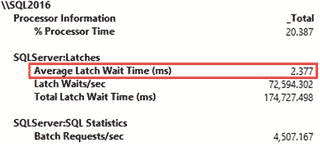
图 2-1.
向基于磁盘的表插入数据时的性能计数器（150 个并发会话）


尽管我已将插入吞吐量推至极限，服务器上的 CPU 负载仍然非常低，这清楚地表明在测试期间 CPU 并非瓶颈。与此同时，服务器却因大量的 **latch**（锁存器）而受到影响，这些锁存器用于序列化对缓冲池中数据页的访问。虽然单个锁存器的等待时间相对较短，但由于每秒获取的锁存器数量过多，总的锁存等待时间仍然很高。

进一步增加会话数并无助益，实际上甚至略微降低了吞吐量。图 2-2 展示了 300 个并发会话下的性能计数器。如你所见，平均锁存等待时间随负载增加而持续上升。

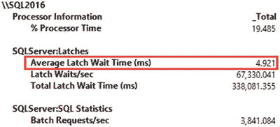
**图 2-2.** 向基于磁盘的表插入数据时的性能计数器（300 个并发会话）

通过分析测试期间收集的等待统计信息，可以确认锁存器是瓶颈。图 2-3 展示了 `sys.dm_os_wait_stats` 视图的输出。你可以看到锁存等待位列榜首。

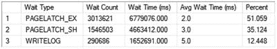
**图 2-3.** 测试期间收集的等待统计信息（向基于磁盘的表插入）

当我使用 `dbo.InsertRequestInfo_Memory` 存储过程重复测试时，情况发生了变化。该存储过程通过 **Interop Engine**（互操作引擎）向内存优化表插入数据。在 300 个并发会话下，我将吞吐量推至极限，这比之前的测试会话数翻了一番。在此场景下，SQL Server 能够处理约每秒 74,000 个批处理/调用，吞吐量提升了超过 16 倍。进一步增加并发会话数并未改变吞吐量；然而，随着会话数增加，每次调用的持续时间线性增长。

图 2-4 展示了测试期间的性能计数器。如你所见，使用内存优化表时不存在锁存器，且 CPU 得到了充分利用。

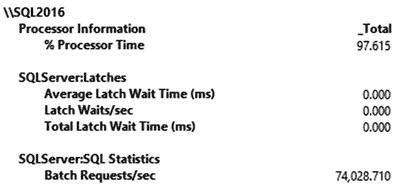
**图 2-4.** 通过互操作引擎向内存优化表插入数据时的性能计数器

如图 2-5 所示，系统中唯一显著的等待是 `WRITELOG`，这与事务日志的写入性能相关。

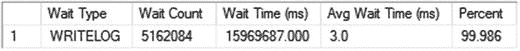
**图 2-5.** 测试期间收集的等待统计信息（通过互操作引擎向内存优化表插入）

原生存储过程 `dbo.InsertRequestInfo_NativelyCompiled` 进一步改善了状况。在 400 个并发会话下，SQL Server 能够处理约每秒 106,000 个批处理/调用，相当于约每秒 950,000 次单独插入。

图 2-6 展示了测试执行期间的性能计数器。即使吞吐量有所增加，原生存储过程对 CPU 的负载也低于互操作引擎，并且在此配置下，磁盘性能成为了明显的瓶颈。

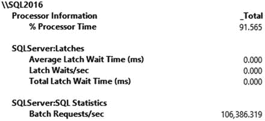
**图 2-6.** 使用原生存储过程向内存优化表插入数据时的性能计数器

等待统计中的等待情况与之前的测试类似，`WRITELOG` 是系统中唯一显著的等待（见图 2-7）。

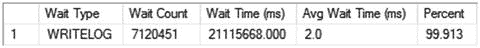
**图 2-7.** 测试期间收集的等待统计信息（使用原生存储过程向内存优化表插入）

通过使用**非持久化**内存优化表运行相同的测试，可以确认磁盘性能是此配置下的限制因素。你可以通过删除并重新创建数据库，并使用 `DURABILITY=SCHEMA_ONLY` 选项创建相同的内存优化表集来实现这一点。无需其他代码更改。

图 2-8 展示了测试期间收集的性能计数器，其中 400 个并发会话调用 `dbo.InsertRequestInfo_NativelyCompiled` 存储过程向非持久化表插入数据。如你所见，在此场景下，在移除 I/O 瓶颈后，我能够完全利用系统上的 CPU，与持久化内存优化表相比，吞吐量又提升了 50%。

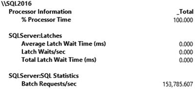
**图 2-8.** 使用原生存储过程向非持久化内存优化表插入数据时的性能计数器

最后值得注意的是，内存 OLTP 使用了不同且更高效的日志记录方式，这导致事务日志占用空间小得多。图 2-9 展示了使用 `sys.dm_io_virtual_file_stats` DMF 在一分钟的测试执行期间收集的日志文件写入统计信息。图中的输出顺序对应于测试运行的顺序：基于磁盘的表插入、通过互操作引擎向内存优化表插入、以及原生存储过程插入。

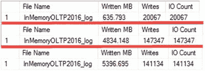
**图 2-9.** 测试期间的事务日志写入统计信息

如你所见，在互操作模式下，内存 OLTP 插入的数据量是原来的 16 倍以上；然而，它在事务日志中占用的空间仅比基于磁盘的表多 7.6 倍。使用原生存储过程的情况甚至更好。尽管它写入日志的数据量比互操作模式多了约 12%，但插入的数据量却多了约 30%。

**注意：** 我将在第 10 章更深入地讨论内存 OLTP 事务日志记录。

显然，不同的场景会导致不同的结果，性能提升在很大程度上取决于硬件、数据库架构、系统用例和工作负载。然而，对于 OLTP 工作负载，通过互操作引擎访问内存优化表时，通常能看到 3 到 5 倍的性能提升；而使用原生存储过程时，可获得 10 到 40 倍的提升。

更重要的是，内存 OLTP 允许你通过向上扩展和升级硬件来提升系统性能。例如，在此场景下，你可以通过增加更多 CPU 和/或提高 I/O 性能来实现更好的吞吐量。这对于基于磁盘的表来说是不可能的，因为锁存争用会成为瓶颈。


## 概述

内存 OLTP 引擎已完全集成到 SQL Server 中，并随产品一起安装。在 SQL Server 2016 RTM 版本中，它是企业版的功能；然而，从 SQL Server 2016 SP1 开始，它在所有版本中均可用。它在 Microsoft Azure SQL Database 的高级层中也可用。不过，您需要记住 SQL Server 非企业版中存在的资源限制。

每个使用内存 OLTP 对象的数据库都应创建一个独立的内存 OLTP 文件组。此文件组应放置在针对顺序 I/O 性能优化的磁盘阵列中。Microsoft Azure SQL Database 不需要也不允许您创建该文件组。

您可以使用常规的 `CREATE TABLE` 语句创建内存优化表，通过将表标记为 `MEMORY_OPTIMIZED` 并指定表持久性选项。具有 `SCHEMA_AND_DATA` 持久性的表中的数据会持久存储在磁盘上。具有 `SCHEMA_ONLY` 持久性的表不会持久存储数据，它们可用作内存中的临时表，提供极快的性能。

您可以通过 `Interop Engine` 从解释型 T-SQL 访问内存优化表，或者从本地编译的模块访问。几乎所有 T-SQL 功能在解释模式下都受支持。另一方面，本地编译模块具有大量的限制。然而，与互操作引擎相比，它们可以带来显著的性能提升。

## 3. 内存优化表

本章详细讨论内存优化表。它展示了内存优化表如何存储其数据以及 SQL Server 如何访问它们。它涵盖了内存优化表中数据行的格式，并讨论了本地编译的过程。

最后，本章概述了 SQL Server 2016 中存在的内存优化表的限制。

### 基于磁盘的表与内存优化表

内存优化表中的数据和索引结构与基于磁盘的表不同。在基于磁盘的表中，数据存储在 8KB 的数据页中，这些页按索引或堆的基准分组在八页的区中。每一页存储一个或多个数据行的数据。此外，当变长列或 LOB 列的数据无法容纳在一个行内页上时，这些数据可以存储在行外的 `ROW_OVERFLOW` 和 `LOB` 数据页上。

基于磁盘的表中的所有页和行都通过文件内偏移量引用，这是 `file_id`、数据页在文件中的偏移量/位置，以及在数据行的情况下，数据行在数据页上的行偏移量/位置的组合。

最后，每个非聚集索引存储其索引键列数据的自己副本，通过行 ID（即聚集索引键值或堆表中行的物理地址（偏移量））引用主行。

图 3-1 和 3-2 说明了这些概念。它们显示了在表上定义的聚集和非聚集索引 B 树。如您所见，页通过文件内偏移量链接。非聚集索引保留数据的单独副本，并通过聚集索引键值引用聚集索引。

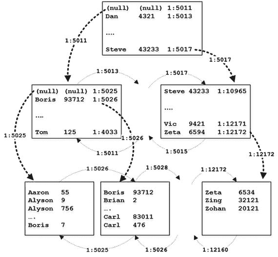
图 3-2. 基于磁盘的表上的非聚集索引

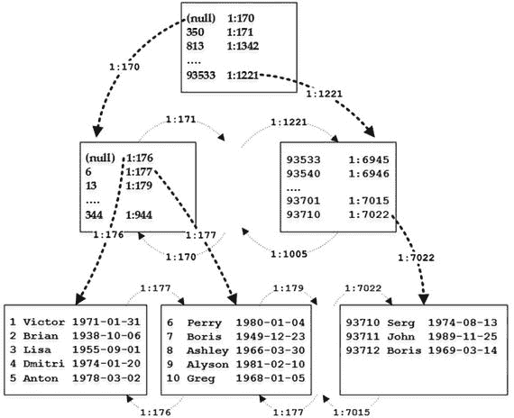
图 3-1. 基于磁盘的表上的聚集索引

每次需要访问页中的数据时，SQL Server 都会将该页的副本加载到内存中，缓存在缓冲池中。然而，缓冲池中数据页的格式和结构不会改变，页仍然使用文件内偏移量相互引用。称为 `Buffer Manager` 的 SQL Server 组件管理缓冲池，它跟踪数据页在内存中的位置，将文件内偏移量转换为页结构的相应内存地址。

考虑 SQL Server 需要扫描索引中多个数据页的情况。工作线程使用 `file_id` 和 `page_id` 从 `Buffer Manager` 请求该页。`Buffer Manager` 则检查该页是否已缓存，并在必要时从磁盘读取。当页被读取和处理后，SQL Server 获取索引中下一页的地址并重复该过程。

SQL Server 也可能需要访问多个页面才能读取单个数据行。这发生在行外存储的情况下，和/或当执行计划使用非聚集索引并发出键或 RID 查找操作，从聚集索引或堆获取数据时。

在缓冲池中定位一个页的过程非常快；但是，它仍然会引入影响查询性能的开销。当数据页不在内存中且需要物理 I/O 操作时，性能影响要大得多。

如您所知，SQL Server 通过闩锁保护数据页的内部一致性，防止多个会话同时修改数据页上的数据。获取和管理这些闩锁也会给系统增加开销。

最后，SQL Server 使用锁来保护数据的事务一致性，在数据行、页和对象级别获取锁。这些锁可能会在系统中引入阻塞，并且它们也会增加与其管理相关的开销。

内存 OLTP 引擎对内存优化表使用了一种完全不同的方法。除了非聚集索引中的 `B-Trees`（我将在第 5 章讨论），内存中的对象不使用数据页。数据行通过内存指针相互引用。每一行都知道链中下一行的内存地址，SQL Server 无需执行任何额外步骤即可定位它。


每个经过内存优化的表都至少有一个行链索引来链接行；因此，每个表都必须至少定义一个索引。对于持久化的内存优化表，则要求创建一个主键约束，这也可以起到这个作用。

为了说明行链的概念，我们来创建如代码清单 3-1 所示的内存优化表。

```sql
create table dbo.People
(
Name varchar(64) not null
constraint PK_People
primary key nonclustered
hash with (bucket_count = 1024),
City varchar(64) not null,
index IDX_City nonclustered hash(City)
with (bucket_count = 1024),
)
with (memory_optimized = on, durability = schema_only);
```

代码清单 3-1. 创建内存优化表

此表在 `Name` 和 `City` 列上定义了两个哈希索引。本章不会深入讨论哈希索引，但作为概述，它们由一个哈希表组成，该表是一个哈希桶的数组，每个桶包含一个指向数据行的内存指针。SQL Server 对索引键列应用哈希函数，函数的结果决定一行属于哪个桶。所有具有相同哈希值并属于同一个桶的行都链接在一个行链中；每一行都有一个指向链中下一行的指针。

**注意**：我将在第 4 章详细讨论哈希索引。

图 3-3 对此进行了说明。实线箭头表示 `Name` 列索引中的指针。虚线箭头表示 `City` 列索引中的指针。为简单起见，我们假设哈希函数根据字符串的第一个字母生成哈希值。每行中显示的两个数字表示行的生存期，我将在本章的下一节中解释。

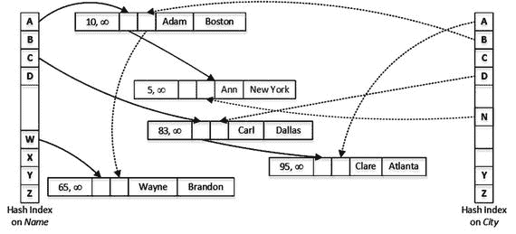

图 3-3. 具有两个哈希索引的内存优化表

与基于磁盘的表不同，内存优化表上的索引不是作为单独的数据结构创建的，而是作为指针嵌入在数据行中，简而言之，这使得每个索引都覆盖行内列。然而，索引不覆盖行外列数据，这些数据存储在单独的内部表中。我将在第 6 章深入讨论它们。

**注意**：准确地说，内存优化表上的非聚集索引和聚集列存储索引会在内存中引入额外的数据结构。我将在第 5 章详细讨论非聚集索引，在第 8 章讨论聚集列存储索引。

## 多版本并发控制简介

正如你在图 3-3 中已经注意到的，内存优化表中的每一行都有两个值，称为 `BeginTs` 和 `EndTs`，它们定义了行的生存期。SQL Server 实例维护全局事务时间戳值，该值在事务提交时自动递增，并且对于每个已提交的事务是唯一的。`BeginTs` 存储插入该行的事务的全局事务时间戳，`EndTs` 存储删除该行的事务的时间戳。对于尚未删除的行，使用一个称为 `Infinity` 的特殊值作为 `EndTs`。

内存优化表中的行永远不会被更新。更新操作会创建行的新版本，将新的全局事务时间戳设置为 `BeginTs`，并通过用相同的值填充 `EndTs` 时间戳来将旧行版本标记为已删除。

当一个新事务启动时，内存 OLTP 会为该事务分配一个逻辑开始时间，这代表了事务启动时的全局事务时间戳值。它决定了该事务可以看到哪些版本的行。事务只有在其逻辑开始时间（事务启动时的全局事务时间戳值）介于行的 `BeginTs` 和 `EndTs` 时间戳之间时，才能看到该行。

为了说明这一点，假设你运行了代码清单 3-2 所示的语句，并在全局事务时间戳值为 100 时提交了该事务。

```sql
update dbo.People
set City = 'Cincinnati'
where Name = 'Ann'
```

代码清单 3-2. 在 dbo.People 表中更新数据

图 3-4 说明了更新事务提交后的表中数据。如图所示，你现在有两行 `Name='Ann'` 但具有不同的生存期。新行被附加到 `Name` 列索引中值 `A` 对应的哈希桶所引用的行链中。`City` 列的哈希索引中 `C` 桶没有引用任何行；因此，新行成为该桶引用的行链中的第一行。

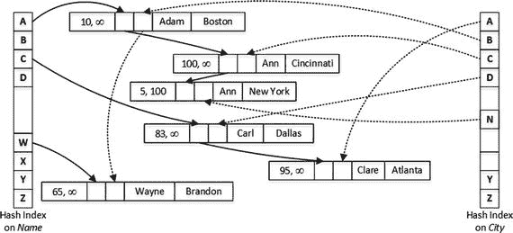

图 3-4. 更新后的表中数据

假设你需要在逻辑开始时间（事务启动时的全局事务时间戳）为 110 的事务中运行一个查询，该查询选择所有 `Name='Ann'` 的行。SQL Server 计算 `Ann` 的哈希值，即 `A`，并在 `Name` 列的哈希索引中找到对应的桶。它跟随从该桶出发的指针，该指针指向一个 `Name='Adam'` 的行。该行的 `BeginTs` 值为 10，`EndTs` 值为 `Infinity`；因此，它对该事务可见。但是，`Name` 值不匹配谓词，因此该行被忽略。

接下来，SQL Server 跟随来自 `Adam` 索引指针数组的指针，该指针指向第一个 `Ann` 行。该行的 `BeginTs` 值为 100，`EndTs` 值为 `Infinity`；因此，它对该事务可见并需要被选中。

作为最后一步，SQL Server 跟随索引中的下一个指针。尽管最后一行也有 `Name='Ann'`，但其 `EndTs` 值为 100，因此对该事务不可见。


正如您应该已经注意到的，这种并发行为和数据一致性对应于 `SNAPSHOT` 事务隔离级别，即每个事务看到的数据都是事务开始时的状态。`SNAPSHOT` 是内存 OLTP 引擎的默认事务隔离级别，该引擎也支持 `REPEATABLE READ` 和 `SERIALIZABLE` 隔离级别。然而，内存 OLTP 中的 `REPEATABLE READ` 和 `SERIALIZABLE` 事务的行为与基于磁盘的表不同。如果违反了 `REPEATABLE READ` 或 `SERIALIZABLE` 数据一致性规则，内存 OLTP 会引发异常并回滚事务，而不是像基于磁盘的表那样阻塞事务。

内存 OLTP 文档还指出，自动提交的（单语句）事务可以在 `READ COMMITTED` 隔离级别下运行。但这有点误导性。SQL Server 在 `SNAPSHOT` 隔离级别下提升并执行此类事务，并且不需要您在代码中显式指定隔离级别。与 `SNAPSHOT` 事务类似，自动提交的 `READ COMMITTED` 事务将看不到事务开始后提交的更改，这与针对基于磁盘的表的 `READ COMMITTED` 事务的行为不同。

> 注意
> 我将在第 7 章讨论内存 OLTP 中的并发模型。

SQL Server 会跟踪系统中的活动事务，并在行的 `EndTs` 早于系统中最老活动事务的逻辑开始时间时检测到过期行。过期行对于系统中的活动事务是不可见的，并最终会从索引行链中移除并由垃圾回收进程释放。

> 注意
> 我将在第 11 章更详细地介绍垃圾回收过程。

## 数据行格式
正如您可以猜到的，内存优化表中数据行的格式与基于磁盘的表完全不同，由两个不同的部分组成：行头和有效负载，如图 3-5 所示。

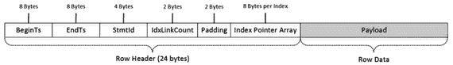

图 3-5.
内存优化表中数据行的结构

您已经熟悉行头中的 `BeginTs` 和 `EndTs` 时间戳。接下来的元素是 `StmtId`，它引用了插入该行的语句。事务中的每个语句都有一个唯一的 4 字节 `StmtId` 值，它作为一种 Halloween 防护技术，允许该语句跳过它刚刚插入的行。

Halloween 防护
Halloween 效应是关系数据库领域中一个已知的问题。它由 IBM 研究人员在 1976 年万圣节前后发现，该现象因此得名。简而言之，它指的是数据修改查询的执行受到其先前所做修改影响的情况。

您可以将以下语句视为 Halloween 问题的经典示例：

```
insert into T
select * from T
```

如果没有 Halloween 防护，这个查询将陷入无限循环，不断读取它刚刚插入的数据并一遍又一遍地插入。

对于基于磁盘的表，SQL Server 通过向执行计划添加 Spool 运算符来实现 Halloween 防护。这些运算符在处理数据之前创建其临时副本。在此示例中，表中的所有数据首先缓存在 Table Spool 中，该 Spool 将作为插入操作的数据源。

`StmtId` 有助于避免内存优化表中的 Halloween 问题。语句检查行的 `StmtId` 值并跳过它们刚刚插入的行。

头中的下一个元素是 2 字节的 `IdxLinkCount`，它指示有多少个索引（指针）引用了该行（或者换句话说，该行参与了多少个索引链）。SQL Server 使用它来检测可由垃圾回收进程释放的行。SQL Server 还会在 `IdxLinkCount` 之后添加 2 字节的空填充，以使行头与 8 字节边界对齐。

8 字节索引指针数组是行头的最后一个元素。正如您已经知道的，每个内存优化表必须至少有一个索引来将数据行链接在一起。在 SQL Server 2016 中，您可以为每个内存优化表定义最多八个索引，包括主键约束。此限制已在 SQL Server 2017 中移除。

实际的行数据存储在行的有效负载部分中。有效负载格式可能因表模式而异。SQL Server 通过为表生成和编译的 DLL（动态链接库）来处理有效负载（本章下一节将详细介绍）。

我想重申，内存 OLTP 的一个关键原则是有效负载数据从不更新。当需要更新表行时，内存 OLTP 通过设置原始行的 `EndTs` 时间戳来删除该行的版本，并插入带有新 `BeginTs` 值和 `EndTs` 值为 `Infinity` 的新数据行版本。


## 内存优化表的本机编译

存储引擎与内存优化 OLTP 引擎之间的一个关键区别在于引擎与数据行的交互方式。基于磁盘的表中的数据始终以三种预定义格式之一存储，这些格式不依赖于表模式，并由索引数据压缩选项控制。

通常，这种方法有其优点和缺点。它极其灵活，允许你修改表，并将修改前后的行版本混合在一起。例如，向表中添加一个新的可空列是元数据级别的操作，不会改变现有行。存储引擎会分析表元数据和不同的行属性，并正确地处理多个行版本。

然而，这种灵活性是有代价的。考虑查询需要访问行中变长列数据的场景。在这种情况下，SQL Server 需要找到行中变长数组部分的偏移量，计算该数组中列数据的偏移量和长度，并在获取所需数据之前分析列数据是存储在行内还是行外。所有这些都可能导致需要执行大量的 CPU 指令。

内存优化 OLTP 引擎采用了一种完全相反的方法。SQL Server 为系统中的每个内存优化表创建并编译单独的 DLL。这些 DLL 被加载到 SQL Server 地址空间中，它们负责访问和操作行有效载荷部分中的数据。内存优化 OLTP 引擎是通用的，并不了解行底层的有效载荷部分；所有数据访问都是通过这些 DLL 完成的，这些 DLL 知晓数据行格式，并经过优化以加速数据访问和操作。

正如你所猜测的，这种方法显著减少了处理开销；然而，它是以降低灵活性为代价的。生成的表 DLL 要求所有行具有相同的结构。更改表会生成新版本的 DLL，并且在大多数情况下，将要求内存优化 OLTP 重新创建表中的所有数据行，将它们转换为新格式。我将在第 10 章深入讨论这一点。

如果表和索引定义不正确，这种限制可能导致可支持性和性能问题。一个这样的例子是错误的哈希索引桶计数定义，它可能导致行链中的行数量过多，从而降低索引性能。我将在第 4 章详细讨论这个问题。

注意

SQL Server 将源代码和编译后的 DLL 放置在 SQL Server `DATA` 目录的 `XTP` 子文件夹中。我将在第 9 章更详细地讨论这些文件和本机编译过程。

## 内存优化表：功能范围与限制

SQL Server 2014 中首次发布的内存优化 OLTP 有一份很长的限制清单。幸运的是，其中许多限制在 SQL Server 2016 中已被移除。

让我们详细看看支持的功能范围和现有的限制。

### 支持的数据类型

SQL Server 2014 中内存优化 OLTP 的最大限制之一是不支持行外存储。当时无法创建行大小超过 8,060 字节的表，也无法使用`(n)varchar(max)`和`varbinary(max)`数据类型。

幸运的是，这一限制在第二代内存优化 OLTP 中已被移除。SQL Server 2016 支持行外存储，并允许数据行超过 8,060 字节。`(n)varchar(max)`和`varbinary(max)`数据类型现在已得到支持。然而，我想重申，行外数据存储在单独的内部表中，可能会降低系统性能。我将在第 6 章详细讨论这一点。

在 SQL Server 2016 版本的内存优化 OLTP 中，仍然有几种数据类型不支持。它们包括：

*   `datetimeoffset`、`rowversion`和`sql_variant`
*   `image`和`(n)text`
*   基于 CLR 的数据类型：`geography`、`geometry`和`hierarchyid`
*   用户定义数据类型
*   `xml`

尽管不支持的数据类型列表并不长，但这些限制仍然可能使现有系统迁移到内存优化 OLTP 变得复杂。在某些情况下，你可以将不支持的数据类型的数据存储在`varbinary(max)`列中，并在代码中将其转换为适当的数据类型。然而，这种方法将要求你使用互操作引擎，并且无法与本机编译一起使用。

### 表功能

内存优化表还有其他一些要求和限制，概述如下：

*   SQL Server 2016 不支持计算列。然而，它们在 SQL Server 2017 中得到支持。
*   不支持稀疏列。
*   `IDENTITY`列的`SEED`和`INCREMENT`值应为(1,1)。
*   内存优化表不能与基于磁盘的表参与`FOREIGN KEY`约束。你可以在内存优化表之间定义外键；但是，它们应该总是引用主键而不是`UNIQUE`约束。
*   不支持对内存优化表创建全文索引。
*   内存优化表不能定义为`FILETABLE`或使用`FILESTREAM`存储。

在 SQL Server 2016 中，每个内存优化表（无论是否持久化）应至少有一个、最多八个索引。此外，持久化的内存优化表应定义一个唯一的主键约束。该约束计入八个索引限制中的一个。SQL Server 2017 移除了八个索引的限制。

同样值得注意的是，参与主键约束的列是不可更新的。你可以作为变通方法，删除旧行并插入新行。

### 数据库级别的限制

内存优化 OLTP 有一些限制影响某些数据库设置和操作。它们包括：

*   你无法在使用内存优化 OLTP 的数据库上创建数据库快照。
*   `AUTO_CLOSE`数据库选项必须设置为`OFF`。
*   不支持`CREATE DATABASE FOR ATTACH_REBUILD_LOG`。
*   `DBCC CHECKDB`会跳过内存优化表。
*   如果调用来检查内存优化表，`DBCC CHECKTABLE`会失败。

注意

你可以在[`https://docs.microsoft.com/en-us/sql/relational-databases/in-memory-oltp/transact-sql-constructs-not-supported-by-in-memory-oltp`](https://docs.microsoft.com/en-us/sql/relational-databases/in-memory-oltp/transact-sql-constructs-not-supported-by-in-memory-oltp)看到完整的限制列表。


## 高可用技术支持

内存优化表在 AlwaysOn 故障转移集群、可用性组以及日志传送中得到全面支持。然而，在故障转移集群的情况下，发生故障转移时，持久内存优化表的数据必须重新加载到内存中，这可能会增加故障转移时间并降低数据库可用性。

在 AlwaysOn 可用性组的情况下，只有持久内存优化表会被复制到辅助节点。如果需要，你可以在可读的辅助节点上访问并查询这些表。

另一方面，非持久内存优化表的数据不会被复制，并且在发生故障转移时将会丢失。在 Microsoft Azure SQL Database 中使用内存 OLTP 时，你应该记住这一行为。Azure 中的瞬态数据库故障转移会擦除非持久内存优化表中的数据。

内存优化表可以参与事务复制。所有其他复制类型，包括点对点复制，则不受支持。

内存 OLTP 在数据库镜像会话中不受支持。不过，这似乎不是一个很大的限制。数据库镜像是一项已弃用的功能，你应该使用 AlwaysOn 可用性组来替代该技术。

## SQL Server 2016 功能支持

内存 OLTP 与许多新的 SQL Server 2016 功能完全集成。让我们列举其中几个。

内存 OLTP 工作负载可以由查询存储捕获。它会自动收集内存 OLTP 对象的查询、计划和优化统计信息，无需任何额外的配置更改。但是，默认情况下不收集运行时统计信息，你需要使用 `sys.sp_xtp_control_query_exec_stats` 存储过程显式启用它们。

请记住，收集运行时统计信息会增加开销，这可能会降低内存 OLTP 工作负载的性能。

**注意**
我将在第 12 章更详细地讨论内存 OLTP 与查询存储的集成。

你可以将系统版本化时态表与内存优化表结合使用，其中使用基于磁盘的历史表来存储旧行版本。当你在内存优化表中启用系统版本控制时，SQL Server 会创建一个暂存内存优化表，并在 `UPDATE` 和 `DELETE` 操作期间同步填充它。暂存表中的数据由一个称为数据冲刷任务的后台进程异步移动到基于磁盘的历史表中。该任务在轻量工作负载下每分钟唤醒一次，在繁重工作负载下可以调整其计划，每五秒运行一次。

默认情况下，当暂存表的大小达到当前内存优化表大小的 8% 时，数据冲刷任务会移动其中的数据。你也可以通过调用 `sys.sp_xtp_flush_temporal_history` 存储过程来强制手动移动数据。

**注意**
你可以在 [`https://docs.microsoft.com/en-us/sql/relational-databases/tables/system-versioned-temporal-tables-with-memory-optimized-tables`](https://docs.microsoft.com/en-us/sql/relational-databases/tables/system-versioned-temporal-tables-with-memory-optimized-tables) 阅读更多关于时态表支持的信息。

内存优化表可以配置行级安全性。配置过程与基于磁盘的表基本相同；但是，用作安全谓词的内联表值函数必须是原生编译的。我将在第 9 章讨论原生编译。

**注意**
你可以在 [`https://docs.microsoft.com/en-us/sql/relational-databases/security/row-level-security`](https://docs.microsoft.com/en-us/sql/relational-databases/security/row-level-security) 阅读更多关于行级安全性的信息。

同样值得注意的是，从 SQL Server 2016 开始，当数据库中启用透明数据加密（TDE）时，内存优化表的数据在磁盘上会被加密。我将在第 10 章讨论内存 OLTP 如何将数据持久化到磁盘。

## 总结

与基于磁盘的表（数据存储在 8KB 数据页中）相反，内存优化表使用常规内存指针将数据行链接到索引行链中。每行有多个指针，每个索引行链一个。在 SQL Server 2016 中，每个表必须至少定义一个，最多八个索引。

SQL Server 实例维护全局事务时间戳值，该值在事务提交时自动递增，并且对于每个已提交的事务是唯一的。每个数据行都有 `BeginTs` 和 `EndTs` 时间戳，定义了行的生命周期。事务只能在其逻辑开始时间（事务启动时的全局事务时间戳值）介于行的 `BeginTs` 和 `EndTs` 时间戳之间时看到该行。

内存优化表中的行数据永远不会被更新。当需要更新表行时，内存 OLTP 会创建具有新 `BeginTs` 值的新版本行，并通过填充其 `EndTs` 时间戳来删除旧行版本。

SQL Server 为系统中的每个内存优化表生成并编译原生 DLL。这些 DLL 被加载到 SQL Server 进程中，它们负责访问和操作行数据。

内存 OLTP 引擎在 AlwaysOn 故障转移集群、可用性组和日志传送中得到全面支持。内存优化表也可以参与事务复制。

内存 OLTP 与许多新的 SQL Server 2016 功能集成。内存优化表可以配置为系统版本化时态表，并且它们也支持行级安全性。查询存储可以捕获内存 OLTP 工作负载的优化和执行统计信息；然而，捕获执行统计信息会给系统带来显著的性能开销。

## 4. 哈希索引

本章讨论哈希索引，这是内存 OLTP 引擎中引入的一种新索引类型。它将展示其内部结构，并解释 SQL Server 如何使用它们。你将了解哈希索引最关键的属性 `bucket_count`，它定义了索引哈希数组中的哈希桶数量。你将看到不正确的桶计数估计如何影响系统性能。

最后，本章讨论了哈希索引的 SARGability 以及内存优化表上的统计信息。


## 哈希概述

哈希是计算机科学中一个广为人知的概念，它将数据转换为短小的、通常是固定长度的值。当你需要优化在大量字符串或二进制数据集中使用等式谓词进行点查找操作时，哈希经常被用到。哈希显著减小了索引键的大小，使索引变得紧凑，这反过来又提升了点查找操作的性能。

一个正确定义的哈希算法，通常称为哈希函数，能提供相对随机的哈希分布。哈希函数总是确定性的，这意味着相同的输入总是生成相同的哈希值。然而，哈希函数不一定保证唯一性，不同的输入值可能生成相同的哈希。这种情况被称为 `冲突`，其发生的可能性很大程度上取决于哈希算法的质量和允许的哈希键范围。例如，一个生成 2 字节哈希的函数，比生成 4 字节哈希的函数，发生冲突的几率要高得多。

哈希表，通常称为哈希映射，是存储哈希键并将其映射回原始数据的数据结构。哈希键被分配到存储桶中，原始数据可以在其中找到。理想情况下，每个唯一的哈希键都存储在一个独立的存储桶中；但是，当表中存储桶的数量不够大时，多个唯一的哈希键完全有可能被放入同一个存储桶中。这种情况被称为哈希冲突。

提示

`HASHBYTES` 函数允许你使用行业标准算法（如 `MD5`、`SHA2_512` 等）在 T-SQL 中生成哈希。然而，由于输出尺寸过大，`HASHBYTES` 函数的输出并不适合用于点查找优化。你可以改用生成 4 字节哈希的 `CHECKSUM` 函数。

你可以为 `CHECKSUM` 函数生成的哈希创建索引，并用它来替代 `uniqueidentifier` 列上的索引。当你需要在大型（超过 900/1,700 字节）字符串或二进制数据上执行点查找操作（这些数据本身无法被索引）时，它也很有用。我在我的书《Pro SQL Server Internals》的第 7 章中讨论了这个场景。

## 关于存储桶数量的深入探讨

在内存 OLTP 引擎中，哈希索引简而言之就是哈希表，其存储桶被实现为预定义大小的数组。每个存储桶包含一个指向数据行的指针。SQL Server 对索引键值应用哈希函数，函数的结果决定了一行属于哪个存储桶。所有具有相同哈希值并属于同一存储桶的行，通过数据行中的索引指针链链接在一起。

图 4-1 展示了一个定义了两个哈希索引的内存优化表示例。你在上一章见过这个图；这里再次显示以供参考。请记住，在这个例子中，你假设一个哈希函数根据字符串的第一个字母生成哈希值。显然，内存 OLTP 中实际使用的哈希函数要随机得多，并且不使用基于字符的哈希。


图 4-1.
带有两个哈希索引的内存优化表

存储桶的数量是决定哈希索引性能的关键因素。一个高效的哈希函数可以让你避免在生成哈希键时发生大多数冲突；然而，当存储桶数量不足且 SQL Server 不得不将不同的哈希值存储在同一个存储桶中时，哈希表中仍然会出现冲突。这些冲突会导致更长的行链；这要求 SQL Server 在查询处理过程中需要通过这些链接扫描更多的行。

### 存储桶数量与性能

让我们考虑一个基于字符串前两个字母生成哈希的哈希函数，它可以返回 26 * 26 = 676 个不同的哈希键。这是一个纯粹的假设性示例，仅用于说明目的。

假设哈希表可以容纳所有 676 个不同的哈希存储桶，并且你拥有图 4-2 所示的数据，那么当你运行一个查找特定值的查询时，最多需要在链中遍历两行。

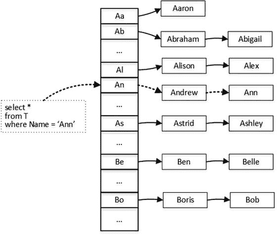

图 4-2.
哈希表查找：676 个存储桶

图 4-2 中的虚线箭头说明了查找 `Ann` 相关行所需的步骤。该过程需要你在表中找到正确的哈希存储桶后，遍历两行。

但是，如果你的哈希表没有足够的存储桶来分离唯一的哈希键，情况就会发生变化。图 4-3 说明了当哈希表只有 26 个存储桶且每个存储桶存储多个不同哈希键时的情形。现在，同样的 `Ann` 行查找需要你遍历总共九行的链。

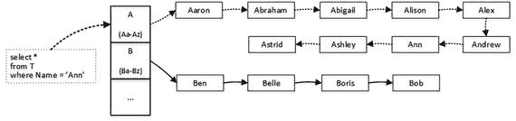

图 4-3.
哈希表查找：26 个存储桶

同样的原则适用于哈希索引，选择错误的存储桶数量可能导致严重的性能问题。

让我们创建两个非持久化的内存优化表，并如清单 4-1 所示，分别填充 1,000,000 行数据。这两个表具有相同的架构，其主键约束定义为哈希索引。索引中的存储桶数量由 `bucket_count` 属性控制。然而，在内部，SQL Server 会将提供的值向上取整到 2 的下一个幂，因此 `dbo.HashIndex_HighBucketCount` 表的索引将具有 1,048,576 个存储桶，而 `dbo.HashIndex_LowBucketCount` 表将具有 1,024 个存储桶。

```
create table dbo.HashIndex_LowBucketCount
(
Id int not null
constraint PK_HashIndex_LowBucketCount
primary key nonclustered
hash with (bucket_count=1000),
Value int not null
)
with (memory_optimized=on, durability=schema_only);
create table dbo.HashIndex_HighBucketCount
(
Id int not null
constraint PK_HashIndex_HighBucketCount
primary key nonclustered
hash with (bucket_count=1000000),
Value int not null
)
with (memory_optimized=on, durability=schema_only);
go
;with N1(C) as (select 0 union all select 0) -- 2 rows
,N2(C) as (select 0 from N1 as t1 cross join N1 as t2) -- 4 rows
,N3(C) as (select 0 from N2 as t1 cross join N2 as t2) -- 16 rows
,N4(C) as (select 0 from N3 as t1 cross join N3 as t2) -- 256 rows
,N5(C) as (select 0 from N4 as t1 cross join N4 as t2) -- 65,536 rows
,N6(C) as (select 0 from N5 as t1 cross join N3 as t2) -- 1,048,576 rows
,Ids(Id) as (select row_number() over (order by (select null)) from N6)
insert into dbo.HashIndex_HighBucketCount(Id, Value)
select Id, Id
from ids
where Id <= 1000000;
;with N1(C) as (select 0 union all select 0) -- 2 rows
,N2(C) as (select 0 from N1 as t1 cross join N1 as t2) -- 4 rows
,N3(C) as (select 0 from N2 as t1 cross join N2 as t2) -- 16 rows
,N4(C) as (select 0 from N3 as t1 cross join N3 as t2) -- 256 rows
,N5(C) as (select 0 from N4 as t1 cross join N4 as t2) -- 65,536 rows
,N6(C) as (select 0 from N5 as t1 cross join N3 as t2) -- 1,048,576 rows
,Ids(Id) as (select row_number() over (order by (select null)) from N6)
insert into dbo.HashIndex_LowBucketCount(Id, Value)
select Id, Id
from ids
where Id <= 1000000;
Listing 4-1.
bucket_count 与性能：创建内存优化表
```


