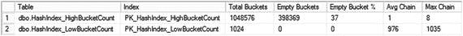

# 图 4-4. sys.dm_db_xtp_hash_index_stats 输出

图 4-4 展示了该查询的输出。如你所见，`dbo.HashIndex_HighBucketCount` 表的行链中平均每行只有一行，而 `dbo.HashIndex_LowBucketCount` 表的每个链中几乎有 1,000 行。值得注意的是，尽管内存中 OLTP 使用的哈希函数提供了相对良好的随机数据分布，但仍存在一定水平的哈希冲突。

不正确的桶计数估算和过长的行链会显著影响读取和写入查询的性能。你已经看到了插入操作的性能影响。现在让我们看一个 `SELECT` 查询。

